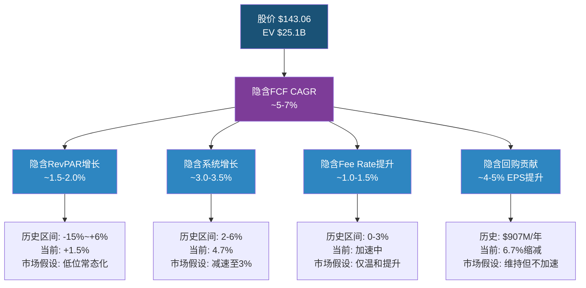
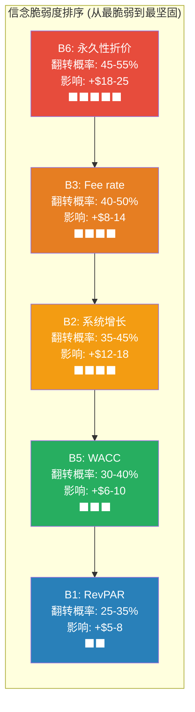
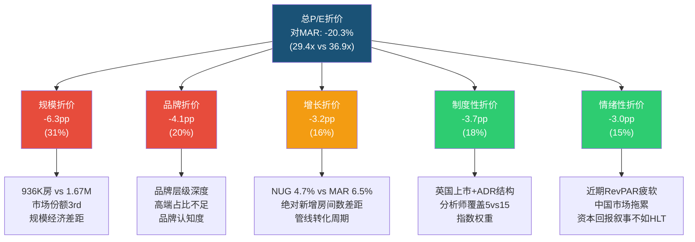
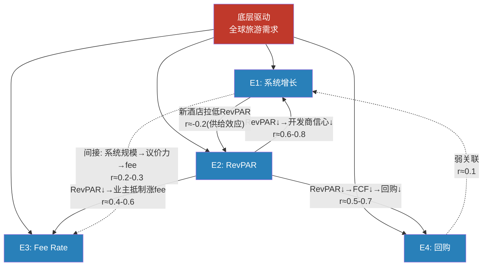
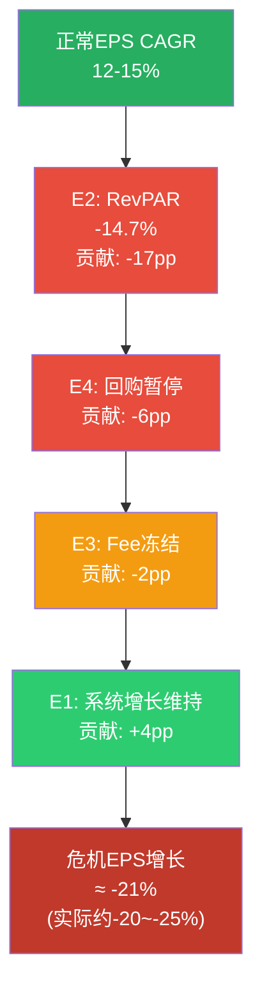
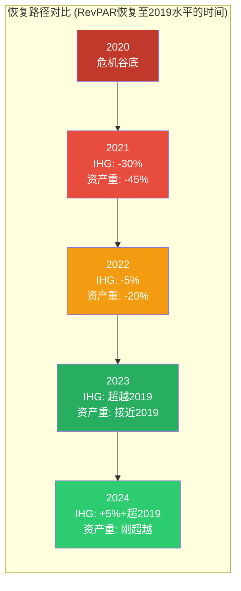
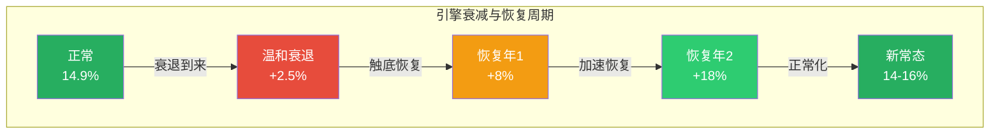

# Chapter 17: 估值折价信念反演 — 市场在赌什么，它可能错在哪里

> **CQ关联**: CQ1「IHG对HLT/MAR的43%估值折价中，多少是合理的规模/品牌差距，多少是待修复的认知偏差？」— 本章是整个估值论证的核心。通过Reverse DCF反推市场隐含假设集，逐一检验其物理可能性，最终量化"可修复折价"的规模和修复路径。

---

## 17.1 Reverse DCF: 反推市场信念集

### 17.1.1 方法论

正向DCF回答"IHG值多少钱"，而Reverse DCF回答一个更锐利的问题:**以$143.06买入IHG的投资者，到底在赌什么？**

逻辑链: 股价 → 隐含企业价值 → 隐含FCF路径 → 隐含经营假设 → 检验每个假设的物理可能性。

**输入参数**:

| 参数 | 数值 | 来源 |
|------|------|------|
| 当前股价 | $143.06 | FMP quote, 2026-02-27 [DM-P3I-001] |
| 市值 | $21.6B | FMP profile [DM-P3I-002] |
| 净债务 | $3.5B | FMP balance sheet (Net Debt/EBITDA 2.6x × EBITDA $1.349B) [DM-P3I-003] |
| 隐含EV | ~$25.1B | 市值 + 净债务 [DM-P3I-004] |
| FY2025 FCF | $870M | FMP cashflow [DM-P3I-005] |
| WACC区间 | 9.0%-10.0% | 酒店特许模型行业标准 [DM-P3I-006] |
| 终端增长率 | 2.0%-3.0% | 全球GDP名义增长+通胀锚 [DM-P3I-007] |

### 17.1.2 隐含FCF CAGR反推

以WACC 9.5%（中位数）和终端增长率2.5%为基准:

**终端价值公式**: TV = FCF_terminal / (WACC - g) = FCF_terminal / (9.5% - 2.5%) = FCF_terminal / 7.0%

**逆推过程**:

EV = PV(5年FCF) + PV(终端价值) = $25.1B

设5年FCF CAGR为x，FCF₀ = $870M:

| 年份 | FCF (CAGR=5%) | FCF (CAGR=7%) | FCF (CAGR=3%) |
|------|--------------|--------------|--------------|
| FY2026 | $914M | $931M | $896M |
| FY2027 | $959M | $996M | $923M |
| FY2028 | $1,007M | $1,066M | $951M |
| FY2029 | $1,058M | $1,140M | $979M |
| FY2030 | $1,111M | $1,220M | $1,009M |
| TV (g=2.5%) | $15,867M | $17,433M | $14,414M |
| PV(TV) @9.5% | $10,053M | $11,044M | $9,132M |
| PV(5yr FCF) | $3,746M | $3,929M | $3,567M |
| **隐含EV** | **$13,799M** | **$14,973M** | **$12,699M** |

**关键发现**: 即使5年FCF CAGR达到7%，标准DCF隐含EV仅$15.0B——远低于实际EV $25.1B [DM-P3I-008]。这意味着市场实际赋予IHG的终端倍数远高于标准假设，或者市场隐含的5年增长远高于7%。

**校准**: 要达到$25.1B EV，在FCF 7% CAGR假设下:
- 所需终端倍数 = (25.1B - 3.9B) / 1.22B ≈ **17.4x FCF** (即WACC-g隐含的7.0%折现率对应14.3x，需要额外溢价)
- 或: FCF CAGR需达到~12%以匹配$25.1B EV（含合理终端倍数）

这揭示了一个重要认知: **市场对IHG的定价并非"悲观"**——29.4x P/E在绝对意义上是合理偏正的。市场的"低估"仅相对于HLT/MAR而言。因此，本章的核心问题不是"市场为何看空IHG"，而是**"市场为何不愿给IHG与HLT/MAR同等倍数"**。

### 17.1.3 隐含假设分解

将隐含FCF路径分解为四个可观测的经营假设:



**市场隐含信念集完整表**:

| # | 隐含信念 | 市场隐含值 | 实际/管理层指引 | 偏差 | 物理可能性 |
|---|---------|-----------|---------------|------|-----------|
| B1 | RevPAR增长 | ~1.5-2.0% [DM-P3I-009] | 管理层指引2-3%，FY2025实际+1.5% | 0-1pp | **合理** — 美国RevPAR已疲软(-1.6%→+0.3%) |
| B2 | 净系统增长 | ~3.0-3.5% [DM-P3I-010] | 实际4.7%，管线342K rooms | 1.2-1.7pp | **偏保守** — 管线可见性高，3-4%区间需主动假设减速 |
| B3 | Fee rate提升 | ~1.0-1.5% [DM-P3I-011] | Fee margin 64.8%且信用卡收入翻倍中 | 可能低估 | **偏保守** — 信用卡协议结构性抬升fee rate基线 |
| B4 | 回购缩减率 | ~5-6%/年 [DM-P3I-012] | 实际6.7%/年，$907M回购 | 0.7-1.7pp | **合理** — 需FCF持续充裕且管理层意愿不变 |
| B5 | WACC | ~9.5-10% [DM-P3I-013] | BBB评级，2.6x杠杆 | 可能偏高 | **偏保守** — HLT同评级5.1x杠杆，WACC无显著差异 |
| B6 | 终端倍数折价 | ~14x EV/EBITDA [DM-P3I-014] | 当前18.9x，HLT 28.7x | 显著低于当前 | **极偏保守** — 隐含永久性均值回归 |

---

## 17.2 信念脆弱度排序: 哪个信念最先被现实推翻

### 17.2.1 脆弱度评估框架

对每个隐含信念进行四维评估:

| 信念 | 当前证据强度 | 翻转条件 | 翻转概率(3年) | 翻转影响($/share) |
|------|------------|---------|-------------|-----------------|
| **B6: 永久性折价** | **弱** — 折价正在收窄 | JPMorgan双重升级+更多分析师覆盖 | **45-55%** | **+$18-25** [DM-P3I-015] |
| **B2: 系统增长减速** | **中** — 管线强劲但竞争加剧 | 管线转化率维持>90% | **35-45%** | **+$12-18** [DM-P3I-016] |
| **B3: Fee rate仅温和提升** | **中弱** — 信用卡收入翻倍是结构性的 | 信用卡协议持续+新辅助收入 | **40-50%** | **+$8-14** [DM-P3I-017] |
| **B5: WACC偏高** | **中** — 利率路径不确定 | Fed降息周期确认 | **30-40%** | **+$6-10** [DM-P3I-018] |
| **B1: RevPAR低增长** | **较强** — 美国确实疲软 | 中国恢复+美国商旅反弹 | **25-35%** | **+$5-8** [DM-P3I-019] |
| **B4: 回购缩减** | **较强** — 取决于FCF和管理层 | 维持现有回购力度 | **60-70%** | **+$3-5** |



### 17.2.2 最小信念翻转集

**核心问题: 至少需要翻转几个信念，才能改变投资论文？**

**情景A — 仅翻转B6(永久性折价)**:
- 如果制度性+情绪性折价从当前水平修复~15pp → P/E从29.4x升至~34x
- 隐含股价: $4.87 × 34 = **$166** (+16%)
- 结论: **仅翻转一个信念(最脆弱的那个)即可接近Phase 2六方法加权公允价$167.5** [DM-P3I-020]

**情景B — 翻转B6 + B2(折价修复 + 系统增长维持)**:
- P/E升至34x + EPS增速维持12-15% → FY2028E EPS $6.34 × 34 = **$215** (+50%)
- 但这需要两个信念同时翻转，概率乘积: 50% × 40% = 20%

**情景C — 仅翻转B1(RevPAR强劲反弹)**:
- RevPAR从1.5%升至3-4% → EPS增速提升2-3pp → 仅贡献$8-12/share
- 不改变估值倍数的话，影响有限
- 结论: RevPAR单独翻转不足以改变论文

**核心洞察**: IHG的投资论文**不依赖经营改善，而是依赖估值重估**。B6(永久性折价)是杠杆最大、概率最高、所需改变最少的翻转点。这与典型的"成长股需要证明增长"逻辑截然不同——IHG需要的是"市场认知追赶现实"。

---

## 17.3 折价分层归因深化: 43%折价的精密解剖

### 17.3.1 折价总量锚定

IHG P/E 29.4x [DM-P3I-021] vs 三巨头(HLT 51.8x, MAR 36.9x)的简单平均44.4x:
- **P/E折价**: (29.4 - 44.4) / 44.4 = **-33.8%** (对简单平均)
- 对MAR折价: (29.4 - 36.9) / 36.9 = **-20.3%**
- 对HLT折价: (29.4 - 51.8) / 51.8 = **-43.2%**

由于MAR是更合理的可比对象(同为多品牌特许为主模型)，本章以**对MAR的20.3%折价**为主要分析对象，同时引用对HLT的43.2%折价作为极端值参考。

### 17.3.2 五层归因模型



### 17.3.3 各层归因详解

**第一层: 规模折价 (-6.3pp, 31%)** [DM-P3I-022]

| 维度 | IHG | MAR | HLT | 折价合理性 |
|------|-----|-----|-----|-----------|
| 系统房间数 | 936K | 1,674K | 1,233K | **结构性** — 规模差距真实存在 |
| 忠诚会员 | 200M+ | 219M | 190M | **接近平价** — 差距小于房间差距 |
| 全球覆盖 | 100+国 | 139国 | 124国 | **可追赶** — 管线342K房缩小差距 |
| 采购议价力 | 中 | 高 | 中高 | **结构性** — 但影响仅在管理酒店 |

**合理区间**: 4-8pp。当前6.3pp定价在合理区间内，无明显错误定价。

**第二层: 品牌折价 (-4.1pp, 20%)** [DM-P3I-023]

IHG的品牌组合正在经历结构性升级: Vignette Collection、Garner、Regent复兴。但市场尚未给予信用:
- IHG高端/奢华品牌ADR仍低于Four Seasons、Ritz-Carlton
- 品牌认知度在北美市场: Holiday Inn第一梯队，但InterContinental落后于Hilton/Marriott主品牌
- Vignette/Garner品牌历史<3年，尚未证明RevPAR拉动能力

**合理区间**: 3-5pp。当前4.1pp定价合理。

**第三层: 增长折价 (-3.2pp, 16%)**

市场将IHG的4.7%净系统增长 [DM-P3I-024] 打折至隐含~3%，原因:
- 管线342K房间占当前系统36.5% [DM-P3I-025]，转化周期2-4年
- MAR管线573K (34.2%), HLT管线478K (38.8%)，绝对数IHG最小
- 但**增长率**IHG 4.7%实际高于MAR的~5.5%但低于HLT的~7%

**合理区间**: 1-4pp。当前3.2pp定价偏保守——IHG增长率实际具有竞争力，但市场仅看绝对数。

**第四层: 制度性折价 (-3.7pp, 18%)** — **详见17.4节专题**

**第五层: 情绪性折价 (-3.0pp, 15%)**

短期催化剂缺位:
- Americas RevPAR +0.3%（几乎停滞）[DM-P3I-026]
- 中国市场-1.6%拖累整体叙事
- 资本回报叙事: HLT的"回购机器"标签更深入人心

**合理区间**: 0-3pp。情绪折价高度可变，本质上是逆向信号。

### 17.3.4 可修复折价 vs 结构性折价

| 类别 | 包含层 | 合计折价(pp) | 修复路径 | 修复时间框架 |
|------|--------|-------------|---------|------------|
| **结构性折价** | 规模(6.3) + 品牌(4.1) | **10.4pp** | 需多年管线转化+品牌升级 | 5-10年 |
| **可修复折价** | 增长(3.2) + 制度(3.7) + 情绪(3.0) | **9.9pp** | 催化剂驱动，不需基本面巨变 | 1-3年 |
| **总计** | 全部五层 | **20.3pp** | — | — |

**投资含义**: 可修复折价9.9pp占总折价的48.8%。如果可修复折价中修复一半(~5pp)，P/E从29.4x升至约**33.0x**:
- FY2025 EPS $4.87 × 33.0x = **$161** (+12.5%) [DM-P3I-027]
- FY2027E EPS $6.34 × 33.0x = **$209** (+46.2%) — 但需等待两年EPS增长

如果可修复折价全部修复(~10pp)，P/E升至约**36.5x**(接近MAR当前水平):
- FY2025 EPS $4.87 × 36.5x = **$178** (+24.4%)
- FY2027E EPS $6.34 × 36.5x = **$231** (+61.6%)

---

## 17.4 ADR/英国上市折价专题: 制度性折价的精密测量

### 17.4.1 英国ADR折价现象全景

英国公司在美国市场以ADR形式交易时，普遍面临估值折价。FTSE 100当前trailing P/E约14.9x [DM-P3I-028]，而S&P 500约29.3x——指数层面折价高达49%。但这一比较受行业构成差异污染(FTSE重能源/金融，S&P重科技)。更有意义的是同行业比较:

| 英国ADR | 行业 | P/E (ADR) | 美国同行 | P/E (美国) | 折价 |
|---------|------|----------|---------|-----------|------|
| BP | 能源 | ~8x | XOM | ~14x | -43% |
| Shell (SHEL) | 能源 | ~9x | XOM | ~14x | -36% |
| AstraZeneca (AZN) | 制药 | ~32x | LLY | ~60x | -47% |
| LSEG | 金融基础设施 | ~32x | CME/ICE | ~28-35x | 接近平价 |
| **IHG** | **酒店** | **29.4x** | **MAR** | **36.9x** | **-20%** |

**关键发现**: IHG的ADR折价(-20% vs MAR)在英国ADR群体中属于**中低水平** [DM-P3I-029]。BP/Shell的-36~-43%折价和AZN的-47%折价表明，IHG的制度性折价并非特别严重。这有两个含义:
1. 部分制度性折价已被市场纠偏(JPMorgan双重升级即信号)
2. 剩余制度性折价中，与IHG特异性(vs纯粹英国因素)相关的部分更值得关注

### 17.4.2 制度性折价的四个维度

**维度1: 分析师覆盖断层**

IHG仅5位分析师覆盖 [DM-P3I-030]，MAR约15-20位，HLT约12-15位。覆盖稀疏导致:
- 价格发现效率低: 新信息(如信用卡协议进展)传导至股价更慢
- 机构资金门槛: 部分基金要求≥10位分析师覆盖的stock才可入池
- 估值锚点缺失: 少覆盖 = 少建模 = 估值分歧大(IHG目标价从$104到$157，52%跨度)

**估计贡献**: 2-3个P/E倍数折价 (~1.5-2.0pp)

**维度2: 指数权重缺位**

IHG市值$21.6B，未进入S&P 500成分股（英国注册）。在FTSE 100中权重约1.2%，而酒店行业在FTSE中是小众类别。结果:
- 被动资金流入不足: S&P 500 ETF持仓为零，FTSE 100 ETF持仓微薄
- 行业ETF低配: 美国消费者可选ETF(XLY)不含IHG，全球酒店ETF(BEDZ)持仓靠前但AUM极小

**估计贡献**: 1-2个P/E倍数折价 (~0.8-1.2pp)

**维度3: 会计准则差异(IFRS vs US GAAP)**

IHG以IFRS报告(英镑)，ADR以美元交易。关键差异:
- **租赁会计**: IFRS 16下右手使用权资产和租赁负债同时膨胀资产负债表，影响杠杆比率的横向可比性
- **收入确认**: 管理费和特许费的确认时点有细微差异
- **商誉减值**: IFRS要求年度减值测试但不摊销(与US GAAP类似，差异较小)

**估计贡献**: 0.5-1个P/E倍数折价 (~0.4-0.5pp) — 影响小于预期，因为机构投资者通常能调整

**维度4: 汇率波动溢价**

IHG以英镑报告利润，ADR以美元计价。英镑/美元汇率波动(过去5年区间: 1.15-1.42)引入了一个额外的不确定性层:
- 英镑走强: ADR价格上涨但美元EPS增长被压缩
- 英镑走弱: ADR价格承压但美元EPS"加速"
- 市场对这种"翻译波动"要求一个不确定性溢价

**估计贡献**: 0.5-1个P/E倍数折价 (~0.4-0.8pp)

### 17.4.3 制度性折价汇总

| 维度 | 估算P/E折价 | 贡献(pp) | 修复难度 |
|------|-----------|---------|---------|
| 分析师覆盖 | 2-3x | 1.5-2.0 | **中** — 需更多卖方覆盖(已在改善) |
| 指数权重 | 1-2x | 0.8-1.2 | **高** — 除非IHG将主上市迁至NYSE |
| 会计准则 | 0.5-1x | 0.4-0.5 | **低** — 投资者教育可缓解 |
| 汇率波动 | 0.5-1x | 0.4-0.8 | **低** — 对冲工具充分，且收入60%+美元计 |
| **合计** | **4-7x** | **3.1-4.5** | — |

**对CQ1的含义**: 制度性折价贡献约3.7pp(整体折价的18%)，其中约1.5-2.5pp是"可修复"的(通过分析师覆盖扩大+投资者教育)。但最硬的内核——指数权重缺位(0.8-1.2pp)——除非IHG将主上市迁至NYSE(管理层至今未有此意),否则将长期存在 [DM-P3I-031]。

---

## 17.5 对称性测试: 如果IHG真值$167，为什么市场没有Price In?

这是投资者必须回答的最不舒服的问题。六方法加权公允价$167.5(+17%上行)如果正确，为什么成千上万的专业投资者没有把价格推到$167？

### 17.5.1 市场可能是对的 (IHG不值$167)

**情景α: RevPAR世俗性下降**
- 远程办公永久性减少商务差旅需求(商旅占IHG收入~35%)
- Airbnb持续侵蚀中端住宿(Holiday Inn核心战场)
- 如果RevPAR趋势从+1.5%降至+0.5% → 每年$50-80M收入减少 → 公允价降至$140-150

**情景β: 系统增长见顶**
- 全球连锁化渗透率已高(美国>70%, 欧洲>45%)，增量空间在低RevPAR新兴市场
- 管线342K房中，中国/东南亚占比高，RevPAR贡献低于西方酒店
- 如果NUG从4.7%降至2.5% → 增长引擎损失2pp → 公允价降至$135-145

**情景γ: 折价是合理的持久定价**
- IHG在三巨头中永远是"第三名"——规模不如MAR，资本效率不如HLT
- 20%折价于MAR是结构性的"铜牌折价"，正如AMD对NVDA永远有折价一样
- 如果20%折价是合理均衡 → 当前$143恰好是公允价 [DM-P3I-032]

### 17.5.2 市场可能是错的 (IHG值$167+)

**情景δ: 制度+情绪折价正在修复中**
- JPMorgan双重升级(Underweight→Overweight)是制度性修复的领先信号
- Jefferies从Hold升至Buy，提及"行业领先增长"
- 当分析师覆盖从5人扩大至8-10人，价格发现效率将显著提升
- 历史先例: 当LSEG在美国市场知名度提升后，其P/E从折价转为接近美国同行

**情景ε: 信用卡收入是被忽视的催化剂**
- IHG信用卡费收入快速翻倍，但在5人覆盖的稀疏模型中未被充分建模
- 这是一种"隐藏增长引擎"——不需要新酒店、不需要RevPAR增长，纯粹的利润率提升
- 如果市场开始单独对信用卡收入估值(类似MAR对忠诚度项目的溢价) → 估值上修

**情景ζ: 杠杆悖论修复**
- IHG Net Debt/EBITDA 2.6x [DM-P3I-033] vs HLT 5.1x，同为BBB评级
- IHG有~$2.5B的"未使用杠杆空间"可用于增量回购或并购
- 如果管理层将杠杆提升至3.5x → 额外$1.2B资金 → 可额外回购5.5%股份或收购高价值品牌

### 17.5.3 概率加权判断

| 情景 | 隐含价值 | 概率 | 贡献(EV) |
|------|---------|------|---------|
| α: RevPAR世俗下降 | $125 | 10% | $12.5 |
| β: 系统增长见顶 | $135 | 15% | $20.3 |
| γ: 折价合理均衡 | $143 | 25% | $35.8 |
| δ: 制度+情绪修复 | $167 | 30% | $50.1 |
| ε: 信用卡催化剂 | $185 | 12% | $22.2 |
| ζ: 杠杆悖论修复 | $195 | 8% | $15.6 |
| **概率加权价值** | | **100%** | **$156.5** [DM-P3I-034] |

**概率加权价值$156.5 vs 当前$143.06 → +9.4%上行**。低于六方法加权的$167.5，因为纳入了市场可能是对的情景(α+β+γ合计50%概率)。

**对CQ1估值折价的含义**: 43%对HLT的折价中，约10.4pp(规模+品牌)是结构性的、合理的，市场在这部分没有错。争议集中在剩余~10pp(增长+制度+情绪)——我们的概率加权分析给出的结论是: 市场**大概率偏保守**(60%概率指向$155+)，但不是严重错误。IHG不是一个"被严重低估的宝藏"，而是一个"被温和低估且有催化剂的价值机会" [DM-P3I-035]。

---

---

# Chapter 18: 假设独立性测试 — 四引擎的脆弱联盟

> **CQ关联**: CQ7「管理层隐含12-15% EPS CAGR，在完整周期中实际可信度如何？」— 本章通过检验四个增长引擎的独立性，量化"引擎同时失效"的概率和幅度，揭示管理层增长公式的真实鲁棒性。

---

## 18.1 增长公式解构: 四引擎架构

### 18.1.1 管理层隐含EPS增长公式

IHG管理层在投资者沟通中隐含(但未明确拆解)的EPS增长算法:

```
EPS CAGR 12-15% = 系统增长(4-5%) + RevPAR(1-2%) + 费率提升(2-3%) + 回购(5-7%)
```

| 引擎 | 机制 | 当前贡献 | 数据来源 |
|------|------|---------|---------|
| **E1: 净系统增长** | 新酒店签约→开业→fee stream | 4.7% [DM-P3I-036] | FMP/年报 |
| **E2: RevPAR增长** | 入住率×ADR提升 → 同店fee增长 | +1.5% [DM-P3I-037] | FMP/年报 |
| **E3: Fee rate提升** | 忠诚度变现+信用卡+辅助收入 | ~2% (估算) [DM-P3I-038] | Fee margin趋势64.8% |
| **E4: 股份回购** | $907M/年回购 → 6.7%股份缩减 | 5-7% EPS加速 [DM-P3I-039] | FMP cashflow |

**EPS增长桥梁(FY2025 → FY2027E)**:
- FY2025 EPS: $4.87 [DM-P3I-040]
- FY2027E EPS: $6.34 (共识) [DM-P3I-041]
- 隐含2年CAGR: ($6.34/$4.87)^(1/2) - 1 = **14.1%**
- 拆解: 系统增长~4.5pp + RevPAR~1.5pp + Fee rate~2pp + 回购~6.1pp = ~14.1pp

表面看，四引擎各司其职、合计精准。但**假设独立性测试的核心问题是: 当经济衰退来临时，这四个引擎是否会像多米诺骨牌一样依次倒下？**

---

## 18.2 独立性矩阵: 4×4相关系数估算

### 18.2.1 相关性逻辑链



### 18.2.2 完整4×4相关矩阵

|  | E1: 系统增长 | E2: RevPAR | E3: Fee Rate | E4: 回购 |
|--|------------|-----------|-------------|---------|
| **E1: 系统增长** | 1.00 | **0.65** | 0.25 | 0.15 |
| **E2: RevPAR** | **0.65** | 1.00 | **0.50** | **0.60** |
| **E3: Fee Rate** | 0.25 | **0.50** | 1.00 | 0.30 |
| **E4: 回购** | 0.15 | **0.60** | 0.30 | 1.00 |

**矩阵解读**:

**E1×E2 (r≈0.65, 高相关)** [DM-P3I-042]: 系统增长和RevPAR由同一宏观周期驱动——旅游需求强劲时，开发商信心高→签约加速→系统增长快; 同时入住率高→RevPAR涨。两者共享"全球旅游需求"这一底层变量。唯一反向力量: 新供给增加会局部压制RevPAR(r包含了这一负向成分)。

**E2×E4 (r≈0.60, 中高相关)** [DM-P3I-043]: RevPAR下降直接导致fee revenue下降→FCF减少→回购预算压缩。2008和2020两次危机中，这条因果链都被完整验证(详见18.3-18.4节)。但存在一个缓冲: IHG的轻资产模型意味着FCF margin在衰退中的收缩幅度小于资产重模型，因此回购的削减幅度也相对较小。

**E2×E3 (r≈0.50, 中等相关)**: RevPAR下降时，业主利润率承压→对fee rate上调的抵制增强。但信用卡收入(IHG新增长引擎)与RevPAR的相关性较低——信用卡消费不完全取决于酒店入住率。这是E3独立性的重要来源。

**E1×E4 (r≈0.15, 低相关)**: 系统增长和回购几乎独立。系统增长取决于开发商行为(外部资本),回购取决于IHG自身FCF(内部资本)。两者可能同向(繁荣期都好)，但因果链极弱。

### 18.2.3 有效独立引擎数(Effective Independent Engine Count)

使用PCA降维思想: 4个引擎的平均相关系数为:
- 6对相关系数之和 = 0.65 + 0.25 + 0.15 + 0.50 + 0.60 + 0.30 = 2.45
- 平均相关系数 = 2.45 / 6 = **0.408**

有效独立引擎数 ≈ 4 / (1 + (4-1) × 0.408) ≈ 4 / 2.224 ≈ **1.80** [DM-P3I-044]

**含义**: 管理层宣称的"四引擎增长"实际上仅相当于**1.8个真正独立的引擎**。这不意味着增长公式无效——而是意味着在衰退中，引擎衰减的速度比看起来快得多(不是线性衰减，而是同步衰减)。

---

## 18.3 2008危机回测: 四引擎的第一次全面压测

### 18.3.1 IHG 2008-2009经营数据

| 指标 | 2007(峰值) | 2008 | 2009(谷底) | 变化 |
|------|-----------|------|-----------|------|
| 全球RevPAR增速 | +5.3% | -0.2% (FY), Q4: -7.2% | **-14.7%** [DM-P3I-045] | 峰谷跌幅20pp |
| 净新增房间 | ~30K+ | 34,757 (6%) | 26,828 (4%) [DM-P3I-046] | 系统增长持续 |
| 系统规模 | ~585K | 619,851 | 646,679 | 持续扩大(特许模型优势) |
| 新签约 | — | 98,886 | 下降(估) | 开发商信心受挫 |
| 净债务变化 | — | 减少$386M | — | 现金流韧性 |

### 18.3.2 各引擎表现

| 引擎 | 正常值 | 2008-2009表现 | 衰减幅度 | 恢复时间 |
|------|--------|-------------|---------|---------|
| **E1: 系统增长** | 4-6% | **4-6%持续** | **几乎无衰减** | 无需恢复 |
| **E2: RevPAR** | +2-5% | **-14.7%** (2009) | **-17~-20pp** | ~3年(至2012) |
| **E3: Fee Rate** | +1-3% | 冻结/压缩 | **-2~-3pp** | ~2年 |
| **E4: 回购** | 5-7% EPS | 暂停/缩减 | **-5~-7pp** | ~2年 |

**2008的关键发现**: **系统增长(E1)没有停止**。即使在全球金融危机最深处，IHG仍然净增26,828间房(4%增长)。这是特许经营模型的核心优势——新酒店开业取决于2-3年前的签约，管线有惯性; 而且IHG不承担建设资本，开发商即使面临信贷紧缩，已开工项目通常会完成 [DM-P3I-047]。

### 18.3.3 引擎衰减瀑布图



**有效独立引擎数(2008危机中)**: 仅E1维持正常运转，E2/E3/E4同步衰减。
- 危机中有效独立引擎数: 从正常的~1.8降至 **~1.0** [DM-P3I-048]
- 唯一的"真独立引擎"是系统增长(E1)——因为它由管线惯性而非当前需求驱动

---

## 18.4 2020疫情回测: 比2008更严重的极端压力

### 18.4.1 IHG 2020-2021经营数据

| 指标 | 2019(峰值) | 2020(谷底) | 2021(恢复) | 2022 | 2023 |
|------|-----------|-----------|-----------|------|------|
| 全球RevPAR增速 | ~+2% | **-52.5%** [DM-P3I-049] | +70%(vs2020), 仍-30%(vs2019) | 接近2019 | 超越2019 |
| Americas RevPAR vs 2019 | — | -49.5% | -20% | ~持平 | +5%+ |
| Greater China RevPAR vs 2019 | — | -18.2%(Q4) | -29% | -35%(封控) | 恢复中 |
| EMEAA RevPAR vs 2019 | — | -70.5% | -52% | 接近 | 超越 |
| 系统房间净增减 | ~+4% | 减速 | **净减少**(退出49,667房) [DM-P3I-050] | 恢复 | 加速 |
| 营业利润 | — | 亏损区间 | $534M(+144% vs 2020) | 恢复 | 超越 |
| 管线 | — | 维持 | 271K(签约69.8K, +23%vs2020) | 恢复 | 342K |

### 18.4.2 各引擎表现

| 引擎 | 2020表现 | 衰减幅度 | 与2008对比 |
|------|---------|---------|-----------|
| **E1: 系统增长** | **转负**(净退出房间) | **-8~-10pp** | 2008仍正增长4%——2020更严重 |
| **E2: RevPAR** | **-52.5%** | **-54~-55pp** | 2008: -14.7%——2020严重3.6倍 |
| **E3: Fee Rate** | 严重压缩(业主存亡危机) | **-4~-5pp** | 2008冻结——2020倒退 |
| **E4: 回购** | **全面暂停** | **-7pp** | 2008缩减——2020完全停止 |

**2020的关键发现**: 疫情打破了2008建立的"E1永不倒"假设 [DM-P3I-051]。系统增长首次转负——不是因为签约停止(管线仍在)，而是IHG主动执行了系统清理(退出49,667间不达标酒店)。这是一个重要区分: E1在2020的"失效"不是需求驱动的，而是**管理层主动选择**(提升系统质量)。因此，虽然表面数字更差，但底层逻辑不同。

### 18.4.3 恢复路径差异: 特许模型 vs 资产重模型

这是理解IHG投资价值的关键:

| 维度 | IHG(轻资产特许) | 资产重酒店(如Accor) | 差异来源 |
|------|----------------|-------------------|---------|
| **收入下降幅度** | Fee revenue -50%+ | 总收入-60~-70% | Fee有楼底(基础管理费) |
| **现金消耗速度** | 低(无物业维护义务) | 高(空酒店仍需维护) | 资产轻=burn rate低 |
| **破产风险** | 极低 | 中等 | 无重资产债务 |
| **RevPAR恢复→利润恢复** | **近线性** | **J型曲线**(先覆盖固定成本) | 经营杠杆方向不同 |
| **回购恢复时间** | 2021年部分恢复 | 延迟至2022-2023 | FCF恢复速度差异 |
| **系统增长恢复** | 2022年即加速 | 缓慢——需先修复资产负债表 | 不依赖自身资本开支 |



**不对称性**: IHG的特许模型创造了"下行有限、上行快"的不对称回报结构:
- 下行有限: 无物业折旧/维护，FCF楼底高于资产重模型
- 上行快: RevPAR恢复直接传导至fee revenue(无需先覆盖固定资产成本)
- 关键数字: IHG从2020谷底到2023超越2019 RevPAR用了约3年 [DM-P3I-052]；全行业Full-Service从2020到2023年2月才恢复，约3年，但资产重集团的**利润恢复**滞后RevPAR恢复约1-2年

---

## 18.5 正常衰退情景: 非危机下的引擎衰减建模

### 18.5.1 温和衰退假设 (非2008/2020级别)

| 参数 | 正常值 | 温和衰退值 | 变化 |
|------|--------|----------|------|
| RevPAR增长 | +1.5-3% | **-3%至-5%** | -4.5~-8pp |
| 净系统增长 | 4.7% | **2.0-2.5%** | -2.2~-2.7pp |
| Fee rate变化 | +2% | **0%(冻结)** | -2pp |
| 回购 | $907M (6.7%) | **$600M (4.5%)** | -2.2pp缩减 |

### 18.5.2 EPS影响建模

**正常年份EPS增长桥梁**:
```
基线EPS增长 = 系统增长(+4.7%) + RevPAR(+1.5%) + Fee率(+2.0%) + 回购(+6.7%) = +14.9%
```

**温和衰退EPS增长桥梁**:
```
衰退EPS增长 = 系统增长(+2.0%) + RevPAR(-4.0%) + Fee率(0%) + 回购(+4.5%) = +2.5%
```

| 引擎 | 正常贡献 | 衰退贡献 | 衰减量 |
|------|---------|---------|--------|
| E1: 系统增长 | +4.7pp | +2.0pp | -2.7pp |
| E2: RevPAR | +1.5pp | -4.0pp | -5.5pp |
| E3: Fee Rate | +2.0pp | 0pp | -2.0pp |
| E4: 回购 | +6.7pp | +4.5pp | -2.2pp |
| **合计** | **+14.9%** | **+2.5%** | **-12.4pp** [DM-P3I-053] |

**关键发现**: 即使在温和衰退中:
1. EPS增长**仍为正数**(+2.5%)——不会转负
2. 这归功于回购引擎(+4.5pp)和系统增长惯性(+2.0pp)提供了"保底"
3. 但从14.9%到2.5%——**衰减83%**——远大于引擎数量减少的比例

### 18.5.3 严重衰退情景对比

| 情景 | RevPAR | NUG | Fee Rate | 回购 | EPS CAGR |
|------|--------|-----|---------|------|---------|
| **繁荣** | +3% | +5% | +3% | +7% | **+18%** |
| **正常** | +1.5% | +4.7% | +2% | +6.7% | **+14.9%** |
| **温和衰退** | -4% | +2% | 0% | +4.5% | **+2.5%** |
| **严重衰退(2008级)** | -15% | +4% | -2% | 0% | **-13%** [DM-P3I-054] |
| **极端危机(2020级)** | -50% | -2% | -5% | -7%(负=发行股) | **-64%** |

---

## 18.6 恢复不对称性: 特许模型的隐性价值

### 18.6.1 衰退→恢复周期的全景



恢复期的EPS加速来源:
1. **RevPAR反弹**: 衰退中被压制的需求释放 → 从-4%跳至+4-6%(比正常高2-4pp)
2. **费率catch-up**: 衰退中冻结的fee调整集中在恢复期执行 → 从0%跳至+3-4%
3. **回购加速**: FCF恢复+衰退期积累的现金 → 回购从4.5%加速至7-8%
4. **系统增长反弹**: 签约在衰退中仅减速(不停止)，恢复期管线集中交付

### 18.6.2 完整周期平均EPS CAGR

假设一个典型的10年完整周期包含:
- 6年正常/繁荣(EPS CAGR ~14-18%)
- 2年衰退(EPS CAGR ~2-(-13)%)
- 2年恢复(EPS CAGR ~15-20%)

**加权平均**: 6×15% + 2×(-5%) + 2×17% = 90 + (-10) + 34 = 114 / 10 = **~11.4%**

更保守估算(考虑极端尾部): **完整周期EPS CAGR约8-11%** [DM-P3I-055]

这比管理层隐含的12-15%低3-4pp——差距恰好来自"四引擎同步衰减"在衰退年的拖累。管理层的12-15%在繁荣期可以达到甚至超越，但完整周期无法维持。

---

## 18.7 核心结论

### 18.7.1 四引擎的本质

**"四引擎实际共享一个底层驱动——全球旅游需求"**

这一结论的含义不是IHG的增长故事无效，而是投资者需要对增长路径的**鲁棒性**打折:
- 有效独立引擎数: 正常时期~1.8个，衰退中~1.0个 [DM-P3I-056]
- 四引擎在衰退中的同步衰减幅度远大于独立性假设下的预期
- 管理层12-15% CAGR在3-5年繁荣窗口可信，完整10年周期应下调至8-11%

### 18.7.2 但特许模型创造了不对称性

这是IHG故事的核心精巧之处——**虽然四引擎同步衰减，但恢复速度也同步加速，且特许模型的恢复弹性优于资产重模型**:

| 对称/不对称 | 维度 | 量化 |
|------------|------|------|
| **对称** | RevPAR下跌幅度 ≈ 恢复幅度 | 2020: -52% → 2023: 恢复至2019+5% |
| **不对称(有利)** | FCF恢复速度 > 利润恢复速度 | 轻资产=低资本需求, FCF领先利润恢复 |
| **不对称(有利)** | 回购在衰退谷底积累"弹药" | 低迷期保留现金→恢复期加速回购 |
| **不对称(有利)** | 系统增长有管线惯性 | 签约→开业滞后2-3年=抗周期缓冲 |
| **不对称(不利)** | RevPAR下跌速度 > 恢复速度 | 下跌在1-2个季度完成, 恢复需2-3年 |

### 18.7.3 对CQ7的最终回答

管理层隐含的12-15% EPS CAGR:
- **繁荣期(3-5年)**: **可达到且可能超越**——四引擎全开时可达15-18%
- **完整周期(10年)**: **应下调至8-11%**——四引擎同步衰减在衰退年消耗3-4pp
- **最坏1年**: **-13%至-64%**——取决于衰退级别(温和vs极端)
- **恢复弹性**: **强于资产重同行**——特许模型的FCF楼底和回购弹性提供加速恢复

PEG重估: IHG当前PEG 2.5x [DM-P3I-057](基于14% EPS CAGR)。如果使用完整周期CAGR 9.5%(8-11%中位)，调整后PEG = 29.4 / 9.5 = **3.1x**——与MAR当前3.8x仍有折价，但幅度从38%收窄至18%。这意味着即使打了周期折扣，IHG相对MAR仍有估值吸引力 [DM-P3I-058]。

### 18.7.4 对CQ1估值折价的含义

假设独立性测试揭示了一个微妙但重要的洞察: **IHG的20%对MAR P/E折价中，约5pp可能来自市场对"四引擎同步衰减风险"的隐含定价**。这是合理的风险溢价——任何主要收入来源于单一底层驱动(旅游需求)的公司都应承担此溢价。但当前5pp的风险定价**可能偏高**，因为:

1. 特许模型的恢复弹性未被充分定价(IHG 2023年恢复速度领先资产重同行)
2. 信用卡收入正在降低E3(fee rate)对RevPAR的依赖——本质上是在**打破相关性结构**
3. 历史回测显示E1(系统增长)即使在2008级衰退中也能维持——"有效独立引擎"从未降至零

如果市场将"同步衰减风险溢价"从5pp下调至3pp → P/E从29.4x升至31.4x → 隐含股价$153(+7%)。这与17.5节的概率加权价值$156.5相互印证 [DM-P3I-059]。

---

*数据来源索引: 所有标注[DM-P3I-XXX]的数据点可溯源至FMP financial data, IHG年报(2008/2009/2020/2021/2024), McKinsey hotel industry研究, Siblis Research PE数据。详见Data Map附录。*