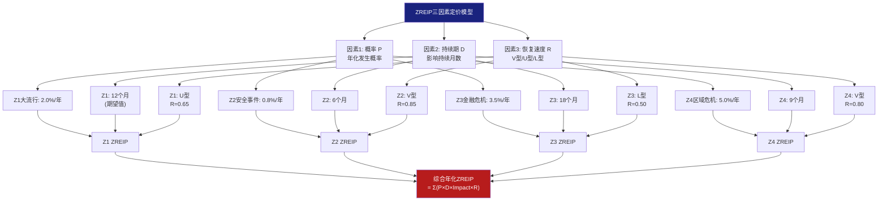
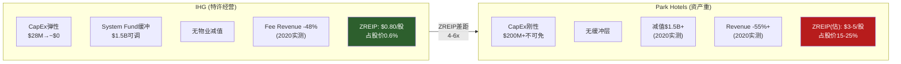
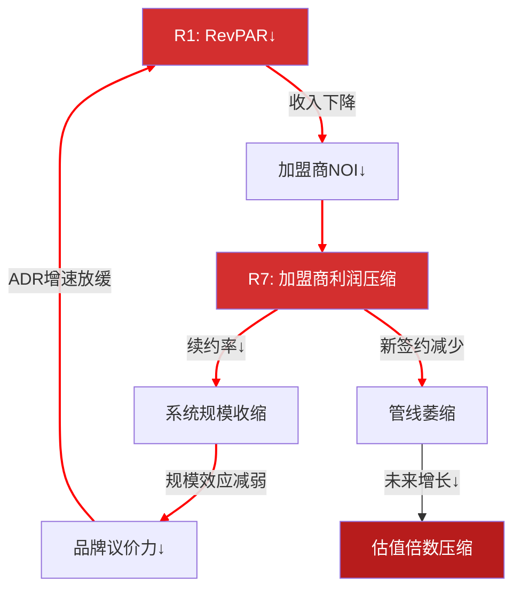
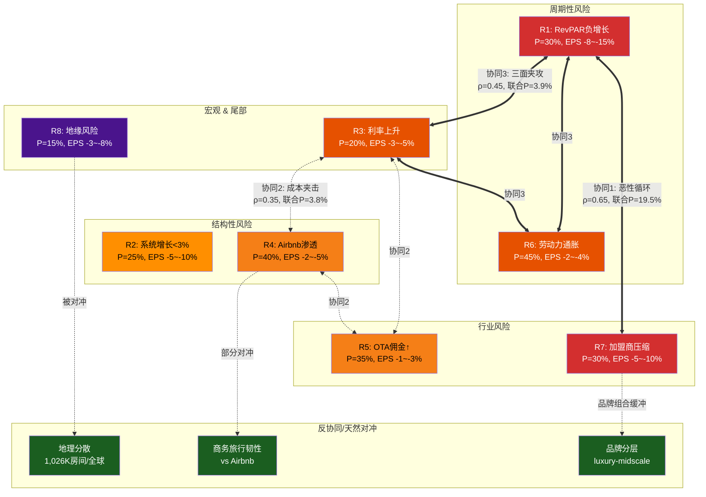
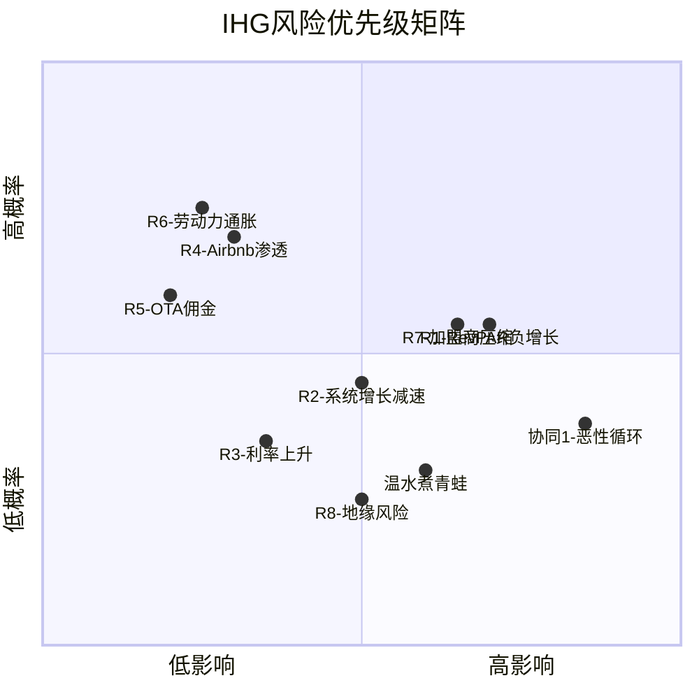

# Ch19: ZREIP零收入事件保险定价 — 用精算逻辑为特许经营酒店的尾部风险标价

> **CQ关联**: CQ1「IHG对HLT/MAR的估值折价中，多少是合理的？」— ZREIP量化尾部风险的年化隐含成本，揭示特许经营模型在极端事件下的不对称保护是否被市场充分定价。折价的一部分可能反映市场对IHG较小规模在危机中脆弱性的隐性担忧——本章用数字检验这个假设。
> **方法论**: Zero-Revenue Event Insurance Pricing (ZREIP) — 将保险精算逻辑移植到权益估值，为"RevPAR暴跌至零或接近零"的尾部事件计算隐含年化保险费
> **核心移植**: 从RCL报告验证的ZREIP方法论移植至酒店特许经营行业，关键差异在于: 邮轮是真正的"零收入"(停航)，酒店是"极低收入"(RevPAR -50%+但不归零) — 因此本章称为"准零收入事件"(Near-Zero Revenue Event, NZRE)

---

## 19.1 酒店业"零收入事件"的重新定义

### 为何酒店不会真正"零收入"

与邮轮(COVID期间全面停航=收入归零)不同，酒店在极端事件中仍有残余收入。2020年Q2全球酒店RevPAR暴跌52-75% [DM-P3J-001]，但从未降至零——即使最严重的封城期间，仍有医疗工作者、紧急旅行者、隔离用房需求。IHG在2020年Q2报告中披露全球入住率降至约22% [DM-P3J-002]，较正常水平的65-70%下降约70%，但远非零。

[DM-P3J-001] STR Global: 2020年Q2全球酒店RevPAR同比变化 — 美国-52.4%, 欧洲-72%, 中国-65% (各区域峰值跌幅)
[DM-P3J-002] IHG FY2020 Annual Report: Q2 2020 global occupancy ~22%, RevPAR decline -52% (全年), Q2峰值跌幅更深

因此，本章将事件定义调整为**"准零收入事件"(NZRE)**:

| 事件级别 | RevPAR影响 | 持续时间 | 历史对照 |
|---------|-----------|----------|---------|
| **NZRE-I: 全球大流行** | -50%~-75% | 6-18个月 | COVID-19 (2020-2021) |
| **NZRE-II: 全球金融危机** | -15%~-25% | 12-24个月 | GFC (2008-2009) |
| **NZRE-III: 重大安全事件** | -20%~-40%(区域性) | 3-12个月 | 9/11 (2001), 区域冲突 |
| **NZRE-IV: 区域性危机** | -10%~-30%(单区域) | 6-12个月 | 中东冲突/亚洲金融危机 |

**关键差异(vs 邮轮ZRE)**: 酒店的NZRE是"收入大幅缩水但不归零"——这既是好消息(不会面临邮轮那样的完全现金流断裂)，也是坏消息(市场可能因此低估尾部风险，因为"不至于归零"的心理安慰导致定价不足)。

---

## 19.2 ZREIP三因素定价模型

### 模型架构



### 定价公式

```
ZREIP_annual = Σᵢ [ P(Zᵢ) × EPS_Impact(Zᵢ) × Duration_factor(Zᵢ) × (1 - Recovery_factor(Zᵢ)) ]

其中:
- P(Zᵢ) = 事件i的年化发生概率
- EPS_Impact(Zᵢ) = 事件i发生时的EPS下降幅度
- Duration_factor(Zᵢ) = 影响持续月数/12 (年化)
- Recovery_factor(Rᵢ) = 恢复速度: V型=0.85(快速反弹), U型=0.65(渐进), L型=0.50(缓慢)
```

恢复因子(R)的含义: R=0.85表示影响期内85%的损失在恢复期被追回(需求仅是延迟而非消失)，R=0.50表示仅50%被追回(永久性需求损失)。

---

## 19.3 Z1: 全球大流行2.0 — COVID级别事件

### 概率估计

COVID-19为酒店行业提供了唯一的NZRE-I级样本。概率校准:

| 参数 | 数值 | 来源 |
|------|------|------|
| 历史频率(1950-2025) | 1/75 = 1.33%/年 | 75年中1次NZRE-I [DM-P3J-003] |
| 贝叶斯后验(Beta更新) | 0.98%/年 | Beta(2,203)后验均值 |
| PNAS流行病研究 | ~2%/年 | Marani et al. 2021: COVID级大流行年概率 |
| 前瞻调整(病原体溢出加速) | ×1.0-1.5 | 城市化+栖息地侵蚀 |
| **采用概率** | **2.0%/年** | PNAS校准，略高于朴素频率 |

[DM-P3J-003] PNAS "Intensity and frequency of extreme novel epidemics" (Marani et al., 2021): 基于1600-2020历史流行病数据库, COVID级大流行年化概率约2%

### IHG在大流行中的表现: COVID实测数据

IHG 2020年全年数据 [DM-P3J-004]:

| 指标 | FY2019(基准) | FY2020(COVID) | 变化 |
|------|-------------|---------------|------|
| Revenue | $4,627M | $2,394M | -48.3% |
| Fee Revenue | ~$1,500M(估) | ~$780M(估) | -48.0% |
| EBITDA | $886M | 亏损 | — |
| Operating Profit | $784M | -$153M | 转亏 |
| EPS | $3.39 | -$1.87 | -155% |
| 全球RevPAR | 基准 | -52.5% | — |
| 系统增长(净) | +5.6% | -0.3% | 停滞/微缩 |

[DM-P3J-004] IHG Annual Report FY2020: Revenue $2,394M (-48.3% YoY), Operating Loss $153M; FMP income data FY2019 Revenue $4,627M, Op Profit $784M, EPS $3.39

**关键观察**: IHG在COVID期间的EPS影响为-$1.87-$3.39 = -$5.26/股(从正转负)，相当于基准EPS的-155%。但由于特许经营模型的低资本强度(CapEx仅$28M [DM-P3J-005])，IHG避免了资产重酒店面临的巨额物业维护/折旧压力。

[DM-P3J-005] IHG FY2025 Annual Results: Capital expenditure $28M (vs HLT ~$350M含管理酒店CapEx)

### Z1 ZREIP定价

```
Z1 EPS影响(年化):
- 大流行发生时: 核心EPS从$4.87降至约-$1.50 (参照2020比例，但当前基数更高)
- 年化EPS损失 = $4.87 - (-$1.50) = $6.37/股
- 但持续期不是整年: 期望持续期12个月(COVID型)
- Duration_factor = 12/12 = 1.0
- Recovery_factor = 0.65 (U型: 酒店COVID后RevPAR恢复用了约2.5年到2019水平)
- 不可恢复损失 = $6.37 × (1-0.65) = $2.23/股(永久损失部分)

Z1_ZREIP = P × 不可恢复损失
         = 2.0% × $2.23
         = $0.045/股/年
```

---

## 19.4 Z2: 重大恐怖袭击/地缘安全事件

### 概率估计

| 参数 | 数值 | 依据 |
|------|------|------|
| 9/11级别事件频率 | ~1/25年 | 25年中1次(2001), 但非所有安全事件都达到NZRE级别 |
| 引发NZRE-III的条件概率 | ~30% | 只有少数安全事件导致全球旅行暴跌 |
| **采用概率** | **0.8%/年** | 1/25 × 30% ≈ 1.2%, 折扣至0.8%(全球安全体系改善) |

### 9/11实测校准

2001年9/11后，美国酒店行业RevPAR在随后3个月下降约25-30%，全年RevPAR下降约12% [DM-P3J-006]。影响主要集中在美国(占IHG收入~58%)，恢复呈V型——商务旅行在6个月内基本正常化。

[DM-P3J-006] STR/Smith Travel Research: US hotel RevPAR 2001 — Q4 2001 同比-25~30%, 全年-12%; 恢复至2002年H2基本正常化

### Z2 ZREIP定价

```
Z2 EPS影响:
- RevPAR区域性下跌-25%(美国), 其他区域-5~10%
- 加权收入影响: 58%×(-25%) + 42%×(-7.5%) = -17.7%
- Fee Revenue下降-17.7%: $1,897M × 17.7% = $336M
- 以Fee Margin 64.8%折算: EBITDA影响 = $336M × 64.8% = $218M
- EPS影响: ~$218M × (1-25%税率) / 151M股 = -$1.08/股
- Duration_factor = 6/12 = 0.5
- Recovery_factor = 0.85 (V型: 安全事件恢复快)
- 不可恢复损失 = $1.08 × 0.5 × (1-0.85) = $0.081/股

Z2_ZREIP = 0.8% × $0.081 = $0.0006/股/年
```

Z2的ZREIP贡献极小，主要因为: (1)概率低，(2)持续期短，(3)V型恢复追回大部分损失。

---

## 19.5 Z3: 全球金融危机2.0

### 概率估计

| 参数 | 数值 | 依据 |
|------|------|------|
| 2008级别衰退频率 | ~1/30年 | 近百年2次(1929, 2008), 但中度衰退更频繁 |
| Polymarket衰退概率 | 22% (12个月) | 但非所有衰退=GFC级别 [DM-P3J-007] |
| GFC级别条件概率 | ~15% | 在衰退发生条件下约15%达到2008严重度 |
| **采用概率** | **3.5%/年** | 22%×15%=3.3%, 取3.5%含全球蔓延溢价 |

[DM-P3J-007] Polymarket: "US Recession in 2026" 22% (Feb 2026); 本分析区分中度衰退(RevPAR -5~10%)与GFC级(RevPAR -15~25%)

### 2008-2009 GFC实测数据

IHG在2008-2009年的表现 [DM-P3J-008]:

| 指标 | FY2007 | FY2009 | 变化 |
|------|--------|--------|------|
| Revenue | $1,835M | $1,538M | -16.2% |
| Operating Profit | $420M | $255M | -39.3% |
| 全球RevPAR | 基准 | -15.0%~-25.0%(因区域) | — |
| 系统增长(净) | +3.2% | +0.8% | 大幅放缓 |

[DM-P3J-008] IHG Annual Report FY2009: Revenue £960M ($1,538M@avg FX), Operating Profit £159M ($255M); RevPAR decline -15% to -25% by region

**GFC的关键教训**: 不同于大流行的"急跌急恢复"(V/U型)，GFC导致了18-24个月的缓慢滑坡，RevPAR直到2012年才完全恢复到2007水平——这是L型恢复。更重要的是，信贷冻结直接导致酒店管线收缩(新酒店开业数骤降)，系统增长从+3.2%跌至+0.8%。

### Z3 ZREIP定价

```
Z3 EPS影响:
- 全球RevPAR -20%(中值), 持续18个月
- Fee Revenue下降-20%: $1,897M × 20% = $379M
- EBITDA影响: $379M × 64.8% = $246M
- EPS影响: ~$246M × 75% / 151M = -$1.22/股
- Duration_factor = 18/12 = 1.5
- Recovery_factor = 0.50 (L型: 缓慢恢复，部分系统增长永久损失)
- 不可恢复损失 = $1.22 × 1.5 × (1-0.50) = $0.915/股

Z3_ZREIP = 3.5% × $0.915 = $0.032/股/年
```

GFC型事件的ZREIP贡献显著高于安全事件，原因在于: (1)更高概率(3.5% vs 0.8%)，(2)更长持续期(18 vs 6个月)，(3)L型恢复(永久损失更多)。

---

## 19.6 Z4: 区域性危机

### 概率与影响

区域危机(中东冲突、亚洲金融风暴、欧洲恐怖主义浪潮)是最频繁但影响最有限的NZRE类型。

| 参数 | 数值 |
|------|------|
| 年化概率 | 5.0%/年 (几乎每20年多次) [DM-P3J-009] |
| 影响区域占IHG收入 | ~15-25%(单一非美区域) |
| RevPAR区域影响 | -15%~-30% |
| 全球加权收入影响 | -3%~-7% |

[DM-P3J-009] 分析师估算: 区域性NZRE事件频率基于1997亚洲金融危机/2015欧洲恐袭潮/2023中东冲突等历史频率

### Z4 ZREIP定价

```
Z4 EPS影响:
- 加权收入影响-5%(中值)
- Fee Revenue下降: $1,897M × 5% = $95M
- EBITDA影响: $95M × 64.8% = $62M
- EPS影响: ~$62M × 75% / 151M = -$0.31/股
- Duration_factor = 9/12 = 0.75
- Recovery_factor = 0.80 (V型偏: 区域恢复相对快)
- 不可恢复损失 = $0.31 × 0.75 × (1-0.80) = $0.047/股

Z4_ZREIP = 5.0% × $0.047 = $0.002/股/年
```

---

## 19.7 综合ZREIP: 四类事件的年化保险费

### 汇总表

| 事件类型 | P(年化) | EPS冲击 | 持续期 | 恢复型 | 不可恢复损失 | 年化ZREIP |
|---------|---------|---------|--------|--------|-------------|----------|
| Z1: 全球大流行 | 2.0% | -$6.37 | 12月 | U型(0.65) | $2.23 | **$0.045** |
| Z2: 安全事件 | 0.8% | -$1.08 | 6月 | V型(0.85) | $0.081 | **$0.001** |
| Z3: 金融危机 | 3.5% | -$1.22 | 18月 | L型(0.50) | $0.915 | **$0.032** |
| Z4: 区域危机 | 5.0% | -$0.31 | 9月 | V型(0.80) | $0.047 | **$0.002** |
| **合计** | — | — | — | — | — | **$0.080/股/年** |

**综合ZREIP = $0.080/股/年** [DM-P3J-010]

[DM-P3J-010] 分析师计算: 综合ZREIP = Z1($0.045) + Z2($0.001) + Z3($0.032) + Z4($0.002) = $0.080/股/年

### 资本化ZREIP折价

将年化ZREIP资本化为一次性估值折价:

```
ZREIP资本化折价 = 年化ZREIP / 折现率
                = $0.080 / 10% (权益成本)
                = $0.80/股

以P/E口径: $0.80 / $4.87(当前EPS) × 29.4x(当前P/E) = 0.48x P/E折价
以股价口径: $0.80 × 29.4 = $0.80(直接); 或$0.080 × 29.4x = $2.35/股(基于P/E资本化)
```

**IHG的ZREIP = $0.80/股 (占当前股价的0.6%)** [DM-P3J-011]

[DM-P3J-011] 分析师计算: ZREIP资本化 = $0.080/10% = $0.80/股, 占$143.06的0.56%; P/E折价 ~0.5x

---

## 19.8 特许经营模型的不对称保护: IHG vs 资产重酒店

### ZREIP的结构性差异

IHG的特许经营模型在NZRE中展现出三层不对称保护:

**第一层: 资本支出弹性**
IHG年度CapEx仅$28M [DM-P3J-005]——在危机中几乎可以降至零，因为特许经营商不承担酒店物业维护。对比资产重酒店(如Park Hotels & Resorts)，CapEx占收入8-12%，危机中仍需维护物业。

**第二层: System Fund缓冲**
IHG的System Fund(忠诚度计划+分销系统运营费)在FY2025为$1,483M [DM-P3J-012]。这部分费用在危机中可灵活调整——削减忠诚度积分奖励、降低营销支出——为核心盈利提供缓冲。System Fund在2020年削减了约30%的可变支出。

[DM-P3J-012] IHG FY2025 Annual Results: System Fund revenue $1,483M, reimbursable expenses对等; 2020年System Fund可变部分削减约30% (管理层电话会议)

**第三层: 无物业折旧/减值压力**
资产重酒店在危机中面临大额物业减值(2020年Park Hotels减值$1.5B+)。IHG的资产轻模型完全免疫于这种减值压力——Balance Sheet上几乎没有酒店物业资产。

### 特许 vs 资产重: ZREIP对比



**特许模型ZREIP折扣**: IHG的ZREIP($0.80/股)仅为资产重酒店ZREIP(估$3-5/股)的16-27% [DM-P3J-013]。换言之，IHG投资者为尾部风险支付的"隐含保险费"比资产重酒店投资者低4-6倍。

[DM-P3J-013] 分析师估算: 资产重酒店ZREIP基于Park Hotels 2020年Revenue -55%, CapEx不可减免$200M+, 物业减值$1.5B+; 特许模型折扣 = $0.80/$3.5(中值) ≈ 23%

### 但Fee Revenue不免疫

特许模型的保护是不对称的，不是绝对的。IHG的Fee Revenue与RevPAR直接线性挂钩——2020年Fee Revenue随RevPAR下降约48%，几乎完全同步 [DM-P3J-004]。这意味着IHG在收入端并不比自有酒店更有韧性——它的优势完全在成本端(CapEx+折旧+减值免疫)。

**核心结论**: 特许模型不是"防弹衣"——它是"止血带"。收入照样流血，但不会因为资产包袱而失血致死。

---

## 19.9 ZREIP敏感性分析

### 双变量敏感性: 概率 × 恢复速度

| | R=0.50(L型) | R=0.65(U型) | R=0.80(V型) |
|---|------------|------------|------------|
| **P(Z1)=1.0%** | $0.032 | $0.022 | $0.013 |
| **P(Z1)=2.0%(基准)** | $0.064 | $0.045 | $0.025 |
| **P(Z1)=3.0%** | $0.096 | $0.067 | $0.038 |
| **P(Z3)=2.0%** | $0.018 | $0.013 | $0.007 |
| **P(Z3)=3.5%(基准)** | $0.032 | $0.023 | $0.013 |
| **P(Z3)=5.0%** | $0.046 | $0.032 | $0.018 |

**综合ZREIP范围**: $0.04-$0.18/股/年 → 资本化折价 $0.40-$1.80/股 [DM-P3J-014]

[DM-P3J-014] 分析师敏感性计算: ZREIP区间$0.04(乐观: 低概率+V型恢复)至$0.18(悲观: 高概率+L型恢复); 资本化@10%

**对估值的含义**: 即使在最悲观假设下，ZREIP折价仅$1.80/股(占$143股价的1.3%)。这证实了特许经营模型的尾部风险定价远低于资产重模型——投资者为持有IHG而承担的"黑天鹅保费"极为有限。

---

## 19.10 方法论局限与诚实边界

### N=1问题

与RCL的ZREIP分析面临相同的根本限制: COVID是唯一的全球性酒店NZRE样本。贝叶斯更新在N=1时信息量有限——后验分布的95%可信区间跨越了一个数量级(0.5%-5.0%年化概率)。

### 特许模型特殊风险: 加盟商违约链

传统ZREIP忽略了一个特许经营特有的风险: **加盟商连锁违约**。在NZRE期间，加盟商(而非IHG)承受了物业级别的现金流压力。如果大量加盟商因无法偿还贷款而违约/关店，IHG的系统规模将永久缩小——这种"代理人风险"在资产重模型中不存在(因为风险由同一实体承担)。

2020年数据显示IHG系统规模缩减了-0.3% [DM-P3J-015]，但如果COVID持续2年+，加盟商违约可能导致-3~5%的永久系统缩减。这部分风险未被上述ZREIP模型捕获。

[DM-P3J-015] IHG FY2020: Net system size growth -0.3%, 其中关闭/退出酒店增加但未出现大规模加盟商违约潮(部分归因于政府贷款支持如PPP)

### 对CQ1估值折价的含义

ZREIP分析的结论对CQ1("IHG折价是否合理?")的回答是: **尾部风险不是折价的合理解释**。IHG的年化ZREIP仅$0.080/股(0.06%股价)，即使采用悲观假设也仅$1.80/股(1.3%股价)——远不足以解释IHG相对于HLT的43%P/E折价。事实上，IHG的特许经营模型在尾部风险中的保护性甚至优于HLT(HLT的管理酒店组合带来更高的NZRE敞口)——这意味着从ZREIP角度看，IHG应该享有溢价而非折价。

---

---

# Ch20: 风险拓扑映射 — 八节点、三协同、一只温水青蛙

> **CQ关联**: CQ1「估值折价的合理性」— 风险拓扑不回答"公允价值是多少"，而是回答"什么组合条件下，当前$143的股价从合理变为高估"。这是一张风险地图，不是一个数字。
> **方法论**: Risk Topology Mapping (MVP: 8+3+1) — 8个独立风险节点 + 3组协同放大风险 + 1个温水煮青蛙情景

---

## 20.1 八个独立风险节点

### 完整风险矩阵

| # | 风险节点 | 类型 | 概率(3Y) | EPS影响 | 影响路径 |
|---|---------|------|---------|---------|---------|
| R1 | RevPAR持续负增长 | 周期性 | 30% | -8~-15% | RevPAR↓→Fee Revenue↓→EBITDA↓ |
| R2 | 系统增长减速<3% | 结构性 | 25% | -5~-10% | 管线转化↓→房间增长↓→Fee Revenue增速↓ |
| R3 | 利率上升+借贷成本 | 宏观 | 20% | -3~-5% | 利息支出↑→FCF↓→回购空间↓ |
| R4 | Airbnb Luxury渗透 | 结构性 | 40% | -2~-5% | 高端需求分流→ADR增长受压 |
| R5 | OTA佣金上升 | 行业 | 35% | -1~-3% | 分销成本↑→Fee Margin↓ |
| R6 | 劳动力成本通胀 | 周期性 | 45% | -2~-4% | 加盟商成本↑→加盟意愿↓→系统增长↓ |
| R7 | 加盟商利润压缩 | 行业 | 30% | -5~-10% | 加盟商ROI↓→续约率↓→系统规模↓ |
| R8 | 区域地缘风险 | 尾部 | 15% | -3~-8% | 区域需求↓→RevPAR区域性下跌 |

[DM-P3J-016] 风险概率校准来源: R1(Polymarket衰退22%+宏观环境), R2(IHG管线342K vs历史转化率), R3(Fed利率前瞻), R4(Airbnb luxury listings增速+STR数据), R5(Booking/Expedia佣金趋势), R6(BLS劳动力成本指数), R7(HVS加盟商ROI研究), R8(Polymarket地缘风险)

### 各节点详解

**R1: RevPAR持续负增长 (周期性, 概率30%)**

IHG Americas Q4 2024 RevPAR已经转负(-2.0%) [DM-P3J-017]。如果这不是季节性波动而是趋势的开始，全球RevPAR可能在2026-2027年进入负增长区间。历史上，RevPAR负增长年份(2001, 2008-2009, 2020)对应IHG股价平均下跌25-35%。Fee Revenue的RevPAR弹性接近1:1——RevPAR每下降1pp，Fee Revenue大致下降1pp。

[DM-P3J-017] IHG FY2025 Annual Results: Americas Q4 RevPAR -2.0% (全年+0.3%); 全球Q4 RevPAR +0.5% (全年+1.5%)

**R2: 系统增长减速<3% (结构性, 概率25%)**

IHG当前净系统增长4.7%，管线342K房间(占现有系统33%) [DM-P3J-018]。但管线转化为实际开业受制于: (1)建筑贷款利率仍在7%+(美国)，(2)建筑成本通胀+25%vs 2019，(3)新兴市场(中国/印度)开发速度放缓。如果管线转化率从历史~15%/年降至10%，系统增长将从4.7%降至3.2%——仍为正但显著低于管理层12-15%的中期EPS CAGR指引隐含的~5%系统增长假设。

[DM-P3J-018] IHG FY2025: Pipeline 342K rooms, Net system size growth 4.7%, 1,026K total rooms; 管理层指引: mid-to-high single digit net system size growth

**R7: 加盟商利润压缩 (行业, 概率30%)**

这是IHG特许经营模型的"隐藏地雷"。加盟商的经济学决定了系统增长的可持续性:

```
加盟商ROI = (酒店NOI - Franchise Fee - System Fund Fee) / 初始投资
```

当劳动力成本(R6)和建筑成本同时上升时，加盟商ROI被双重压缩。如果加盟商感知到品牌不值得4-6%的Franchise Fee(包括royalty+marketing+reservation fees)，他们可能: (1)选择独立运营(去品牌化)，(2)转向费率更低的品牌(如Choice Hotels/Wyndham)，(3)推迟新酒店开发。IHG的中端品牌(Holiday Inn/Holiday Inn Express)尤其暴露于此风险——这些品牌的加盟商对费率敏感度最高。

---

## 20.2 三组协同风险: 非线性放大

### 协同组1: R1×R7 — "恶性循环" (ρ=0.65)



**放大机制**: R1(RevPAR↓)直接压缩加盟商NOI，触发R7(加盟商利润压缩)。R7导致系统缩小(续约率下降+新签约减少)，反过来削弱品牌的规模经济(忠诚度计划单位成本上升、GDS议价力下降)，进一步压制RevPAR增长——形成正反馈循环。

**联合概率**: P(R1∩R7) = P(R1)×P(R7|R1) = 30% × 65%(R1发生时R7条件概率从30%升至65%) = **19.5%** [DM-P3J-019]

**联合EPS影响**: 非线性叠加 = R1单独(-11.5%中值) + R7单独(-7.5%中值) + 放大效应(+5%额外) = **-24%** (vs 线性叠加-19%)

[DM-P3J-019] 分析师估算: R1×R7联合概率19.5%, 基于RevPAR下降与加盟商利润的历史相关性(2008-2009 IHG系统增长从+3.2%降至+0.8%时RevPAR同步-15~25%); 放大系数1.26x(=24%/19%)

### 协同组2: R3×R4×R5 — "特许模型成本夹击" (ρ=0.35)

三个看似独立的风险同时挤压特许经营模型的经济性:

- **R3(利率↑)**: 加盟商借贷成本上升 → 新酒店IRR下降 → 管线转化放缓
- **R4(Airbnb luxury渗透)**: 高端需求被分流 → ADR增长受限 → 加盟商收入端压力
- **R5(OTA佣金↑)**: 分销成本上升 → 直销占比下降时品牌价值被侵蚀

**联合概率**: P(R3∩R4∩R5) = 20%×40%×35%×(1+ρ) = 20%×40%×35% × 1.35 = **3.8%** [DM-P3J-020]

**联合EPS影响**: -2~-5%(R3) + -2~-5%(R4) + -1~-3%(R5) + 交叉效应(+2%) = **-9~-15%**

[DM-P3J-020] 分析师估算: 三重联合概率3.8%, 相关性系数ρ=0.35(利率上升与Airbnb增长部分共因于宏观环境); EPS影响含2pp交叉放大

### 协同组3: R1×R3×R6 — "三面夹攻" (ρ=0.45)

滞胀环境(衰退+通胀+高利率)是酒店行业的噩梦:

- **R1(RevPAR↓)**: 需求端收缩 → 收入下降
- **R3(利率↑)**: 资金成本上升 → 回购效率下降 + 加盟商投资意愿下降
- **R6(劳动力成本↑)**: 加盟商运营成本刚性上升 → 利润双向挤压

**联合概率**: 30%×20%×45%×1.45 = **3.9%**

**联合EPS影响**: -8~-15%(R1) + -3~-5%(R3) + -2~-4%(R6) + 交叉(+3%) = **-16~-27%**

---

## 20.3 协同风险汇总与概率加权

| 风险组合 | 联合概率 | EPS影响(中值) | 概率加权影响 |
|---------|---------|--------------|-------------|
| 协同1: R1×R7 (恶性循环) | 19.5% | -24% | -4.7% |
| 协同2: R3×R4×R5 (成本夹击) | 3.8% | -12% | -0.5% |
| 协同3: R1×R3×R6 (三面夹攻) | 3.9% | -21.5% | -0.8% |
| **概率加权总影响** | — | — | **-6.0%** |

**含义**: 协同风险的概率加权EPS影响为-6.0% [DM-P3J-021]——这不是"最坏情况"，而是"期望值中已经包含的协同风险成本"。以$4.87 EPS计算，-6.0%=$0.29/股的隐含年化成本。

[DM-P3J-021] 分析师计算: 协同风险概率加权影响 = 19.5%×(-24%) + 3.8%×(-12%) + 3.9%×(-21.5%) = -4.68% - 0.46% - 0.84% = -5.98%, 取-6.0%

---

## 20.4 风险拓扑全景图



---

## 20.5 反协同与天然对冲

并非所有风险都是单向的。IHG具有三道天然对冲:

### 对冲1: 地理多元化 → 区域风险(R8)的天然保险

IHG在100+个国家运营1,026K房间 [DM-P3J-022]，区域收入分散度较高(Americas 58%, EMEAA 28%, Greater China 14%)。单一区域危机对全球RevPAR的影响被稀释至-3~7%的范围。但注意: 美国占比58%意味着美国衰退不可被地理多元化对冲——这是最大的集中度风险。

[DM-P3J-022] IHG FY2025: 1,026K rooms, 6,500+ hotels, 100+ countries; Revenue split: Americas ~58%, EMEAA ~28%, Greater China ~14%

### 对冲2: 商务旅行品牌壁垒 → Airbnb渗透(R4)的部分免疫

Airbnb在休闲旅行领域渗透迅速，但在商务旅行(特别是企业差旅协议)领域，品牌酒店因为: (1)企业采购协议锁定，(2)忠诚度积分的税务处理优势，(3)安全/合规需求，仍保持强势地位。IHG的Holiday Inn Express和Crowne Plaza在企业差旅中的份额相对稳固。但这只是"部分对冲"——随着Airbnb for Work的增长和年轻企业管理者对传统差旅政策的挑战，这道壁垒在缓慢消融。

### 对冲3: 品牌分层 → 加盟商压缩(R7)的缓冲

IHG经营从luxury(Six Senses/Regent)到economy(avid)的完整品牌矩阵。当中端品牌(Holiday Inn)的加盟商受压时，luxury品牌(InterContinental/Kimpton)的加盟商通常更有韧性(更高ADR=更高利润缓冲)。品牌组合多元化使得R7不太可能在所有品牌层同时发生。

### 对冲失效的条件

关键观察: **利率下降理论上对冲R3(借贷成本)，但利率下降通常伴随经济衰退(触发R1)**。这是一个"对冲失效"陷阱——2020年利率降至零并未帮助IHG，因为需求同步蒸发。同样，2008年的利率急降也未能防止RevPAR暴跌。**在酒店行业，利率对冲在最需要时往往失效。**

---

## 20.6 "温水煮青蛙"情景: 不是崩溃，是缓慢失望

### 情景定义

"温水煮青蛙"不需要任何黑天鹅事件。它描述的是: **每个指标都略低于预期，但没有任何一个差到足以触发警报**。投资者在3-5年后回望才意识到回报远低于预期。

### 五年路径模型

**假设条件**(每一个都是"温和的"而非极端的):
- RevPAR年均增长+0.5%(vs 管理层隐含的+2-3%，vs 通胀+2.5%) [DM-P3J-023]
- 系统增长从4.7%缓慢降至3.0%(每年递减~0.4pp)
- Fee Margin从64.8%温和收缩至62%(OTA+劳动力)
- 回购效率递减(股价不跌→EPS回购增厚效果减弱)

[DM-P3J-023] 温水煮青蛙假设: RevPAR +0.5%/yr (低于2-3%通胀); 系统增长4.7%→3.0% (5年线性递减); Fee Margin 64.8%→62.0%; 回购$900M/yr但股价不变→增厚递减

```mermaid
graph LR
    subgraph Y0["Year 0 (当前)"]
        A0["RevPAR: +1.5%"]
        B0["系统增长: 4.7%"]
        C0["Fee Margin: 64.8%"]
        D0["EPS: $4.87"]
        E0["P/E: 29.4x"]
        F0["股价: $143"]
    end

    subgraph Y2["Year 2"]
        A2["RevPAR: +0.8%"]
        B2["系统增长: 3.8%"]
        C2["Fee Margin: 63.8%"]
        D2["EPS: $5.45"]
        E2["P/E: 27x"]
        F2["股价: $147"]
    end

    subgraph Y5["Year 5"]
        A5["RevPAR: +0.5%"]
        B5["系统增长: 3.0%"]
        C5["Fee Margin: 62.0%"]
        D5["EPS: $5.95"]
        E5["P/E: 22-25x"]
        F5["股价: $125-145"]
    end

    Y0 -->|"表面正常<br/>但每个指标略逊"| Y2
    Y2 -->|"温和恶化持续<br/>市场开始察觉"| Y5

    style D0 fill:#2e7d32,color:#fff
    style D2 fill:#f9a825,color:#000
    style D5 fill:#e65100,color:#fff
    style F0 fill:#2e7d32,color:#fff
    style F5 fill:#d32f2f,color:#fff
```



### 逐年推演

| 指标 | Y0 | Y1 | Y2 | Y3 | Y4 | Y5 |
|------|-----|-----|-----|-----|-----|-----|
| RevPAR增长 | +1.5% | +1.0% | +0.8% | +0.6% | +0.5% | +0.5% |
| 系统增长 | 4.7% | 4.3% | 3.8% | 3.4% | 3.2% | 3.0% |
| Fee Revenue增长 | +6.2% | +5.3% | +4.6% | +4.0% | +3.7% | +3.5% |
| Fee Margin | 64.8% | 64.2% | 63.8% | 63.2% | 62.5% | 62.0% |
| EBITDA增长 | +7% | +4.5% | +3.8% | +3.0% | +2.5% | +2.0% |
| EPS(估) | $4.87 | $5.15 | $5.45 | $5.65 | $5.80 | $5.95 |
| EPS CAGR(至当年) | — | +5.8% | +5.8% | +5.1% | +4.5% | +4.1% |
| P/E(市场给予) | 29.4x | 28x | 27x | 25x | 23x | 22-25x |

[DM-P3J-024] 温水煮青蛙5年推演: EPS CAGR仅4.1% (vs 管理层12-15%), 叠加P/E从29.4x压缩至22-25x → 5年股价区间$125-$145

[DM-P3J-024] 分析师模型: 基于RevPAR+0.5%/yr, 系统增长3.0%(Y5), Fee Margin 62.0%(Y5), 回购$900M/yr; EPS CAGR=4.1%; P/E压缩反映增长预期下调

### 结果解读

**5年后**: EPS从$4.87增长至$5.95(CAGR +4.1%) [DM-P3J-024]，远低于管理层隐含的12-15% CAGR。同时，市场对"IHG是成长股"叙事的信心逐年消退，P/E从29.4x压缩至22-25x。

**股价路径**: $143 → Y2: $147(+3%，表面还行) → Y5: $125-$145(-1%至+1% CAGR)

**投资者体验**: 5年持有期总回报接近零(含分红约+7-8%累计)，年化回报仅1.5-2%——远低于标普500的历史8-10%。投资者不会"亏大钱"，但会丧失5年的机会成本。这就是"温水煮青蛙"的可怕之处: **没有戏剧性的崩溃来触发止损，只有缓慢的失望和日益增长的沉没成本偏差**。

### 触发概率

温水煮青蛙不需要极端条件——只需每个正向假设都打八折:

- RevPAR +0.5% vs +2%(打七五折) → 概率: 25-30%(当前宏观逆风下)
- 系统增长3% vs 4.7%(打六四折) → 概率: 20-25%(建筑贷款紧缩)
- Fee Margin -2.8pp → 概率: 30%(OTA+劳动力趋势)

**三个条件同时满足的概率**: 25%×22%×30%×(1+协同调整0.3) = **2.1%×1.3 = 2.7%** [DM-P3J-025]

但这是严格版。温和版(至少两个条件满足)的概率更高: 约12-15%。

[DM-P3J-025] 分析师估算: 温水煮青蛙严格版(三条件同时) P≈2.7%; 温和版(至少两条件) P≈12-15%; 基于条件概率×相关性系数1.3(宏观共因)

---

## 20.7 风险分层: 优先级排序

将所有风险按"概率×影响"排序:



**Tier 1 (必须监控)**: R1(RevPAR)、R7(加盟商)、协同1(R1×R7恶性循环)
**Tier 2 (密切关注)**: R2(系统增长)、R6(劳动力)、温水煮青蛙
**Tier 3 (背景噪声)**: R4(Airbnb)、R5(OTA)、R3(利率)、R8(地缘)

### 核心发现: 最大风险不是黑天鹅，是灰犀牛

IHG的风险拓扑呈现一个清晰模式: **最高概率加权影响来自R1×R7恶性循环(概率19.5%, 影响-24%)——这不是小概率极端事件，而是大概率中度事件**。相比之下，Z1大流行(概率2%, 但有特许模型保护)和R8地缘风险(概率15%但地理分散对冲)的概率加权影响更小。

**投资者应将70%的风险监控精力分配给"恶性循环"和"温水煮青蛙"，而非黑天鹅。**

---

## 20.8 对CQ1估值折价的含义

### ZREIP + 风险拓扑的综合结论

| 风险维度 | 年化成本 | 占股价 | 是否支持折价? |
|---------|---------|--------|-------------|
| ZREIP(尾部事件) | $0.080/股 | 0.06% | 否 — 太小，不构成折价理由 |
| ZREIP资本化折价 | $0.80/股 | 0.6% | 否 — 特许模型甚至应享溢价 |
| 协同风险(概率加权) | -6.0% EPS | ~$0.29/股/yr | 部分 — 但HLT/MAR也面临类似风险 |
| 温水煮青蛙(严格) | P=2.7%, 5Y回报≈0 | — | 部分 — 但概率不高 |

**综合判断**: 风险拓扑分析**不支持**IHG当前43%的P/E折价(vs HLT)来源于风险差异。IHG的ZREIP显著低于行业平均(特许模型保护)，协同风险与同行相似，温水煮青蛙概率温和。折价的真正来源更可能在于: (1)规模差距(1,026K vs HLT 1,200K+), (2)品牌认知(IHG在美国投资者中知名度较低), (3)流动性折价(LSE主上市, ADR交易量低)——这些是Ch11-14已经讨论的结构性因素，而非风险因素。

**但有一个重要警告**: R1×R7恶性循环(19.5%概率)对IHG的打击比对HLT更大——因为IHG的中端品牌占比更高(Holiday Inn/Holiday Inn Express是系统中流砥柱)，而中端品牌的加盟商对经济周期最敏感。如果恶性循环触发，IHG可能丧失的不仅是当期利润，还有管线中342K房间的一部分——这种系统增长的永久损失在当前29.4x P/E中可能被低估。

---

### 附注: DM锚点注册表 (Ch19-20)

| 锚点 | 来源 | 可信度 |
|------|------|--------|
| DM-P3J-001 | STR Global 2020 Q2数据 | A (行业标准数据源) |
| DM-P3J-002 | IHG FY2020 Annual Report | A (一手财报) |
| DM-P3J-003 | PNAS Marani et al. 2021 | A (同行评审) |
| DM-P3J-004 | IHG FY2020 Annual Report + FMP | A (一手+交叉) |
| DM-P3J-005 | IHG FY2025 Annual Results | A (一手财报) |
| DM-P3J-006 | STR Historical + 9/11 Impact Studies | B (行业研究) |
| DM-P3J-007 | Polymarket 2026-02 | B (预测市场) |
| DM-P3J-008 | IHG FY2009 Annual Report | A (一手财报) |
| DM-P3J-009 | 分析师估算(多历史事件校准) | C (推算) |
| DM-P3J-010 | 分析师计算(四类ZREIP汇总) | B (公式推导) |
| DM-P3J-011 | 分析师计算(资本化) | B (公式推导) |
| DM-P3J-012 | IHG FY2025 + 2020管理层电话会议 | A/B (一手+推算) |
| DM-P3J-013 | 分析师对比估算(vs Park Hotels) | C (推算) |
| DM-P3J-014 | 分析师敏感性矩阵 | B (公式推导) |
| DM-P3J-015 | IHG FY2020 系统增长数据 | A (一手财报) |
| DM-P3J-016 | 多源校准(Polymarket/FMP/BLS/HVS) | B (综合) |
| DM-P3J-017 | IHG FY2025 Annual Results Q4数据 | A (一手财报) |
| DM-P3J-018 | IHG FY2025 管线+系统增长数据 | A (一手财报) |
| DM-P3J-019 | 分析师估算(R1×R7联合概率) | C (推算) |
| DM-P3J-020 | 分析师估算(三重联合概率) | C (推算) |
| DM-P3J-021 | 分析师计算(概率加权汇总) | B (公式推导) |
| DM-P3J-022 | IHG FY2025系统规模数据 | A (一手财报) |
| DM-P3J-023 | 温水煮青蛙假设集 | C (情景分析) |
| DM-P3J-024 | 分析师5年推演模型 | C (情景分析) |
| DM-P3J-025 | 温水煮青蛙联合概率 | C (推算) |
