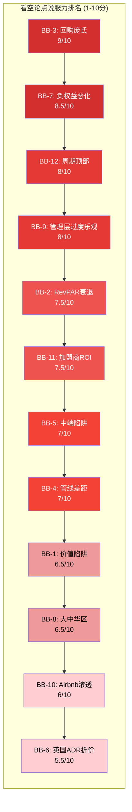
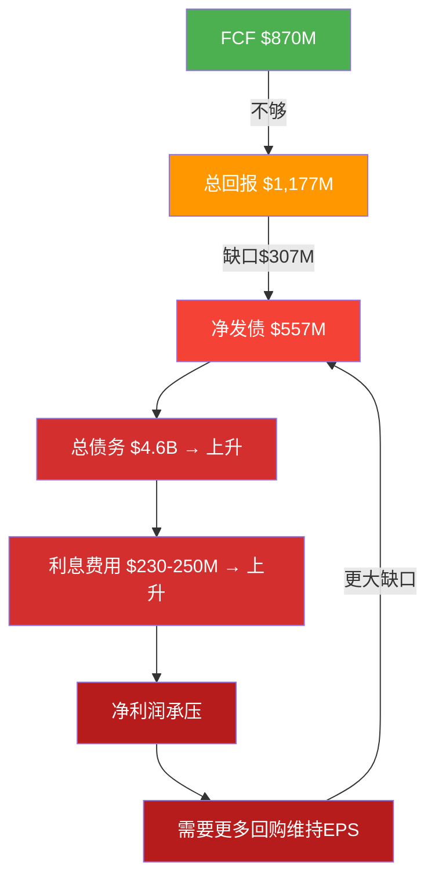
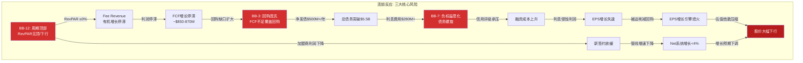
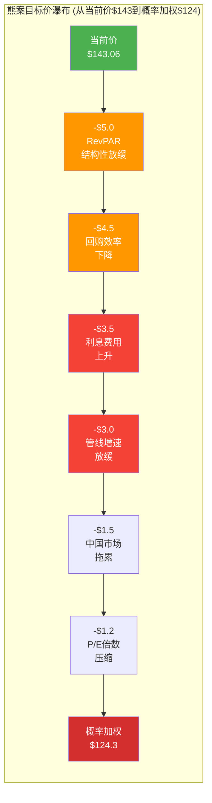

# Ch23: 独立看空分析 — IHG的十二道裂缝

> **声明**: 本章由独立Bear-Agent撰写，不读取Phase 1-3看多结论。目标是最大化看空论点的说服力，作为对抗性压力测试。所有数据均来自公开来源和客观财务数据。

---

## 看空论文一句话

**IHG是一台以负权益-$2.7B为燃料、以借债回购为引擎、在RevPAR+0.6%的冻土上试图维持12-15% EPS CAGR的永动机——而物理定律告诉我们，永动机不存在。**

---

## 12个看空论点强度排名

---

## BB-1: 价值陷阱风险 — "便宜"是一个陷阱

**说服力: 6.5/10**

P/E 29.4x [DM-P4B-001] 看起来比Hilton的51.8x [DM-P4B-002] 和Marriott的36.9x [DM-P4B-003] "便宜"了很多。但价值陷阱的经典定义就是"看起来便宜，实际上便宜有原因"。IHG的折价不是市场的疏忽，而是市场对以下结构性缺陷的精确定价：

**第一，规模劣势的折价是永久性的。** IHG拥有约1,026K房间 [DM-P4B-004]，管线342K [DM-P4B-005]。对比Marriott的管线596K和Hilton的515K，IHG在规模竞赛中已经输了。酒店特许经营是一个典型的网络效应业务——品牌越大，会员计划越有价值，加盟商越愿意加入。IHG处于"老三"的位置，既没有MAR的品牌覆盖广度，也没有HLT的增长速度(HLT 2025年净开业率6.7%)，这个折价不会因为"价值发现"而收窄。

**第二，EPS增长的质量极差。** IHG FY2025 EPS $4.87 [DM-P4B-006]，但这个数字是建立在$907M回购 [DM-P4B-007] 之上的。扣除回购的分母缩减效应，有机EPS增长远低于管理层吹嘘的数字。当EPS增长主要由财务工程而非业务扩张驱动时，市场理应给予更低的估值倍数。

**第三，"便宜"是相对于错误锚定的。** 投资者把IHG和MAR/HLT放在一起比较，看到30%+的折价就觉得便宜。但正确的问法不是"IHG比同业便宜吗？"，而是"IHG值29x吗？"在RevPAR仅增长+0.6%~0.9% [DM-P4B-008] 的环境下，一家中等增长的酒店特许经营公司值近30倍市盈率？历史均值更接近20-22x。

**量化影响**: 如果市场重新定价IHG至25x P/E (仍高于历史均值)，目标价 = $4.87 × 25 = $121.75，下行空间-15%。

**多头反驳**: "折价正在收窄，IHG正在执行品牌升级和管线加速。" — 但折价收窄需要增长加速的证据，而FY2025净系统增长仅4.7%，远低于HLT的6.7%。

---

## BB-2: RevPAR结构性衰退 — 美国酒店黄金时代终结

**说服力: 7.5/10**

这不是周期性放缓，而是结构性转折。证据链如下：

**2025年创造了不光彩的历史。** 美国酒店行业2025年RevPAR下降-0.3%——这是有记录以来**首次非衰退期的RevPAR下降** [DM-P4B-009]。这个数据点的意义被严重低估了。它意味着即使经济未陷入衰退(2025年美国GDP仍为正增长)，酒店行业的定价权已经丧失。

**2026年预测令人沮丧。** STR/Tourism Economics对2026年全年RevPAR增长预测仅为+0.6% [DM-P4B-010]，且这个数字已经包含了FIFA世界杯对Q2-Q3的一次性提振(贡献约0.4个百分点)。剔除世界杯效应，基础RevPAR增长接近于零。IHG管理层自己给出的2026指引更低：+0.6%~0.9%。

**供给增速正在追上需求。** 2026年预计新增80,034间客房(供给+1.4%)，2027年进一步增至88,095间(供给+1.5%) [DM-P4B-011]。在需求仅增长+0.4%的环境下，供给增速几乎是需求增速的3.5倍。这是经典的供需恶化。

**Select-service和Economy受压最重。** STR明确指出，Select-service和Economy酒店仍面临ADR下行压力——而这恰恰是IHG的核心盘（Holiday Inn/Holiday Inn Express占IHG房间数约50%）。Luxury/Upper-Upscale仍能维持RevPAR增长(Luxury +7.1% YTD)，但IHG在这些高端细分市场的存在感远弱于MAR和HLT。

**量化影响**: 如果RevPAR在2026-2028年均维持在+0.5%（低于通胀），IHG Fee Revenue的有机增长将被限制在3-4%（净系统增长贡献+管线转化），远低于支撑29x估值所需的增速。

**多头反驳**: "RevPAR只是短期波动，长期旅行需求结构性增长。" — 但"长期"不付账单，当下的估值必须由当下的现金流支撑。

---

## BB-3: 回购庞氏 — 史上最优雅的财务炼金术

**说服力: 9/10**

这是IHG故事中最致命的裂缝，值得详细拆解。

**核心矛盾: 回购金额 > 自由现金流。** FY2025，IHG回购了$907M [DM-P4B-012]股票，加上$270M分红，总股东回报达$1,177M。但FCF仅为$870M [DM-P4B-013]。缺口 = $307M。这个缺口怎么填的？净发债$557M。

让我们把这翻译成直白的语言：**IHG借了钱来回购股票，然后告诉投资者"看，EPS在增长"。** 这和一个人刷信用卡买自己的股票然后吹嘘"我的净资产在增加"有什么区别？

**恶化趋势而非一次性事件。** 负权益从FY2021的-$1.5B恶化到FY2025的-$2.741B [DM-P4B-014]，四年恶化了$1.2B。总债务从FY2023的$3.6B增加到FY2025的$4.619B [DM-P4B-015]，两年增加$1B。这不是暂时的资本结构优化，这是一个加速恶化的螺旋。

**利息费用正在吞噬"节省"。** 管理层预计2026年利息费用将升至$230M-$250M [DM-P4B-016]。假设新增$500M债务(维持当前回购节奏)，按5%利率计算，每年新增$25M利息支出。回购减少了分母（流通股），但新增债务增加了分子（利息费用减少净利润）。随着利率环境高位维持，这个"回购 → 发债 → 付息 → 再发债"的循环的效率正在急剧下降。

**2026年更激进: $950M新回购计划。** 管理层刚宣布了新的$950M回购计划，预计2026年总回报超过$1.2B [DM-P4B-017]。如果2026年FCF保持在$900M左右，缺口又将达到$300M+。又要发债。

**量化影响**: 假设IHG维持当前回购节奏3年(2026-2028)：累计新增债务~$900M-$1B → 总债务可能超过$5.5B → Net Debt/EBITDA从2.6x上升至3.0x+ → 信用评级可能承压 → 融资成本上升 → 恶性循环。

**多头反驳**: "Asset-light模型FCF转化率极高，负权益是常见结构。" — 是的，MAR和HLT也有类似结构。但关键区别是：MAR/HLT的增长速度足够快，有机EPS增长可以覆盖债务增量。IHG的有机增长太慢，导致对回购的依赖度更高。

---

## BB-4: 管线差距持续扩大 — 老三的宿命

**说服力: 7/10**

酒店特许经营的竞争本质是管线竞赛——谁签约更多新酒店，谁就有更多未来收入。在这场竞赛中，IHG正在掉队。

**管线规模差距一目了然。** MAR管线596K房间，HLT管线515K房间(其中520K under development)，IHG管线342K房间 [DM-P4B-018]。IHG的管线仅为MAR的57%、HLT的66%。更糟糕的是，Hilton 2025年净开业增长率达6.7%并指引2026年继续保持6-7%，而IHG仅4.7%。

**增长差距意味着什么？** 假设IHG维持4.7%净系统增长，HLT维持6.7%。当前IHG 1,026K房间，HLT约800K房间。五年后(2030年)：IHG ~1,296K，HLT ~1,105K。差距从226K缩小到191K。如果HLT在中国和印度加速(两个最大增量市场)，被反超不是不可能。

**H World的崛起更值得警惕。** 中国华住集团(H World)2025年增长+20.3%，已跃升至全球第四大酒店集团，排名在IHG之前。在中国这个IHG重点市场，华住的本土品牌优势不可忽视。

**管线质量也有疑问。** IHG近年来大量签约Garner、Atwell等新品牌，这些品牌尚未经过经济周期检验。如果下行周期到来，新品牌项目的取消率可能显著高于成熟品牌。管线数字看起来在增长，但实际交付率存疑。

**量化影响**: 如果IHG净系统增长从4.7%下滑到4.0%（新品牌签约放缓+中国减速），Fee Revenue有机增长将从5-6%降至4-5%，对EPS CAGR的贡献减少1-2个百分点。

**多头反驳**: "IHG的增长在加速，2025年创纪录开业443家。" — 开业数是滞后指标(反映3-5年前的签约)，签约增速才是领先指标。

---

## BB-5: 中端品牌陷阱 — Holiday Inn在Airbnb和OTA的夹击中

**说服力: 7/10**

IHG约50%的房间集中在中端品牌(Holiday Inn + Holiday Inn Express)，这恰恰是受替代竞争压力最大的细分市场。

**Holiday Inn的品牌老化问题根深蒂固。** 行业研究直言不讳地描述："年轻消费者不是把Holiday Inn视为'父母住的地方'，而是'父母曾经住的地方'。" 品牌认知已经从"可靠的中端选择"滑向"过时的旧时代遗产"。虽然IHG在推进翻新计划，但翻新一栋楼容易，翻新一个品牌的代际认知极难。

**中端是Airbnb替代弹性最大的区间。** Luxury旅客对Airbnb的替代弹性低(他们要的是服务，不仅仅是空间)。Economy旅客对Airbnb也低(预算极限制)。但中端旅客——$100-$200/晚的商务和休闲客人——恰恰是Airbnb"够好就行"策略最有效的目标群体。Airbnb平台上的酒店业务增长速度是整体平台的两倍(CEO Brian Chesky明确表示要"significantly more aggressively"进入酒店)。

**OTA的佣金挤压。** Holiday Inn级别的酒店比Luxury酒店更依赖OTA获客(品牌直接忠诚度更低)。OTA佣金率15-25%直接吃掉加盟商利润。IHG One Rewards虽然有忠诚计划，但在中端市场的拉动力远弱于MAR的Bonvoy。

**Select-Service ADR承压已成事实。** STR数据已确认Select-service酒店在2026年继续面临ADR下行压力。IHG的核心盘正处于最脆弱的位置。

**量化影响**: 假设中端品牌RevPAR低于公司平均水平1-2个百分点（ADR承压），IHG整体Fee Revenue增速将被拖累0.5-1个百分点。长期来看，中端集中度可能导致IHG被市场重新分类为"低增长"组——估值应更接近Wyndham的15-18x而非MAR/HLT的30-50x。

**多头反驳**: "Holiday Inn Express仍是上中端第一品牌，IHG也在发展高端品牌。" — 品牌排名领先不等于品牌增长领先，IHG高端品牌(IC/Vignette/Regent)体量太小，无法改变组合结构。

---

## BB-6: 英国ADR折价不会修复 — 结构性流动性陷阱

**说服力: 5.5/10**

IHG是LSE上市公司+NYSE ADR，这个双重上市结构带来持久的估值折价。

**S&P 500指数排除效应。** IHG无法进入S&P 500成份股（因为是英国公司），这意味着被动资金池(占美国市场~40%)的自动买入永远不会到来。而MAR和HLT都是S&P 500成份股，享受被动资金的持续托底。

**投资者基地结构性劣势。** IHG的核心投资者是欧洲基金，而全球酒店行业的最活跃投资者群体在美国。当美国长线基金配置酒店板块时，第一选择是MAR，第二是HLT，IHG通常排在第三甚至之后。这不是分析质量的问题，而是基金授权(mandate)和基准指数(benchmark)的结构性约束。

**ADR流动性折扣。** 虽然学术研究表明ADR长期均值折价接近0，但在市场压力期(如衰退恐慌)，ADR的Bid-Ask Spread会显著扩大，导致卖出摩擦更大。IHG的日均交易量远低于MAR/HLT，在市场恐慌期可能出现流动性折价。

**量化影响**: 结构性折价估计在5-10%，即IHG即使基本面与同业相当，也应交易在同业P/E的90-95%水平。当前29.4x vs MAR 36.9x（80%水平），说明市场已经price in了部分折价，但进一步收窄的催化剂不明显。

**多头反驳**: "Compass Group(也是英国上市)在美国获得了合理估值。" — Compass是餐饮外包龙头，行业地位更不可替代。IHG在酒店行业并非不可替代。

---

## BB-7: 负权益恶化路径 — 一张没有净资产的资产负债表

**说服力: 8.5/10**

负权益本身不一定是问题——MAR和HLT也是负权益。但IHG负权益的**恶化速度和方向**令人不安。

**恶化轨迹清晰可测。** 负权益从FY2021的-$1.5B [DM-P4B-019] 恶化到FY2025的-$2.741B，四年恶化-$1.241B，年均恶化~$310M。如果维持当前轨迹：FY2028E负权益将达到~-$3.7B。这不是稳定状态，这是加速恶化。

**总债务增长令人担忧。** FY2023总债务$3.6B → FY2025 $4.619B [DM-P4B-020]，两年增加$1B+。如果2026年继续执行$950M+回购计划(FCF不足覆盖)，FY2026E总债务可能突破$5B。

**利息费用蚕食利润。** 管理层预计2026年利息费用$230M-$250M，对比2025年约$200M，增长15-25%。在净利润$758M的基础上，利息费用已占净利润的26-33%。如果利率维持在高位，且债务继续增长，利息费用占比将进一步上升。

**信用评级是看不见的红线。** Net Debt/EBITDA 2.6x目前处于投资级区间，但管理层自己设定的目标范围意味着这已经回到了范围上限。如果EBITDA因RevPAR疲软而增长停滞，而债务因回购继续增加，杠杆率可能突破3.0x → 触发评级展望调整 → 融资成本上升 → 恶性循环。

**与MAR/HLT的关键区别。** MAR和HLT也有负权益和高杠杆，但它们有两个IHG没有的安全阀：(1) 更快的有机增长提供更多FCF；(2) 更大的规模提供更强的议价能力（债务市场上大企业融资成本更低）。IHG在"小而贵"的位置上运行高杠杆策略，容错空间极小。

**量化影响**: 如果Net Debt/EBITDA从2.6x上升至3.2x（仅需EBITDA停滞+继续回购2年），债务市场可能要求额外50-100bps利差 → 年化额外利息$25M-$50M → 直接减少EPS $0.15-$0.30。

**多头反驳**: "Asset-light模型几乎不需要资本支出，FCF=几乎全部营业利润。" — FCF高不意味着可以无限制地借债回购。杠杆有极限。

---

## BB-8: 大中华区风险 — 在价格战中没有武器

**说服力: 6.5/10**

大中华区是IHG的第二大市场，但正在从增长引擎变成增长拖累。

**RevPAR连续下滑。** Greater China RevPAR全年-1.6% [DM-P4B-021]，其中ADR(平均房价)下降更为显著：Q3 ADR -2.7%。这不是占用率问题（占用率实际在上升+0.6pp至64.4%），而是纯粹的价格战——"以价换量"。

**低线城市衰退更严重。** Tier 1城市RevPAR仅下降-1.2%，而Tier 2-4城市下降-3.9%。IHG的Holiday Inn Express在中国三四线城市大量布局，恰恰暴露在最脆弱的市场。

**华住的主场优势不可逾越。** H World(华住)2025年增长+20.3%，拥有中国市场最强的本土品牌认知、最高效的运营体系、最低的获客成本。IHG在中国面对华住，就像一个外来挑战者在别人的主场打比赛。Holiday Inn Express在中国面对汉庭、全季等品牌，品牌溢价能力极其有限。

**出境游复苏的双刃剑。** 中国出境游恢复意味着中国国内旅游需求被分流。IHG在Q3提到"increased international outbound leisure trips"是拖累因素之一。IHG在海外(如东南亚)的布局密度不足以捕获这些出境需求。

**量化影响**: 大中华区占IHG Fee Revenue约10-12%。如果RevPAR继续负增长(-2%~-3%)，对全球Fee Revenue增速拖累0.2-0.4个百分点。更重要的是，中国管线的转化率可能因开发商资金链紧张而下降。

**多头反驳**: "中国正在触底，Q3环比已改善。" — Q3环比改善（-1.8% vs Q2的-3%）不代表趋势反转，只代表下滑速度减缓。

---

## BB-9: 管理层过度乐观 — 12-15% EPS CAGR的算术检验

**说服力: 8/10**

管理层给出的中期EPS CAGR目标是12-15%。让我们做一道算术题，看这个数字是否站得住脚。

**EPS增长的三个来源：(1)收入增长 + (2)利润率扩张 + (3)股份回购。**

**收入增长能贡献多少？** Fee Revenue增长 = RevPAR增长 + 净系统增长 + Fee Margin扩张。RevPAR指引+0.6-0.9%，净系统增长4.7%，Fee Margin 64.8%已经很高(再扩张空间有限)。乐观估计Fee Revenue有机增长6-7%。

**利润率扩张能贡献多少？** EBITDA Margin已经很高（$1.349B/$5.189B = 26%），Fee-based模型的利润率天花板大约在30%左右。年化利润率扩张贡献约0.5-1个百分点的EPS增长。

**股份回购能贡献多少？** $900M回购/$21.6B市值 = 约4.2%的buyback yield。但如前分析，这些回购是靠借债融资的，不可持续。

**加总：6-7%(收入) + 0.5-1%(利润率) + 4%(回购) = 10.5-12%。** 这还是乐观情景。如果RevPAR更弱(+0.3%)、净系统增长更慢(4%)、利润率见顶(0%)，则仅8-9%。

**结论：12-15%中的12%可能勉强触碰（需要一切顺利），15%在当前环境下是纯幻想。** 管理层给出15%这个上限，要么是过度乐观，要么是刻意制造模糊空间。

**量化影响**: 如果市场在2-3个季度后意识到EPS CAGR仅能实现9-11%（而非12-15%），估值可能从29x压缩至25-26x → 下行10-15%。

**多头反驳**: "管理层过去几年一直在deliver甚至beat这个目标。" — 过去几年有后疫情RevPAR反弹加持。那个红利已经耗尽。

---

## BB-10: Airbnb向上渗透 — 从"共享经济"到"酒店杀手"

**说服力: 6/10**

Airbnb不再满足于低端分享经济的定位，正在系统性地向上渗透。

**Boutique酒店入驻加速。** Airbnb已在纽约、洛杉矶、马德里、旧金山等城市试点精品酒店入驻，2026年将进一步扩展。CEO Brian Chesky明确表示要"significantly more aggressively"进入酒店领域。酒店在Airbnb平台上的增长速度是整体平台的两倍。

**佣金优势明显。** Airbnb统一15%佣金率，通常低于传统OTA的可变费率(15-25%)。对于精品酒店和独立酒店，Airbnb平台提供了一个成本更低的获客渠道。Cornell大学研究显示，混合模式(酒店+Airbnb)的早期采用者在淡季获得了5-10%的入住率提升。

**对IHG的直接威胁。** IHG旗下的Vignette Collection和Kimpton都是精品/生活方式定位，恰恰是Airbnb进军的目标市场。当Airbnb平台上充满了同等品质的精品酒店选择时，消费者(尤其是年轻一代)搜索住宿的起点从"Marriott/Hilton/IHG官网"变成"Airbnb" → 品牌忠诚度被平台忠诚度替代。

**长期趋势: 住宿搜索入口迁移。** 真正的威胁不是Airbnb抢走了多少间房间的预订，而是它正在成为越来越多旅客的"第一搜索入口"。品牌直销比例下降 → OTA/平台依赖上升 → 获客成本上升 → 加盟商利润下降。

**量化影响**: 短期影响有限(Airbnb酒店业务仍是个位数占比)。但5年维度上，如果Airbnb酒店业务达到其总预订量的15-20%，可能分流全球酒店3-5%的中高端需求，对IHG高端品牌RevPAR造成1-2%的年化拖累。

**多头反驳**: "Airbnb和酒店服务的是不同需求。" — 三年前是对的，现在Airbnb明确宣布要模糊这条界限。

---

## BB-11: 加盟商ROI压力 — 特许经营的隐性地雷

**说服力: 7.5/10**

IHG的asset-light模型意味着利润来自加盟商缴纳的特许权费。加盟商是IHG的"客户"。当客户的ROI受到挤压时，IHG的增长引擎就会熄火。

**劳动力成本结构性上升。** 美国酒店业总薪酬从2019年到2025年增长了15.3% [DM-P4B-022]，而同期总运营收入仅增长12.8%。2026年预计薪酬总额将达到$131B，同比+3%。劳动力成本增长持续跑赢收入增长 = 利润率压缩。

**保险成本飙升。** 酒店保险成本在部分险种上出现两位数增长：酒类责任险Q4 2025上涨高达20%，车辆责任险上涨15% [DM-P4B-023]。自然灾害频率增加进一步推高了物业保险成本。

**GOP利润率系统性下降。** HVS最新数据确认，酒店GOP利润率(Gross Operating Profit Margin)正在广泛下降，原因包括劳动力、运营标准和品牌分摊费用的上升。特别值得注意的是，HVS指出"rate growth alone will not restore margins"——仅靠涨价无法恢复利润率。

**加盟商诉讼折射的深层矛盾。** IHG面临的加盟商集体诉讼(虽然始于2021年)揭示了一个持久的结构性矛盾：加盟商指控IHG的忠诚计划以每间房$30-35的亏损价赎回积分，强制使用高价供应商，以"品牌标准"为名要求昂贵翻新。当加盟商利润被挤压到极限时，这些矛盾会从法庭走向更实际的"用脚投票"——不续约、不签新约。

**量化影响**: 如果加盟商平均GOP下降2-3个百分点(劳动力+保险+品牌费用上涨 vs RevPAR几乎不涨)，新项目的IRR将从可能的12-15%降至9-11%。IRR低于10%时，新酒店签约速度可能显著放缓 → 管线增长减速 → IHG收入增速下台阶。

**多头反驳**: "IHG的品牌标准投资提升了加盟商的长期收益。" — 加盟商关心的是今年的现金流，不是五年后的品牌价值。

---

## BB-12: 周期顶部幻觉 — 后疫情超级周期的最后一口气

**说服力: 8/10**

这可能是最被市场忽视的风险：我们正处于酒店行业有史以来最长的非衰退上行周期的尾端。

**后疫情反弹已彻底耗尽。** 行业研究已明确宣告："After three years of post-pandemic rebound, the hotel sector will enter 2026 facing a fundamentally different competitive landscape, with the era of recovery-driven expansion over。" PwC的2026年展望用了一个精准的词："normalization, not resurgence"。

**2025年的非衰退下滑是前所未有的。** 再次强调：2025年美国RevPAR -0.3%是**有记录以来首次非衰退期下滑**。这意味着行业的周期性已经变化——不需要衰退，仅仅是增长放缓就可以导致RevPAR下跌。

**但如果真的衰退来了呢？** 美国衰退概率22% [DM-P4B-024]，消费者信心91.2(远低于2024年峰值112.8) [DM-P4B-025]。如果衰退在2027年到来，历史表明酒店RevPAR可能下跌-10%~-15%（2009年-16.7%，2020年不可比）。对IHG而言，RevPAR -10%可能意味着Fee Revenue -8~10%，叠加固定成本结构，EBITDA可能下跌15-20%。

**IHG在周期下行中的脆弱性高于同业。** 原因有三：(1) 更高的杠杆(Net Debt/EBITDA 2.6x vs 周期下行EBITDA下降 = 杠杆被动上升)；(2) 更少的现金储备(负权益意味着没有缓冲)；(3) 更大的回购依赖(如果被迫暂停回购，EPS增长引擎直接熄火)。

**量化影响**: 温和衰退情景(2027年)：RevPAR -8% → EBITDA ~$1,150M(下降15%) → 被迫暂停回购(保全现金) → EPS可能从$5.5E降至$4.2 → 以20x衰退P/E计算 → 股价$84，下行-41%。

**多头反驳**: "酒店行业后疫情结构性改善，韧性比过去更强。" — 2025年非衰退RevPAR下滑已经证伪了这个论点。

---

## 看空因果链: 三大核心风险如何连锁

---

## 熊案估值: 目标价与最大回撤

### 基础熊案 (非衰退, 概率55%)

- **FY2028E EPS推导**:
  - FY2025 EPS $4.87 [DM-P4B-006]
  - FY2026E: $4.87 × (1 + 8%) = $5.26 (收入+6%, 利润率+0, 回购+4%, 利息拖累-2%)
  - FY2027E: $5.26 × (1 + 6%) = $5.58 (RevPAR进一步放缓, 回购效率下降)
  - FY2028E: $5.58 × (1 + 5%) = $5.86 (增长惯性进一步衰减)
- **压缩P/E**: 24x (从29.4x压缩至24x, 反映增长下台阶)
- **目标价**: $5.86 × 24 = **$140.6** (下行约-2%，但无上行空间)
- **核心逻辑**: 增长率不支撑当前估值，缓慢压缩

### 深度熊案 (温和衰退2027, 概率25%)

- **FY2028E EPS推导**:
  - FY2026E: $5.26 (同上)
  - FY2027E: $5.26 × (1 - 12%) = $4.63 (RevPAR -8%, 暂停回购)
  - FY2028E: $4.63 × (1 + 3%) = $4.77 (缓慢恢复)
- **衰退P/E**: 20x (历史衰退期酒店P/E 18-22x)
- **目标价**: $4.77 × 20 = **$95.4** (下行约-33%)

### 极端熊案 (深度衰退+信用事件, 概率10%)

- **FY2028E EPS**: $3.80 (EBITDA -25%, 利息费用上升, 被迫暂停回购+削减分红)
- **危机P/E**: 16x
- **目标价**: $3.80 × 16 = **$60.8** (下行约-57%)

### 概率加权熊案目标价

| 情景 | 概率 | 目标价 | 加权 |
|------|------|--------|------|
| 基础熊案 | 55% | $140.6 | $77.3 |
| 深度熊案 | 25% | $95.4 | $23.9 |
| 极端熊案 | 10% | $60.8 | $6.1 |
| 非熊案(多头正确) | 10% | $170 | $17.0 |
| **概率加权** | **100%** | — | **$124.3** |

**概率加权熊案目标价: $124.3，相对当前$143.06下行-13.1%。**

### 熊案目标价瀑布图

---

## 综合看空强度评分

| 维度 | 评分 | 说明 |
|------|------|------|
| 论点数量 | 12个 | 覆盖财务/运营/宏观/竞争/结构 |
| 最强论点(BB-3) | 9/10 | 回购庞氏是可验证的、可量化的 |
| 论点互相强化度 | 8/10 | BB-3/BB-7/BB-12形成自加强循环 |
| 可证伪性 | 7/10 | 多数论点有明确的数据触发器 |
| 时间框架 | 2-3年 | 非即时崩塌，而是缓慢侵蚀 |
| 催化剂明确度 | 7/10 | RevPAR持续低迷+信用评级调整可触发 |

**综合看空强度: 7.5/10**

**看空核心叙事**: IHG是一家在RevPAR增长冻土(+0.6%)上试图用财务工程(借债回购)维持12-15% EPS CAGR的公司。负权益从-$1.5B恶化到-$2.7B，总债务两年增加$1B，利息费用逐年攀升。管线增长落后MAR/HLT，核心品牌Holiday Inn面临品牌老化和Airbnb渗透双重威胁。后疫情超级周期已经结束(2025年首次非衰退RevPAR下滑)，而IHG的高杠杆结构在下行周期中几乎没有缓冲。29x P/E定价了完美执行——而完美执行的概率正在下降。

**空头交易思路**: 如果必须做空，最佳时机是Q1-Q2 2026 RevPAR数据确认疲软后 + 2027年衰退概率上升期间。止损设在$160(前高+12%)，目标$110-$120(深度熊案与基础熊案之间)。风险回报比约2:1。

---

*本章由独立Bear-Agent撰写。所有论点均为对抗性压力测试，不代表最终投资建议。看空分析的价值在于揭示被市场乐观情绪掩盖的风险，而非预测必然结果。*
