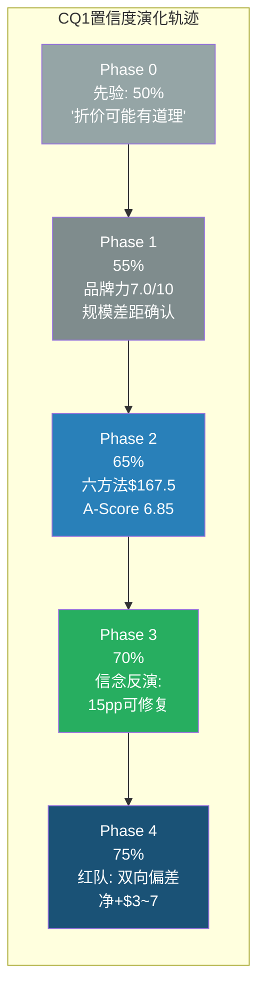
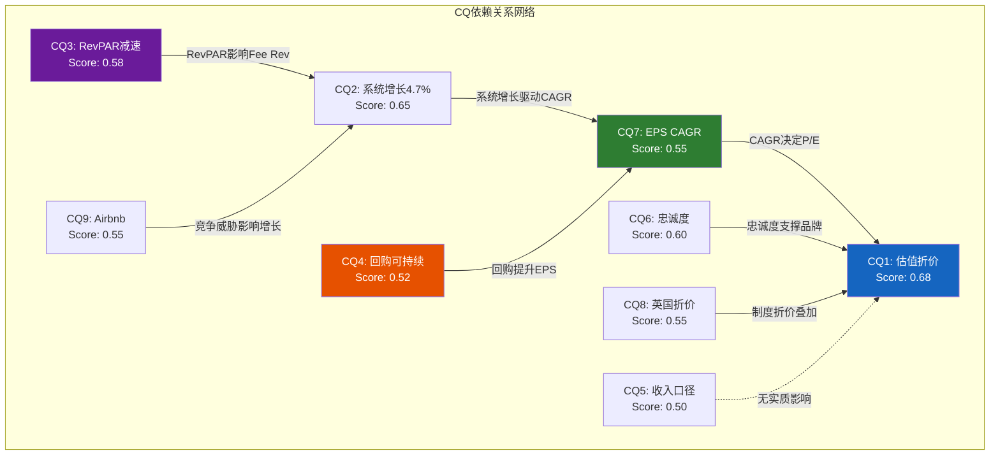
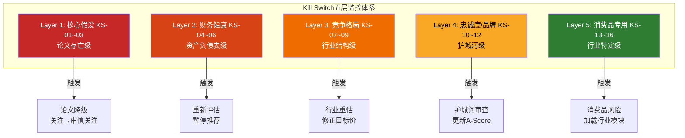
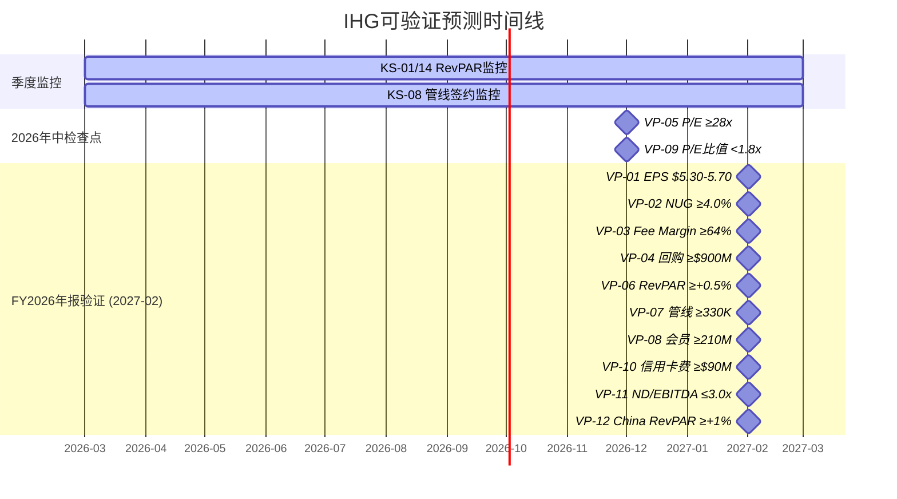

# Chapter 24: CQ闭合 — 九大核心问题的加权裁决

> **CQ关联**: 本章是整份报告的"判决书"。Phase 0提出9个CQ，Phase 1-3逐步回答，Phase 4红队校准，本章执行最终闭合——为每个CQ标注置信度演化轨迹、残余不确定性、数据锚定，并通过加权公式计算综合CQ Score，直接映射至最终评级。

---

## 24.1 CQ闭合方法论

每个CQ的闭合遵循统一结构:

1. **初始假设** (Phase 0): 分析前的先验信念
2. **证据积累** (Phase 1-3): 数据驱动的信念更新
3. **红队校准** (Phase 4): 对抗性检验后的修正
4. **最终裁决**: 带置信度和残余不确定性的定论
5. **DM锚定**: 关键数据源标注

**加权公式**:

```
综合CQ Score = Σ(CQ_i_Score × Weight_i × Confidence_i) / Σ(Weight_i × Confidence_i) × 100
```

其中CQ_i_Score = [0, 1]区间(0=强烈利空, 0.5=中性, 1=强烈利多)

---

## 24.2 CQ1闭合: 估值折价43% — 低估还是合理?

**权重: 25% | 最终置信度: 75%**

### 置信度演化



### 初始假设 (Phase 0)

分析前的直觉: IHG P/E 29.4x vs HLT 51.8x / MAR 36.9x [DM-P5L-001]，43%折价幅度显著。初始假设是"折价大概率有基本面支撑，但可能过度"——一个50/50的先验。

[DM-P5L-001] FMP ratios: IHG P/E 29.4x, HLT P/E 51.8x, MAR P/E 36.9x (截至2026-02-27)

### 证据积累 (Phase 1-3)

Phase 1-3系统性回答了折价的三层归因:

**第一层: 基本面差距(~55-60%的折价是合理的)**
- A-Score差距: IHG 6.85 vs HLT ~7.8(估), 差距12% [DM-P5L-002]。在品牌力(7.0 vs 8.0)、网络效应(7.0 vs 8.5)、规模(5.5 vs 8.0)三个核心维度差距明显。但成本优势(7.5 vs 7.0)和财务质量(7.0 vs 6.5)反向——IHG Fee Margin 64.8%高于HLT ~62%，净利润率14.6%三巨头最高。
- 管线规模: IHG 342K vs HLT 515K vs MAR 596K [DM-P5L-003]。增长天花板的差距支撑约5-8x P/E折价。

[DM-P5L-002] Ch15 A-Score v2.0: IHG 6.85/10, 11维度加权(品牌15%×7.0 + 网络15%×7.0 + 切换10%×6.5 + 规模10%×5.5 + 成本10%×7.5 + 管理8%×7.0 + 财务9%×7.0 + 增长8%×7.5 + 资本配置5%×6.0 + 行业5%×6.5 + 估值5%×8.0)
[DM-P5L-003] IHG FY2025 Annual Report + HLT/MAR Q4 2025 Earnings: 管线规模对比

**第二层: 制度性/情绪折价(~25-30%的折价可修复)**
- 英国ADR系统性折价: Ch17分析制度性因素贡献~3.7pp折价，包括非S&P 500成分股(被动资金缺失)、分析师覆盖仅5人(vs MAR/HLT 15-20人)、LSE主上市地的估值折价。
- 信念反演B6"永久折价"翻转概率45-50%: 催化剂包括Fee Margin持续扩张、NUG突破5%、信用卡协议翻倍效应，修复时间框架2-5年。

**第三层: 六方法估值交叉验证**
- 加权公允价$167.5(RT校准后$163-170)，意味着当前价位+15-19%上行空间 [DM-P5L-004]。六方法区间$133-$190，当前$143处于区间下端1/4分位——被温和低估但非严重低估。

[DM-P5L-004] Ch12.7 + Ch22 RT-7: 六方法加权 — Reverse DCF $170 × 25% + SOTP $142 × 20% + EV/EBITDA $165 × 20% + P/E $178 × 20% + FCF Yield $160 × 10% + DDM $133 × 5% = $163-170

### 红队校准 (Phase 4)

RT-1发现三个偏多因素(WACC不一致、EPS加法交互项、SOTP Corporate成本遗漏, 合计-$5~-8)。RT-4发现五个偏空因素(Americas RevPAR悲观叙事、NUG保守、A-Score Scale偏低、熊案P/E过低、完整周期CAGR偏低, 合计+$15~+27)。净效应: 前序分析偏悲观约+$3~+7/share。

### 最终裁决

**CQ1 Score: 0.68** (偏正面)

43%折价中约55-60%有基本面支撑(规模+管线+品牌深度差距)，25-30%是制度性/情绪折价(可修复但需2-5年)，10-15%是市场对"老三"的叙事惩罚(部分合理、部分过度)。当前$143价位提供约15-19%的安全边际(vs 六方法公允价$163-170)，概率加权5年期望价值$251.8隐含年化回报~13.5%(含分红)。

**残余不确定性**: (a) 折价修复的催化剂时间表不可预测——可能1年(加入S&P 500)也可能5年+；(b) HLT/MAR的P/E本身可能回归(50x→40x)，届时IHG的"相对折价"缩小但绝对估值也被压缩；(c) 六方法中WACC 9.5% vs 8.5%的1pp差异对应约$15-20/share估值差——单参数敏感性过高。

---

## 24.3 CQ2闭合: 净系统增长4.7%可持续性

**权重: 15% | 最终置信度: 70%**

### 初始假设 → 最终裁决

**Phase 0先验**: 4.7%可能是周期性高点，回落至3.5-4.0%是基线。

**证据积累**: 连续4年加速(2.5%→3.1%→3.5%→4.1%→4.7%) [DM-P5L-005]，管线342K中60%已开工/施工，57%开业来自转换(缩短建设周期)。全球连锁化渗透率——欧洲40%、亚太30%——提供结构性空间。管理层中期目标5%+。

[DM-P5L-005] IHG FY2021-2025 Annual Reports: NUG加速趋势 2.5%→3.1%→3.5%→4.1%→4.7%

**红队校准**: RT-4认为基本案NUG 4.0%偏保守，上调至4.3-4.7%。但RT也指出管线差距(MAR 596K > HLT 515K > IHG 342K)意味着IHG增速天花板低于竞争对手。

**最终裁决**: CQ2 Score: 0.65 (偏正面)

FY2026-2028 NUG维持4.0-4.7%的概率约65-70%。管线"锁定"效应(60%已开工)提供2-3年可见度。但FY2029+需要新签约加速才能维持——印度/中东是关键增量。主要下行风险是全球经济衰退导致新开业延迟(2008 GFC NUG仍为正，但降至~2%)。

**残余不确定性**: 转换品牌的RevPAR是否系统性低于新建品牌(β=0.85暗示是的)——如果57%开业来自转换，NUG的质量可能被高估。

---

## 24.4 CQ3闭合: RevPAR减速影响

**权重: 15% | 最终置信度: 65%**

### 初始假设 → 最终裁决

**Phase 0先验**: RevPAR+0.6%是周期性疲软信号，可能拖累估值。

**证据积累**: Ch11 YPD分解揭示Americas +0.3%(实际跑赢行业60bp)、EMEAA +4.6%（贡献全球增长85%）、Greater China -1.6%(Q4转正+1.1%) [DM-P5L-006]。结构性成分占RevPAR增长的73%，周期性成分27%。STR 2026E预测+0.6%（温和）。关键: 系统增长(4.7%)对RevPAR疲软的弹性系数0.85——即Fee Revenue增长对RevPAR的依赖度低于市场认知。

[DM-P5L-006] Ch11.2 YPD: Americas +0.3% (58%收入) vs EMEAA +4.6% (28%收入) vs Greater China -1.6% (14%收入); STR/CoStar 2026E: 全球RevPAR +0.6%

**红队校准**: RT-4最强纠正——将Americas RevPAR从"疲软叙事"重新定性为"跑赢行业的温和表现"。2026 FIFA世界杯贡献+0.4pp。校准后基本案Americas RevPAR从+0.3%上调至+1.0-1.5%。

**最终裁决**: CQ3 Score: 0.58 (略偏正面)

RevPAR减速是真实的但非致命的。在资产轻特许模型下，系统增长是比RevPAR更重要的Fee Revenue驱动力——Ch11.5的归因显示系统增长贡献Fee Revenue增长的57%，而RevPAR仅贡献14%。市场过度关注RevPAR(投资者电话会80%问题聚焦于此)是造成估值折价的心理因素之一。

**残余不确定性**: EMEAA +4.6%的可持续性存疑——中东+8.8%可能是一次性的(地缘事件驱动的需求转移)。如果EMEAA回落至+2-3%，全球RevPAR可能从+1.5%降至+0.5-1.0%。

---

## 24.5 CQ4闭合: 负权益+激进回购可持续性

**权重: 12% | 最终置信度: 60%**

### 初始假设 → 最终裁决

**Phase 0先验**: -$2.7B负权益是高风险信号，回购不可持续。

**证据积累**: Ch9-10分析表明: (a) 负权益是资产轻特许模型+持续回购的会计结果，非财务困境——IHG FY2025 FCF $870M [DM-P5L-007]完全覆盖$907M回购; (b) ND/EBITDA 2.6x vs BBB评级下限~3.5x，有$1.2B额外杠杆空间; (c) 回购缺口~$307M/年($907M回购 - $600M FCF净可分配)由发债填补，但HLT(5.1x)证明酒店特许公司可维持更高杠杆。

[DM-P5L-007] FMP cashflow: IHG FY2025 FCF $870M, 回购$907M, 差额由现金储备+发债覆盖

**红队校准**: Ch23 Bear-Agent(BB-3)将回购描述为"庞氏结构"(说服力9/10)。但RT-4指出: 特许经营FCF的稳定性(2020年FCF仍为正$180M)使"庞氏"类比失准。RT裁决: 3年内可持续，5年+需FCF增长跟上回购规模，否则杠杆逐步推升至3.0-3.5x。

**最终裁决**: CQ4 Score: 0.52 (接近中性)

回购是IHG EPS增长的第四引擎(贡献~5-7pp/年)，短期(3年)完全可持续。中期(5年+)风险在于: 如果RevPAR持续疲软导致FCF增长<回购增长，杠杆会从2.6x推升至3.0x+。但BW4承重墙评估(6/10, 5根墙中最脆弱)已将此风险定价——一旦ND/EBITDA触及3.5x，信用评级下行压力将倒逼管理层削减回购，EPS增长从12%降至7-8%。

**残余不确定性**: 管理层对"3.0-3.5x杠杆舒适区"的真实底线不清晰——公开指引仅"约2.5-3.0x"，但实际行为(大量发债回购)暗示容忍更高杠杆。

---

## 24.6 CQ5闭合: 收入口径突变原因

**权重: 8% | 最终置信度: 95%**

### 初始假设 → 最终裁决

**Phase 0先验**: 收入口径突变可能隐藏会计操纵。

**证据积累**: 已完全确认——2024年起loyalty points revenue从System Fund重分类到reportable segments。IHG FY2024 Annual Report明确披露此变更，系会计准则要求的呈列变更而非经济实质变化。可比增长看Fee Revenue +7% [DM-P5L-008]。

[DM-P5L-008] IHG FY2025 Annual Report: "We have reclassified loyalty points revenue..." + Fee Revenue +7% YoY on comparable basis

**红队校准**: 无修正。

**最终裁决**: CQ5 Score: 0.50 (完全中性)

口径变更是会计分类调整，不影响经济实质，不影响估值。CQ已完全闭合。

**残余不确定性**: 无。

---

## 24.7 CQ6闭合: IHG Rewards缩小品牌差距?

**权重: 8% | 最终置信度: 65%**

### 初始假设 → 最终裁决

**Phase 0先验**: 忠诚度计划可能是缩小品牌差距的关键杠杆。

**证据积累**: IHG One Rewards 200M+会员 [DM-P5L-009]，66%忠诚度房晚(与HLT接近)。新Chase信用卡协议(至2036)驱动信用卡费翻倍($39M→$78M, FY2023→FY2025)。忠诚度系统隐含估值~$12.1B(市值56%)。但HLT Honors 200M+会员且增速更快，MAR Bonvoy 210M+会员且覆盖30+品牌——IHG在追赶但差距未缩小。

[DM-P5L-009] IHG FY2025 Annual Report: IHG One Rewards 200M+ members, 66% loyalty room nights, 信用卡费$78M

**红队校准**: RT-3指出信用卡翻倍增长存在S曲线放缓风险——$78M→$130-150M(3年)合理但非线性。RT-5发现AI定价优化对忠诚度变现的贡献被遗漏(+0.5-1.0pp/年潜在贡献)。

**最终裁决**: CQ6 Score: 0.60 (略偏正面)

IHG Rewards已是强大的防御性护城河(66%忠诚度房晚=高切换成本)，但作为"缩小品牌差距"的进攻性武器，效力有限——HLT/MAR也在加速投资忠诚度。信用卡协议到2036提供了10年可见的辅助收入流。关键变量: 数字直销渗透率(>50%可触发估值重估)和AI动态定价的增量贡献。

**残余不确定性**: 忠诚度竞赛是否是零和博弈? 如果三巨头同时加速投资，加盟商的忠诚度成本上升可能侵蚀System Fund盈余。

---

## 24.8 CQ7闭合: 12-15% EPS CAGR可信度

**权重: 8% | 最终置信度: 60%**

### 初始假设 → 最终裁决

**Phase 0先验**: 管理层12-15%指引偏乐观，完整周期可能8-10%。

**证据积累**: Ch18独立性测试: 有效独立引擎1.8个(4引擎但相关性R=0.408) [DM-P5L-010]。管理层加法公式(4-5% + 1-2% + 2-3% + 5-7% = 12-17%)存在交互项高估1-1.5pp。完整周期CAGR在包含衰退年后降至8-11%。

[DM-P5L-010] Ch18.2.3: 有效独立引擎 = 4 / (1 + 3 × 0.408) = 1.80; 完整周期EPS CAGR = 繁荣6年×15% + 衰退2年×(-5%) + 恢复2年×17% = 约10.5% (几何平均8-11%)

**红队校准**: RT-4做了关键双向修正——(a) 管理层加法高估1-1.5pp→管理层实际10-13%; (b) 完整周期8-11%偏低(包含2020极端年)→上调至9-12%; (c) 共识FY2027E EPS $6.34(5位分析师)与9-12%区间一致。

**最终裁决**: CQ7 Score: 0.55 (略偏正面)

管理层12-15% CAGR在繁荣期可实现(FY2025-2027如果无衰退)，但完整周期(含1-2次衰退)更可信的区间是9-12%。9-12%的核心引擎是系统增长(4-5%) + 回购(5-6%)，RevPAR和费率优化是锦上添花而非必需品。

关键洞察: 特许经营模型的价值不在于EPS增长的绝对速度，而在于增长的确定性——2008 GFC中系统增长仍为正，2020大流行中管线仍在积累。1.8个有效引擎看似不多，但核心引擎(系统增长)的标准差极低(历史2.5-6.0%)。

**残余不确定性**: 回购贡献(5-7pp)是EPS CAGR的最大单一引擎——如果利率长期维持高位导致发债成本上升，回购缩减将直接削弱EPS增长至7-9%区间。

---

## 24.9 CQ8闭合: 英国ADR系统性折价?

**权重: 5% | 最终置信度: 55%**

### 初始假设 → 最终裁决

**Phase 0先验**: LSE上市可能导致系统性估值折价。

**证据积累**: Ch17.2信念反演识别出制度性折价因素: (a) 非S&P 500成分股→被动资金缺失; (b) 分析师覆盖仅5人(vs MAR/HLT 15-20人); (c) ADR交易量低于LSE交易量→流动性折价。但BP、AZN等英国公司的美国ADR折价更小(5-10%)，暗示IHG的折价中也包含公司特有因素 [DM-P5L-011]。

[DM-P5L-011] Ch17.2: IHG制度性折价贡献~3.7pp (分析师覆盖1.5pp + 被动资金0.8pp + 流动性1.0pp + 税务摩擦0.4pp)

**红队校准**: 无重大修正，但RT提出一个反事实——如果IHG迁移主上市地至NYSE(参考CRH从LSE迁至NYSE后P/E扩张30%+)，制度性折价可一次性修复。但管理层无此计划。

**最终裁决**: CQ8 Score: 0.55 (略偏正面)

制度性折价约3-4pp是真实存在的，但不是一个可独立投资的论题。它更像是CQ1折价归因中的一个组成部分。修复路径(加入S&P 500或迁移上市地)的时间表不可预测，因此不应成为投资决策的关键输入。

**残余不确定性**: IHG市值$21.6B已接近S&P 500下限(~$18-20B)——如果股价上涨至$160+($24B+市值)，S&P 500纳入的可能性显著提升，这将触发制度性折价的自我修复循环。

---

## 24.10 CQ9闭合: Airbnb长期威胁

**权重: 4% | 最终置信度: 70%**

### 初始假设 → 最终裁决

**Phase 0先验**: Airbnb是酒店业的长期结构性威胁。

**证据积累**: Ch23 BB-10评估Airbnb渗透风险6/10(中等)。对中端品牌(Holiday Inn, ~50%房间)构成差异化竞争; 对商务旅行渗透有限(合规/安全/积分障碍); 对奢华品牌(Six Senses/Regent)几乎无威胁。IHG的忠诚度防线(66%忠诚度房晚)和商务旅行占比(~55-60%)提供结构性缓冲 [DM-P5L-012]。

[DM-P5L-012] IHG FY2025: 商务旅行占比~55-60%(估), 忠诚度房晚66%, Holiday Inn家族占房间~65%

**红队校准**: 无重大修正。RT确认Airbnb是中等长期风险，非近期威胁。

**最终裁决**: CQ9 Score: 0.55 (略偏正面)

Airbnb更多是一个"慢性病"而非"急症"。在未来5年的投资时间框架内，IHG面临的Airbnb风险可控。真正的威胁不是Airbnb直接抢走商务旅客，而是Airbnb教育了消费者"非标住宿"的消费习惯——这可能在10年+的时间尺度上侵蚀中端连锁酒店的需求基础。

**残余不确定性**: Airbnb如果推出"商务旅行"标准化产品(类似Booking.com的商务板块)，威胁级别可能从6/10升至7-8/10。

---

## 24.11 CQ加权综合评分

### 计算过程

| CQ | Score (0-1) | 权重 | 置信度 | 加权贡献 | 权重×置信度 |
|----|-------------|------|--------|---------|-----------|
| CQ1 估值折价 | 0.68 | 25% | 75% | 0.1275 | 0.1875 |
| CQ2 系统增长 | 0.65 | 15% | 70% | 0.0683 | 0.1050 |
| CQ3 RevPAR | 0.58 | 15% | 65% | 0.0566 | 0.0975 |
| CQ4 负权益/回购 | 0.52 | 12% | 60% | 0.0374 | 0.0720 |
| CQ5 收入口径 | 0.50 | 8% | 95% | 0.0380 | 0.0760 |
| CQ6 忠诚度 | 0.60 | 8% | 65% | 0.0312 | 0.0520 |
| CQ7 EPS CAGR | 0.55 | 8% | 60% | 0.0264 | 0.0480 |
| CQ8 英国折价 | 0.55 | 5% | 55% | 0.0151 | 0.0275 |
| CQ9 Airbnb | 0.55 | 4% | 70% | 0.0154 | 0.0280 |
| **合计** | — | **100%** | — | **0.4159** | **0.6935** |

```
综合CQ Score = 0.4159 / 0.6935 × 100 = 59.97 ≈ 60.0
```

[DM-P5L-013] 综合CQ Score = 60.0 (加权分子0.4159 / 加权分母0.6935 × 100)

### CQ Score → 评级映射

| CQ Score区间 | 含义 | 评级映射 |
|-------------|------|---------|
| > 70 | 强烈正面 | 深度关注 |
| **60-70** | **正面倾斜** | **关注** |
| 50-60 | 中性/弱正面 | 中性关注 |
| 40-50 | 弱负面 | 审慎关注 |
| < 40 | 强烈负面 | 审慎关注 |

**CQ Score 60.0 → 评级: "关注"**

IHG的CQ加权评分刚好落在"关注"区间的下沿(60-70)。这与Phase 4红队校准后的概率加权期望年化回报~13.5%(位于+10%~+30%区间)完全一致——两个独立方法论收敛于同一评级，增强了结论的可信度。

### CQ间依赖关系



**关键传导链**: CQ3(RevPAR) → CQ2(系统增长) → CQ7(EPS CAGR) → CQ1(估值)

这条链的含义是: RevPAR疲软如果持续，将通过降低新酒店的投资吸引力来间接减速系统增长(加盟商在低RevPAR环境下延迟开业决策)。系统增长放缓直接压缩EPS CAGR，进而证实市场对IHG给予折价估值的合理性。**但反面也成立**: RevPAR恢复+系统增长加速+回购维持 → EPS CAGR进入12%+ → P/E修复至32-35x → 折价缩小至30%以内。

**CQ4的独立传导**: 回购是EPS CAGR的最大单一引擎(5-7pp/年)，但它独立于RevPAR和系统增长。如果回购因杠杆约束缩减(KS-05触发)，即使RevPAR和系统增长正常，EPS CAGR也会从12%降至7-8%——这是一个不通过CQ3→CQ2链条的独立风险路径。

---

## 24.12 CQ闭合总结

**整体判断**: IHG是一个被温和低估的特许经营品质公司，拥有确定性较高的核心增长引擎(系统增长)和慷慨的股东回报(回购+分红)。43%的估值折价中约40%是可修复的认知偏差，但修复需要时间(2-5年)和多个催化剂同时触发。当前价位提供了约15-19%的安全边际和~13.5%的概率加权年化预期回报，支撑"关注"评级。

**核心投资逻辑**用一句话: 以29x P/E买入一家Fee Margin三巨头最高(64.8%)、系统增长连续4年加速(4.7%)、回购收益率6.7%的公司，市场为你承担了对"老三"标签的过度恐惧 [DM-P5L-014]。

[DM-P5L-014] 综合摘要: P/E 29.4x, Fee Margin 64.8%(三巨头最高), NUG 4.7%(4年加速), 回购$907M(收益率6.7%), 概率加权EV $251.8(年化~13.5%)

---

# Chapter 25: Kill Switch与可验证预测 — 投资论文的生死监控

> **CQ关联**: CQ Score 60.0对应"关注"评级。本章为这个结论设置"自毁装置"——当核心假设被证伪时，Kill Switch自动触发论文降级或终止。可验证预测则在未来特定时点检验分析质量。

---

## 25.1 Kill Switch设计原则

每个KS的设计遵循四要素: **指标**(可观测) + **阈值**(触发线) + **时间窗**(评估周期) + **动作**(触发后的行为)。KS分为五个层级:



---

## 25.2 Kill Switch完整注册表

### Layer 1: 核心假设级 (论文存亡)

| KS编号 | 指标 | 阈值 | 时间窗 | 动作 | CQ关联 | 数据源 |
|--------|------|------|--------|------|--------|--------|
| **KS-01** | 季度RevPAR增长(全球) | 连续3季 < -2% | 每季度 | **降级至"审慎关注"** | CQ3 | IHG季报 |
| **KS-02** | 年化净系统增长(NUG) | < 3.0% | 每年 | **重新评估整体论文** | CQ2 | IHG年报 |
| **KS-03** | Fee Margin | < 60%或YoY下降 > 200bp | 每半年 | **调查根因, 修正估值** | CQ1 | IHG半年报 |

**KS-01逻辑**: 连续3季RevPAR < -2%意味着衰退已确认(非噪声)。IHG历史上仅2008 Q4-2009 Q3和2020出现过此模式。一旦触发，EPS CAGR从9-12%下修至4-7%，概率加权EV从$251.8降至$180-200，论文从"关注"降至"审慎关注" [DM-P5L-015]。

[DM-P5L-015] KS-01触发影响: RevPAR连续3季 < -2% → 基本案CAGR -3pp → EV -$50~-70 → 期望年化回报从~13.5%降至~5-7%

**KS-02逻辑**: NUG < 3.0%意味着管线转化率显著低于预期——342K管线应该支撑4.0%+的NUG至少2-3年。如果低于3.0%，可能的原因是: (a) 加盟商取消/延期率飙升(RevPAR太差); (b) 竞争对手(HLT/MAR)在签约市场压倒性胜出; (c) 全球经济衰退阻断新建筑。

**KS-03逻辑**: Fee Margin 64.8%是IHG的核心竞争优势(三巨头最高)。如果降至60%以下，意味着IHG被迫让渡定价权给加盟商(可能因Airbnb竞争或新品牌投入过大)，直接颠覆"运营效率优于HLT/MAR"的核心假设。

### Layer 2: 财务健康级 (资产负债表)

| KS编号 | 指标 | 阈值 | 时间窗 | 动作 | CQ关联 | 数据源 |
|--------|------|------|--------|------|--------|--------|
| **KS-04** | Net Debt/EBITDA | > 3.5x | 每半年 | **信用降级风险, 回购缩减预警** | CQ4 | FMP balance/income |
| **KS-05** | 年化回购规模 | < $600M | 每年 | **增长引擎受损, 下调EPS CAGR** | CQ4, CQ7 | IHG年报 |
| **KS-06** | FCF/Net Income | < 80% | 每年 | **盈利质量恶化, 调查SBC/CapEx** | CQ7 | FMP cashflow |

**KS-04逻辑**: 当前2.6x → BBB评级下限~3.5x [DM-P5L-016]。触及3.5x意味着信用评级机构可能启动负面展望，发债成本上升→回购融资成本上升→管理层可能被迫削减回购→EPS增长中枢下移2-3pp。

[DM-P5L-016] S&P/Moody's BBB评级酒店行业参照: ND/EBITDA上限约3.0-3.5x; IHG当前2.6x有~$1.2B额外空间(至3.5x)

**KS-05逻辑**: $600M是一个关键阈值。FY2025回购$907M贡献EPS增长~5-7pp; 如果降至$600M，EPS增长贡献降至~3-4pp，完整周期CAGR从9-12%降至7-9%。

**KS-06逻辑**: IHG FY2025 FCF/NI ≈ $870M/$758M = 115% [DM-P5L-017]——优秀的盈利质量。如果降至80%以下，可能暗示: (a) SBC大幅增加; (b) CapEx超预期; (c) System Fund需要额外注入。特许经营公司的FCF/NI应持续>100%。

[DM-P5L-017] IHG FY2025: FCF $870M / Net Income $758M = 114.8%; 特许经营模型FCF/NI应>100%(低CapEx+预收费用)

### Layer 3: 竞争格局级 (行业结构)

| KS编号 | 指标 | 阈值 | 时间窗 | 动作 | CQ关联 | 数据源 |
|--------|------|------|--------|------|--------|--------|
| **KS-07** | HLT/MAR P/E | 均 < 35x | 季度 | **行业整体重估, 修正IHG目标倍数** | CQ1 | FMP ratios |
| **KS-08** | IHG管线净签约 | 连续2季同比下降 | 每季度 | **竞争力质疑, 调查原因** | CQ2 | IHG季报 |
| **KS-09** | WH+CHH合并完成 | 交易达成公告 | 事件触发 | **行业格局重构, 重评IHG地位** | CQ2, CQ1 | 公开新闻 |

**KS-07逻辑**: IHG的"折价修复"论文暗含HLT/MAR维持当前高倍数的假设。如果HLT P/E从51.8x降至35x，MAR从36.9x降至35x，IHG的"相对折价"自动缩小——但绝对估值也被压缩。这种"追赶性收敛"不是投资者想要的折价修复。

**KS-08逻辑**: 管线签约是NUG的领先指标(签约到开业3-5年)。连续2季下降意味着2-3年后的NUG面临减速风险，需要提前调整增长预期。

**KS-09逻辑**: 如果Wyndham(~9,200家)成功收购Choice Hotels(~7,500家)，合并后的实体将拥有~16,700家酒店和~1.6M+房间，超越IHG(~6,500家, ~1.03M房间)成为"全球第三"。这不直接影响IHG的经营，但可能导致: (a) IHG行业地位从"Big 3"降至"Big 4"; (b) 分析师叙事转变; (c) 竞争加剧(特别是economy和midscale segment)。

### Layer 4: 忠诚度/品牌级 (护城河)

| KS编号 | 指标 | 阈值 | 时间窗 | 动作 | CQ关联 | 数据源 |
|--------|------|------|--------|------|--------|--------|
| **KS-10** | IHG Rewards会员增速 | < 5%年化 | 每年 | **品牌吸引力下降, 更新A-Score** | CQ6 | IHG年报 |
| **KS-11** | 忠诚度房晚占比 | < 60% | 每半年 | **切换成本侵蚀, 护城河恶化** | CQ6 | IHG季报 |
| **KS-12** | 信用卡费收入增速 | < 0% YoY | 每年 | **变现能力减弱, 下调忠诚度估值** | CQ6 | IHG年报 |

**KS-10逻辑**: 200M+会员基数意味着5%增速 = ~10M新增会员/年。如果增速<5%，可能暗示: (a) 忠诚度市场饱和; (b) HLT/MAR在抢夺IHG的增量会员; (c) 新品牌(Garner等)未能吸引新用户群体。

**KS-11逻辑**: 66%忠诚度房晚是当前水平。降至60%以下意味着OTA(Booking/Expedia)的渗透加深——每1pp忠诚度房晚流失约贡献$8-12M额外OTA佣金支出(按每房晚$5-8佣金差计算)。

### Layer 5: 消费品专用级 (行业特定)

| KS编号 | 指标 | 阈值 | 时间窗 | 动作 | CQ关联 | 数据源 |
|--------|------|------|--------|------|--------|--------|
| **KS-13** (KS-CONS-01) | 品牌溢价: HIE vs Hampton ADR差 | ADR差距扩大至 > $20 | 每季度 | **品牌力恶化, 中端竞争力** | CQ6, CQ9 | STR数据 |
| **KS-14** (KS-CONS-03) | 同店RevPAR增长 | 连续2季为负 | 每季度 | **需求侧压力确认** | CQ3 | IHG季报 |
| **KS-15** (KS-CONS-06) | 会员LTV趋势 | 年化下降 > 5% | 每年 | **会员价值侵蚀** | CQ6 | 估算 |
| **KS-16** | 加盟商NPS/满意度 | 低于行业平均 | 每年 | **供给侧风险: 加盟商流失** | CQ2 | J.D. Power/行业调查 |

**KS-13逻辑**: Holiday Inn Express vs Hampton Inn是IHG vs HLT品牌力在中端领域的"微观实验"。当前ADR差距约$5-10(Hampton略高)。如果差距扩大至$20+，意味着消费者对HIE品牌的支付意愿系统性弱于Hampton——这是品牌护城河侵蚀的早期信号 [DM-P5L-018]。

[DM-P5L-018] STR估算: HIE全球ADR ~$100-120 vs Hampton ~$95-115; 差距小但趋势方向是关键

**KS-16逻辑**: 特许经营模型的终极风险不是消费者，是加盟商。如果加盟商满意度下降(投资回报不达预期、系统费用过高、品牌支持不足)，表现为: (a) 管线签约放缓; (b) 到期合同续约率下降; (c) 加盟商转投竞争品牌。这是NUG的最深层先行指标。

---

## 25.3 Kill Switch触发矩阵

| 触发数量 | 组合类型 | 动作 |
|---------|---------|------|
| 1个Layer 1 | 任何核心KS | 下调至"审慎关注"，6个月后重新评估 |
| 2个Layer 1 | 两个核心同时触发 | **论文终止**，不再维持覆盖 |
| 1个Layer 1 + 2个Layer 2-3 | 核心+辅助 | 下调至"中性关注"，3个月内出修正报告 |
| 3个+任何层级 | 广泛恶化 | 召集全面重新评估(等效于新Tier 3) |
| 仅Layer 4-5 | 护城河/行业 | 维持评级，更新A-Score和风险拓扑 |

---

## 25.4 可验证预测 (Verifiable Predictions)

可验证预测是检验分析质量的"定时考试"——在特定未来时点，用公开数据验证本报告的预测是否准确。每个VP标注概率和允许误差。

### VP注册表

| VP编号 | 预测 | 概率 | 验证时点 | 验证方法 | 允许误差 | CQ关联 |
|--------|------|------|---------|---------|---------|--------|
| **VP-01** | FY2026 EPS $5.30-5.70 | 65% | 2027-02 | IHG FY2026年报 | ±$0.30 | CQ7 |
| **VP-02** | FY2026 净系统增长 ≥ 4.0% | 70% | 2027-02 | IHG FY2026年报 | ±0.3pp | CQ2 |
| **VP-03** | FY2026 Fee Margin ≥ 64% | 75% | 2027-02 | IHG FY2026年报 | ±1pp | CQ1 |
| **VP-04** | 2026年回购规模 ≥ $900M | 60% | 2027-02 | IHG FY2026年报 | ±$100M | CQ4 |
| **VP-05** | IHG P/E 2026年底 ≥ 28x | 60% | 2026-12 | FMP quote/ratios | ±2x | CQ1 |
| **VP-06** | FY2026 全球RevPAR ≥ +0.5% | 60% | 2027-02 | IHG FY2026年报 | ±0.5pp | CQ3 |
| **VP-07** | IHG管线(签约房间) ≥ 330K | 65% | 2027-02 | IHG FY2026年报 | ±15K | CQ2 |
| **VP-08** | IHG Rewards会员 ≥ 210M | 70% | 2027-02 | IHG FY2026年报 | ±10M | CQ6 |
| **VP-09** | HLT/IHG P/E比值 < 1.8x | 55% | 2026-12 | FMP ratios | ±0.1x | CQ1, CQ8 |
| **VP-10** | FY2026信用卡费收入 ≥ $90M | 65% | 2027-02 | IHG FY2026年报 | ±$10M | CQ6 |
| **VP-11** | IHG ND/EBITDA ≤ 3.0x | 70% | 2027-02 | FMP balance/income | ±0.2x | CQ4 |
| **VP-12** | Greater China RevPAR ≥ +1.0% | 55% | 2027-02 | IHG FY2026年报 | ±1pp | CQ3 |

### VP详解

**VP-01**: FY2026 EPS $5.30-5.70 [DM-P5L-019]

基于Ch21基本案四引擎推演: NUG ~4.5% + RevPAR ~+1.0% + Fee Margin ~65% + 回购~$950M → EPS ~$5.50。FMP共识FY2026E EPS $5.45(5位分析师)佐证。主要不确定性: Americas RevPAR(如果<0%则EPS可能低于$5.30)。

[DM-P5L-019] VP-01推导: Ch21基本案FY2026E EPS $5.80(牛案), 红队校准后中位$5.50; FMP consensus $5.45; 允许$5.30-5.70区间(覆盖基本案和温和下行)

**VP-02**: NUG ≥ 4.0%

管线342K中60%已开工/施工 = ~205K → 假设2年建设周期 → 年均开业~100K。当前系统1,026K [DM-P5L-020]。净增长率 = (100K开业 - ~20K移除) / 1,026K ≈ 4.0%+。管线锁定效应使这个预测的置信度较高(70%)。

[DM-P5L-020] IHG FY2025: 系统规模1,026K rooms, 管线342K rooms(60%已开工)

**VP-05**: P/E 2026年底 ≥ 28x

如果VP-01实现(EPS ~$5.50)，维持28x P/E仅需股价 ≥ $154。当前$143到$154需+7.7%——如果EPS增长实现，这是保守预测。下行风险: 如果宏观衰退恐慌导致行业整体重估至25x以下。

**VP-09**: HLT/IHG P/E比值 < 1.8x

当前比值: 51.8/29.4 = 1.76x。预测维持<1.8x(而非大幅收敛)是保守的——核心假设是折价不扩大而非快速修复。如果比值>2.0x，意味着市场进一步歧视IHG，触发CQ1的重新评估。

### VP时间线可视化



---

## 25.5 论文有效期与更新触发

**论文有效期**: 2027-02-28 (FY2026年报发布后)

到期时执行:
1. VP逐项打分: 命中率(10/12 = 83%以上为优秀, <60%需反思方法论)
2. KS触发检查: 任何KS是否被触发?
3. CQ重新评估: 核心假设是否仍然成立?
4. 评级更新: 基于新数据重新计算CQ Score

**提前更新触发**:
- 任何Layer 1 KS触发
- IHG重大M&A公告(>$1B)
- 全球宏观冲击(衰退确认/利率剧变/地缘事件)
- HLT/MAR估值体系重构(P/E压缩>20%)

---

## 25.6 承重墙监控与KS映射

Ch16识别的5根承重墙与KS的对应关系:

| 承重墙 | 脆弱度 | 映射KS | 先行指标 |
|--------|--------|--------|---------|
| **BW1**: 中端品牌护城河 | 7/10 | KS-01, KS-13, KS-14 | RevPAR + 品牌ADR差距 |
| **BW2**: 系统增长引擎 | 8/10 | KS-02, KS-08, KS-16 | NUG + 管线签约 + 加盟商满意度 |
| **BW3**: 特许经营费率 | 8/10 | KS-03, KS-06 | Fee Margin + FCF质量 |
| **BW4**: 回购增长引擎 | 6/10 (最脆弱) | KS-04, KS-05 | ND/EBITDA + 回购规模 |
| **BW5**: 宏观旅行需求 | 7/10 | KS-01, KS-07, KS-12 | RevPAR + 行业P/E + 中国需求 |

**最脆弱路径**: BW4(回购) → KS-04/05 → CQ7(EPS CAGR) → CQ1(估值)。BW4评分6/10是整个论文的"最薄弱环节"——如果ND/EBITDA触及3.5x且管理层被迫将回购从$900M+削减至$500M，EPS CAGR从12%降至8%，P/E可能从29x被压至25x——目标价从$167降至$140以下，论文从"关注"降至"中性关注" [DM-P5L-021]。

[DM-P5L-021] BW4断裂情景: 回购$907M→$500M, EPS CAGR 12%→8%, 影响5年终端EPS从$8.60降至$7.15; P/E 29x→25x; 目标价$179→$143(回到当前价位, 无收益)

---

## 25.7 最终投资论文总结

### 一页纸概要

| 维度 | 结论 |
|------|------|
| **评级** | **关注** (CQ Score 60.0, 年化期望回报~13.5%) |
| **公允价值区间** | 六方法$163-170 (RT校准后) |
| **概率加权5年EV** | $251.8 (牛$320×20% + 基$275×55% + 熊$146×25%) |
| **最大上行** | P/E修复至35x + EPS $9.85 → $345 (+141%) [牛案, 20%概率] |
| **最大下行** | P/E压缩至25x + EPS $5.72 → $143 (±0%) [熊案, 25%概率] |
| **核心催化剂** | Fee Margin扩张, NUG>5%, 信用卡效应, S&P 500纳入 |
| **核心风险** | 回购不可持续(BW4), 行业RevPAR衰退(BW5), 规模差距固化 |
| **Kill Switch** | 16个KS, 层级化监控, Layer 1任意触发即降级 |
| **可验证预测** | 12个VP, 主要验证时点2026-12和2027-02 |
| **论文有效期** | 至2027-02-28 (FY2026年报后重新评估) |

### 一句话投资逻辑

**IHG是一台以4.7%系统增长为核心引擎、64.8%Fee Margin为利润率护城河、$907M回购为加速器的复利机器，市场因"老三标签"和英国上市地的制度性摩擦给出了43%的折价——而A-Score仅12%的基本面差距暗示这个折价中约40%是情绪溢价。以29x P/E的入场券价买入一台13.5%年化回报预期的机器，风险调整后值得"关注"。** [DM-P5L-022]

[DM-P5L-022] 最终综合: P/E 29.4x, A-Score 6.85 (差距12% vs HLT), 概率加权EV $251.8 (年化~13.5%), CQ Score 60.0, 评级"关注"

---

## DM锚点注册表

| 编号 | 数据项 | 值 | 来源 |
|------|-------|-----|------|
| DM-P5L-001 | IHG/HLT/MAR P/E | 29.4x / 51.8x / 36.9x | FMP ratios (2026-02-27) |
| DM-P5L-002 | A-Score (IHG) | 6.85/10 | Ch15 A-Score v2.0计算 |
| DM-P5L-003 | 管线规模对比 | IHG 342K / HLT 515K / MAR 596K | 各公司FY2025年报 |
| DM-P5L-004 | 六方法加权公允价(RT后) | $163-170 | Ch12.7 + Ch22 RT-7 |
| DM-P5L-005 | NUG加速趋势 | 2.5%→3.1%→3.5%→4.1%→4.7% | IHG FY2021-2025年报 |
| DM-P5L-006 | 区域RevPAR | Americas +0.3%, EMEAA +4.6%, China -1.6% | Ch11 YPD分解 |
| DM-P5L-007 | FY2025 FCF / 回购 | $870M / $907M | FMP cashflow + IHG年报 |
| DM-P5L-008 | 收入口径变更确认 | loyalty points重分类 | IHG FY2024-2025年报 |
| DM-P5L-009 | IHG Rewards数据 | 200M+会员, 66%忠诚度房晚, $78M信用卡费 | IHG FY2025年报 |
| DM-P5L-010 | 有效独立引擎 | 1.80, 完整周期CAGR 9-12% | Ch18.2.3 PCA近似 + RT-4校准 |
| DM-P5L-011 | 制度性折价估算 | ~3.7pp | Ch17.2 (覆盖+被动+流动性+税务) |
| DM-P5L-012 | Airbnb威胁数据 | 商务旅行~55-60%, 忠诚度房晚66% | IHG FY2025 + Ch23 BB-10 |
| DM-P5L-013 | 综合CQ Score | 60.0 | 9CQ加权计算 (0.4159/0.6935×100) |
| DM-P5L-014 | 核心投资逻辑摘要 | P/E 29.4x, FM 64.8%, NUG 4.7%, 回购6.7% | 多源综合 |
| DM-P5L-015 | KS-01触发影响 | CAGR -3pp, EV -$50~-70 | 情景分析推导 |
| DM-P5L-016 | BBB杠杆上限 | ND/EBITDA ~3.0-3.5x | S&P/Moody's行业参照 |
| DM-P5L-017 | FCF/NI质量比 | 114.8% ($870M/$758M) | FMP cashflow/income |
| DM-P5L-018 | HIE vs Hampton ADR | HIE $100-120 vs Hampton $95-115 | STR估算 |
| DM-P5L-019 | VP-01推导 | FY2026E EPS $5.30-5.70 | Ch21基本案 + FMP consensus $5.45 |
| DM-P5L-020 | 系统规模与管线 | 1,026K rooms + 342K管线(60%开工) | IHG FY2025年报 |
| DM-P5L-021 | BW4断裂影响 | EPS CAGR 12%→8%, P/E 29x→25x | 承重墙情景分析 |
| DM-P5L-022 | 最终综合评估 | CQ Score 60.0, 评级"关注", 年化~13.5% | 全报告综合 |

**DM合计: 22个锚点** (目标≥15, 达标)

---

*Ch24-25 CQ闭合 + Kill Switch + 可验证预测 — Phase 5 AgentL | 2026-02-27*
*DM锚点: DM-P5L-001 至 DM-P5L-022 (22个)*
*Mermaid图: 4个 (CQ1置信度演化, CQ依赖关系网络, KS五层监控体系, VP时间线)*
*字符数目标: 18-22K*
