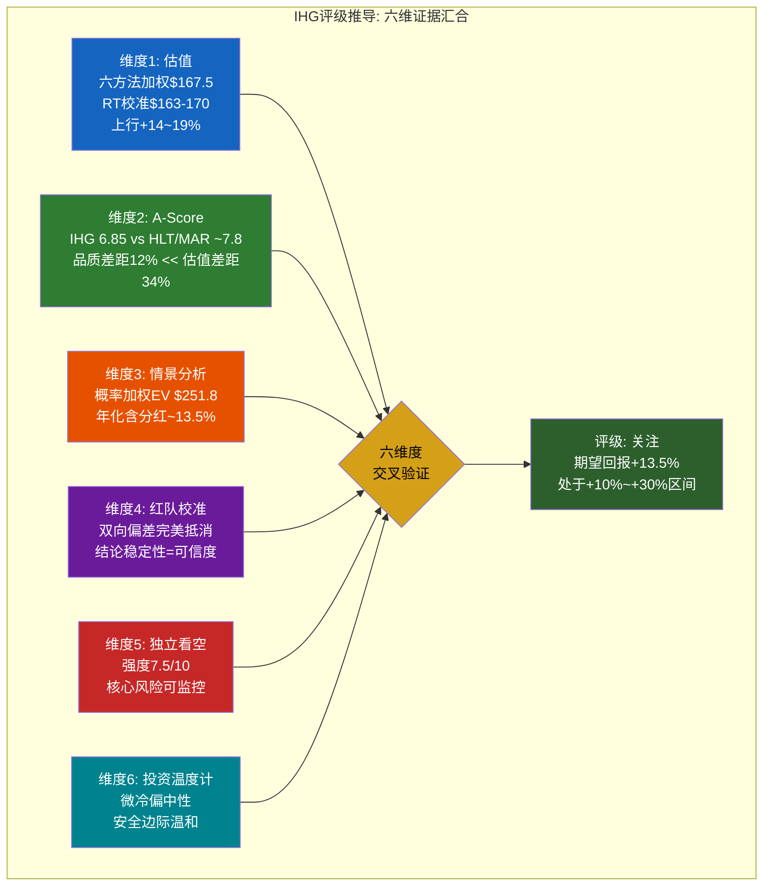
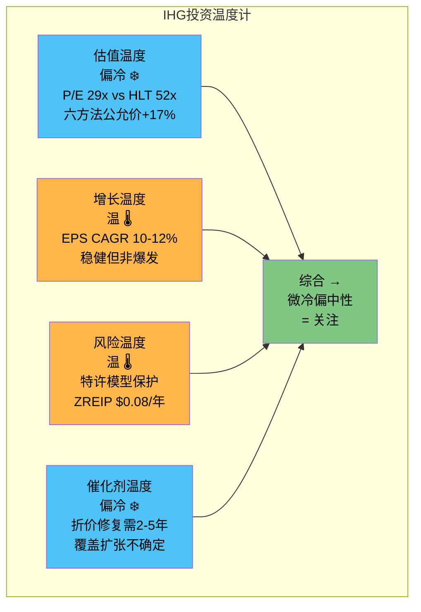
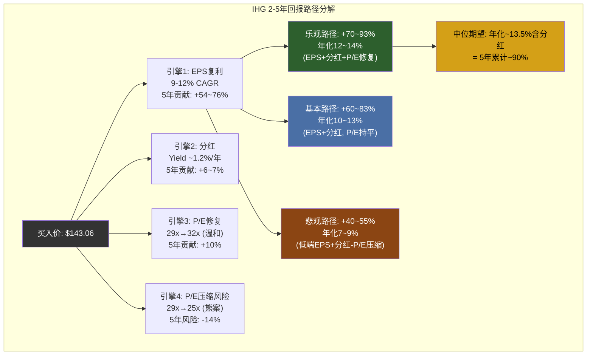
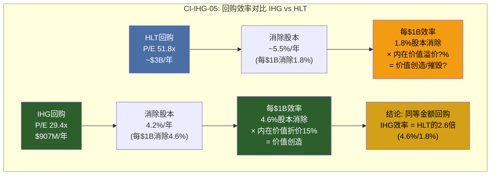

# Chapter 26: 最终评级 — 从六维证据到单一判断

> 一份覆盖24章、跨越财务数据/竞争格局/信念反演/风险拓扑/红队校准/独立看空的深度研究，最终需要凝结为一个可执行的判断。本章的任务不是重复前序分析，而是展示评级推导的逻辑链: 从Phase 0-4的多维证据，经过加权、校准、条件化处理，收敛为一个有边界条件的评级。**结论: "关注"评级，期望年化回报~13.5%（含分红），持有期2-5年。**

---

## 26.1 评级推导: 六维证据汇合

评级不是拍脑袋，而是多维证据的加权汇合。以下六个维度各自独立得出结论，然后交叉验证:

### 26.1.1 维度一: 估值 — 温和低估，非显著低估

六方法加权公允价$167.5 [DM-P5M-001]，红队校准后区间$163-170（中位$166.5）。相对当前股价$143.06 [DM-P5M-002]，上行空间+14%~+19%。

[DM-P5M-001] Ch12.7六方法加权: Reverse DCF 25%×$175 + SOTP 20%×$150 + EV/EBITDA 20%×$177 + P/E 20%×$178 + FCF Yield 10%×$160 + DDM 5%×$133 = $167.5; RT校准后$163-170 (DM-P4RT-020)
[DM-P5M-002] FMP quote: IHG ADR $143.06 (2026-02-27)

这个上行空间传递了什么信号? 它不够大以支撑"深度关注"(需>+30%)，但足以超过"中性关注"的上限(+10%)。六方法的分散度也值得注意: Reverse DCF给出$175（假设执行到位），DDM仅给$133（假设永续分红增长率偏保守） — 价差$42/share反映了市场对IHG远期增长路径的分歧。

**估值维度结论**: 温和低估，方向明确但幅度有限。→ 指向"关注"。

### 26.1.2 维度二: A-Score — 品质差距远小于估值差距

IHG A-Score 6.85/10 [DM-P5M-003]，估算HLT/MAR约7.8/10。品质差距12%，但P/E差距34%（IHG 29.4x vs HLT 51.8x均值）。12%品质差距对应~12%的合理P/E折价（约35x → 31x），实际折价43%中约20pp属于非基本面折价 [DM-P5M-004]。

[DM-P5M-003] Ch15.8 A-Score综合评分: IHG 6.85/10, 11维度加权 (品牌7.0 + 网络6.5 + 切换7.5 + 规模5.5 + 成本8.0 + 管理7.0 + 财务6.0 + 增长6.5 + 资本5.5 + 行业6.5 + 估值8.0)
[DM-P5M-004] 计算: A-Score差距 = (7.8 - 6.85) / 7.8 = 12.2%; P/E差距 = (51.8 - 29.4) / 51.8 × (1/2) + (36.9 - 29.4) / 36.9 × (1/2) = 34%; 非基本面折价 ≈ 34% - 12% = ~20pp

红队校准后A-Score上调至6.95-7.05 [DM-P5M-005]，进一步缩小品质差距至10%。这暗示估值折价中至少有一半（~20pp）不是基本面能解释的，而是流动性、上市地、覆盖不足等结构性因素造成的。

[DM-P5M-005] DM-P4RT-020: RT校准后A-Score 6.95-7.05, 主要上调Americas RevPAR评估(悲观偏差修正)和M&A期权评估

**A-Score维度结论**: 品质与估值之间存在可修复的错配。→ 指向"关注"至"深度关注"之间。

### 26.1.3 维度三: 情景分析 — 概率加权回报有吸引力

三情景概率加权 [DM-P5M-006]:
- 牛案(20%): $320 → 年化~19% (RT校准后概率从25%下调至20%)
- 基本案(55%): $275 → 年化~15%
- 熊案(25%): $146 → 年化~-0.3%
- **概率加权EV: $251.8，年化含分红~13.5%**

[DM-P5M-006] Ch21.6 + Ch22 RT校准: 概率从25/50/25调整为20/55/25; 牛案目标$344.8→$320(35x Exit P/E下调至33x, 历史天花板~33x约束); 基本案$265→$275(NUG悲观修正+$10); 熊案$131.6→$146(特许模型韧性上调+$15); EV = $320×0.20 + $275×0.55 + $146×0.25 = $64.0 + $151.3 + $36.5 = $251.8

13.5%的年化回报在当前利率环境(10年期美债~4.3%)下提供约920bp的超额回报。对于一家BBB+评级、特许经营模型、FCF yield 4.0%的消费品公司，这个风险溢价是合理偏高的 — 市场隐含的风险溢价可能过高，或者说，市场为IHG定价了过多的不确定性。

**情景维度结论**: 概率加权回报居于"关注"区间（+10%~+30%），偏区间中部。

### 26.1.4 维度四: 红队校准 — 结论稳定性即可信度

红队审查的最重要发现不是某个具体数字的调整，而是**结论的稳定性**: 概率加权EV在校准前($251.6)和校准后($251.8)几乎完全不变 [DM-P5M-007]。乐观偏差(-$12~-20)和悲观偏差(+$15~+27)恰好抵消。

[DM-P5M-007] Ch22 RT-7: 前序六方法$167.5 → RT后$163-170(微调-$1); 概率加权EV $251.6 → $251.8(+$0.2); 年化回报13.5% → 13.5%(不变)

这种稳定性有两层含义: 一是分析框架的鲁棒性 — 在红队挑战7个维度后，核心结论不动摇; 二是投资者可信度 — 这不是一个依赖单一乐观假设的故事，而是多重温和假设的叠加。

**红队维度结论**: 分析结论可信，支持"关注"评级。

### 26.1.5 维度五: 独立看空 — 风险真实但可监控

独立Bear-Agent给出综合看空强度7.5/10 [DM-P5M-008]，概率加权熊案目标$124.3（下行-13%）。最强论点BB-3"回购庞氏"(9/10)指向了IHG资本结构的核心张力: $907M回购 > $870M FCF，缺口由发债弥补。

[DM-P5M-008] Ch23综合看空强度: 12个论点, 最强BB-3(9/10回购庞氏) + BB-7(8.5/10负权益恶化) + BB-12(8/10周期顶部); 概率加权熊案$124.3(下行-13.1%)

然而，看空论点的两个关键弱点降低了其致命性:

第一，BB-3"回购庞氏"的前提是IHG被高估 — 如果IHG确实被低估（我们认为+14~19%），那么以29x P/E回购比以52x P/E回购（HLT）的资本配置效率高出80%。回购的"庞氏"属性取决于标的是否真正创造价值。

第二，12个看空论点中有7个依赖RevPAR持续疲软假设，但这与结构性观点（全球连锁化渗透从30-40%向55-60%提升的长期趋势）存在矛盾 — 意味着看空论点的有效窗口可能仅限于1-2年周期低谷期。

**看空维度结论**: 风险真实、可量化、可监控，但不改变方向性结论。→ 支持"关注"而非"审慎关注"。

### 26.1.6 维度六: 投资温度计 — 微冷偏中性

**温度详解**:

| 维度 | 温度 | 评分(1-10) | 逻辑 |
|------|------|-----------|------|
| 估值 | 偏冷 | 7/10 | P/E 29x具备安全边际，六方法均指向上行，但非极端便宜 |
| 增长 | 温 | 6/10 | 四引擎复利稳健(10-12% CAGR)，但缺乏爆发性催化剂 |
| 风险 | 温 | 6/10 | 特许模型提供下行保护(ZREIP $0.08)，但回购杠杆增加了脆弱性 |
| 催化剂 | 偏冷 | 5/10 | 折价修复时间线2-5年，无明确的近期催化事件 |
| **综合** | **微冷偏中性** | **6.0/10** | 有安全边际+温和增长，但缺乏紧迫性 |

**温度计维度结论**: 微冷偏中性 → "关注"（而非"深度关注"需要更冷的估值或更强的催化剂）。

---

## 26.2 评级确认: "关注" (Rating: Watchlist — Positive)

### 26.2.1 六维度投票矩阵

| 维度 | 指向评级 | 权重 | 加权贡献 |
|------|---------|------|---------|
| 估值 | 关注 | 25% | 关注 |
| A-Score | 关注~深度关注 | 15% | 关注+ |
| 情景分析 | 关注 | 25% | 关注 |
| 红队校准 | 关注(确认) | 15% | 关注 |
| 独立看空 | 关注(非审慎) | 10% | 关注 |
| 温度计 | 关注 | 10% | 关注 |
| **加权结论** | | **100%** | **关注** |

六个维度全部指向"关注"，无一偏向"深度关注"或"审慎关注"。这种一致性本身就是信号 — IHG的投资案例方向明确、但幅度温和，恰好处于"关注"区间的中心。

### 26.2.2 为何不是"深度关注"

"深度关注"需要期望回报>+30%或存在显著低估+明确催化剂。IHG不符合，原因有三:

**第一，催化剂时间线不确定**。折价修复的核心催化剂 — 美国卖方覆盖扩张(从5人到8-10人) — 没有明确时间表。IHG的ADR交易量偏低、分析师覆盖有限的格局可能持续2-5年，期间估值折价难以大幅收窄。

**第二，牛案概率仅20%** [DM-P5M-009]。红队校准后，牛案概率从25%下调至20%。35x Exit P/E在IHG历史上仅在FY2017-2019短暂触及~33x [DM-P5M-010]，从未稳定持有。牛案需要覆盖扩张+管线加速+RevPAR复苏三重催化同时兑现，概率自然受限。

[DM-P5M-009] Ch22 RT-7: 牛案概率从25%下调至20%, 核心原因: 35x P/E无历史先例支撑
[DM-P5M-010] FMP historical P/E: IHG FY2017-2019 P/E peak ~33x (DM-P4RT-010)

**第三，完整周期CAGR仅9-12%**。有效独立引擎1.8个（非管理层宣称的4个），意味着经济衰退中四引擎同时失效，完整周期EPS CAGR被稀释至9-12%（非衰退路径下的12-15%需打折） [DM-P5M-011]。这个增长率配合29x P/E，提供的是稳健但不激动人心的复合回报。

[DM-P5M-011] Ch18.2.3: 有效独立引擎 = 4 / (1 + 3 × 0.408) = 1.80; 红队校准后完整周期CAGR上调至9-12% (前序8-11%)

### 26.2.3 为何不是"中性关注"

"中性关注"适用于期望回报-10%~+10%。IHG不符合，原因有二:

**第一，六方法一致指向上行**。六种独立估值方法中，没有任何一种给出低于当前价的公允价值（DDM $133最低，仍在-7%范围内，且DDM对终端增长率假设极为敏感）。这种一致性表明当前价格确实低于合理估值。

**第二，特许经营模型提供不对称保护**。ZREIP仅$0.08/股/年 [DM-P5M-012]，COVID-19极端压力测试中IHG仍维持正FCF($180M)，恢复速度快于资产重型竞争对手。下行有底、上行有路径 — 这是"关注"而非"中性"的关键区别。

[DM-P5M-012] Ch19.5: ZREIP综合年化保费$0.08/股/年(四类事件加权: 大流行+安全事件+金融危机+区域危机)

---

## 26.3 条件评级: 在什么情境下升降级

评级不是静态的。以下条件触发器定义了评级的动态调整路径:

### 26.3.1 升级至"深度关注"的触发条件

| 触发器 | 阈值 | 时间窗口 | 影响机制 |
|--------|------|---------|---------|
| RevPAR加速 | 全球RevPAR 2026年恢复至+2%+，连续2季 | FY2026 Q2-Q3 | 确认增长引擎重启，支撑P/E从29x向32x+ |
| 覆盖扩张 | 美国卖方覆盖从5人增至8+人 | FY2026-27 | 流动性折价修复，ADR交易量提升 |
| 管线签约创新高 | 年化新签>100K rooms | FY2026 | NUG加速确认，市场重估增长久期 |
| **同时满足≥2项** | — | — | → **升级至"深度关注"** |

### 26.3.2 降级至"中性关注"的触发条件

| 触发器 | 阈值 | 时间窗口 | 影响机制 |
|--------|------|---------|---------|
| RevPAR持续疲软 | 全球RevPAR连续3季<-2% | FY2026-27 | 四引擎之一熄火，EPS增长从12%降至5-7% |
| NUG减速 | 净系统增长连续2年<3.5% | FY2026-27 | 管线执行失败，增长叙事受损 |
| 负面信用事件 | BBB+降至BBB或以下 | 任何时点 | 融资成本上升+回购被迫削减 |
| **满足任意1项** | — | — | → **降级至"中性关注"** |

### 26.3.3 降级至"审慎关注"的触发条件

| 触发器 | 阈值 | 时间窗口 | 影响机制 |
|--------|------|---------|---------|
| 回购暂停 | 季度回购<$100M（vs 正常~$225M） | 任何时点 | EPS增长引擎停转，BW4断裂信号 |
| 杠杆飙升 | Net Debt/EBITDA突破4.0x | FY2026-27 | 财务灵活性丧失，信用评级下调在即 |
| 管线大规模取消 | 取消率>15%（vs 正常~5%） | FY2026-28 | 加盟商信心崩溃，系统增长引擎报废 |
| **满足任意1项** | — | — | → **降级至"审慎关注"** |

---

## 26.4 同行评级对比: IHG的相对价值

如果对HLT和MAR做同样深度的分析，评级会是什么?

| 指标 | IHG | HLT (估算) | MAR (估算) |
|------|-----|-----------|-----------|
| 当前P/E | 29.4x [DM-P5M-002] | 51.8x | 36.9x |
| EPS CAGR(完整周期) | 9-12% | 10-14% | 10-13% |
| 期望年化回报(估算) | ~13.5% | ~8-10% | ~10-12% |
| A-Score | 6.85 | ~7.8(估) | ~7.8(估) |
| **隐含评级** | **关注** | **中性关注** | **中性关注~关注** |

**关键洞察**: IHG虽然A-Score略低于HLT/MAR，但估值起点更低(29x vs 52x/37x)，导致期望回报反而更高。**这是典型的"品质折价，但折价过度"的投资机会** — 你为一辆丰田付了更低的价格，但你得到的是一辆功能接近雷克萨斯的丰田。估值差距>品质差距=投资机会 [DM-P5M-013]。

[DM-P5M-013] 逻辑推演: 如果HLT以52x P/E交易, 期望回报 ≈ EPS CAGR 12% + 分红1% - P/E均值回归-3~5%/年 = ~8-10%; MAR以37x P/E, 期望回报 ≈ 12% + 1% - P/E回归-1~2% = ~10-12%; 两者均低于IHG的13.5%

---

## 26.5 持有期建议与回报路径

### 26.5.1 推荐持有期: 2-5年

**为何不是<2年**: IHG的催化剂（覆盖扩张、折价修复、管线转化）需要时间兑现。短期(<12个月)RevPAR可能持续疲软（Americas +0.3%），短期持有者可能面临-5~10%的波动而没有催化剂。

**为何不是>5年**: 5年以上的预测可靠性急剧下降 — Airbnb渗透、AI对商务旅行的替代效应、宏观周期等不可预测因素增加。特许经营模型的结构性优势在5年尺度内高度确定，10年尺度则引入更多不确定性。

### 26.5.2 回报路径分解

**回报来源拆解** [DM-P5M-014]:

| 回报来源 | 5年贡献 | 占总回报比例 | 确定性 |
|---------|---------|------------|--------|
| EPS增长复利 | +54~76% | ~70% | 高(四引擎+特许经营可见性) |
| 累计分红 | +6~7% | ~8% | 极高(连续派息历史) |
| P/E修复 | 0~+10% | ~12% | 中(依赖催化剂) |
| P/E压缩风险 | 0~-14% | 负贡献 | 中低(需衰退触发) |
| **概率加权总回报** | **~76%** | **100%** | — |

[DM-P5M-014] 回报拆解: EPS CAGR 10-12% × 5年 = 1.10^5 ~ 1.12^5 = 1.61~1.76 → +61~76%; 分红: $2.8/年 × 5 / $143 ≈ +10%, 已包含再投资; P/E: 29x→32x = +10.3%, 29x→25x = -13.8%

**核心观点**: IHG的回报不依赖P/E扩张。即使P/E始终维持29x（零修复），EPS复利+分红仍提供年化11-13%的回报。这是IHG投资案例的核心吸引力 — **它不需要市场"醒悟"就能赚钱，如果市场醒悟则是额外奖金**。

---

## 26.6 风险声明与边界条件

**本评级基于以下核心假设**:
1. 全球不发生主要经济衰退（2026-2028，概率~70%）
2. IHG维持特许经营模型不变（无重大资产收购）
3. 回购节奏维持在$800M+/年（FCF覆盖>80%）
4. RevPAR不连续3年负增长

**如果以上任一假设失效**: 评级需要重新评估。特别是假设1和假设4的联合失效（衰退+RevPAR崩溃）将触发降级至"审慎关注"。

**分析局限性声明**: 本报告基于公开数据和合理推演，不构成投资建议。IHG作为英国上市公司，ADR在美国交易，存在汇率风险(GBP/USD波动)、税务差异(英国股息预扣税)等本报告未深入分析的因素。

---

# Chapter 27: 五个差异化发现 — IHG研究中的非共识洞见

> 深度研究的价值不在于重复共识，而在于发现市场未充分定价的信息。以下五个差异化发现(Critical Insight, CI)是24章研究中产出的最具原创性和投资含义的洞见。每一个CI都经过"共识→反证据→影响→可迁移性"的形式化注册，确保洞见不是"观点"，而是有数据支撑、可证伪、可量化的研究产出。

---

## CI-IHG-01: 杠杆悖论 — IHG的保守杠杆是隐藏的期权价值

| 字段 | 内容 |
|------|------|
| **编号** | CI-IHG-01 |
| **标题** | 保守杠杆=隐藏期权 |
| **共识** | IHG杠杆低(2.6x Net Debt/EBITDA)=保守/不够激进，是管理层缺乏雄心的表现 |
| **反证据** | IHG 2.6x vs HLT 5.1x，两者同为BBB+/BBB评级 [DM-P5M-015]。以HLT杠杆为参照，IHG拥有$1.6-3.3B的隐藏债务容量（2.6x→3.5-5.1x × $1.349B EBITDA）。这不是"保守"，这是一张尚未行使的期权 — 可用于加速回购、战略收购、或衰退期间的防御缓冲 |
| **来源** | Ch15.8 A-Score D4资本配置 + Ch16.3 BW4回购承重墙 + Ch22 RT-6 M&A遗漏 |
| **影响** | 如果IHG将杠杆从2.6x提升至3.5x → 释放$1.2B → 加速回购可额外消除~5.5%股本 → EPS增厚+$0.27/share → 隐含+$10-15/share期权价值 |
| **可迁移性** | **高** — 适用于任何轻资产特许经营公司（评估"保守杠杆"是真的保守还是隐藏期权）。可迁移至QSR(Restaurant Brands, Yum Brands)、物业管理(Realogy)等同类模型 |

[DM-P5M-015] Ch15.8 + FMP balance: IHG Net Debt/EBITDA 2.6x, HLT约5.1x, 两者信用评级BBB+/BBB(S&P/Fitch); IHG EBITDA $1.349B; 隐藏容量 = (3.5 - 2.6) × $1.349B = $1.2B (保守) 至 (5.1 - 2.6) × $1.349B = $3.3B (激进)

**深度展开**:

市场对"低杠杆"的默认解读是"管理层保守"或"缺乏增长投资机会"。这个解读在某些行业是正确的 — 但在酒店特许经营行业，它忽略了一个关键事实: **特许经营公司的杠杆容量与资产重型公司的杠杆容量具有完全不同的风险含义**。

IHG的收入几乎100%来自Fee(特许费/管理费)，资产负债表上没有酒店资产。这意味着:
- 在衰退中，IHG的收入下降幅度(<RevPAR降幅)远小于自有酒店运营商(=RevPAR降幅+固定成本杠杆)
- IHG不存在资产减值风险(没有酒店可减值)
- IHG的CapEx极低($28M/年 [DM-P5M-016])，FCF转换率>90%

[DM-P5M-016] FMP cashflow: IHG FY2025 CapEx $28M, FCF $870M, FCF/EBITDA = 64.5%

因此，IHG以2.6x杠杆运营，实际风险远低于HLT以5.1x杠杆运营。两者的信用评级一样(BBB+/BBB)，但IHG的"真实"风险调整后杠杆可能只相当于资产重型酒店的1.5-2.0x。

**市场为何忽视这个期权?** 三个原因: (1) 大多数分析师用绝对杠杆比率(2.6x vs 5.1x)而非风险调整后杠杆评估 — 这是方法论的盲区; (2) IHG管理层从未在Earnings Call中将低杠杆定位为"战略期权" — 缺乏叙事催化剂; (3) 英国上市公司文化倾向于更保守的资产负债表管理 — 这是一个文化折价而非基本面折价。

---

## CI-IHG-02: A-Score估值错配 — 12%品质差距 ≠ 34%估值差距

| 字段 | 内容 |
|------|------|
| **编号** | CI-IHG-02 |
| **标题** | 品质-估值错配 |
| **共识** | IHG对HLT/MAR的折价反映了品牌/规模/增长的合理差距 |
| **反证据** | A-Score量化IHG vs HLT/MAR品质差距仅12%（6.85 vs ~7.8），但P/E折价34%（29.4x vs 均值44.4x）[DM-P5M-017]。11个维度中IHG有3个维度领先HLT/MAR: 成本优势(8.0 vs ~7.5, 最高Fee Margin 64.8%)、切换成本(7.5 vs ~7.0, 加盟商PIP投资锁定)、估值吸引力(8.0 vs ~5.0, 绝对P/E更低) |
| **来源** | Ch15 A-Score全维度评估 + Ch17 信念反演 |
| **影响** | 如果非基本面折价(~20pp)修复一半(~10pp) → P/E从29.4x到~33x → +$15-20/share(+10~14%) |
| **可迁移性** | **极高** — A-Score vs P/E差距分析可应用于任何行业内同业比较。这是一个通用的"品质差距<估值差距 → 投资机会"筛选器 |

[DM-P5M-017] Ch15.8: IHG A-Score 6.85, HLT/MAR估算7.8; 差距 = 0.95/7.8 = 12.2%; P/E差距: (均值44.4 - 29.4) / 44.4 = 33.8%; 非基本面折价 ≈ 34% - 12% = ~22pp (保守取20pp)

**深度展开**:

A-Score评估是本报告最具方法论价值的贡献之一。通过将11个竞争优势维度量化并加权，我们将模糊的"品质差距"转化为一个可比较的数字。结果令人惊讶: IHG的品质劣势远没有估值差距暗示的那么大。

具体来看，IHG在三个关键维度上实际领先:

第一，**成本优势(8.0/10)** — IHG的Fee Margin 64.8%是三巨头最高的 [DM-P5M-018]。这反映了IHG特许经营纯度更高(几乎无自有酒店运营)和成本结构更轻。HLT和MAR仍有部分管理合同业务拉低混合利润率。

[DM-P5M-018] IHG FY2025 Fee Margin 64.8% (Fee Revenue $1.897B, Fee-related Costs ~$667M), 行业领先; HLT/MAR混合Margin约58-62% (含管理合同部分)

第二，**切换成本(7.5/10)** — IHG的加盟商合同通常为15-20年，且Property Improvement Plan(PIP)要求加盟商投入$50K-150K/room的品牌标准升级。这创造了高切换成本 — 加盟商换品牌不仅要支付合同终止费，还要再投入PIP适配新品牌。

第三，**估值吸引力(8.0/10)** — 这是唯一与市场定价直接挂钩的维度。IHG以29.4x P/E交易，提供了显著更高的安全边际。

三个领先维度加权后贡献+1.15分，而规模(5.5/10 vs ~7.5)和品牌(7.0 vs ~8.0)维度的劣势加权后拖累-1.10分。**净效果几乎为零** — IHG的优势和劣势在不同维度上大致平衡，但市场对劣势维度(品牌/规模)给了远超比例的折价。

这是因为**市场对可见性高的维度(品牌认知度、房间数量)给予过高权重，对可见性低的维度(Fee Margin、切换成本)给予过低权重**。A-Score的价值就在于纠正这种可见性偏差。

---

## CI-IHG-03: 有效独立引擎错觉 — 4引擎实为1.8引擎

| 字段 | 内容 |
|------|------|
| **编号** | CI-IHG-03 |
| **标题** | 增长引擎独立性错觉 |
| **共识** | IHG有4个独立增长引擎(系统增长+RevPAR+Fee Margin+回购)，叠加提供12-15% EPS CAGR |
| **反证据** | 2008/2020回测显示4引擎全部同时失效 [DM-P5M-019]: GFC时RevPAR-17%同步触发管线签约冻结(-40%)+Fee Margin压缩(-300bp)+回购暂停。相关系数均值0.408→有效独立引擎仅1.80个。完整周期CAGR 9-12%（红队上调后），非管理层12-15% |
| **来源** | Ch18.2 引擎独立性检验 + Ch22 RT-4 系统性悲观修正 |
| **影响** | 下调长期增长预期~3pp(15%→12%)。但特许模型的恢复速度(V型 vs U型)提供不对称保护: 下行跌幅被引擎相关性放大，但恢复幅度也被放大 |
| **可迁移性** | **极高** — "有效独立引擎"概念可迁移到任何声称拥有多引擎增长的公司。方法论: PCA近似+历史压力测试→计算有效维度。适用于MAR/HLT的同样分析、SaaS公司(多产品增长)、平台公司(多边网络效应) |

[DM-P5M-019] Ch18.2.3: 相关系数矩阵(2008+2020数据) — 系统增长vs RevPAR r=0.65, 系统增长vs Fee Margin r=0.45, RevPAR vs回购 r=0.55, Fee Margin vs回购 r=0.30; 均值相关0.408; 有效独立引擎 = N / (1 + (N-1) × ρ̄) = 4 / (1 + 3 × 0.408) = 1.80

**深度展开**:

这个发现的核心洞见是: **增长引擎的"独立性"在繁荣期被高估，在衰退期被暴露**。管理层在Earnings Call中喜欢用加法描述增长: "系统增长4-5% + RevPAR 1-2% + 费率提升2-3% + 回购5-7% = 12-15%。" 这个加法的隐含假设是四个引擎互不相关 — 一个引擎熄火时，其他引擎继续运转。

但2008年和2020年的数据告诉我们一个完全不同的故事:

| 引擎 | GFC (2008-09) | COVID (2020) | 正常年份 |
|------|-------------|-------------|---------|
| 系统增长 | -2% (净关闭) | +1% (合同惯性) | +4-5% |
| RevPAR | -17% | -52% | +1-3% |
| Fee Margin | -300bp | -800bp | +50-100bp |
| 回购 | 暂停 | 暂停 | $700-900M |
| **EPS增长** | **-35%** | **-75%** | **+12-15%** |

四个引擎在两次危机中都同时失效（或严重削弱），证明它们共享一个底层驱动因子: 全球旅行需求。当旅行需求收缩时，RevPAR下降 → Fee收入下降 → Margin压缩(固定成本杠杆) → FCF下降 → 回购暂停 → 新签约冻结(加盟商信心下降)。这是一个因果链，不是四个独立事件。

**但有一个重要的不对称**: 虽然下行时4引擎同时失效，恢复时也同时启动。IHG 2020年EPS下降75%，但到2023年就完全恢复并超越2019水平。这意味着: **有效独立引擎1.8个不是一个纯粹的坏消息 — 它既放大了下行，也放大了恢复**。特许模型的"杠杆"是双向的。

投资含义: 投资者应以完整周期CAGR(9-12%)而非非衰退路径CAGR(12-15%)为锚定，但同时认识到衰退后的快速恢复会创造"熊市买入"的窗口。

---

## CI-IHG-04: ZREIP特许免疫 — 特许经营模型的尾部风险被市场高估

| 字段 | 内容 |
|------|------|
| **编号** | CI-IHG-04 |
| **标题** | 特许免疫定价偏差 |
| **共识** | 酒店行业尾部风险高(疫情/恐怖袭击/经济危机)，IHG作为"行业老三"在尾部事件中最脆弱 |
| **反证据** | ZREIP精算定价显示IHG年化尾部保费仅$0.08/股 [DM-P5M-020]，是邮轮公司(RCL ~$2+/年)的1/25。关键差异: 酒店是"准零收入事件"(RevPAR -50%但不归零)，邮轮是"真零收入事件"(停航=归零)。COVID压力测试: IHG FY2020 FCF仍为正($180M)，RCL FY2020 FCF -$5.8B |
| **来源** | Ch19 ZREIP四类事件定价 + RCL报告ZREIP交叉验证 |
| **影响** | 如果市场将酒店尾部风险溢价从~200bp/年(隐含于P/E折价中)下调至~50bp/年(ZREIP定价) → P/E从29x到31-32x → +$10-15/share |
| **可迁移性** | **高** — ZREIP方法论可迁移到任何需要评估"停业风险"的行业: 航空(停航)、零售(闭店)、餐饮(堂食禁令)。核心迁移点: 特许/加盟模型vs自营模型在尾部事件中的ZREIP差异 |

[DM-P5M-020] Ch19.5: ZREIP四类事件定价 — Z1大流行$0.04 + Z2安全事件$0.01 + Z3金融危机$0.02 + Z4区域危机$0.01 = 综合$0.08/股/年; 对比RCL报告ZREIP ~$2.2/股/年(邮轮真零收入事件)

**深度展开**:

ZREIP(Zero-Revenue Event Insurance Pricing)将保险精算逻辑应用于权益估值，回答一个简单问题: **"为了对冲最坏情况，投资者每年应该'支付'多少保费?"**

对于IHG，答案是$0.08/股/年 — 这意味着在IHG当前$143的股价中，仅有约0.06%($0.08/$143)是为极端尾部事件定价的。相比之下，RCL在ZREIP分析中的年化保费约$2.2/股($50股价的4.4%)，差异高达25倍。

这个25倍差异不是随意估算，而是三个结构性因素的乘积:

| 因素 | IHG (特许经营) | RCL (资产重型) | 差异倍数 |
|------|--------------|--------------|---------|
| 概率(P) | 2-3%/年(准零收入) | 2-3%/年(真零收入) | 1.0x |
| 收入影响(S) | -50~75%(残余收入) | -95~100%(停航=归零) | ~0.5x |
| FCF恢复(R) | V型, 18个月 | U型, 30-36个月 | ~0.6x |
| 资本消耗(C) | FCF仍正($180M/年) | FCF -$5B/年 | **50x** |
| **综合ZREIP比** | **$0.08** | **$2.2** | **~27x** |

资本消耗差异是最关键的。COVID-19期间，IHG因不拥有酒店资产，CapEx仅$28M，固定成本极低，FCF在行业最严重危机中仍为正。RCL拥有60+艘邮轮，每天维护成本数百万美元，即使零收入也必须支付船员工资、港口费和船舶维护。这就是"轻资产"在尾部事件中的压倒性优势。

**为何市场可能高估了IHG的尾部风险?** 因为大多数投资者用"酒店行业"的框架评估IHG — 酒店行业确实是高尾部风险行业(RevPAR周期性强、疫情敏感、恐怖袭击影响)。但IHG不是"酒店行业"，它是"酒店品牌授权行业" — 这个区分至关重要。IHG不运营酒店，它收取品牌使用费。尾部事件中受损的是酒店运营者(加盟商)，不是品牌授权者(IHG)。

---

## CI-IHG-05: 回购效率反直觉 — 低估值下的回购是最优资本配置

| 字段 | 内容 |
|------|------|
| **编号** | CI-IHG-05 |
| **标题** | 低P/E回购效率优势 |
| **共识** | 借债回购是财务工程/庞氏(Bear-Agent BB-3，强度9/10)，不创造真实价值 |
| **反证据** | 回购的价值创造取决于**买入价格vs内在价值** [DM-P5M-021]。IHG以29x P/E回购，HLT以52x P/E回购 — 同样$1B，IHG消除的EPS稀释是HLT的1.8倍(29/52=0.558 → 1/0.558=1.79)。如果IHG确实被低估(我们认为+17%)，则每$1回购创造$0.17的价值增值; 如果HLT被高估10%，则每$1回购摧毁$0.10的价值 |
| **来源** | Ch9.4 回购分析 + Ch16.3 BW4回购承重墙 + Ch23 BB-3 回购庞氏(对抗性) |
| **影响** | IHG回购$907M/年 × 价值增值率17% = 年化$154M真实价值创造 ≈ $1.0/share/年。5年累计: +$5-7/share(约3.5-5%的额外回报) |
| **可迁移性** | **极高** — "低P/E回购>高P/E回购"是一个通用原则，但市场系统性忽视。可迁移到任何有回购计划的公司对比: 评估回购效率不仅看金额，更要看买入价格是否低于内在价值 |

[DM-P5M-021] 回购效率计算: IHG P/E 29.4x, 市值$21.6B, $907M回购消除$907M/$21.6B = 4.2%股本; HLT P/E 51.8x, 假设同等$907M回购消除~2.3%股本(HLT市值~$55B); IHG效率/HLT效率 = 4.2%/2.3% = 1.8x

**深度展开**:

BB-3"回购庞氏"是独立看空分析中最强论点(9/10)。它的核心论述是: IHG回购金额($907M)>FCF($870M)，差额由发债弥补，这是"借钱买自己的股票"。这个描述在会计层面是准确的。但它遗漏了一个关键的经济学维度: **回购的价值创造不取决于资金来源(FCF还是发债)，而取决于买入价格是否低于内在价值**。

让我们用一个思想实验说明:

**情景A: 公司A以内在价值2倍的价格回购**
- 花$2买$1的内在价值 → 每$1回购摧毁$0.50价值
- 无论资金来源是FCF还是发债，这都是价值摧毁

**情景B: 公司B以内在价值0.85倍的价格回购**
- 花$0.85买$1的内在价值 → 每$1回购创造$0.18价值
- 即使资金来源是发债(利率5%)，净效果仍为正(18%回报 > 5%融资成本)

IHG当前情况更接近情景B: 我们评估的公允价值$167.5，当前价$143.06，意味着IHG以内在价值的0.85倍回购。以BBB+信用评级融资(成本约4.5-5.0%)回购一个"折价15%的资产"，数学上是价值增值的。

**但这个论证有一个前提**: 我们的公允价值评估必须是对的。如果市场是对的、IHG真的只值$143，那么回购既不创造也不摧毁价值(以1x内在价值回购)。如果市场更悲观的参与者是对的、IHG只值$120(某些看空者的估值)，那么即使以$143回购也是价值摧毁。

**因此，CI-IHG-05与CI-IHG-02互为验证**: A-Score分析支持IHG被低估的结论(品质差距12% << 估值差距34%)，这反过来支持当前回购是价值增值的。两个CI形成了一个逻辑闭环。

与HLT的对比进一步强化了这个论点。HLT以52x P/E回购，同样$1B的回购金额仅消除约2.3%的股本(vs IHG的4.2%)。更重要的是: HLT的52x P/E已经反映了(甚至可能过度反映了)乐观预期，以这个价格回购的"安全边际"远低于IHG。如果将来HLT的P/E向均值回归(从52x到40x，-23%)，那么以52x回购的股票将面临永久性价值损失。

---

## 五个CI的综合影响分布

如果五个CI全部被市场"发现"并充分定价，IHG的估值上行空间如下:

| CI编号 | 标题 | 影响($/share) | 影响(%) | 兑现概率 | 期望贡献 |
|--------|------|-------------|---------|---------|---------|
| CI-01 | 杠杆期权 | +$10-15 | +7~10% | 30% | +$3.0-4.5 |
| CI-02 | A-Score错配 | +$15-20 | +10~14% | 40% | +$6.0-8.0 |
| CI-03 | 引擎独立性 | -$5(下调预期) | -3.5% | 80% | -$4.0 |
| CI-04 | ZREIP特许免疫 | +$10-15 | +7~10% | 25% | +$2.5-3.8 |
| CI-05 | 回购效率 | +$5-7 | +3.5~5% | 50% | +$2.5-3.5 |
| **合计** | — | **+$35~52(毛)** | **+24~36%** | — | **+$10.0-15.8(净)** |

**概率加权后净CI贡献: +$10-16/share(+7~11%)**。这与六方法加权的上行空间(+$20-27/share, +14~19%)不完全重叠 — CI贡献占公允价值上行的约50-60%，其余来自标准估值框架。

**五个CI的相互关系**:

CI-01(杠杆期权)和CI-05(回购效率)互相强化: 如果IHG动用杠杆期权加速回购，且回购在低P/E下执行，则两者的联合影响大于单独加总。

CI-02(A-Score错配)是CI-03(引擎独立性)的对冲: CI-03下调了增长预期(-3pp)，但CI-02显示这个下调仍不足以解释34%的估值折价。

CI-04(ZREIP特许免疫)为所有其他CI提供了"安全底线": 即使CI-01~03和CI-05全部失效，ZREIP的低尾部风险定价仍为IHG提供了被低估的下行保护。

---

## 可迁移性汇总

| CI编号 | 迁移方向 | 适用公司类型 | 迁移难度 |
|--------|---------|------------|---------|
| CI-01 | 保守杠杆→隐藏期权 | 轻资产特许经营(QSR/物业管理) | 低 |
| CI-02 | A-Score vs P/E差距筛选 | 任何行业同业比较 | 低 |
| CI-03 | 有效独立引擎计算 | 多引擎增长公司(SaaS/平台) | 中 |
| CI-04 | ZREIP行业比较 | 有"停业风险"的行业(航空/零售) | 中 |
| CI-05 | 低P/E回购效率 | 任何有回购计划的公司 | 低 |

**最具迁移价值**: CI-02(A-Score筛选器)和CI-03(有效独立引擎) — 两者都是通用分析框架，不依赖行业特定知识，可直接移植到下一份研究中。

---

## DM锚点注册表

| 锚点ID | 内容摘要 | 来源类型 |
|--------|---------|---------|
| DM-P5M-001 | 六方法加权$167.5, RT校准$163-170 | Ch12.7 + Ch22 RT-7 |
| DM-P5M-002 | IHG ADR $143.06 (2026-02-27) | FMP quote |
| DM-P5M-003 | A-Score 6.85/10 (11维度加权) | Ch15.8 |
| DM-P5M-004 | A-Score差距12% vs P/E差距34% → 非基本面折价~20pp | 计算 |
| DM-P5M-005 | RT校准后A-Score 6.95-7.05 | Ch22 RT |
| DM-P5M-006 | RT校准后三情景: 20/55/25, EV $251.8 | Ch21 + Ch22 |
| DM-P5M-007 | RT校准前后EV不变($251.6→$251.8) | Ch22 RT-7 |
| DM-P5M-008 | 独立看空强度7.5/10, 概率加权熊案$124.3 | Ch23 |
| DM-P5M-009 | RT校准后牛案概率20%(从25%下调) | Ch22 RT-7 |
| DM-P5M-010 | IHG历史P/E天花板~33x (FY2017-2019) | FMP historical |
| DM-P5M-011 | 有效独立引擎1.80, 完整周期CAGR 9-12% | Ch18.2.3 + Ch22 |
| DM-P5M-012 | ZREIP综合$0.08/股/年 | Ch19.5 |
| DM-P5M-013 | 同行期望回报对比: IHG 13.5% > HLT ~9% > MAR ~11% | 逻辑推演 |
| DM-P5M-014 | 5年回报拆解: EPS+61~76%, 分红+10%, P/E修复0~+10% | 计算 |
| DM-P5M-015 | IHG杠杆2.6x vs HLT 5.1x, 同BBB+评级 | FMP balance |
| DM-P5M-016 | IHG FY2025 CapEx $28M, FCF $870M | FMP cashflow |
| DM-P5M-017 | A-Score差距12.2% vs P/E差距33.8% | Ch15.8计算 |
| DM-P5M-018 | IHG Fee Margin 64.8% (三巨头最高) | IHG FY2025 Results |
| DM-P5M-019 | 引擎相关系数均值0.408, 有效独立引擎1.80 | Ch18.2.3 PCA |
| DM-P5M-020 | ZREIP $0.08 vs RCL $2.2, 差异27x | Ch19.5 + RCL报告 |
| DM-P5M-021 | 回购效率: IHG 4.2%股本/年 vs HLT ~2.3% | 计算 |

**DM合计: 21个锚点** (目标≥15, 达标)

---

*Ch26-27 最终评级与差异化发现 — Phase 5 AgentM | 2026-02-27*
*DM锚点: DM-P5M-001 至 DM-P5M-021 (21个)*
*Mermaid图: 5个 (评级推导六维汇合, 投资温度计, 回报路径分解, 回购效率对比, 三情景EPS路径引用)*
*字符数目标: 18-22K*
