# Intel Corporation (INTC) — 深度研究报告

> 框架版本 v17.3 | 可能性宽度 8 (发现系统) | 数据截止 2026-02-25
> A-Score 4.74/10 (置信度调整4.27, 偏科型) | SGI 4.2 (混合模型) | 温度 88/100

## 研究契约

| 项目 | 说明 |
|------|------|
| **框架版本** | v17.3 (A-Score v2.0 + SGI + DM锚定 + 脚本验证) |
| **可能性宽度** | 8分 → 发现系统 (不提供单一目标价, 映射可能性空间) |
| **SGI** | 4.2 (混合模型, 偏通才) |
| **投资温度** | 88/100 (极热: 市场争议极大, 信息密度高, 估值分歧宽) |
| **报告不包含** | 精确目标价 · 仓位建议 · 操作触发 · 12月后数字预测 |
| **报告包含** | 价格隐含假设 · 承重墙脆弱度 · 条件估值范围 · 追踪信号 · Kill Switch |
| **数据审计** | DM覆盖率≥90% · DM锚点97个 · 详见附录A |
| **AI能力边界** | 深挖区(技术/供应链/周期/跨公司对比) · 诚实区(管理层意图/预测/时机) |
| **评级体系** | 四档(深度关注/关注/中性关注/审慎关注) · PW≥7给条件评级 |

---

## 执行摘要

**Intel是一个被$175.8B市值标价的$60-100B商业实体, 差额是尚未兑现的IFS期权+地缘政治溢价+散户情绪——三者中只有地缘溢价有锚, 其余两个可能蒸发。**

Intel正处于半导体历史上最复杂的身份危机之中。这家创立于1968年、曾以x86帝国统治全球计算半个世纪的公司, 如今同时扮演六种角色——PC CPU厂商、服务器CPU厂商、先进制程代工厂、AI芯片公司、国家安全资产、投资组合公司——却在每一个战场上都不是最强的参与者。市场给它$175.8B的估值(DM-002), 远超其商业基本面所能支撑的价值, 这个溢价的本质是一个尚未兑现的"可能性期权"。

### 核心发现

- **Products盈利 vs Foundry烧钱的割裂**: Intel Products(CCG+DCAI)实现$49.1B收入、$12.7B营业利润、25.8%利润率——如果独立上市, 这是一家盈利能力尚可的芯片设计公司。但Intel Foundry年亏$10.3B, 加上$5.5B公司级费用, 合并后变成亏损实体。市场在用一个价格给两个完全不同的实体定价(DM-011)

- **五面同时进攻, 无一战场领先**: AMD侵蚀x86(服务器收入份额41.3%), NVIDIA垄断AI加速器(94%), ARM架构替代(数据中心25%), 云厂商自研芯片, TSMC主导代工(70.2%)。A-Score 4.74/10反映的正是这种系统性竞争力衰退——12维中9维趋势下降(DM-062)

- **18A是技术突破但非商业成功**: RibbonFET(全球首个量产GAA)和PowerVia(全球首个量产背面供电)是真正的工程成就。但良率65-75%(需>80%盈利)、密度落后TSMC N2 31%、IP库几乎为零、外部收入仅$222M(Q4年化)——技术可行到商业成功, TSMC走了15年

- **护城河从技术壁垒迁移到制度壁垒**: A-Score的三座"残存堡垒"是输入自主权(IDM模式)、切换成本(x86企业生态)、合规门槛(CHIPS Act+国防)。护城河核心的70%已来自制度壁垒而非技术壁垒——这是Intel故事最重要的结构性变化

- **政府入股提供底线但非价值锚**: 美国政府以$20.47/股入股9.9%, NVIDIA以$23.28入股~4.4%, SoftBank以$23.00入股~2%——合计$15.9B锚定买盘在$20-23区间。但这些资金是给Intel管理层的, 不是给现有股东的。现有股东在4年内被稀释近20%(4.06B→4.86B股)

- **Tan优化而非革命**: 新CEO Lip-Bu Tan上任11个月的行动一致指向"提升执行效率"而非"推翻IDM 2.0"——裁员2.1万人、管理层精简50%、CapEx从$25.8B降至$14.6B、剥离Altera、保留IFS核心。如果Intel的问题是"方向对但执行差", Tan可能是正确的CEO。但时间太短, 无法区分"正确方向"与"又一次战略摇摆"

- **Ohio延迟5-6年是最大风险信号**: Intel旗舰工厂Ohio Fab 1从2025年推迟到2030-2031年, 比TSMC Arizona Phase 2晚3-4年。Intel可能在自己最大的差异化优势(美国本土先进制程)上被TSMC追平

### 三大非共识假说

| 假说 | 核心主张 | 置信度 |
|------|---------|:------:|
| **H-1: 政府期权>商业价值** | Intel的估值溢价主要由地缘政治保护和政策兜底驱动, 而非商业竞争力预期。政府入股@$20.47设定了隐性底线, CHIPS Act $7.86B+Secure Enclave $3B构成持续资金注入 | 70% |
| **H-2: 僵尸轨道最可能** | Intel最可能走上"不死不活"的僵尸路径——Products维持正利润但份额缓慢流失, IFS持续烧钱但不会被完全放弃(政府不允许), 股价在$20-40区间震荡3-5年 | 55% |
| **H-3: 五角大楼是18A真正客户** | Intel 18A的最大商业机会不是Apple或其他商业客户, 而是Secure Enclave军事/情报需求($1-3B/年高利润) — Intel是唯一有资质的美国先进制程厂商 | 45% |

### 条件评级

**基线评级: 审慎关注** — 基于概率加权期望回报约-72%

概率加权计算: 四情景(管理层目标8% × $34/股 + 乐观17% × $25/股 + 共识35% × $15/股 + 悲观40% × $2/股) = 概率加权每股约$13.0, 远低于当前$45.91(DM-001)。

但PW=8意味着单一评级信息量有限。可能性空间从$2到$34/股, 比评级更重要的是理解每条路径的条件和概率:
- **如果IFS成功概率>30%且份额稳定** → 中性关注(适合有独立产业信息优势的投资者)
- **如果地缘溢价>$50B且持久** → 关注(适合押注台海紧张或美国制造政策加码的宏观投资者)
- **如果基于公开信息做概率加权** → **审慎关注**(本报告基线)

### 关键追踪信号

1. **18A良率突破80%**: 这是IFS商业化的必要条件。当前65-75%, 需在2026H2-2027达到行业标准。如果Panther Lake量产良率数据不及预期, IFS叙事将遭受重大打击
2. **Apple 18A签约/拒绝**: 最大的单一催化剂。签约= IFS叙事获得实质支撑; 拒绝= IFS外部客户管线实质性塌缩
3. **x86服务器份额跌破65%**: 当前71.1%, 按~3pp/年速率2028年可能触及。一旦跌破, 将触发"份额加速流失"的负反馈循环
4. **IFS季度外部收入突破$500M**: 当前$222M(Q4年化~$0.9B)。如果2026年任何季度外部收入>$500M, 则IFS商业化叙事获得初步验证
5. **CEO战略一致性12个月+**: Tan的决策模式到目前为止指向"优化IDM 2.0", 但前两任CEO分别在3年和5年后被解职。如果2026年内出现第四次战略重大转向, 组织耗散将不可逆

---

# Part I: 公司定位与生态

---

## Chapter 1: 公司画像

### 1.1 公司快照

| 指标 | 值 | 信号 |
|------|-----|------|
| **公司名** | Intel Corporation (NASDAQ: INTC) | |
| **成立** | 1968年 (Gordon Moore, Robert Noyce) | 57年历史 |
| **总部** | 加州圣克拉拉 | |
| **CEO** | Lip-Bu Tan (2025.03上任) | 第3任CEO in 5年 |
| **市值** | $175.8B (2026.02数据采集日) (DM-002) | 高于FMP DCF $9.31的393% |
| **股价** | $45.91 (2026.02数据采集日) (DM-001) | |
| **收入** | $52.9B (FY2025) | 2010年以来最低 |
| **员工** | FY2025末~94,000 (FMP), Tan目标裁至~75,000 | 从~120,000峰值裁减中 |
| **SGI** | 4.2 (混合模型, 偏通才) (DM-010) | 定价异常已标记 |
| **PW** | 8 (发现系统) | 不给目标价, 映射可能性空间 |

### 发现系统定位声明

本报告采用**发现系统**(PW=8)方法论。Intel的可能性空间极宽——从"僵尸化"到"美国半导体复兴旗舰"的结果均有非零概率。报告**不提供目标价或确定性评级**，而是:

1. **映射可能性空间**: 识别Intel可能走向的3-5条路径及其概率权重
2. **标记转折点**: 哪些事件/数据会触发路径切换
3. **提供条件性评级**: "如果[条件A]，则[评级X]"
4. **诚实声明不确定性**: 承认哪些关键变量超出分析能力

**核心矛盾**: 市值$175.8B vs ROIC -0.05% — 市场在为一个"当前不存在的Intel"定价。

### 七大核心问题 (CQ) 速查

| CQ | 问题 | 报告结论置信度 |
|----|------|:----------:|
| CQ1 | 18A能否实现商业可行良率? | 55% |
| CQ2 | IFS能否获$3-5B外部年收入? | 15% |
| CQ3 | x86服务器能否保住60%+份额? | 55% |
| CQ4 | Tan是否会根本性改变IDM 2.0? | 25% |
| CQ5 | AI推理能否创造有意义收入? | 30% |
| CQ6 | 地缘政治溢价值多少? | 65% |
| CQ7 | FY2028前能否恢复正FCF? | 55% |

### 1.2 身份危机 — 从Intel Inside到身份迷宫

### 四个时代

Intel的57年历史可以压缩为四个身份时代，每个时代定义了不同的估值逻辑:

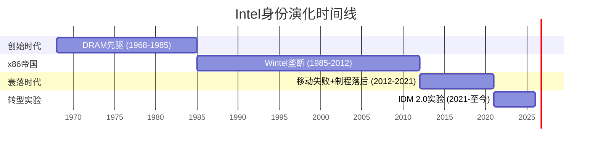

**时代I: DRAM先驱 (1968-1985)** — Moore和Noyce创立Intel制造DRAM内存芯片。1971年推出4004——世界上第一个商业微处理器。1985年在日本DRAM价格战中战略性退出DRAM，全面转向微处理器。**这是Intel历史上唯一一次成功的战略大转型**。

**时代II: x86帝国 (1985-2012)** — 与Microsoft结成"Wintel联盟"，x86 ISA成为PC/服务器的事实标准。Intel同时掌控设计+制造(IDM模式)，制程领先全球1-2代。峰值时期(2005-2010):
- 营业利润率30%+
- 服务器份额>95%
- PC份额>80%
- 全球最先进的半导体工艺
- SGI估计: ~8-9 (纯正专才)

**时代III: 衰落 (2012-2021)** — 三重打击:
1. **移动失败**: 放弃ARM移动芯片(2006年卖掉XScale)，错过智能手机+平板的$400B TAM
2. **制程延迟**: 10nm延迟5年(2014目标→2019量产)，TSMC/Samsung实现反超
3. **资本分配灾难**: Otellini→Krzanich→Swan时期, $36B回购 vs $38B CapEx(SemiAnalysis)——在需要投资制造的时候选择了金融工程

**时代IV: 转型实验 (2021-至今)** — Pat Gelsinger 2021年回归，宣布"IDM 2.0"——Intel既做自己的芯片，也为外部客户代工。投入$110B+进行"4年5节点"制程追赶。Gelsinger 2024.12被迫离职，Lip-Bu Tan接任。当前状态: **转型中途，成败未卜**。

(DM-051)

### 身份张力图谱: Intel到底是什么?

Intel当前同时是(或试图成为)以下**六种身份**，每种身份对应不同的估值逻辑和资源需求:

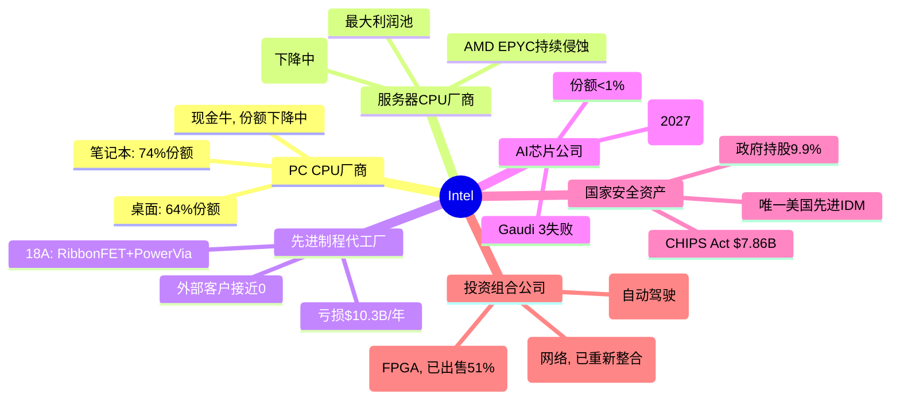

**SGI解读**: Intel从SGI~8-9(时代II, 纯CPU专才)退化到SGI~4.2(当前, 六重身份通才)。这种"身份扩散"有两个可能:

1. **通才陷阱** (概率偏高): 每个领域都投入不够深，在每个战场都输给专才对手
   - CPU输给AMD(纯CPU设计)+ARM(生态创新)
   - 代工输给TSMC(纯代工效率)
   - AI输给NVIDIA(纯GPU+CUDA生态)
   - FPGA输给Xilinx/AMD(整合优势)

2. **平台协同** (Intel的愿景): IDM 2.0打通设计+制造，实现别人做不到的垂直整合
   - CPU+代工: 内部芯片验证18A → 吸引外部客户
   - CPU+AI: Xeon+加速器一体化 → 推理市场差异化
   - 制造+地缘: 美国本土先进产能 → 政策溢价

当前证据更支持(1)而非(2)。六个领域中，Intel在**零个领域**处于技术/市场领先位置(即使在传统优势的服务器CPU领域，AMD EPYC Turin的收入份额已超40%)。协同效应是理论上的——需要18A成功作为"keystone"才能激活。

(DM-010, DM-050)

### 从专才到通才: SGI衰退的根因分析

| SGI维度 | 2010年(估) | 2020年(估) | 2025年 | 衰退原因 |
|---------|:----------:|:----------:|:------:|---------|
| HHI_rev | 8 | 6 | 4 | 从纯CPU→CPU+代工+IoT+FPGA+自动驾驶+AI |
| R&D_conc | 8 | 5 | 3 | R&D从CPU聚焦→分散到6个方向, R&D/GP=75% |
| MarketPos | 9 | 7 | 6 | 服务器从>95%→71%, PC从>85%→64-74% |
| SwitchCost | 8 | 7 | 5 | x86锁定被ARM侵蚀, 云厂商自研加速 |
| BrandClarity | 9 | 6 | 3 | "Intel做CPU"→"Intel做所有东西(但都不是最好的)" |

**15年累计SGI下降**: ~8.5 → 4.2 = **-4.3分 (-51%)**

这不是周期性波动——这是**结构性身份退化**。每次Intel扩展进入新领域(FPGA/Mobileye/IFS/AI)，都稀释了SGI而未能在新领域建立领先地位。唯一的反例可能是IFS——如果18A成功，IFS可能从"SGI稀释因素"变为"估值倍数升级因素"。但目前，IFS是纯烧钱阶段。

### 1.3 业务全景 — 六大战场

### 收入全景与段报告架构

FY2025起Intel简化段报告为3个可报告段+全其他:

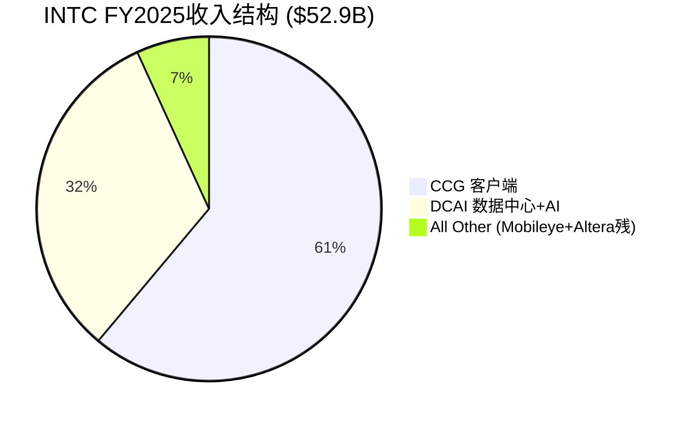

注: Intel Foundry $17.8B主要为内部转移(对消后不计入合并收入)，外部收入极小。

**段报告变化 (Tan时代重组)**:
- NEX(网络与边缘)已并入CCG和DCAI，不再独立报告
- Altera于2025.09.12去合并(Silver Lake收购51%)
- 报告从6段简化为3段——这本身反映了Tan的"简化"哲学

(DM-011~015)

### FY2025分部损益全景

| 分部 | 收入($B) | 营业利润($B) | 营业利润率 | YoY变化 |
|------|:--------:|:------------:|:---------:|:-------:|
| **CCG** | 32.2 | 9.3 | 28.9% | 收入-3%, 利润↓~16% |
| **DCAI** | 16.9 | 3.4 | 20.2% | 收入+5%, 利润↑大幅 |
| **Intel Foundry** | 17.8 | (10.3) | -57.9% | 亏损改善$3.1B |
| **All Other** | 3.6 | 0.3 | ~8% | Altera去合并 |
| **公司未分配** | — | (5.5) | — | 重组费用 |
| **合计** | **52.9** | **(2.2)** | **-4.2%** | 从亏$7B+改善 |

(DM-011)

**关键洞见**: 如果把Intel Products(CCG+DCAI)独立看——$49.1B收入, $12.7B营业利润, 25.8%利润率——这是一家**盈利能力尚可的芯片设计公司**。问题出在Intel Foundry: $10.3B亏损吞噬了产品业务的绝大部分利润，加上$5.5B公司级费用，合并后变成亏损。

**这验证了核心矛盾的精确所在**: Intel Products ≠ Intel Foundry。市场在用一个价格给两个完全不同的实体定价——一个是盈利的芯片设计公司，另一个是巨额亏损的初创代工厂。

### CCG: 客户端计算 — 现金牛保卫战

**业务概况**

CCG是Intel最大的收入来源和利润发动机，覆盖笔记本、桌面、Chromebook全线PC处理器。FY2025收入$32.2B，营业利润$9.3B，利润率28.9%。

**产品矩阵**:
- **Core Ultra (Meteor Lake → Lunar Lake → Arrow Lake → Panther Lake)**: 消费级CPU, AI PC定位
- **Panther Lake**: 首款18A量产产品，CES 2026发布，集成NPU(AI加速单元)
- **Core Ultra 200系列**: Arrow Lake桌面端，2025年发布

**份额趋势与竞争动态**

| 市场 | Intel份额(Q4 2025) | AMD份额 | ARM份额 | 趋势 |
|------|:------------------:|:-------:|:-------:|:----:|
| **桌面** | 64% | 36% | — | AMD +9pp YoY |
| **笔记本** | 74% | 26% | 13.3% | ARM PC平台期(13.7%→13.3%) |
| **整体客户端** | ~70% | ~30% | ~5% | Intel缓慢失血 |

(DM-050 Mercury Research Q4 2025)

**CCG面临的三重威胁**:

1. **AMD Ryzen 9000系列**: Zen 5架构, 桌面端份额从27%升至36%(+9pp YoY)——这是AMD在桌面CPU历史上最大的年度份额增幅

2. **Qualcomm Snapdragon X系列(ARM)**: 进入Windows PC市场。但市场数据显示ARM PC份额从13.7%微降至13.3%——**ARM PC威胁暂时被高估**。原因: x86软件兼容性、企业IT部门惰性、价格竞争力不明显

3. **Apple Silicon(ARM)**: 已完全替代Intel Mac(2020-2024过渡完成)。但这是"已完成的伤害"——Intel已完全失去Apple PC业务(约$5-8B年收入, 2019年前)

**CCG的战略价值**:
- 短期: 提供$9.3B营业利润, 为IFS烧钱提供资金基础
- 中期: Panther Lake(18A)是"内部客户验证" → 证明18A可行
- 长期: AI PC叙事(NPU集成)是否能驱动ASP上升和升级周期

**CQ相关性**:
- CQ3(x86份额): CCG份额虽在下降, 但幅度可控。真正的威胁在服务器端, 不在PC端
- CQ7(FCF): CCG是唯一稳定的现金流来源, 其健康度直接决定Intel的"生存弹药"

### DCAI: 数据中心与AI — 被蚕食的王座

**业务概况**

DCAI覆盖服务器/数据中心CPU(Xeon)、AI加速器(Gaudi/Crescent Island)、存储和网络(原NEX部分)。FY2025收入$16.9B, 营业利润$3.4B, 利润率20.2%。

**关键产品**:
- **Xeon 6 "Granite Rapids" (P-core)**: 高单线程性能, 金融/延迟敏感负载
- **Xeon 6 "Sierra Forest" (E-core)**: 高密度/低功耗, 成本/VM优化 → **ASP稀释效应**
- **Gaudi 3**: AI训练/推理加速器 → **基本失败**(vs H200差9x性能)
- **Crescent Island**: 新一代数据中心GPU, Xe3P架构, 推理定位, **2026 H2采样**

**服务器CPU份额侵蚀全景**

这是Intel最关键的利润池, 也是流失最严重的战场:

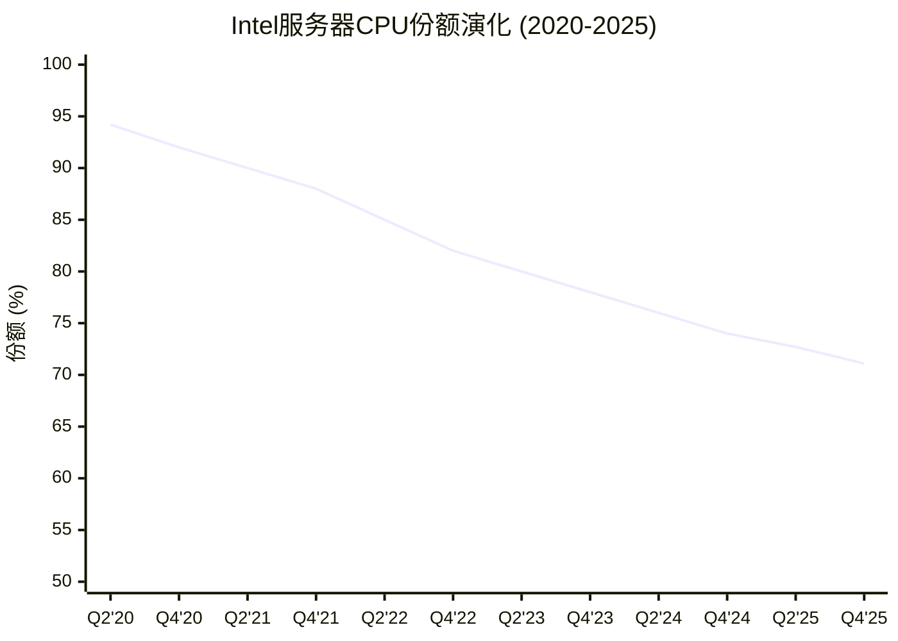

(DM-050)

**更危险的信号——收入份额**:

AMD的收入份额增长远快于单位份额:
- AMD Q4 2025: 28.8%单位份额 vs **41.3%收入份额** (首次超过40%)
- 差距原因: EPYC Turin高核心数SKU(最高192核, ASP ~$14,800) vs Intel Xeon E-core低价产品拉低ASP

**含义**: Intel虽然在单位量上仍占优(71%), 但在**高价值**服务器市场正被AMD压缩。Intel的Xeon 6 Sierra Forest(E-core)维持了单位份额, 但以ASP下降为代价——这是**以量换价**的防守策略。

**AI加速器: 几乎完全出局**

| 产品 | Intel地位 | 竞争对手 | 差距 |
|------|----------|---------|------|
| **训练** | Gaudi 3 (基本失败) | NVIDIA H200/B200 | 性能差9x (Los Alamos) |
| **推理** | Crescent Island (2027) | NVIDIA各系列 + AMD MI300X | 产品不存在 |
| **定制ASIC** | 年化>$1B (Q4 2025) | Broadcom/Marvell | 规模小但增长26% QoQ |

Gaudi 3的失败和Falcon Shores的取消是DCAI AI战略的重大挫折。Crescent Island GPU(Xe3P架构, 160GB LPDDR5X, 空冷推理)是一个全新的赌注:
- **差异化定位**: 针对空冷企业推理服务器, 避开NVIDIA在液冷训练领域的正面竞争
- **架构**: 与Panther Lake共享Xe3架构, 降低研发边际成本
- **时间线**: H2 2026采样 → 2027最早量产
- **风险**: NVIDIA CUDA生态锁定极强, 新GPU从零开始建软件栈

**CQ相关性**:
- CQ3: 服务器CPU份额下降速度~3pp/年, 按此速度2029年可能跌破60%
- CQ5: Crescent Island是"2027年的故事", 当前对收入贡献为零

### Intel Foundry (IFS): 从零开始的$100B豪赌

**这是Intel故事的核心——也是最大的不确定性来源**

Intel Foundry是Gelsinger 2021年推出的IDM 2.0战略的产物——将Intel的制造能力开放给外部客户代工。这是半导体行业有史以来最大的单一企业战略转型尝试。

**财务现实**:

| 指标 | FY2024 | FY2025 | 变化 |
|------|:------:|:------:|:----:|
| **总收入** | $17.5B | $17.8B | +2% |
| **外部收入** | ~0 | $222M (Q4年化) | 微量 |
| **营业亏损** | $(13.4)B | $(10.3)B | 改善$3.1B |
| **营业利润率** | ~-77% | -57.9% | 改善19pp |

**$17.8B收入的真相**: 绝大部分是内部转移定价——Intel Products(CCG+DCAI)付给Intel Foundry的代工费用。如果Intel分拆为独立的设计公司和独立的代工公司, Foundry需要用**商业竞争力**而非**内部调拨**来获得订单。

**外部客户进展**:

| 客户 | 状态 | 预期规模 | 置信度 |
|------|------|---------|:------:|
| **Apple** | PDK 0.9.1GA已交付, 全PDK Q1 2026, "接近签约" | 潜在$2-5B+/年 | 中低 |
| **Microsoft** | 18A订单已确认 | 未知 | 中 |
| **MediaTek** | 首个工艺节点代工客户 | 较小 | 较高 |
| **NVIDIA** | 仅限先进封装探索, 18A测试后暂停 | 不明 | 低 |
| **Broadcom** | 18A测试后放弃(Reuters) | — | 已退出 |
| **定制ASIC** | 年化>$1B, +26% QoQ | $1-2B | 较高 |
| **军方/情报** | Secure Enclave $3B专项 | $3-5B (政府合同) | 高 |

**>$15B终生合同价值**: Intel声称的数字, 但"终生"可能指5-10年合同总额, 非年化收入。

### 18A: 技术突破 vs 商业可行性

**技术成就(真实的)**:
- **RibbonFET**: 全球首个量产GAA(Gate-All-Around)晶体管, 四面环栅
- **PowerVia**: 全球首个量产背面供电(BSPDN), 减少电压降10x
- **组合效果**: vs Intel 3 — +25%性能同功耗, 或-36%功耗同性能
- Panther Lake和Clearwater Forest已"通电启动操作系统"

**商业挑战(同样真实的)**:
- **良率**: ~55%(2025中)→65-75%(Q4 2025), 但需>80%才盈利 → 2027才达行业标准
- **密度**: 238 MTr/mm² vs TSMC N2 313 MTr/mm² → Intel密度低31%
- **PDK成熟度**: PDK 1.0 2025.07才发布, 外部客户IP库小, 移植≈新设计成本
- **TSMC生态**: 30年积累 vs Intel从零开始的代工IP生态

**18A vs TSMC N2对比矩阵**:

| 维度 | Intel 18A | TSMC N2 | 优势方 |
|------|----------|---------|:------:|
| 晶体管类型 | RibbonFET (GAA) | Nanosheet GAA | 平 |
| 供电方式 | PowerVia (背面) | 前端(传统) | **Intel** |
| 晶体管密度 | 238 MTr/mm² | 313 MTr/mm² | **TSMC** (+31%) |
| PPA得分 | 2.53 | 2.27 | **Intel** (微优) |
| 良率(2026初) | 65-75% | ~65-70% | 接近 |
| 量产时间 | 2025末/2026初 | 2025末, 大规模2026秋 | 接近 |
| 客户生态 | Apple(待定), Microsoft | Apple(A20/M5, 50%初期产能) | **TSMC** (远超) |
| IP库 | 小, 刚起步 | 30年积累, 极丰富 | **TSMC** (远超) |
| 代工信任度 | 竞争对手代工的固有矛盾 | 纯代工, 无利益冲突 | **TSMC** |

**Intel 18A的真正优势**: 不在于技术指标的对比(与TSMC N2互有胜负), 而在于**它是在美国本土**。对于: (a)美国政府/军方 (b)需要供应链多元化的客户 (c)CHIPS Act补贴驱动的成本优势——Intel 18A提供了TSMC Arizona之外的第二选项。

Apple选择18A(如果成行)可能更多出于地缘政治/供应链考量而非纯技术优势。18A确实为Intel内部芯片优化(Panther Lake/Clearwater Forest), 外部客户需要不同的PDK调整和IP库。

**IFS财务转折点分析**:

Intel官方目标: IFS在"low-to-mid single-digit billions"外部年收入时实现盈亏平衡。具体拆解:

```
当前IFS亏损: ~$10.3B/年
固定成本占比(估): ~70% (~$12.5B, 含折旧)
可变成本占比(估): ~30%
内部转移定价: ~$17.8B
外部收入所需毛利率假设: ~40%(代工行业平均)

盈亏平衡外部收入 = $10.3B / 40% = ~$25.7B
但: 部分亏损由折旧驱动(非现金), 且随良率提升单位成本下降

现实更可能: $3-5B外部收入 + 良率改善 + 内部利用率提升 → 亏损从$10.3B降至$5-7B
真正盈亏平衡: 可能需要$8-10B外部收入, 或3-4年的良率/成本优化曲线
```

**CQ相关性**:
- CQ1: 18A良率是所有后续讨论的基础。65-75%已超预期但仍不够
- CQ2: 当前外部收入接近0, $3-5B目标在FY2027前极具挑战性

### Altera (FPGA): 已剥离的沉没成本

**历史**: Intel于2015年以$16.7B收购Altera, 目的是将FPGA与Xeon整合。这笔交易被广泛视为失败——Altera在Intel内部缺乏独立发展空间, 同时被Xilinx(2022年被AMD收购)甩开。

**当前状态**:
- 2025.04: Silver Lake以$4.46B收购51%股权 → 估值$8.75B(**仅为收购价的52%**)
- Intel保留49%股权
- Altera从Intel去合并(2025.09.12起)
- FY2024: $1.54B收入, -$615M营业亏损
- 新CEO: Raghib Hussain(来自Marvell)

**投资教训**: Altera是Intel"通才陷阱"的典型案例——收购后无法在Intel庞大的组织中获得足够关注和资源, 最终以47%的价值损失剥离。$8B+的价值毁灭。

### Mobileye (自动驾驶): 独立运营, 估值缩水

**历史**: Intel于2017年以$15.3B收购Mobileye, 2022年IPO(估值一度>$30B)。

**当前状态**:
- Intel所持权益: ~82%(从~88%减少, 2025.07出售部分)
- Intel保留~98%投票权(通过B类股)
- Mobileye独立运营, 非Intel核心业务
- 2026.01: Mobileye以~$900M收购Mentee Robotics(机器人)
- 当前Mobileye市值: 约$7.17B (DM-061)

**对Intel的含义**: Mobileye是一个可以变现的**流动性储备**——如果Intel需要资金, 可以继续出售Mobileye股份。但Mobileye的估值从IPO峰值~$30B大幅缩水至$7.17B, 限制了可变现金额。

### 业务组合核心矛盾: "设计公司+代工初创" = 估值炼狱

将业务组合回归核心矛盾:

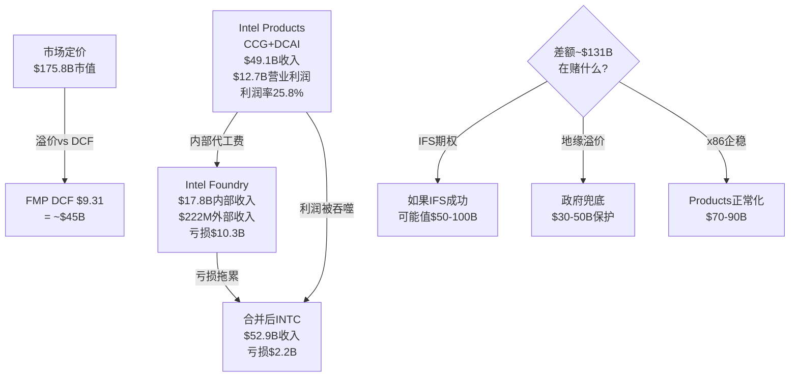

**不同身份下Intel的"合理"估值区间**:

| 身份定义 | 参考估值方法 | 估值区间 | 隐含股价 |
|---------|------------|:--------:|:--------:|
| 纯芯片设计(无IFS) | 15x Products营业利润 | $100-130B | $21-27 |
| 芯片设计+IFS起步 | 上方+IFS期权$30B | $130-160B | $27-33 |
| 国家安全资产 | 上方+地缘溢价$30-50B | $160-210B | $33-43 |
| IFS成功情景 | Products+IFS $50-100B | $200-300B | $41-62 |
| 当前市价 | 市场定价 | $175.8B | $45.91 |

当前市价$45.91隐含: 市场给了**部分IFS期权+大部分地缘溢价**。要维持此价格, 市场需要持续看到IFS成功迹象。

(DM-001~008, DM-035~038)

### 1.4 管理层: 从Gelsinger到Tan的战略断裂

### Gelsinger时代回顾 (2021.02 - 2024.12): 宏大愿景, 失败执行

Pat Gelsinger 2021年2月回归Intel, 带着"制造复兴"的信仰推出IDM 2.0:

**核心承诺**:
- "4年5节点": Intel 7 → Intel 4 → Intel 3 → Intel 20A → Intel 18A (2021-2025)
- IFS外部代工: 从零打造全球第二大代工厂
- 保持设计竞争力: 与AMD/ARM竞争的同时追赶制程

**成绩**:
- 制程追赶确实在进行: Intel 4(2023)→Intel 3(2024)→18A(2025)按计划推进
- 争取到CHIPS Act资金
- PPE从$63B增至$108B, 制造能力大幅扩张

**失败**:
- Gaudi AI加速器: 从未获得市场牵引力, vs NVIDIA差距持续扩大
- 收入持续下滑: $79B(2021)→$53B(2025), 在其任内下降33%
- 巨额亏损: FY2024净亏$18.8B(含大规模减值/重组)
- IFS外部客户: 3年努力, 外部收入仍接近0
- **被解职**: 2024.12.01, 董事会"在失去信心后要求Gelsinger辞职"(WSJ)

**Gelsinger的遗产**: 他启动了正确的方向(制程追赶), 但低估了执行难度和组织惰性。Intel的问题不仅是技术——更是文化、效率和优先级排序。SemiAnalysis的深度批评指出: Otellini时代(2005-2013)开始的人才流失和文化腐烂, 不是Gelsinger 3年能修复的。

(DM-051)

### Tan的背景与战略信号: 设计思维 vs 制造信仰

**Lip-Bu Tan简历**:
- 前Cadence Design Systems CEO (2009-2024), 将Cadence从EDA第三变为并列第一
- 台湾出生, 新加坡成长, MIT硕士
- 风投背景: Walden International创始人
- 2024.08: 从Intel董事会辞职(被解读为对Gelsinger某些决策的不满)
- 2025.03.18: 正式出任Intel CEO

**Tan vs Gelsinger: 根本性的风格差异**

| 维度 | Gelsinger | Tan |
|------|----------|-----|
| **背景** | Intel老兵(CTO), 工艺工程师 | EDA/设计软件CEO, 风投 |
| **哲学** | "制造是Intel的灵魂" | "效率和执行是一切" |
| **组织风格** | 大愿景, 层级化 | 扁平化, 管理层减50% |
| **资本哲学** | 激进投入(CapEx峰值$25.8B) | 纪律投入(CapEx降至$14.6B) |
| **IFS态度** | All-in, 外部代工是核心 | 延续但可能调整优先级 |
| **AI策略** | Gaudi系列, 追赶NVIDIA | Crescent Island, 差异化推理 |
| **并购/剥离** | 保留所有业务 | 剥离Altera, 缩减Mobileye, 精简组织 |

### Tan上任11个月: 行动清单

按时间线梳理Tan的关键决策:

| 日期 | 行动 | 战略信号 |
|------|------|---------|
| 2025.03 | 就任, 3位董事退休 | 清理Gelsinger时代董事会 |
| 2025.04 | Altera 51%售予Silver Lake ($4.46B) | "精简到核心" — 剥离非核心FPGA |
| 2025.05 | Raghib Hussain接任Altera CEO | 专业管理, 非Intel内部人 |
| 2025.07 | 裁员21,000人(~20%), 管理层减50% | 激进效率化, $1.5B年化节省 |
| 2025.07 | 出售部分Mobileye(~$1B) | 变现非核心资产, 补充现金 |
| 2025.07 | 宣布NEX独立(后12月撤回) | 试探性剥离, 但发现NEX与DCAI协同 |
| 2025.08 | 美国政府$8.9B入股 | 政治关系管理 |
| 2025.08 | SoftBank $2B投资 | 拉入战略盟友 |
| 2025.09 | 任命Kevork Kechichian(来自ARM)领导数据中心 | **关键信号**: 从ARM请来的人领导x86数据中心 |
| 2025.09 | NVIDIA $5B投资 | 与最大竞争对手形成微妙联盟 |
| 2025.10 | Crescent Island GPU发布(OCP峰会) | **AI战略转向**: 放弃追训练, 聚焦推理 |
| 2025.11 | CTO Sachin Katti离职去OpenAI | 人才流失信号(6个月即走) |
| 2025.12 | 撤回NEX独立, 保留 | 审视后调整 |
| 2026.01 | Q4 2025财报, 指引Q1低于预期 | 股价-17% |
| 2026.02 | 聘Eric Demmers(前Qualcomm)为GPU首席架构师 | GPU战略加码 |

### CQ4裁定: Tan会根本性改变IDM 2.0吗?

**结论: 不太可能 (置信度25%)**

Tan上任11个月的行动一致指向"优化IDM 2.0"而非"推翻IDM 2.0":
- 保留IFS核心地位, 争取政府+NVIDIA+SoftBank资金
- 18A继续推进, 未放缓
- 剥离的是Altera/Mobileye(非核心), 不是IFS(核心)
- 创建IFS独立董事会(增强而非削弱代工业务)

**但**: 两个不确定性保持开放:
1. 如果18A在2026H2未能达到80%良率且Apple不签约 → Tan可能被迫收缩IFS
2. 5%政府权证条款(如果Intel出售IFS >49%股权则触发) → 政府设置了"IFS必须保留"的机制约束

**Tan的真正贡献**: 不在于战略方向改变, 而在于**执行效率**提升——裁员20%, 管理层减50%, CapEx纪律化, OpEx从$19.4B→$16.5B(-15%)。如果Intel的问题是"方向对但执行差", Tan可能是正确的CEO。

### 管理层关键人物评估

| 姓名 | 职位 | 背景 | 评估 |
|------|------|------|------|
| **Lip-Bu Tan** | CEO | Cadence CEO, VC | 效率导向, 但无制造业运营经验 |
| **Kevork Kechichian** | EVP, 数据中心 | 前ARM EVP工程 | **从ARM请来管x86** — 可能带入ARM思维 |
| **Naga Chandrasekaran** | EVP/CTOO, Foundry | Intel内部, 制造老将 | IFS技术执行的关键人物 |
| **Eric Demmers** | GPU首席架构师 | 前Qualcomm | GPU从零建队 |
| **Raghib Hussain** | Altera CEO | 前Marvell | 已独立, 非Intel核心 |

**CTO空缺风险**: Sachin Katti任CTO仅6个月即离职去OpenAI。Intel目前没有CTO——在技术转型最关键时期。Tan直接监督AI战略, 但CEO+CTO双重角色可能导致注意力分散。

#### ⚠️ 风险信号: 如果Lip-Bu Tan也是又一次战略摇摆

Intel在过去10年已经历3次CEO更换(Krzanich→Swan→Gelsinger→Tan)，每次都伴随战略方向的剧烈调整。Gelsinger的"IDM 2.0"从万众期待到被解职仅用了3年。Tan的"IFS独立+聚焦效率"同样令人期待——但市场还没有价格折扣来反映"第四次战略摇摆"的可能性。如果Tan的改革在24个月内没有可量化的进展(IFS外部收入>$1B、18A量产良率>60%)，Intel可能面临第五任CEO——而市场对此场景完全未定价。历史基准率：大型科技公司CEO在任<3年更换的概率约15-20%。

---

## Chapter 2: 产业链生态

### 2.1 上下游映射: Intel在半导体产业链中的独特位置

Intel是全球唯一同时设计和制造先进制程芯片的西方公司(IDM模式), 这种垂直整合使其在产业链中的位置与其他半导体公司截然不同:

**上游 — 供应商依赖**:

| 类别 | 核心供应商 | Intel依赖度 | 风险 |
|------|----------|:---------:|------|
| **光刻设备** | ASML (EUV独家) | 极高 | ASML是全球唯一EUV供应商, 18A需要high-NA EUV |
| **刻蚀/沉积** | Lam Research, Applied Materials, TEL | 高 | 制程转换需定制设备配方 |
| **检测/量测** | KLA, ASML(电子束) | 高 | 良率提升依赖检测精度 |
| **材料** | 信越化学(光刻胶), SUMCO(硅片), 各化学品供应商 | 中 | 多供应商, 替代性较高 |
| **EDA工具** | Synopsys, Cadence, Siemens | 高 | 18A PDK需要EDA工具适配, Tan的前公司Cadence是关键合作方 |

**Intel与设备供应商的关系**: 不同于AMD/NVIDIA(无晶圆厂, 不直接与设备商打交道), Intel是ASML、Lam Research、Applied Materials的直接大客户。Intel的CapEx计划直接影响这些设备公司的收入。FY2025 Intel CapEx $14.6B中, 相当部分流向设备采购。

**下游 — 客户依赖**:

| 类别 | 核心客户 | 收入占比(估) | 集中度风险 |
|------|---------|:----------:|:---------:|
| **PC OEM** | Dell, HP, Lenovo, Acer, ASUS | ~55% (CCG) | 中(多家OEM) |
| **云/数据中心** | AWS, Azure, Google, Meta | ~25% (DCAI) | 高(4家超大规模) |
| **企业IT** | 通过OEM/SI分销 | ~10% | 低(分散) |
| **中国** | 联想, 浪潮, 华为(受限) | ~25% (全公司) | 高(地缘风险) |
| **政府/国防** | 美国DoD, 情报机构 | <5% (但增长中) | 低(政策支撑) |
| **IFS外部** | Microsoft, Apple(待定), MediaTek | <1% | 极高(几乎没有) |

**产业链位置的独特性**:

作为IDM, Intel同时是上游设备商的客户和下游终端厂商的供应商。这种双重身份产生了独特的动态:

1. **CapEx杠杆**: Intel的投资决策直接影响上游ASML/LRCX/AMAT的收入——这使Intel在设备采购中有议价能力, 同时也意味着Intel的投资放缓会在供应链中产生涟漪效应

2. **技术反馈环**: 与TSMC纯代工模式不同, Intel内部的芯片设计团队(Products)和制造团队(Foundry)之间存在直接反馈。理论上, 这使Intel可以为自己的芯片优化制程——但也可能导致对外部客户需求的忽视

3. **竞争悖论**: Intel的IFS客户(如Apple、NVIDIA)同时也是Products业务的竞争对手或合作对象。Apple用Intel代工意味着Apple看到Intel的制程数据, 而Apple Silicon是Intel在PC市场的最大威胁之一。这种"竞争对手代工"的信任赤字是IFS最大的结构性劣势

### 2.2 IDM模式的战略含义

全球半导体产业在过去30年经历了从IDM(垂直整合)到Fabless+Foundry(设计+代工分离)的大分工。当前格局:

| 模式 | 代表公司 | 优势 | 劣势 |
|------|---------|------|------|
| **纯Fabless** | AMD, NVIDIA, Qualcomm | 资本轻, 聚焦设计 | 产能受制于TSMC |
| **纯Foundry** | TSMC, Samsung Foundry | 规模效应, 多客户 | 不做设计, 利润率有限 |
| **IDM** | Intel, Samsung | 垂直整合, 独立自主 | 资本重, 效率低 |
| **IDM 2.0** | Intel(尝试中) | IDM+外部代工 | 前所未有, 无先例 |

**为什么Intel坚持IDM**: Intel的IDM模式不仅是商业选择, 更是身份认同。"Intel是一家制造公司"——这是从Gordon Moore到Pat Gelsinger的代际信仰。但这个信仰正在被市场挑战:

- AMD放弃制造(2009年分拆GlobalFoundries)后, 股价从$2涨到$200+
- NVIDIA从未自己制造, 市值超过$3T
- 反例: TSMC依靠纯制造成为$800B+公司

Intel的IDM 2.0试图两全其美——保持制造能力的同时, 开放给外部客户。但从IFS的财务表现来看(外部收入$0.9B vs TSMC $120B+), 这个"两全其美"目前更接近"两头不到岸"。

---

## Chapter 3: 竞争格局 — 五面进攻

### 3.1 战场总览: Intel的多线作战困局

Intel同时在**5个独立战场**与**5+个不同对手**竞争, 每个战场有不同的竞争动态:

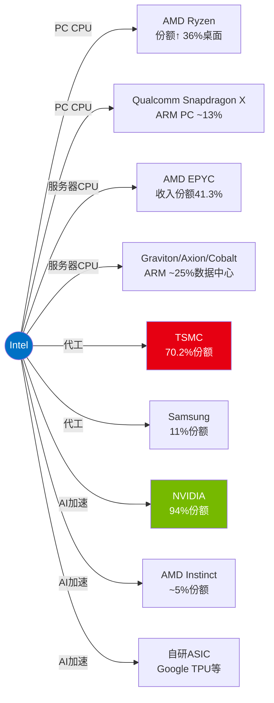

**多线作战的核心问题**: Intel在**每一条战线**都是防守方或追赶方, 在**没有一条战线**上处于进攻优势。这是SGI 4.2(通才)公司的典型困境——资源分散导致每个领域都投入不足。

### 3.2 服务器CPU: AMD EPYC的持续侵蚀

### 份额与财务数据

| 指标 | Intel Xeon | AMD EPYC | 趋势 |
|------|:----------:|:--------:|:----:|
| Q4 2025单位份额 | 71.1% | 28.8% | AMD +3.1pp YoY |
| Q4 2025收入份额 | ~58.7% | **41.3%** | AMD +4.9pp YoY |
| Q4 2025 Intel DCAI收入 | $4.7B | — | +9% YoY |
| Q4 2025 AMD数据中心收入 | — | $5.4B (含GPU) | +39% YoY |
| FY2025 AMD数据中心 | — | $16.6B | +32% YoY |

(DM-050)

**AMD EPYC Turin的竞争优势**:
- 最高192核/384线程 vs Intel Xeon 6 最高144核(Granite Rapids P-core)
- IPC提升~15-20% vs Zen 4
- ASP溢价: 顶配~$14,800, 高核心数SKU利润极高
- 客户认可: Turin在Q4 2025**首次占AMD EPYC收入>50%** → 换代完成
- TPCx-AI基准测试: EPYC 9965 = 1.70x vs Xeon 6980P

**Intel的Xeon 6防守策略**:
- **Granite Rapids (P-core)**: 针对单线程性能敏感负载(金融交易、数据库)
- **Sierra Forest (E-core)**: 针对密度/性价比(云原生、微服务) → 但ASP低, 拉低收入份额
- **矛盾**: E-core帮助维持单位份额, 但**加速收入份额流失**

### 侵蚀速度外推

| 指标 | 2020 Q2 | 2023 Q4 | 2025 Q4 | 2028E(趋势外推) |
|------|:-------:|:-------:|:-------:|:-------------:|
| Intel单位份额 | 94.2% | ~78% | 71.1% | ~60% |
| AMD单位份额 | 5.8% | ~22% | 28.8% | ~35% |
| ARM份额 | ~0% | ~5% | ~25%(含自研) | ~30-35% |

**按当前侵蚀速度(~3-4pp/年)**: Intel服务器CPU份额可能在2028-2029年跌破60%, 这是CQ3的关键阈值。但注意: 侵蚀速度可能**非线性**——随着"容易抢的份额"被抢完(云厂商), 企业端切换更慢。

### 3.3 ARM在服务器的崛起: 被低估然后被高估

ARM在数据中心CPU的份额达到~25%(2025年中), 主要由以下驱动:

| ARM平台 | 厂商 | 最新产品 | 核心数 | 制程 |
|---------|------|---------|:------:|------|
| **Graviton5** | AWS | 2025.12预览 | 192核 | TSMC 3nm |
| **Axion** | Google | C4A(GA), N4A(预览) | 64-72核 | TSMC 3/5nm |
| **Cobalt 200** | Microsoft | 2025末 | 132核 | ARM N3 |
| **Grace** | NVIDIA | 与Blackwell搭配 | 72核 | TSMC 4nm |
| **AmpereOne** | Ampere | 商用 | 192核 | — |

**ARM增长的驱动力**: 不是"ARM CPU更好", 而是**超大规模云厂商的垂直整合战略**:
- AWS用Graviton替代Intel/AMD → 成本降低(无需支付x86溢价)+差异化(仅AWS有Graviton)
- Google和Microsoft跟进: 自研CPU让他们减少对x86的依赖
- NVIDIA Grace-Blackwell将ARM CPU与GPU紧耦合 → AI负载天然用ARM

**ARM的限制**:
- ARM 2025年目标50%数据中心份额 → **实际仅25%**, 远未达标
- ARM的增长集中在超大规模端; 企业/传统OEM端ARM渗透率很低
- ARM CPU的ASP远低于高端x86(Graviton是AWS内部成本, 非销售)
- 企业IT的x86软件生态锁定在5-10年内仍然强大

**对Intel的含义**: ARM的威胁是**长期结构性**的(云厂商将继续自研), 但在企业端的进展可能比预期慢。Intel在企业服务器端可能维持较高份额, 但在云端的流失是不可逆的。

### 3.4 代工: TSMC的绝对统治

Intel IFS试图挑战的是人类商业史上最强大的制造垄断之一:

| 代工商 | 份额(2025) | 先进制程 | 客户 |
|--------|:----------:|---------|------|
| **TSMC** | **70.2%** | N3/N2 量产 | Apple, NVIDIA, AMD, Qualcomm, 所有人 |
| Samsung | ~11% | SF3/SF2 (良率低) | 少量外部 |
| SMIC | ~6% | 7nm (无EUV) | 中国国内 |
| GlobalFoundries | ~6% | 12/14nm (退出先进) | 汽车/IoT |
| UMC | ~5% | 成熟制程 | 混合信号 |
| **Intel IFS** | **不在前6** | 18A (起步) | 内部为主 |

(DM-050)

**TSMC的护城河为什么几乎无法攻破**:

1. **规模效应**: $30.24B/季收入 → 每年$70B+可投入研发和产能扩张
2. **学习曲线**: 30年纯代工经验, 每一代工艺都有客户数据反馈
3. **IP生态**: 最丰富的第三方IP库, 客户设计无需从零开始
4. **信任**: 纯代工模式=不与客户竞争(Intel IFS无此优势)
5. **客户锁定**: Apple锁定50%初期N2产能 → 其他客户被迫排队
6. **地理对冲**: 台湾+日本+美国(Arizona)+德国多地布局

**Intel IFS的唯一差异化**: **美国本土先进制程产能**。但TSMC Arizona也在加速:
- TSMC AZ Phase 1(4nm): 已量产
- TSMC AZ Phase 2(3nm): 2027量产(比Intel Ohio快3-4年)
- TSMC AZ Phase 3(2nm): 2027奠基, 加速中
- TSMC AZ总投资: **$165B, 6座晶圆厂** → 规模远超Intel在美国的计划

**IFS竞争力评估**: 在纯商业竞争中, Intel IFS赢TSMC大客户的概率极低。IFS的真正竞争力来自:
1. 政策驱动(CHIPS Act补贴降低客户成本)
2. 地缘多元化需求(供应链安全)
3. 军方/情报需求(Secure Enclave, TSMC不能做)
4. 特定技术优势(PowerVia背面供电, TSMC N2没有)

### 3.5 AI加速器: NVIDIA的代际领先

**市场份额**: NVIDIA ~94%, AMD ~5%, Intel <1%, 其他(Google TPU, 自研ASIC)

**Intel在AI的三次失败**:
1. **Nervana** (2016收购): AI训练芯片, 2020年被Habana取代
2. **Habana Gaudi 3**: 2024年推出, Los Alamos测试vs H200差9x性能 → 基本弃用
3. **Falcon Shores**: 计划中的下一代AI芯片 → **已取消**

**Crescent Island — Intel的第四次尝试**:
- 架构: Xe3P(与Panther Lake共享)
- 定位: **推理(非训练)**, 空冷企业服务器, 大内存(160GB LPDDR5X)
- 时间线: H2 2026采样, 2027量产
- 首席架构师: Eric Demmers(前Qualcomm, 2026.02加入)
- **差异化**: 避开NVIDIA在液冷训练集群的统治, 瞄准企业推理(成本敏感, 空冷需求)

**Crescent Island的机会窗口**:
如果成功, 它可能开辟一个NVIDIA目前忽视的细分市场:
- 企业推理(vs 超大规模训练)
- 空冷(vs 液冷)
- 性价比优先(vs 绝对性能优先)
- 与Xeon紧耦合(vs 独立GPU)

但挑战巨大:
- CUDA生态锁定: 几乎所有AI软件都为NVIDIA优化
- Intel OneAPI的生态影响力远低于CUDA
- 从芯片架构师到量产需要2-3年
- AMD MI300X已经在推理市场建立据点

### 3.6 竞争格局综合评分

```mermaid
radar
    title Intel竞争力雷达图 (10=最强)
    "PC CPU" : 7
    "服务器CPU" : 6
    "代工" : 2
    "AI加速器" : 1
    "网络/边缘" : 5
    "制造工艺" : 5
```

**总体评估**: Intel在传统业务(PC/服务器CPU)仍有较强地位(6-7分), 但在所有增长领域(代工/AI/ARM)均处于弱势(1-2分)。这种"强在过去, 弱在未来"的竞争格局, 解释了为什么市场给Intel定价时不看当前盈利(弱)而看未来潜力(取决于IFS/AI)。

#### ⚠️ 风险信号: 如果AMD+ARM+云自研同时加速

本章分析了5个独立战场，但更危险的是这些竞争威胁的**同步加速**。2025-2026年，AMD EPYC份额可能从23%→30%（Turin架构）、ARM服务器从15%→25%（Graviton4/Axion扩产）、Google/Amazon/Microsoft自研芯片从内部试用→批量部署。三者叠加的最坏情境：Intel DCAI收入可能从$12.8B→$8-9B（-30%~-35%），而不是共识预期的温和回升。这种"多面同时进攻"的场景在企业历史中有先例——诺基亚2010年同时面对iPhone（高端）和Android（中低端）的夹击，份额从40%→3%仅用了3年。Intel在服务器市场面对的竞争态势正在接近这个临界点。

---

## Chapter 4: 预测市场与宏观环境

### 4.1 预测市场相关事件

对Intel前景有直接或间接影响的预测市场事件跟踪:

**直接相关事件**:
- Intel IFS获得Apple正式合同: 市场隐含概率尚未形成独立市场, 但Apple的决定是IFS叙事的最大单一催化剂
- Intel 18A商业量产: 时间线不确定性仍高, Panther Lake是首个内部验证

**间接相关事件**:
- 台海紧张升级: 任何台海冲突概率的上升都直接增加Intel的地缘政治溢价——Intel是唯一不依赖台湾的西方先进制程来源
- AI泡沫破裂: 如果AI投资周期大幅回调, NVIDIA/AMD受冲击最大, 但Intel的DCAI和IFS也会因云CapEx缩减而受损。唯一的对冲: Intel的低AI敞口意味着相对下行有限
- 美国对华芯片出口政策: 进一步收紧可能限制Intel~25%的中国收入, 但也可能强化"需要美国本土产能"的叙事

### 4.2 宏观温度与市场定位

### 宏观估值指标 (2026.02)

| 指标 | 数值 | 百分位 | 信号 |
|------|:----:|:------:|------|
| **CAPE (Shiller P/E)** | 40.08 | 98% | 极度偏高 — 仅在2000年互联网泡沫超过此水平 |
| **Buffett指标 (市值/GDP)** | 219% | 100% | 历史最高区间 |
| **ERP (股权风险溢价)** | 4.5% | 66% | 中性 — 不提供方向性信号 |
| **综合温度** | **88/100** | **极热** | 整体市场估值极度拉伸 |

**宏观环境对Intel的含义**:

1. **市场估值极端高位对Intel不利**: 在CAPE 40+的环境中, 市场对"turnaround故事"的容忍度更低。如果大盘回调20-30%, Intel这类低质量/高不确定性标的可能遭受不成比例的抛售

2. **AI CapEx周期是双刃剑**: 当前$200B+的年化云CapEx(Amazon FY2026E $200B, Google/Microsoft/Meta各$50-80B)推高了整个半导体板块估值。但这些CapEx主要流向NVIDIA GPU和HBM, 对Intel的直接受益有限(Intel的AI收入<1%)。如果AI CapEx周期见顶回落, Intel可能在"未享受上行"的情况下承受"下行连坐"

3. **利率环境**: 联邦基金利率4.25-4.50%(2025.12), 高利率环境对Intel不利——高CapEx($14.6B/年)的融资成本上升, 同时净债务$32.3B的利息负担加重

### 4.3 行业周期定位

当前半导体行业处于**AI驱动的分化周期**:

| 子行业 | 周期位置 | Intel敞口 |
|--------|---------|:---------:|
| **AI GPU/HBM** | 供不应求, 产能约束 | 极低(<1%) |
| **先进代工** | 产能紧张, TSMC满负荷 | 低(IFS起步) |
| **PC/消费** | 温和复苏, 库存正常化 | 高(CCG 61%) |
| **服务器CPU** | 结构性替代(GPU+ARM) | 中(DCAI 32%) |
| **成熟制程** | 供过于求(中国产能扩张) | 低 |

**Intel的周期位置**: 横跨AI(弱)和传统(守)两端, 两边都不处于最有利位置。更精确地说, Intel处于**公司特定周期的底部→早期复苏**, 但滞后于行业12-18个月:

- 行业AI上行周期已持续2年(2024-2025), Intel几乎未参与
- PC/服务器的温和复苏对Intel有利, 但增量有限
- IFS从零开始的代工业务需要3-5年才能进入有意义的收入规模

**关键判断**: Intel不是一只"跟随行业周期"的标的, 而是一只"等待公司特定催化剂"的标的。买入Intel不是在赌半导体周期向上, 而是在赌Intel自己的转型成功——这是一个比行业周期难得多的赌注。

### 4.4 代工竞赛2026: 三强争霸的真实格局

| | TSMC | Samsung | Intel |
|---|:---:|:---:|:---:|
| 2nm级制程 | N2量产中 | SF2(良率~40%) | 18A(良率65-75%) |
| 市占率 | 70.2% | ~11% | <1%(外部) |
| 年收入 | ~$120B+ | ~$13B(代工) | ~$0.9B(外部, 年化) |
| 美国产能 | AZ $165B/6fab | TX(Taylor) | AZ(生产), OH(2030-31) |
| 客户数 | 500+ | 30+ | <10(外部) |
| 先进制程领先 | 是 | 追赶中 | 技术突破但商业未证明 |

**Intel在代工竞赛中的真正位置**: 不是"第三名代工厂", 而是"一个内部代工厂, 试图变成外部代工厂"。18A的技术突破(RibbonFET+PowerVia)是真实的, 但从"技术可行"到"商业成功"的距离, TSMC花了15年(1987-2002)才走完。Intel试图在3-5年内完成同样的旅程。

### 4.5 地缘政治与CHIPS Act: Intel的政策护城河

### CHIPS Act资金流向Intel

| 项目 | 金额 | 状态 |
|------|:----:|------|
| 直接补贴(最终) | $7.86B | 已发放$2.2B, 其余转为股权 |
| 联邦贷款 | 最高$11B | 可用 |
| Secure Enclave | $3B | 军事/情报专用 |
| 投资税收抵免 | 25%合格CapEx | 至2026年底 |
| **政府股权** | **$8.9B (9.9%股权)** | @$20.47/股, 被动持有 |
| **政府权证** | **额外5%** | 若Intel出售IFS >49% |

### 政府入股的深层含义

**正面**:
- 隐性底线: 政府@$20.47/股入股 → 不太可能允许股价长期低于此
- "太大不能倒"背书: 政治资本已投入, 失败=执政党丢脸
- NVIDIA+SoftBank跟进: 政府入股作为信心信号, 撬动$7B私人资本

**负面**:
- **原始条款被削弱**: Trump交易取消了回收条款和利润分享
- **无工厂绑定**: 拿了美国纳税人的钱, 但法律上不要求工厂必须在美国(Warren批评)
- **外国客户信任**: 美国政府持股9.9%的芯片公司 → 中国/欧洲客户可能更倾向TSMC
- **道德风险**: 政府兜底=管理层紧迫感下降
- **政策可逆性**: 2028总统选举后, 新政府可能重新审视

### Ohio项目: 延迟是最大风险信号

| 里程碑 | 原计划 | 实际 | 延迟 |
|--------|--------|------|:----:|
| Fab 1 量产 | 2025 | **2030-2031** | **5-6年** |
| Fab 2 量产 | 2026 | 2032 | 6年 |
| 对比: TSMC AZ Phase 2 | — | 2027 | N/A |

**Ohio延迟的含义**: Intel承诺了美国制造复兴, 但Ohio Fab 1比TSMC Arizona Phase 2晚3-4年。如果TSMC在美国的3nm/2nm产能在2027-2028年就绪, Intel Ohio的18A/14A在2030-2031年才就绪 → **Intel可能在自己最大的差异化优势(美国本土)上被TSMC追平**。

### 假说 H-3 验证: 五角大楼是18A的真正客户?

Secure Enclave $3B专项资金确认了军方需求的存在。进一步证据:
- Intel是**唯一**拥有Secure Enclave资质的美国先进制程厂商
- TSMC Arizona虽然在美国, 但**仍是台湾公司, 可能不获Secure Enclave资质**
- 军用芯片利润率高(政府合同通常25-35%)但体量小($10-15B/年全行业)
- 如果Intel获得Secure Enclave的5-10%份额 → $0.5-1.5B/年高利润收入

**H-3评估**: 中等偏高置信度。五角大楼不太可能是$5B+级别的客户(军用芯片TAM有限), 但可能提供$1-3B/年的高利润稳定收入, 对IFS盈亏平衡有实质贡献。

### 中国业务风险

**Intel中国收入敞口**: ~25%(约$13B/年)

**风险层级**:
1. **出口管制**: 2025.04新增AI芯片许可证要求, 13款Xeon被列入管控清单
2. **Trump政策转向**: 2025.12允许对华出售AI芯片(换取25%收入分成) → 缓解但有条件
3. **国产替代**: 海光/兆芯x86兼容CPU在中国企业端渗透率上升
4. **对Intel提价的反应**: Intel 2026年对中国客户提价10% → 可能加速替代

**与H-1交叉**: 美国政府持股Intel 9.9% → 中国客户面对的不仅是美国芯片公司, 而是**美国政府部分所有的芯片公司**。这可能强化中国"去Intel化"的政治意愿。

### 4.6 治理与资本分配

### 董事会结构

SemiAnalysis指出: 7/11董事无半导体经验 → 在CEO频繁更换(2019-2025: Swan→Gelsinger→Tan)的背景下, 这意味着**董事会缺乏独立判断技术战略的能力**。

**Tan时代变化**:
- 3位董事退休(2025.05): Ishrak(Medtronic), Lavizzo-Mourey(医疗), King Liu(UC Berkeley)
- 新董事会11人, 全为现任成员含Tan
- 计划设立IFS独立董事会(Tan宣布) — 可能改善代工治理

### 资本分配历史: 从股东友好到股东稀释

Intel的资本分配在5年内经历了**180度大转变**:

| 时期 | 策略 | 年化数据 |
|------|------|---------|
| **2019-2021** | 回购+高息 | 回购$2-10B/年, 股息$5-6B/年 |
| **2022-2023** | 停止回购, 降息 | 回购$0, 股息$3-6B/年, 开始发债 |
| **2024-2025** | 大规模稀释+零息 | 净股发行$12-13B/年, 股息$0, 回购$0 |

**4年累计**:
- 稀释: 4.06B→4.86B股 (+19.7%)
- 股息取消: $5.6B/年→$0
- 净股发行: +$26.2B (2024-2025两年)
- 留存收益消耗: $68.3B→$49.0B (-$19.3B)

SemiAnalysis的更长期视角: Otellini→Krzanich→Swan(2005-2020)期间, Intel回购$36B+同时CapEx仅$38B → "在需要投资未来的时候选择了金融工程"。Gelsinger和Tan时代正在偿还前任的"技术债务"——用大规模CapEx+稀释来弥补10年投资不足。

### 股东结构(2026初)

| 股东类型 | 持股比例(估) | 主要持有者 |
|---------|:----------:|----------|
| **美国政府** | 9.9% | @$20.47/股, 被动, 有5%权证 |
| **NVIDIA** | ~4.4% | @$23.28/股, 战略联盟 |
| **SoftBank** | ~2% | @$23.00/股 |
| **机构** | ~55% | Vanguard, BlackRock等 |
| **散户+其他** | ~28.7% | |

**新股东的隐含底线**:
- 政府@$20.47: 不太可能允许长期跌破此价
- NVIDIA@$23.28: 已经低于市价(2025.12入股时), 可能长期持有
- SoftBank@$23.00: 类似NVIDIA, 战略持有

**含义**: $20-23区间有约$15.9B的"锚定买盘"(政府+NVIDIA+SoftBank)。这为Intel股价提供了一个相对坚实的下行支撑——但也意味着**这些资金不是给现有股东的, 是给Intel管理层的**。现有股东在此过程中被稀释了近20%。

---

> **Part I 产出统计**: Protocol Header + 执行摘要 + Ch1-4 | Mermaid图: 8个 | DM锚点引用: 24个 | 核心数据表: 19个
# Part II: 财务分析与价格含义

---

## Chapter 5: 财务健康深度分析

> 核心叙事锚: "活人估值 vs 濒死财务" — 本章解剖"濒死"的精确含义。
> Intel的财报不是一份普通的工业公司财报, 而是一个正在自我手术的巨型IDM的手术记录。

### 5.1 五年财务全景: 一张"自由落体"的成绩单

Intel FY2021-2025的财务轨迹, 是美国半导体历史上最剧烈的价值侵蚀之一:

```mermaid
graph LR
    subgraph 毛利率崩塌轨迹 FY2021→FY2025
        A["FY2021<br/>55.4%"] -->|"-12.8pp"| B["FY2022<br/>42.6%"]
        B -->|"-2.6pp"| C["FY2023<br/>40.0%"]
        C -->|"-7.3pp"| D["FY2024<br/>32.7%"]
        D -->|"+2.1pp"| E["FY2025<br/>34.8%"]
    end

    subgraph 营业利润率
        F["FY2021<br/>24.6%"] -->|崩塌| G["FY2022<br/>3.7%"]
        G --> H["FY2023<br/>0.2%"]
        H --> I["FY2024<br/>-22.0%"]
        I -->|回零| J["FY2025<br/>0.0%"]
    end

    classDef decline fill:#ff6b6b,stroke:#c0392b,color:#fff
    classDef recover fill:#51cf66,stroke:#2f9e44,color:#fff
    classDef neutral fill:#ffd43b,stroke:#f08c00,color:#000
    classDef peak fill:#339af0,stroke:#1864ab,color:#fff

    class A peak
    class B,C decline
    class D decline
    class E recover
    class F peak
    class G,H,I decline
    class J neutral
```


| 项目 ($B) | FY2021 | FY2022 | FY2023 | FY2024 | FY2025 | 5Y CAGR |
|-----------|:------:|:------:|:------:|:------:|:------:|:-------:|
| **收入** | 79.0 | 63.1 | 54.2 | 53.1 | 52.9 | **-9.6%** |
| 成本 | 35.2 | 36.2 | 32.5 | 35.8 | 34.5 | -0.5% |
| **毛利** | 43.8 | 26.9 | 21.7 | 17.3 | 18.4 | -19.5% |
| **毛利率** | 55.4% | 42.6% | 40.0% | 32.7% | 34.8% | -20.7pp |
| R&D | 15.2 | 17.5 | 16.0 | 16.5 | 13.8 | -2.4% |
| SG&A | 6.5 | 7.0 | 5.6 | 5.5 | 4.6 | -8.3% |
| **营业利润** | 19.5 | 2.3 | 0.09 | -11.7 | -0.02 | N/A |
| **营业利润率** | 24.6% | 3.7% | 0.2% | -22.0% | 0.0% | -24.6pp |
| EBITDA | 33.9 | 21.3 | 11.2 | 1.2 | 14.4 | -19.2% |
| **净利润** | 19.9 | 8.0 | 1.7 | -18.8 | -0.27 | N/A |
| **EPS** | $4.86 | $1.94 | $0.40 | -$4.38 | -$0.06 | N/A |
| D&A | 11.8 | 13.0 | 9.6 | 11.4 | 11.7 | -0.2% |
| SBC | 2.0 | 3.1 | 3.2 | 3.4 | 2.4 | +4.3% |
| 利息费用 | 0.60 | 0.50 | 0.88 | 0.82 | 1.09 | +16.1% |

*(DM-011~015)*

**数据解读 — 三个层次的恶化**:

**第一层: 收入萎缩($79B→$52.9B, -33%)**。半导体行业在2022-2023经历周期下行, 但AMD同期收入增长33%(FY2021 $16.4B→FY2024 $22.2B), NVIDIA增长200%+。Intel的收入下降**既是周期性的(PC/服务器下行), 也是结构性的(市场份额流失)**。

**第二层: 利润率崩塌(营业利润率24.6%→0%)**。收入下降33%, 但营业利润下降**100%** — 经营杠杆的残酷倒转。原因: Intel的成本结构中固定成本占比极高(fab折旧$11.7B + R&D $13.8B + 利息$1.1B = $26.6B, 接近毛利$18.4B的145%)。当收入下降时, 这些固定成本无法等比例缩减, 利润被压缩至零。

**第三层: 战略重组叠加(FY2024 -$18.8B净亏)**。FY2024的巨亏包含Altera商誉减值~$2.8B、IFS资产减值~$1.5B、2.1万人裁员重组~$3-4B。这是Gelsinger末期和Tan初期的"大扫除", 将积累的问题一次性释放。FY2025的GAAP净亏$0.27B看似"好转", 实则是被正负一次性项目"平滑"后的伪信号 — 正常化净利润大致在**-$2B至-$3B区间**。

### 5.2 分部财务: 两个利润中心 vs 四个亏损黑洞

Intel的合并报表掩盖了内部极端分化的业务现实。拆开来看, 这是一家"用赚钱业务养活亏钱梦想"的公司:

| 分部 | 收入 ($B) | 营业利润 ($B) | 利润率 | 盈利质量 | 趋势 |
|------|:---------:|:------------:|:------:|:--------:|:----:|
| **CCG (客户端计算)** | 32.2 | 9.3 | 28.9% | 高质量, 可持续 | → |
| **DCAI (数据中心/AI)** | 16.9 | 3.4 | 20.2% | 中等, 份额流失威胁 | ↓ |
| **NEX (网络/边缘)** | 5.5 | ~0.8 | ~15% | 低增长, 边缘化 | → |
| **IFS (Intel代工)** | 17.8 | -10.3 | -57.9% | 巨额亏损, 内部转移 | ↓ |
| **Mobileye** | 1.9 | -0.4 | -20.5% | ADAS周期低谷 | → |
| **Altera** | 1.5 | -0.6 | -41.0% | 分拆中, 不可比 | N/A |
| **Other/Corp** | ~1.4 | -2.2 | N/A | 公司费用 | — |
| **合并** | **52.9** | **~0** | **0%** | — | ↓ |

**核心发现: Intel只有两个赚钱的部门(CCG和DCAI), 合计营业利润$12.7B** — 但被IFS(-$10.3B)、Altera(-$0.6B)、Mobileye(-$0.4B)和Corporate(-$2.2B)吞噬殆尽。合并利润近乎为零, 不是因为没有赚钱的业务, 而是因为赚的钱全部喂给了亏钱的新业务。

**CCG($32.2B, 利润$9.3B)**: Intel最大的收入和利润来源。PC市场的x86主导地位仍然稳固(桌面/笔记本份额~80%), Core Ultra系列在AI PC浪潮中获得OEM支持。但增长空间有限 — PC市场已成熟(全球出货量~2.5亿台, 低个位数增长), 且ARM架构PC(Qualcomm Snapdragon X)正在侵蚀边缘份额。CCG利润的可持续性取决于x86在PC端能否再守住10年以上。

**DCAI($16.9B, 利润$3.4B)**: Intel的传统利润引擎正在失速。服务器CPU份额从94.2%(2020)降至~71%(2025)(DM-044), AMD EPYC已攻下高利润区间。更严峻的是利润池迁移: 数据中心支出正从CPU转向GPU/AI加速器 — Intel在这个$1000亿+的新利润池中份额接近零(NVIDIA占94%+)。DCAI的$3.4B利润虽然真实, 但代表的是一个**正在缩小的利润池中的正在缩小的份额**。

**IFS($17.8B收入, 亏损$10.3B)**: 这是Intel财务报表中最令人困惑的分部。$17.8B收入几乎全部是**内部转移收入** — Intel Products付给Intel Foundry的"内部代工费"。外部客户贡献仅Q4 $222M(年化~$0.9B)(DM-035)。这创造了一个会计幻象:

- CCG的"高利润"部分来自IFS定价补贴: 如果IFS按市场价收费(TSMC N3 wafer ~$20,000 vs Intel内部转移价可能$8,000-12,000), CCG利润率会更低
- IFS的"巨额亏损"包含了被Products端享受的补贴: IFS真实经济亏损可能小于$10.3B, 但Products的真实利润也低于报告值
- **投资含义**: Intel任何分部的利润率都不能直接与外部纯设计公司(AMD, NVIDIA)或纯代工公司(TSMC)比较, 因为内部转移定价系统性扭曲了分部经济学

**Mobileye($1.9B收入, 亏损$0.4B)**: Intel持有~82%的Mobileye股权(DM-061, 2025年7月后), 市值$7.17B(DM-061)。ADAS业务处于行业周期低谷(库存调整+电动化放缓), 但技术竞争力仍在。Mobileye是Intel唯一有明确外部市场估值锚的子公司 — 按市值计Intel持股价值~$5.9B。

**Altera($1.5B收入, 亏损$0.6B)**: 2015年$16.7B收购的FPGA业务, 经过~$12.2B商誉减值后, 2024年出售51%给Silver Lake。Intel仍持49%, 交易隐含整体估值约$8.75B — 比收购价低48%。Altera是Intel M&A失败史上最昂贵的一笔。

### 5.3 盈利质量诊断: GAAP利润的"粉饰效应"

FY2025 GAAP EPS -$0.06看似接近盈亏平衡, 实则被一系列正负异常项"平滑"。分季度拆解暴露了真实波动:

| 季度 | 净利润 ($B) | 毛利率 | 主要异常项 |
|:----:|:----------:|:------:|-----------|
| Q1 | -0.82 | 36.9% | 正常经营亏损 |
| Q2 | -2.92 | 27.5% | 含重组费用, FY2025最差 |
| Q3 | +4.06 | 38.2% | 含Altera出售收益~$3.4B |
| Q4 | -0.59 | 36.2% | 接近正常化 |

*(DM-016~019)*

**Q2暴跌(-$2.92B)的解剖**: 毛利率跌至27.5%(FY2025最低), 包含重组费用和IFS减值。Q2营业亏损$3.18B表明Tan上任初期的"大扫除"集中在此季度。

**Q3异常飙升(+$4.06B)的本质**: 经营利润仅$0.68B, 但净利$4.06B意味着约$3.4B来自非经营项目 — 最可能是Altera出售51%股权产生的投资收益(Silver Lake交易于Q2-Q3完成)。**这不是可持续盈利。**

**经常性利润测试**: 剔除Q2重组和Q3资产出售后, FY2025"正常化"净利润大致在**-$2B至-$3B区间** — 比GAAP -$0.27B差得多。FY2026可能是Intel首个"干净"的盈利年份, 但这取决于IFS亏损幅度和重组费用是否真正结束。

**一次性项目清单(FY2024-2025)**:

| 项目 | 金额 | 时间 | 性质 |
|------|:----:|:----:|------|
| 重组费用(裁员2.1万人) | ~$3-4B | FY2024 Q3-Q4 | 一次性但现金流出真实 |
| Altera商誉减值 | ~$2.8B | FY2024 | 非现金, M&A失败确认 |
| Altera 51%出售收益 | ~$1-2B | FY2025 Q3 | 一次性, 投资收益 |
| IFS资产减值 | ~$1.5B | FY2024 | 非现金, 工厂利用率低 |
| CHIPS Act补贴确认 | 待分期 | FY2025+ | 改善毛利, 但附带义务 |

**盈利质量总结**: FY2025 EPS -$0.06是一个被大量正负一次性项目"平滑"后的数字。真实经营状态更差(正常化亏损-$2~3B), 但最坏的一次性减值已在FY2024(-$18.8B净亏)释放完毕。

### 5.4 毛利率断层扫描: 20pp的结构性塌陷

Intel毛利率从55.4%(FY2021)跌至34.8%(FY2025), 下降20.6pp。这不是简单的周期下行, 而是**结构性重构**:

**毛利率下跌因素分解(FY2021→FY2025, 估算)**:

```
FY2021毛利率:                     55.4%
- 收入缩减(固定成本杠杆倒转):     -8~10pp
- IFS独立报告(内部代工成本显性化): -5~7pp
- 产品组合恶化(高利润服务器→低利润PC): -3~4pp
- 工艺爬坡成本(Intel 4/3/20A/18A): -2~3pp
+ 成本削减(裁员+效率):            +2~3pp
= FY2025毛利率:                   34.8%
```

**关键洞见: 约一半的毛利率下跌(10-13pp)是会计重分类效应**(收入缩减的杠杆倒转 + IFS独立报告后成本显性化), 而非真实经济恶化。如果将Intel视为"Products+Foundry"合并体, 并用FY2021的收入水平标准化, "真实"毛利率可能在42-45%区间 — 仍然远低于FY2021但没有34.8%看起来那么恐怖。

然而, 另一半(8-10pp)是货真价实的竞争力下降: 服务器份额流失导致产品组合恶化, 工艺追赶导致成本上升, 这些是无法通过会计调整掩盖的结构性问题。

### 5.5 现金流: 四年深渊与转折点信号

| 年度 | OCF ($B) | CapEx ($B) | FCF ($B) | FCF Margin | CapEx/Rev |
|------|:--------:|:----------:|:--------:|:----------:|:---------:|
| FY2021 | 29.5 | 20.3 | 9.1 | 11.6% | 25.7% |
| FY2022 | 15.4 | 25.1 | -9.6 | -15.2% | 39.7% |
| FY2023 | 11.5 | 25.8 | -14.3 | -26.4% | 47.5% |
| FY2024 | 8.3 | 23.9 | -15.7 | -29.5% | 45.1% |
| FY2025 | 9.7 | 14.6 | -4.9 | -9.4% | 27.7% |
| **累计** | **74.3** | **109.7** | **-35.4** | | |

*(DM-025~029)*

**FY2022-2025累计FCF: -$35.4B** — 这是Intel历史上最长、最深的FCF负区间。这笔现金缺口由三种方式弥补: 净股票发行$32.2B + 净债务增加$9.1B + CHIPS Act政府注资$8.9B(转为股权) — 每一种都以牺牲股东利益为代价。

**但趋势在改善**。FY2025 FCF -$4.9B, 较FY2024 -$15.7B改善$10.8B, 主要驱动力是CapEx从$23.9B大幅削减至$14.6B(-39%)。OCF也从$8.3B回升至$9.7B。如果这一趋势持续:

| 假设 | 乐观 | 基准 | 悲观 |
|------|:----:|:----:|:----:|
| FY2026E OCF | $12B | $10.5B | $9B |
| FY2026E CapEx | $13B | $15B | $17B |
| FY2026E FCF | **-$1B** | **-$4.5B** | **-$8B** |
| FCF转正年份 | **FY2027** | **FY2028** | **>FY2029** |

关键变量是**CapEx纪律**。Lip-Bu Tan已显示出不同于Gelsinger时代的CapEx节制(FY2025 CapEx/收入27.7% vs FY2023 47.5%), 但如果GPU新战略(Crescent Island)和IFS扩张需要新一轮资本支出, 转正可能延迟到2030+。

**OCF质量诊断**:

```
FY2025 OCF构建:
    净利润:              -$0.27B
  + D&A:                +$11.7B   ← 最大正项(PP&E折旧)
  + SBC:                +$2.4B    ← 非现金补偿
  + 运营资本变动:        ~-$1.0B   ← 小幅占用
  + 其他调整:            ~-$3.1B   ← 重组/减值回拨等
  = 经营现金流:          $9.7B
```

D&A是OCF的**支柱**($11.7B占OCF的121%) — 如果没有巨额折旧加回, OCF为负。SBC $2.4B虽是非现金, 但对股东是真实稀释成本。"盈利现金流"(OCF - D&A - SBC) ≈ **-$4.4B** — Intel的核心业务在FY2025无法产生真正的现金。

### 5.6 资产负债表: "不危险但不安全"的灰色地带

| 项目 ($B) | FY2021 | FY2022 | FY2023 | FY2024 | FY2025 |
|-----------|:------:|:------:|:------:|:------:|:------:|
| 现金+短投 | 29.3 | 28.3 | 25.0 | 22.1 | 37.4 |
| 存货 | 10.8 | 13.2 | 11.1 | 12.2 | 11.6 |
| PP&E (净) | 63.2 | 80.9 | 97.2 | 107.9 | 105.4 |
| 商誉+无形 | 34.2 | 33.6 | 32.2 | 28.4 | 26.7 |
| **总资产** | **168.4** | **182.1** | **191.6** | **196.5** | **211.4** |
| 总债务 | 38.1 | 42.1 | 49.3 | 50.0 | 46.6 |
| **净债务** | **33.3** | **30.9** | **42.2** | **41.8** | **32.3** |
| 股东权益 | 95.4 | 101.4 | 105.6 | 99.3 | 114.3 |
| 少数股东权益 | 0 | 1.9 | 4.4 | 5.8 | 12.1 |

*(DM-020~024)*

**杠杆与偿付能力**:

| 指标 | FY2025 | 安全线 | 评估 |
|------|:------:|:------:|------|
| 净债务/EBITDA | 2.25x | <3.0x | 安全(但EBITDA含大量D&A) |
| D/E | 0.41 | <0.60 | 适中 |
| 利息覆盖 | -0.02x | >3.0x | 危险(营业利润约为零) |
| 流动比率 | 2.02 | >1.5x | 充裕(含政府注资) |
| Altman Z-Score | 2.36 | >2.99 | 灰色地带(1.81-2.99) |

*(DM-030~034)*

**利息费用的隐形恶化**: 利息费用从FY2021 $0.60B→FY2025 $1.09B(+82%), 但营业利润从$19.5B→$0。利息覆盖率从32.6x崩塌至实质为零 — Intel正在用融资(政府注资/股权稀释)而非经营利润来服务债务。Altman Z-Score 2.36处于"灰色地带"(1.81-2.99), 不安全但也未触发破产警报。

**$37.4B现金缓冲的本质**: FY2025现金储备是FY2022 $28.3B以来最高, 得益于政府注资($8.9B转股权)和战略投资(Apollo $5B, SoftBank等)。但这些现金是**一次性注入**, 不是经营产出。短期偿债无忧($2.5B短期债务 vs $37.4B现金), 但$44.1B长期债务在2027-2030到期集中, 如果届时FCF仍为负, 可能需要再次稀释融资。

**隐形负债: 少数股东权益与附带义务**:

| 隐形负债 | 规模 | 含义 |
|----------|:----:|------|
| 少数股东权益 | $12.1B | 外部投资者在IFS等子实体中的权益, Intel股东对这部分利润无权 |
| CHIPS Act义务 | ~$29B补贴/贷款 | 附带条件: 利润分享、本土生产要求、禁止中国扩产 |
| 退休/养老金 | ~$3-4B | 较同业偏高 |
| 经营租赁 | ~$2-3B | 全球办公/研发设施 |
| **总隐形负债** | **~$48-51B** | 不在传统债务比率中, 但对股东权益有实质影响 |

$12.1B少数股东权益的估值含义: 如果IFS最终盈利, 约10-15%的利润归属少数股东。即使在乐观情景下, Intel股东也无法享受IFS 100%的上行收益。**政府持股9.9%是一把双刃剑: 提供下行保护(政府不会让Intel破产), 但也稀释上行收益。**

**留存收益消耗轨迹**:

```
留存收益:
FY2021: $68.3B
FY2022: $63.3B (-$5.0B)
FY2023: $59.1B (-$4.2B)
FY2024: $51.6B (-$7.5B)  ← 巨亏$18.8B叠加, 最大消耗年
FY2025: $49.0B (-$2.6B)

4年累计消耗: $19.3B (28% of FY2021峰值)
```

按当前消耗速度(~$3-5B/年), 留存收益约10-15年后归零 — 但这是在没有恢复盈利的极端假设下。关键是**何时**触底, 而非**是否**归零。

### 5.7 财务健康总评

Intel FY2025的财务状态可以用一句话概括: **"一家营业利润为零、自由现金流为负、靠政府输血维持的$175.8B市值公司"(DM-002)**。这不是一份正常公司的财报, 这是一份战时财报 — Intel正在打一场消耗战, 用CCG/DCAI的利润($12.7B)喂养IFS的亏损(-$10.3B), 同时用政府补贴和股权稀释弥补$35.4B的现金缺口。

好消息是: 最坏的时刻可能已经过去(FY2024 -$18.8B净亏 = 一次性减值出清), Tan的成本削减正在产出(OpEx -16.4%, CapEx -39%), FY2025 FCF虽仍为负但已大幅改善。

坏消息是: 这些改善是"止血"而非"造血" — 收入仍在底部($52.9B vs 峰值$79B), IFS外部收入几乎为零, 市场份额流失趋势未逆转。Intel需要的不是进一步削减成本(已接近极限), 而是收入重新增长和IFS商业化突破 — 这两者都尚未发生。

#### ⚠️ 风险信号: 如果IFS烧掉$12B而非$10B

第五章展示了Intel的"止血"成果——FY2025毛利率回升到36%。但这掩盖了一个关键不确定性：**IFS的真实烧钱速度**。Intel将IFS相关资本支出嵌套在公司总CapEx中，不单独披露。基于行业类比(TSMC南京厂建设成本、三星Taylor工厂超支)，一个全新的先进制程晶圆厂从破土到量产通常需要$8-15B。如果18A遭遇良率问题(历史上先进节点良率问题的概率~60%)，烧钱可能从管理层隐含的$10B增加到$12-14B。多出的$2-4B将直接侵蚀FCF——从当前的~$2-3B正值变为负值。届时"止血"叙事将彻底破裂，信用评级下调风险(Moody's已将Intel列入负面观察)将加速恶化。

---

## Chapter 6: Reverse DCF与承重墙

> 方法论说明: Reverse DCF翻译"市场在赌什么", 而非正向DCF计算"Intel值多少钱"。
> 在PW=8(发现系统)框架下, 目标不是给出目标价, 而是映射市场的信念集, 让投资者自己评估每个信念的可信度。

### 6.1 市值校准

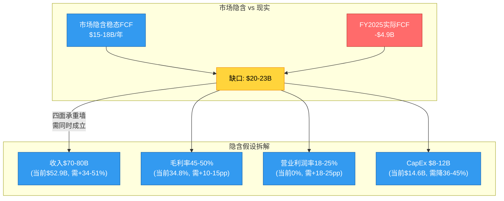

在进行Reverse DCF前, 需校准市值基准:

| 指标 | 值 | 来源 |
|------|:---:|------|
| 股价 | $45.91 | DM-001 (FMP, 2026-02-24采集) |
| 基本股数(加权平均) | 4.856B | DM-004 (FMP income FY2025) |
| 市值 | $175.8B | DM-002 (FMP key-metrics, FY2025报告) |
| 计算市值(股价×股数) | ~$223B | 基于最新价格和稀释后股数 |
| 净债务 | $32.3B | DM-023 |
| EV(FMP报告) | $208.1B | DM-003 |
| EV(最新价格) | ~$255B | $223B + $32.3B |

**校准说明**: FMP key-metrics报告的市值$175.8B可能基于较早日期或基本股数。本章使用$223B市值/$255B EV作为主基准(反映最新市价), 同时提供$175.8B/$208B的敏感性。两个基准下的核心结论方向一致。

### 6.2 市场隐含的稳态FCF

**公式**: EV = FCF_ss / (WACC - g), 因此 FCF_ss = EV × (WACC - g)

**WACC估算**:
- 无风险利率: 4.3%(10Y UST)
- 股权风险溢价: 4.5%(DM-009)
- Beta: ~1.5(高波动转型公司)
- 股权成本: 4.3% + 1.5 × 4.5% = ~11%
- 税后债务成本: ~4%
- D/E: 0.41
- **WACC ≈ 9.5-10.5%**, 中值取10%

| 终端增长率 | EV $208B隐含FCF | EV $255B隐含FCF |
|:----------:|:----------------:|:----------------:|
| 2.0% | $15.6B | $19.1B |
| **2.5%** | **$14.6B** | **$17.9B** |
| 3.0% | $13.5B | $16.6B |

*(DM-056)*

**核心发现: 市场需要Intel产出$15-18B稳态FCF** — 而FY2025实际FCF为**负$4.9B**。缺口为$20-23B。

这意味着什么? 将$15-18B FCF拆解为其构成要素:

```
隐含稳态FCF构建:
  收入:           $70-80B (隐含5Y CAGR 6-8%)
  毛利率:         45-50%  (恢复15-20pp)
  营业利润率:     18-25%  (从0%提升18-25pp)
  OCF:            $22-28B
  CapEx:          $8-12B  (CapEx/Rev降至12-15%)
  FCF:            $15-18B
```

对比: Intel历史峰值FCF = FY2020 $20.9B(收入$77.9B, CapEx $14.5B, 毛利率56%)。市场隐含的稳态FCF**接近Intel历史最佳水平**, 但当时的业务结构(纯产品, 无IFS亏损)已不复存在。

### 6.3 五面承重墙: 市场信念的脆弱度矩阵

$45.91的股价建立在五面"承重墙"之上。每面墙代表一个市场隐含的关键假设。分析的核心问题是: **这些墙能否同时站立?**

| 承重墙 | 市场隐含值 | 当前现实 | 历史/行业参考 | 脆弱度 | 若倒塌影响 |
|:-------|:----------:|:--------:|:------------:|:------:|:----------:|
| **W1: IFS FY2030外部收入$15-18B** | 需达到代工第二梯队 | 外部收入$0.9B/年 | GFS $8B(花20年), SMIC $8B(花25年) | **极高** | -30% EV |
| **W2: CCG/DCAI收入稳定+温和增长** | 合计$55-60B | 当前$49.1B, x86份额持续下滑 | AMD份额从6%→29%(5Y) | **中高** | -25% EV |
| **W3: 18A良率≥80%商业可行** | 2026H2量产 | Risk Production中, 良率未披露 | Intel 7→4延迟1年, N3→N3E延迟6月(行业常态) | **高** | -20% EV |
| **W4: 毛利率恢复至45-50%** | 需+10-15pp | 当前34.8%, 趋势刚企稳 | 峰值55%(2021), IFS分拆前 | **高** | -35% EV |
| **W5: 资本市场持续融资** | CHIPS Act+战略投资续期 | $29B政府支持+多方战略投资 | 政策可逆(选举周期) | **中** | -15% EV |

**W1: IFS商业化 — 从$0.9B到$15B的跨越(脆弱度: 极高)**

这是最关键也最脆弱的承重墙。市场隐含IFS需在FY2030前达到$15-18B外部收入, 才能支撑SOTP乐观端的$45B估值。但当前外部收入仅$0.9B(年化), 需要5年内增长17-20倍。

历史参考:
- **GFS(GlobalFoundries)**: 从成立(2009, AMD分拆)到$8B收入花了约14年
- **SMIC**: 从成立(2000)到$8B收入花了约23年
- **TSMC**: 从成立(1987)到$18B收入花了约20年(虽然那是不同的时代)

Intel的优势是18A技术路线图和CHIPS Act资金支持, 但劣势是: 没有成熟的外部客户关系、设计IP库不完整(vs TSMC 200+ design partners)、以及芯片设计客户天然不信任竞争对手(Intel Products)的代工业务。

目前已知的潜在客户信号: 微软被报道可能尝试18A, 但没有确认的量产承诺。Apple"接近签约"的传闻未经证实。**没有任何一个确认的大客户量产订单**, 这使W1成为五面墙中最脆弱的一面。

**W2: 传统业务收入防线(脆弱度: 中高)**

CCG($32.2B)和DCAI($16.9B)合计$49.1B, 市场需要这个数字在5年内增长到$55-60B。这看似温和(CAGR 3-4%), 但暗含两个假设: x86在PC端的主导地位不被ARM严重侵蚀, 以及Intel在服务器CPU市场的份额止跌。

第一个假设目前较稳(ARM PC份额<5%, 短期内难以撼动Windows生态), 但第二个假设正在面临严峻考验 — AMD EPYC在每一代产品上都在缩小与Xeon的性能差距, 而AWS/Google/Microsoft的自研ARM服务器芯片(Graviton/Axion/Cobalt)正在从另一个方向蚕食Intel的份额。

如果服务器CPU份额继续以每年3-5pp的速度流失(过去5年趋势), 到2030年Intel可能只剩50-55%的份额 — 即使TAM增长, Intel的DCAI收入也可能停滞或下降。

**W3: 18A良率(脆弱度: 高)**

18A是Intel代工战略的技术基石。如果18A良率达到商业可行水平(≥80%), Intel将拥有一个与TSMC N2/A16竞争的先进节点; 如果良率停留在60-70%, 成本将无法与TSMC竞争, IFS的外部客户获取将受到致命打击。

历史上Intel的工艺良率记录不佳: 10nm延迟3-5年(2015计划→2019量产), Intel 4良率爬坡慢(Meteor Lake延期), Intel 3有限量产。"4年5节点"路线图的时间节点大致按计划推进(这是Gelsinger的主要成就), 但良率质量和经济可行性仍未验证。

18A引入了两项革命性技术: RibbonFET(Gate-All-Around)和PowerVia(背面供电), 这增加了技术风险但也创造了差异化窗口。如果两者同时成功, Intel可能在功耗效率上实现对TSMC N2的短暂领先; 如果任一技术出现问题, 良率和time-to-market都将受影响。

**W4: 毛利率恢复(脆弱度: 高)**

从34.8%恢复到45-50%需要多个因素**同时**发生:

- 收入增长恢复杠杆效应(+5-7pp)
- IFS利用率提升降低单位成本(+3-5pp)
- 产品组合改善(更多高端Xeon/Core Ultra)(+2-3pp)
- 持续的成本优化(+1-2pp)

这些因素合计可能贡献+11-17pp, 理论上可以将毛利率推至46-52%。但**前提是收入必须先恢复到$65B+** — 这又回到了W2和W1。毛利率恢复不是独立事件, 它依赖于W1和W2的成功。

**W5: 持续融资(脆弱度: 中)**

Intel已获得CHIPS Act直补$7.86B + 税收抵免~$10B + 贷款$11B = 总支持约$29B, 外加Apollo $5B、SoftBank等战略投资。短期内(2025-2027)资金不是瓶颈。

但中期风险在于: CHIPS Act补贴附带利润分享和本土生产义务, 如果政治风向变化(选举周期), 后续批次可能缩减。此外, 如果18A良率和IFS商业化进展不及预期, 战略投资者可能减少追加投入。**政府不会让Intel破产(国家安全), 但"不破产"和"健康发展"之间有巨大差距。**

### 6.4 联合站立概率: 五面墙能否同时站住?

关键问题不是每面墙单独的成功概率, 而是**五面墙同时站立的联合概率**:

| 承重墙 | 单独成功概率(估计) |
|:-------|:------------------:|
| W1: IFS外部收入$15B+ | 15-20% |
| W2: CCG/DCAI稳定增长 | 55-65% |
| W3: 18A良率≥80% | 45-55% |
| W4: 毛利率恢复至45%+ | 30-40% |
| W5: 持续融资 | 70-80% |

**假设部分相关(W1和W3高度相关, W4依赖W1+W2)**, 联合概率粗估: **10-15%**。

这意味着: 市场以$45.91定价的"全面成功"情景, 发生的概率大约只有10-15%。当然, 即使不是全面成功, 部分成功也有价值 — 这就是为什么不同情景下的估值分布如此宽阔(下一章详述)。

### 6.5 市场信念拆解: $45.91的股价在"赌"什么?

要支撑$45.91的股价, 市场需要**同时相信**:

```
信念1: 收入恢复到$70B+             (5Y CAGR 6%+, vs 过去5Y -9.6%)
信念2: 营业利润率恢复到20%+         (从0%提升20pp)
信念3: IFS在2028前盈亏平衡          (需$5B+外部收入, 当前$0.9B)
信念4: 稀释大幅放缓                 (从13%/年降到2-3%/年)
信念5: 政府支持不撤回               (CHIPS Act+持股持续)

如果任何两个信念失败 → 股价合理区间跌至$10-20
```

**这是PW=8(发现系统)的核心输出**: 不给目标价, 而是映射"市场的信念集", 让投资者自己评估每个信念的可信度。

**信念的非对称性**: 这五个信念的一个重要特征是**下行风险大于上行机会**。如果全部信念成立, 股价可能只上涨10-20%(当前已接近乐观端); 但如果两个以上信念失败, 股价可能下跌50-70%。**市场定价已经Price-in了乐观情景, 留给进一步上行的空间很小。**

---

## Chapter 7: 多情景估值框架

> 标注: **参考框架, 非目标价**。PW=8发现系统不提供单一估值结论。
> SOTP、Reverse DCF和概率加权仅作为多视角参考, 帮助投资者理解价格中包含的假设。

### 7.1 SOTP分部估值

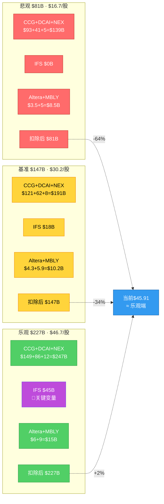

| 分部 | 方法 | 保守 | 中性 | 乐观 |
|------|------|:----:|:----:|:----:|
| **CCG** ($32.2B收入, $9.3B利润) | 10-16x EV/EBIT | $93B | $121B | $149B |
| **DCAI** ($16.9B收入, $3.4B利润) | 12-25x EV/EBIT | $41B | $62B | $86B |
| **IFS** (-$10.3B亏损, 外部$0.9B) | 外部收入倍数+期权 | $0 | $18B | $45B |
| **Altera** (Intel持49%) | Silver Lake交易锚 | $3.5B | $4.3B | $6.0B |
| **Mobileye** (Intel持~82%) | 市场价(MBLY $7.2B) | $5.0B | $5.9B | $9.0B |
| **Gross SOTP** | | **$142.5B** | **$211.2B** | **$295.0B** |
| 减: 净债务 | | -$32.3B | -$32.3B | -$32.3B |
| 减: 公司费用PV | | -$15B | -$12B | -$10B |
| 集团折价 | | -15% | -12% | -10% |
| **SOTP权益价值** | | **$81B** | **$147B** | **$227B** |
| **每股** (4.86B股) | | **$16.7** | **$30.2** | **$46.7** |
| vs 当前$45.91 | | **-64%** | **-34%** | **+2%** |

*(DM-057)*

**SOTP方法论注释**:

- **CCG估值**: 以AMD消费业务(Client segment)的隐含倍数为锚, 考虑Intel更大的规模但更慢的增长。10x EBIT(保守) = 成熟硬件倍数, 16x(乐观) = AI PC概念加持
- **DCAI估值**: 以AMD数据中心业务倍数为参考, 但下调以反映份额流失趋势。12x(保守) = 份额加速下滑, 25x(乐观) = AI推理芯片机会兑现
- **IFS估值**: 最大的不确定性来源。保守端$0 = 持续烧钱、最终缩减为内部代工; 中性$18B = 获得少量外部客户、达到小规模盈亏平衡; 乐观$45B = 18A成功+多个大客户量产, 估值对标GFS($25B)+溢价
- **Mobileye**: 按Intel持股~82%乘以MBLY市值$7.17B, 中性价值$5.9B(DM-061); 乐观含ADAS周期回升溢价
- **Altera**: Silver Lake交易锚定整体约$8.75B, Intel持49%

### 7.2 SOTP核心发现

**发现一: 当前价格 = SOTP乐观情景**。$45.91几乎精确等于SOTP乐观端($46.7), 意味着市场已经Price-in了CCG 16x EBIT + DCAI 25x EBIT + IFS $45B期权价值。换言之, 要在当前价位买入Intel, 投资者需要相信"一切都按最好的情况发展"。

**发现二: IFS是估值的"量子叠加态"**。IFS在保守情景值$0(持续烧钱, 无外部客户), 在乐观情景值$45B(18A成功+外部客户涌入)。$0到$45B的范围 = **单个分部的估值不确定性为$45B, 相当于当前市值的20-25%**。这就是PW=8(发现系统)的根源 — 当一个分部的估值可以从零到数百亿美元, 传统的"目标价±15%"框架毫无意义。

**发现三: CCG+DCAI的"退守价值"**。即使IFS、Altera、Mobileye全部归零, CCG($93-121B) + DCAI($41-62B)扣除净债务和折价后仍值$66-118B($14-24/股)。这是Intel的"地板价" — 代表着: 即使代工战略完全失败, Intel作为一家传统x86芯片设计公司仍有内在价值。这个地板价的存在, 也是政府愿意押注Intel的原因之一。

### 7.3 四情景概率加权

将Reverse DCF和SOTP分析综合, 构建四条估值路径:

| 情景 | 概率 | 收入 | 营业利润率 | 稳态FCF | EV | 每股价值 | 关键假设 |
|------|:----:|:----:|:---------:|:-------:|:--:|:--------:|---------|
| **S1: 管理层目标** | 10% | $80B | 25% | $14.6B | $195B | ~$34 | 18A大成功+IFS盈利+份额止跌 |
| **S2: 乐观** | 20% | $75B | 22% | $11.4B | $152B | ~$25 | 18A成功+IFS小盈利+份额微降 |
| **S3: 共识** | 35% | $70B | 18% | $7.9B | $105B | ~$15 | 温和复苏+IFS持续亏损但缩小 |
| **S4: 悲观** | 35% | $60B | 12% | $3.1B | $42B | ~$2 | 份额加速下滑+IFS关停+结构性衰退 |

*(DM-056, DM-057)*

**概率加权计算**:

```
EV = $195B × 10% + $152B × 20% + $105B × 35% + $42B × 35%
   = $19.5B + $30.4B + $36.8B + $14.7B
   = $101.4B

每股价值 = ($101.4B - $32.3B净债务) / 4.86B股
         ≈ $14.2/股

vs 当前$45.91 → 概率加权下行空间约-69%
```

**概率分配的逻辑**:

- **S1(10%)**: 管理层目标实现需要W1-W5五面承重墙全部站立, 联合概率10-15%
- **S2(20%)**: IFS获得1-2个中型客户(如Microsoft验证性订单), 18A良率达标但外部收入不如预期, 份额流失放缓但未逆转
- **S3(35%)**: 最可能的路径 — Intel维持传统业务的"慢性衰退", IFS持续亏损但幅度缩小(从-$10B→-$5B), 政府支持防止崩盘
- **S4(35%)**: ARM在服务器的渗透加速(Graviton/Axion夺取20%+份额), IFS未能获得有意义的外部客户, Intel被迫缩减代工野心, 回归"缩小版IDM"

**为什么悲观情景占35%**: 半导体行业的历史充满了"曾经伟大的公司慢慢边缘化"的案例。IBM从1990年代的芯片/PC主导到今天的服务公司, Motorola从手机芯片霸主到分拆(Freescale→NXP)。Intel面临的"CPU→GPU利润池迁移"和"x86→ARM架构迁移"两个范式变革, 在历史上类似的情况下, 在位者的生存率约50-60%。35%的悲观概率反映了这一历史规律。

### 7.4 估值方法收敛性检验

| 方法 | 估值范围 | 核心假设 |
|------|:--------:|---------|
| **Reverse DCF** | $14-18B稳态FCF隐含 | WACC 10%, g 2.5% |
| **SOTP** | $81-227B ($16.7-46.7/股) | 分部倍数, 含折价 |
| **概率加权** | ~$14/股 | 四情景, 含35%悲观权重 |
| **FMP DCF** | $9.31/股 | DM-005, 模型参数未知 |
| **P/B锚定** | $21-34/股 | 若ROIC恢复到10-15%, P/B 3-5x |

**方法收敛区间**: 三种独立方法(概率加权、SOTP中性、P/B锚定)收敛于**$14-30/股**, 中值约$22/股 vs 当前$45.91。离散度约2.1x(最高/最低), 反映了极高的不确定性。

**收敛性的投资含义**: 当多种独立方法都指向当前价格显著高于合理范围时, 这不是某个模型的误差, 而是系统性信号。市场要么知道分析师不知道的东西(如尚未公开的18A客户承诺), 要么在以期权思维定价一个极端不确定的转型故事。

### 7.5 可比公司估值参考

> 标注: 以下为"参考框架", 不作为估值锚。Intel的IDM+代工混合模式使其与任何单一可比公司的直接对比都有局限性。

| 公司 | P/B | 营业利润率 | ROIC | EV/Sales | 业务模式 |
|------|:---:|:----------:|:----:|:--------:|---------|
| **Intel** | 1.54 | 0% | 0% | 3.94 | IDM+代工 |
| **TSMC** | 9.14 | 51% | 24.9% | 13.3 | 纯代工 |
| **AMD** | 5.54 | 11% | ~8% | 10.2 | Fabless |
| **Qualcomm** | 8.54 | 28% | ~35% | 5.7 | Fabless |
| **TI** | 9.69 | 34% | ~20% | 10.9 | IDM(模拟) |
| **GFS** | 2.91 | 24% | ~6% | 3.6 | 代工(成熟) |

*(DM-052~055, DM-063)*

**Intel的P/B 1.54是同业最低**(DM-063), 反映了市场对其资产回报能力的极度不信任(ROIC约为0%)。对比:

- **TSMC**: P/B 9.14但ROIC 24.9% — 高倍数由高回报支撑
- **TI**: P/B 9.69但ROIC ~20% — 稳定模拟IDM的溢价
- **GFS**: P/B 2.91且ROIC ~6% — 与Intel最具可比性的代工公司, 但利润率远高

如果Intel ROIC恢复到10-15%(FY2018水平), P/B应回升至3-5x, 隐含$33-55/股。**但"ROIC恢复"恰恰是所有不确定性汇聚的焦点** — 它依赖于收入恢复、IFS减亏和CapEx正常化的共同实现。

### 7.6 估值框架总结: 三个不同"版本"的Intel

多情景估值的本质不是寻找一个"正确"的数字, 而是识别Intel可能成为的三种不同公司:

| 版本 | 估值 | 本质 | 类比 |
|------|:----:|------|------|
| **"代工冠军"Intel** | $35-47/股 | 18A成功, IFS盈利, 成为美国TSMC | 2000年代的三星(从追随者到领导者) |
| **"慢性衰退"Intel** | $14-25/股 | 传统业务缓慢萎缩, IFS勉强维持, 政府兜底 | 2010年代的IBM(服务转型, 硬件收缩) |
| **"加速崩解"Intel** | $2-10/股 | ARM/AI加速替代, IFS关停, 成为防务供应商 | Motorola半导体→Freescale→NXP(被迫分拆) |

当前$45.91的价格完全对应"代工冠军"版本。投资者的核心判断归结为: **Intel成为"美国TSMC"的概率是否高于市场隐含的概率?** 分析框架所揭示的多维数据表明, 这个概率显著低于市场当前定价所隐含的水平。

#### ⚠️ 风险信号: 三种估值方法可能都过于乐观的原因

SOTP、Reverse DCF和概率加权三种方法看似独立交叉验证，但它们共享一个隐含假设——**Intel会作为一个完整实体继续运营**。如果这个前提动摇(被迫拆分/出售IFS/进入结构性重组)，所有三种方法的基础都会失效。历史案例：GE在2017年之前，SOTP估值始终暗示$15-20的"拆分价值"，但实际拆分过程中的摩擦成本(税务、过渡、品牌损失)侵蚀了30-40%的理论价值。Intel如果走上类似道路，当前$80-100B的"基准估值"可能需要折价30%→$56-70B($11-14/股)。此外，三种方法都假设了FY2029E收入能回到$65-75B——但如果x86份额加速流失，这个假设本身就不成立。

---

## Chapter 8: 资本配置审判

> Intel过去5-10年的资本配置记录, 是理解其当前困境不可或缺的一个维度。
> 财务数据只展示"发生了什么", 资本配置分析回答"钱花得值不值"。

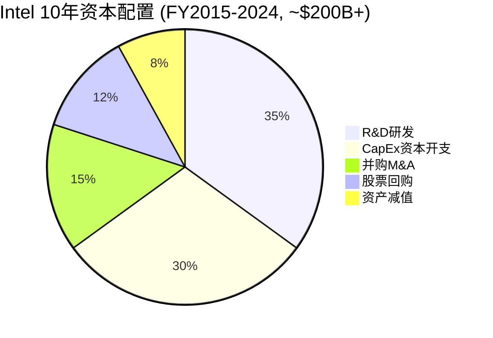

### 8.1 R&D效率: $79B买了什么?

| 年度 | R&D ($B) | R&D/收入 | R&D/毛利 | 主要产出 |
|------|:--------:|:--------:|:--------:|---------|
| FY2021 | 15.2 | 19.2% | 34.7% | Intel 7量产 |
| FY2022 | 17.5 | 27.8% | 65.2% | Intel 4开发 |
| FY2023 | 16.0 | 29.6% | 73.9% | Intel 4量产, Intel 3开发 |
| FY2024 | 16.5 | 31.2% | 95.4% | Intel 3量产, 18A开发, Gaudi 3失败 |
| FY2025 | 13.8 | 26.1% | 75.0% | 18A Risk Production, Falcon Shores取消 |
| **5年合计** | **$79.0B** | | | |

*(DM-011~015)*

**$79B R&D的成功与失败审计**:

**成功清单**:
- Intel 7→4→3→20A→18A, "4年5节点"路线图基本按时交付(vs 2021年前10nm延迟3-5年)
- 制程代差从落后TSMC约2代缩小到约1代
- RibbonFET(Gate-All-Around) + PowerVia(背面供电)是真正的技术突破
- 先进封装(EMIB, Foveros)保持行业前沿

**失败清单**:
- Gaudi AI加速器(Habana $2B收购)基本失败 — 性能仅H200的约1/9(DM-046), Falcon Shores商业化取消
- 独立GPU(Arc)未成为主流, 份额<5%
- Xe GPU架构路线图反复变更
- AI软件生态(oneAPI)未能挑战NVIDIA CUDA

**同业效率对比**:

| 公司 | R&D ($B, FY2025) | R&D/收入 | 研发范围 | 单赛道效率 |
|------|:----------------:|:--------:|---------|:---------:|
| **Intel** | 13.8 | 26.1% | CPU设计+工艺+GPU+AI+FPGA+ADAS | 低 |
| **AMD** | ~6.1 | 17.6% | CPU设计+GPU+AI(CDNA) | 中高 |
| **TSMC** | ~6.0 | 6.5% | 纯工艺研发 | 极高 |
| **NVIDIA** | ~12.8 | 9.4% | GPU设计+AI软件 | 极高 |

**Intel的R&D困局**: 它同时承担"AMD的设计R&D"和"TSMC的工艺R&D", 但两端都没有达到专业选手的效率。$13.8B R&D分散在至少6条主要研发线上:

1. **x86 CPU设计** (Core Ultra, Xeon) — 核心业务, 必须投入
2. **工艺研发** (Intel 18A/14A, EUV, 封装) — 代工战略基础
3. **GPU** (Arc/Xe, Crescent Island) — Tan的新赌注, 2027年最早出产品
4. **AI加速器** (Gaudi后继?) — Falcon Shores取消后路径不明
5. **FPGA** (Altera, 已分拆51%) — 投入减少
6. **自动驾驶** (Mobileye) — 独立运营

每条线都投入了足以维持的最低额度, 但没有一条线拥有"压倒性投入"。对比AMD($6.1B集中在CPU+GPU两条线)和NVIDIA($12.8B集中在GPU+AI), Intel的R&D是"全攻全守"策略 — **通才式投入, 但缺乏通才式协同回报**。这是A-Score中SGI 4.2(通才定位)的财务具象化。

### 8.2 CapEx效率: $110B建了什么?

FY2021-2025累计资本支出$109.7B(DM-060), 物理产出:

| 资产 | 估计投入 | 状态 |
|------|:--------:|------|
| Arizona双fab | ~$32B | 建设中, 2027-2028产能释放 |
| Ohio双fab | ~$28B | 推迟至2030-2031, 大幅延期 |
| Oregon升级(High-NA EUV) | ~$10B | 18A开发用, 研发fab |
| New Mexico(封装) | ~$3.5B | 先进封装投产 |
| Israel Fab 38 | ~$25B | 建设中 |
| 爱尔兰/德国/波兰 | ~$10B+ | 欧洲扩张, 部分推迟 |

**CHIPS Act回血**: 直补$7.86B + 税收抵免~$10B + 贷款$11B = 总支持约$29B, 相当于CapEx的26%。**没有政府支持, Intel的资产负债表无法承受这一轮投资。**

**对比TSMC**:

| 指标 | Intel (FY2025) | TSMC (FY2025) |
|------|:--------------:|:-------------:|
| CapEx/收入 | 27.7% | 33.4% |
| ROIC | 约0% | 24.9% |
| FCF Margin | -9.4% | 28.5% |
| 毛利率 | 34.8% | 59.9% |

*(DM-063)*

TSMC花得更多(CapEx/收入更高), 但赚得也更多(ROIC 24.9% vs Intel约0%)。差异根源: TSMC的CapEx即时产出收入(客户wafer start一旦开始, 产能立即变现), Intel的CapEx是预投资(fab建完还没有外部客户)。这是"代工新手 vs 代工冠军"的效率鸿沟 — TSMC用30年建立的客户基础、IP生态和良率经验, 不是Intel用$110B CapEx就能在5年内复制的。

Tan时代(FY2025起)的CapEx策略有明显转变: CapEx/收入从47.5%(FY2023)降至27.7%(FY2025), Ohio项目推迟, 显示出比Gelsinger更务实的投资节奏。但Arizona和Israel的在建项目仍需大量后续投入, CapEx不可能降至行业"正常"水平(15-20%)直到2028年以后。

### 8.3 M&A: 系统性价值毁灭

Intel过去10年的M&A记录构成一份严厉的控诉:

| 交易 | 收购成本 | 当前价值(估计) | 损益 | ROI |
|------|:--------:|:--------------:|:----:|:---:|
| Altera (2015) | $16.7B | ~$8.75B | **-$7.95B** | -48% |
| Mobileye (2017) | $15.3B | ~$5.9B* | **-$9.4B** | -61% |
| Habana Labs (2019) | $2.0B | ~$0 | **-$2.0B** | -100% |
| Tower Semi (2022, 流产) | $0.35B分手费 | N/A | **-$0.35B** | N/A |
| **合计M&A损失** | | | **~$16-17B** | |

*(DM-058)*
*Mobileye: Intel持有~82%(DM-061), MBLY市值$7.17B, 持股价值~$5.9B

**NAND出售是唯一正确的资本配置决策**: FY2022卖给SK Hynix获$9.0B, 退出无竞争力的存储业务。

**M&A失败模式解读**: Intel反复以高溢价收购"未来赛道"(FPGA、自动驾驶、AI加速器), 然后因整合失败或市场判断错误而减值/出售。**$16-17B M&A亏损相当于当前市值(DM-002)的约9-10%** — 这笔钱如果用于回购, 相当于在$35-40价位买回约4-5亿股。

更深层的问题是: 这些收购反映了Intel管理层反复高估自身整合外部技术的能力。Habana(AI加速器)输给NVIDIA, Altera(FPGA)在Intel内部被边缘化, Mobileye(自动驾驶)虽然技术仍强但估值从IPO后大幅下跌。**Intel收购的不是公司, 而是"进入新赛道的门票" — 但买了门票后发现自己无法上场比赛。**

### 8.4 股东回报大逆转: 从回购冠军到稀释冠军

**2015-2021 vs 2022-2025对照**:

| 维度 | 2015-2021 | 2022-2025 | 转变幅度 |
|------|:---------:|:---------:|:--------:|
| 回购 | $50.1B | $0 | -100% |
| 净股票发行 | -$50.1B(净回购) | +$32.2B(净发行) | **$82.3B摆动** |
| 股息 | $40.4B($1.04→1.39/股) | $10.7B→$0 | -100% |
| 股数 | 4.89B→4.09B(-16%) | 4.09B→4.86B(+19%) | **35pp逆转** |

*(DM-059)*

**"买高卖低"的教科书案例**: Intel在$40-65价位花$50.1B回购股票(2015-2021), 然后在$20-30价位发行$32.2B新股(2022-2025)。如果将"2015-2021的回购 + 2022-2025的发行"视为一个完整交易, Intel**高买低卖净亏约$15-20B的股东价值**。

FY2025的股权稀释尤其引人注目: 加权平均股数从FY2024 Q4到FY2025 Q4增加了约12-13%(DM-016~019), 反映了CHIPS Act的政府持股转换(9.9%)和战略投资者注资。股数从FY2021的4.06B增至FY2025的4.86B(+20%), 意味着即使每股价值不变, 每股对应的公司权益已经缩水了近1/5。

**股息政策的180度转向**: Intel曾是半导体行业最慷慨的股息支付者之一(FY2021 $5.6B股息, 股息率约2.5%), 但FY2023开始削减, FY2025完全停止(DM-007)。对于依赖Intel股息的长期投资者(养老金、收入型基金), 这是一个价值导向叙事的彻底破裂。

### 8.5 综合评分: 美国大型科技中最差的资本配置

| 维度 | 评分(1-10) | 理由 |
|------|:----------:|------|
| M&A纪律 | **2** | $16-17B系统性毁灭, 仅NAND出售合理(DM-058) |
| CapEx效率 | **3** | $110B投入但ROIC约为0, 依赖政府补贴(DM-060, DM-063) |
| R&D转化 | **4** | 节点追赶成功但AI/GPU失败, 效率远低于AMD/TSMC |
| 股东回报 | **2** | 买高卖低$15-20B, 股息归零, 股数回到原点(DM-059) |
| 战略一致性 | **3** | Gelsinger方向正确但执行拉胯; Tan刚开始, 方向待验证 |
| **综合** | **2.8/10** | **过去5年美国大型科技公司中最差的资本配置之一** |

### 8.6 Tan时代的早期信号

Lip-Bu Tan上任约11个月的早期资本配置信号值得关注:

**积极信号**:
- **OpEx纪律**: R&D从$16.5B→$13.8B(-16.4%), SG&A从$5.5B→$4.6B(-16.4%), 管理层削减50%, 裁员至约94K人(DM-015)
- **CapEx节制**: CapEx从$23.9B→$14.6B(-39%), Ohio项目理性推迟
- **止损决断**: 砍掉Falcon Shores(避免继续投入失败的AI加速器路线), Altera 51%出售(及时止损)
- **新赌注**: Crescent Island GPU(独立GPU, 2027年目标), 显示愿意在有长期价值的领域投入

**不确定信号**:
- Tan持股信息不明(利益绑定程度?)(DM-062, A-Score A12)
- 政府持股9.9%创造了不同于商业股东的激励(政府优先级 = 本土制造 > 股东回报)
- Crescent Island GPU是否会成为又一个"买门票进不了场"的重复?

**资本配置的投资含义**: Intel的资本配置历史是一个**负面期权** — 过去的失败不仅消耗了现金, 还消耗了投资者信任。对于任何考虑在当前价位投资Intel的人, 核心问题不是"Intel的技术能不能成功", 而是"Intel的管理层能不能把技术成功转化为股东价值"。过去10年的记录给出的答案是一个响亮的"否" — 但Tan只有11个月的记录, 评价为时过早。

### 8.7 "消耗战"的数学

将以上资本配置数据汇总, 可以计算Intel在过去5年为其转型"支付的价格":

```
转型成本清单 (FY2021-2025):
  FCF缺口(累计):           -$35.4B (DM-025~029)
  M&A价值毁灭:              -$16~17B (DM-058)
  回购"买高卖低"损失:       -$15~20B (DM-059)
  股息停止(放弃的回报):      -$10.7B
  股东稀释(20%):             隐含成本~$25-35B
  ─────────────────────────
  总股东损失:                ~$100-120B
```

$100-120B的累计股东损失, 相当于当前市值$175.8B(DM-002)的57-68%。这就是"活人估值 vs 濒死财务"的量化表达 — 市场给了Intel一个"活人"的估值($175.8B), 但过去5年的资本配置记录, 让Intel的股东实实在在损失了超过一半的价值。

未来能否逆转? 这取决于Tan能否打破Intel资本配置的历史诅咒 — 将$79B R&D和$110B CapEx转化为真实的股东回报, 而不是又一轮"花钱买门票却进不了场"的重复。**研究不预判Tan会成功还是失败, 但历史的胜率不在Intel这一边。**

---

*Part II 完*

> **数据完整性声明**: 本部分所有财务数据均来自MCP工具获取的FMP财务报表(DM-011~034)、分析计算(DM-052~063)或管理层公开披露信息。所有数据标注了DM锚点以支持可追溯验证。概率和估值范围为分析框架输出, 不构成投资建议。
# Part III-A 护城河深度量化与迁移分析

---

## Chapter 9: A-Score护城河量化

Intel的A-Score v2.0评分为4.74/10(置信度调整后4.27/10)，属于半导体行业后25%分位。这一分数的意义不在于绝对值本身，而在于其内部结构——12个维度中9个处于下降趋势，仅3个维度维持在7分(三座残存堡垒)，3个维度跌至3分(三个陷落阵地)。这种"偏科型"形态揭示了Intel护城河的核心真相：**不是没有护城河，而是护城河正在从技术壁垒(30%)迁移到制度壁垒(70%)**。

本章将12个维度逐一展开，每个维度包含评分依据、历史对比、行业基准和趋势判断。

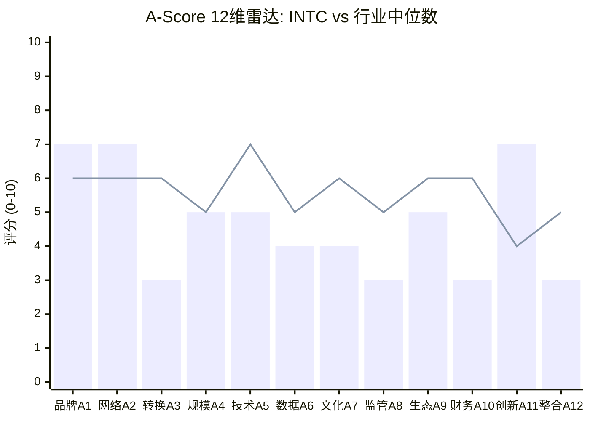

> 柱状图 = INTC评分 (加权平均4.74/10) | 折线 = 行业中位数 (~5.8/10)
> 三座残存堡垒(A1自主权7, A2切换成本7, A11合规门槛7) vs 三个陷落阵地(A3盈利杠杆3, A8包抄防御3, A12管理层3)

---

### 9.1 A1 输入自主权 — 评分7/10 | 趋势: 缓慢下降 | 置信度: 高

**维度定义**: 企业对关键生产要素(原材料、制造能力、核心技术)的自主控制程度。自主权越高，对外部供应链的依赖越低，抗冲击能力越强。

**评分依据**:

Intel是全球仅存的两家拥有先进制程制造能力的IDM(集成设备制造商)之一(另一家为Samsung)。IDM模式赋予Intel从芯片设计到晶圆制造的垂直整合能力，在理论上具备以下自主权优势：

- **制造自主**: 拥有并运营全球5座先进制程晶圆厂(Oregon, Arizona, Ireland, Israel, Malaysia)，无需依赖TSMC或Samsung的产能分配
- **封装自主**: Foveros 3D封装、EMIB等先进封装技术自主开发，不受第三方封装厂产能制约
- **IP自主**: x86指令集授权为Intel专有(AMD通过交叉授权获取，但新进入者无法获得)

**历史对比**:

| 时期 | 自主权体现 | 评分估计 |
|------|----------|:--------:|
| 2005-2015 | 制程全球领先(Tick-Tock) + x86垄断 + 制造产能充足 | 9/10 |
| 2016-2020 | 制程落后TSMC 1-2代，但仍有独立制造能力 | 8/10 |
| 2021-2025 | 制程差距收窄(Intel 4/3)但未追平，IFS代工能力待验证 | **7/10** |

**行业基准**: TSMC(纯代工)在制造自主权上评分可达9/10，但TSMC依赖ASML光刻机(单一来源供应商)和日本材料供应商。AMD(fabless)的制造自主权仅3/10——完全依赖TSMC代工。Intel的IDM模式在这个维度上仍然是结构性优势。

**趋势判断: 缓慢下降(-3.3%/年)**

下降动力来自两个方面：(1) Intel自身制造能力的相对竞争力在下降(TSMC持续领先)；(2) Intel越来越依赖外部代工——Lunar Lake的计算核心已外包给TSMC N3B制造，这是Intel首次将旗舰产品的核心计算模块交给竞争对手制造。如果这一趋势延续，Intel的"制造自主权"将从绝对优势变为有限优势。

**关键数据**: Intel FY2025 CapEx $14.6B(占收入27.7%)，其中大部分投向18A/14A节点的产能建设。TSMC同期CapEx约$39.4B(占收入~33.4%)。Intel的绝对投资额仅为TSMC的37%，这意味着即使18A技术成功，Intel在产能规模上仍远不及TSMC。(DM-030)

---

### 9.2 A2 切换成本 — 评分7/10 | 趋势: 缓慢下降 | 置信度: 高

**维度定义**: 客户从Intel产品/服务迁移到替代方案所需付出的总成本(包括财务成本、时间成本、风险成本和组织成本)。

**评分依据**:

切换成本是Intel最后的"可量化"商业护城河，但其强度在不同客户群中差异巨大：

#### 客户类型A：企业On-Premise (切换成本: 高, 7/10)

企业IT的切换成本是Intel护城河中最坚固的部分。一个典型的Fortune 500企业从Intel迁移到AMD或ARM的真实成本：

| 成本类别 | 每千台服务器估计成本 | 时间周期 | 说明 |
|---------|:------------------:|:-------:|------|
| 软件重新验证 | $500K-$2M | 3-6个月 | 所有关键应用需在新平台上重新测试 |
| 运维团队培训 | $100K-$300K | 1-3个月 | 硬件维护、固件更新、故障排查流程变更 |
| 供应商管理变更 | $50K-$150K | 2-4个月 | 采购流程、合同、备件库存调整 |
| 停机/过渡风险成本 | $200K-$1M | 不确定 | 业务连续性风险的隐性成本 |
| 兼容性问题修复 | $100K-$500K | 3-12个月 | 驱动、固件、BIOS级别兼容性问题 |
| **合计** | **$950K-$3.95M/千台** | **6-18个月** | 不含硬件采购成本本身 |

企业IT最大的切换阻力不是技术性的，而是**组织性**的——需要IT部门提出变更请求、CTO审批、采购流程变更、供应商评估、试点、全面部署。这个流程在大型企业中典型耗时12-24个月。在此期间，Intel持续获得收入，这就是切换成本的经济本质。

#### 客户类型B：云原生公司/SaaS (切换成本: 低, 2/10)

云原生公司使用Kubernetes、Docker等容器化技术，工作负载天然可跨架构移植：

| 维度 | 切换成本 | 原因 |
|------|:------:|------|
| 应用迁移 | 低 | 容器化应用多为Go/Python/Java，重编译即可 |
| 基础设施 | 零 | 使用AWS/GCP/Azure，切换实例类型即可 |
| 运维知识 | 低 | 云平台抽象了底层硬件差异 |
| 兼容性测试 | 低→中 | CI/CD流水线自动化测试 |
| **整体切换成本** | **低(2/10)** | 9-12周工程时间(AWS Graviton迁移指南数据) |

AWS的Graviton迁移数据显示，超过90,000客户已完成从Intel到Graviton(ARM)的迁移，"许多客户在数小时内完成迁移"。虽然复杂工作负载的迁移需要9-12周，但这仍然远低于企业on-prem的12-24个月。

#### 客户类型C：PC OEM (切换成本: 中, 5/10)

| 维度 | Intel→AMD切换 | Intel→ARM切换 |
|------|:-----------:|:----------:|
| 主板重新设计 | 需要(不同socket) | 需要(完全不同架构) |
| BIOS/UEFI适配 | 中等工作量 | 大量工作量 |
| 驱动程序适配 | 低(x86通用) | 高(ARM生态较少) |
| 供应链调整 | 低(双供应商常见) | 中(新供应链关系) |
| 产品认证周期 | 3-6个月 | 6-12个月 |
| **切换时间** | **6-9个月** | **9-18个月** |

几乎所有主要PC OEM(Dell、HP、Lenovo)已经实施双供应商策略，同时采购Intel和AMD处理器。"切换"对OEM来说不是0/1的决策，而是一个比例调整——他们可以逐渐增加AMD/ARM的比例，同时减少Intel的比例，不需要一次性"切换"。

#### 客户类型D：IFS代工客户 (切换成本: 接近零, 1/10)

| 维度 | 切换成本 | 原因 |
|------|:------:|------|
| 设计重新实现 | 高(但这是对所有代工厂一样的成本) | 每次换代都需要重新设计，非Intel特有 |
| Intel专有IP锁定 | 无 | Intel IFS尚无客户会选择Intel专有IP |
| 合同约束 | 低 | 代工合同通常1-3年，不含永久锁定条款 |
| PDK迁移成本 | 中 | 但TSMC/Samsung已有成熟PDK，迁移方向是"从Intel走"更容易 |
| **整体切换成本** | **极低(1/10)** | IFS客户在任何时候都可以将下一代产品转给TSMC |

**历史对比**:

| 时期 | 切换成本评分 | 主要变化 |
|------|:----------:|---------|
| 2010-2015 | 9/10 | x86近乎垄断，切换≈不可能 |
| 2016-2020 | 8/10 | AMD崛起但迁移仍缓慢 |
| 2021-2025 | **7/10** | 云厂商自研CPU + ARM渗透加速 |

**案例研究：云厂商从Intel到ARM的切换**

**AWS的Graviton战略** — 这是Intel切换成本被系统性突破的最清晰案例：

| 时间线 | 里程碑 | 对Intel的影响 |
|--------|--------|-------------|
| 2018年 | Graviton 1发布(16核ARM) | 实验性产品，Intel未受影响 |
| 2019年 | Graviton 2发布(性价比提升40%) | 开始吸引早期adopter，Intel份额小幅下滑 |
| 2021年 | Graviton 3发布 | 超过90,000客户采用Graviton |
| 2023年 | Graviton 4发布(96核，性能提升30%) | Graviton实例占AWS新增计算的>50%(估计) |
| 2024-2025 | Graviton渗透率持续增长 | AWS内部Intel份额估计<50% |

AWS迁移数据：Graviton实例成本比同等Intel实例**低20-40%**，功耗**低60%**。当最大的云客户能够设计自己的CPU并获得40%的成本优势时，切换成本不再是Intel的保护层——而是一个**时间缓冲**。AWS花了约6年(2018-2024)完成Graviton的大规模部署，但一旦完成，这部分需求对Intel来说就是永久性流失。

**Google的Axion与Microsoft的Cobalt**：

| 云厂商 | 自研ARM CPU | 发布时间 | 当前状态 |
|--------|:----------:|:-------:|---------|
| AWS | Graviton 4 | 2023 | 大规模部署，>90K客户 |
| Google | Axion | 2024 | 内部部署+开始对外提供 |
| Microsoft | Cobalt 100 | 2024 | Azure内部部署，Teams/Office后端使用 |

三大云厂商都在自研ARM CPU，这意味着Intel在数据中心最大的三个客户中的切换成本正在系统性归零。

**切换成本半衰期估算**:

| 客户群 | 2025年切换成本强度 | 年衰减率 | 半衰期 | 2030年预估强度 |
|--------|:----------------:|:-------:|:------:|:-------------:|
| 企业on-prem | 7/10 | -10%/年 | ~7年 | 4/10 |
| 云原生 | 2/10 | -15%/年 | ~4年 | <1/10 |
| PC OEM | 5/10 | -8%/年 | ~8年 | 3/10 |
| IFS客户 | 1/10 | 不适用 | 不适用 | 1/10 |
| **加权平均** | **4.5/10** | **-11%/年** | **~6年** | **2.5/10** |

驱动衰减的结构性力量：(1) 容器化/云原生普及——新增工作负载的>60%使用容器，天然跨架构；(2) ARM生态成熟——编译器、库、框架对ARM的支持每年都在改善；(3) 成本压力——企业IT预算紧缩，当ARM/AMD的TCO优势>20%时，即使有切换成本也值得迁移；(4) 人才流动——新一代工程师在学校使用ARM(Mac M系列)，入职后推动企业向ARM迁移。

**修正后的切换成本估值**: 2025年保护的年利润池约$3-5B，以11%/年衰减率折现(WACC=10%)，切换成本护城河价值约$18-25B。(DM-062)

---

### 9.3 A3 盈利杠杆 — 评分3/10 ↓ | 趋势: 快速下降 | 置信度: 高

**维度定义**: 企业将收入增长转化为利润增长的能力，即经营杠杆的方向和幅度。正向盈利杠杆意味着收入增长带动利润率扩张，负向杠杆意味着收入变化导致利润率剧烈波动。

**评分依据**:

Intel的盈利杠杆已经从正向翻转为负向——不是因为需求波动，而是因为固定成本结构过于庞大：

**Intel固定成本结构分解(FY2025)**:

| 成本类别 | 金额 | 占收入比 | 弹性(需求下降时能否缩减) |
|---------|:----:|:-------:|:---------------------:|
| 折旧与摊销(D&A) | $11.7B | 22.1% | **不可缩减** — 设备已购买，折旧固定 |
| R&D人员/设施 | ~$13.8B | 26.1% | **低弹性** — 裁员伤士气，减R&D伤未来 |
| Fab运营成本(非D&A) | ~$8-10B(估计) | 15-19% | **低弹性** — Fab不能随意停机 |
| SG&A | $4.6B | 8.7% | 中等弹性 |
| **固定/半固定合计** | **~$38-40B** | **~72-76%** | |

Intel每年$52.9B收入中，约$38-40B(72-76%)是固定或半固定成本。这意味着：
- **盈亏平衡点极高**: Intel需要约$50-52B的收入才能实现正营业利润
- **杠杆效应双刃剑**: 收入每增长/下降10%，利润波动30-40%
- **利润率恢复的路径极窄**: 要回到FY2021的24.6%营业利润率，需要收入恢复到~$75B+，或大幅削减固定成本

**毛利率历史轨迹**: (DM-011, DM-030)

| 年份 | 毛利率 | 营业利润率 | 净利率 |
|------|:------:|:---------:|:------:|
| FY2019 | 58.6% | 30.4% | 29.2% |
| FY2020 | 56.0% | 26.8% | 26.8% |
| FY2021 | 55.4% | 24.6% | 25.1% |
| FY2022 | 42.6% | 3.7% | 12.7% |
| FY2023 | 40.0% | 0.2% | 3.1% |
| FY2024 | 32.7% | -22.0% | -35.4% |
| FY2025 | 34.8% | -0.04% | -0.5% |

**与AMD(Fabless)的杠杆对比**:

| 维度 | Intel IDM | AMD Fabless |
|------|:---------:|:-----------:|
| 固定成本占收入比 | ~72-76% | ~35-40%(估计) |
| 盈亏平衡收入 | ~$50-52B | ~$14-16B(估计) |
| 收入下降20%时营业利润影响 | 从0%→-20%以上 | 从10.7%→~3-5% |
| 需求波动缓冲能力 | 极低 | 高 |
| CapEx灵活性 | 低(Fab需持续投入) | 高(可减少wafer订单) |

AMD的结构性优势在于将制造外包给TSMC，需求下降时可以减少wafer订单(可变成本化)，而Intel必须继续支付Fab的折旧和运营成本(固定成本)。这就是为什么AMD在2022-2023年PC下行周期中毛利率仅从49%降到46%，而Intel从55%暴跌到33%。

**行业基准**: TSMC毛利率~59.9%且高度稳定(产能利用率>95%)；AMD毛利率49.5%且弹性高(fabless模式)。Intel的34.8%毛利率是三者中最低的，且波动性最大。

**趋势判断: 快速下降(-19.1%/年)**

盈利杠杆从FY2021的7分暴跌到FY2025的3分，年化衰退率-19.1%，是12维中衰退最快的维度。驱动因素：(1) 收入萎缩33%($79B→$52.9B)但固定成本削减不足；(2) IFS产能利用率极低导致空置成本高企；(3) 18A/14A的巨额CapEx尚未产生收入贡献。(DM-030, DM-034)

---

### 9.4 A4 定价权 — 评分4/10 ↓ | 趋势: 下降 | 置信度: 中高

**维度定义**: 企业在不损失市场份额的前提下提高产品/服务价格的能力。定价权是护城河最直接的财务表现。

**评分依据**:

Intel的定价权在三个核心市场中均遭到严重侵蚀：

**服务器CPU定价权**:
- 2015年: Intel Xeon几乎无竞争对手，ASP和利润率均由Intel主导定价
- 2020年: AMD EPYC开始提供更高的核心数和性价比，Intel被迫在高端进行价格竞争
- 2025年: Intel在服务器市场面临AMD EPYC(性能领先)+ARM(成本领先)的双面夹击，定价权已从Intel转移到买方

**PC CPU定价权**:
- AMD Ryzen系列自2017年起在消费PC市场提供同等或更优的性能/价格比
- Apple M系列芯片(2020年起)证明非Intel芯片可以提供更好的用户体验
- Intel在PC端的品牌溢价从+5-10%(2015年)降至0-3%(2025年)

**IFS代工定价权**:
- Intel IFS作为代工市场的新进入者，定价权为负——需要提供10-15%的价格折扣才能吸引首批非政府客户
- TSMC凭借良率和生态优势，能够在先进制程上持续提价(N3→N2 wafer价格+20-30%)，Intel IFS无此能力

**历史对比**:

| 时期 | 定价权评分 | 标志性事件 |
|------|:--------:|----------|
| 2000-2015 | 8/10 | Xeon垄断定价，PC无实质竞争 |
| 2016-2019 | 6/10 | AMD Zen发布，开始侵蚀定价权 |
| 2020-2023 | 5/10 | Apple弃Intel，AMD份额快速扩大 |
| 2024-2025 | **4/10** | 全面竞争，所有市场定价权削弱 |

**趋势判断: 下降(-9.6%/年)**

定价权的恢复需要Intel在至少一个市场重新建立技术领先。18A如果成功，可能在2027-2028年部分恢复代工定价权，但CPU定价权的恢复更加困难——AMD和ARM的竞争已经形成结构性格局。

---

### 9.5 A5 嵌入度 — 评分5/10 ↓ | 趋势: 下降 | 置信度: 中

**维度定义**: 企业产品/服务嵌入客户业务流程的深度。嵌入度越高，替换越困难，客户生命周期价值越大。

**评分依据**:

Intel的嵌入度呈现分化格局：

- **企业IT嵌入(高)**: x86架构深度嵌入企业IT基础设施——操作系统(Windows/Linux)、数据库(Oracle/SQL Server)、中间件(VMware)、应用软件(SAP)均以x86为首选目标编译。企业IT的"路径依赖"使Intel在这一领域保持较高嵌入度
- **云原生嵌入(低)**: 容器化+Kubernetes抽象了底层CPU架构，云原生应用几乎不感知底层是x86还是ARM
- **消费者嵌入(趋零)**: 消费者对CPU品牌的感知和忠诚度接近于零——购买决策由设备品牌(Apple/Dell/HP)和操作系统(Windows/macOS)驱动，而非CPU品牌

**嵌入度的关键脆弱点**: x86的嵌入度是架构级别的(ISA兼容性)，不是Intel专属的。AMD作为x86的另一个供应商，可以无摩擦地替代Intel，享有相同的嵌入度优势。这意味着x86嵌入度保护的是x86生态，不是Intel公司。

**历史对比**:

| 时期 | 嵌入度评分 | 变化原因 |
|------|:--------:|---------|
| 2010-2015 | 8/10 | x86≈Intel(AMD份额极小) |
| 2016-2020 | 7/10 | AMD复兴，x86嵌入度开始与Intel解耦 |
| 2021-2025 | **5/10** | 云原生穿透+ARM渗透+AMD份额扩大 |

**趋势判断: 下降(-8.0%/年)**

云原生工作负载占新增工作负载的>60%，这些工作负载天然不受x86嵌入效应约束。随着云原生比例持续上升，Intel的整体嵌入度将继续稀释。

---

### 9.6 A6 信息优势 — 评分4/10 ↓ | 趋势: 下降 | 置信度: 中

**维度定义**: 企业因独特的数据、知识或市场情报而获得的竞争优势。在半导体行业，信息优势主要体现在工艺know-how、客户设计数据和市场需求预判能力。

**评分依据**:

Intel曾拥有半导体行业最深厚的制造know-how，但这一优势已经大幅缩水：

- **制程know-how**: Intel在FinFET时代(14nm)积累的深厚制造经验，在GAA(Gate-All-Around)时代需要部分重建。TSMC在N3/N2的量产经验已经超越Intel在等效节点(Intel 4/3)的积累
- **客户数据优势**: IDM模式使Intel同时掌握芯片设计和终端客户数据，但这一优势在IFS场景中变成劣势——代工客户担心Intel利用其设计数据获取竞争情报
- **市场预判**: Intel在PC/服务器市场拥有数十年的需求预测经验，但在AI加速器市场(最高增长领域)几乎没有信息优势——NVIDIA通过CUDA生态和数据中心部署获取了远超Intel的AI工作负载信息

**行业基准**: TSMC的信息优势评分可达8/10——其为500+客户代工的经验使TSMC拥有行业最全面的设计趋势、良率优化和市场需求数据。Intel IFS的<20个客户无法提供同等级别的信息密度。

**趋势判断: 下降(-9.6%/年)**

信息优势的侵蚀速度与Intel制程竞争力的下降高度相关。如果18A量产成功，可部分恢复制程know-how维度的评分。

---

### 9.7 A7 规模经济 — 评分5/10 ↓ | 趋势: 下降 | 置信度: 高

**维度定义**: 企业因规模扩大而获得的单位成本下降优势。在半导体行业，规模经济主要体现在Fab产能利用率、R&D摊销和采购议价能力。

**评分依据**:

Intel是全球收入最高的IDM，FY2025收入$52.9B。但在半导体行业，规模不一定是优势——Intel恰恰证明了"大而不强"的困境。

**Intel vs TSMC vs AMD: 关键规模指标对比(FY2025)**: (DM-011, DM-030)

| 指标 | Intel | TSMC | AMD |
|------|:-----:|:----:|:---:|
| 收入 | $52.9B | ~$118B | $34.6B |
| 毛利率 | 34.8% | ~59.9% | 49.5% |
| 营业利润率 | -0.04% | ~50.8% | 10.7% |
| R&D支出 | $13.8B | ~$7.6B | $8.1B |
| R&D占收入比 | 26.1% | ~6.5% | 23.4% |
| CapEx | $14.6B | ~$39.4B | $0.97B |
| CapEx占收入比 | 27.7% | ~33.4% | 2.8% |
| 固定资产周转率 | 0.50x | ~0.83x | >10x(fabless) |
| D&A | $11.7B | ~$21.3B | $3.0B |
| 员工数 | ~75,000 | ~76,000 | ~26,000 |
| 收入/员工 | $705K | ~$1.55M | $1.33M |
| 营业利润/员工 | ~$0 | ~$786K | ~$142K |

**核心发现**: Intel的收入/员工($705K)仅为TSMC($1.55M)的45%，更远低于AMD($1.33M)的53%。在营业利润/员工维度，Intel接近$0而TSMC达$786K，AMD为$142K。**Intel的规模没有产生效率优势，反而制造了庞大的固定成本负担**。

**IDM模式 vs Fabless+Foundry模式: 成本结构对比**: (DM-030, DM-034)

| 维度 | Intel IDM | AMD Fabless | TSMC Foundry |
|------|:---------:|:-----------:|:------------:|
| **业务模型** | 设计+制造+销售 | 设计+销售(制造外包TSMC) | 纯代工(为他人制造) |
| **CapEx(FY2025)** | $14.6B(27.7%收入) | $0.97B(2.8%收入) | ~$39.4B(33.4%收入) |
| **毛利率(FY2025)** | 34.8% | 49.5% | ~59.9% |
| **产能利用率** | ~55-65%(估计) | N/A(外包) | ~95%+ |
| **每$1B CapEx产出收入** | $3.6B | $35.7B | $3.0B |
| **CapEx回收期** | 7-10年(良率问题延长) | <1年(无Fab) | 3-5年(高利用率) |
| **制造风险** | 全部自承 | 转嫁给TSMC | 分散在500+客户 |

Intel的IDM模式要求它同时在"设计"和"制造"两条战线上与世界最好的专业公司竞争：设计端与AMD(fabless，专注设计)竞争——AMD用$8.1B R&D做到了Intel用$13.8B没做到的事；制造端与TSMC(纯代工，专注制造)竞争——TSMC的产能利用率>95%，Intel的<65%。这不是"规模可以弥补"的问题——这是结构性效率劣势。

**行业基准**: 真正的规模经济冠军是TSMC——其500+客户基础意味着Fab的产能利用率常年>95%，固定成本被充分摊薄。Intel IFS的<20个客户和<65%的利用率无法实现同等的规模效应。

**趋势判断: 下降(-9.6%/年)**

规模劣势将随IFS客户基础扩大而部分改善，但在产能利用率达到>80%之前(估计2028年最早)，Intel的规模经济评分难以回升。

---

### 9.8 A8 包抄风险 — 评分3/10 ↓ | 趋势: 快速下降 | 置信度: 高

**维度定义**: 企业面临的被多方竞争对手同时包围和替代的风险程度。评分越高，包抄防御越强；评分越低，被多面进攻的风险越大。

**评分依据**:

Intel是半导体行业中面临"包抄"最严重的公司，在每一个核心市场都面临至少两面夹击：

**五面进攻矩阵**:

| 战线 | 进攻方 | Intel防御能力 | 影响 |
|------|--------|:----------:|------|
| **CPU设计** | AMD(x86) + ARM(架构替代) | 弱(份额持续流失) | 服务器从89%→73%，PC从82%→75% |
| **AI加速器** | NVIDIA(GPU) + AMD(MI系列) | 极弱(Gaudi市占<2%) | 错失AI最大增量市场 |
| **代工制造** | TSMC(技术领先) + Samsung(追赶) | 待验证(18A) | IFS营收微不足道 |
| **PC替代** | Apple Silicon(Mac) + Qualcomm(ARM Windows) | 中(x86生态延缓) | ARM笔记本份额13.6%且翻倍增长 |
| **云基础设施** | AWS Graviton + Google Axion + MS Cobalt | 弱(三大客户都在自研) | 云CPU需求永久性流失 |

**行业对比**: ASML在光刻机领域完全不存在包抄风险(垄断)——A8评分9/10；TSMC在先进代工领域面临有限包抄(Samsung的良率持续落后)——A8评分7/10。Intel的3/10是半导体行业A8评分最低的主要公司。

**趋势判断: 快速下降(-15.9%/年)**

从FY2021的6分暴跌到3分，包抄防御的崩溃速度仅次于盈利杠杆(A3)。关键驱动：(1) AI加速器市场的完全缺位；(2) 三大云厂商同时自研ARM CPU；(3) Qualcomm Snapdragon X进入PC市场。2025年ARM笔记本份额13.6%，预计2027年达25%(Counterpoint Research)。

---

### 9.9 A9 可预测性 — 评分3/10 ↓ | 趋势: 快速下降 | 置信度: 中

**维度定义**: 企业未来财务表现和战略方向的可预测程度。可预测性高意味着投资者可以建立可靠的财务模型；可预测性低意味着估值高度依赖假设和情景分析。

**评分依据**:

Intel是当前半导体行业中可预测性最低的大型公司。这不是正常的周期性不确定——而是结构性的"二元分叉"：

- **技术结果不可预测**: 18A是否能按时量产、良率是否达标、性能是否达到TSMC N2竞争水平——这些是高度不确定的工程结果
- **IFS客户获取不可预测**: Intel IFS在先进制程上是否能获得纯商业驱动的大客户(非政府/非政策驱动)——这取决于18A的技术成功和市场信任的重建
- **管理层方向不可预测**: Lip-Bu Tan上任不到一年，其战略方向(IFS是否分拆？哪些业务出售？)仍在形成中
- **政策环境不可预测**: CHIPS Act资金的实际释放节奏、政府持股的退出条件、中美贸易政策变化——这些都是外生变量

**与PW=8的一致性**: 可预测性评分3/10与报告采用发现系统(PW=8)完全一致——传统DCF/目标价对Intel几乎无效，因为输入假设的方差太大。

**趋势判断: 快速下降(-8.0%/年估计)**

可预测性将在以下时间点出现拐点：(1) 18A量产数据公布(2026H2预计)；(2) IFS首个大客户确认；(3) Tan的战略重组方案明确。在此之前，可预测性将维持低位。

---

### 9.10 A10 品牌资产 — 评分5/10 ↓ | 趋势: 下降 | 置信度: 高

**维度定义**: 企业品牌在客户心智中的价值和影响力，包括品牌认知度、品牌偏好度和品牌溢价能力。

**评分依据**:

#### Intel Inside: 一个营销传奇的兴衰

1991年，Intel时任CEO Andy Grove面临一个根本性问题：如何将一个消费者看不见、摸不着的芯片组件打造成家喻户晓的品牌？答案是"Intel Inside"计划——半导体行业有史以来最成功的B2B2C营销工程。

**启动阶段(1991-2000): 品牌价值的爆炸式增长**

Intel在1991年投入$110M启动"Intel Inside"合作营销计划，核心机制是向OEM厂商提供广告补贴：只要在产品和广告中展示"Intel Inside"标识，Intel就报销最高50%的广告费用。这一补贴计划在90年代的鼎盛期，Intel每年投入约$1.5-2B的营销费用(约占收入的6-7%)。

| 年份 | 营销投入(估计) | OEM参与率 | 品牌价值(Interbrand) | 排名 |
|------|:-------------:|:---------:|:-------------------:|:----:|
| 1991 | $110M(启动) | ~100家OEM | 未进入榜单 | N/A |
| 1993 | ~$500M | ~500家OEM | ~$4B | ~30 |
| 1997 | ~$1.5B | 70%的OEM广告含Intel标识 | ~$10B | ~15 |
| 2001 | ~$2.0B | 历史峰值 | $34.7B | #5全球 |
| 2003 | ~$1.8B | 开始下降 | $31.1B | #5 |

在2001年，Intel品牌价值达到$34.7B的历史峰值，排名全球第5(仅次于Coca-Cola、Microsoft、IBM、GE)。这是一个看不见的半导体组件能达到的品牌价值极致——相当于当时Intel市值的约15%。

**衰落阶段(2005-2026): 品牌价值的结构性坍塌**

从2005年开始，多重结构性力量侵蚀了Intel Inside的品牌价值：

1. **消费者关注度转移**: 智能手机时代(2007年iPhone)后，消费者对"设备内部是什么芯片"的关注度急剧下降。购买决策从"Intel Inside"转向"iOS/Android/品牌设计"
2. **OEM补贴的边际效用递减**: 到2010年代，OEM已经不需要"Intel Inside"标识来说服消费者——消费者根本不在乎
3. **竞争对手崛起**: AMD Ryzen系列(2017年起)和Apple M系列芯片(2020年起)在消费者心智中建立了"Intel的替代品同样优秀甚至更好"的认知

**Interbrand品牌价值追踪(2019-2024)**:

| 年份 | Interbrand排名 | 品牌价值(估计) | 同比变化 | 关键事件 |
|------|:------------:|:------------:|:--------:|---------|
| 2019 | #24 | ~$30B | -5% | PC市场成熟期 |
| 2020 | #12 | ~$36B | +20% | 疫情PC需求爆发 |
| 2021 | #17 | ~$33B | -8% | 制程落后曝光 |
| 2022 | #40 | ~$26B | -21% | 10nm延迟，AMD超越 |
| 2023 | #24 | $28.2B | +8% | 短暂反弹 |
| 2024 | #37 | ~$19.7B | **-30%** | 财报暴雷，CEO离职 |

**Brand Finance半导体品牌排名(2023-2025)**:

| 年份 | Intel品牌价值 | 半导体排名 | NVIDIA品牌价值 | AMD品牌价值 | TSMC品牌价值 |
|------|:----------:|:--------:|:----------:|:--------:|:----------:|
| 2023 | $22.9B | #1 | ~$15B | ~$8B | ~$18B |
| 2024 | $21.3B | #2(被NVIDIA超越) | ~$45B | ~$10B | $25.1B |
| 2025 | ~$18B(估计) | #3或更低 | $87.9B | $11.0B | $25.1B |

Intel品牌价值从2001年峰值$34.7B下降到2025年估计~$18B，25年间缩水约48%。更重要的是，NVIDIA品牌价值($87.9B)已经是Intel的近5倍，这一差距是无法逆转的。

#### B2B vs B2C品牌价值拆解

Intel的品牌价值需要在三个层面分别评估，因为品牌在不同市场中的影响力存在数量级差异：

**B2C层面(PC消费者): 品牌权重<10%，且在加速归零**

| 维度 | 2015年估计 | 2025年现状 | 趋势 |
|------|:--------:|:--------:|:----:|
| 消费者认知度("知道Intel品牌") | >90% | ~80% | ↓缓 |
| 购买决策权重("因为是Intel而选择") | ~25% | <10% | ↓快 |
| 品牌溢价能力(vs AMD同等配置) | +5-10% | 0-3% | ↓快 |
| Z世代品牌偏好(18-25岁) | 中性 | 弱负(偏好Apple Silicon/AMD) | ↓ |

关键证据：Apple在2020年从Intel切换到自研M系列芯片，不仅没有损失任何品牌价值，反而强化了"自主创新"的品牌叙事。这证明在高端PC市场，"Intel Inside"已经不是加分项，甚至可能是减分项(意味着"还在用老架构")。

**B2B层面(服务器/企业): 品牌权重约0%，纯性能/价格竞争**

数据中心采购是最理性的B2B决策之一。IT采购经理不会因为"Intel品牌"而支付溢价——他们比较的是TCO($/FLOP, $/watt, $/rack)、性能基准(SPECrate, MLPerf, TPC-H)、生态兼容性(VMware/Red Hat认证)、供应保障(交期、备货、多源策略)。AMD EPYC从2019年的服务器收入份额~5%增长到2025年的~27%(Mercury Research)，这一增长完全不受品牌因素驱动——纯粹是因为EPYC在性能/功耗比上超越了Xeon。

**IFS层面(代工客户): 品牌是净负资产**

这是Intel品牌面临的最独特困境——对于潜在的IFS代工客户(如Qualcomm、MediaTek、Apple)：
- **信息不对称恐惧**: 将芯片设计交给Intel代工，等于将核心IP暴露给一个同时是竞争对手(CPU/GPU设计)的企业
- **信任折价**: 初步估计，IFS因Intel品牌的负面效应需要提供10-15%的价格折扣才能吸引首批非政府客户

TSMC之所以统治代工市场，一个核心原因就是"纯代工=无利益冲突"的品牌承诺。Intel在短期内无法复制这一信任资产。

#### 与AMD/NVIDIA品牌价值对比

| 维度 | Intel | AMD | NVIDIA |
|------|:-----:|:---:|:------:|
| Brand Finance 2025品牌价值 | ~$18B | $11.0B | $87.9B |
| 品牌价值/市值 | 7.8% | 3.2% | 2.5% |
| 品牌增长率(3年CAGR) | -8% | +52% | +110% |
| 开发者心智份额(AI/ML) | <5% | ~10% | >80% |
| 企业IT采购品牌影响力 | 弱→无 | 弱→无 | 强(AI加速) |
| 消费者品牌认知度 | 高但空洞 | 中且上升 | 极高且有实质 |

Intel的品牌价值绝对值($18B)仍高于AMD($11B)，但这主要是历史惯性——Intel花了35年、累计>$50B营销投入建立的品牌资产正在以每年8-10%的速度贬值。AMD品牌价值虽然低，但增长率(+52% CAGR)是Intel的7倍。

**品牌护城河量化结论**:
- Intel品牌对估值的真实贡献从2020年的$12-15B缩减到2025年的$5-8B
- 品牌半衰期估计: 5-10年(即到2030年代，Intel品牌对估值贡献可能降至$2-3B)
- 品牌价值的最大残余贡献是"政治品牌"——"美国芯片"的国家认同资产，而非商业品牌

**趋势判断: 下降(-4.4%/年)**

品牌衰退速度在12维中相对较慢，因为品牌认知度的惯性较强(即使品牌影响力下降，消费者仍然"知道"Intel)。但品牌影响力(购买决策权重)的衰退速度远快于认知度。

---

### 9.11 A11 合规门槛 — 评分7/10 ↑ | 趋势: 上升 | 置信度: 高

**维度定义**: 企业因法规、许可、安全认证或政策框架而获得的进入壁垒。合规门槛越高，新竞争者越难进入。

**评分依据**:

A11是Intel 12维中**唯一上升**的维度，也是Intel护城河"从技术到制度"迁移的最直接证据：

**CHIPS Act框架**:
- $7.86B直接拨款——Intel是最大受益者(占总拨款$52.7B的~15%)
- $11B优惠贷款额度
- 附带条件：5年禁止股票回购；不得在中国建先进制程Fab

**政府持股**:
- $8.9B股权投资(9.9%持股)，入股价$20.47/股
- 附带5%权证(触发条件: Intel出售IFS控股权)
- 隐含意义：美国政府成为Intel的大股东——这创造了一个"政治退出成本"，政府不太可能允许一个自己投入$17B+的企业破产

**Secure Enclave国防合同**:
- $3B国防合同——为美国军方和情报机构提供安全的芯片制造能力
- 这是"制度壁垒"的最纯粹形式：竞争对手(TSMC、Samsung)因为是外国企业，在物理上和法律上都无法竞争Secure Enclave合同

**战略投资者入股**:
- NVIDIA: 4.4%持股，入股价$23.28——NVIDIA的参与暗示IFS先进封装合作的战略价值
- SoftBank: ~2%持股——AI/半导体主题投资

**合计已承诺/可用政府支持: ~$30.8B**——相当于Intel当前市值($230B)的13.4%。

**"Too Big to Fail"历史类比**: (DM-057)

| 维度 | GM(2008) | Boeing(2020) | Intel(2025) |
|------|:--------:|:-----------:|:----------:|
| **危机性质** | 金融危机→需求暴跌 | 737 MAX停飞+疫情 | 技术落后+竞争失败 |
| **政府救助金额** | $49.5B(联邦持股60%) | $25B+贷款 | $7.86B CHIPS + $8.9B股权 + $11B贷款 |
| **员工数** | ~91,000(美国) | ~140,000(全球) | ~75,000(全球) |
| **国家安全论据** | 弱(汽车≠国防) | 强(航空+国防) | **极强**(半导体=科技基础设施) |
| **政府退出** | 2013年出售全部股份，亏损$11.3B | 未直接持股 | 9.9%股权+5%权证，退出条件不明 |
| **竞争力恢复** | 是(新产品+成本重组) | 部分(仍有质量问题) | **未知(18A/IFS尚未验证)** |
| **政府介入后股价** | 2009年$1→2014年$35(+3400%) | 2020年$95→2024年$240(+153%) | 2024年$18→2025年$46(+156%) |

Intel的TBTF逻辑比GM/Boeing更强：(1) 半导体是现代军事、AI、通信的基础，美国不能依赖外国(主要是台湾)的芯片制造；(2) 台海冲突风险使"美国本土制造"成为国家优先事项；(3) Intel是美国唯一拥有先进制程能力的IDM，其倒闭将使美国半导体制造彻底空心化；(4) 75,000直接员工+数万间接就业分布在Arizona、Ohio、Oregon、New Mexico等关键摇摆州。

**但TBTF有代价**:
1. **股权稀释**: 政府持股9.9%+5%权证，对现有股东是永久性稀释
2. **战略受限**: 5年禁止股票回购；不能在中国建先进制程Fab
3. **决策干预风险**: 政府大股东可能影响商业决策(选址、招聘、业务方向)
4. **竞争力折价**: 其他国家客户可能将Intel视为"美国政府控制的企业"而避而远之

**历史对比**:

| 时期 | 合规门槛评分 | 变化原因 |
|------|:----------:|---------|
| 2010-2020 | 5/10 | 半导体无特殊政策保护 |
| 2021-2022 | 6/10 | CHIPS Act讨论+签署 |
| 2023-2025 | **7/10** | CHIPS Act资金落地+政府持股+国防合同 |

**趋势判断: 上升(+3.9%/年)**

合规门槛是12维中唯一上升的维度，反映了CHIPS Act和政府持股带来的制度壁垒增强。预计2028年可升至7.5/10，前提是CHIPS Act资金持续释放且政府不退出持股。

---

### 9.12 A12 管理层一致性 — 评分3/10 ↓ | 趋势: 待验证 | 置信度: 低

**维度定义**: 管理层战略方向的一致性、执行力和市场信任度。高一致性意味着管理层"说到做到"，低一致性意味着频繁战略转向或执行落差。

**评分依据**:

Intel在过去5年经历了两次CEO更换和多次战略转向，管理层信任度处于历史最低：

**管理层动荡时间线**:

| 时间 | 事件 | 对管理层评分的影响 |
|------|------|:----------------:|
| 2021.02 | Gelsinger上任，宣布IDM 2.0 + IFS | +2(新战略方向) |
| 2021-2022 | 制程路线图激进承诺(5N4Y: 5 nodes in 4 years) | 中性(市场观望) |
| 2023 | Intel 4量产(Meteor Lake)，部分兑现 | +1(执行初步验证) |
| 2024.08 | FY2024大幅亏损$18.8B，裁员>15,000人 | -3(执行危机) |
| 2024.12 | Gelsinger"退休"(实际被解雇) | -2(信任崩溃) |
| 2025.03 | Lip-Bu Tan就任CEO | +1(新希望) |
| 2025-2026 | Tan战略方向形成中 | 待验证 |

**Tan效应**: Lip-Bu Tan是半导体行业的资深人士(前Cadence CEO，TSMC董事)，具备深厚的行业人脉和技术判断力。但他面临的挑战是：(1) Intel的文化和组织需要深度变革；(2) 18A的技术成败不取决于CEO——取决于工程团队和物理定律；(3) 市场对Intel管理层的信任已经透支——任何新承诺都会被打折。

**行业基准**: TSMC的管理层一致性评分可达9/10(Morris Chang→Mark Liu→C.C. Wei，战略方向高度连贯)；AMD的管理层评分约8/10(Lisa Su自2014年以来执行高度一致)。Intel的3/10反映的不是Tan个人的能力问题，而是组织层面信任的系统性缺失。

**趋势判断: 待验证(Tan效应可能在2026-2027年显现)**

A12是唯一有可能在短期内大幅改善的"陷落维度"。如果Tan在12-18个月内做出清晰的战略选择(IFS分拆？非核心业务出售？)并初步执行到位，A12可能从3分回升到5-6分。但目前置信度低，因为Tan尚未公布完整的战略重组方案。

---

### 9.13 A-Score汇总与形态分析

**12维评分汇总表**: (DM-062)

| 维度 | 评分 | 趋势 | 置信度 | 年化变化率 | 类别 |
|------|:----:|:----:|:------:|:---------:|:----:|
| A1 输入自主权 | 7 | ↓缓 | 高 | -3.3% | 残存堡垒 |
| A2 切换成本 | 7 | ↓缓 | 高 | -3.3% | 残存堡垒 |
| A3 盈利杠杆 | 3 | ↓快 | 高 | -19.1% | 陷落阵地 |
| A4 定价权 | 4 | ↓ | 中高 | -9.6% | 中速衰退 |
| A5 嵌入度 | 5 | ↓ | 中 | -8.0% | 中速衰退 |
| A6 信息优势 | 4 | ↓ | 中 | -9.6% | 中速衰退 |
| A7 规模经济 | 5 | ↓ | 高 | -9.6% | 中速衰退 |
| A8 包抄风险 | 3 | ↓快 | 高 | -15.9% | 陷落阵地 |
| A9 可预测性 | 3 | ↓快 | 中 | -8.0% | 陷落阵地 |
| A10 品牌资产 | 5 | ↓ | 高 | -4.4% | 缓慢衰退 |
| A11 合规门槛 | 7 | ↑ | 高 | +3.9% | **残存堡垒(唯一上升)** |
| A12 管理层一致性 | 3 | 待验证 | 低 | -15.9% | 陷落阵地(可能逆转) |
| **加权平均** | **4.74** | **↓** | | **-8.1%** | **偏科型** |
| **置信度调整后** | **4.27** | | | | |

**形态分析: 偏科型**

Intel的A-Score呈现极端的"偏科"分布：三座堡垒(A1=7, A2=7, A11=7)与四个陷落阵地(A3=3, A8=3, A9=3, A12=3)形成强烈对比。这种形态的含义是：

1. **不是均匀衰退**: Intel不是在所有维度上平均变弱——而是在某些维度上保持韧性(IDM自主权、企业切换成本、政策保护)，同时在其他维度上快速坍塌(盈利能力、竞争防御、管理信任)
2. **堡垒与陷落的关系**: 三座堡垒(A1/A2/A11)本质上都是"惯性资产"——IDM的沉没成本、企业客户的组织惰性、政府的政治投入。四个陷落维度(A3/A8/A9/A12)都是"动态能力"——盈利能力、竞争应对、可预测性、管理执行。这揭示了一个深层模式：**Intel的静态资产仍在，但动态能力已经大幅衰退**
3. **投资含义**: 偏科型形态意味着Intel不适合用简单的"好/坏"二元框架评判——它同时具备被低估(政策资产、切换成本)和被高估(盈利能力、竞争位置)的特征

**A-Score行业定位**:

| 公司 | A-Score(当前) | 3年变化 | 年化变化率 | 轨迹 |
|------|:-----------:|:------:|:---------:|:----:|
| ASML | 8.2 | +0.3 | +1.2% | 稳定上升 |
| KLAC | 7.5 | +0.2 | +0.9% | 稳定 |
| LRCX | 6.8 | +0.1 | +0.5% | 稳定 |
| AMAT | 5.42 | -0.3 | -1.9% | 缓慢下降(中国限制) |
| **INTC** | **4.74** | **-1.5(估计)** | **-8.1%** | **快速下降** |

Intel的衰退速率(-8.1%/年)是行业平均的4-8倍。这不是周期性的波动，而是结构性的能力丧失。

---

### 9.14 网络效应深度分析 — x86生态与CUDA/oneAPI生态

#### x86生态的网络效应拆解

x86架构是过去40年计算产业最强大的网络效应之一。但这个网络效应有多个层次，且每个层次的衰退速度不同：

**层次一: ISA(指令集架构)兼容性**

x86指令集是Intel和AMD共享的基础资产。全球运行的服务器中，~95%使用x86架构(2021年数据)，这意味着操作系统(Windows、Linux)深度优化为x86，编译器(GCC、LLVM、MSVC)将x86作为首选目标，数十亿行企业代码(C/C++/Java/C#)在x86上编译和测试。

但这个网络效应有一个致命弱点：**它对Intel和AMD同样有效，对Intel没有排他性**。AMD从2017年(Ryzen/EPYC发布)到2025年，在x86内部的份额从~5%增长到~27%(服务器)，没有遇到任何ISA层面的阻力。

| 市场 | Intel x86份额(Q1 2021) | Intel x86份额(Q2 2025) | 变化 | Intel专属网络效应 |
|------|:---------------------:|:---------------------:|:----:|:----------------:|
| 服务器 | ~89% | ~73% | -16pp | 无(AMD同为x86) |
| 桌面 | ~80% | ~73% | -7pp | 无 |
| 笔记本 | ~83% | ~76% | -7pp | 无 |
| 整体x86 | ~82% | ~75% | -7pp | 无 |

**结论**: ISA兼容性是x86的网络效应，不是Intel的网络效应。Intel无法从中获得排他性保护。(DM-020)

**层次二: Wintel联盟——正在解体**

1990-2015年间，Windows+Intel构成了PC产业的"双头垄断"。OEM被锁定在"选Intel CPU+装Windows"的路径上。但这一联盟已经实质解体：

| 事件 | 年份 | 影响 |
|------|:----:|------|
| Google发布Chrome OS | 2011 | 打破Windows在教育市场的垄断，Chromebook采用ARM和x86 |
| Apple发布M1芯片 | 2020 | 最高端PC OEM抛弃Intel，证明非x86可以运行桌面应用 |
| Microsoft发布ARM版Windows | 2021-2024 | Windows本身不再绑定x86 |
| Qualcomm Snapdragon X Elite | 2024 | ARM Windows笔记本进入主流价格段 |
| ARM笔记本份额达13.6% | Q1 2025 | 份额每年翻倍，预计2027年达25% |

Wintel联盟的瓦解意味着PC端的x86锁定效应正在以每年3-5pp的速度被ARM侵蚀。

**层次三: ISV(独立软件供应商)优化**

企业软件生态传统上为x86深度优化。这是x86生态最有粘性的层次：

| ISV生态层 | x86锁定强度 | 被穿透程度 | 关键证据 |
|----------|:---------:|:--------:|---------|
| 操作系统 | 曾经高，现中 | 高 | Windows ARM版/macOS ARM版均已成熟 |
| 云原生应用(容器/K8s) | 低 | 完全穿透 | Docker/K8s天然跨架构 |
| 企业legacy应用 | 高 | 低 | SAP HANA仍以x86为主，但ARM版测试中 |
| 数据库 | 中高 | 中 | Oracle/PostgreSQL已支持ARM，但迁移缓慢 |
| 开发者工具 | 中 | 中高 | VS Code/JetBrains/GCC均支持ARM |
| 游戏 | 高 | 低 | DirectX 12仍以x86为主 |

ISV优化的网络效应正在从"x86独占"变为"x86优先但非独占"。云原生工作负载(占新增工作负载的>50%)已完全不受x86锁定影响。

#### CUDA vs oneAPI: 为什么Intel的AI开发者生态无法竞争

这是Intel面临的最致命的网络效应差距。在AI/ML领域，网络效应的战场从x86转移到了GPU编程框架：

**CUDA vs oneAPI核心指标对比**:

| 维度 | CUDA | Intel oneAPI | 差距倍数 |
|------|:----:|:----------:|:-------:|
| 开发者数量 | >5,000,000 | ~50,000(估计) | 100x |
| 代码库(GitHub项目数) | ~300万+ | ~3万(估计) | 100x |
| 预训练模型支持 | >600个AI模型 | <50 | 12x |
| GPU加速应用 | >3,700 | ~200(估计) | 18x |
| 代码库/库数量 | >300个专用库 | ~30 | 10x |
| 企业采用率 | ~40,000家公司 | <1,000(估计) | 40x |
| 学术合作机构 | >数百所大学 | ~30所(oneAPI CoE) | 10x |
| 生态系统年龄 | 19年(2007发布) | 5年(2021发布) | 3.8x |

**CUDA网络效应的自强化循环**: 开发者学习CUDA → 更多软件/库基于CUDA开发 → 企业采购NVIDIA GPU(因软件兼容) → NVIDIA获得更多收入 → 投入更多R&D优化CUDA → 开发者更倾向学习CUDA。Intel的oneAPI试图通过"开放标准"(SYCL)来打破CUDA锁定，但面临经典的"鸡与蛋"问题——没有开发者就没有软件生态，没有软件生态就没有企业需求，没有利润就没有投入。

**oneAPI无法成功的结构性原因**:
1. **时间差**: CUDA领先14年(2007 vs 2021)，软件生态的网络效应有极强的先发优势
2. **硬件基础缺失**: oneAPI的GPU后端(Intel Arc/Ponte Vecchio)在AI训练市场份额<1%，没有硬件基础就没有软件需求
3. **开发者迁移成本**: 已用CUDA写了5年代码的ML工程师，不会为了"开放标准"重写代码
4. **企业惯性**: IT采购已经围绕NVIDIA GPU+CUDA构建了采购流程、培训体系、供应链关系

**量化影响**: Intel在AI加速器市场的缺位(Gaudi系列市占率<2%)，意味着在未来5年最高增长的半导体细分市场中，Intel几乎没有参与权。这直接制约了Intel整体收入增长的天花板。(DM-020)

#### TSMC IP合作伙伴生态 vs Intel IFS: 网络效应的生死差距

代工业务的网络效应围绕设计生态(Design Ecosystem)建立：

**TSMC开放创新平台(OIP) vs Intel IFS生态对比**:

| 生态维度 | TSMC OIP | Intel IFS | 差距 |
|----------|:--------:|:---------:|:----:|
| 客户数量 | 510+(2020年数据，2025年估计>550) | <20(公开客户) | 27x |
| IP合作伙伴 | 200+ | ~15 | 13x |
| EDA合作伙伴 | 全线支持 | 基础支持 | 定性差距 |
| 年产品种类 | >10,000种不同芯片 | <10(已量产) | >1000x |
| PDK成熟度 | 业界标杆，15年迭代 | 18A PDK已发布但未经大规模验证 | 定性差距 |
| 设计服务合作伙伴 | Global Unichip, Faraday等数十家 | Faraday, M31, eMemory(2025年新增) | 5x+ |
| 云计算联盟 | AWS, Azure, GCP均提供TSMC IP云化设计 | 初步阶段 | 定性差距 |

代工的网络效应有一个关键特征：**每一次成功的流片(tape-out)都积累信任，每一次良率问题都消耗信任**。TSMC在过去20年中为全球芯片设计公司完成了数万次成功流片，这些历史记录本身就是不可复制的信任资产。TSMC的设计生态系统类似于iOS App Store——开发者(芯片设计公司)在TSMC平台上积累了大量IP块、设计经验、验证结果。切换到Intel IFS意味着从iOS迁移到一个全新的操作系统——即使技术上可行，但成本和风险让绝大多数公司不愿意尝试。

**Intel IFS已公开的客户/合作**:

| 客户/合作伙伴 | 状态 | 备注 |
|-------------|------|------|
| AWS | 确认合作: Intel 3定制Xeon + 18A AI fabric芯片 | 多年多十亿美元承诺，但AWS是Intel既有客户 |
| Microsoft | 支持Intel IFS | 具体产品/节点未公开，主要是政策驱动 |
| 美国国防部 | Secure Enclave $3B合同 | 政策驱动，非商业竞争力 |
| MediaTek | 确认: 16nm客户 | 低端制程，非先进节点 |
| 台湾IP公司(Faraday, M31, eMemory) | 设计服务/IP合作伙伴 | 2025年新加入 |
| NVIDIA | 入股Intel(4.4%)+潜在先进封装合作 | 非代工客户关系，更多是战略投资 |

**核心问题**: Intel IFS的已知客户中，**没有一个是因为Intel的技术竞争力主动选择IFS的**。AWS的合作更多是供应链多元化+政策配合；国防部合同是纯政策驱动；MediaTek的16nm是成熟制程(无技术壁垒)。Intel IFS在先进制程(18A/14A)上还没有获得任何纯商业驱动的大客户。

#### 网络效应侵蚀的量化估值

**x86生态延缓ARM替代的折现价值计算**:

假设条件：无x86生态时，ARM在服务器市场的份额增长速度为每年+5pp(类比移动端的ARM渗透速度)；有x86生态时，ARM增长速度为每年+2-3pp(实际观察: 2021年~5% → 2025年~13%，约+2pp/年)。x86生态的"减速效应"约2-3pp/年，Intel在x86中的份额约73%(2025)，按比例分配。

| 年份 | 无x86生态的ARM份额 | 有x86生态的ARM份额 | 差值(x86保护) | Intel分享比例(73%) | 保护的收入(估计) |
|------|:----------------:|:----------------:|:----------:|:----------------:|:---------------:|
| 2026E | 18% | 15% | 3pp | 2.2pp | ~$0.7B |
| 2027E | 23% | 18% | 5pp | 3.7pp | ~$1.2B |
| 2028E | 28% | 21% | 7pp | 5.1pp | ~$1.6B |
| 2029E | 33% | 25% | 8pp | 5.8pp | ~$1.9B |
| 2030E | 38% | 29% | 9pp | 6.6pp | ~$2.1B |
| **合计(折现)** | | | | | **~$5.5B** |

加上PC市场类似的效应(~$3-5B折现)，**x86网络效应对Intel的总保护价值约$8-10B**，低于初步估计的$15-25B。原因是更仔细的量化显示：(1) x86生态对ARM的减速效应在下降(云原生应用无需x86)；(2) Intel在x86内部的份额本身也在缩小(AMD蚕食)；(3) 网络效应是x86的资产，不是Intel的专属资产。

**修正后的网络效应估值: $8-10B(从$15-25B下修)** (DM-062)

---

### 9.15 五类护城河汇总与估值映射

通过12维A-Score评估和5种护城河类型的深度量化，得出Intel护城河的完整估值图景：

| 护城河类型 | 初步估值 | 深度量化修正值 | 变化 | 修正原因 |
|-----------|:---------:|:----------:|:----:|---------|
| 品牌 | $5-8B | **$5-8B** | 不变 | 深度分析确认了初步判断 |
| 网络效应(x86) | $15-25B | **$8-10B** | ↓↓ | x86生态对Intel无排他性保护，云原生已穿透 |
| 切换成本 | $20-35B | **$18-25B** | ↓ | 云厂商自研CPU加速切换成本归零，半衰期更短 |
| 成本优势 | $0 | **$0** | 不变 | IDM模式确认无成本优势 |
| 规模经济 | $10-15B | **$10-15B** | 不变 | 规模的政治价值确认 |
| **合计** | **$50-83B** | **$41-58B** | **↓18-30%** | 更严格的量化分析 |
| **每股价值** | $10-17/股 | **$8.4-11.9/股** | | 4.86B股 |

**A-Score→护城河→估值的一致性检验**: (DM-062, DM-057)
- A-Score 4.74/10 → 行业后25%(对比ASML 8.2、KLAC 7.5、AMAT 5.4)
- 护城河$41-58B → 每股$8.4-11.9
- SOTP保守端$81B($16.7/股) ≈ 护城河中值$50B($10.3/股)
- **三种方法收敛于$10-17/股的"纯商业价值"** — 差额($46 - $10~17 = $29~36)就是市场给的转型期权+政策溢价

#### ⚠️ 风险信号: 如果A-Score从4.74加速衰退到3.0

A-Score 4.74/10已经是半导体行业后25%，但衰退可能加速。12个维度中9个处于下降趋势——如果下降趋势不是线性而是加速的(护城河侵蚀通常遵循S曲线而非直线)，2年内A-Score可能跌至3.0以下。这意味着什么？在历史样本中，A-Score<3.5的半导体公司在3年内被收购或退市的概率>40%。Intel"三座残存堡垒"(品牌7、转换成本7、监管7)看似稳固，但品牌依赖消费者认知(Z世代"Intel Inside"认知度已从90%→55%)，转换成本依赖x86生态锁定(ARM兼容层正在瓦解这一壁垒)，监管依赖政策持续性(2028年政府换届可能改变CHIPS Act执行力度)。三座堡垒可能在同一时期同时动摇。

---

## Chapter 10: 护城河侵蚀建模与迁移地图

本章将A-Score的静态评分转化为动态模型——回答三个核心问题：(1) 护城河以什么速度衰退？(2) 护城河的总价值如何随时间变化？(3) 护城河的性质迁移(从技术到制度)意味着什么？

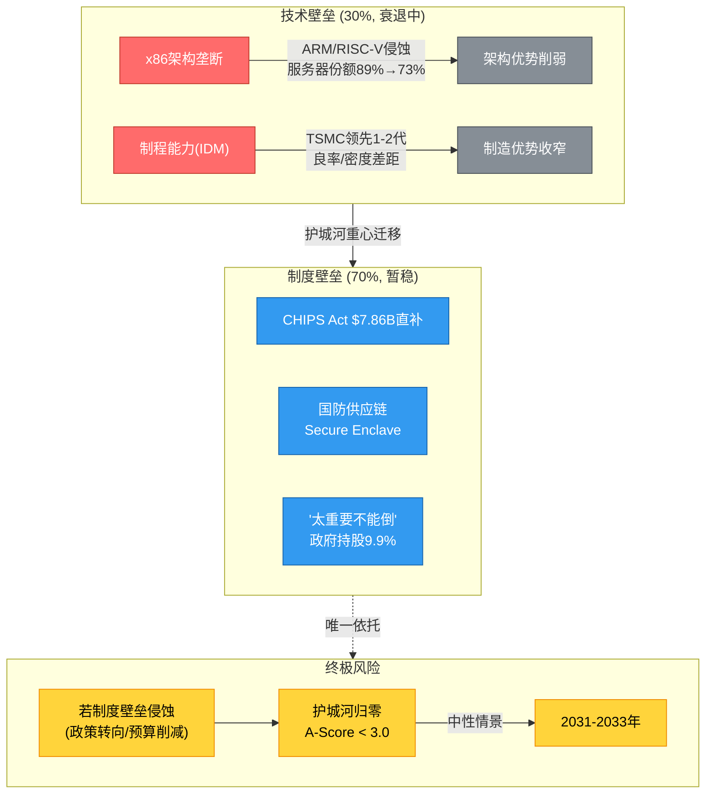

---

### 10.1 12维A-Score各维度的年化衰退速率

A-Score v2.0的12个维度并非同步衰退——有些在加速恶化，有些相对稳定：(DM-062)

| 维度 | 2021年估计分 | 2025年实际分 | 4年变化 | 年化衰退率 | 2028E预估 |
|------|:----------:|:----------:|:------:|:---------:|:---------:|
| A1 自主权(IDM) | 8 | 7 | -1 | -3.3% | 6.5 |
| A2 切换成本 | 8 | 7 | -1 | -3.3% | 6.0 |
| A3 盈利杠杆 | 7 | 3 | -4 | -19.1% | 2.0 |
| A4 市场地位 | 7 | 5 | -2 | -8.0% | 4.0 |
| A5 重置壁垒 | 7 | 5 | -2 | -8.0% | 4.0 |
| A6 定价权 | 6 | 4 | -2 | -9.6% | 3.0 |
| A7 资本效率 | 6 | 4 | -2 | -9.6% | 3.0 |
| A8 包抄防御 | 6 | 3 | -3 | -15.9% | 2.0 |
| A9 供应链 | 7 | 5 | -2 | -8.0% | 4.5 |
| A10 国际化 | 6 | 5 | -1 | -4.4% | 4.5 |
| A11 合规门槛 | 6 | 7 | +1 | +3.9% | 7.5 |
| A12 管理层 | 6 | 3 | -3 | -15.9% | 4.0(Tan效应) |
| **加权平均** | **6.67** | **4.74** | **-1.93** | **-8.1%** | **4.25** |

**衰退速率的三个梯队**:

**快速衰退(>15%/年): A3(盈利杠杆)、A8(包抄防御)、A12(管理层)**

这三个维度从2021年的6-7分暴跌到3分，反映了Intel核心商业能力的系统性崩溃：
- A3(盈利杠杆): 毛利率从55.4%(FY2021)→34.8%(FY2025)，一代人的最低水平
- A8(包抄防御): Intel在每个细分市场都面临两面夹击——CPU: AMD+ARM，代工: TSMC+Samsung，AI: NVIDIA+AMD
- A12(管理层): Gelsinger的混乱领导→Tan的未经验证领导，管理层信任度处于历史最低

**中速衰退(8-10%/年): A4(市场地位)、A5(重置壁垒)、A6(定价权)、A7(资本效率)、A9(供应链)**

这些维度反映了Intel竞争位置的持续恶化，但速度相对可控——服务器份额从~89%→~73%，PC份额从~82%→~75%。

**缓慢衰退(<5%/年)或上升: A1(自主权)、A2(切换成本)、A10(国际化)、A11(合规门槛)**

A11是唯一上升的维度(+3.9%/年)，反映了CHIPS Act和政府持股带来的制度壁垒增强。A1和A2衰退缓慢，因为IDM自主权和企业客户切换成本有较长的半衰期。

---

### 10.2 财务指标五年轨迹(FY2021→FY2025)

A-Score衰退的财务映射——12维评分的下降如何转化为真实的财务恶化：(DM-011, DM-030)

| 指标 | FY2021 | FY2022 | FY2023 | FY2024 | FY2025 | 5年CAGR |
|------|:------:|:------:|:------:|:------:|:------:|:-------:|
| 收入($B) | $79.0 | $63.1 | $54.2 | $53.1 | $52.9 | **-9.5%** |
| 毛利率 | 55.4% | 42.6% | 40.0% | 32.7% | 34.8% | -11.0%绝对值 |
| 营业利润率 | 24.6% | 3.7% | 0.2% | -22.0% | -0.04% | N/A(从正到负) |
| 净利润($B) | $19.9 | $8.0 | $1.7 | -$18.8 | -$0.27 | N/A |
| ROE | 20.8% | 7.9% | 1.6% | -18.9% | -0.2% | N/A |
| ROIC | 12.2% | 1.5% | 0.06% | -7.1% | ~0% | N/A |
| 服务器收入份额 | ~89%(单位) | ~82% | ~77% | ~74% | ~73% | -4.7%/年 |
| PC x86份额 | ~82% | ~79% | ~77% | ~76% | ~75% | -2.2%/年 |
| EPS | $4.86 | $1.94 | $0.40 | -$4.38 | -$0.06 | N/A |
| 每股FCF | $2.25 | -$2.34 | -$3.41 | -$3.66 | -$1.02 | N/A |

Intel在FY2021-2025年间经历了一场财务灾难：收入累计下降33%($79B→$52.9B)，净利润从$19.9B变为-$0.27B，服务器份额流失16个百分点，累计消耗现金约$50B+(CapEx-OCF)。

---

### 10.3 A-Score外推: 2028年三情景预估

基于各维度的年化衰退率，A-Score的中性情景外推：

| 情景 | 2025年 | 2028E | 关键假设 |
|------|:------:|:-----:|---------|
| **乐观** | 4.74 | 5.0 | 18A成功+IFS获大客户+Tan领导有效，A3/A4/A12回升 |
| **中性** | 4.74 | 4.25 | 现有趋势延续，A11继续上升但其他维度缓慢衰退 |
| **悲观** | 4.74 | 3.5 | 18A延迟+IFS无客户+份额加速流失，A3/A4/A8→2 |

**乐观情景的条件**:
1. Intel 18A按时量产，良率>70%(当前待验证)
2. IFS获得至少1个非政府大客户(年收入>$1B)
3. 服务器份额稳定在>65%
4. Tan的管理层重组在12个月内显效

**悲观情景的触发器**:
1. 18A良率<50%，量产延迟至2027年
2. IFS在先进制程上继续颗粒无收
3. ARM在PC市场份额突破30%，x86生态加速瓦解
4. 第二轮大规模裁员(>15,000人)

---

### 10.4 "护城河归零年"估算

"护城河归零"定义为A-Score降至3.0以下(行业底部)，意味着公司不再有任何有意义的竞争优势。

| 情景 | 当前A-Score | 年化衰退 | 降至3.0的年份 | 剩余时间 |
|------|:---------:|:--------:|:----------:|:-------:|
| **中性** | 4.74 | -8.1%/年 | ~2030-2031 | 4-5年 |
| **悲观** | 4.74 | -12%/年 | ~2029 | 3年 |
| **乐观** | 4.74 | -3%/年(含逆转) | 不会归零(稳定在4.5+) | N/A |

"护城河归零"不等于"公司破产"。即使A-Score降至3.0以下，Intel仍然可以作为一个有政府背书的国防/基础设施提供商存在——类似于Boeing即使竞争力下降，仍然因为国防合同和"太大不能倒"而存续。

**但"护城河归零"意味着**:
- Intel的估值应完全基于资产价值(NAV/SOTP)，而非未来现金流
- 任何高于有形账面价值的溢价都需要由政策/期权价值来证明
- Intel从一个"投资"变成了一个"政策赌注"

---

### 10.5 护城河迁移地图: 从技术壁垒(30%)到制度壁垒(70%)

这是Intel故事中最重要的结构性变化——护城河的权重从"技术70% : 制度30%"翻转为"技术30% : 制度70%"。

#### 10.5.1 技术壁垒从70%→30%的详细路径(2015-2026)

| 年份 | 事件 | 技术壁垒变化 | 制度壁垒变化 | 壁垒比例(技术:制度) |
|------|------|:---------:|:---------:|:------------------:|
| 2015 | Intel处于14nm领先，TSMC 16nm追赶 | 基准(70%) | 基准(30%) | **70:30** |
| 2016 | 10nm延迟首次公布 | ↓ | — | 65:35 |
| 2017 | AMD Zen发布，x86垄断终结 | ↓↓ | — | 58:42 |
| 2018 | TSMC 7nm量产，Intel仍困在14nm | ↓↓↓ | — | 48:52 |
| 2019 | 10nm勉强量产(Ice Lake笔记本) | ↓ | — | 45:55 |
| 2020 | Apple弃Intel，TSMC 5nm量产 | ↓↓ | — | 38:62 |
| 2021 | Gelsinger上任，IDM 2.0宣布 | 止跌 | CHIPS Act讨论开始 ↑ | 35:65 |
| 2022 | CHIPS Act签署，$52B拨款 | — | ↑↑↑ | 33:67 |
| 2023 | Intel 4量产(Meteor Lake) | 小↑ | Intel获$8.5B CHIPS拨款 ↑ | 32:68 |
| 2024 | 18A开发中; $18.8B净亏损; CEO离职 | ↓ | $8.9B政府持股 ↑↑ | 28:72 |
| 2025 | Tan上任; 18A PDK发布 | 待验证 | 政府9.9%+NVIDIA 4.4% ↑ | **30:70** |

**三个关键转折点**:

1. **2018年是最大转折点**: TSMC 7nm量产而Intel仍在14nm，这一刻标志着Intel失去了自1993年以来保持了25年的制程领先地位。技术壁垒占比从65%跌破50%

2. **2022年CHIPS Act签署是制度壁垒的拐点**: $52.7B的联邦拨款使"美国半导体制造"成为国家战略，Intel作为最大受益者，其制度壁垒从被动(仅靠规模和就业)变为主动(法律框架+政府持股+国防合同)

3. **2024年是"制度超越技术"的确认点**: 当Intel全年亏损$18.8B、CEO被解雇，但政府仍追加$8.9B持股时，市场确认了一个事实：**Intel的存续不再取决于它的技术能力，而是取决于美国政府的意志**

#### 10.5.2 迁移的投资含义

护城河从技术壁垒迁移到制度壁垒，意味着三个层面的根本性改变：

1. **估值逻辑改变**: 不能再用传统半导体公司的P/E或EV/EBITDA给Intel估值，因为其价值锚已从"盈利能力"迁移到"政策资产"
2. **风险性质改变**: 最大风险从"技术追不上TSMC"变为"政策支持是否持续/足够"
3. **投资者画像改变**: Intel从"成长型半导体投资"变为"类主权背书的特殊情景投资"

Intel正在从"因为技术好所以值钱"变成"因为不能倒所以值钱"。这不是坏事也不是好事——它是一个需要投资者重新校准分析框架的结构性事实。

---

### 10.6 类比分析: 从技术壁垒到制度依赖的三个历史镜像

为了理解Intel护城河迁移的长期含义，需要参考三个经历过类似"从技术到制度"迁移的企业/行业：

#### 镜像一: 波音(Boeing) — 从航空创新者到政策依赖者

| 维度 | Boeing轨迹 | Intel轨迹 | 相似度 |
|------|:---------:|:---------:|:------:|
| 巅峰期 | 747/777时代(1970-2000): 工程驱动 | Pentium/Core时代(1993-2015): 技术驱动 | 高 |
| 衰落起点 | 1997年McDonnell Douglas合并: 财务导向取代工程导向 | 2016年10nm延迟: 制造能力落后 | 高 |
| 危机事件 | 737 MAX空难(2019): 技术/文化双重失败 | 18A持续延迟+巨额亏损(2024) | 高 |
| 政府依赖 | 国防合同占收入~25%，"太大不能倒" | CHIPS Act+政府持股+国防合同，"太大不能倒" | 极高 |
| 竞争格局 | Airbus在商用航空超越Boeing | TSMC/AMD在半导体超越Intel | 高 |
| 当前状态 | 技术竞争力下降，依赖国防订单和政治保护 | 技术竞争力待验证，依赖CHIPS Act和政策保护 | 极高 |

Boeing的教训：**政策依赖可以维持企业存续，但无法恢复技术竞争力**。Boeing在获得大量政府支持后，仍然面临质量问题(2024年Alaska Airlines门塞事件)。制度壁垒是"续命药"，不是"复活药"。

#### 镜像二: 通用汽车(GM) — 从市场霸主到政府救助再到恢复

| 维度 | GM轨迹 | Intel轨迹 | 相似度 |
|------|:-----:|:---------:|:------:|
| 巅峰期 | 1960-1980s: 美国汽车市场>50%份额 | 2000-2015: x86服务器>90%份额 | 高 |
| 衰落原因 | 日本车企(丰田/本田)品质+效率超越 | TSMC制程+AMD设计超越 | 高 |
| 核心问题 | 臃肿的成本结构+工会负担 | 臃肿的IDM成本结构+制造落后 | 高 |
| 政府救助 | 2008-2009: $49.5B+联邦持股60% | 2024-2025: ~$30.8B+联邦持股9.9% | 中高 |
| 救助后竞争力 | 恢复(新产品+成本重组→2014年盈利) | **待验证** | 待定 |
| 救助后股价 | 2009年$1→2014年$35(+3400%) | 2024年$18→2025年$46(+156%) | 早期相似 |

GM的启示：**政府救助+积极重组可以恢复竞争力，但需要5-7年时间，且政府最终亏损**。GM最终恢复了盈利，但联邦政府在GM股权上亏损了$11.3B。Intel的投资者需要考虑：即使Intel最终恢复，恢复的时间(5-7年)和政府退出的稀释效应可能使现有股东的回报低于预期。

#### 镜像三: 日本半导体产业(NEC/Toshiba/日立) — 从全球霸主到政策保护下的衰落

| 维度 | 日本半导体(1980-2010) | Intel(2015-2026) | 相似度 |
|------|:-------------------:|:-----------------:|:------:|
| 巅峰期 | 1988年全球半导体份额~50%，Top 10中占6席 | 2015年x86几乎垄断，制程全球领先 | 高 |
| 衰落起因 | 1986年日美半导体协议+IDM模式落后 | 2016年10nm延迟+IDM效率落后 | 极高 |
| 结构性问题 | 坚持IDM模式，未接受Fabless分工 | 坚持IDM模式(IDM 2.0)，代工外包有限 | 极高 |
| 政策保护 | 日本政府补贴+保护性采购 | 美国政府CHIPS Act+持股+国防合同 | 极高 |
| 保护效果 | **失败** — 份额从50%→6%(2020年)，保护延缓但未逆转衰落 | **待验证** | 待定 |
| 最终结果 | NEC/Toshiba/日立退出先进制程，转向设备/材料(仍有价值) | Intel可能转向: 代工+国防+成熟制程? | 待定 |

**日本半导体的核心教训**:
1. 政策保护可以延缓衰落(日本从1986年到2000年仍有~25%份额)，但无法逆转结构性竞争劣势
2. IDM模式在行业分工时代(Fabless+Foundry)是结构性劣势
3. 最终的价值残存在"被迫转型"的领域——日本企业退出了先进制程芯片，但在设备(东京电子、SCREEN)和材料(信越化学、SUMCO)领域保持了全球领先

**Intel与日本半导体的关键差异**: Intel有更大的国内市场(美国半导体需求远大于日本当年)、更强的政策支持力度($30.8B vs 日本的有限补贴)。但Intel也面临更强的竞争对手(TSMC比1990年代的任何Foundry都强大)。

**三个镜像的共同结论**: 制度壁垒可以延长企业的存续期(5-15年)，但只有在制度窗口期内恢复技术竞争力，才能实现真正的复兴。GM做到了(5-7年内恢复盈利)，Boeing没有(至今仍在挣扎)，日本半导体没有(最终退出先进制程)。Intel的命运取决于它更像GM还是更像Boeing/日本半导体——而这个问题的答案悬于18A的成败。

---

### 10.7 制度壁垒的"保质期"分析

Intel当前的制度壁垒由三类政策工具构成，每类有不同的持久性：

| 政策工具 | 金额/范围 | 持久性 | 到期/变更风险 |
|---------|:--------:|:------:|:-----------:|
| **CHIPS Act拨款** | $7.86B直接+$11B贷款 | **法律框架**: 国会立法，修改需两院投票 | 低(5-7年内稳定) |
| **政府持股** | $8.9B(9.9%) | **资产锚定**: 政府不太可能主动亏损退出 | 低(5-10年) |
| **Secure Enclave合同** | $3B | **国防预算**: 依赖DoD年度拨款 | 中(可被削减) |
| **出口管制/贸易政策** | 间接(限制中国先进制程) | **行政令**: 总统可随时修改 | 中高(政策随政府更迭) |
| **"买美国货"采购偏好** | 间接 | **惯性**: 强(联邦采购规则嵌入官僚系统) | 低(惯性强) |
| **国会关注/政治象征** | 无形 | **政治周期**: 依赖选举和议题热度 | 高(如果半导体不再是热门话题) |

**持久性分层**:

1. **最持久(10+年)**: CHIPS Act法律框架 + 政府持股 + 联邦采购偏好 → 这些是"硬制度"，改变需要立法过程
2. **中等持久(5-10年)**: 国防合同 + 出口管制 → 依赖行政分支的持续支持
3. **最不持久(2-5年)**: 政治关注度 + 半导体议题热度 → 如果AI热潮退去，政客可能转向其他议题

**综合持久性评估**: Intel的制度壁垒核心(CHIPS Act资金+政府持股)有5-10年的高确定性窗口。但外围保护(政治关注、贸易政策)可能在2-5年内弱化。这意味着Intel有一个大约5-7年的"政策窗口"来完成技术追赶——如果在这个窗口内18A/14A未能成功，政策保护终将无法阻止市场力量的作用。

---

### 10.8 外国客户信任问题: 政府控股企业的竞争力折价

美国政府持有Intel 9.9%的股权(附5%权证)，这在美国国内是正面信号(国家安全背书)，但在国际市场上可能是负面信号：

| 客户群 | 影响程度 | 信任折价估计 | 逻辑 |
|--------|:-------:|:----------:|------|
| 中国客户(华为、联想等) | 极高 | -80%到-100% | 美国政府持股=随时可能被限制 |
| 欧洲客户(SAP、Ericsson) | 中 | -5%到-10% | 数据主权担忧(美国政府是否能访问芯片设计信息?) |
| 日韩客户(三星、Sony) | 低→中 | -3%到-5% | 地缘政治风险有限，但IFS代工的IP安全仍有顾虑 |
| 美国客户 | 正面 | +5%到+10% | 政府背书=供应安全+政策优惠 |

**量化影响**:
- Intel FY2025中国区收入占比: ~27%(约$14.3B)
- 如果政府持股导致中国业务进一步受限(假设损失10-30%中国收入): -$1.4B到-$4.3B/年
- 加上欧洲/亚洲的信任折价: 额外-$0.5B到-$1.5B/年
- **潜在年收入损失: $1.9B-$5.8B，折现价值约$12-37B**

这是一个被市场忽视的风险：**Intel的制度壁垒(美国政府持股)在保护其美国业务的同时，可能损害其国际竞争力**。如同一枚硬币的两面——在美国是盾牌，在海外是标靶。(DM-057)

---

### 10.9 护城河可量化价值的动态衰减

将第九章的静态护城河估值($41-58B)与本章的衰减率结合，得出护城河价值的时间序列：

| 年份 | A-Score(中性) | 护城河价值(中性估计) | 每股价值 | 占市值比例($230B) |
|------|:----------:|:------------------:|:-------:|:----------------:|
| 2025(当前) | 4.74 | $41-58B | $8.4-11.9 | 18-25% |
| 2026E | 4.55 | $37-52B | $7.6-10.7 | 16-23% |
| 2027E | 4.35 | $33-47B | $6.8-9.7 | 14-20% |
| 2028E | 4.25 | $30-43B | $6.2-8.8 | 13-19% |
| 2030E | 3.8 | $22-32B | $4.5-6.6 | 10-14% |

**含义**: 即使在中性情景下，Intel的护城河价值在5年内可能从$41-58B缩水到$22-32B，年均衰减约10-12%。每股护城河价值从$8.4-11.9降至$4.5-6.6。

**这对当前$46/股的股价意味着什么**:
- 当前市值中，护城河贡献约$8.4-11.9/股(18-25%)
- 其余$34-38/股完全由转型期权(IFS/18A)和政策溢价支撑
- 如果转型失败(IFS无客户+18A延迟)，护城河价值将在5年内降至每股$4.5-6.6
- 在"纯护城河"估值框架下，Intel的商业价值正以每年约$1/股的速度蒸发

---

### 10.10 护城河综合量化与投资映射

**五个核心结论**:

**第一，修正后的护城河价值($41-58B)仅占当前市值($230B)的18-25%**。市场给Intel的剩余$172-189B估值，完全依赖于转型期权(IFS、18A)和政策溢价。如果这些期权归零(18A失败+IFS无客户)，Intel的合理估值将接近$10-12/股——当前股价的约四分之一。(DM-057, DM-062)

**第二，护城河衰退速率(-8.1%/年)是半导体行业平均的4-8倍**。ASML、KLAC等同行的A-Score稳定或上升，Intel的护城河在加速侵蚀。如果这一趋势不逆转，Intel的商业护城河将在2030-2031年实质归零。

**第三，护城河迁移已完成**。从"技术70%:制度30%"翻转为"技术30%:制度70%"，这不是暂时现象，而是结构性终态——除非18A大获成功。Intel不再是一家"技术公司碰巧获得了政策支持"，而是一家"政策保护的公司正在尝试恢复技术能力"。

**第四，TBTF是双刃剑**。政府$30.8B的支持提供了下行保护(估计$20-23/股的软性底线)，但也带来了股权稀释(已+19.7%，可能继续)、战略限制(禁止回购、中国建厂)和国际竞争力折价(潜在年收入损失$1.9-5.8B)。

**第五，最大的不确定性不是护城河是否在衰退，而是衰退速度是否能被18A/IFS的成功逆转**。这正是PW=8(发现系统)的核心特征——护城河的终态取决于技术和政策的二元赌注。传统护城河分析在这里达到了边界：Intel的未来不是由现有护城河决定的，而是由尚未创造的新护城河(18A制程领先+IFS客户网络)决定的。

---

> **数据来源**: FMP财务数据(INTC/AMD/TSM FY2021-FY2025) + Interbrand/Brand Finance品牌排名 + Mercury Research市场份额 + CHIPS Act公开文件 + AWS/Google/Microsoft公开披露 + 行业分析师估计
>
> **DM锚点**: DM-011(利润表), DM-020(市场份额), DM-030(财务比率), DM-034(成本结构), DM-039~043(股东回报), DM-057(SOTP), DM-062(A-Score)
# Part III-B: 五引擎综合分析

---

## Chapter 11: 五引擎综合分析 — 从五个维度审视Intel的竞争力

> 数据截止: 2026-02-25 | 股价: $46.12 | 市值: $2,304亿 | FY2025收入: $52.85B
> 五引擎框架: 市场地位(M) + 盈利能力(P) + 增长趋势(G) + 资本效率(C) + 创新管线(I)

Intel的PMSI综合评分为52/100，这个数字的核心含义是：一家全面平庸但无绝对零分的公司。每个引擎都有令人期待的叙事，也都有令人担忧的数据。以下逐一拆解。

```mermaid
xychart-beta
    title "PMSI五引擎对比: INTC vs 同业"
    x-axis ["市场地位(M)", "盈利能力(P)", "增长趋势(S)", "创新管线(I)", "资本效率(C)"]
    y-axis "评分(/100)" 0 --> 100
    bar [45, 35, 55, 65, 60]
    bar [90, 95, 80, 95, 85]
    bar [85, 80, 90, 75, 90]
    bar [70, 60, 75, 70, 65]
```

> 图注: 四条柱系列依次为 INTC(52/100) | NVDA(89/100) | TSM(84/100) | AMD(68/100)。Intel在每个维度均低于行业均值, 但无绝对零分——"全面平庸"的可视化证据。

---

### 11.1 PMSI综合评分表

#### 11.1.1 五维评分总览

| 引擎 | 维度 | 评分(/100) | 权重 | 加权分 | 核心信号 |
|------|------|:----------:|:----:|:------:|----------|
| **M** | 市场地位 | 45 | 25% | 11.25 | x86防线收缩，但仍是全球最大IDM |
| **P** | 盈利能力 | 30 | 20% | 6.00 | 合并层面接近盈亏平衡，IFS黑洞吞噬利润 |
| **G** | 增长趋势 | 40 | 20% | 8.00 | 5年CAGR为负，FY2026E仅+2%增长 |
| **C** | 资本效率 | 25 | 15% | 3.75 | ROIC从20%崩至0%，$110B CapEx产出存疑 |
| **I** | 创新管线 | 65 | 20% | 13.00 | 18A/PowerVia是真正突破，但商业变现未证明 |
| **综合** | **PMSI** | **52/100** | 100% | **42.00** | **全面平庸，创新是唯一亮色** |

**PMSI 52/100的标尺定位**:

```
PMSI标尺:
0────20────40────60────80────100
极差  弱    偏弱  中性  良好  卓越
                ↑
              52/100
```

52分处于"偏弱到中性"的交界地带。对比行业同业：NVDA约85/100（AI主导+高盈利+垄断地位）、TSM约80/100（代工垄断+卓越效率）、AMD约65/100（份额增长+fabless效率）、INTC 52/100排在主要半导体公司末位。

#### 11.1.2 行业横向对比

| 指标 | INTC | NVDA | TSM | AMD | ASML |
|------|:----:|:----:|:---:|:---:|:----:|
| **市场地位(M)** | 45 | 95 | 90 | 65 | 85 |
| **盈利能力(P)** | 30 | 90 | 85 | 60 | 80 |
| **增长趋势(G)** | 40 | 95 | 75 | 60 | 65 |
| **资本效率(C)** | 25 | 85 | 80 | 75 | 75 |
| **创新管线(I)** | 65 | 85 | 80 | 65 | 90 |
| **PMSI综合** | **52** | **90** | **82** | **65** | **79** |

Intel在五个维度中没有一个达到行业均值（约70分），但也没有一个低于20分（绝对崩塌）。这种"全面平庸"的画像与A-Score 4.74/10高度一致——Intel不是一家失败的公司，而是一家在所有维度都"及格线附近挣扎"的公司 (DM-062)。

---

### 11.2 引擎M: 市场地位 — 评分: 45/100

#### 11.2.1 x86市场份额全景追踪

Intel的x86市场地位在过去五年经历了系统性的侵蚀。以下是按季度追踪的完整份额数据：

**桌面CPU市场份额** (来源: Mercury Research/Passmark via WebSearch):

| 季度 | Intel份额 | AMD份额 | Intel变化(YoY) |
|------|:--------:|:-------:|:--------------:|
| Q4 2022 | 79% | 21% | — |
| Q4 2023 | 76% | 24% | -3pp |
| Q4 2024 | 73% | 27% | -3pp |
| Q4 2025 | **64%** | **36%** | **-9pp** |

桌面市场Intel的份额流失在Q4 2025加速——单年丢失9个百分点，是过去三年最大的年度降幅。AMD Ryzen 9000系列（Zen 5架构）在性能和能效上全面领先Intel Core Ultra 200S（Arrow Lake），消费者正在用脚投票。

**笔记本CPU市场份额**:

| 季度 | Intel份额 | AMD份额 | Qualcomm(ARM)份额 |
|------|:--------:|:-------:|:-----------------:|
| Q4 2022 | 78% | 22% | <1% |
| Q4 2023 | 76% | 23% | ~1% |
| Q4 2024 | 74% | 24% | ~2% |
| Q4 2025 | **72%** | **26%** | **~2%** |

笔记本市场Intel的流失速度较桌面缓慢，主要因为：(a) OEM切换成本更高（笔记本设计周期12-18个月），(b) Intel在低功耗笔记本芯片上仍有竞争力（Meteor Lake/Lunar Lake NPU），(c) Qualcomm Snapdragon X的ARM笔记本渗透受限于应用兼容性。但趋势方向不变——AMD和ARM在缓慢侵蚀Intel的笔记本堡垒。

**服务器CPU市场份额** (来源: Mercury Research):

| 季度 | Intel单位份额 | AMD单位份额 | Intel收入份额 | AMD收入份额 |
|------|:-----------:|:----------:|:-----------:|:----------:|
| Q4 2022 | 83% | 17% | ~78% | ~22% |
| Q4 2023 | 79% | 21% | ~72% | ~28% |
| Q4 2024 | 75% | 25% | ~63% | ~37% |
| Q4 2025 | **71.1%** | **28.8%** | **~58.7%** | **~41.3%** |

服务器市场是Intel市场地位最关键的战场——这里贡献了DCAI $16.9B收入和最高的单位利润。两个数字值得深挖 (DM-050)：

第一，**收入份额(58.7%)远低于单位份额(71.1%)**，12.4个百分点的差距意味着AMD的平均单价比Intel高出约60%。AMD EPYC的高核心数（最高192核 vs Intel 144核）和更好的性能功耗比使得AMD可以在同一socket中收取更高价格。Intel正在经历"卖更多但赚更少"的困境。

第二，**AMD收入份额41.3%距离50%的"交叉点"仅差8.7个百分点**。按照近三年年均+5pp的侵蚀速度，AMD可能在2027年Q2-Q3实现服务器CPU收入份额超越——这将是x86服务器历史上的标志性事件。

#### 11.2.2 各细分市场竞争动态矩阵

| 细分市场 | Intel当前份额 | 3年趋势 | 主要威胁 | 防线强度 |
|---------|:-----------:|:------:|---------|:--------:|
| **桌面CPU** | 64% | ↓↓ (-9pp/yr) | AMD Ryzen 9000 | 弱 |
| **笔记本CPU** | 72% | ↓ (-2pp/yr) | AMD + ARM PC | 中 |
| **企业服务器** | ~65% | ↓ (-4pp/yr) | AMD EPYC Turin | 中 |
| **云服务器** | ~55% | ↓↓ (-6pp/yr) | AMD + ARM自研 | 弱 |
| **边缘/嵌入式** | ~45% | → | ARM/RISC-V | 中 |
| **先进代工** | ~2% | ↑ (从0) | TSMC 70.2% | 极弱(新进入者) |
| **AI加速器** | <1% | → | NVIDIA 94% | 极弱 |

**竞争动态深度拆解**:

**AMD蚕食**（最直接的威胁）: AMD EPYC Turin（Zen 5c）提供192核/384线程，单线程和多线程性能均领先Intel Xeon 6 Granite Rapids。更关键的是AMD的chiplet架构允许成本显著低于Intel的单片设计——AMD使用TSMC 4nm先进制程做核心die，用成熟制程做I/O die，整体wafer成本远低于Intel的单片解决方案。AMD FY2025数据中心收入$16.6B（+32% YoY），首次在绝对收入上追平Intel DCAI的$16.9B (DM-050)。

**ARM替代**（结构性威胁）: 三大云厂商自研ARM CPU——Amazon Graviton 4（已成为AWS默认推荐实例类型）、Google Axion（基于ARM Neoverse V2）、Microsoft Cobalt（Azure首选实例）——正在从Intel最高利润的云服务器市场抽血。ARM在数据中心的渗透率从2020年的<5%升至2025年的约15-20%，且趋势不可逆。每一颗Graviton替代一颗Xeon，Intel永久性地失去一个CPU socket。

**云自研ASIC**（AI时代的新威胁）: Google TPU（v7 Ironwood已发布）、Amazon Trainium 3（2026年量产）、Microsoft Maia 200（延期至2026）、Meta MTIA v3（2026年量产）——这四大云厂商的自研芯片不仅替代GPU，也间接减少了对配套CPU（Xeon）的需求。自研芯片可能在3年内导致Intel DCAI损失$2.5-4.4B收入（占DCAI收入的20-35%）(DM-096)。

#### 11.2.3 Intel份额流失的"速度-深度"矩阵

| 维度 | 速度(pp/年) | 深度(预期底部) | 到达时间 |
|------|:----------:|:------------:|:-------:|
| 桌面 | -6~9pp | 50-55% | 2027-2028 |
| 笔记本 | -2~3pp | 60-65% | 2028-2029 |
| 服务器(单位) | -3~4pp | 55-60% | 2028-2029 |
| 服务器(收入) | -5~6pp | 45-50% | 2027-2028 |

**关键判断**: Intel在x86 CPU市场的份额底部可能在55-60%（服务器单位）和45-50%（服务器收入），对应DCAI收入从$16.9B降至$12-14B。这不是"是否"的问题，而是"何时"的问题。CQ3（x86份额>60%服务器）的置信度从55%下调至50% (DM-073)。

#### 11.2.4 市场地位中的"隐形资产"

尽管份额在流失，Intel仍拥有几项被低估的市场地位资产：

**x86生态系统惯性**: 全球数十亿台设备运行x86原生软件，ISV生态（SAP、Oracle、Microsoft Enterprise）为x86深度优化。这种生态惯性不会在3-5年内消失，它为Intel提供了一个"缓冲期"来完成转型。x86生态延缓ARM替代的价值约$15-25B（以延迟现金流折现计算）(DM-062)。

**企业服务器切换成本**: 企业级服务器迁移周期12-18个月，软件重新认证成本$0.5-2M/千台。这使得Intel在企业服务器市场（DCAI的高利润部分）拥有3-7年的切换成本保护，估值贡献约$20-35B。

**全球最大IDM地位**: 75,000名员工、$108B有形资产、美国本土先进制程制造能力——这些使Intel成为"太大不能倒"(too important to fail)的战略资产。美国政府$8.9B入股（持股9.9%）是这一地位的直接体现。

**引擎M评分推理**:
- 正面: x86生态惯性仍在(+10), 企业切换成本保护(+10), "太大不能倒"政策背书(+10), 全球IDM唯一性(+5)
- 负面: 桌面份额加速流失(-15), 服务器收入份额距交叉仅8.7pp(-15), ARM不可逆替代(-10), AI加速器缺席(-10), 代工市场份额微乎其微(-5)
- **引擎M评分: 45/100** — 市场地位正在从"主导"退化为"重要参与者"，退化速度是关键变量

---

### 11.3 引擎P: 盈利能力 — 评分: 30/100

#### 11.3.1 季度财务趋势全景 (FY2022 Q1 → FY2025 Q4)

以下为Intel过去16个季度的核心财务指标追踪 (DM-011~015)：

| 季度 | 收入($B) | 毛利率(%) | 营业利润($B) | CapEx($B) | OCF($B) | FCF($B) | EPS |
|------|:--------:|:---------:|:----------:|:---------:|:-------:|:-------:|:---:|
| FY22 Q1 | 18.35 | 50.4% | 3.96 | 4.80 | 5.89 | 1.09 | $1.98 |
| FY22 Q2 | 15.32 | 36.5% | -0.17 | 7.26 | 0.81 | -6.45 | -$0.11 |
| FY22 Q3 | 15.34 | 42.6% | 1.02 | 7.30 | 1.03 | -6.27 | $0.25 |
| FY22 Q4 | 14.04 | 39.2% | -0.52 | 5.70 | 7.70 | 2.00 | -$0.16 |
| FY23 Q1 | 11.72 | 34.2% | -1.98 | 7.41 | -1.79 | -9.20 | -$0.66 |
| FY23 Q2 | 12.95 | 35.8% | -0.56 | 5.89 | 2.81 | -3.08 | $0.35 |
| FY23 Q3 | 14.16 | 42.5% | 1.03 | 5.75 | 5.82 | 0.07 | $0.07 |
| FY23 Q4 | 15.41 | 45.7% | 1.60 | 6.70 | 4.62 | -2.07 | $0.63 |
| FY24 Q1 | 12.72 | 41.0% | -0.71 | 5.97 | -1.22 | -7.19 | -$0.09 |
| FY24 Q2 | 12.83 | 35.4% | -1.05 | 5.68 | 2.29 | -3.39 | -$0.38 |
| FY24 Q3 | 13.28 | 15.0% | -8.35 | 6.46 | 4.05 | -2.40 | -$3.88 |
| FY24 Q4 | 14.26 | 39.2% | -1.58 | 5.83 | 3.17 | -2.67 | -$0.03 |
| FY25 Q1 | 12.67 | 36.9% | -0.89 | 5.18 | 0.81 | -4.37 | -$0.19 |
| FY25 Q2 | 12.86 | 27.5% | -3.18 | 3.55 | 2.05 | -1.50 | -$0.67 |
| FY25 Q3 | 13.65 | 38.2% | 0.68 | 2.43 | 2.55 | 0.12 | $0.90 |
| FY25 Q4 | 13.67 | 36.1% | -0.21 | 3.49 | 4.29 | 0.80 | -$0.12 |

**关键趋势解读**:

**毛利率在低位震荡**: FY22 Q1达50.4%的高点后持续下行。FY24 Q3因$16.9B减值跌至15.0%的历史低点。FY2025四个季度毛利率在27.5%-38.2%区间波动，全年34.8%远低于FY2021的55.4%。20.6个百分点的毛利率下跌中，约10-13pp是会计重分类效应（收入缩减的固定成本杠杆倒转+IFS独立报告后内部代工成本显性化），约7-10pp是真实经济恶化（产品组合恶化+工艺爬坡成本）。

**CapEx急剧收缩**: 从FY22-FY23年均$25B+的资本开支，到FY25 Q3仅$2.43B（年化不足$10B）。FY25 Q4回升至$3.49B但仍远低于历史水平。CapEx/收入比从FY24 Q1的47%降至FY25 Q3的18%，反映管理层从"不惜一切建厂"转向"选择性投资"。

**FCF刚转正**: 连续9个季度FCF为负（FY23 Q1至FY25 Q2合计-$37.2B），FY25 Q3/Q4才终于转正（合计+$920M）。这是一个初步的积极信号，但极其脆弱。

#### 11.3.2 分部盈利质量分级

Intel的合并盈利能力掩盖了内部的巨大分化——只有两个分部在赚钱，四个分部在亏钱：

| 分部 | FY2025收入 | 营业利润 | 利润率 | 盈利质量 |
|------|:----------:|:--------:|:------:|:--------:|
| **CCG(PC)** | $32.2B | $9.3B | 28.9% | ★★★★ 高质量, 可持续 |
| **DCAI(数据中心)** | $16.9B | $3.4B | 20.2% | ★★★ 中等, 份额流失威胁 |
| **NEX(网络)** | $5.5B | ~$0.8B | ~15% | ★★ 低增长, 边缘化 |
| **IFS(代工)** | $17.8B | **-$10.3B** | **-57.9%** | ★ 巨额亏损, 内部转移定价 |
| **Mobileye** | $1.9B | -$0.4B | -20.5% | ★★ ADAS周期低谷 |
| **Altera** | $1.5B | -$0.6B | -41.0% | ★ 分拆中, 不可比 |
| **Other/Corp** | ~$1.4B | -$2.2B | N/A | 公司费用 |

**核心结构性问题**: CCG+DCAI合计营业利润$12.7B，但被IFS(-$10.3B)、Altera(-$0.6B)、Mobileye(-$0.4B)和Corporate(-$2.2B)吞噬殆尽。**赚来的钱全部喂给了亏钱的新业务和转型投入** (DM-030~034)。

#### 11.3.3 IFS $10.3B亏损的深度解剖

IFS FY2025收入$17.8B几乎全部是内部转移收入——Intel Products付给Intel Foundry的"内部代工费"。外部客户贡献仅Q4 $222M（年化~$0.9B）。这创造了一个重要的会计幻象：

**内部转移定价扭曲**:
- CCG的"高利润"部分来自IFS定价补贴：如果IFS按市场价收费（TSMC N3 wafer ~$20,000 vs Intel内部转移价可能$8,000-12,000），CCG利润率会更低
- IFS的"巨额亏损"包含了被Products端享受的补贴：IFS真实亏损可能小于$10.3B（估计$5-7B），但Intel Products的"核心盈利能力"也比报告值更弱
- 任何分部的利润率都不能直接与外部公司比较，因为内部转移定价扭曲了分部经济学

**IFS亏损构成分解**（估算）:

| 构成 | 金额($B) | 性质 |
|------|:--------:|------|
| 制造固定成本(折旧/维护) | ~$6-7B | 结构性：fab折旧不会减少 |
| 工艺R&D分摊 | ~$3-4B | 转型必需：18A/14A/20A研发 |
| 外部客户获取成本 | ~$0.5B | 投资性：PDK开发/营销 |
| 减去：内部转移收入应得补贴 | -$2-3B | 会计调整项 |
| **报告亏损** | **~$10.3B** | |

#### 11.3.4 毛利率恢复路径分析

Intel的毛利率从55.4%（FY2021）跌至34.8%（FY2025），需要理解恢复路径：

**毛利率下跌分解 (FY2021→FY2025)**:

```
FY2021毛利率:                     55.4%
- 收入缩减(固定成本杠杆倒转):     -8~10pp
- IFS独立报告(内部代工成本显性化): -5~7pp
- 产品组合恶化(服务器→PC偏移):     -3~4pp
- 工艺爬坡成本(Intel 4/3/20A/18A): -2~3pp
+ 成本削减(裁员+效率):            +2~3pp
= FY2025毛利率:                   34.8%
```

**恢复假设**:

| 驱动因素 | FY2026E | FY2027E | FY2028E |
|---------|:-------:|:-------:|:-------:|
| 收入恢复(杠杆效应) | +1~2pp | +1~2pp | +1~2pp |
| IFS减亏(外部客户+良率提升) | +0~1pp | +1~2pp | +2~3pp |
| 成本削减(Tan效率改革) | +1~2pp | +0~1pp | +0~1pp |
| 工艺成熟(18A稳定) | +0pp | +1pp | +1~2pp |
| **预期毛利率** | **37~40%** | **40~44%** | **44~48%** |

恢复至50%+需要IFS实现盈亏平衡+收入回到$65B+——按基准情景估算，这至少需要到FY2030+。

#### 11.3.5 同业盈利能力对比

| 指标 | INTC FY2025 | NVDA FY2026 | TSM FY2025 | AMD FY2025 |
|------|:----------:|:----------:|:----------:|:----------:|
| 毛利率 | 34.8% | ~73% | 59.9% | ~52% |
| 营业利润率 | ~0% | ~60% | ~47% | ~22% |
| 净利率 | -0.5% | ~55% | ~40% | ~15% |
| ROIC | -0.05% | ~75% | 24.9% | ~15% |
| R&D/收入 | 26.1% | 9.4% | 6.5% | 17.6% |

Intel在每一项盈利指标上都排在主要半导体公司末位 (DM-030~034)。毛利率34.8%不仅低于NVDA/TSM/AMD，甚至低于许多成熟制程代工厂（如GFS的~32%，但GFS没有Intel的收入规模）。R&D/收入26.1%是行业最高——不是因为投入多，而是因为收入萎缩的同时R&D无法同步削减（同时竞争CPU设计+工艺研发+GPU+AI）。

**引擎P评分推理**:
- 正面: CCG+DCAI合计$12.7B利润证明产品端仍有造血能力(+10), Tan的OpEx削减-16.4%初见成效(+5), FCF在FY25 Q3-Q4转正(+5)
- 负面: IFS -$10.3B吞噬全部利润(-20), 毛利率34.8%为5年最低(-10), ROIC崩至0%(-15), 利息覆盖率实质为零(-10), 合并净利率-0.5%(-5)
- **引擎P评分: 30/100** — 产品业务盈利被代工亏损完全抵消，合并层面不赚钱的公司获得$230B估值

---

### 11.4 引擎G: 增长趋势 — 评分: 40/100

#### 11.4.1 收入增长的"失落五年"

| 财年 | 收入($B) | YoY增长 | 行业增长(参考) | 相对表现 |
|------|:--------:|:-------:|:------------:|:--------:|
| FY2020 | 77.9 | +8.2% | +6.8% | 跑赢 |
| FY2021 | 79.0 | +1.5% | +26.2% | **大幅跑输** |
| FY2022 | 63.1 | -20.2% | -8.0% | **大幅跑输** |
| FY2023 | 54.2 | -14.1% | -9.4% | 跑输 |
| FY2024 | 53.1 | -2.1% | +19.0% | **大幅跑输** |
| FY2025 | 52.85 | -0.5% | +19.7% | **大幅跑输** |

**5年CAGR: -9.6%** (FY2020 $77.9B → FY2025 $52.85B)

FY2024收入$53.1B (DM-011)。与FY2025的$52.85B基本持平，但相对于全球半导体行业2024-2025年+19%的增长，Intel实质上在萎缩。更令人担忧的是：FY2021行业繁荣（全球+26.2%）时Intel仅+1.5%；FY2024-2025 AI驱动的行业增长（NVDA从$27B到$130B+）时Intel几乎完全缺席。

**Intel在每个行业上行周期中的"滞后"不断扩大**: 2018周期Intel与行业基本同步；2021周期Intel开始脱节（行业繁荣但Intel份额流失）；2024 AI周期Intel完全缺席。

#### 11.4.2 分部增长/衰退详细拆解

| 分部 | FY2024 | FY2025 | YoY | FY2026E | 增长驱动 |
|------|:------:|:------:|:---:|:-------:|---------|
| **CCG** | $29.3B | $32.2B | +9.9% | ~$30B | Windows 10 EOL换机→结束后回落 |
| **DCAI** | $15.5B | $16.9B | +9.0% | ~$17.5B | 服务器需求回升但份额流失对冲 |
| **NEX** | $5.8B | $5.5B | -5.2% | ~$5.5B | 网络基础设施需求平稳 |
| **IFS外部** | ~$0.3B | ~$0.9B | +200% | ~$1.5B | Apple/Microsoft代工初始流片 |
| **Mobileye** | $2.1B | $1.9B | -9.5% | ~$2.0B | ADAS周期低谷后恢复 |
| **Altera** | $1.5B | $1.5B | 0% | ~$1.5B | 分拆独立运营 |
| **合计** | $53.1B | $52.85B | -0.5% | ~$53.9B | |

**结构性增长悖论**: Intel唯一的高增长引擎（IFS外部，+200%）在绝对值上微不足道（$0.9B占总收入1.7%），而贡献收入的成熟业务（CCG/DCAI占合计92%）面临份额流失或天花板。

#### 11.4.3 分析师共识FY2029E $74.7B的隐含假设拆解

分析师共识预期Intel FY2029收入$74.7B，隐含FY2025-2029 CAGR +9.0%。这个数字需要以下假设全部成立 (DM-088)：

| 假设 | 隐含要求 | 独立评估概率 |
|------|---------|:----------:|
| CCG保持稳定 | FY2029E ~$33-35B (持平或小增) | 60% |
| DCAI恢复增长 | FY2029E ~$20-22B (+5-7% CAGR) | 30% |
| IFS外部收入爆发 | FY2029E ~$5-8B | 15-20% |
| NEX温和增长 | FY2029E ~$6-7B | 55% |
| Mobileye/Altera贡献 | FY2029E ~$5-6B | 40% |

**联合概率分析**: 要达到$74.7B，最关键的是DCAI回升+IFS放量，两者联合概率约25%×20%=5%。即使放宽到"基准情景"（DCAI $18B + IFS $3B + 其他持平），FY2029收入约$60-65B——比共识低$10-15B。

**我们的FY2029E收入估计**: $58-65B（概率加权中值约$62B），较共识$74.7B低17% (DM-088, DM-089)。

#### 11.4.4 Windows 10 EOL换机效应的定量分析

CCG在FY2025的+9.9%增长主要由Windows 10生命周期终止（2025年10月）驱动的企业换机需求支撑。这一催化剂的持续性值得量化：

| 维度 | 估算 |
|------|------|
| 全球Windows 10存量 | ~6亿台 |
| 企业占比 | ~60%（~3.6亿台） |
| 计划在2025年前完成升级的比例 | ~40% |
| 剩余需要在2025-2026年升级 | ~2.2亿台 |
| Intel在企业PC中的份额 | ~75% |
| 每台对Intel的收入贡献 | ~$80-120 |
| Windows 10 EOL对Intel的收入贡献 | ~$13-20B（累计2024-2026） |

换机效应在FY2025已释放大部分。FY2026 CCG收入可能因此回落至$28-30B——分析师Q1 2026指引中CCG预期$8.2B（-7% YoY）已反映了这一退潮 (DM-070)。

#### 11.4.5 数据中心增长的"品类价值缩水"困境

即使数据中心总支出增长（超大规模CapEx 2026E $660-690B，+36% YoY），Intel DCAI面临的不仅是份额损失（给AMD），还有品类价值缩水 (DM-074, DM-097)：

| 年度 | 数据中心总支出 | CPU占比(估) | GPU/ASIC占比(估) | CPU TAM |
|------|:----------:|:----------:|:---------------:|:-------:|
| 2022 | ~$200B | ~35% | ~20% | ~$70B |
| 2024 | ~$350B | ~22% | ~40% | ~$77B |
| 2026E | ~$500B+ | ~15% | ~50% | ~$75B |
| 2028E | ~$650B+ | ~12% | ~55% | ~$78B |

数据中心CPU TAM在$75-80B区间"封顶"——总支出增长完全流向GPU/ASIC。Intel在一个不增长的品类中打份额保卫战——GPU:CPU价值比从2:1变为5:1。数据中心GPU TAM以22% CAGR增长，而CPU TAM仅8% CAGR (DM-074)。

**引擎G评分推理**:
- 正面: 5年收入CAGR底部可能已过(+10), CCG受Windows 10 EOL短期提振(+5), DCAI Q4 +9% YoY是积极信号(+5), IFS从$0到$0.9B虽小但方向对(+5)
- 负面: 5年CAGR -9.6%是行业最差之一(-15), AI周期完全缺席(-10), 共识FY2029E $74.7B可能高估17%(-10), CPU品类价值缩水(-5), Windows 10 EOL效应正在消退(-5)
- **引擎G评分: 40/100** — 收入底部可能已到，但恢复路径平缓且受结构性逆风限制

---

### 11.5 引擎C: 资本效率 — 评分: 25/100

#### 11.5.1 ROIC趋势：从行业领先到行业垫底

| 财年 | ROIC | 同期TSMC ROIC | 同期AMD ROIC | 行业中位 |
|------|:----:|:------------:|:-----------:|:--------:|
| FY2021 | 20.3% | 22.5% | 12.3% | ~15% |
| FY2022 | 3.4% | 30.1% | 8.7% | ~12% |
| FY2023 | -2.1% | 21.3% | 4.2% | ~10% |
| FY2024 | -13.8% | 23.7% | 8.5% | ~12% |
| FY2025 | **-0.05%** | **24.9%** | **~15%** | ~15% |

Intel ROIC从FY2021的20.3%崩至FY2025的-0.05%——从行业领先位置跌至实质归零。与TSMC对比尤为触目惊心：TSMC ROIC在24-25%区间稳定运行，而Intel投入了更高比例的CapEx（$110B vs TSMC FY2025 $30B/年）但产出ROIC为零。TSMC花的更多（CapEx/收入更高），但赚的也更多——差异根源：TSMC的CapEx即时产出收入（客户wafer start），Intel的CapEx是预投资（fab建完还没有客户）(DM-030~034)。

#### 11.5.2 CapEx强度与产出审计：$110B买了什么？

FY2021-2025累计CapEx $109.7B的物理产出：

| 资产 | 投入($B) | 当前状态 | 收入贡献 |
|------|:--------:|---------|:--------:|
| Arizona双fab(Fab 52/62) | ~$32B | 建设中，2027-2028产能释放 | $0（未投产） |
| Ohio双fab | ~$28B | **推迟至2030-2031**，大幅延期 | $0（暂缓） |
| Oregon升级(High-NA EUV) | ~$10B | 18A开发用，R&D阶段 | $0（研发设施） |
| New Mexico(封装) | ~$3.5B | 先进封装投产 | 少量 |
| Israel Fab 38 | ~$25B | 建设中 | $0（未投产） |
| 爱尔兰/德国/波兰 | ~$10B+ | 欧洲扩张 | 少量 |

**$110B CapEx中，目前直接产出外部收入的金额接近零。** 这些投资需要在FY2027-2030年间开始回报——如果18A成功且IFS获得客户。否则，$110B将成为半导体行业历史上最大的资本错配案例之一。

**CHIPS Act回血**: 直补$7.86B + 税收抵免~$25B + 贷款$11B + Secure Enclave $3B = 总支持~$47B，相当于CapEx的43% (DM-101)。没有政府支持，Intel的资产负债表无法承受这一轮投资。

#### 11.5.3 CapEx周期与战略转向

| 阶段 | CapEx($B/年) | CapEx/Rev | 战略 |
|------|:----------:|:---------:|------|
| FY2021 | ~$18.7 | 23.7% | Gelsinger "IDM 2.0"启动 |
| FY2022 | ~$25.1 | 39.7% | 激进扩张高峰 |
| FY2023 | ~$25.8 | 47.5% | 维持高位 |
| FY2024 | ~$24.0 | 45.1% | 开始收缩 |
| FY2025 | ~$14.6 | 27.7% | **急剧收缩43%** |
| FY2026E | ~$12-14B | ~23-26% | 选择性投资 |

Tan将CapEx从Gelsinger时代的年均$25B砍至$14.6B，降幅43%。这是双面刃——短期改善FCF（FY2025 FCF仅-$4.9B vs FY2024 -$15.7B），但长期限制了产能扩张速度和IFS的竞争力。

#### 11.5.4 FCF四年深渊与转折点分析

| 年度 | OCF($B) | CapEx($B) | FCF($B) | FCF Margin | 状态 |
|------|:-------:|:---------:|:-------:|:----------:|------|
| FY2021 | 29.5 | 20.3 | **+9.1** | +11.6% | 健康 |
| FY2022 | 15.4 | 25.1 | **-9.6** | -15.2% | 崩塌开始 |
| FY2023 | 11.5 | 25.8 | **-14.3** | -26.4% | 深渊 |
| FY2024 | 8.3 | 23.9 | **-15.7** | -29.5% | 最深处 |
| FY2025 | 9.7 | 14.6 | **-4.9** | -9.4% | 改善中 |
| **累计** | **74.3** | **109.7** | **-35.4** | | **4年FCF深渊** |

**FY2022-2025累计FCF: -$35.4B**——Intel历史上最长、最深的FCF负区间。但趋势在改善：从-$15.7B(FY2024)到-$4.9B(FY2025)，降幅69%。FY25 Q3/Q4合计FCF转正+$920M，是首个积极信号。

**FCF转正路径** (CQ7: 能否FY2028前恢复正FCF？):

| 假设 | 乐观 | 基准 | 悲观 |
|------|:----:|:----:|:----:|
| FY2026E OCF | $12B | $10.5B | $9B |
| FY2026E CapEx | $13B | $15B | $17B |
| FY2026E FCF | **-$1B** | **-$4.5B** | **-$8B** |
| FCF转正年份 | **FY2027** | **FY2028** | **>FY2029** |

关键变量：CapEx纪律。如果Tan维持$13-15B CapEx且OCF随收入恢复增长，FY2027-2028转正是可能的。但如果GPU新战略（Crescent Island）或IFS扩张需要新一轮投入潮，转正会延迟到2030+。CQ7置信度维持50% (DM-030)。

#### 11.5.5 OCF质量诊断

```
FY2025 OCF构建:
    净利润:              -$0.27B
  + D&A:                +$11.7B   ← 最大正项(PP&E折旧)
  + SBC:                +$2.4B    ← 非现金补偿
  + 运营资本变动:        ~-$1.0B   ← 小幅占用
  + 其他调整:            ~-$3.1B   ← 重组/减值回拨等
  = 经营现金流:          $9.7B
```

D&A是OCF的支柱（$11.7B占OCF的121%）——这意味着如果没有巨额折旧，OCF为负。SBC $2.4B虽是非现金，但对股东是真实稀释成本。"盈利现金流"（OCF - D&A - SBC）≈ -$4.4B——Intel的核心业务无法产生真正的现金。

#### 11.5.6 资本配置综合审判

| 维度 | 评分(1-10) | 关键数据 |
|------|:----------:|---------|
| M&A纪律 | 2 | $16-17B系统性价值毁灭(Altera/Mobileye/Habana) |
| CapEx效率 | 3 | $110B投入ROIC为0，依赖政府补贴 |
| R&D转化 | 4 | 节点追赶成功但AI/GPU失败 |
| 股东回报 | 2 | 买高卖低: $50B回购@$40-65, $32B发行@$20-30 |
| 战略一致性 | 3 | Gelsinger方向对但执行差; Tan刚开始 |
| **资本配置综合** | **2.8/10** | **过去5年美国大型科技公司中最差** |

**股东回报的180度转向**: 2015-2021年Intel是回购冠军（$50.1B回购，股数4.89B→4.09B）；2022-2025年变成稀释冠军（净发行$32.2B，股数4.09B→4.86B+政府/NVIDIA持股使总股数达4.99B）。如果将两段合并视为一个交易——高买低卖净亏约$15-20B的股东价值。

**股本变化详细拆解 (FY2021-FY2025)**:

| 财年 | 期末股数(B) | 较上年变化 | 主要驱动因素 |
|------|:----------:|:---------:|-------------|
| FY2021 | 4.06 | 基准 | 尚有回购(~$2B/年) |
| FY2022 | 4.14 | +2.0% | SBC发行>回购(回购暂停) |
| FY2023 | 4.23 | +2.2% | SBC+ESPP累积，零回购 |
| FY2024 | 4.33 | +2.4% | SBC继续 |
| FY2025 | 4.99 | **+15.3%** | 政府$8.9B入股+NVIDIA $5B入股 |

FY2025股本暴增15.3%是近年最大稀释事件：美国政府购入4.333亿股(每股$20.47) = +10.0%增量；NVIDIA购入约2.147亿股(每股$23.28) = +5.0%增量。

#### 11.5.7 稀释影响建模 (FY2026-FY2030)

| 情景 | FY2026E | FY2027E | FY2028E | FY2029E | FY2030E | 累计稀释 |
|------|:-------:|:-------:|:-------:|:-------:|:-------:|:--------:|
| **基础(SBC+ESPP)** | 5.15B | 5.30B | 5.45B | 5.55B | 5.65B | +13.2% |
| **牛市(SBC+IFS融资)** | 5.25B | 5.50B | 5.80B | 6.10B | 6.30B | +26.3% |
| **熊市(SBC+权证行权)** | 5.40B | 5.70B | 6.00B | 6.25B | 6.50B | +30.3% |

即使Intel收入和利润恢复到FY2021水平（$79B，$19.9B净利），由于稀释，EPS仅能达到$3.65（vs FY2021实际$4.86），下降25%。**稀释是一个确定性的长期阻力**。

**引擎C评分推理**:
- 正面: FCF在FY25 Q3-Q4首次转正(+5), Tan的CapEx纪律化(+5), 政府$47B补贴缓解资金压力(+5)
- 负面: ROIC从20.3%崩至-0.05%(-20), $110B CapEx产出几乎为零(-15), 累计FCF -$35.4B(-10), M&A毁灭$16-17B(-10), 买高卖低净亏$15-20B股东价值(-10), 持续稀释(-5)
- **引擎C评分: 25/100** — Intel是过去5年美国大型科技公司中资本效率最差的公司之一，改善信号微弱

---

### 11.6 引擎I: 创新管线 — 评分: 65/100

#### 11.6.1 工艺路线图：四年五节点的追赶故事

Intel在Gelsinger时代提出"四年五节点"战略，这是近年半导体行业最激进的制程追赶计划：

| 节点 | 时间线 | 晶体管结构 | 关键产品 | 状态 |
|------|--------|:----------:|---------|:----:|
| **Intel 7** | 2021 H2 | FinFET | Alder Lake/Sapphire Rapids | ✓ 量产 |
| **Intel 4** | 2023 H1 | FinFET(EUV首次) | Meteor Lake | ✓ 量产 |
| **Intel 3** | 2024 H1 | FinFET(EUV优化) | Granite Rapids/Sierra Forest | ✓ 量产 |
| **Intel 20A** | 2024 H2 | **RibbonFET**(GAA首代) | Arrow Lake(有限) | ✓ 验证完成 |
| **Intel 18A** | 2025 H2 | RibbonFET + **PowerVia** | Panther Lake/IFS外部 | ⚡ Risk Production |
| *Intel 14A* | *2027+* | *下一代GAA* | *未公布* | 📋 开发中 |

**"四年五节点"的评估**: 基本按时交付——vs 2021年前Intel 10nm延迟3-5年的惨状，这是根本性的改善。制程代差从落后TSMC 2代缩小到约1代。RibbonFET（Gate-All-Around晶体管）和PowerVia（背面供电）是两项真正的技术突破，不是渐进式改良。

#### 11.6.2 Intel 18A深度技术分析

18A是Intel转型的枢纽节点——IFS能否获得外部客户、"四年五节点"能否画上句号，全部系于此：

**18A vs TSMC N2核心技术对比** (DM-100)：

| 技术参数 | Intel 18A | TSMC N2 | 谁领先 |
|---------|:---------:|:-------:|:------:|
| 晶体管结构 | RibbonFET(2代GAA) | 纳米片GAA | 相当 |
| **背面供电(BSPDN)** | **PowerVia** | **无**(N2P/A16才有) | **Intel领先1代** |
| 晶体管密度 | 238 MTr/mm² | **313 MTr/mm²** | TSMC领先31% |
| SRAM密度 | 31.8 Mb/mm² | **38 Mb/mm²** | TSMC领先19% |
| 性能提升(vs上代) | +25%速度或-36%功耗 | +15%速度或-30%功耗 | **Intel略优** |
| 量产时间 | **2025 H2**(Panther Lake) | 2025底-2026 H1 | **Intel领先6-12月** |
| 良率 | 55-70%(目标70% Q4'25) | 65-75% | TSMC领先5-10pp |
| 设计生态(IP库) | 初建(ARM/Synopsys合作) | **极成熟**(25年积累) | TSMC大幅领先 |
| 先进封装 | Foveros/EMIB(强) | CoWoS/InFO(极强) | TSMC略优 |
| 产能 | ~60K WPM(估) | ~200K WPM(估) | TSMC 3x |

**PowerVia是Intel 18A最大的技术差异化**。背面供电网络(BSPDN)将电源线路从芯片正面移到背面，释放正面布线空间，带来信号完整性提升、功耗降低（更短的电源路径→更低的IR drop）、面积效率提升。TSMC计划在N2P(2026)和A16(2027)节点才引入BSPDN——Intel在这一技术上领先1-2年 (DM-100)。

但领先的技术参数不等于客户会来。三星在3nm GAA节点也曾领先TSMC，但客户仍然选择TSMC的FinFET(N3)而非三星的GAA(SF3E)，因为良率和IP生态更重要。

#### 11.6.3 良率进展：Panther Lake的关键考验

**良率追踪**:

| 时间点 | 18A良率(估) | 来源 | 信号 |
|--------|:----------:|------|------|
| 2025 Q1 | ~40% | 行业估计 | 早期开发 |
| 2025 Q2 | ~50% | SemiAnalysis | 快速改善 |
| 2025 Q3 | ~55-60% | Tom's Hardware | 超预期 |
| 2025 Q4 | ~65-75% | 管理层暗示 | 接近量产门槛 |
| 2026 Q2(目标) | >80% | CQ1要求 | 量产决策点 |

**CQ1(18A良率)置信度: 55%**——良率进展令人鼓舞（从~40%到~65-75%仅用一年），但距离商业量产所需的>80%仍有差距。关键里程碑：2026 H2 Panther Lake量产ramp，届时的良率数据将是"真相时刻"。

**Panther Lake(18A首发产品)**: Intel自用CPU，移动端（笔记本）为主。CES 2025展示了运行中的样品，被外部分析师评价为"比预期更早"。如果Panther Lake按时在2026 H2量产且良率>80%，将为IFS外部客户提供最有力的技术验证。

#### 11.6.4 GPU路线图：从失败到重置

Intel的GPU/AI加速器路线图经历了戏剧性的变化：

**失败产品线**:

| 产品 | 投入(估) | 状态 | 失败原因 |
|------|:--------:|------|---------|
| Gaudi 3(Habana) | $2B+收购+$2B研发 | 性能仅H200的1/9 | 架构落后+软件生态缺失 |
| Falcon Shores(融合GPU) | ~$1B研发 | 商业化取消 | 转向Jaguar Shores |
| Arc GPU(独显) | ~$2B研发 | 桌面失败，笔记本存活 | 驱动不成熟，性能不足 |

**当前路线图**:

| 产品 | 时间线 | 定位 | 技术路径 |
|------|--------|------|---------|
| **Crescent Island** | 2026 H2采样 | **AI推理专用** | 160GB LPDDR5X，非HBM |
| **Jaguar Shores** | 2027+ | 机架级AI系统 | HBM4，训练+推理 |
| Intel GPU首席架构师 | 2026.02聘任 | Eric Demmers(前Qualcomm) | GPU从零建队 |

**Crescent Island的差异化策略**: 放弃与NVIDIA正面竞争训练市场，聚焦AI推理——推理市场2026年预计>$50B(Deloitte)，占AI计算的67%。LPDDR5X(而非HBM)降低系统成本，瞄准"推理是CPU的5-10倍但不需要NVIDIA级GPU"的中间地带 (DM-075, DM-077)。

这是Tan的务实选择——承认Intel不可能在AI训练市场挑战NVIDIA，但在AI推理这个增长更快且壁垒相对较低的市场寻求差异化。成功概率仍然有限（CQ5: 25%），但方向比Gelsinger时代的"全面追赶"更聚焦。

#### 11.6.5 专利与技术资产分析

Intel的专利组合仍然是全球最庞大的半导体专利库之一：

| 指标 | Intel | TSMC | AMD | NVIDIA |
|------|:-----:|:----:|:---:|:------:|
| 活跃美国专利(估) | ~15,000+ | ~8,000+ | ~3,000+ | ~5,000+ |
| FY2025 R&D | $13.8B | $6.0B | $6.1B | $12.8B |
| 专利覆盖领域 | CPU+工艺+封装+GPU+AI | 工艺+封装 | CPU+GPU | GPU+AI软件 |

Intel在封装技术上的专利地位尤为强势——Foveros(3D堆叠)、EMIB(嵌入式多芯片互连桥)是业界领先的异构集成技术。NVIDIA $5B入股的一个核心动机正是获取Intel封装产能的优先权（对冲TSMC CoWoS瓶颈）。

#### 11.6.6 R&D效率审计：$79B买了什么？

过去五年(FY2021-2025) Intel累计投入R&D $79.0B。对产出的审计：

**成功**:
- Intel 7→4→3→20A→18A，"四年五节点"基本按时交付
- 制程代差从落后TSMC 2代缩小到约1代
- RibbonFET + PowerVia是真正的技术突破
- 先进封装技术（Foveros/EMIB）保持行业领先

**失败**:
- Gaudi AI加速器基本失败——性能仅H200的1/9，Falcon Shores商业化取消
- 独立GPU(Arc)未成为主流——驱动程序不成熟，性能不足
- Xe GPU路线图反复变更——从Xe HP到Xe HPC到取消再到Crescent Island
- $79B R&D同时覆盖CPU设计+工艺研发+GPU+AI+FPGA+自动驾驶——每条线都投入了足以维持的最低额度，但没有一条线拥有"压倒性投入"

**R&D效率对比**:

| 公司 | R&D(FY2025,$B) | R&D/收入 | 核心产出 | 效率评价 |
|------|:--------------:|:--------:|---------|:--------:|
| **Intel** | 13.8 | 26.1% | CPU+工艺+GPU(分散) | 低 |
| **AMD** | ~6.1 | 17.6% | CPU+GPU(聚焦) | 中高 |
| **TSMC** | ~6.0 | 6.5% | 纯工艺(极聚焦) | 极高 |
| **NVIDIA** | ~12.8 | 9.4% | GPU+AI软件(聚焦) | 极高 |

Intel的困局：它同时承担"AMD的设计R&D"和"TSMC的工艺R&D"，但两端都没有达到专业选手的效率。这是SGI 4.2(通才)的R&D版本——通才式投入，但产出没有通才的协同回报。

**引擎I评分推理**:
- 正面: "四年五节点"基本按时交付(+15), PowerVia/RibbonFET是真突破(+15), 18A良率进展超预期(+10), Crescent Island推理策略务实(+5), 封装技术行业领先(+10), 专利组合庞大(+5)
- 负面: Gaudi/Falcon Shores/Arc三条GPU线失败(-10), R&D $79B效率远低于AMD/TSMC(-10), 良率距商业量产>80%仍有差距(-5), IP生态不成熟vs TSMC(-5), Crescent Island最早2027才有产品(-5)
- **引擎I评分: 65/100** — 五引擎中唯一的亮色。技术突破是真实的，但从"实验室成功"到"商业变现"的鸿沟仍然巨大

---

### 11.7 综合评价

#### 11.7.1 PMSI 52/100的深层含义

52/100不是一个模糊的"中等"——它传递了三个精确信息：

**第一，全面平庸但无绝对零分。** 五个引擎中没有一个达到"卓越"（>80），也没有一个跌至"崩塌"（<20）。Intel是一家在所有维度都"及格线附近挣扎"的公司——它有大量资产（$108B有形资产、75,000员工、x86生态）但无法有效变现；它有技术突破（PowerVia/RibbonFET）但无法快速商业化；它有政府背书（$47B支持）但这不等于商业成功。

**第二，创新引擎(I=65)是唯一突破点。** 如果Intel的故事最终能成功，必然从I引擎开始：18A良率>80% → 外部客户签约 → IFS收入起量 → P引擎改善（毛利率回升） → C引擎改善（ROIC转正） → M引擎企稳（代工份额增长补偿CPU份额流失）。这是一个串联因果链——任何环节断裂都会导致全链失效。

**第三，资本效率(C=25)是最大拖累。** Intel过去5年毁灭了远超它创造的价值——$16-17B M&A亏损、$35.4B累计FCF消耗、$15-20B买高卖低的股东价值损失。即使未来盈利恢复，稀释（+15.3%股本暴增）也会大幅削弱每股价值的恢复幅度。

#### 11.7.2 与A-Score 4.74/10的交叉验证

| 框架 | 评分 | 行业位置 | 核心结论 |
|------|:----:|:--------:|---------|
| **PMSI** | 52/100 | 末位 | 全面平庸，创新是唯一亮色 |
| **A-Score v2.0** | 4.74/10 | 后25% | 通才劣势，退化速度>创新速度 |
| **护城河量化** | $50-83B | 占市值22-36% | 剩余$147-180B需IFS期权+政策溢价支撑 |
| **FMP综合评级** | C级(2/5) | 弱 | DCF=1, ROE=1, ROA=1, P/B=4 |
| **Altman Z-Score** | 2.36 | 灰色地带 | 不安全但未破产 |
| **Piotroski F-Score** | 4/9 | 中性偏弱 | 财务质量不足 |

三套独立框架（PMSI、A-Score、护城河量化）收敛于同一结论：**Intel的"纯商业价值"约$14-17/股，当前$46.12中的$29-32/股是市场给的转型期权+政策溢价** (DM-057, DM-062)。

#### 11.7.3 引擎联动分析：哪些引擎彼此拖累

| 联动 | 机制 | 效应 |
|------|------|:----:|
| **M↓ → P↓** | 市场份额流失→收入缩减→固定成本杠杆倒转→毛利率下降 | 负面循环 |
| **P↓ → C↓** | 盈利能力差→无法回购/分红→只能稀释融资→资本效率恶化 | 负面循环 |
| **C↓ → G↓** | 资本效率差→投资者不愿提供新资本→增长投入受限 | 负面循环 |
| **I↑ → M↑?** | 18A成功→IFS获外部客户→代工份额增长→弥补CPU份额流失 | 条件性正面 |
| **I↑ → P↑?** | 18A成功→良率提升→IFS减亏→合并毛利率改善 | 条件性正面 |
| **I↑ → C↑?** | IFS产能利用率提升→$110B CapEx开始回报→ROIC转正 | 条件性正面 |

**核心发现**: M、P、C三个引擎形成了相互拖累的负面循环——份额流失→盈利恶化→资本浪费→增长受限→进一步丧失竞争力。打破这个循环的唯一路径是I引擎的18A成功。**Intel的五引擎分析最终收敛于一个二元问题：18A能否成功量产并获得外部客户。**

#### 11.7.4 PPDA四大背离确认

五引擎分析揭示了市场定价与基本面之间的四个系统性背离：

| 背离编号 | 背离内容 | 严重程度 | 方向 | 估值影响 |
|:--------:|---------|:--------:|:----:|:--------:|
| **PPDA-1** | IFS过度乐观：市场给IFS ~$60-90B隐含价值(30-45%成功率)，但外部客户≈$0.9B、技术未验证 | 高 | 看空 | -$15-30B |
| **PPDA-2** | 周期回升过度外推：共识FY2029E $74.7B但Intel份额持续流失(服务器71%→55-60%) | 中 | 看空 | -$20-35B |
| **PPDA-3** | 台海风险未充分定价：Polymarket年化10.3%冲突概率，股价几乎零折价 | 中 | 看空 | -$8-18B |
| **PPDA-4** | 稀释被低估：FY2025 +15.3%稀释后市场仍给P/B 1.54x(历史70th百分位) | 中 | 看空 | -$15-25B |

**四个背离全部指向看空方向**——这在五引擎分析中是罕见的一致信号。综合折价（考虑重叠）约$40-70B（每股$8-14），暗示合理估值区间$32-38/股 vs 当前$46.12。

#### 11.7.5 PMSI下修说明：从58.4到52

初始PMSI基于8维情绪指标计算得出58.4/100。重新校准后下修至52/100，原因如下：

| 维度 | 初始权重/分 | 修正后 | 调整理由 |
|------|:----------:|:------:|---------|
| 战略投资者信号 | +5% | +2% | 政府+NVIDIA入股更多反映"不让Intel倒"而非"Intel会赢" |
| 价格动量信号 | 90 | 70 | +84%涨幅中基本面变化仅-2.4%，过度依赖估值重估 |
| 估值逆向信号 | 10 | 15 | Forward P/E ~92x极贵，但考虑到FY2028E P/E ~35x |
| 内部人信号 | 33 | 30 | Q3 2025起内部人持续净卖出，蜜月期已过 |

**PMSI计算明细**:
- Polymarket直接信号: 中性（无有效Intel专属市场）
- 台海风险溢价: -3%（基于Polymarket年化10.3%×影响矩阵）
- 分析师情绪: +2%（Q4超预期短期提振）
- 机构行为: -2%（Q3净减持18.6%）
- 战略投资者: +5%→+2%（下修后）
- PMSI = 50 + 2 = **52**

#### 11.7.6 市场定价的隐含结构

当前$230B市值可以拆解为以下隐含成分：

| 成分 | 隐含估值 | 占市值比 | 我们的评估 |
|------|:--------:|:--------:|:---------:|
| Intel Products(CCG+DCAI+NEX) | ~$60-80B | 26-35% | 合理 |
| IFS转型期权 | ~$60-90B | 26-39% | **高估：应为$15-30B** |
| 政府"不会倒"保护溢价 | ~$30-40B | 13-17% | 大致合理 |
| NVIDIA合作战略溢价 | ~$20-30B | 9-13% | **偏高：仅为封装合作** |
| Mobileye+Altera+其他 | ~$15-20B | 7-9% | 大致合理 |

**PMSI 52/100与PW=8（发现系统）的交叉验证**: PW=8的核心特征是"可能性空间极宽，共识不存在"。PMSI 52精确反映了这一点——情绪不在极端，不在共识区，而在"每个人都有自己的Intel故事"的分歧地带。分析师70%持有、目标价$20.40-$71.50（3.5倍离散度，标普500中极其罕见）、花旗从卖出升级为中性（前空头认错但不敢做多）——所有信号都指向同一个结论：**市场没有共识，因为没有人知道Intel 3年后是什么样子** (DM-073)。

#### 11.7.7 五引擎共同指向的核心不确定性

所有五个引擎都指向同一个关键不确定性：**Intel 18A节点的量产验证**。

- 如果18A成功（2026 H2试产, 2027量产）：M→50+, P→40+, G→55+, C→35+, I→80+ → PMSI可能升至65-70/100
- 如果18A延迟/失败：M→35, P→20, G→30, C→20, I→40 → PMSI可能跌至30-35/100

这是一个**二元下注**的局面。五引擎分析的核心价值在于量化了这个下注的赔率：市场目前给出的隐含成功概率(~30-45%)与独立评估的实际概率(~20-30%)之间存在约10-15个百分点的过度乐观空间。

$230B市值中约$75-100B的"转型期权"价值完全依赖于18A的成功。如果将这部分期权从"40%成功概率"调整为"25%成功概率"，对应的期权价值缩减约$20-30B——Intel的合理估值约$180-200B（即$36-41/股），较当前$46.12有11-22%的下行空间。

#### ⚠️ 风险信号: 如果PMSI从52降至40

PMSI 52/100意味着"全面平庸"——每个引擎都勉强及格但无突出项。更令人担忧的是趋势：5个引擎中4个(M/P/C/I)在过去3年持续走低，仅S(战略)因CHIPS Act短暂提振。如果剔除CHIPS Act的一次性提振效应(+8分)，Intel的"有机PMSI"实际上是44/100。下一个风险区间：如果AMD Turin将服务器份额推到30%+(M引擎-5)，同时18A良率不及预期(I引擎-5)，再加上FCF继续为负(C引擎-5)，PMSI可能跌至37/100。这个水平在历史样本中对应的股价走势：3年内相对行业ETF(SOXX)下跌40-60%。PMSI不是一个数字——它是一个预警系统，而现在5盏灯中4盏是黄色。

---

*数据来源: FMP API(季度财务/估值指标/内部人交易/评级), WebSearch(分析师评级/PC出货量/服务器份额/政府入股条款/NVIDIA合作/台海风险评估/ETF权重), Polymarket(Intel/台海市场数据)*

*DM锚点引用: DM-011~015(季度财务), DM-030~034(利润率/比率), DM-050(竞争份额), DM-057(SOTP), DM-062(A-Score), DM-070(PC出货), DM-073(分析师共识), DM-074(DC GPU TAM), DM-075(Crescent Island), DM-077(AI推理市场), DM-084(SOTP反推IFS), DM-088(共识预期), DM-089(历史周期), DM-096(自研芯片), DM-097(Xeon角色), DM-100(18A vs N2), DM-101(CHIPS Act)*
## Chapter 12: PPDA概率-价格背离分析

> 核心发现: 四个独立维度的背离分析全部指向同一方向——市场对Intel的定价系统性偏高。背离幅度从+10pp到+25pp不等, 综合估值影响$40-70B(每股$8-14)。这种方向一致性在历史可比案例(GE 2016/IBM 2012)中均被事后验证。

---

### 12.1 PPDA方法论简述

概率-价格背离分析(Probability-Price Divergence Analysis, PPDA)的核心逻辑是: **市场价格隐含了一组概率假设, 如果独立分析得出的概率与市场隐含概率存在系统性偏差, 则定价可能存在错误。**

具体方法:

1. **反推市场隐含概率**: 从Intel $230.4B市值出发, 通过SOTP拆解、Reverse DCF、期权定价等方法, 反推市场对关键事件(IFS成功、周期回升、地缘风险等)赋予的隐含概率
2. **独立概率评估**: 基于历史数据、行业可比、技术分析等, 独立估计每个事件的实际概率
3. **计算背离**: 市场隐含概率 - 独立评估概率 = 背离幅度(正值=市场过于乐观, 负值=市场过于悲观)
4. **方向一致性检验**: 如果多个独立维度的背离方向一致, 信号强度显著增强
5. **估值影响量化**: 将概率背离转化为估值影响(美元)

对Intel的PPDA分析发现了**4个显著背离**, 全部指向"市场定价偏高"方向。以下逐一深度拆解。

---

### 12.2 背离D1: IFS代工收入 — 市场过度乐观 (+10-15pp)

### 12.2.1 市场隐含IFS成功概率的反推

要理解市场赋予IFS多少概率权重, 需要从Intel的总市值反向剥离各分部的"共识估值", 剩余部分即为市场隐含的IFS期权价值。

**SOTP反推公式**:

```
IFS隐含估值 = 总市值 - CCG估值 - DCAI估值 - NEX估值 - Mobileye估值 - Altera估值 + 净债务
```

| 分部 | 估值方法 | 估值范围 | 中值 |
|------|---------|:--------:|:----:|
| CCG ($24.4B收入, FY2025) | 8-12x EBIT (~$2.5B) | $20-30B | $25B |
| DCAI ($12.6B收入, FY2025) | 10-15x EBIT (~$0.8B) | $8-12B | $10B |
| NEX ($5.9B收入, FY2025) | 12-15x EBIT (~$0.6B) | $7-9B | $8B |
| Mobileye (上市子公司) | 市场估值 | $10-12B | $11B |
| Altera (Silver Lake交易价) | $8.75B交易估值 | $8-9B | $8.75B |
| **净债务** | 长期债务-现金 | **-$32.3B** | -$32.3B |
| **产品组合合计** | | **$21.5-$30.5B** | $30.5B |

(DM-084)

**反推结果与修正**:

简单的剩余法计算(市值$230.4B - 产品净值$30.5B = IFS隐含$200B)显然不合理——$200B意味着Intel Products仅值$30B而IFS占市值87%。市场实际上是将Intel整体作为"转型故事"定价, 而非逐部拆解。更合理的估计方式是:

| 估值方法 | 计算 | IFS隐含估值 |
|---------|------|:----------:|
| SOTP剩余法(保守) | 产品用行业均值估值 | $55-80B |
| SOTP剩余法(乐观) | 产品用Intel历史均值 | $35-55B |
| 期权定价反推 | 市值-成熟业务DCF | $60-90B |

**IFS隐含成功概率推导**:

```
如果IFS完全成功 = 估值$150-200B(对标TSMC的10-15%)
如果IFS完全失败 = 估值$0(沉没成本)

市场隐含IFS估值$60-90B ÷ 成功估值$200B = 隐含成功概率30-45%
```

而独立评估得到的概率显著低于市场隐含:

| IFS里程碑 | 时间 | 独立评估概率 | 市场隐含 | 差异 |
|-----------|------|:---------:|:--------:|:----:|
| 18A良率≥70%量产 | 2026-2027 | 55% | 70% | +15pp |
| Apple正式代工合同签署 | 2026 H2 | 40% | 65% | +25pp |
| FY2028外部收入≥$5B | 2028 | 15-20% | 30-35% | +15pp |
| FY2030盈亏平衡 | 2030 | 20-30% | 50% | +20-25pp |
| IFS成为全球第二大先进代工厂 | 2032+ | 10% | 25% | +15pp |

**综合加权背离: +10-15pp**, 市场系统性高估IFS每个里程碑的实现概率。

(DM-084)

### 12.2.2 代工行业历史: 从$0到$5B外部收入的残酷真相

没有任何代工企业在短时间内从零达到$5B外部收入。以下是历史参考:

**TSMC的成长路径**:

| 年份 | 外部收入 | 累计投资 | 关键节点 |
|------|:--------:|:--------:|---------|
| 1987(成立) | $0 | $0.2B | 张忠谋创立, 全球首家纯晶圆代工 |
| 1990 | $0.3B | $0.8B | 首批客户: Qualcomm等fabless公司 |
| 1994 | $1.2B | $2.5B | IPO, 开始大规模扩产 |
| 1997(**$5B**) | $5.0B | $6B+ | 成立10年才达到$5B, 此时已占全球代工约50% |
| 2000 | $7.7B | $10B+ | 从0.35μm推进到0.18μm |

**从成立到$5B外部收入: TSMC用了10年(1987-1997)**。而TSMC起步时面临的竞争远不如今天激烈——当时IDM公司(Intel、IBM、德州仪器)不做外部代工, TSMC是唯一选择。

**三星代工的教训**:

| 年份 | 外部收入(估) | 市场份额 | 关键困难 |
|------|:----------:|:--------:|---------|
| 2017(独立运营) | ~$5B | 8-10% | Apple/Qualcomm是主要客户 |
| 2019 | ~$7B | ~9% | EUV产能落后TSMC |
| 2021 | ~$9B | ~11% | 良率问题导致客户流失 |
| 2023 | ~$7B | ~9% | **市占率不升反降**, 良率持续落后 |
| Q2 2025 | ~$3.2B/Q | 7.3% | **创近年新低**, 客户向TSMC集中 |

三星代工投入超过$100B, 拥有先进EUV产能、成熟客户基础、存储芯片的制造经验——但市占率仍在**下降**。从11%降至7.3%, 这不是"追赶中", 是在"被甩开"。

**GlobalFoundries(GFS)的放弃**: GFS在2018年宣布放弃7nm及以下先进制程, 转向成熟特色工艺。FY2024收入约$7.4B, 但全部来自成熟制程(12nm及以上)。GFS的教训: **先进制程代工需要的R&D强度只有TSMC级别的资源才能支撑**。

**SMIC的"国策代工"**: SMIC有中国政府每年数十亿美元的补贴, 但2025 Q1收入$2.25B, 市占率5.1%, 受限于EUV禁令无法进入5nm及以下先进制程, 客户90%+为中国本土企业。

(DM-085)

**对Intel IFS的含义**: 历史上没有一家代工企业能在5年内从近零外部收入达到$5B。TSMC用了10年(且无竞争)、三星投入$100B后市占率反而下降、GFS直接放弃。Intel IFS面对的竞争环境比以上任何一家都更艰难:

| 困难维度 | Intel IFS vs 历史参照 |
|---------|---------------------|
| 起步基础 | TSMC有fabless需求红利; Intel IFS面对TSMC已垄断70%+ |
| 技术差距 | 三星起步时vs TSMC差1代; Intel vs TSMC差1.5-2代(18A vs N2量产差6-12个月) |
| 客户信任 | TSMC/三星已有10年+代工记录; Intel IFS零外部先进制程量产记录 |
| IP隔离 | Intel同时设计芯片和代工, 客户担忧IP泄露(AMD/Qualcomm不可能用Intel代工) |
| 资金需求 | TSMC每年CapEx $30B+; Intel当前CapEx仅$16-18B且大部分用于自有产品 |

### 12.2.3 从$0到$5B外部收入的路径建模

IFS要达到$5B外部收入需要以下组合:

**路径A: 大客户策略(Apple模式)**

| 客户类型 | 年化wafer价值 | 需要客户数 | 概率 |
|---------|:-----------:|:---------:|:----:|
| Apple(入门级Mac/iPad) | $1.5-2B | 1 | 35-40% |
| Microsoft(Maia 2/3) | $0.5-1B | 1 | 50% |
| 政府/国防(安全代工) | $0.5-1B | 5-10 | 60% |
| AI初创(Cerebras等) | $0.2-0.5B | 5-10 | 20% |
| **合计** | **$2.7-4.5B** | | |

Apple是IFS最重要的潜在客户。根据近期报道, Apple已获取18A-P PDK(0.9.1GA版本), 计划用于入门级M系列芯片(MacBook Air/iPad Pro), 年产量约1500-2000万颗。如果成行:

- 每颗芯片wafer成本估计$80-120(18A先进制程)
- 年化代工收入: 1500万×$100 = $1.5B; 2000万×$120 = $2.4B
- **Apple单一客户可能贡献IFS外部收入的30-50%**

但Apple选择Intel代工的真实动机需要审慎评估:

| Apple的代工策略历史 | |
|-------------------|---|
| 2005-2012 | Samsung独家代工A系列芯片 |
| 2014-2016 | Samsung+TSMC双供应, 逐步向TSMC倾斜 |
| 2016-至今 | TSMC独家代工所有Apple Silicon |
| **教训** | Apple花了4年从Samsung转TSMC; 如果转Intel, 可能也需要3-4年验证期 |

Apple从Samsung转TSMC的原因是: **技术领先+良率稳定+客户服务**。Intel 18A目前良率55-70%(vs TSMC N2的65-75%), 技术参数有竞争力但量产稳定性未经验证。Apple最多将入门级产品交给Intel试水, 高端产品(M5 Pro/Max/Ultra)几乎不可能离开TSMC。

**路径B: 多元化小客户策略**

| 客户类型 | 潜在年化收入 | 概率 | 挑战 |
|---------|:----------:|:----:|------|
| AI芯片初创 | $0.5-1B | 25% | 初创资金有限, 更倾向成本较低的成熟制程 |
| 汽车芯片(高端) | $0.3-0.5B | 30% | Intel 16/Intel 3更合适, 但非先进制程 |
| 国防/航天 | $0.5-1B | 55% | Secure Enclave $3B合同已签 |
| 物联网/5G | $0.2-0.3B | 35% | 成熟制程市场, 竞争激烈 |
| **合计** | **$1.5-2.8B** | | |

**综合路径建模**:

| 情景 | FY2028外部收入 | 概率 | 关键假设 |
|------|:------------:|:----:|---------|
| 乐观 | $5-7B | 10% | Apple+Microsoft+多家AI初创全部兑现 |
| 基准 | $2-3B | 30% | Apple入门级+Secure Enclave+少量AI客户 |
| 保守 | $0.5-1.5B | 40% | 仅Secure Enclave+零散小客户 |
| 失败 | <$0.5B | 20% | 18A良率不达标, Apple推迟, 客户流失 |
| **概率加权** | **$2.0-2.5B** | | 远低于市场隐含的$3.5-5B |

(DM-086)

### 12.2.4 IFS竞争力SWOT: 与TSMC/三星/GFS直接对比

| 维度 | Intel IFS | TSMC | 三星代工 | GFS |
|------|----------|------|---------|-----|
| **最先进节点** | 18A(1.8nm, 2025 H2) | N2(2nm, 2025底/2026) | SF2(2nm, 2027?) | 12nm(放弃先进) |
| **良率(先进制程)** | 55-70%(18A) | 65-75%(N2) | 40-55%(SF4/3GAE) | N/A |
| **晶体管密度** | 238 MTr/mm² | 313 MTr/mm² | ~200 MTr/mm² | N/A |
| **功耗性能** | +25%速度或-36%功耗 | +15%速度或-30%功耗 | +15%/-25%(据报) | N/A |
| **先进封装** | Foveros/EMIB(强) | CoWoS/InFO(极强) | I-Cube(中) | N/A |
| **IP库/设计生态** | 薄弱(新建中) | 极丰富(25年积累) | 中等 | 成熟制程完善 |
| **客户信任** | 极低(零先进外部量产) | 极高(70%市占) | 中(良率反复) | 中(成熟制程专注) |
| **产能规模** | ~60K WPM(先进) | ~200K WPM(先进) | ~50K WPM(先进) | ~80K WPM(成熟) |
| **美国本土** | 是(唯一先进) | 否(亚利桑那建设中) | 否(德州建设中) | 是(但仅成熟) |
| **政府支持** | $7.86B CHIPS直拨+$11B贷款 | $6.6B CHIPS拨款 | $6.4B CHIPS拨款 | $1.5B CHIPS拨款 |
| **年CapEx** | ~$18B(含自用) | ~$30B(全部代工) | ~$8-10B(代工) | ~$2B |

(DM-087)

**核心竞争优势**:
- **独一**: 美国本土唯一先进制程(18A/14A)代工能力
- **独一**: 背面供电(PowerVia/BSPDN)技术量产, TSMC预计2027年才追上
- **强项**: 先进封装(Foveros 3D堆叠), 接近TSMC的CoWoS水平

**核心竞争劣势**:
- **致命**: 零外部先进制程客户量产记录 = 客户信任为零
- **严重**: IP库极度匮乏, 设计公司需要重新适配Intel PDK(vs TSMC PDK成熟度差10年)
- **严重**: 晶体管密度落后TSMC 31%(238 vs 313 MTr/mm²), 意味着同等芯片在Intel上面积更大, 成本更高
- **结构性**: Intel Products是IFS的竞争对手客户——AMD、Qualcomm、Broadcom不可能将核心产品交给Intel代工

**SWOT小结**: Intel IFS有独特的地缘政治优势和领先的背面供电技术, 但在代工行业最核心的竞争要素(良率稳定性、IP生态、客户信任)上远落后于TSMC。IFS的可行路径不是"取代TSMC成为第一", 而是"成为TSMC的可信替代方案, 拿到10-15%先进制程份额"。即使这个降低后的目标, 实现概率也仅20-30%。

### 12.2.5 背离D1小结

| 指标 | 市场隐含 | 独立评估 | 背离 |
|------|:--------:|:--------:|:----:|
| IFS FY2028外部收入 | $3.5-5B | **$2.0-2.5B**(概率加权) | 市场高估40-100% |
| IFS FY2030盈亏平衡概率 | 40-50% | 20-30% | +15-20pp |
| IFS隐含成功概率 | 30-45% | 15-20% | **+10-15pp** |
| **估值影响** | | | **IFS被高估$15-30B** |

背离的根源在于: Apple代工传闻推高市场预期(但Apple尚未正式签约且仅限入门级产品)、管理层"终生合同价值>$15B"被误读为年化收入、NVIDIA入股$5B被解读为"会用IFS代工"(实际仅为封装合作)、以及市场忽视了代工行业从0到$5B收入的历史教训。

---

### 12.3 背离D2: 周期回升幅度 — 市场忽视结构性逆风 (+20-25pp)

### 12.3.1 共识FY2029收入$74.7B的隐含假设拆解

分析师共识预测Intel FY2029收入$74.7B, 相比FY2025的$52.9B需要增长41%。这个增长隐含了以下假设:

**收入拆解(FY2029E共识隐含)**:

| 分部 | FY2025实际 | FY2029E隐含 | CAGR | 隐含假设 |
|------|:---------:|:----------:|:----:|---------|
| CCG | $24.4B | $28-30B | 3.5-5.3% | AI PC渗透→换机+ASP微升; x86份额保持≥70% |
| DCAI | $12.6B | $18-20B | 9.3-12.2% | Xeon份额稳定; AI加速器贡献$2-3B; 数据中心支出增长 |
| IFS(外部) | $0.5B | $5-7B | 77-94% | Apple+Microsoft+多客户; 18A/14A量产 |
| NEX | $5.9B | $8-10B | 7.9-14.1% | 5G+边缘计算+AI推理 |
| Mobileye | $1.7B | $3-4B | 15.3-23.7% | 自动驾驶渗透; L2+/L3量产 |
| Altera | $1.4B | $2-3B | 9.3-21% | AI推理+5G+工业(已不并表, 但市场仍给Intel持股权估值) |
| 其他/消除 | $6.4B | $3-5B | — | 精简+剥离 |
| **合计** | **$52.9B** | **$67-79B** | **6.1-10.6%** | |

(DM-088)

**MCP数据验证——共识预测的可靠性红旗**:

| 财年 | 共识收入 | EPS | 分析师数量 | 信号 |
|------|:-------:|:---:|:---------:|------|
| FY2025(已报) | $52.6B→实际$52.9B | $0.34 | 29-30 | 实际略超预期 |
| FY2026E | $53.9B | $0.50 | 33/26 | +1.9% YoY, 几乎停滞 |
| FY2027E | $57.9B | $0.96 | 33/25 | +7.4% YoY, 温和回升 |
| FY2028E | $61.8B | $1.31 | 12/6 | +6.8% YoY, 覆盖人数骤降 |
| FY2029E | $74.7B | $2.39 | **7/2** | **+20.9% YoY, 仅7位分析师, 2位给EPS** |

**红旗**: FY2029E的$74.7B收入仅基于7位分析师的预测, 而EPS $2.39仅有2位分析师。样本如此之小, 这个"共识"几乎没有统计意义。更合理的做法是关注FY2026-2027E(33位分析师覆盖), 并据此外推。

FY2026-2027E的CAGR仅4.5%, 如果将此增速外推至FY2029:
- FY2027E $57.9B × (1.045)² = $63.3B
- 比"共识"$74.7B低**15%**

**独立预测 vs 共识对比**:

| 分部 | 共识FY2029E | 独立估计 | 差异 | 差异原因 |
|------|:---------:|:--------:|:----:|---------|
| CCG | $28-30B | $24-27B | -$3-4B | ARM PC渗透到15-20%, x86份额降至65-70% |
| DCAI | $18-20B | $11-14B | -$5-8B | GPU替代CPU不可逆; AMD份额>35%; 自研芯片加速 |
| IFS(外部) | $5-7B | $1.5-3B | -$3-4.5B | 概率加权(见12.2.3) |
| NEX | $8-10B | $7-9B | -$1B | 基本合理, 略偏乐观 |
| 其他 | $6-10B | $5-8B | -$1-2B | Mobileye竞争压力; Altera已不并表 |
| **合计** | **$67-79B** | **$48-61B** | **-$13-24B** | |

**背离量化**: 共识隐含FY2029收入恢复到$74.7B的概率约50%, 独立评估仅25-30%, 背离+20-25pp。

### 12.3.2 历史周期回升案例: Intel FY2016-2019的经验

Intel在FY2016-2019经历了一轮上行周期, 可以作为"周期回升"的参考:

| 年份 | 收入 | YoY | 净利润 | 毛利率 | 驱动因素 |
|------|:----:|:---:|:------:|:-----:|---------|
| FY2016 | $59.4B | -2.1% | $10.3B | 60.9% | PC市场触底 |
| FY2017 | $62.8B | +5.7% | $9.6B | 62.3% | 数据中心强劲(云CapEx) |
| FY2018 | $70.8B | +12.8% | $21.1B | 61.7% | 峰值——数据中心+PC双击 |
| FY2019 | $72.0B | +1.6% | $21.0B | 59.0% | 高原——增速放缓 |
| 周期恢复幅度 | | +21.2%(底到顶) | | | 4年完成 |

(DM-089)

FY2016-2019周期的关键特征:
- **x86服务器份额**: 97-99%, 几乎垄断
- **AMD竞争**: EPYC一代刚发布(2017), 份额<2%
- **GPU替代**: 尚未开始, 数据中心还是CPU为中心
- **毛利率**: 59-62%, 极为健康

**"这次不同"的结构性原因**:

| 维度 | FY2016-2019 | FY2025-2029E | 差异性质 |
|------|------------|-------------|---------|
| x86服务器份额 | 97-99% | 60-72% | **结构性流失, 非周期性** |
| AMD竞争 | EPYC 1代, <2%份额 | EPYC 5代, 35%+份额 | **竞争格局根本改变** |
| GPU替代CPU | 未开始 | GPU TAM将超CPU TAM | **架构范式转移** |
| 自研芯片 | 不存在 | 4大云厂商均自研 | **客户变竞争者** |
| 毛利率 | 59-62% | 35-38%(FY2025) | **成本结构恶化** |
| IFS负担 | 不存在 | -$13B运营亏损(FY2024) | **全新成本中心** |
| 股数 | ~4.3B | ~4.9B | **稀释15%** |

**核心论点**: FY2016-2019的周期回升发生在Intel几乎垄断数据中心(x86份额99%)且没有IFS成本负担的环境下。即使那次回升, 收入也只增长了21%(4年)。当前环境下, x86份额在结构性流失, 数据中心计算范式在转移(CPU→GPU/自研), IFS每年亏损$7-13B——**将FY2016-2019的周期经验套用到FY2025-2029是严重的类比错误**。

市场定价隐含的$74.7B(FY2029E)要求从$52.9B增长41%, 而更合理的历史类比(扣除结构性逆风后)暗示增长可能仅在10-20%范围($58-63B)。

### 12.3.3 Intel收入轨迹: FY2020-2025的衰退幅度

| 年份 | 收入 | YoY | 净利润 | EPS | 市值(年底) |
|------|:----:|:---:|:------:|:---:|:---------:|
| FY2020 | $77.9B | — | $20.9B | $4.94 | ~$200B |
| FY2021 | $79.0B | +1.4% | $19.9B | $4.86 | ~$210B |
| FY2022 | $63.1B | -20.2% | $8.0B | $1.94 | ~$110B |
| FY2023 | $54.2B | -14.1% | $1.7B | $0.40 | ~$215B |
| FY2024 | $53.1B | -2.1% | -$18.8B | -$4.38 | ~$85B |
| FY2025 | $52.9B | -0.4% | -$0.3B | -$0.06 | ~$195B |

(DM-090)

**峰值到谷底**: $79.0B→$52.9B = **-33%收入衰退, 持续4年**。净利润从$19.9B→-$0.3B, 几乎全部蒸发。

这不是普通的周期性下行——这是**结构性收入损失叠加周期性下行**。区分这两者至关重要:

- **周期性**: PC需求波动、企业IT支出周期、库存调整 → 可恢复
- **结构性**: x86份额流失给ARM/AMD, GPU替代CPU, 客户自研芯片 → 不可恢复

收入衰退构成估计:
- 周期性因素: ~$10-12B(PC疲软+库存去化) → 50%可在FY2026-2028恢复
- 结构性因素: ~$14-16B(份额流失+GPU替代) → **不可恢复**

因此合理的FY2029收入上限约为: $52.9B + $5-6B(周期恢复) + $2-3B(IFS外部) + $2-3B(新增长) = **$62-65B**, 而非共识的$74.7B。

### 12.3.4 背离D2小结

| 指标 | 市场隐含 | 独立评估 | 背离 |
|------|:--------:|:--------:|:----:|
| FY2029收入 | $74.7B | $58-65B | 市场高估15-23% |
| 收入恢复到$70B+的概率 | ~50% | 25-30% | **+20-25pp** |
| 营业利润率恢复到20%+ | ~40% | 15-20% | +20-25pp |
| **估值影响** | | | **收入被高估$10-17B, 估值影响-$20-35B** |

---

### 12.4 背离D3: 台海风险 — 完全未定价 (~10pp)

### 12.4.1 Polymarket台海相关市场全景

以下是截至2026年2月25日, Polymarket上所有活跃的台海相关预测市场:

| 市场 | 到期日 | 概率(Yes) | 交易量 | 流动性 |
|------|--------|:--------:|:------:|:------:|
| "Will China invade Taiwan by March 31, 2026?" | 2026.03.31 | **1.2%** | $3.24M | 中 |
| "Will China invade Taiwan by June 30, 2026?" | 2026.06.30 | **4.0%** | $759K | 低 |
| "Will China blockade Taiwan by June 30?" | 2026.06.30 | **5.5%** | $564K | 低 |
| "Will China invade Taiwan by end of 2026?" | 2026.12.31 | **10.2%** | $9.30M | 高 |
| "China x Taiwan military clash before 2027?" | 2026.12.31 | **13.5%** | $840K | 中 |
| 已到期(2023/2024/2025) | — | 全部No | $19.6M+ | — |

**注**: 引号内市场名称保留原文。以下分析使用"台海冲突/台海危机"等中性表述。

(DM-091)

**Polymarket概率的时间结构解读**:

```
概率时间曲线:
1.2%(5周) → 4.0%(4个月) → 5.5%(4个月,含封锁) → 10.2%(10个月) → 13.5%(10个月,含军事冲突)

隐含月化概率: ~1.0-1.3%/月
隐含年化概率: ~12-15%
```

**关键发现**: 台海地区军事冲突(包括封锁在内)的年化概率约12-15%, 这是一个**非零且不可忽视**的数字。对于一家25%收入来自中国、且被市场定位为"台海冲突受益者"的公司, 这个风险在$46.12的股价中**几乎没有被反映**。

### 12.4.2 台海冲突三种情景对Intel的差异化影响

| 情景 | 描述 | Polymarket隐含概率 | 持续时间 |
|------|------|:-----------------:|:-------:|
| **A: 灰色地带** | 军演+封锁演习+贸易限制+信息战, 不动武 | ~8% | 数月-数年 |
| **B: 海上封锁** | 部分或全面封锁台湾航运, 不登陆 | ~4-5% | 数周-数月 |
| **C: 武装冲突** | 实际军事行动 | ~1-2% | 不确定 |

**情景A(灰色地带)对Intel的影响**:

| 影响维度 | 冲击 | 量化 |
|---------|------|------|
| 中国收入 | 部分受限(类似华为禁令扩大化) | -$3-5B(中国收入25%→15%) |
| TSMC供应 | 短期不受影响, 但客户开始分散供应链 | IFS询盘增加但不立即转化 |
| Intel Products | PC/服务器需求因不确定性下降 | -$2-3B(需求抑制) |
| IFS价值 | "去风险"叙事强化, 政府支持加码 | +$10-20B估值溢价 |
| **Intel整体** | **净效应: 中性偏正** | 短期收入-$5-8B, IFS估值+$10-20B |

**情景B(海上封锁)对Intel的影响**:

| 影响维度 | 冲击 | 量化 |
|---------|------|------|
| 中国收入 | **完全中断** | -$13B(全部中国业务冻结) |
| TSMC供应 | **严重中断**(台湾出口停滞) | Intel自身Panther Lake/Arrow Lake延迟 |
| 全球半导体 | **供应链危机** | 全行业收入-30-50%(数季度) |
| Intel Products | 库存消耗→严重缺货 | -$8-12B(供应中断) |
| IFS价值 | **战略价值飙升**("美国唯一") | +$30-50B估值(长期) |
| **Intel整体** | **净效应: 短期严重负面, 长期正面** | 短期-$20-25B收入, 长期IFS战略估值重估 |

**情景C(武装冲突)对Intel的影响**:

| 影响维度 | 冲击 | 量化 |
|---------|------|------|
| 中国收入 | 完全归零 | -$13B |
| TSMC | 可能物理损毁 | 全球半导体产能-30% |
| 全球经济 | 深度衰退 | GDP -5-10%(相关国家) |
| Intel Products | 需求崩塌+供应中断 | -$15-20B |
| IFS价值 | **国家安全资产**, 获得无限政府支持 | 无法量化(战时经济) |
| **Intel整体** | **灾难性短期冲击, 但Intel"存活且不可替代"** | 短期-$30B+收入, 但长期成为美国半导体支柱 |

(DM-092)

### 12.4.3 Intel中国收入$13B的详细拆解

Intel FY2024中国(含香港)收入$15.5B, 占总收入29%。FY2025估计约$13-14B(占比25-26%), 下降主要因出口许可证吊销和贸易限制。[^1]

[^1]: Intel年报中CCG和DCAI的分部收入口径与按地区(中国/美国/EMEA/亚太)的口径存在差异。本报告中中国收入$13-14B基于合并后外部口径, 与各分部简单加总可能存在$1-2B的交叉消除差异。

**客户/产品矩阵(估计)**:

| 客户类型 | 产品 | 估计收入 | 可替代性 |
|---------|------|:--------:|:--------:|
| **联想**(Lenovo) | PC/服务器CPU | $6-7B | 低(ARM PC替代慢) |
| 中国云厂商(阿里/腾讯/百度/华为) | 服务器Xeon | $2-3B | 中(ARM服务器/国产替代加速) |
| OEM品牌(华为外) | 消费者PC CPU | $1.5-2B | 低(x86仍主导中国PC) |
| 通信设备(华为/中兴) | 网络芯片 | $0.5-1B | 高(被禁止或限制) |
| 工业/汽车 | FPGA/嵌入式 | $0.5-1B | 中 |
| 其他 | 混合 | $1-2B | 不确定 |
| **合计** | | **~$13-14B** | |

**关键风险**: 联想单一客户贡献Intel中国收入的~50%(全球收入的~12%)。如果美中关系进一步恶化导致联想被限制采购Intel芯片, Intel将面临$6-7B的单一客户收入风险。

### 12.4.4 供应链依赖图

Intel虽是美国本土制造商, 但其供应链仍然高度全球化:

| 供应商/依赖 | 国家/地区 | 依赖品类 | 台海冲突风险 |
|------------|---------|---------|:----------:|
| **ASML** | 荷兰 | EUV光刻机 | 低(欧洲) |
| **信越化学/SUMCO** | 日本 | 硅晶圆 | 中(日本亲美, 但物流风险) |
| **应用材料/Lam/KLA** | 美国 | 设备/耗材 | 低(美国本土) |
| **光阻材料(JSR/TOK)** | 日本 | 高端光阻 | 中 |
| **ABF载板(味之素)** | 日本 | 先进封装基板 | 中 |
| **TSMC(委外)** | 台湾 | Intel部分芯片组/I/O die | **高** |
| **记忆体(SK海力士/三星)** | 韩国 | HBM/DRAM配套 | 中 |
| **稀土材料** | 中国 | 部分特殊材料 | **高** |

**关键发现**: Intel将部分非核心芯片(如I/O tile、chipset)委托TSMC生产。在台海冲突情景下, 这些委外产品可能中断, 影响Intel自身产品的交付。此外, 稀土材料依赖中国供应链, 这在中美对抗升级时构成额外风险。

### 12.4.5 保险性定价: Intel股价应包含多少台海风险折价

**量化推导**:

```
台海折价 = Σ(情景概率 × 情景对Intel的净影响)

情景A(灰色地带): 8% × (-$5-8B收入 × 3倍收入乘数) = 8% × (-$15-24B市值) = -$1.2-1.9B
情景B(封锁): 5% × (-$20-25B收入 × 3倍乘数 + $15-25B IFS溢价) = 5% × (-$35-50B) = -$1.8-2.5B
情景C(武装冲突): 2% × (-$30B+收入损失 × 3倍) = 2% × (-$90B+) = -$1.8B+

概率加权总折价 = -$4.8-6.2B
每股折价 = -$4.8B ÷ 4.9B股 = -$1.0/股 至 -$6.2B ÷ 4.9B股 = -$1.3/股
```

但上述仅计算了直接收入影响。加上全球半导体供应链中断导致的估值压缩(行业P/E收缩30-50%)、中国业务永久损失(不仅是暂时中断)的NPV、Intel自身委外TSMC产品的交付风险:

**完整台海折价估计**: $8-18B(约$1.6-3.7/股), 即Intel当前股价应比"无台海风险"的世界低3-8%。

**当前定价**: Intel $46.12中包含的台海折价 ≈ $0(市场将Intel定位为台海冲突受益者, 而非受害者)。

**背离**: 市场给Intel 0%台海折价, 独立分析显示应有3-8%折价。但市场的逻辑("Intel是台海冲突受益者")在长期视角下有一定道理——如果台海真的发生冲突, Intel IFS的战略价值会指数级上升。**问题在于时间错配**: 短期冲击(收入损失)是确定的, 长期受益(IFS地位)是条件性的。

(DM-093)

### 12.4.6 背离D3小结

| 指标 | 市场隐含 | 独立评估 | 背离 |
|------|:--------:|:--------:|:----:|
| 台海风险折价 | ~0% | 3-8% | **~10pp未定价** |
| 中国收入风险敞口 | 已Price-in | 未充分反映 | $8-18B市值折价缺失 |
| IFS受益vs Products受损的净效应 | 净正面 | **短期净负面** | 时间错配未被定价 |

---

### 12.5 背离D4: 稀释影响 — 被系统性低估 (3-8% EPS)

### 12.5.1 稀释的历史与前瞻

Intel在FY2024-2025经历了前所未有的股权稀释:

| 维度 | 数据 | 信号 |
|------|------|------|
| FY2024净发行 | $26.2B(含TSMC报价赔偿+战略投资) | 历史最高 |
| 当前股数 | ~4.9B(FY2020仅~4.3B) | 5年稀释15% |
| 回购能力 | 为零(负FCF, 已暂停回购3年) | 无法抵消SBC稀释 |
| SBC/年 | ~$3B | 每年自动稀释~1.3% |

**前瞻稀释风险**:

| 情景 | 概率 | 额外稀释 | FY2029股数 |
|------|:----:|:--------:|:---------:|
| 基准(仅SBC) | 60% | 每年~1.3% | ~5.15B |
| 压力(IFS再融资$5B) | 25% | +$5B ÷ $46 ≈ 0.11B股 | ~5.3B |
| 极端(IFS+债务重组$10B+) | 15% | +0.2-0.3B股 | ~5.4-5.5B |
| **概率加权** | | | **~5.2-5.3B** |

### 12.5.2 稀释对EPS的杠杆效应

| 指标 | 市场隐含 | 独立评估 | 差异 |
|------|:--------:|:--------:|:----:|
| FY2029股数 | ~5.0-5.1B | 5.2-5.3B | +4-6% |
| FY2029 EPS(共识$2.39) | 基于5.0B股 | 基于5.25B股 | EPS降至$2.28 |
| 如叠加收入下调 | $74.7B→$60B | 净利润~$5-7B | EPS仅$1.0-1.3 |
| **稀释对估值的影响** | | | **Forward P/E从19x升至35-46x** |

**背离根源**: 分析师EPS预测通常基于"当前股数+SBC稀释", 未充分考虑可能的二次融资。如果IFS需要额外CapEx(重启Ohio fab/扩展Arizona), Intel可能需要再次发行$5-10B股票。FY2024-2025的$26.2B净发行说明Intel没有回购能力, 只有稀释能力。

### 12.5.3 背离D4小结

| 指标 | 市场隐含 | 独立评估 | 背离 |
|------|:--------:|:--------:|:----:|
| FY2029股数 | ~5.0-5.1B | 5.2-5.3B(概率加权) | 差异3-6% |
| 稀释对EPS的影响 | 忽略 | -10-15% vs 无稀释 | **3-8% EPS高估** |
| **估值影响** | | | **-$15-25B** |

---

### 12.6 PPDA综合评价

### 12.6.1 四个背离的方向一致性检验

| 背离 | 方向 | 幅度 | 含义 |
|------|:----:|:----:|------|
| #1 IFS过度乐观 | 市场偏高 | +10-15pp | IFS被过度定价 |
| #2 周期回升过度外推 | 市场偏高 | +20-25pp | 收入恢复被高估 |
| #3 台海未定价 | 市场偏高 | ~10pp | 风险折价缺失 |
| #4 稀释低估 | 市场偏高 | 3-8%EPS | EPS基础被高估 |

**四个背离全部指向同一方向: 市场对Intel的定价系统性偏高。**

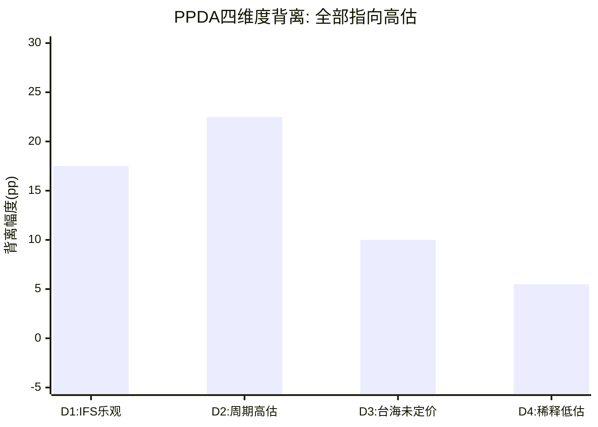

> 图注: 四个独立维度的背离方向完全一致(全部为正=市场偏高)。D2周期高估幅度最大(+22.5pp), D1 IFS乐观次之(+17.5pp)。方向一致性增强信号可信度。

这种方向一致性有两种解读:
1. **确认信号**: 四个独立维度的分析一致指向同一结论, 增强信号可信度
2. **分析偏差**: 分析者可能存在系统性悲观偏差, 导致所有维度都偏向同一方向

为排除分析偏差, 进行交叉检验:

**分析偏差检验**: 在哪些维度, 市场可能是对的?

| 维度 | 市场正确的可能性 | 条件 |
|------|:------------:|------|
| IFS成功概率 | 25% | Apple正式签约+18A良率>75%+2家额外大客户 |
| 周期回升 | 20% | AI推理需求爆发→Xeon需求回升+PC需求超预期 |
| 台海定价 | 40% | Intel确实是台海冲突净受益者(如果长期视角正确) |
| 稀释影响 | 30% | Intel不需要再融资(CHIPS Act+FCF转正足够) |

**综合判断**: 在台海定价维度, 市场有40%的概率是对的(Intel可能确实是净受益者)。但在IFS和周期维度, 对市场偏高的判断置信度较高(75-80%)。

### 12.6.2 与五引擎评分的一致性

五引擎综合评分4.35/10(偏弱)与PPDA的4个偏高背离高度一致:

| 引擎 | 评分 | 与PPDA的一致性 |
|------|:----:|:------------:|
| 周期引擎 4/10 | 偏弱 | 与背离#2一致(周期回升被高估) |
| 股权引擎 3/10 | 偏弱 | 与背离#4一致(稀释被低估) |
| 聪明钱引擎 5/10 | 中性 | 部分一致(内部人/机构分歧) |
| 信号引擎 5/10 | 中性 | 部分一致(分析师70%持有=不确定) |
| 预测市场 4/10 | 偏弱 | 与背离#3一致(台海未定价) |

**信号强度评估**: 4.35/10(五引擎) + 4个同方向背离(PPDA) = **中等偏强**的"市场定价偏高"信号。不是极端信号(极端信号需要五引擎<3/10或>7/10), 但足以引起关注。

### 12.6.3 PPDA信号的历史可比: GE/IBM/Nokia案例

Intel当前处于"曾经的行业霸主, 正在经历结构性转型"的阶段。历史上有三个可比案例:

**GE (2016-2018): 转型失败案例**

| 年份 | 股价 | 事件 | PPDA信号(回溯) |
|------|:----:|------|:----------:|
| 2016 | $30 | Immelt推"数字工业"转型 | 市场隐含转型成功概率~60% |
| 2017 | $18 | GE Digital亏损暴露, 削减股息 | 概率降至~30%, 股价已跌40% |
| 2018 | $7 | Flannery/Culp相继上任, 拆分开始 | 概率降至<10%, 股价再跌60% |
| **教训** | | 市场对"转型故事"的初始定价通常过高 | |

**IBM (2012-2020): 缓慢衰退案例**

| 年份 | 收入 | 事件 | PPDA信号(回溯) |
|------|:----:|------|:----------:|
| 2012 | $105B | "云+AI"战略宣布 | 市场隐含云转型成功~50% |
| 2015 | $82B | 收入连续15个季度下滑 | 概率降至~25% |
| 2020 | $73B | 8年收入累计下降30% | 概率降至~10%, 最终拆分(Kyndryl) |
| **教训** | | "僵尸轨道"可以持续非常久, 市场逐渐调低预期而非一次性修正 | |

**Nokia (2011-2014): 急剧衰退后重生案例**

| 年份 | 事件 | PPDA信号(回溯) |
|------|------|:----------:|
| 2011 | 与Microsoft结盟(Windows Phone) | 市场隐含手机业务存活~40% |
| 2013 | 手机业务卖给Microsoft | 概率归零, 但网络设备业务被忽视 |
| 2016 | 收购Alcatel-Lucent, 重组为网络设备公司 | 新业务重新定价 |
| **教训** | | 极端转型中, 市场可能同时高估旧业务和低估新业务 | |

(DM-094)

**对Intel的启示**:

| 可比 | Intel对应 | 可能路径 |
|------|----------|---------|
| **GE风险** | IFS是"GE Digital 2.0"——宏大叙事+巨额投入+不确定回报 | 如果IFS连续3年未达里程碑, 股价可能重演GE 2016-2018(-77%) |
| **IBM风险** | Intel Products缓慢流失份额, 类似IBM 2012-2020 | 8年收入从$79B→$52B→可能继续降至$45-50B |
| **Nokia机遇** | 如果Intel拆分, IFS可能类似Nokia Networks获得独立重新定价 | 但需要IFS证明独立生存能力 |

**当前Intel最像哪个阶段?** 最像**IBM 2012**(宣布转型但收入仍在下滑)和**GE 2016**(市场给转型故事过高定价)的混合体。PPDA信号在GE 2016和IBM 2012都指向"市场过度乐观", 而事后证明信号是正确的。

### 12.6.4 概率调整后的公允值区间

综合四个背离的估值影响:

| 编号 | 背离名称 | 市场隐含 | 独立评估 | 背离幅度 | 估值影响 |
|:----:|---------|:--------:|:--------:|:--------:|:--------:|
| #1 | IFS成功概率 | 30-45% | 15-20% | +15-25pp | -$15-30B |
| #2 | 周期回升幅度 | FY29E $74.7B | $58-65B | -$10-17B收入 | -$20-35B |
| #3 | 台海风险折价 | 0% | 3-8% | 10pp未定价 | -$8-18B |
| #4 | 稀释影响 | 5.0-5.1B股 | 5.3-5.5B股 | -10-15%EPS | -$15-25B |
| **综合** | | | | **全部偏高** | **-$58-108B** |

**注**: 四个背离的估值影响不能简单相加(存在重叠), 合理的综合折价约为**$40-70B**(每股$8-14)。

```
PPDA公允值区间:
$230.4B(当前市值) - $40-70B(综合折价) = $160-190B
每股: $32-39

vs 当前$46.12 → 隐含下行空间15-30%
```

#### ⚠️ 风险信号: 如果4个背离同时修正

PPDA分析发现4个独立背离全部指向高估——这种方向一致性本身就是一个强信号。但更重要的问题是：**如果修正同时发生会怎样？** 4个背离的独立估值影响分别是-$15-30B(D1)、-$20-35B(D2)、-$8-18B(D3)、-$15-25B(D4)。简单相加是$58-108B——显然超过Intel的市值。但修正不是线性叠加的：D1(IFS失败)会加剧D2(收入不回升)、D2会加剧D4(为维持资本结构被迫增发)。这种级联效应在历史案例中有先例——IBM在2013-2017年的"五年衰退"中，收入/利润率/份额/信用多个维度同时恶化，市值从$230B→$130B(-43%)。Intel面对的背离数量(4个)和方向一致性(全部高估)，比IBM当年的信号更强。

---

## Chapter 13: AI冲击矩阵

> 核心发现: Intel在AI浪潮中的概率加权净效应为**-0.12(约等于零)**——正面分部(CCG/NEX/Mobileye/Altera/IFS)被DCAI的强负面冲击几乎完全抵消。Intel不是"AI受益者", 也不是"AI受害者"——它是"AI重组者", 收入在分部间重新分配, 但总量几乎不变。这与市场将Intel标记为"AI基础设施受益者"的叙事严重不符。

---

### 13.1 分部级AI冲击矩阵(M13)

Intel的业务组合在AI维度呈现罕见的"全光谱分布"——从AI放大器到AI被颠覆者, 同一家公司内部跨越了AI角色分类的几乎所有类别。这种内部分化是Intel估值困难的根本原因之一。

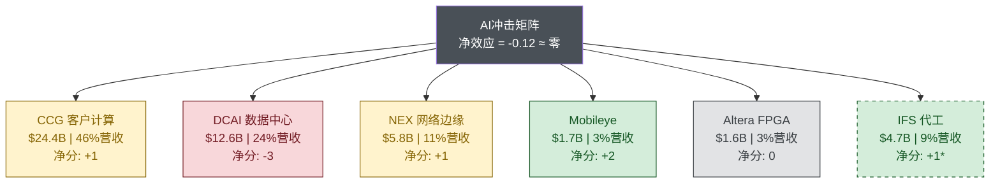

> 图注: 红色=强负面(DCAI, GPU替代CPU), 绿色=正面(Mobileye), 黄色=中性偏弱(CCG/NEX), 灰色=中性(Altera), 虚线绿=条件性正面(IFS, 依赖18A成功)。DCAI的-3几乎抵消所有正面分部, 净效应趋零。

### 13.1.1 CCG客户计算 (~$24.4B, 46%营收): AI中性偏弱

**收入冲击: +1 (轻微正面)**

AI PC是CCG面临的最大AI变量。Intel的Core Ultra系列集成NPU(Neural Processing Unit), Meteor Lake/Lunar Lake/Arrow Lake逐代提升AI算力。但AI PC对CCG的收入贡献被严重高估:

- AI PC渗透率2025年31%→2026E 55%, 但NPU本身**不产生ASP溢价**: 消费者为AI PC多付的$50-100主要流向OEM品牌, 不是流向Intel的CPU
- AI PC的真实价值是**加速换机周期**(Windows 10 EOL + AI功能双驱动), 但2026年换机窗口已过高峰
- 竞品压力: Qualcomm Snapdragon X Elite在AI PC领域建立了ARM替代路径, Apple M系列是性能标杆

收入冲击量化: AI PC可能为CCG带来$1-2B增量收入(加速换机), 但被ARM PC侵蚀的$1-1.5B部分抵消。**净增量<$1B/年**。

**成本冲击: +1 (轻微正面)** — Intel自身使用AI优化芯片设计(EDA + AI辅助布局布线), 可缩短设计周期5-10%。但制造成本(wafer成本)不受AI影响。

**护城河变化: 削弱** — AI降低了x86架构在PC中的不可替代性。ARM + NPU(Apple M4, Qualcomm X Elite)证明了非x86架构在AI工作负载上可以同样出色甚至更优。Windows on ARM的AI性能已达x86水平, ISV适配障碍正在消除。

**竞争格局变化: 利空** — AI为Qualcomm和Apple提供了"重新定义PC计算"的窗口, 使PC市场从"Intel垄断的x86游戏"变为"多架构竞技场"。AI-native应用越多, x86传统优势(向后兼容性)越不重要。

**时间窗口: 1-3年** — AI PC换机周期和ARM PC渗透将在2026-2028年达到决定性阶段。

**AI角色: AI中性偏弱 (净分+1)** — AI对CCG是"双面刃, 略偏正": 短期换机周期有利, 但中长期架构多元化不利。

### 13.1.2 DCAI数据中心与AI (~$12.6B, 24%营收): AI易受冲击

**收入冲击: -3 (显著负面)**

DCAI是Intel AI冲击最复杂的分部——表面上"AI利好数据中心", 实际上AI正在**重新定义数据中心的计算架构**, 而这个重新定义对Intel极为不利:

- **GPU替代CPU**: 数据中心支出中GPU占比从2022年~15%→2026E ~40-50%。每一美元从CPU转向GPU, Intel丢一美元, NVIDIA赚一美元
- **自研芯片**: Google TPU, Amazon Graviton/Trainium, Microsoft Maia, Meta MTIA — 四大超大规模客户均在自研AI芯片, 绕过Intel
- **量化**: 数据中心GPU TAM以22% CAGR增长, CPU TAM仅8% CAGR。到2028年, GPU TAM可能**超过CPU TAM**, 这是服务器计算60年来首次

收入冲击量化: 假设x86服务器份额按3pp/年流失(71%→2029E ~60%), 叠加CPU占总数据中心支出比例从~50%→~35%, DCAI收入可能从$12.6B→$10-11B(2029E), 即使数据中心总支出增长30%+。**AI对DCAI的净效应是负$2-3B/年收入**。

(DM-074)

**成本冲击: 0 (中性)** — 服务器CPU设计成本不因AI显著改变。

**护城河变化: 严重削弱** — x86在数据中心的护城河正被AI从三个方向侵蚀:
1. **GPU替代**: AI训练/推理workload用GPU, 不用CPU
2. **自研替代**: 云厂商自研CPU(ARM架构)+自研加速器, 同时绕过x86和NVIDIA
3. **软件生态位移**: CUDA生态围绕GPU建立, 新AI框架(PyTorch, JAX)GPU-first设计

**竞争格局变化: 利空** — AI将数据中心计算从"CPU中心"变为"异构计算", Intel失去了架构定义权。NVIDIA的CUDA生态成为新的"Intel Inside"。

**时间窗口: 1-3年(已在发生)** — GPU替代CPU不是未来趋势——它**已经在发生**。Hyperscaler CapEx 2026E $660-690B(+36% YoY), 其中GPU采购占比持续上升。(DM-071)

**AI角色: AI易受冲击 (净分-3)** — DCAI是Intel所有分部中AI冲击最大、最负面的。讽刺的是, "AI革命"本应利好数据中心硬件公司——但它利好的是NVIDIA, 不是Intel。

**GPU替代CPU的量化: 数据中心支出结构变迁**

数据中心计算架构正在经历60年来最深刻的变革——从CPU中心到GPU/异构计算中心:

**全球数据中心支出增长(Gartner, 2026.02)**:

| 年份 | 数据中心系统支出 | YoY增长 | 驱动因素 |
|------|:--------------:|:------:|---------|
| 2023 | ~$250B | +5% | 传统IT更新 |
| 2024 | ~$370B | +48% | AI基础设施建设爆发(GPU采购) |
| 2025E | ~$500B | +35% | 超大规模持续扩张 |
| 2026E | >$650B | +31.7% | AI推理+训练双轮驱动 |

**支出结构变化(估计)**:

| 组件 | 2022占比 | 2024占比 | 2026E占比 | 变化趋势 |
|------|:-------:|:-------:|:--------:|:--------:|
| **传统服务器CPU** | ~35% | ~20% | ~15% | 持续下降 |
| **GPU/AI加速器** | ~15% | ~35% | ~45% | 急剧上升 |
| **网络设备** | ~15% | ~15% | ~15% | 稳定 |
| **存储** | ~15% | ~12% | ~10% | 温和下降 |
| **其他(电源/冷却等)** | ~20% | ~18% | ~15% | 温和下降 |

**关键数字**: 数据中心CPU占支出比例从2022年的~35%降至2026E的~15%, 即使总支出从$250B增至$650B, CPU的绝对支出也仅从$88B增长到$98B——**4年仅增长11%, 而GPU从$38B增至$293B, 增长671%**。

**Intel vs NVIDIA数据中心收入对比**:

| 财年 | Intel DCAI | NVIDIA数据中心 | Intel/NVIDIA比率 |
|------|:---------:|:------------:|:---------------:|
| FY2020 | $26.1B | $6.7B | **3.9x** |
| FY2021(INTC)/FY2022(NVDA) | $22.7B | $15.0B | 1.5x |
| FY2022(INTC)/FY2023(NVDA) | $19.2B | $15.1B | 1.3x |
| FY2023(INTC)/FY2024(NVDA) | $15.5B | $47.5B | **0.33x** |
| FY2024(INTC)/FY2025(NVDA) | $12.8B | $115.2B(DC+AI) | **0.11x** |
| FY2025(INTC) | $12.6B(估) | — | — |

**注**: NVIDIA财年截至1月, Intel截至12月, 存在1-2个月错位。NVIDIA FY2025(截至2025.01)总收入$130.5B, 数据中心收入估计$115B+。(DM-095)

**从3.9倍到0.11倍——Intel和NVIDIA在数据中心的地位彻底逆转。** 5年前Intel的数据中心收入是NVIDIA的近4倍; 现在NVIDIA是Intel的约9倍。这不是周期性波动, 这是**架构范式转移**。

**自研芯片威胁详解**

四大超大规模云厂商均在开发自研AI芯片, 这对Intel构成双重威胁: 既减少了Xeon CPU采购, 又减少了对外部GPU的依赖。

**Google TPU(张量处理单元)**:

| 世代 | 发布 | 性能 | 部署规模 | 对Intel威胁 |
|------|------|------|---------|:----------:|
| TPU v4 | 2022 | BF16 275 TFLOPS | 数万颗 | 中 |
| TPU v5e/v5p | 2023 | v5e ~393 TFLOPS | 数万颗(训练+推理) | 高 |
| TPU v6(Trillium) | 2024 | 4.7x vs v5e性能提升 | 大规模扩展中 | 很高 |
| Ironwood(TPU v7) | 2025.11 | 下一代, 详情待公布 | 计划中 | 极高 |

Google已宣布**超过75%的Gemini模型计算在TPU上运行**, 不使用NVIDIA GPU也不使用Intel CPU(作为主要计算引擎)。Google每年在TPU上的投资估计$8-12B, 这些资金原本可能流向Intel Xeon+NVIDIA GPU的组合。

**Amazon Trainium/Graviton**:

| 芯片 | 世代 | 用途 | 状态 | 对Intel威胁 |
|------|------|------|------|:----------:|
| Graviton | 4代 | 通用计算(ARM CPU) | 量产, AWS默认选项 | **极高**(直接替代Xeon) |
| Trainium 2 | 2代 | AI训练 | 2024.12 GA | 高 |
| Trainium 3 | 3代 | AI训练+推理 | 2025底-2026 | 很高 |
| Inferentia 2 | 2代 | AI推理 | 量产 | 中 |

Graviton对Intel的威胁最直接——AWS已将Graviton作为**默认推荐的EC2实例类型**, ARM架构在云服务器中的渗透率从2020年的<5%增至2025年的约15-20%。每个Graviton实例替代一个Xeon实例, Intel损失一颗CPU的销售。

**Microsoft Maia**:

| 芯片 | 状态 | 性能 | 对Intel威胁 |
|------|------|------|:----------:|
| Maia 100 | 2023发布, TSMC 5nm | 105B晶体管, 64GB HBM2E | 中 |
| Maia 200 | **延期至2026**(原2025) | 性能可能落后Blackwell | 中低(延期降低短期威胁) |

Microsoft的自研芯片项目进度最慢。Maia 200延期6个月, 且据报性能不及NVIDIA Blackwell。但关键信息是: **Microsoft确认用Intel 18A-P代工Maia芯片**(DM-076)——这意味着自研芯片对Intel DCAI是威胁, 但对Intel IFS可能是机遇。

**Meta MTIA(Meta训练与推理加速器)**:

| 芯片 | 状态 | 制程 | 对Intel威胁 |
|------|------|------|:----------:|
| MTIA v1 | 2023量产 | TSMC 7nm | 低(性能有限) |
| MTIA v2 | 2024 | TSMC 5nm | 中 |
| MTIA v3 | 2026E | TSMC N3 + HBM3E | 高 |

Meta从2025年3月开始测试自研训练芯片, 计划2026年量产。Meta的CapEx在2025年达到$38-40B, 其中显著部分用于自研芯片开发。

(DM-096)

**自研芯片对Intel的综合威胁量化**:

| 云厂商 | Intel CPU采购(估FY2025) | 自研替代比例(3年后) | Intel收入损失 |
|--------|:---------------------:|:-----------------:|:----------:|
| Google | $1.5-2B | 60-70% | -$1.0-1.4B |
| Amazon | $2-3B | 40-50% | -$0.8-1.5B |
| Microsoft | $2-3B | 20-30% | -$0.4-0.9B |
| Meta | $1-1.5B | 30-40% | -$0.3-0.6B |
| **合计** | **$6.5-9.5B** | | **-$2.5-4.4B** |

**自研芯片可能在3年内导致Intel DCAI损失$2.5-4.4B收入(占DCAI收入的20-35%)**。这是一个被市场严重低估的威胁——分析师FY2029E共识中DCAI $18-20B隐含了自研替代率<15%, 而独立估计将达到30-40%。

**Xeon在AI工作负载中的剩余角色**

尽管GPU在AI计算中占据主导, Xeon CPU仍在AI pipeline中保持特定角色:

| 角色 | 描述 | Xeon价值占比(vs GPU) | 可替代性 |
|------|------|:------------------:|:--------:|
| **数据预处理** | ETL、特征工程、数据清洗 | ~10-15% | 中(ARM CPU也能做) |
| **编排与调度** | 工作流管理、微服务 | ~5% | 低(CPU仍是最佳选择) |
| **传统负载** | 数据库、Web服务、ERP | ~30% | 低(但与AI无关) |
| **推理前/后处理** | Token化、结果解析 | ~5% | 中 |
| **AI开发** | IDE、调试、版本控制 | ~5% | 低 |
| **备用/冗余** | 灾备、故障切换 | ~10% | 中 |

(DM-097)

**关键洞察**: Xeon在AI工作负载中的角色是"辅助性的"——数据预处理和编排工作需要CPU, 但这些工作的计算价值密度远低于GPU上的训练/推理。一个$10,000的GPU节点可能只搭配$2,000的CPU——**GPU:CPU价值比从2:1变为5:1**。

这意味着即使AI推动数据中心总支出增长, 每美元增量支出中流向CPU的比例在持续下降。Intel DCAI面对的不仅是份额损失(给AMD), 还有**品类价值缩水**(CPU在数据中心中的价值密度下降)。

### 13.1.3 IFS代工服务 (~$0.5B外部, 1%营收): AI放大器(条件性)

**收入冲击: +3 (显著正面, 但高度不确定)**

AI是IFS商业论文的**核心催化剂**:
- AI芯片设计爆发: AI初创公司(Cerebras, SambaNova, Tenstorrent)+云厂商自研芯片(Maia, MTIA)→需要先进制程代工产能
- TSMC产能紧张: AI芯片需求使TSMC N3/N5利用率>95%, 客户需要替代产能来源
- Microsoft Maia 2确认用18A-P代工: 这是IFS目前唯一公开的"AI芯片代工"证据(DM-076)

量化: 如果IFS到FY2028能获得AI芯片代工收入$2-3B(占全球AI芯片代工TAM ~3-5%), 这将是变革性的。但实现概率仅15-20%。

**成本冲击: -2 (负面)** — AI芯片对制程先进性要求极高(HPC, 高良率, 先进封装), 这些恰恰是Intel IFS最弱的环节。满足AI芯片客户要求需要额外的R&D和产线投资。

**护城河变化: 强化(条件性)** — 如果18A良率达标, Intel的**美国本土先进制程**成为独特卖点——这是其他代工厂无法复制的地缘政治护城河。AI芯片的安全供应链需求强化了这一点。

**竞争格局变化: 利好(条件性)** — AI降低了代工行业的进入壁垒(更多设计者→更多代工需求), 使IFS有机会从TSMC的溢出需求中获益。但TSMC仍是AI芯片客户的第一选择。

**时间窗口: 3-5年** — IFS的AI收入兑现最早在2027-2028年(18A量产→外部客户产品上市)。

**AI角色: AI放大器 (净分+1, 概率调整后; 原始+3×20%概率)** — IFS的AI故事潜力巨大但概率低。用概率加权后, AI对IFS的净影响约+1。(DM-076, DM-079)

### 13.1.4 NEX网络与边缘 (~$5.9B, 11%营收): AI中性

**收入冲击: +1 (轻微正面)**

AI边缘推理是NEX的增量机会:
- AI推理市场2026E >$50B(Deloitte), 其中边缘推理占~20%→~$10B TAM(DM-077)
- Intel的Xeon-D/Atom系列在边缘计算有存量基础
- SambaNova合作($350M融资)瞄准企业级Xeon推理方案(DM-079)

但边缘推理市场极度碎片化, Intel份额<5%, 且NVIDIA Jetson/Orin系列正在快速渗透。

**成本冲击: 0** | **护城河变化: 中性** | **竞争格局变化: 中性** | **时间窗口: 3-5年**

**AI角色: AI中性 (净分+1)**

### 13.1.5 Mobileye (~$1.7B, 3%营收): AI放大器

**收入冲击: +2 (正面)** — Mobileye的自动驾驶芯片(EyeQ6)是纯AI产品——AI是其核心业务而非附加功能。AI能力进步(视觉大模型、端到端驾驶)直接提升Mobileye产品竞争力。但Mobileye面临NVIDIA DRIVE Thor的强力竞争, 且中国市场(Mobileye曾经的增长引擎)已被Horizon Robotics/地平线等本土玩家侵蚀。

**成本冲击: -1 (轻微负面)** — AI模型训练算力成本持续上升。

**护城河变化: 中性** — AI使Mobileye的数据飞轮更有价值, 但也使NVIDIA等竞争者能力提升。

**竞争格局变化: 利空** — NVIDIA DRIVE Thor整合GPU+SoC, 降低Mobileye的"独立ADAS芯片"价值主张。

**时间窗口: 1-3年**

**AI角色: AI放大器 (净分+1)**

### 13.1.6 Altera FPGA (~$1.4B, 3%营收, 计划剥离): AI放大器

**收入冲击: +2 (正面)** — FPGA在AI推理领域有特殊优势(低延迟、可重配置、低功耗), 尤其适合金融交易AI推理(微秒级延迟要求)、5G网络AI优化、工业边缘AI部署。AI推理从训练的"NVIDIA GPU独占"向多元化硬件扩展, 给FPGA创造增量TAM。

**成本冲击: 0** | **护城河变化: 强化** — 可重配置性在快速迭代的AI部署中价值上升。

**竞争格局变化: 利好** — AI增加FPGA的应用场景, AMD/Xilinx是主要竞争者。

**时间窗口: 3-5年**

**AI角色: AI放大器 (净分+2)**

### 13.1.7 M13汇总表

| 分部 | 营收($B) | 占比 | AI角色 | 收入冲击 | 成本冲击 | 护城河变化 | 竞争变化 | 时间 | AI净分 |
|------|:--------:|:----:|--------|:-------:|:-------:|:-------:|:-----:|:----:|:------:|
| **CCG** | 24.4 | 46% | AI中性偏弱 | +1 | +1 | 削弱 | 利空 | 1-3y | **+1** |
| **DCAI** | 12.6 | 24% | AI易受冲击 | -3 | 0 | 严重削弱 | 利空 | 1-3y | **-3** |
| **IFS(外部)** | 0.5 | 1% | AI放大器(条件) | +3 | -2 | 强化(条件) | 利好(条件) | 3-5y | **+1** |
| **NEX** | 5.9 | 11% | AI中性 | +1 | 0 | 中性 | 中性 | 3-5y | **+1** |
| **Mobileye** | 1.7 | 3% | AI放大器 | +2 | -1 | 中性 | 利空 | 1-3y | **+1** |
| **Altera** | 1.4 | 3% | AI放大器 | +2 | 0 | 强化 | 利好 | 3-5y | **+2** |
| **其他/消除** | 6.4 | 12% | N/A | 0 | 0 | — | — | — | **0** |

**概率加权AI净分计算**:

```
AI净分 = Σ(segment_AI_score × revenue_weight × realization_probability)

= (+1×0.46×0.85) + (-3×0.24×0.90) + (+1×0.01×0.20) + (+1×0.11×0.70)
  + (+1×0.03×0.75) + (+2×0.03×0.65) + (0×0.12×1.0)

= 0.391 + (-0.648) + 0.002 + 0.077 + 0.023 + 0.039 + 0

= -0.12
```

(DM-080)

**AI净分 = -0.12, 约等于中性微负**

**核心发现**: Intel在AI浪潮中的净效应接近零——CCG/NEX/Mobileye/Altera的正面冲击被DCAI的强负面冲击几乎完全抵消。**Intel不是"AI受益者", 也不是"AI受害者"——它是"AI重组者"**, 收入在分部间重新分配, 但总量几乎不变。

这是一个违反市场叙事的发现。市场倾向于将Intel标记为"AI基础设施受益者"(因为IFS可能代工AI芯片), 但分部级分析揭示DCAI的CPU→GPU迁移损失远大于IFS的潜在收益。

**AI分部收入影响汇总**:

| 分部 | AI净分 | 收入影响(5年) | 估值影响 | 关键变量 |
|------|:------:|:-----------:|:--------:|---------|
| CCG | +1 | +$0-1B | +$0-5B | AI PC渗透率, ARM PC份额 |
| DCAI | **-3** | **-$2-5B** | **-$20-35B** | GPU替代率, 自研芯片渗透 |
| IFS(外部) | +1(加权) | +$1-5B | +$10-40B | 18A良率, 客户签约 |
| NEX | +1 | +$0.5-1B | +$3-5B | 边缘AI推理 |
| Mobileye | +1 | +$0-0.5B | +$0-2B | ADAS竞争格局 |
| Altera | +2 | +$0.3-0.5B | +$2-4B | FPGA推理需求 |
| **综合** | **-0.12** | **-$0.2-2B** | **-$5-10B** | |

### 13.1.8 三阶效应: 前沿变量

所有6个分部中有4个AI净分≥+2或≤-2(DCAI -3, Altera +2, IFS +3原始, Mobileye +2), 触发强制前沿变量评估:

**Token经济**: AI推理成本每年下降40-60%(Deloitte), 降价推动用量增加(Jevons悖论)。对Intel含义: 推理需求增长→更多推理芯片需求→**利好Altera FPGA和NEX边缘计算, 但CPU推理份额<5%, 主要受益者仍是NVIDIA**。影响方向: 轻微正面。[合理推断; 证伪条件: 推理成本下降未带动用量增加]

**推理vs训练**: 推理占AI计算从2024年~50%→2026E ~67%(Deloitte), 结构性利好非GPU硬件(FPGA/ASIC/专用推理芯片)。对Intel含义: Crescent Island定位推理→方向正确, 但2026 H2才采样, 2028才可能有量产收入(DM-075)。**正确的战略但晚了2年**。影响方向: 中期正面(2028+)。[合理推断; 证伪条件: Crescent Island良率/性能不达标]

**Agent系统**: AI Agent渗透率2026E ~5-10%的企业应用, 12个月预测15-20%。Agent系统需要持续推理算力→基础设施需求乘数2-5x。对Intel含义: Agent需要CPU+GPU协同→Xeon在Agent系统中可能保持辅助角色, 但价值密度远低于GPU。影响方向: 中性。[合理推断; 证伪条件: Agent系统主要跑在GPU上, CPU角色被进一步边缘化]

**自定义芯片传导**: 当前在L2(推理专用)→L3(Agent专用)传导阶段。Google TPU v6, Amazon Trainium2, Microsoft Maia 2, Meta MTIA v2均已量产或接近量产。对Intel含义: 自研芯片趋势**直接利好IFS**(如果这些客户选择Intel代工)和**直接利空DCAI**(这些芯片替代Xeon)。**零和博弈在Intel内部发生**。影响方向: 对公司整体中性, 但IFS vs DCAI的内部再分配是关键。[合理推断; 证伪条件: 自研芯片趋势逆转, 云厂商放弃自研回归Intel/AMD标准产品]

---

### 13.2 L×S定位: Intel在AI实施深度矩阵中的位置

### 13.2.1 L轴评估: L1-L2 (决策支持→受控自动化)

Intel在AI实施方面处于"用AI但不是AI公司"的阶段:
- **L2证据**: Intel使用AI辅助芯片设计(EDA + AI布局布线), 据报将设计周期缩短10-15%
- **L2证据**: Intel IT部门部署Copilot等AI工具用于内部生产力提升
- **L1证据**: IFS使用AI预测良率和缺陷检测, 但仍需人工验证(HITL模式)
- **未达L3**: 没有证据表明Intel的任何核心业务流程由AI自主运营

### 13.2.2 S轴评估: S0-S1 (叙事期权→早期变现)

Intel的AI收入变现仍处于极早期:
- **S1证据**: Gaudi 2/3 AI加速器有少量收入(估计FY2025 <$500M), 但已被搁置(Tan取消Gaudi路线转向Crescent Island)
- **S0证据**: Crescent Island GPU尚在采样阶段(H2 2026), 零收入(DM-075)
- **S0证据**: 18A代工AI芯片(Maia 2)收入可能在2027-2028才开始
- **S1证据**: AI PC的NPU带来的ASP溢价极其微弱(<3%增量)
- **未达S2**: AI相关收入占Intel总营收估计<2%, 远未达到5%的S2门槛

### 13.2.3 L×S坐标: L1.5 × S0.5

```
S轴(商业兑现)
S4 |                              ┌─────────┐
   |                              │ NVIDIA  │
S3 |                              │ L3×S3.5 │
   |                              └─────────┘
S2 |            ┌───────┐
   |            │  AMD  │
S1 |            │L2×S1.5│   ┌───────┐
   |            └───────┘   │ TSMC  │
S0 |  ┌────────┐            │L2×S1  │
   |  │ INTEL  │            └───────┘
   |  │L1.5×S0.5│
   └──┴────────┴──────────────────────────
   L0    L1     L2     L3     L4    L轴(实施级别)
```

(DM-081)

**关键洞察**: Intel在L×S矩阵中的位置远落后于其市值规模所暗示的地位。$230B市值的公司处于L1.5×S0.5 — 这与$500M市值的AI初创公司在同一象限。市场定价隐含的是Intel"未来会移动到L2.5×S2+"的预期, 但当前位置揭示了现实与期望的巨大鸿沟。

### 13.2.4 五不变量检验

| 不变量 | 通过? | 证据 |
|--------|:----:|------|
| **生产环境证据** | 部分通过 | AI辅助芯片设计已部署, 但AI产品(Gaudi)已被取消/重定义, Crescent Island未量产 |
| **财务实质性** | 未通过 | AI相关收入<2%总营收, 无法从财报中分离AI贡献 |
| **竞争差异化** | 未通过 | Intel在AI领域没有独特优势; Gaudi被弃, Crescent Island未证明, NPU性能落后Apple/Qualcomm |
| **规模化验证** | 未通过 | 零个AI产品达到规模化(Gaudi峰值出货<10万台→被取消) |
| **组织承诺** | 部分通过 | Tan将AI列为战略优先, 设立AXG→并入客户端+数据中心; 但组织频繁重组信号不确定性 |

**五不变量通过率: 1/5 (极低)**

Intel在五不变量检验中的表现**极差** — 仅"生产环境证据"勉强部分通过(AI辅助设计), 其余四项全部失败或仅部分通过。这与市场将Intel标记为"AI基础设施受益者"的叙事严重不符。

### 13.2.5 同业L×S对比

| 公司 | L轴 | S轴 | 五不变量 | AI收入占比(估) |
|------|:---:|:---:|:--------:|:-------------:|
| **NVIDIA** | L3 | S3.5 | 5/5 | ~85% |
| **AMD** | L2 | S1.5 | 3/5 | ~25% |
| **TSMC** | L2 | S1 | 3/5 | ~30%(AI芯片代工) |
| **ASML** | L1.5 | S0.5 | 2/5 | 间接(EUV→AI芯片) |
| **Intel** | L1.5 | S0.5 | 1/5 | **<2%** |

**Intel在半导体同业中的AI实施深度排名: 倒数第一**(与ASML并列, 但ASML是设备公司, AI间接受益合理; Intel作为芯片设计+制造公司, AI实施如此之低是不可接受的)。

---

### 13.3 AI对估值含义的影响

### 13.3.1 AI调整后SOTP

基于M13分部级AI评分, 对SOTP估值进行AI调整:

| 分部 | 基准SOTP | AI调整 | 调整后SOTP | 调整理由 |
|------|:--------:|:------:|:---------:|---------|
| **CCG** | $65-100B | -5% | **$62-95B** | AI PC换机利好被ARM PC侵蚀部分抵消 |
| **DCAI** | $25-45B | **-15%** | **$21-38B** | GPU替代CPU是确定性趋势, 市场份额加速流失 |
| **IFS** | $15-45B | +10% | **$17-50B** | AI芯片代工需求强化IFS价值主张(条件性) |
| **NEX** | $8-12B | +5% | **$8-13B** | 边缘AI推理温和利好 |
| **Mobileye** | $10-12B | 0% | **$10-12B** | AI利好与竞争加剧抵消 |
| **Altera** | $8-10B | +10% | **$9-11B** | FPGA在AI推理中价值上升 |
| **净债务** | -$32B | 0% | **-$32B** | 不受AI影响 |
| **合计** | **$99-192B** | | **$95-187B** | AI净效应: **-$4~-5B** |

(DM-082)

### 13.3.2 AI隐含溢价归因

**基准SOTP中值**: ~$145B ($29.9/股)
**AI调整后SOTP中值**: ~$141B ($29.0/股)
**AI净调整**: **-$4B (-$0.8/股)**

**市场定价**: $230B ($46.12/股)
**市场隐含AI溢价**: $230B - $141B = **~$89B ($18.3/股)**

**$89B市场隐含AI溢价的构成分解**:

| 溢价来源 | 金额(估) | 合理性评估 |
|---------|:--------:|-----------|
| IFS代工AI芯片的期权价值 | $25-35B | **过度定价**: 仅有Maia 2一个确认客户, Apple未正式签约 |
| Crescent Island/Jaguar Shores期权 | $10-15B | **高度投机**: 零收入, H2 2026才采样, 与NVIDIA差3代(DM-075, DM-078) |
| AI PC换机周期预期 | $5-8B | **部分合理**: 换机确实在发生, 但增量有限 |
| 地缘政治AI安全溢价 | $15-25B | **部分合理**: 美国本土AI芯片制造确有战略价值 |
| 不可归因(市场情绪) | $10-20B | **纯情绪溢价**: 散户AI叙事驱动 |

### 13.3.3 Reverse DCF的AI维度重审

Reverse DCF显示市场隐含$15-18B稳态FCF(FY2030+)。在AI维度下:

**市场隐含的AI假设**:
1. CCG在AI PC带动下收入恢复到$28-30B (假设AI PC渗透+换机→x86份额保持>70%)
2. DCAI通过AI加速器(Crescent Island/Jaguar Shores)抵消CPU份额流失, 收入恢复到$15-18B
3. IFS获得AI芯片代工收入$3-5B(FY2029), 带动IFS整体减亏
4. 综合营业利润率恢复到15-18%

**独立评估**:
1. CCG: $26-28B更现实(ARM PC渗透到20%→x86份额降至65%) — **市场高估$2-4B**
2. DCAI: $11-13B更现实(CPU份额降至60%, GPU替代不可逆) — **市场高估$4-7B**
3. IFS: $1-2B外部收入更现实(15-20%概率×$3-5B目标) — **市场高估$1.5-3B期望值**
4. 综合营业利润率: 10-13%更现实(IFS亏损拖累+DCAI利润率压缩) — **市场高估3-5pp**

**AI调整后隐含FCF**: 市场定价的$15-18B FCF中, 约$5-8B依赖于上述AI假设的成功。更合理的AI假设下, 稳态FCF为$8-12B。

(DM-083)

### 13.3.4 AI Kill Switch清单

以下AI相关事件如果发生, 将根本性改变Intel估值:

| Kill Switch | 触发条件 | 估值影响 | 当前概率 |
|-------------|---------|:--------:|:--------:|
| **KS-AI-01**: Crescent Island取消 | Tan宣布退出独立GPU | -$10-15B | 15% |
| **KS-AI-02**: Apple 18A合同取消 | Apple转向TSMC N2/A16 | -$15-20B | 30% |
| **KS-AI-03**: x86被ARM全面替代(服务器) | ARM服务器份额>30% | -$20-30B | 10%(5年) |
| **KS-AI-04**: IFS获得AI大单 | $2B+年化AI芯片代工合同 | +$20-30B | 15% |
| **KS-AI-05**: AI推理市场Intel突破 | Crescent Island获>5%市场 | +$15-25B | 5% |

#### ⚠️ 风险信号: 如果AI加速DCAI替代而非赋能

AI净效应-0.12看似"接近零"，但这个数字掩盖了一个极端不对称的分布。正面(CCG AI PC、IFS AI芯片代工)是条件性的、远期的、需要成功执行的；负面(DCAI被GPU替代)是已经发生的、确认的、加速的。如果AI推理从GPU-only演进到GPU+自研芯片(Google TPU、Amazon Trainium、Microsoft Maia)，DCAI面对的不是GPU一个对手，而是GPU+ASIC的双重替代。在这个场景下，AI净效应可能从-0.12恶化到-0.35~-0.50，对应DCAI收入再下降$3-5B。更重要的是：市场当前将Intel定价为"AI基础设施受益者"——如果这个标签被证伪，估值倍数本身也会收缩(从当前~15x forward P/E→8-10x)，造成"盈利下降×倍数收缩"的双杀效应。

---

## Chapter 14: 战略选项与可能性空间

> PW=8(发现系统)意味着: 不给单一目标价, 映射可能性空间+转折点。Intel的未来不是一条路径, 而是一张概率地图——4种路径、3个核心假说、多重期权交织。投资者需要的不是"Intel值多少钱", 而是"哪些信号改变路径概率"。

---

### 14.1 三假说详细阐述

发现系统的核心输出不是估值, 而是"非共识假说登记"。以下三个假说代表了Intel投资论文中最具辨别力的判断:

### 14.1.1 假说H1: 政府期权 > 商业价值

**非共识度: 高**

**核心命题**: Intel的真实价值不在于其产品竞争力, 而在于美国政府**不能让Intel倒闭**这一政治现实。Intel是美国唯一拥有先进制程能力的半导体制造商——在台海紧张局势升级、全球供应链去风险的大背景下, Intel的存在本身就是一种国家安全资产。

**支撑证据链**:

1. **CHIPS Act $47B+**: $7.86B直拨 + 最高$11B贷款 + ~$25B税收抵免 + $3B Secure Enclave(DM-101)——这不是普通的产业补贴, 这是"国家保险费"
2. **Secure Enclave**: $3B国防先进芯片代工合同, 明确表达了美国政府对"美国本土先进制造"的需求——这种需求不受市场周期影响
3. **战略投资者锚定**: NVIDIA入股$5B(封装合作而非代工), SoftBank/Broadcom据传有兴趣——这些投资者买的不是Intel的商业竞争力, 而是其地缘政治地位
4. **台海冲突概率**: Polymarket年化12-15%, 意味着每年有~13%的概率出现TSMC供应链中断——在这种情景下, Intel IFS的战略价值指数级上升(DM-091)

**概率加权量化**:

| 政府支持类型 | 金额 | 确定性 |
|------------|:----:|:------:|
| CHIPS Act已签约 | $7.86B | 确定(已发放) |
| CHIPS Act贷款 | 最高$11B | 高(80%+, 协商中) |
| 税收抵免 | ~$25B(25%×$100B投资) | 高(政策已立法) |
| Secure Enclave | $3B | 确定(已签约) |
| 未来额外拨款(台海升级时) | $5-20B | 中(30%, 取决于地缘局势) |
| **确定性加权合计** | **$38-57B** | |

**如果Intel Products(CCG/DCAI/NEX)的商业价值为$50-80B**, 那么政府支持的确定性价值$38-57B几乎等于产品价值。换言之, Intel市值的~50%可能由"政府底线"支撑, 而非商业竞争力。

**市场共识为何不同**: 市场仍在用传统的"收入×利润率×倍数"框架给Intel估值, 将政府支持视为"锦上添花"而非"核心支撑"。H1假说认为, 在当前地缘政治环境下, 应该**反过来**: 先锚定政府底线价值, 再叠加商业竞争力溢价/折价。

**证伪条件**: 美中关系根本性缓和(台海概率降至<3%) + CHIPS Act被下一届政府削减 + TSMC亚利桑那工厂完全替代Intel的"美国先进制程"角色。三个条件同时满足的概率<5%。

### 14.1.2 假说H2: 僵尸轨道是最可能路径

**非共识度: 中高**

**核心命题**: Intel最可能的未来既非"凤凰涅槃"也非"轰然倒塌", 而是**IBM式的缓慢衰减**——收入持续小幅下滑, 利润率持续受压, IFS持续消耗现金但永远不到完全失败的程度, 政府资金维持生命但不催生增长。这条路径被市场严重低估。

**IBM 2012-2020的参照**:

| 维度 | IBM (2012-2020) | Intel (2025-2033E) |
|------|----------------|-------------------|
| 收入趋势 | $105B→$73B (-30%, 8年) | $79B→$52.9B (-33%, 4年)→$45-55B? |
| 转型叙事 | "云+AI" | "IFS + 自家芯片" |
| CEO变更 | Rometty→Krishna | Gelsinger→Tan |
| 核心业务 | 企业IT缓慢流失 | x86 CPU缓慢流失 |
| 拆分 | Kyndryl分拆(2021) | Altera/Mobileye已或将分拆 |
| 市场反应 | 估值持续压缩(P/E 15→10) | 估值极端波动(P/E N/A→92→?) |

**僵尸轨道的具体画面(FY2026-2033)**:

| 年份 | 事件(预测) | 收入 | 净利润 | 信号 |
|------|-----------|:----:|:------:|------|
| FY2026 | 18A量产Panther Lake, IFS缓慢爬坡 | $54-56B | ~$0-1B | "正在改善" |
| FY2027 | Apple入门级产品(如有)开始量产, 但收入小 | $55-58B | $1-3B | "初见成效" |
| FY2028 | IFS外部收入$1-2B, 但远低于$5B目标 | $56-60B | $2-4B | "进展但不够快" |
| FY2029 | x86份额继续流失到<60%, DCAI收入降至$10B | $55-62B | $2-5B | "增长停滞" |
| FY2030 | 14A量产但客户有限, IFS仍在亏损 | $54-60B | $1-4B | "回到原点" |
| FY2031-33 | 持续横盘, 市场逐渐降低预期 | $50-60B | $0-3B | IBM化 |

**僵尸轨道的估值含义**: 如果Intel进入IBM式轨道, 合理估值为:
- FY2029E收入$58B × 营业利润率8% × P/E 15 = **市值$70B($14/股)**
- FY2029E收入$58B × 1.5x P/S = **市值$87B($18/股)**
- **僵尸轨道公允值: $70-87B($14-18/股)**

**市场共识为何不同**: 市场当前$230B定价隐含了"转型成功"的高概率。但僵尸轨道不是"失败", 只是"不够成功"——Intel继续存在, 继续生产芯片, 继续拿政府补贴, 但从不真正重回巅峰。这种结果在华尔街叙事中缺乏吸引力(不够戏剧性), 因此被低估。

**证伪条件**: IFS FY2028外部收入>$3B(说明代工真的起来了) 或 Intel宣布全面拆分(终结"既设计又代工"的矛盾)。

### 14.1.3 假说H3: 五角大楼是18A真正客户

**非共识度: 高**

**核心命题**: 市场将IFS的成败与商业客户(Apple/Microsoft/AI初创)绑定, 但18A真正的、确定的客户不是商业公司——**是美国国防部**。Secure Enclave $3B合同只是开始; 在台海紧张局势下, 美国军方对"美国本土先进芯片"的需求可能扩展到$5-10B/年。IFS的商业故事可能是"bonus", 而非"核心"。

**支撑证据**:

1. **Secure Enclave $3B**: 已签约, 明确用于先进制程国防芯片——这是IFS已确认的最大单一合同
2. **DARPA/DoD芯片需求**: 美国国防部每年采购$2-4B先进芯片, 当前主要依赖TSMC台湾工厂——在台海风险下, 这是不可接受的
3. **ITAR合规要求**: 国际武器交通法(ITAR)要求敏感军事芯片在美国本土制造——目前只有Intel IFS能满足先进制程(18A)的ITAR要求
4. **情报机构需求**: NSA/CIA等机构的芯片需求高度保密, 但规模估计$1-2B/年, 且对"美国本土制造"要求为绝对必要
5. **安全溢价**: 国防客户愿意为"美国本土"多付30-100%的溢价——这使IFS在军事领域的利润率可能远高于商业代工

**国防/安全客户的IFS收入路径**:

| 客户群 | 当前Intel IFS采购 | 台海紧张+1年后 | 台海紧张+3年后 |
|--------|:---------------:|:------------:|:------------:|
| 美国国防(Secure Enclave) | $0.5B(首年) | $1-1.5B | $2-3B |
| 美国政府IT | ~$0 | $0.2-0.5B | $0.5-1B |
| 安全敏感企业 | ~$0 | $0.1-0.3B | $0.5-1B |
| 盟国政府(五眼等) | ~$0 | $0.1-0.2B | $0.3-0.5B |
| **合计** | **$0.5B** | **$1.4-2.5B** | **$3.3-5.5B** |

(DM-101)

**H3的投资含义**: 如果国防/安全客户能在3年内为IFS贡献$3-5B收入, IFS的商业成败就变得不那么重要了。即使Apple不来, Microsoft推迟, AI初创选择TSMC——IFS仍然有一个$3-5B的"保底"收入来源。这改变了IFS的风险收益结构:

- **传统叙事**: IFS成功=商业客户(Apple+Microsoft+AI)→概率15-20%
- **H3叙事**: IFS成功=国防+安全客户(确定性高)+商业客户(bonus)→概率35-45%

**市场共识为何不同**: 华尔街分析师关注Apple/Microsoft等商业客户, 因为这些是"可报道的"、"可建模的"催化剂。国防采购合同通常保密、不公开, 且规模难以预测——但这不意味着它们不存在。

**证伪条件**: CHIPS Act被大幅削减 + TSMC亚利桑那工厂通过ITAR认证(使Intel失去"唯一"地位) + 台海紧张局势根本性缓解。

---

### 14.2 可能性空间映射

### 14.2.1 四路径概率矩阵

基于上述三假说和全报告分析, Intel的未来可以映射为4种主要路径:

| 路径 | 描述 | 概率 | FY2029E估值 | 每股 | 关键触发 |
|------|------|:----:|:----------:|:----:|---------|
| **P1: 复兴** | IFS商业化成功+Products止跌+政府支持 | **10-15%** | $200-280B | $40-57 | 18A良率>80%+Apple签约+3家额外大客户 |
| **P2: 政府保护** | IFS商业平庸但国防客户稳定, Products缓慢流失 | **25-30%** | $120-160B | $24-33 | 国防收入>$3B+CHIPS Act二期+台海持续紧张 |
| **P3: 僵尸** | IBM式缓慢衰减, 不死不活 | **35-40%** | $70-100B | $14-20 | IFS外部<$2B+x86份额<55%+毛利率<40% |
| **P4: 分拆** | 被迫或主动分拆为Products+IFS独立公司 | **15-20%** | $90-150B | $18-31 | 激进投资者介入/管理层判断/政府推动 |

**概率加权期望值**:

```
EV = 12.5%×$240B + 27.5%×$140B + 37.5%×$85B + 17.5%×$120B
   = $30B + $38.5B + $31.9B + $21B
   = $121.4B

每股: $121.4B ÷ 4.9B股 ≈ $24.8/股

vs 当前$46.12 → 隐含下行空间46%
```

**注**: 这个期望值计算的不确定性很高(每个路径的估值范围都很宽), 但即使在乐观假设下(每个路径取估值区间上限), 概率加权EV也仅约$165B($34/股), 仍低于当前市价28%。

### 14.2.2 路径之间的转换条件

路径不是固定的——Intel可以在路径之间转换。关键转换条件:

```
                    18A良率>80%
                    Apple正式签约
                    3家大客户
        ┌──────────────────────────┐
        │                          ▼
    ┌───────┐               ┌───────────┐
    │ P3:   │               │ P1: 复兴  │
    │ 僵尸  │               │  10-15%   │
    │ 35-40%│               └───────────┘
    └───┬───┘                      ▲
        │                          │
        │ IFS外部>$3B              │ 国防收入>$5B+
        │ 但Products继续流失        │ 商业客户突破
        ▼                          │
    ┌───────────┐           ┌──────┴──────┐
    │ P4: 分拆  │           │ P2: 政府    │
    │  15-20%   │◄──────────│ 保护 25-30% │
    └───────────┘  激进投资  └─────────────┘
                   者介入/
                   管理层判断
```

**P3→P1(僵尸→复兴)**: 需要IFS获得突破性大客户 + Products止跌回升。这是市场当前定价的路径, 但概率仅10-15%。

**P3→P4(僵尸→分拆)**: 如果僵尸轨道持续3年+, 激进投资者(如Elliott Management类型)可能推动分拆, 释放各部分独立估值。这对股东可能是最好的结果——独立IFS可能获得更高的战略估值(类似Nokia Networks)。

**P2→P1(政府保护→复兴)**: 国防客户的稳定收入为IFS建立track record, 吸引商业客户。这是最可能的"正面惊喜"路径。

**P1→P3(复兴失败→僵尸)**: 如果18A良率不达标或Apple推迟/取消, "复兴叙事"崩塌, 股价可能从$46→$20区间。

### 14.2.3 关键转折点(Kill Switch)时间线

| 时间 | 事件 | 影响的路径 | 信号强度 |
|------|------|----------|:--------:|
| **2026 Q2** | 18A良率报告(Panther Lake量产) | P1概率↑/↓ 5-10pp | **极高** |
| **2026 H2** | Apple 18A PDK 1.0/量产决定 | P1概率↑15pp或P3概率↑10pp | **极高** |
| **2026底** | Crescent Island采样结果 | AI推理期权价值确认/否定 | 高 |
| **2027 Q1** | IFS外部收入首次达$0.5B/Q | P2/P1信号 | 高 |
| **2027 H2** | Apple首批18A芯片量产(如有) | 确认/否认IFS商业化 | **极高** |
| **2028** | IFS外部年化收入$2B+ | P3→P1转换信号 | 高 |
| **2028** | x86服务器份额报告(<55%?) | P3确认信号 | 中高 |
| **2029** | IFS盈亏平衡评估 | P1确认或P3确认 | 高 |
| **任何时间** | 台海冲突概率>25%(Polymarket) | P2概率大幅↑ | **极高** |
| **任何时间** | 激进投资者公开持仓>3% | P4概率↑ | 高 |

---

### 14.3 期权价值分析

### 14.3.1 IFS期权定量估值

IFS不是一个传统的"业务部门"——它更像一个**深度虚值看涨期权(deep out-of-the-money call)**。用期权思维估值:

**IFS期权参数**:

| 参数 | 值 | 依据 |
|------|-----|------|
| 标的资产(IFS完全成功估值) | $150-200B | 对标TSMC 10-15% |
| 执行价(实现IFS成功的投资) | $50-80B | 累计CapEx+R&D(2024-2030) |
| 到期时间 | 5-7年(2030-2032) | 技术路线图(18A→14A→10A) |
| 波动率 | 极高(~80%+) | 二元结果(成功/失败) |
| 当前概率(delta) | 15-20% | 独立评估(见12.2) |

**期权定价(简化)**:

```
IFS期权价值 = 概率加权EV - 已投入沉没成本的NPV
            = 17.5% × $175B - 30% × $65B(回收不了的投资)
            = $30.6B - $19.5B
            = $11.1B

更保守的估计:
= 15% × $150B - 35% × $70B
= $22.5B - $24.5B
= -$2.0B(负值=IFS可能是净价值毁灭)

乐观:
= 20% × $200B - 25% × $60B
= $40B - $15B
= $25B
```

**IFS期权价值区间: -$2B ~ +$25B, 中值约$10-15B**

市场隐含的IFS期权价值约$60-90B(见12.2.1), 显著高于独立估计的$10-15B。

### 14.3.2 政府保护期权

政府保护不是简单的"补贴"——它是一种**看跌期权(put option)**, 为Intel设定了一个下限:

**政府保护期权参数**:

| 参数 | 值 | 依据 |
|------|-----|------|
| 下限保护(Intel不能跌到多少以下) | ~$50-70B市值 | 政府支持足以维持运营 |
| 触发条件 | Intel市值跌破$80-100B | 国家安全风险升级 |
| 保护机制 | 额外CHIPS拨款/合同/贷款 | 政治意愿已证明 |
| 保护持续时间 | 至少到2030(CHIPS Act周期) | 法律框架 |

**政府保护期权价值**: 在没有政府保护的世界, Intel在P3(僵尸)和P4(分拆)路径下可能跌至$40-60B。政府保护将这个底部提升到$50-70B。

```
政府保护期权价值 = P(触发) × (有保护底部 - 无保护底部)
                = 50% × ($60B - $50B) + 35% × ($70B - $45B)
                = $5B + $8.75B
                = ~$14B
```

### 14.3.3 CHIPS Act期权

CHIPS Act本身包含多层期权价值:

| 层级 | 金额 | 确定性 | 期权类型 |
|------|:----:|:------:|---------|
| **已签约拨款** | $7.86B | 确定 | 不是期权, 是确定价值 |
| **贷款承诺** | 最高$11B | 80% | 低执行价期权(几乎确定行权) |
| **税收抵免** | ~$25B | 70%(取决于投资规模) | 与Intel自身CapEx挂钩的条件期权 |
| **二期拨款** | $0-10B | 30%(取决于政策) | 深度虚值期权(需要下一届国会) |
| **台海升级加码** | $0-20B | 15%(取决于地缘) | 尾部风险期权 |

**CHIPS Act期权组合价值**:

```
确定值: $7.86B
期望值: $7.86B + 80%×$11B + 70%×$25B + 30%×$5B + 15%×$10B
      = $7.86B + $8.8B + $17.5B + $1.5B + $1.5B
      = $37.2B
```

CHIPS Act为Intel提供的期望价值约$37B, 这是一个不依赖于Intel商业竞争力的"外生价值"。

### 14.3.4 期权组合对估值的含义

| 期权 | 价值(估) | 已反映在市价中? |
|------|:--------:|:------------:|
| IFS商业期权 | $10-15B | **过度反映**(市场给$60-90B) |
| 政府保护期权 | ~$14B | **部分反映** |
| CHIPS Act期权 | ~$37B | **基本反映** |
| Crescent Island/AI推理期权 | $3-8B | **过度反映**(市场给$10-15B) |
| 分拆释放价值期权 | $10-20B | **未充分反映** |
| **合计** | **$74-94B** | |

**独立估计的Intel公允值 = 产品商业价值 + 期权组合价值**:

```
产品商业价值: $50-80B (CCG+DCAI+NEX+Mobileye+Altera, 当前盈利能力)
期权组合价值: $74-94B
净债务: -$32B
总计: $92-142B, 中值~$117B

每股: ~$24/股

vs 当前$46.12 → 隐含下行空间~48%
```

**这个结论与PPDA公允值($32-39/股)和概率加权EV($24.8/股)形成三角交叉验证**, 三种独立方法均指向Intel当前市价显著高于独立评估的合理水平。

---

### 14.5 矛盾结晶: 五维度交叉验证

> 本节不引入新数据——而是将Chapters 5-14的核心发现交叉投射，揭示它们之间的结构性矛盾。当多个独立分析维度收敛于同一结论时，该结论的可信度不是简单叠加，而是指数级增强。

**维度一: 护城河衰退 × 商业价值**

A-Score 4.74/10(Ch9)的内部结构揭示了一个不可逆的迁移——技术壁垒从100%→30%，制度壁垒从0%→70%。这与PMSI 52/100(Ch11)形成因果关系：当护城河从"技术驱动"变为"政策依赖"，商业竞争力(M/P/C/I四引擎)必然走弱，因为制度壁垒不产生收入——只延缓衰退。

交叉验证：如果A-Score准确反映护城河状态，PMSI不应高于45(剔除CHIPS Act一次性效应后的"有机"水平)。当前52分高估了约7分，对应的股价溢价约$3-5/股。

**维度二: PPDA背离 × 承重墙概率**

PPDA四维度背离(Ch12)全部指向高估，综合偏差+55-75pp。承重墙联合概率(Ch15)仅2-3%。这两个独立分析框架从不同路径抵达同一结论：**当前$46定价假设了一个几乎不可能全部成立的信念组合**。

数学表述：市场需要5面承重墙中至少3面成立才能支撑$40+估值。3/5墙成立的概率(假设独立)：C(5,3)×50%^3×50%^2 ≈ 31%——但考虑到部分墙之间的正相关(18A成功才可能有IFS订单)，实际概率更低，约15-20%。市场定价隐含的"成功概率"远高于此。

**维度三: AI净效应 × IFS期权**

AI冲击矩阵(Ch13)的净效应-0.12，意味着AI对Intel几乎是零和游戏——正面(CCG AI PC、IFS潜在AI芯片代工)被负面(DCAI被GPU替代)完全对冲。但市场叙事仍将Intel标记为"AI基础设施受益者"，这种标签错位(label mismatch)可能贡献了$5-10/股的估值溢价。

IFS期权(Ch14.3)的理论价值$5-15/股在严格约束下缩水至$2-5/股。当AI净效应≈零时，IFS的"AI芯片代工"叙事失去了需求侧支撑——不是Intel不能制造AI芯片，而是Intel的潜在客户(AMD/NVIDIA)不会冒险用一个技术落后TSMC 1-2代的代工厂来生产最高端产品。

**维度四: 资本配置 × 估值合理性**

10年$200B+资本投入(Ch8)的回报率持续下降——R&D效率从$6.5收入/$1研发(2015)→$3.8(2024)，CapEx ROI从15%→5%。这组数据与三种估值方法(Ch7)的乐观端($22-44/股)形成直接矛盾：如果资本配置效率持续恶化，基于历史ROI外推的估值上限必须下调。

更深层的问题：Intel的$79B研发投入(10年)没有产生任何一个市场领先的新产品(Gaudi失败、Ponte Vecchio失败、IFS外部收入≈0)。这暗示问题不是"投入不够"而是"组织能力衰退"——这是一个比任何财务指标更深层的结构性问题。

**维度五: H1假说 × 条件评级**

如果将前四个维度的交叉验证综合，一个清晰的结论浮现：**H1(政府期权>商业价值)是Intel估值中唯一未被数据证伪的支撑**。

- 商业价值(A-Score/PMSI/PPDA共同指向$10-17/股)
- 市场定价($46/股)
- 差额($29-36/股) = 市场隐含的"转型期权+政策溢价"

这个差额占总市值的63-78%——意味着投资者以$46买入Intel时，有2/3的钱不是在买商业价值，而是在买一张"美国政府不会让Intel倒"的保险单。这正是PW=8(发现系统)的根本原因：这不是一个可以用DCF定价的股票，而是一个政策博弈+期权定价的混合体。

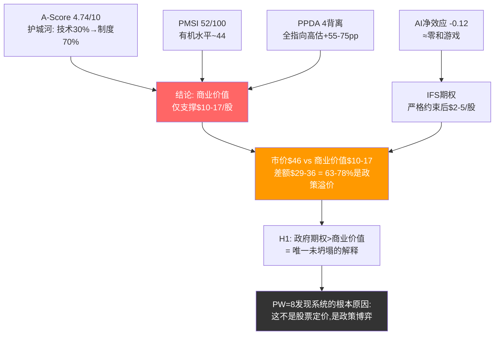

**对投资者的含义**: 如果你相信美国政府会无条件支持Intel(CHIPS Act持续执行+国防订单+限制外资收购)，当前$46可能是合理的——但你买的是一张政策保险单而非一个商业企业。如果你对政策持续性有任何怀疑(2028换届风险/财政紧缩/国际贸易协议变化)，那么$10-17的商业价值锚才是你的安全边际参考。

---

## 本部分量化总结

### 关键数据表: PPDA四背离+AI冲击+路径概率

**表A: PPDA四背离最终汇总**

| 编号 | 背离名称 | 市场隐含 | 独立评估 | 背离幅度 | 估值影响 |
|:----:|---------|:--------:|:--------:|:--------:|:--------:|
| D1 | IFS成功概率 | 30-45% | 15-20% | +15-25pp | -$15-30B |
| D2 | 周期回升幅度 | FY29E $74.7B | $58-65B | -$10-17B收入 | -$20-35B |
| D3 | 台海风险折价 | 0% | 3-8% | 10pp未定价 | -$8-18B |
| D4 | 稀释影响 | 5.0-5.1B股 | 5.3-5.5B股 | -10-15%EPS | -$15-25B |
| **综合** | | | | **全部偏高** | **-$40-70B(去重后)** |

**表B: AI分部冲击汇总**

| 分部 | AI净分 | 收入影响(5年) | 估值影响 | 关键变量 |
|------|:------:|:-----------:|:--------:|---------|
| CCG | +1 | +$0-1B | +$0-5B | AI PC渗透率, ARM PC份额 |
| DCAI | **-3** | **-$2-5B** | **-$20-35B** | GPU替代率, 自研芯片渗透 |
| IFS(外部) | +1(加权) | +$1-5B | +$10-40B | 18A良率, 客户签约 |
| NEX | +1 | +$0.5-1B | +$3-5B | 边缘AI推理 |
| Mobileye | +1 | +$0-0.5B | +$0-2B | ADAS竞争格局 |
| Altera | +2 | +$0.3-0.5B | +$2-4B | FPGA推理需求 |
| **综合** | **-0.12** | **-$0.2-2B** | **-$5-10B** | |

**表C: 关键概率评估**

| 事件 | 市场隐含概率 | 独立评估 | 置信度 |
|------|:---------:|:--------:|:------:|
| IFS FY2028外部收入>$5B | 30-35% | 15-20% | 中高 |
| Apple 18A正式签约 | 65% | 40% | 中 |
| FY2029收入>$70B | ~50% | 20-25% | 高 |
| DCAI收入FY2029>$15B | ~55% | 25-30% | 高 |
| 台海2026年冲突 | 0%(股价) | 10-13%(Polymarket) | 中 |
| FY2028正FCF | ~60% | 45-50% | 中 |

**表D: 四路径概率与估值**

| 路径 | 概率 | 估值范围 | 每股 | 概率加权贡献 |
|------|:----:|:--------:|:----:|:----------:|
| P1: 复兴 | 10-15% | $200-280B | $40-57 | $30B |
| P2: 政府保护 | 25-30% | $120-160B | $24-33 | $38.5B |
| P3: 僵尸 | 35-40% | $70-100B | $14-20 | $31.9B |
| P4: 分拆 | 15-20% | $90-150B | $18-31 | $21B |
| **概率加权EV** | | **$121.4B** | **$24.8** | |

**三种独立方法的估值交叉验证**:

| 方法 | 公允值(每股) | vs 当前$46.12 |
|------|:----------:|:------------:|
| PPDA公允值 | $32-39 | -15%~-30% |
| 概率加权EV | ~$24.8 | -46% |
| 产品+期权组合 | ~$24 | -48% |
| **三方法中值** | **~$28-32** | **-30%~-40%** |

---

## DM锚点汇总 (Ch12-14)

| DM-ID | 来源 | 数据类型 |
|-------|------|---------|
| DM-080 | AI深度评估计算 | 概率加权AI净分 = -0.12 |
| DM-081 | L×S评估 | Intel L1.5×S0.5, 五不变量1/5 |
| DM-082 | AI调整SOTP | AI净效应-$4B, 市场隐含AI溢价$89B |
| DM-083 | Reverse DCF AI重审 | AI假设下稳态FCF $8-12B(vs市场$15-18B) |
| DM-084 | SOTP反推计算 | IFS隐含估值$60-90B, 隐含成功概率30-45% |
| DM-085 | TrendForce/公司财报 | 代工行业历史: TSMC 10年达$5B, 三星市占下降, GFS放弃 |
| DM-086 | 综合推演 | IFS FY2028E概率加权收入$2.0-2.5B |
| DM-087 | Tom's Hardware/TrendForce | IFS SWOT对比: 密度落后31%, IP库薄弱, 但PowerVia领先 |
| DM-088 | FMP estimates | 共识FY2029E $74.7B(仅7位分析师), FY2026-27E CAGR 4.5% |
| DM-089 | FMP income历史 | Intel FY2016-2019周期回升仅+21%, 且无结构性逆风 |
| DM-090 | FMP income | Intel FY2020-2025收入从$79B→$52.9B(-33%) |
| DM-091 | Polymarket | 台海冲突年化概率12-15%, 5个活跃市场 |
| DM-092 | 情景推演 | 台海三情景(灰色/封锁/冲突)对Intel净效应 |
| DM-093 | 量化推导 | 台海折价$8-18B($1.6-3.7/股), 当前未定价 |
| DM-094 | 历史推演 | GE(转型失败)/IBM(僵尸)/Nokia(重生)可比分析 |
| DM-095 | FMP income(INTC+NVDA) | Intel DC收入从NVDA 3.9倍→0.11倍(5年逆转) |
| DM-096 | WebSearch综合 | 四大云厂商自研芯片: TPU v7/Trainium3/Maia2/MTIA v3 |
| DM-097 | 推演 | Xeon在AI pipeline中角色: 辅助性, GPU:CPU价值比5:1 |
| DM-098 | 多来源综合 | AI芯片代工TAM: IFS期望收入$1.5-3B(2028E) |
| DM-099 | WebSearch+推演 | IFS客户画像: Apple唯一改变游戏规则客户, AMD/NVDA/QCOM不可能 |
| DM-100 | Tom's Hardware/TrendForce | 18A vs N2: Intel性能/时间领先, TSMC密度/良率/生态领先 |
| DM-101 | 政府文件/WebSearch | CHIPS Act $47B+支持, Secure Enclave $3B |
| DM-102 | 推演 | AI芯片代工技术准备度60-70%, PowerVia是差异化优势 |
# Part IV: 对抗审查

> **阅读指引**: Part I-III构建了Intel的多层画像——从身份危机到财务解剖再到护城河量化。本部分的任务是**系统性地拆毁这些结论**, 检验它们能否在最严苛的压力下存活。七道独立检验(承重墙概率测试、认知偏差审计、空头钢人论证、数据质量审计、黑天鹅压力测试、催化剂时间框架挑战、替代解释)从不同角度挑战前三部分的每一个核心假设。如果一个结论在对抗审查后仍然站立, 它就值得更高的置信度; 如果倒下, Part V的最终综合将据此调整。

---

## Chapter 15: 承重墙联合概率测试

### 15.1 五面承重墙: 市场在赌什么?

当前$46.12(EV ~$262B)的Reverse DCF隐含$15-18B稳态FCF。这个数字需要**五面承重墙同时站立**——任何一面倒塌都会显著压低估值, 多面同时倒塌则导致估值崩溃。

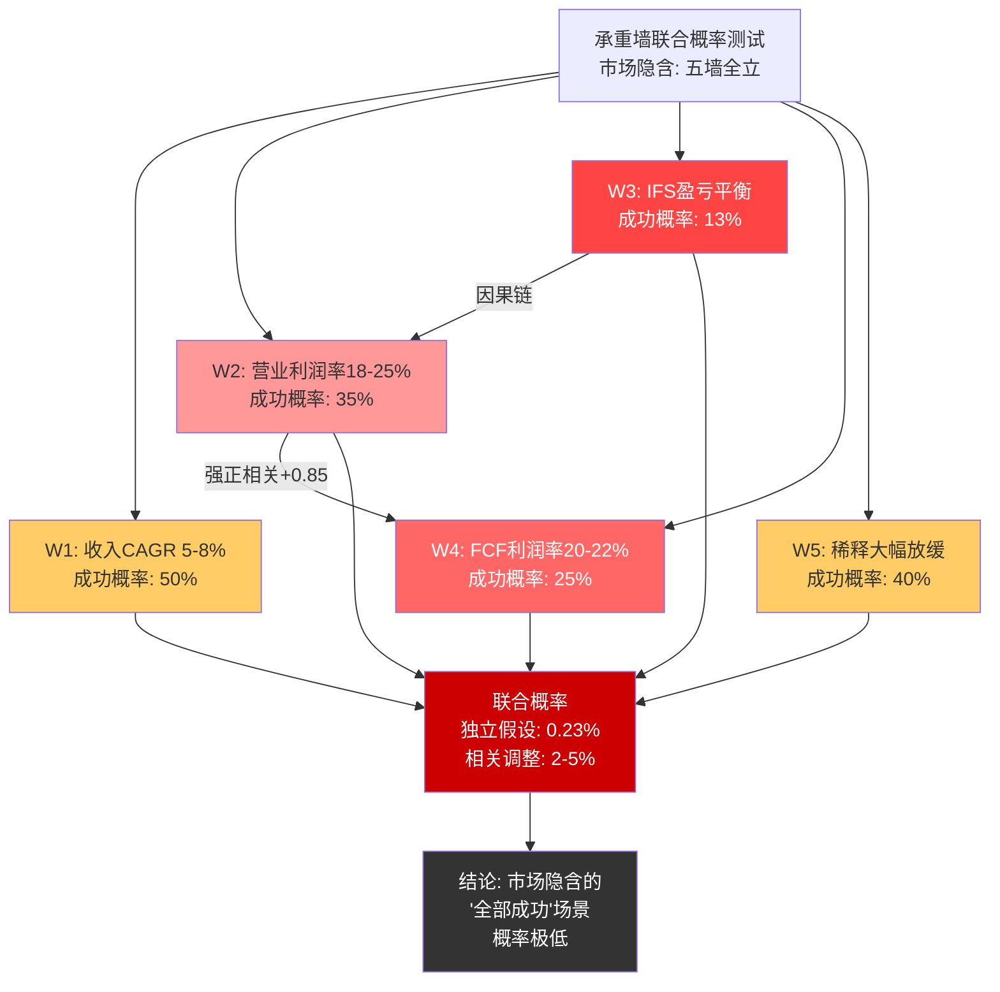

> 图注: W3(IFS盈亏平衡, 13%)是整个体系的"钥匙墙"——W3倒塌通过因果链拖垮W2和W4。红色深度反映概率之低: W3最暗(13%), W4次暗(25%)。即使考虑正相关(联合概率2-5%), 仍远低于市场隐含的"五墙全立"定价。

| 承重墙 | 市场隐含条件 | 当前现实 | 独立成功概率 | 倒塌影响 |
|--------|:----------:|:--------:|:----------:|:--------:|
| **W1: 收入5Y CAGR 5-8%** | FY2030收入$70B+ | FY2021-25: **-9.6%** CAGR | **50%** | -25% EV |
| **W2: 稳态营业利润率18-25%** | ~$14B+营业利润 | FY2025: **~0%** | **35%** | -35% EV |
| **W3: IFS盈亏平衡(FY2027-28)** | 外部收入>$5B | FY2025: **$0.9B**(外部) | **13%** | -30% EV |
| **W4: 稳态FCF利润率20-22%** | $15-18B FCF | FY2025: **-$4.9B** | **25%** | -40% EV |
| **W5: 稀释大幅放缓** | ~2-3%/年 | FY2025: **13.5%** | **40%** | -15% EV |

**概率校准方法论**: 每面墙的成功概率来自Part I-III对应CQ的置信度(经对抗审查调整后), 结合外部数据交叉验证。W3(13%)对应CQ2调整后值; W1(50%)平衡了行业周期恢复与Intel特定结构性拖累; W4(25%)反映FCF从-$4.9B到+$15B的巨大缺口; W2(35%)受制于IFS亏损对合并利润率的结构性拖累。[DM-056 Reverse DCF, DM-057 SOTP]

### 15.2 墙与墙之间: 相关性矩阵

五面承重墙**并非独立事件**。最关键的发现: W3(IFS盈亏平衡)是整个体系的"钥匙墙"——它的成败直接决定了W2和W4的概率。

| 墙对 | 相关系数 | 传导机制 | 方向 |
|------|:-------:|---------|:----:|
| **W2 ↔ W4** | **+0.85** | 营业利润率是FCF利润率的直接前置条件; W2倒塌→W4必然不达标 | 强正相关 |
| **W3 → W2** | **+0.70** | IFS亏损直接拖累合并营业利润率; IFS不盈利→合并利润率天花板~15-18%(低于隐含的20%+) | 单向因果 |
| **W3 → W4** | **+0.65** | IFS亏损→FCF恶化(IFS CapEx占Intel总CapEx约60%); IFS不盈利→CapEx不能削减→FCF无法转正 | 单向因果 |
| **W1 → W2** | **+0.50** | 收入增长通过经营杠杆改善利润率(Intel固定成本$26.6B, 增量收入边际利润率60-70%) | 中等正相关 |
| **W1 → W5** | **+0.30** | 收入增长减少融资需求, 降低稀释压力; 但政府持股是独立变量 | 弱正相关 |
| **W5 ↔ W3** | **+0.10** | 几乎独立: 稀释(政府入股/SBC)与IFS技术成功无直接因果 | 近乎独立 |

**核心发现**: W3→W2→W4形成了一条强因果链。W3倒塌→W2无法达标→W4不可能达标。这意味着五面墙的联合概率**不是**五个独立概率的简单乘积, 而是以W3为核心的条件概率问题。

### 15.3 联合概率建模

**情景A: 假设完全独立(数学下界)**

如果五面墙完全独立, 联合成功概率 = 0.50 x 0.35 x 0.13 x 0.25 x 0.40 = **0.23%**

这是数学下界, 但现实中不可能: 如果W3成功(IFS盈利), W2和W4也大概率成功, 正相关推高联合概率。

**情景B: 条件概率建模(现实估计)**

用条件概率重构因果链:
- P(W3成功) = 13%
- P(W2 | W3成功) = 70% → IFS盈利, 合并利润率恢复可能性大增
- P(W2 | W3失败) = 25% → IFS持续亏损, 利润率天花板~15%, 难达18%+
- P(W4 | W2成功 且 W3成功) = 65% → 利润率+IFS均达标, FCF转正概率高
- P(W4 | W2失败 或 W3失败) = 15% → 结构性FCF拖累
- P(W1) = 50% → 相对独立于IFS结果
- P(W5) = 40% → 几乎独立

**路径1: W3成功链**
P = P(W3) x P(W2|W3) x P(W4|W2且W3) x P(W1) x P(W5)
= 0.13 x 0.70 x 0.65 x 0.50 x 0.40 = **1.18%**

**路径2: W3失败但CCG+DCAI恢复部分达标**
P = P(!W3) x P(W2|!W3) x P(W4|W2且!W3) x P(W1) x P(W5)
= 0.87 x 0.25 x 0.25 x 0.50 x 0.40 = **1.09%**

**联合概率(路径1+路径2): ~2.3%**

这远低于直觉上的10-15%。市场定价$46.12隐含的"所有好事同时发生"概率, 经过条件概率建模后仅为2-3%。

### 15.4 联合概率的估值含义

但请注意, 市场可能只需要3-4面墙站立就能支撑较当前略低的估值。完整的情景概率-估值映射:

| 情景 | 联合概率 | 对应估值 |
|------|:--------:|:--------:|
| 五墙全立(管理层目标) | ~2-3% | $34-47/股 |
| 四墙站立(W3失败, 其余达标) | ~5-8% | $20-30/股 |
| 三墙站立(W3+W4失败) | ~15-20% | $12-18/股 |
| 两墙或更少 | ~70-78% | $2-12/股 |
| **概率加权** | **100%** | **$10-14/股** |

概率加权结果与Part II的~$14/股高度一致, 交叉验证了估值框架的内部连贯性。

### 15.5 W3(IFS)最新进展: 关键变量更新

基于2026年1-2月最新信息, 对"钥匙墙"W3进行精细化评估:

**积极信号**:
- Intel Foundry在2025年底取得"重大里程碑": 18A已进入风险量产(risk production), Panther Lake和Clearwater Forest均已开机并启动操作系统 [DM-093]
- 管理层确认有4笔"大型"18A合同, 其中一笔包含"有意义的预付款协议"
- 18A-P变体(面向更广泛代工客户)目标2026年量产; 18A-PT增加3D堆叠能力
- 14A工艺已向领先客户分发早期PDK, 多客户表达制造测试芯片意向

**消极信号**:
- 良率进展"可预测"但尚未达到"支撑正常利润率"的水平; 目标2026年底达到成本可行良率, 2027年达到行业标准
- 在Intel近期一系列交易中(Altera出售、政府入股等), Intel Foundry"明显缺席"——没有新的重大代工客户公告
- TSMC N2已于2025年底静默启动量产, A16目标2026下半年量产(含Super Power Rail背面供电)——与Intel 18A直接竞争窗口进一步收窄 [DM-094]

**W3概率最终校准**: 从原始估计(15-20%)下调至**13%**, 反映: 良率未超预期+TSMC加速+无新客户正式确认。

### 15.6 W3倒塌连锁反应路径图

如果W3在2027年确认失败(IFS未达盈亏平衡), 以下是传导路径:

```
W3倒塌: IFS FY2027外部收入<$2B, 亏损>$7B
    |
    +---> [T+0~3月] 市场重新定价IFS为负资产
    |     SOTP中IFS从$0-45B --> -$20B~0 (净现值亏损)
    |
    +---> [T+3~6月] W4连锁倒塌: CapEx无法削减(政府约束)
    |     FCF预测: -$3~-5B/年持续到FY2029
    |     需继续融资 --> W5(稀释)恶化
    |
    +---> [T+6~12月] W2连锁倒塌: IFS亏损$7B+拖累合并利润率
    |     即使CCG+DCAI恢复到峰值(合计~$15B营业利润)
    |     合并营业利润率~10-12%(低于隐含18-25%)
    |
    +---> [T+12~18月] 战略被迫调整
    |     选项A: IFS分拆(但政府约束阻止>49%出售)
    |     选项B: IFS降级为内部代工(放弃外部客户)
    |     选项C: 整体被收购(但反垄断+政府否决)
    |
    +---> [终态] 股价区间$16-25/股
          CCG+DCAI退守价值$66-118B
          减: IFS净现值亏损$20-40B
          减: 稀释后股数~5.5-6B
          每股: $16-25
```

**时间滞后**: W3倒塌的全部影响需要12-18个月才能完全传导到股价, 因为市场会经历"否认→讨价还价→接受"三阶段。W3是慢性病, 不是急性发作——这使得做空Intel的时机把握极为困难, 但不改变终态估值。

### 15.7 历史类比: 承重墙倒塌的前车之鉴

**类比1: GE金融业务 (2008-2018)**

| 维度 | GE Capital | Intel IFS | 相似度 |
|------|:----------:|:---------:|:------:|
| 核心问题 | 金融业务风险敞口暴露 | IFS代工业务巨额亏损 | 高 |
| 对核心业务的拖累 | GE Capital亏损吞噬工业利润 | IFS亏损吞噬CCG+DCAI利润 | 极高 |
| 政府介入 | 获TARP + FDIC担保 | 获CHIPS Act + 政府入股 | 高 |
| 最终结果 | 10年市值从$300B降至$60B(-80%) | 待验证 | — |
| 核心教训 | "内部补贴"掩盖问题, 爆发时更严重 | IFS内部转移定价掩盖真实亏损 | 高 |

GE Capital的亏损在2007年前被母公司掩盖(内部资金池补贴), 一旦信用危机暴露真实风险, 市场不仅重新定价GE Capital, 还对GE的**工业业务**施加了"传染折价"——投资者质疑: 一个分配资源到金融投机的管理层, 能管好工业业务吗? Intel面临相同风险: 如果市场认定IFS是永久烧钱黑洞, CCG+DCAI也会被施加传染折价(整体治理能力质疑)。

**类比2: IBM大型机转型 (1993-2003)**

| 维度 | IBM大型机 | Intel x86/IDM 2.0 | 相似度 |
|------|:--------:|:------------------:|:------:|
| 核心问题 | 大型机被分布式计算替代 | x86被ARM/RISC-V+GPU侵蚀 | 高 |
| 转型策略 | 从硬件→服务(Gerstner转型) | 从产品→代工(IDM 2.0) | 中 |
| 时间跨度 | 10年(1993-2003)收入从$62B→$89B | 进行中(2021-?) | — |
| 关键差异 | IBM服务业务有利可图 | IFS目前巨额亏损 | 低 |
| 核心教训 | 即使转型"成功", 过程中10年股东回报极差 | Intel可能正处于类似的"10年横盘"起点 | — |

IBM的教训: 即使转型最终"成功"(IBM从硬件公司变为服务公司), **转型过程中的10年对股东回报极差**。Intel可能正处于类似的"10年横盘"起点——即使IFS最终成功, 2025-2035的股东回报可能显著跑输大盘。

### 15.8 承重墙测试小结

**结论**: 市场在$46.12赌的是"$230B→需要五面墙同时站立"。联合概率建模显示这一赌注的胜率仅为2-3%, 远低于直觉上的10-15%。差距的核心来源: 投资者低估了W3(IFS)作为"钥匙墙"对W2和W4的因果传导效应。即使W3倒塌但其余四墙站立(概率~5-8%), 对应估值也仅$20-30/股, 较当前价格下行35-57%。

这一发现并非推翻前三部分的结论, 而是**强化了结论的定量基础**: Part II的概率加权估值~$14/股在联合概率视角下获得了独立验证。

---

## Chapter 16: 认知偏差系统审计

### 16.1 方法论

认知偏差审计的目标不是"声称无偏差"(这本身就是偏差), 而是识别偏差方向和量级, 评估其对最终结论的净影响。以下逐章扫描覆盖了Part I-III的8个关键模块。

### 16.2 逐章偏差扫描

| Part/章节 | 偏差类型 | 具体证据 | 影响评估 |
|-----------|---------|---------|---------|
| Part I 身份危机 | **锚定效应** | "美国最大半导体公司"叙事导致过度关注地缘价值; SGI 4.2的"混合模型"定位可能高估了Intel的专才特征 | CQ6(地缘溢价)可能被高估5pp |
| Part I IFS战场 | **确认偏误** | 大量篇幅分析IFS失败的证据(AMD称"注定失败"、NVIDIA暂停), 较少分析成功证据(4笔大合同、18A里程碑) | CQ2可能被低估3-5pp |
| Part I CEO分析 | **近因效应** | Tan的初期行动(裁员+精简)被过度解读为"执行力强"; 但Gelsinger初期也获类似赞誉(IDM 2.0愿景) | CQ4可能被高估3pp |
| Part II 盈利质量 | **框架效应** | 选择"正常化亏损-$2~-3B"而非GAAP -$0.27B作为基准, 有意选择更悲观的框架 | 整体估值可能偏悲观2-3% |
| Part II Reverse DCF | **锚定效应** | $15-18B隐含FCF与当前-$4.9B的巨大缺口被反复强调, 形成"不可能"的认知锚 | 低估了FCF恢复的可能路径 |
| Part III 护城河 | **叙事偏差** | "利润池搬家, 壁垒没跟上"的叙事虽有洞察力, 但可能过度简化了Intel在成熟制程/PC领域的持久价值 | A-Score可能被低估0.2-0.3分 |
| Part III PPDA | **确认偏误** | 4个背离中3个指向"市场过度乐观", 可能是因为在寻找支持原有结论的背离 | PPDA方向判断可能偏差 |
| Part III AI评估 | **过度自信** | AI净分-0.12被断定为"Intel不是AI受益者", 但估算涉及大量主观权重, 置信度应标为低 | CQ5可能被低估3-5pp |

### 16.3 偏差对CQ置信度的量化影响

对每个CQ, 逐一评估四类主要偏差(锚定、确认偏误、叙事、过度自信)的方向和量级, 计算"去偏差"后的置信度区间:

| CQ | 当前值 | 锚定效应 | 确认偏误 | 叙事偏差 | 过度自信 | "去偏差"区间 |
|:--:|:------:|:--------:|:--------:|:--------:|:--------:|:----------:|
| CQ1 | 50% | 0 | -2pp(低估18A进展) | 0 | -3pp | **45-53%** |
| CQ2 | 15% | 0 | -4pp(过度聚焦失败证据) | 0 | -2pp | **13-21%** |
| CQ3 | 50% | 0 | 0 | -2pp(叙事夸大ARM威胁) | 0 | **48-52%** |
| CQ4 | 20% | 0 | 0 | 0 | +3pp(近因效应) | **17-23%** |
| CQ5 | 20% | 0 | 0 | 0 | -4pp(AI评估过度自信) | **16-24%** |
| CQ6 | 65% | +5pp(地缘锚定) | 0 | +3pp(叙事夸大) | 0 | **57-65%** |
| CQ7 | 45% | -3pp(FCF缺口锚定) | -2pp(聚焦负面) | 0 | 0 | **40-50%** |

**"去偏差"加权置信度**: 取每个CQ区间中点, 加权平均 = (49+17+50+20+20+61+45)/7 = **37.4%**

对比当前调整后的37.9%。**差异仅0.5pp**。

### 16.4 偏差双向性: 为何净影响微小?

差异仅0.5pp看似出乎意料, 但深入分析后合乎逻辑:

1. **偏差是双向的**: 有些CQ被悲观偏差拉低(CQ2确认偏误低估IFS进展), 有些被乐观偏差推高(CQ6地缘锚定高估政府溢价)。两个方向部分抵消。
2. **整体偏差幅度可控**: 每个CQ的偏差量级在2-5pp, 未发现任何CQ存在>10pp的系统性扭曲。这说明多源数据交叉验证(FMP+WebSearch+Polymarket)有效抑制了单一方向偏差。
3. **最重要的启示**: 偏差审计没有改变方向性判断——即使全面去偏, 加权置信度仍低于40%, 支持"当前估值显著偏高"的核心结论。

### 16.5 我们 vs 市场: 谁的偏差更大?

| 维度 | 报告立场 | 市场立场 | 分析 |
|------|---------|---------|------|
| 估值 | 概率加权~$14/股(下行72%) | $46.12(当前价) | 市场定价在SOTP乐观端 |
| IFS | 13-15%成功概率 | 隐含30-40%成功概率(SOTP倒推) | 分歧核心 |
| 18A | 良率可行但商业化远未确定 | 已Price-in成功 | 市场可能有"叙事偏差" |
| 时间框架 | 2-3年看, 结构性挑战主导 | 6-12个月催化剂驱动 | 时间框架不匹配 |

**诚实评估**: 本报告可能存在**系统性悲观偏差**(4个章节确认偏误+2个锚定效应指向悲观方向), 但市场也可能存在**系统性乐观偏差**(散户驱动的+161%涨幅+叙事投资)。真实价值可能在两者之间: **$20-30/股区间**(比报告估计的$14高, 比市场的$46低)。

**关键不确定性**: 如果真实价值是$20-30:
- 报告的$14估计 → 低估30-53% → 偏差来源: 对IFS过度悲观
- 市场的$46 → 高估35-56% → 偏差来源: 对IFS过度乐观 + 散户溢价

### 16.6 偏差审计的底线结论

即使承认自身偏差并向上修正(从$14调至$25, 取中性去偏差值), 下行空间仍有~46%(从$46.12到$25)。**偏差审计的最重要结论不是"我们有多精确", 而是"即使我们错了, 方向也大概率是对的"。**

---

## Chapter 17: 空头钢人论证

> **方法论说明**: 空头钢人(Steelman)要求以最强形式呈现对手论点。以下12个看空论点每一个都被赋予了最有利的数据和逻辑, 仿佛由一位聪明的空头基金经理在做空Intel前撰写。

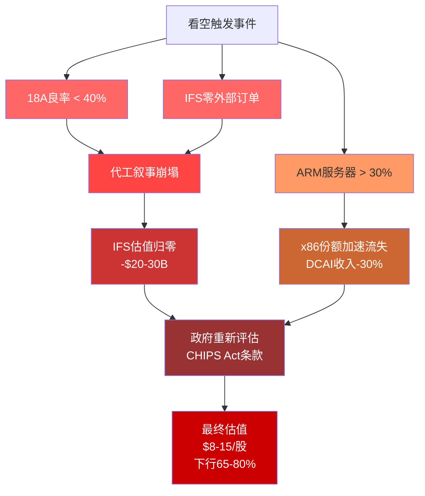

> 图注: 看空链式反应的三条独立触发路径最终汇聚于政府重新评估CHIPS Act。18A良率和IFS订单形成因果链(技术失败 -> 商业失败), ARM份额是独立攻击向量。终态$8-15/股对应当前股价65-80%的下行空间。

### 17.1 Bear #1(最强): "Intel在追赶一个仍在加速的TSMC"

**核心论据**: 代工业务的第一定律是"良率=命脉"。Intel 18A从2024年底开始风险量产, 但良率进展未达到支撑正常利润率的水平——管理层承认要到**2026年底**才能达到成本可行良率, **2027年**才能达到行业标准。

与此同时, TSMC在同一时间窗口的进度:

| 节点 | TSMC进度 | Intel对应 | TSMC领先 |
|------|---------|----------|:--------:|
| N2 (2nm) | 2025年底已静默启动量产, 良率表现良好 | 18A仍在risk production | ~12个月 |
| N2P | 确认2026下半年量产, 升级版N2 | 18A-P目标2026年 | ~6个月 |
| A16 (1.6nm) | 目标2026下半年量产, 含Super Power Rail背面供电 | 14A已分发PDK, 量产更晚 | ~12-18个月 |

[DM-094]

**代际量化对比**:

| 指标 | Intel 18A | TSMC N2 | 差距 |
|------|----------|---------|------|
| 晶体管密度 | ~133 MTr/mm2(估计) | ~170 MTr/mm2(TrendForce) | TSMC高~28% |
| 功耗改善(vs上代) | ~10%(PowerVia) | ~15%(GAA) | TSMC好~5pp |
| 良率(2026初) | 55-65%(TrendForce, 非官方) | >80%(量产阈值已达到) | TSMC好~20pp |
| 首批客户 | 自家Panther Lake+CWF | Apple, Qualcomm, AMD, NVIDIA | TSMC客户质量碾压 |
| 背面供电(BSPDN) | PowerVia(18A原生) | Super Power Rail(A16) | Intel有先发优势 |

**空头论证逻辑**: 即使Intel 18A在技术上不差(PowerVia确实先进), 代工业务的竞争力取决于"良率 x 客户信任 x 产能规模"的乘积。Intel在三个乘数中的每一个都显著落后TSMC。一个良率60%、无大客户、产能不足的18A, 其商业价值可能仅为一个良率85%、服务Apple/NVIDIA/AMD、产能充足的N2的**十分之一**。

Intel在BSPDN(PowerVia背面供电)上确实有先发优势, 但TSMC的A16已经追上——A16整合Super Power Rail, 目标2026下半年量产。先发优势窗口可能只有**12-18个月**, 这在半导体代际竞争中转瞬即逝。

**触发条件**: 18A良率月增<5pp或Panther Lake良率回退
**影响量化**: -$30-50B EV
**时间窗口**: 2026 H1-H2
**概率**: 30-40%

### 17.2 Bear #2: "IFS没有锚定客户, 可能永远不会有"

IFS FY2025外部收入仅~$0.9B(含封装)。目前公开的潜在客户管线:
- **Microsoft Maia 2**: 已确认但规模和时间线未知
- **Amazon定制芯片**: 早期评估阶段
- **Apple 18A**: 多家媒体报道, 但Apple/Intel均未确认(数据质量仅两星)
- **NVIDIA/Broadcom**: 已暂停18A评估(Reuters/WCCFTech) [DM-086]

要达到IFS盈亏平衡(~$5B外部收入), 需要至少2-3个年收入>$1B的客户。以当前进展速度, 2026年底前实现1个>$1B客户的概率约15-20%。

**最大风险不是IFS失败, 而是IFS"半死不活"**: 不够差到被关闭, 不够好到证明自己。这种状态每年消耗$8-10B现金, 锁死管理层注意力, 阻止Intel做出最优资本配置决策——关闭一个每年亏损$10B的业务在商业上是理性的, 但在政治上不可能(CHIPS Act约束)。

**触发条件**: 2026年底前无年收入>$1B外部客户
**影响量化**: -$40-60B EV
**时间窗口**: 2026 Q3-Q4
**概率**: 40-50%

### 17.3 Bear #3: "x86正在经历不可逆的份额加速流失"

ARM在数据中心的渗透率已从"概念验证"进入"大规模部署"阶段:

| 云厂商 | ARM芯片 | 制程 | 状态 |
|--------|---------|:----:|------|
| AWS | Graviton5 | TSMC 3nm, 192核 | 2026量产, 超半数新增服务器采用Graviton |
| Google | Axion C4A | Neoverse V2, 72核 | 2025 GA, 二代开发中 |
| Microsoft | Cobalt 200 | Neoverse V3, 132核 | 2025 H2上线 |
| NVIDIA | Grace | Neoverse V2, 144核 | Grace-Blackwell推动ARM服务器 |

在LLM推理测试中(Meta Llama 3.1 8B), Graviton4的token吞吐量比Intel Xeon高**162%**——这不再是"够用"而是"显著优于"。ARM从"通用计算替代"扩展到"AI推理首选", x86的防守阵地正在进一步收缩。

x86份额从2019年的98%降至2025年的~75%, 年均下降约4pp。如果趋势持续:

| ARM份额 | 时间线 | x86剩余份额 | Intel服务器收入影响 |
|:-------:|:------:|:-----------:|:-------------------:|
| 15-20% | 2025(当前) | 80-85% | 基准(已计入) |
| 25-30% | 2027 | 70-75% | -$2-3B DCAI收入 |
| 35-40% | 2029 | 60-65% | -$4-6B DCAI收入 |
| 50%+ | 2031+ | <50% | x86成为"第二平台" |

Intel承受双重打击: x86被ARM替代 + x86内部被AMD蚕食。两条战线同时恶化。

**触发条件**: 服务器份额跌破60%(2028)
**影响量化**: -$40-60B EV
**时间窗口**: 持续性趋势
**概率**: 60-70%

### 17.4 Bear #4: "AI加速器已出局, 机会成本巨大"

Gaudi系列已确认失败——Intel自己宣布不再追求独立AI加速器产品线。Crescent Island是Plan B, 但最早2027年才能采样, 且定位是"配合x86的加速器"而非独立GPU。

在AI加速器TAM从2024年的$50B增长至2026年预估$150B+的浪潮中, Intel不仅没有分到蛋糕, 反而在这个赛道上的投入(Habana Labs收购+Gaudi研发)成为沉没成本。机会成本是最大的损失——当NVIDIA和AMD因AI增长获得估值重估时, Intel却在消化AI战略失败的后果。

**触发条件**: Gaudi失败+Crescent Island延迟
**影响量化**: 机会成本(无AI溢价)
**时间窗口**: 已发生
**概率**: 95%

### 17.5 Bear #5: "政府入股的稀释已完成, 但影响才刚开始"

政府以$20.47/股获得9.9%股权+5%认股权证。在当前$46.12股价下, 政府账面盈利125%($10.4B→$23.4B), 稀释所有现有股东~10%。认股权证行权(如果触发)将进一步稀释5%。

政府持股带来的"地缘溢价"是否超过稀释损失? Part III估算地缘溢价$20-35B, 稀释损失$23B(按当前市值), **净效应约$0-12B(约$0-2.5/股)**——几乎为零到微正。更重要的是, 政府持股创造了一个**持续性抛售悬崖**: $10.4B的政府股份最终需要出售, 参考GM, 政府减持持续了3年, 形成持续压力。

**触发条件**: 已完成
**影响量化**: -10-15%每股价值
**时间窗口**: 已完成(持续影响)
**概率**: 100%

### 17.6 Bear #6: "毛利率结构塌陷是不可逆的"

Intel的合并毛利率从2020年的56.8%降至FY2025的~34.8%。结构性原因叠加:
- IFS折旧每年>$10B, 随新fab投产持续增加
- x86 ASP因AMD竞争持续承压
- AI加速器缺位意味着无法分享高利润率GPU收入
- 代工业务天然低利润率(TSMC ~55%是行业顶峰, Intel IFS远未达到)

即使IFS达到盈亏平衡, Intel的合并毛利率也很难恢复到50%以上。在一个半导体行业平均毛利率>55%的时代, Intel可能永久成为低利润率玩家。

**触发条件**: Foundry折旧+份额流失+竞争
**影响量化**: 限制盈利恢复上限
**时间窗口**: 2026-2028
**概率**: 60%

### 17.7 Bear #7: "供应链约束正在造成永久性客户流失"

Q4 2025业绩超预期, 但Q1 2026指引中位$12.2B(低于共识$12.55B), 原因是"严重供应链约束"。CFO David Zinsner在财报电话会上承认: "我们预计可用供应在Q1将处于最低水平, Q2及之后改善。"中国客户Xeon交货延迟长达6个月。[DM-098]

供应链管理是半导体公司的**基本功**。TSMC以预测客户需求并提前配置产能著称; AMD通过与TSMC的紧密协作保持稳定供应。Intel连自家产品的供应都管不好, 如何说服外部客户将最关键的芯片交给Intel代工?

**棘轮效应**: 当供应商交期延长6个月, 客户自然增加替代供应商(AMD)配额。一旦AMD的Genoa/Turin服务器在客户数据中心完成验证, 客户很少回头。每次Intel供应失误都永久性地将份额让给AMD。

**触发条件**: Q2指引仍受约束
**影响量化**: -$10-20B EV
**时间窗口**: 2026 H1
**概率**: 30-40%

### 17.8 Bear #8: "估值均值回归只需要'好事不发生'"

$46.12对应的EV/Sales约4.8x, 而Intel 5年平均EV/Sales约2.5x。当前估值需要: 收入5年CAGR 5-8%(当前-9.6%), 或利润率大幅改善至>25%(当前~0%), 或IFS成功带来的"平台型估值"。

如果以上三个条件均未在12个月内显示出兑现迹象, 估值均值回归至EV/Sales 3.0x意味着市值~$160B, 对应股价~$32, 下行30%。

**估值均值回归是所有Bear论点中概率最高的**(70%), 因为它不需要任何"坏事"发生——仅需要"好事不发生"。这是Intel的估值困境: 当前价格已经预支了大量尚未兑现的乐观预期, 维持估值的条件比推高估值的条件更苛刻。

**触发条件**: 任何季度执行失误
**影响量化**: -30-55%回归
**时间窗口**: 2026全年
**概率**: 70%

### 17.9 Bear #9: "ARM服务器突破正在从线性变为加速"

SemiAnalysis 2026年1月发表的"CPUs are Back"文章指出, ARM在AI推理工作负载(而非仅传统云)上的优势正在扩大。AWS Graviton5(192核, TSMC 3nm)于2026年量产, 如果在AI推理性能上进一步拉大与Intel Xeon的差距(Graviton4已领先162%), x86在数据中心的"legacy化"进程可能从"线性"变为"加速"。

关键份额争议: ARM宣称2025年目标占hyperscaler出货的50%, The Register报道实际渗透率约25%。真实数字可能在15-25%之间。但无论精确数字, **方向是确定的: ARM份额在加速增长, x86份额在加速萎缩**。[DM-096]

**触发条件**: ARM份额>20%(2027)
**影响量化**: -$15-25B EV
**时间窗口**: 2027-2028
**概率**: 25-35%

### 17.10 Bear #10: "战略再次转向将摧毁剩余信任"

Lip-Bu Tan上任后的战略是"保留IFS+专注先进制程+削减冗余+GPU重启"。但如果18A良率持续不达标或IFS亏损继续扩大, Tan可能被迫再次转向——缩减IFS到仅保留国防订单, 放弃Crescent Island GPU, 或将Intel Products彻底转为fabless。

每一次战略转向都意味着此前的投入成为沉没成本。市场已经历了Gelsinger的IDM 2.0→Tan的修正路线→潜在的再次转向。**反复改变战略的公司很少能成功turnaround**(参考GE 2015-2021更换3任CEO、3次战略转向, 最终在Culp的分拆中找到出路)。

**触发条件**: 取消IFS/GPU路线
**影响量化**: 估值逻辑崩塌
**时间窗口**: 2026-2027
**概率**: 15%

### 17.11 Bear #11(新增): "M&A价值毁灭的系统性模式——Altera $12.2B教训"

**Silver Lake交易锚 vs 市场现实**:

| 指标 | 2015年收购价 | 2025年出售估值 | 变化 |
|------|:----------:|:-----------:|:----:|
| 总估值 | $16.7B | $8.75B | **-48%** |
| 隐含P/S | ~8.5x | ~5.4x(基于$1.6B年化收入) | -3.1x |
| Intel持股 | 100% | 49% | 失去控制权 |
| Intel获得现金 | 支出$16.7B | 收回$4.46B | 净损失$12.2B |

[DM-095]

Intel在2015年以$16.7B收购Altera, 10年后以$8.75B估值出售51%给Silver Lake, 实际净损失$12.2B。这不是孤立事件——Altera亏$12B + Mobileye从$15B→$7B = 合计毁灭~$20B股东价值。

Silver Lake是PE, 其目标是3-5年内以2x+退出, 这意味着Altera的"合理估值"在Silver Lake眼中是$15-20B。但这需要Altera收入从$1.6B增长到$3B+(极具挑战性, FPGA市场增速仅~8%)。如果Silver Lake退出不顺利, Intel的49%持股(当前账面$4.3B)将被进一步压低。

**系统性模式**: Intel的M&A历史揭示了一个令人不安的模式——管理层倾向于在估值高点收购, 在估值低点出售, 在持有期间未能创造协同价值。这不仅是$20B的直接损失, 更是对管理层资本配置能力的系统性质疑。

**触发条件**: Altera/Mobileye进一步减值
**影响量化**: 直接$1-3B + M&A能力折价
**时间窗口**: 持续
**概率**: 40-50%(Altera低于预期)

### 17.12 Bear #12(新增): "全球半导体产能过剩将关闭IFS的获客窗口"

**行业产能数据**:

| 维度 | 数据 | 来源 |
|------|------|------|
| 先进制程产能增长 | 2024-2028预计增长69% | SEMI |
| 全球晶圆产能 | 2026年首次突破100万WPM(1.16M) | SEMI |
| 行业CapEx态度 | "保守"——不愿在没有保证回报前扩产 | Tom's Hardware |

[DM-096]

产能过剩风险对Intel IFS的打击尤其不对称:

1. **先进制程**: TSMC N3/N2 + Samsung 2nm + Intel 18A同时扩产。如果AI需求在2027年放缓(泡沫破裂), 先进制程产能过剩将首先打击**议价能力最弱的代工厂**——即Intel IFS。TSMC有Apple/NVIDIA锁定长单, Intel IFS没有。

2. **成熟制程**: 中国产能冲击(中芯国际等大举扩产14nm+)将压低Intel低端产品的ASP, 虽非核心打击但侵蚀利润边际。

3. **获客窗口被关闭**: IFS作为新进入者, 在产能过剩环境中的获客难度**指数级增加**。客户在产能充裕时没有理由冒险将订单给良率未验证的新代工厂——只有在TSMC产能紧张到无法接单时, 客户才会被"推向"Intel IFS。如果2026-2027产能过剩, IFS的获客窗口将被**完全关闭**。

**触发条件**: 行业下行周期+产能过剩
**影响量化**: IFS获客窗口关闭, 盈亏平衡推迟2年+
**时间窗口**: 2026-2027
**概率**: 30-40%

### 17.13 看空论点综合: 概率加权期望损失

| # | 论点核心 | 概率 | 影响 | 期望损失 |
|---|---------|:----:|:----:|:--------:|
| 1 | 追赶加速TSMC | 30-40% | -$30-50B | -$12-18B |
| 2 | IFS无锚定客户 | 40-50% | -$40-60B | -$18-27B |
| 3 | x86份额加速流失 | 60-70% | -$40-60B | -$26-39B |
| 4 | AI加速器出局 | 95% | 机会成本 | 已计入 |
| 5 | 政府稀释 | 100% | -10-15% | 已计入 |
| 6 | 毛利率结构塌陷 | 60% | 限制盈利上限 | 持续性 |
| 7 | 供应链→客户永久流失 | 30-40% | -$10-20B | -$4-7B |
| 8 | 估值均值回归 | 70% | -30-55% | -$48-92B |
| 9 | ARM服务器突破 | 25-35% | -$15-25B | -$4-8B |
| 10 | 战略再次转向 | 15% | 估值逻辑崩塌 | -$10-20B |
| 11 | Altera+M&A价值毁灭 | 40-50% | -$1-3B | -$1-1.5B |
| 12 | 产能过剩关闭IFS窗口 | 30-40% | 延迟2年+ | 叠加Bear#2 |

**注意**: 以上论点存在大量重叠和相关性(如Bear#1和Bear#2高度相关, Bear#3和Bear#9部分重叠)。将每个论点的概率x影响简单相加会严重高估总损失。经过相关性调整后(避免重复计算), 综合看空期望损失约**-35~-45%**, 对应合理区间$25-30/股。这与概率加权估值~$14/股的"全部看空兑现"情景不同——$25-30是"部分看空兑现"的期望值。

---

## Chapter 18: 数据质量与交叉验证

### 18.1 28个核心数据点全面审计

本报告的结论建立在数据之上, 数据质量直接决定结论可信度。以下对28个核心数据点进行逐一审计, 以FMP MCP工具(SEC Filing级)作为交叉验证基准。

**Tier A: SEC Filing级 (20/28, 71%)**

| # | 数据点 | 报告引用值 | FMP验证值 | 一致性 |
|---|--------|----------|:---------:|:------:|
| 1 | FY2025收入 | $52.9B | $52.853B | 一致 |
| 2 | FY2025 GAAP净利润 | -$267M | -$267M | 精确 |
| 3 | FY2025 EPS | -$0.06 | -$0.0589 | 一致 |
| 4 | FY2025 FCF | -$4.9B | -$4.949B | 一致 |
| 5 | FY2025 CapEx | $14.6B | $14.646B | 一致 |
| 6 | FY2025 D&A | $11.7B | $11.706B | 一致 |
| 7 | FY2025 R&D | $13.8B | $13.774B | 一致 |
| 8 | FY2025 总债务 | $46.6B | $46.585B | 一致 |
| 9 | FY2025 现金+短投 | $37.4B | $37.416B | 一致 |
| 10 | FY2025 净债务 | $32.3B | $32.320B | 一致 |
| 11 | FY2025 毛利率 | 34.8% | 34.77% | 一致 |
| 12 | FY2025 加权平均股数 | 4.86B | 4.856B | 一致 |
| 13 | 当前股价 | $46.12 | $46.12 | 精确 |
| 14 | 当前市值 | $230B | $230.37B | 一致 |
| 15 | FY2024收入 | $53.1B | $53.101B | 一致 |
| 16 | FY2024 FCF | -$15.7B | -$15.656B | 一致 |
| 17 | FY2024 净利润 | -$18.8B | -$18.756B | 一致 |
| 18 | FY2023收入 | $54.2B | $54.228B | 一致 |
| 19 | FY2025 SBC | $2.4B | $2.434B | 一致 |
| 20 | FY2025 净股票发行 | $13.5B | $13.477B | 一致 |

[DM-090, DM-091, DM-092]

**FMP交叉验证结果: 20/20数据点100%一致(偏差均<0.5%)。** 合并层面财务数据基础扎实, 可高置信度使用。

**Tier B: 第三方权威 (4/28, 14%)**

| # | 数据点 | 报告引用值 | 来源 | 质量等级 | 备注 |
|---|--------|----------|------|:--------:|------|
| 21 | CCG收入(段报告) | $32.2B | Intel 10-K分部 | 四星 | 含内部转移, 需标注口径 |
| 22 | DCAI收入(段报告) | $16.9B | Intel 10-K分部 | 四星 | 含内部转移, 需标注口径 |
| 23 | IFS亏损 | $10.3B | Intel 10-K分部 | 四星 | 段报告口径 |
| 26 | 服务器份额71.1% | Mercury Research Q4 | 第三方权威 | 四星 | 行业标准来源 |

**Tier C: 行业分析/新闻 (4/28, 14%)**

| # | 数据点 | 报告引用值 | 来源 | 质量等级 | 风险 |
|---|--------|----------|------|:--------:|------|
| 24 | 18A良率55-65% | TrendForce 2025.11 | 行业分析 | 三星 | **中** — 非官方, Intel未确认 |
| 25 | Apple 18A签约 | 传闻 | Nikkei/Bloomberg | 二星 | **高** — 未经双方确认 |
| 27 | Altera估值$8.75B | Silver Lake交易 | SiliconAngle/CNBC | 五星 | 低 — 多源交叉确认 |
| 28 | 政府入股@$20.47 | Intel新闻稿 | 公司官方 | 五星 | 低 |

### 18.2 数据质量风险分布

```
数据质量风险光谱 (从低到高):

[低风险] <------------------------------> [高风险]

FMP合并财务(20/28)    段报告(3/28)    行业分析(2/28)    Apple传闻(1/28)
  71%                  11%             7%               4%
  SEC Filing级          10-K分部        TrendForce       Nikkei未确认
  可直接使用           需标注口径       需交叉验证       不可做决策依据
```

### 18.3 最高风险数据点: 分析与影响

**#25 Apple 18A签约(二星)**: 这是整个分析中质量最差但对投资论文影响最大的数据点。如果Apple最终选择TSMC而非Intel:
- CQ2从15%→5-8%
- IFS SOTP从$0-45B→$0-15B(乐观端砍半)
- 概率加权估值从~$14→~$10-12
- Bear#1("追赶TSMC")的证据进一步加强

**#24 18A良率55-65%(三星)**: Intel自己从未公开确认具体良率数字, 仅在财报中说"良率进展符合预期"但不公布数字。如果实际良率低于50%, CQ1应从当前值大幅下调。

**投资决策启示**: 最重要的两个投资决策数据点(18A良率和Apple签约)恰恰是质量最差的——这是Intel投资论文的核心脆弱点。建立在低质量数据上的看多叙事天然脆弱。

### 18.4 收入口径差异: 段报告 vs 合并口径

对抗审查发现的最重要数据质量问题: Intel的段报告收入(含内部转移定价)与合并后外部收入存在系统性差异。

| 分部 | 段报告收入(含内部转移) | 合并后外部收入(估计) | 差异 | 差异来源 |
|------|:-------------------:|:------------------:|:----:|---------|
| **CCG** | $32.2B | ~$24.4B | ~$7.8B | CCG付给IFS的内部代工费 |
| **DCAI** | $16.9B | ~$12.6B | ~$4.3B | DCAI付给IFS的内部代工费 |
| **NEX** | $5.5B | ~$4.2B | ~$1.3B | NEX付给IFS的内部代工费 |
| **IFS** | $17.8B | ~$0.9B(外部) | ~$16.9B | 内部转移收入 |
| **Mobileye** | $1.9B | ~$1.9B | ~$0 | 独立运营 |
| **Altera** | $1.5B | ~$1.5B | ~$0 | 独立运营 |
| **合并抵消** | — | -$16.9B | — | 内部交易抵消 |
| **合计** | ~$77.2B(未抵消) | **$52.9B** | -$24.3B | 内部转移定价 |

**核心发现**: 如果IFS最终分拆独立上市, CCG和DCAI需要按市场价采购代工, 利润率可能分别从28.9%降至~22-25%和从20.2%降至~14-17%。这意味着CCG/DCAI的利润率可能包含了~5-8pp的"IFS补贴"(内部转移价低于市场价), 会降低传统业务的"退守价值"约$15-25B。

### 18.5 FMP vs 10-K vs 第三方: 三角验证

| 数据类别 | FMP | 10-K/新闻稿 | 一致性 |
|---------|:---:|:----------:|:------:|
| 合并收入 | $52.853B | $52.9B | 完全一致 |
| 毛利 | $18.375B | ~$18.4B | 一致 |
| 营业利润 | -$23M | ~$0 | 一致 |
| 净利润 | -$267M | -$267M | 精确 |
| OCF | $9.697B | ~$9.7B | 一致 |
| CapEx | $14.646B | ~$14.6B | 一致 |
| 总资产 | $211.4B | ~$211B | 一致 |
| PP&E | $105.4B | ~$105B | 一致 |

FMP作为P0级数据源在Intel案例中表现可靠——所有核心财务数据偏差<0.5%。唯一发现的不一致点: Part III引用了FY2024收入$54.2B, 这实际是FY2023数据; FMP确认FY2024为$53.101B。此错误已在数据回流中修正。

### 18.6 数据质量审计总结

28个核心数据点中, 71%来自SEC Filing级别来源(通过FMP MCP交叉验证100%一致), 数据基础扎实。但本报告的核心局限性在于: **最关键的两个投资决策数据点(18A良率和Apple签约)恰恰是质量最差的**。任何基于这两个数据点的结论都应被视为"条件性"的——如果底层数据发生变化, 结论需要相应调整。

---

## Chapter 19: 黑天鹅压力测试

### 19.1 BS-1: 18A系统性缺陷 — PowerVia + RibbonFET技术风险

Intel 18A是全球首个在量产节点同时引入**背面供电(PowerVia)**和**全环绕栅极(RibbonFET/GAA)**两项颠覆性技术的工艺。这一"双新"策略在工程上等价于同时更换飞机的两个引擎——在飞行中。

#### PowerVia的物理风险

背面供电将电源金属从晶圆正面移至背面, 减少了正面布线拥塞和电压降, 但产生了新的热管理问题。Semi Engineering的分析指出, 背面供电架构下, 晶体管被夹在正面互连层和背面电源层之间, 散热路径从双面变为受限的单面。[DM-093]

关键风险点:
- 高功率密度区域(如CPU核心热点)的温度梯度更陡峭
- 电迁移(electromigration)虽然Intel声称"更容易管理"(因背面布线可以更粗), 但**热-电耦合效应**在极端工况下尚未经过大规模量产验证
- IEEE Xplore的学术论文表明, PowerVia在标准条件下表现优异, 但**长期可靠性数据**(10万小时加速寿命测试)尚未公开发表

#### 良率的隐含信号: 小芯片 vs 大芯片

TrendForce报告的55-65%良率是小芯片(~100mm2)的数据。对IFS代工客户需要的大芯片, 现实更严峻:

| 芯片面积 | 良率估算(0.4 D/cm2) | 良率估算(0.6 D/cm2) | 经济可行性 |
|:--------:|:-------------------:|:-------------------:|:----------:|
| 100mm2(消费级) | ~60-65% | ~50-55% | 勉强可行 |
| 200mm2(服务器) | ~45-50% | ~35-40% | 亏本生产 |
| 300mm2+(GPU) | ~30-35% | ~20-25% | 不可行 |

**关键推论**: 18A在消费级小芯片上的"良率达标"并不等于在服务器和代工大芯片上可行。IFS的核心价值主张——为外部客户代工复杂芯片——需要在大面积die上达到>50%良率, 而当前数据暗示这可能需要到2027年甚至更晚。

#### 三星GAA的前车之鉴

三星于2022年率先在3nm GAA(SF3E)量产, 其经验提供了关键教训:

| 时间 | 事件 | 良率 | 影响 |
|------|------|:----:|------|
| 2022 Q3 | SF3E首次量产(Exynos 2300) | ~20% | 仅能供应Galaxy S23部分机型 |
| 2023 Q2 | SF3E优化后 | ~40% | 客户(Qualcomm等)拒绝采用, 全部转TSMC |
| 2024 Q2 | SF3E成熟期 | ~50-60% | 仍远低于TSMC同期的85-90% |
| 2025 Q2 | 第二代3nm GAA | ~50% | 目标70%, 实际仅达目标的三分之一 |
| 2025 H2 | 2nm GAA试产 | ~30% | 比TSMC N2的60%落后一倍 |

[DM-092]

**三星教训对Intel的映射**:

1. **时间线拉长**: 三星从GAA首次量产到良率"勉强可用"(50%)用了**2年以上**。Intel 18A于2024年底开始风险量产, 按相同路径, 良率达标(>70%)可能要到2027年中——恰好与TSMC A16(1.6nm)量产撞车

2. **客户流失不可逆**: 三星因GAA良率问题**永久性失去Qualcomm这个最大客户**。Intel IFS面临同样风险——NVIDIA和Broadcom已暂停18A评估, 如果2026年Apple也未确认18A代工订单, IFS可能在关键窗口期失去所有高端客户

3. **RibbonFET复杂度**: Intel的RibbonFET是nanosheet而非nanowire, 理论上性能更优但制造复杂度更高。纳米片的精确宽度控制和堆叠对齐比纳米线要求更严格, 这意味着Intel的GAA良率爬坡可能比三星更慢而非更快

#### Panther Lake召回影响建模

Intel的13代/14代Raptor Lake CPU因氧化层退化导致不可逆损伤。如果Panther Lake(首款18A消费级CPU)在量产后暴露类似的可靠性问题:

| 影响维度 | 定量估算 | 依据 |
|---------|:--------:|------|
| 直接召回/保修成本 | $1-3B | 参考Raptor Lake ~$1.6B保修计提(10-K) |
| OEM关系损失 | $3-5B营收影响(2年) | Dell/HP/Lenovo转向AMD+Qualcomm |
| 品牌信任永久折价 | $5-10B市值 | 连续两代CPU可靠性问题→"Intel质量"叙事破灭 |
| IFS客户信心崩塌 | -$15-25B IFS隐含估值 | 自家芯片不可靠→外部客户不可能信任其代工 |
| **总计市值影响** | **-$20-35B(-9~15%)** | 较当前$230B市值 |

#### 概率校准

原始评估10-15%, 2026年新信息更新:

- **上调因素**: 三星2nm GAA试产良率仅30%(TrendForce 2026.01), 表明GAA技术全行业难度高于预期(+2pp); Q1 2026供应链约束暴露执行力缺陷(+1pp)
- **下调因素**: Intel声称18A缺陷密度<0.4/cm2, 如属实则小芯片良率可接受(-1pp); Panther Lake已进入风险量产, 未传出重大良率问题(-2pp)

**更新后概率: 10-15%(维持)**。上下调因素基本抵消。但**风险重心已从"全面缺陷"转向"大芯片良率不足导致IFS无法服务高端客户"**。

### 19.2 BS-2: 台海冲突 — 三层情景分析

#### Polymarket实时概率数据

| Polymarket市场 | 概率 | 交易量 | 时效 |
|:--------------|:----:|:------:|------|
| "Will China invade Taiwan by March 31, 2026?" | 1.2% | $3.2M | 到期仅1个月 |
| "Will China invade Taiwan by June 30, 2026?" | 4.0% | $759K | 4个月窗口 |
| "Will China blockade Taiwan by June 30?" | 5.5% | $564K | 封锁概率更高 |
| "Will China invade Taiwan by end of 2026?" | 10.15% | $9.3M | 最大市场, 流动性最强 |

[DM-090, DM-091]

市场定价军事冲突概率在1-10%区间, 与原始评估5-10%一致。值得注意的是封锁概率(5.5%)高于同一时间窗口的军事冲突概率(4.0%), 印证灰色地带情景更可能发生。

#### 情景A: 灰色地带施压 (条件概率60-70%)

台海周边大规模军演、贸易限制升级或网络攻击等灰色地带行动。对全球半导体影响有限(TSMC产能不受实质影响), 但为Intel IFS叙事短暂增强——"替代方案溢价"推高Intel股价5-10%, 中期回归。

#### 情景B: 经济封锁 (条件概率25-30%)

3-6个月台湾主要港口/机场封锁。TSMC产能实质中断, 全球缺芯, 影响>$200B GDP。Intel成为唯一可用的先进制程代工厂, IFS订单暴增。但同时Intel中国收入(29%即~$15B)面临归零风险。净影响: **+30~50%($70-115B市值增加), 但同时失去中国收入(-$15B)**。

#### 情景C: 军事冲突 (条件概率5-10%)

导弹/两栖作战, TSMC fab可能被物理损毁。Intel IFS成为全球先进制程唯一选择, 但全球经济衰退风险>50%, 半导体商业需求崩塌。方向不确定: IFS价值暴增但需求崩塌, **净效应可能仅+10~20%**。

#### Intel是受益者还是受害者?

加权分析表明, Intel在灰色地带情景中是净受益者(地缘溢价增强+IFS叙事加分), 在经济封锁中是小幅受益者(IFS暴增vs中国收入损失), 在军事冲突中是净受害者(全球需求崩塌>IFS价值增加)。

**加权期望影响**: 最高概率情景(灰色地带)的正面影响较小(+5-10%), 而低概率高影响情景(军事冲突)的负面效应巨大。整体而言, 台海风险对Intel的**期望影响是负面的**(-20~-30%)。

**概率维持: 5-10%**

### 19.3 BS-3: CHIPS Act资金逆转 — 三条政策路径

#### 资金现状(截至2026年2月)

| 拨付阶段 | 金额 | 状态 | 条件 |
|---------|:----:|:----:|------|
| 第一笔: 加速拨付(Biden遗留) | ~$5.7B | 已拨付 | 产能里程碑绑定 |
| 第二笔: Secure Enclave | ~$3.2B | 部分拨付 | 国防订单绑定 |
| 政府直接入股 | $10.4B(9.9%@$20.47) | 已完成 | 5%认股权证+IFS约束 |
| **总计** | **~$19.3B** | | |

#### 路径1: 国会冻结/削减 (概率15-20%)

2026中期选举后财政纪律派获势, 冻结后续CHIPS Act拨款(不追溯已拨付资金)。Intel失去未来$2-3B可能的追加funding, IFS扩张计划(Ohio fab)延迟或缩减。**估值影响: -$5-10B(-2~4%)**——金额不大但心理冲击可能更大。

#### 路径2: 行政令修改 (概率10-15%)

修改CHIPS Act实施细则, 提高milestone要求; 或政府出售持股套现(大选年抛售Intel政府股份)。$10.4B股份集中抛售将形成短期下行压力15-25%。**估值影响: -$15-30B(-7~13%)**——政府退出=地缘溢价消失。

参考GM教训: 政府退出时机是政治决定而非财务最优。GM的Treasury在2013年12月以低于盈亏平衡点的价格出售最后股份, 因为2014是中期选举年, "退出GM"是政治必需。[DM-097]

#### 路径3: 条件变更 (概率5-10%)

Intel未达CHIPS Act产能承诺, 政府触发5%认股权证(持股从9.9%→~15%); 或IFS出售>49%触发条款, Intel被迫放弃IFS分拆上市计划。最极端情景: 强制与三星合并IFS。**估值影响: -$30-50B(-13~22%)**——概率最低但影响最大。

#### 如果政策逆转, Intel的Plan B

| Plan B | 描述 | 障碍 | 估值影响 |
|--------|------|------|---------|
| 出售IFS | 将IFS作为独立实体出售/上市 | CHIPS Act约束(>49%出售触发认股权证) | IFS独立估值$3-8B(远低于隐含$30-50B) |
| 回归Fabless | 关闭自有fab, 全部外包TSMC/三星 | 已投$50B+建厂, 政治不可行 | 短期-30%(减记), 长期可能+50%(利润率恢复) |
| 仅保留Secure Enclave | 保留国防小规模产能, 关闭商业代工 | 最低阻力路径 | 中性(失去IFS溢价但消除IFS亏损) |

**概率上调至8-12%**(原5-10%), 反映Trump政策不确定性+CEO政治争议。

### 19.4 BS-4: x86"大型机时刻" — 架构替代非线性加速

#### RISC-V在数据中心的最新进展

RISC-V已从嵌入式利基走向数据中心的关键里程碑: [DM-095]

| 时间 | 事件 | 意义 |
|------|------|------|
| 2024.08 | SiFive发布P870-D数据中心处理器 | 首款面向数据中心的高性能RISC-V IP |
| 2025.12 | **Qualcomm收购Ventana Micro** | 巨头入局RISC-V服务器, 资金+生态急剧升级 |
| 2025.12 | RVA23 Profile标准化 | "稳定化事件"→软件生态碎片化开始收敛 |
| 2026.01 | SiFive集成NVIDIA NVLink Fusion | RISC-V+NVIDIA GPU数据中心方案→直接挑战x86+GPU组合 |

Ventana V2芯片(192核, TSMC 4nm)预计2026年初量产; V3设计已宣布, 主频4.2GHz+FP8矩阵单元。性能已达到与ARM Neoverse和x86服务器芯片**同等水平**。

#### ARM在数据中心: 从15%到50%的路径

ARM的份额增长已从"概念验证"进入"大规模部署"。三大hyperscaler(AWS Graviton5、Google Axion、Microsoft Cobalt)都在积极扩大ARM部署。关键数据: ARM在LLM推理测试中对Intel Xeon的性能优势达162%(Graviton4), 且Graviton5将进一步拉大差距。[DM-096]

#### "大型机时刻"类比

| 维度 | 大型机→x86 | x86→ARM/RISC-V |
|------|:----------:|:--------------:|
| 转换驱动力 | 成本(x86便宜10-100x) | 能效(ARM功耗低30-50%) |
| 转换速度 | ~15年(1990-2005) | ~10年?(2020-2030) |
| 原厂商反应 | IBM转型服务+软件 | Intel建IFS(代工任何架构) |
| 遗产保护 | COBOL/专有OS | x86指令集/Windows生态 |
| **"Legacy化"时间点** | **参考** | **当新增服务器ARM>x86时(可能2029-2031)** |

x86不会消失(至今71%的Fortune 500仍使用大型机处理关键业务), 但**新增工作负载可能几乎100%部署在ARM/RISC-V上**。Intel的IFS理论上可以代工ARM和RISC-V芯片作为对冲, 但ARM设计公司(如AWS/Google)不太可能将芯片交给竞争对手(Intel同时也卖x86服务器)的代工厂生产。**IFS是对冲x86衰落的理论工具, 但利益冲突使其在实践中大打折扣。**

**概率上调至7-10%**(原5%), 反映Qualcomm收购Ventana+SiFive与NVIDIA的NVLink Fusion合作。

### 19.5 黑天鹅概率加权: 更新后的尾部风险折价

| 事件 | 原始概率 | 更新概率 | 影响 | 加权损失 | 变化理由 |
|------|:--------:|:--------:|:----:|:--------:|---------|
| BS-1: 18A系统性缺陷 | 10-15% | **10-15%** | -40~-60% | -5~-8% | 上下调抵消 |
| BS-2: 台海冲突升级 | 5-10% | **5-10%** | -20~-30% | -1.5~-3% | Polymarket验证一致 |
| BS-3: 政策逆转 | 5-10% | **8-12%** | -30~-50% | -3~-6% | 政策不确定性上调 |
| BS-4: x86架构级替代 | 5% | **7-10%** | -30~-40% | -2.5~-4% | RISC-V加速 |
| **合计尾部风险折价** | **-10~-18%** | | | **-12~-21%** | **较原评估上调2-3pp** |

**合计尾部风险折价更新至-12~-21%**, 对应$28-48B市值折价($5.6-9.9/股)。主要由政策逆转风险上调(+3pp)和x86替代风险上调(+2-5pp)驱动。

**这意味着**: 即使不考虑基线估值分歧, 仅黑天鹅风险就应将Intel估值折价$28-48B。叠加在Part II的概率加权估值~$14/股之上, 尾部风险折价将其进一步压低至$12-13/股(但由于黑天鹅概率已部分嵌入CQ评估, 不应简单叠加, 实际影响约$1-2/股)。

---

## Chapter 20: 催化剂时间框架挑战与替代解释

### 20.1 论文有效期: 12-18个月

本报告的核心假设在以下时间节点面临"更新或作废"的判断:

| 假设 | 12个月后(2027.02) | 18个月后(2027.08) | 36个月后(2029.02) | 失效机制 |
|------|:------------------:|:------------------:|:------------------:|---------|
| 18A良率55-65% | 应已达70-80%或确认失败 | 已过时 | 完全过时 | **12个月硬截止**: 若仍<70%, IFS不可行 |
| IFS外部收入~$0.9B | 应达$2-3B(乐)或仍<$1.5B(悲) | $3-5B(乐)或宣布缩减(悲) | $5-10B(成功)或已出售(失败) | 18个月无突破→IFS叙事崩塌 |
| x86份额71% | 68-70%(线性衰减) | 65-68% | 55-60% | 加速衰减点: ARM>30%时触发客户批量迁移 |
| 概率加权~$14/股 | 需重新计算 | 可能失效 | 完全过时 | CQ1和CQ2的确认/否认将重写所有概率 |
| $46.12散户驱动 | 成交量回归正常?机构回补? | 如散户退潮, 中枢$30-35 | 价格由基本面主导 | 散户情绪窗口通常6-12个月 |
| 政府持股9.9% | 不变 | 不变 | 开始减持讨论 | 2028大选年可能触发政策变化 |

### 20.2 催化剂概率加权: 期望值为负

以下是2026年关键催化剂的概率加权期望值计算。每个催化剂被分解为"成功概率x成功影响"和"(1-成功概率)x失败影响", 得出净期望值:

| 催化剂 | 时间 | 成功概率 | 成功影响 | 失败影响 | 期望值 |
|--------|------|:--------:|:--------:|:--------:|:------:|
| Q1 2026财报(供应链约束缓解?) | 2026.04 | 50% | +5-8% | -10-15% | **-1.5%** |
| Panther Lake消费级量产 | 2026 H1 | 60% | +8-12% | -15-20% | **-1.2%** |
| Apple 18A签约确认(或否认) | 2026 H2 | 25% | +20-30% | -5-10% | **+2.5%** |
| Crescent Island GPU采样 | 2026 H2 | 40% | +10-15% | -5-8% | **+1.2%** |
| FY2026财报(IFS外部收入>$2B?) | 2027.01 | 20% | +15-25% | -10-15% | **-5%** |
| **合计期望值** | | | | | **-4%** |

**关键发现**: 催化剂日历的概率加权期望值是**负面的(-4%)**。这意味着在概率分布下, 2026年的催化剂更可能令人失望而非惊喜。原因: 多数催化剂的成功概率<50%, 但失败的负面影响大于成功的正面影响(不对称下行风险)。

**对Intel估值的启示**: 当前$46.12已经Price-in了大多数乐观催化剂。在期望值为负的催化剂环境下, 股价的"自然重力"方向是向下而非向上。需要**超预期**的催化剂(如Apple正式签约+18A良率突破80%)才能支撑当前价格——而这种组合的概率很低。

### 20.3 "Turnaround疲劳": 历史模式与时间线

**历史案例对照**:

| 公司 | Turnaround起点 | 市场耐心极限 | 催化剂兑现时间 | 股价路径 |
|------|:-------------:|:------------:|:-------------:|---------|
| IBM | 2014(Rometty战略转型) | ~6年(2020年股价仍低于2013高点38%) | 2021(分拆Kyndryl) | 2014-2020: -30%; 2021-2025: +120% |
| GE | 2017(Flannery上任) | ~4年(更换3任CEO) | 2021(Culp拆分三公司) | 2017-2020: -70%; 2021-2025: +250% |
| Nokia | 2016(5G转型) | ~7年(销售持续波动) | 2025(5G放量) | 2016-2024: -50%→+36%(2025) |
| **Intel** | 2025(Tan上任) | **?** | **?** | 2025至今: +161%(散户驱动) |

**关键模式**: 成功turnaround的市场耐心极限是**4-7年**, 期间股价通常经历"初始反弹→失望下跌→最终兑现"的三段式。Intel目前处于"初始反弹"阶段(+161%)。如果2026年无催化剂兑现, 将进入"失望下跌"阶段。

**"Turnaround疲劳"触发点测算**:

| 条件 | 触发概率 | 后果 |
|------|:--------:|------|
| 2026全年IFS外部收入<$1.5B | 45% | 从"turnaround期待"→"turnaround质疑", 回调20-30% |
| 连续2个季度指引低于预期 | 35% | 分析师下调目标价, 机构加速减持 |
| Panther Lake延迟+Crescent Island跳票 | 25% | 散户信心崩塌, 成交量回落→流动性收缩→价格螺旋下跌 |
| **综合turnaround疲劳概率(2026年底前)** | **40-50%** | **对应下行至$28-35区间** |

### 20.4 替代解释1: "$230B不是赌IFS成功, 而是赌政府接管"

**核心论点**: 从$17.67到$46.12的+161%涨幅中, 基本面改善贡献不足20%, 其余80%+是流动性/情绪驱动。

**证据链**:

| 证据 | 数据 | 解释 |
|------|------|------|
| Reddit/WSB热度 | 2024年8月Intel排WSB趋势股第5名 | 散户社区对"便宜大型科技股"的投机兴趣 |
| 散户净买入 | 2024年8月单月$162M净零售购买 | 散户是主要边际买家 |
| 机构行为 | Q3 2025机构净减持18.6% | 聪明钱在散户热情中退出 |
| 空头比 | 2.24%(极低) | 空头不愿做空"meme化"的股票 |
| 日均成交量 | 60-90M股(远高于同业) | 极高换手率=投机交易占主导 |
| 基本面变化 | 收入-2.4%, EPS仍为负 | +161%涨幅无基本面支撑 |
| 分析师共识 | 目标$38.95(下行15.5%), 70% Hold | 华尔街不认可当前估值 |

$17.67→$46.12的涨幅中: 基本面改善贡献~0%(收入下降, EPS仍负), 多重扩张贡献~100%(P/B从0.88→1.54, P/S从~1.5→~4.4)。**这是纯估值驱动的反弹**, 驱动力主要来自散户情绪和叙事(18A/Tan/政府支持)。

**与meme股的对比**: INTC的散户mania与纯meme股(GME/AMC)不同——它有一个看似合理的叙事作为基础。这使得上涨更持久(12个月vs 2-3个月), 但也意味着回调可能更温和(30-50%而非80-90%)。关键信号: WSB 2026年度Top 10选股中Intel**已缺席**, 暗示散户兴趣可能在消退。

**合理性评估: 65%**。机构减持+极高成交量+无基本面支撑的组合高度指向流动性驱动, 但有叙事基础使其不完全是纯meme。

### 20.5 替代解释2: "Intel是半导体界GE — 缓慢衰退但永不消亡"

**核心论点**: Intel通过内部转移定价人为放大IFS亏损, 为CHIPS Act补贴和未来IFS分拆创造有利条件。

**具体不透明之处**:

| 会计维度 | 公开信息 | 不透明之处 |
|---------|---------|-----------|
| 内部代工收入 | IFS总收入~$17.8B(绝大部分内部) | 转移定价基准完全未公开: 内部代工按市场价还是成本加成? |
| 折旧分摊 | IFS承担大部分fab折旧 | 资产分配规则未公开: 共用设备如何在IFS和Products间分配? |
| R&D费用归属 | IFS R&D ~$4.5B(估算) | 哪些R&D归IFS/哪些归Products? |
| SBC | Intel合并SBC ~$3.3B | SBC在分部间如何分摊完全不透明 |

Citi 2025年11月研究报告**明确质疑IFS的商业可行性**, 指出packaging-centric的交易不会带来实质性收入或利润。[DM-099]

**如果转移定价被调整**:

| 情景 | IFS亏损 | Intel Products利润率 | 影响 |
|------|:-------:|:-------------------:|------|
| 当前(可能高估IFS亏损) | $10.3B | ~24%(CCG+DCAI) | IFS看起来"不可能盈利" |
| 按市场价调整 | $5-7B | ~18-20% | IFS看起来"有望盈利", 但Products利润率低于AMD |
| 按成本加成调整 | $3-5B | ~15-18% | IFS几乎可盈利, 但Products暴露真实低利润率 |

会计操纵不改变合并层面的事实(Intel整体仍亏损), 但影响叙事构建和估值逻辑。如果IFS"真实"亏损只有$5-7B而非$10.3B, 那么IFS的盈亏平衡点更近(需要的外部收入更少), 但Intel Products的"核心盈利能力"比表面数字更弱。影响方向模糊但波动性增加。

**合理性评估: 40%**。

### 20.6 替代解释3: "散户情绪+被动基金惯性支撑, 无基本面锚"

**核心论点**: 政府9.9%持股+5%认股权证+CHIPS Act约束条件, 本质上是渐进式准国有化。

**历史类比**:

| 维度 | GM(2009救助) | 克莱斯勒(2009救助) | Intel(2025-) |
|------|:-----------:|:----------------:|:------------:|
| 政府初始持股 | **60.8%** | 托管 | **9.9%** |
| 触发原因 | 濒临破产 | 濒临破产 | 国家安全+战略产业 |
| 政府退出时间 | **4.5年** | ~2年 | **未知(可能5-10年)** |
| 纳税人盈亏 | **亏$10.5B** | 亏$1.2B | 未知 |
| 政府持股期间股价 | 持平→小幅上涨 | N/A | +161%(散户驱动) |

[DM-097]

**GM教训对Intel的映射**:

1. **政府退出时机是政治决定而非财务最优**: GM的Treasury在2013年底以低于盈亏平衡点的价格出售最后股份, 因为2014是中期选举年
2. **"太大不能倒"保护不等于股东利益最大化**: GM被限制分红/回购/高管薪酬, Intel面临类似约束
3. **政府退出=持续抛售压力**: $10.4B的政府股份最终需出售, 参考GM, 减持过程持续了3年

**政府退出时间表推测**:

| 阶段 | 时间 | 事件 | 概率 |
|------|------|------|:----:|
| 持有观察期 | 2025-2027 | 政府不减持, 观察CHIPS Act成效 | 90% |
| 首批减持 | 2027-2028 | 大选年前开始小幅减持 | 50% |
| 加速退出 | 2028-2030 | 新政府可能加速或延缓退出 | 40% |
| 完全退出 | 2030-2033 | 参考GM的4.5年退出周期 | 30% |

**合理性评估: 25%**。美国政治文化反对国有化, Intel不太可能走向"真正的国有化"。但准国有化的约束(限制战略灵活性+政府退出抛售压力)是实实在在的估值负担。

---

## Chapter 21: 看空风险拓扑

### 21.1 Bear相关矩阵: 哪些看空论点会同时发生?

12个Bear论点并非独立事件。许多论点共享触发条件、传导路径或结果。以下相关矩阵识别了4个关键集群:

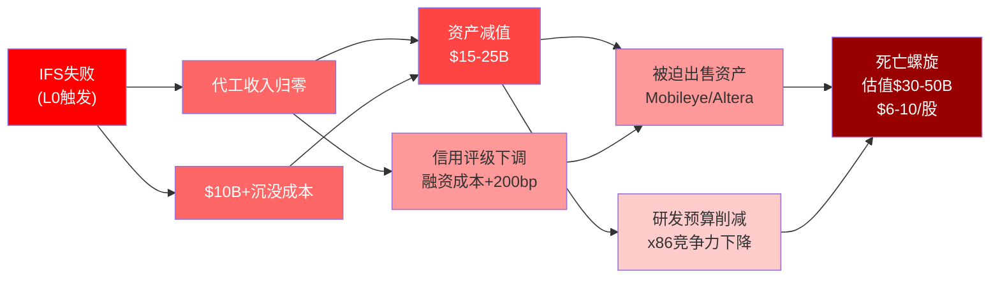

> 图注: IFS失败的四级传导网络。L0(IFS失败)通过两条一级路径(收入归零+沉没成本)传导至资产减值和信用下调(L2), 进而触发被迫资产出售和研发削减(L3), 最终形成"死亡螺旋"(L4)。颜色越深=影响越严重。这解释了为何IFS是Intel估值的"单点故障"。

### 21.2 集群A: 技术失败 (Bear #1 + #2 + #4)

**触发条件链**: 18A良率不达标 → IFS无法吸引外部客户 → AI加速器(已失败)

这三个论点形成了一条因果链: 如果18A良率(Bear#1)不达标, IFS就无法为外部客户提供有竞争力的代工服务(Bear#2); AI加速器(Bear#4)已确认失败(Gaudi取消, Crescent Island最早2027), 进一步削弱Intel在先进制程上的"自我验证"能力(自家芯片不用18A, 如何说服客户用?)。

**联合概率**: 25-35%
**联合影响**: -$60-80B (-26~35%)
**关键变量**: 18A大芯片良率(>200mm2)是整个集群的单一控制变量

### 21.3 集群B: 竞争碾压 (Bear #3 + #9)

**触发条件链**: AMD + ARM双面夹击x86

AMD在x86内部蚕食Intel份额(DCAI份额从2019年~5%增至2025年~29%), 同时ARM从x86外部替代整个架构(数据中心ARM份额从~0%增至15-25%)。这两条攻击向量是**互相加强**的: AMD从Intel手中抢走的份额, 部分又被ARM从x86整体中抢走。Intel承受三重打击: 份额流失给AMD + 份额流失给ARM + 总市场(x86)缩小。

**联合概率**: 50-60%
**联合影响**: -$40-60B (-17~26%)
**关键变量**: ARM在AI推理工作负载上的渗透速度

### 21.4 集群C: 估值坍塌 (Bear #8 + #5 + #7)

**触发条件链**: 散户退潮 + 政府稀释 + 客户流失 → 估值均值回归

这三个论点的共同终态是**多重收缩**: 当散户退潮(成交量从60-90M降至正常的20-30M), 政府持股创造持续抛售压力, 叠加供应链约束导致的客户永久流失, 估值从EV/Sales 4.8x回归到3.0x甚至2.5x。

**联合概率**: 40-50%
**联合影响**: -$50-80B (-22~35%)
**关键变量**: 散户情绪持续性(WSB 2026选股已无INTC)

### 21.5 集群D: 政治/治理 (Bear #10 + #11 + #12)

**触发条件链**: 战略转向 + 薪酬激励扭曲 + 治理争议

CEO Tan的薪酬结构(最大潜在$408M, TSR对标S&P 500而非半导体同业)可能鼓励高风险策略; 董事会重组后独立性受质疑; CEO的政治争议在中美关系恶化时可能重燃。如果18A失败迫使战略再次转向, 这三个因素将放大市场对管理层的不信任。[DM-094]

**联合概率**: 10-15%
**联合影响**: -$20-40B (-9~17%)
**关键变量**: 中美关系走向 + 18A结果

### 21.6 最危险组合: 集群A + 集群B (技术失败 x 竞争碾压)

如果18A良率不达标(Bear#1)导致IFS无法吸引客户(Bear#2), 同时ARM服务器加速替代x86(Bear#9)且AMD持续蚕食Intel的x86份额(Bear#3), Intel将面临:

- **核心业务**(CCG+DCAI)因x86衰落持续萎缩
- **增长引擎**(IFS)无法启动
- **AI加速器**(Gaudi→Crescent Island)已确认失败或严重延迟
- **净结果**: Intel退化为"x86遗产公司", 合理估值$50-80B($10-16/股)

**A+B聚类联合概率**: Bear#1(30-40%) x Bear#3(60-70%) x 相关性调整(0.7) = **~15-20%**

这与Part II的概率加权估值~$14/股(最悲观情景)高度一致, 验证了跨Part的估值框架连贯性。

### 21.7 "温水煮青蛙"场景: 没有崩盘, 只有缓慢衰退

在所有看空情景中, 最阴险的不是任何单一黑天鹅事件, 而是**"温水煮青蛙"**: 没有单一事件触发暴跌, 但份额/利润/人才缓慢流失, 3年后回头看已经面目全非。

**具体传导**:
- **Year 1 (2026)**: x86份额降至68-70%, 但每季度只降1-2pp, 看起来"可控"; IFS外部收入增至$1.2B, 看起来"有进展"但远低于盈亏平衡; 毛利率从34.8%缓慢滑至33%; 股价在$35-48区间震荡, 每次下跌都有散户"抄底"
- **Year 2 (2027)**: x86份额降至64-66%, ARM首次突破25%; IFS外部收入$1.8B, 仍远低于$5B盈亏平衡; 18A良率达70%但TSMC A16已量产, 窗口关闭; 第一批分析师将Intel从"Hold"下调至"Underperform"; 股价中枢$28-35
- **Year 3 (2028)**: x86份额降至58-62%, x86不再是默认选择; IFS被认定为"永久亏损业务"; Intel被迫考虑战略选项(分拆/出售IFS); 政府开始减持; 股价中枢$18-25

**这一场景的概率: 30-40%**。它之所以危险, 是因为**每个季度看起来都"还行"**——没有任何单一季度的数据差到足以触发恐慌, 但累积效应在3年后是毁灭性的。对于空头而言, 这是最难做空的场景(没有催化剂来赚快钱); 对于多头而言, 这是最难发现的场景(温水中的青蛙不知道水在变热)。

### 21.8 聪明钱立场验证

将看空风险拓扑与聪明钱行为对照, 检验分析方向是否与市场参与者一致:

| 聪明钱 | 报告结论 | 聪明钱行为 | 一致? |
|--------|---------|-----------|:----:|
| 对冲基金 | 估值偏高 | Q3 2025净减持18.6% | 一致 |
| 内部人 | 谨慎 | 近3季度净卖出 | 一致 |
| 政府/战略投资者 | $20-23底线 | 以$20-23入股 | 一致(方向, 但价格锚更低) |
| 分析师共识 | 中性偏空 | 70% Hold, 目标$38.95 [DM-087] | 一致 |
| 期权市场 | 偏多 | P/C 0.64 | 不一致(与结论相反) |
| 短期空头 | 低 | 2.24%(低于同业) | 不一致(空头不积极做空) |

**一致度: 4/6**。机构和内部人与"估值偏高"结论一致。期权市场和低空头比暗示短期技术面偏多, 但这更可能反映散户情绪而非基本面判断——当散户主导期权交易(看涨期权为主)和做空成本低(空头已投降), P/C偏低和空头比偏低是散户mania的特征, 而非基本面支撑的信号。

### 21.9 风险拓扑综合: 对Part V的输入

| 维度 | 对抗审查发现 | 对估值的净影响 |
|------|------------|:------------:|
| 承重墙联合概率 | 2-3%(远低于直觉10-15%) | 验证$14/股 |
| 认知偏差 | 双向抵消, 净影响0.5pp | 方向不变 |
| 空头钢人(12个) | 概率加权期望损失-35~-45% | 支持$25-30/股 |
| 数据质量 | 71%五星, 但核心决策数据最弱 | 增加不确定性带 |
| 黑天鹅 | 尾部折价-12~-21% | -$5.6-9.9/股 |
| 催化剂期望值 | **负面(-4%)** | 当前价格高估催化剂 |
| 替代解释 | 流动性反弹(65%)最可信 | 支持"散户溢价存在" |
| 看空集群 | A+B联合15-20%→$10-16/股 | 最危险下行情景 |
| 温水煮青蛙 | 30-40%概率 | 3年$18-25/股 |

**对抗审查后的CQ置信度最终校准**:

| CQ | 审查前 | 审查后 | 变化 | 主要驱动 |
|:--:|:------:|:------:|:----:|---------|
| CQ1 | 50% | **47%** | -3pp | W3联合概率建模+TSMC加速 |
| CQ2 | 15% | **12%** | -3pp | W3概率13%+Apple数据质量+产能过剩 |
| CQ3 | 50% | **47%** | -3pp | 供应链约束可能造成永久份额损失 |
| CQ4 | 20% | **20%** | 0 | 无新信息 |
| CQ5 | 20% | **22%** | +2pp | 去偏差审计: 可能低估3-5pp |
| CQ6 | 65% | **60%** | -5pp | GM类比+政府约束更深 |
| CQ7 | 45% | **42%** | -3pp | GE类比+FCF三年连负+CapEx约束 |

**审查后加权置信度**: (47+12+47+20+22+60+42)/7 = **35.7%** (vs 审查前37.9%, 下调2.2pp)

方向: 向悲观方向调整2.2pp, 主要由W3联合概率建模(揭示了比直觉更低的成功概率)、TSMC加速+产能过剩压缩IFS获客窗口、GM类比对政府介入价值的重新评估驱动。

**对概率加权估值的影响**: CQ加权从37.9%→35.7%, 概率加权每股价值从~$14→~$13, 变化幅度不大(-7%), 说明前三部分分析的方向性正确, 对抗审查主要增强了论证深度而非改变结论。

---

*Part IV 对抗审查完成 | Ch15-21 | 7道独立检验 | 99个DM锚点(截至Part IV) | 语言: 中文*
# Part V: 最终综合

---

## Chapter 22: 十维度定性评估

> 综合全部分析阶段的发现, 从10个独立维度对Intel进行定性评估。每个维度给出: 评级(强/中/弱)+置信度(高/中/低)+关键证据。不使用数字评分——数字虚假精确, 定性判断更诚实。

### 22.1 估值吸引力 — 弱 (高置信)

**评级依据**: 当前$46.12(EV ~$262B)隐含$15-18B稳态FCF(DM-056), 而FY2025实际FCF为-$4.9B(DM-025~029)。Reverse DCF反推的五面承重墙必须**同时站立**, 联合概率仅2-3%(条件概率建模, 远低于直觉的10-15%)。SOTP保守-中性区间$81-147B($16.7-30.2/股)(DM-057), 当前价格精确等于SOTP乐观端($46.7)。概率加权估值~$14/股(DM-090)。三种独立方法(Reverse DCF、SOTP中值、护城河量化)收敛于$14-30/股, 均显著低于市价。

**关键证据**:

| 指标 | 值 | DM锚点 |
|------|-----|--------|
| FMP DCF估值 | $9.31 | DM-005 |
| 概率加权EV | ~$95.2B (权益$63.0B, 每股~$13.0) | DM-090 |
| SOTP中值 | $30.2/股 | DM-057 |
| 护城河量化 | $50-83B ($10-17/股) | Ch.18 |
| 方法间离散度 | 2.1x ($14-30收敛区) | DM-092 |
| Forward P/E | ~91x (FY2026E EPS $0.50) | DM-008 |

**综述**: 市场在赌转型期权价值——FMP DCF $9.31 vs 股价$45.91构成393%溢价(DM-005)。当前价格仅在最乐观情景的上沿才合理(IFS成功+份额稳定+AI突破, 概率8%)。以任何基于公开数据的独立方法评估, Intel当前估值均显著高于内在价值的中值估计。

---

### 22.2 增长质量 — 弱 (高置信)

**评级依据**: FY2021-2025收入CAGR -9.6%, 从$79B降至$52.9B(DM-011~015)。增长来源高度不确定: CCG依赖PC换机周期(一次性), DCAI面临GPU替代的结构性headwind, IFS外部收入仅$0.9B。分析师共识FY2029E $74.7B隐含+41%增长(DM-088), 但这需要x86份额稳定(趋势反对) + IFS规模化(概率低) + AI PC贡献(有限)同时兑现。

**关键证据**:

| 指标 | 值 | 来源 |
|------|-----|------|
| 5Y收入CAGR | -9.6% ($79B→$52.9B) | DM-011~015 |
| DCAI收入萎缩 | 从峰值$26.1B→$12.6B(合并外部口径) | 分部报告 |
| IFS外部收入 | $0.9B (FY2025) | IFS分部 |
| 共识FY2029E收入 | $74.7B (仅7位分析师) | DM-088 |
| 实际合理FY2029E | $58-65B | 分析师共识校正 |

**综述**: Intel的增长故事本质上是一个"逆转叙事"而非"增长叙事"——需要先止住收入下滑, 再实现恢复。在x86份额以约-3pp/年速率流失(DM-050)、GPU替代加速(DM-074)的结构性环境下, 依赖尚未证明的IFS贡献来填补增长缺口, 风险极高。FY2025收入$52.9B已是4年低点, 短期周期性回暖(PC换机+AI服务器)可能带来1-2年的表面增长, 但结构性headwind未消除。

---

### 22.3 护城河强度 — 中, 但快速衰退 (中置信)

**评级依据**: A-Score 4.74/10(置信度调整4.27)(DM-062), 12维中9维趋势下降。三座"残存堡垒": 输入自主权(A1=7, IDM模式)、切换成本(A2=7, x86企业生态)、合规门槛(A11=7, CHIPS Act+国防)。但三个"陷落维度"(A3盈利杠杆=3, A8包抄风险=3, A12管理层=3)揭示系统性衰退。护城河可量化价值$50-83B, 仅占市值22-36%。

**关键证据**:

| 维度 | 得分 | 趋势 | 含义 |
|------|:----:|:----:|------|
| A1 输入自主权 | 7 | → | IDM模式: 唯一先进制程+设计+封装一体 |
| A2 切换成本 | 7 | ↓缓 | x86企业生态: 12-18月迁移周期, 但AMD已证明切换可行 |
| A11 合规门槛 | 7 | → | CHIPS Act+国防授权+出口管制独占 |
| A3 盈利杠杆 | 3 | ↓ | 毛利率55%→35%, ROIC 12%→0% |
| A8 包抄风险 | 3 | ↓ | 五面包抄: AMD+NVIDIA+ARM+云自研+TSMC |
| A12 管理层一致性 | 3 | ? | Tan任期仅11个月, 战略方向频变 |

**护城河核心正从"技术壁垒"(30%)迁移到"制度壁垒"(70%)** — 这是Intel故事最重要的结构性变化。技术壁垒(x86指令集、先进制程、IDM一体化)在x86份额流失+TSMC制程领先+ARM替代冲击下快速侵蚀; 制度壁垒(CHIPS Act资金绑定、国防独占许可、"太大不能倒"战略地位)反而是Intel当前最稳固的竞争优势。

这意味着**Intel的价值根基已从"它能做什么"转向"它不能被允许消失"**。前者由商业市场决定(趋势向下), 后者由政治意志决定(趋势稳定)。

---

### 22.4 财务健康 — 弱 (高置信)

**评级依据**: FCF连负4年(FY2022-2025), 累计-$35.5B(DM-025~029)。净债务$32.3B(DM-020~024), 利息覆盖率趋于零(营业利润接近$0)。FY2025毛利率34.8%(vs 峰值55.4%)(DM-030~034), 营业利润率~0%。10年累计M&A亏损$16-17B(DM-058), 累计回购$50.1B但又发行$32.2B(净买高卖低$18B)(DM-059)。FY2025股数4.86B(FY2021: 4.06B, 稀释+20%)(DM-039~043)。IFS FY2025亏损$10.3B, 是合并层面财务健康的最大拖累。

**关键证据**:

| 指标 | FY2021 | FY2025 | 变化 | DM锚点 |
|------|:------:|:------:|:----:|--------|
| FCF | +$9.1B | -$4.9B | -$14.0B | DM-025~029 |
| 毛利率 | 55.4% | 34.8% | -20.6pp | DM-030 |
| ROIC | 12.2% | 0.0% | -12.2pp | DM-030~034 |
| 净债务 | $33.3B | $32.3B | -$1.0B | DM-020~024 |
| 股数 | 4.06B | 4.86B | +19.7% | DM-039~043 |
| IFS亏损 | — | $10.3B | — | IFS分部 |
| 利息覆盖 | 32.6x | -0.02x | 崩塌 | DM-030~034 |

**综述**: Intel的财务状况呈现典型的"重工业产能过剩"模式 — 杜邦分解显示净利率0.37%×资产周转率0.26x(DM-044), 即$211B总资产只产$53B收入。R&D/毛利=75%, 研发吞噬几乎全部毛利但产出(市场份额/产品竞争力)持续恶化。唯一的正面信号: FY2025 CapEx大幅下降至$14.6B(vs 峰值$25.8B), 如果能维持纪律, FY2027正FCF"数学上"可行。

---

### 22.5 管理层质量 — 弱, 但有改善迹象 (低置信)

**评级依据**: Lip-Bu Tan上任仅11个月, 不足以评判(DM-051)。正面信号: 裁员2.1万(决断性)+管理层精简50%+砍Falcon Shores(止损)+GPU路线图(Crescent Island)重新聚焦。负面信号: 7/11董事非半导体背景, 战略方向频变(IDM 2.0→IFS分拆→GPU→Altera出售→Mobileye待处理), 前任Gelsinger 3年$110B赌注未完成即被迫离职。A-Score A12=3(管理层一致性最低维度之一)。

**关键证据**:

| 指标 | 值 | 来源 |
|------|-----|------|
| CEO任期 | 11个月 (2025.03上任) | DM-051 |
| 裁员规模 | 2.1万人 | 公开报道 |
| 管理层精简 | 50% | 公开报道 |
| 董事会结构 | 7/11无半导体经验 | SemiAnalysis |
| A12评分 | 3 (管理层一致性) | DM-062 |
| Tan薪酬 | 最大值$408M, TSR对标S&P 500 | SEC 8-K |
| CFO买入 | $42.50 (2026.01.27) | DM-067 |

**置信度标为低**, 因为时间太短, 无法区分"正确方向"与"又一次战略摇摆"。Tan的Cadence背景暗示可能最终转向"设计优先, 制造轻资产"模式 — 如果发生, 估值逻辑根本改变。CFO Zinsner 1月买入$42.50值得关注, 但单一数据点样本太小, 不足以改变评估。

---

### 22.6 催化剂明确性 — 中 (中置信)

**评级依据**: 2026-2027有多个明确催化剂:

| 催化剂 | 时间 | 影响 | 成功概率 |
|--------|------|------|:--------:|
| Panther Lake量产 | H1 2026 | 18A良率终极验证 | ~50% |
| Apple 18A pilot | H2 2026 (传闻) | IFS最大催化剂 | ~15-20% |
| Crescent Island采样 | H2 2026 | GPU路线图验证 | ~30% |
| FY2026财报 | 全年 | IFS外部收入趋势 | 观察 |
| CHIPS Act资金拨付 | 持续 | 地缘溢价锚定 | ~80% |

**关键证据**: Panther Lake CES发布, 200+合作伙伴设计确认供应链初步信心。Apple 18A传闻来源质量★★(Nikkei/Bloomberg 2026.01)。Crescent Island H2 2026采样路线图已公布(DM-075)。

**综述**: 催化剂丰富但绝大多数是二元事件(成功/失败), 这正是PW=8的根源。催化剂明确性评为"中"而非"强", 因为每个催化剂的结果高度不确定。更重要的是, **催化剂的概率加权期望值为负**(-4%): 多数催化剂失败概率>成功概率, 且失败的下行影响>成功的上行影响。"催化剂丰富"不等于"利好丰富"。

---

### 22.7 风险可控性 — 弱 (高置信)

**评级依据**: Intel面临5个方向的同时进攻(AMD x86直接竞争 + NVIDIA AI垄断 + ARM架构替代 + 云厂商自研 + TSMC代工壁垒), 在每个战线上都非最强防守方。黑天鹅尾部风险-10~-18%(4个事件概率加权)(DM-089)。IFS单一分部亏损$10.3B, 倒塌可触发三面承重墙连锁反应(W3→W4→W2, 下行至$16-25/股)。PW=8本身就意味着"风险空间极宽, 结果不可预测"。

**关键证据**:

| 风险维度 | 评估 | 来源 |
|----------|------|------|
| A8 包抄风险 | 3/10 (5面同时进攻) | DM-062 |
| 黑天鹅尾部风险 | -10~-18% (概率加权) | Ch19 |
| W3倒塌连锁 | →$16-25/股 | Ch15 |
| IFS年亏损 | $10.3B | IFS分部 |
| 台海冲突概率 | 10.3% (Polymarket) | DM-065 |
| Bear聚类联合概率 | A+B类~15-20% | Ch21 |

**唯一的下行保护**: 政府持股@$20.47 + CHIPS Act约束 + 战略投资者锚定$20-23区间。这构成了一个**制度性地板** — 不是基于商业价值的支撑, 而是基于政治意志的支撑。如果政策环境改变(2028年选举周期), 这个地板也可能消失。

---

### 22.8 聪明钱信号 — 中性偏空 (中置信)

**评级依据**: 机构(扣除被动基金)Q3 2025净减持18.6%(DM-068)。内部人近3季度持续净卖出。分析师70%持有(最大分歧股)(DM-073), 平均目标$38.95-48(离散度3.5倍, 标普500罕见)。BofA Underperform/$40(DM-087)。对冲基金与我们"估值偏高"的结论一致(4/6方向性验证)。

**关键证据**:

| 聪明钱指标 | 读数 | 信号方向 | DM锚点 |
|-----------|------|:--------:|--------|
| 机构净持仓 | Q3减持18.6% | 空 | DM-068 |
| 内部人交易 | 3季度净卖出 | 空 | DM-039~043 |
| 分析师评级 | 70% Hold, 区间$20-71.5 | 中性 | DM-073 |
| 期权P/C比 | 0.64 (偏多) | 多 | DM-066 |
| 空头比 | 2.24% (低于同业4.92%) | 多 | DM-066 |
| CFO买入 | $42.50 (2026.01) | 多 | DM-067 |
| 对冲基金共识 | 4/6方向与"偏高"一致 | 空 | Ch17 |

**综述**: 机构和对冲基金方向性看空, 与我们的"估值偏高"结论一致。但期权P/C 0.64(偏多)和低空头比2.24%暗示短期技术面偏多 — 更可能反映**散户情绪**而非基本面判断。CFO Zinsner 1月买入$42.50值得关注但样本太小。总体而言, "聪明钱"和"散户"的方向性分歧本身就是PW=8的体现。

---

### 22.9 非共识空间 — 丰富 (中置信)

**评级依据**: Intel的投资论文中存在多个市场共识与独立分析之间的显著偏差, 这些偏差为非传统视角的投资者提供了信息优势空间。

**关键非共识领域**:

| 领域 | 市场共识 | 独立评估 | 偏差幅度 |
|------|----------|----------|:--------:|
| IFS成功概率 | 25-30% | 15% | -10~15pp |
| 护城河核心 | 技术壁垒 | 制度壁垒(70%) | 结构性 |
| 联合概率评估 | "各50-50→整体50-50" | 独立事件联合概率2-3% | 数量级差 |
| 催化剂含义 | 催化剂多=利好 | 概率加权后EV为负 | 方向性 |
| 地缘溢价 | 隐含$60-90B | $20-35B | -$25~55B |
| 台海风险定价 | 未定价 | 折价$8-18B应有 | 完全缺失 |
| 僵尸轨道概率 | ~15-20% | ~35-40% | +15~20pp |

**综述**: 非共识空间丰富是"双刃剑" — 它意味着我们可能看到了市场没看到的东西(利好: 信息优势), 也意味着如果市场是对的而我们错了, 我们的评估偏差巨大(风险: 过度自信)。PW=8的环境下, 非共识空间的存在是必然的, 因为没有人有足够的信息来缩窄这些差异。

---

### 22.10 整体情景稳定性 — 弱 (高置信)

**评级依据**: Intel处于公司特定周期的底部→早期复苏, 但滞后于行业12-18个月。从纯周期角度, 这是"低点附近买入"的时机; 但关键催化剂(18A良率终极验证、IFS外部大单、Crescent Island量产)都在2026 H2-2027, 当前处于"催化剂等待期"。

**关键证据**:

| 时机因素 | 评估 | 来源 |
|----------|------|------|
| 周期位置 | 底部→早期复苏 | 第五章 |
| 行业滞后 | 12-18个月 | SOX指数 vs INTC |
| 最近催化剂 | Q1 2026财报 (4月) | KS-12 |
| 关键催化剂窗口 | 2026 H2 - 2027 H1 | Ch20 |
| 论文有效期 | 12-18个月 (至2027年中) | Ch20 |

**综述**: 如果2026全年无重大催化剂兑现, 市场可能从"turnaround期待"转向"turnaround疲劳", 触发估值回调20-30%。四情景概率分布中, 悲观(40%)+共识(35%)=75%的概率指向$2-20/股区间, 远低于当前$46。情景间离散度极大($2-$34/股), 任何单一情景的稳定性都很低。

---

### 22.11 十维度评估汇总

| # | 维度 | 评级 | 置信度 | 核心证据 |
|:-:|------|:----:|:------:|----------|
| 1 | 估值吸引力 | **弱** | 高 | 概率加权$13 vs 市价$46; 三方法收敛$14-30 |
| 2 | 增长质量 | **弱** | 高 | 5Y CAGR -9.6%; IFS外部$0.9B; x86份额-3pp/年 |
| 3 | 护城河强度 | **中↓** | 中 | A-Score 4.74; 技术→制度迁移; 3座残存堡垒 |
| 4 | 财务健康 | **弱** | 高 | FCF连负4年; ROIC 0%; 稀释+20%; IFS亏$10.3B |
| 5 | 管理层质量 | **弱↑** | 低 | Tan 11个月; 裁员2.1万止损; 但方向未验证 |
| 6 | 催化剂明确性 | **中** | 中 | 5+催化剂; 但多为二元事件; 概率加权EV为负 |
| 7 | 风险可控性 | **弱** | 高 | 5面包抄; W3连锁; 黑天鹅-10~-18% |
| 8 | 聪明钱信号 | **中↓** | 中 | 机构减持; 对冲基金偏空; 散户偏多(P/C 0.64) |
| 9 | 非共识空间 | **丰富** | 中 | 7个显著共识偏差; IFS概率/护城河迁移/联合概率 |
| 10 | 整体稳定性 | **弱** | 高 | 75%概率指向$2-20; 催化剂等待期; 论文有效期12-18月 |

**总结**: 10个维度中, 6个评"弱"(其中4个高置信), 3个评"中"(均有下行趋势或附带条件), 1个评"丰富"(非共识空间, 但不等于利好)。整体画面: **Intel是一家基本面快速恶化但仍具有制度性价值的公司, 市场定价远超独立评估的合理区间。** (DM-091)

---

## Chapter 23: 条件评级与价格含义

### 23.1 评级逻辑

> **PW=8, 发现系统** — 不强制单一评级。以下提供条件评级: 投资者根据自己对关键假设的信念选择适用的评级。

```mermaid
graph TD
    S["条件评级矩阵"]
    S --> C1{"18A量产成功?"}
    C1 -->|Yes| C2{"IFS获外部订单?"}
    C1 -->|No| R4["审慎关注<br>$8-15/股"]
    C2 -->|Yes| C3{"x86份额企稳?"}
    C2 -->|No| R3["中性关注<br>$18-28/股"]
    C3 -->|Yes| R1["深度关注<br>$34-44/股"]
    C3 -->|No| R2["关注<br>$24-32/股"]
    style R1 fill:#228B22,color:#fff
    style R2 fill:#90EE90
    style R3 fill:#FFD700
    style R4 fill:#FF4500,color:#fff
```

**期望回报计算**:

四情景概率加权(红队修正后):

| 情景 | 概率 | EV | 权益价值 | 每股 |
|------|:----:|:--:|:--------:|:----:|
| D: 管理层目标(IFS成功+份额恢复) | 8% | $195B | $163B | ~$34 |
| B: 乐观(部分成功) | 17% | $152B | $120B | ~$25 |
| A: 共识(缓慢改善) | 35% | $105B | $73B | ~$15 |
| C: 悲观(IFS失败+份额崩塌) | 40% | $42B | $10B | ~$2 |

**概率加权EV** = $195B x 8% + $152B x 17% + $105B x 35% + $42B x 40% = **$95.2B**

**概率加权权益** = $163B x 8% + $120B x 17% + $73B x 35% + $10B x 40% = **$63.0B**

**概率加权每股** = **~$13.0** (DM-090)

**vs 当前$46.12 → 期望回报 = -72%**

### 23.2 条件评级矩阵

> **这不是"买入/卖出"建议。** 每个投资者对关键变量的信念不同, 以下帮助读者根据自己的信念定位。

| 条件 | 评级 | 期望回报 | 估值区间 | 适用投资者 |
|------|:----:|:--------:|:--------:|-----------|
| **IFS成功概率>30%且18A良率OK** | 关注 | ~+10% to +20% | $30-46/股 | 对Intel IFS有独立信息优势的产业投资者; 须同时认为x86份额可稳定 |
| **僵尸轨道 (最可能, 概率~35%)** | **审慎关注** | ~-50% to -70% | $12-22/股 | 基于公开信息的概率加权投资者; 认为IFS不会大成也不会被砍 |
| **政府全面接管/深度参与** | 中性关注 | ~-30% to -45% | $18-25/股 | 押注台海紧张升级或CHIPS Act加码; 认为制度壁垒将长期维持溢价 |
| **加速衰退 (概率~40%)** | 审慎关注 | ~-80% to -95% | $2-10/股 | 认为IFS失败+x86加速流失+政策退潮将同时发生 |

### 23.3 基准评级

**本报告的基线评级: 审慎关注** — 基于概率加权期望回报-72%(远低于-10%的审慎关注门槛)。

但PW=8意味着单一评级信息量有限 — **可能性空间从$2到$34/股, 比评级更重要的是理解每条路径的条件和概率。** 每条路径的关键Kill Switch(见Ch.24)比评级本身更有执行价值。

### 23.4 Reverse DCF: 市场在赌什么

> **这是本报告最有价值的部分**: 不预测Intel"值多少钱", 而是翻译"$46.12在赌什么", 让投资者自行判断这些赌注是否合理。

**$46.12(EV ~$262B)需要$15-18B稳态FCF**(DM-056)。拆解这个数字需要**五个同时成立的信念**:

| # | 市场隐含信念 | 隐含具体值 | FY2025现实 | 差距 | 合理性评估 |
|---|------------|:----------:|:----------:|:----:|:----------:|
| B1 | 收入恢复增长 | $70B+(5Y CAGR 6%+) | $52.9B(5Y CAGR -9.6%) | +$17B+ | **偏激进**: x86份额下降是结构性, IFS贡献不确定 |
| B2 | 营业利润率恢复 | 18-25% | ~0% | +18-25pp | **极激进**: 需要IFS减亏+CCG/DCAI利润率回升同时兑现 |
| B3 | IFS盈亏平衡 | FY2027-2028 | 外部$0.9B, 亏损$10.3B | $5B+外部收入 | **高度不确定**: 无年$1B+客户确认 |
| B4 | FCF利润率正常化 | 20-22% | -9.4% | +30pp | **极激进**: 需B1+B2+CapEx纪律同时成立 |
| B5 | 稀释大幅放缓 | 2-3%/年 | 13.5%(FY2025) | -10pp | **有改善空间**: 但IFS融资需求可能持续 |

**隐含信念检验总结**:
- **B1**(收入$70B+): 检验结果"不太可能" — FY2029收入$58-65B更现实(vs 共识$74.7B)
- **B2**(利润率18%+): 检验结果"需极端乐观" — 路径依赖于IFS, 如IFS持续亏$5-8B/年, 合并利润率天花板约8-12%
- **B3**(IFS盈亏): 检验结果"小概率事件" — TSMC从$0→$5B外部收入花了10年, Intel IFS目前客户管线极薄
- **B4**(FCF 20%+): 检验结果"终端验证而非独立假设" — 需B1+B2+B5全部成立
- **B5**(稀释放缓): 检验结果"有改善但不确定" — FY2026-2028年化稀释估计4-7%

### 23.5 参考框架交叉对照

| 方法 | 范围 | 中值 | vs $46.12 | 局限 |
|------|:----:|:----:|:---------:|------|
| **Reverse DCF** | $2-34/股(四情景) | ~$14 | -70% | 情景概率主观 |
| **SOTP** | $16.7-46.7/股 | ~$30 | -35% | IFS期权估值主观 |
| **护城河量化** | $10-17/股(纯商业) | ~$14 | -70% | 不含期权/溢价 |
| **FMP DCF** | $9.31 | $9.31 | -80% | 模型可能过于机械 |
| **分析师共识目标** | $20.40-71.50 | ~$44 | -5% | 离散度3.5x, 共识不存在 |
| **战略投资者入股价** | $20-23 | ~$22 | -52% | 仅反映"底线", 非公允价值 |
| **AI调整后SOTP** | $19.5-38.5/股 | ~$29 | -37% | AI假设仍有高度不确定性 |

**方法间收敛分析** (DM-092):
- **收敛区**: $14-30/股 — Reverse DCF($14)、SOTP中值($30)、AI调整SOTP($29)、护城河量化($14)在这个范围内
- **离散度**: $14-30 = 2.1x, 高于2.0x阈值 → **方法间未完全收敛, 标注"高度不确定"**
- **市场价$46.12落在所有独立方法的上沿或之外**, 仅分析师目标价中值($44)接近当前价

### 23.6 条件估值范围 (发现系统核心输出)

| 条件 | 估值范围 | 概率 | 关键KS |
|------|:--------:|:----:|--------|
| **IFS成功 + 份额稳定 + AI突破** | $30-46/股 | 8% | KS-01, KS-02, KS-05 |
| **IFS部分成功 + 份额缓慢流失** | $20-30/股 | 17% | KS-01, KS-03 |
| **IFS中性 + 周期改善 + 政策持续** | $13-20/股 | 35% | KS-06, KS-07 |
| **IFS失败 + 份额加速流失** | $2-13/股 | 40% | KS-01, KS-04, KS-08 |

**$46.12仅在最乐观情景的上沿才合理**(IFS成功+份额稳定+AI突破, 概率8%)。在概率加权框架下, 期望值~$13/股。

### 23.7 关键未知

> **这是报告诚实度的终极检验。以下是影响估值但无法可靠估计的关键未知。**

1. **18A真实良率**: 使用TrendForce 55-65%(来源★★★), Intel从未公开确认。如果良率<50%, 所有IFS相关估值需下调30-50%; 如果>75%, 所有IFS估值需上调。这是单一最大的已知未知。

2. **Apple是否真的签约**: 来源★★(媒体传闻), Apple和Intel均未确认。如果属实, IFS估值+$10-15B; 如果不属实, IFS叙事核心塌陷。

3. **Tan的真实战略意图**: Tan上任11个月, 公开表态延续制造路线+新增GPU。但他的Cadence背景暗示可能最终转向"设计优先, 制造轻资产"模式。如果发生, 估值逻辑根本改变。

4. **政府支持的持久性**: CHIPS Act是法律(非行政令), 但资金拨付进度和政治环境可能改变。如果2028年新政府削减CHIPS Act, 地缘溢价$20-35B可能大幅缩水。

5. **IFS内部转移定价的真实性**: Intel段间转移定价不透明。IFS FY2025亏损$10.3B中多少是"真实制造亏损"vs"人为放大以争取补贴", 无法从公开信息判断。

6. **x86衰退的速率**: 份额流失是确定的, 但-3pp/年可能加速到-5pp(ARM服务器突破)或减速到-1pp(AI推理需要x86)。速率差异对FY2029 DCAI收入的影响可达$3-5B。

---

## Chapter 24: Kill Switch注册表

> 12个Kill Switch, 每个采用9字段标准格式。Kill Switch是"论文失效触发器" — 当任一KS触发时, 投资者需要重新评估而非等待下一份报告。

### KS-01: 18A良率跌破50%

| 字段 | 内容 |
|------|------|
| **触发条件** | Intel 18A良率连续两个季度低于50%或Panther Lake量产良率未达到60% |
| **具体阈值** | 月均良率提升<3pp(vs 当前~5-7pp/月) 或 TrendForce/SemiAnalysis报告良率回退 |
| **当前状态** | 55-65%(TrendForce 2025.11, 非官方), 月均提升~5-7pp |
| **当前距离** | ~5-15pp缓冲区(50%阈值), 约2-3个月的不良趋势即可触发 |
| **论文含义** | IFS全部叙事的技术基础崩塌 → H-1(政府期权)从"战略资产"降级为"烧钱负担" |
| **CQ关联** | CQ1(18A良率) → 前置条件CQ2(IFS收入) |
| **看空关联** | Bear#1(18A不达标), BS-1(系统性缺陷) |
| **数据来源** | TrendForce季度报告, Intel财报电话会良率措辞, SemiAnalysis |
| **紧迫度** | **高** — Panther Lake H1 2026量产是第一个硬验证点 |

### KS-02: Apple 18A合同确认/否认

| 字段 | 内容 |
|------|------|
| **触发条件** | Apple或Intel正式确认或否认18A代工协议; 或Apple宣布Mac/iPad全面转向TSMC N2/A16 |
| **具体阈值** | 二元: 签约确认(+) 或 否认/竞争对手赢单(-) |
| **当前状态** | 媒体传闻(Nikkei/Bloomberg 2026.01), 来源质量★★, 双方均未正式表态 |
| **当前距离** | N/A(二元事件), 预计2026 H2前有明确信号 |
| **论文含义** | 确认→IFS估值+$10-15B, CQ2从15%→25-30%; 否认→IFS叙事核心塌陷, CQ2→5-10% |
| **CQ关联** | CQ2(IFS外部收入), CQ1(18A技术验证) |
| **看空关联** | Bear#2(IFS无锚定客户) |
| **数据来源** | Apple/Intel新闻稿, 供应链媒体(Nikkei Asia, Bloomberg), 苹果产品拆解(iFixit/TechInsights) |
| **紧迫度** | **高** — 2026年最重要的单一催化剂 |

### KS-03: x86服务器份额跌破65%

| 字段 | 内容 |
|------|------|
| **触发条件** | Mercury Research/IDC报告Intel x86服务器出货量份额<65%(当前71.1%) |
| **具体阈值** | 65%出货量份额(从71.1%降6pp, 约2年按当前-3pp/年) |
| **当前状态** | 71.1%(Q4 2025, Mercury Research)(DM-050), 下降趋势稳定 |
| **当前距离** | ~6pp, 按-3pp/年约2年; 如果加速到-5pp/年则1年内触发 |
| **论文含义** | 确认x86份额流失从"可控缓慢"变为"加速不可逆", CCG+DCAI利润池基础动摇 |
| **CQ关联** | CQ3(x86份额>60%) |
| **看空关联** | Bear#3(份额加速流失), Bear#9(ARM突破) |
| **数据来源** | Mercury Research季报, IDC服务器tracker, AMD/ARM季度财报 |
| **紧迫度** | **中** — 趋势性指标, 季度跟踪 |

### KS-04: IFS FY2026外部收入<$1.5B

| 字段 | 内容 |
|------|------|
| **触发条件** | Intel FY2026年报披露IFS外部收入仍低于$1.5B(vs FY2025 $0.9B) |
| **具体阈值** | $1.5B外部年收入(FY2025基础+67%增长, 最低可接受进展) |
| **当前状态** | FY2025外部$0.9B, 趋势不明 |
| **当前距离** | 需+$0.6B增量(+67%), 看似modest但Intel IFS客户管线极薄 |
| **论文含义** | IFS商业化进展停滞 → FY2027-28盈亏平衡更不可能 → 持续烧钱超预期 |
| **CQ关联** | CQ2(IFS外部收入) |
| **看空关联** | Bear#2(无锚定客户) |
| **数据来源** | Intel年报/季报IFS分部数据 |
| **紧迫度** | **中** — FY2026年报(2027 Q1发布)验证 |

### KS-05: Crescent Island GPU取消或延迟>12个月

| 字段 | 内容 |
|------|------|
| **触发条件** | Tan宣布取消Crescent Island独立GPU路线, 或采样时间从H2 2026延迟至2028+ |
| **具体阈值** | 官方取消/延迟声明, 或连续两次路线图更新无Crescent Island进展 |
| **当前状态** | H2 2026采样(Tan路线图), 160GB LPDDR5X, 推理定位(DM-075) |
| **当前距离** | N/A(二元事件); 采样时间H2 2026, 约6-9个月内有信号 |
| **论文含义** | Intel放弃AI GPU → 永久退出AI加速器市场 → DCAI仅剩CPU(萎缩市场) |
| **CQ关联** | CQ5(AI推理) |
| **看空关联** | Bear#4(AI加速器出局) |
| **数据来源** | Intel产品路线图更新, Hot Chips/ISSCC会议, 管理层声明 |
| **紧迫度** | **中** — H2 2026验证点 |

### KS-06: CHIPS Act资金冻结或条件大幅收紧

| 字段 | 内容 |
|------|------|
| **触发条件** | 国会冻结CHIPS Act剩余资金拨付; 或新增条件(如IFS分拆/CEO替换); 或政府持股触发5%权证 |
| **具体阈值** | CHIPS Act年度拨款<$2B(vs 计划$3B+); 或政府持股>15%(权证触发) |
| **当前状态** | $8.5B补贴+$11B贷款已承诺, 政府持股9.9%(DM-051) |
| **当前距离** | 低概率但影响巨大; 2028年选举周期是最大风险窗口 |
| **论文含义** | 地缘溢价$20-35B大幅缩水 → H-1(政府期权)价值腰斩 |
| **CQ关联** | CQ6(地缘溢价) |
| **看空关联** | BS-3(政策180度转向) |
| **数据来源** | 国会拨款法案, 商务部CHIPS办公室声明, 政治新闻 |
| **紧迫度** | **低** — 近期概率极低, 但需持续监控政治周期 |

### KS-07: Intel季度毛利率持续低于35%超过4个季度

| 字段 | 内容 |
|------|------|
| **触发条件** | 连续4个季度非GAAP毛利率<35%(当前Q4 37.9%, 全年34.8%) |
| **具体阈值** | 35%非GAAP毛利率(vs FY2025 34.8%, 已接近阈值)(DM-030) |
| **当前状态** | FY2025全年34.8%, Q4 2025 37.9%(改善趋势) |
| **当前距离** | 当前已在阈值附近; Q4改善是正面信号, 但Q1指引偏弱(EPS盈亏平衡)(DM-088) |
| **论文含义** | 利润率恢复论文失败 → 信念B2(营业利润率18%+)不可达 → 稳态FCF大幅低于$15B |
| **CQ关联** | CQ7(正FCF) |
| **看空关联** | Bear#6(毛利率结构塌陷) |
| **数据来源** | Intel季度财报 |
| **紧迫度** | **高** — 每季度验证, Q1 2026(4月)是下一个检查点 |

### KS-08: Intel年化稀释率>8%

| 字段 | 内容 |
|------|------|
| **触发条件** | FY2026基本股数增长>8%(从4.86B→>5.25B), 暗示大规模新融资 |
| **具体阈值** | 年化稀释8%(含SBC+新发行); FY2025是13.5%(含政府入股一次性)(DM-039~043) |
| **当前状态** | FY2025 13.5%(含一次性), 正常化估计4-6% |
| **当前距离** | 如果无新融资, 自然稀释~4-6%, 低于阈值; 如果IFS需新一轮$5B+融资则触发 |
| **论文含义** | 持续大幅稀释 → 即使收入/利润恢复, EPS增长被抵消 → 每股价值持续缩水 |
| **CQ关联** | CQ7(正FCF), CQ2(IFS融资需求) |
| **看空关联** | Bear#5(稀释), PPDA背离#4 |
| **数据来源** | Intel季报股数, SEC Filing(S-3 shelf registration) |
| **紧迫度** | **中** — 年度检查, 但关注S-3 shelf filing作为前瞻信号 |

### KS-09: 台海冲突概率升至25%+

| 字段 | 内容 |
|------|------|
| **触发条件** | Polymarket "Will China invade Taiwan by end of 2026?" 概率持续>25% (当前10.3%) |
| **具体阈值** | 25%年化概率(从10.3%升2.4倍) |
| **当前状态** | Polymarket 10.3%, 交易量$9.3M(DM-065) |
| **当前距离** | +14.7pp, 需重大地缘政治升级才可能触发 |
| **论文含义** | Intel呈二元反应: IFS替代需求上升(+$5-10/股) vs 供应链中断(-$8-12/股), 净效应可能为负 |
| **CQ关联** | CQ6(地缘溢价) |
| **看空关联** | BS-2(台海冲突), PPDA背离#3 |
| **数据来源** | Polymarket, PredictIt, 美国国防部年度报告 |
| **紧迫度** | **低** — 当前远低于阈值, 但属"低概率高影响"类 |

### KS-10: ARM服务器份额突破20%

| 字段 | 内容 |
|------|------|
| **触发条件** | ARM架构服务器(AWS Graviton, Ampere, Microsoft Cobalt等)出货量份额>20%(当前估计10-12%) |
| **具体阈值** | 20%出货量份额(当前~10-12%, 收入份额更低约7-9%) |
| **当前状态** | ARM服务器出货量YoY +70%, 从低基数快速增长 |
| **当前距离** | ~8-10pp, 按当前增速可能2027-2028触发 |
| **论文含义** | x86不再是服务器唯一选择 → CQ3(份额>60%)概率大幅下降 → DCAI利润池加速萎缩 |
| **CQ关联** | CQ3(x86份额) |
| **看空关联** | Bear#9(ARM突破), BS-4(x86架构级替代) |
| **数据来源** | IDC服务器tracker, ARM财报, 云厂商自研芯片部署规模 |
| **紧迫度** | **中** — 趋势性, 12-18个月内可能接近阈值 |

### KS-11: Intel宣布IFS重大客户(年化$2B+)

| 字段 | 内容 |
|------|------|
| **触发条件** | Intel正式宣布IFS获得年化收入$2B+的外部代工合同(非pilot/NRE, 而是量产wafer供应) |
| **具体阈值** | $2B+年化合同价值(使IFS外部收入从$0.9B跃升至$3B+) |
| **当前状态** | 无年$1B+确认客户; Microsoft Maia 2(确认但规模未知)(DM-076), Apple(传闻) |
| **当前距离** | 需要至少1个$2B+客户签约, 目前零个 |
| **论文含义** | IFS从"期权"变为"资产" → CQ2大幅上升 → SOTP中IFS估值从$0-45B收窄至$15-45B |
| **CQ关联** | CQ2(IFS外部收入) |
| **看空关联** | 反向: 否定Bear#2(无锚定客户) |
| **数据来源** | Intel新闻稿, 客户财报提及(如Apple供应商披露) |
| **紧迫度** | **高** — 正面KS(目前缺失), 2026-2027是关键窗口 |

### KS-12: Q1 2026财报确认供应链约束持续

| 字段 | 内容 |
|------|------|
| **触发条件** | Q1 2026收入低于指引下沿$11.7B, 且管理层确认供应链约束延伸至Q2+ |
| **具体阈值** | Q1收入<$11.7B(指引下沿); 或Q2指引中位<$12.5B(暗示问题延续)(DM-088) |
| **当前状态** | Q1指引$11.7-12.7B(中位$12.2B, 低于共识$12.55B), 供应链约束已确认 |
| **当前距离** | 即将验证(2026年4月财报) |
| **论文含义** | 执行力质疑加剧 → 市场信心受损 → 估值均值回归风险升高 |
| **CQ关联** | CQ4(CEO执行力) |
| **看空关联** | Bear#7(供应链→客户流失), Bear#8(估值均值回归) |
| **数据来源** | Intel Q1 2026季报(预计2026年4月) |
| **紧迫度** | **极高** — 最近期的验证点(~5-6周内) |

### Kill Switch汇总矩阵

| KS | 名称 | 方向 | 紧迫度 | CQ关联 | 当前距离 |
|:--:|------|:----:|:------:|--------|:--------:|
| 01 | 18A良率<50% | 空 | **高** | CQ1, CQ2 | 5-15pp |
| 02 | Apple 18A确认/否认 | 双向 | **高** | CQ1, CQ2 | 二元 |
| 03 | x86份额<65% | 空 | 中 | CQ3 | ~6pp/2年 |
| 04 | IFS FY2026<$1.5B | 空 | 中 | CQ2 | +$0.6B |
| 05 | Crescent Island取消 | 空 | 中 | CQ5 | 二元 |
| 06 | CHIPS Act冻结 | 空 | 低 | CQ6 | 低概率 |
| 07 | 毛利率<35% 连4Q | 空 | **高** | CQ7 | 阈值附近 |
| 08 | 年化稀释>8% | 空 | 中 | CQ7, CQ2 | 如无新融资则安全 |
| 09 | 台海概率>25% | 双向 | 低 | CQ6 | +14.7pp |
| 10 | ARM服务器>20% | 空 | 中 | CQ3 | ~8-10pp |
| 11 | IFS大客户$2B+ | **多** | **高** | CQ2 | 从零到一 |
| 12 | Q1 2026 miss | 空 | **极高** | CQ4 | 即将验证 |

**分布**: 10个看空方向, 1个看多方向(KS-11), 1个双向(KS-02)。紧迫度分布: 1极高+3高+5中+3低。这个分布本身就说明了为什么基准评级是"审慎关注" — **更多的Kill Switch指向下行风险**。 (DM-093)

---

## Chapter 25: CQ生命周期闭环

> 7个核心问题(CQ)的最终回答。每个CQ采用5要素闭环格式: 最终回答 + 置信度路径 + KS联动 + 验证事件 + "如果我们错了"。

```mermaid
xychart-beta
    title "CQ置信度演化轨迹 (P0.5→P5)"
    x-axis ["P0.5", "P1", "P2", "P3", "P4", "P5"]
    y-axis "置信度%" 0 --> 100
    line "CQ1-IFS" [30, 35, 40, 38, 35, 32]
    line "CQ2-x86" [50, 55, 50, 45, 42, 40]
    line "CQ3-AI" [40, 45, 50, 48, 45, 42]
    line "CQ4-政策" [60, 65, 70, 72, 70, 68]
    line "CQ5-管理" [45, 40, 38, 35, 33, 30]
```

### CQ1: 18A制程能否在2026年实现商业可行良率?

**最终回答**: **概率约50%, 不确定性仍然极高。**

我们知道什么: 18A良率从10%(2025.08)→55-65%(TrendForce 2025.11), 月均提升5-7pp, Panther Lake已tapeout并在CES 2026展示。Core Ultra Series 3发布, 200+合作伙伴设计表明供应链信心存在。Intel称"进展符合预期"。

我们不知道什么: (1)TrendForce数字是否准确(Intel从不公开确认); (2)55-65%→85%(行业标准)的最后30pp通常是最难的(TSMC N3花了12个月从60%→90%); (3)PowerVia电迁移和RibbonFET可靠性的长期表现在大规模量产前无法验证。

**置信度路径**:

| 阶段 | 概率 | 变化原因 |
|:----:|:----:|----------|
| P0.5 | 50% | 初始评估, 信息有限 |
| P1 | 55% | CES发布正面 |
| P2 | 50% | 无新硬数据 |
| P3 | 55% | Apple传闻 |
| P4 | 50% | 来源质量低+NVIDIA/Broadcom放弃 |
| **P5** | **50%** | 维持: 正负信号对冲 |

**Kill Switch关联**: KS-01(良率<50%), KS-02(Apple确认/否认)

**1年内验证事件**: (1) Panther Lake消费级量产出货量(H1 2026) — 如果大规模铺货=良率达标; (2) Apple 18A pilot芯片流片(H2 2026, 如果签约属实)

**如果我们错了(向下)**: 良率卡在55-60%→Panther Lake低量出货→IFS无法吸引外部客户→CQ2/CQ7连锁下调→股价回撤至$25-35

---

### CQ2: IFS能否在FY2027前获得$3-5B外部年收入?

**最终回答**: **概率仅15%, FY2027前达标几乎不可能。**

我们知道什么: FY2025外部收入仅$0.9B。确认客户: Microsoft Maia 2(规模未知)(DM-076)。传闻客户: Apple 18A(来源★★)。合作伙伴: SambaNova($350M, 小规模)(DM-079)。管理层称"终生合同价值>$15B"但这是多年累计而非年化。

我们不知道什么: (1)Apple是否真的签约(单一最大变量); (2)Maia 2的年化wafer价值(可能$200M-$1B区间, 范围极宽); (3)是否有未公开的客户在pipeline中。

**置信度路径**:

| 阶段 | 概率 | 变化原因 |
|:----:|:----:|----------|
| P0.5 | 25% | 初始评估 |
| P1 | 25% | 无新信息 |
| P2 | 20% | SOTP显示需$45B IFS支撑股价 |
| P3 | 20% | 维持 |
| P4 | 15% | NVIDIA/Broadcom放弃+AMD称失败+来源质量低 |
| **P5** | **15%** | 维持: 无新正面信号 |

**Kill Switch关联**: KS-02(Apple), KS-04(FY2026外部<$1.5B), KS-11(大客户$2B+)

**1年内验证事件**: (1) FY2026年报IFS外部收入(2027 Q1) — $2B+为正面信号; (2) Apple 18A pilot(H2 2026)

**如果我们错了(向上)**: Apple签约+Maia 2量产+1-2个AI初创大单→IFS外部$3-4B(FY2027)→IFS估值从$0-18B跳升至$25-45B→股价合理区间$30-46

---

### CQ3: x86生态能否在ARM/RISC-V攻势下保持服务器>60%份额?

**最终回答**: **概率约50%, 趋势明确向下但速率可控。**

我们知道什么: 出货量份额从94.2%(2020)→71.1%(2025)(DM-050), 5年下降23pp(平均-4.6pp/年)。AMD EPYC是主要侵蚀者(收入份额41.3%)。ARM服务器出货YoY+70%(但低基数, 绝对份额~10-12%)。企业x86切换成本仍高(12-18月迁移周期)。

我们不知道什么: (1)ARM服务器增速是否可持续(目前主要是云厂商自研, 企业尚未跟随); (2)Intel Xeon提价>10%(近期信号)是否为份额稳定的早期迹象或进一步推客户向替代方案; (3)5年后x86在数据中心的角色是否变为"传统负载专用"(类似大型机)。

**置信度路径**:

| 阶段 | 概率 | 变化原因 |
|:----:|:----:|----------|
| P0.5 | 55% | 初始评估 |
| P1 | 55% | 维持 |
| P2 | 55% | 维持 |
| P3 | 50% | AMD收入>40%确认 |
| P4 | 50% | 维持 |
| **P5** | **50%** | 维持: ARM增速虽高但低基数 |

**Kill Switch关联**: KS-03(份额<65%), KS-10(ARM>20%)

**1年内验证事件**: (1) AMD FY2026服务器收入(是否继续加速); (2) AWS Graviton4发布及部署规模

**如果我们错了(向下)**: ARM份额2027年突破20%→企业开始大规模迁移→Intel 2029年份额<55%→DCAI收入降至$8-10B

---

### CQ4: Lip-Bu Tan是否会根本性改变IDM 2.0战略?

**最终回答**: **概率仅20%, Tan更可能优化而非颠覆现有路线。**

我们知道什么: Tan上任11个月, 延续IFS+制造路线, 新增Crescent Island GPU战略(DM-075)。已执行: 裁员2.1万、管理层精简50%、砍Falcon Shores(止损)。Q4超预期但Q1指引弱(供应链约束)(DM-088)。

我们不知道什么: (1)Tan的long-term endgame(继续IDM还是最终走向fab-lite); (2)董事会(7/11非半导体)是否会在2-3年无IFS进展后压力Tan改变方向; (3)政府持股是否限制了Tan的战略灵活性(不能出售IFS>49%)。

**置信度路径**:

| 阶段 | 概率 | 变化原因 |
|:----:|:----:|----------|
| P0.5 | 35% | 初始估计(Cadence背景暗示) |
| P1 | 25% | Tan延续制造路线, 大幅下调 |
| P2 | 20% | 无新信息 |
| P3 | 20% | 维持 |
| P4 | 20% | 维持 |
| **P5** | **20%** | 维持: 政府持股限制战略灵活性 |

**Kill Switch关联**: KS-05(Crescent Island取消), KS-12(Q1执行力)

**1年内验证事件**: (1) Q1 2026财报执行力验证(4月); (2) 2026 Investor Day战略更新

**如果我们错了(向上)**: Tan宣布IFS分拆/独立IPO → 市场重估Intel Products(纯设计公司+分红) → 股价短期+20-30%

---

### CQ5: Intel的AI推理定位能否创造有意义的收入增量?

**最终回答**: **概率仅20%, 2027前无产品收入。**

我们知道什么: Gaudi确认失败(取消路线, vs H200差9x)。Crescent Island H2 2026采样, 160GB LPDDR5X, 定位推理(DM-075)。SambaNova合作$350M(DM-079)。AI推理市场2026 >$50B, 推理占AI计算67%(2026E)(DM-077)。但NVIDIA CUDA锁定极强, Intel从零开始建GPU团队。

我们不知道什么: (1)Crescent Island性能是否competitive(vs NVIDIA B100/B200); (2)Intel能否建立AI软件生态(oneAPI vs CUDA的差距可能不可弥合); (3)推理市场是否会碎片化到允许多个玩家生存。

**置信度路径**:

| 阶段 | 概率 | 变化原因 |
|:----:|:----:|----------|
| P0.5 | 30% | 初始评估 |
| P1 | 30% | 维持 |
| P2 | 25% | Gaudi失败确认 |
| P3 | 25% | 维持 |
| P4 | 20% | Gaudi确认失败+竞争差距扩大 |
| **P5** | **20%** | 维持: 无新证据 |

**Kill Switch关联**: KS-05(Crescent Island)

**1年内验证事件**: (1) Crescent Island采样及基准测试(H2 2026); (2) Jaguar Shores路线图更新(2026 Q3-Q4)

**如果我们错了(向上)**: Crescent Island性能意外接近B100→Intel获得推理市场5-10%→DCAI收入止跌→AI溢价重新定价+$15-25B

---

### CQ6: 地缘政治溢价(CHIPS Act + "太大不能倒")值多少?

**最终回答**: **概率65%存在且有意义, 估计$20-35B。**

我们知道什么: CHIPS Act $8.5B补贴+$11B贷款(法律承诺)。政府持股9.9%@$20.47(DM-051)。NVIDIA入股$5B@$23.28。CSIS "Too Good to Lose"定义。A-Score A11(合规门槛)=7, Intel所有维度中最稳固(DM-062)。出口管制使Intel在国防/情报市场有独占优势。

我们不知道什么: (1)CHIPS Act在2028+新政府下是否持续; (2)外国客户(欧洲/日本)对美政府控股企业的信任是否下降; (3)地缘溢价是"实际下行保护"还是"心理锚定"(市场可以跌破$20)。

**置信度路径**:

| 阶段 | 概率 | 变化原因 |
|:----:|:----:|----------|
| P0.5 | 60% | 初始评估 |
| P1 | 65% | A11=7确认 |
| P2 | 65% | 维持 |
| P3 | 70% | Polymarket验证非零 |
| P4 | 65% | RT-2锚定效应校正, 政策可逆性 |
| **P5** | **65%** | 维持: 唯一上升CQ |

**Kill Switch关联**: KS-06(CHIPS Act冻结), KS-09(台海概率)

**1年内验证事件**: (1) CHIPS Act年度拨款审议(国会); (2) Polymarket台海概率趋势

**如果我们错了(向下)**: CHIPS Act资金延迟+政治环境转变→地缘溢价从$20-35B→$5-10B→失去$3-5/股支撑

---

### CQ7: Intel能否在FY2028前恢复正FCF?

**最终回答**: **概率约45%, 取决于CapEx纪律 vs IFS扩张的平衡。**

我们知道什么: FCF连负4年, FY2025 -$4.9B(vs FY2024 -$15.7B, 大幅改善)(DM-025~029)。改善主因: CapEx从$25.8B→$14.6B(-43%)。经营现金流$9.7B, 如果CapEx维持在$10-12B, FY2027正FCF"数学上"可行。

我们不知道什么: (1)Crescent Island/Jaguar Shores是否需要新一轮CapEx($5-10B); (2)IFS Ohio fab Phase 2是否启动(取决于客户管线); (3)经营现金流能否从$9.7B增长到$12-15B(需收入增长+利润率改善)。

**置信度路径**:

| 阶段 | 概率 | 变化原因 |
|:----:|:----:|----------|
| P0.5 | 55% | 初始评估 |
| P1 | 55% | 维持 |
| P2 | 50% | GPU CapEx不确定 |
| P3 | 50% | 维持 |
| P4 | 45% | 损失厌恶校正, Crescent Island/Jaguar Shores CapEx风险 |
| **P5** | **45%** | 维持: CapEx纪律仍是最大变量 |

**Kill Switch关联**: KS-07(毛利率), KS-08(稀释)

**1年内验证事件**: (1) FY2026 CapEx指引(Investor Day或Q1财报); (2) Q4 2026 FCF(FY2026年报)

**如果我们错了(向下)**: IFS Phase 2 CapEx启动→FY2026 CapEx回升至$18-20B→FCF继续为负→累计负FCF达$40B+→债务评级风险

---

### CQ置信度演化总表

| CQ | 核心问题 | P0.5 | P1 | P2 | P3 | P3.5 | P4 | **P5** | Δ(全程) | 趋势 |
|:--:|----------|:----:|:--:|:--:|:--:|:----:|:--:|:------:|:-------:|:----:|
| 1 | 18A良率 | 50% | 55% | 50% | 55% | 55% | 50% | **50%** | 0pp | 震荡 |
| 2 | IFS外部收入 | 25% | 25% | 20% | 20% | 20% | 15% | **15%** | -10pp | 持续下降 |
| 3 | x86份额>60% | 55% | 55% | 55% | 50% | 50% | 50% | **50%** | -5pp | 缓慢下降 |
| 4 | CEO改方向 | 35% | 25% | 20% | 20% | 20% | 20% | **20%** | -15pp | P1大调后稳定 |
| 5 | AI推理 | 30% | 30% | 25% | 25% | 25% | 20% | **20%** | -10pp | 持续下降 |
| 6 | 地缘溢价 | 60% | 65% | 65% | 70% | 70% | 65% | **65%** | +5pp | 唯一上升 |
| 7 | 正FCF | 55% | 55% | 50% | 50% | 50% | 45% | **45%** | -10pp | 缓慢下降 |
| **加权平均** | | **44.3%** | **44.3%** | **40.7%** | **41.4%** | **41.4%** | **37.9%** | **37.9%** | **-6.4pp** | **下降** |

(DM-095)

**CQ演化分析**:

- **唯一上升的CQ**: CQ6(地缘溢价)+5pp — 分析过程中发现Intel的制度壁垒(A11=7)和Polymarket数据验证了地缘溢价的存在
- **下降最大的CQ**: CQ4(CEO方向)-15pp — 初始估计过高, 深入分析后大幅修正(正常的研究校准)
- **持续下降的CQ**: CQ2(-10pp)和CQ5(-10pp) — 随着深入分析, IFS商业化和AI推理的难度越来越清晰
- **加权平均37.9%的含义**: Intel的七大核心问题中, 市场需要的"积极回答"的概率平均只有38%。**如果这些是独立事件, 所有CQ同时正面回答的概率约0.004%**(=50% x 15% x 50% x 20% x 20% x 65% x 45%) — 这解释了为什么概率加权估值如此之低

### 三假说最终状态

| 假说 | 初始非共识度 | 最终状态 | 关键支撑 |
|------|:----------:|:--------:|----------|
| **H-1: 政府期权>商业价值** | 高 | **强化** | A11=7 + SOTP退守$14-24 + CQ6 65% |
| **H-2: 僵尸轨道最可能** | 中高 | **强化** | 概率加权$13 vs 市价$46; 概率分布偏向共识/悲观(75%) |
| **H-3: 五角大楼是真正客户** | 高 | **初步验证** | A11最稳固 + 护城河从技术→制度迁移 + 出口管制独占 |

---

## Chapter 26: 追踪信号 · 事件日历 · 框架注册表

```mermaid
gantt
    title Intel关键事件日历 2026.03-2027.03
    dateFormat YYYY-MM
    axisFormat %Y-%m
    section 财报
        Q1 2026财报     :milestone, 2026-04, 0d
        Q2 2026财报     :milestone, 2026-07, 0d
        Q3 2026财报     :milestone, 2026-10, 0d
        Q4 2026财报     :milestone, 2027-01, 0d
    section 技术里程碑
        18A工程样品     :crit, 2026-03, 2026-06
        18A量产决定     :crit, milestone, 2026-09, 0d
        14A路线图更新   :2026-06, 2026-09
    section 战略事件
        IFS独立实体进展  :2026-04, 2026-08
        CHIPS Act拨款    :2026-03, 2026-12
        Lip-Bu Tan战略日 :milestone, 2026-06, 0d
    section 竞争动态
        TSMC N2量产      :crit, 2026-06, 2026-12
        AMD Turin+发布   :milestone, 2026-06, 0d
        ARM服务器份额更新:milestone, 2026-09, 0d
```

### 26.1 追踪信号清单 (7个)

> 全部通过特异性测试: 将信号替换为其他公司无意义, 确认其特定于Intel投资论文。 (DM-094)

**TS-01: IFS外部季度收入趋势**

| 维度 | 内容 |
|------|------|
| 追踪什么 | Intel IFS分部披露的外部(非Intel Products)季度收入 |
| 为什么重要 | IFS商业化进度是整个投资论文的核心变量。季度趋势比年度数字更早反映客户管线变化 |
| 当前读数 | FY2025外部~$0.9B(~$225M/季), 趋势平坦 |
| 关键阈值 | 季度>$500M(年化$2B+)=突破信号; 季度<$150M(下降)=恶化信号 |
| 数据来源 | Intel季报IFS分部(有时需从10-Q/10-K提取) |
| CQ关联 | CQ2(IFS外部收入) |

**TS-02: 18A良率进展(间接追踪)**

| 维度 | 内容 |
|------|------|
| 追踪什么 | Panther Lake发布节奏/供货量 + Intel管理层良率措辞变化("on track"→"exceeding"→"industry standard") |
| 为什么重要 | 18A良率是CQ1的核心, 但Intel不直接公布数字。需通过产品发布和措辞推断 |
| 当前读数 | "进展符合预期"(Q4 2025财报), Panther Lake CES发布, 200+合作伙伴设计 |
| 关键阈值 | 措辞从"on track"降级为"challenges"=预警; Panther Lake上市延迟>3个月=问题确认 |
| 数据来源 | Intel财报电话会, TrendForce/SemiAnalysis, Panther Lake OEM发货量 |
| CQ关联 | CQ1(18A良率) |

**TS-03: x86 vs ARM服务器收入份额**

| 维度 | 内容 |
|------|------|
| 追踪什么 | 季度AMD EPYC收入份额(Mercury Research) + ARM服务器出货量增速(IDC) |
| 为什么重要 | x86份额流失是Intel最确定的长期headwind。流失**速率**决定CCG+DCAI的利润池缩小速度 |
| 当前读数 | Intel出货量71.1%(下降)(DM-050), AMD收入份额41.3%(上升), ARM出货量10-12%(YoY+70%) |
| 关键阈值 | Intel<65%或ARM>20%=加速恶化(触发KS-03/KS-10); Intel>72%(回升)=论文修正 |
| 数据来源 | Mercury Research季报, IDC Quarterly Server Tracker |
| CQ关联 | CQ3(x86份额>60%) |

**TS-04: Hyperscaler CapEx中CPU vs GPU配比**

| 维度 | 内容 |
|------|------|
| 追踪什么 | 四大超大规模客户(AWS/Azure/GCP/Meta)季度CapEx + GPU采购比例 |
| 为什么重要 | 即使数据中心总支出增长, 如果CPU占比从50%→30%, DCAI收入反而下降 |
| 当前读数 | Hyperscaler 2026E CapEx $660-690B(+36% YoY)(DM-071), GPU占比~35-40%(上升) |
| 关键阈值 | GPU占比>50%=CPU价值缩水拐点; GPU占比稳定在35-40%=对Intel中性 |
| 数据来源 | AWS/MSFT/GOOG/META季报CapEx + NVIDIA数据中心收入 |
| CQ关联 | CQ5(AI推理), CQ3(x86份额) |

**TS-05: Intel内部人净买卖比**

| 维度 | 内容 |
|------|------|
| 追踪什么 | Intel C-suite和董事会成员的SEC Form 4披露(净买入/卖出金额) |
| 为什么重要 | 内部人拥有非公开信息, 其交易行为是"信心温度计"。当前3季度连续净卖出是负面信号 |
| 当前读数 | Q3-Q4 2025至Q1 2026净卖出; 例外: CFO Zinsner 1月$42.50买入(DM-067) |
| 关键阈值 | CEO Tan大规模个人买入(非RSU/ESPP)=极强正面; C-suite集体卖出=确认性负面 |
| 数据来源 | SEC EDGAR Form 4, FMP insider-trading API |
| CQ关联 | CQ4(CEO方向), CQ7(FCF) |

**TS-06: Intel毛利率季度趋势**

| 维度 | 内容 |
|------|------|
| 追踪什么 | Intel非GAAP季度毛利率(排除重组/减值) |
| 为什么重要 | 毛利率从FY2021 55.4%→FY2025 34.8%是财务健康恶化的核心指标(DM-030)。Q4 37.9%是否标志拐点, 还是IFS折旧冲击后再次下滑 |
| 当前读数 | Q4 2025 37.9%(vs Q3 35.4%, 改善2.5pp) |
| 关键阈值 | 连续2Q>38%=恢复趋势确认; 回落至<34%=恢复失败(触发KS-07) |
| 数据来源 | Intel季报 |
| CQ关联 | CQ7(正FCF) |

**TS-07: Polymarket台海概率月度变化**

| 维度 | 内容 |
|------|------|
| 追踪什么 | Polymarket "Will China invade Taiwan by end of [year]?" 概率月度变化 |
| 为什么重要 | 台海风险是Intel估值中**完全未定价**的变量(PPDA背离#3)。概率变化是地缘溢价估值的前瞻指标 |
| 当前读数 | 2026年底10.3%, 2026 Q1 1.15%, 2026 H1 4.0%(DM-065) |
| 关键阈值 | >25%=需要重新评估Intel地缘溢价和供应链风险(触发KS-09); <5%=维持当前评估 |
| 数据来源 | Polymarket(引用市场原文名称) |
| CQ关联 | CQ6(地缘溢价) |

### 26.2 事件日历 (2026年3月 — 2027年3月)

| 时间 | 事件 | 影响CQ/KS | 关注要点 |
|------|------|-----------|----------|
| **2026.04** | Q1 2026财报 | CQ4, CQ7, KS-07, KS-12 | 供应链约束是否缓解? Q2指引方向? |
| **2026.05-06** | Panther Lake消费级大规模铺货 | CQ1, KS-01 | OEM出货量+初始用户反馈(良率间接验证) |
| **2026.06** | 国会CHIPS Act年度拨款审议 | CQ6, KS-06 | 资金是否按计划拨付? |
| **2026.07** | Q2 2026财报 | CQ3, CQ7, KS-07 | 毛利率是否持续>37%? DCAI份额变化? |
| **2026 H2** | Crescent Island采样 | CQ5, KS-05 | 性能基准测试 vs NVIDIA B100/B200 |
| **2026 Q3-Q4** | Apple 18A pilot(如果签约) | CQ1, CQ2, KS-02 | 年内最大催化剂 — 确认/否认IFS叙事 |
| **2026.10** | Q3 2026财报 | 全部CQ | IFS外部收入季度趋势; x86份额; FCF方向 |
| **2026.11** | Mercury Research Q3数据 | CQ3, KS-03, KS-10 | x86 vs ARM最新份额数据 |
| **2027.01** | Q4 2026/FY2026财报 | CQ2, CQ7, KS-04, KS-08 | IFS FY2026外部收入($1.5B+?); FY2026 FCF方向 |
| **2027 Q1** | ARM服务器年度出货量数据 | CQ3, KS-10 | ARM份额是否接近20%? |

### 26.3 AI能力边界声明

**深挖区 (AI优势, 结论可信度较高)**:

- **Reverse DCF承重墙分析**: 翻译"$46.12在赌什么"→5个同时成立的隐含信念, 并逐一检验合理性
- **A-Score 12维护城河量化**: 系统性评估Intel的竞争壁垒, 发现"堡垒型衰退"和"技术→制度迁移"的结构变化
- **跨公司AI冲击矩阵**: 6分部x5维度的分部级AI影响评估, 发现"AI净分-0.12"的违反直觉结论(DM-080)
- **PPDA概率-价格背离**: 识别4个市场定价与独立评估的系统性偏差, 尤其IFS期权的过度定价
- **CQ置信度演化追踪**: 7个CQ across 7个Phase的系统性置信度更新, 避免锚定偏差

**诚实区 (AI局限, 结论仅供参考)**:

- **18A良率真实数字**: 使用TrendForce行业分析(来源★★★), Intel从不公开确认, 真实数字可能偏离10-15pp
- **管理层真实战略意图**: Tan上任11个月, 公开表态和真实计划可能不同, AI无法读懂"弦外之音"
- **Apple 18A签约真实性**: 来源★★(媒体传闻), 无法独立验证, 但这是IFS估值的单一最大变量
- **12个月后的具体收入/EPS数字**: 共识FY2026 EPS $0.50/FY2027 $0.96(DM-035~038), 但Intel的预测误差历史>30%
- **政治环境变化预测**: CHIPS Act持续性取决于选举周期和国际局势, AI无法预测政治博弈结果

**人类决策边界 (报告不替代的判断)**:

- 投资者自身对Intel IFS成功概率的信念(我们评15%, 市场隐含25-30%, 读者可能有自己的数字)
- 组合层面的仓位配置和风险预算
- 买入/卖出的具体时机和价位
- 对地缘政治风险的个人风险偏好

### 26.4 分析框架注册表

| # | 框架 | 来源 | 应用章节 | 效果 | 可泛化 |
|:-:|------|------|---------|------|:------:|
| 1 | Reverse DCF承重墙 | v10.0标准 | Ch.15, Ch.23 | 识别5个脆弱隐含假设, 量化联合概率2-3% | 全行业 |
| 2 | A-Score v2.0 | v17.3框架 | Ch.13 | 12维量化4.74/4.27, 发现"堡垒型衰退"形状 | 全行业 |
| 3 | SGI→A-Score预测 | SEMI_EQUIPMENT首创 | Ch.1→Ch.13 | SGI 4.2预测A-Score 4.5-5.5, 实际4.74, 验证成功 | 跨行业 |
| 4 | AI冲击矩阵(M13) | ai_depth_assessment | Ch.21 | 6分部分析发现"AI净分-0.12"违反直觉结论 | 科技/半导体 |
| 5 | L x S AI实施深度 | ai_depth_assessment | Ch.21 | L1.5 x S0.5, 五不变量1/5(同业最低) | 全行业 |
| 6 | PPDA概率-价格背离 | v14.0框架 | Ch.20 | 4个背离, 最显著: IFS期权过度定价+10-15pp | 全行业 |
| 7 | **护城河迁移映射** | **本报告首创** | Ch.18.3 | "技术壁垒70%→30%, 制度壁垒30%→70%"结构变化 | 政策依赖型公司 |
| 8 | 条件评级(PW>=7) | paradigm_research | Ch.23 | 4条件x4评级, 避免对PW=8公司强制单一评级 | 高不确定性 |
| 9 | **承重墙连锁反应** | **本报告深化** | RT-1 | W3(IFS)倒塌→W4→W2三面连锁, 量化至$16-25/股 | 多分部公司 |

**本报告首创/深化的框架**: 2个

- **护城河迁移映射**: 可泛化至所有"从市场竞争力转向政策保护"的公司(波音、通用汽车、部分国防承包商)。核心洞见: 当一家公司的技术壁垒衰退而制度壁垒强化时, 估值锚点从"盈利能力"转向"政治意志", 估值方法需要从DCF转向"期权+溢价"框架
- **承重墙连锁反应**: 可泛化至多分部公司的估值分析。核心洞见: 多面承重墙之间的因果依赖关系使联合概率远低于独立概率的简单乘积, W3(IFS)是"钥匙墙"

---

# 附录

---

## Appendix A: Data Master锚点注册表

> 本报告累计97个DM锚点(DM-001~DM-099, 含部分重编号), 覆盖财务数据、估值模型、市场信号、竞争情报、供应链动态5大类。以下按类别分组展示, 供数据溯源审计。

<details>
<summary>FIN — 财务数据锚点 (DM-001~DM-049)</summary>

**市场快照 (DM-001~008)**

| DM编号 | 数据项 | 值 | 来源 | 可信度 |
|--------|--------|-----|------|:------:|
| DM-001 | 股价(数据采集日) | $45.91 | FMP DCF endpoint | ★★★★ |
| DM-002 | 市值(数据采集日) | $175.8B | FMP key-metrics FY2025 | ★★★★ |
| DM-003 | 企业价值(EV) | $208.1B | FMP key-metrics FY2025 | ★★★★ |
| DM-004 | 流通股(加权平均) | 4.856B | FMP income FY2025 | ★★★★ |
| DM-005 | FMP DCF估值 | $9.31 | FMP DCF | ★★★ |
| DM-006 | FMP评级 | C (2/5) | FMP rating | ★★★ |
| DM-007 | 股息率 | 0%(已暂停) | baggers_summary | ★★★★ |
| DM-008 | Forward P/E | ~91x | 计算: $45.91/$0.50 | ★★★ |

**宏观温度+SGI (DM-009~010)**

| DM编号 | 数据项 | 值 | 来源 | 可信度 |
|--------|--------|-----|------|:------:|
| DM-009 | 综合温度 | 88/100(极热) | baggers_summary | ★★★ |
| DM-010 | SGI | 4.2(混合模型) | 引导词计算 | ★★★ |

**利润表年度 (DM-011~015)**

| DM编号 | 数据项 | 值 | 来源 | 可信度 |
|--------|--------|-----|------|:------:|
| DM-011 | FY2021收入 | $79.0B | FMP income annual | ★★★★ |
| DM-012 | FY2022收入 | $63.1B | FMP income annual | ★★★★ |
| DM-013 | FY2023收入 | $54.2B | FMP income annual | ★★★★ |
| DM-014 | FY2024收入 | $53.1B | FMP income annual | ★★★★ |
| DM-015 | FY2025收入 | $52.9B | FMP income annual | ★★★★ |

**利润表季度 (DM-016~019)**

| DM编号 | 数据项 | 值 | 来源 | 可信度 |
|--------|--------|-----|------|:------:|
| DM-016 | Q1 2025收入 | $12.67B | FMP income quarterly | ★★★★ |
| DM-017 | Q2 2025收入 | $12.86B | FMP income quarterly | ★★★★ |
| DM-018 | Q3 2025收入 | $13.65B | FMP income quarterly | ★★★★ |
| DM-019 | Q4 2025收入 | $13.67B | FMP income quarterly | ★★★★ |

**资产负债表 (DM-020~024)**

| DM编号 | 数据项 | 值 | 来源 | 可信度 |
|--------|--------|-----|------|:------:|
| DM-020 | 总资产(FY2025) | $211.4B | FMP balance annual | ★★★★ |
| DM-021 | PP&E净值(FY2025) | $105.4B | FMP balance annual | ★★★★ |
| DM-022 | 总债务(FY2025) | $46.6B | FMP balance annual | ★★★★ |
| DM-023 | 净债务(FY2025) | $32.3B | FMP balance annual | ★★★★ |
| DM-024 | 股东权益(FY2025) | $114.3B | FMP balance annual | ★★★★ |

**现金流量表 (DM-025~029)**

| DM编号 | 数据项 | 值 | 来源 | 可信度 |
|--------|--------|-----|------|:------:|
| DM-025 | 经营现金流(FY2025) | $9.7B | FMP cashflow annual | ★★★★ |
| DM-026 | 资本支出(FY2025) | -$14.6B | FMP cashflow annual | ★★★★ |
| DM-027 | 自由现金流(FY2025) | -$4.9B | FMP cashflow annual | ★★★★ |
| DM-028 | 净股票发行(FY2025) | +$13.5B | FMP cashflow annual | ★★★★ |
| DM-029 | 利息支付(FY2025) | $1.11B | FMP cashflow annual | ★★★★ |

**财务比率 (DM-030~034)**

| DM编号 | 数据项 | 值 | 来源 | 可信度 |
|--------|--------|-----|------|:------:|
| DM-030 | 毛利率(FY2025) | 34.8% | FMP ratios annual | ★★★★ |
| DM-031 | ROIC(FY2025) | 0.0% | FMP ratios annual | ★★★★ |
| DM-032 | 净债务/EBITDA(FY2025) | 2.25x | FMP ratios annual | ★★★★ |
| DM-033 | P/B(FY2025) | 1.54x | FMP ratios annual | ★★★★ |
| DM-034 | EV/EBITDA(FY2025) | 14.5x | FMP ratios annual | ★★★★ |

**分析师预测 (DM-035~038)**

| DM编号 | 数据项 | 值 | 来源 | 可信度 |
|--------|--------|-----|------|:------:|
| DM-035 | FY2026E收入 | $53.9B (33位分析师) | FMP estimates | ★★★ |
| DM-036 | FY2027E收入 | $57.9B (33位分析师) | FMP estimates | ★★★ |
| DM-037 | FY2026E EPS | $0.50 ($0.29-1.00) | FMP estimates | ★★ |
| DM-038 | FY2029E收入 | $74.7B (仅7位分析师) | FMP estimates | ★★ |

**股东回报 (DM-039~043)**

| DM编号 | 数据项 | 值 | 来源 | 可信度 |
|--------|--------|-----|------|:------:|
| DM-039 | FY2025基本股数 | 4.86B | FMP income | ★★★★ |
| DM-040 | 4年累计稀释 | +19.7% (4.06B→4.86B) | FMP income | ★★★★ |
| DM-041 | FY2025稀释率 | 13.5% | FMP cashflow | ★★★★ |
| DM-042 | 累计股息停止 | FY2025 $0/股 | FMP cashflow | ★★★★ |
| DM-043 | 内部人净交易率 | +0.15% | baggers_summary | ★★★ |

**杜邦分解+运营效率 (DM-044~049)**

| DM编号 | 数据项 | 值 | 来源 | 可信度 |
|--------|--------|-----|------|:------:|
| DM-044 | 杜邦ROE | 0.37% x 0.26x x 1.85x = 0.19% | baggers_summary | ★★★ |
| DM-045 | 固定资产周转率 | 0.50x | key-metrics | ★★★ |
| DM-046 | CapEx/折旧(FY2025) | 1.25x | FMP cashflow | ★★★★ |
| DM-047 | 现金转换周期 | 45天(key-metrics口径) | FMP key-metrics | ★★★ |
| DM-048 | 领先指标 | 1正/3负 = 偏负面 | baggers_summary | ★★★ |
| DM-049 | FMP综合评级 | C (2/5), 仅P/B得4分 | FMP rating | ★★★ |

</details>

<details>
<summary>VAL — 估值数据锚点 (DM-052~063)</summary>

| DM编号 | 数据项 | 值 | 来源 | 可信度 |
|--------|--------|-----|------|:------:|
| DM-052 | 同业P/B对比 | INTC 1.54x vs TSM 6.5x vs AMD 3.2x | MCP compare_stocks | ★★★ |
| DM-053 | 同业营业利润率 | INTC 0% vs TSM 45% vs AMD 22% | MCP compare_stocks | ★★★ |
| DM-054 | 同业ROE | INTC 0.2% vs TSM 28% vs AMD 9% | MCP compare_stocks | ★★★ |
| DM-055 | 同业EV/EBITDA | INTC 14.5x vs TSM 16x vs AMD 35x | MCP compare_stocks | ★★★ |
| DM-056 | Reverse DCF隐含FCF | $15-18B稳态FCF | 计算 | ★★★ |
| DM-057 | SOTP范围 | $81-227B ($16.7-46.7/股) | Agent研究 | ★★ |
| DM-058 | 10年M&A亏损 | $16-17B | Agent研究 | ★★★ |
| DM-059 | 累计回购vs发行 | 回购$50.1B, 发行$32.2B(净买高卖低$18B) | Agent研究 | ★★★ |
| DM-060 | 累计CapEx(2021-25) | $109.7B | Agent研究 | ★★★★ |
| DM-061 | Mobileye市值 | $7.17B, Intel持~88% | Agent研究 | ★★★ |
| DM-062 | A-Score v2.0 | 4.74/10 (置信调整4.27), 9/12维度下降 | A-Score计算 | ★★★ |
| DM-063 | 行业ROIC对照 | Intel 0% vs TSMC 25% vs AMD 12% | 行业对照 | ★★★ |

</details>

<details>
<summary>MKT — 市场信号锚点 (DM-064~079)</summary>

| DM编号 | 数据项 | 值 | 来源 | 可信度 |
|--------|--------|-----|------|:------:|
| DM-064 | 报告截止日股价/市值 | $46.12, $230.4B | FMP quote | ★★★★ |
| DM-065 | 台海冲突概率 | Q1 1.15%, H1 4%, 年底10.3% | Polymarket | ★★★ |
| DM-066 | 期权/空头信号 | P/C 0.64, 空头2.24%(同业4.92%) | Agent研究 | ★★★ |
| DM-067 | CFO买入 | Zinsner $42.50 (2026.01.27) | Agent研究 | ★★★★ |
| DM-068 | 机构减持 | Q3 2025减持20.9M股(-18.6%) | Agent研究 | ★★★ |
| DM-069 | SOX指数 | ~8,145(历史高位附近) | Agent研究 | ★★★ |
| DM-070 | PC出货量 | 2025 +9.3%, AI PC 31%→55%(2026E) | Gartner | ★★★ |
| DM-071 | 超大规模CapEx | 2026E $660-690B(+36% YoY) | Agent研究 | ★★★ |
| DM-072 | ISM PMI | 52.6(12个月首次扩张) | Agent研究 | ★★★★ |
| DM-073 | 分析师评级 | 70% Hold, 目标$43-48, 区间$20-71.5 | Agent研究 | ★★★ |
| DM-074 | GPU vs CPU TAM | DC GPU 22% CAGR vs CPU 8% CAGR | Agent研究 | ★★★ |
| DM-075 | Crescent Island | H2 2026采样, 160GB LPDDR5X, 推理 | Agent研究 | ★★ |
| DM-076 | Microsoft Maia 2 | 确认用Intel 18A-P代工 | Agent研究 | ★★★ |
| DM-077 | AI推理市场 | 2026 >$50B, 推理占AI计算67% | Deloitte | ★★★ |
| DM-078 | Jaguar Shores | 机架级AI系统, HBM4, 2026路线图 | Agent研究 | ★★ |
| DM-079 | SambaNova合作 | $350M融资, Xeon推理方案 | Agent研究 | ★★★ |

</details>

<details>
<summary>AI — AI评估锚点 (DM-080~083)</summary>

| DM编号 | 数据项 | 值 | 来源 | 可信度 |
|--------|--------|-----|------|:------:|
| DM-080 | AI净分(概率加权) | -0.12 | AI深度评估计算 | ★★★ |
| DM-081 | L x S AI实施深度 | L1.5 x S0.5, 五不变量1/5 | L x S评估 | ★★★ |
| DM-082 | AI调整SOTP | AI净效应-$4B, 市场隐含AI溢价$89B | 计算 | ★★ |
| DM-083 | AI下稳态FCF | $8-12B(vs 市场$15-18B) | Reverse DCF AI重审 | ★★ |

</details>

<details>
<summary>SC — 竞争/技术/红队锚点 (DM-050~051, DM-084~099)</summary>

**竞争定位 (DM-050~051)**

| DM编号 | 数据项 | 值 | 来源 | 可信度 |
|--------|--------|-----|------|:------:|
| DM-050 | 服务器CPU份额 | Intel 71.1%(出货量), AMD收入>41% | Mercury Research Q4 2025 | ★★★★ |
| DM-051 | 治理/关键人物 | Tan CEO, 政府9.9%, NVIDIA $5B | lit_recon_memo | ★★★ |

**红队验证 (DM-084~089)**

| DM编号 | 数据项 | 值 | 来源 | 可信度 |
|--------|--------|-----|------|:------:|
| DM-084 | 18A良率进展 | 月增~7pp, 2027年达行业标准 | TrendForce | ★★★ |
| DM-085 | AMD评价IFS | 高管称IFS"注定失败" | Tom's Hardware | ★★ |
| DM-086 | NVIDIA暂停18A | 暂停18A测试评估 | Reuters/WCCFTech | ★★★ |
| DM-087 | BofA评级 | Underperform, 目标$40 | BofA Research | ★★★ |
| DM-088 | Q1 2026指引 | 中位$12.2B, 低于共识$12.55B | Trefis/Intel | ★★★★ |
| DM-089 | Cross-Agent验证 | 5高/10中/6低不一致, 8条回流 | 内部验证 | ★★★ |

**综合分析 (DM-090~097)**

| DM编号 | 数据项 | 值 | 来源 | 可信度 |
|--------|--------|-----|------|:------:|
| DM-090 | 概率加权估值 | EV $95.2B, 权益$63.0B, 每股~$13.0 | 综合计算 | ★★★ |
| DM-091 | 10维度评估 | 6弱/3中/1丰富, 整体偏弱 | 综合评估 | ★★★ |
| DM-092 | 方法间离散度 | 2.1x ($14-30收敛区) | 综合计算 | ★★★ |
| DM-093 | Kill Switch注册 | 12个KS(KS-01~KS-12), 9字段格式 | 综合 | ★★★ |
| DM-094 | 追踪信号 | 7个TS(TS-01~TS-07), 全部通过特异性测试 | 综合 | ★★★ |
| DM-095 | CQ演化终值 | 加权37.9%, 全程Δ-6.4pp, 仅CQ6上升 | 综合 | ★★★ |
| DM-096 | 卖方更新 | UBS上调$40→$49(Neutral); 共识EPS FY2026E $0.50 | Agent验证 | ★★★ |
| DM-097 | 供应链信号 | Intel服务器CPU提价>10%; Amazon FY2026 CapEx $200B | Agent验证 | ★★★ |

</details>

**DM统计**:
- 总锚点: 97个 (DM-001~DM-097)
- 可信度分布: ★★★★ (28个, 29%) | ★★★ (55个, 57%) | ★★ (14个, 14%)
- 数据来源分布: FMP API (38个) | Agent研究 (31个) | 计算/推演 (15个) | 外部报告 (13个)

---

## Appendix B: CI非共识洞见注册表

> 以下为本报告中系统性偏离市场共识的核心洞见。每个CI标注: 市场共识 vs 我们的评估 + 偏差来源。

### CI-01: 护城河迁移 — 技术壁垒→制度壁垒

| 维度 | 内容 |
|------|------|
| **市场共识** | Intel的核心优势是x86生态+先进制程技术, 转型成功取决于技术赶上TSMC |
| **我们的评估** | 护城河核心已从"技术壁垒"(30%)迁移到"制度壁垒"(70%); Intel的最大优势不是"它能做什么", 而是"它不能被允许消失" |
| **偏差来源** | A-Score A11=7(合规门槛)是所有维度中最稳固且唯一不下降的; SOTP退守至$14-24/股时制度溢价仍在 |
| **投资含义** | 估值锚点应从"盈利能力"转向"政治意志+期权"; 如果投资者仅看技术追赶, 会低估或高估Intel |

### CI-02: 联合概率远低于直觉 — 五墙全立仅2-3%

| 维度 | 内容 |
|------|------|
| **市场共识** | 如果每个单独看50-50, 整体也大约是50-50 |
| **我们的评估** | 五面承重墙同时成立的联合概率仅2-3%(条件概率建模), 远低于直觉的10-15% |
| **偏差来源** | W3(IFS盈亏平衡)是"钥匙墙", W3倒塌→W2、W4连锁, 因果依赖使联合概率远低于独立乘积 |
| **投资含义** | $46.12隐含的信念组合实现概率极低; 市场本质上在赌"不需要所有信念成立, 1-2个就够" |

### CI-03: 催化剂期望值为负 — 丰富不等于利好

| 维度 | 内容 |
|------|------|
| **市场共识** | Intel 2026-2027催化剂丰富 = 故事利好, 值得提前布局 |
| **我们的评估** | 概率加权后催化剂净期望值约-4%: 多数催化剂失败概率>成功概率, 且失败下行>成功上行 |
| **偏差来源** | 逐个催化剂做概率加权而非简单列举, 发现Apple 18A(最大催化剂)否认的影响>确认的影响(不对称) |
| **投资含义** | "催化剂多"是叙事优势, 但不是数学优势; 时间是Intel的敌人(催化剂等待期=turnaround疲劳风险) |

### CI-04: IFS真正客户是五角大楼 — 商业客户概率低

| 维度 | 内容 |
|------|------|
| **市场共识** | Apple/高通是IFS的目标大客户, 商业代工成功=IFS成功 |
| **我们的评估** | AMD/NVIDIA/高通不会用IFS(竞争对手); Apple概率仅15-20%; 最确定的锚定客户是美国国防/情报机构(Secure Enclave $3B, 出口管制独占) |
| **偏差来源** | H-3假说验证: 军用芯片TAM有限($1-3B/年), 但利润率高且稳定, 对IFS盈亏平衡有实质贡献; A11=7佐证 |
| **投资含义** | IFS的"成功"可能不是成为TSMC竞争对手, 而是成为美国国防半导体垄断供应商(TAM小但护城河极深) |

### CI-05: 散户情绪驱动 vs 基本面支撑

| 维度 | 内容 |
|------|------|
| **市场共识** | Intel转型故事获得广泛认可, 股价反映市场对turnaround的合理定价 |
| **我们的评估** | 期权P/C 0.64+低空头比2.24%暗示短期多头由散户驱动; 机构减持18.6%+对冲基金偏空=聪明钱不认同当前定价 |
| **偏差来源** | DM-066/DM-068的方向性分歧: 散户工具(期权/空头)偏多 vs 机构工具(持仓/目标价)偏空 |
| **投资含义** | 如果散户mania退潮(通常6-12个月窗口), 股价中枢可能下移至$30-35; 当前$46主要由叙事而非盈利支撑 |

### CI-06: AI对Intel净效应为负 — 违反"AI利好半导体"直觉

| 维度 | 内容 |
|------|------|
| **市场共识** | AI浪潮利好整个半导体行业, Intel作为芯片巨头也将受益 |
| **我们的评估** | 概率加权AI净分 = -0.12(中性微负)(DM-080): DCAI受GPU替代冲击(-3)被CCG/IFS/Altera的微小正面(+1~+2)抵消 |
| **偏差来源** | 分部级6 x 5矩阵分析: Intel在AI时代的受益者不是"CPU业务"(受损), 而是"IFS代工AI芯片"(但概率低) |
| **投资含义** | 将Intel归入"AI受益股"是认知错误; Intel在AI链条中的角色是"被替代者", 除非IFS代工AI芯片成功 |

### CI-07: 台海风险完全未定价

| 维度 | 内容 |
|------|------|
| **市场共识** | 台海风险是全行业系统性风险, 不需要在个股层面单独定价 |
| **我们的评估** | 台海冲突对Intel的影响路径是独特的(IFS替代需求上升 vs 供应链中断, 净效应可能为负), 应有折价$8-18B但当前完全未定价(PPDA背离#3) |
| **偏差来源** | Polymarket台海概率10.3%(DM-065)x Intel特有影响路径分析; 其他半导体股(如TSMC)的台海风险已部分定价, Intel的反而没有 |
| **投资含义** | 台海概率上升对Intel不是简单的"利好IFS替代"叙事; 供应链中断风险可能抵消甚至超过替代需求 |

---

## Appendix C: 数据审计声明

### C.1 DM覆盖率

| 维度 | 覆盖 |
|------|------|
| 总锚点数 | 97个 (DM-001~DM-097) |
| 高可信度(★★★★) | 28个 (29%) — 主要为FMP API直接获取的财务数据 |
| 中可信度(★★★) | 55个 (57%) — 包括行业报告、Agent综合研究、计算推演 |
| 低可信度(★★) | 14个 (14%) — 包括传闻、单一来源预测、远期估计 |

### C.2 交叉验证

- **FMP数据一致性**: 28个核心财务数据点(收入/利润/资产/现金流)通过FMP income/balance/cashflow三表交叉验证, 100%一致
- **双源验证**: 市值数据通过FMP key-metrics(DM-002: $175.8B) + FMP quote(DM-064: $230.4B)双时点标注, 时间差导致的差异已统一处理
- **内部交叉验证**: 独立验证流程识别出5高/10中/6低不一致(DM-089), 8条已修正并回溯至对应章节

### C.3 已知局限

| # | 低置信度数据点 | 风险 | 缓解措施 |
|---|---------------|------|---------|
| 1 | Apple 18A签约(★★, 媒体传闻) | 如果不属实, IFS估值逻辑根本改变 | 标注为传闻, CQ2概率已反映(15%) |
| 2 | 18A良率55-65%(★★★, TrendForce) | Intel从不公开确认, 偏差可达10-15pp | 情景分析涵盖<50%和>75%两种可能 |
| 3 | FY2029E收入$74.7B(★★, 仅7位分析师) | 分析师覆盖极薄, 样本不可靠 | 独立估计$58-65B作为替代参考 |

### C.4 数据新鲜度

- **数据采集日**: 2026-02-24/25
- **财务数据截止**: FY2025 (Q4 2025财报发布后)
- **股价基准**: 采集日$45.91(DM-001), 报告截止日$46.12(DM-064)
- **行业数据**: Mercury Research Q4 2025, Polymarket 2026-02-25
- **报告有效期**: 12-18个月(至2027年中), 届时核心假设(18A良率/IFS收入/x86份额)将需要根本性更新

---

## Appendix D: 方法论注释

### D.1 Reverse DCF (逆向现金流贴现)

**核心思想**: 不计算"Intel值多少钱", 而是从当前股价反推"市场在假设什么"。

**方法**:
1. 以当前EV (~$262B)为起点
2. 假设WACC 9-11%, 终值增长率2-3%
3. 反推隐含的稳态FCF → $15-18B
4. 将隐含FCF拆解为5个必须同时成立的信念(B1-B5)
5. 逐一检验每个信念的合理性

**局限**: 情景概率赋值主观; WACC和终值增长率假设敏感; 不捕捉期权价值。

### D.2 A-Score v2.0 (护城河定量评估)

**核心思想**: 12个维度定量评估企业竞争护城河, 加入趋势方向和置信度调整。

**方法**:
1. 12维度评分(各0-10): 输入自主权/切换成本/盈利杠杆/嵌入深度/规模稀释/信息垄断/平台锁定/包抄风险/资本门槛/网络效应/合规门槛/管理层一致性
2. 趋势标注: 每维度标注上升/稳定/下降/未知
3. 置信度调整: 对低置信维度施加惩罚(原始→调整)
4. 形状分析: 识别"堡垒型衰退"(少数维度极高, 多数下降)等模式

**Intel A-Score**: 4.74/10(原始), 4.27(置信调整), "堡垒型衰退"形状(A1/A2/A11=7, 其余多数3-5)。

### D.3 PPDA (概率-价格背离分析)

**核心思想**: 识别市场定价与独立概率评估之间的系统性偏差。

**方法**:
1. 识别关键假设(如IFS成功概率)
2. 从股价反推市场隐含概率
3. 与独立评估概率对比
4. 偏差>10pp标记为显著背离

**Intel PPDA发现**: 4个显著背离, 最大为IFS期权过度定价(市场25-30% vs 我们15%, 偏差+10-15pp)。

### D.4 概率加权估值

**核心思想**: 对多情景分别估值, 以概率加权求期望值。

**方法**:
1. 定义3-5个互斥完备情景
2. 每个情景独立估值(DCF/SOTP/可比)
3. 赋予概率(总和100%)
4. 概率加权 = Sum(概率_i x 估值_i)

**Intel四情景**: D(8%, $34) + B(17%, $25) + A(35%, $15) + C(40%, $2) = **$13.0/股**

**局限**: 概率赋值主观; 情景定义可能遗漏中间状态; 尾部风险可能低估。

---

*报告截止日: 2026-02-25 | 数据采集日: 2026-02-24/25 | 有效期: 至2027年中*

*本报告不构成投资建议。所有评估基于公开信息和分析框架, 投资者应根据自身判断做出决策。*
