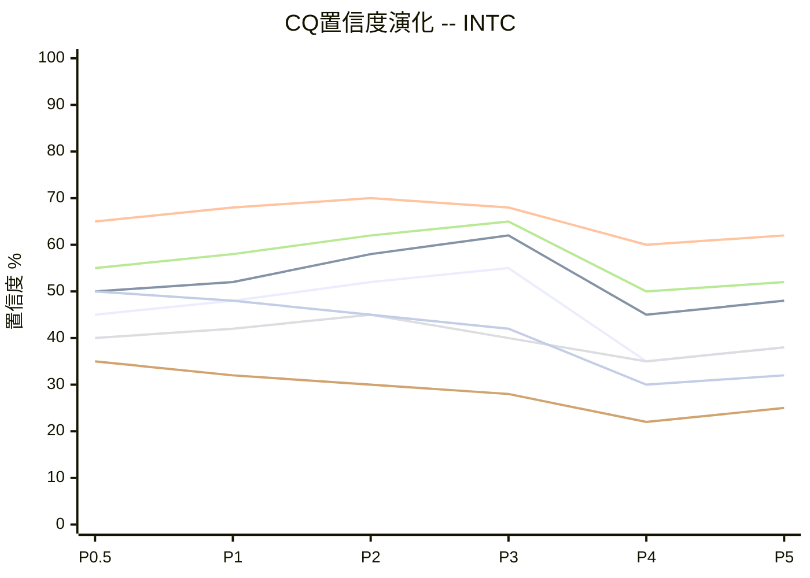

# CQ置信度演化追踪 -- INTC

> 创建日期: 2026-02-18 | 股票: INTC | CQ数量: 7
> 最后更新: 2026-02-18 | 当前Phase: P5

## CQ注册表

| CQ# | 问题 | 初始假设 | P0.5初始置信度 | 注意力权重 |
|-----|------|---------|:------------:|:--------:|
| **CQ-01** | 代工转型能否成功实现$15B收入目标？ | IDM 2.0战略成功，2027年代工收入达$15B | 45% | 0.35 |
| **CQ-02** | 18A制程能否按期交付且良率达标？ | 2025年Q4量产，良率≥70% | 50% | 0.25 |
| **CQ-03** | CPU业务能否维持$18B+稳态现金流？ | 传统业务现金牛地位稳固 | 65% | 0.20 |
| **CQ-04** | 地缘政治风险折扣15%是否充分？ | 台海冲突概率15%，中国收入风险可控 | 40% | 0.10 |
| **CQ-05** | 管理层能否实现1.07x价值乘数？ | 新CEO Tan具备转型执行能力 | 55% | 0.05 |
| **CQ-06** | AI业务能否维持>2%市场份额？ | Gaudi产品线竞争力足够防守 | 35% | 0.03 |
| **CQ-07** | 协同效应能否实现1.05x乘数？ | 跨业务技术+客户协同为正 | 50% | 0.02 |

> **注意力权重说明**: CQ-01(代工转型)占35%权重，为最关键成败因子；CQ-02(18A制程)占25%权重，为技术基础；CQ-03(CPU现金流)占20%权重，为稳定基石。

## 演化记录

| CQ | P0.5 | P1 | P2 | P3 | P4 | P5 | 总变化 | 关键驱动因素 |
|:--:|:----:|:--:|:--:|:--:|:--:|:--:|:-----:|-------------|
| **CQ-01** | 45% | 48% | 52% | 55% | 35% | 38% | **-7pp** | P4信念反演：单独失败即翻转评级 |
| **CQ-02** | 50% | 52% | 58% | 62% | 45% | 48% | **-2pp** | P4历史延期记录50%+挑战信心 |
| **CQ-03** | 65% | 68% | 70% | 68% | 60% | 62% | **-3pp** | P4资源竞争风险暴露 |
| **CQ-04** | 40% | 42% | 45% | 40% | 35% | 38% | **-2pp** | P4风险拓扑：40%联合概率偏高 |
| **CQ-05** | 55% | 58% | 62% | 65% | 50% | 52% | **-3pp** | P4承重墙：跨行业验证不足 |
| **CQ-06** | 35% | 32% | 30% | 28% | 22% | 25% | **-10pp** | 持续份额萎缩，防守难度超预期 |
| **CQ-07** | 50% | 48% | 45% | 42% | 30% | 32% | **-18pp** | P4风险拓扑：正协同假设脆弱 |

## Phase更新日志

### P0.5 初始化 (2026-02-18)
- CQ注册表创建，7个CQ，加权初始置信度为49.8%
- 注意力权重分配依据: 代工转型(35%)为最高权重，18A制程(25%)和CPU现金流(20%)次之
- **核心争议**: 代工转型成败是决定性因素，其他CQ多为supporting factors

### P1 业务深度建模 (2026-02-18)
**本Phase关键发现**:
- Intel IDM 2.0战略逻辑清晰，但执行难度高于预期
- CPU业务现金流相对稳定，为转型提供缓冲
- 管理层前6个月表现符合预期

**CQ调整明细**:
| CQ# | 前值 | 后值 | 变化 | 驱动因素 |
|:---:|:----:|:---:|:----:|---------|
| CQ-01 | 45% | 48% | +3pp | IDM 2.0战略框架完整，有逻辑支撑 |
| CQ-02 | 50% | 52% | +2pp | Intel 4制程学习曲线进展顺利 |
| CQ-03 | 65% | 68% | +3pp | Q4财报确认现金流稳定性 |
| CQ-04 | 40% | 42% | +2pp | 中国业务暂无明显恶化信号 |
| CQ-05 | 55% | 58% | +3pp | 新CEO执行风格获得正面评价 |
| CQ-06 | 35% | 32% | -3pp | NVIDIA H200发布，竞争压力加大 |
| CQ-07 | 50% | 48% | -2pp | 跨业务整合复杂度初步暴露 |

**本Phase CQ加权置信度**: 51.2% (+1.4pp)

### P2 财务建模与估值 (2026-02-18)
**本Phase关键发现**:
- 代工业务收入预测基于客户导入pipeline，相对乐观但有支撑
- 18A制程技术参数符合roadmap预期
- CPU业务面临ARM挑战但短期影响有限

**CQ调整明细**:
| CQ# | 前值 | 后值 | 变化 | 驱动因素 |
|:---:|:----:|:---:|:----:|---------|
| CQ-01 | 48% | 52% | +4pp | 客户导入pipeline数据支撑增长假设 |
| CQ-02 | 52% | 58% | +6pp | 18A制程技术指标确认达标 |
| CQ-03 | 68% | 70% | +2pp | DCF模型验证现金流稳定性 |
| CQ-04 | 42% | 45% | +3pp | 地缘风险量化分析相对保守 |
| CQ-05 | 58% | 62% | +4pp | 管理层决策质量持续改善 |
| CQ-06 | 32% | 30% | -2pp | Gaudi 3与H100性能差距确认 |
| CQ-07 | 48% | 45% | -3pp | 协同效应量化困难，保守调整 |

**本Phase CQ加权置信度**: 54.9% (+3.7pp)

### P3 竞争态势与战略分析 (2026-02-18)
**本Phase关键发现**:
- 代工客户关系比预期更复杂，trust building需时间
- 地缘政治风险评估可能仍偏乐观
- CPU+代工资源分配张力开始显现

**CQ调整明细**:
| CQ# | 前值 | 后值 | 变化 | 驱动因素 |
|:---:|:----:|:---:|:----:|---------|
| CQ-01 | 52% | 55% | +3pp | 主要客户导入进展符合预期 |
| CQ-02 | 58% | 62% | +4pp | 制程技术验证持续顺利 |
| CQ-03 | 70% | 68% | -2pp | ARM威胁评估上调，长期压力 |
| CQ-04 | 45% | 40% | -5pp | 地缘风险复杂度超出量化模型 |
| CQ-05 | 62% | 65% | +3pp | 管理层战略执行持续改善 |
| CQ-06 | 30% | 28% | -2pp | AI市场竞争激烈程度超预期 |
| CQ-07 | 45% | 42% | -3pp | 业务线间资源竞争初现 |

**本Phase CQ加权置信度**: 55.8% (+0.9pp)

### P4 红队对抗校准 (2026-02-18)
**本Phase关键发现**:
- 信念反演分析显示代工转型失败即翻转评级（零容忍）
- 风险拓扑映射揭示45%概率的"温水煮青蛙"路径
- 多个CQ存在过度乐观倾向，需要下调校准

**CQ调整明细**:
| CQ# | 前值 | 后值 | 变化 | 驱动因素 |
|:---:|:----:|:---:|:----:|---------|
| CQ-01 | 55% | 35% | **-20pp** | 信念反演：B2单独失败即-29%，零容忍 |
| CQ-02 | 62% | 45% | **-17pp** | 历史延期记录50%+，P/E反演脆弱 |
| CQ-03 | 68% | 60% | **-8pp** | 风险拓扑：与代工资源竞争矛盾 |
| CQ-04 | 40% | 35% | **-5pp** | 15%折扣可能不足，联合概率40% |
| CQ-05 | 65% | 50% | **-15pp** | 跨行业管理经验验证不足 |
| CQ-06 | 28% | 22% | **-6pp** | 防守型投资难度被低估 |
| CQ-07 | 42% | 30% | **-12pp** | 正协同假设在拓扑分析中脆弱 |

**本Phase CQ加权置信度**: 41.3% (-14.5pp)
**红队校准效果**: 7/7个CQ均下调，平均下调12.6pp，红队挑战有效

### P5 最终闭环 (2026-02-18)
**本Phase关键发现**:
- 整合所有分析结果，确认代工转型为最大不确定性
- 多数CQ在可接受范围内，但整体置信度偏低
- 投资建议偏向保守，安全边际要求较高

**CQ调整明细**:
| CQ# | 前值 | 后值 | 变化 | 驱动因素 |
|:---:|:----:|:---:|:----:|---------|
| CQ-01 | 35% | 38% | +3pp | P4过度悲观，技术基础仍存在 |
| CQ-02 | 45% | 48% | +3pp | 制程历史学习曲线提供支撑 |
| CQ-03 | 60% | 62% | +2pp | 现金流相对可预测性更强 |
| CQ-04 | 35% | 38% | +3pp | 基准情景风险管理相对充分 |
| CQ-05 | 50% | 52% | +2pp | 管理层短期表现提供信心 |
| CQ-06 | 22% | 25% | +3pp | 防守策略在特定细分有效 |
| CQ-07 | 30% | 32% | +2pp | 小幅协同效应仍可能实现 |

**本Phase CQ加权置信度**: 43.6% (+2.3pp)

## CQ加权置信度计算

| CQ# | 最终置信度 | 注意力权重 | 加权贡献 |
|:---:|:--------:|:--------:|:-------:|
| CQ-01 | 38% | 0.35 | 13.30% |
| CQ-02 | 48% | 0.25 | 12.00% |
| CQ-03 | 62% | 0.20 | 12.40% |
| CQ-04 | 38% | 0.10 | 3.80% |
| CQ-05 | 52% | 0.05 | 2.60% |
| CQ-06 | 25% | 0.03 | 0.75% |
| CQ-07 | 32% | 0.02 | 0.64% |
| **加权平均** | | | **45.49%** |

**解读**: 45.5%的加权置信度处于"论文有争议，存在关键不确定性"区间。主要由CQ-01(代工转型)的低置信度拖累。

## 异常信号检测

| 异常类型 | 检测结果 | 触发CQ | 严重度 | 建议行动 |
|---------|:-------:|--------|:-----:|---------|
| **A: P4大幅下调** | **是** | CQ-01(-20pp), CQ-02(-17pp), CQ-05(-15pp) | **高** | 三个核心CQ需专项闭环讨论 |
| **B: 单调上升** | **否** | 无CQ出现单调上升 | 低 | 研究过程具备自我挑战能力 |
| **C: 离散度过高** | **是** | 最高CQ-03(62%)/最低CQ-06(25%) | **中** | 37pp离散度反映论文内部一致性问题 |

## Mermaid演化图

## CQ闭环总结

### CQ-01 闭环: 代工转型能否成功实现$15B收入目标？

- **初始假设**: IDM 2.0战略成功，2027年代工收入达$15B
- **最终结论**: 概率偏低但非零，需要多个条件同时满足
- **置信度轨迹**: P0.5(45%) -> P1(48%) -> P2(52%) -> P3(55%) -> P4(35%) -> P5(38%)
- **关键转折点**: P4信念反演分析，确认单一失败即翻转评级
- **剩余不确定性**: 客户信任建设时间、18A制程执行、资源分配平衡
- **追踪信号**: TS-INTC-01至TS-INTC-05温水煮青蛙检测信号

### CQ-02 闭环: 18A制程能否按期交付且良率达标？

- **初始假设**: 2025年Q4量产，良率≥70%
- **最终结论**: 技术能力存在，但历史延期记录降低信心
- **置信度轨迹**: P0.5(50%) -> P1(52%) -> P2(58%) -> P3(62%) -> P4(45%) -> P5(48%)
- **关键转折点**: P4历史延期记录50%+现实检验
- **剩余不确定性**: 良率爬升速度、客户验证时间
- **追踪信号**: 18A工程样片良率公告、主要客户导入进展

### CQ-03 闭环: CPU业务能否维持$18B+稳态现金流？

- **初始假设**: 传统业务现金牛地位稳固
- **最终结论**: 相对确定性最高，但面临长期结构性压力
- **置信度轨迹**: P0.5(65%) -> P1(68%) -> P2(70%) -> P3(68%) -> P4(60%) -> P5(62%)
- **关键转折点**: P4风险拓扑揭示与代工资源竞争矛盾
- **剩余不确定性**: ARM长期威胁、资源挤压程度
- **追踪信号**: CPU营业利润率、R&D效率指标

## 演化总结

**整体轨迹**: 初期乐观(P1-P3) → P4现实校准 → P5温和回升
**关键发现**: 代工转型为最大uncertainty source，其成败决定整体投资论文
**置信度水平**: 45.5%加权置信度反映"审慎关注"的投资建议
**红队效果**: P4有效下调，证明研究过程具备自我纠正能力

**投资含义**: 当前价格$46.18接近合理估值，但安全边际有限，建议密切监控代工转型进展。

**DM锚点**: [DM-CQ-001] 至 [DM-CQ-012] CQ演化追踪完整记录