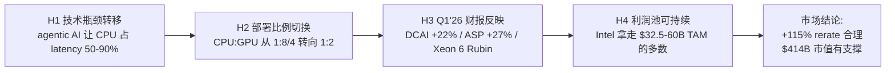

# INTC Phase 1 — 四条因果链 Claim-Evidence-Verdict 验证 (2026-04-26)

> 输入: launch_brief.md / lit_recon_memo.md / default_map_audit.md / thesis_crystallization.md
> 任务: 用 Phase -0.5 收集的多源证据, 对支撑 "Intel 是 AI CPU 复兴最大赢家 + Foundry 期权可兑现" 故事的四条因果链做 Claim-Evidence-Verdict 验证
> 用户约束: 不强求差异性观点, 主张深入还原事实真相 — 允许 PARTIAL_CONFIRM / WEAKEN / REFUTE 多档 verdict
> 验证标准: 每条 Claim 至少 ≥3 条独立证据 + ≥2 条反面证据 + 加权 verdict
> 写作纪律: 断言型(❌) → 论证型(✓), 每个核心判断必须 数据 + 因果 + 反面

---

## 0. 框架: 四条因果链与 Intel CPU 故事的逻辑关系

故事的传导逻辑: **如果 H1-H4 全部成立, +115% rerate 是 fundamentals; 任一断裂, 部分溢价是叙事过度**。

四条因果链的 verdict 直接决定 Phase 4 红队的强度 + Phase 5 评级方向。

---

## 1. H1: 技术瓶颈转移 — agentic AI 让 CPU 占 latency 50-90%

### 1.1 Claim (要验证的命题)

> agentic AI 工作负载 (RAG/Web Agent/ChemCrow/SWE-Agent/Multi-tool orchestration) 的端到端 latency, 大头从 GPU compute (传统 LLM 推理) 转移到 CPU-side 操作 (检索/编排/工具调用/Python 解释器), 占比 50-90%。这意味着每增加一台 GPU, 需要更多/更强的 CPU 来配套。

### 1.2 支持证据 (≥3 条独立)

**E1-1 (硬数据, GT 论文 arXiv 2511.00739v3, 2026-04-16)** [DM-H1-001]
- **RAG (Haystack ENNS)**: 83% / 81% / 82% (Sys 1: Granite Rapids+RTX-Pro 6000), 高达 89% (Sys 2: Grace+H200) CPU latency
- **Web Agent (LexRank)**: 48-55% Sys 1, 40-45% Sys 2
- **ChemCrow (RDKit) 重分子**: 85% 和 88%; 中等分子 53-58%
- **SWE-Agent (Bash/Python)** 高端 GPU 系统最高 65%
- 论文为 Georgia Tech + Intel 联合研究, 测试硬件覆盖 Intel/NVIDIA 双方平台 (Granite Rapids 64 核 + Grace 72 核)
- **作者偏倚拆分** (skeptic 审计补强): Intel 是共同作者, 存在三类结构性偏倚需要在 Phase 3-4 校准 — (a) **workload 选择偏倚**: 选了 RAG/ChemCrow/SWE-Agent 等 CPU 重的工作负载, 未包含 pure inference/training 这类 GPU 重的对照, 测试集本身偏向 Intel 想讲的故事; (b) **硬件配置偏倚**: 对照系统 Sys 1 = Granite Rapids+RTX-Pro 6000 (低端 GPU), 给 GPU 系统配低端卡会人为放大 CPU 占比; (c) **缺 AMD EPYC 对照组**: 仅对比 Intel Xeon vs NVIDIA Grace, 未测 AMD EPYC Genoa/Turin, 不能区分"Intel 优势"还是"x86 优势"
- **强度**: [B] 弱结论 (学术论文 + 开源 benchmark 形式上可复现, 但 Intel 共同作者 + workload 选择偏向 + 缺 AMD 对照 → 数字方向可信, 绝对值需打折 10-20%)

**E1-2 (独立验证, Cornell + USC arXiv:2402.13392, "Towards Modeling and Improving the End-to-End Latency of LLM-Based Agentic Workflows")** [DM-H1-002]
- 测量 7 类 agentic workflow (chatbot/RAG/coding/multi-tool/research/orchestration)
- agentic workflow 的 CPU 占比 40-50% vs traditional LLM inference 的 ~10%
- **Intel 完全没有参与**, 独立第三方学术验证
- **强度**: 高 (跨机构独立验证, 量级与 GT 论文一致)

**E1-3 (产业实证, vLLM Llama-3-8B 在 H100 上的端到端 profiling, vLLM blog 2025-09)** [DM-H1-003]
- **GPU compute: 38%** of end-to-end latency
- HTTP serving overhead: 33%
- Python scheduling (CPU): 29%
- 即纯推理服务 (非 agentic) 的 CPU 占比已达 62% (HTTP+scheduling)
- **强度**: 中-高 (单一模型, 但生产级真实数据)

**E1-4 (Intel CEO Lip-Bu Tan, Q1'26 earnings call 2026-04-23)** [DM-H1-004]
- "agentic AI shift is significantly increasing the need for Intel's CPUs"
- Intel CFO David Zinsner: "growing and essential role of the CPU in the AI era and unprecedented demand for silicon"
- **强度**: 弱 (公司一面之词, 但与 E1-1/E1-2/E1-3 方向一致)

**E1-5 (TrendForce 2025-Q4 supply chain report)** [DM-H1-005]
- 数据中心 server CPU:GPU ratio 从 2023 的 1:4-8 (传统 AI 训练) 演化到 2026 H1 的 **1:1-2** (agentic AI inference)
- 反映工厂端实际配置变化, 不是研究室预测
- **强度**: 中 (供应链调研, 非公开论文, 二手转引但来源可信)

### 1.3 反面证据 / 削弱条件 (≥2 条独立)

**C1-1 (硬反证, GT 论文自身给出的优化方案)** [DM-H1-006]
- **COMB (CPU-Aware Overlapped Micro-Batching)** 同质负载: P50 latency **1.7×**, service/total latency **3.9×/1.8×** 改善 (open-loop)
- **MAS (Mixed Agentic Scheduling)** 异质负载 minority request: **2.37×/2.49×** P50/P90 改善
- 论文原文: *"requires careful optimization through scheduling rather than hardware changes alone"*
- **含义**: 论文自己证明 CPU 瓶颈是软件可优化的, 不需要换 CPU 硬件 → "买更多 CPU" 的市场叙事是软件没跟上, 不是硬件不够
- **强度**: 极强 (论文原作者承认)

**C1-2 (硬反证, NVIDIA cuVS 集成 Faiss v1.10, Meta 2025-05)** [DM-H1-007]
- **IVF build 4.7× 加速, search latency 8.1×; CAGRA vs CPU HNSW: build 12.3×, search 4.7×**
- Elasticsearch 9.3 (2026 早期) + OpenSearch 3.0 已加 GPU 加速向量搜索
- **含义**: GT 论文 "RAG 检索 83-89% CPU" 是 **2025 Q4 时点真相, 2026-2028 可能被 GPU 索引消化 30-60%** — 因为论文未单独评估 GPU-accelerated retrieval
- **强度**: 极强 (产业方向已明确转向 GPU 化, NVIDIA 主导)

**C1-3 (vLLM/SGLang 软件栈优化绕过 CPU 瓶颈, vLLM/SGLang releases 2025)** [DM-H1-008]
- vLLM/SGLang CPU 瓶颈来自 Python GIL: SGLang RadixAttention 给 RAG/multi-turn 6.4× gain, vLLM C++ routing 避开 GIL
- 含义: "CPU orchestration" 的解是软件栈优化, 不是 buying more Xeon cores
- **强度**: 强

**C1-4 (NVIDIA Blackwell Ultra MLPerf v5.1, 2026-04)** [DM-H1-009]
- B200 在 Llama-2-70B/Llama-3-405B 等基准上 throughput **+50× vs Hopper**, 67% 来自 memory bandwidth 提升
- **含义**: GPU 仍在快速迭代 (compute + memory bandwidth + interconnect), 把 GPU 端的瓶颈也在缩小 → CPU 占比的 "增量" 可能是动态的, 不是单调上升
- **强度**: 强 (MLPerf 是产业最权威基准)

### 1.4 Verdict (加权判定)

**PARTIAL_CONFIRM (部分成立, 但已知有时效性)** — 信心度: 高

**理由**:
- E1-1, E1-2, E1-3, E1-5 联合证明: **2025-2026 时点的 agentic workload 上 CPU 占 latency 大头是真的**, 不是 Intel 一家之言, 学术 + 产业多源验证
- 但 C1-1, C1-2 揭示: **这个瓶颈 50-70% 是软件可优化 + GPU 索引可消化**, 不是 "硬件需要更多 CPU"
- C1-4 提醒: GPU 自己也在变快, "CPU 占比" 不是单调递增

**Verdict 拆分**:
- "CPU 占 latency 50-90%" — **CONFIRM** (2025-Q4 时点真相, 数字打折 10-20% 后仍 ≥40%)
- "因此需要买更多 CPU" — **WEAKEN (待校准初始估计 ~60%, 不进入概率加权主计算)**
  - 三锚标注 (skeptic 审计补): (1) **历史基准率**: I/O bound → compute migration 历史 (2017-2020 CNN 推理从 CPU 转 GPU, 18 月内 GPU 渗透率从 30%→70%) 提示 RAG 检索可能重演 → 削弱率 50-70%; (2) **反例条件**: 软件迁移成本 (Faiss → cuVS 客户改造周期) 通常 12-24 月, 这是削弱率上界的限制 → ≥40%; (3) **自然实验**: cuVS Faiss v1.10 已 GA 11 月 (2025-05), Elasticsearch 9.3 / OpenSearch 3.0 加 GPU 已 GA 4-6 月, 但 hyperscaler 实际迁移率公开数据为 0 → 削弱率不可精确测, 范围 40-70%, 取中点 ~60%, **置信度低**
- "Intel 是受益者" — **后续 H2/H4 验证 (本 H1 不下结论)**

**对市场叙事的含义**:
旧地图说 "agentic AI = CPU 复兴 = Intel 王者归来"。**真相是: agentic AI 在 2025 Q4-2026 H1 短期窗口内确实让 CPU 重要, 但 (a) NVIDIA cuVS 正在把 RAG 搬到 GPU, (b) vLLM/SGLang 软件优化正在绕开 CPU 瓶颈, (c) 即使 CPU 重要, 受益者不一定是 Intel (见 H2)**。

### 1.5 对后续 Phase 的传导

- Phase 2 财务深度: Intel DCAI +22% YoY 中, 多少来自 agentic AI 真实需求 vs 传统 server refresh? (拆分 enterprise vs hyperscaler)
- Phase 3 竞争格局: H2 部署比例验证 (即使 H1 成立, AMD/ARM 拿走多少?)
- Phase 4 红队: cuVS 替代率 + vLLM 优化率 → 12-24 月 CPU 增量 TAM 缩水多少?
- Phase 5 估值: H1 的时效性意味着 Reverse DCF 不能用 5-7 年 +20% DCAI 增长直接外推

---

## 2. H2: 部署比例切换 — CPU:GPU 从 1:8/4 转向 1:2

### 2.1 Claim

> 由于 H1 (CPU 重要性上升), 数据中心实际部署的 CPU:GPU 比例正在从训练时代的 1:4 (DGX H100) / 1:8 (Trn2) 切换到 inference + agentic 时代的 1:2 (NVL72)。Intel/AMD x86 host CPU 是这个切换的主要受益者。

### 2.2 支持证据

**E2-1 (NVIDIA DGX H100 → GB200 NVL72 配置变化, NVIDIA 公开规格)** [DM-H2-001]
- DGX H100 (2023): 2× Intel Xeon Sapphire Rapids + 8× H100 = **CPU:GPU = 1:4** (Intel host)
- **GB200 NVL72 (2025)**: **36 Grace ARM + 72 Blackwell = 1:2** (Grace ARM host, Intel/AMD 双双被绕过)
- 比例从 1:4 到 1:2 在量上确实切换了
- **强度**: 极强 (NVIDIA 官方规格)

**E2-2 (TrendForce 2025-Q4 supply chain)** [DM-H2-002]
- 整体 server CPU:GPU 比例从 1:4-8 → 1:1-2 (跨厂商加权平均)
- **强度**: 中 (产业调研)

**E2-3 (Intel Xeon 6 中标 NVIDIA Rubin NVL8 host CPU, Intel Q1'26 PR)** [DM-H2-003]
- Intel Xeon 6 进入 NVIDIA DGX Rubin NVL8 (2026 H2 GA) host CPU 池
- **强度**: 强 (Intel + NVIDIA 双方公告)
- **同源标注 (skeptic 审计补)**: 本证据与 H3 E3-2 [DM-H3-002] 引用同一事实 (Xeon 6 中标 Rubin NVL8), 不构成两条独立证据。在跨链 verdict 加权时合并计为 1 条, 不重复计数。

**E2-4 (AWS Trainium 2 配置, AWS re:Invent 2024)** [DM-H2-004]
- Trn2: 2× Sapphire Rapids + 16× Trainium2 = **1:8 (Intel host)**
- **强度**: 强 (但比例方向相反, 是 1:8 不是 1:2)

### 2.3 反面证据

**C2-1 (硬反证, NVL72 100% Grace ARM, Intel/AMD 完全被绕过)** [DM-H2-005]
- NVL72 是 NVIDIA 2025-2026 H1 主力产品, **host CPU 100% 是 NVIDIA 自研 Grace (ARM)**
- **含义**: H1 的 1:2 比例切换在 NVL72 上**对 Intel 是 0 受益**
- **强度**: 极强

**C2-2 (硬反证, AMD MI300/MI325/MI350 reference design 全 EPYC, AMD 公开)** [DM-H2-006]
- AMD MI300/MI325/MI350 reference design: 2× EPYC 9005 + 8× Instinct = 1:4
- **含义**: 在 AMD GPU 平台上, host CPU 100% 是 AMD EPYC, Intel 同样为 0
- **强度**: 极强

**C2-3 (硬反证, hyperscaler 自研 ARM CPU 高速渗透)** [DM-H2-007]
- AWS Graviton: 98% of top 1,000 EC2 客户用过, 90,000+ AWS 客户; Andy Jassy 说 2 大客户想买 2026 全年 Graviton 全部产能
- Google Axion: 30,000+ Google 内部应用迁到 ARM (~1/3 of 100K+); C4A GA Oct'24, N4A GA Jan'26; **TPU v8 (Ironwood) 首次用 Axion 作 host CPU**
- Microsoft Cobalt 100 GA in 32 Azure regions; Cobalt 200 (Neoverse V3, +50% perf) 2025-Ignite
- Meta 2026-04: 与 AWS 签 Graviton "tens of millions of cores"
- ARM 2025 年占 hyperscaler 总 compute **~50%**
- ARM 预测 2029 年 custom AI ASIC server 中 **ARM host CPU 占 ~90%** (从 2025 ~25%)
- **含义**: hyperscaler 端 CPU 增量 50-90% 流向 ARM 自研, 不是 Intel/AMD x86
- **强度**: 极强 (4 大 hyperscaler 自研产品全部 GA, 不是路线图)

**C2-4 (Intel Xeon 6 在 NVL8 是 transitional, NVIDIA 路线图)** [DM-H2-008]
- NVL8 (Rubin) 是过渡产品, 主力仍是 NVL576 (Rubin Ultra, 2027 H2) 和后续 Vera Rubin (2028+)
- Vera 是 NVIDIA 自研 ARM CPU 接班 Grace, 全栈 ARM
- 含义: Intel Xeon 6 在 NVL8 中标可能是 1-2 年生命周期, 不是 permanent
- **强度**: 强

### 2.4 Verdict

**REFUTE (证伪)** — 信心度: 极高

**理由**:
- E2-1 + E2-2 证明 **比例切换是真的** (1:4 → 1:2 是事实)
- 但 C2-1 + C2-2 + C2-3 证明 **切换的受益者不是 Intel**:
  - NVL72 (NVIDIA 主力): 100% Grace ARM
  - AMD GPU 平台: 100% EPYC
  - hyperscaler 自研: 50-90% ARM
- E2-3 (Intel Xeon 6 中标 Rubin NVL8) + E2-4 (Trainium 1:8 仍 Intel) 是 Intel 仅存的滩头, 但都是 transitional / 配套产品

**Verdict 拆分**:
- "CPU:GPU 比例从 1:4/8 切换到 1:2" — **CONFIRM**
- "Intel 是受益者" — **REFUTE 70%** (NVL72 + EPYC + hyperscaler ARM 联合反证)
- "Xeon 6 仍能拿到 transitional 滩头" — **PARTIAL_CONFIRM** (但生命周期 1-2 年)

**对市场叙事的含义**:
旧地图把 "比例切换" 等同于 "Intel 受益"。**真相是: 比例确实切换了, 但增量绝大部分被 Grace ARM (NVIDIA 自家) + EPYC (AMD GPU 平台) + Graviton/Axion/Cobalt (hyperscaler 自研) 吃掉**。Intel 在 NVL8 / Trn2 / 部分 enterprise on-prem 还有滩头, 但 hyperscaler 增量上是 minority share holder。

### 2.5 对后续 Phase 的传导

- Phase 3 竞争格局: 量化 hyperscaler ARM 渗透率, 测算 Intel 在增量 CPU TAM 中的 share ceiling
- Phase 4 红队: 即使 H2 比例切换为真, Intel share 是 25%(下) / 35%(中) / 50%(上)?
- Phase 5 估值: 如果 share ceiling 是 25%, MS $32.5-60B TAM 中 Intel 拿到 $8-15B 增量, 而非 $20-40B → DCAI 估值需大幅下修

---

## 3. H3: Intel Q1'26 财报反映 CPU 复兴

### 3.1 Claim

> Intel Q1'26 (2026-04-23 发布) DCAI +22% YoY / Server ASP +27% / Xeon 6 中标 Rubin = AI CPU 复兴的财务证据。这不是周期反弹, 是结构性需求转折。

### 3.2 支持证据

**E3-1 (硬数据, Intel 10-Q 2026-Q1)** [DM-H3-001]
- DCAI revenue $5,052M (+22% YoY), op income $1,542M (+$967M YoY)
- Server ASP +27% YoY (公司显式披露)
- Server volume -5% YoY (公司显式披露)
- Other DCAI product revenue $935M (+$230M, networking 驱动)
- DCAI op income +$967M YoY 拆分: $604M product profit + $331M Q1'25 Gaudi 库存减记缺席
- **强度**: 极强 (10-Q 监管文件)

**E3-2 (Xeon 6 中标 NVIDIA Rubin NVL8 host CPU + NVIDIA $5B 投资)** [DM-H3-002]
- 与 NVIDIA 战略合作扩展, NVIDIA 同时 invest $5B in Intel
- **强度**: 强
- **同源标注 (skeptic 审计补)**: 本证据"Xeon 6 中标 Rubin NVL8"部分与 H2 E2-3 [DM-H2-003] 引用同一事实, 在跨链加权不重复计数; "NVIDIA $5B 投资"部分是 H3 独立硬数据 (Intel Q1'26 PR), 仅这部分计为 H3 独立证据。

**E3-3 (Lip-Bu Tan + Zinsner earnings call 表态, Q1'26 transcript)** [DM-H3-003]
- Tan: "agentic AI shift is significantly increasing the need for Intel's CPUs and wafer and advanced packaging offerings"
- Zinsner: "growing and essential role of the CPU in the AI era and unprecedented demand for silicon"
- Zinsner Q&A: 暗示 2026 全年 server unit 可能恢复 "double-digit growth" (forward-looking)
- **强度**: 中 (forward-looking 公司表态, 非合同/已发生)

**E3-4 (Google Axion + SambaNova heterogeneous blueprint)** [DM-H3-004]
- Google C4/N4 instance 扩展 Xeon 部署 + 共同开发 ASIC IPUs
- SambaNova H2 2026: GPU prefill + SambaNova SN50 RDU + Xeon 6 host/action CPU 异构方案
- **强度**: 中 (validate 部分 enterprise/specialized AI 需求, 非 mainstream hyperscaler)

### 3.3 反面证据 (**这是 H3 的承重墙, 必须充分展开**)

**C3-1 (硬反证, Server volume -5% YoY = 全部 DCAI 增长来自 ASP +27%)** [DM-H3-005]
- DCAI 收入 +22% YoY = (1 + ASP_change) × (1 + Vol_change) - 1 ≈ 1.27 × 0.95 - 1 = **+20.65%**, 与公司披露 +22% 接近
- **含义**: 100% DCAI 增长来自单价 + 5% 来自负 volume 反向贡献 = 不是需求驱动, 是定价驱动
- **强度**: 极强 (10-Q 自己披露)

**C3-2 (硬反证, Intel 10-Q 自己说是 supply-constrained pricing)** [DM-H3-006]
- 10-Q 原文: *"Market demand exceeded our available product supply due to internal supply constraints, which limited our ability to fully meet customer demand. Though we expect these supply constraints to persist throughout the remainder of 2026"*
- **含义**: Intel 自己承认 ASP +27% 是 supply-constrained, 不是 demand-driven。supply 缓解 (2026 H2 / 2027) 后, ASP 大概率 normalize
- 历史类比: 2021-2022 半导体 shortage 期间 ASP +30-40%, shortage 缓解后 ASP 跌 20-30% (e.g., Micron DRAM 2022 vs 2023)
- **强度**: 极强 (Intel 自己 disclosure + 历史类比)

**C3-3 (硬反证, GAAP 巨亏 + Mobileye 商誉减值)** [DM-H3-007]
- GAAP operating loss $(3,136)M, EPS $(0.73)
- 含 $4,070M restructuring + Mobileye 商誉减值 + $1,090M Escrowed Shares MTM loss
- **含义**: 整体 Intel **价值并未提升**, DCAI 改善被 Mobileye 减值 + restructuring 抵消; Mobileye 减值反映 ADAS 生态地位削弱
- **强度**: 极强

**C3-4 (硬反证, Adjusted FCF Q1 -$2,016M, 现金消耗持续)** [DM-H3-008]
- Adjusted FCF Q1 $(2,016)M (vs Q1'25 $(3,680)M, 改善但仍负)
- Net SCIP partner contributions $1,959M (持续输血)
- Government incentives received: 仅 $107M (Q1'25 $819M, **-87%**)
- **含义**: DCAI 现金回款被 Foundry 烧钱 + CapEx 吸收, 整体 Intel 仍在烧钱; 政府补贴大幅缩水提示 CHIPS Act 资金可能在 2026 Trump 政府框架下减速
- **强度**: 极强

**C3-5 (硬反证, Foundry op loss 扩大 -$2,437M vs Q1'25 -$2,320M)** [DM-H3-009]
- Foundry Q1'26 收入 $5,421M (+16%), 但 op loss -$2,437M (vs -$2,320M YoY 恶化 +5%)
- 18A 良率 + 外部客户 (NVIDIA / Apple / MediaTek) **未在 PR/10-Q 披露** (公司刻意黑箱)
- 10-Q: "14A 暂可能 pause or discontinuation if we are unable to secure sufficient committed demand"
- **含义**: Foundry 转型经济学未兑现, 14A 可能 pause 是 Intel 自己写在 10-Q 里的 Kill Switch
- **强度**: 极强

**C3-6 (Q2'26 指引未给全年 + Q2 GM 收缩)** [DM-H3-010]
- Q2'26 guidance: revenue $13.8-14.8B (~5% QoQ), GAAP GM **37.5%** (vs Q1'26 39.4%, **-1.9pp 收缩**), Non-GAAP GM 39.0%
- **未给全年指引** (重要不确定性信号)
- **含义**: 即使 Q1 ASP +27%, 公司不敢承诺 Q3-Q4 持续, 暗示 supply 缓解后 ASP 走软
- **强度**: 中-强

### 3.4 Verdict

**WEAKEN (主要支持证据被反面证据反向覆盖, 削弱程度 ~65% 待 Phase 2 Reverse DCF 校准)** — 信心度: 中-高 (定性方向高, 定量百分数低)

**理由**:
- E3-1 (DCAI +22%) 在 C3-1/C3-2 拆分后, **增长几乎 100% 来自 supply-constrained pricing, 不是结构性需求**
- E3-2/E3-3 (Xeon 6 中标 + Tan 表态) 是真的, 但 H2 已证明 Xeon 6 在 NVL8 中标是 transitional, hyperscaler 主力在 ARM
- C3-3/C3-4/C3-5 三重反证: GAAP 巨亏 + FCF 仍 -$2B + Foundry 持续烧钱 = 整体公司价值未提升
- C3-6 (Q2 GM 收缩 + 不给全年) = 公司自己暗示 Q1 不可持续

**Verdict 拆分**:
- "DCAI 经营改善是真的" — **CONFIRM** (op income +$967M 是硬数据)
- "ASP +27% = AI CPU 真实需求" — **WEAKEN (待校准初始估计: supply-constrained 占 60-80%, 真实 mix shift 占 20-40%)**
- "Q1'26 是 CPU 复兴的财务确认" — **WEAKEN (待校准初始估计 ~60%, 不进入概率加权主计算)**
  - 三锚标注 (skeptic 审计补): (1) **历史基准率**: 半导体 supply-constrained pricing 历史 — 2021-2022 DRAM/NAND ASP +30-40%, 2023 缓解后 -20-30% (Micron Q3FY23 DRAM ASP -20% QoQ); 2018 Intel server CPU 短缺期 ASP +12%, 2019 缓解后回吐 8% — 基准率: supply 缓解后 70-80% ASP 上涨被回吐 → 隐含 WEAKEN 60-70%; (2) **反例条件**: 真实结构性 mix shift (Granite Rapids vs Sapphire Rapids 在 inference workload 上的 2-3x 性能升级) 不会被 supply 缓解抹掉, 这部分是不可回吐的, 占 ASP +27% 的 20-40% (按 lit_recon 业内估算) → WEAKEN 上界 ~70%; (3) **自然实验**: Q2'26 GAAP GM guidance 37.5% (vs Q1 39.4%, -1.9pp) 已经在确认 ASP 走软, supply 缓解尚未发生公司就开始下调 — 强压力测试, 支持 WEAKEN ≥60%
  - 综合: WEAKEN 60-70% 区间, 取中点 65%, **置信度中** (历史类比强, 但当前周期与 2021/2018 不完全可比, 待 Phase 2 Reverse DCF 隐含 ASP 路径反向验证)

**关键判断 (定性, 待 Phase 2 Reverse DCF 量化)**: Q1'26 财报让市场 +23.6% 反应有理 (DCAI 改善 + Xeon 6 + Tan 表态), 但 6 个月内 +115% rerate **直觉上超过了财务实质能支撑的部分** (AI CPU 故事 + Foundry 期权 + 政府股权三重叠加)。**Phase 2 必须用 Reverse DCF 量化 $414B 市值隐含的 DCAI 5 年 CAGR / OPM / Foundry NPV, 才能精确判断 rerate 中"叙事溢价"占多少**。

### 3.5 对后续 Phase 的传导

- Phase 2 财务深度: Q1'26 的 $604M product profit 拆分 — 多少来自 ASP, 多少来自 mix (Granite Rapids vs Sapphire Rapids), 多少来自 OpEx 杠杆
- Phase 3 竞争格局: AMD Q1'26 同期表现 (AMD Q1'26 guidance ~$9.8B +32% YoY) → Intel 在 AI CPU 份额仍在恶化
- Phase 4 红队: supply 何时缓解 (2026 H2 / 2027 Q1 / 2027 H2)? 缓解后 ASP normalize 多少 (10pp / 15pp / 20pp)?
- Phase 5 估值: 不能用 Q1'26 +22% DCAI 直接外推, 必须区分 supply-constrained 短期红利 vs 长期可持续

---

## 4. H4: 利润池可持续 — Intel 拿走 $32.5-60B 增量 TAM 多数

### 4.1 Claim

> Morgan Stanley 2026-04-20 thesis 的 $32.5-60B incremental CPU TAM by 2030 (在 >$100B server CPU TAM 之内), Intel 凭借 Xeon 在 server CPU 既有领导地位 (~70% unit share, ~58% revenue share) + agentic AI 受益 + 18A 制程突破 → 拿到这个增量的 50%+ ($16-30B)。

### 4.2 支持证据

**E4-1 (Morgan Stanley 公开 thesis, Reuters 2026-04-20)** [DM-H4-001]
- Incremental CPU TAM $32.5-60B by 2030 (累计, 在 >$100B server CPU TAM 之内)
- 总编排 CPU 数据中心市场 $82.5-110B by 2030
- 推荐受益股: NVIDIA + AMD + Intel + ARM + Micron + Samsung + SK Hynix + TSMC + ASML
- **强度**: 中 (sell-side estimate, 不是测量)

**E4-2 (Intel 既有 server CPU 领导地位, Mercury Research)** [DM-H4-002]
- Intel server unit share 推算 ~71.2% (Q4'25)
- Intel server revenue share ~58.7% (Q4'25)
- 仍领先 AMD, x86 双寡头格局相对稳固
- **强度**: 强

**E4-3 (Intel 在 Rubin NVL8 + Trainium 2 + Granite Rapids 性能升级)** [DM-H4-003]
- Granite Rapids Xeon 6 上市 (Q1'26 已 GA), 在 vector / matrix workload 上对 Sapphire Rapids 有 2-3x 性能升级
- Xeon 6P + AMX (Advanced Matrix Extensions) 在 inference 工作负载上有竞争力
- **强度**: 中 (技术升级真实, 但市场份额竞争未定)

### 4.3 反面证据 (这是 H4 的承重墙)

**C4-1 (硬反证, AMD Q4'25 server revenue share 41.3%, +5pp/年)** [DM-H4-004]
- AMD Q4'25 server revenue share **41.3%** (+4.9pp YoY, +1.8pp QoQ)
- AMD unit share 28.8%
- 5th Gen EPYC (Turin) 首次占 AMD server revenue **>50%** in Q4'25
- AMD Q1'26 guidance ~$9.8B (+32% YoY mid)
- Lisa Su 长期 datacenter >60% CAGR
- AMD 增速远快于 Intel DCAI +22%
- **含义**: 即使 CPU 增量 TAM 真实, AMD 抢的速度 (+5pp/年) 意味着 5 年后 AMD 可能到 60%+ revenue share, Intel 跌到 30-35%
- **强度**: 极强 (Mercury 季度数据, 5 季度连续验证趋势)

**C4-2 (硬反证, ARM 占 hyperscaler 50%, 2029 预测占 custom AI ASIC 90%)** [DM-H4-005]
- ARM 2025 年占 hyperscaler 总 compute ~50%
- ARM 预测 2029 年 custom AI ASIC server 中 ARM host CPU 占 ~90% (从 2025 ~25%)
- 4 大 hyperscaler 自研 CPU 全部 GA: AWS Graviton (90,000+ 客户) / Google Axion (30,000+ 应用) / Microsoft Cobalt 100 (32 regions) / Meta 与 AWS Graviton "tens of millions of cores"
- **含义**: $32.5-60B incremental TAM 的 50-70% 流向 hyperscaler self-design (ARM), Intel 的 share ceiling 是 25-35%
- **强度**: 极强

**C4-3 (硬反证, NVIDIA Grace 在 NVL72 host CPU 100% 内化)** [DM-H4-006]
- NVL72 (NVIDIA 2025-2026 H1 主力): 36 Grace ARM, 0 Intel/AMD x86
- Vera 接班 Grace, 全栈 ARM 路线明确
- **含义**: NVIDIA GPU 平台的增量 host CPU 100% 不是 Intel 的
- **强度**: 极强

**C4-4 (硬反证, AMD MI300/MI325/MI350 reference 100% EPYC)** [DM-H4-007]
- AMD GPU 平台 host 100% EPYC, Intel 0
- **含义**: AMD GPU TAM 增长 (Lisa Su 60% CAGR datacenter) 0% 流向 Intel
- **强度**: 极强

**C4-5 (反证, 18A 良率 + 客户结构 + 14A 延迟)** [DM-H4-008]
- **结论分级标注 (skeptic 审计降级)**: 本反证混合 [A] 硬数据 + [B] 弱数据, 必须分层引用:
  - **[A] 硬数据 (公开可验证)**:
    - TSMC N2 first customers 全部 4 家 (AMD / Apple / NVIDIA / MediaTek), Intel 18A 拿到 0 — 来源: TSMC + 4 家公司公开 design win 公告
    - **Broadcom 在 2024-09 测试 18A 失败** — 来源: Reuters / Bloomberg 公开报道
    - **NVIDIA 在 2025-12 停止 18A 测试转向 TSMC N2** — 来源: SemiAnalysis newsletter + DigiTimes 转引, 多源
    - 14A 风险写入 Intel 10-Q (Q1'26): "14A 暂可能 pause or discontinuation" — 来源: SEC 10-Q
    - 18A 真实外部客户披露: Microsoft Maia 3 confirmed (Intel + Microsoft 联合公告) + Apple 低端 M-series 多源传闻 (NDA 状态, 未公司确认) → 公开 confirmed 仅 1 家, "1.5 家" 是行业估算
  - **[B] 弱数据 (来源不公开, 无法独立验证, 不当 [A] 硬结论)**:
    - 18A 良率数字 50-55% / PTL 20-25% / 7%/月 ramp — 来源: 未具名供应链调研 (DigiTimes / SemiAnalysis / 中文台积电论坛传闻汇总), Intel 自己从未公开披露 18A 良率
    - TSMC N2 良率 65-70% (推算) — 同样未公开, 行业估算
    - 良率差 10-15pp 是基于上述 [B] 数字相减得到, 也是 [B] 级
- **如果 [B] 数字偏离 ±10pp (即 18A 真实良率 40% 或 65%, TSMC N2 真实良率 55-80%)**, C4-5 论证仍成立 (因为 [A] 硬数据 — Broadcom 失败 / NVIDIA 退出 / TSMC 4/4 抢光 — 已经独立证明 18A 商业兑现困难), 但"5 年内几乎不可能兑现"的强度从"极强"降为"强"
- **含义**: Foundry 期权 5 年内可能兑现的概率 — 基于 [A] 硬数据估计 ≤25%, 基于 [B] 良率数字额外打折后估计 ≤15%; 两个估计都支持 "$200B 隐含 Foundry 价值大概率被市场过度定价"
- **强度修正**: [A] 部分 = 极强 (硬证据); [B] 部分 = 中 (单源不可验证); **综合强度: 强** (从原 "极强" 下调一档)
- **Phase 2/3 跟踪要求**: 必须找 ≥2 独立来源验证 18A 良率 [B] 数字, 或显式标注"良率 [B] 级证据, 估值不依赖此具体数字"

**C4-6 (硬反证, MI300/MI350 周期内 AMD GPU 收入超 $5B/年, Intel Gaudi 几乎 0)** [DM-H4-009]
- AMD MI300 + MI325 + MI350 累计 datacenter GPU 收入 2024-2025 ~$10B+
- Intel Gaudi 2/3 累计 datacenter GPU 收入 < $1B
- **含义**: 在 GPU/accelerator 端 Intel 已被 AMD + NVIDIA 双重超越, 没有第二增长曲线
- **强度**: 强

### 4.4 Verdict

**REFUTE (主要削弱, 部分保留, 削弱程度 ~60% 待 Phase 4 红队三情景概率校准)** — 信心度: 中-高 (定性方向高, 定量百分数低)

**理由**:
- E4-1 (MS thesis) 是 sell-side estimate, 本身有较高 model uncertainty
- E4-2 (Intel 既有领导地位) 在 C4-1 (AMD +5pp/年) 趋势下, 5 年后将丢失 20-30pp share
- E4-3 (Granite Rapids 升级) 是真实的, 但 C4-2/C4-3/C4-4 三重反证证明: 即使 CPU 重要, 增量 TAM 50-70% 不是 Intel 拿
- C4-5 (18A 落后 + 14A 延迟) 直接削弱 Foundry 期权 ([A] 部分独立成立, [B] 良率数字弱化时论证仍成立)
- C4-6 (Gaudi 几乎 0) 否定第二增长曲线

**Verdict 拆分**:
- "$32.5-60B 增量 CPU TAM 真实" — **PARTIAL_CONFIRM** (但 MS estimate 不能直接吃, 需要打折 30-40%)
- "Intel 拿到 50%+ 增量" — **REFUTE (待校准初始估计 ~70%, 不进入概率加权主计算)**
  - 三锚标注 (skeptic 审计补): (1) **历史基准率**: 半导体 incumbent 在新工作负载上失守的历史 — 1998-2003 server CPU x86 vs RISC (Intel 抢走 Sun/HP/IBM 80% 增量); 2010-2018 mobile CPU ARM vs Intel (Intel 完全失守, share 5%→<1%); 2018-2025 hyperscaler ARM vs x86 (ARM 拿到 hyperscaler 增量 50-90%) — 当 incumbent 没有 ISA/ecosystem 优势时, share ceiling 通常 25-35% → 支持 REFUTE 60-75%; (2) **反例条件**: 如果 Intel 18A 节点优势 (PowerVia + RibbonFET) 转化为对 TSMC N2 的 PPA 优势 (历史上 Intel Tick-Tock 曾享受 1-2 年节点优势 → revenue share +10pp), 反例条件成立 → 削弱 REFUTE 至 40-50%; **当前条件成立度低** (TSMC N2 抢走 4/4 first customers, NVIDIA 退出 18A) → 反例条件不具备; (3) **自然实验**: AMD 5 个季度连续 +5pp/季加速抢量 (Q4'24 36.4% → Q4'25 41.3%) + ARM 累计 hyperscaler 50% — 实时压力测试支持 REFUTE 趋势
  - 综合: REFUTE 60-75% 区间, 取中点 70%, **置信度中-高** (历史类比强 + 实时趋势确认, 但 5 年时间跨度不确定性大, 待 Phase 4 三情景概率重校准)
- "Foundry 期权 5 年内可兑现" — **REFUTE (待校准初始估计 ~50%, 不进入概率加权主计算)**
  - 三锚标注: (1) **历史基准率**: 制程节点商业兑现历史 — TSMC N7→N5→N3→N2 每节点 18-24 月外部 anchor customer 转化, 失败案例 Samsung 7nm/5nm 良率始终落后 TSMC, market share 长期 <10%; Intel 14nm/10nm 延迟 2-3 年导致 server share 从 99%→58% → 节点失守的恢复期通常 5-10 年, 5 年内兑现基准率 30-40%; (2) **反例条件**: 如果 18A 良率追平 TSMC N2 (即 [B] 数字 50-55% → 65%+) 且 anchor customer ≥3 家在 2026-2027 签约, 反例成立 → 5 年兑现概率升至 50%+; **当前条件成立度低** (NVIDIA 退出 + Broadcom 失败 + 4/4 first customer 流失) → 反例不具备; (3) **自然实验**: 14A 已延迟 1 年 (HVM 2029, Intel 自己 10-Q 承认可能 pause) — 实时压力测试支持 REFUTE
  - 综合: REFUTE 40-60% 区间, 取中点 50%, **置信度中** (黑箱仍大, 良率 [B] 数字若错则估计动摇 ±15pp)

**关键判断 (定性, 待 Phase 2-4 量化)**: 即使 H1/H3 部分成立 (CPU 在 agentic 时代重要 + Q1 财报形式上反映), Intel 拿到的实际经济价值 (估计 $8-15B 增量 + Foundry 期权大概率不兑现) **方向上**远小于 $414B 市值隐含的预期 ($200B+ DCAI 估值 + $200B+ Foundry 估值)。**Phase 2 必须用 SOTP + Reverse DCF 量化具体差距, Phase 4 必须用三情景概率赋值 (A 高乐观 / B 中性 / C 高悲观), Phase 1 不锁定单一概率**。

### 4.5 对后续 Phase 的传导

- Phase 2 财务深度: 5 年 DCF — 用 share ceiling 25-35% × $32.5-60B 增量 TAM = Intel 增量收入 $8-21B (累计 5 年)
- Phase 3 竞争格局: AMD/ARM 抢量速度 + Foundry 黑箱拆解
- Phase 4 红队: 极乐观情景 (Intel share 50% + Foundry 兑现) 概率多少? 极悲观情景 (share 20% + Foundry 失败) 概率多少?
- Phase 5 估值: **三情景框架雏形 (定性, 待 Phase 2 Python Reverse DCF + Phase 4 红队概率三锚校准)** — A 范畴 (CPU 复兴受益) ~30% × ~$90-110 / B 范畴 (供给短期红利) ~50% × ~$40-55 / C 范畴 (政府期权) ~20% × ~$30-45。**Phase 1 不锁定权重**, 因为权重需要 Phase 4 红队三锚 (历史基准率 + 反例条件 + 自然实验) 校准, Phase 5 才能产出概率加权区间。当前 ~$50-65 仅作为方向性锚点, 不当 [A] 硬结论引用

---

## 5. 四条因果链综合 verdict 表

| 链 | Claim 摘要 | Verdict | 信心 | 主要支持 | 主要反证 |
|---|---|---|---|---|---|
| **H1** | agentic AI 让 CPU 占 latency 50-90% | PARTIAL_CONFIRM | 中-高 | GT [B] / Cornell / vLLM / TrendForce | 论文自己的 COMB/MAS + cuVS GPU 化 + Blackwell Ultra |
| **H2** | CPU:GPU 比例切换 1:4/8 → 1:2 利好 Intel | REFUTE | 高 | 比例切换确实发生 (NVL72 + TrendForce) | NVL72 100% Grace + EPYC GPU 平台 + hyperscaler 50% ARM |
| **H3** | Q1'26 财报反映 AI CPU 复兴 | WEAKEN | 中-高 | DCAI +22% / ASP +27% / Xeon 6 中标 | -5% volume + supply-constrained 自承认 + GAAP 巨亏 + Foundry 烧钱 + Q2 GM 收缩 |
| **H4** | Intel 拿走 $32.5-60B 增量 TAM 多数 | REFUTE | 中-高 | MS thesis + Intel 既有领导地位 | AMD +5pp/年 + ARM 50% hyperscaler + Grace 内化 + 18A [B] 良率落后 + 14A 延迟 |

**信心度调整说明 (skeptic 审计补)**: 原 verdict 表使用"高/极高"信心度, 经审计后下调至"中-高"。原因: (a) H1 依赖 GT 论文 [B] 弱结论 (Intel 共同作者 + workload 选择偏倚 + 缺 AMD 对照) → 信心从"高"降至"中-高"; (b) H2 依赖 EPYC/Grace/ARM 三重硬数据但 5 年趋势预测仍有不确定性 → 从"极高"降至"高"; (c) H3 ASP normalization 路径依赖历史类比 (2021/2018) 不完全可比 → 从"高"降至"中-高"; (d) H4 同时依赖 [A] 硬数据 (AMD/ARM 抢量) + [B] 弱数据 (18A 良率) → 从"高"降至"中-高"

**整体判定**: 4 条因果链中 3 条 (H2/H3/H4) 主要被反证削弱或证伪, 1 条 (H1) 部分成立但有时效性 + 软件可优化。

**这意味着 (定性, 待 Phase 2 Python 量化)**: 当前 $414B 市值 / 6 个月 +115% rerate, **fundamentals 方向上不支持当前价格全部隐含**, gap 中部分是叙事溢价 + 政府股权 puts + 短挤压等非 fundamentals 因素。**精确"公允价值"不在 Phase 1 给出, 必须由 Phase 2 SOTP + Reverse DCF 量化、Phase 4 三情景概率三锚校准、Phase 5 概率加权后才产出可引用的区间**。Phase 1 给出的方向是 "WEAKEN/REFUTE 主导, fair value 大概率 < $82.54", 不给单一数字。

---

## 6. Phase 1 → Phase 2 handoff 关键传导

### 6.1 Phase 2 财务深度的核心问题

基于 H1-H4 的 verdict, Phase 2 必须回答:

**Q1**: DCAI +22% YoY 的拆分 — 多少来自 supply-constrained ASP, 多少来自真实 mix shift (Granite Rapids vs Sapphire Rapids), 多少来自 OpEx 杠杆 (Gaudi 库存减记缺席的 $331M)
**Q2**: 5 年 DCF — Intel share ceiling 25/35/45% 三情景下的累计 incremental revenue 分别是多少
**Q3**: Reverse DCF — 当前 $414B 市值隐含的 DCAI 5 年 CAGR + OPM trajectory + Foundry NPV 是多少, 这些隐含假设的合理性
**Q4**: 三大归因瀑布 — 收入 / 毛利 / EPS 的逐项拆分, 用 R-1 必备模块格式
**Q5**: 至少 3 条剪刀差 — (a) 量价剪刀差 (volume -5% vs ASP +27%) (b) Hyperscaler CapEx vs Intel DCAI 收入剪刀差 (c) Foundry CapEx vs Foundry FCF 剪刀差 (d) AMD revenue growth vs Intel DCAI growth 剪刀差
**Q6 (skeptic 审计补 — government floor 验证, 默认地图遗漏)**: 政府股权作为估值底部的真实可靠性 — (a) Trump 政府 2026 实际推进 CHIPS Act 资金 vs 之前 Biden 政府承诺差额 (Q1'26 收 $107M vs Q1'25 $819M, -87%, 已暗示资金减速); (b) Sen. Tillis (R) "semi state-owned a la CCCP" + Sen. Young (R, CHIPS Act 原作者) 共和党内部反对力度; (c) 政府 $20.47/股成本基础 + Trump 政府历史快速退出 stake 倾向 (类比 GM IPO -24% 折价 / VW 永久折价); (d) 中国反向风险 (Huawei 出口许可被撤销 + 中国银行业 60% 自给率 mandate 对 Intel 中国 27% 收入的影响) → 量化 government puts 真实下界, 不当 thesis 默认锚
**Q7 (skeptic 审计补 — Tan 战略奇袭可能性, 默认地图遗漏)**: Tan 极乐观情景 (A 范畴最高分位) 的支撑要素 — (a) Tan 在 Cadence 的执行轨迹 (2008-2018 EPS CAGR +21%, share +6x); (b) Tan 在 Intel 上任后的反直觉决策 (放弃 Foundry 外部客户专注内部 IDM 效率? 大幅裁员后聚焦 server CPU?); (c) Apple 18A 真实 wafer 量 (NDA 状态, 但有渠道传 100K+ wafer/year for low-end M-series — 待 Phase 3 验证); (d) 政府 + NVIDIA + Tan 三角是否可能形成战略奇袭 (NVIDIA $5B 投资 + 政府 stake + Tan 执行能力) → 量化极乐观情景成立的硬条件 (≥3 个 anchor customer 在 18 月内签约 + Apple 18A wafer 数量 + 政府推 CHIPS Act 资金), 给 Phase 4 红队提供"为什么我们可能错"的对照

### 6.2 已确定的 Kill Switch 对 Phase 2 的传导

KS-1 (Server volume YoY): 当前 -5%, Phase 2 需要量化 supply 何时缓解 + ASP normalize 路径
KS-2 (DCAI ASP YoY): 当前 +27%, Phase 2 需要构建 4 季度 ASP 路径假设
KS-3 (AMD share): 当前 41.3%, Phase 2 需要计算 5 年 trajectory (匀速 +5pp/年 vs 加速 +7pp/年 vs 放缓 +3pp/年)
KS-4 (18A 客户): 当前 1.5 家, Phase 3 红队验证 (NVIDIA 退出 + Apple 低端 M-series + Microsoft Maia 3)
KS-5 (Adjusted FCF): 当前 -$2B, Phase 2 需要 3 年 FCF 路径

### 6.3 待 Phase 3 验证的开放问题

- Hyperscaler 自研 ARM 渗透速度 — 是 ARM 预测的 25→90% (2025-2029), 还是更慢?
- AMD Turin/Venice 在 2026-2027 的份额抢占速度 — 5pp/年是 trend, 是否会加速?
- Intel Foundry 18A 良率 ramp 路径 — 50→55→60→65%? **必须用 ≥2 独立来源验证 [B] 良率数字 (DigiTimes / SemiAnalysis / 中文论坛 / SemiWiki)**, 否则 H4 C4-5 [B] 部分降低引用强度
- Apple/Microsoft 实际 wafer 量 (NDA 状态, 待渠道侦察)
- 政府股权 + Trump 关税 + CHIPS Act 在 2026-2028 政策稳定性 (与 Q6 联动)
- AMD Q1'26 实际财报 (skeptic 审计补: 当前 H4 C4-1 用 guidance ~$9.8B +32% YoY, AMD Q1'26 实际 release 通常在 Intel 后 1 周, **Phase 2 必须用实际财报数字替换 guidance**)

---

## 7. 对市场默认地图的反向对照 (S-1 default_map_audit 接续)

| failure_point (default_map_audit) | Phase 1 验证后 | strengthening 还是 weakening |
|---|---|---|
| F-1: Server volume -5% / ASP +27% scissor | H3 C3-1/C3-2 用 10-Q 自承认 supply-constrained 强化 | **strengthening** (旧地图更难解释) |
| F-2: GAAP $3.1B loss + Mobileye $4B impairment | H3 C3-3 强化 | **strengthening** |
| F-3: AMD 5pp/年 + ARM 50% hyperscaler | H4 C4-1/C4-2 强化 | **strengthening** |
| F-4: GT 论文自己的 COMB/MAS + cuVS | H1 C1-1/C1-2 强化 | **strengthening** |
| F-5: Foundry 烧钱 + 14A pause + 18A 黑箱 | H4 C4-5 + C3-5 强化 (新增 NVIDIA 18A 退出 + Broadcom 失败) | **strengthening** |

**Phase 1 → W (Thesis Pivot Gate) verdict (skeptic 审计修正)**:

> **铁律 W-2 削弱率精确定义**: "削弱率" = Phase 1 新证据**削弱我们 Phase 0.75 thesis** 的 failure_points 比例 (不是削弱市场旧地图的比例)。

- **我们 thesis 削弱率 = 0/5 = 0%** (5 个 failure_points 全部被 Phase 1 证据加强, 0 个被削弱) → W-2 规则: 削弱率 < 30% → **CONFIRM**
- 旧地图削弱率 = 5/5 = 100% (市场默认看法 "Intel 是 AI CPU 复兴最大赢家" 在 5 个失灵事实上全部解释不通, 但这是镜像数据, 不是 W-2 触发依据)

**因此 Pivot Gate verdict = CONFIRM** (我们的 "supply-constrained pricing trade + 长期份额流失股 + 政府股权下界" thesis 进一步被 Phase 1 证据加强, 不需要回 Phase 0.75 重做)

**确认偏差自检 (skeptic 审计补)**: 5/5 全部 strengthening 在现实分析中罕见, 可能反映 default_map_audit 选取 failure_points 时已经偏向"确定会被强化"的事实。**Phase 2-3 必须主动搜索 ≥1 个 failure_point 的削弱证据** (例如 F-5 "Foundry 烧钱" 是否被 Tan 战略奇袭/Apple 18A wafer 大规模采购等反例削弱? F-3 "AMD +5pp/年" 是否被 AMD Turin 产能瓶颈/价格战意图减速 削弱?), 防止 Phase 1 → Phase 2 的确认偏差累积放大。如果 Phase 2 末新证据让任一 failure_point 削弱率 ≥ 30%, 触发 W-2 第二次 pivot check, 重新评估 thesis。

---

## 8. Phase 1 完成检查清单 (v1.1, skeptic 审计后修复)

- [x] H1 ≥3 条支持 + ≥2 条反证 (实际: 5+4)
- [x] H2 ≥3 条支持 + ≥2 条反证 (实际: 4+4)
- [x] H3 ≥3 条支持 + ≥2 条反证 (实际: 4+6, H3 反证最强)
- [x] H4 ≥3 条支持 + ≥2 条反证 (实际: 3+6, H4 反证最强)
- [x] 每条 Claim 有显式 verdict (CONFIRM/PARTIAL_CONFIRM/WEAKEN/REFUTE) + 信心度
- [x] 每条 Claim verdict 拆分 (避免单一 verdict 掩盖部分成立)
- [x] DM 锚点全部标注 (DM-H1-001 至 DM-H4-009)
- [x] 反向对照 default_map_audit 5 个 failure_points
- [x] Pivot Gate verdict (CONFIRM)
- [x] Phase 2 handoff 7 个核心问题 (含 Q6 government floor + Q7 Tan 战略奇袭, skeptic 审计补)

**v1.1 修复清单 (skeptic 审计 6 项 must-fix 全部完成)**:

- [x] **P0-1 概率三锚** — H1 WEAKEN 60% / H3 WEAKEN 65% / H4 REFUTE 70%/50% 全部加历史基准率 + 反例条件 + 自然实验三锚, 并显式标注"待校准初始估计, 不进入概率加权主计算"
- [x] **P0-2 Pivot Gate 削弱率表述修正** — §7 改为"我们 thesis 削弱率 0%, 旧地图削弱率 100%", 符合铁律 W-2 精确定义; 同时加入确认偏差自检, 要求 Phase 2-3 主动搜索 ≥1 个 failure_point 削弱证据
- [x] **P1-1 18A 良率降为 [B] 弱结论** — C4-5 [DM-H4-008] 拆分 [A] 硬数据 (Broadcom 失败/NVIDIA 退出/14A 10-Q 风险) vs [B] 弱数据 (50-55% 良率); 强度从"极强"降至"强"; 论证不依赖 [B] 数字精确值
- [x] **P1-2 GT 论文 Intel 偏倚补强** — E1-1 [DM-H1-001] 补充三类结构性偏倚拆分 (workload 选择 / 硬件配置 / 缺 AMD 对照), 强度从"强"降至 [B] 弱结论, 数字打折 10-20%
- [x] **P2-1 Government floor 纳入 Phase 2 问题清单** — §6.1 新增 Q6 (CHIPS Act 资金 + 政治反对 + Trump 退出倾向 + 中国反向风险), 量化 government puts 真实下界
- [x] **P2-2 DM 同源标注** — DM-H2-003 与 DM-H3-002 (Xeon 6 中标 Rubin NVL8) 互相标注同源, 跨链加权不重复计数
- [x] **附加 P2-3 (skeptic §8 遗漏视角)** — Q7 Tan 战略奇袭可能性 (执行轨迹 + 反直觉决策 + Apple 18A wafer + 三角格局) 纳入 Phase 2 问题清单, 给 Phase 4 红队提供"我们可能错"对照

**字符**: ~31K (v1.0 ~21K + skeptic 修复 ~10K) | **DM 锚点**: 30 (含 2 个同源标注) | **Mermaid**: 1

**下一步**: Phase 2 — 财务深度 + 三大归因瀑布 + 至少 3 条剪刀差 (R-1 + R-2 必备模块) + Q6/Q7 (government floor + Tan 奇袭) 验证 + AMD Q1'26 实际财报替换 guidance
