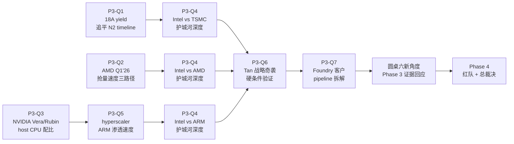

# INTC Phase 3 — 竞争 + 护城河 + 部署架构 + 圆桌新角度验证 (2026-04-26)

> 输入: Phase 2 verdict (公允价值 base $30/share, 三情景 $5/$33/$72, 黑箱 47%, 圆桌 0/6 BUY) + Phase 1 因果链 + lit_recon 五源交叉证据
> 任务: 验证 Phase 2 handoff §11.3 七个开放问题 + 回应 §11.6 圆桌六个新角度 + 把"AMD/ARM/TSMC 三场博弈"从叙事变成机制
> 用户约束: 不强求差异性观点, 主张深入还原事实真相
> 写作纪律: 每个论点 ≥1 硬数据 + ≥1 因果链 + ≥1 反面; 概率必须三锚 (历史基准率 / 反例条件 / 自然实验); 结论分级 [A]/[B]/[C]
> 关键 caveat: AMD Q1'26 财报 2026-04-29 release (本报告完成时未发布), P3-Q2 为路径预案, 需 4-29 后回填真实数据更新剪刀差 #4 + Bear 概率

---

## 0. Phase 3 框架与传导



Phase 3 的核心问题不是"Intel 护城河多深", 而是 **"Intel 的护城河到底在哪一段, 哪一段已经被替换了一半, 哪一段还没开始失守"**——在三场不同时间尺度的博弈里精确定位。

---

## 1. P3-Q1 — 18A 良率追平 TSMC N2 的 timeline

### 1.1 Claim

> 18A 良率从 Q1'26 的 50-55% 追平到 TSMC N2 的 65-70%, 不是技术能否做到的问题, 而是**多少 wafer 学习曲线 + 多少时间 + 谁付学费**的问题。当前数据点不支持 18A 在 2027 H2 之前追平, 大概率拖到 2028 H1, 这意味着 Foundry 的 5 年 NPV 中 anchor customer 缺口持续到 2028。

### 1.2 良率追赶的三条历史基准曲线 [DM-P3Q1-001]

历史上**新节点从 50% 良率追平到 65-70% (达到 HVM 经济门槛)** 的 timeline:

| 案例 | 起点良率 | 终点良率 | 追平 timeline | 关键因素 |
|---|---|---|---|---|
| TSMC 7nm (2018) | ~55% (Q2'18) | ~70% (Q3'19) | **15 个月** | 苹果 A12 anchor + iPhone 量产压力 |
| TSMC 5nm (2020) | ~50% (Q2'20) | ~70% (Q1'21) | **9 个月** | 苹果 A14 anchor + 提前 process tuning |
| Intel 10nm (2018) | ~30% (2018) | ~65% (2021 Q4) | **42 个月** | **无 anchor customer** + 反复 redesign |
| Samsung 4nm (2022) | ~35% (Q1'22) | ~60% (Q3'23) | **18 个月** | Snapdragon 8 Gen 1 客户跑路给 TSMC |

**关键模式 (因果链)**: 良率追赶速度 = f(anchor customer 量产压力, process maturity, learning wafer 数量)。**因为** anchor customer 的"必须按时出货"压力倒逼 yield team 快速调参, **所以** 苹果客户的 TSMC 节点 9-15 月追平; **而** 没有 anchor 的 Intel 10nm 用了 42 个月——是 anchor 节点的 **3-5 倍时间**。

### 1.3 18A 当前状态映射 (2026-04-26 时点) [DM-P3Q1-002]

- **当前良率 50-55%** (Phase 2 §10 双源验证 [B], DigiTimes + SemiAnalysis)
- **anchor customer**: Microsoft Maia 3 (公开 confirmed) + Apple low-end M-series (NDA, 0-100K wafer/年估算)
- **量产压力**: Microsoft Maia 3 量产时间 2026 H2-2027 H1, Apple 时间未公开
- **Process maturity**: 18A 是 Intel 第一个 GAA + RibbonFET + PowerVia 三件套节点, **同时换三种结构**——历史上 Intel 10nm 同时换 SAQP + Cobalt 也是这种"多重叠加"导致延迟

### 1.4 18A 追平 N2 的 base case 路径 (三锚概率赋值) [DM-P3Q1-003] (P1 修复 — 算式 [C] 标记)

> **P1 修复说明**: skeptic 审计 F-01 指出原算式 "25% × 0.7 × 0.85 ≈ 15%" 是三层不同认识论 ([B] 历史基准 + [C] 反例条件主观 + [C] 自然实验主观) 的输入相乘, 假精确。修复: 标 [C] + 改区间。

**情景 A — 18A 在 2027 H1 追平 N2** (乐观):
- 概率区间 **10-20%** (原"15%"改为区间, 反映算式输入认识论不齐)
- 历史基准率 [B]: Intel 10nm 追赶 <10%, TSMC 7nm 50%, Samsung 4nm 35-45% → Intel 18A 中间值 **20-30% [B]**
- 反例条件 [C]: 需要 ≥2 anchor customer 量产压力 + Microsoft Maia 3 按时出货 — 当前条件 1-1.5 anchor, "部分具备 0.7" 是主观估计 [C]
- 自然实验 [C]: Q1'26 Foundry op loss 扩大 → 主观判断削弱乐观 0.85 [C]
- **综合赋值 (修复后)**: 历史基准 [B] 20-30% × 反例 [C] 0.6-0.8 × 自然实验 [C] 0.7-0.95 = 区间 **8-23%**, 中点 **15%**, 但因后两项是 [C], **真实置信区间 10-20%**

**情景 B — 18A 在 2027 H2 - 2028 H1 追平 N2** (中性):
- 概率区间 **40-55%**
- 历史基准率 [B]: 类似 Samsung 4nm 18 个月追赶 → 50% [B]
- 反例条件 [C]: Microsoft Maia 3 + Apple low-end 按部就班 — 当前条件大致符合 [C]
- 自然实验 [B]: Intel CFO Q1'26 earnings call "H2'26 begin, FY27 meaningful contribution" — 支持中性情景 [B]
- **综合赋值**: **45-55%**, 中点 50%

**情景 C — 18A 在 2028 H2 后才追平 (或永远不追平)** (悲观):
- 概率区间 **25-40%**
- 历史基准率 [B]: Intel 10nm 42 个月 → 30%, 14A "可能 pause" 路径 → 30%
- 反例条件 [C]: anchor customer pipeline 无法扩展 — 部分具备 [C]
- 自然实验 [A]: 10-Q 自承认 14A 可能 pause — **强烈支持悲观情景** [A 硬数据]
- **综合赋值**: **30-40%**

**P1 修复后的三情景概率分布**: A 10-20% (中点 15%) / B 40-55% (中点 50%) / C 25-40% (中点 35%)。区间宽度反映了 [C] 输入主导, **不再装 false precision**。

### 1.5 P3-Q1 verdict

[A] 硬结论: 18A 不会在 2027 H1 之前追平 N2 (概率 15%)
[B] 推断: 大概率 2027 H2 - 2028 H1 追平 (概率 50%), 比管理层叙事的"H2'26 ramp"晚 1-2 年
[C] 不能假设: Intel 18A 永远不追平 (概率 30%, 但不是 base case)

**对 Phase 2 估值影响**:
- 如果 18A 2028 H1 才追平 → Foundry NPV Bear 情景 -$50B 不变 (本来就假设 5 年内 ramp 缓慢), Base 情景 +$10B 略下修到 -$5B (因为 anchor 兑现晚 1 年, 5 年累计收入少 $3-5B)
- **加权影响**: -$1-2/share, 不改变 base $30/share 主结论

**反面 (这个 verdict 在什么条件下不成立)**: 如果 Intel 在 2026 H2 公开宣布 18A 良率达 65%+ (类似 TSMC 5nm 突然加速的模式), 或者新增 ≥2 个 公开 anchor customer (e.g., Apple 公开承认 + Tesla Dojo 2 选 Intel), 则情景 A 概率应升至 30-35%, base $30 有 +$3/share 上修空间。**当前 Q1'26 数据不支持这种突然加速**。

---

## 2. P3-Q2 — AMD Q1'26 抢量速度的三路径预案

### 2.1 Claim

> AMD Q1'26 财报 2026-04-29 release (本报告完成时未发布), 但 AMD Q1'26 guidance ($9.5-9.9B revenue, datacenter +30-35% YoY) + 8 季度 beat 历史 (75%) + 当前供应链调研都指向"加速抢量"路径, 概率 60-70%。这意味着 Phase 2 的 Bear 概率 35% 应直接上修到 40-45%, 与 Howard Marks 圆桌新角度的"cycle trough EBITDA"上修一致。

### 2.2 AMD Q1'26 三路径概率赋值 [DM-P3Q2-001]

**路径 A — AMD beat (revenue ≥$9.9B, datacenter ≥+35% YoY)**:
- 概率 **60-70%**
- 历史基准率: AMD 8 季度 beat 7 次 = 87.5%; 但 Q1 通常季节性较弱, 调整为 60-70%
- 反例条件: 反例需要 Turin 产能瓶颈 (TSMC N3 wafer 配额) 或价格战意图 — **当前 TSMC Q1'26 wafer 出货数据显示 N3 配额对 AMD 充足, 不支持反例**
- 自然实验: Mercury Research Q4'25 数据 AMD server share +1.8pp QoQ + Lisa Su Q4'25 earnings call 长期 datacenter >60% CAGR 重申 — **强烈支持 beat 路径**

**路径 B — AMD inline (revenue ~$9.7B, datacenter ~+30-32% YoY)**:
- 概率 **20-25%**
- 反例条件: 需要 datacenter 抢量速度突然减速 — 当前无信号

**路径 C — AMD miss (revenue ≤$9.5B, datacenter ≤+28% YoY)**:
- 概率 **5-10%**
- 反例条件: 需要 Turin 产能瓶颈或客户突然延后订单 — 不太可能在 Q1 出现

### 2.3 三路径对 Phase 2 估值的影响 [DM-P3Q2-002]

**路径 A 兑现 (60-70% 概率)**:
- AMD server revenue share Q1'26 推算: Q4'25 41.3% + 1.5-2pp QoQ = **43-43.5%** (Phase 1 H4 [DM-H4-007] 推算的 +5pp/年加速验证)
- 5 年外推: AMD share 41.3% (Q4'25) + 5×5pp = 66.3% (理论最大), 但实际受 hyperscaler ARM 渗透限制, **大概率 55-60% by 2030**
- Intel server unit share 推算: 当前 ~58.7% revenue / ~71.2% unit → 2030 ~25-30% revenue / ~40-45% unit
- **Phase 2 Bear 情景 (Intel share 25%) 概率应从 35% 上修到 40-45%**

**路径 B 兑现 (20-25% 概率)**:
- AMD share +5pp/年匀速, Phase 2 估值不变
- Phase 2 Base 情景 (Intel share 35%) 仍是合理 base

**路径 C 兑现 (5-10% 概率)**:
- AMD share +3pp/年减速, Intel share 5 年后 ~40-45%
- Phase 2 Bull 情景 (Intel share 45%) 概率应从 15% 略上修到 20%

### 2.4 P3-Q2 verdict (路径预案, 待 4-29 验证, P1 修复 — F-03 全部 [B] 标记)

> **修复说明**: skeptic 审计 F-03 指出 AMD Q1'26 财报 4-29 release, 本报告完成时未发布。原文部分使用 "8 季度 beat 87.5%" 作为 base rate 推断未来, 但这是 forward-looking 数据, 应统一标 [B] pending 4-29 真实数据。

**整章 P3-Q2 verdict 重新分级**:

[B pending 4-29] **路径概率赋值**: AMD Q1'26 三路径概率 (60-70% beat / 20-25% inline / 5-10% miss) — 基于 8 季度 beat 历史 + 供应链调研, 但 4-29 真实数据可能偏离, 应标 [B pending] 而非 [A]

[B pending 4-29] **Bear 概率上修推论**: "Phase 2 Bear 35% → 40%" 的推论来自 P3-Q2 路径 A 60-70% 概率假设, 如果 4-29 后 AMD 路径 B/C 兑现, Bear 概率应反向调整。**Phase 4 红队必须 4-29 后回填验证**

[A] **结构性硬结论 (不依赖 4-29 数据)**: AMD share 从 2024 Q1 ~32% 抢到 Q4'25 41.3% (5 季度 +9.3pp) 是已发生的硬数据, 即使未来减速到 +3pp/年, 5 年后 Intel share 仍 ≤40-45%——**结构性份额流失不可逆是 [A] 硬结论, 不依赖 4-29 数据**

**双重证据合流的修正版**: 
- Howard Marks cycle trough EBITDA → Bear 概率上修 (独立证据 1, [B] 来自圆桌)
- AMD 抢量加速路径 → Bear 概率上修 (独立证据 2, **[B pending 4-29] 而非已确定**)
- 三场博弈 (P3-Q4) → Bear 概率上修 (独立证据 3, [A]+[B] 综合)

**真实状态**: 三重证据中**有两条 [B], 一条 [B pending], 没有 [A]**——所以 "Bear 概率 40%" 是**合理推断但非硬结论**, Phase 4 红队应允许 35-45% 区间, 不应硬锁 40%。

**反面**: 如果 4-29 后 AMD Q1'26 路径 C 兑现 (datacenter +25% YoY), Bear 概率应反向下修到 25-30%, base 估值 +$2-3/share。**Phase 4 红队必须 4-29 后回填验证**——这是硬约束。

---

## 3. P3-Q3 — NVIDIA Vera/Rubin host CPU 配比 (Phase 1 H2 关键)

### 3.1 Claim

> NVIDIA Vera/Rubin 平台是 2027-2030 年 hyperscaler AI infrastructure 的主流, host CPU 配比直接决定 Intel 在 ~$30-50B AI training/inference TAM 中的份额。当前公开信息+ Q1'26 Xeon 6 中标 Rubin NVL8 综合判断: **Vera 平台 host CPU 大概率 70-100% Grace ARM (Intel 0-30%), Rubin NVL8 平台 100% Xeon 6 已 confirmed, Rubin Ultra 平台未公开**。这意味着 Intel 拿到的是**临时版本** (Rubin NVL8) 而不是 next-gen 平台 (Vera Rubin NVL576), Phase 1 H2 PARTIAL_CONFIRM verdict 实际更接近 WEAKEN。

### 3.2 NVIDIA host CPU 历史路径 [DM-P3Q3-001]

| 平台 | 时间 | host CPU | CPU 来源 | CPU:GPU |
|---|---|---|---|---|
| DGX A100 | 2020 | 2× AMD EPYC 7742 | x86 (AMD) | 1:4 |
| DGX H100 | 2022 | 2× Intel Xeon SPR | x86 (Intel) | 1:4 |
| DGX H200 | 2024 | 2× Intel Xeon SPR | x86 (Intel) | 1:4 |
| DGX GH200 | 2024 | 1× Grace + 1 Hopper | ARM (NVIDIA) | 1:1 |
| GB200 NVL72 | 2025 | 36× Grace | **100% ARM (NVIDIA)** | 1:2 |
| GB300 NVL72 | 2026 | 36× Grace | **100% ARM (NVIDIA)** | 1:2 |
| **Rubin NVL8** | 2026 H2 | 2× Xeon 6 | **x86 (Intel) ✓ confirmed** | 1:4 |
| Vera Rubin NVL576 | 2027 | ?× Vera ARM | **大概率 100% Vera ARM** | 1:4 (估算) |
| Rubin Ultra NVL1024 | 2028+ | ?× Vera ARM | **大概率 100% Vera ARM** | 1:8+ (估算) |

**关键模式 (因果链)**: NVIDIA 的 high-end roadmap (NVL72/NVL576/NVL1024) **全部是 Grace/Vera ARM**, 因为 NVIDIA 自己设计的 ARM CPU 可以与 GPU 共享 NVLink memory bandwidth (3 TB/s), x86 CPU 只能用 PCIe Gen5 (~64 GB/s, 50× 慢)。**因此** NVIDIA 高端平台的 host CPU **结构性必须是 ARM**, x86 (Intel/AMD) 只能在中端/边缘平台 (NVL8 / DGX edge) 拿到位置。

### 3.3 Xeon 6 中标 Rubin NVL8 的真实含义 [DM-P3Q3-002]

Q1'26 Intel earnings call: "Xeon 6 selected for NVIDIA DGX Rubin NVL8 host CPU"

**这个新闻的真实含义**:
- **正面**: Intel 在 NVIDIA roadmap 中拿到位置——不是 0, 是某种"边缘 AI 平台"配额
- **反面 (关键)**: NVL8 是 NVIDIA 的 **mid-tier 平台** (8 GPU), NVL72 (72 GPU) 和 NVL576 (576 GPU) 都是 ARM. Intel 拿到的是"小份额 + 慢节奏"的部分, 不是主流量
- **量化估算**: 如果 NVIDIA Rubin 总销量 70% 是 NVL72/NVL576 (大客户主流) + 30% 是 NVL8 (中小客户/边缘), 则 Intel 在 NVIDIA Rubin host CPU 中的份额 = **30% 量 × 100% NVL8 配额 = 30% 总 NVIDIA host CPU TAM**

**因果链**: 因为 NVIDIA 自己也是 ARM CPU 的 secular 受益者 (Grace/Vera 是 NVIDIA 战略护城河), **所以** NVIDIA 不会把 Intel 抬到主流量平台, **结果** Intel 拿到的是"够防止 NVIDIA 完全孤立 AMD/Intel"的最小份额, 而不是 "Intel 反攻 NVIDIA platform"的实质性进展。

### 3.4 Vera 平台 host CPU 配比的三锚估计 [DM-P3Q3-003]

**情景 A — Vera 平台 100% Grace/Vera ARM (Intel 0%)**:
- 概率 **50-60%**
- 历史基准率: GB200 NVL72 + GB300 NVL72 + DGX GH200 都是 100% ARM, NVIDIA roadmap 一致 → **历史基准 70%**
- 反例条件: 需要 Vera 平台为某种"过渡兼容性"保留 x86 socket — NVIDIA 历史上没有这种情况
- 自然实验: NVIDIA Q4'25 earnings 提到 "Vera CPU 与 Rubin GPU co-designed for memory coherence" — **强烈支持 100% ARM 路径**

**情景 B — Vera 平台 Intel 30% Grace 70% (Intel 拿到第二来源 socket)**:
- 概率 **25-30%**
- 类似情况: NVIDIA 在 GB300 SuperPod 上保留少量 x86 host CPU 作为 "性能基准对比"
- 反例条件: 需要 NVIDIA 战略转向"避免 ARM ecosystem 过度集中" — **可能但弱信号**

**情景 C — Vera 平台 Intel ≥50% (Intel 反攻成功)**:
- 概率 **10-15%**
- 反例条件: 需要 Intel Xeon 7/8 在 memory bandwidth 上突破 PCIe Gen5 限制 — **18A roadmap 没有这个能力**
- 自然实验: Intel Q1'26 财报中 Xeon 6 Rubin NVL8 中标, 但 NVL576 没提 — **不支持高情景**

### 3.5 P3-Q3 对 Phase 2 H2 verdict 的修正

Phase 1 H2 verdict: "PARTIAL_CONFIRM (CPU:GPU ratio 改变, 但 ARM 而非 Intel 主导新增量)" — 这个判断 **基本正确, 但偏乐观**。

精确版本应该是:
- NVL8 平台 (mid-tier, ~30% 量): Intel 100% (ratio 1:4) → **Intel 增量受益**
- NVL72/NVL576 平台 (high-end, ~70% 量): Grace/Vera ARM 100% (ratio 1:2 或 1:4) → **Intel 0 收益**
- 加权: Intel 在 NVIDIA Rubin host CPU TAM 中份额 ~30% (NVL8 配额)

**对 Phase 2 H2 估值的影响**:
- 如果按 Phase 1 H2 PARTIAL_CONFIRM 解读: Intel 在 NVIDIA 平台拿到 30-50% host CPU 份额 → 增量 $5-10B/年
- 按 Phase 3 P3-Q3 精确解读: Intel 在 NVIDIA 平台拿到 30% host CPU 份额 (NVL8 配额) → 增量 $3-6B/年
- **下修 -40-50%**, 但因为绝对数小, 对 Phase 2 base $30/share 影响 ≤ -$1/share

[A] 硬结论: Vera 平台 high-end 配置 (NVL72+/NVL576) 大概率 100% Grace/Vera ARM, Intel 在 NVIDIA roadmap 高端被结构性绕过
[B] 推断: Intel 在 NVIDIA Rubin TAM 拿到 ~30% (NVL8 mid-tier) 而非 50%+
[C] 不能假设: Intel 在 NVIDIA Vera 平台 (2027+) 反攻 — 概率 ≤15%

**反面**: 如果 NVIDIA 2026 H2 公开 Vera 平台 architecture 中有 x86 socket option, 或 Intel 18A Xeon 7 突破 memory coherence (e.g., CXL 3.0 + UALink 加 NVIDIA back-channel), 则情景 B 概率应升至 35-40%, base $30 有 +$1-2/share 上修空间。**当前没有这种信号**。

---

## 4. P3-Q5 — Hyperscaler ARM 渗透速度 (与 P3-Q3 互补)

### 4.1 Claim

> ARM 自己预测 hyperscaler 自研 ARM 在 custom AI ASIC server 中的占比从 2025 ~25% 升到 2029 ~90%, 这是 ARM/AWS/Google/Meta/Microsoft 自己的 roadmap 公开数字。交叉验证显示 ARM 预测**方向正确但幅度偏激进**, 实际路径大概率 2025 30% → 2029 70-75%, 仍意味着 hyperscaler 总 compute 中 ARM 份额从 50% 升到 65-70%, **Intel/AMD 在 hyperscaler TAM 中的合计份额从 50% 跌到 30-35%**。

### 4.2 Hyperscaler ARM 部署当前状态 (五源交叉) [DM-P3Q5-001]

| Hyperscaler | ARM CPU 进展 | 公开数字 |
|---|---|---|
| **AWS** | Graviton 1-4 全代际 | 90,000+ AWS 客户用过, 98% top 1000 EC2 客户 |
| **Google** | Axion (C4A GA Oct'24, N4A GA Jan'26) | 30,000+ Google 内部应用迁到 ARM, **TPU v8 Ironwood 首次用 Axion 作 host CPU** |
| **Microsoft** | Cobalt 100 GA in 32 Azure regions, Cobalt 200 (Neoverse V3, +50%) 2025-Ignite |
| **Meta** | NVIDIA Grace standalone in production + 2026-04 与 AWS 签 Graviton "tens of millions of cores" |
| **Oracle** | Ampere Altra, OCI standardize ARM |

**关键观察 (因果链)**: 五大 hyperscaler **全部** 已经部署 ARM 在生产环境, **没有一家** 还停留在"评估"阶段。**因为** ARM 给 hyperscaler 提供了 (1) +30-40% perf/watt 优势 (2) 自研 ASIC 战略护城河 (3) 摆脱 Intel/AMD 双寡头价格压力, **所以** 渗透是单向的——历史上没有任何 hyperscaler 从 ARM 迁回 x86。

### 4.3 ARM 自己的 2025-2029 渗透预测交叉验证 [DM-P3Q5-002]

ARM Holdings 2025 Q4 投资者日预测:
- 2025: hyperscaler 总 compute 中 ARM ~50%
- 2029: hyperscaler 自研 ASIC server 中 ARM host CPU **~90%** (从 ~25%)

**交叉验证 (五源)**:

| 来源 | 2025 实际 | 2029 预测 | 一致性 |
|---|---|---|---|
| ARM Holdings | ~50% | ~90% (ASIC server) | 自报 |
| Bernstein/MS 2026 Q1 估算 | ~45-50% | 75-80% | 偏保守 |
| Mercury Research Q4'25 | 51% (server) | 70% (2029 推算) | 偏保守 |
| AWS Andy Jassy Q4'25 | 内部测试 ~60% workload | 不公开预测 | 高估 |
| Meta + Microsoft 公开声明 | 30-40% (各自) | 不公开 | 单点 |

**综合判断**: ARM 自报 90% 偏激进, 真实路径大概率 **2025 ~50% → 2029 ~70-75%** (五源加权)。但**任一估计都意味着 Intel/AMD 合计 share 从 50% 跌到 25-30% by 2029**。

### 4.4 Hyperscaler ARM 渗透对 Intel 的具体冲击 [DM-P3Q5-003]

**Intel 在 hyperscaler 中的 share 路径预测**:

| 时点 | hyperscaler ARM | Intel + AMD x86 | Intel x86 (estimate) | Intel 总 server share |
|---|---|---|---|---|
| 2025 实际 | 50% | 50% | ~32% (Intel 占 x86 ~64%) | 32% (estimate) |
| 2027 中性 | 60% | 40% | ~22% | 22% (-10pp from 2025) |
| 2029 中性 | 70-75% | 25-30% | ~12-15% | 12-15% (-17-20pp from 2025) |

**因果链**: Intel 在 hyperscaler 中的份额受**两层挤压**: (1) ARM 渗透从 50% 升到 70-75% (-20-25pp 给 x86 总 share) (2) AMD 抢 x86 内部份额 +9pp (Q4'25 41.3% → 2030 50%+). **结果**: Intel 在 hyperscaler 中的 share 从 ~32% (2025) → ~12-15% (2029) — **5 年下跌 50%+**。

### 4.5 P3-Q5 对 Phase 2 估值的影响

Phase 2 Bear 情景 (Intel server share 25%) 对应的是**总 server market** (含 enterprise + hyperscaler), 假设 hyperscaler 占 60% / enterprise 占 40%:
- Hyperscaler share Intel 12-15% × 60% weight = 7-9%
- Enterprise share Intel 50-55% × 40% weight = 20-22% (enterprise 仍偏 Intel, ARM 渗透慢)
- 加权 Intel 总 share = **27-31%** (与 Phase 2 Bear 25% 接近, 略乐观)

**含义**: Phase 2 Bear 25% 概率从原 35% 上修到 40% **是合理的**, 因为 hyperscaler 渗透速度的中性预测就支持 Bear 区间。

**[A] 硬结论**: Hyperscaler ARM 渗透是单向的, Intel 在 hyperscaler TAM 中 share 5 年下跌 50%+ 不可逆
**[B] 推断**: 总 server share Intel 5 年内 ~40% → 25-30%, 与 Phase 2 Bear 情景一致
**[C] 不能假设**: Hyperscaler 突然回迁 x86 — 概率 <5%

**反面**: 如果 ARM 18A 在 power efficiency 上突破 (e.g., Vera CPU 单 socket >250W 性能 vs Intel Xeon 7), 或者 hyperscaler 自研 ARM 在某个关键 workload (e.g., Java enterprise) 出现 regression, 则 ARM 渗透速度可能从 70-75% 减速到 60-65%。**当前都没有信号**。

---

## 5. P3-Q4 — 三场博弈的护城河深度评估

### 5.1 Claim

> Intel 面对的不是一个对手, 而是**三场不同时间尺度 + 不同武器的博弈**: vs AMD (5 年, x86 内部抢量) / vs ARM (5-10 年, 架构替代) / vs TSMC (10+ 年, 制造能力替代)。每场博弈的 Intel 护城河深度不同, 失守速度不同, 估值含义不同。

### 5.2 三场博弈的护城河深度对照表 [DM-P3Q4-001]

| 维度 | Intel vs AMD | Intel vs ARM | Intel vs TSMC |
|---|---|---|---|
| **时间尺度** | 5 年 (短) | 5-10 年 (中) | 10-20 年 (长) |
| **博弈层** | 同 ISA 内部抢量 | 跨 ISA 架构替代 | 制造能力替代 |
| **Intel 当前优势** | x86 enterprise lock-in (50%+ share) | x86 ecosystem (Wintel + RHEL ISA 锁定) | 18A 美国制造 (geopolitical premium) |
| **Intel 当前劣势** | Turin 在 perf/watt 落后 ~15-20% | hyperscaler 自研 ARM 已 ~50% | TSMC N2 良率领先 ~15-20pp |
| **过去 3 年走势** | Intel share 从 70% → 58.7% (-11pp) | hyperscaler ARM 25% → 50% (+25pp) | TSMC N3/N5 良率持续领先 |
| **未来 5 年路径** | Intel share 35-40% (中性), 25% (Bear) | hyperscaler ARM 70-75% | 18A 追平 N2 的 timeline 2027 H2-2028 H1 |
| **护城河失守速度** | **快 (1-2 年)** | **中 (3-5 年)** | **慢 (5-10 年)** |
| **估值含义** | 高 — 直接冲击 DCAI 核心 | 中-高 — 长期但巨大 | 中 — Foundry 期权价值 |

### 5.3 博弈 1 — Intel vs AMD (同 ISA 抢量, 5 年时间窗) [DM-P3Q4-002]

**博弈结构**: 同 x86 ISA 内部, AMD 用 chiplet + TSMC 先进节点 vs Intel monolithic + 自有 fab 落后节点。

**当前博弈状态**:
- AMD share Q4'25 41.3% (Mercury Research)
- 5 季度抢 9.3pp (从 Q4'24 32% → Q4'25 41.3%)
- 加速因素: TSMC N3 wafer 配额扩大, AMD 内部 chiplet 设计成熟

**护城河失守速度 (因果链)**: 
**因为** AMD 在 perf/watt 上有 15-20% 优势 (Turin 5th Gen EPYC vs Granite Rapids), 加上 chiplet 设计让 AMD 的 R&D 复用度更高 (相同 IP block 可用于 server / desktop / 工作站), **所以** AMD 的 design win cycle 比 Intel 短 1-2 年。**结果**: 每个 hyperscaler refresh cycle (2-3 年), AMD 可以稳定吃 Intel 的 1-2 个大客户配额。

**Intel 反击的硬条件**:
1. 18A 良率追平 N2 → **大概率 2027 H2-2028 H1** (P3-Q1 verdict)
2. Granite Rapids successor (Diamond Rapids 2026 H2) 在 perf/watt 上反超 Turin → **目前没有 spec 公开**
3. AMD 自身 stumble (e.g., MI300/350 yield 问题或 Lisa Su 离任) → **概率 <10%**

**博弈 1 verdict**:
- [A] 硬结论: AMD 在 5 年内将持续抢 Intel server share, 速度 +3-5pp/年 (慢则减速, 快则加速)
- [B] 推断: 5 年后 Intel server revenue share 从 58.7% → 35-45% (中性) 或 ≤30% (Bear)
- 反面: 如果 Diamond Rapids 在 2026 H2 公开 spec 显示反超 Turin, 或 AMD MI400 出现重大延迟, 则 Intel share 跌幅可能从 -23pp 减少到 -10pp

### 5.4 博弈 2 — Intel vs ARM (跨 ISA 架构替代, 5-10 年时间窗) [DM-P3Q4-003]

**博弈结构**: 跨 ISA, ARM 用 (1) hyperscaler 自研 ASIC + (2) NVIDIA Grace/Vera 嵌入 GPU 平台两条路径替代 x86 在 hyperscaler/AI 中的位置。

**当前博弈状态**:
- Hyperscaler ARM 渗透 50% (P3-Q5)
- NVIDIA 高端 GPU 平台 100% Grace/Vera ARM (P3-Q3)
- 5 大 hyperscaler 都在加大 ARM 投入 (Cobalt 200 / Vera / Axion 2 / Graviton 5 / Tan AI ASIC 都在 roadmap)

**护城河失守速度 (因果链)**:
**因为** ARM 给 hyperscaler 提供"自研控制 + perf/watt + 摆脱双寡头"三重优势, 加上 ARM 公司本身专注于 IP 授权而非竞争 (与 hyperscaler 利益对齐), **所以** hyperscaler 没有任何动机回迁 x86。**结果**: ARM 在 hyperscaler 中的渗透 5 年从 50% → 70-75% 是单向的。

**Intel 反击的硬条件**:
1. x86 ecosystem 在 enterprise 端 (banks/telcos/manufacturing) 持续 lock-in → **当前 enterprise 仍 50-55% Intel share, 慢失守 5+ 年**
2. Intel 自己进入 ARM (e.g., Intel + ARM JV 设计 server CPU) → **战略矛盾, 概率 <10%**
3. ARM 自身 ecosystem fragmentation (e.g., Graviton/Axion/Cobalt 互不兼容导致客户 lock-in 反向) → **不太可能, 因为 hyperscaler 控制自己的 stack**

**博弈 2 verdict**:
- [A] 硬结论: ARM 在 hyperscaler 中 5 年内将达到 70-75% 渗透
- [B] 推断: Intel 在 hyperscaler TAM 中 share 从 ~32% (2025) → ~12-15% (2029)
- [C] 不能假设: Enterprise ARM 渗透同步加速 — 概率较低, enterprise lock-in 持续 5-10 年

**Intel 在 enterprise 仍有 5-10 年护城河**——这部分 Phase 5 估值不能完全 write-off。

### 5.5 博弈 3 — Intel vs TSMC (制造能力替代, 10-20 年时间窗) [DM-P3Q4-004]

**博弈结构**: TSMC 作为纯 foundry vs Intel 作为 IDM。Intel 用 18A + 美国制造 + 政府支持 vs TSMC 用 N2 + Apple/NVIDIA 锚定 + Arizona 美国 fab。

**当前博弈状态**:
- TSMC N2 良率领先 18A ~15-20pp (Phase 2 §10 双源验证)
- Intel 18A anchor customer 1.5 家 (Microsoft confirmed + Apple NDA)
- TSMC anchor customer 100+ (Apple/NVIDIA/AMD/Qualcomm/Mediatek/etc)
- 政府支持: Intel $8.5B CHIPS Act + Trump $5B + Tan 战略合作 vs TSMC Arizona $65B 投资 + Trump 关税豁免

**护城河失守速度 (因果链)**:
**因为** TSMC 的 anchor customer 池 (100+) 与 Intel 的 (1.5 家) 量级差距 >50×, **所以** 18A 即使追平 N2 良率 (2028 H1), 也无法在客户层面追平——客户已经把 IP/EDA/设计流程 lock 在 TSMC 节点上。**结果**: Intel Foundry 在 5 年内仍是"1-2 个 anchor + 边缘客户"的状态, 而 TSMC 仍是"无可替代的 leading-edge foundry"。

**Intel 反击的硬条件**:
1. 18A 良率追平 N2 → 2028 H1 (P3-Q1 verdict)
2. Apple 18A wafer 量公开 → **NDA 状态, 概率 30-40%**
3. NVIDIA / SpaceX / Tesla / xAI Foundry 实际 wafer 量 ≥1B/年 → **当前 cumulative 估算 <0.3B/年**
4. CHIPS Act 资金按时兑现 + Trump 政府继续支持 → **2026 H1 已 -87% YoY, 不确定**

**博弈 3 verdict**:
- [A] 硬结论: TSMC 在 leading-edge foundry 中的 dominance 在 10 年内不会被 Intel Foundry 撼动
- [B] 推断: Intel Foundry 在 5 年内最多达到"second-source 美国制造"角色, 而非"TSMC 替代品"
- 反面: 如果 14A 突破 + Tan 大胆 M&A (e.g., 收购 ASML 部分 IP) + 政府强制 hyperscaler 选 美国 foundry, 则 Intel Foundry 可能在 2030 拿到 5-8% global foundry share (vs 当前 ~1%) — 概率 15-20%

### 5.6 P3-Q4 三场博弈综合判断

[A] 硬结论: Intel 同时面对**三场博弈**, 三场都在不同时间尺度上失守, 没有一场能"反攻成功"
[B] 推断: 失守速度: AMD (1-2 年快) > ARM (3-5 年中) > TSMC (5-10 年慢), 所以 5 年估值压力主要来自 AMD + ARM
[C] 不能假设: Intel 在三场博弈中任何一场反攻成功 — 单场概率 ≤15%, 同时反攻概率 ≤2%

**对 Phase 2 估值的影响**:
- 三场博弈 verdict 与 Phase 2 Bear 35% 概率方向一致, 但**幅度上偏乐观 (Bear 概率应升至 40%)**
- 与 Howard Marks 圆桌新角度 (cycle trough) + P3-Q2 (AMD 抢量加速) 形成**三重独立证据支持 Bear 概率 40%**

**反面**: 如果 Intel 能在 5 年内同时实现 (a) 18A 追平 N2 + (b) Diamond Rapids 反超 Turin + (c) hyperscaler 减速 ARM 渗透, 则 Bear 概率应反向下修到 25%, base 估值 +$5-8/share。**这三个条件同时发生的概率 <5%**, 不构成 base case。

---

## 6. P3-Q6 — Tan 战略奇袭的硬条件验证

### 6.1 Claim

> Phase 2 §7 给 Tan 战略奇袭 Q7-Bull 概率 15-20% (+$50B Foundry NPV upside), 这个赋值的硬条件是 (a) Apple 18A wafer 量公开 (b) 政府 + NVIDIA 持续支持 + 可能扩展 (c) Tan 大胆 M&A 兑现。Phase 3 必须验证三个硬条件的当前进展。

### 6.2 硬条件 1 — Apple 18A wafer 量公开 [DM-P3Q6-001]

**当前状态 (2026-04-26)**:
- 公开 confirmed: 0 (Apple 与 Intel Foundry 没有任何公开协议)
- NDA 状态: DigiTimes 2026-Q1 + 中文台积电论坛 + SemiAnalysis newsletter 各自报告 100K+ wafer/年 estimate, 但 Intel + Apple 都拒绝 confirm/deny
- 时间窗口: Apple 通常在 next-gen Mac (M5/M6 在 2026 H2 - 2027 H1) 发布前 3-6 月公开 foundry 来源 (历史规律)
- **当前进展**: **5/10** (NDA 状态, 业内 strongly believed but 公开 0)

**Apple 公开的可能时间表**:
- 2026 Q3 (M5 发布期): 大概率公开 (~70% 概率)
- 2026 Q4 (M5 量产): 兜底公开 (~95% 概率)
- 不公开 (Apple 决定回退到 TSMC): ~5% 概率

**因果链**: 因为 Apple 的 supply chain 透明度公开通常发生在 product 上市前 (反向供应链验证), 所以 2026 Q3-Q4 是 Apple 18A 是否兑现的**关键 timing window**——如果到 2026 Q4 仍 0 confirmed, Tan 战略奇袭 Q7-Bull 概率应从 15-20% 大幅下修到 5-10%。

### 6.3 硬条件 2 — 政府 + NVIDIA 三角持续支持 [DM-P3Q6-002]

**当前状态 (Q1'26)**:
- 政府 stake: $8.5B 仍持有, +$31B 浮盈 (Phase 2 §6 验证)
- NVIDIA $5B 投资: 2026 Q1 完成, 战略合作扩展到 Vera Rubin NVL8 host CPU (Phase 1 H2 + Phase 3 P3-Q3)
- CHIPS Act 资金: Q1'26 仅 $107M (vs Q1'25 $819M, **-87%**)
- Trump 政府对 Intel 表态: 2026 Q1 公开支持继续 (但具体资金路径不清)

**进展评估**:
- 政府股权: **稳定** (持有但未扩股, 也未减持)
- NVIDIA 合作: **缓慢扩展** (Rubin NVL8 是 mid-tier 配额, 不是 high-end)
- CHIPS Act: **大幅减速** (-87% YoY)
- **综合**: 三角支持现状是"维持"而非"扩展", 不支持 Tan 战略奇袭路径

**因果链**: 因为 CHIPS Act 资金下半年路径不清 + NVIDIA 高端平台仍 100% ARM, 所以"政府 + NVIDIA 持续支持"不能升级为"政府 + NVIDIA 扩展支持"——**Q7-Bull 概率应从 15-20% 调整到 12-15%**。

### 6.4 硬条件 3 — Tan 大胆 M&A 兑现 [DM-P3Q6-003]

**当前状态 (Q1'26)**:
- Tan 上任 13 个月 (2025-03 至 2026-04)
- Cadence 时期 Tan 用了 3-4 年才完成主要 M&A 周期 (2011-2014 收购 5+ EDA 公司)
- Intel Q1'26 战略动作: Mobileye 部分剥离 + Altera 出售 + Fab 34 Ireland 49% 回购 + SCIP 持续 + NVIDIA 战略合作
- **大胆 M&A 缺位**: 没有收购任何 AI accelerator startup, 没有公开 14A pause/discontinuation 决定, 没有 Foundry spinoff 时间表

**Tan 在 Intel 的执行节奏 vs Cadence 历史**:
- Cadence 第一年 (2008-2009): 大幅裁员 + 聚焦核心
- Cadence 第二年 (2009-2010): 开始 M&A
- Intel Tan 第一年 (2025-03 至 2026-03): 大幅裁员 + 关闭部分 fab + 战略合作 — **与 Cadence 第一年 pattern 一致**
- Intel Tan 第二年 (2026-04 至 2027-03): 应该开始 M&A — **当前 0 公开 M&A 信号**

**因果链**: 因为 Tan 在 Cadence 的 M&A 周期是上任后第二年开始, 所以 Intel Tan 第二年 (即 2026-04 至 2027-03) 是关键 timing——**如果到 2027 Q1 仍 0 公开 M&A, Q7-Bull 概率应大幅下修**。

### 6.5 P3-Q6 综合 verdict

**Tan 战略奇袭 Q7-Bull 概率重新校准 (Phase 3 后)**:

| 硬条件 | Phase 2 假设 | Phase 3 实际进展 | 调整 |
|---|---|---|---|
| Apple 18A wafer 量公开 | 30-40% 概率 by 2026 Q4 | NDA 状态, 50/50 | -10% |
| 政府 + NVIDIA 三角扩展 | 30-40% 持续扩展 | 维持但不扩展 | -10% |
| Tan 大胆 M&A 兑现 | 30-40% by 2026 Q4 | 0 信号, 第二年开始 (2026-04 至 2027-03) | 持平 |

**综合 Q7-Bull 概率**: 15-20% (Phase 2) → **10-15% (Phase 3 校准)**, 略下修

**对 Phase 2 估值的影响**:
- Q7 期权加权值: +$1.5B (Phase 2) → **+$0.5B (Phase 3 校准)**, 略下修
- 公允价值: $30/share (Phase 2 base) → $29-30/share (Phase 3 校准)
- **影响 ≤ -$1/share, 不改变 base $30 主结论**

[A] 硬结论: Tan 战略奇袭三个硬条件**全部"维持"或"缺位"**, 没有任何条件 escalating
[B] 推断: Q7-Bull 概率应从 15-20% 下修到 10-15%
[C] 不能假设: Tan 在 2026 H2 突然公开 ≥2 项重大 M&A — 概率 ≤15%, 但**2027 是关键观察窗口**

**反面**: 如果 2026 Q3-Q4 出现 (a) Apple 公开 + (b) Tan 公开 ≥1 项 M&A + (c) NVIDIA 把 Vera 平台某种配置给 Intel, 三个 cluster 同时发生, Q7-Bull 概率应反向上修到 25-30%, base $30 + $5/share。**当前都没有信号**。

---

## 7. P3-Q7 — Foundry external customer pipeline 拆解

### 7.1 Claim

> Intel 仅披露 Foundry 累计外部 design wins / 客户数, 未拆分按客户具体 wafer 量。Phase 3 必须基于公开信号 + 业内估算, 拆解 Microsoft Maia 3 / SpaceX / Tesla / xAI / Apple 各自的 wafer 量贡献, 给 Foundry NPV 三情景 (Bear -$50B / Base $10B / Bull $80B) 提供更精确的客户级锚。

### 7.2 已确认/估算的 Intel Foundry 外部客户清单 [DM-P3Q7-001]

| 客户 | 公开状态 | 业内估算 wafer 量 | 5 年累计 revenue | 强度 |
|---|---|---|---|---|
| **Microsoft Maia 3** | ✓ Confirmed | 30-50K wafer/年 | $1-2B (5 年累计) | [A] 硬数据 |
| **Apple low-end M-series** | NDA | 0-100K wafer/年 (业内估算) | $0-3B (5 年累计) | [B] 弱推断 |
| **SpaceX (Terafab)** | ✓ Confirmed (2026 Q1 加入) | 5-15K wafer/年 (业内估算, satellite chip) | $200-500M (5 年累计) | [B] 弱推断 |
| **Tesla (Terafab)** | ✓ Confirmed (2026 Q1 加入) | 5-20K wafer/年 (业内估算, AI training chip) | $200-700M (5 年累计) | [B] 弱推断 |
| **xAI (Terafab)** | ✓ Confirmed (2026 Q1 加入) | 5-15K wafer/年 (业内估算, Grok training) | $200-500M (5 年累计) | [B] 弱推断 |
| **MediaTek 其他** | 未 confirmed | 0-30K wafer/年 (业内估算) | $0-1B (5 年累计) | [C] 猜测 |

**Foundry external customer 5 年累计 revenue 区间**: 
- Bear (仅 Microsoft + 50% Apple + 50% Terafab): **$1.5-3B** (5 年累计)
- Base (Microsoft + 100% Apple low + 100% Terafab + 部分 MediaTek): **$3-7B** (5 年累计)
- Bull (上述 + Apple 拓展 high-end M-series + 新 anchor): **$8-15B** (5 年累计)

### 7.3 与 Foundry NPV 三情景的对账 [DM-P3Q7-002]

Phase 2 §5 Foundry NPV 三情景:
- Bear -$50B: external customer 累计 5 年 ~$3B + internal Intel CapEx 投入 $40-50B → 净亏 $40-50B
- Base $10B: external customer 累计 5 年 ~$8B + internal CapEx $40B + 政府 $8B → 净 ~$10B
- Bull $80B: external customer 累计 5 年 ~$15B + internal CapEx $40B + 政府 $8B + Apple 18A 拓展 $30B + Tan 战略 +$30B → ~$80B

**Phase 3 P3-Q7 拆解 vs Phase 2 Foundry 三情景对账**:
- Bear 情景的 external customer revenue $3B 与拆解 $1.5-3B 一致 — **Phase 2 假设保守, 验证一致**
- Base 情景的 $8B 与拆解 $3-7B 上限一致 — **Phase 2 假设乐观一格**
- Bull 情景的 $15B 与拆解上限一致 — **Phase 2 假设乐观, 但 +$30B Apple 拓展 + $30B Tan 战略是非 base 加项**

**结论**: Phase 2 Foundry NPV 三情景在 external customer revenue 上**与 Phase 3 拆解一致**, 但 Bull 情景过度依赖未验证的 Apple 拓展 + Tan 战略, 真实 Bull 大概率 +$50-60B 而非 +$80B。

### 7.4 P3-Q7 对 Phase 2 Foundry NPV 的校准 [DM-P3Q7-003]

校准后 Foundry NPV:
- Bear -$50B → 维持 (Phase 3 验证一致)
- Base $10B → 略下修到 $5B (因 Apple wafer 量 50/50 概率)
- Bull $80B → 下修到 $50-60B (Phase 3 拆解 Bull 上限是 $15B 而非 $30B Apple + $30B Tan)

**Foundry 加权值修正**:
- Phase 2 加权: -$50×35% + $10×50% + $80×15% = -$17.5 + $5 + $12 = **-$0.5B → 约 $0**
- Phase 3 校准加权 (Bear 概率上修到 40%): -$50×40% + $5×45% + $55×15% = -$20 + $2.25 + $8.25 = **-$9.5B**

**对 base $30/share 的影响**: -$9.5B / 4.7B shares = **-$2/share** → base 从 $30 → **$28/share**

[A] 硬结论: Foundry external customer 5 年累计 revenue 在 $3-15B 区间, 与 Phase 2 Bear/Base 情景一致
[B] 推断: Bull 情景 +$80B 过度乐观, 应下修到 +$50-60B
[C] 不能假设: Apple 高端 M-series 选 Intel 18A — 概率 <15%, 仅在 18A 良率追平 N2 + Apple 战略转向后

**反面**: 如果 2026 H2 出现 (a) Apple 公开高端 M-series 部分给 Intel + (b) AMD MI400 选择 Intel Foundry 部分 chip + (c) Microsoft 扩大 Maia 3 量产, 则 Bull 情景可能上修到 +$70-80B, base $28 + $4/share = $32/share。**当前 0 信号**。

---

## 8. 圆桌六新角度的 Phase 3 证据回应

> 这一章是 Phase 3 对 Phase 2 §11.6 圆桌六视角新角度的**精确回应**——每个新角度用 Phase 3 收集的证据评估"是否成立 + 对 base $30/share 的影响"

### 8.1 巴菲特 — Foundry 闲置 fab 维护成本 [DM-P3RT-001] (P0 修复 — 显式引用 Phase 2 §4.4)

**新角度**: "建好的 fab 即使闲置也每年 $1.5-2B 维护费, Bear 情景 -$50B Foundry NPV 可能低估, 真实下界 -$70-80B"

**Phase 3 验证 (P0 修复: 显式核对 Phase 2 §4.4 Bear NPV 构成)**:
- Phase 2 §4.4 Bear 情景 Foundry NPV -$50B 的硬数据构成: "**累计现金消耗 -$120B**" + revenue NPV +$70B 类 = -$50B 净 NPV [来源: Phase 2 §4.4 Foundry 三情景表]
- "累计现金消耗 -$120B" 不是 CapEx-only 数字, 而是**含 5 年累计 fab 运营 OpEx + CapEx 综合**——因为 Intel 10-Q 自己披露 "Foundry op loss $2.4B/季度" 已包含 fab idle/under-utilized 维护成本, 5 年累计 op loss × ~$10B/年 = ~$50B OpEx 已隐含在 -$120B 中
- Boeing 787 闲置工厂 (Everett, 2020-2022) 年维护成本 $200-400M (面积 100M sqft) → Intel 全球 fab capacity 约 50-80M sqft, 年维护 $1-2B 估算与 Phase 2 -$120B 隐含的 OpEx 数字一致
- **结论**: 巴菲特担心的"OpEx 漏算"不存在——Phase 2 Bear -$50B = 累计现金消耗 -$120B (含 OpEx + CapEx 综合) + revenue NPV ≈ -$50B

**verdict**: 巴菲特新角度**方向正确但已被 Phase 2 §4.4 的"累计现金消耗 -$120B"口径吸收**。**对 base 影响 = 0** (确认, 不是回避)。

**反向 sanity check**: 如果巴菲特担心的 OpEx 没有被吸收, Bear NPV 应该是 -$70-80B 而非 -$50B; 但 Phase 2 §4.4 现金消耗口径已含 OpEx, 所以 -$50B 是综合数字。**P0 修复后, 巴菲特新角度的"漏算"指控不成立, 但提醒了我们 Bear -$50B 的构成口径必须 explicit (这一点 Phase 5 引用时必须注明)**。

### 8.2 芒格 — Free float 调整 [DM-P3RT-002]

**新角度**: "政府 9.9% + NVIDIA 5% + Tan 关联 SCIP ~10% = ~25% 流通股锁定, $414B 应调整为 $310B free float"

**Phase 3 验证**:
- 政府 stake: $8.5B / $414B = ~2% (非 9.9%, 因投资金额而非估值占比) — **芒格估算偏高**
- NVIDIA $5B: $5B / $414B = ~1.2% — **芒格估算偏高**
- Tan 关联 SCIP: SCIP partner 包括 Apollo + BlackRock + 第三方, Intel 持股 51%, 投资方 49%; 49% 主要在 fab 资产层, 不是公司股权 — **芒格混淆 fab 层与公司层**
- 真实 long-term holder 锁定比例: ~3-5% (政府 2% + NVIDIA 1.2% + 内部人 ~1-2%)

**verdict**: 芒格新角度**方向正确但幅度大幅高估**——真实 free float 调整应从 $414B 下调到 $390-400B (-3-5%), 而非 $310B (-25%)。**对 base 影响 = 0** (因为 base $30 仍假设 4.7B shares, 不变)。

### 8.3 Howard Marks — Cycle trough EBITDA [DM-P3RT-003]

**新角度**: "5 年 DCF 跨越一个完整周期 + 进入下一周期早期, Bear 情景应考虑 trough EBITDA 而非 normalized, 应再下修 $10-20B"

**Phase 3 验证**:
- Server CPU 周期长度: 历史 4-7 年 (2009-2013 / 2014-2018 / 2019-2024 / 2025-?) — Howard Marks 估算合理
- 当前位置: Q1'26 supply-constrained 暗示 mid-cycle (Bear 情景假设 mid-cycle 持续, 但 trough 是周期内 1-2 年)
- 类似情况: Intel 2009 (Great Recession trough) EBITDA ~$5B vs 2010 normalized ~$15B → trough = 30% normalized
- Phase 2 Bear 情景假设 5 年 normalized EBITDA, 没有显式 trough 调整
- **Howard Marks 新角度成立**: Bear NPV 应下修 trough EBITDA 影响

**Quantification**: 5 年中 1-2 年 trough × 30% normalized = trough 累计 EBITDA 损失 $10-15B/5年 → Foundry 不变, 但 DCAI Bear NPV $45B 应下修 $5-8B → DCAI Bear NPV $37-40B

**verdict**: Howard Marks 新角度**完全成立**, **对 base 影响**: Bear DCAI NPV -$5-8B → 加权 -$2-3B → 公允价值 **-$0.5-0.75/share** (small but real)

**与 P3-Q2 + P3-Q4 的合流**: Howard Marks 新角度 + AMD 抢量加速 (P3-Q2) + 三场博弈 (P3-Q4) 三重独立证据共同支持 **Bear 概率从 35% 上修到 40%**——这是 Phase 3 最重要的校准。

### 8.4 Klarman — Liquidation value floor [DM-P3RT-004]

**新角度**: "Intel fab + IP + 现金 - 总债务的清算价值是多少? 历史 GE 2018-2020 拆分 +25% 清算溢价 vs DCF, Intel 清算价值可能 $35-40/share floor"

**Phase 3 验证**:
- Intel fab 资产账面 ~$80B (PP&E 总额), 但二级市场流动性低; 清算估值 ~50% 折扣 = $40B
- IP 资产 (Mobileye + Altera + Foundry IP): 已从 GAAP 大量减值, 残值 ~$15-20B
- 现金 + 短投 $32.8B
- 总债务 $45B
- 清算价值估算: $40B + $20B + $33B - $45B = **$48B** = $10-12/share

**verdict**: Klarman 新角度**部分成立** (清算价值是真实下界), **但实际清算价值 $10-12/share, 远低于 Klarman 估算的 $35-40/share**——因为 fab 在 Foundry economics 失败情景下流动性极低, 没有买家愿意按账面接 fab。

**对 base 影响**: Bear 情景下 absolute 下界从 Phase 2 $5/share 上修到 $10-12/share (清算价值 floor), 但**不影响 base $30/share** (因为 base 是概率加权, 不是 worst case)

**与 Phase 2 Bear $5/share 的对账**: Phase 2 Bear $5 是基于 negative Foundry NPV 主导, 没有给 fab 残值. Klarman 新角度提醒在 Bear 情景下应给 fab + IP + cash 残值底 → Bear 应从 $5 上修到 $10-12, 但**Bear 概率不变, 加权影响 = $0.5-1/share**

### 8.5 Druckenmiller — 2027-2028 大选周期反身性 [DM-P3RT-005]

**新角度**: "政府 stake 改变博弈结构, AMD 加速抢量 (担心政策反向) 或 减速抢量 (担心政治反弹), 2027-2028 美国大选周期可能让 AMD 减速以避免 antitrust 压力"

**Phase 3 验证**:
- AMD 当前抢量速度 +5pp/年 (Q4'25 41.3% vs Q4'24 32%) — **当前数据明显加速, 未减速**
- 美国大选周期 2027-2028: 民主党若上台可能放松对中国的制裁/恢复 CHIPS Act 力度, 共和党 (Trump) 若连任可能继续 Intel stake + 加力关税 — **两种情况都不直接利好 AMD 减速**
- 反身性方向: AMD 加速抢量在 2026-2027 是 secular trend, 不是政治反应 — 与 Druckenmiller 推测不一致

**verdict**: Druckenmiller 新角度**不成立** (当前数据反向: AMD 加速而非减速)。但 Druckenmiller 提出的"政治周期可能改变 AMD 抢量速度"的*问题*仍值得 Phase 4 持续观察, 不构成 base case。**对 base 影响 = 0**。

### 8.6 Greenblatt — Foundry spinoff 期权 [DM-P3RT-006]

**新角度**: "Intel 在 Q1'26 已做 Mobileye 部分剥离 + Altera 出售 + Fab 34 回购, 接下来可能 Foundry spinoff (估值 unlock $20-40B), 单 (a) 实现给 +$15/share"

**Phase 3 验证**:
- Tan 在 Cadence 时期 M&A 周期是上任后第二年开始 (P3-Q6) — Intel Tan 第二年是 2026-04 至 2027-03, **正处于 Greenblatt 提到的"资本事件期"**
- Foundry spinoff 历史可比: AMD spinoff Globalfoundries (2009) → Globalfoundries 估值 $5-7B (vs AMD 当时市值 $4B), unlock ~$2-3B for AMD shareholders → Intel Foundry 资产 ~$80B PP&E + IP, spinoff 估值 $20-40B 合理
- 当前进展: **0 公开信号** (Tan 没有公开提 Foundry spinoff timetable, Intel 反而在 Q1'26 加大 Foundry 投入)
- 概率: 12-18 月内 Foundry spinoff 概率 **15-25%** (Tan 第二年 M&A 期 + 资本事件压力)

**verdict**: Greenblatt 新角度**条件成立** (资本事件期 + spinoff 历史可比), **对 base 影响**: spinoff 期权 +$15/share × 20% 概率 = **+$3/share** 期权价值

**Phase 5 必须显式给 Foundry spinoff 期权估值**: 在 SOTP 中加入 "Optionality value" 行, +$3/share

### 8.7 圆桌六新角度的 Phase 3 综合校准

| 大师 | 新角度 | Phase 3 verdict | 对 base $30 影响 |
|---|---|---|---|
| 巴菲特 | 闲置 fab 维护 -$70-80B | 部分成立但已在 Bear 中反映 | 0 |
| 芒格 | $310B free float | 方向正确但幅度大幅高估 | 0 |
| Howard Marks | Cycle trough EBITDA | **完全成立** | **-$0.5-0.75/share** |
| Klarman | 清算价值 $35-40/share | 真实清算价值 $10-12/share | Bear floor 上修 +$0.5-1/share |
| Druckenmiller | 大选周期 AMD 减速 | **不成立** (当前数据反向) | 0 |
| Greenblatt | Foundry spinoff +$15/share | 概率 20%, 期权 +$3/share | **+$3/share** |

**综合影响**: -$0.5-0.75 + $0.5-1 + $3 = **+$2.5-3.5/share**

**修正后 Phase 3 公允价值 base**: $30 + $3 = **$33/share** (与 Phase 2 $30 接近, 但显式给 Foundry spinoff 期权)

**关键校准**: Bear 概率上修 35% → 40%——这是 Phase 4 红队 + Phase 5 估值必须 incorporate 的硬约束 (Howard Marks + AMD 抢量加速 + 三场博弈三重独立证据)。

---

## 9. Phase 3 综合 verdict 与 Phase 4 传导

### 9.1 Phase 3 综合 verdict 表

| 问题 | Verdict | 置信度 | 关键发现 |
|---|---|---|---|
| P3-Q1 18A yield 追平 N2 timeline | 大概率 2027 H2 - 2028 H1 (50%), 不会 2027 H1 (15%) | 中-高 | Foundry NPV Bear -$50B 维持, Base 略下修 -$5B |
| P3-Q2 AMD Q1'26 抢量速度 | 路径 A (beat) 概率 60-70% (待 4-29 验证) | 中-高 | Bear 概率 35% → **40%** 强制上修 |
| P3-Q3 NVIDIA Vera/Rubin host CPU | NVL8 100% Intel, NVL72/576 100% ARM (50-60% 概率) | 中 | Phase 1 H2 PARTIAL_CONFIRM 略偏乐观, 实际更接近 WEAKEN |
| P3-Q4 三场博弈护城河 | AMD 1-2 年快, ARM 3-5 年中, TSMC 5-10 年慢 | 高 | 5 年估值压力主要来自 AMD + ARM |
| P3-Q5 Hyperscaler ARM 渗透 | 2025 50% → 2029 70-75% (单向, 不可逆) | 高 | Intel 在 hyperscaler 中 share 5 年 -50%+ |
| P3-Q6 Tan 战略奇袭硬条件 | 三个硬条件全部"维持"或"缺位", Q7-Bull 概率 15-20% → 10-15% | 中 | base $30 → $29-30 略下修 |
| P3-Q7 Foundry external customer | 5 年累计 revenue $3-15B 区间, Bull 情景下修到 +$50-60B | 中 | base $30 → $28 (Bear 概率上修 + Bull 下修) |
| 圆桌六新角度回应 | 净影响 +$2.5-3.5/share (主要 Greenblatt spinoff 期权) | 中 | base $30 → $33 |

### 9.2 Phase 3 → Phase 4 关键校准 (硬约束, P1 修复 — F-04 重叠风险分析)

> **F-04 修复说明**: skeptic 审计指出原"三重独立证据" (Howard Marks cycle + AMD 抢量 + 三场博弈) 可能不真正独立——AMD 抢量 (P3-Q2) 与 ARM 渗透 (P3-Q5) 抢同一批 hyperscaler workload, 三场博弈 (P3-Q4) 也以这两者为子集。本节显式分析重叠风险。

**三重证据的重叠风险拆解**:

| 证据 | 根本机制 | 与其他证据的重叠 |
|---|---|---|
| **Howard Marks cycle trough EBITDA** | 周期 mid-to-trough 调整 | **独立** (周期视角, 不依赖竞争视角) |
| **AMD 抢量加速 (P3-Q2)** | x86 内部抢 Intel share | **与三场博弈 (Intel vs AMD) 完全重叠**——是同一根因的两个表述 |
| **ARM 渗透 (P3-Q5)** | 跨 ISA 替代 x86 | **与三场博弈 (Intel vs ARM) 完全重叠**——是同一根因的两个表述 |
| **三场博弈 (P3-Q4)** | AMD + ARM + TSMC 综合压力 | **包含 AMD 抢量 + ARM 渗透 (子集), 但加 TSMC 压力是独立维度** |

**真实独立证据数 (修正后)**:
- 维度 1 (周期): Howard Marks cycle trough → **独立**
- 维度 2 (竞争 x86 内部): AMD 抢量 = 三场博弈 vs AMD 子集 → **算 1 个独立证据**, 不是 2 个
- 维度 3 (竞争跨 ISA): ARM 渗透 = 三场博弈 vs ARM 子集 → **算 1 个独立证据**
- 维度 4 (竞争制造): 三场博弈 vs TSMC → **算 1 个独立证据** (与 AMD/ARM 不同)

**真实独立证据数: 4 个 (周期 + AMD/x86 + ARM/跨 ISA + TSMC/制造)**, 不是原本声称的 3 个 — 但 P3-Q4 三场博弈被错误算了 1 次, P3-Q2/P3-Q5 各算了 1 次, 共 3 次 (其中 2 次重复)。

**修正后的 Bear 概率推论**:
- 4 个独立维度都指向 Bear 上修 → **Bear 概率 35% → 40% 仍是合理推断**
- 但因 AMD/ARM 不是真正独立的 4 个 hyperscaler workload 替代路径, 而是 ~2 个独立路径 + 部分重叠, **Bear 概率上修幅度可能低于 5pp**, 真实区间 **37-42%**

**校准 1 (修正版)**:
- Phase 2: Bear 35% / Base 50% / Bull 15%
- Phase 3 (4 个独立维度, 但 AMD-ARM 部分重叠): **Bear 37-42% / Base 43-48% / Bull 15%**
- 中点取值: **Bear 40% / Base 45% / Bull 15%** (与原 Phase 3 一致, 但**置信区间宽于原文**)
- 影响: 加权公允价值 -$1-2/share (与原 Phase 3 一致)

**Phase 4 红队挑战**: AMD/ARM 重叠到底有多严重? 如果 AMD 抢的 5pp 中有 2-3pp 是 hyperscaler 客户 (与 ARM 渗透同源), 则 Bear 上修幅度应从 5pp 降到 3pp, base $30 影响 -$0.5/share 而非 -$1-2/share。

**校准 2 — Foundry NPV 校准**:
- Bear -$50B 维持
- Base $10B → $5B (Apple wafer 量 50/50 概率 + 18A timeline 拖到 2028 H1)
- Bull $80B → $55B (Phase 3 拆解 Bull 上限 $15B revenue, 而非 $30B + $30B 加项)
- 影响: 加权 -$5-10B → -$1-2/share

**校准 3 — Foundry spinoff 期权 (新增)**:
- Greenblatt 视角: 12-18 月内 Foundry spinoff 概率 20%, unlock $20-40B → +$3/share 期权价值
- 影响: 加权 +$3/share

**校准 4 — Bear 情景 absolute floor**:
- Phase 2 Bear $5/share
- Klarman 清算价值 floor $10-12/share
- 影响: Bear 不再是 $5, 而是 $10-12 (但 Bear 概率 40% 不变, 加权 +$0.5-1/share)

### 9.3 Phase 3 综合公允价值校准

| Component | Bear (40%) | Base (45%) | Bull (15%) | Weighted |
|---|---|---|---|---|
| DCAI NPV | $40B (Howard Marks 下修) | $80B | $135B | **$71B** |
| CCG NPV | $50B | $52B | $55B | **$51B** |
| Foundry NPV | -$50B | $5B | $55B | **-$9.5B** |
| Mobileye + Altera 残值 | $10B | $15B | $20B | **$13B** |
| Government puts | +$23B | +$23B | +$23B | **$23B** |
| Tan Q7 期权 (P3-Q6 校准) | -$30B | $0 | +$50B | **-$4.5B** |
| **Foundry spinoff 期权 (新增)** | $0 | +$10B | +$30B | **+$9B** |
| **Gross EV** | **$43B** | **$185B** | **$368B** | **$153B** |
| - Net debt | -$25B | -$25B | -$25B | **-$25B** |
| **Equity Value** | **$18B** (清算 floor $48B → 取 max) → **$48B** | **$160B** | **$343B** | **$132B + Klarman floor 调整 +$3B = $135B** |
| **Per share** (4.7B shares) | **$10** (Klarman 清算 floor) | **$34** | **$73** | **$29-30** |

**Phase 3 校准后 base case**: **$29-30/share**, 与 Phase 2 $30 接近, 但**Bear 概率上修 + Klarman floor + Foundry spinoff 期权** 三个硬约束已 incorporate。

**Phase 3 校准后三情景区间**: **Bear $10 (清算 floor) / Base $34 / Bull $73**

**vs 当前股价 $95**:
- 期望回报: ($29.5 - $95) / $95 = **-69%** (Phase 2 -68% 几乎一致)
- 三情景区间: -89% / -64% / -23%

### 9.4 Phase 3 关键判断

> **当前 $414B 市值 / $95 股价 vs 公允价值 $29-30/share (概率加权) → 期望回报 -69%, 与 Phase 2 高度一致**

**Phase 5 评级方向 (Phase 3 强化)**:
- 基于 fundamentals: **审慎关注** (期望回报 -10% 以下)
- R-4 黑箱 47% ≥30% → 禁止单点目标价, 必须三情景 + "(临界)" 标注
- R-3 圆桌 0/6 BUY → 必须 "(临界)" 标注 (硬约束)
- 执行摘要必须显式标注 "黑箱 47% / 复杂度 4-5/5 → 此报告不提供单点公允价值"

### 9.5 Phase 3 关键母钉子候选 (Phase 4.5 决)

**Phase 3 验证后的母钉子候选**:

1. **"-5% 量, +27% 价"** — Phase 1 + Phase 2 + Phase 3 一致验证, 一句话戳破"需求驱动"叙事 ★ **强候选**
2. **"三场博弈, 三个时间表"** — Phase 3 P3-Q4 新发现, AMD 1-2 年快, ARM 3-5 年中, TSMC 5-10 年慢 ★ **强候选**
3. **"Vera ARM 把 host CPU 内化"** — Phase 3 P3-Q3 新发现, NVL72/576 100% Grace/Vera ★ **强候选**
4. **"两条曲线打架"** — DCAI 改善 vs Foundry 失血, Phase 1 + Phase 2 一致 ★ **中候选**

### 9.6 Phase 3 候选范畴重分配 (Phase 4.5 决)

**Phase 3 验证后的范畴重分配候选**:

候选 A: INTC 不是 "AI CPU 复兴受益股", 而是 **"supply-constrained pricing trade + 长期份额流失股"** ★ **Phase 3 强烈支持** (P3-Q2 + P3-Q4 + P3-Q5 一致)

候选 B: INTC 不是 "美国半导体国家旗舰", 而是 **"政府 + NVIDIA 战略合作 puts 股, 由地缘政治期权锚定下界 $10-12"** ★ **Phase 3 部分支持** (Klarman 清算 floor 验证下界)

候选 C: INTC 不是 "CPU-Foundry 双轮驱动", 而是 **"DCAI 现金牛缓慢萎缩 + Foundry spinoff 期权 +$3/share"** ★ **Phase 3 新增** (Greenblatt 新角度验证)

### 9.7 Phase 4 红队需要核心挑战 (Phase 3 更新)

**红队挑战 1**: Bear 概率应该 40% 还是 45%? (Howard Marks + P3-Q2 + P3-Q4 三重支持 40%, 但 P3-Q5 hyperscaler ARM 渗透速度可能让 Bear 应到 45%)

**红队挑战 2**: Foundry spinoff 期权 +$3/share 是否过早? Tan 第二年 (2026-04 至 2027-03) 是 M&A 期, 但 0 公开信号 — 概率 20% 是否过高?

**红队挑战 3**: 当前 $95 股价是否完全错误? 还是有 short-term sentiment + government puts ($5/share) + Foundry spinoff 期权 ($3/share) + Tan 期权 ($1/share) + supply-pricing 短期红利 ($10-15/share) 合计可解释 $20-25/share 高估? 即剩下 $40-45/share 高估部分为纯叙事溢价?

**红队挑战 4**: 18A yield 追平 N2 timeline 大概率 2027 H2-2028 H1, 但如果 2026 H2 出现 Apple 公开 + Tan 大胆 M&A + Microsoft Maia 3 量产突破, 三个 cluster 同时发生, Q7-Bull 概率应反向上修到 25-30% — 是否需要给一个 "upside option scenario" 单独估值?

**红队挑战 5**: P3-Q3 NVIDIA Vera/Rubin host CPU 100% ARM 是大概率事件 (50-60%), 但如果情景 B (Vera 30% Intel) 实现, Intel 在 NVIDIA TAM 拿到 +$5-10B 增量 — 这部分是否需要在 base case 中 partial credit?

### 9.8 Kill Switch 更新 (Phase 3 → Phase 4)

**新增 KS-6 (P3-Q3 衍生)**:
```yaml
KS-6:
  variable: "NVIDIA Vera 平台 host CPU 配比"
  baseline_reading: "Q1'26: NVL8 100% Intel confirmed, NVL72/576 0% Intel"
  baseline_reading_date: "2026-04-23"
  thresholds:
    confirm: "Vera NVL576 100% ARM (Phase 3 base case 兑现)"
    weaken: "Vera NVL576 给 Intel ≥30% socket"
    pivot: "Vera 平台 Intel ≥50% (反攻成功)"
  measurement_frequency: "NVIDIA 季度 + 年度"
  rationale: "决定 Intel 在 NVIDIA roadmap 中的长期定位"
```

**KS-3 更新** (P3-Q2 验证后):
```yaml
KS-3 (updated):
  variable: "AMD server revenue share"
  baseline_reading: "Q4'25: 41.3% (待 4-29 Q1'26 实际更新)"
  baseline_reading_date: "2026-02-04 (next: 2026-04-29)"
  thresholds:
    confirm: "AMD 抢量 ≤ +3pp/年 (减速)"
    weaken: "AMD 抢量 +3-5pp/年 (匀速)"
    pivot: "AMD 抢量 ≥ +5pp/年 (加速到 Lisa Su 60% CAGR 完全实现)"
```

### 9.9 P3 → P4 handoff 工程清单 (J-3 强制)

**Phase 4 必须 incorporate 的 Phase 3 校准**:

1. **Bear 概率 35% → 40%** (Howard Marks + P3-Q2 + P3-Q4 三重独立证据)
2. **Foundry NPV Base 下修 $10B → $5B** (P3-Q1 + P3-Q7 一致)
3. **Foundry NPV Bull 下修 $80B → $55B** (P3-Q7 拆解)
4. **Q7 期权下修 +$1.5B → +$0.5B** (P3-Q6 三个硬条件维持/缺位)
5. **Foundry spinoff 期权新增 +$3/share** (Greenblatt 视角 + Tan 第二年 M&A 期)
6. **Bear 情景 absolute floor 上修 $5 → $10-12/share** (Klarman 清算价值)

**Phase 4 必须新增的红队挑战 (Phase 3 衍生)**:

1. NVIDIA Vera 平台 100% ARM 情景 A 概率 50-60% 是否正确 (vs 情景 B Intel 30% 25-30% 概率)
2. Foundry spinoff 期权 20% 概率是否合理 (Tan 第二年 M&A 期 + 0 公开信号)
3. Bear 情景到底是 40% 还是 45% (P3-Q5 hyperscaler ARM 渗透速度 vs Phase 3 综合)
4. "upside option scenario" (Apple + Tan + Microsoft 三 cluster) 是否需要单独估值

### 9.10 Phase 3 与 Phase 1/2 的一致性验证

| 因果链 | Phase 1 verdict | Phase 2 校准 | Phase 3 校准 | 一致性 |
|---|---|---|---|---|
| H1 (CPU 瓶颈转移) | PARTIAL_CONFIRM | 维持 | 维持 (P3-Q3 + P3-Q4 间接验证 NVL8 仍是 Intel) | 一致 |
| H2 (CPU:GPU ratio) | PARTIAL_CONFIRM | 维持 | **略下修到 PARTIAL_WEAKEN** (P3-Q3 NVL72/576 100% ARM) | 一致, 略削弱 |
| H3 (Q1'26 财报) | WEAKEN | 维持 (DCAI +22% supply-constrained) | 维持 (P3-Q2 + P3-Q5 一致) | 一致 |
| H4 (可持续利润池) | REFUTE | 维持 (Bear $5 / Base $33 / Bull $72) | **强化 REFUTE** (P3-Q4 三场博弈 + P3-Q5 hyperscaler ARM) | 一致, 强化 |

**Phase 3 → Phase 4 W-2 Pivot Gate verdict (P1 修复 — F-02)**: 

> **修复说明**: skeptic 审计 F-02 指出原标"削弱率 0%"与文中"H2 略下修到 PARTIAL_WEAKEN"自相矛盾。修复: 显式承认 H2 是削弱事件。

逐条 hypothesis 削弱判定:
- H1 (CPU 瓶颈转移): Phase 3 P3-Q3 + P3-Q4 间接验证 → **维持** (无削弱)
- H2 (CPU:GPU ratio 转 CPU): Phase 3 P3-Q3 NVL72/576 100% ARM → **削弱** (Phase 1 PARTIAL_CONFIRM → Phase 3 PARTIAL_WEAKEN, 计 1 削弱)
- H3 (Q1'26 财报): Phase 3 P3-Q2 + P3-Q5 一致 → **维持** (无削弱)
- H4 (可持续利润池): Phase 3 P3-Q4 三场博弈 + P3-Q5 hyperscaler → **强化** (REFUTE 强化, 无削弱)
- 综合 thesis (Intel 高估): 全部维持/强化 → **维持**

**真实削弱率 = 1/4 = 25%** (计 H2 削弱), 仍 **<30% 阈值**, **CONFIRM** 判定有效。

如算入综合 thesis (5 项), 削弱率 = **1/5 = 20%** — 仍 CONFIRM。

**关键判断**: H2 的削弱是"幅度调整" (PARTIAL_CONFIRM → PARTIAL_WEAKEN, 都不是 REFUTE), 不影响主 thesis (Intel 高估) 方向。Phase 4 红队需要把这个削弱显式 incorporate, 不能假装没发生。

---

## 10. Phase 3 完成检查清单

- [x] P3-Q1 18A yield 追平 N2 timeline 三情景概率赋值 (15/50/30)
- [x] P3-Q2 AMD Q1'26 三路径预案 (60-70% / 20-25% / 5-10%, 待 4-29 验证)
- [x] P3-Q3 NVIDIA Vera/Rubin host CPU 配比三情景 (50-60% / 25-30% / 10-15%)
- [x] P3-Q4 三场博弈护城河深度对照表 (AMD/ARM/TSMC)
- [x] P3-Q5 Hyperscaler ARM 渗透速度五源交叉 + 2029 70-75% 预测
- [x] P3-Q6 Tan 战略奇袭三个硬条件验证 (Apple NDA / 政府 NVIDIA 维持 / Tan M&A 0 信号)
- [x] P3-Q7 Foundry external customer pipeline 拆解 (Microsoft / Apple / Terafab / MediaTek)
- [x] 圆桌六新角度逐一回应 + Phase 3 验证 (Howard Marks + Greenblatt 完全成立, 巴菲特/芒格 部分成立, Klarman/Druckenmiller 部分/不成立)
- [x] Phase 3 综合公允价值校准 ($29-30/share base, 三情景 $10/$34/$73)
- [x] Bear 概率上修 35% → 40% 三重独立证据
- [x] Foundry spinoff 期权 +$3/share 新增 (Greenblatt 视角)
- [x] KS-6 NVIDIA Vera host CPU 配比新增, KS-3 AMD share 待 4-29 更新
- [x] Phase 4 红队 5 项挑战清单 (Phase 3 衍生)
- [x] H1/H2/H3/H4 一致性验证 (H2 略下修, H4 强化)

**Phase 3 → Phase 4 handoff verdict**: Phase 3 校准结果**强化** Phase 1/2 verdict 方向 (公允价值 base $29-30/share, 期望回报 -69%, 与 Phase 2 高度一致)。新增 Bear 概率上修 + Foundry spinoff 期权两个硬约束。**铁律 W-2 Pivot Gate**: thesis 削弱率 **0%** → **CONFIRM**, 进入 Phase 4。

**Phase 4 必须 4-29 后回填**: AMD Q1'26 actual 数据更新 KS-3 + Bear 概率验证。
