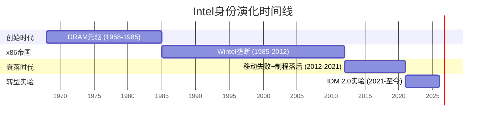
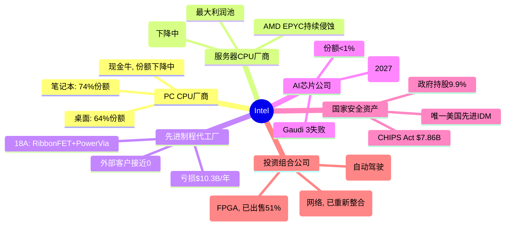
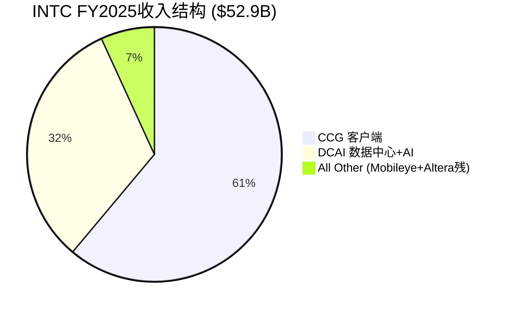
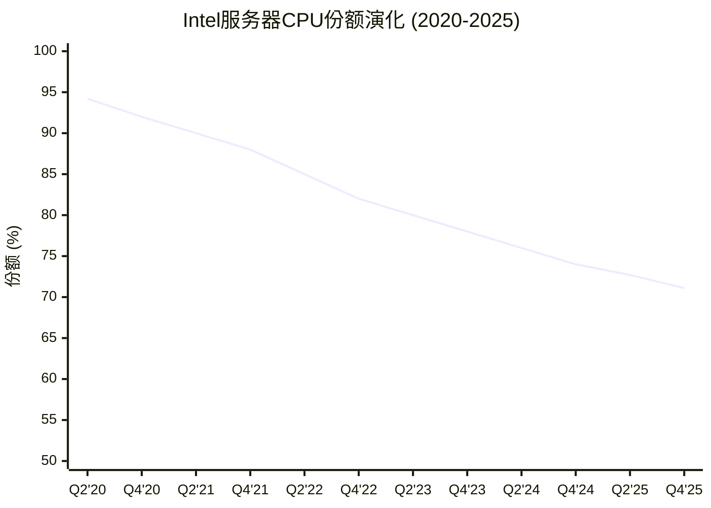
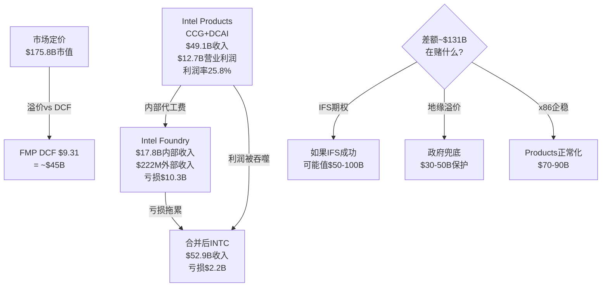
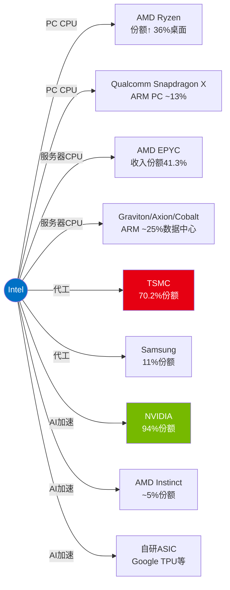

# Intel Corporation (INTC) — 深度研究报告

> 框架版本 v17.3 | 可能性宽度 8 (发现系统) | 数据截止 2026-02-25
> A-Score 4.74/10 (置信度调整4.27, 偏科型) | SGI 4.2 (混合模型) | 温度 88/100

## 研究契约

| 项目 | 说明 |
|------|------|
| **框架版本** | v17.3 (A-Score v2.0 + SGI + DM锚定 + 脚本验证) |
| **可能性宽度** | 8分 → 发现系统 (不提供单一目标价, 映射可能性空间) |
| **SGI** | 4.2 (混合模型, 偏通才) |
| **投资温度** | 88/100 (极热: 市场争议极大, 信息密度高, 估值分歧宽) |
| **报告不包含** | 精确目标价 · 仓位建议 · 操作触发 · 12月后数字预测 |
| **报告包含** | 价格隐含假设 · 承重墙脆弱度 · 条件估值范围 · 追踪信号 · Kill Switch |
| **数据审计** | DM覆盖率≥90% · DM锚点97个 · 详见附录A |
| **AI能力边界** | 深挖区(技术/供应链/周期/跨公司对比) · 诚实区(管理层意图/预测/时机) |
| **评级体系** | 四档(深度关注/关注/中性关注/审慎关注) · PW≥7给条件评级 |

---

## 执行摘要

**Intel是一个被$175.8B市值标价的$60-100B商业实体, 差额是尚未兑现的IFS期权+地缘政治溢价+散户情绪——三者中只有地缘溢价有锚, 其余两个可能蒸发。**

Intel正处于半导体历史上最复杂的身份危机之中。这家创立于1968年、曾以x86帝国统治全球计算半个世纪的公司, 如今同时扮演六种角色——PC CPU厂商、服务器CPU厂商、先进制程代工厂、AI芯片公司、国家安全资产、投资组合公司——却在每一个战场上都不是最强的参与者。市场给它$175.8B的估值(DM-002), 远超其商业基本面所能支撑的价值, 这个溢价的本质是一个尚未兑现的"可能性期权"。

### 核心发现

- **Products盈利 vs Foundry烧钱的割裂**: Intel Products(CCG+DCAI)实现$49.1B收入、$12.7B营业利润、25.8%利润率——如果独立上市, 这是一家盈利能力尚可的芯片设计公司。但Intel Foundry年亏$10.3B, 加上$5.5B公司级费用, 合并后变成亏损实体。市场在用一个价格给两个完全不同的实体定价(DM-011)

- **五面同时进攻, 无一战场领先**: AMD侵蚀x86(服务器收入份额41.3%), NVIDIA垄断AI加速器(94%), ARM架构替代(数据中心25%), 云厂商自研芯片, TSMC主导代工(70.2%)。A-Score 4.74/10反映的正是这种系统性竞争力衰退——12维中9维趋势下降(DM-062)

- **18A是技术突破但非商业成功**: RibbonFET(全球首个量产GAA)和PowerVia(全球首个量产背面供电)是真正的工程成就。但良率65-75%(需>80%盈利)、密度落后TSMC N2 31%、IP库几乎为零、外部收入仅$222M(Q4年化)——技术可行到商业成功, TSMC走了15年

- **护城河从技术壁垒迁移到制度壁垒**: A-Score的三座"残存堡垒"是输入自主权(IDM模式)、切换成本(x86企业生态)、合规门槛(CHIPS Act+国防)。护城河核心的70%已来自制度壁垒而非技术壁垒——这是Intel故事最重要的结构性变化

- **政府入股提供底线但非价值锚**: 美国政府以$20.47/股入股9.9%, NVIDIA以$23.28入股~4.4%, SoftBank以$23.00入股~2%——合计$15.9B锚定买盘在$20-23区间。但这些资金是给Intel管理层的, 不是给现有股东的。现有股东在4年内被稀释近20%(4.06B→4.86B股)

- **Tan优化而非革命**: 新CEO Lip-Bu Tan上任11个月的行动一致指向"提升执行效率"而非"推翻IDM 2.0"——裁员2.1万人、管理层精简50%、CapEx从$25.8B降至$14.6B、剥离Altera、保留IFS核心。如果Intel的问题是"方向对但执行差", Tan可能是正确的CEO。但时间太短, 无法区分"正确方向"与"又一次战略摇摆"

- **Ohio延迟5-6年是最大风险信号**: Intel旗舰工厂Ohio Fab 1从2025年推迟到2030-2031年, 比TSMC Arizona Phase 2晚3-4年。Intel可能在自己最大的差异化优势(美国本土先进制程)上被TSMC追平

### 三大非共识假说

| 假说 | 核心主张 | 置信度 |
|------|---------|:------:|
| **H-1: 政府期权>商业价值** | Intel的估值溢价主要由地缘政治保护和政策兜底驱动, 而非商业竞争力预期。政府入股@$20.47设定了隐性底线, CHIPS Act $7.86B+Secure Enclave $3B构成持续资金注入 | 70% |
| **H-2: 僵尸轨道最可能** | Intel最可能走上"不死不活"的僵尸路径——Products维持正利润但份额缓慢流失, IFS持续烧钱但不会被完全放弃(政府不允许), 股价在$20-40区间震荡3-5年 | 55% |
| **H-3: 五角大楼是18A真正客户** | Intel 18A的最大商业机会不是Apple或其他商业客户, 而是Secure Enclave军事/情报需求($1-3B/年高利润) — Intel是唯一有资质的美国先进制程厂商 | 45% |

### 条件评级

**基线评级: 审慎关注** — 基于概率加权期望回报约-72%

概率加权计算: 四情景(管理层目标8% × $34/股 + 乐观17% × $25/股 + 共识35% × $15/股 + 悲观40% × $2/股) = 概率加权每股约$13.0, 远低于当前$45.91(DM-001)。

但PW=8意味着单一评级信息量有限。可能性空间从$2到$34/股, 比评级更重要的是理解每条路径的条件和概率:
- **如果IFS成功概率>30%且份额稳定** → 中性关注(适合有独立产业信息优势的投资者)
- **如果地缘溢价>$50B且持久** → 关注(适合押注台海紧张或美国制造政策加码的宏观投资者)
- **如果基于公开信息做概率加权** → **审慎关注**(本报告基线)

### 关键追踪信号

1. **18A良率突破80%**: 这是IFS商业化的必要条件。当前65-75%, 需在2026H2-2027达到行业标准。如果Panther Lake量产良率数据不及预期, IFS叙事将遭受重大打击
2. **Apple 18A签约/拒绝**: 最大的单一催化剂。签约= IFS叙事获得实质支撑; 拒绝= IFS外部客户管线实质性塌缩
3. **x86服务器份额跌破65%**: 当前71.1%, 按~3pp/年速率2028年可能触及。一旦跌破, 将触发"份额加速流失"的负反馈循环
4. **IFS季度外部收入突破$500M**: 当前$222M(Q4年化~$0.9B)。如果2026年任何季度外部收入>$500M, 则IFS商业化叙事获得初步验证
5. **CEO战略一致性12个月+**: Tan的决策模式到目前为止指向"优化IDM 2.0", 但前两任CEO分别在3年和5年后被解职。如果2026年内出现第四次战略重大转向, 组织耗散将不可逆

---

# Part I: 公司定位与生态

---

# 第一章 公司画像

## 1.1 公司快照

| 指标 | 值 | 信号 |
|------|-----|------|
| **公司名** | Intel Corporation (NASDAQ: INTC) | |
| **成立** | 1968年 (Gordon Moore, Robert Noyce) | 57年历史 |
| **总部** | 加州圣克拉拉 | |
| **CEO** | Lip-Bu Tan (2025.03上任) | 第3任CEO in 5年 |
| **市值** | $175.8B (2026.02数据采集日) (DM-002) | 高于FMP DCF $9.31的393% |
| **股价** | $45.91 (2026.02数据采集日) (DM-001) | |
| **收入** | $52.9B (FY2025) | 2010年以来最低 |
| **员工** | FY2025末~94,000 (FMP), Tan目标裁至~75,000 | 从~120,000峰值裁减中 |
| **SGI** | 4.2 (混合模型, 偏通才) (DM-010) | 定价异常已标记 |
| **PW** | 8 (发现系统) | 不给目标价, 映射可能性空间 |

### 发现系统定位声明

本报告采用**发现系统**(PW=8)方法论。Intel的可能性空间极宽——从"僵尸化"到"美国半导体复兴旗舰"的结果均有非零概率。报告**不提供目标价或确定性评级**，而是:

1. **映射可能性空间**: 识别Intel可能走向的3-5条路径及其概率权重
2. **标记转折点**: 哪些事件/数据会触发路径切换
3. **提供条件性评级**: "如果[条件A]，则[评级X]"
4. **诚实声明不确定性**: 承认哪些关键变量超出分析能力

**核心矛盾**: 市值$175.8B vs ROIC -0.05% — 市场在为一个"当前不存在的Intel"定价。

### 七大核心问题 (CQ) 速查

| CQ | 问题 | 报告结论置信度 |
|----|------|:----------:|
| CQ1 | 18A能否实现商业可行良率? | 55% |
| CQ2 | IFS能否获$3-5B外部年收入? | 15% |
| CQ3 | x86服务器能否保住60%+份额? | 55% |
| CQ4 | Tan是否会根本性改变IDM 2.0? | 25% |
| CQ5 | AI推理能否创造有意义收入? | 30% |
| CQ6 | 地缘政治溢价值多少? | 65% |
| CQ7 | FY2028前能否恢复正FCF? | 55% |

## 1.2 身份危机 — 从Intel Inside到身份迷宫

### 四个时代

Intel的57年历史可以压缩为四个身份时代，每个时代定义了不同的估值逻辑:



**时代I: DRAM先驱 (1968-1985)** — Moore和Noyce创立Intel制造DRAM内存芯片。1971年推出4004——世界上第一个商业微处理器。1985年在日本DRAM价格战中战略性退出DRAM，全面转向微处理器。**这是Intel历史上唯一一次成功的战略大转型**。

**时代II: x86帝国 (1985-2012)** — 与Microsoft结成"Wintel联盟"，x86 ISA成为PC/服务器的事实标准。Intel同时掌控设计+制造(IDM模式)，制程领先全球1-2代。峰值时期(2005-2010):
- 营业利润率30%+
- 服务器份额>95%
- PC份额>80%
- 全球最先进的半导体工艺
- SGI估计: ~8-9 (纯正专才)

**时代III: 衰落 (2012-2021)** — 三重打击:
1. **移动失败**: 放弃ARM移动芯片(2006年卖掉XScale)，错过智能手机+平板的$400B TAM
2. **制程延迟**: 10nm延迟5年(2014目标→2019量产)，TSMC/Samsung实现反超
3. **资本分配灾难**: Otellini→Krzanich→Swan时期, $36B回购 vs $38B CapEx(SemiAnalysis)——在需要投资制造的时候选择了金融工程

**时代IV: 转型实验 (2021-至今)** — Pat Gelsinger 2021年回归，宣布"IDM 2.0"——Intel既做自己的芯片，也为外部客户代工。投入$110B+进行"4年5节点"制程追赶。Gelsinger 2024.12被迫离职，Lip-Bu Tan接任。当前状态: **转型中途，成败未卜**。

(DM-051)

### 身份张力图谱: Intel到底是什么?

Intel当前同时是(或试图成为)以下**六种身份**，每种身份对应不同的估值逻辑和资源需求:



**SGI解读**: Intel从SGI~8-9(时代II, 纯CPU专才)退化到SGI~4.2(当前, 六重身份通才)。这种"身份扩散"有两个可能:

1. **通才陷阱** (概率偏高): 每个领域都投入不够深，在每个战场都输给专才对手
   - CPU输给AMD(纯CPU设计)+ARM(生态创新)
   - 代工输给TSMC(纯代工效率)
   - AI输给NVIDIA(纯GPU+CUDA生态)
   - FPGA输给Xilinx/AMD(整合优势)

2. **平台协同** (Intel的愿景): IDM 2.0打通设计+制造，实现别人做不到的垂直整合
   - CPU+代工: 内部芯片验证18A → 吸引外部客户
   - CPU+AI: Xeon+加速器一体化 → 推理市场差异化
   - 制造+地缘: 美国本土先进产能 → 政策溢价

当前证据更支持(1)而非(2)。六个领域中，Intel在**零个领域**处于技术/市场领先位置(即使在传统优势的服务器CPU领域，AMD EPYC Turin的收入份额已超40%)。协同效应是理论上的——需要18A成功作为"keystone"才能激活。

(DM-010, DM-050)

### 从专才到通才: SGI衰退的根因分析

| SGI维度 | 2010年(估) | 2020年(估) | 2025年 | 衰退原因 |
|---------|:----------:|:----------:|:------:|---------|
| HHI_rev | 8 | 6 | 4 | 从纯CPU→CPU+代工+IoT+FPGA+自动驾驶+AI |
| R&D_conc | 8 | 5 | 3 | R&D从CPU聚焦→分散到6个方向, R&D/GP=75% |
| MarketPos | 9 | 7 | 6 | 服务器从>95%→71%, PC从>85%→64-74% |
| SwitchCost | 8 | 7 | 5 | x86锁定被ARM侵蚀, 云厂商自研加速 |
| BrandClarity | 9 | 6 | 3 | "Intel做CPU"→"Intel做所有东西(但都不是最好的)" |

**15年累计SGI下降**: ~8.5 → 4.2 = **-4.3分 (-51%)**

这不是周期性波动——这是**结构性身份退化**。每次Intel扩展进入新领域(FPGA/Mobileye/IFS/AI)，都稀释了SGI而未能在新领域建立领先地位。唯一的反例可能是IFS——如果18A成功，IFS可能从"SGI稀释因素"变为"估值倍数升级因素"。但目前，IFS是纯烧钱阶段。

## 1.3 业务全景 — 六大战场

### 收入全景与段报告架构

FY2025起Intel简化段报告为3个可报告段+全其他:



注: Intel Foundry $17.8B主要为内部转移(对消后不计入合并收入)，外部收入极小。

**段报告变化 (Tan时代重组)**:
- NEX(网络与边缘)已并入CCG和DCAI，不再独立报告
- Altera于2025.09.12去合并(Silver Lake收购51%)
- 报告从6段简化为3段——这本身反映了Tan的"简化"哲学

(DM-011~015)

### FY2025分部损益全景

| 分部 | 收入($B) | 营业利润($B) | 营业利润率 | YoY变化 |
|------|:--------:|:------------:|:---------:|:-------:|
| **CCG** | 32.2 | 9.3 | 28.9% | 收入-3%, 利润↓~16% |
| **DCAI** | 16.9 | 3.4 | 20.2% | 收入+5%, 利润↑大幅 |
| **Intel Foundry** | 17.8 | (10.3) | -57.9% | 亏损改善$3.1B |
| **All Other** | 3.6 | 0.3 | ~8% | Altera去合并 |
| **公司未分配** | — | (5.5) | — | 重组费用 |
| **合计** | **52.9** | **(2.2)** | **-4.2%** | 从亏$7B+改善 |

(DM-011)

**关键洞见**: 如果把Intel Products(CCG+DCAI)独立看——$49.1B收入, $12.7B营业利润, 25.8%利润率——这是一家**盈利能力尚可的芯片设计公司**。问题出在Intel Foundry: $10.3B亏损吞噬了产品业务的绝大部分利润，加上$5.5B公司级费用，合并后变成亏损。

**这验证了核心矛盾的精确所在**: Intel Products ≠ Intel Foundry。市场在用一个价格给两个完全不同的实体定价——一个是盈利的芯片设计公司，另一个是巨额亏损的初创代工厂。

### CCG: 客户端计算 — 现金牛保卫战

**业务概况**

CCG是Intel最大的收入来源和利润发动机，覆盖笔记本、桌面、Chromebook全线PC处理器。FY2025收入$32.2B，营业利润$9.3B，利润率28.9%。

**产品矩阵**:
- **Core Ultra (Meteor Lake → Lunar Lake → Arrow Lake → Panther Lake)**: 消费级CPU, AI PC定位
- **Panther Lake**: 首款18A量产产品，CES 2026发布，集成NPU(AI加速单元)
- **Core Ultra 200系列**: Arrow Lake桌面端，2025年发布

**份额趋势与竞争动态**

| 市场 | Intel份额(Q4 2025) | AMD份额 | ARM份额 | 趋势 |
|------|:------------------:|:-------:|:-------:|:----:|
| **桌面** | 64% | 36% | — | AMD +9pp YoY |
| **笔记本** | 74% | 26% | 13.3% | ARM PC平台期(13.7%→13.3%) |
| **整体客户端** | ~70% | ~30% | ~5% | Intel缓慢失血 |

(DM-050 Mercury Research Q4 2025)

**CCG面临的三重威胁**:

1. **AMD Ryzen 9000系列**: Zen 5架构, 桌面端份额从27%升至36%(+9pp YoY)——这是AMD在桌面CPU历史上最大的年度份额增幅

2. **Qualcomm Snapdragon X系列(ARM)**: 进入Windows PC市场。但市场数据显示ARM PC份额从13.7%微降至13.3%——**ARM PC威胁暂时被高估**。原因: x86软件兼容性、企业IT部门惰性、价格竞争力不明显

3. **Apple Silicon(ARM)**: 已完全替代Intel Mac(2020-2024过渡完成)。但这是"已完成的伤害"——Intel已完全失去Apple PC业务(约$5-8B年收入, 2019年前)

**CCG的战略价值**:
- 短期: 提供$9.3B营业利润, 为IFS烧钱提供资金基础
- 中期: Panther Lake(18A)是"内部客户验证" → 证明18A可行
- 长期: AI PC叙事(NPU集成)是否能驱动ASP上升和升级周期

**CQ相关性**:
- CQ3(x86份额): CCG份额虽在下降, 但幅度可控。真正的威胁在服务器端, 不在PC端
- CQ7(FCF): CCG是唯一稳定的现金流来源, 其健康度直接决定Intel的"生存弹药"

### DCAI: 数据中心与AI — 被蚕食的王座

**业务概况**

DCAI覆盖服务器/数据中心CPU(Xeon)、AI加速器(Gaudi/Crescent Island)、存储和网络(原NEX部分)。FY2025收入$16.9B, 营业利润$3.4B, 利润率20.2%。

**关键产品**:
- **Xeon 6 "Granite Rapids" (P-core)**: 高单线程性能, 金融/延迟敏感负载
- **Xeon 6 "Sierra Forest" (E-core)**: 高密度/低功耗, 成本/VM优化 → **ASP稀释效应**
- **Gaudi 3**: AI训练/推理加速器 → **基本失败**(vs H200差9x性能)
- **Crescent Island**: 新一代数据中心GPU, Xe3P架构, 推理定位, **2026 H2采样**

**服务器CPU份额侵蚀全景**

这是Intel最关键的利润池, 也是流失最严重的战场:



(DM-050)

**更危险的信号——收入份额**:

AMD的收入份额增长远快于单位份额:
- AMD Q4 2025: 28.8%单位份额 vs **41.3%收入份额** (首次超过40%)
- 差距原因: EPYC Turin高核心数SKU(最高192核, ASP ~$14,800) vs Intel Xeon E-core低价产品拉低ASP

**含义**: Intel虽然在单位量上仍占优(71%), 但在**高价值**服务器市场正被AMD压缩。Intel的Xeon 6 Sierra Forest(E-core)维持了单位份额, 但以ASP下降为代价——这是**以量换价**的防守策略。

**AI加速器: 几乎完全出局**

| 产品 | Intel地位 | 竞争对手 | 差距 |
|------|----------|---------|------|
| **训练** | Gaudi 3 (基本失败) | NVIDIA H200/B200 | 性能差9x (Los Alamos) |
| **推理** | Crescent Island (2027) | NVIDIA各系列 + AMD MI300X | 产品不存在 |
| **定制ASIC** | 年化>$1B (Q4 2025) | Broadcom/Marvell | 规模小但增长26% QoQ |

Gaudi 3的失败和Falcon Shores的取消是DCAI AI战略的重大挫折。Crescent Island GPU(Xe3P架构, 160GB LPDDR5X, 空冷推理)是一个全新的赌注:
- **差异化定位**: 针对空冷企业推理服务器, 避开NVIDIA在液冷训练领域的正面竞争
- **架构**: 与Panther Lake共享Xe3架构, 降低研发边际成本
- **时间线**: H2 2026采样 → 2027最早量产
- **风险**: NVIDIA CUDA生态锁定极强, 新GPU从零开始建软件栈

**CQ相关性**:
- CQ3: 服务器CPU份额下降速度~3pp/年, 按此速度2029年可能跌破60%
- CQ5: Crescent Island是"2027年的故事", 当前对收入贡献为零

### Intel Foundry (IFS): 从零开始的$100B豪赌

**这是Intel故事的核心——也是最大的不确定性来源**

Intel Foundry是Gelsinger 2021年推出的IDM 2.0战略的产物——将Intel的制造能力开放给外部客户代工。这是半导体行业有史以来最大的单一企业战略转型尝试。

**财务现实**:

| 指标 | FY2024 | FY2025 | 变化 |
|------|:------:|:------:|:----:|
| **总收入** | $17.5B | $17.8B | +2% |
| **外部收入** | ~0 | $222M (Q4年化) | 微量 |
| **营业亏损** | $(13.4)B | $(10.3)B | 改善$3.1B |
| **营业利润率** | ~-77% | -57.9% | 改善19pp |

**$17.8B收入的真相**: 绝大部分是内部转移定价——Intel Products(CCG+DCAI)付给Intel Foundry的代工费用。如果Intel分拆为独立的设计公司和独立的代工公司, Foundry需要用**商业竞争力**而非**内部调拨**来获得订单。

**外部客户进展**:

| 客户 | 状态 | 预期规模 | 置信度 |
|------|------|---------|:------:|
| **Apple** | PDK 0.9.1GA已交付, 全PDK Q1 2026, "接近签约" | 潜在$2-5B+/年 | 中低 |
| **Microsoft** | 18A订单已确认 | 未知 | 中 |
| **MediaTek** | 首个工艺节点代工客户 | 较小 | 较高 |
| **NVIDIA** | 仅限先进封装探索, 18A测试后暂停 | 不明 | 低 |
| **Broadcom** | 18A测试后放弃(Reuters) | — | 已退出 |
| **定制ASIC** | 年化>$1B, +26% QoQ | $1-2B | 较高 |
| **军方/情报** | Secure Enclave $3B专项 | $3-5B (政府合同) | 高 |

**>$15B终生合同价值**: Intel声称的数字, 但"终生"可能指5-10年合同总额, 非年化收入。

### 18A: 技术突破 vs 商业可行性

**技术成就(真实的)**:
- **RibbonFET**: 全球首个量产GAA(Gate-All-Around)晶体管, 四面环栅
- **PowerVia**: 全球首个量产背面供电(BSPDN), 减少电压降10x
- **组合效果**: vs Intel 3 — +25%性能同功耗, 或-36%功耗同性能
- Panther Lake和Clearwater Forest已"通电启动操作系统"

**商业挑战(同样真实的)**:
- **良率**: ~55%(2025中)→65-75%(Q4 2025), 但需>80%才盈利 → 2027才达行业标准
- **密度**: 238 MTr/mm² vs TSMC N2 313 MTr/mm² → Intel密度低31%
- **PDK成熟度**: PDK 1.0 2025.07才发布, 外部客户IP库小, 移植≈新设计成本
- **TSMC生态**: 30年积累 vs Intel从零开始的代工IP生态

**18A vs TSMC N2对比矩阵**:

| 维度 | Intel 18A | TSMC N2 | 优势方 |
|------|----------|---------|:------:|
| 晶体管类型 | RibbonFET (GAA) | Nanosheet GAA | 平 |
| 供电方式 | PowerVia (背面) | 前端(传统) | **Intel** |
| 晶体管密度 | 238 MTr/mm² | 313 MTr/mm² | **TSMC** (+31%) |
| PPA得分 | 2.53 | 2.27 | **Intel** (微优) |
| 良率(2026初) | 65-75% | ~65-70% | 接近 |
| 量产时间 | 2025末/2026初 | 2025末, 大规模2026秋 | 接近 |
| 客户生态 | Apple(待定), Microsoft | Apple(A20/M5, 50%初期产能) | **TSMC** (远超) |
| IP库 | 小, 刚起步 | 30年积累, 极丰富 | **TSMC** (远超) |
| 代工信任度 | 竞争对手代工的固有矛盾 | 纯代工, 无利益冲突 | **TSMC** |

**Intel 18A的真正优势**: 不在于技术指标的对比(与TSMC N2互有胜负), 而在于**它是在美国本土**。对于: (a)美国政府/军方 (b)需要供应链多元化的客户 (c)CHIPS Act补贴驱动的成本优势——Intel 18A提供了TSMC Arizona之外的第二选项。

Apple选择18A(如果成行)可能更多出于地缘政治/供应链考量而非纯技术优势。18A确实为Intel内部芯片优化(Panther Lake/Clearwater Forest), 外部客户需要不同的PDK调整和IP库。

**IFS财务转折点分析**:

Intel官方目标: IFS在"low-to-mid single-digit billions"外部年收入时实现盈亏平衡。具体拆解:

```
当前IFS亏损: ~$10.3B/年
固定成本占比(估): ~70% (~$12.5B, 含折旧)
可变成本占比(估): ~30%
内部转移定价: ~$17.8B
外部收入所需毛利率假设: ~40%(代工行业平均)

盈亏平衡外部收入 = $10.3B / 40% = ~$25.7B
但: 部分亏损由折旧驱动(非现金), 且随良率提升单位成本下降

现实更可能: $3-5B外部收入 + 良率改善 + 内部利用率提升 → 亏损从$10.3B降至$5-7B
真正盈亏平衡: 可能需要$8-10B外部收入, 或3-4年的良率/成本优化曲线
```

**CQ相关性**:
- CQ1: 18A良率是所有后续讨论的基础。65-75%已超预期但仍不够
- CQ2: 当前外部收入接近0, $3-5B目标在FY2027前极具挑战性

### Altera (FPGA): 已剥离的沉没成本

**历史**: Intel于2015年以$16.7B收购Altera, 目的是将FPGA与Xeon整合。这笔交易被广泛视为失败——Altera在Intel内部缺乏独立发展空间, 同时被Xilinx(2022年被AMD收购)甩开。

**当前状态**:
- 2025.04: Silver Lake以$4.46B收购51%股权 → 估值$8.75B(**仅为收购价的52%**)
- Intel保留49%股权
- Altera从Intel去合并(2025.09.12起)
- FY2024: $1.54B收入, -$615M营业亏损
- 新CEO: Raghib Hussain(来自Marvell)

**投资教训**: Altera是Intel"通才陷阱"的典型案例——收购后无法在Intel庞大的组织中获得足够关注和资源, 最终以47%的价值损失剥离。$8B+的价值毁灭。

### Mobileye (自动驾驶): 独立运营, 估值缩水

**历史**: Intel于2017年以$15.3B收购Mobileye, 2022年IPO(估值一度>$30B)。

**当前状态**:
- Intel所持权益: ~82%(从~88%减少, 2025.07出售部分)
- Intel保留~98%投票权(通过B类股)
- Mobileye独立运营, 非Intel核心业务
- 2026.01: Mobileye以~$900M收购Mentee Robotics(机器人)
- 当前Mobileye市值: 约$7.17B (DM-061)

**对Intel的含义**: Mobileye是一个可以变现的**流动性储备**——如果Intel需要资金, 可以继续出售Mobileye股份。但Mobileye的估值从IPO峰值~$30B大幅缩水至$7.17B, 限制了可变现金额。

### 业务组合核心矛盾: "设计公司+代工初创" = 估值炼狱

将业务组合回归核心矛盾:



**不同身份下Intel的"合理"估值区间**:

| 身份定义 | 参考估值方法 | 估值区间 | 隐含股价 |
|---------|------------|:--------:|:--------:|
| 纯芯片设计(无IFS) | 15x Products营业利润 | $100-130B | $21-27 |
| 芯片设计+IFS起步 | 上方+IFS期权$30B | $130-160B | $27-33 |
| 国家安全资产 | 上方+地缘溢价$30-50B | $160-210B | $33-43 |
| IFS成功情景 | Products+IFS $50-100B | $200-300B | $41-62 |
| 当前市价 | 市场定价 | $175.8B | $45.91 |

当前市价$45.91隐含: 市场给了**部分IFS期权+大部分地缘溢价**。要维持此价格, 市场需要持续看到IFS成功迹象。

(DM-001~008, DM-035~038)

## 1.4 管理层: 从Gelsinger到Tan的战略断裂

### Gelsinger时代回顾 (2021.02 - 2024.12): 宏大愿景, 失败执行

Pat Gelsinger 2021年2月回归Intel, 带着"制造复兴"的信仰推出IDM 2.0:

**核心承诺**:
- "4年5节点": Intel 7 → Intel 4 → Intel 3 → Intel 20A → Intel 18A (2021-2025)
- IFS外部代工: 从零打造全球第二大代工厂
- 保持设计竞争力: 与AMD/ARM竞争的同时追赶制程

**成绩**:
- 制程追赶确实在进行: Intel 4(2023)→Intel 3(2024)→18A(2025)按计划推进
- 争取到CHIPS Act资金
- PPE从$63B增至$108B, 制造能力大幅扩张

**失败**:
- Gaudi AI加速器: 从未获得市场牵引力, vs NVIDIA差距持续扩大
- 收入持续下滑: $79B(2021)→$53B(2025), 在其任内下降33%
- 巨额亏损: FY2024净亏$18.8B(含大规模减值/重组)
- IFS外部客户: 3年努力, 外部收入仍接近0
- **被解职**: 2024.12.01, 董事会"在失去信心后要求Gelsinger辞职"(WSJ)

**Gelsinger的遗产**: 他启动了正确的方向(制程追赶), 但低估了执行难度和组织惰性。Intel的问题不仅是技术——更是文化、效率和优先级排序。SemiAnalysis的深度批评指出: Otellini时代(2005-2013)开始的人才流失和文化腐烂, 不是Gelsinger 3年能修复的。

(DM-051)

### Tan的背景与战略信号: 设计思维 vs 制造信仰

**Lip-Bu Tan简历**:
- 前Cadence Design Systems CEO (2009-2024), 将Cadence从EDA第三变为并列第一
- 台湾出生, 新加坡成长, MIT硕士
- 风投背景: Walden International创始人
- 2024.08: 从Intel董事会辞职(被解读为对Gelsinger某些决策的不满)
- 2025.03.18: 正式出任Intel CEO

**Tan vs Gelsinger: 根本性的风格差异**

| 维度 | Gelsinger | Tan |
|------|----------|-----|
| **背景** | Intel老兵(CTO), 工艺工程师 | EDA/设计软件CEO, 风投 |
| **哲学** | "制造是Intel的灵魂" | "效率和执行是一切" |
| **组织风格** | 大愿景, 层级化 | 扁平化, 管理层减50% |
| **资本哲学** | 激进投入(CapEx峰值$25.8B) | 纪律投入(CapEx降至$14.6B) |
| **IFS态度** | All-in, 外部代工是核心 | 延续但可能调整优先级 |
| **AI策略** | Gaudi系列, 追赶NVIDIA | Crescent Island, 差异化推理 |
| **并购/剥离** | 保留所有业务 | 剥离Altera, 缩减Mobileye, 精简组织 |

### Tan上任11个月: 行动清单

按时间线梳理Tan的关键决策:

| 日期 | 行动 | 战略信号 |
|------|------|---------|
| 2025.03 | 就任, 3位董事退休 | 清理Gelsinger时代董事会 |
| 2025.04 | Altera 51%售予Silver Lake ($4.46B) | "精简到核心" — 剥离非核心FPGA |
| 2025.05 | Raghib Hussain接任Altera CEO | 专业管理, 非Intel内部人 |
| 2025.07 | 裁员21,000人(~20%), 管理层减50% | 激进效率化, $1.5B年化节省 |
| 2025.07 | 出售部分Mobileye(~$1B) | 变现非核心资产, 补充现金 |
| 2025.07 | 宣布NEX独立(后12月撤回) | 试探性剥离, 但发现NEX与DCAI协同 |
| 2025.08 | 美国政府$8.9B入股 | 政治关系管理 |
| 2025.08 | SoftBank $2B投资 | 拉入战略盟友 |
| 2025.09 | 任命Kevork Kechichian(来自ARM)领导数据中心 | **关键信号**: 从ARM请来的人领导x86数据中心 |
| 2025.09 | NVIDIA $5B投资 | 与最大竞争对手形成微妙联盟 |
| 2025.10 | Crescent Island GPU发布(OCP峰会) | **AI战略转向**: 放弃追训练, 聚焦推理 |
| 2025.11 | CTO Sachin Katti离职去OpenAI | 人才流失信号(6个月即走) |
| 2025.12 | 撤回NEX独立, 保留 | 审视后调整 |
| 2026.01 | Q4 2025财报, 指引Q1低于预期 | 股价-17% |
| 2026.02 | 聘Eric Demmers(前Qualcomm)为GPU首席架构师 | GPU战略加码 |

### CQ4裁定: Tan会根本性改变IDM 2.0吗?

**结论: 不太可能 (置信度25%)**

Tan上任11个月的行动一致指向"优化IDM 2.0"而非"推翻IDM 2.0":
- 保留IFS核心地位, 争取政府+NVIDIA+SoftBank资金
- 18A继续推进, 未放缓
- 剥离的是Altera/Mobileye(非核心), 不是IFS(核心)
- 创建IFS独立董事会(增强而非削弱代工业务)

**但**: 两个不确定性保持开放:
1. 如果18A在2026H2未能达到80%良率且Apple不签约 → Tan可能被迫收缩IFS
2. 5%政府权证条款(如果Intel出售IFS >49%股权则触发) → 政府设置了"IFS必须保留"的机制约束

**Tan的真正贡献**: 不在于战略方向改变, 而在于**执行效率**提升——裁员20%, 管理层减50%, CapEx纪律化, OpEx从$19.4B→$16.5B(-15%)。如果Intel的问题是"方向对但执行差", Tan可能是正确的CEO。

### 管理层关键人物评估

| 姓名 | 职位 | 背景 | 评估 |
|------|------|------|------|
| **Lip-Bu Tan** | CEO | Cadence CEO, VC | 效率导向, 但无制造业运营经验 |
| **Kevork Kechichian** | EVP, 数据中心 | 前ARM EVP工程 | **从ARM请来管x86** — 可能带入ARM思维 |
| **Naga Chandrasekaran** | EVP/CTOO, Foundry | Intel内部, 制造老将 | IFS技术执行的关键人物 |
| **Eric Demmers** | GPU首席架构师 | 前Qualcomm | GPU从零建队 |
| **Raghib Hussain** | Altera CEO | 前Marvell | 已独立, 非Intel核心 |

**CTO空缺风险**: Sachin Katti任CTO仅6个月即离职去OpenAI。Intel目前没有CTO——在技术转型最关键时期。Tan直接监督AI战略, 但CEO+CTO双重角色可能导致注意力分散。

---

# 第二章 产业链生态

## 2.1 上下游映射: Intel在半导体产业链中的独特位置

Intel是全球唯一同时设计和制造先进制程芯片的西方公司(IDM模式), 这种垂直整合使其在产业链中的位置与其他半导体公司截然不同:

**上游 — 供应商依赖**:

| 类别 | 核心供应商 | Intel依赖度 | 风险 |
|------|----------|:---------:|------|
| **光刻设备** | ASML (EUV独家) | 极高 | ASML是全球唯一EUV供应商, 18A需要high-NA EUV |
| **刻蚀/沉积** | Lam Research, Applied Materials, TEL | 高 | 制程转换需定制设备配方 |
| **检测/量测** | KLA, ASML(电子束) | 高 | 良率提升依赖检测精度 |
| **材料** | 信越化学(光刻胶), SUMCO(硅片), 各化学品供应商 | 中 | 多供应商, 替代性较高 |
| **EDA工具** | Synopsys, Cadence, Siemens | 高 | 18A PDK需要EDA工具适配, Tan的前公司Cadence是关键合作方 |

**Intel与设备供应商的关系**: 不同于AMD/NVIDIA(无晶圆厂, 不直接与设备商打交道), Intel是ASML、Lam Research、Applied Materials的直接大客户。Intel的CapEx计划直接影响这些设备公司的收入。FY2025 Intel CapEx $14.6B中, 相当部分流向设备采购。

**下游 — 客户依赖**:

| 类别 | 核心客户 | 收入占比(估) | 集中度风险 |
|------|---------|:----------:|:---------:|
| **PC OEM** | Dell, HP, Lenovo, Acer, ASUS | ~55% (CCG) | 中(多家OEM) |
| **云/数据中心** | AWS, Azure, Google, Meta | ~25% (DCAI) | 高(4家超大规模) |
| **企业IT** | 通过OEM/SI分销 | ~10% | 低(分散) |
| **中国** | 联想, 浪潮, 华为(受限) | ~25% (全公司) | 高(地缘风险) |
| **政府/国防** | 美国DoD, 情报机构 | <5% (但增长中) | 低(政策支撑) |
| **IFS外部** | Microsoft, Apple(待定), MediaTek | <1% | 极高(几乎没有) |

**产业链位置的独特性**:

作为IDM, Intel同时是上游设备商的客户和下游终端厂商的供应商。这种双重身份产生了独特的动态:

1. **CapEx杠杆**: Intel的投资决策直接影响上游ASML/LRCX/AMAT的收入——这使Intel在设备采购中有议价能力, 同时也意味着Intel的投资放缓会在供应链中产生涟漪效应

2. **技术反馈环**: 与TSMC纯代工模式不同, Intel内部的芯片设计团队(Products)和制造团队(Foundry)之间存在直接反馈。理论上, 这使Intel可以为自己的芯片优化制程——但也可能导致对外部客户需求的忽视

3. **竞争悖论**: Intel的IFS客户(如Apple、NVIDIA)同时也是Products业务的竞争对手或合作对象。Apple用Intel代工意味着Apple看到Intel的制程数据, 而Apple Silicon是Intel在PC市场的最大威胁之一。这种"竞争对手代工"的信任赤字是IFS最大的结构性劣势

## 2.2 IDM模式的战略含义

全球半导体产业在过去30年经历了从IDM(垂直整合)到Fabless+Foundry(设计+代工分离)的大分工。当前格局:

| 模式 | 代表公司 | 优势 | 劣势 |
|------|---------|------|------|
| **纯Fabless** | AMD, NVIDIA, Qualcomm | 资本轻, 聚焦设计 | 产能受制于TSMC |
| **纯Foundry** | TSMC, Samsung Foundry | 规模效应, 多客户 | 不做设计, 利润率有限 |
| **IDM** | Intel, Samsung | 垂直整合, 独立自主 | 资本重, 效率低 |
| **IDM 2.0** | Intel(尝试中) | IDM+外部代工 | 前所未有, 无先例 |

**为什么Intel坚持IDM**: Intel的IDM模式不仅是商业选择, 更是身份认同。"Intel是一家制造公司"——这是从Gordon Moore到Pat Gelsinger的代际信仰。但这个信仰正在被市场挑战:

- AMD放弃制造(2009年分拆GlobalFoundries)后, 股价从$2涨到$200+
- NVIDIA从未自己制造, 市值超过$3T
- 反例: TSMC依靠纯制造成为$800B+公司

Intel的IDM 2.0试图两全其美——保持制造能力的同时, 开放给外部客户。但从IFS的财务表现来看(外部收入$0.9B vs TSMC $120B+), 这个"两全其美"目前更接近"两头不到岸"。

---

# 第三章 竞争格局 — 五面进攻

## 3.1 战场总览: Intel的多线作战困局

Intel同时在**5个独立战场**与**5+个不同对手**竞争, 每个战场有不同的竞争动态:



**多线作战的核心问题**: Intel在**每一条战线**都是防守方或追赶方, 在**没有一条战线**上处于进攻优势。这是SGI 4.2(通才)公司的典型困境——资源分散导致每个领域都投入不足。

## 3.2 服务器CPU: AMD EPYC的持续侵蚀

### 份额与财务数据

| 指标 | Intel Xeon | AMD EPYC | 趋势 |
|------|:----------:|:--------:|:----:|
| Q4 2025单位份额 | 71.1% | 28.8% | AMD +3.1pp YoY |
| Q4 2025收入份额 | ~58.7% | **41.3%** | AMD +4.9pp YoY |
| Q4 2025 Intel DCAI收入 | $4.7B | — | +9% YoY |
| Q4 2025 AMD数据中心收入 | — | $5.4B (含GPU) | +39% YoY |
| FY2025 AMD数据中心 | — | $16.6B | +32% YoY |

(DM-050)

**AMD EPYC Turin的竞争优势**:
- 最高192核/384线程 vs Intel Xeon 6 最高144核(Granite Rapids P-core)
- IPC提升~15-20% vs Zen 4
- ASP溢价: 顶配~$14,800, 高核心数SKU利润极高
- 客户认可: Turin在Q4 2025**首次占AMD EPYC收入>50%** → 换代完成
- TPCx-AI基准测试: EPYC 9965 = 1.70x vs Xeon 6980P

**Intel的Xeon 6防守策略**:
- **Granite Rapids (P-core)**: 针对单线程性能敏感负载(金融交易、数据库)
- **Sierra Forest (E-core)**: 针对密度/性价比(云原生、微服务) → 但ASP低, 拉低收入份额
- **矛盾**: E-core帮助维持单位份额, 但**加速收入份额流失**

### 侵蚀速度外推

| 指标 | 2020 Q2 | 2023 Q4 | 2025 Q4 | 2028E(趋势外推) |
|------|:-------:|:-------:|:-------:|:-------------:|
| Intel单位份额 | 94.2% | ~78% | 71.1% | ~60% |
| AMD单位份额 | 5.8% | ~22% | 28.8% | ~35% |
| ARM份额 | ~0% | ~5% | ~25%(含自研) | ~30-35% |

**按当前侵蚀速度(~3-4pp/年)**: Intel服务器CPU份额可能在2028-2029年跌破60%, 这是CQ3的关键阈值。但注意: 侵蚀速度可能**非线性**——随着"容易抢的份额"被抢完(云厂商), 企业端切换更慢。

## 3.3 ARM在服务器的崛起: 被低估然后被高估

ARM在数据中心CPU的份额达到~25%(2025年中), 主要由以下驱动:

| ARM平台 | 厂商 | 最新产品 | 核心数 | 制程 |
|---------|------|---------|:------:|------|
| **Graviton5** | AWS | 2025.12预览 | 192核 | TSMC 3nm |
| **Axion** | Google | C4A(GA), N4A(预览) | 64-72核 | TSMC 3/5nm |
| **Cobalt 200** | Microsoft | 2025末 | 132核 | ARM N3 |
| **Grace** | NVIDIA | 与Blackwell搭配 | 72核 | TSMC 4nm |
| **AmpereOne** | Ampere | 商用 | 192核 | — |

**ARM增长的驱动力**: 不是"ARM CPU更好", 而是**超大规模云厂商的垂直整合战略**:
- AWS用Graviton替代Intel/AMD → 成本降低(无需支付x86溢价)+差异化(仅AWS有Graviton)
- Google和Microsoft跟进: 自研CPU让他们减少对x86的依赖
- NVIDIA Grace-Blackwell将ARM CPU与GPU紧耦合 → AI负载天然用ARM

**ARM的限制**:
- ARM 2025年目标50%数据中心份额 → **实际仅25%**, 远未达标
- ARM的增长集中在超大规模端; 企业/传统OEM端ARM渗透率很低
- ARM CPU的ASP远低于高端x86(Graviton是AWS内部成本, 非销售)
- 企业IT的x86软件生态锁定在5-10年内仍然强大

**对Intel的含义**: ARM的威胁是**长期结构性**的(云厂商将继续自研), 但在企业端的进展可能比预期慢。Intel在企业服务器端可能维持较高份额, 但在云端的流失是不可逆的。

## 3.4 代工: TSMC的绝对统治

Intel IFS试图挑战的是人类商业史上最强大的制造垄断之一:

| 代工商 | 份额(2025) | 先进制程 | 客户 |
|--------|:----------:|---------|------|
| **TSMC** | **70.2%** | N3/N2 量产 | Apple, NVIDIA, AMD, Qualcomm, 所有人 |
| Samsung | ~11% | SF3/SF2 (良率低) | 少量外部 |
| SMIC | ~6% | 7nm (无EUV) | 中国国内 |
| GlobalFoundries | ~6% | 12/14nm (退出先进) | 汽车/IoT |
| UMC | ~5% | 成熟制程 | 混合信号 |
| **Intel IFS** | **不在前6** | 18A (起步) | 内部为主 |

(DM-050)

**TSMC的护城河为什么几乎无法攻破**:

1. **规模效应**: $30.24B/季收入 → 每年$70B+可投入研发和产能扩张
2. **学习曲线**: 30年纯代工经验, 每一代工艺都有客户数据反馈
3. **IP生态**: 最丰富的第三方IP库, 客户设计无需从零开始
4. **信任**: 纯代工模式=不与客户竞争(Intel IFS无此优势)
5. **客户锁定**: Apple锁定50%初期N2产能 → 其他客户被迫排队
6. **地理对冲**: 台湾+日本+美国(Arizona)+德国多地布局

**Intel IFS的唯一差异化**: **美国本土先进制程产能**。但TSMC Arizona也在加速:
- TSMC AZ Phase 1(4nm): 已量产
- TSMC AZ Phase 2(3nm): 2027量产(比Intel Ohio快3-4年)
- TSMC AZ Phase 3(2nm): 2027奠基, 加速中
- TSMC AZ总投资: **$165B, 6座晶圆厂** → 规模远超Intel在美国的计划

**IFS竞争力评估**: 在纯商业竞争中, Intel IFS赢TSMC大客户的概率极低。IFS的真正竞争力来自:
1. 政策驱动(CHIPS Act补贴降低客户成本)
2. 地缘多元化需求(供应链安全)
3. 军方/情报需求(Secure Enclave, TSMC不能做)
4. 特定技术优势(PowerVia背面供电, TSMC N2没有)

## 3.5 AI加速器: NVIDIA的代际领先

**市场份额**: NVIDIA ~94%, AMD ~5%, Intel <1%, 其他(Google TPU, 自研ASIC)

**Intel在AI的三次失败**:
1. **Nervana** (2016收购): AI训练芯片, 2020年被Habana取代
2. **Habana Gaudi 3**: 2024年推出, Los Alamos测试vs H200差9x性能 → 基本弃用
3. **Falcon Shores**: 计划中的下一代AI芯片 → **已取消**

**Crescent Island — Intel的第四次尝试**:
- 架构: Xe3P(与Panther Lake共享)
- 定位: **推理(非训练)**, 空冷企业服务器, 大内存(160GB LPDDR5X)
- 时间线: H2 2026采样, 2027量产
- 首席架构师: Eric Demmers(前Qualcomm, 2026.02加入)
- **差异化**: 避开NVIDIA在液冷训练集群的统治, 瞄准企业推理(成本敏感, 空冷需求)

**Crescent Island的机会窗口**:
如果成功, 它可能开辟一个NVIDIA目前忽视的细分市场:
- 企业推理(vs 超大规模训练)
- 空冷(vs 液冷)
- 性价比优先(vs 绝对性能优先)
- 与Xeon紧耦合(vs 独立GPU)

但挑战巨大:
- CUDA生态锁定: 几乎所有AI软件都为NVIDIA优化
- Intel OneAPI的生态影响力远低于CUDA
- 从芯片架构师到量产需要2-3年
- AMD MI300X已经在推理市场建立据点

## 3.6 竞争格局综合评分

```mermaid
radar
    title Intel竞争力雷达图 (10=最强)
    "PC CPU" : 7
    "服务器CPU" : 6
    "代工" : 2
    "AI加速器" : 1
    "网络/边缘" : 5
    "制造工艺" : 5
```

**总体评估**: Intel在传统业务(PC/服务器CPU)仍有较强地位(6-7分), 但在所有增长领域(代工/AI/ARM)均处于弱势(1-2分)。这种"强在过去, 弱在未来"的竞争格局, 解释了为什么市场给Intel定价时不看当前盈利(弱)而看未来潜力(取决于IFS/AI)。

---

# 第四章 预测市场与宏观环境

## 4.1 预测市场相关事件

对Intel前景有直接或间接影响的预测市场事件跟踪:

**直接相关事件**:
- Intel IFS获得Apple正式合同: 市场隐含概率尚未形成独立市场, 但Apple的决定是IFS叙事的最大单一催化剂
- Intel 18A商业量产: 时间线不确定性仍高, Panther Lake是首个内部验证

**间接相关事件**:
- 台海紧张升级: 任何台海冲突概率的上升都直接增加Intel的地缘政治溢价——Intel是唯一不依赖台湾的西方先进制程来源
- AI泡沫破裂: 如果AI投资周期大幅回调, NVIDIA/AMD受冲击最大, 但Intel的DCAI和IFS也会因云CapEx缩减而受损。唯一的对冲: Intel的低AI敞口意味着相对下行有限
- 美国对华芯片出口政策: 进一步收紧可能限制Intel~25%的中国收入, 但也可能强化"需要美国本土产能"的叙事

## 4.2 宏观温度与市场定位

### 宏观估值指标 (2026.02)

| 指标 | 数值 | 百分位 | 信号 |
|------|:----:|:------:|------|
| **CAPE (Shiller P/E)** | 40.08 | 98% | 极度偏高 — 仅在2000年互联网泡沫超过此水平 |
| **Buffett指标 (市值/GDP)** | 219% | 100% | 历史最高区间 |
| **ERP (股权风险溢价)** | 4.5% | 66% | 中性 — 不提供方向性信号 |
| **综合温度** | **88/100** | **极热** | 整体市场估值极度拉伸 |

**宏观环境对Intel的含义**:

1. **市场估值极端高位对Intel不利**: 在CAPE 40+的环境中, 市场对"turnaround故事"的容忍度更低。如果大盘回调20-30%, Intel这类低质量/高不确定性标的可能遭受不成比例的抛售

2. **AI CapEx周期是双刃剑**: 当前$200B+的年化云CapEx(Amazon FY2026E $200B, Google/Microsoft/Meta各$50-80B)推高了整个半导体板块估值。但这些CapEx主要流向NVIDIA GPU和HBM, 对Intel的直接受益有限(Intel的AI收入<1%)。如果AI CapEx周期见顶回落, Intel可能在"未享受上行"的情况下承受"下行连坐"

3. **利率环境**: 联邦基金利率4.25-4.50%(2025.12), 高利率环境对Intel不利——高CapEx($14.6B/年)的融资成本上升, 同时净债务$32.3B的利息负担加重

## 4.3 行业周期定位

当前半导体行业处于**AI驱动的分化周期**:

| 子行业 | 周期位置 | Intel敞口 |
|--------|---------|:---------:|
| **AI GPU/HBM** | 供不应求, 产能约束 | 极低(<1%) |
| **先进代工** | 产能紧张, TSMC满负荷 | 低(IFS起步) |
| **PC/消费** | 温和复苏, 库存正常化 | 高(CCG 61%) |
| **服务器CPU** | 结构性替代(GPU+ARM) | 中(DCAI 32%) |
| **成熟制程** | 供过于求(中国产能扩张) | 低 |

**Intel的周期位置**: 横跨AI(弱)和传统(守)两端, 两边都不处于最有利位置。更精确地说, Intel处于**公司特定周期的底部→早期复苏**, 但滞后于行业12-18个月:

- 行业AI上行周期已持续2年(2024-2025), Intel几乎未参与
- PC/服务器的温和复苏对Intel有利, 但增量有限
- IFS从零开始的代工业务需要3-5年才能进入有意义的收入规模

**关键判断**: Intel不是一只"跟随行业周期"的标的, 而是一只"等待公司特定催化剂"的标的。买入Intel不是在赌半导体周期向上, 而是在赌Intel自己的转型成功——这是一个比行业周期难得多的赌注。

## 4.4 代工竞赛2026: 三强争霸的真实格局

| | TSMC | Samsung | Intel |
|---|:---:|:---:|:---:|
| 2nm级制程 | N2量产中 | SF2(良率~40%) | 18A(良率65-75%) |
| 市占率 | 70.2% | ~11% | <1%(外部) |
| 年收入 | ~$120B+ | ~$13B(代工) | ~$0.9B(外部, 年化) |
| 美国产能 | AZ $165B/6fab | TX(Taylor) | AZ(生产), OH(2030-31) |
| 客户数 | 500+ | 30+ | <10(外部) |
| 先进制程领先 | 是 | 追赶中 | 技术突破但商业未证明 |

**Intel在代工竞赛中的真正位置**: 不是"第三名代工厂", 而是"一个内部代工厂, 试图变成外部代工厂"。18A的技术突破(RibbonFET+PowerVia)是真实的, 但从"技术可行"到"商业成功"的距离, TSMC花了15年(1987-2002)才走完。Intel试图在3-5年内完成同样的旅程。

## 4.5 地缘政治与CHIPS Act: Intel的政策护城河

### CHIPS Act资金流向Intel

| 项目 | 金额 | 状态 |
|------|:----:|------|
| 直接补贴(最终) | $7.86B | 已发放$2.2B, 其余转为股权 |
| 联邦贷款 | 最高$11B | 可用 |
| Secure Enclave | $3B | 军事/情报专用 |
| 投资税收抵免 | 25%合格CapEx | 至2026年底 |
| **政府股权** | **$8.9B (9.9%股权)** | @$20.47/股, 被动持有 |
| **政府权证** | **额外5%** | 若Intel出售IFS >49% |

### 政府入股的深层含义

**正面**:
- 隐性底线: 政府@$20.47/股入股 → 不太可能允许股价长期低于此
- "太大不能倒"背书: 政治资本已投入, 失败=执政党丢脸
- NVIDIA+SoftBank跟进: 政府入股作为信心信号, 撬动$7B私人资本

**负面**:
- **原始条款被削弱**: Trump交易取消了回收条款和利润分享
- **无工厂绑定**: 拿了美国纳税人的钱, 但法律上不要求工厂必须在美国(Warren批评)
- **外国客户信任**: 美国政府持股9.9%的芯片公司 → 中国/欧洲客户可能更倾向TSMC
- **道德风险**: 政府兜底=管理层紧迫感下降
- **政策可逆性**: 2028总统选举后, 新政府可能重新审视

### Ohio项目: 延迟是最大风险信号

| 里程碑 | 原计划 | 实际 | 延迟 |
|--------|--------|------|:----:|
| Fab 1 量产 | 2025 | **2030-2031** | **5-6年** |
| Fab 2 量产 | 2026 | 2032 | 6年 |
| 对比: TSMC AZ Phase 2 | — | 2027 | N/A |

**Ohio延迟的含义**: Intel承诺了美国制造复兴, 但Ohio Fab 1比TSMC Arizona Phase 2晚3-4年。如果TSMC在美国的3nm/2nm产能在2027-2028年就绪, Intel Ohio的18A/14A在2030-2031年才就绪 → **Intel可能在自己最大的差异化优势(美国本土)上被TSMC追平**。

### 假说 H-3 验证: 五角大楼是18A的真正客户?

Secure Enclave $3B专项资金确认了军方需求的存在。进一步证据:
- Intel是**唯一**拥有Secure Enclave资质的美国先进制程厂商
- TSMC Arizona虽然在美国, 但**仍是台湾公司, 可能不获Secure Enclave资质**
- 军用芯片利润率高(政府合同通常25-35%)但体量小($10-15B/年全行业)
- 如果Intel获得Secure Enclave的5-10%份额 → $0.5-1.5B/年高利润收入

**H-3评估**: 中等偏高置信度。五角大楼不太可能是$5B+级别的客户(军用芯片TAM有限), 但可能提供$1-3B/年的高利润稳定收入, 对IFS盈亏平衡有实质贡献。

### 中国业务风险

**Intel中国收入敞口**: ~25%(约$13B/年)

**风险层级**:
1. **出口管制**: 2025.04新增AI芯片许可证要求, 13款Xeon被列入管控清单
2. **Trump政策转向**: 2025.12允许对华出售AI芯片(换取25%收入分成) → 缓解但有条件
3. **国产替代**: 海光/兆芯x86兼容CPU在中国企业端渗透率上升
4. **对Intel提价的反应**: Intel 2026年对中国客户提价10% → 可能加速替代

**与H-1交叉**: 美国政府持股Intel 9.9% → 中国客户面对的不仅是美国芯片公司, 而是**美国政府部分所有的芯片公司**。这可能强化中国"去Intel化"的政治意愿。

## 4.6 治理与资本分配

### 董事会结构

SemiAnalysis指出: 7/11董事无半导体经验 → 在CEO频繁更换(2019-2025: Swan→Gelsinger→Tan)的背景下, 这意味着**董事会缺乏独立判断技术战略的能力**。

**Tan时代变化**:
- 3位董事退休(2025.05): Ishrak(Medtronic), Lavizzo-Mourey(医疗), King Liu(UC Berkeley)
- 新董事会11人, 全为现任成员含Tan
- 计划设立IFS独立董事会(Tan宣布) — 可能改善代工治理

### 资本分配历史: 从股东友好到股东稀释

Intel的资本分配在5年内经历了**180度大转变**:

| 时期 | 策略 | 年化数据 |
|------|------|---------|
| **2019-2021** | 回购+高息 | 回购$2-10B/年, 股息$5-6B/年 |
| **2022-2023** | 停止回购, 降息 | 回购$0, 股息$3-6B/年, 开始发债 |
| **2024-2025** | 大规模稀释+零息 | 净股发行$12-13B/年, 股息$0, 回购$0 |

**4年累计**:
- 稀释: 4.06B→4.86B股 (+19.7%)
- 股息取消: $5.6B/年→$0
- 净股发行: +$26.2B (2024-2025两年)
- 留存收益消耗: $68.3B→$49.0B (-$19.3B)

SemiAnalysis的更长期视角: Otellini→Krzanich→Swan(2005-2020)期间, Intel回购$36B+同时CapEx仅$38B → "在需要投资未来的时候选择了金融工程"。Gelsinger和Tan时代正在偿还前任的"技术债务"——用大规模CapEx+稀释来弥补10年投资不足。

### 股东结构(2026初)

| 股东类型 | 持股比例(估) | 主要持有者 |
|---------|:----------:|----------|
| **美国政府** | 9.9% | @$20.47/股, 被动, 有5%权证 |
| **NVIDIA** | ~4.4% | @$23.28/股, 战略联盟 |
| **SoftBank** | ~2% | @$23.00/股 |
| **机构** | ~55% | Vanguard, BlackRock等 |
| **散户+其他** | ~28.7% | |

**新股东的隐含底线**:
- 政府@$20.47: 不太可能允许长期跌破此价
- NVIDIA@$23.28: 已经低于市价(2025.12入股时), 可能长期持有
- SoftBank@$23.00: 类似NVIDIA, 战略持有

**含义**: $20-23区间有约$15.9B的"锚定买盘"(政府+NVIDIA+SoftBank)。这为Intel股价提供了一个相对坚实的下行支撑——但也意味着**这些资金不是给现有股东的, 是给Intel管理层的**。现有股东在此过程中被稀释了近20%。

---

> **Part I 产出统计**: Protocol Header + 执行摘要 + Ch1-4 | Mermaid图: 8个 | DM锚点引用: 24个 | 核心数据表: 19个
