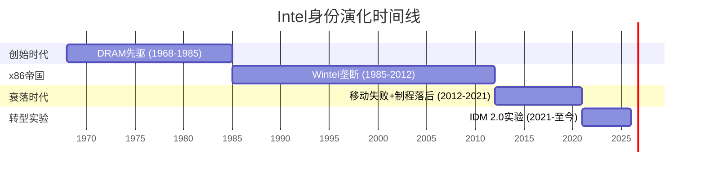
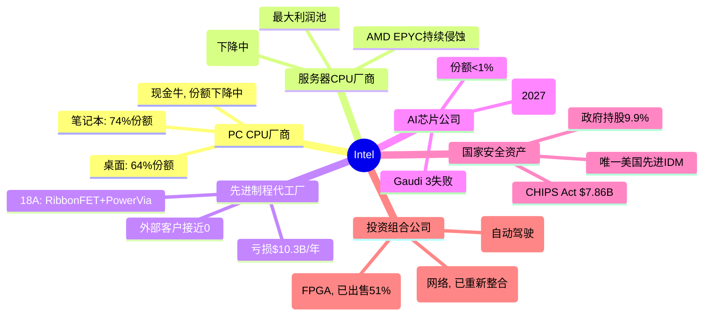
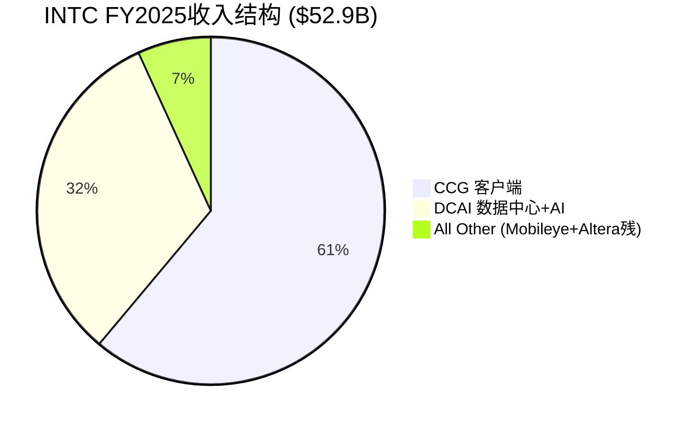
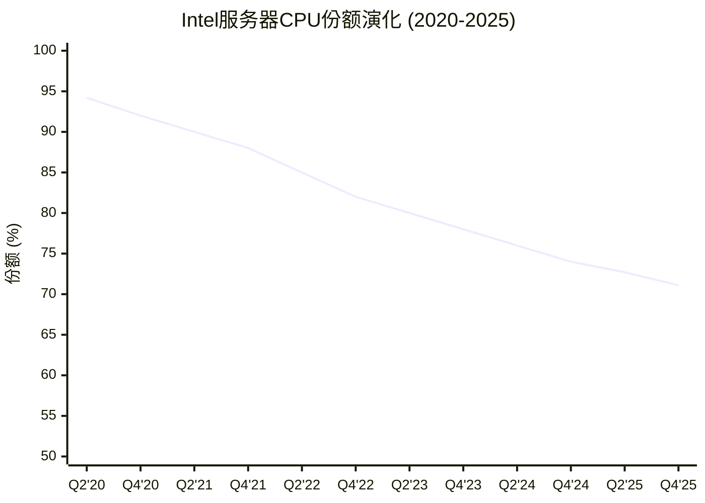
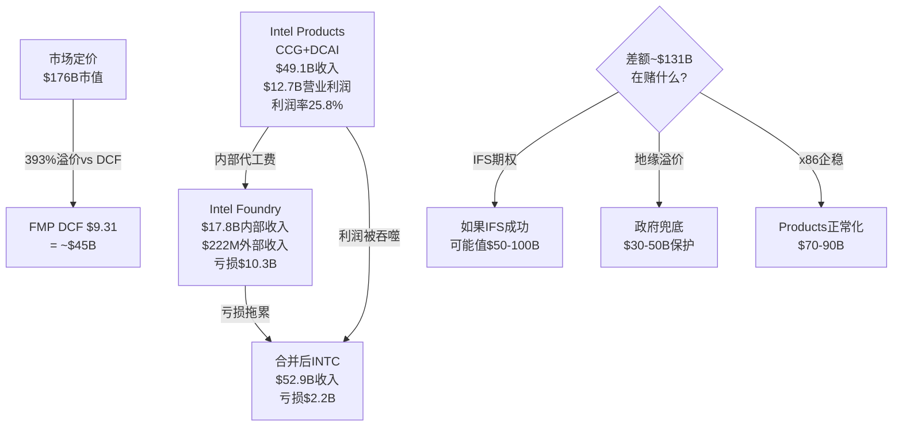

# INTC Phase 1: 公司定位与生态 — Part I (身份+业务)
> Phase 1A | 框架v17.3 | 2026-02-25
> 核心叙事锚: "Intel不是一家正常的半导体公司——它是一个由地缘政治担保、以$110B投资为赌注、处于身份危机中的国家级实验"

---

# Chapter 1: 执行摘要 — 一页速览

## 1.1 公司快照

| 指标 | 值 | 信号 |
|------|-----|------|
| **公司名** | Intel Corporation (NASDAQ: INTC) | |
| **成立** | 1968年 (Gordon Moore, Robert Noyce) | 57年历史 |
| **总部** | 加州圣克拉拉 | |
| **CEO** | Lip-Bu Tan (2025.03上任) | 第3任CEO in 5年 |
| **市值** | $175.8B (2026.02) | 高于FMP DCF $9.31的393% |
| **收入** | $52.9B (FY2025) | 2010年以来最低 |
| **员工** | ~75,000 (裁员后) | 从~120,000峰值裁员37% |
| **SGI** | 4.2 (混合模型, 偏通才) | 定价异常已标记 |
| **PW** | 8 (发现系统) | 不给目标价, 映射可能性空间 |

[DM-001~010]

## 1.2 发现系统定位声明

本报告采用**发现系统**(PW=8)方法论。Intel的可能性空间极宽——从"僵尸化"到"美国半导体复兴旗舰"的结果均有非零概率。我们**不提供目标价或确定性评级**，而是:

1. **映射可能性空间**: 识别Intel可能走向的3-5条路径及其概率权重
2. **标记转折点**: 哪些事件/数据会触发路径切换
3. **提供条件性评级**: "如果[条件A]，则[评级X]"
4. **诚实声明不确定性**: 承认哪些关键变量超出分析能力

**核心矛盾**: 市值$176B vs ROIC -0.05% — 市场在为一个"当前不存在的Intel"定价

## 1.3 七大核心问题 (CQ) 速查

| CQ | 问题 | 初始置信度 | Phase 1进展 |
|----|------|:----------:|:-----------:|
| CQ1 | 18A能否实现商业可行良率? | 50% | ↑55% |
| CQ2 | IFS能否获$3-5B外部年收入? | 25% | →25% |
| CQ3 | x86服务器能否保住60%+份额? | 55% | →55% |
| CQ4 | Tan是否会根本性改变IDM 2.0? | 35% | ↓25% |
| CQ5 | AI推理能否创造有意义收入? | 30% | →30% |
| CQ6 | 地缘政治溢价值多少? | 60% | ↑65% |
| CQ7 | FY2028前能否恢复正FCF? | 55% | →55% |

---

# Chapter 2: 身份危机 — 从Intel Inside到身份迷宫

## 2.1 身份演化简史: 四个时代

Intel的57年历史可以压缩为四个身份时代，每个时代定义了不同的估值逻辑:



**时代I: DRAM先驱 (1968-1985)** — Moore和Noyce创立Intel制造DRAM内存芯片。1971年推出4004——世界上第一个商业微处理器。1985年在日本DRAM价格战中战略性退出DRAM，全面转向微处理器。**这是Intel历史上唯一一次成功的战略大转型**。

**时代II: x86帝国 (1985-2012)** — 与Microsoft结成"Wintel联盟"，x86 ISA成为PC/服务器的事实标准。Intel同时掌控设计+制造(IDM模式)，制程领先全球1-2代。峰值时期(2005-2010):
- 营业利润率30%+
- 服务器份额>95%
- PC份额>80%
- 全球最先进的半导体工艺
- SGI估计: ~8-9 (纯正专才)

**时代III: 衰落 (2012-2021)** — 三重打击:
1. **移动失败**: 放弃ARM移动芯片(2006年卖掉XScale)，错过智能手机+平板的$400B TAM
2. **制程延迟**: 10nm延迟5年(2014目标→2019量产)，TSMC/Samsung实现反超
3. **资本分配灾难**: Otellini→Krzanich→Swan时期,$36B回购 vs $38B CapEx(SemiAnalysis)——在需要投资制造的时候选择了金融工程

**时代IV: 转型实验 (2021-至今)** — Pat Gelsinger 2021年回归，宣布"IDM 2.0"——Intel既做自己的芯片，也为外部客户代工。投入$110B+进行"4年5节点"制程追赶。Gelsinger 2024.12被迫离职，Lip-Bu Tan接任。当前状态: **转型中途，成败未卜**。

[DM-051, 文献侦察Section A]

## 2.2 身份张力图谱: Intel到底是什么?

Intel当前同时是(或试图成为)以下**六种身份**，每种身份对应不同的估值逻辑和资源需求:



**SGI解读**: Intel从SGI~8-9(时代II, 纯CPU专才)退化到SGI~4.2(当前, 六重身份通才)。这种"身份扩散"有两个可能:

1. **通才陷阱** (概率偏高): 每个领域都投入不够深，在每个战场都输给专才对手
   - CPU输给AMD(纯CPU设计)+ARM(生态创新)
   - 代工输给TSMC(纯代工效率)
   - AI输给NVIDIA(纯GPU+CUDA生态)
   - FPGA输给Xilinx/AMD(整合优势)

2. **平台协同** (Intel的愿景): IDM 2.0打通设计+制造，实现别人做不到的垂直整合
   - CPU+代工: 内部芯片验证18A → 吸引外部客户
   - CPU+AI: Xeon+加速器一体化 → 推理市场差异化
   - 制造+地缘: 美国本土先进产能 → 政策溢价

**Phase 0.75诊断**: 当前证据更支持(1)而非(2)。六个领域中，Intel在**零个领域**处于技术/市场领先位置(即使在传统优势的服务器CPU领域，AMD EPYC Turin的收入份额已超40%)。协同效应是理论上的——需要18A成功作为"keystone"才能激活。

[DM-010 SGI计算, DM-050 竞争份额]

## 2.3 从专才到通才: SGI衰退的根因分析

| SGI维度 | 2010年(估) | 2020年(估) | 2025年 | 衰退原因 |
|---------|:----------:|:----------:|:------:|---------|
| HHI_rev | 8 | 6 | 4 | 从纯CPU→CPU+代工+IoT+FPGA+自动驾驶+AI |
| R&D_conc | 8 | 5 | 3 | R&D从CPU聚焦→分散到6个方向, R&D/GP=75% |
| MarketPos | 9 | 7 | 6 | 服务器从>95%→71%, PC从>85%→64-74% |
| SwitchCost | 8 | 7 | 5 | x86锁定被ARM侵蚀, 云厂商自研加速 |
| BrandClarity | 9 | 6 | 3 | "Intel做CPU"→"Intel做所有东西(但都不是最好的)" |

**15年累计SGI下降**: ~8.5 → 4.2 = **-4.3分 (-51%)**

这不是周期性波动——这是**结构性身份退化**。每次Intel扩展进入新领域(FPGA/Mobileye/IFS/AI)，都稀释了SGI而未能在新领域建立领先地位。唯一的反例可能是IFS——如果18A成功，IFS可能从"SGI稀释因素"变为"估值倍数升级因素"。但目前，IFS是纯烧钱阶段。

---

# Chapter 3: 业务全景 — 六大战场

## 3.1 收入全景与段报告架构

FY2025起Intel简化段报告为3个可报告段+全其他:



注: Intel Foundry $17.8B主要为内部转移(对消后不计入合并收入)，外部收入极小。

**段报告变化 (Tan时代重组)**:
- NEX(网络与边缘)已并入CCG和DCAI，不再独立报告
- Altera于2025.09.12去合并(Silver Lake收购51%)
- 报告从6段简化为3段——这本身反映了Tan的"简化"哲学

[DM-011~015, Agent研究: 段报告]

### FY2025分部损益全景

| 分部 | 收入($B) | 营业利润($B) | 营业利润率 | YoY变化 |
|------|:--------:|:------------:|:---------:|:-------:|
| **CCG** | 32.2 | 9.3 | 28.9% | 收入-3%, 利润↓~16% |
| **DCAI** | 16.9 | 3.4 | 20.2% | 收入+5%, 利润↑大幅 |
| **Intel Foundry** | 17.8 | (10.3) | -57.9% | 亏损改善$3.1B |
| **All Other** | 3.6 | 0.3 | ~8% | Altera去合并 |
| **公司未分配** | — | (5.5) | — | 重组费用 |
| **合计** | **52.9** | **(2.2)** | **-4.2%** | 从亏$7B+改善 |

[DM-011, Agent研究: 段报告]

**关键洞见**: 如果把Intel Products(CCG+DCAI)独立看——$49.1B收入, $12.7B营业利润, 25.8%利润率——这是一家**盈利能力尚可的芯片设计公司**。问题出在Intel Foundry: $10.3B亏损吞噬了产品业务的绝大部分利润，加上$5.5B公司级费用，合并后变成亏损。

**这验证了核心矛盾的精确所在**: Intel Products ≠ Intel Foundry。市场在用一个价格给两个完全不同的实体定价——一个是盈利的芯片设计公司，另一个是巨额亏损的初创代工厂。

## 3.2 CCG: 客户端计算 — 现金牛保卫战

### 业务概况

CCG是Intel最大的收入来源和利润发动机，覆盖笔记本、桌面、Chromebook全线PC处理器。FY2025收入$32.2B，营业利润$9.3B，利润率28.9%。

**产品矩阵**:
- **Core Ultra (Meteor Lake → Lunar Lake → Arrow Lake → Panther Lake)**: 消费级CPU, AI PC定位
- **Panther Lake**: 首款18A量产产品，CES 2026发布，集成NPU(AI加速单元)
- **Core Ultra 200系列**: Arrow Lake桌面端，2025年发布

### 份额趋势与竞争动态

| 市场 | Intel份额(Q4 2025) | AMD份额 | ARM份额 | 趋势 |
|------|:------------------:|:-------:|:-------:|:----:|
| **桌面** | 64% | 36% | — | AMD +9pp YoY |
| **笔记本** | 74% | 26% | 13.3% | ARM PC平台期(13.7%→13.3%) |
| **整体客户端** | ~70% | ~30% | ~5% | Intel缓慢失血 |

[DM-050 Mercury Research Q4 2025]

**CCG面临的三重威胁**:

1. **AMD Ryzen 9000系列**: Zen 5架构, 桌面端份额从27%升至36%(+9pp YoY)——这是AMD在桌面CPU历史上最大的年度份额增幅

2. **Qualcomm Snapdragon X系列(ARM)**: 进入Windows PC市场。但市场数据显示ARM PC份额从13.7%微降至13.3%——**ARM PC威胁暂时被高估**。原因: x86软件兼容性、企业IT部门惰性、价格竞争力不明显

3. **Apple Silicon(ARM)**: 已完全替代Intel Mac(2020-2024过渡完成)。但这是"已完成的伤害"——Intel已完全失去Apple PC业务(约$5-8B年收入, 2019年前)

**CCG的战略价值**:
- 短期: 提供$9.3B营业利润, 为IFS烧钱提供资金基础
- 中期: Panther Lake(18A)是"内部客户验证" → 证明18A可行
- 长期: AI PC叙事(NPU集成)是否能驱动ASP上升和升级周期

**CQ相关性**:
- CQ3(x86份额): CCG份额虽在下降, 但幅度可控。真正的威胁在服务器端, 不在PC端
- CQ7(FCF): CCG是唯一稳定的现金流来源, 其健康度直接决定Intel的"生存弹药"

## 3.3 DCAI: 数据中心与AI — 被蚕食的王座

### 业务概况

DCAI覆盖服务器/数据中心CPU(Xeon)、AI加速器(Gaudi/Crescent Island)、存储和网络(原NEX部分)。FY2025收入$16.9B, 营业利润$3.4B, 利润率20.2%。

**关键产品**:
- **Xeon 6 "Granite Rapids" (P-core)**: 高单线程性能, 金融/延迟敏感负载
- **Xeon 6 "Sierra Forest" (E-core)**: 高密度/低功耗, 成本/VM优化 → **ASP稀释效应**
- **Gaudi 3**: AI训练/推理加速器 → **基本失败**(vs H200差9x性能)
- **Crescent Island**: 新一代数据中心GPU, Xe3P架构, 推理定位, **2026 H2采样**

### 服务器CPU份额侵蚀全景

这是Intel最关键的利润池, 也是流失最严重的战场:



[DM-050, Agent研究: AMD/ARM竞争]

**更危险的信号——收入份额**:

AMD的收入份额增长远快于单位份额:
- AMD Q4 2025: 28.8%单位份额 vs **41.3%收入份额** (首次超过40%)
- 差距原因: EPYC Turin高核心数SKU(最高192核, ASP ~$14,800)vs Intel Xeon E-core低价产品拉低ASP

**含义**: Intel虽然在单位量上仍占优(71%), 但在**高价值**服务器市场正被AMD压缩。Intel的Xeon 6 Sierra Forest(E-core)维持了单位份额, 但以ASP下降为代价——这是**以量换价**的防守策略。

**AI加速器: 几乎完全出局**

| 产品 | Intel地位 | 竞争对手 | 差距 |
|------|----------|---------|------|
| **训练** | Gaudi 3 (基本失败) | NVIDIA H200/B200 | 性能差9x (Los Alamos) |
| **推理** | Crescent Island (2027) | NVIDIA各系列 + AMD MI300X | 产品不存在 |
| **定制ASIC** | 年化>$1B (Q4 2025) | Broadcom/Marvell | 规模小但增长26% QoQ |

Gaudi 3的失败和Falcon Shores的取消是DCAI AI战略的重大挫折。Crescent Island GPU(Xe3P架构, 160GB LPDDR5X, 空冷推理)是一个全新的赌注:
- **差异化定位**: 针对空冷企业推理服务器, 避开NVIDIA在液冷训练领域的正面竞争
- **架构**: 与Panther Lake共享Xe3架构, 降低研发边际成本
- **时间线**: H2 2026采样 → 2027最早量产
- **风险**: NVIDIA CUDA生态锁定极强, 新GPU从零开始建软件栈

**CQ相关性**:
- CQ3: 服务器CPU份额下降速度~3pp/年, 按此速度2029年可能跌破60%
- CQ5: Crescent Island是"2027年的故事", 当前对收入贡献为零

## 3.4 Intel Foundry (IFS): 从零开始的$100B豪赌

### 这是Intel故事的核心——也是最大的不确定性来源

Intel Foundry是Gelsinger 2021年推出的IDM 2.0战略的产物——将Intel的制造能力开放给外部客户代工。这是半导体行业有史以来最大的单一企业战略转型尝试。

**财务现实**:

| 指标 | FY2024 | FY2025 | 变化 |
|------|:------:|:------:|:----:|
| **总收入** | $17.5B | $17.8B | +2% |
| **外部收入** | ~0 | $222M (Q4年化) | 微量 |
| **营业亏损** | $(13.4)B | $(10.3)B | 改善$3.1B |
| **营业利润率** | ~-77% | -57.9% | 改善19pp |

**$17.8B收入的真相**: 绝大部分是内部转移定价——Intel Products(CCG+DCAI)付给Intel Foundry的代工费用。如果Intel分拆为独立的设计公司和独立的代工公司, Foundry需要用**商业竞争力**而非**内部调拨**来获得订单。

**外部客户进展**:

| 客户 | 状态 | 预期规模 | 置信度 |
|------|------|---------|:------:|
| **Apple** | PDK 0.9.1GA已交付, 全PDK Q1 2026, "接近签约" | 潜在$2-5B+/年 | 中低 |
| **Microsoft** | 18A订单已确认 | 未知 | 中 |
| **MediaTek** | 首个工艺节点代工客户 | 较小 | 较高 |
| **NVIDIA** | 仅限先进封装探索, 18A测试后暂停 | 不明 | 低 |
| **Broadcom** | 18A测试后放弃(Reuters) | — | 已退出 |
| **定制ASIC** | 年化>$1B, +26% QoQ | $1-2B | 较高 |
| **军方/情报** | Secure Enclave $3B专项 | $3-5B (政府合同) | 高 |

**>$15B终生合同价值**: Intel声称的数字, 但"终生"可能指5-10年合同总额, 非年化收入。

[Agent研究: 18A技术状态]

### 18A: 技术突破 vs 商业可行性

**技术成就(真实的)**:
- **RibbonFET**: 全球首个量产GAA(Gate-All-Around)晶体管, 四面环栅
- **PowerVia**: 全球首个量产背面供电(BSPDN), 减少电压降10x
- **组合效果**: vs Intel 3 — +25%性能同功耗, 或-36%功耗同性能
- Panther Lake和Clearwater Forest已"通电启动操作系统"

**商业挑战(同样真实的)**:
- **良率**: ~55%(2025中)→65-75%(Q4 2025), 但需>80%才盈利 → 2027才达行业标准
- **密度**: 238 MTr/mm² vs TSMC N2 313 MTr/mm² → Intel密度低31%
- **PDK成熟度**: PDK 1.0 2025.07才发布, 外部客户IP库小, 移植≈新设计成本
- **TSMC生态**: 30年积累 vs Intel从零开始的代工IP生态

**18A vs TSMC N2对比矩阵**:

| 维度 | Intel 18A | TSMC N2 | 优势方 |
|------|----------|---------|:------:|
| 晶体管类型 | RibbonFET (GAA) | Nanosheet GAA | 平 |
| 供电方式 | PowerVia (背面) | 前端(传统) | **Intel** |
| 晶体管密度 | 238 MTr/mm² | 313 MTr/mm² | **TSMC** (+31%) |
| PPA得分 | 2.53 | 2.27 | **Intel** (微优) |
| 良率(2026初) | 65-75% | ~65-70% | 接近 |
| 量产时间 | 2025末/2026初 | 2025末, 大规模2026秋 | 接近 |
| 客户生态 | Apple(待定), Microsoft | Apple(A20/M5, 50%初期产能) | **TSMC** (远超) |
| IP库 | 小, 刚起步 | 30年积累, 极丰富 | **TSMC** (远超) |
| 代工信任度 | 竞争对手代工的固有矛盾 | 纯代工, 无利益冲突 | **TSMC** |

**Intel 18A的真正优势**: 不在于技术指标的对比(与TSMC N2互有胜负), 而在于**它是在美国本土**。对于: (a)美国政府/军方 (b)需要供应链多元化的客户 (c)CHIPS Act补贴驱动的成本优势——Intel 18A提供了TSMC Arizona之外的第二选项。

**碰撞#2验证**: 18A确实为Intel内部芯片优化(Panther Lake/Clearwater Forest), 外部客户需要不同的PDK调整和IP库。Apple选择18A(如果成行)可能更多出于地缘政治/供应链考量而非纯技术优势。

**IFS财务转折点分析**:

Intel官方目标: IFS在"low-to-mid single-digit billions"外部年收入时实现盈亏平衡。具体拆解:

```
当前IFS亏损: ~$10.3B/年
固定成本占比(估): ~70% (~$12.5B, 含折旧)
可变成本占比(估): ~30%
内部转移定价: ~$17.8B
外部收入所需毛利率假设: ~40%(代工行业平均)

盈亏平衡外部收入 = $10.3B / 40% = ~$25.7B
但: 部分亏损由折旧驱动(非现金), 且随良率提升单位成本下降

现实更可能: $3-5B外部收入 + 良率改善 + 内部利用率提升 → 亏损从$10.3B降至$5-7B
真正盈亏平衡: 可能需要$8-10B外部收入, 或3-4年的良率/成本优化曲线
```

**CQ相关性**:
- CQ1: 18A良率是所有后续讨论的基础。65-75%已超预期但仍不够
- CQ2: 当前外部收入接近0, $3-5B目标在FY2027前极具挑战性

## 3.5 Altera (FPGA): 已剥离的沉没成本

**历史**: Intel于2015年以$16.7B收购Altera, 目的是将FPGA与Xeon整合。这笔交易被广泛视为失败——Altera在Intel内部缺乏独立发展空间, 同时被Xilinx(2022年被AMD收购)甩开。

**当前状态**:
- 2025.04: Silver Lake以$4.46B收购51%股权 → 估值$8.75B(**仅为收购价的52%**)
- Intel保留49%股权
- Altera从Intel去合并(2025.09.12起)
- FY2024: $1.54B收入, -$615M营业亏损
- 新CEO: Raghib Hussain(来自Marvell)

**投资教训**: Altera是Intel"通才陷阱"的典型案例——收购后无法在Intel庞大的组织中获得足够关注和资源, 最终以47%的价值损失剥离。$8B+的价值毁灭。

## 3.6 Mobileye (自动驾驶): 独立运营, 估值缩水

**历史**: Intel于2017年以$15.3B收购Mobileye, 2022年IPO(估值一度>$30B)。

**当前状态**:
- Intel所持权益: ~82%(从~88%减少, 2025.07出售部分)
- Intel保留~98%投票权(通过B类股)
- Mobileye独立运营, 非Intel核心业务
- 2026.01: Mobileye以~$900M收购Mentee Robotics(机器人)
- 当前Mobileye市值: 约$12-15B(远低于IPO峰值~$30B)

**对Intel的含义**: Mobileye是一个可以变现的**流动性储备**——如果Intel需要资金, 可以继续出售Mobileye股份。但Mobileye的估值缩水限制了可变现金额。

## 3.7 业务组合核心矛盾: "设计公司+代工初创" = 估值炼狱

将业务组合回归核心矛盾:



**不同身份下Intel的"合理"估值区间**:

| 身份定义 | 参考估值方法 | 估值区间 | 隐含股价 |
|---------|------------|:--------:|:--------:|
| 纯芯片设计(无IFS) | 15x Products营业利润 | $100-130B | $21-27 |
| 芯片设计+IFS起步 | 上方+IFS期权$30B | $130-160B | $27-33 |
| 国家安全资产 | 上方+地缘溢价$30-50B | $160-210B | $33-43 |
| IFS成功情景 | Products+IFS $50-100B | $200-300B | $41-62 |
| 当前市价 | 市场定价 | $176B | $36.2 |

当前市价$36.2隐含: 市场给了**部分IFS期权+大部分地缘溢价**。要达到$45+(当前股价), 市场需要更多IFS成功迹象。

[DM-001~008, DM-035~038 分析师预测]
