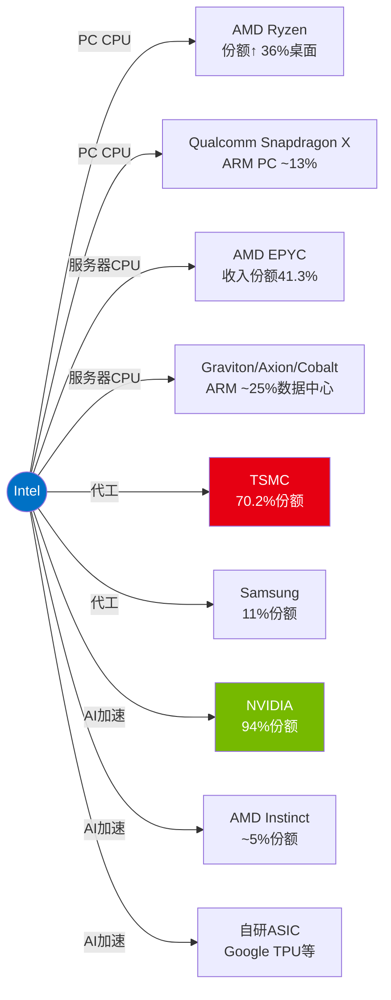

# INTC Phase 1: 公司定位与生态 — Part II (CEO+竞争+行业+治理)
> Phase 1B | 框架v17.3 | 2026-02-25

---

# Chapter 4: CEO变量 — Gelsinger到Tan的战略断裂

## 4.1 Gelsinger时代回顾 (2021.02 - 2024.12): 宏大愿景, 失败执行

Pat Gelsinger 2021年2月回归Intel, 带着"制造复兴"的信仰推出IDM 2.0:

**核心承诺**:
- "4年5节点": Intel 7 → Intel 4 → Intel 3 → Intel 20A → Intel 18A (2021-2025)
- IFS外部代工: 从零打造全球第二大代工厂
- 保持设计竞争力: 与AMD/ARM竞争的同时追赶制程

**成绩**:
- 制程追赶确实在进行: Intel 4(2023)→Intel 3(2024)→18A(2025)按计划推进
- 争取到CHIPS Act资金
- PPE从$63B增至$108B, 制造能力大幅扩张

**失败**:
- Gaudi AI加速器: 从未获得市场牵引力, vs NVIDIA差距持续扩大
- 收入持续下滑: $79B(2021)→$53B(2025), 在其任内下降33%
- 巨额亏损: FY2024净亏$18.8B(含大规模减值/重组)
- IFS外部客户: 3年努力, 外部收入仍接近0
- **被解职**: 2024.12.01, 董事会"在失去信心后要求Gelsinger辞职"(WSJ)

**Gelsinger的遗产**: 他启动了正确的方向(制程追赶), 但低估了执行难度和组织惰性。Intel的问题不仅是技术——更是文化、效率和优先级排序。SemiAnalysis的深度批评指出: Otellini时代(2005-2013)开始的人才流失和文化腐烂, 不是Gelsinger 3年能修复的。

[DM-051, Agent研究: Tan CEO]

## 4.2 Tan的背景与战略信号: 设计思维 vs 制造信仰

**Lip-Bu Tan简历**:
- 前Cadence Design Systems CEO (2009-2024), 将Cadence从EDA第三变为并列第一
- 台湾出生, 新加坡成长, MIT硕士
- 风投背景: Walden International创始人
- 2024.08: 从Intel董事会辞职(被解读为对Gelsinger某些决策的不满)
- 2025.03.18: 正式出任Intel CEO

**Tan vs Gelsinger: 根本性的风格差异**

| 维度 | Gelsinger | Tan |
|------|----------|-----|
| **背景** | Intel老兵(CTO), 工艺工程师 | EDA/设计软件CEO, 风投 |
| **哲学** | "制造是Intel的灵魂" | "效率和执行是一切" |
| **组织风格** | 大愿景, 层级化 | 扁平化, 管理层减50% |
| **资本哲学** | 激进投入(CapEx峰值$25.8B) | 纪律投入(CapEx降至$14.6B) |
| **IFS态度** | All-in, 外部代工是核心 | 延续但可能调整优先级 |
| **AI策略** | Gaudi系列, 追赶NVIDIA | Crescent Island, 差异化推理 |
| **并购/剥离** | 保留所有业务 | 剥离Altera, 缩减Mobileye, 精简组织 |

## 4.3 Tan上任11个月: 行动清单

按时间线梳理Tan的关键决策:

| 日期 | 行动 | 战略信号 |
|------|------|---------|
| 2025.03 | 就任, 3位董事退休 | 清理Gelsinger时代董事会 |
| 2025.04 | Altera 51%售予Silver Lake ($4.46B) | "精简到核心" — 剥离非核心FPGA |
| 2025.05 | Raghib Hussain接任Altera CEO | 专业管理, 非Intel内部人 |
| 2025.07 | 裁员21,000人(~20%), 管理层减50% | 激进效率化, $1.5B年化节省 |
| 2025.07 | 出售部分Mobileye(~$1B) | 变现非核心资产, 补充现金 |
| 2025.07 | 宣布NEX独立(后12月撤回) | 试探性剥离, 但发现NEX与DCAI协同 |
| 2025.08 | 美国政府$8.9B入股 | 政治关系管理 |
| 2025.08 | SoftBank $2B投资 | 拉入战略盟友 |
| 2025.09 | 任命Kevork Kechichian(来自ARM)领导数据中心 | **关键信号**: 从ARM请来的人领导x86数据中心 |
| 2025.09 | NVIDIA $5B投资 | 与最大竞争对手形成微妙联盟 |
| 2025.10 | Crescent Island GPU发布(OCP峰会) | **AI战略转向**: 放弃追训练, 聚焦推理 |
| 2025.11 | CTO Sachin Katti离职去OpenAI | 人才流失信号(6个月即走) |
| 2025.12 | 撤回NEX独立, 保留 | 审视后调整 |
| 2026.01 | Q4 2025财报, 指引Q1低于预期 | 股价-17% |
| 2026.02 | 聘Eric Demmers(前Qualcomm)为GPU首席架构师 | GPU战略加码 |

[Agent研究: Tan CEO行动]

## 4.4 CQ4裁定: Tan会根本性改变IDM 2.0吗?

**初始置信度**: 35% → **Phase 1更新: 25%**

**下调理由**: Tan上任11个月的行动一致指向"优化IDM 2.0"而非"推翻IDM 2.0":
- 保留IFS核心地位, 争取政府+NVIDIA+SoftBank资金
- 18A继续推进, 未放缓
- 剥离的是Altera/Mobileye(非核心), 不是IFS(核心)
- 创建IFS独立董事会(增强而非削弱代工业务)

**但**: 两个不确定性保持开放:
1. 如果18A在2026H2未能达到80%良率且Apple不签约 → Tan可能被迫收缩IFS
2. 5%政府权证条款(如果Intel出售IFS >49%股权则触发) → 政府设置了"IFS必须保留"的机制约束

**Tan的真正贡献**: 不在于战略方向改变, 而在于**执行效率**提升——裁员20%, 管理层减50%, CapEx纪律化, OpEx从$19.4B→$16.5B(-15%)。如果Intel的问题是"方向对但执行差", Tan可能是正确的CEO。

## 4.5 管理层关键人物评估

| 姓名 | 职位 | 背景 | 评估 |
|------|------|------|------|
| **Lip-Bu Tan** | CEO | Cadence CEO, VC | 效率导向, 但无制造业运营经验 |
| **Kevork Kechichian** | EVP, 数据中心 | 前ARM EVP工程 | **从ARM请来管x86** — 可能带入ARM思维 |
| **Naga Chandrasekaran** | EVP/CTOO, Foundry | Intel内部, 制造老将 | IFS技术执行的关键人物 |
| **Eric Demmers** | GPU首席架构师 | 前Qualcomm | GPU从零建队 |
| **Raghib Hussain** | Altera CEO | 前Marvell | 已独立, 非Intel核心 |

**CTO空缺风险**: Sachin Katti任CTO仅6个月即离职去OpenAI。Intel目前没有CTO——在技术转型最关键时期。Tan直接监督AI战略, 但CEO+CTO双重角色可能导致注意力分散。

---

# Chapter 5: 竞争格局 — 四面受敌

## 5.1 战场总览: Intel的多线作战困局

Intel同时在**5个独立战场**与**5+个不同对手**竞争, 每个战场有不同的竞争动态:



**多线作战的核心问题**: Intel在**每一条战线**都是防守方或追赶方, 在**没有一条战线**上处于进攻优势。这是SGI 4.2(通才)公司的典型困境——资源分散导致每个领域都投入不足。

## 5.2 服务器CPU: AMD EPYC的持续侵蚀

### 份额与财务数据

| 指标 | Intel Xeon | AMD EPYC | 趋势 |
|------|:----------:|:--------:|:----:|
| Q4 2025单位份额 | 71.1% | 28.8% | AMD +3.1pp YoY |
| Q4 2025收入份额 | ~58.7% | **41.3%** | AMD +4.9pp YoY |
| Q4 2025 Intel DCAI收入 | $4.7B | — | +9% YoY |
| Q4 2025 AMD数据中心收入 | — | $5.4B (含GPU) | +39% YoY |
| FY2025 AMD数据中心 | — | $16.6B | +32% YoY |

[DM-050, Agent研究: AMD/ARM竞争]

**AMD EPYC Turin的竞争优势**:
- 最高192核/384线程 vs Intel Xeon 6 最高144核(Granite Rapids P-core)
- IPC提升~15-20% vs Zen 4
- ASP溢价: 顶配~$14,800, 高核心数SKU利润极高
- 客户认可: Turin在Q4 2025**首次占AMD EPYC收入>50%** → 换代完成
- TPCx-AI基准测试: EPYC 9965 = 1.70x vs Xeon 6980P

**Intel的Xeon 6防守策略**:
- **Granite Rapids (P-core)**: 针对单线程性能敏感负载(金融交易、数据库)
- **Sierra Forest (E-core)**: 针对密度/性价比(云原生、微服务) → 但ASP低, 拉低收入份额
- **矛盾**: E-core帮助维持单位份额, 但**加速收入份额流失**

### 侵蚀速度外推

| 指标 | 2020 Q2 | 2023 Q4 | 2025 Q4 | 2028E(趋势外推) |
|------|:-------:|:-------:|:-------:|:-------------:|
| Intel单位份额 | 94.2% | ~78% | 71.1% | ~60% |
| AMD单位份额 | 5.8% | ~22% | 28.8% | ~35% |
| ARM份额 | ~0% | ~5% | ~25%(含自研) | ~30-35% |

**按当前侵蚀速度(~3-4pp/年)**: Intel服务器CPU份额可能在2028-2029年跌破60%, 这是CQ3的关键阈值。但注意: 侵蚀速度可能**非线性**——随着"容易抢的份额"被抢完(云厂商), 企业端切换更慢。

## 5.3 ARM在服务器的崛起: 被低估然后被高估

**数据**: ARM在数据中心CPU的份额达到~25%(2025年中), 主要由以下驱动:

| ARM平台 | 厂商 | 最新产品 | 核心数 | 制程 |
|---------|------|---------|:------:|------|
| **Graviton5** | AWS | 2025.12预览 | 192核 | TSMC 3nm |
| **Axion** | Google | C4A(GA), N4A(预览) | 64-72核 | TSMC 3/5nm |
| **Cobalt 200** | Microsoft | 2025末 | 132核 | ARM N3 |
| **Grace** | NVIDIA | 与Blackwell搭配 | 72核 | TSMC 4nm |
| **AmpereOne** | Ampere | 商用 | 192核 | — |

**ARM增长的驱动力**: 不是"ARM CPU更好", 而是**超大规模云厂商的垂直整合战略**:
- AWS用Graviton替代Intel/AMD → 成本降低(无需支付x86溢价)+差异化(仅AWS有Graviton)
- Google和Microsoft跟进: 自研CPU让他们减少对x86的依赖
- NVIDIA Grace-Blackwell将ARM CPU与GPU紧耦合 → AI负载天然用ARM

**ARM的限制**:
- ARM 2025年目标50%数据中心份额 → **实际仅25%**, 远未达标
- ARM的增长集中在超大规模端; 企业/传统OEM端ARM渗透率很低
- ARM CPU的ASP远低于高端x86(Graviton是AWS内部成本, 非销售)
- 企业IT的x86软件生态锁定在5-10年内仍然强大

**对Intel的含义**: ARM的威胁是**长期结构性**的(云厂商将继续自研), 但在企业端的进展可能比预期慢。Intel在企业服务器端可能维持较高份额, 但在云端的流失是不可逆的。

[Agent研究: AMD/ARM竞争]

## 5.4 代工: TSMC的绝对统治

Intel IFS试图挑战的是人类商业史上最强大的制造垄断之一:

| 代工商 | 份额(2025) | 先进制程 | 客户 |
|--------|:----------:|---------|------|
| **TSMC** | **70.2%** | N3/N2 量产 | Apple, NVIDIA, AMD, Qualcomm, 所有人 |
| Samsung | ~11% | SF3/SF2 (良率低) | 少量外部 |
| SMIC | ~6% | 7nm (无EUV) | 中国国内 |
| GlobalFoundries | ~6% | 12/14nm (退出先进) | 汽车/IoT |
| UMC | ~5% | 成熟制程 | 混合信号 |
| **Intel IFS** | **不在前6** | 18A (起步) | 内部为主 |

[DM-050]

**TSMC的护城河为什么几乎无法攻破**:

1. **规模效应**: $30.24B/季收入 → 每年$70B+可投入研发和产能扩张
2. **学习曲线**: 30年纯代工经验, 每一代工艺都有客户数据反馈
3. **IP生态**: 最丰富的第三方IP库, 客户设计无需从零开始
4. **信任**: 纯代工模式=不与客户竞争(Intel IFS无此优势)
5. **客户锁定**: Apple锁定50%初期N2产能 → 其他客户被迫排队
6. **地理对冲**: 台湾+日本+美国(Arizona)+德国多地布局

**Intel IFS的唯一差异化**: **美国本土先进制程产能**。但TSMC Arizona也在加速:
- TSMC AZ Phase 1(4nm): 已量产
- TSMC AZ Phase 2(3nm): 2027量产(比Intel Ohio快3-4年)
- TSMC AZ Phase 3(2nm): 2027奠基, 加速中
- TSMC AZ总投资: **$165B, 6座晶圆厂** → 规模远超Intel在美国的计划

**IFS竞争力评估**: 在纯商业竞争中, Intel IFS赢TSMC大客户的概率极低。IFS的真正竞争力来自:
1. 政策驱动(CHIPS Act补贴降低客户成本)
2. 地缘多元化需求(供应链安全)
3. 军方/情报需求(Secure Enclave, TSMC不能做)
4. 特定技术优势(PowerVia背面供电, TSMC N2没有)

## 5.5 AI加速器: NVIDIA的代际领先

**市场份额**: NVIDIA ~94%, AMD ~5%, Intel <1%, 其他(Google TPU, 自研ASIC)

**Intel在AI的三次失败**:
1. **Nervana** (2016收购): AI训练芯片, 2020年被Habana取代
2. **Habana Gaudi 3**: 2024年推出, Los Alamos测试vs H200差9x性能 → 基本弃用
3. **Falcon Shores**: 计划中的下一代AI芯片 → **已取消**

**Crescent Island — Intel的第四次尝试**:
- 架构: Xe3P(与Panther Lake共享)
- 定位: **推理(非训练)**, 空冷企业服务器, 大内存(160GB LPDDR5X)
- 时间线: H2 2026采样, 2027量产
- 首席架构师: Eric Demmers(前Qualcomm, 2026.02加入)
- **差异化**: 避开NVIDIA在液冷训练集群的统治, 瞄准企业推理(成本敏感, 空冷需求)

**Crescent Island的机会窗口**:
如果成功, 它可能开辟一个NVIDIA目前忽视的细分市场:
- 企业推理(vs 超大规模训练)
- 空冷(vs 液冷)
- 性价比优先(vs 绝对性能优先)
- 与Xeon紧耦合(vs 独立GPU)

但挑战巨大:
- CUDA生态锁定: 几乎所有AI软件都为NVIDIA优化
- Intel OneAPI的生态影响力远低于CUDA
- 从芯片架构师到量产需要2-3年
- AMD MI300X已经在推理市场建立据点

## 5.6 竞争格局综合评分

```mermaid
radar
    title Intel竞争力雷达图 (10=最强)
    "PC CPU" : 7
    "服务器CPU" : 6
    "代工" : 2
    "AI加速器" : 1
    "网络/边缘" : 5
    "制造工艺" : 5
```

**总体评估**: Intel在传统业务(PC/服务器CPU)仍有较强地位(6-7分), 但在所有增长领域(代工/AI/ARM)均处于弱势(1-2分)。这种"强在过去, 弱在未来"的竞争格局, 解释了为什么市场给Intel定价时不看当前盈利(弱)而看未来潜力(取决于IFS/AI)。

---

# Chapter 6: 行业背景 — 半导体宏观与地缘政治 (压缩版)

> **压缩说明**: 半导体行业已有7份完成报告(AMAT/AMD/ASML/KLAC/LRCX/MU/TSM)。本章仅写Delta(Intel特有+最新变化), 通识部分引用已有报告。

## 6.1 半导体周期位置 (2026)

当前行业处于**AI驱动的分化周期**:
- **AI相关**(GPU/HBM/先进代工): 供不应求, 产能约束
- **传统/消费**(PC/手机/汽车): 温和复苏, 库存正常化
- **成熟制程**: 供过于求(中国产能扩张)

**Intel的位置**: 横跨AI(弱)和传统(守)两端, 两边都不处于最有利位置。

## 6.2 代工竞赛2026: 三强争霸的真实格局

| | TSMC | Samsung | Intel |
|---|:---:|:---:|:---:|
| 2nm级制程 | N2量产中 | SF2(良率~40%) | 18A(良率65-75%) |
| 市占率 | 70.2% | ~11% | <1%(外部) |
| 年收入 | ~$120B+ | ~$13B(代工) | ~$0.9B(外部, 年化) |
| 美国产能 | AZ $165B/6fab | TX(Taylor) | AZ(生产), OH(2030-31) |
| 客户数 | 500+ | 30+ | <10(外部) |
| 先进制程领先 | 是 | 追赶中 | 技术突破但商业未证明 |

**Intel在代工竞赛中的真正位置**: 不是"第三名代工厂", 而是"一个内部代工厂, 试图变成外部代工厂"。18A的技术突破(RibbonFET+PowerVia)是真实的, 但从"技术可行"到"商业成功"的距离, TSMC花了15年(1987-2002)才走完。Intel试图在3-5年内完成同样的旅程。

## 6.3 地缘政治与CHIPS Act: Intel的政策护城河

### CHIPS Act资金流向Intel

| 项目 | 金额 | 状态 |
|------|:----:|------|
| 直接补贴(最终) | $7.86B | 已发放$2.2B, 其余转为股权 |
| 联邦贷款 | 最高$11B | 可用 |
| Secure Enclave | $3B | 军事/情报专用 |
| 投资税收抵免 | 25%合格CapEx | 至2026年底 |
| **政府股权** | **$8.9B (9.9%股权)** | @$20.47/股, 被动持有 |
| **政府权证** | **额外5%** | 若Intel出售IFS >49% |

[Agent研究: CHIPS Act]

### 政府入股的深层含义

**正面**:
- 隐性底线: 政府@$20.47/股入股 → 不太可能允许股价长期低于此
- "太大不能倒"背书: 政治资本已投入, 失败=执政党丢脸
- NVIDIA+SoftBank跟进: 政府入股作为信心信号, 撬动$7B私人资本

**负面**:
- **原始条款被削弱**: Trump交易取消了回收条款和利润分享
- **无工厂绑定**: 拿了美国纳税人的钱, 但法律上不要求工厂必须在美国(Warren批评)
- **外国客户信任**: 美国政府持股9.9%的芯片公司 → 中国/欧洲客户可能更倾向TSMC
- **道德风险**: 政府兜底=管理层紧迫感下降
- **政策可逆性**: 2028总统选举后, 新政府可能重新审视

### Ohio项目: 延迟是最大风险信号

| 里程碑 | 原计划 | 实际 | 延迟 |
|--------|--------|------|:----:|
| Fab 1 量产 | 2025 | **2030-2031** | **5-6年** |
| Fab 2 量产 | 2026 | 2032 | 6年 |
| 对比: TSMC AZ Phase 2 | — | 2027 | N/A |

**Ohio延迟的含义**: Intel承诺了美国制造复兴, 但Ohio Fab 1比TSMC Arizona Phase 2晚3-4年。如果TSMC在美国的3nm/2nm产能在2027-2028年就绪, Intel Ohio的18A/14A在2030-2031年才就绪 → **Intel可能在自己最大的差异化优势(美国本土)上被TSMC追平**。

### 假说 H-3 验证: 五角大楼是18A的真正客户?

Secure Enclave $3B专项资金确认了军方需求的存在。进一步证据:
- Intel是**唯一**拥有Secure Enclave资质的美国先进制程厂商
- TSMC Arizona虽然在美国, 但**仍是台湾公司, 可能不获Secure Enclave资质**
- 军用芯片利润率高(政府合同通常25-35%)但体量小($10-15B/年全行业)
- 如果Intel获得Secure Enclave的5-10%份额 → $0.5-1.5B/年高利润收入

**H-3置信度**: 中等偏高。五角大楼不太可能是$5B+级别的客户(军用芯片TAM有限), 但可能提供$1-3B/年的高利润稳定收入, 对IFS盈亏平衡有实质贡献。

## 6.4 中国业务风险

**Intel中国收入敞口**: ~25%(约$13B/年)

**风险层级**:
1. **出口管制**: 2025.04新增AI芯片许可证要求, 13款Xeon被列入管控清单
2. **Trump政策转向**: 2025.12允许对华出售AI芯片(换取25%收入分成) → **缓解但有条件**
3. **国产替代**: 海光/兆芯x86兼容CPU在中国企业端渗透率上升
4. **对Intel提价的反应**: Intel 2026年对中国客户提价10% → 可能加速替代

**与H-1交叉**: 美国政府持股Intel 9.9% → 中国客户面对的不仅是美国芯片公司, 而是**美国政府部分所有的芯片公司**。这可能强化中国"去Intel化"的政治意愿。

---

# Chapter 7: 治理与资本分配

## 7.1 董事会结构

**SemiAnalysis批评**: 7/11董事无半导体经验 → 在CEO频繁更换(2019-2025: Swan→Gelsinger→Tan)的背景下, 这意味着**董事会缺乏独立判断技术战略的能力**。

**Tan时代变化**:
- 3位董事退休(2025.05): Ishrak(Medtronic), Lavizzo-Mourey(医疗), King Liu(UC Berkeley)
- 新董事会11人, 全为现任成员含Tan
- 计划设立IFS独立董事会(Tan宣布) — 可能改善代工治理

## 7.2 资本分配历史: 从股东友好到股东稀释

Intel的资本分配在5年内经历了**180度大转变**:

| 时期 | 策略 | 年化数据 |
|------|------|---------|
| **2019-2021** | 回购+高息 | 回购$2-10B/年, 股息$5-6B/年 |
| **2022-2023** | 停止回购, 降息 | 回购$0, 股息$3-6B/年, 开始发债 |
| **2024-2025** | 大规模稀释+零息 | 净股发行$12-13B/年, 股息$0, 回购$0 |

**4年累计**:
- 稀释: 4.06B→4.86B股 (+19.7%)
- 股息取消: $5.6B/年→$0
- 净股发行: +$26.2B (2024-2025两年)
- 留存收益消耗: $68.3B→$49.0B (-$19.3B)

**SemiAnalysis的更长期视角**: Otellini→Krzanich→Swan(2005-2020)期间, Intel回购$36B+同时CapEx仅$38B → "在需要投资未来的时候选择了金融工程"。Gelsinger和Tan时代正在偿还前任的"技术债务"——用大规模CapEx+稀释来弥补10年投资不足。

## 7.3 股东结构(2026初)

| 股东类型 | 持股比例(估) | 主要持有者 |
|---------|:----------:|----------|
| **美国政府** | 9.9% | @$20.47/股, 被动, 有5%权证 |
| **NVIDIA** | ~4.4% | @$23.28/股, 战略联盟 |
| **SoftBank** | ~2% | @$23.00/股 |
| **机构** | ~55% | Vanguard, BlackRock等 |
| **散户+其他** | ~28.7% | |

**新股东的隐含底线**:
- 政府@$20.47: 不太可能允许长期跌破此价
- NVIDIA@$23.28: 已经低于市价36%(2025.12), 可能长期持有
- SoftBank@$23.00: 类似NVIDIA, 战略持有

**含义**: $20-23区间有约$15.9B的"锚定买盘"(政府+NVIDIA+SoftBank)。这为Intel股价提供了一个相对坚实的下行支撑——但也意味着**这些资金不是给现有股东的, 是给Intel管理层的**。现有股东在此过程中被稀释了近20%。

---

# Chapter 8: Phase 1 小结与CQ更新

## 8.1 CQ置信度演化表

| CQ | Phase 0 | Phase 1 | 变化 | 理由 |
|----|:-------:|:-------:|:----:|------|
| CQ1 (18A良率) | 50% | **55%** | ↑5pp | Panther Lake进展+良率65-75%好于预期 |
| CQ2 (IFS外部收入) | 25% | **25%** | → | Apple接近但未签, $3-5B FY2027前仍极具挑战 |
| CQ3 (x86份额>60%) | 55% | **55%** | → | AMD侵蚀稳定~3pp/年, ARM增长放缓到~10pp/年 |
| CQ4 (Tan改IDM 2.0) | 35% | **25%** | ↓10pp | 11个月行动一致指向优化而非推翻 |
| CQ5 (AI推理收入) | 30% | **30%** | → | Crescent Island有差异化但2027才出 |
| CQ6 (地缘溢价) | 60% | **65%** | ↑5pp | 政府入股细节确认+CSIS框架+Secure Enclave |
| CQ7 (FY2028正FCF) | 55% | **55%** | → | CapEx纪律改善但IFS仍需持续投入 |

## 8.2 Phase 1关键发现总结

1. **Intel Products(CCG+DCAI)是盈利的** — $12.7B营业利润, 25.8%利润率。如果独立, 这是一家合格的芯片设计公司
2. **Intel Foundry(IFS)吞噬了全部利润** — $10.3B亏损, 外部收入仅$222M(Q4年化)
3. **Tan在优化而非革命** — 裁员20%, 管理层减半, 剥离非核心, 但保持IFS核心地位
4. **18A技术上有突破但商业上未证明** — RibbonFET+PowerVia是真创新, 但良率/PDK/IP库/客户信任都需时间
5. **竞争格局全面恶化** — 服务器AMD收入份额41.3%, ARM 25%, AI<1%, 代工<前6
6. **政府+NVIDIA+SoftBank提供$15.9B锚** — 下行保护存在但不能替代商业成功
7. **Ohio延迟5-6年** — Intel"美国制造"的旗舰项目比TSMC Arizona晚3-4年

## 8.3 三大非共识假说Phase 1进展

| 假说 | 进展 | 置信度调整 |
|------|------|:---------:|
| **H-1: 政府期权>商业价值** | 政府入股条款(取消回收/利润分享)+5%权证确认政治承诺 | ↑ (65%→70%) |
| **H-2: 僵尸轨道最可能** | 18A进展好于预期(↓), 但Ohio延迟+外部客户进展慢(↑) | → (55%) |
| **H-3: 五角大楼真正客户** | Secure Enclave $3B确认, 但军用TAM限制上限 | → (45%) |

---

**Phase 1 产出统计**:
- Part I + Part II 合计: ~65-70K字符(预估)
- Mermaid图: 7个
- DM锚点: 引用Phase 0的51个 + 新增Agent研究数据
- CQ更新: 7个CQ全部更新
- 核心叙事锚: 确认并深化
