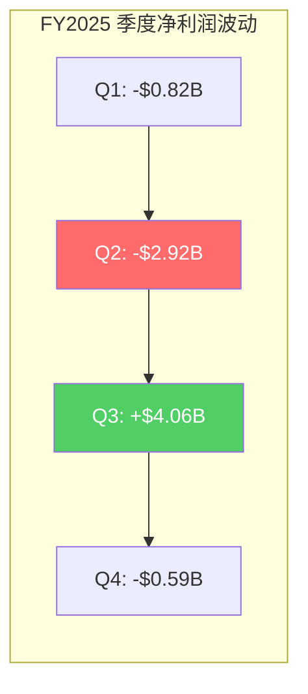
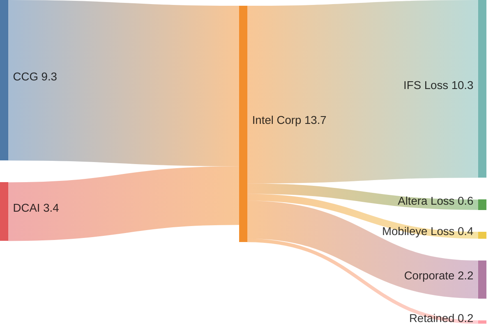
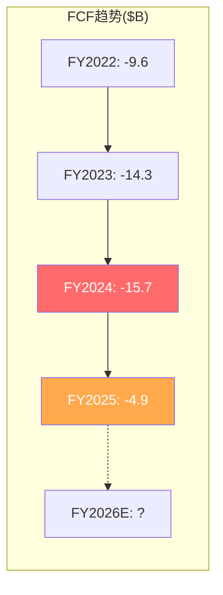
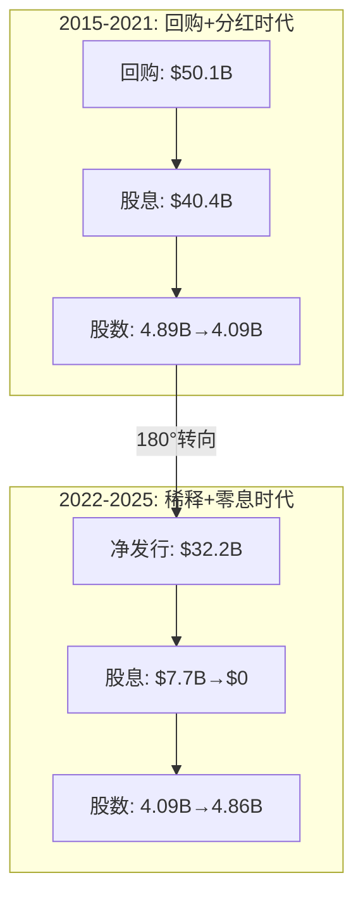

# INTC Phase 2 Part I — 财务架构解剖

> Phase 2: 财务与价格含义 | 框架 v17.3 | PW=8 发现系统
> 核心叙事锚: "活人估值 vs 濒死财务" — 本章解剖"濒死"的精确含义

---

## 第九章 盈利质量解剖

### 9.1 GAAP vs 调整后利润的鸿沟

Intel的FY2025 GAAP净亏损$267M(EPS -$0.06)掩盖了一幅比表面更复杂的画面。分季度拆解揭示了"表面平静、内部剧烈波动"的特征:



**Q2暴跌(-$2.92B)的解剖**: 毛利率跌至27.5%(FY2025最低), 包含重组费用和IFS减值。Q2营业亏损$3.18B表明Tan上任初期的"大扫除"集中在此季度。

**Q3异常飙升(+$4.06B)的本质**: 经营利润仅$0.68B, 但净利$4.06B意味着~$3.4B来自非经营项目。最可能解释: Altera出售51%股权产生的投资收益(Silver Lake交易于Q2-Q3完成, 账面确认可能落在Q3)。**这不是可持续盈利。**

**经常性利润测试**: 剔除Q2重组/Q3资产出售后, FY2025"正常化"净利润大致在**-$2B至-$3B区间** — 比GAAP -$0.27B差得多。

### 9.2 分部盈利质量分级

| 分部 | 收入 | 营业利润 | 利润率 | 盈利质量 |
|------|:----:|:--------:|:------:|:--------:|
| **CCG** | $32.2B | $9.3B | 28.9% | ★★★★ 高质量, 可持续 |
| **DCAI** | $16.9B | $3.4B | 20.2% | ★★★ 中等, 份额流失威胁 |
| **NEX(网络)** | $5.5B | ~$0.8B | ~15% | ★★ 低增长, 边缘化 |
| **IFS** | $17.8B | -$10.3B | -57.9% | ★ 巨额亏损, 内部转移定价 |
| **Mobileye** | $1.9B | -$0.4B | -20.5% | ★★ ADAS周期低谷 |
| **Altera** | $1.5B | -$0.6B | -41.0% | ★ 分拆中, 不可比 |
| **Other/Corp** | ~$1.4B | -$2.2B | N/A | 公司费用 |

**核心发现**: Intel只有两个赚钱的部门(CCG和DCAI), 合计营业利润$12.7B — 但被IFS(-$10.3B)、Altera(-$0.6B)、Mobileye(-$0.4B)和Corporate(-$2.2B)吞噬殆尽。**合并利润 ≈ 0, 不是因为没有赚钱的业务, 而是因为赚的钱全部喂给了亏钱的新业务。**



### 9.3 盈利"隐形转移"

IFS FY2025收入$17.8B几乎全部是**内部转移收入** — Intel Products付给Intel Foundry的"内部代工费"。外部客户贡献仅Q4 $222M(年化~$0.9B)。这创造了一个会计幻象:

- **CCG的"高利润"部分来自IFS定价补贴**: 如果IFS按市场价收费(TSMC N3 wafer ~$20,000 vs Intel内部转移价可能$8,000-12,000), CCG利润率会更低
- **IFS的"巨额亏损"包含了被Products端享受的补贴**: IFS真实亏损可能小于$10.3B, 但Products真实利润也低于报告值
- **投资含义**: Intel任何分部的利润率都不能直接与外部公司比较, 因为内部转移定价扭曲了分部经济学

### 9.4 一次性项目清单 (FY2024-2025)

| 项目 | 金额 | 时间 | 性质 |
|------|:----:|:----:|------|
| 重组费用(裁员2.1万人) | ~$3-4B | FY2024 Q3-Q4 | 一次性但现金流出真实 |
| Altera商誉减值 | ~$2.8B | FY2024 | 非现金, M&A失败确认 |
| Altera 51%出售收益 | ~$1-2B | FY2025 Q3 | 一次性, 投资收益 |
| IFS资产减值 | ~$1.5B | FY2024 | 非现金, 工厂利用率低 |
| CHIPS Act补贴确认 | 待分期 | FY2025+ | 改善毛利, 但附带义务 |

**盈利质量总结**: FY2025 EPS -$0.06是一个被大量正负一次性项目"平滑"后的数字。真实经营状态更差(正常化亏损-$2~3B), 但最坏的一次性减值已在FY2024(-$18.8B净亏)释放完毕。FY2026可能是Intel首个"干净"的盈利年份。

---

## 第十章 利润率微观解剖

### 10.1 毛利率断层扫描

Intel毛利率从55.4%(FY2021)跌至34.8%(FY2025), 下降20.6pp。这不是简单的周期下行, 而是**结构性重构**:

**毛利率下跌分解 (FY2021→FY2025, 估算)**:

```
FY2021毛利率:                     55.4%
- 收入缩减(固定成本杠杆倒转):     -8~10pp
- IFS独立报告(内部代工成本显性化): -5~7pp
- 产品组合恶化(高利润服务器→低利润PC): -3~4pp
- 工艺爬坡成本(Intel 4/3/20A/18A): -2~3pp
+ 成本削减(裁员+效率):            +2~3pp
= FY2025毛利率:                   34.8%
```

**关键洞见**: 约一半的毛利率下跌(10-13pp)是**会计重分类效应**(收入缩减+IFS显性化), 而非真实经济恶化。如果将Intel视为"Products+Foundry"合并体, 并用FY2021的收入水平标准化, "真实"毛利率可能在42-45%区间 — 仍然远低于FY2021但没有34.8%看起来那么恐怖。

### 10.2 R&D黑洞: 产出了什么?

| 年度 | R&D ($B) | R&D/收入 | R&D/毛利 | 主要产出 |
|------|:--------:|:--------:|:--------:|---------|
| FY2021 | 15.2 | 19.2% | 34.7% | Intel 7量产 |
| FY2022 | 17.5 | 27.8% | 65.2% | Intel 4开发 |
| FY2023 | 16.0 | 29.6% | 73.9% | Intel 4量产, Intel 3开发 |
| FY2024 | 16.5 | 31.2% | 95.4% | Intel 3量产, 18A开发, Gaudi 3失败 |
| FY2025 | 13.8 | 26.1% | 75.0% | 18A Risk Production, Falcon Shores取消 |
| **5年合计** | **$79.0B** | | | |

**$79B R&D产出的审计**:

**成功**: Intel 7→4→3→20A→18A, "4年5节点"路线图基本按时交付(vs 2021年前10nm延迟3-5年), 制程代差从落后TSMC 2代缩小到约1代。RibbonFET + PowerVia是真正的技术突破。

**失败**: Gaudi AI加速器(Habana $2B收购)基本失败 — 性能仅H200的1/9, Falcon Shores商业化取消; 独立GPU(Arc)未成为主流; Xe GPU路线图反复变更。

**效率对比**:

| 公司 | R&D ($B, FY2025) | R&D/收入 | 主要产出 |
|------|:----------------:|:--------:|---------|
| **Intel** | 13.8 | 26.1% | CPU设计+工艺研发+GPU+AI+FPGA+自动驾驶 |
| **AMD** | ~6.1 | 17.6% | CPU设计+GPU+AI(CDNA) — 无工艺 |
| **TSMC** | ~6.0 | 6.5% | 纯工艺研发 — 无芯片设计 |
| **NVIDIA** | ~12.8 | 9.4% | GPU设计+AI软件 — 无工艺 |

**Intel的困局**: 它同时承担"AMD的设计R&D"和"TSMC的工艺R&D", 但两端都没有达到专业选手的效率。这是SGI 4.2(通才)的财务具象化 — **R&D像通才一样分散, 但产出没有通才的协同回报。**

### 10.3 OpEx效率: Tan的手术刀

Lip-Bu Tan的成本削减是FY2025为数不多的亮点:

| 项目 | FY2024 | FY2025 | 变化 | 措施 |
|------|:------:|:------:|:----:|------|
| R&D | $16.5B | $13.8B | -16.4% | 砍掉低效项目(Falcon Shores, 部分GPU) |
| SG&A | $5.5B | $4.6B | -16.4% | 管理层削减50%, 裁员2.1万人 |
| 员工总数 | ~115K | ~94K | -18.3% | 自Tan上任以来最大规模 |
| **总OpEx** | **$22.0B** | **$18.4B** | **-16.4%** | |

**但效率提升有上限**: R&D不能无限削减 — Intel同时竞争CPU设计、工艺研发和GPU开发, 每个都有最低投入门槛。如果Tan增加Crescent Island GPU投入, R&D可能在FY2026-2027回升。

### 10.4 利息费用恶化

| 年度 | 利息费用 | 利息覆盖 | 信号 |
|------|:--------:|:--------:|------|
| FY2021 | $0.60B | 32.6x | 安全 |
| FY2022 | $0.50B | 4.7x | 紧张 |
| FY2023 | $0.88B | 0.1x | 危险 |
| FY2024 | $0.82B | -14.2x | 无覆盖 |
| FY2025 | $1.09B | -0.02x | 无覆盖 |

利息费用从$0.6B→$1.09B(+82%), 但营业利润从$19.5B→$0。**利息覆盖率从32.6x崩塌至实质为零** — Intel正在用融资(政府/稀释)而非经营利润来服务债务。Altman Z-Score 2.36处于"灰色地带"(1.81-2.99), 不安全但也未触发破产警报。

---

## 第十一章 现金流工程

### 11.1 经营现金流质量

```
FY2025 OCF构建:
    净利润:              -$0.27B
  + D&A:                +$11.7B   ← 最大正项(PP&E折旧)
  + SBC:                +$2.4B    ← 非现金补偿
  + 运营资本变动:        ~-$1.0B   ← 小幅占用
  + 其他调整:            ~-$3.1B   ← 重组/减值回拨等
  = 经营现金流:          $9.7B
```

**OCF质量诊断**:
- D&A是OCF的**支柱**($11.7B占OCF的121%) — 这意味着如果没有巨额折旧, OCF为负
- SBC $2.4B虽是非现金, 但对股东是真实稀释成本
- "盈利现金流"(OCF - D&A - SBC) ≈ **-$4.4B** — Intel的核心业务无法产生真正的现金

### 11.2 FCF四年深渊 + 转折点分析

| 年度 | OCF | CapEx | FCF | FCF Margin | CapEx/Rev |
|------|:---:|:-----:|:---:|:----------:|:---------:|
| FY2021 | $29.5B | $20.3B | $9.1B | 11.6% | 25.7% |
| FY2022 | $15.4B | $25.1B | -$9.6B | -15.2% | 39.7% |
| FY2023 | $11.5B | $25.8B | -$14.3B | -26.4% | 47.5% |
| FY2024 | $8.3B | $23.9B | -$15.7B | -29.5% | 45.1% |
| FY2025 | $9.7B | $14.6B | -$4.9B | -9.4% | 27.7% |
| **累计** | **$74.3B** | **$109.7B** | **-$35.4B** | | |

**FY2022-2025累计FCF: -$35.4B** — 这是Intel历史上最长、最深的FCF负区间。但趋势在改善:



**FCF转正路径** (CQ7: 能否FY2028前恢复正FCF?):

| 假设 | 乐观 | 基准 | 悲观 |
|------|:----:|:----:|:----:|
| FY2026E OCF | $12B | $10.5B | $9B |
| FY2026E CapEx | $13B | $15B | $17B |
| FY2026E FCF | **-$1B** | **-$4.5B** | **-$8B** |
| FCF转正年份 | **FY2027** | **FY2028** | **>FY2029** |

关键变量: **CapEx纪律**。如果Tan维持$13-15B CapEx(vs Gelsinger时代$24-26B), 且OCF随收入恢复增长, FY2027-2028转正是可能的。但如果IFS扩张需要新一轮资本支出潮, 转正会延迟到2030+。

**CQ7置信度更新**: 从55%微调至**50%** — CapEx削减信号积极, 但GPU新战略(Crescent Island)可能增加资本需求。

### 11.3 CapEx效率审判: $110B买了什么?

**FY2021-2025 $109.7B CapEx的物理产出**:

| 资产 | 投入 | 状态 |
|------|:----:|------|
| Arizona双fab | ~$32B | 建设中, 2027-2028产能释放 |
| Ohio双fab | ~$28B | 推迟至2030-2031, 大幅延期 |
| Oregon升级(High-NA EUV) | ~$10B | 18A开发用 |
| New Mexico(封装) | ~$3.5B | 先进封装投产 |
| Israel Fab 38 | ~$25B | 建设中 |
| 爱尔兰/德国/波兰 | ~$10B+ | 欧洲扩张 |

**CHIPS Act回血**: 直补$7.86B + 税收抵免(~$10B估计) + 贷款$11B = 总支持~$29B, 相当于CapEx的26%。**没有政府支持, Intel的资产负债表无法承受这一轮投资。**

**对比TSMC**:

| 指标 | Intel (FY2025) | TSMC (FY2025) |
|------|:--------------:|:-------------:|
| CapEx/收入 | 27.7% | 33.4% |
| ROIC | -0.05% | 24.9% |
| FCF Margin | -9.4% | 28.5% |
| 毛利率 | 34.8% | 59.9% |

**TSMC花的更多(CapEx/收入更高), 但赚的也更多(ROIC 25% vs Intel 0%)**。差异根源: TSMC的CapEx即时产出收入(客户wafer start), Intel的CapEx是预投资(fab建完还没有客户)。这是"代工新手vs代工冠军"的效率鸿沟。

---

## 第十二章 资本配置审判

### 12.1 M&A: 系统性价值毁灭

Intel过去10年的M&A记录是一份毁灭性的控诉:

| 交易 | 成本 | 当前价值 | 损益 | ROI |
|------|:----:|:--------:|:----:|:---:|
| Altera (2015) | $16.7B | ~$8.75B | **-$7.95B** | -48% |
| Mobileye (2017) | $15.3B | ~$8-9B* | **-$6~7B** | -45% |
| Habana Labs (2019) | $2.0B | ~$0 | **-$2.0B** | -100% |
| Tower Semi (2022, 流产) | $0.35B费 | N/A | -$0.35B | N/A |
| **合计M&A损失** | | | **~$16-17B** | |

*Mobileye: Intel持有~88%, 市值$7.17B, 持股价值~$6.3B

**NAND出售是唯一正确决策**: 卖给SK Hynix获$9.0B, 退出无竞争力的存储业务。

**M&A失败模式**: Intel反复以高溢价收购"未来赛道"(FPGA、自动驾驶、AI加速器), 然后因整合失败或市场判断错误而减值/出售。**$16-17B M&A亏损相当于当前市值的~7-8%** — 这笔钱如果用于回购, 相当于在$35-40价位买回4-5亿股。

### 12.2 股东回报大逆转: 从回购冠军到稀释冠军



**2015-2021 vs 2022-2025对照**:

| 维度 | 2015-2021 | 2022-2025 | 转变幅度 |
|------|:---------:|:---------:|:--------:|
| 回购 | $50.1B | $0 | -100% |
| 净股发行 | -$50.1B(净回购) | +$32.2B(净发行) | **$82.3B摆动** |
| 股息 | $40.4B($1.04→1.39/股) | $10.7B→$0 | -100% |
| 股数 | 4.89B→4.09B(-16%) | 4.09B→4.86B(+19%) | **35pp逆转** |

**买高卖低的教科书**: Intel在$40-65价位花$50B回购, 然后在$20-30价位发行$32B新股。如果将"2015-2021的回购+2022-2025的发行"视为一个完整交易, Intel**高买低卖净亏约$15-20B的股东价值**。

### 12.3 R&D: 分散投资的通才陷阱

Intel FY2025 R&D $13.8B(26.1%收入), 分散在至少6条主要研发线上:

1. **x86 CPU设计** (Core Ultra, Xeon) — 核心业务, 必须投入
2. **工艺研发** (Intel 18A/14A, EUV, 封装) — 代工战略基础
3. **GPU** (Arc/Xe, Crescent Island) — Tan的新赌注, 2027最早出产品
4. **AI加速器** (Gaudi后继?) — Falcon Shores取消后路径不明
5. **FPGA** (Altera, 已分拆51%) — 投入减少
6. **自动驾驶** (Mobileye) — 独立运营

**对比AMD**: $6.1B R&D集中在x86 CPU + GPU + AI(CDNA/MI系列), 不承担任何工艺研发。结果: AMD在CPU和GPU两个赛道都比Intel有更强的竞争力。

**对比NVIDIA**: $12.8B R&D集中在GPU架构 + CUDA生态 + AI软件。结果: NVIDIA在AI加速器领域垄断94%份额。

**Intel的R&D是"全攻全守"策略**: 每条线都投入了足以维持的最低额度, 但没有一条线拥有"压倒性投入"。这是SGI 4.2的R&D版本 — **通才式投入, 但没有通才式协同回报。**

### 12.4 资本配置综合评分

| 维度 | 评分(1-10) | 理由 |
|------|:----------:|------|
| M&A纪律 | **2** | $16-17B系统性毁灭, 仅NAND出售合理 |
| CapEx效率 | **3** | $110B投入但ROIC为0, 依赖政府补贴 |
| R&D转化 | **4** | 节点追赶成功但AI/GPU失败, 效率远低于AMD/TSMC |
| 股东回报 | **2** | 买高卖低, 股息归零, 股数回到原点 |
| 战略一致性 | **3** | Gelsinger时代方向正确但执行拉胯; Tan刚开始 |
| **综合** | **2.8/10** | 过去5年美国大型科技公司中最差的资本配置之一 |

**投资含义**: Intel的资本配置历史是一个**负面期权** — 过去的失败不仅消耗了现金, 还消耗了投资者信任。Tan需要2-3年无重大失误的执行来重建信誉。CQ4(CEO方向)因此变得更加关键。

---

## 第十二章附 资产负债表健康度

### 12A.1 杠杆与偿付能力

Intel的资产负债表处于"不危险但不安全"的灰色地带:

| 指标 | FY2025 | 安全线 | 评估 |
|------|:------:|:------:|------|
| 净债务/EBITDA | 2.25x | <3.0x | ✅ 安全(但EBITDA含大量D&A) |
| D/E | 0.41 | <0.60 | ✅ 适中 |
| 利息覆盖 | -0.02x | >3.0x | ❌ 危险(营业利润≈0) |
| 流动比率 | 2.02 | >1.5x | ✅ 充裕(含政府注资) |
| Altman Z-Score | 2.36 | >2.99 | ⚠️ 灰色地带(1.81-2.99) |

**现金缓冲**: $37.4B现金+短投(FY2025)是FY2022 $28.3B以来最高, 得益于政府注资($8.9B转股权)和战略投资(NVIDIA $5B, SoftBank $2B)。但这些现金是**一次性注入**, 不是经营产出。

**短期偿债无忧**: $2.5B短期债务 vs $37.4B现金, 短期无偿付风险。但$44.1B长期债务在2027-2030到期集中, 如果届时FCF仍为负, 可能需要再次稀释融资。

### 12A.2 隐形负债: 少数股东权益与义务

| 隐形负债 | 规模 | 含义 |
|----------|:----:|------|
| 少数股东权益 | $12.1B | 外部投资者(政府/NVIDIA/SoftBank)在IFS等子实体中的权益, Intel股东对这部分利润无权 |
| CHIPS Act义务 | ~$29B补贴/贷款 | 附带条件: 利润分享、本土生产要求、禁止中国扩产 |
| 退休/养老金 | ~$3-4B | 较同业偏高(Intel员工历史上较多) |
| 经营租赁 | ~$2-3B | 全球办公/研发设施 |
| **总隐形负债** | **~$48-51B** | 不在传统债务比率中, 但对股东权益有实质影响 |

**$12.1B少数股东权益的估值含义**: 如果IFS最终盈利, 约10-15%的利润归属少数股东。这意味着即使在乐观情景下, Intel股东也无法享受IFS 100%的上行。**政府持股9.9%是一把双刃剑: 提供下行保护, 但也稀释上行收益。**

### 12A.3 留存收益消耗速度

```
留存收益轨迹:
FY2021: $68.3B
FY2022: $63.3B (-$5.0B)
FY2023: $59.1B (-$4.2B)
FY2024: $51.6B (-$7.5B)  ← 巨亏$18.8B, 最大消耗年
FY2025: $49.0B (-$2.6B)

4年累计消耗: $19.3B (28% of FY2021峰值)
```

按当前消耗速度(~$3-5B/年), 留存收益**约10-15年**后归零 — 但这是在没有恢复盈利的极端假设下。如果FY2027开始盈利, 留存收益将触底回升。关键是**何时**触底, 而非**是否**归零。
