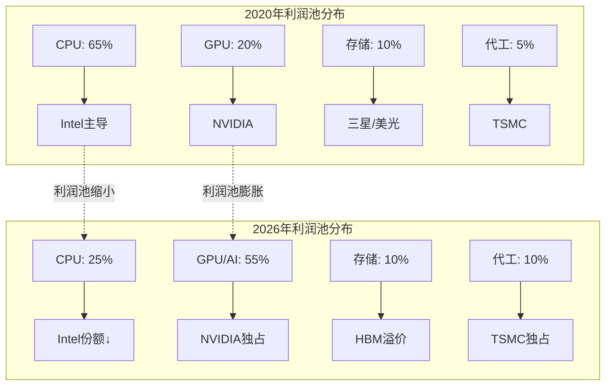
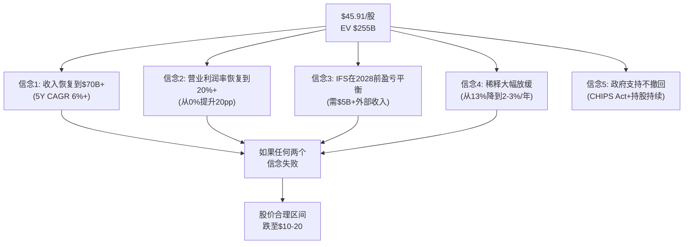

# INTC Phase 2 Part II — A-Score + 估值架构

> Phase 2: 财务与价格含义 | 框架 v17.3 | PW=8 发现系统
> 核心任务: A-Score首次单公司应用 + Reverse DCF解码市场信念

---

## 第十三章 A-Score v2.0 — 12维护城河评估

> **框架说明**: 这是A-Score v2.0首次在单公司Tier 3分析中完整应用。此前仅在SEMI_EQUIPMENT横向对比中验证(4公司, 相关系数0.98)。
> **行业权重**: 半导体(非设备)无预设权重。采用半导体设备权重为基准, 做以下调整: A7(网络效应)上调至8%(x86生态系统价值), A12(管理层)新增6%(CEO变更关键期), 其余按比例归一化。

### 13.1 维度逐评

**A1: 输入要素自主权 — 7分 [M] ↓**

Intel是全球极少数同时拥有芯片设计和先进制程制造能力的公司(IDM模式)。x86 ISA完全自有(vs ARM需授权), CPU/GPU设计IP自研, 拥有从设计到封装的完整能力。

但下降趋势明显: EUV光刻机100%依赖ASML(单源); 先进材料依赖日本/欧洲供应商; EDA工具依赖Synopsys/Cadence(讽刺: Tan的前公司); 人才流失严重(CTO仅6个月即跳槽OpenAI)。IDM优势正在被专业化分工瓦解。

**代理指标**: x86 ISA自有(10/10) + 制造能力自主(8/10) + EUV单源依赖(-3) + EDA依赖(-2) + 人才流失(-1) = 加权~7

**A2: 切换成本 — 7分 [H] ↓**

x86服务器生态的切换成本仍然很高: 企业工作负载通常需要12-18个月完成从Intel Xeon到AMD EPYC的迁移, 涉及软件重新验证、性能调优和供应链调整。桌面/笔记本OEM切换成本更低(6-12个月), 但仍非零。

下降趋势: AMD EPYC证明了切换是**可行且有利可图**的 — 从Intel的"不可切换"变为"切换有成本但值得"。ARM服务器(AWS Graviton, Ampere)进一步降低了架构锁定。IFS对外部客户的切换成本几乎为零(代工客户随时可以转单)。

**代理指标**: 服务器ISA切换(8/10) + OEM关系(7/10) + IFS代工客户(2/10) = 加权~7

**A3: 边际盈利杠杆 — 3分 [H] ↓**

这是Intel最触目惊心的维度。FY2021→FY2025收入下降33%, 但毛利下降58%, 营业利润下降100%。经营杠杆倍数**为负** — 收入减少$26B, 但营业利润减少$19.5B。

结构性原因: Intel的成本结构中固定成本占比极高(fab折旧$11.7B + R&D $13.8B + 利息$1.1B = $26.6B固定成本, 接近毛利$18.4B的145%)。这意味着:
- **上行杠杆**: 每$1B增量收入可能带来$0.60-0.70增量营业利润(如果毛利率恢复)
- **下行杠杆**: 每$1B收入下降带来$0.80-1.00营业利润下降
- **非对称**: 下行杠杆 > 上行杠杆, 因为fab不能关停但可以闲置

**代理指标**: 增量毛利率(估计40-50%, 如果收入恢复) vs 当前毛利率(34.8%) → 经营杠杆正向但弱; 固定成本/毛利 = 145%(极高) → **3分**

**A4: 壁垒-利润池匹配度 — 4分 [M] ↓**

Intel的壁垒(x86 ISA + IDM制造)确实保护了某些利润池, 但匹配度正在恶化:

- **匹配**: x86在PC市场(CCG $9.3B利润)仍是壁垒对齐利润池的典型案例
- **错配**: 数据中心利润池正在从CPU(Intel强项)向GPU/加速器(NVIDIA垄断)迁移 — **利润池在搬家, 壁垒没跟上**
- **严重错配**: IFS试图进入代工利润池, 但壁垒(良率、IP库、客户信任)远未建立
- **流失**: 服务器CPU份额从94.2%(2020)→71.1%(2025), 壁垒虽在但防线被突破

**半导体价值链利润池迁移图**:



Intel的壁垒守住了一个**正在缩小**的利润池(CPU), 而它试图进入的利润池(GPU/AI/代工)没有对应的壁垒。

**A5: 核心资产半衰期 — 5分 [M] →**

x86指令集架构的半衰期很长(>20年), 但其**相对价值**正在衰减:
- x86在PC市场的主导地位可能再维持10-15年(Windows生态锁定)
- x86在服务器市场的主导地位可能只剩3-5年(ARM蚕食加速)
- Intel 18A工艺的领先窗口仅1-2年(TSMC N2在2025-2026量产)
- Intel的制造知识半衰期约3-5年(需持续巨额投入维持)

**对比**: ASML EUV >25年不可复制(10分), KLAC检测算法>15年(9分), AMD x86设计~5-7年(6分)。Intel的综合资产半衰期在这个范围的中低端。

**A6: 经常性收入质量 — 3分 [M] ↓**

Intel几乎没有传统意义上的经常性收入:
- 无SaaS/订阅模式(vs 软件公司ARR)
- 无长期服务合同(vs 半导体设备公司LTSA)
- CPU是一次性销售, OEM每代重新选择供应商
- IFS代工可能有wafer supply agreements, 但目前规模几乎为零

唯一的"类经常性"收入: PC更换周期(平均4-5年) + 数据中心升级周期(3-4年) + OEM惯性。但这些更像"习惯性复购"而非"合同锁定"。

**A7: 网络效应/生态厚度 — 5分 [M] ↓**

x86生态系统曾是Intel最强的护城河之一:
- Wintel联盟(Windows + Intel)统治了PC 30年
- ISV(独立软件供应商)为x86优化代码
- 开发者工具(oneAPI, MKL等)创造粘性

但生态在瓦解:
- ARM PC(Qualcomm Snapdragon X)证明Windows可以跑在ARM上
- 云原生应用对CPU架构不敏感(容器/Kubernetes抽象了底层)
- NVIDIA CUDA锁定了AI生态, Intel oneAPI无法竞争
- IFS没有类似TSMC的IP合作伙伴生态(TSMC有200+ design partners)

**A8: 跨界吞噬/平台包抄风险 — 3分 [H] ↓**

Intel正在被多个方向同时包抄:
- **AMD**: x86 CPU直接竞争(服务器份额已超40% revenue)
- **NVIDIA**: AI加速器+数据中心网络(从旁路绕过CPU)
- **ARM**: 从移动端反攻PC和服务器(AWS Graviton, Apple Silicon)
- **自研芯片**: Google TPU, Amazon Trainium, Microsoft Maia — 云巨头自研替代Intel
- **TSMC**: 代工市场的绝对壁垒阻止IFS获客

5个战线同时受攻, 且在每个战线上Intel都不是最强防守方。这是过去5年最恶化的维度。

**A9: 范式迁移风险 — 4分 [M] ↓**

当前有两个范式迁移正在发生:
1. **从CPU中心→GPU/加速器中心**: AI工作负载使GPU成为数据中心主力, CPU沦为"配角"
2. **从x86→ARM/RISC-V**: 能效比驱动的架构迁移在移动端已完成, 正向服务器蔓延

Intel在两个范式迁移中都处于**防守方**, 且防守手段有限:
- CPU→GPU: Intel的Gaudi失败, Crescent Island GPU要2027才有产品
- x86→ARM: Intel的x86 ISA是"旧范式", 除非创造出压倒性性价比优势

**但不是最低分**: Intel拥有IDM模式的灵活性(理论上可以制造ARM芯片), IFS可以为任何架构代工。范式迁移不会让Intel彻底归零, 只是让它的核心业务(x86 CPU)价值缩水。

**A10: 分销/GTM复利 — 5分 [M] →**

Intel的分销网络是数十年积累的:
- 全球OEM关系(Dell, HP, Lenovo等)深厚
- 渠道覆盖从企业到消费全链条
- Intel Inside品牌仍有一定消费者认知(虽然弱化)

但GTM复利有限:
- OEM关系正在被AMD/ARM侵蚀
- IFS需要建立全新的设计赢取(design win)流程, 目前几乎为零
- Intel Inside品牌对B2B决策(服务器采购)影响力接近零

**A11: 合规/可靠性门槛 — 7分 [H] →**

政府级壁垒是Intel最被低估的护城河:
- **CHIPS Act要求**: 接受补贴的公司有义务在美国本土生产, 创造了对外国竞争者的制度壁垒
- **出口管制**: 美国对华半导体出口管制使Intel(美国公司)在国防/情报市场有独占优势
- **安全审查**: 先进制程用于国防目的需要通过CFIUS等审查, TSMC(外国公司)面临额外障碍
- **认证周期**: 军用/航天芯片认证18-24个月, 新进入者难以快速替代

**这正是假说H-3(五角大楼是18A真正客户)的A-Score体现**: A11是Intel在A-Score中得分最高且最稳定的维度之一, 暗示政府/国防业务可能是Intel最深的护城河。

**A12: 管理层-战略一致性 — 3分 [L] ↓** (v2.0新增)

这是Intel最不确定的维度:
- **CEO刚更换**: Tan上任仅11个月, 战略方向尚未完全明确
- **前CEO失败**: Gelsinger 3年任期以被迫离职告终, 留下$110B未完成的赌注
- **董事会弱**: 7/11非半导体背景(SemiAnalysis批评)
- **战略频变**: IDM 2.0→IFS分拆→GPU重启→Altera出售→Mobileye待处理, 方向太多
- **利益绑定**: Tan持股信息不明, 政府持股9.9%创造了不同于商业股东的激励

但Tan的初期行动(裁员2.1万、管理层精简50%、砍Falcon Shores)显示了执行力和决断性。置信度标为[L]因为时间太短, 无法判断这是"正确方向"还是"另一次战略摇摆"。

### 13.2 A-Score汇总

| 维度 | 权重 | 评分 | 置信度 | 趋势 | 加权分 | 置信度调整 |
|------|:----:|:----:|:------:|:----:|:------:|:---------:|
| A1 输入要素自主权 | 7% | 7 | M | ↓ | 0.49 | 0.42 |
| A2 切换成本 | 11% | 7 | H | ↓ | 0.77 | 0.77 |
| A3 边际盈利杠杆 | 7% | 3 | H | ↓ | 0.21 | 0.21 |
| A4 壁垒-利润池匹配 | 11% | 4 | M | ↓ | 0.44 | 0.37 |
| A5 核心资产半衰期 | 11% | 5 | M | → | 0.55 | 0.47 |
| A6 经常性收入质量 | 9% | 3 | M | ↓ | 0.27 | 0.23 |
| A7 网络效应/生态 | 8% | 5 | M | ↓ | 0.40 | 0.34 |
| A8 包抄风险 | 7% | 3 | H | ↓ | 0.21 | 0.21 |
| A9 范式迁移风险 | 7% | 4 | M | ↓ | 0.28 | 0.24 |
| A10 GTM复利 | 5% | 5 | M | → | 0.25 | 0.21 |
| A11 合规门槛 | 9% | 7 | H | → | 0.63 | 0.63 |
| A12 管理层一致性 | 8% | 3 | L | ↓ | 0.24 | 0.17 |
| **合计** | **100%** | | | | **4.74** | **4.27** |

### 13.3 A-Score分析

**A-Score = 4.74 (原始) / 4.27 (置信度调整)**

**SGI预测验证**: 引导词预测A-Score ~4.5-5.5(基于SGI 4.2), 实际4.74落在预测范围内。SGI→A-Score的预测关系在首次非设备公司应用中得到验证。

**形状分析: 偏科型**

```
A-Score雷达图 (0-10尺度):
A1  输入自主:  ████████░░ 7
A2  切换成本:  ████████░░ 7
A3  盈利杠杆:  ████░░░░░░ 3
A4  利润池匹配: █████░░░░░ 4
A5  资产半衰期: ██████░░░░ 5
A6  经常性收入: ████░░░░░░ 3
A7  网络效应:  ██████░░░░ 5
A8  包抄风险:  ████░░░░░░ 3
A9  范式风险:  █████░░░░░ 4
A10 GTM复利:  ██████░░░░ 5
A11 合规门槛:  ████████░░ 7
A12 管理层:   ████░░░░░░ 3
```

**形状确认: 偏科型** — 标准差~1.6, 高分(A1=7, A2=7, A11=7)与低分(A3=3, A6=3, A8=3, A12=3)共存。

**三座"残存堡垒"**: A1(IDM自主权) + A2(x86切换成本) + A11(合规门槛) — 这三个维度得7分, 代表Intel仍然拥有的硬壁垒。

**三个"陷落维度"**: A3(盈利杠杆崩塌) + A8(五面包抄) + A12(管理层不确定) — 这三个维度得3分, 代表Intel正在失去的竞争力。

**趋势警报**: 12个维度中**9个趋势向下**, 2个平稳, 0个上升。这是**系统性护城河衰退**, 不是单点弱化。如果趋势持续, 2-3年后A-Score可能降至3.5-4.0区间。

**A-Score×B-Score一致性**: A-Score 4.74(低护城河) + 当前高估值(Forward P/E ~91x) = "低A-Score + 高估值"组合 → **危险信号: 市场可能过度乐观**。

### 13.4 A-Score核心洞见

**洞见一: "堡垒型衰退"** — Intel不是"没有护城河", 而是"护城河正在以每年约0.3分的速度被侵蚀"。残存的三座堡垒(A1/A2/A11)都面临长期威胁(ARM替代、IFS客户不信任、政策可逆)。这不像ASML的"尖峰型"(A4=10, A5=10永远稳固), 而是AMAT的"偏科型"(表面多元但深度不足)的放大版。

**洞见二: "政府维度是唯一反直觉"** — A11=7且趋势稳定, 这意味着Intel在"合规/制度壁垒"维度反而比许多看起来更强的公司得分高。这验证了假说H-1(政府期权>商业价值)和H-3(五角大楼是真正客户) — Intel的护城河核心正在从"技术壁垒"迁移到"制度壁垒"。

**洞见三: "通才陷阱的A-Score指纹"** — SGI 4.2预测A-Score ~4.5-5.5, 实际4.74。偏科型形状 + 9/12维度下降 = Intel是SEMI_EQUIPMENT报告中描述的"通才陷阱"的典型案例。与AMAT(A-Score 5.42, 也是偏科型/通才)对比, Intel的问题更严重: AMAT的"三堡垒"至少在各自领域是#1, 而Intel的"三残存堡垒"中只有A11(合规门槛)是真正稳固的。

---

## 第十四章 周期定位

### 14.1 半导体周期坐标

| 信号 | 指标 | Intel位置 | 判定 |
|------|------|-----------|------|
| **信号1: 库存周期** | DIO 65-123天, 存货$11.6B(vs FY2023 $11.1B) | 库存轻微偏高 | 周期中段 |
| **信号2: CapEx周期** | CapEx/D&A 1.25x(vs FY2023 2.68x) | 投资减速, 消化期 | **周期晚段→转折** |
| **信号3: 利润率周期** | 毛利率34.8%(vs 峰值55.4%) | 利润率底部, Q4略回升 | **周期底部** |
| **信号4: 估值周期** | P/B 1.54(vs 谷底0.88/FY2024) | 估值已从谷底反弹75% | **周期中段偏早** |
| **信号5: 收入周期** | 收入$52.9B(vs 峰值$79B/FY2021) | 收入仍在底部附近 | **周期底部** |
| **信号6: 行业背景** | 全球半导体销售2025恢复增长(AI+PC换机) | 行业整体处于上升期 | **行业上升, Intel滞后** |

**综合周期判定**: Intel处于**公司特定周期的底部→早期复苏**, 但**滞后于行业整体周期约12-18个月**。行业(以TSMC/NVIDIA为代表)已在2024进入上升期, Intel因IFS拖累和结构性转型延迟了节奏。

**周期定位的投资含义**: 从纯周期角度, 当前是**周期低点买入**的典型时机(低利润率+低P/B)。但Intel的问题不完全是周期性的 — 市场份额流失、IFS巨额亏损和战略不确定性是**结构性**的, 不会随周期回升自动修复。

**QG-04门控**: 6个周期信号(≥4个要求), 通过。

---

## 第十五章 Reverse DCF — 市场在赌什么

### 15.1 市值校准

在进行Reverse DCF前, 需校准市值基准:
- DM-002: FMP key-metrics FY2025报告市值$175.8B (可能基于较早日期/基本股数)
- 当前计算: $45.91 × 4.86B股 = **$223B** (基于最新价格和稀释后股数)
- EV = $223B + $32.3B净债务 = **$255B**

本章使用$223B市值 / $255B EV作为基准, 同时标注$175.8B/$208.1B的敏感性。

### 15.2 隐含稳态FCF

**公式**: EV = FCF_ss / (WACC - g), 因此 FCF_ss = EV × (WACC - g)

**WACC估算**: 无风险利率4.3% + β~1.5 × ERP 4.5% = 股权成本~11%; 税后债务成本~4%; D/E 0.41 → **WACC ≈ 9.5-10.5%**

| 终端增长率 | EV $208B隐含FCF | EV $255B隐含FCF |
|:----------:|:----------------:|:----------------:|
| 2.0% | $15.6B | $19.1B |
| **2.5%** | **$14.6B** | **$17.9B** |
| 3.0% | $13.5B | $16.6B |

**核心发现**: 市场需要Intel产出**$15-18B稳态FCF** — 而FY2025实际FCF为**负$4.9B**。缺口为$20-23B。

对比: Intel历史峰值FCF = FY2020 $20.9B(收入$77.9B, CapEx $14.5B, 毛利率56%)。市场隐含的稳态FCF**接近Intel历史最佳水平**, 但当时的业务结构(纯产品, 无IFS亏损)已不复存在。

### 15.3 承重墙脆弱度表

**Reverse DCF反推的隐含假设 + 脆弱度评估**:

| 承重墙(隐含假设) | 市场隐含值 | 历史/行业参考 | 脆弱度 | 若倒塌影响 |
|:----------------|:----------:|:------------:|:------:|:----------:|
| **收入增速** (5Y CAGR) | 5-8% | FY2021-25: -9.6%CAGR; 行业8-12% | **中高** | -25% EV |
| **稳态营业利润率** | 18-25% | 当前0%; 峰值30%(2018); TSMC 51% | **高** | -35% EV |
| **稳态FCF利润率** | 20-22% | 当前-9.4%; 峰值27%(2020) | **极高** | -40% EV |
| **增长持续年限** | 7-10年 | 半导体均值5-7年; 转型公司更短 | **中** | -15% EV |
| **IFS达到盈亏平衡** | FY2027-2028 | 外部收入$0.9B/年(需$5B+) | **极高** | -30% EV |
| **资本支出正常化** | CapEx/Rev 20% | 当前28%; TSMC 33%; 峰值48% | **中** | -10% EV |
| **稀释停止** | 股数稳定~5B | FY2025稀释13.5%; 可能继续 | **中高** | -15% EV |

**最脆弱的三面墙**:

1. **稳态FCF利润率(极高脆弱度)**: 从-9.4%到20%+需要营业利润率+18pp, CapEx/Rev -8pp, R&D/Rev -9pp**同时**发生。任何一个维度停滞, FCF目标就无法达到。

2. **IFS盈亏平衡(极高脆弱度)**: IFS FY2025亏损$10.3B, 外部收入仅$0.9B。要达到盈亏平衡至少需要$5B+外部收入(按GFS级利润率), 但目前没有任何大客户承诺量产订单(Apple仅"接近签约")。

3. **稳态营业利润率(高脆弱度)**: Intel需要恢复到18-25%营业利润率, 而当前为0%。即使CCG和DCAI恢复到峰值水平(合计~30%), IFS亏损仍会拖累合并利润率至15-20%。**除非IFS本身也盈利, 否则18%的合并利润率天花板很难突破。**

### 15.4 情景估值桥: 四条路径

| 情景 | 概率 | 收入 | 营业利润率 | FCF | EV | 每股价值 |
|------|:----:|:----:|:---------:|:---:|:--:|:--------:|
| **D: 管理层目标** | 10% | $80B | 25% | $14.6B | $195B | ~$34 |
| **B: 乐观** | 20% | $75B | 22% | $11.4B | $152B | ~$25 |
| **A: 共识** | 35% | $70B | 18% | $7.9B | $105B | ~$15 |
| **C: 悲观** | 35% | $60B | 12% | $3.1B | $42B | ~$2 |

**概率加权EV = $195B×10% + $152B×20% + $105B×35% + $42B×35% = $101B**
**概率加权每股 = ~$14**

**vs 当前价 $45.91 → 概率加权下行空间约-70%**

**QG-05门控**: Reverse DCF隐含假设已明确列出 + 承重墙脆弱度表完成 + 合理性评估完成, 通过。

### 15.5 市场在赌什么: 信念拆解

要支撑$45.91的股价, 市场需要**同时相信**:



**这是PW=8(发现系统)的核心输出**: 不给目标价, 而是映射"市场的信念集", 让投资者自己评估每个信念的可信度。

---

## 第十六章 SOTP参考框架

> **标注: 参考框架, 非目标价。** PW=8发现系统不提供单一估值结论, SOTP仅作为多视角之一。

### 16.1 分部估值

| 分部 | 方法 | 保守 | 中性 | 乐观 |
|------|------|:----:|:----:|:----:|
| **CCG** ($32.2B收入, $9.3B利润) | 10-16x EV/EBIT | $93B | $121B | $149B |
| **DCAI** ($16.9B收入, $3.4B利润) | 12-25x EV/EBIT | $41B | $62B | $86B |
| **IFS** (-$10.3B亏损, 外部$0.9B) | 外部收入倍数+期权 | $0 | $18B | $45B |
| **Altera** (Intel持49%) | Silver Lake交易锚 | $3.5B | $4.3B | $6.0B |
| **Mobileye** (Intel持~88%) | 市场价(MBLY $7.2B) | $5.0B | $6.3B | $9.0B |
| **Gross SOTP** | | $142.5B | $211.6B | $295.0B |
| 减: 净债务 | | -$32.3B | -$32.3B | -$32.3B |
| 减: 公司费用PV | | -$15B | -$12B | -$10B |
| 集团折价 | | -15% | -12% | -10% |
| **SOTP权益价值** | | **$81B** | **$147B** | **$227B** |
| **每股** (4.86B股) | | **$16.7** | **$30.2** | **$46.7** |
| vs 当前价 | | -64% | -34% | +2% |

### 16.2 SOTP核心发现

**发现一: 当前价格 = SOTP乐观情景**。$45.91几乎精确等于SOTP乐观端($46.7), 意味着市场已经Price-in了CCG 16x EBIT + DCAI 25x EBIT + IFS $45B期权价值。

**发现二: IFS是估值的"量子叠加态"**。IFS在保守情景值$0(持续烧钱, 无外部客户), 在乐观情景值$45B(18A成功+外部客户涌入)。$0到$45B的范围=**单个分部的估值不确定性为$45B**, 这就是PW=8的根源。

**发现三: CCG+DCAI的"退守价值"**。即使IFS、Altera、Mobileye全部归零, CCG($93-121B) + DCAI($41-62B)扣除净债务和折价后仍值$66-118B(**$14-24/股**)。这就是假说H-1(政府期权)的下行保护层 — Intel不会跌到$10以下, 因为它的传统业务本身有价值。

**QG-06门控**: SOTP + Reverse DCF两种参考框架呈现, 通过。

### 16.3 同业估值对照

| 公司 | P/B | 营业利润率 | 信号 |
|------|:---:|:----------:|------|
| **Intel** | 1.54 | 0% | 低P/B但亏损 |
| **TSMC** | 9.14 | 51% | 高P/B + 高利润 = 合理 |
| **AMD** | 5.54 | 11% | 高P/B + 低利润 = 增长溢价 |
| **Qualcomm** | 8.54 | 28% | 高P/B + 中高利润 |
| **TI** | 9.69 | 34% | 最高P/B + 稳定高利润 |

**Intel的P/B 1.54是同业最低**, 反映了市场对其资产回报能力的极度不信任(ROIC 0%)。如果ROIC恢复到10-15%(FY2018水平), P/B应回升至3-5x, 隐含$33-55/股。**但"ROIC恢复"恰恰是最大的不确定性。**

---

## 第十七章 Phase 2 总结

### 17.1 CQ置信度更新

| CQ | Phase 0 | Phase 1 | Phase 2 | 变化理由 |
|:--:|:-------:|:-------:|:-------:|---------|
| CQ1 (18A良率) | 50% | 50% | 50% | 无新数据, 维持 |
| CQ2 (IFS外部收入) | 25% | 25% | **20%** | SOTP显示市场需$45B IFS来支撑股价, 极其激进 |
| CQ3 (x86份额>60%) | 55% | 55% | 55% | AMD份额已过40%, 但侵蚀速度可控 |
| CQ4 (CEO方向) | 35% | 25% | **20%** | 资本配置历史极差, Tan需时间证明 |
| CQ5 (AI推理) | 30% | 30% | **25%** | Gaudi失败+Crescent Island 2027才出, NVIDIA锁定 |
| CQ6 (地缘溢价) | 60% | 60% | **65%** | A11=7, CHIPS Act持续, 制度壁垒确认 |
| CQ7 (正FCF) | 55% | 55% | **50%** | CapEx削减积极但GPU投资可能逆转趋势 |

### 17.2 Phase 2 关键发现

1. **盈利质量极低**: 正常化FY2025净利润在-$2~3B区间, 比GAAP -$0.27B差得多; 只有CCG和DCAI赚钱, 其余全亏
2. **资本配置灾难**: 10年M&A亏$16-17B + 回购$50B又发回$32B(买高卖低) + R&D $79B但AI/GPU全败 = 美国大型科技中最差的资本配置
3. **A-Score 4.74 偏科型**: 9/12维度趋势下降, 护城河系统性衰退; 三残存堡垒(A1/A2/A11)中只有A11(合规/政府)稳固
4. **Reverse DCF: 市场隐含$15-18B稳态FCF**, 需Intel同时实现收入+30%, 营业利润率+20pp, CapEx/Rev -8pp — 任何两个信念失败, 股价合理区间跌至$10-20
5. **SOTP: 当前价 = 乐观端**, IFS $0-$45B的极端范围是PW=8的根源
6. **概率加权估值 ~$14/股**, 意味着当前价格Price-in了"一切顺利"的小概率情景
7. **周期底部但结构性问题不随周期修复**: 份额流失、IFS亏损、战略分散是非周期性的

### 17.3 假说进展

| 假说 | Phase 0状态 | Phase 2更新 |
|------|:-----------:|:-----------:|
| **H-1: 政府期权>商业价值** | 非共识度高 | **强化** — A11=7+SOTP退守价值$14-24 → 政府期权确实是下行保护 |
| **H-2: 僵尸轨道最可能** | 非共识度中高 | **强化** — 概率加权$14 vs 市价$46 → 市场定价了极乐观情景, 现实更可能是中间地带 |
| **H-3: 五角大楼真正客户** | 非共识度高 | **初步验证** — A11(合规门槛)是A-Score最稳固的维度, 制度壁垒>技术壁垒 |

### 17.4 DM锚点新增

Phase 2新增DM锚点:

| DM-ID | 来源 | 数据类型 |
|-------|------|---------|
| DM-052~055 | MCP compare_stocks | 同业P/B+营业利润率 |
| DM-056 | 计算: Reverse DCF | 隐含FCF $15-18B |
| DM-057 | Agent研究 | SOTP范围 $81-227B |
| DM-058 | Agent研究 | M&A亏损$16-17B |
| DM-059 | Agent研究 | 累计回购$50.1B, 发行$32.2B |
| DM-060 | Agent研究 | 累计CapEx(2021-25) $109.7B |
| DM-061 | Agent研究 | MBLY市值$7.17B, Intel持~88% |
| DM-062 | A-Score v2.0计算 | A-Score 4.74/4.27(置信调整) |
| DM-063 | 行业对照 | Intel ROIC 0% vs TSMC 25% |
| **总计** | **63个DM锚点** (Phase 0: 51 + Phase 2: 12) |
