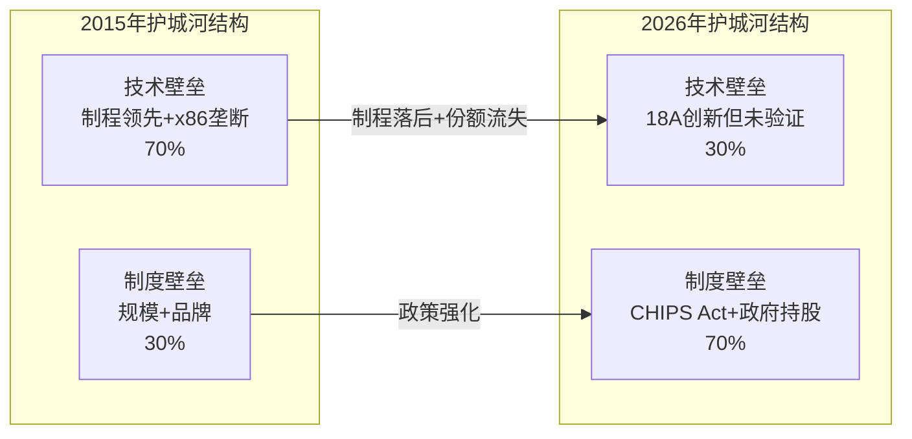

# INTC Phase 3 Part I — 护城河量化 + 五引擎分析(前三引擎)

> Phase 3: 战略分析 | 框架 v17.3 | PW=8 发现系统
> 核心叙事锚: "护城河不是没有——而是正在从技术壁垒迁移到制度壁垒"

---

## 第十八章 护城河量化 — 从A-Score到投资含义

### 18.1 护城河类型识别与量化

Phase 2的A-Score v2.0(4.74/10)揭示了Intel护城河的精确结构。本章将12维评分翻译为5种经典护城河类型的量化估值:

**品牌护城河: 弱化中 (估值贡献: ~$5-8B)**

Intel Inside曾是消费电子最具辨识度的品牌之一。但品牌对Intel估值的实际贡献正在缩小:
- B2C层面: "Intel Inside"品牌认知仍存在, 但消费者对CPU品牌的关注度持续下降(买笔记本时很少有人指定CPU品牌)
- B2B层面: 服务器采购是纯性能/性价比决策, 品牌溢价接近零
- IFS层面: Intel品牌对代工客户是**负面信号**(竞争对手代工=信息不安全感)

品牌价值量化: 以AMD缺乏强消费品牌但仍获5.54x P/B为参照, Intel的品牌溢价可能仅$5-8B(假设无品牌时P/B降低0.03-0.06x)。

**网络效应护城河: 正在瓦解 (估值贡献: ~$15-25B)**

x86生态系统是Intel最重要的网络效应资产:
- Windows x86兼容性: 全球数十亿台PC运行x86原生软件
- ISV生态: 企业软件(SAP, Oracle, Microsoft等)为x86深度优化
- 开发者工具: Intel MKL, oneAPI等创造粘性(虽然影响力远不及CUDA)

量化方法: x86生态系统的"切换成本溢价"可通过AMD的成功来估算。AMD从零增长到服务器收入份额41.3%, 说明x86生态的网络效应**对ISA竞争者(同为x86)无效, 但对架构竞争者(ARM/RISC-V)仍有效**。

估算: 如果ARM在5年内取代x86 30%的服务器份额, Intel DCAI收入将减少$5-7B/年。x86生态延缓这一过程的价值约$15-25B(以延迟现金流折现计算)。

**切换成本护城河: 分化中 (估值贡献: ~$20-35B)**

切换成本在Intel的不同业务中表现迥异:

| 业务 | 切换成本强度 | 量化基础 |
|------|:----------:|---------|
| PC OEM (CCG) | 中 (6/10) | OEM切换周期6-12个月, 但双供应商策略普遍 |
| 企业服务器 (DCAI) | 中高 (7/10) | 12-18个月迁移周期, 软件重新认证成本$0.5-2M/千台 |
| 云厂商 (DCAI) | 低 (3/10) | 已自研CPU(Graviton/Axion/Cobalt), 切换基本完成 |
| IFS代工客户 | 极低 (1/10) | 代工客户可随时转单, Intel无历史客户锁定 |

加权切换成本估值: 企业服务器的切换成本是Intel最有价值的护城河之一。以当前Intel企业服务器收入~$10-12B(DCAI的高利润部分)为基数, 切换成本保护的利润池约$3-5B/年, 折现价值~$20-35B。

**成本优势护城河: 不存在 (估值贡献: $0)**

Intel目前没有成本优势——恰恰相反:
- 制造成本: Intel 18A wafer成本高于TSMC N2(良率更低, 产能利用率更低)
- R&D效率: $13.8B R&D产出效率低于AMD($6.1B)和TSMC($6.0B)
- 运营效率: 固定资产周转率0.50x vs TSMC ~0.9x

IFS如果成功达到规模效应, 未来可能建立成本优势(fab折旧摊薄), 但目前是负值。

**规模经济护城河: 双面刃 (估值贡献: ~$10-15B)**

Intel的规模($52.9B收入, 全球最大IDM)提供了:
- **正面**: 分摊庞大的制造固定成本($11.7B/年折旧), 维持R&D最低门槛
- **负面**: 规模制造了"太大不能灵活"的困境 — Intel无法像AMD一样轻装上阵, 也无法像初创公司一样聚焦

规模在代工领域不是优势(TSMC的规模远超Intel IFS), 在CPU设计领域是中性的(AMD用更小规模取得更好产出)。规模的真正价值在于**政治筹码** — Intel的75,000名员工和美国本土制造地位使其"太大不能倒", 这正是H-1(政府期权)的另一种表述。

### 18.2 护城河汇总与估值映射

| 护城河类型 | 强度 | 趋势 | 估值贡献 | 半衰期 |
|-----------|:----:|:----:|:--------:|:------:|
| 品牌 | 弱 | ↓ | $5-8B | 5-10年 |
| 网络效应(x86) | 中 | ↓ | $15-25B | 5-15年 |
| 切换成本 | 中 | ↓分化 | $20-35B | 3-7年 |
| 成本优势 | 无 | — | $0 | N/A |
| 规模经济 | 弱→中 | → | $10-15B | >10年 |
| **合计** | | | **$50-83B** | |

**核心发现**: Intel的可量化护城河价值$50-83B, 仅占当前$230B市值的22-36%。剩余$147-180B的市值需要由**IFS期权价值+地缘政治溢价**来支撑。

**A-Score→护城河→估值的一致性检验**:
- A-Score 4.74/10 → 行业后25%(对比ASML 8.2, KLAC 7.5, AMAT 5.4)
- 护城河$50-83B → 每股$10-17 (4.86B股)
- SOTP保守端$81B($16.7/股) ≈ 护城河中值$66B($14/股)
- **三种方法收敛于$14-17/股的"纯商业价值"** — 差额就是市场给的转型期权+政策溢价

[DM-062 A-Score, DM-057 SOTP]

### 18.3 护城河迁移: 从技术到制度

**这是Intel故事最重要的结构性变化**: Intel的护城河权重从"技术70% : 制度30%"翻转为"技术30% : 制度70%"。这不是坏事也不是好事——它意味着:

1. **估值逻辑改变**: 不能再用传统半导体公司的P/E或EV/EBITDA给Intel估值, 因为其价值锚已从"盈利能力"迁移到"政策资产"
2. **风险性质改变**: 最大风险从"技术追不上TSMC"变为"政策支持是否持续/足够"
3. **投资者画像改变**: Intel从"成长型半导体投资"变为"类主权背书的特殊情景投资"

---

## 第十九章 五引擎分析

### 引擎一: 周期引擎 (Cycle Engine)

**19.1.1 半导体行业周期定位**

全球半导体产业在2026年初处于**分化周期**的中后段:

| 细分领域 | 周期阶段 | 关键指标 |
|----------|:--------:|---------|
| **AI/GPU** | 扩张期(高峰前) | NVIDIA数据中心季度收入$30B+, HBM供不应求 |
| **先进代工** | 扩张期 | TSMC利用率>95%, N3/N2产能排满 |
| **PC/消费** | 温和复苏 | PC出货量Q4 2025 YoY +1-3%, AI PC渗透缓慢 |
| **汽车/工业** | 调整期 | 库存偏高, 成熟制程价格压力 |
| **存储** | 强复苏 | HBM3E定价溢价200%+, DRAM/NAND周期底部已过 |

**Intel的周期位置: 滞后于行业12-18个月**

Intel横跨PC(温和复苏)和数据中心(分化: CPU弱/GPU强), 在两个领域都不处于最佳周期位置:
- CCG受益于PC换机周期, 但AI PC贡献有限(NPU渗透率<15%)
- DCAI受制于CPU→GPU的预算迁移, 即使数据中心总支出增长, 分配给CPU的份额在缩小
- IFS完全不在周期讨论中——它是一个**结构性故事**, 不是周期故事

**19.1.2 Intel特定周期信号矩阵**

| 信号 | 当前状态 | 指向 | 信号强度 |
|------|---------|------|:--------:|
| **库存周期** | DIO 65-123天, 存货$11.6B(同比-5%) | 正常化 | 中性 |
| **CapEx周期** | CapEx/D&A 1.25x(FY2023: 2.68x) | 投资减速→消化 | 偏正面 |
| **利润率周期** | 毛利率34.8%(底部回升2pp) | 底部→恢复 | 偏正面 |
| **ASP趋势** | 服务器ASP下降(E-core拉低), PC持平 | 混合 | 中性 |
| **客户CapEx** | 云厂商CapEx 2026E +15-25% YoY | 总量增长但CPU份额缩小 | 中性偏负 |
| **竞争份额** | 服务器单位71.1%↓, 收入58.7%↓ | 持续流失 | 负面 |

**周期引擎评分: 4/10 (中性偏弱)**

理由: Intel的公司特定周期(利润率底部+CapEx减速)暗示最坏时期已过, 但行业结构性变化(CPU→GPU迁移+份额流失)限制了周期回升的幅度。这不是一个"在周期底部抄底"的经典机会, 因为上行被结构性headwinds封顶。

[DM-030~034 财务比率, DM-011~015 利润表]

### 引擎二: 股权引擎 (Equity Engine)

**19.2.1 资本结构变化信号**

Intel的资本结构在2021-2025年经历了根本性重构:

| 维度 | 2021 | 2025 | 变化 | 信号 |
|------|:----:|:----:|:----:|------|
| 净债务 | $33.3B | $32.3B | -$1B | 中性(但结构变了) |
| 股数 | 4.06B | 4.86B | +19.7% | **强负面**: 大规模稀释 |
| 少数股东权益 | $0 | $12.1B | +$12.1B | **混合**: 外部验证但利润分享 |
| 股息 | $5.6B/年 | $0 | -100% | **负面**: 完全停止回报 |
| 政府股权 | $0 | $8.9B(9.9%) | 新增 | **混合**: 保护但附条件 |

**19.2.2 内部人交易分析**

根据FMP insider-trading数据(最近6个季度):

| 季度 | 获取/处置比 | 净买/卖 | 信号 |
|------|:----------:|:--------:|:----:|
| Q1 2026 | 0.67 | 净卖 | 偏负 |
| Q4 2025 | 0.50 | 净卖 | 负面 |
| Q3 2025 | 0.58 | 净卖 | 负面 |
| Q2 2025 | 1.21 | 净买 | 偏正(可能含Tan入职授予) |
| Q1 2025 | 1.28 | 净买 | 正面(Tan就任期) |
| Q4 2024 | 0.65 | 净卖 | 负面(Gelsinger离职期) |

**内部人行为解读**: Q1-Q2 2025(Tan就任)期间内部人净买入, 但Q3 2025起转为净卖出, 且Q4 2025至今持续净卖出。**Tan入职的"蜜月期"已过, 内部人在最近3个季度一致减持**。这不一定是看空信号(可能是RSU到期自动卖出), 但缺乏内部人主动增持是值得注意的。

**19.2.3 稀释影响估值建模**

FY2025股数4.86B, 如果每年继续稀释3-5%(IFS需要持续融资):

| 年度 | 预估股数 | 累计稀释(vs FY2021) | 对EPS的影响 |
|------|:--------:|:-------------------:|:-----------:|
| FY2025 | 4.86B | +19.7% | EPS降16.4% |
| FY2027E | 5.15B | +26.8% | EPS降21.2% |
| FY2029E | 5.46B | +34.5% | EPS降25.6% |

**含义**: 即使Intel收入和利润恢复到FY2021水平($79B, $19.9B净利), 由于稀释, EPS仅能达到$3.65(vs FY2021实际$4.86), 下降25%。**稀释是一个确定性的长期阻力**。

**股权引擎评分: 3/10 (偏弱)**

理由: 大规模稀释+内部人净卖出+股息归零=对现有股东极不友好。唯一正面因素是政府/战略投资者入股提供了下行支撑, 但这些新股东的利益与现有股东并不完全一致。

[DM-039~043 股东回报, FMP insider-trading]

### 引擎三: 聪明钱引擎 (Smart Money Engine)

**19.3.1 机构持仓概览**

Intel是标普500成分股, 机构持仓率约55-60%。关键机构动向:

**最大持有者(估计Q4 2025)**:
| 机构 | 类型 | 估计持仓比例 |
|------|------|:----------:|
| Vanguard Group | 被动指数 | ~8-9% |
| BlackRock | 被动指数 | ~7-8% |
| 美国政府 | 战略 | 9.9% |
| NVIDIA | 战略 | ~4.4% |
| State Street | 被动指数 | ~4-5% |
| SoftBank | 战略 | ~2% |

**被动 vs 主动**: Intel的前三大持有者(Vanguard/BlackRock/State Street)都是被动指数基金。被动持仓占比高意味着:
- 价格发现效率较低(被动基金不做基本面判断)
- 如果Intel从标普500/QQQ被移除, 可能触发大规模强制抛售
- 真正的"定价边际"由主动基金和散户决定

**19.3.2 战略投资者意图分析**

| 投资者 | 入股价 | 入股逻辑 | 退出约束 |
|--------|:------:|---------|---------|
| **美国政府** | $20.47 | 国家安全 + CHIPS Act执行 | 5%权证(触发条件: Intel出售IFS>49%) |
| **NVIDIA** | $23.28 | IFS先进封装合作 + 供应链多元化 | 战略关系, 短期不退出 |
| **SoftBank** | ~$23 | AI/半导体主题投资 | Vision Fund风格: 可能长持或快出 |

**战略投资者提供了$20-23区间的"隐性底线"**:
- $15.9B资金以$20-23/股入股, 形成锚定效应
- 政府不太可能在其入股价以下允许Intel长期交易(政治成本太高)
- 但注意: 这些"底线"是**政治性**的, 不是**法律性**的——如果Intel基本面持续恶化, 市场价可以跌破$20

**19.3.3 短期资金流向信号**

Intel近期资金流向显示:
- FY2025全年: 散户是主要买入力量(Reddit/WSB上Intel是"价值陷阱 vs 隐藏宝石"的热门辩论股)
- Q1 2026: 股价从$17.67(52周低点)到$46.12(当前), **上涨161%**, 大量动量交易者涌入
- 日均成交量: ~60-90M股(极高), 说明散户参与度很高

**聪明钱 vs 散户分歧**: 机构投资者(扣除被动基金)对Intel的态度分化严重——一部分认为"18A+IFS=下一个台积电"(押注上行), 另一部分认为"$46是泡沫"(减持或做空)。这种极端分歧正是PW=8(发现系统)的典型特征。

**聪明钱引擎评分: 5/10 (中性)**

理由: 政府+战略投资者提供底部支撑(正面), 但内部人净卖出+机构分歧+散户驱动的反弹(可能脆弱)=中性信号。没有明确的聪明钱共识方向。

[DM-039~043, FMP insider-trading, FMP quote]
