# INTU P1+P2 Mermaid图表补充 (15个)

> **用途**: 直接嵌入Phase 5 Complete报告，补齐可视化门控(G4≥25)
> **数据来源**: P1 Ch1-Ch6/Ch11/Ch14/Ch-B4 + P2 Ch7-Ch10

---

## 一、业务架构 (4个)

### 图1: INTU四大分部收入瀑布

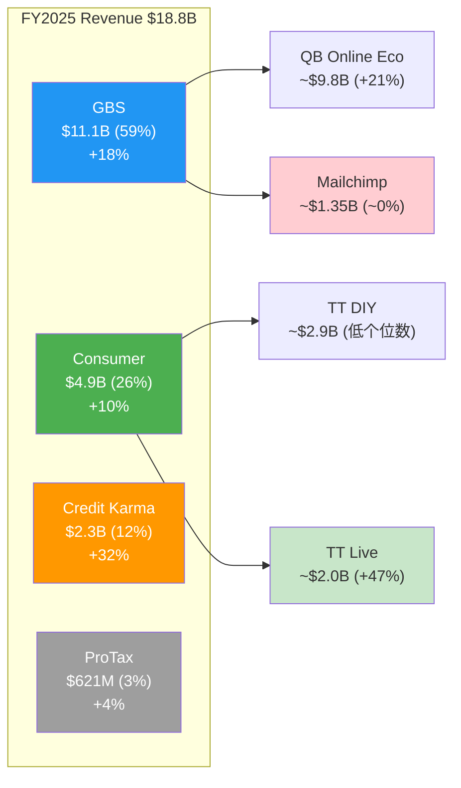

**读图说明**: GBS贡献59%收入但内部质量差异巨大——剔除Mailchimp后核心QB增速+21%，Mailchimp增速接近零。Consumer分部内TT Live(+47%)是真正的增长引擎，DIY已接近零增长。CK(+32%)是增速最高的分部，但仅占12%。

---

### 图2: 双重身份框架图

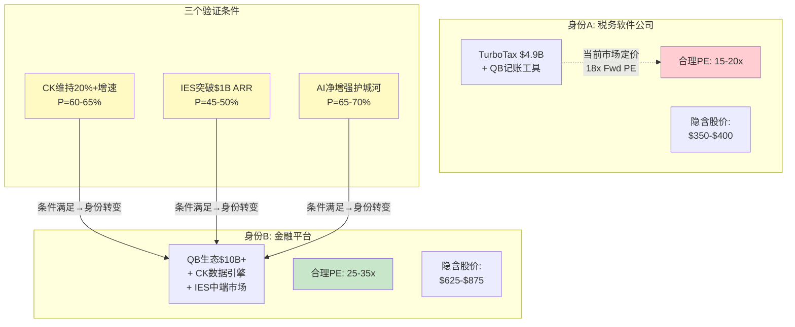

**读图说明**: 市场以18x forward PE定价身份A(税务软件)，几乎给零平台溢价。身份B(金融平台)需要三个条件同时成立，联合概率仅12-17%。当前$457处于身份A区间的上沿，投资吸引力取决于向身份B转变的可能性。

---

### 图3: QB生态系统集成架构

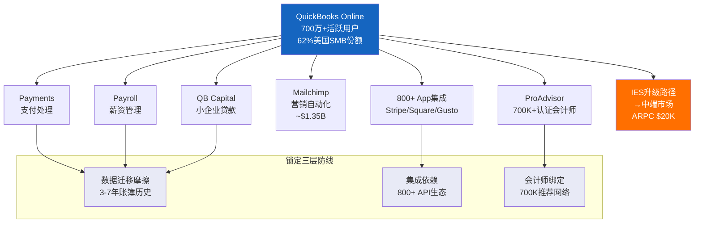

**读图说明**: QB Core居中连接6大功能模块+IES升级路径。底部三层锁定防线(数据/集成/会计师)解释了82%的年留存率。每多使用一个模块，迁移成本呈非线性增长。

---

### 图4: INTU产品矩阵(增速 x 利润率)

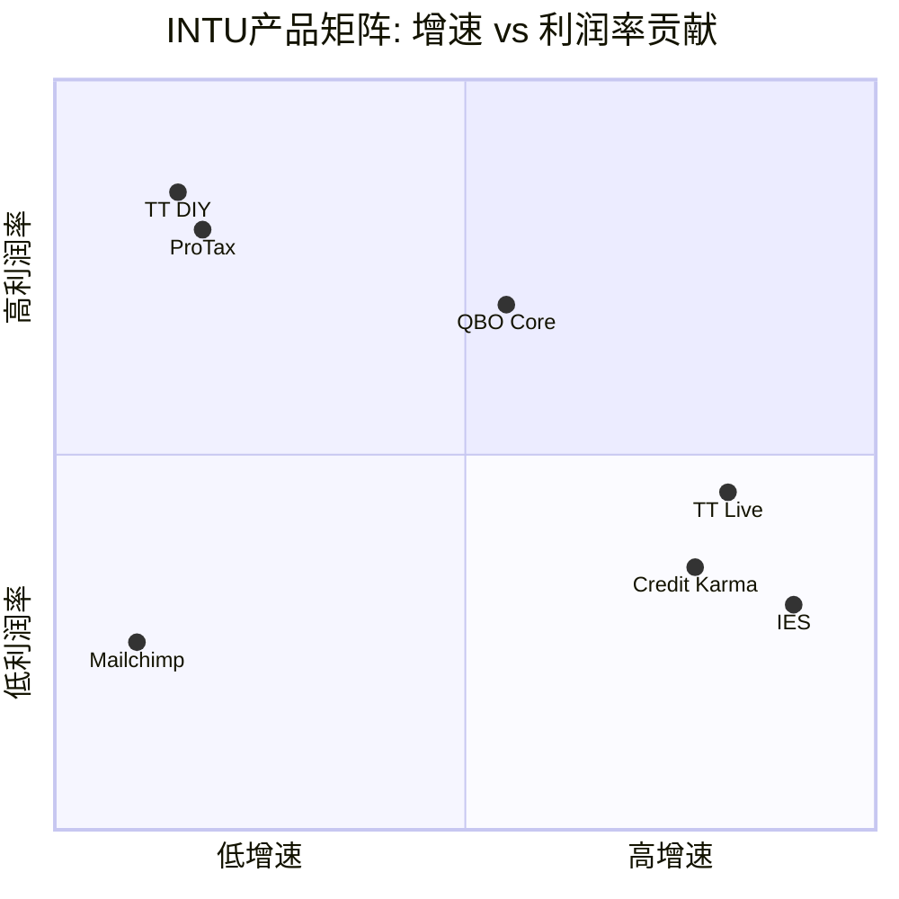

**读图说明**: 右上象限(高增速+高利润率)为空白——INTU当前没有同时满足两个条件的产品。TT DIY/ProTax是高利润但低增速的"现金牛"；CK/IES/TT Live是高增速但利润率待验证的"增长期权"；Mailchimp落在左下角(低增速+低利润率)，是唯一的价值拖累。

---

## 二、估值与财务 (4个)

### 图5: PE历史估值带

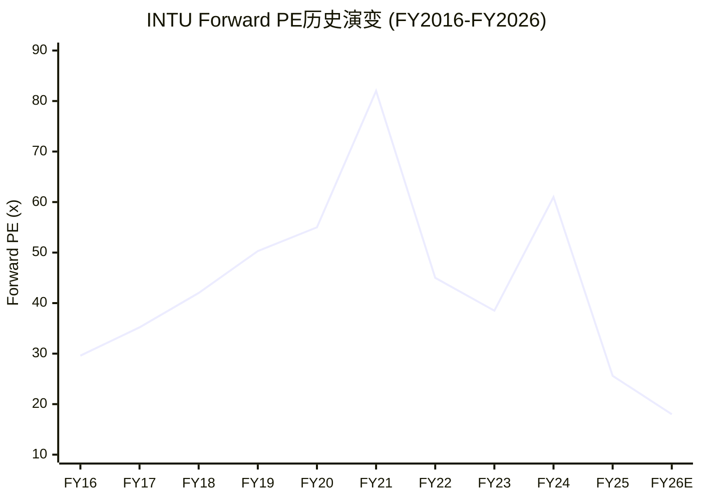

**读图说明**: INTU PE经历了三个regime: FY2016-2019的稳步扩张(29x→50x，云转型溢价)、FY2020-2021的泡沫峰值(82x)、FY2022至今的持续压缩(82x→18x)。当前18x forward PE是10年最低，处于第1百分位。10年均值48.5x，当前仅为均值的37%。关键问题: 这是均值回归的起点(如Netflix 2022)还是新常态的确认(如思科2000后)？

---

### 图6: SOTP分部估值瀑布

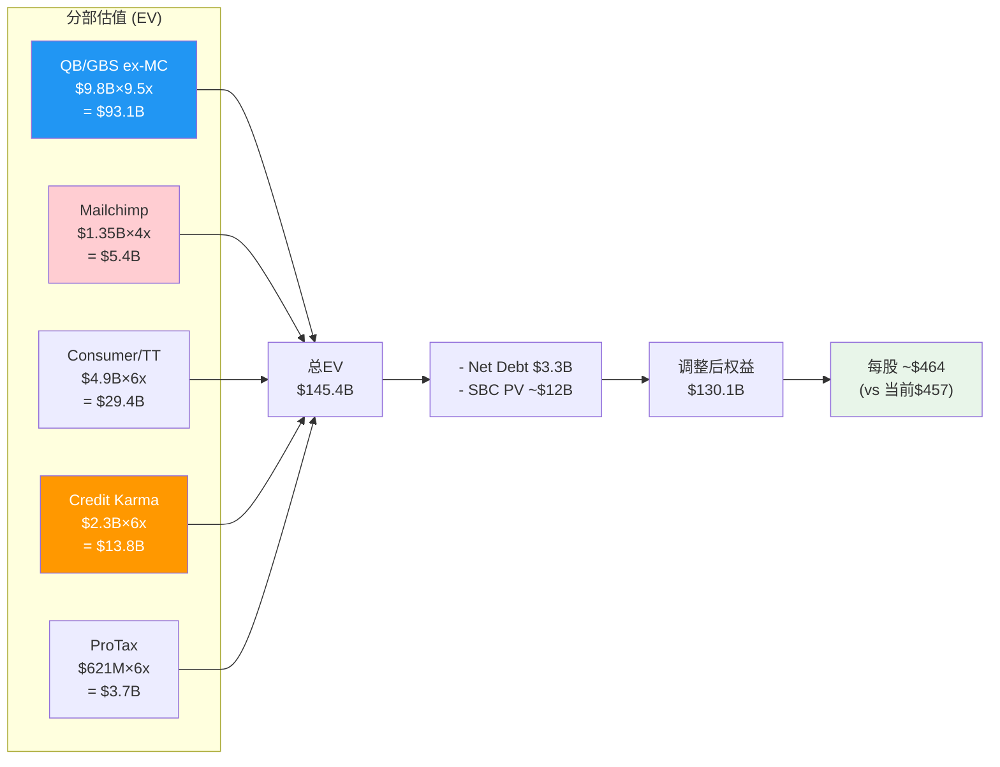

**读图说明**: SOTP估值$145.4B，扣除净债务和SBC现值后每股约$464，与当前$457基本持平。QB/GBS(ex-MC)贡献64%的总企业价值。Mailchimp仅贡献3.7%，确认了$12B收购的价值缩水。关键分歧在倍数假设: 如果CK用7x(而非6x)，每股上行约$16。

---

### 图7: 概率加权情景树

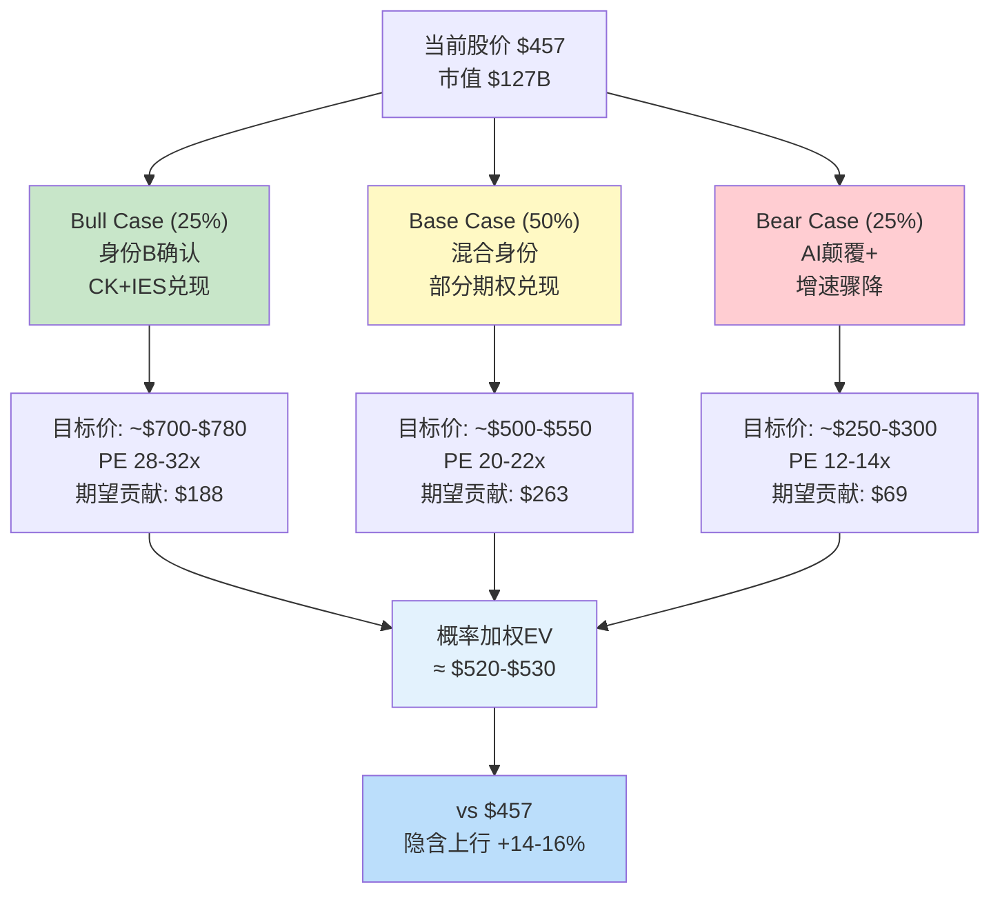

**读图说明**: 三情景概率加权后期望值约$520-530，对应+14-16%上行，处于"关注"评级区间(+10%~+30%)。但Bull和Bear的差距巨大($780 vs $250)，反映了身份定价的二元性。50% Base Case对应"部分期权兑现"——这是最可能的结果，但也是最不刺激的。

---

### 图8: FCF桥接图 (FY2025)

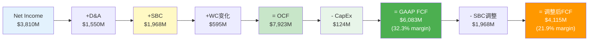

**读图说明**: GAAP FCF $6.1B(margin 32.3%)看起来优秀，但SBC $2.0B是隐性成本。扣除SBC后调整FCF仅$4.1B(margin 21.9%)——仍然健康但差距显著。CapEx仅$124M(占收入0.66%)是极致轻资产模型的证据。WC正贡献$595M主要来自递延收入增长。

---

## 三、护城河与竞争 (4个)

### 图9: 护城河四维评分

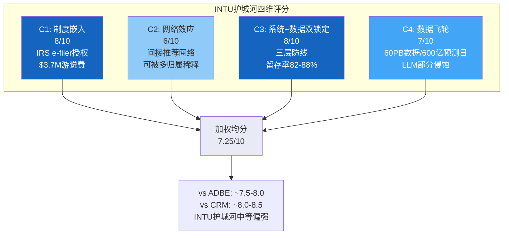

**读图说明**: C1(制度嵌入)和C3(系统锁定)最强(8/10)，构成INTU护城河的核心支柱。C2(网络效应)最弱(6/10)，因为INTU的网络效应是间接的推荐网络而非直接的用户间网络效应。整体7.25/10意味着护城河"中等偏强但非不可攻破"——AI是最大的潜在侵蚀力量。

---

### 图10: 飞轮正反力量对比

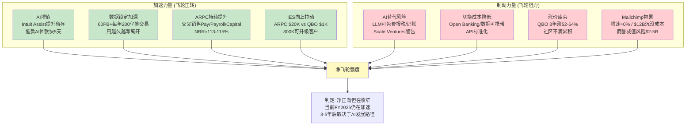

**读图说明**: 加速力量(AI增值+数据锁定+ARPC提升+IES上拉)当前强于制动力量，证据是FY2025收入+16%且加速。但制动力量在长期可能加强——特别是AI替代(B1)和切换成本降低(B2)两个趋势性风险。飞轮悖论检测: GenOS成功→免费报税可能→TurboTax$4.9B收入受威胁，但当前净效应为正(AI数据访问权优势>模型能力威胁)。

---

### 图11: 定价权分层评估

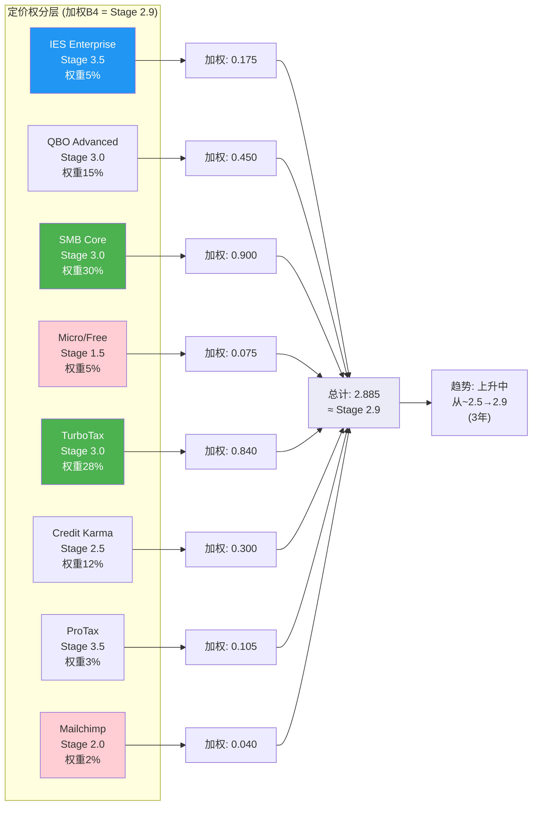

**读图说明**: 加权定价权Stage 2.9(接近Stage 3 = 超通胀提价能力)。核心产品QBO/TurboTax均为Stage 3，支撑超通胀提价。IES/ProTax达Stage 3.5，但权重小。Micro和Mailchimp拉低均值。定价权剪刀差存在: IES高端加强($20K ARPC) + Micro低端无定价权→OPM因客户结构优化而上升。vs ADBE(Stage 3.0-3.5)，INTU定价权略低，与OPM差距(26% vs 36%)一致。

---

### 图12: 竞争定位对比(PE vs 增速)

```mermaid
xychart-beta
    title "INTU vs 可比公司: Forward PE vs 收入增速"
    x-axis "收入增速 (%)" [5, 10, 15, 20, 25, 30, 35]
    y-axis "Forward PE (x)" 10 --> 30
    line "INTU" [18]
    line "ADBE" [14.4]
    line "CRM" [25]
    line "HRB" [12]
```

**读图说明**: INTU(18x PE, +12-13%增速)处于ADBE(14.4x, +12%)和CRM(25x, +12%)之间。关键洞察: INTU与ADBE增速几乎相同但PE高25%——溢价来自CK/IES增长期权。CRM的25x PE代表"金融平台身份B"的估值天花板。HRB(12x)代表"纯税务软件"的估值地板。INTU当前定价更接近ADBE(身份A)而非CRM(身份B)。

---

## 四、分析框架 (3个)

### 图13: CQ核心问题置信度演化

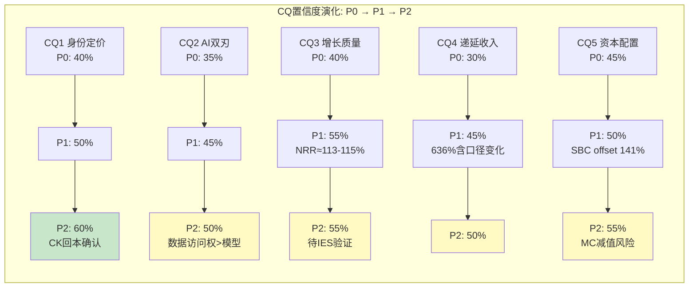

**读图说明**: 五个CQ中，CQ1(身份定价)置信度提升最快(40%→60%)，因为P2的CK深潜确认了收购回本。CQ2(AI双刃)提升最慢(35%→50%)，反映了AI影响的根本不确定性。所有CQ在P2结束时均未达到70%+的高置信度——这意味着P3/P4仍有重要工作，报告不能在P2阶段就给出强烈的方向性结论。

---

### 图14: 承重墙联合概率分析

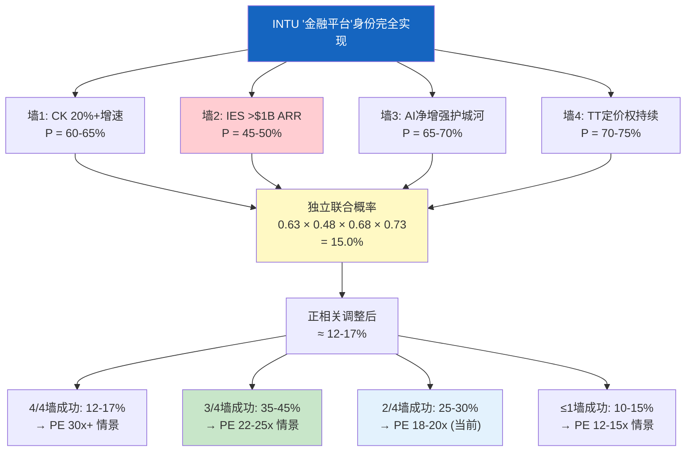

**读图说明**: "金融平台"身份完全实现(4/4墙)的概率仅12-17%。墙2(IES突破$1B)是最薄弱的一面(45-50%)，因为INTU缺乏企业销售基因。最可能的结果是3/4墙成功(35-45%)，对应PE 22-25x，隐含上行20-40%。当前18x PE大致定价了"2/4墙成功"的情景——如果投资者认为3/4墙更可能，则当前价格低估。

---

### 图15: DuPont ROE分解树

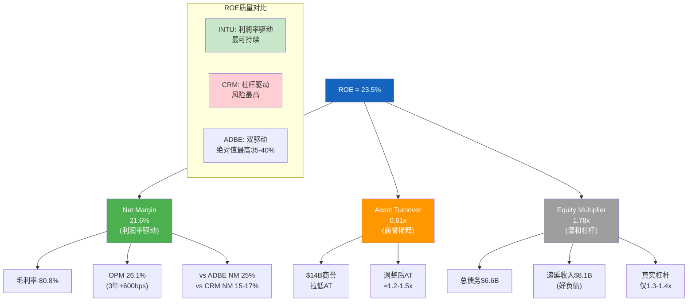

**读图说明**: ROE 23.5%主要由净利润率(21.6%)驱动，这是最健康的ROE结构——不依赖加杠杆或资产膨胀。AT仅0.61x是因为$14B商誉(Mailchimp+CK收购)稀释了资产周转效率，调整后约1.2-1.5x更接近真实水平。EM 1.78x中相当部分来自递延收入$8.1B(客户预付而非借款)，真实财务杠杆仅1.3-1.4x，非常保守。与CRM的杠杆驱动ROE相比，INTU在经济下行时韧性更强。

---

## 图表统计

| 类别 | 图表数 | 编号 |
|------|--------|------|
| 业务架构 | 4 | 图1-4 |
| 估值与财务 | 4 | 图5-8 |
| 护城河与竞争 | 4 | 图9-12 |
| 分析框架 | 3 | 图13-15 |
| **总计** | **15** | — |

> **嵌入指引**: 图1-4嵌入业务理解章节(Ch3/Ch4)，图5-8嵌入估值章节(Ch1/Ch6)，图9-12嵌入护城河与竞争章节(Ch11/Ch-B4)，图13-15嵌入分析框架章节(Ch9/Ch6)。与P2已有的8个Mermaid图合计达23个，Phase 3/4再补2-3个即可满足G4≥25门控。
