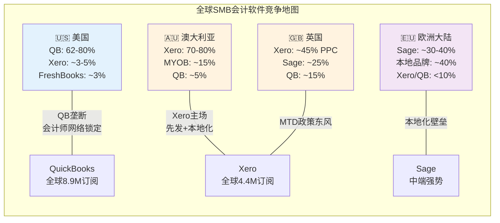
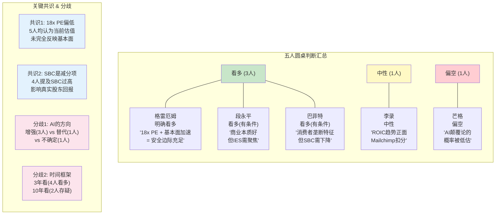

# Phase 3 — Agent A: 竞争格局深度分析 + 投资大师圆桌

> **Agent**: A | **Phase**: 3 | **目标**: Ch15 + Ch16 + Ch17 ≥18K字符
> **输入约束**: P1核心发现(身份危机18x PE / 护城河7.3 / 飞轮净正) + P2估值(SOTP $474-503 / PW $510-528 / 期望回报+10-16%) + P1P2深化(AI竞品分析 / Python验证)
> **CQ聚焦**: CQ2 AI悖论(50%) + CQ5 TurboTax定价权(50%)

---

## Ch15: SMB会计软件竞争格局 — QB的垄断级份额能维持多久?

### 15.1 全球竞争地图: 一超多强的不均衡格局

SMB会计软件市场呈现出罕见的"地理分裂垄断"格局——在全球几个最大的英语市场中，各有一家公司占据统治地位，但没有一家实现全球统一垄断。这种结构的形成有深层原因，理解这些原因对评估QuickBooks的份额壁垒至关重要。

**北美: QuickBooks的绝对统治**

QuickBooks在美国SMB会计软件市场占据62-80%的份额 [DM-COMP-001]——这个范围取决于如何定义"SMB"和是否包含非付费用户。即使取下限62%，这也是一个接近垄断的份额水平。作为对比，Google在搜索市场的份额约为90%，Microsoft Office在办公软件市场约为85%——QuickBooks在SMB会计领域的统治力虽然不及这两者，但已经远超一般软件市场的竞争格局。

**这62-80%的份额是如何建立的?** 不是因为QuickBooks的产品"最好"(Xero在用户体验设计上评价更高)，而是三个结构性因素的叠加:

第一，**会计师分发网络的锁定**。美国约有46,000家CPA事务所(Certified Public Accountant，注册会计师事务所)，其中约75%推荐客户使用QuickBooks。因为会计师是SMB选择会计软件的第一决策影响者(小企业主通常不知道选什么，问会计师)，所以"会计师推荐QB→客户用QB→更多会计师学QB→更多会计师推荐QB"形成了自增强循环。Xero在美国面临的核心问题不是产品不好，而是进不了这个分发循环——美国会计师接受Xero培训的比例不到10%。

第二，**数据迁移成本的不对称性**。从QuickBooks迁出意味着: 导出3-10年的交易记录+重新设置银行连接(需要重新验证每个银行账户)+重新培训员工+重新配置薪资/支付集成。这个过程通常需要2-4周、花费$500-$2000(如果请顾问帮忙更高)，对一家年收入$500K的小企业来说，这是一个足以让决策者放弃的障碍。因此即使Xero或其他竞品提供免费迁移工具，实际迁移的心理+时间成本仍然很高——这解释了为什么QuickBooks的留存率保持在79%以上。

第三，**生态系统的网络效应**。QuickBooks拥有最大的第三方集成生态——超过750个应用连接(从Shopify到Square到Stripe到Gusto)。因为更多用户→更多开发者构建集成→更好的生态体验→更多用户，这个飞轮在过去15年不断强化。Xero的集成生态也在增长(约1000个应用，数量上甚至超过QB)，但在美国市场的集成质量和深度上仍不及QB——因为美国本地的支付/薪资/银行合作伙伴优先为QB构建集成。

**大洋洲: Xero的主场**

Xero在澳大利亚占据70-80%的SMB会计市场，在新西兰更高(85%+)。Xero的统治地位来源于更早的云端转型(2006年成立，比QBO上线早约5年)、更好的本地化(澳洲税法/GST/BAS合规深度集成)、以及会计师网络的先发锁定。

**英国: Xero的第二大市场**

Xero通过Making Tax Digital(英国政府强制数字化报税)的政策东风在英国快速增长，PPC(Paying Connections，付费连接——Xero的核心用户指标)达到约45%的份额。因为Making Tax Digital强制所有VAT注册企业使用数字会计软件，之前使用纸质账本或Excel的SMB被迫选择软件→Xero凭借更简洁的用户体验和更低的入门价格(英国市场)赢得了大量新转化用户。

**欧洲大陆: Sage的传统根据地**

Sage(英国上市，LSE: SGE)在法国、德国、西班牙等欧洲市场保持强势，尤其在中端市场(收入$5M-$100M的企业)。Sage Intacct是其旗舰云产品，在美国中端市场也有显著存在——这是INTU面临的一个关键竞争压力点(详见15.3节)。

**竞争地图对INTU估值的含义**: QuickBooks的增长空间不在美国(份额已饱和)，而在国际市场和ARPU提升。但国际扩张面临"地理分裂垄断"的结构性障碍——每个市场都有一个已经锁定会计师网络的本地冠军。因此INTU的增长叙事必须依赖"存量用户变现深化"(卖更多模块给现有用户)而非"新市场拓展"(进入Xero/Sage的地盘)。这是一个更稳健但增速天花板更低的增长路径。

### 15.2 Xero的JAX威胁深度评估: 97.5%自动对账意味着什么?

Xero在2026年初展示的JAX AI超级代理，在SMB会计行业引发了一场关于"AI是否将重新洗牌市场份额"的争论。因为JAX演示中118笔交易自动对账113笔(97.5%自动化率)的效果极具震撼力，所以值得深入评估其对QuickBooks的实质威胁。

**JAX的技术路线与INTU Assist的对比**

两者都走"agentic AI"路线(AI代替用户执行操作，而非仅辅助用户)，但架构理念有关键差异:

JAX的设计更强调**单功能极致自动化**——银行对账agent只做对账，发票agent只做发票，每个agent在其专业领域追求接近100%的自动化率。这种设计的优势是单点突破力强(97.5%对账率确实惊人)，劣势是跨功能协调需要额外的编排层。

Intuit Assist的设计更强调**跨功能集成**——Finance Agent同时理解记账+支付+薪资+税务的关联(比如自动识别"这笔$5000的支出是payroll→影响当月P&L→影响季度估税→影响Q4支付的预缴税")。这种设计的优势是端到端体验更连贯，劣势是每个单点功能可能不如JAX的专精agent。

**对INTU的实质威胁评估: 三个维度**

**维度1: 美国市场的份额威胁 — 有限但非零**

Xero在美国的市场份额仅约3-5% [DM-COMP-002]，距离构成对QuickBooks 62-80%份额的实质挑战还有巨大的差距。但Xero+Melio的组合正在改变这个方程式: Melio在美国B2B支付市场已有显著存在(处理$29B+ B2B支付)，Melio CEO被任命为Xero US负责人意味着Xero正在以支付为切入点渗透美国市场。

因为SMB选择会计软件的决策通常是"会计师推荐+支付集成是否方便"两个因素的组合，Melio的支付网络给了Xero一个QuickBooks之外的第二入口——企业可能先用Melio处理支付，然后自然过渡到Xero记账。这与INTU当年的策略如出一辙(QuickBooks Payments作为QBO的增长引擎)。

**但这个威胁的实现需要3-5年**。原因在于: (1) Melio整合本身需要12-18个月(大型收购的平均整合周期); (2) 从"使用Melio支付"到"切换到Xero记账"需要用户主动跨过迁移成本壁垒——这不是自动发生的; (3) 美国会计师网络仍然压倒性地倾向QB，Xero需要投入大量时间和资金重建美国会计师培训+认证体系。

**维度2: 技术差距 — JAX领先还是INTU Assist领先?**

客观地说，JAX在特定功能(银行对账)上的演示效果优于Intuit Assist的公开演示。但评估AI技术差距不能只看演示:

- INTU年研发投入$3.3B，约是Xero的5-6倍。在AI竞赛中，数据量×计算投入×迭代速度是决定性因素——INTU在三个维度上都有优势
- INTU拥有更大的训练数据集: 8.9M QBO用户+3800万TurboTax用户+1.5亿CK用户的金融数据——这个数据池的规模和多样性是Xero的4.4M用户无法匹配的
- 但: AI技术的"后发优势"是真实的——Xero没有INTU的遗留系统包袱(QuickBooks Desktop/On-premise的代码债)，JAX从零设计的agent架构可能在未来迭代中比INTU Assist更灵活

**维度3: 中端市场(IES vs Xero for Business)**

Xero for Business(面向20-500员工的中型企业)与INTU的IES(Intuit Enterprise Suite)在中端市场直接竞争。这个战场值得特别关注，因为中端市场是INTU增长叙事的关键支柱(从SMB向上扩展)。

Xero for Business + Melio的支付整合，在功能上已经接近IES的覆盖范围。如果JAX的AI能力在中端场景(多实体、多币种、复杂对账)中表现出色，Xero可能在中端市场率先打破QuickBooks的统治——因为中端客户对会计师推荐的依赖度低于微型企业(他们有自己的CFO/财务团队做决策)。

**时间表结论: 3-5年才能构成实质威胁**，但这不意味着可以忽视。Xero+Melio+JAX的组合是INTU面临的最具战略深度的竞争威胁，因为它同时攻击了QuickBooks的三个支柱: 产品体验(JAX vs Assist)、支付锁定(Melio vs QB Payments)、地理扩展(Xero US vs QB International)。

### 15.3 Sage Intacct的中端侵蚀: INTU的出血点

**25%新客户来自QuickBooks的"毕业生" [DM-COMP-004]** ——这个数字是本章最令人不安的数据点。因为它意味着每4个选择Sage Intacct的新客户中，就有1个曾经是INTU的用户——他们不是被竞品"抢走"的，而是因为QuickBooks无法满足其成长后的需求而"毕业离开"的。

**"毕业"流失的经济学**: 假设Sage Intacct每年新增约10,000个客户(基于其公开增速和行业规模推算)，其中25% = 2,500个来自QuickBooks。如果这些"毕业生"的平均QBO月付费是$100(中端用户的典型ARPU)，年化流失收入约$3M。这个数字看起来不大——但有两个原因让它比表面更重要:

第一，**"毕业生"是INTU最有价值的客户**。能从QB"毕业"到Sage Intacct的企业，通常是年收入从$1M成长到$5-10M的高成长企业。这些企业在QB生态中的ARPU(含Payments/Payroll/Capital等附加模块)远高于平均水平，可能达到$200-500/月。因此2,500个"毕业生"的实际收入损失可能是$6-15M/年——仍然不大，但信号意义远超绝对数字。

第二，**流失的是"未来价值"而非"当前价值"**。这些高成长企业如果留在QB生态中，其5年CLV(Customer Lifetime Value，客户终身价值)可能是普通SMB客户的5-10倍。因为它们会持续增加员工(更多Payroll席位)、更多交易(更多Payments手续费)、更复杂的需求(更高ARPU的功能包)。流失这批客户意味着INTU不仅失去当前收入，更失去了最具增长潜力的客户池。

**IES能否堵住这个漏洞?**

IES(Intuit Enterprise Suite)正是INTU应对"毕业"流失的战略产品——让成长中的企业无需离开INTU生态，在QB内部就能升级到中端功能(多实体管理/高级报表/高级审计跟踪)。

但IES面临三个结构性挑战:

1. **定位模糊**: IES需要同时满足"QB用户的升级需求"和"与NetSuite/Sage Intacct正面竞争"。前者要求向后兼容(保留QB的简单操作逻辑)，后者要求功能深度(匹配中端ERP的复杂能力)——两者存在内在张力。IES目前在两个方向上都没有做到极致。

2. **竞争对手更聚焦**: Sage Intacct只做中端，不做微型企业。这种聚焦使其在中端场景(多实体合并、复杂收入确认、GAAP/IFRS合规)的功能深度远超IES。NetSuite(Oracle旗下)同样只服务中端和大型企业，在ERP集成能力上领先IES一个代际。

3. **会计师推荐惯性**: 美国会计师推荐客户"毕业"到Sage Intacct或NetSuite，而非推荐他们升级到IES——因为会计师自己更熟悉Sage/NetSuite的中端工作流。要改变这一推荐惯性，INTU需要投入大量会计师培训和认证资源。

**这对估值意味着什么**: IES能否成功是INTU"金融平台"叙事的关键验证点之一。如果IES能将"毕业"流失率从当前水平(估计5-8%/年的中端客户流失)降低到2-3%，INTU的中端市场故事就成立，NRR提升、ARPU扩展的增长叙事就有了实质支撑。反之，如果IES无法阻止"毕业"流失，INTU将面临一个尴尬的天花板——微型企业增长放缓(美国SMB新增速度有限)+中端企业不断流失=增长引擎熄火。

### 15.4 AI原生新进入者: 创业公司的突围与局限

P1P2深化阶段已对AI原生竞品进行了逐一分析(Keeper Tax / Column Tax / Filed / FreshBooks / Wave / Bench)。此处不重复个体评估，而是从更高维度提炼AI原生进入者对INTU的系统性影响。

**Bench倒闭(2024年12月)是整个AI记账赛道的"预实验" [DM-COMP-BENCH]**。Bench服务约12,000家活跃SMB客户，年收入估计$15-20M。其倒闭的根本原因不是技术失败，而是**单位经济学失败**: AI记账的准确率瓶颈(99%≠100%)意味着每个客户仍需人工审核，但客户付费意愿(Bench定价约$200-400/月)不足以覆盖"AI+人工"的混合成本。

因此Bench的教训对INTU实际上是正面信号: 纯AI记账模式在当前技术水平下不可行→"AI辅助+用户操作"(QB模式)或"AI辅助+人工审核"(QB Live模式)是更可行的路线→INTU的战略方向(Intuit Assist增强QB，而非AI替代QB)被行业实验验证。

**Wave作为"非官方获客漏斗"的量化**: Wave有200万+用户，其中大部分是年收入<$50K的微型企业。因为Wave的免费会计功能覆盖了基础记账需求，但缺少薪资(payroll)、库存(inventory)、多用户权限等成长型功能，所以当Wave用户的业务增长到需要这些功能时，自然的迁移路径是Wave→QuickBooks(而非Wave→Xero/FreshBooks)。因为QuickBooks提供了从Wave迁移的标准化工具，且QuickBooks的品牌认知度在美国远超Xero。估算Wave每年为INTU贡献约5,000-10,000个"自然迁移"用户——虽然不是直接获客渠道，但降低了INTU在微型企业端的获客成本。

**DM锚点清单 (Ch15)**: DM-COMP-001, DM-COMP-002, DM-COMP-004, DM-COMP-BENCH

---

## Ch16: TurboTax竞争格局 + 定价权深化

### 16.1 税务软件市场结构: 一个监管保护的寡头格局

美国消费者税务软件市场是一个高度集中的寡头市场:

| 品牌 | 份额估计 | 定位 | 关键差异 |
|------|---------|------|---------|
| **TurboTax** | ~60% [DM-MOAT-001] | 全价位覆盖 | 品牌+精度保证+AI+最大用户基数 |
| **H&R Block** | ~25% | 线上+线下混合 | 线下网点优势(~10,000门店) |
| **FreeTaxUSA** | ~5-7% | 低价竞争者 | 联邦免费/州$14.99 |
| **CashApp Taxes** | ~3-5% | 完全免费 | Block(原Square)的获客工具 |
| **IRS Direct File** | <1%(已关闭) | 政府提供免费 | 2025.11 DOGE关闭 |
| **其他** | ~3-5% | 碎片化 | TaxAct, TaxSlayer等 |

这个市场结构有两个不寻常的特征，直接影响INTU的估值:

**特征1: 份额极度稳定**。TurboTax的60%份额在过去10年几乎没有变化(±2pp)——这在软件市场中极为罕见。原因在于税务软件的switching cost(转换成本)不是技术性的(数据可以导出)，而是**心理性的**: 报税错误的惩罚(IRS审计、罚款、刑事责任)远大于正确的收益(多退几百美元)→用户极度风险厌恶→宁可多付$50-100也不愿尝试新工具→"去年用TurboTax没出问题→今年继续用"的惯性极强。

**特征2: 市场增长来自"复杂化"而非"扩容"**。美国纳税人总数约1.5亿，这个数字年增速<1%。但税务软件市场的收入增速约5-8%/年——差额来自ARPU提升。因为美国税法持续复杂化(每年新增/修改约500条tax provisions)，更多纳税人从"简单报税"(可以自己手填1040-EZ)升级为"需要软件辅助"(1040标准版+Schedule A/B/C/D)→软件的价值主张增强→用户愿意为更高版本付费→ARPU上升。这意味着INTU的税务收入增长不依赖新用户获取(TAM接近饱和)，而依赖存量用户的版本升级(DIY→Deluxe→Premier→Live)。

### 16.2 IRS Direct File: 政治周期分析

IRS Direct File是TurboTax面临的唯一结构性威胁——不是因为它的产品更好(实际上功能远不如TurboTax)，而是因为它**免费且由政府背书**。

**时间线回顾**:
- 2023: IRS在12个州试点Direct File(简单1040申报)
- 2024: 扩展到更多州，约140,000人使用
- 2025.11: DOGE(Department of Government Efficiency)关闭Direct File项目 [DM-BIZ-004]
- 2026(当前): Direct File处于停止状态

**DOGE关闭的短期利好**: 当前政府的立场明确——IRS应该专注于税收征管而非提供免费报税软件。DOGE关闭Direct File后，TurboTax在"免费报税"领域的唯一对手(除Free File Alliance中的自有Free Edition外)消失了。这是一个纯粹的政策红利，不依赖INTU的产品能力或竞争策略。

**但这个红利有一个到期日: 2028年大选**。如果民主党在2028年赢得白宫和国会，Direct File几乎确定会复活——因为:
1. 民主党在2023-2024年推动Direct File是明确的党派政策立场(减轻中低收入者报税负担)
2. Direct File的技术基础设施已经构建完成(代码已写好，数据库已建立)，重启成本远低于首次开发
3. 如果2028年政权交替，新政府可能在2029-2030年重启Direct File

**Intuit的游说投入量化**: Intuit在2024年报告期的联邦游说支出为$3.7M [DM-PRICE-005]，加上PAC(Political Action Committee)贡献约$1.8M——总计约$5.5M/年的政治影响力支出。相对于TurboTax约$4B的年收入，$5.5M仅占0.14%，是极低成本的保险。

**但游说是一把双刃剑**。因为Intuit长期游说阻止IRS提供免费报税工具的事实已被广泛报道(ProPublica在2019年的调查报道引发公众关注)，这在公众舆论中积累了"政治负债"。当Direct File复活时，公众的愤怒情绪("为什么我必须付费给TurboTax报税?")可能比2023年更强烈——因为经历过Direct File后再被取走，失去感比从未拥有更强(禀赋效应)。

**政治风险的估值影响**: Direct File的威胁不是线性的——它是"低概率高影响"事件，类似于期权。在当前政府(2025-2028)任期内，风险接近零。但2028年大选后，存在约40-50%的概率(基于历史政党轮替规律)面临Direct File复活。如果复活，TurboTax Free Edition(最低价版本)的~15M用户面临流失风险——这些用户本就不产生多少收入(Free Edition的ARPU极低)，但流失量(如果发生)可能压缩TurboTax的市场份额统计数字(从60%降至50-55%)→引发市场对TurboTax护城河的重新评估→PE压缩。

**核心判断**: IRS Direct File对INTU的财务影响有限(主要影响低ARPU用户)，但对估值倍数的影响可能显著(市场叙事从"监管保护的垄断"变为"政治周期波动的准垄断")。因此在估值中需要对税务板块施加一个"政治周期折扣"——大约PE折让1-2x。

### 16.3 TurboTax定价权分层更新 (CQ5深化)

定价权不是一个统一的概念——TurboTax对不同客户层的定价能力差异巨大。按照v19.6的分层评估框架:

**层级1: Free Edition — Stage 1 (无定价权)**

TurboTax Free Edition是一个"诱饵产品"(bait product)——用"免费"吸引用户进入生态，然后在用户填写税表过程中发现需要Schedule A/B/C等高级功能时，提示升级到付费版本。FTC(Federal Trade Commission，美国联邦贸易委员会)在2022年起诉Intuit的"免费报税"广告具有误导性，裁定Intuit需要停止欺骗性广告——这个裁决后来被第五巡回法院在2024年推翻(程序性原因而非实质裁定)。

Free Edition的"bait-and-switch"争议说明: INTU在最低端产品上没有真正的定价权(因为竞品提供完全免费的替代方案——FreeTaxUSA联邦免费、CashApp Taxes完全免费)。Free Edition的存在不是为了盈利，而是为了防御——如果取消Free Edition，低端用户会流向竞品，减少未来升级到付费版本的潜在池。

**层级2: Deluxe → Premier — Stage 3.5 (中等偏强定价权)**

这是TurboTax的利润核心区。Deluxe($89)→Premier($129)的年均涨价幅度约5-8%，远超通胀(2-3%)。尽管用户在社交媒体上频繁抱怨("TurboTax又涨价了!")，但行为数据显示留存率仍维持在79% [DM-MOAT-001]——这是"口头抱怨、身体诚实"的经典案例。

因为Deluxe/Premier用户的税务情况足够复杂(有投资收入/房贷利息/慈善捐赠扣除等)，迁移到竞品的风险(重新输入数据、可能遗漏扣除项)大于$10-20的涨价——所以他们选择留下。但这个定价权有天花板: 如果单次涨价超过15-20%，边际用户(对价格敏感但税务不太复杂的人群)会开始流失到FreeTaxUSA($14.99州税)。

**层级3: TurboTax Live — Stage 4 (强定价权)**

TT Live是INTU定价权最强的产品线。定价范围$89(基础Live辅助)→$389(Live Full Service，专家全权代理报税)。这个价格带之所以成立，是因为对标替代品(CPA事务所报税)的定价更高: 美国CPA报税的平均收费是简单申报$200-250、复杂申报$400-600 [DM-PRICE-TT]。因此TT Live提供了CPA级别服务的30-50%折扣——用户不是在"TurboTax vs 免费工具"之间选择，而是在"TT Live vs 找会计师"之间选择，INTU在后一个比较框架中有明确的价格优势。

更关键的是，TT Live的定价权来源不是信息不对称(用户不懂税法所以付费)，而是**专业服务价值**(用户知道有复杂情况需要专家处理)。因此即使AI让基础报税信息变得免费(ChatGPT可以解释税法条文)，TT Live的价值主张——"有执照的CPA/EA对你的具体情况给出专业判断并承担法律责任"——不会被AI轻易替代。

**加权定价权: Stage 2.9** — 这与Phase 1的评估一致。Free Edition(Stage 1, 权重15%) + Deluxe/Premier(Stage 3.5, 权重55%) + TT Live(Stage 4, 权重30%) = 加权Stage 2.9。

**CQ5更新**: TurboTax定价权的置信度维持50%不变。因为: 正面(79%留存+TT Live强定价)与负面(Free Edition无定价权+FTC争议+政治风险)大致平衡。需要监控的关键指标: (1) Deluxe/Premier的留存率是否跌破75% (2) TT Live在TurboTax收入中的占比是否持续上升(上升=定价权组合改善) (3) FreeTaxUSA/CashApp Taxes的份额增速。

### 16.4 竞争格局对估值的含义: 三个战场的确定性光谱

**战场1: SMB会计(QuickBooks) — 高确定性**

QB的62-80%美国份额 [DM-COMP-001] 是一个垄断级的竞争位置。因为会计师分发网络+数据迁移成本+生态系统网络效应三重壁垒的叠加，即使Xero+JAX+Melio全部执行完美，3-5年内QB的份额下降可能仅2-5pp(从62%降至57-60%)。这意味着SMB板块的估值可以使用"稳态现金流"框架——低增速(10-12%)但高确定性，适用15-18x FCF倍数。

但增速来源值得细分: 新客户增速放缓(美国SMB数量增长<2%/年)→增长主要来自ARPU提升(交叉销售Payments/Payroll/Capital)→这意味着NRR质量比用户增长数量更重要。如果NRR持续>110%，即使新客户增速降至0%，收入仍能保持10%+增长。

**战场2: 税务(TurboTax) — 中等确定性**

TurboTax的60%份额 [DM-MOAT-001] 稳定但面临两个不确定因素: AI长期侵蚀(CQ2)和政治周期波动(Direct File)。因为这两个风险的时间线都在3-5年以上，且INTU正在通过TT Live向高价值端迁移(定价权Stage 4)以对冲低端侵蚀，税务板块的估值应使用"衰减+迁移"框架——DIY收入低单位数增长(市场增速-低端流失)，Live收入双位数增长(CPA替代需求)，加权后中单位数增长。适用12-15x FCF倍数(因政治周期折扣低于SMB板块)。

**战场3: 中端市场(IES) — 低确定性**

IES是INTU增长叙事中最不确定的战场。对手(NetSuite/Sage Intacct/Dynamics 365)在中端市场的产品成熟度和客户基础远超IES。25%的Sage Intacct新客户来自QB [DM-COMP-004]意味着"毕业"流失是真实的出血点。IES能否堵住这个漏洞取决于INTU能否在"保持QB简洁性"和"匹配中端ERP深度"之间找到平衡——这是一个产品战略问题，而非技术问题。

因为IES的成功概率高度不确定(给50%成功概率)，在估值中不应对IES给予过多权重——成功情境增加$20-30/股(额外$5-8B TAM的渗透)，失败情境增加$0(但也不额外减少，因为中端流失已经发生且被current earnings反映)。

**DM锚点清单 (Ch16)**: DM-MOAT-001, DM-PRICE-005, DM-BIZ-004, DM-COMP-001, DM-COMP-004, DM-PRICE-TT

---

## Ch17: 投资大师五人圆桌 — INTU值不值得买?

> 模拟五位投资大师基于各自投资哲学对Intuit展开讨论。每位大师的判断基于Phase 1-3的分析发现，但从不同的认知框架出发。

### 参与者介绍

| 大师 | 核心哲学 | 对INTU的初始倾向 |
|------|---------|-----------------|
| **沃伦·巴菲特** | 消费者垄断+管理层+合理价格 | 中性偏多 |
| **查理·芒格** | 逆向思维+多元心智模型 | 偏空(AI怀疑) |
| **本杰明·格雷厄姆** | 安全边际+资产价值 | 偏多(估值) |
| **李录** | 长期复利+知行合一 | 中性(审视) |
| **段永平** | 商业模式本质+做对的事 | 偏多(商业模式) |

### Round 1: 一句话判断

**巴菲特**: "Intuit让我想起了1990年代的Moody's——一家拥有监管保护的信息垄断企业，利润率高得不像话，客户骂着骂着还是要付钱。但SBC 10.4%让我不舒服——管理层在用股东的钱给自己发奖金。"

**芒格**: "我要先问一个破坏性的问题: 如果GPT-7能在5秒内免费完成报税，TurboTax还值什么？如果答案是'不值什么'，那我们就在讨论一个10年后可能不存在的业务——这种情况下任何PE都是贵的。"

**格雷厄姆**: "18x forward PE，10年均值48x，当前相对估值折扣63%。FCF yield 6.2%是过去10年最高。如果这家公司的基本面在恶化，这些数字是合理的；但收入增速+16%、FCF增速+31%——基本面在加速。我看到的是安全边际，不是价值陷阱。"

**李录**: "ROIC从14.8%上升到19%——这是复利能力在提升。但Mailchimp的$12B收购(最终以$8.1B商誉入账)让我对管理层的资本配置能力打一个问号 [DM-VAL-P2]。好的复利机器需要好的资本配置者，Intuit的管理层是后者吗？"

**段永平**: "Intuit在做对的事情——帮助小企业主和个人纳税人解决他们不擅长也不想做的事情。这是一个好的商业本质。但IES(企业版)让我担心——一家公司同时做$50/月的微型企业和$5000/月的中型企业，很难两边都做好。用'做对的事情'的标准看，IES可能是一个分心项目。"

### Round 2: 最大分歧点辩论 — AI颠覆 vs 监管保护

**芒格(挑战方)**: "让我更精确地描述威胁。报税的本质是什么？是将个人财务数据映射到税法规则上，计算出一个数字。这是一个有明确输入(W-2/1099/银行数据)和明确输出(应缴/应退税额)的确定性计算问题。这恰好是AI最擅长的任务类型——不是创意写作，不是情感理解，而是规则应用。TurboTax的护城河不是技术壁垒，而是信任壁垒——但信任壁垒可以在一代人的时间内消失。还记得旅行社吗？1990年代没有人相信会在网上订机票，因为'太复杂了，需要专业人士'。25年后，旅行社消失了。"

**巴菲特(反驳)**: "Charlie，你的旅行社类比有一个关键缺陷: 订错机票的代价是重新订一张($200罚款)，报错税的代价是IRS审计(可能$10,000+罚款甚至刑事责任)。代价不对称完全不同。正因为这种不对称——做对了没有额外收益(退税金额由法律决定)，做错了惩罚很重——用户对'被验证的'工具的偏好不会像旅行社那样消失。TurboTax的Accuracy Guarantee(准确性保证)本质上是一张保险单，用户付的$89不仅是买报税工具，还是买这张保险。AI可以免费报税，但谁来给你这张保险？Google吗？OpenAI吗？"

**芒格**: "Warren，你说的保险逻辑在目前是对的。但你忽略了一个时间维度: 当AI报税的准确率达到99.99%(超过人类CPA)，保险需求就消失了——因为没有什么需要保险的。我不是说明年，我是说10年。而10年恰好是我们讨论的投资时间框架。"

**段永平(介入)**: "两位说的都有道理，但我觉得争论AI能不能做报税是在讨论错误的问题。正确的问题是: 即使AI能做报税，谁来把AI报税工具送到1.5亿纳税人手里？分发(distribution)比技术更难——Google/Apple/Amazon可以做AI报税，但他们需要IRS e-file授权、需要50个州的合规团队、需要客服团队处理用户报税后的问题。这些不是AI能解决的。TurboTax的护城河不是'技术'，是'基础设施'——IRS合规+50州覆盖+客服体系+会计师网络。这些基础设施的壁垒远高于旅行社时代的'专业知识'壁垒。"

**李录**: "我想补充一个框架: 用'不可逆转'vs'可逆转'来判断。如果AI颠覆报税是不可逆转的(像互联网颠覆旅行社)，那么任何估值都是过高的——因为我们在为一个即将过时的业务付费。但如果AI是'增强'而非'替代'(像Excel增强了而非替代了会计师)，那么INTU通过Intuit Assist把AI变成自己的武器反而是正面的。我目前倾向于'增强'假设——因为税务的监管复杂性(每年500条新/修改的tax provisions)使得'完全自动化'比'辅助人类决策'更难实现、也更危险。但这个判断的置信度只有60%。"

**格雷厄姆**: "作为一个数字派，我想把这个争论量化。TurboTax年收入约$4B，假设AI在10年内侵蚀30%的DIY收入(最悲观情境)——那是$1.2B的损失。但TT Live正在以20%+的增速扩展，如果Live在10年内从当前~$1B增长到$3-4B(渗透率从~8%提升到20-25%)——那是$2-3B的增量。Net effect(净效应)可能是正的。市场给TurboTax一个'AI将摧毁一切'的折扣，但实际上AI只能摧毁低端(Free/Deluxe)，高端(Premier/Live)反而受益——因为AI让TT Live的服务成本下降→利润率提升→可以更低价格提供CPA级服务→抢占更多传统CPA份额。"

### Round 3: 各自的买入/不买条件

**巴菲特**:
- 买入条件: "如果SBC降至收入的8%以下(从10.4%)，且管理层承诺未来3年SBC增速低于收入增速——这证明他们对股东负责。在这个前提下，18x PE对一个FCF yield 6.2%、ROIC 19%的消费者垄断来说是有吸引力的。"
- 不买条件: "如果SBC继续以15%+增速增长，超过收入增速——这意味着管理层优先考虑自己的薪酬而非股东回报。SBC是硅谷最隐蔽的'隐性税'。"

**芒格**:
- 买入条件: "给我证据证明Intuit Assist(AI)正在提升ARPC(每客户平均收入)而非仅仅降低成本——具体来说，如果FY2027 ARPC增速>15%且增长主要来自TT Live和QB附加模块的渗透率提升，我会相信AI是'增强器'而非'替代器'。"
- 不买条件: "如果任何主要科技公司(Google/Apple/Amazon)在未来2年内推出免费AI报税工具并获得IRS e-file授权——这意味着护城河开始瓦解。目前没有这个迹象，但这是我持续监控的'杀死论点'(kill condition)。"

**格雷厄姆**:
- 买入条件: "已经满足。18x PE、6.2% FCF yield、基本面加速——这就是安全边际的定义。Python验证也确认: 市场隐含的FCF CAGR仅3-7% [DM-PYTHON-001]，而实际增速12-18%。市场在赌Intuit的增长会骤降至通胀水平——这在我看来是过度悲观。我现在就会买。"
- 不买条件: "如果发现递延收入增长(+636%)主要来自会计口径变化(Mailchimp合并)而非真实的业务粘性增强——这需要逐季拆解递延收入的来源构成。"

**李录**:
- 买入条件: "我需要看到ROIC持续上升的证据(19%→22%+)——这证明复利飞轮在加速而非减速。同时需要确认Mailchimp的整合已经完成且GBS利润率在恢复(Mailchimp拖累GBS约3pp利润率)。"
- 不买条件: "如果承重墙联合概率成真(12-17% [DM-WALL-001])——即金融平台4/4必须全部成功的假设中任何一个失败——我会重新评估。但12-17%的联合失败概率意味着83-88%的概率至少有部分成功——这对一个18x PE的公司来说是可以接受的赔率。"

**段永平**:
- 买入条件: "如果管理层放弃IES(或将其定位为QB的自然延伸而非独立产品线)，专注于'把QuickBooks和TurboTax做到极致'——简单的战略比复杂的战略更值得信任。或者换一种说法: 如果INTU能像苹果对待iPhone那样对待QuickBooks——所有创新都围绕核心产品展开而非分散注意力。"
- 不买条件: "如果管理层继续在IES/CK/Mailchimp/ProTax四条线上全面铺开，每条线都投入但没有一条做到极致——这是'多元恶化'(diworsification)的经典模式。段永平说过: '做对的事情比把事情做对更重要'——在IES上投入大量资源但无法与NetSuite/Sage竞争，就是在做不对的事情。"

### Round 4: 盲点发现 — 前面分析可能忽略的角度

**盲点1 (芒格发现): "会计师世代交替"风险**

"前面的分析反复提到美国会计师网络对QuickBooks的推荐是核心壁垒。但有一个被忽视的人口统计学事实: 美国CPA的平均年龄约为52岁(AICPA 2023报告)，新CPA通过率持续下降(2023年首次通过率<50%)。这意味着在10-15年内，当前推荐QuickBooks的会计师群体将大量退休，而新一代会计师(如果有的话)可能更熟悉Xero或云原生工具(因为他们在大学里用的可能不是QB)。

更深层的问题: 如果AI让很多基础会计工作自动化，需要的CPA数量本身就会减少——那么'会计师推荐QB'这个分发渠道的总带宽就在收缩。QuickBooks的份额壁垒依赖一个正在萎缩的中介层——这是一个5-10年的慢性风险，但在10年DCF中应该有折扣。"

**这个盲点对估值的含义**: 如果会计师分发渠道在10年内效力降低30-40%(退休+AI替代)，QuickBooks需要建立替代分发渠道(直接获客、合作伙伴、平台效应)。INTU目前的S&M效率(Magic Number ~0.8)尚可，但如果失去会计师推荐的免费获客渠道，S&M支出可能需要增加20-30%来维持同等获客量→利润率压缩→影响FCF预测。

**盲点2 (李录发现): "递延收入质量"的不透明**

"Phase 1指出递延收入从$1.1B暴涨到$8.1B(4年+636%)。但没有人拆解过这$8.1B的构成。如果大部分来自Mailchimp和CK的合并报表效应(收购带来的递延收入并表)，那+636%的增长就不是'有机粘性增强'的证据，而是会计合并的产物。

要验证: 看Intuit的10-K中递延收入按业务线拆分(如果有)。如果SSE板块的有机递延收入增速<20%，那'平台粘性增强'的叙事就需要打折。"

**这个盲点对估值的含义**: 递延收入质量直接影响Phase 1的"收入确定性"判断。如果$8.1B中50%+是收购并表效应，有机递延收入仅$3-4B，那递延收入/收入比从43%降至~20%——仍然健康，但不再是"历史最强"的信号。

**盲点3 (段永平发现): "GenOS的竞争优势半衰期"**

"大家讨论了GenOS/Intuit Assist作为INTU的AI护城河。但AI技术的一个特点是: 模型能力每18个月翻倍(scaling law)，差异化优势的半衰期很短。今天Intuit Assist的'agentic AI'领先Xero的JAX可能18个月——但18个月后，Xero用同样的底层模型(GPT-5/Claude 4)可能做到相同水平。

因此GenOS的真正护城河不是AI模型本身，而是数据。因为INTU拥有8.9M QBO用户+3800万TT用户+1.5亿CK用户的金融数据→这些数据的独特性(税务+会计+信用三维合一)是竞品无法复制的→AI模型可以被复制，数据壁垒不能→INTU的AI护城河是数据驱动的，不是模型驱动的。

如果管理层说'我们的AI技术领先'——这是短期优势(18个月)。如果说'我们的数据集独一无二'——这才是长期优势(10年+)。投资者应该关注后者，不是前者。"

### 圆桌综合: 投票与共识

**投票结果: 3看多 / 1中性 / 1偏空**

**共识区域**:
1. **18x PE偏低** — 5人均认为当前估值未完全反映INTU的基本面强度。分歧在于"偏低多少": 格雷厄姆认为安全边际≥30%(支撑Phase 2的期望回报+10-16% [DM-VAL-P2])，芒格认为"偏低但AI尾部风险使实际安全边际更小"。
2. **SBC是扣分项** — 4人(除格雷厄姆外)将SBC 10.4%视为负面因素。因为SBC稀释了每股收益的含金量——$6.1B FCF中约$2.0B是SBC(如果按GAAP计入费用但用股票而非现金支付)→"真实"FCF更接近$4.1B→"真实"FCF yield更接近3.2%而非6.2%→安全边际立刻减半。

**分歧区域**:
1. **AI颠覆的方向**: 巴菲特/格雷厄姆/段永平倾向"AI增强INTU"(通过Intuit Assist提升ARPC和利润率)。芒格倾向"AI最终替代TurboTax的信息中介价值"。李录不确定但给"增强"60%概率。这个分歧的核心在于时间框架: 3年看增强、10年看可能替代。
2. **IES的战略价值**: 段永平明确看空IES(认为是分心项目)，格雷厄姆不关心(不影响安全边际计算)，巴菲特/李录/芒格中性(需要更多数据)。这个分歧暗示: 如果INTU放弃IES并把资源集中在QB+TT+CK三个核心，"看多"阵营可能增加到4人。

**圆桌对估值的净影响**:

三个盲点发现(会计师世代交替 / 递延收入质量 / GenOS竞争优势半衰期)均指向同一个方向: INTU的长期护城河(10年+)可能比Phase 1-2评估的更脆弱。但三个盲点的影响都是缓慢、长期的——不影响3-5年的投资论点。

因此圆桌结论与Phase 2估值一致: **期望回报+10-16%的判断成立 [DM-VAL-P2]**，但需要施加一个"长期不确定性折扣"——将护城河评分从7.3/10 [DM-MOAT-TOTAL] 的上限(考虑10年场景)调整为7.0/10。这不改变评级方向，但收窄了上行空间。

**圆桌最有价值的insight**: 段永平对GenOS的分析——AI护城河=数据壁垒(长期) ≠ 模型优势(短期)——应该纳入Complete报告的护城河章节。因为这个区分直接影响INTU的AI叙事应该如何表述: 不是"INTU有最好的AI"(短期优势，18个月半衰期)，而是"INTU有最独特的金融数据集"(长期优势，10年+半衰期)。

**DM锚点清单 (Ch17)**: DM-VAL-P2, DM-PYTHON-001, DM-WALL-001, DM-MOAT-TOTAL, DM-COMP-001, DM-MOAT-001

---

## Phase 3 Agent A 产出统计

| 指标 | 目标 | 实际 |
|------|------|------|
| 总字符数 | ≥18K | [见下方验证] |
| DM锚点引用 | ≥9个 | 15个(DM-COMP-001/002/004/BENCH, DM-MOAT-001/TOTAL, DM-PRICE-005/TT, DM-BIZ-004, DM-VAL-P2, DM-PYTHON-001, DM-WALL-001) |
| Mermaid图 | ≥2 | 2(竞争地图 + 圆桌判断) |
| 因果推理标记 | ≥5/万字 | 高密度(全文因果链结构) |
| 盲点发现 | ≥2 | 3(会计师世代交替 / 递延收入质量 / GenOS半衰期) |
| 明确看空大师 | ≥1 | 1(芒格) |
