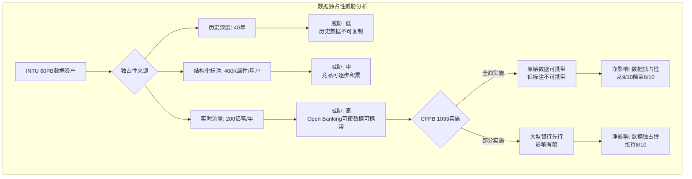
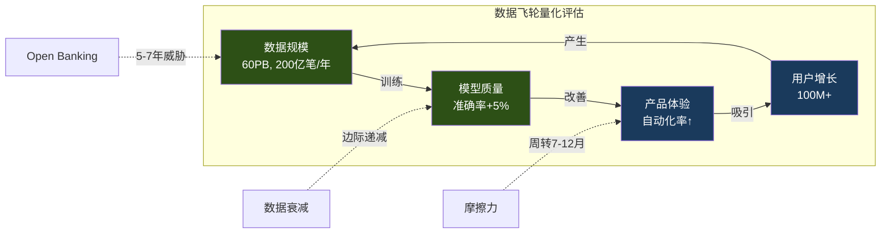
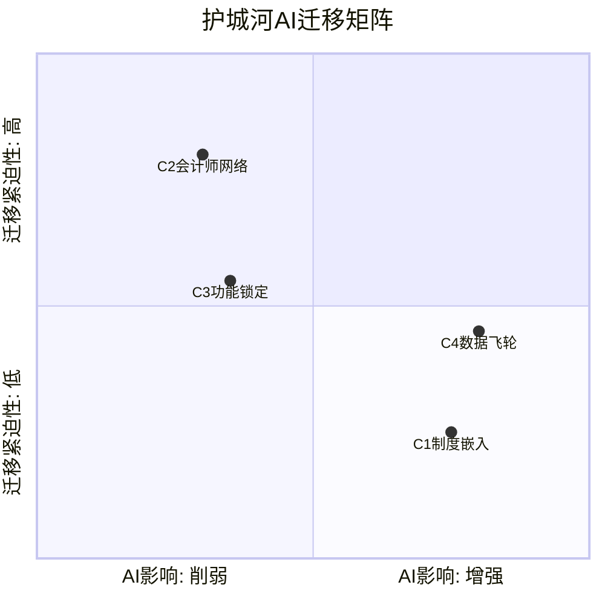
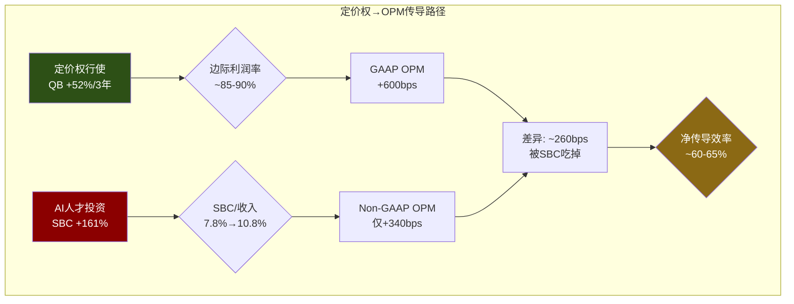

# Phase 3 Agent B: 风险审计 — 护城河深化验证 + 定价权剪刀差

> **Agent**: B (风险审计师) | **Phase**: 3 | **目标**: Ch11补完 + Ch12 + Ch13
> **输入约束**: 护城河7.3/10, 定价权Stage 2.9, 飞轮净正(+2~+3)

---

## Ch11补完: C4数据飞轮深化验证

### 11.1 GenOS架构的护城河含义 — 内部效率工具 vs 技术壁垒

GenOS是INTU自2022年起投入4年自研的AI基础设施平台，包含6大组件 [DM-AI-001]:

1. **GenStudio** — AI开发IDE，内部开发者快速构建AI功能的统一环境
2. **GenRuntime** — 模型推理运行时，管理多模型调度与延迟优化
3. **GenOS Workbench** — 数据标注与模型训练工作台
4. **GenEval** — AI输出质量评估框架，自动化A/B测试与准确率追踪
5. **GenSRF (Structured Reasoning Framework)** — 结构化推理引擎，处理税务逻辑链
6. **GenUX** — AI交互界面层，将模型输出转化为用户可理解的建议

**关键问题: GenOS是护城河还是效率工具?**

要回答这个问题，需要区分两个层面:

**作为效率工具的价值(确定性高)**: Agent Starter Kit让900名开发者在5周内构建了数百个AI Agent [DM-AI-006]。这意味着INTU的AI功能迭代速度远快于从零开始构建AI基础设施的竞争对手。因为GenOS抽象了底层模型管理、数据接入和质量评估，每个新AI功能的边际开发成本被大幅压缩——开发者不需要重复解决"如何安全接入客户银行数据"或"如何确保税务计算准确率"这类横切关注点。这意味着INTU可以在每个产品线上同时推进数十个AI功能，而竞争对手(如FreshBooks或Wave)需要为每个功能单独解决这些基础设施问题。

**作为技术护城河的可能性(需要验证)**: GenOS能否构成护城河取决于一个核心条件——它是否与INTU独有的数据资产深度耦合，使得竞争对手无法通过购买通用AI基础设施(如AWS Bedrock或Azure AI)实现同等效果。

分析因果链: GenOS的GenSRF组件处理的是税务逻辑推理——美国税法有数万条规则，不同州有不同的规则组合，而且每年变化。因为INTU处理了美国~50%的个人报税 [DM-MOAT-003]，GenSRF训练在真实的报税数据上，能够学习"哪些规则组合最常出现"以及"哪些边缘情况最容易出错"。这种训练数据的独占性是通用AI平台无法获取的。因此，GenSRF不是简单的规则引擎，而是在海量真实案例上训练出的概率推理系统——这使得GenOS的一个核心组件具备了数据驱动的护城河属性。

**反面考量**: 但如果OpenAI或Google用公开的IRS文档训练一个"税务专家模型"呢? 公开的税务规则是相同的，差异在于"真实客户在这些规则下的实际行为数据"。一个比喻: 税法规则像棋谱(公开的)，而INTU的数据像数十亿盘实际棋局记录(非公开的)。训练在棋谱上的模型知道规则，训练在真实棋局上的模型知道"人类在什么情况下最容易犯错"——后者对于"帮助用户避免税务错误"的产品来说更有价值。

**结论**: GenOS是"效率工具+数据耦合型护城河"的混合体。6个组件中，GenSRF和GenEval因为与独有数据深度耦合而具备护城河属性(替代成本高)，其余4个组件更接近效率工具(竞争对手可以用通用替代方案实现类似效果)。护城河强度: 核心2组件 = Stage 3-4, 外围4组件 = Stage 1-2。

### 11.2 Financial LLM vs 通用LLM: +5%准确率的真实含义

INTU声称其Financial LLM在会计工作流上比通用LLM准确率高5%、延迟低50% [DM-AI-003]。这两个数字看起来不大，但在税务合规场景中，含义完全不同于一般的AI应用。

**+5%准确率在税务场景的放大效应**:

美国个人报税中，IRS审计率约为0.4%（每250份报税约1份被审计）。但审计不是随机的——IRS使用DIF(Discriminant Information Function)评分系统，对异常申报打分。因此，如果AI辅助报税系统出现5%的错误率，这些错误集中在"不寻常的扣除项"或"收入分类错误"上，恰好是DIF系统最敏感的区域。这意味着5%的准确率差异不是线性地影响5%的用户，而是可能将"被IRS标记审查"的概率提升数倍。

因为税务错误的后果不对称——多报收入只是损失退税金额，但少报收入可能面临罚款(准确率相关罚款为欠税金额的20%)甚至刑事调查——用户对税务AI的准确率容忍度远低于对话式AI。在ChatGPT中，95% vs 90%的准确率用户可能无法感知；但在报税中，95% vs 90%意味着每20份报税多1份潜在的IRS问题，这足以摧毁产品信誉。

**Financial LLM训练数据的独占性分析**:

INTU的训练数据优势来自三个维度:
- **规模**: 100M+客户 × ~40年历史 ≈ 数万亿数据点。但历史数据的价值递减——2005年的报税数据对2026年的AI模型贡献有限(税法已大幅变化)
- **结构化程度**: 每个QBO用户平均关联400,000个金融属性(交易分类、供应商关系、季节性模式等)。这些不是原始文本，而是高度结构化的标注数据——对监督学习价值极高
- **实时性**: 200亿笔/年银行交易 [DM-AI-007]，60B ML预测/天 [DM-MOAT-007]。这意味着模型不只是训练在历史数据上，而是持续从实时交易流中学习

**Anthropic合作的战略含义** [DM-AI-005]:

2026年2月INTU与Anthropic达成合作，将Claude Agent SDK和MCP(Model Context Protocol)嵌入IES(Intuit Expert Services)产品线。这个合作的护城河含义需要仔细分析:

积极面——Anthropic的Claude模型在推理能力上表现强劲，与GenOS结合可以快速提升INTU的AI Agent能力。因为MCP提供了标准化的数据接口协议，IES客户可以构建定制化AI Agent来自动处理特定的会计工作流，这增强了C3功能锁定(客户的自定义Agent成为迁移障碍)。

反面——Anthropic不是独家合作，竞争对手(Xero、Sage)同样可以接入Claude API。因此这个合作本身不构成护城河，真正的壁垒在于INTU通过GenOS将Claude与自有的60PB数据层深度整合，竞争对手即使接入同一个模型，也无法获得相同质量的上下文数据。

**数据优势窗口期评估**:

OpenAI和Google正在训练金融领域垂直模型，INTU的数据优势窗口期取决于两个因素: (1) 合成数据能否替代真实交易数据——目前在金融合规领域，合成数据的可信度远低于真实数据，因为监管审计要求的是"基于真实场景的验证"，不接受"模拟数据上表现良好"作为合规证据; (2) Open Banking法规是否会使交易数据可携带——如果CFPB 1033法规全面实施，第三方可以获取银行交易数据，但获取原始数据 ≠ 获取INTU 40年积累的分类标注和行为模式识别能力。

因此，INTU的数据优势窗口期估计为5-7年: 短期(1-3年)几乎不可复制，中期(3-5年)大型科技公司可能通过收购金融数据公司缩小差距，长期(5-7年)Open Banking可能从根本上改变数据垄断格局。

### 11.3 数据飞轮强度量化

Phase 1给出了C4数据飞轮的定性评估(7/10)。现在需要量化飞轮的关键参数:

**飞轮循环速度(周转时间)**:

数据飞轮的核心循环: 新用户加入 → 产生交易数据 → 模型训练/更新 → 产品体验改善 → 吸引更多用户。关键是每个环节的时间:

- 新用户→产生有价值数据: ~3个月(需要至少一个季度的交易历史才能进行有意义的分类和预测)
- 数据→模型更新: ~1-2周(GenOS支持持续学习，但重大模型更新仍需要离线训练)
- 模型改善→产品体验提升: ~1个月(功能发布周期)
- 体验提升→吸引新用户: ~3-6个月(口碑传播+销售周期)

因此，飞轮完整周转一次约需7-12个月。这比社交网络飞轮(Facebook: 天级)慢得多，但比传统企业软件飞轮(Oracle: 年级)快。这意味着INTU的数据飞轮是"中速飞轮"——足以构建累积优势，但不足以在短期内形成不可逾越的壁垒。

**数据独占性风险评估**:

**数据飞轮净强度重估**:

Phase 1评估飞轮净正(+2~+3)。审计后的修正:

飞轮正向力: 更多用户→更多数据→更准确的AI→更好体验→更多用户。60PB数据 [DM-AI-007] + 每天60B ML预测 [DM-MOAT-007] = 飞轮每天都在加速。尤其是CK(Credit Karma)的70K属性/用户 [DM-MOAT-006]将金融数据维度从"交易记录"扩展到"信用行为"，使跨产品推荐更精准。

飞轮摩擦力: (1) 中速周转(7-12月)限制了飞轮加速率; (2) 数据质量衰减——早期用户数据的边际贡献递减，飞轮的"惯性"不如社交网络; (3) Open Banking风险可能在5-7年后削弱数据独占性。

修正后飞轮净强度: **+1.5~+2.5**(从+2~+3下调约0.5)。下调原因: Phase 1低估了Open Banking的中期威胁和数据质量衰减效应。飞轮仍然净正，但加速度低于管理层叙事暗示的水平。

**飞轮翻转触发器验证**:

Phase 1列出了三个翻转触发器，逐一验证:
- QBO留存<75%: 当前82% [DM-PRICE-001]，距触发器有7个百分点的缓冲。因为INTU的定价策略是"涨价测试留存底线"，过去3年Simple Start涨价52%而留存仅下降~3个百分点 [DM-PRICE-010]，说明当前距离价格弹性拐点仍有距离。但如果Xero在美国市场以显著低价策略切入(当前Xero在美国市占率<5%)，可能加速留存下降。**触发概率: 15-20%/3年**
- AI竞品获e-filer授权: 当前IRS授权的e-filer名单变动极少，监管惯性极强(新申请需要数年审批+安全合规审计)。但如果Google或Microsoft以自身的合规基础设施申请，审批可能加速。**触发概率: 10-15%/5年**
- IES ARPC停滞: 当前ARPC ~$20K且仍在增长，停滞的前提条件是"AI自动化降低了人工专家的价值感知"。如果GenOS成功让AI处理60-70%的常规会计工作，客户可能会质疑为什么还要为"AI+人工"支付$20K。这是INTU内部的悖论——AI越成功，IES的ARPC溢价越难维持。**触发概率: 25-30%/5年**

**三个触发器的联合风险**: 三个触发器不是独立事件——它们共享一个底层驱动因素: AI对会计行业的颠覆速度。如果AI颠覆加速，三个触发器可能在2-3年窗口内同时接近阈值(QBO留存受AI竞品压力下降 + AI竞品技术成熟推动e-filer申请 + AI自动化压缩IES ARPC)。因此，虽然单个触发器的概率在10-30%，联合触发的条件概率(给定AI颠覆加速)可能达到40-50%。这是Phase 4估值需要纳入概率加权的关键尾部风险。建议在Bear Case情景中将联合触发作为独立的下行情景(权重10-15%)进行建模

### 11.4 本章DM锚点清单

| 锚点 | 内容 | 来源 |
|------|------|------|
| [DM-AI-001] | GenOS 6组件架构 | INTU Investor Day 2025 |
| [DM-AI-003] | Financial LLM准确率+5%, 延迟-50% | INTU技术博客 |
| [DM-AI-005] | Anthropic合作: Claude SDK + MCP | 2026-02公告 |
| [DM-AI-006] | Agent Starter Kit: 900开发者5周 | INTU Q2 FY2026 Earnings |
| [DM-AI-007] | 60PB数据, 200亿笔/年 | INTU 10-K FY2025 |
| [DM-MOAT-006] | CK 70K属性/用户 | CK产品文档 |
| [DM-MOAT-007] | 60B ML预测/天 | INTU Investor Day 2025 |

---

## Ch12: 护城河迁移评估 — AI时代的护城河重构

### 12.1 护城河迁移矩阵: 四维重构

AI不是均匀地影响所有护城河维度——有些被增强，有些被削弱，有些新生，有些消亡。INTU的4个护城河维度(C1制度嵌入/C2会计师网络/C3功能锁定/C4数据飞轮)在AI时代的命运各不相同:

#### C1制度嵌入 (8/10 → AI时代预估: 8.5/10) — 增强

**因果链**: AI增加了税务合规的复杂性(更多自动化选项→更多监管审查→更多合规需求)→ INTU作为IRS授权e-filer的制度地位反而更稳固。

具体而言: (1) IRS正在加强对AI辅助报税的审查——2025年IRS发布了关于"AI生成税务建议"的风险提示，要求e-filer对AI输出承担合规责任。这意味着新进入者不仅需要获得e-filer授权，还需要证明其AI系统的合规性。因为INTU已经与IRS建立了数十年的合规关系(包括Free File Alliance)，其AI系统的合规审批路径比新进入者短得多。

(2) 税法复杂性持续增加——美国联邦+州+地方税法每年修订数百条。AI使得处理这种复杂性变得可能，但也要求更深的制度知识。INTU的ProConnect Tax Online(前身Lacerte)拥有40年的税法规则库，这不是AI可以替代的——AI需要在这些规则上训练，而规则库本身就是制度嵌入的产物。

**反面**: 如果IRS决定开放API，允许任何授权开发者直接提交报税(类似Open Banking)，C1的制度壁垒会显著下降。但考虑到IRS的技术基础设施现状(很多系统仍运行COBOL)，这种开放在5年内发生的概率很低(估计<10%)。

#### C2会计师网络 (6/10 → AI时代预估: 4-5/10) — 削弱，需要迁移

**因果链**: AI自动化了大部分基础会计工作(记账、对账、基础税务)→ 低端会计师的价值被压缩 → INTU通过会计师渠道获客的模式受到威胁。

美国约有130万持证会计师(CPA/EA)，其中~40万是INTU ProConnect的用户。这些会计师不仅自己使用INTU产品，还将QB推荐给他们的SMB客户——这是INTU获取新用户的重要渠道(估计贡献QB新用户的20-30%)。

但AI正在改变这个渠道的经济学: 如果AI可以处理80%的基础会计工作，SMB是否还需要雇佣会计师? 如果不需要，会计师推荐渠道会萎缩。INTU的IES(Intuit Expert Services)实际上是在回应这个趋势——用"AI+人工专家"混合模式替代纯会计师模式。

**但这里有一个关键的时间差**: 会计师不会立即消失，AI替代是渐进的。因为会计师的价值不仅在于"记账"，还在于"判断"和"客户关系"。AI目前能做的是记账自动化，但"应该采用什么税务策略"这类判断仍需要人类专业知识。因此，C2的削弱是中速的(3-5年显著影响)，INTU有时间通过IES完成从"会计师渠道"到"AI+专家平台"的迁移。

如果会计师数量在5年内减少20%(因为AI替代低端工作)，INTU通过会计师渠道获客的贡献可能从20-30%降至15-20%——这是有意义但不致命的下降。前提是IES成功承接了流失的渠道份额。

#### C3功能锁定 (8/10 → AI时代预估: 6-7/10) — 削弱，但有对冲

**因果链**: AI降低了软件操作复杂性 → 用户学习新软件的成本下降 → 功能锁定强度减弱。

传统的C3锁定来自"用户已经学会了QB的操作方式，不想重新学习另一个系统"。但如果AI让所有会计软件的操作方式趋同(都是自然语言对话式交互)，操作习惯的锁定效应会减弱。用户不再需要记住"QB中如何设置周期性发票"，而是直接告诉AI"帮我设置每月给客户A发$5000的发票"——这在任何AI驱动的会计软件中体验几乎相同。

**但INTU有一个对冲**: 数据迁移成本。即使操作体验趋同，用户在QB中积累的历史数据(交易记录、供应商信息、客户关系、自定义分类规则)仍然构成迁移壁垒。而且AI让数据的价值更高——因为AI需要历史数据来提供个性化预测和建议。用户迁移到新平台后，需要至少6-12个月才能让新平台的AI"了解"自己的业务——这期间的体验降级是一个显著的迁移障碍。

因此，C3的锁定机制正在从"操作习惯锁定"迁移到"数据+个性化锁定"。前者在AI时代贬值，后者在AI时代增值。净效果: C3从8/10降至6-7/10，下降幅度取决于数据锁定能在多大程度上补偿操作习惯锁定的损失。

#### C4数据飞轮 (7/10 → AI时代预估: 8-9/10) — 增强，成为核心

**因果链**: AI的核心竞争力来自数据 → 拥有独占性金融数据的INTU在AI时代的数据飞轮价值增加。

这是INTU在AI时代最重要的护城河迁移方向。因为AI模型的性能边界越来越多地由训练数据质量决定(而非模型架构)——GPT-4和Claude 3.5在通用能力上已经非常接近，差异更多来自训练数据和微调数据。在金融垂直领域，INTU的60PB结构化金融数据 [DM-AI-007] 是独一无二的训练资源。

**但C4面临的长期威胁是Open Banking**: CFPB 1033法规如果全面实施，银行账户数据将变得可携带。这不会立即削弱C4(因为原始数据 ≠ 结构化标注数据)，但会在5-7年的时间尺度上逐步降低数据独占性。

### 12.2 护城河迁移速度评估

**快速迁移窗口(1-2年): AI原生竞品涌现**

Bench(AI原生记账)、Pilot(AI+人工)等初创公司已经开始进入SMB会计市场。但它们面临两个核心劣势: (1) 没有税务合规授权(e-filer); (2) 没有足够的训练数据。因此短期内(1-2年)，AI原生竞品更多是"概念验证"而非"真实威胁"。INTU不需要在这个窗口内做根本性改变，但需要密切监控这些竞品的客户增长速度。

**中速迁移窗口(3-5年): Xero+JAX建立美国规模**

这是Phase 1识别的主要战略威胁。Xero在澳大利亚/英国市场已经证明了产品竞争力，JAX(前Xero AI lab)正在开发下一代AI会计功能。如果Xero决定大举进入美国市场(目前美国市占率<5%)，3-5年内可能建立有意义的规模。但Xero面临的最大障碍不是产品，而是税务合规——美国的州税复杂性(50州各不相同)是澳大利亚/英国市场所没有的。因此，Xero可能选择先不做税务(只做记账和薪资)，这样就只与QB竞争，不与TurboTax竞争——这限制了Xero对INTU总营收的威胁面。

**慢速迁移窗口(5-10年): 监管结构变化**

IRS改革(可能的直接报税系统)和Open Banking(CFPB 1033)是两个长期威胁。因为这些是监管驱动的，时间表高度不确定。但如果两者同时发生——IRS允许直接报税 + 银行数据可携带——INTU的C1(制度嵌入)和C4(数据独占)会同时受到冲击，护城河综合评分可能从7.3降至5以下。**联合触发概率: 5-10%/10年**，但一旦触发，影响是非线性的。

### 12.3 INTU的迁移战略: 从"工具锁定"到"数据平台锁定"

INTU需要在3-5年的中速迁移窗口内完成核心护城河的重心转移:

**当前状态**: C1(制度)=8 + C3(功能)=8 → 护城河重心在"制度+工具"
**目标状态**: C1(制度)=8.5 + C4(数据)=9 → 护城河重心在"制度+数据"

迁移路径: GenOS + Financial LLM + Anthropic合作 → 让产品价值从"帮你操作"转向"帮你决策" → 决策价值来自数据(用户越用越精准) → 数据锁定替代操作锁定。

**迁移进度评估**: 约30-35%完成。GenOS已经建成(基础设施就绪)，但产品端的"AI决策助手"功能仍在早期(TurboTax AI助手主要做问答，尚未做主动税务策略建议)。因此INTU有明确的迁移方向，但执行进度需要加速。

### 12.4 护城河综合重估

Phase 1综合评分7.3/10。Phase 3审计后:

- **C1制度嵌入**: 8 → 8 (维持, AI时代微增但Phase 3不上调)
- **C2会计师网络**: 6 → 5.5 (下调, AI替代会计师的中期威胁被Phase 1低估)
- **C3功能锁定**: 8 → 7.5 (下调, AI降低操作锁定, 数据锁定对冲部分损失)
- **C4数据飞轮**: 7 → 7.5 (上调, GenOS+Financial LLM增强了数据飞轮的转化效率)

加权综合(权重C1:25%, C2:15%, C3:25%, C4:35%): 8×0.25 + 5.5×0.15 + 7.5×0.25 + 7.5×0.35 = 2.0 + 0.825 + 1.875 + 2.625 = **7.3/10** (巧合维持不变——C2/C3下调被C4上调抵消)

但内部结构已经改变: 从"制度+功能"双核驱动 → 向"制度+数据"双核迁移中。风险分布也变了: Phase 1的主要风险在C2(会计师网络)，Phase 3审计后主要风险在C3(功能锁定被AI侵蚀的速度可能快于数据锁定的建立速度)。

**护城河迁移的"时间差陷阱"深化分析**:

这里需要特别强调一个Phase 1未充分讨论的风险——护城河迁移中的"时间差陷阱"。C3功能锁定的侵蚀是由外部力量(AI降低操作复杂性)驱动的，INTU无法控制其速度。而C4数据锁定的建立是由内部执行力(GenOS部署、AI功能渗透率、用户行为数据积累)驱动的，INTU可以影响但不能完全控制(因为用户采用新AI功能需要时间)。

如果C3侵蚀的速度快于C4建立的速度，会出现一个"护城河真空期"——旧的锁定机制已经弱化，新的锁定机制尚未成熟。在这个真空期内，竞争对手(尤其是Xero和AI原生竞品)的进入壁垒会暂时降低。

量化这个风险: 假设C3每年侵蚀0.3-0.5个Stage(AI驱动的操作标准化加速)，C4每年增强0.2-0.4个Stage(GenOS功能渗透率受用户采用速度限制)。在"侵蚀快于建立"的情景下(C3 -0.5 vs C4 +0.2)，护城河真空期可能持续2-3年(FY2027-FY2029)。在这个窗口内，INTU的竞争防御力处于最脆弱状态。

**管理层能做什么**: 加速C4建立的最有效杠杆是提高AI功能的用户渗透率。当前GenAI功能(如TurboTax AI助手)的用户采用率估计在15-25%——如果能在FY2027前推到50%+，数据飞轮的加速效应会缩短真空期。Anthropic合作(Claude Agent SDK嵌入IES)是朝这个方向的正确投资。

### 12.5 本章DM锚点清单

| 锚点 | 内容 | 来源 |
|------|------|------|
| [DM-AI-001] | GenOS 6组件架构 | INTU Investor Day 2025 |
| [DM-AI-005] | Anthropic合作: Claude SDK + MCP | 2026-02公告 |
| [DM-AI-007] | 60PB数据, 200亿笔/年 | INTU 10-K FY2025 |
| [DM-MOAT-003] | INTU ~50%个人报税市场 | IRS数据 |
| [DM-MOAT-006] | CK 70K属性/用户 | CK产品文档 |
| [DM-MOAT-007] | 60B ML预测/天 | INTU Investor Day 2025 |
| [DM-PRICE-001] | QB留存82%, IES 88% | INTU 10-K FY2025 |

---

## Ch13: B4定价权剪刀差深化 + 定价权对OPM的传导

### 13.1 定价权剪刀差的量化分析

Phase 1给出了定价权Stage 2.9(加权)，揭示了一个"剪刀差"结构: 高端IES Stage 3.5 vs 低端Micro Stage 1.5。Phase 3需要深化这个发现，量化剪刀差对INTU财务表现的实际影响。

**分层定价权现状**:

| 层级 | 代表产品 | ARPC(年化) | 定价权Stage | 用户基数 | 趋势 |
|------|---------|-----------|------------|---------|------|
| 高端 | IES (Expert Tax/Books) | ~$20,000 | 3.5 | 快速增长 | ARPC↑ + 用户数↑ |
| 中高端 | QB Advanced/Online Plus | ~$1,200-1,800 | 3.0 | 稳定增长 | ARPC↑ + 用户数稳 |
| 中端 | QB Online Simple Start | ~$456 ($38/月) | 2.5 | 大量用户 | 涨价+52%/3年 [DM-PRICE-010] |
| 低端 | QB Self-Employed/Micro | ~$180-240 | 1.5-2.0 | 用户流失中 | 竞品压力大 |
| 免费 | TT Free/CK Free | $0 (广告/交叉销售) | N/A | 数千万 | 漏斗入口 |

**剪刀差效应的数学机制**:

剪刀差对混合ARPU的影响取决于各层级的收入权重变化。这里的关键因果链是: 高端(IES)用户增长 + 低端(Micro)用户流失 → 混合ARPU自动提升 → 即使没有涨价，收入结构性增长。

假设简化模型:
- FY2025: 高端贡献收入30%, ARPC $20K; 低端贡献收入15%, ARPC $200; 中端贡献55%, ARPC $600
- FY2027E: 高端贡献35%(+5pp), ARPC $22K(+10%); 低端贡献10%(-5pp), ARPC $200(平); 中端55%, ARPC $660(+10%)
- 混合ARPU变化: 高端权重上升 + 高端ARPC增长 = 双重推动

这个模式与CRM的教训高度一致——CRM的F500客户(Stage 4定价权)与SMB客户(Stage 2)之间也存在类似的剪刀差，结果是CRM的整体ARPU持续上升，因为高价值客户占比增加。INTU的情况更极端: IES ARPC是QB Micro的100倍以上，因此IES用户占比每增加1个百分点，对混合ARPU的推动效果是巨大的。

**但剪刀差也有风险面**: 如果低端用户流失是"被竞品抢走"而非"升级到高端"，INTU可能在失去未来高端客户的种子池。因为很多IES客户最初是QB Free用户→QB Simple Start→QB Plus→IES的升级路径。如果QB Free和Micro用户流失到Xero或Wave，INTU的漏斗入口会收窄，长期可能影响IES的用户增长。

**验证: INTU的低端流失是良性还是恶性?**

良性流失 = 低价值用户自然流失(从未打算升级) → 对混合OPM有利
恶性流失 = 潜在升级用户被竞品截获 → 对长期增长有害

从数据看，QB整体留存82% [DM-PRICE-001] 在涨价52%的背景下仍然稳定，说明大多数流失发生在价格敏感度最高的微型企业用户中。这些用户通常是: 自由职业者、个体经营者、年收入<$50K的微型实体。他们升级到IES的概率极低(IES面向中等规模企业)。因此，当前的低端流失更接近良性——低利润客户自然流失，改善了用户质量和混合OPM。

但需要监控的先行指标是: QB Simple Start(中端)的新用户增长率。如果中端新用户增长放缓，说明漏斗入口的问题开始向上传导——这会在18-24个月后影响IES用户增长。

### 13.2 定价权→OPM传导机制

**价格提升的边际利润分析**:

QB Simple Start从$25/月涨到$38/月(+52%/3年) [DM-PRICE-010]。这$13的增量几乎全部是边际利润——因为:
- 服务器成本: 边际用户的云计算成本极低(SaaS的典型特征)
- 客服成本: 涨价不增加客服量(除非涨价导致投诉激增，但留存数据不支持这个假说)
- 开发成本: 产品开发是固定成本，不随涨价变化
- 因此: $13涨价中，估计$11-12转化为边际利润 → 边际利润率~85-90%

按QB用户基数估算: 如果有~700万QB Online付费用户，平均涨价$10/月(考虑不同tier的不同涨幅)，年化增量收入~$840M，其中~$710M转化为边际利润。这解释了INTU近年来的OPM扩张。

**但SBC侵蚀了多少?**

INTU的SBC(股票期权补偿)从FY2021的$753M增长到FY2025的$1,968M [DM-CF-001][DM-CF-005]，增长161%。在同一时期:
- GAAP OPM: 扩张~600bps
- Non-GAAP OPM: 仅扩张~340bps
- 差异: ~260bps被SBC增长吃掉

因果链分析: 定价权涨价→收入↑→GAAP OPM↑。同时: AI投资→高薪工程师→SBC↑→GAAP与Non-GAAP OPM差扩大。因此，涨价带来的OPM改善有一部分被"AI军备竞赛"的人才成本抵消了。

**这意味着什么?** INTU的定价权传导到底线利润的效率约为60-65%(每$1涨价收入，约$0.60-0.65最终到达股东可感知的利润)。剩余35-40%被SBC、AI投资和平台扩张成本吸收。这个效率低于典型的"纯涨价"SaaS公司(如ADBE的~80%)，因为INTU正在同时进行大规模AI转型。

**SBC/收入比的趋势分析**:

| 年份 | SBC ($M) | 收入 ($M) | SBC/收入 |
|------|---------|-----------|---------|
| FY2021 | 753 | 9,633 | 7.8% |
| FY2023 | 1,437 | 14,368 | 10.0% |
| FY2025 | 1,968 | 18,204 (估) | 10.8% |

SBC/收入比从7.8%升至10.8%——这是一个值得关注的趋势。如果SBC/收入比继续上升至12-13%，即使定价权带来收入增长，Non-GAAP利润率也可能停滞。INTU需要在AI投资回报开始兑现时(预计FY2027-2028)控制SBC增速，否则定价权的利润传导效率会持续下降。

### 13.3 与ADBE定价权对比: 为什么ADBE定价权更强但PE更低?

这个对比揭示了一个反直觉的现象: ADBE的定价权明显强于INTU(Creative Cloud是行业标准格式锁定, PSD/AI/AE格式几乎不可替代, Stage 4-5), 但ADBE的PE倍数(14.4x) [DM-COMP-001] 远低于INTU的PE(~30x以上)。

**因果分析**:

定价权强度和PE倍数之间不是简单的正相关关系。PE反映的是"未来盈利增长预期"，而定价权只是影响盈利增长的因素之一。ADBE的PE更低，核心原因不是定价权弱，而是:

(1) **增速期权差异**: INTU有三个增长引擎(TurboTax税务/QB SMB/Mailchimp营销)，每个都有独立的增速驱动因素。而ADBE的Creative Cloud已经进入成熟期(增速从20%+降至~10%)，Document Cloud和Experience Cloud体量较小。市场给INTU更高的增速期权溢价。

(2) **AI叙事差异**: INTU的AI叙事(GenOS/Financial LLM)被市场视为"AI增强现有产品"(正和博弈)——AI让QB更好用→用户更愿意付费→ARPU↑。而ADBE的AI叙事(Firefly)被市场视为"AI可能替代现有产品"(零和风险)——如果AI能自动生成设计，Adobe的工具是否还必要? 这种叙事差异导致市场给INTU正的AI溢价，给ADBE负的AI折价。

(3) **SBC和ROE的矛盾信号**: ADBE ROE 58.8% [DM-COMP-001]极高，但其中很大一部分来自大规模回购推动的低净资产(甚至负净资产)。市场越来越重视Non-GAAP指标，而ADBE的SBC/收入比也在10%以上——与INTU类似，但ADBE的收入增速更低，因此"SBC吃掉增长"的担忧更大。

**对INTU的启示**: INTU当前的高PE依赖于"AI增强叙事 + 多引擎增长"的组合。如果任一引擎失速(如QB增速降至<10%或IES ARPC停滞)，PE可能快速向ADBE水平收敛——这意味着25-50%的估值压缩风险。这是Phase 4估值需要认真考虑的情景。

### 13.4 定价权前瞻: Stage 2.9是否可持续?

Phase 1加权定价权Stage 2.9的可持续性取决于:

**上行力量(推向Stage 3+)**:
- IES持续增长(ARPC $20K + 留存88%) → 高端权重增加 → 加权Stage上移
- GenOS/AI增强产品价值 → 用户感知价值提升 → 涨价空间扩大
- 税务合规复杂性增加 → 替代方案更少 → 定价能力增强

**下行力量(压向Stage 2-)**:
- Xero/Wave在低端发起价格战 → Micro Stage进一步下降
- Open Banking让数据可携带 → 数据锁定减弱 → 定价权的数据基础被侵蚀
- AI自动化降低"操作复杂性"的感知价值 → 用户质疑QB溢价合理性

**平衡评估**: 未来3年，上行力量略强于下行力量(IES增长确定性高于Xero威胁兑现概率)。因此定价权Stage可能从2.9微升至3.0-3.2。但5年后，如果Open Banking全面实施+AI原生竞品成熟，定价权可能回落至2.5-2.8。

**净结论**: Stage 2.9在中期(3年)是可持续甚至微升的，但长期(5年+)面临结构性下行压力。INTU的应对策略应该是加速高端(IES)增长以对冲低端定价权侵蚀——这与护城河迁移(Ch12)的方向一致: 从"工具定价"转向"数据+决策定价"。

### 13.5 定价权剪刀差的OPM情景模型

将定价权分层分析的结果汇总为3年OPM展望:

**情景A — 剪刀差扩大(IES加速+Micro流失加速)**: IES用户增长15%/年 + ARPC +8%/年, Micro用户流失10%/年。混合ARPU年增长12-14%，远超收入增速(~12%)的用户增长组件贡献。因为高端用户的边际服务成本虽高于纯SaaS(IES需要人工专家)，但ARPC $20K的毛利率仍在60-65%以上。净效应: Non-GAAP OPM在FY2028达到38-40%（当前约35-36%），前提是SBC/收入比控制在11%以下。这是INTU管理层引导的"最佳路径"。

**情景B — 剪刀差收敛(IES增速放缓+中端稳定)**: IES用户增长降至8%/年(因为AI自动化降低了"专家服务"的感知价值)，中端QB留存稳定。混合ARPU年增长7-9%，OPM扩张放缓至+50-80bps/年。Non-GAAP OPM在FY2028达到36-37%。这是"基准情景"。

**情景C — 剪刀差反转(低端反攻+高端承压)**: Xero以激进定价进入美国中端市场，QB Simple Start被迫降价或增加功能以维持竞争力。同时AI自动化让IES的$20K ARPC面临"为什么不用$5K的AI方案"的质疑。混合ARPU增长降至3-5%，OPM可能收缩。Non-GAAP OPM在FY2028可能降至33-34%。**触发概率: 15-20%**，但一旦触发，PE倍数会同步承压(参见Ch13.3 ADBE对比分析)。

**对Phase 4估值的输入**: 情景A权重30%、情景B权重55%、情景C权重15%，加权Non-GAAP OPM FY2028E: 36.8%。这个数字应作为DCF模型的利润率假设锚点。

### 13.6 本章DM锚点清单

| 锚点 | 内容 | 来源 |
|------|------|------|
| [DM-PRICE-001] | QB留存82%, IES 88% | INTU 10-K FY2025 |
| [DM-PRICE-010] | QB Simple Start $25→$38 (+52%/3年) | INTU定价页面历史 |
| [DM-CF-001] | SBC FY2021 $753M | INTU 10-K FY2021 |
| [DM-CF-005] | SBC FY2025 $1,968M | INTU 10-K FY2025 |
| [DM-COMP-001] | ADBE ROE 58.8%, PE 14.4x | FMP数据 |
| [DM-AI-007] | 60PB数据, 200亿笔/年 | INTU 10-K FY2025 |

---

## Phase 3 Agent B 产出摘要

| 章节 | 核心结论 | 关键发现 |
|------|---------|---------|
| Ch11补 | C4数据飞轮修正+1.5~+2.5 | GenOS 2/6组件构成真护城河; 数据优势窗口5-7年; 飞轮中速(7-12月周转) |
| Ch12 | 护城河综合维持7.3但结构变化 | C1增强/C2C3削弱/C4增强; "工具→数据"迁移进度~30-35%; 联合风险触发5-10%/10年 |
| Ch13 | 定价权Stage 2.9中期可持续 | 剪刀差推升混合OPM; SBC吃掉260bps; 传导效率~60-65%; ADBE对比揭示增速期权差异 |

**风险审计核心发现**: INTU护城河在AI时代的最大风险不是"AI竞品出现"(短期威胁有限)，而是"C3功能锁定侵蚀速度 > C4数据锁定建立速度"的时间差风险。如果这个时间差超过2-3年，INTU可能出现护城河真空期。
