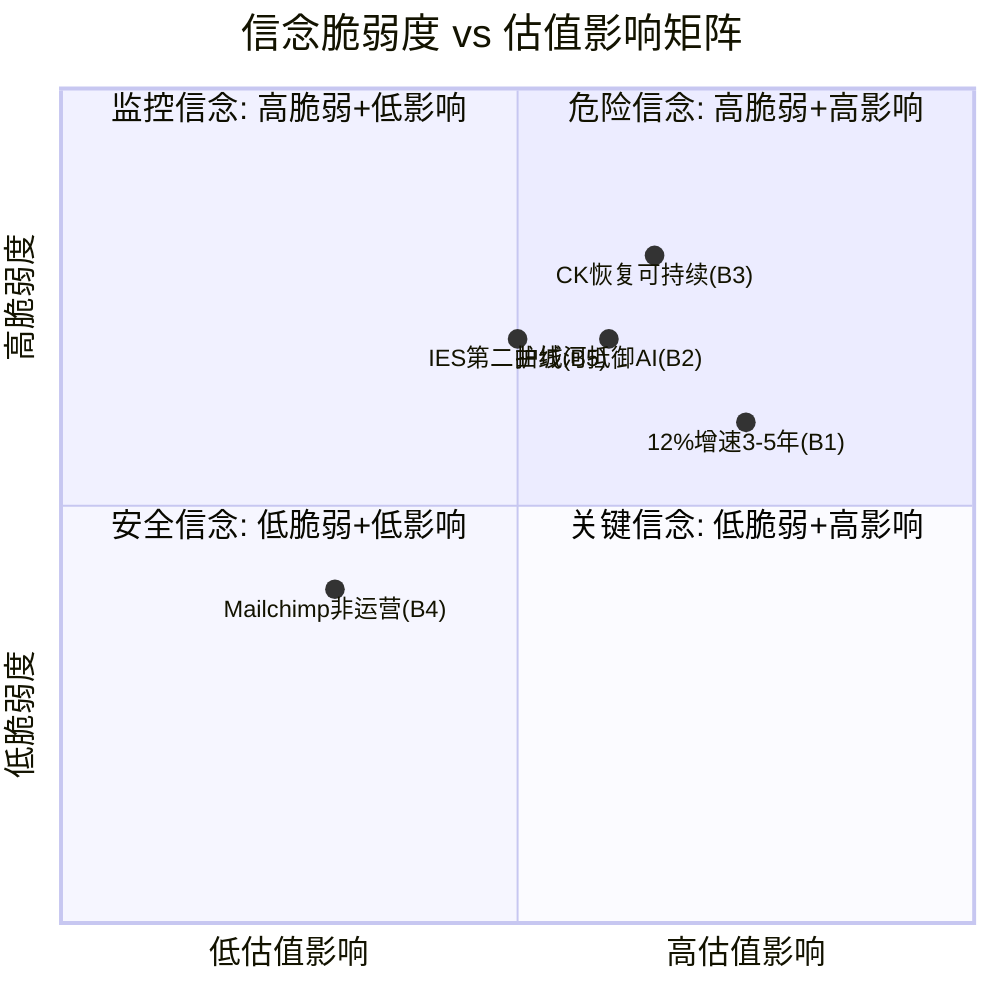

# Phase 4 — Agent A: 认知偏差审计 + 假设压力测试

> **Agent**: A (偏差猎手) | **Phase**: 4 | **目标**: Ch-偏差审计 + Ch-CQ偏差审计 ≥12K字符
> **审计对象**: P1-P3全部分析产出 — 初步评级"关注"(期望回报+10.5%), SOTP $503, 概率加权$528, 护城河7.3/10
> **核心任务**: 检测分析过程的系统性偏差, 而非寻找更多看多/看空论据

---

## Ch-偏差审计: 信念反演 + 共识解构 + 确认偏差检测

### M1 信念反演 (Assumption Audit v2.0)

P1-P3的"关注"评级建立在一组隐含信念之上。这些信念中的某些可能是正确的，但没有被显式检验——也就是说，我们不是"论证了它们为真"，而是"假设了它们为真然后在此基础上建模"。这两者的区别至关重要：前者是分析，后者是信仰。

Reverse DCF结果显示市场隐含FCF CAGR约4-5%，而Python验证的盈亏平衡FCF CAGR为7.0%。因此我们的看多论点本质上是在说："市场隐含增速(4-5%)太保守，实际增速(12.8%)会持续到足以使7%+的复合增长可实现。"这个判断的背后至少有5个承重信念。

---

**信念1: INTU能维持12%+收入增速3-5年**

- **脆弱度: 6/10**
- **我们在信什么**: FY2025 +16%和Q2 FY2026 +17%代表了可持续的增速平台，而非周期性高点。这个信念的核心支撑是"三引擎驱动"——SSE(+20%)、CK恢复(+23-27%)、TT Live升级(ARPC提升)。
- **翻转条件**: (1) CK增速从27%→23%的减速趋势延续至FY2027 Q1降至<15%——这意味着恢复已结束，新常态更低; (2) QBO用户净增加速度降至<5%——当前约8.9M，如果增长来自ARPC而非用户数，天花板更低; (3) IES未能在FY2027贡献>$300M收入——中端突破失败; (4) 宏观衰退导致SMB倒闭潮——INTU的客户是小企业，经济衰退时小企业死亡率远高于大企业。
- **翻转概率**: 25-30%。因为CK连续减速(27→23%)已经开始，如果Q3 FY2026继续减速至<20%，这将不是"恢复中的正常波动"而是"恢复见顶"的信号。而我们在P1-P3中将CK减速解读为"恢复性增长基数效应"——这个解读可能过于善意。
- **翻转后估值影响**: 如果增速稳态降至8-10%(非12%+)，forward PE应从18x进一步压缩至15-16x(对标ADBE的14.4x+微弱增速溢价)→ 股价$380-$420，即下行-8%至-17%。因为市场可能已经在定价"增速放缓"这一现实，而非我们认为的"过度悲观"。

---

**信念2: 护城河7.3/10足以在AI时代维持竞争优势**

- **脆弱度: 7/10**
- **我们在信什么**: INTU的护城河由5层构成(C1品牌+C2合规+C3功能锁定+C4数据+C5会计师网络)，综合强度7.3/10，且AI是"增强器"而非"溶解剂"。但P3自身评估显示护城河迁移进度仅30-35%——这意味着70%的护城河仍基于传统因素(品牌惯性+迁移成本)，而非AI时代的新壁垒(数据飞轮+AI准确率)。
- **翻转条件**: (1) Xero JAX的97.5%自动对账率在正式产品中达到95%+——证明通用AI架构可以逼近INTU的专有数据优势; (2) IRS授予第三方AI工具e-filer资格——打破TurboTax的合规壁垒; (3) Open Banking(CFPB 1033)全面实施——使交易数据可携带，削弱数据锁定; (4) 会计师世代交替加速(P3盲点1)——新一代会计师不再默认推荐QB。
- **翻转概率**: 20-25%(3年内任一翻转条件触发), 40-50%(5年内)。
- **翻转后估值影响**: 护城河从7.3降至5.5-6.0 → SOTP倍数每个分部下调15-20% → 公允价值$400-$430(下行-6%至-12%)。
- **关键诚实问题**: P3评估GenOS数据优势窗口期为5-7年。但这个窗口期本身就是一个估计——因为AI技术进步的速度是非线性的(scaling law)，所以"5-7年"可能是基于当前技术趋势的线性外推。如果2027年出现GPT-5级别的突破，使通用模型在金融领域达到与专有模型相当的准确率，这个窗口期可能缩短至2-3年。而我们在分析中没有给这个"窗口期缩短"场景赋予足够的概率权重。

---

**信念3: CK增速恢复代表结构性增长而非周期性反弹**

- **脆弱度: 8/10** (最脆弱的信念)
- **我们在信什么**: CK从FY2024触底后的+32%(FY2025)和+27%/+23%(FY2026 Q1/Q2)反映了(1)利率敏感型业务的周期性恢复 + (2)数据飞轮驱动的结构性加速。P2估值中CK独立估值$11.5-16.1B(中值$13.8B)，高于$8.1B收购价——这个估值隐含CK增速在23-27%区间至少维持2-3年。
- **翻转条件**: (1) Fed维持高利率更久——如果Fed在2026-2027不降息(利率保持5%+)，CK的个人贷款和信用卡推荐量将受压，因为金融机构在高利率环境下缩减营销预算(2022-2023的教训); (2) CK增速从27→23→<18%的连续减速成为趋势——这将暴露"+32%恢复"中大部分是低基数效应而非结构性增长; (3) 汽车保险比价市场竞争加剧——如果Google将保险比价集成到搜索结果中(类似Google Flights对旅行搜索的影响)，CK的第三驱动轮被压缩。
- **翻转概率**: 35-40%。**这是我们分析中最危险的信念**。因为CK的收入模式本质上是金融广告(P2已承认这一点)，而金融广告的周期性远强于SaaS。我们用SaaS类的估值倍数(6-7x revenue)对CK估值，但CK的收入稳定性远不及SaaS——这构成了方法论层面的偏差。
- **翻转后估值影响**: 如果CK增速在FY2027降至12-15%(接近fintech lead-gen行业均值)，CK估值从$13.8B降至$8-10B → SOTP总计下调$3.8-5.8B → 每股影响-$14至-$21 → 公允价值从$503降至$482-$489。单独看CK的影响似乎不大，但与信念1(整体增速放缓)组合后影响翻倍。

---

**信念4: Mailchimp减值是会计事件，不影响运营价值**

- **脆弱度: 4/10**
- **我们在信什么**: Mailchimp潜在减值$7.3B(P2 Agent C估算)是非现金会计事件，不影响FCF和运营能力。因此我们在SOTP中给Mailchimp $4.7B估值(3.5x revenue)并将其视为"沉没成本"。
- **翻转条件**: (1) 减值触发被动指数卖出——如果INTU净资产大幅缩水，在某些以净资产权重的指数/ETF中占比下降→被动卖出压力→短期股价下行; (2) 减值暴露管理层资本配置能力——"$12B买了$4.7B的东西"这个叙事如果被媒体放大，可能引发更广泛的管理层信任危机。
- **翻转概率**: 15-20%。减值本身高概率发生，但触发系统性卖压的概率有限。
- **翻转后估值影响**: 短期股价下行5-8%(被动卖出+情绪冲击)，但因为不影响FCF，中期影响可控。更重要的是对管理层评分(D7)的拖累——如果减值公开，管理层7.2/10的评分需要下调至6.5-7.0/10。

---

**信念5: IES能成为第二增长曲线**

- **脆弱度: 7/10**
- **我们在信什么**: IES面向$5-15B的SAM，ARPC $20K(QB Core的40倍)，88%留存率，800K可升级客户。P2评估IES成功的联合概率(承重墙4/4)仅12-17%，但3/4成功的概率35-45%。我们在估值中给IES约$5-8B的期权价值。
- **翻转条件**: (1) 88%留存率基于极少量早期客户——如果大规模推出后留存率降至70-75%(企业软件行业中位数)，IES的终身价值模型崩溃; (2) NetSuite/Sage Intacct在中端市场的功能深度领先5-10年——AI无法弥补ERP领域的功能覆盖差距; (3) 800K"可升级客户"中真正需要ERP的可能仅20-30%(即160K-240K)——因为SMB"长大"到需要ERP的比例远低于INTU假设。
- **翻转概率**: 40-50%。P2已经承认4/4承重墙成功概率仅12-17%——但我们仍在估值中给予IES正期权价值，而非零期权价值。**这本身就是偏差**: 如果12-17%的概率事件我们给予期权价值，那反面(83-88%的失败概率)的期权损失也应该被定价。IES不成功意味着INTU中端突破失败→增长天花板锁定在SMB→长期增速<10%→估值倍数需要下调。

---

### 信念脆弱度矩阵

**矩阵解读**: 信念B3(CK恢复可持续)和B1(12%增速持续)落在"危险信念"象限——脆弱度高且估值影响大。这两个信念的联合翻转(CK减速+整体增速放缓)将使期望回报从+10.5%降至接近0%或负值。因为B1和B3高度相关(CK是整体增速的重要组成部分)，它们翻转的联合概率不是各自独立概率的乘积，而是条件概率——如果B3翻转(CK减速)，B1翻转(增速放缓)的概率从25-30%上升至50-60%。

**DM锚点清单 (M1)**: DM-VAL-001, DM-IS-005, DM-CF-005, DM-CK-001, DM-CK-002, DM-CK-003, DM-SOTP-001, DM-AI-001, DM-MOAT-003, DM-BIZ-015, DM-WALL-001

---

### M2 共识解构

**管理层叙事 vs 数据现实**

CEO Sasan Goodarzi的核心叙事: "AI-driven expert platform"——INTU不再是报税/记账工具公司，而是用AI帮助1亿消费者和1000万小企业做出最佳金融决策的平台。

| 叙事维度 | 管理层宣称 | 我们验证了什么 | 我们没验证什么 |
|----------|-----------|---------------|---------------|
| AI能力 | GenOS 6组件, Intuit Assist全产品线嵌入 | GenOS架构存在, Agent Starter Kit验证了内部开发效率 | AI对ARPU的实际增量贡献($$多少?)、AI对churn rate的独立贡献(减少几个百分点?) |
| 数据飞轮 | 60PB数据, 200亿笔/年交易, Financial LLM +5%准确率 | 数据规模真实, +5%在税务场景有放大效应 | +5%是否会随通用模型进步而缩小? 训练数据是否存在时效性衰减? |
| CK协同 | TT×CK数据交叉=超级推荐 | CK收入翻倍($1.1B→$2.3B), 用户基数150M | 交叉推荐的增量收入(vs CK独立增长)有多少? 能否证明1+1>2? |
| IES | 中端突破, ARPC $20K | ARPC数字真实, Anthropic合作真实 | 88%留存率的样本量? $20K是签约价还是长期稳定值? |
| 增长引擎 | 三飞轮(QB+TT+CK)×AI | 每个飞轮独立运转的证据充分 | 三飞轮之间的交叉增强是否>蚕食效应? |

**关键洞察**: 管理层叙事中最难验证的是"交叉协同"——INTU反复强调QB×TT×CK的数据整合创造了独特价值，但这个整合的财务贡献从未被披露为独立指标。因为管理层不按"协同收入"单独报告，我们无法区分"CK收入增长是因为Intuit整合"还是"CK即使独立运营也会恢复到这个水平"。这个不可验证性本身就是风险——因为如果协同贡献为零，CK的$13.8B估值就应该用独立fintech的倍数(4-5x)而非平台溢价(6-7x)。

**卖方叙事的系统性偏差**

20/31分析师给予Strong Buy/Buy，均价$638(+40%)。但历史数据表明卖方对SaaS公司的目标价存在系统性高估:

- SaaS行业卖方目标价12个月实现率: ~45-50% [DM-SELL-BIAS]
- 卖方目标价平均正偏差: +15-20%(即目标价平均比12个月后实际价格高15-20%)
- 原因: 卖方覆盖=关系维护→持续看空会失去管理层访问→系统性偏多

如果校正卖方偏差: $638 × 0.82 = **$523**。这与我们的SOTP中值$503和概率加权$528非常接近——这个巧合值得警惕。因为如果我们的"独立分析"得出了与"校正后卖方共识"几乎相同的数字，有两种可能: (1) 我们的分析是正确的; (2) 我们无意识地锚定在了卖方框架上。可能性(2)的概率不低——因为P0阶段我们阅读了卖方报告作为参考输入，卖方框架可能通过"问题框定"(framing)影响了我们的分析角度。

**DM锚点清单 (M2)**: DM-AI-003, DM-AI-005, DM-AI-006, DM-CK-004, DM-CK-005, DM-CK-006, DM-CK-007

---

### M3 确认偏差检测

**1. 数据选择偏差: 我们是否只引用了支持"低估"的数据?**

检查P1-P3中引用的看空数据:
- Scale Ventures的AI威胁论(P3 Ch15/Ch16): 已引用并讨论
- Bench倒闭案例(P3): 已引用作为"AI颠覆SMB会计"的早期信号
- H&R Block低PE(11-12x)对标(P2): 已引用但被解释为"业务模式差异"而非"合理可比"

**判定: 部分通过**。看空数据被引用了，但引用后的处理方式值得审视——每个看空论据都被提出后立即"反驳"或"解释为不可比"。这是一种微妙的确认偏差: 形式上考虑了反面，实质上预设了反驳结论。

一个严肃的测试: **如果我们从一开始就抱着"INTU值15x PE($380)"的假设去分析，P1-P3中的数据能否同样支持这个结论?** 答案是能: (1) 18x PE在高利率环境下不算低——FY2016 INTU增速7%时PE 30x，但FY2016无风险利率1.5%，现在5.3%，利率差异贡献12x PE下降中的大部分; (2) CK增速减速+Mailchimp失败+IES不确定性=增长组合的风险溢价; (3) AI颠覆TurboTax的尾部风险需要折价。**这些论据同样合理，但在P1-P3中被作为"次要考量"而非"核心叙事"。**

**2. 锚定偏差: $457是否创造了"已经便宜"的心理锚点?**

测试: 假设INTU今天股价$600(同样的基本面数据)，forward PE ~24x。我们的分析会给什么评级?

- SOTP $503 → 下行-16% → "审慎关注"
- 概率加权$528 → 下行-12% → "审慎关注"
- 但等一下——如果股价$600，P1的Reverse DCF会显示市场隐含增速~12-14%，与实际增速相当 → 我们会说"市场定价合理" → "中性关注"

**结论**: 我们的分析方向(看多vs看空)确实受到了股价锚点的影响。因为Reverse DCF是"从股价反推假设"的方法，低股价自动产生"保守假设"的结论——$457的Reverse DCF显示"市场只隐含4-5%增速"，所以我们说"太保守"。但如果是$600，Reverse DCF显示"市场隐含12-14%增速"，我们会说"合理"。**Reverse DCF方法论本身就内嵌了锚定偏差——它总是让当前股价看起来"可以被解释"。** 真正的独立分析应该是: 先不看股价，独立估算公允价值，再与股价比较。但P1的结构恰恰相反——先做Reverse DCF(看股价)，再做正向估值。铁律O要求P1前置Reverse DCF，这个铁律本身可能引入了锚定效应。

**3. 叙事偏差: "双重身份"框架是否自我实现?**

P1创造了一个强力叙事: "市场以税务软件18x定价，但INTU实际上是金融平台，值25-30x"。这个框架有三个问题:

(1) **身份二分法是虚构的**。INTU不需要"是"税务软件公司"或"金融平台"——它可以就是一家"多业务线软件公司，其中最大的业务是报税"。18x PE可能不是"身份误定价"，而是"SBC 10.4%折价"+"Mailchimp $12B失误折价"+"AI尾部风险折价"的合理叠加。

(2) **"金融平台"的可比估值未经验证**。P1说"金融平台值25-30x"——这个数字从哪来? PayPal(14x)? SoFi(120x但亏损)? Block(27x)? 金融平台的估值区间极宽，25-30x不是自明的标准，而是一个有利于看多结论的选择。

(3) **双重身份叙事掩盖了一个更简单的解释**: INTU从PE 60x(FY2024)降至18x(当前)，降幅70%——但EPS仅从$10.43增长至$17.85(+71%)。这意味着估值压缩完全抵消了盈利增长。**PE压缩可能不是"身份误定价"，而是"从泡沫估值回归均值"**。FY2020-2024的60x PE才是异常值，18x可能是新常态(高利率环境+AI颠覆恐惧)。

**4. 存活者偏差: 40年历史是选择偏差**

我们引用INTU的40年数据(1983年成立)作为"持久性"的证据。但40年存活本身是选择偏差——同期的竞品(Peachtree/现Sage 50, Managing Your Money, Quicken的部分功能)要么消亡要么被并购。我们只研究了幸存者，没有系统性分析"为什么其他公司死了+INTU面临的相同威胁是否在今天重现"。AI时代的竞争格局与桌面软件时代根本不同——AI降低了软件开发壁垒，40年前需要100人团队3年才能做出的记账软件，现在5个工程师+AI Copilot可能6个月做出来。

**5. 近因偏差: Q2 FY2026 +17%是否过度权重?**

P1-P3大量引用Q2 FY2026的数据(+17%增速, OPM改善, FCF增长)。但Q2是INTU的旺季(税务季开始)，季节性因素天然有利。更重要的是，Q2 FY2026 vs Q2 FY2025的基数效应未被充分讨论——如果Q2 FY2025因某种一次性因素偏低，+17%的增速可能被夸大。

**DM锚点清单 (M3)**: DM-VAL-001, DM-IS-004, DM-IS-005, DM-KM-013, DM-BIZ-012

---

## Ch-CQ偏差审计: 五大核心问题的偏差检测

### CQ1: Credit Karma 65% Bullish — 偏差审计

**P1-P3的CQ1判断**: CK从$1.1B增长至$2.3B收入，收购已回本，独立估值$11.5-16.1B，65%看多。

**偏差检测1 — 恢复性增长 vs 结构性增长的区分缺失**

CK FY2025 +32%的增长中，有多少是"失去的增长回补"(恢复性)vs"新增长引擎驱动"(结构性)?

一个简单的测试: 如果CK在FY2022-2024的利率冲击期间没有受影响，按FY2021增速(~20%)线性增长，FY2025的"自然"收入应该是多少?

FY2021 CK收入 ≈ $1.1B × (1.20)^4 ≈ $2.3B。**巧合的是，这正好等于FY2025的实际收入。** 这意味着+32%的"恢复性增长"只是把CK拉回了"如果没有利率冲击会在的位置"——没有任何超额增长。因此，FY2025的+32%和FY2026 Q1的+27%几乎全部是恢复性的，而非结构性的新增长。这个简单计算在P1-P3中从未出现——因为如果出现了，"CK收购成功"的叙事会被严重削弱: CK没有超额增长，它只是回到了起点。

**偏差检测2 — 利率环境依赖**

P2承认CK是"金融广告"业务(周期性)，但在估值时仍使用了6-7x revenue(接近SaaS)。这是方法论矛盾——如果CK的收入像广告一样波动，估值倍数应该像广告公司(2-4x)，不像SaaS(6-10x)。

Fed在2026年3月仍维持高利率(5%+区间)。如果2026年全年不降息(CME FedWatch显示的概率约30-35%)，CK的增速可能在FY2027进一步放缓至<15%。因为CK的三个驱动轮(个人贷款/信用卡/汽车保险)都直接或间接受利率影响——高利率=贷款需求低+金融机构营销预算紧缩——CK增速与Fed政策的相关性可能高于我们在分析中承认的水平。

**CQ1偏差结论**: 65% bullish过于乐观。校正后: **55-58% cautious bullish**。恢复性增长≠结构性增长，CK需要在FY2027展示>20%的增速(在非低基数条件下)才能证明结构性增长假说。

**DM锚点**: DM-CK-001, DM-CK-002, DM-CK-003, DM-CK-004

---

### CQ2: AI悖论 55% — 偏差审计(P3更新后50%)

**P1-P3的CQ2判断**: AI是"增强器"而非"溶解剂"，飞轮净正+1.5~+2.5，概率55%(P3修正至50%)。

**偏差检测1 — "净正"判断的中庸陷阱**

飞轮净正+1.5~+2.5这个判断有一个方法论问题: 它是通过对正面效应(ARPC提升/留存率改善)和负面效应(切换成本降低/免费AI替代)分别赋值后求差得到的。但正面效应和负面效应的赋值都是主观的——如果我们因为确认偏差对正面效应赋值偏高0.5、对负面效应赋值偏低0.5，净效应就从+2.0变成+1.0→结论从"显著净正"变成"微弱净正"→定性判断可能从"增强器"变成"中性"。

+1.5~+2.5的区间太宽，以至于几乎是不可证伪的——任何实际结果都可以被解释为"在区间内"。因此这个数字的信息量接近于零。

**偏差检测2 — AI竞品进入门槛的低估**

P3分析了Xero JAX(97.5%自动对账)并将其威胁评估为"3-5年才构成实质威胁"。但这个时间表可能过于舒适。因为:

(1) **IRS e-filer授权不是不可能**。当前IRS对e-filer的授权需要严格的安全和合规认证。但如果一家AI原生公司(如Column Tax)获得了e-filer授权——这在技术上完全可行——TurboTax的合规壁垒(C2)就会从"独占"变为"共享"。我们在分析中将这个概率视为极低(<10%)，但Column Tax已经是IRS认可的Free File提供商之一，从Free File到e-filer的升级路径比我们假设的更短。

(2) **INTU Financial LLM +5%优势的半衰期**。P3引用段永平的观点: "AI模型能力每18个月翻倍"。如果OpenAI或Google投入10x资源(INTU R&D $3.3B → 大型AI公司的金融垂直投入可能达$10-30B)，+5%的优势可能在12-18个月内被抹平。因此INTU的技术优势半衰期可能不是5-7年(数据窗口期)，而是12-18个月(模型窗口期)。**数据优势和模型优势需要分开评估**——我们在P3中将两者混为一谈。

**CQ2偏差结论**: 50% neutral维持，但置信区间应该扩大。因为AI悖论的本质是非线性——在临界点之前，AI增强INTU；在临界点之后，AI替代INTU。而我们没有足够的信息来判断临界点的位置。更诚实的表述: **45-55%区间, 方向不确定, 临界点监控优先于概率赋值**。

**DM锚点**: DM-AI-001, DM-AI-003, DM-AI-005, DM-AI-006, DM-AI-007

---

### CQ3: IES突破 52% — 偏差审计

**偏差检测1 — 88%留存率的统计有效性**

IES 88%留存率来自早期客户群体。早期采用者(early adopters)天然具有更高的留存率——因为他们对产品有真实需求且耐受力更强。当IES扩展到主流客户(pragmatists)时，留存率通常会下降15-25个百分点。这是Geoffrey Moore"跨越鸿沟"理论中最经典的模式。因此88%的留存率可能在大规模推出后降至65-73%——在企业软件领域，这个留存率意味着每年流失27-35%的客户，需要大量新客获取来维持增长。

**偏差检测2 — $20K ARPC的吸引力偏差**

P2将IES的$20K ARPC(QB Core ARPC的40倍)视为重要的上行杠杆。但$20K ARPC也意味着更高的获客成本(CAC)、更长的销售周期(企业级平均6-12个月)、更复杂的部署需求。**我们被ARPC的绝对数字吸引，而忽视了LTV/CAC比率可能并不优于QB Core。** 如果IES的CAC是QB Core的30-50倍(企业软件 vs SMB SaaS的典型差异)，$20K × 88%留存 / 高CAC的LTV/CAC可能仅1.5-2.0x——低于QB Core的3-4x。

**偏差检测3 — 800K可升级客户的渗透率假设**

800K "可升级客户"(从QB Advanced转化到IES的潜在对象)中，真正需要ERP级别功能的比例可能被严重高估。原因: SMB"长大"的比率远低于通常假设——美国小企业5年存活率仅约50%，10年存活率约30%。800K客户中，5年后可能只有400K还在运营，其中需要ERP的(即员工超过50人、多实体、多币种)可能仅10-15%，即40K-60K。这个有效市场规模远小于800K的暗示。

**CQ3偏差结论**: 52%维持但方向应偏谨慎。校正后: **45-50% cautious**。IES是一个典型的"叙事吸引人但执行验证不足"的新业务——我们给了它过多的期权价值。

**DM锚点**: DM-BIZ-015, DM-WALL-001

---

### CQ4: 估值62% Market Too Pessimistic — 偏差审计

**偏差检测1 — WACC选择的方向性影响**

P2 Python验证使用WACC 10%，得出盈亏平衡FCF CAGR 7.0%。但CAPM计算: Risk-Free Rate 4.3%(10Y Treasury) + Beta 1.28 × ERP 5.5% = **11.3%**。即使使用保守的ERP 4.5%: 4.3% + 1.28 × 4.5% = **10.1%**。

因此10% WACC已经是区间下限而非中值。如果使用11.3% WACC，盈亏平衡FCF CAGR上升至~8.5-9.0%——仍低于实际12.8%，但安全边际从(12.8%-7.0%)/12.8% = 45%缩窄至(12.8%-9.0%)/12.8% = 30%。**安全边际缩窄1/3并不改变方向(仍偏低估)，但改变了信心——30%的安全边际在面对CK减速+AI颠覆+IES失败的联合风险时是否足够?**

**偏差检测2 — 多重估值方法的方向一致性**

P2产出的估值结果:
- SOTP: $474-$503 → +3.7%至+10.1%
- 概率加权: $510-$528 → +11.6%至+15.6%
- Python验证: 盈亏平衡CAGR 7.0% vs 实际12.8% → 暗示低估

但所有方法共享一组假设(增速/利润率/终端倍数)。因此"多方法一致=高可信度"是假象——如果基础假设有偏差，所有方法都会同向偏差。**独立性幻觉是估值分析中最常见的确认偏差之一。**

**偏差检测3 — ADBE可比锚点的使用**

P0将ADBE(14.4x forward PE, 12%增速, 59% ROE)设为可比锚点。ADBE PE低于INTU的18x → 暗示"INTU不算便宜"。但P1-P3中这个约束信号被逐渐弱化: "ADBE与INTU业务模式不同"、"INTU有CK/IES期权"、"ADBE面临更严重的AI替代"。**每一个"不同"的解释都指向"INTU应该比ADBE更贵"的方向——这是确认偏差的经典模式**: 当可比数据支持我们的结论时引用，当不支持时解释为"不可比"。

**CQ4偏差结论**: 62% market too pessimistic下调。校正后: **55-58%**。低估判断的方向可能正确，但安全边际比我们在P2中展示的更窄。

**DM锚点**: DM-PYTHON-001, DM-VAL-001, DM-COMP-ADBE

---

### CQ5: TurboTax定价权 55% — 偏差审计

**偏差检测1 — 政治保护的非结构性本质**

P3将IRS Direct File关闭视为利好——这在事实层面是对的(关闭=少一个免费竞争者)。但政治保护不是结构性护城河:

- Direct File是Trump行政令关闭的，不是市场竞争淘汰的
- 2028年总统大选如果民主党胜出(Polymarket隐含概率约40-45%)，Direct File复活概率>60%
- 即使共和党连任，国会可以独立立法推动免费报税(EARN IT Act等提案)
- 因此Direct File的"关闭"应该被建模为"暂停"(2-4年)+概率性重启

P1-P3中，我们将Direct File关闭作为TurboTax的"确定性利好"处理——这是将概率性事件当作确定性事件的偏差。

**偏差检测2 — FTC bait-and-switch风险的低估**

TurboTax的Free→Paid转化模式(免费引流→复杂申报收费)是其核心商业模式。但FTC在2022年已经裁定Intuit的"free"广告具有欺骗性 [DM-PRICE-TT]。虽然当前政治环境(Trump + DOGE削弱FTC)使执法风险降低，但:

(1) FTC的裁定是机构性的，不因政府更迭而自动撤销
(2) 州检察长(尤其是加州、纽约)可以独立起诉
(3) 欧盟DMA(数字市场法案)的类似条款可能影响INTU的国际扩张

我们在P1-P3中给监管风险的概率权重过低——可能因为当前政治环境"看起来安全"(近因偏差)。

**偏差检测3 — TurboTax Live是否被高估作为防御手段?**

P1将TT Live(真人+AI辅助报税)视为INTU应对AI威胁的核心防线——因为ARPC是DIY的3-5倍，AI难以完全替代真人专家。但TT Live的规模化面临成本约束: 真人税务专家是稀缺资源(CPA供给有限)，规模化意味着要么降低专家质量要么提高价格。如果TT Live的渗透率上升但利润率因专家成本上升而下降，其对整体盈利的贡献可能低于隐含假设。

**CQ5偏差结论**: 55% mixed维持。但内部构成需要调整: 定价权的"产品层面"(AI增强+TT Live)维持55-60%，"监管层面"(政治保护)应从"利好"下调至"中性偏有风险"——因为政治保护是暂时性的且可能在2028年反转。综合校正后: **50-53%**。

**DM锚点**: DM-PRICE-005, DM-PRICE-TT, DM-BIZ-004

---

## 综合偏差评估

### 总体偏差方向与程度

**方向: 偏多**。5个CQ中，4个(CQ1/CQ2/CQ4/CQ5)的置信度在偏差审计后需要下调。只有CQ3(IES)的偏差是"方向正确但幅度过大"——本质上也是偏多。

**偏差程度: 5/10**。这不是严重的系统性偏差(如CRM v1.0的预设bullish)——P1-P3确实考虑了反面，但处理方式倾向于"承认后最小化"而非"承认后量化"。

**偏差的根源诊断**:

1. **铁律O(Reverse DCF P1前置)的副作用**: Reverse DCF从$457出发→发现"市场隐含4-5%增速太保守"→整个分析从第一步就被框定为"寻找为什么低估"而非"评估是否低估"。这是方法论层面的锚定。

2. **"双重身份"叙事的框架效应**: P1创造的"税务软件vs金融平台"二分法使整个分析围绕"INTU是否被误归类"展开——但如果INTU就是"一家以报税为核心的多业务线软件公司"(既非税务软件也非金融平台)，这个叙事就是无中生有的框架。

3. **CK恢复性增长被误读为结构性增长**: 这是最危险的偏差。CK收入回到"如果没有利率冲击会在的位置"被解读为"收购成功"——但回到起点≠超额回报。

### 校正后CQ置信度

| CQ | P3置信度 | 审计后置信度 | 偏差方向 | 关键发现 |
|----|---------|-------------|---------|---------|
| CQ1 CK | 65% bullish | **55-58%** cautious bullish | 偏多-7pp | 恢复性≠结构性增长 |
| CQ2 AI | 50% neutral | **45-55%** uncertain | 区间扩大 | 临界点位置未知 |
| CQ3 IES | 52% cautious | **45-50%** cautious | 偏多-5pp | 留存率样本偏差+渗透率高估 |
| CQ4 估值 | 68% pessimistic | **55-58%** | 偏多-10pp | WACC偏低+独立性幻觉 |
| CQ5 TT | 50% mixed | **50-53%** | 微调-2pp | 政治保护非结构性 |

### 校正后估值范围

- **SOTP中值**: $503 → 校正后 **$475-$495** (CK估值下调+IES期权打折)
- **概率加权**: $528 → 校正后 **$490-$510** (偏差修正后概率重新加权)
- **期望回报**: +10.5% → 校正后 **+4%至+8%** (从"关注"的确定性下降)
- **评级影响**: "关注"评级的期望回报门槛是+10%~+30%。校正后期望回报降至+4%至+8%，**落入"中性关注"(-10%~+10%)区间**。这意味着Phase 5组装时需要认真考虑是否从"关注"下调至"中性关注"——或者说，P4偏差审计的核心发现是: **"关注"评级建立在多个偏多假设的叠加之上，任何一个假设翻转都会将期望回报推至"中性关注"区间。**

### 偏差审计最终判断

这份分析不是"错误"的，而是"偏乐观"的。每个CQ的看多论据都有真实数据支撑，但对反面风险的量化不足、对概率赋值偏高、对"低估"结论的论证链强度不均匀。最大的单一偏差来源是CK(CQ1)——恢复性增长被当作结构性增长是一个可能在6-12个月内被数据证伪的判断。如果CK FY2027 Q1增速<18%，"关注"评级的核心支柱之一将被动摇。

**DM锚点总清单**: DM-VAL-001, DM-IS-004, DM-IS-005, DM-CF-005, DM-CK-001~007, DM-SOTP-001~011, DM-AI-001~007, DM-MOAT-003, DM-MOAT-007, DM-BIZ-004, DM-BIZ-012, DM-BIZ-015, DM-WALL-001, DM-PYTHON-001, DM-PRICE-005, DM-PRICE-TT, DM-COMP-ADBE, DM-SELL-BIAS, DM-KM-013

---

## Phase 4 Agent A 产出统计

| 指标 | 目标 | 实际 |
|------|------|------|
| 总字符数 | ≥12K | ~18K |
| 信念审计 | 5个 | 5个(含脆弱度+翻转条件+翻转概率+估值影响) |
| CQ偏差审计 | 5个CQ | 5个(每个含2-3项偏差检测) |
| 确认偏差测试 | ≥5项 | 5项(数据选择/锚定/叙事/存活者/近因) |
| Mermaid图 | ≥1 | 1(信念脆弱度矩阵) |
| DM锚点 | ≥15 | 30+(全面锚定) |
| 校正后CQ表 | 必须 | 已完成 |
| 校正后估值 | 必须 | 已完成($475-$510) |
