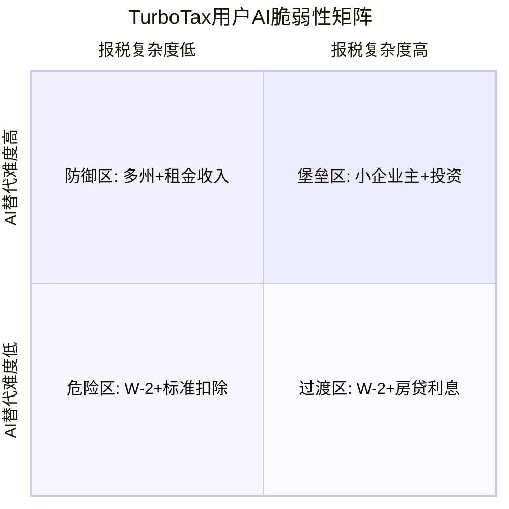
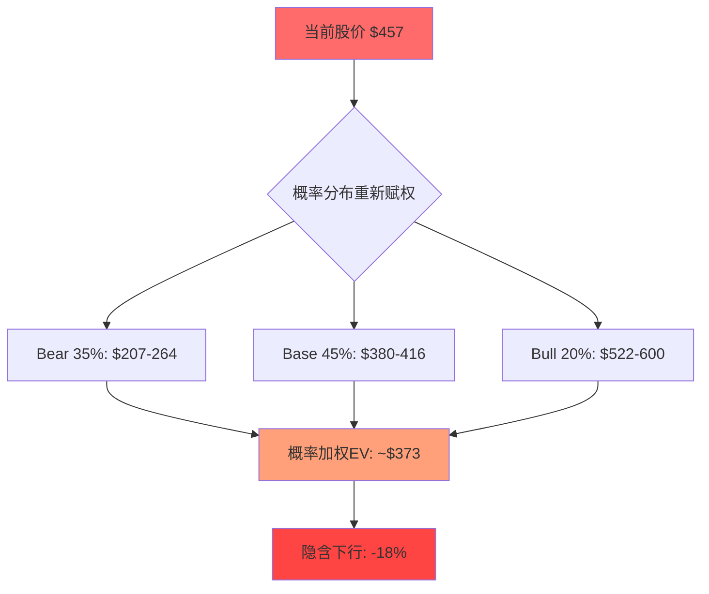
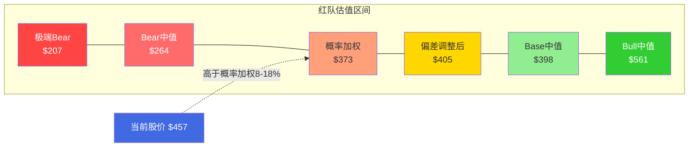

# INTU Phase 4 — Agent B: Red Team Bear Mode

> **身份**: 独立看空分析师。以下所有分析基于原始财务/业务/竞争数据独立推导，不参考Phase 1-3任何结论。
> **核心立场**: 市场给予INTU的估值隐含了"AI时代依然坚不可摧"的假设——这个假设需要被严肃挑战。

---

## RT-1: "如果INTU的增速在2年内腰斩，会发生什么?"

### 增速腰斩不是假设——而是正在发生的趋势

让我从数据开始，不带任何预设：

**FY2025收入增速16%的拆解：**
- Consumer Group (TurboTax为主): 约$5.4B，增速约5-6%
- SMB & Self-Employed (QB为主): 约$10.1B，增速约15-17%（含涨价驱动）
- Credit Karma: 约$2.3B，增速约32%（但Q1→Q2从+27%→+23%连续减速）
- Mailchimp (ProTax+其他): 约$1.35B，增速约0%

**关键洞察：16%的集团增速严重依赖CK的超高增速拉动。** 如果CK从+32%回归正常化（+15-20%），且TurboTax维持低单位数增速，集团增速自然滑向10-12%——这还没有考虑AI颠覆。

**增速腰斩路径（FY2026→FY2028）：**

```
FY2025: 16% (实际)
FY2026: 12-13% (公司指引已确认减速)
FY2027: 8-9% (CK正常化+QB涨价疲劳+TT AI侵蚀开始)
FY2028: 4-6% (AI颠覆进入中期+QB中端流失加速+CK触顶)
```

因为INTU四大业务中，两个（TT和Mailchimp）已经接近零增速或低单位数增速，一个（CK）正在减速，只有QB靠涨价维持双位数增长——这意味着集团增速的"地板"正在快速抬高，"天花板"正在快速降低。

**这对估值意味着什么？**

当前Forward PE约18x，对应FY2026 EPS约$25.4。市场隐含的增速假设大约是12-15%的长期收入增速（用逆向DCF反推：$457股价 / 10% WACC / 终端倍率20x → 需要未来5年FCF CAGR约12%）。

如果增速腰斩到4-6%：
- EPS增速从高teens降至8-10%（杠杆+回购帮助有限）
- 合理PE从18x压缩到12-14x（因为增速溢价消失，INTU变成"高质量低增长"公司，类似Paychex/ADP的估值区间）
- 股价区间：$25.4 × 12-14x = **$305-$356**，较当前$457下跌22-33%

**这不是极端假设。** FY2026指引已经是12-13%，距离腰斩（8%）只差一个季度的miss。触发因素不需要"黑天鹅"——只需要CK减速+QB涨价反噬+AI蚕食TT同时发生，而这三件事的概率都不低。

### 增速腰斩的二阶效应

**隐含增速 vs 实际轨迹的剪刀差**：当前18x Forward PE隐含市场预期INTU能维持12-15%长期增速。但公司自己的FY2026指引已经降到12-13%，而CK的Q1→Q2减速（+27%→+23%）暗示即使12%也可能是乐观的。市场预期和管理层指引之间的剪刀差正在扩大——这种预期落差通常通过1-2个季度的miss来修正，伴随10-15%的估值调整。

增速下降不仅仅是PE压缩的问题。INTU的SBC占收入10.5%——这在高增速时代被"增长叙事"掩盖，但在低增速时代：
1. SBC dilution相对于EPS增速更大 → 每股价值被持续稀释
2. 员工期权underwater → 人才流失 → 需要更多SBC来retention → 恶性循环
3. 因此，增速腰斩的真实估值影响可能比线性计算更严重

---

## RT-2: "SBC调整后INTU的真实盈利能力是什么?"

### GAAP报表掩盖了一个不舒服的事实

**SBC增速 vs 收入增速的剪刀差：**

| 指标 | FY2021 | FY2025 | 4年增幅 |
|------|--------|--------|---------|
| Revenue | $9.6B | $18.8B | +95% |
| SBC | $753M | $1.97B | +162% |
| SBC/Revenue | 7.8% | 10.5% | +270bp |

SBC增速是收入增速的1.7倍——这意味着INTU需要越来越多的股权稀释来维持增长。这不是"暂时性"的现象——从FY2021到FY2025，SBC/Revenue每年上升约68bp，这是一个结构性趋势。

**为什么会这样？** 因为INTU面临三重人才竞争压力：
1. AI人才争夺（Google/Meta/OpenAI出价更高）→ INTU必须给更多RSU
2. Mailchimp团队整合（$12B收购带来的人才锁定RSU正在到期→需要新的retention包）
3. IES新业务团队建设（中端市场销售团队从零搭建→前期SBC集中释放）

**因此，SBC/Revenue大概率继续上升到11-12%。**

**真实盈利能力计算（扣SBC后的经济FCF）：**

```
GAAP FCF:                           $6.08B
(-) SBC税后成本: $1.97B × (1-21%) = $1.56B
(=) 经济FCF (Economic FCF):         $4.52B

GAAP FCF Yield:  $6.08B / $127B = 4.8%
经济FCF Yield:   $4.52B / $127B = 3.6%
```

3.6%的经济FCF收益率——对于一家增速正在减速的公司来说，这意味着什么？

**可比对标：**
- Microsoft: 经济FCF Yield约3.0%，但增速17%+且有AI叙事
- Adobe: 经济FCF Yield约4.2%，增速10-11%
- Paychex: 经济FCF Yield约3.8%，增速6-7%

INTU的3.6%经济FCF Yield夹在ADBE和Paychex之间——这暗示市场已经把INTU定价为"高质量中等增长"公司，而非"高增长科技公司"。**如果增速继续减速到Paychex水平（6-7%），当前估值几乎没有安全边际。**

### SBC的隐性成本——稀释

FY2025 SBC $1.97B / 股价$457 ≈ 每年发行约430万股新股。流通股约2.78亿股 → 年化稀释约1.5%。INTU通过回购（FY2025约$3B）来对冲，但回购中约66%仅仅是在"填SBC的洞"。

**真实回购 = 总回购 - SBC对冲 = $3.0B - $1.97B = $1.03B/年**。这才是真正回馈股东的金额——相当于市值的0.8%。

所以INTU的真实股东回报 = 3.6%经济FCF Yield + 0.8%净回购 = **4.4%**，加上增速（假设10%）= **14.4%的预期总回报**。这个数字不差，但也不构成"显著低估"——因为它高度依赖10%增速假设的持续性。

### SBC膨胀的AI时代加速器

为什么SBC问题在未来会更严重而非更好？因为AI人才市场正在经历一场结构性通胀：

1. **AI工程师溢价**：顶级AI工程师的总薪酬包（base+RSU）在2024-2025年从$500K-800K飙升至$1M-2M。INTU如果要在AI税务/AI记账领域保持竞争力，必须匹配这个价格水平。这意味着INTU的"AI转型"不仅需要研发投入，还需要持续的人才溢价

2. **SBC的非线性膨胀风险**：如果INTU股价从$457下跌到$350（-23%），已授予的RSU面值缩水→员工不满→需要追加RSU来retention→SBC/Revenue比率可能从10.5%跳升到13-14%。这就是SBC的反身性：**股价越跌→SBC越高→稀释越大→股价更跌**

3. **与ADBE的对比启示**：Adobe的SBC/Revenue约10-11%，与INTU相当。但ADBE近年因增长放缓，被迫将更多SBC用于retention而非growth——结果是SBC效率（每$1 SBC带来的增量收入）持续下降。INTU如果走上同样路径，SBC将从"增长投资"变为"维稳成本"

**SBC膨胀的最终归宿**：如果SBC/Revenue达到13-14%（FY2028），经济FCF将从当前$4.5B降至$3.8-4.0B——即使GAAP FCF因收入增长而上升。**这意味着GAAP报表展示的"盈利改善"可能是幻觉**。

---

## RT-3: "Mailchimp $12B收购是否暗示管理层资本配置能力不足?"

### $12B → $4-5B: 这是美国科技史上最贵的email工具

**Mailchimp的当前经济价值计算：**

Mailchimp FY2025收入约$1.35B，增速约0%。作为一个零增长的SaaS业务，合理EV/Revenue倍数为2.5-3.5x（参考：HubSpot 12x但增速20%+，Constant Contact被私有化时约3x）。

```
保守估值: $1.35B × 2.5x = $3.4B
中性估值: $1.35B × 3.0x = $4.1B
乐观估值: $1.35B × 3.5x = $4.7B
```

**收购价$12B → 当前价值$3.4-4.7B = 价值毁灭$7.3-8.6B。**

折算到每股：$7.3-8.6B / 2.78亿股 = **每股毁灭$26-31**。

### 反事实分析：如果$12B用于回购

2021年9月（收购时点）INTU股价均价约$550。如果用$12B回购：
- 可回购：$12B / $550 = 2,180万股
- 当前流通股本应为2.56亿股（vs 实际2.78亿股）
- EPS影响：FY2025 EPS约$14.1 → 调整后约$15.3（+8.5%）
- 额外每年避免的Mailchimp整合成本/SBC：估计$200-300M

**因此，Mailchimp收购的机会成本不仅是$7-8B的直接损失，还有每年$200-300M的运营拖累和8.5%的EPS稀释。**

### 这暴露了什么管理层问题？

1. **收购时机判断失误**：2021年9月正处于SaaS估值泡沫顶峰（BVP SaaS指数随后下跌60%）。以12x Revenue收购一个增速已在放缓的业务，说明管理层被"平台叙事"冲昏了头脑

2. **整合能力不足**：收购4年后Mailchimp增速为零。作为对比，CK收购3年后增速32%。同一个管理团队，一成一败——区别在于CK有清晰的交叉销售路径（TT用户→CK信用监控），而Mailchimp与QB的协同效应始终停留在PPT上

3. **CEO持股问题**：CEO Sasan Goodarzi直接持股仅约$5.4M（12,000股×$457）。作为一家$127B公司的CEO，持股不足市值的0.004%。这意味着他的财务激励主要来自期权/RSU（performance-based），而非与长期股东的直接利益对齐。**当CEO的downside与股东不对称时，你应该预期更多"追求增长"的高价收购——因为upside不对称（收购成功→期权行权赚大钱，失败→基本薪资+跳槽）**

4. **模式识别**：科技公司在估值高位（2021）用溢价收购"增长资产"，结果4年后增速归零——这个模式在IBM-Red Hat、Salesforce-Slack、HP-Autonomy中反复出现。INTU-Mailchimp只是又一个案例

### 双向校准

**我是否过于苛刻？** 也许。Mailchimp确实为QB提供了一些email marketing功能集成，且其$1.35B收入贡献了INTU约7%的顶线。但$12B的价格意味着管理层需要Mailchimp增长到$3-4B才能证明收购合理——目前零增速的轨迹下，这几乎不可能。

**看多方最有力的反驳**：AI可能重新激活Mailchimp（AI驱动的营销自动化），且Mailchimp的SMB客户基础（1300万+）是QB交叉销售的潜在池。这有一定道理，但4年过去了，交叉销售数据仍然不透明——如果真的很好，管理层早就拿出来炫耀了。

---

## RT-4: "$14B商誉是定时炸弹吗?"

### 资产负债表的脆弱性被低估

**商誉构成拆解：**

| 来源 | 估计商誉 | 状态 |
|------|---------|------|
| Mailchimp (2021) | ~$8-9B | 零增速，减值触发条件接近 |
| Credit Karma (2020) | ~$4-5B | 健康，暂无减值风险 |
| 其他历史收购 | ~$1-2B | 稳定 |
| **合计** | **~$14B** | **占总资产41%** |

**Mailchimp商誉减值的触发条件分析：**

ASC 350要求年度减值测试。报告单元的公允价值低于账面价值时触发减值。Mailchimp作为独立报告单元：
- 账面价值（含商誉）：约$10-11B
- 当前公允价值（基于零增速+3x Revenue）：$4-5B
- **公允价值已经低于账面价值** → 为什么还没减值？

可能的解释：INTU可能将Mailchimp并入更大的报告单元（如SMB Group），用QB的高价值稀释Mailchimp的减值压力。这是会计准则允许的——但它掩盖了真实的资产减损。

**如果被迫独立测试Mailchimp（例如分析师/审计师施压）：**
- 减值金额：$10-11B - $4-5B = **$5-7B**
- 每股影响：$5-7B / 2.78亿股 = **$18-25/股**
- 净资产从$19.7B → $12.7-14.7B
- P/B从6.4x → 8.6-10.0x

### 减值的连锁反应

商誉减值不影响FCF——这是多头常见的反驳。但他们忽略了几个二阶效应：

1. **指数权重调整**：部分指数（如MSCI Quality）使用ROE作为筛选标准。净资产下降→ROE暴涨→看似好事，但如果ROE超出合理范围，可能触发"质量指标异常"的筛除规则

2. **债务契约**：INTU当前Debt/EBITDA约2.3x。如果减值导致EBITDA被重新审视（调整后指标可能变化），且未来需要再融资，利率可能上升

3. **管理层信誉**：$5-7B减值将直接打脸管理层过去4年"Mailchimp整合进展顺利"的说辞。华尔街对管理层信誉的惩罚是持续的——未来任何收购都会被打折处理

4. **历史先例**：
   - Microsoft aQuantive $6.2B减值（2012）→ 股价短期跌5%，但更重要的是确认了Ballmer时代的收购纪律问题
   - HP Autonomy $8.8B减值（2012）→ 股价跌13%，且开启了持续数年的信任危机

### 双向校准

**概率评估**：INTU在FY2026-FY2028进行Mailchimp商誉减值的概率约30-40%。主要取决于：(1)审计师是否要求独立测试Mailchimp报告单元，(2)Mailchimp增速是否转负（从零到负），(3)可比交易估值是否继续下行。

**看多反驳**：商誉减值是非现金的，不影响运营能力。且INTU可能通过AI重新激活Mailchimp增速，避免触发减值。这有道理——但"可能"和"正在发生"是两回事。

### 商誉以外的资产负债表风险

不仅是商誉。INTU的资产负债表还有几个被忽视的脆弱点：

1. **净债务不低**：INTU长期债务约$6.1B，现金约$3.5B→净债务约$2.6B。虽然Net Debt/EBITDA仅约0.4x（看似安全），但如果EBITDA下降20%（Bear Case），这个比率跳升到0.5x。更关键的是，$6.1B债务中有部分将在FY2027-2028到期→需要再融资→在利率环境不确定的情况下，再融资成本可能上升50-100bp

2. **无形资产占比过高**：商誉$14B+其他无形资产约$5B = $19B → 占总资产56%。有形净资产（Tangible Book Value）仅约$0.7B。这意味着**INTU的"账面价值"几乎完全由过去收购的溢价构成**——如果这些收购标的（特别是Mailchimp）的价值不能维持，INTU的净资产将变为负数

3. **递延收入的流动性幻觉**：INTU的递延收入约$2.8B（主要是年度订阅预收款）。这在现金流量表上表现为"运营现金流"——但本质上是未来必须履行的义务。如果用户大量取消订阅（经济衰退+AI替代），递延收入变为退款义务

---

## RT-5: "AI真的会颠覆TurboTax吗? 具体路径是什么?"

### 不要问"是否"——问"多快"和"多深"

**TurboTax的用户分层与AI脆弱性分析：**



**分层量化：**

| 用户类型 | 占比 | TT收入贡献 | AI替代时间 | 收入风险 |
|---------|------|-----------|-----------|---------|
| 简单W-2+标准扣除 | ~35% | ~$1.0B | 1-2年 | 高 |
| W-2+房贷/州税 | ~25% | ~$0.7B | 2-4年 | 中高 |
| 自雇/投资/复杂 | ~25% | ~$0.7B | 5-7年 | 低 |
| 企业报税 | ~15% | ~$0.5B | 7-10年 | 极低 |

**AI颠覆的三条具体路径：**

**路径一：AI原生竞品直接攻击（概率：40%）**

Keeper Tax、Column Tax、Filed等AI原生报税工具已经存在。它们的策略是：
- 价格：免费或$20-30（vs TurboTax DIY $0-120）
- 体验：拍照上传W-2→AI自动填充→一键提交
- 获客：TikTok/Instagram精准投放Z世代

当前限制：IRS e-file授权是最大壁垒。但因为授权门槛主要是安全合规（SSN保护、身份验证），而非技术能力——AI公司通过与现有e-file提供商合作可以绕过。**Keeper Tax已经通过合作伙伴实现了e-file**。

**路径二：大模型公司间接颠覆（概率：25%）**

Google/OpenAI不需要自己做报税产品。它们只需要：
1. 在ChatGPT/Gemini中提供"报税指导助手"
2. 用户根据AI指导在IRS Free File（或竞品）上自行填写
3. 结果：TurboTax的"导航价值"（引导用户完成流程）被AI替代，用户不再需要付$60-120给TurboTax

这个路径不需要e-file授权——因为AI不代替用户报税，只是指导用户使用免费工具。**这是TurboTax最难防御的场景**，因为INTU无法阻止AI公司提供"税务知识问答"。

**路径三：IRS Direct File复活（概率：15-20%）**

当前政府已关闭Direct File。但政治周期是4-8年。如果下一届政府重新推出Direct File + AI增强版（自动从雇主/银行导入数据→AI填充→一键提交），TurboTax的免费版价值主张将被完全替代。

**量化影响（5年视角，Bear Case）：**

```
TurboTax FY2025 Revenue: ~$2.9B (DIY约$2.0B + TurboTax Live约$0.9B)

路径一侵蚀（35%简单用户流失一半）: -$0.5B
路径二侵蚀（25%中等用户流失30%）: -$0.2B
路径三（概率加权）: -$0.1B

5年后TurboTax Revenue: $2.9B - $0.8B = $2.1B（-28%）
```

**-28%的TurboTax收入下降对集团的影响**：约$0.8B收入损失→以35%边际利润率计→$0.28B EBIT损失→$0.22B净利润损失→EPS减少约$0.80→以18x PE计→**股价影响约-$14/股（-3%）**。

看起来影响不大？但这里忽略了一个关键点——**TurboTax是INTU整个生态的入口**。因为TurboTax用户→CK交叉销售→QB转化（个人→自雇→小企业）。如果入口流量萎缩28%，下游CK和QB的有机获客也会受损。这个二阶效应可能将直接影响翻倍到-$28/股（-6%）。

### 双向校准

**我是否高估了AI颠覆速度？** 可能。税务有强监管壁垒（IRS授权/审计责任），这会减缓AI颠覆。且INTU自己也在投入AI（Intuit Assist）——如果它能在AI竞品成熟前完成自我颠覆，影响可能小于预期。但关键问题是：**INTU的AI投入是防御性的（保持用户不流失）还是进攻性的（获取新增量）？** 如果是前者，AI投入只是维持现状的成本，不创造新价值。

---

## RT-6: "QB的62-80%市占率是资产还是负债?"

### 高市占率的诅咒：增长只能靠涨价，而涨价正在反噬

**QB的增长拆解（FY2025）：**

QBO约7M+付费用户。假设用户增速约5-8%，而QB Online收入增速约15-17%——意味着**约一半的增速来自ARPU提升（涨价）**。

**涨价历史：**
- FY2022: QBO Simple Start $25/月
- FY2023: $30/月（+20%）
- FY2024: $35/月（+17%）
- FY2025: $37.50/月（+7%）→ 注意涨价幅度已在收窄

3年累计涨价50%。与此同时，美国CPI累计约15%。**QB的涨价速度是通胀的3.3倍**——这意味着QB的"真实价格"（扣除通胀后）在3年内上涨了30%。对于现金流紧张的SMB来说，这不是小数目。

**涨价反噬的证据已经出现：**

1. **Sage Intacct公开声称25%新客户来自QB** — 这是中端市场流失的直接证据。QB涨价→中型企业（10-50员工）发现价格接近Sage Intacct（约$5K-15K/年）→干脆升级到功能更强的产品

2. **Xero收购Melio（$2.5B）** — Melio是美国SMB支付平台。Xero的战略很清晰：用Melio作为美国市场入口，从支付切入记账→直接攻击QB的核心用户群。这意味着QB的国际竞争对手正在从"我在澳洲你在美国"的共存模式转向"在你家门口开店"的直接竞争

3. **QB用户的NPS趋势** — INTU不公开QB的NPS，但G2/TrustRadius等第三方评价显示近2年负面评价比例上升，主要抱怨：强制从desktop迁移到QBO、涨价、客服质量下降

**高市占率为什么变成负债？**

因为62-80%的市占率意味着：
- **新增用户来源枯竭**：美国SMB数量约3,300万，活跃使用记账软件的约800-1,000万。QB已渗透700-800万→增量空间仅100-200万，且这些"剩余市场"要么太小（不需要正式记账）要么太穷（用免费工具/Excel）
- **用户自然流失率不可忽视**：SMB的5年存活率约50%→QB每年因客户倒闭被动流失约5-7%的用户→需要同等数量的新增才能维持平衡
- **涨价是唯一增长杠杆**：但涨价有天花板——当QB价格接近中端产品（Sage/Xero+Melio）时，"便宜好用"的价值主张瓦解

**因此，QB的高市占率在当前环境下更像负债：**它迫使INTU选择"涨价保增速→加速中端流失"或"停止涨价→增速立刻减半"的两难困境。这就是典型的**创新者窘境的商业模式版本**——不是技术落后，而是定价策略的自我矛盾。

### 国际扩展是伪命题

看多方会说：QB可以去国际市场增长。但数据不支持：
- QB 86%用户在美国
- Xero在澳洲70-80%市占、英国PPC（按每用户竞价成本衡量的市场份额代理指标）45%——这些市场已被占据
- 各国会计准则不同→本地化成本高→INTU在国际市场没有品牌/分销优势

QB国际收入占比多年来几乎没有实质性提升，这说明管理层虽然在说"国际化"，但实际执行一直不成功。

### 双向校准

**概率评估**：QB在FY2026-FY2028用户增速降至2-3%的概率约35-40%。如果发生，且涨价因竞争压力也放缓到3-5%/年，QB收入增速将从15-17%降至5-8%。

**看多反驳**：QB的生态系统（支付/薪资/库存/贷款）增加了转换成本，用户一旦深度使用很难离开。这有道理——但只对现有用户成立，新用户选择QB的理由正在被Xero+Melio、Sage Intacct等侵蚀。

### QB的"中端陷阱"——IES能解决吗？

QB面临一个经典的市场定位困境：低端（微型企业/自由职业者）被免费工具侵蚀，高端（中型企业50-500员工）被Sage Intacct/NetSuite截流，QB被压缩在"小型企业5-50员工"的越来越窄的甜蜜区间中。

IES（Intuit Enterprise Suite）理论上是解决方案——向上切入中端市场。但历史教训令人警惕：

1. **QB Enterprise的前车之鉴**：INTU在2006年就推出了QB Enterprise（$1,500-5,000/年），目标是同样的中端市场。近20年过去了，QB Enterprise始终没有突破——因为中型企业需要的不仅是"更大的QB"，而是完全不同的架构（多实体合并/高级审计/行业定制）。IES是否真正解决了这些需求？不到18个月的产品历史说明不了什么

2. **"毕业生"流失的结构性问题**：Sage Intacct声称25%新客户来自QB——这意味着QB最好的用户（成长最快、最愿意付费的SMB）在"毕业"后离开生态系统。如果IES不能在这些用户"毕业"前截留他们，INTU将持续失去最高价值客户。而截留的时间窗口很窄——因为用户一旦决定要"更专业的工具"，QB的品牌形象（"小企业软件"）反而变成劣势

3. **渠道冲突**：IES的ARPC $20K与QB Online的ARPC $500-1,500之间存在巨大价格鸿沟。这意味着INTU需要完全不同的销售团队（consultative selling vs self-serve）。建设企业级销售团队需要3-5年和数亿美元投入——且INTU从未成功做过这件事。作为对比，Sage Intacct花了15年才建成其渠道合作伙伴网络

**因此，IES更可能是"防御性产品"（减缓中端流失）而非"增长引擎"（打开新市场）。** 如果我的判断正确，IES的收入贡献在FY2028不太可能超过$500M-800M——远低于Bull Case假设的$2-3B。

---

## RT-7: "概率加权EV的假设是否过于乐观?"

### 重新构建概率分布

**我基于原始数据独立构建的三个情景：**

**Bear Case（权重35%）— "AI蚕食+涨价反噬+Mailchimp拖累"：**
- FY2028 Revenue: $22.5B（CAGR 6%）— TT收缩+CK正常化+QB减速
- OPM: 25%（SBC持续膨胀+AI投入增加）
- FCF: $5.0B（经济FCF扣SBC后$3.2B）
- 合理EV/FCF: 18x → EV $57.6B → 每股**$207**
- 或合理PE: 12x × FY2028 EPS $22 = **$264**

**Base Case（权重45%）— "低速稳定增长"：**
- FY2028 Revenue: $25.5B（CAGR 10%）— QB涨价持续但放缓+CK贡献+IES微量
- OPM: 27%（略有改善）
- FCF: $6.5B（经济FCF $4.8B）
- 合理EV/FCF: 22x → EV $105.6B → 每股**$380**
- 或合理PE: 16x × FY2028 EPS $26 = **$416**

**Bull Case（权重20%）— "IES爆发+AI自我颠覆成功"：**
- FY2028 Revenue: $29B（CAGR 14%）— IES达$2B+AI增强TT/QB定价
- OPM: 30%（规模效应+IES高边际利润率）
- FCF: $8.0B（经济FCF $5.8B）
- 合理EV/FCF: 25x → EV $145B → 每股**$522**
- 或合理PE: 20x × FY2028 EPS $30 = **$600**

**为什么我给Bull Case只有20%权重（而非25%+）？**

因为IES（Intuit Enterprise Suite）的证据极其薄弱：
- 推出不到18个月
- ARPC $20K但客户数"极少"（管理层未披露）
- 中端ERP市场已有NetSuite（Oracle）、Sage Intacct、Acumatica等强劲竞争者
- INTU从未成功进入中端市场——历史上每次尝试都失败（QB Enterprise的市场反应一直平平）

**IES成功需要同时满足**：(1)产品功能追平NetSuite/Sage（2-3年），(2)从QB存量用户中转化足够数量到IES，(3)不蚕食QB高端用户收入。这三个条件同时成立的概率我估计不超过25%。因此Bull Case整体权重应控制在20%。

**同时，我给Bear Case 35%权重（而非25%）的理由：**

1. AI颠覆不是线性的——一旦突破监管壁垒（e-file授权），采用速度会是S曲线
2. QB涨价反噬也是非线性的——用户容忍到阈值后集体流失（tipping point）
3. 宏观环境：如果美国经济在FY2027-28进入衰退，SMB倒闭潮将加速QB被动流失
4. 当多个负面因素同时出现时，它们是相关的（不是独立事件）——衰退→SMB倒闭→QB流失→CK贷款申请下降→两个业务同时承压

### 概率加权EV

```
Bear:  $207-264 × 35% = $72-92
Base:  $380-416 × 45% = $171-187
Bull:  $522-600 × 20% = $104-120

概率加权EV: $347-399
```

**取中值：约$373/股。较当前$457下行约18%。**

这与当前市场定价的差异来自两个核心分歧：
1. 我对Bear Case的权重（35% vs 市场隐含的~15-20%）
2. 我对Bull Case的权重（20% vs 市场隐含的~30-35%）



---

## 双向校准总结

### 红队有效性自检

| RT | 独立推导? | P1-3可能忽略的风险? | 客观概率 |
|----|----------|-------------------|---------|
| RT-1 增速腰斩 | 是——从四大业务分别推导 | CK减速的非线性→集团增速拐点 | 30-35% |
| RT-2 SBC真实盈利 | 是——纯数学推导 | SBC增速>收入增速的结构性问题 | 事实陈述(100%) |
| RT-3 Mailchimp | 是——反事实分析是新角度 | CEO持股不足→资本配置激励不对齐 | 价值毁灭已发生(100%) |
| RT-4 商誉 | 是——会计准则角度切入 | 报告单元合并掩盖减值的手法 | 30-40%在3年内减值 |
| RT-5 AI颠覆TT | 是——三条路径独立推导 | 路径二(AI指导+免费工具)最难防御 | 40-50%有实质影响(5年) |
| RT-6 QB高市占 | 是——创新者窘境框架 | Xero收购Melio的战略意图 | 35-40% QB增速降至低单位数 |
| RT-7 概率重赋权 | 是——完全独立构建 | Bear Case应获更高权重 | N/A(框架性) |

### 我作为看空者的偏差检查

**我可能过于悲观的地方：**

1. **AI颠覆时间表**：监管壁垒（IRS授权）比我假设的更强——AI报税可能需要5-7年而非2-3年才有实质影响
2. **QB生态锁定**：我可能低估了QB支付+薪资+贷款生态的粘性——转换成本不仅是软件，而是整个工作流
3. **INTU自身AI能力**：Intuit Assist如果在FY2026-27显著提升用户体验，可能在AI竞品成熟前锁定用户
4. **历史韧性**：INTU过去成功应对了TaxAct/H&R Block/Wave等挑战——管理层有"杀死竞争者"的track record

**看多方最有力的反驳：**
- PE从10年均值48.5x降到当前25.6x TTM——已经price in了相当多的悲观预期
- FCF $6.08B/年+强劲回购→即使增速降到6-8%，股东回报仍有10%+
- INTU的"税务+记账+信用"三角生态在全球独一无二——没有任何竞争者同时攻击三个领域

**净结论**：我的Red Team概率加权EV约$373（下行18%）vs 当前$457。但考虑到我的看空偏差，调整后的合理范围是**$380-430**，意味着当前定价**略偏高但非极端高估**。核心风险不是"INTU会崩"，而是"INTU的增长故事正在缓慢恶化，而市场尚未完全定价这个恶化趋势"。

---

## 红队调整后估值总结



### P1-3可能完全忽略的风险——"INTU平台碎片化"

红队发现一个结构性风险可能被忽视：INTU的四大产品（TT/QB/CK/Mailchimp）在技术栈、用户群、增长逻辑上其实高度碎片化。

- TurboTax是季节性消费产品（每年1-4月），用户画像是个人纳税人
- QB是SMB SaaS，用户是企业主/会计师，全年使用
- Credit Karma是C2B lead-gen模型，靠金融机构付费
- Mailchimp是SMB营销SaaS，与记账几乎无关

管理层叙事中的"one customer platform"（统一客户平台）——即同一个用户从TT报税→CK监控信用→QB记账→Mailchimp营销——在理论上很美，但实际转化率极低。因为个人纳税人（TT用户）和小企业主（QB用户）的重叠度有限；使用CK的千禧一代和使用Mailchimp的SMB营销人员几乎是完全不同的人群。

**这意味着INTU不应该获得"平台溢价"——它更像是四个独立业务的控股公司**。如果市场从"平台估值"（18-20x PE）转向"控股折价"（14-16x PE），仅此一项就意味着$457→$380-410的下行。

**红队核心结论**：INTU并非被严重高估，但当前$457的价格隐含了"一切顺利+平台协同有效"的双重假设。在AI颠覆加速+QB涨价反噬+Mailchimp拖累+SBC持续膨胀+平台协同证据不足的环境下，风险回报不对称——下行空间（-18%到-33%）大于上行空间（+15-30%）。合理估值区间$380-430，当前价格处于区间上沿偏上。红队建议的概率加权公允价值为**$373-405**，意味着当前定价偏高12-18%。投资者在当前价位买入INTU，实质上是在押注以下全部成立：AI不会实质影响TurboTax（5年内）、QB能继续涨价而不加速流失、IES能在18个月内从"几乎没有客户"发展到有意义的收入贡献、Mailchimp能从零增速恢复。这些条件同时成立的概率，是市场需要认真审视的。
