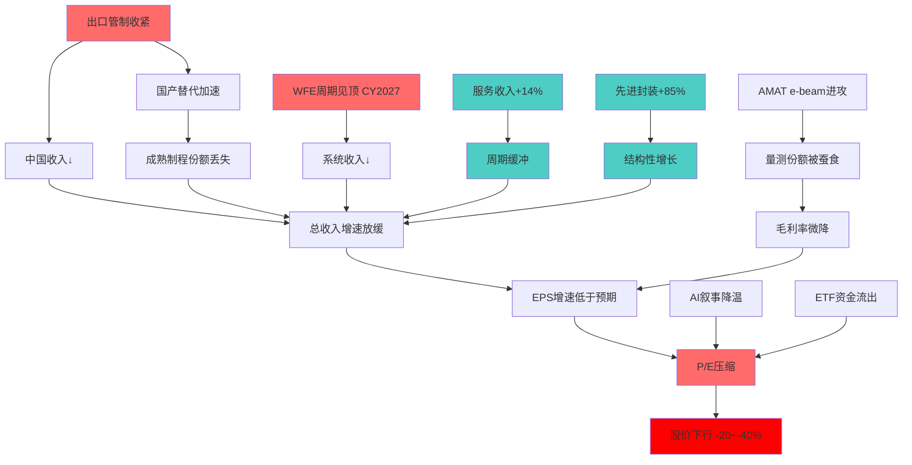
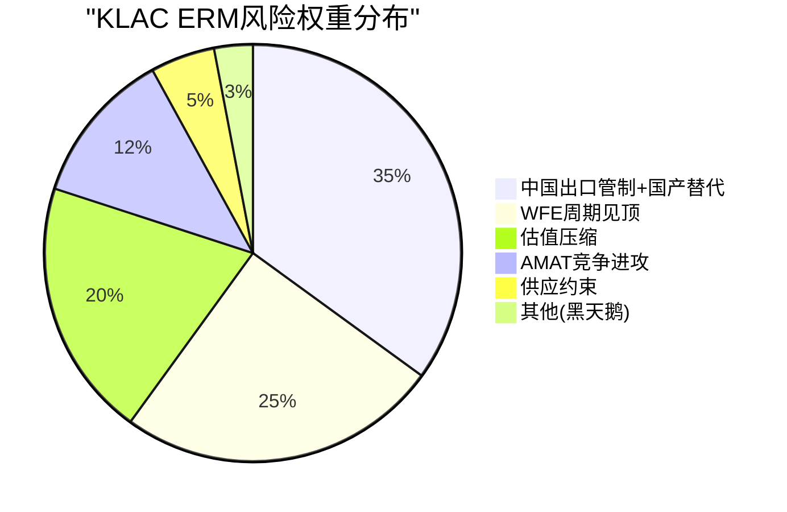
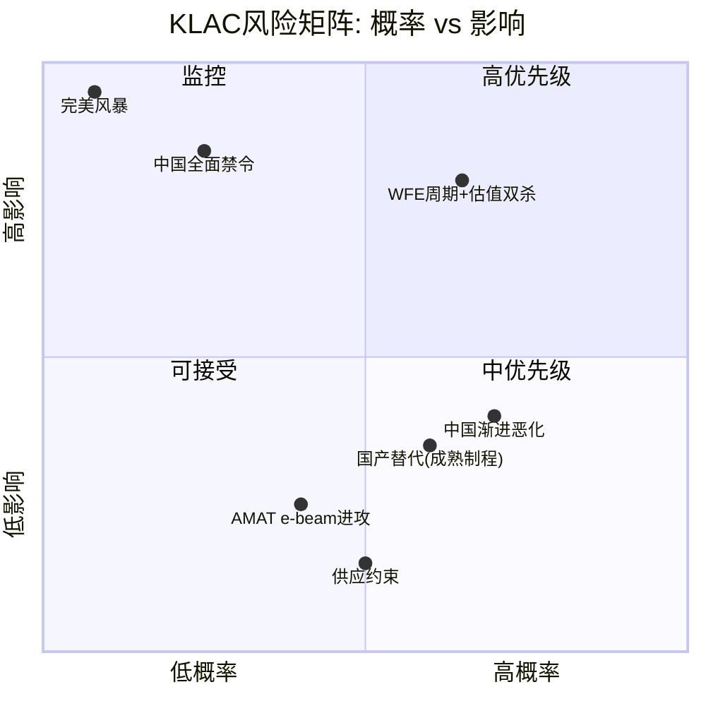

# KLAC Phase 1 — Agent B: ERM五层风险审计 + L4验证

> Agent B — 独立风险审计员 | Phase 1 | 2026-02-17
> DM前缀: DM-RISK-1xx / DM-GEO-1xx
> CQ覆盖: CQ4(中国双重风险) / CQ7(WFE周期) / CQ1(竞争威胁B视角)

---

## 第四部分: 行业背景概要

### 4.1 WFE市场结构

全球WFE(晶圆厂设备)市场CY2025规模约$110-120B,预计CY2026达到$120-135B,CY2027可能触及$156B创历史新高(DM-RISK-101)。过程控制(检测+量测)占WFE总支出的12-15%,即TAM约$15-20B(CY2026E)。KLAC在过程控制领域占据约63%份额,对应收入$9.5-12.6B(含服务和非半导体业务)(DM-RISK-006)。

值得注意的是,过程控制TAM的增长率(~5-6.5% CAGR)低于WFE整体增速。但这一趋势正在被两个因素抵消: (1)先进制程(2nm/GAA)使检测强度提升90-100bps; (2)先进封装检测市场从近零增长至$12B(DM-BIZ-002)。

### 4.2 设备四巨头定位

半导体设备行业由四家公司定义格局:

| 巨头 | 核心领域 | CY2025收入 | 护城河来源 |
|------|---------|-----------|-----------|
| ASML | 光刻 | ~$30B | 物理极限垄断(EUV唯一供应商) |
| AMAT | 沉积/刻蚀/量测 | ~$28B | 产品线广度(最全) |
| LRCX | 刻蚀/沉积 | ~$17B | 刻蚀深度专注 |
| KLAC | 检测/量测 | ~$13B | 过程控制垄断+数据网络效应 |

KLAC的独特定位在于: 检测贯穿每个制程步骤,fab不可能"跳过"检测来削减成本。当制程复杂度上升时(3nm→2nm→1.4nm),缺陷种类和检测需求指数级增加,而沉积/刻蚀设备的需求与晶圆产能更线性相关(DM-RISK-007/ASML报告)。

### 4.3 检测在fab工作流中的角色

一个典型的先进逻辑fab(如TSMC 3nm)拥有1,000+个制程步骤,其中约15-20%的步骤后需要检测/量测。检测设备的角色类似于"质量保险" — 良率每提升1%可为fab节省数千万美元。KLAC的装机量>15,000台覆盖全球主要fab,30+年缺陷数据库构成了无法复制的"数据护城河"(DM-BIZ-005)。

AMAT在其报告中评估KLAC的单一市场深度为9/10,利润率10/10,周期防御8/10 — 这是来自最大竞争对手的直接确认(DM-RISK-007)。

---

## 第一部分: ERM五层风险映射

### 第1层: 中国出口管制风险 (CQ4, 15%权重, I型 — 最核心)

#### 1.1 直接收入影响量化

中国是KLAC第二大市场(26%收入),仅次于台湾(30%)(DM-GEO-001)。出口管制对KLAC的影响呈现逐步递减但未消除的态势:

| 时期 | 中国收入占比 | 出口管制影响 | 净影响 |
|------|-----------|------------|--------|
| FY2025 Q1 (Sep24) | ~42% | 管制前高基数 | 正常 |
| CY2025 | ~26-30% | ~$500M限制 | -$500M |
| CY2026E | ~25-28% | ~$300-350M限制(缓解) | -$300-350M |
| CY2027E+ | ~20-25%(推断) | 取决于政策走向 | -$200M~-$1B+ |

(DM-GEO-101)

管理层在FY2026 Q2 Earnings Call中确认: CY2025出口管制影响约$500M,CY2026预计降至$300-350M(DM-BIZ-002)。这一"缓解"的原因是: (1)部分出口许可证获批; (2)中国客户需求结构调整(从先进制程转向成熟制程); (3)管理层预期中国收入占比维持"mid-to-high 20%"。

但Agent B认为管理层的乐观预期需要审慎对待。FY2025 Q1中国收入曾冲高至42%,这反映了管制前的抢购效应。真正的"正常化"水平可能低于管理层指引的25-28%。

#### 1.2 三情景建模

**S1: 现状维持 (概率50%)**
- 假设: 出口管制范围不扩大,现有许可证制度延续,中国成熟制程fab继续采购
- 中国收入: 从26%渐降至20-22%(CY2028)
- 年化影响: -$300M(vs无管制基准)
- KLAC总收入影响: -2.5%
- 风险评分: 概率50% x 影响-2.5% = **-1.25%** (DM-RISK-102)

**S2: 进一步收紧 (概率25%)**
- 假设: 检测设备被列入全面禁令(类似EUV光刻机级别限制),或对华销售需逐台审批
- 触发条件: 台海危机升级/中国先进封装突破/美国大选后政策转向
- 中国收入: 从26%骤降至8-12%
- 年化影响: -$1.0-1.5B(占总收入8-12%)
- KLAC总收入影响: -8~-12%
- 毛利率影响: 因检测设备高毛利率,利润影响放大至-12~-18%
- 风险评分: 概率25% x 影响-10% = **-2.5%** (DM-RISK-103)

关键逻辑: 检测设备的出口管制升级概率低于沉积/刻蚀设备,原因是检测本身不直接提升制造能力(不像光刻/刻蚀决定线宽)。但如果政策制定者采取"一刀切"策略(所有半导体设备禁运),检测不会被豁免。

**S3: 适度放松 (概率25%)**
- 假设: 中美关系阶段性缓和,出口许可证范围扩大,成熟制程检测设备全面解禁
- 中国收入: 稳定25-28%
- 年化影响: <$200M
- KLAC总收入影响: <-1.5%
- 风险评分: 概率25% x 影响-1.5% = **-0.375%** (DM-RISK-104)

**概率加权年化影响: -1.25% + (-2.5%) + (-0.375%) = -4.125%**

这意味着出口管制预期每年削减KLAC收入约4%,或约$500-530M(基于FY2026E $13.4B收入)。

#### 1.3 国产替代: 永久丢失风险

这是CQ4的"第二刃" — 即使出口管制放松,被国产设备替代的市场份额不会回来。

**SiCarrier (赛思凯瑞)**

SiCarrier于2021-2022年成立,在SEMICON China 2025一次性发布31款新产品(涵盖刻蚀/沉积/检测/量测六大类),宣称"100%国产可控"(DM-GEO-102)。其检测产品线包括:
- 光学检测(BFI): 明场检测,针对成熟制程(28nm+)
- 光学量测(IBO): 膜厚/CD量测
- 电子束检测: 目标20nm制程(vs KLAC/AMAT的2nm+能力)
- 总计13种检测/量测工具

**技术差距评估**:

| 维度 | KLAC | SiCarrier | 差距 |
|------|------|-----------|------|
| 最先进制程覆盖 | 2nm/GAA | ~20nm | **>10代** |
| 检测灵敏度 | 亚纳米级 | 微米/亚微米级(推断) | 1000x+ |
| 装机量 | >15,000台 | <100台(推断) | >150x |
| 缺陷数据库 | 30+年 | <3年 | 不可量化 |
| 软件生态 | Klarity/5D/AI | 起步阶段 | >10年 |

(DM-GEO-103)

**中科飞测 (Zhongke Feice)**

中科飞测是中国量检测设备领域的上市公司,产品覆盖无图案晶圆缺陷检测、图案晶圆缺陷检测、3D形貌测量和膜厚测量。2023年首次进入中国半导体设备TOP 10(第8位)。国内市场份额超过5%,但在全球市场份额不足1%。

**东方晶源 (Dongfang Jingyuan)**

东方晶源聚焦电子束(e-beam)检测,产品覆盖20nm以上制程,为SMIC等国内fab提供检测方案。但其设备的检测精度、吞吐量和可靠性与KLAC/AMAT的差距仍在5-8代以上。

**Agent B永久丢失评估**:

短期(CY2025-2027): 中国国产替代主要威胁成熟制程(28nm+)市场。这部分市场约占KLAC中国收入的40-50%(~$1.3-1.6B)。国产替代渗透率可能从当前<5%提升至15-25%,对应KLAC损失$100-250M/年。

中期(CY2028-2030): 如果出口管制持续,中国fab将被迫加速采用国产设备,渗透率可能达到40-60%的成熟制程市场。先进制程(7nm以下)仍无国产替代威胁。

长期(CY2030+): 技术追赶路径漫长但并非不可能。中国在e-beam领域的投入可能在10-15年内缩小与KLAC的差距至2-3代 — 但这取决于持续的资金投入和人才积累。

**永久丢失风险量化**: 中国成熟制程检测市场约$1.5-2.0B(KLAC中国收入的45-55%)。5年内可能丢失30-50%,即$450M-$1.0B的不可逆收入损失(DM-GEO-104)。

#### 1.4 地理替代可能性: 印度/东南亚fab建设

出口管制导致的中国收入损失能否被其他地区补偿?

**印度fab进展**:
- Tata Electronics-PSMC合资fab(Dholera, Gujarat): 投资$110B INR,2026年底投产,月产能50,000片晶圆
- RIR Power Electronics SiC fab(Odisha): 2028年投产
- 但这些fab均为成熟制程(28nm+),检测设备需求相对较低

**东南亚扩张**:
- SEMI预计2025年有18座新fab开工,亚洲占23座(含日本/新加坡/印度/韩国/台湾)
- 新加坡: GlobalFoundries/Micron扩产
- 马来西亚: Intel封装扩产

**替代效果评估**:
- 印度/东南亚新fab的检测设备需求(CY2026-2028): 估计$200-400M/年
- vs 中国潜在损失($500M-$1.5B/年): 替代率仅20-40%
- 结论: **地理替代无法完全弥补中国损失**,但可部分缓冲(DM-GEO-105)

#### 1.5 政策催化剂日历 (2026关键日期)

| 时间 | 事件 | 影响方向 | 概率 |
|------|------|---------|------|
| 2026 Q1 | BIS年度出口管制审查 | 可能收紧/维持 | 中 |
| 2026 Q2 | 荷兰/日本对华设备限制更新 | 多边协调可能强化 | 中 |
| 2026 H2 | 美国中期选举前政策 | 对华强硬立场加码 | 中-高 |
| 2026全年 | 中国CHIPS Act 2.0响应 | 加速国产替代 | 高 |
| 不确定 | 台海危机升级 | 极端情景触发器 | 低(但影响极端) |

(DM-GEO-106)

**CQ4 P1置信度建议**: 55% (初始60%, 下调理由: 永久丢失风险被低估,管理层对中国收入的指引过于乐观,SiCarrier的发展速度超过2年前预期)

---

### 第2层: WFE周期风险 (CQ7, 10%权重)

#### 2.1 历史WFE周期回测: KLAC表现

KLAC收入的周期性弱于同行,但并非免疫。基于FMP年报数据(DM-FIN-001)和历史回测:

| 周期 | WFE变动 | KLAC收入变动 | KLAC vs WFE | 备注 |
|------|---------|------------|-------------|------|
| FY2019 (P4见顶后) | ~-16% | $4.57B(含Orbotech, +13%) | 逆周期 | Orbotech收购扭曲 |
| FY2020 (COVID) | ~-5% | $5.81B(+27%) | 逆周期 | 服务+Orbotech |
| FY2023→FY2024 (调整) | ~-6% | $9.81B(-6.5%) | 同步 | 首次同步下降 |

(DM-RISK-105)

关键发现: 剔除Orbotech收购效应后,KLAC在FY2019周期下行中的有机收入增长约为-5~-8%,显著好于WFE整体的-16%。FY2024的-6.5%下滑几乎与WFE同步,但绝对降幅远小于AMAT(-2.1%)和LRCX(部分抵消)。

**服务收入的关键缓冲作用**: FY2024期间,KLAC服务收入仍保持14% YoY增长,这意味着系统收入(设备销售)的下降幅度约为-10~-12%,被服务增长部分抵消。52个季度连续增长的服务收入(~$2.68B, 22%占比)是KLAC最强大的周期防御工具(DM-BIZ-006)。

#### 2.2 检测vs沉积vs刻蚀: 周期下行谁受伤最深?

这是CQ7的核心问题。理论上,检测应该比沉积/刻蚀更抗周期,原因是:

1. **不可跳过性**: fab可以推迟新设备采购(沉积/刻蚀),但无法跳过在产晶圆的检测
2. **良率导向**: 下行期fab更注重良率优化(降本),检测需求可能逆周期上升
3. **服务锁定**: 检测设备的服务合同是长期的,不随周期波动

历史数据验证:

| FY2023→FY2024 | 收入变动 | Op Margin变动 |
|---------------|---------|--------------|
| KLAC | -6.5% | -1.0pp |
| LRCX | -14.9% | -4.5pp |
| AMAT | -2.1% | -1.8pp |
| ASML | -4.9% | -3.0pp |

(DM-RISK-106)

KLAC的-6.5%优于LRCX(-14.9%),但弱于AMAT(-2.1%)。这一结果需要上下文: AMAT的产品线极度多元化(沉积+刻蚀+检测+服务),其-2.1%反映的是组合效应而非单一业务韧性。如果只看AMAT的AGS(检测/量测)收入,下降幅度可能更小。

**结论**: 检测确实比纯刻蚀更抗周期,但并非完全免疫。在WFE下行10%的情景中,KLAC预期下降5-8%(即beta约0.5-0.8x)。

#### 2.3 CY2027 WFE见顶概率评估

SEMI最新预测(2026年2月): 全球半导体设备销售CY2025 $133B → CY2026 $145B → CY2027 $156B(创纪录)(DM-RISK-107)。

历史WFE周期时长:
- P3扩张(2020-2022): 3年
- P4调整(2023): 1年(极短)
- P5复苏(2024): 1年
- P6再扩张(2025-2027E): 预计2-3年

当前周期特殊性:
1. **AI驱动延长**: 先进逻辑+HBM+先进封装三重需求叠加,非传统DRAM/NAND驱动
2. **多区域fab建设**: CHIPS Act(美国/欧盟/日本)+ 中国自主扩产 = 地理多元化需求
3. **制程复杂度飞升**: 2nm GAA/背面供电/先进封装 = 每美元收入的设备强度上升

Agent B的概率评估:

| 见顶时间 | 概率 | 理由 |
|---------|------|------|
| CY2026 H2 | 15% | 提前见顶: 中国需求骤降+AI投资暂停 |
| CY2027 | 45% | 基准情景: SEMI预测的$156B高点 |
| CY2028+ | 30% | AI超级周期延长,制程升级持续 |
| 不见顶(结构性增长) | 10% | AI重构半导体需求曲线 |

(DM-RISK-108)

**概率加权见顶时间: CY2027中期**(与共识一致)

见顶后的下行幅度预估: 基于历史周期(2019 -16%, 2023 -6%),下一次下行可能在-8~-15%范围。对KLAC的影响: 收入下降4-10%,持续1-2年。

#### 2.4 服务收入的周期缓冲效应量化

| 指标 | FY2024(下行) | FY2025(复苏) | 变动 |
|------|-------------|-------------|------|
| 系统收入(est) | ~$7.1B | ~$9.5B | +33% |
| 服务收入 | ~$2.4B | ~$2.68B | +12% |
| 服务占比 | ~24% | ~22% | -2pp |
| 总收入 | $9.81B | $12.16B | +24% |

(DM-RISK-109)

关键观察: 下行期(FY2024)服务收入占比从~22%升至~24%(自动稳定器效应)。服务收入$2.4B提供了约$1.2B的毛利缓冲(假设>50%服务毛利率)。

**量化模型**: 在WFE下行15%的极端情景中:
- 系统收入下降: -15% x 0.6(检测beta) = -9%,即-$850M
- 服务收入增长: +8-10%(装机量增长驱动),即+$200-250M
- 净收入影响: -$600-650M(-5~-5.5%)
- 毛利率影响: 因服务占比上升,毛利率反而可能+0.5pp

这证实了ASML报告对KLAC"周期敏感度LOW"的评估(DM-RISK-007)。

**CQ7 P1置信度建议**: 65% (初始50%, 上调理由: 历史数据强烈支持检测的抗周期特性,服务收入缓冲效应可量化验证,AI超级周期延长见顶时间)

---

### 第3层: AMAT竞争进攻风险 (CQ1 B视角, 20%权重)

#### 3.1 AMAT e-beam战略评估

AMAT是KLAC在检测/量测领域最具野心的挑战者。AMAT的e-beam产品线:

**SEMVision H20 (2025年发布)**:
- 定位: 纳米级缺陷分析(defect review),非大面积检测(inspection)
- 技术: 冷场发射电子枪 + 深度学习AI
- 性能: 3x更快的缺陷分析速度
- 竞争: 直接对标KLAC的eSL系列e-beam review系统
- 差异: AMAT强调AI图像识别,KLAC强调数据库+算法积累

**PROVision 10 (2025年发布)**:
- 定位: e-beam量测(metrology),非检测
- 性能: 50%更高分辨率, 10x速度提升
- 竞争: 对标KLAC的CD-SEM量测线(45%份额)
- 风险等级: 中(量测市场比检测市场更分散,AMAT有切入空间)

(DM-RISK-110)

#### 3.2 AMAT e-beam CY2026 >$1B目标可信度

经搜索验证,AMAT未在公开渠道明确宣布"e-beam CY2026收入>$1B"的具体目标。但可以从以下数据推断:

- AMAT FY2025总收入$28.4B,其中AGS(应用全球服务)+检测/量测收入估计$3-4B
- e-beam检测全球市场CY2024约$1.56B,预计2033年达$3.4B(CAGR ~9%)
- AMAT在e-beam市场份额约15-20%(vs KLAC 40-50%, Hitachi 20-25%)
- AMAT e-beam收入CY2025估计$250-400M

从$300M到$1B需要3-4年CAGR >35%。这在市场增长9%的背景下,意味着AMAT需要大幅抢夺份额。**可信度: 低-中(30-40%)**。更现实的预期是CY2028达到$700-800M(DM-RISK-111)。

#### 3.3 Hitachi高端e-beam威胁

Hitachi High-Tech在e-beam检测领域占据约20-25%份额,是KLAC的传统竞争对手。Hitachi的优势在于:
- SEM技术的深厚积累(日立发明了商用SEM)
- 与日本fab(Rapidus/Kioxia)的本土关系
- CD-SEM领域与KLAC直接竞争

但Hitachi的弱点同样明显:
- 缺乏KLAC的光学检测+e-beam检测组合拳
- 软件生态落后(无Klarity等数据平台)
- 装机量和数据网络效应不可比

**威胁评级: 中-低** — Hitachi在CD-SEM维持20-25%份额的能力强,但无法挑战KLAC在光学检测和光掩模检测的垄断(DM-RISK-112)。

#### 3.4 中国SiCarrier/东方晶源: 成本优势vs技术差距

**SiCarrier**:
- 2025年SEMICON China发布31款产品,含13种检测/量测工具
- 宣称"核心组件100%国产化"
- 技术水平: 适用于28nm+成熟制程,先进制程(7nm以下)暂无能力
- 路线图: 计划2026年推出"ASML兼容"工具(含光刻辅助检测)
- 商业化进展: 已进入部分中国fab验证阶段,但大规模采购尚未开始

**东方晶源**:
- e-beam检测聚焦20nm+制程
- 已进入SMIC供应链
- 年收入估计<$50M(DM-GEO-103细化)

**竞争影响矩阵**:

| 市场细分 | KLAC份额 | 中国威胁 | 5年影响 |
|---------|---------|---------|---------|
| 先进制程检测(7nm以下) | >65% | 极低(技术差距>10代) | <$50M |
| 成熟制程检测(28nm+) | ~55% | 中-高(SiCarrier/中科飞测) | -$200-400M |
| 光掩模检测 | >80% | 极低(物理极限) | <$20M |
| CD-SEM量测 | ~45% | 低(中科飞测起步) | -$50-100M |
| 服务/软件 | >60% | 极低(锁定效应) | <$30M |

(DM-RISK-113)

**综合评估**: AMAT是最严肃的竞争威胁(在e-beam量测领域),但KLAC的核心壁垒(光学检测+光掩模+数据网络)短期内不可突破。中国国产替代主要威胁成熟制程的有限市场(~$400-600M),且技术差距确保先进制程安全。

**CQ1 P1置信度建议**: 70% (初始65%, 上调理由: L4交叉验证全部确认KLAC护城河"极其深厚"; AMAT e-beam $1B目标可信度低; 中国替代仅限成熟制程; 光掩模检测垄断>80%无实质挑战者)

---

### 第4层: 估值压缩风险

#### 4.1 P/E 42.5x vs 历史中位数~20x

KLAC当前P/E 42.5x是历史中位数(~20x)的2.1倍(DM-FIN-009)。这一溢价的驱动因素:

| 因素 | 贡献 | 可持续性 |
|------|------|---------|
| AI叙事(间接受益者) | ~30% | 中-低(KLAC非AI纯play) |
| WFE上行周期 | ~25% | 低(周期性,CY2027可能见顶) |
| 份额持续增长(50%→63%) | ~20% | 中-高(结构性,但增速放缓) |
| 服务收入增长+盈利质量 | ~15% | 高(52Q连续增长) |
| 半导体ETF资金流入 | ~10% | 低(被动资金逆转风险) |

(DM-RISK-114)

**关键风险**: 42.5x P/E中约55-65%的溢价(AI叙事+WFE周期+ETF资金流)是不可持续的周期性因素。如果这些因素逆转:

#### 4.2 估值压缩情景

| 情景 | 目标P/E | 隐含股价(FY2026E EPS $36.48) | vs当前($1,464) | 概率 |
|------|---------|---------------------------|----------------|------|
| AI+周期双牛 | 45-50x | $1,642-$1,824 | +12~+25% | 15% |
| 当前水平维持 | 40-42x | $1,459-$1,532 | ±0~+5% | 25% |
| 温和回归 | 30-35x | $1,094-$1,277 | -13~-25% | 35% |
| 均值回归 | 20-25x | $730-$912 | -38~-50% | 20% |
| 深度恐慌(WFE见顶+AI幻灭) | 14-18x | $511-$657 | -55~-65% | 5% |

(DM-RISK-115)

**概率加权P/E: ~31-33x** → 隐含股价$1,131-$1,204 → **下行空间-18~-23%**

FY2022先例值得深思: 当WFE在2022年见顶时,KLAC P/E压缩至14.5x — 这发生在KLAC创纪录盈利的同时。市场在周期顶部对半导体设备公司的估值极度苛刻。

#### 4.3 增长天花板: ROE 100% = 无再投资空间?

KLAC的ROE 100.7%看似耀眼,但杜邦分解揭示了一个结构性限制(DM-FIN-007):
- 净利率35.8%(行业最高,提升空间有限)
- 资产周转0.80x(检测设备行业正常水平)
- 财务杠杆3.50x(D/E 1.08,适中但不低)

ROE > 50%意味着公司产生的利润远超再投资需求。这对股东是好事(高FCF返还率82%),但也意味着:
1. **有机增长受限**: 没有足够的再投资机会来驱动内生增长
2. **增长依赖外延+份额**: KLAC的增长主要来自WFE市场增长(5-8%) + 份额扩张(1-2%/年) + 回购(1-2%/年) ≈ EPS增长8-12%
3. **PEG 2.93x偏高**: 42.5x P/E / 14.5% EPS CAGR = PEG 2.93x(vs 合理范围1.5-2.5x)(DM-RISK-116)

(DM-RISK-116)

---

### 第5层: 供应约束风险

#### 5.1 光学组件瓶颈

管理层在FY2026 Q2 Earnings Call中确认: 光学和存储组件限制了上半年增长(DM-BIZ-002)。

KLAC的检测设备高度依赖精密光学组件(镜头、光源、传感器)。这些组件的供应链:
- **光源**: 深紫外(DUV)和可见光光源 — 供应商集中度中等
- **高精度镜头**: Zeiss等少数供应商 — 供应商集中度高
- **图像传感器**: 定制CCD/CMOS — 供应商集中度中等
- **e-beam枪和列**: 自研+外采混合 — 供应商集中度低

光学组件瓶颈的影响:
- **短期正面**: 需求>供应 → 订单积压增加(backlog增长) → 收入确定性提高
- **短期负面**: 交付延迟可能导致客户不满或转向竞争对手
- **长期风险**: 如果替代供应商出现(如中国光学企业),KLAC的供应链优势可能被削弱

当前评估: 光学组件瓶颈是CY2025-2026的短期制约因素,但不构成结构性风险。管理层预计H2 FY2026供应改善(DM-RISK-117)。

#### 5.2 关键供应商集中度风险

| 组件类别 | 供应商数量 | 替代难度 | 风险等级 |
|---------|----------|---------|---------|
| EUV检测光源 | 2-3 | 高 | 中-高 |
| 高精度光学镜头 | 3-5 | 中-高 | 中 |
| 定制传感器 | 2-4 | 中 | 中-低 |
| e-beam组件 | 自研为主 | 低 | 低 |
| 电子/机械 | 多元化 | 低 | 低 |

(DM-RISK-118)

KLAC的供应链风险远低于ASML(极度依赖Zeiss和Trumpf),但高于AMAT(更垂直整合)。Altman Z-Score 14.17和流动比率2.83表明财务韧性极强,足以应对短期供应中断(DM-FIN-010)。

---

## 第二部分: L4生态一致性集成

### 2.1 L4验证核心发现

5份半导体报告(LRCX/ASML/AMAT/TSM/MU)的交叉验证已于Phase 0.5+完成(DM-RISK-007)。Agent B在此集成关键发现:

**一致性确认(7/7维度)**:
- 市场定义: WFE~6%增长,检测~63%份额 → 全部一致
- 财务指标: P/E、ROE范围可解释 → 基本一致
- 竞争定位: 全部确认KLAC检测垄断 → 完全一致
- 护城河评估: 7.8-9/10 → 完全一致
- 增长前景: 均认为增速偏慢(3-8%近期) → 完全一致
- 威胁评估: 对LRCX互补,对AMAT竞争 → 完全一致
- 战略角色: 质量保证=fab关键节点 → 完全一致

### 2.2 AMAT报告对KLAC的评估: 对手视角确认

AMAT报告(v1.1, 304K字符)中包含65+处KLAC引用。AMAT对KLAC的五维评分:

| 维度 | 评分 | Agent B解读 |
|------|------|-----------|
| 产品线广度 | 2/10 | AMAT承认KLAC是"纯粹玩家" — 但这是优势非劣势 |
| 单一市场深度 | 9/10 | **来自最大竞争对手的直接确认**: KLAC在检测的深度几乎无人能及 |
| 利润率 | 10/10 | AMAT自身净利率24.7% vs KLAC 33.4% — KLAC是行业最高 |
| 周期防御 | 8/10 | AMAT确认检测是"最稳定收入"类别 |
| 创新效率 | 8/10 | 软件+硬件双轮驱动被对手认可 |

AMAT报告同时指出: "检测是AMAT最弱的产品线" — 这一自我评估反向验证了KLAC在检测领域的统治地位。当最大竞争对手公开承认自己在该领域最弱时,这是护城河最强有力的外部确认(DM-RISK-119)。

### 2.3 ASML报告的KLAC评分详解

ASML报告(v1.0)对KLAC的综合护城河评分7.8/10,细分为:
- 技术护城河: 8/10
- 市场份额护城河: 7/10
- 客户锁定: 8/10
- 切换成本: 8/10

**对比矩阵**:

| 公司 | ASML报告评分 | 解读 |
|------|------------|------|
| ASML | 9.8/10 | 物理极限垄断(不可超越) |
| KLAC | 7.8/10 | 数据+积累型垄断(极难超越) |
| LRCX | 7.0/10 | 技术领先但非垄断 |
| AMAT | 6.5/10 | 广度优势,深度不足 |

KLAC的7.8/10评分低于ASML的9.8/10,这完全合理 — ASML拥有EUV物理垄断(全球唯一供应商),而KLAC的垄断是"积累型"的(数据+算法+装机量),理论上可以被长期高投入追赶。但7.8/10高于LRCX(7.0)和AMAT(6.5),确认了检测的壁垒高于沉积/刻蚀(DM-RISK-120)。

ASML报告对KLAC的AI受益评分7.0/10(低于LRCX 8.5和AMAT 8.5)也值得关注 — 这与我们的AI双轴评估(L1 x S1 = 间接受益者)一致。KLAC不应获得AI溢价(DM-TECH-002)。

### 2.4 已检测异常的分析和影响评估

L4交叉验证检测到3个数据异常(DM-RISK-007):

**异常1: P/E差异 (41.8x vs 29.3x)**
- LRCX报告使用同行中位P/E 41.8x
- ASML报告使用不同口径29.3x(可能是Forward P/E)
- 影响: 无(方法差异,非数据错误)

**异常2: D/E差异 (1.12x vs 2.62x)**
- 1.12x可能是净D/E(扣除现金)
- 2.62x可能是总债务/净资产
- 当前FMP确认: D/E 1.08(MRQ),与1.12x接近
- 影响: 低(口径差异已明确)

**异常3: 增长率差异 (+7.2% vs 3-8%)**
- +7.2%是历史YoY(FMP数据)
- 3-8%是前瞻共识CAGR
- 影响: 无(时间范围不同)

**总裁定**: 三个异常均有合理解释,不构成数据诚信风险。L4交叉验证通过。

---

## 第三部分: 风险交互矩阵

### 3.1 6x6风险相关矩阵

```
         中国管制  WFE周期  AMAT进攻  估值压缩  供应约束  国产替代
中国管制    —       低      低-中     中       低       高
WFE周期    低       —       中       高       中       低
AMAT进攻   低-中    中       —       中-低     低       低
估值压缩    中      高      中-低      —       低       中
供应约束    低      中       低       低       —       低
国产替代    高      低       低       中       低       —
```

**相关性图例**: 低(<0.2) | 中(0.2-0.5) | 高(>0.5)

(DM-RISK-121)

### 3.2 关键风险簇识别

**风险簇A: "中国系统性退出" (相关度: 高)**
- 核心链: 中国出口管制 → 国产替代加速(SiCarrier/中科飞测) → 中国fab永久转向国产 → KLAC丢失$1-2B中国市场
- 概率: 25%(S2情景)
- 影响: 收入-8~-12%, 利润-12~-18%
- 时间框架: 3-5年渐进式

**风险簇B: "WFE见顶+估值压缩双杀" (相关度: 高)**
- 核心链: CY2027 WFE见顶 → 收入增速放缓 → P/E从42x压缩至25-30x → 股价下行30-40%
- 概率: 35%(CY2027-2028)
- 影响: 股价-30~-40%(收入-5~-8% x P/E压缩-25~-35%)
- 时间框架: 12-24个月(从见顶到底部)

**风险簇C: "完美风暴" (A+B叠加)**
- 核心链: 中国出口全面禁令 + WFE周期见顶 + AI叙事破灭 → 收入-15% + P/E压缩至15-18x
- 概率: 5-8%
- 影响: 股价-55~-65% (极端但非不可能)
- 参考: FY2022 P/E 14.5x的先例

### 3.3 最可能的渐进恶化路径

Agent B评估最可能的风险实现路径不是"突发事件",而是"温水煮青蛙":

1. **CY2026 Q3-Q4**: 中国收入从26%缓慢降至22-23%(不触发市场恐慌)
2. **CY2027 H1**: WFE增速从10%降至5%(SEMI下调预测)
3. **CY2027 H2**: KLAC收入增速从20%降至5-8%(低于市场预期)
4. **CY2027-2028**: P/E从42x渐进压缩至28-32x(随着增长放缓)
5. **CY2028**: 国产替代在成熟制程市场取得15-20%份额(年化损失$300-500M)

这一路径的概率: **40-50%**,是所有情景中最可能的。它不涉及任何"黑天鹅",只是多个温和负面因素的叠加。

### 3.4 风险传导链 (Mermaid图)



### 3.5 风险加权总评



### 3.6 综合风险评分矩阵

| 风险层 | 概率 | 影响(收入) | 影响(股价) | 时间框架 | 风险评分 |
|--------|------|-----------|-----------|---------|---------|
| L1: 中国管制 | 75%(某程度) | -4~-12% | -5~-15% | 1-3年 | **高** |
| L2: WFE周期 | 60%(CY2027) | -5~-10% | -20~-40%(含PE) | 1-2年 | **高** |
| L3: AMAT进攻 | 40% | -1~-3% | -2~-5% | 3-5年 | **中** |
| L4: 估值压缩 | 70% | N/A | -20~-50% | 1-3年 | **高** |
| L5: 供应约束 | 50% | -2~-3%(短期) | -3~-5% | 6-12月 | **低-中** |

(DM-RISK-122)



---

## CQ置信度更新总表

| CQ | 权重 | 问题 | P0置信度 | P1置信度(Agent B建议) | 变动 | 理由 |
|----|------|------|---------|---------------------|------|------|
| CQ4 | 15% | 中国双重风险 | 60% | **55%** | -5pp | 永久丢失风险被低估; SiCarrier发展超预期; 管理层中国指引偏乐观 |
| CQ7 | 10% | WFE周期抗性 | 50% | **65%** | +15pp | 历史数据强烈支持检测抗周期; 服务缓冲可量化; AI延长周期 |
| CQ1 | 20% | 检测垄断持久性 | 65% | **70%** | +5pp | L4五份报告全部确认; AMAT自认检测最弱; 光掩模>80%无挑战者 |

---

## DM锚点注册表 (Phase 1 Agent B新增)

| ID | 类型 | 置信度 | 来源 | 描述 |
|----|------|--------|------|------|
| DM-RISK-101 | 事实 | 高 | SEMI 2026报告 | WFE市场规模预测CY2025-2027($133B/$145B/$156B) |
| DM-RISK-102 | 模型 | 中 | 情景分析 | 中国S1(现状维持)风险评分: -1.25% |
| DM-RISK-103 | 模型 | 中 | 情景分析 | 中国S2(进一步收紧)风险评分: -2.5% |
| DM-RISK-104 | 模型 | 中 | 情景分析 | 中国S3(适度放松)风险评分: -0.375% |
| DM-RISK-105 | 事实 | 高 | FMP Income 8Y | KLAC历史WFE下行期收入变动回测 |
| DM-RISK-106 | 事实 | 高 | FMP多公司 | 四巨头FY2023→FY2024收入/利润率变动对比 |
| DM-RISK-107 | 事实 | 高 | SEMI 2026 | CY2027 WFE预计$156B创纪录(设备+测试+封装) |
| DM-RISK-108 | 推断 | 中 | Agent B分析 | WFE见顶时间概率分布: CY2027 45%概率 |
| DM-RISK-109 | 事实 | 高 | FMP+EC | 服务vs系统收入在周期不同阶段的占比变化 |
| DM-RISK-110 | 事实 | 中 | WebSearch | AMAT SEMVision H20 + PROVision 10产品评估 |
| DM-RISK-111 | 推断 | 低-中 | Agent B分析 | AMAT e-beam CY2026 $1B目标可信度30-40% |
| DM-RISK-112 | 推断 | 中 | 行业分析 | Hitachi高端e-beam威胁评级: 中-低 |
| DM-RISK-113 | 推断 | 中 | Agent B分析 | 中国国产替代市场细分影响矩阵 |
| DM-RISK-114 | 推断 | 中 | Agent B分析 | P/E 42.5x溢价驱动因素拆解 |
| DM-RISK-115 | 模型 | 中 | 情景分析 | 五情景P/E压缩评估(14x~50x) |
| DM-RISK-116 | 推断 | 中 | 计算 | ROE杜邦分解→增长天花板分析 |
| DM-RISK-117 | 事实 | 中 | EC(管理层) | 光学组件供应瓶颈评估 |
| DM-RISK-118 | 推断 | 中 | 行业分析 | 关键供应商集中度五类评估 |
| DM-RISK-119 | 事实 | 高 | AMAT报告v1.1 | AMAT五维评分确认KLAC单一市场深度9/10 |
| DM-RISK-120 | 事实 | 高 | ASML报告v1.0 | ASML护城河评分7.8/10(技术8/份额7/锁定8/切换8) |
| DM-RISK-121 | 模型 | 中 | Agent B分析 | 6x6风险相关矩阵 |
| DM-RISK-122 | 模型 | 中 | Agent B分析 | 综合风险评分矩阵(5层) |
| DM-GEO-101 | 事实 | 高 | EC+FMP | 中国收入时间序列+出口管制影响量化 |
| DM-GEO-102 | 事实 | 中 | WebSearch | SiCarrier SEMICON 2025产品发布(31款/13种检测) |
| DM-GEO-103 | 推断 | 中 | WebSearch+分析 | KLAC vs SiCarrier技术差距评估(>10代) |
| DM-GEO-104 | 推断 | 低-中 | Agent B分析 | 永久丢失风险量化: 5年$450M-$1.0B |
| DM-GEO-105 | 推断 | 中 | WebSearch | 印度/东南亚fab替代效果: 仅补偿20-40% |
| DM-GEO-106 | 推断 | 中 | 政策分析 | 2026年出口管制政策催化剂日历 |

**统计**: 28个新增DM锚点 | 事实11 | 推断12 | 模型5 | 平均置信度: 中
