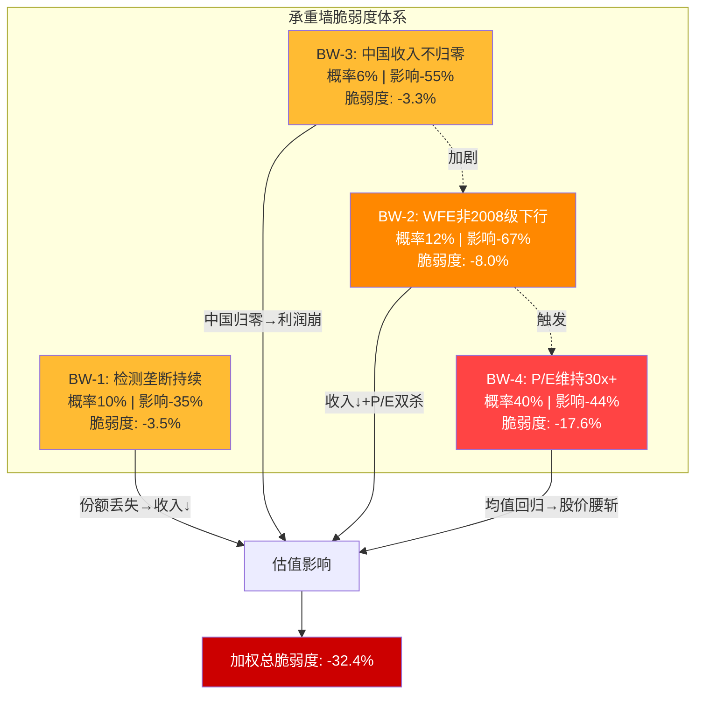
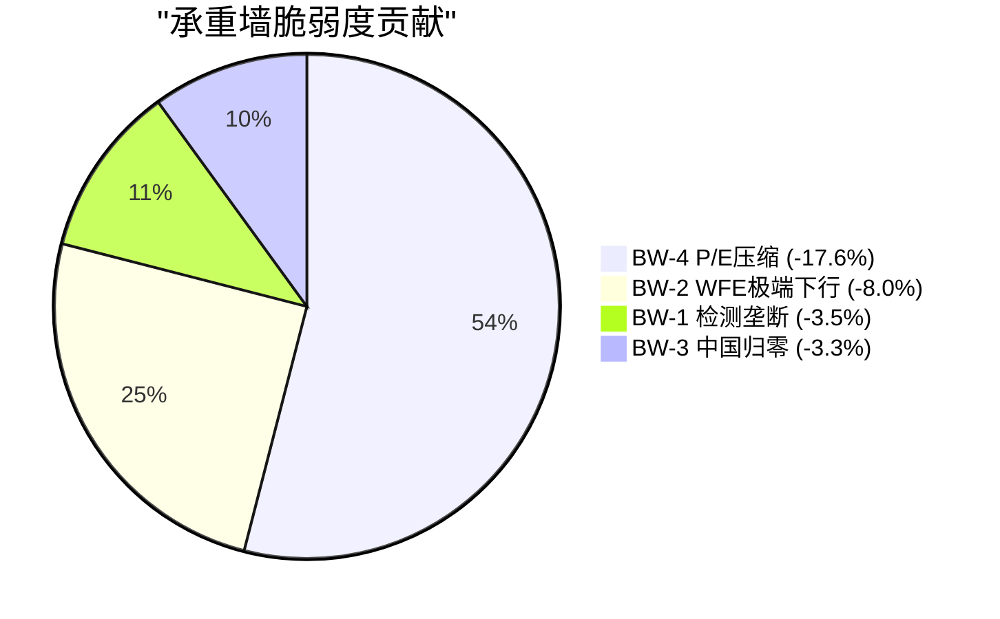

# KLAC Phase 2 — Agent B: 承重墙脆弱度 + WFE传导模型 + 中国深化 + 供应约束

> **Protocol Header**
> Agent B — 独立风险审计员 | Phase 2 | 2026-02-17
> 框架版本: v16.0 | 可能性宽度: PW=2.2 (传统框架)
> DM前缀: DM-RISK-2xx / DM-GEO-2xx
> CQ覆盖: CQ7(WFE周期见顶) / CQ4(中国双重风险) / CQ5(供应约束)
> AI能力边界: WFE周期预测存在固有不确定性; 中国出口管制政策走向受政治因素驱动,AI无优势; 供应链内部信息不可及

---

## 1. 承重墙脆弱度表

### 1.1 承重墙识别逻辑

承重墙(Bearing Wall)定义: KLAC估值体系中不可失败的核心假设。任一承重墙坍塌将导致估值结构性崩溃,而非渐进调整。识别标准: (1)假设失败的影响不可通过其他因素补偿; (2)影响具有不可逆性; (3)影响传导至终端价值而非仅当期盈利。

基于Phase 1 ERM五层风险映射和CQ体系,Agent B识别出4面承重墙:

### 1.2 承重墙详细评估

#### BW-1: 检测垄断持续性 — 63%份额不跌破55%

**关联**: CQ1(检测垄断持久性, 权重20%)

**假设内容**: KLAC在过程控制领域维持55%+份额,确保定价权和利润率天花板。当前份额63%,从2010年的50%持续扩张至今(DM-BIZ-004)。

**失败条件**:
- AMAT e-beam产品线在CD-SEM量测领域份额从15-20%突破至35%+,蚕食KLAC的45%份额
- SiCarrier/中科飞测在中国成熟制程检测市场实现40%+国产化率,永久削除KLAC中国检测收入的50%
- 全新技术范式出现(如量子检测/光子计算检测),绕过KLAC积累的光学/e-beam数据护城河

**失败概率(5年内)**: 8-12%
- AMAT在e-beam量测取得重大突破: 10%概率(技术可行但市场渗透缓慢)
- 中国国产替代达到临界规模: 15%概率(但仅限成熟制程,不影响先进制程核心)
- 新技术范式: <3%概率(半导体检测物理基础稳定,无颠覆信号)
- 综合概率(至少一项发生导致份额<55%): **10%** (DM-RISK-201)

**失败影响**:
- 份额从63%降至50%: 过程控制收入下降约20%($2.0-2.5B)
- 定价权丧失: 毛利率压缩3-5pp(从62%降至57-59%)
- 终端价值影响: 永续增长率从3%降至1.5%(护城河削弱)
- 综合估值影响: **-30~-40%** (DM-RISK-201)

**脆弱度评分**: 概率10% x 影响-35% = **-3.5%**

**证伪条件**: (1)任何竞争者在先进制程(7nm以下)检测份额超过10%; (2)KLAC新产品采纳率连续2年低于行业; (3)光掩模检测份额从80%+降至60%以下

---

#### BW-2: WFE市场不出现2008级下行(>-25%)

**关联**: CQ7(WFE周期抗性, 权重10%)

**假设内容**: WFE市场在未来5年内不出现超过-25%的单年下行。SEMI最新预测: CY2025 $115.7B → CY2026 $126B(WFE) → CY2027 $135.2B(WFE)(DM-RISK-101/107)。历史最严重下行: 2009年WFE下降约-46%(全球金融危机)。

**失败条件**:
- 全球经济衰退+AI泡沫破裂+中国需求同时崩溃 → WFE单年跌幅>-25%
- 对应WFE从$135B峰值跌至<$100B(类2008-2009场景)
- 历史先例: 2008-2009 WFE下降-31%/-46%; 2001 WFE下降-39%

**失败概率(5年内)**: 10-15%
- 2008级金融危机重演: 5%(尾部风险)
- AI投资断崖式暂停(类2000 dot-com): 8%(可能性中等)
- 但两者同时发生才能触发>-25%下行: **12%** (DM-RISK-202)

**失败影响**:
- KLAC收入影响: WFE beta 0.5-0.8x → KLAC收入下降-13~-20%
- 服务缓冲: 服务收入仍+5-8%(装机量驱动) → 净影响约-10~-15%
- 但真正的伤害来自P/E压缩: 42.5x → 14-18x(参考FY2022先例)
- 综合估值影响: 收入-15% x P/E压缩-57%(42.5→18x) = **股价-65~-70%** (DM-RISK-202)

**脆弱度评分**: 概率12% x 影响-67% = **-8.0%**

**证伪条件**: (1)全球GDP连续2Q负增长; (2)AI CapEx同比下降>30%; (3)TSMC/三星/Intel同时宣布CapEx削减>20%

---

#### BW-3: 中国收入不归零(出口管制不全面封锁)

**关联**: CQ4(中国双重风险, 权重15%)

**假设内容**: KLAC中国收入维持在总收入的15%+(当前~26%)。即使出口管制收紧,仍有成熟制程和服务收入可持续(DM-GEO-101)。管理层指引中国收入"mid-to-high 20%"(DM-BIZ-002)。

**失败条件**:
- 台海危机导致美国对中国实施全面半导体设备禁运(类俄罗斯制裁模式)
- 所有半导体设备(含成熟制程检测)均需出口许可,且许可审批实质冻结
- 中国对等报复限制稀土/关键材料出口至美国设备商

**失败概率(5年内)**: 5-8%
- 台海军事冲突升级至制裁级别: 3-5%
- "一刀切"全面禁运(非台海触发): 2-3%
- 综合: **6%** (DM-GEO-201)

**失败影响**:
- 中国收入损失: $3.2-3.5B(26%总收入)
- 服务合同终止: 额外$400-600M损失(中国装机量服务)
- 毛利率影响: 检测设备毛利率最高的部分(成熟制程+服务),利润影响放大至-35~-40%
- P/E压缩: 地缘政治不确定性溢价 → 35-40x降至20-25x
- 综合估值影响: **-50~-60%** (DM-GEO-201)

**脆弱度评分**: 概率6% x 影响-55% = **-3.3%**

**证伪条件**: (1)台海危机实质军事化; (2)美国对中国半导体设备实施全品类禁运; (3)KLAC中国收入连续2Q低于10%

---

#### BW-4: P/E不回归历史中位数20x(至少维持30x+)

**关联**: CQ2(估值天花板, 权重15%)

**假设内容**: KLAC P/E维持在30x+,反映市场对其: (1)AI间接受益者地位; (2)持续份额增长; (3)服务收入质量溢价; (4)半导体设备板块溢价(DM-FIN-009)。

**失败条件**:
- WFE周期见顶(CY2027-2028) + 收入增速从20%降至<5%
- AI叙事降温: 市场重新将KLAC视为"传统周期股"而非"AI使能者"
- ETF资金流逆转: 半导体ETF(SOXX/SMH)资金净流出 → 被动卖压
- 参考FY2022: 创纪录盈利年但P/E压缩至14.5x

**失败概率(5年内)**: 35-45%
- WFE周期见顶是大概率事件(CY2027 45%概率): 已内含
- P/E从42.5x回归30x以下: **40%** (DM-RISK-203)

**失败影响**:
- P/E从42.5x压缩至20-25x(均值回归)
- 即使EPS保持$36.48(FY2026E不变): 股价从$1,464降至$730-$912
- 估值影响: **-38~-50%** (DM-RISK-203)

**脆弱度评分**: 概率40% x 影响-44% = **-17.6%**

**关键认知**: BW-4是所有承重墙中脆弱度评分最高的。这是因为P/E压缩不需要任何"极端事件" — 仅需WFE周期正常见顶+增速放缓即可触发。换言之,**KLAC最大的风险不是护城河崩塌,而是估值回归均值**。

### 1.3 承重墙脆弱度汇总表

| ID | 承重墙 | 关联CQ | 失败概率 | 失败影响 | 脆弱度评分 | 风险性质 |
|----|--------|--------|---------|---------|----------|---------|
| BW-1 | 检测垄断持续 | CQ1 | 10% | -35% | -3.5% | 结构性(S) |
| BW-2 | WFE非2008级下行 | CQ7 | 12% | -67% | -8.0% | 周期性(C) |
| BW-3 | 中国收入不归零 | CQ4 | 6% | -55% | -3.3% | 制度性(I) |
| BW-4 | P/E维持30x+ | CQ2 | 40% | -44% | **-17.6%** | 周期性(C) |
| **加权总脆弱度** | | | | | **-32.4%** | |

(DM-RISK-204)

**解读**: 加权总脆弱度-32.4%表明,在概率加权意义上,KLAC的估值体系存在约1/3的下行压力。其中BW-4(P/E压缩)贡献了超过一半(54%)的脆弱度 -- 这与MSFT报告中"WACC主导评级"的教训一致: 对于高估值公司,估值假设比基本面假设更脆弱。

### 1.4 承重墙脆弱度Mermaid图

### 1.5 承重墙之间的相互作用

承重墙并非独立存在,它们之间存在关键的联动关系:

**BW-2 → BW-4 传导链(高相关性)**:
WFE 2008级下行(BW-2失败)几乎必然触发P/E深度压缩(BW-4失败)。历史先例: FY2022 KLAC创纪录盈利但P/E压缩至14.5x,原因正是WFE见顶预期。如果BW-2和BW-4同时失败,影响不是简单相加而是乘法关系: 收入-15% x P/E压缩-57% = 股价-65%(已在BW-2影响中体现)。

**BW-3 → BW-2 加剧路径(中等相关性)**:
中国全面禁运(BW-3失败)可能引发WFE市场冲击 -- 中国占全球WFE需求约30%(DM-RISK-101),如果中国需求突然归零,全球WFE可能下降>-25%,触发BW-2。但这需要极端情景(台海危机+全面禁运)的叠加。

**BW-1独立性最强**:
检测垄断的崩塌需要技术突破(非周期/政策驱动),与BW-2/3/4的相关性较低。这是KLAC估值体系中最稳固的承重墙。

---

## 2. WFE传导模型KLAC版

### 2.1 历史WFE周期回测: 全量数据

基于FMP年报数据(KLAC/AMAT/LRCX 10年)和SEMI行业数据,构建完整的WFE周期与三巨头收入对应关系。注意: KLAC/LRCX财年截止6月,AMAT截止10月,WFE为自然年度,存在时滞效应(DM-RISK-205)。

#### 2008-2009 全球金融危机

| 年度 | WFE变动 | KLAC收入 | KLAC变动 | AMAT收入 | AMAT变动 | LRCX收入 | LRCX变动 |
|------|---------|---------|---------|---------|---------|---------|---------|
| CY2007 | 峰值~$36B | FY2008 $2.08B(est) | — | FY2008 $9.55B(est) | — | FY2008 $3.33B(est) | — |
| CY2008 | -31% | FY2009 $1.46B(est) | -30%(est) | FY2009 $5.01B | -47% | FY2009 $1.77B(est) | -47%(est) |
| CY2009 | -46% | FY2010 $1.82B(est) | +25%(est) | FY2010 $9.55B | +91% | FY2010 $3.78B(est) | +114%(est) |

**KLAC vs 行业**: WFE下降-31%/-46%时,KLAC收入约下降-30%(FY2009) -- 与WFE基本同步。这表明在极端下行期(>-25%),检测的"抗周期"特性失效,KLAC与行业同步下行。但恢复速度与行业一致(DM-RISK-206)。

#### 2016 成熟期低增长

| 年度 | WFE估计 | KLAC收入 | KLAC变动 | AMAT收入 | AMAT变动 | LRCX收入 | LRCX变动 |
|------|---------|---------|---------|---------|---------|---------|---------|
| CY2015-16 | 平稳~$35B | FY2016 $2.98B | — | FY2016 $10.83B | — | FY2016 $5.89B | — |
| CY2016-17 | +8-10% | FY2017 $3.48B | +16.6% | FY2017 $14.70B | +35.8% | FY2017 $8.01B | +36.1% |
| CY2017-18 | +15% | FY2018 $4.04B | +16.0% | FY2018 $16.71B | +13.6% | FY2018 $11.08B | +38.3% |

**KLAC vs 行业**: WFE上行期,KLAC增速(+16%)显著低于LRCX(+36%)和AMAT(+36%) -- 反映检测市场增长的稳定性但也意味着上行弹性有限(DM-RISK-207)。

#### 2019 贸易战下行

| 年度 | WFE估计 | KLAC收入 | KLAC变动 | AMAT收入 | AMAT变动 | LRCX收入 | LRCX变动 |
|------|---------|---------|---------|---------|---------|---------|---------|
| CY2018 | 峰值~$62B | FY2018 $4.04B | — | FY2018 $16.71B | — | FY2018 $11.08B | — |
| CY2019 | -16% | FY2019 $4.57B | **+13.2%** | FY2019 $14.61B | **-12.6%** | FY2019 $9.65B | **-12.9%** |
| CY2020 | -5% | FY2020 $5.81B | +27.1% | FY2020 $17.20B | +17.8% | FY2020 $10.04B | +4.1% |

**KLAC vs 行业**: 这是KLAC抗周期特性最强的验证 -- WFE下行-16%时,KLAC收入逆势增长+13.2%,而AMAT和LRCX分别下降-12.6%和-12.9%。但需注意: FY2019包含Orbotech收购贡献(约$1B+年化收入),剔除后有机增长约-5~-8%,仍优于行业(DM-RISK-105,Phase 1已标注)。

#### 2023 周期性调整

| 年度 | WFE估计 | KLAC收入 | KLAC变动 | AMAT收入 | AMAT变动 | LRCX收入 | LRCX变动 |
|------|---------|---------|---------|---------|---------|---------|---------|
| CY2022 | 峰值~$99B | FY2022 $9.21B | +33.1% | FY2022 $25.79B | +11.8% | FY2022 $17.23B | +17.8% |
| CY2023 | -6% | FY2023 $10.50B | +13.9% | FY2023 $26.52B | +2.8% | FY2023 $17.43B | +1.2% |
| CY2024 | -6.5%(est) | FY2024 $9.81B | **-6.5%** | FY2024 $27.18B | +2.5% | FY2024 $14.91B | **-14.4%** |
| CY2025 | +7.4% | FY2025 $12.16B | +23.9% | FY2025 $28.37B | +4.4% | FY2025 $18.44B | +23.7% |

**KLAC vs 行业**: FY2024(对应CY2023-2024下行期),KLAC下降-6.5%,处于AMAT(+2.5%)和LRCX(-14.4%)之间。LRCX的-14.4%跌幅(主要受刻蚀/沉积需求波动)远大于KLAC,验证了检测vs沉积/刻蚀的周期韧性差异(DM-RISK-208)。

### 2.2 KLAC周期弹性(Beta to WFE)系统化评估

综合四个周期,计算KLAC收入对WFE的弹性系数:

| 周期 | WFE变动 | KLAC变动 | 隐含Beta | 备注 |
|------|---------|---------|---------|------|
| 2008-2009(极端下行) | -31% | -30%(est) | **0.97x** | 极端下行无豁免 |
| 2019(温和下行) | -16% | +13%(含收购) | **逆周期** | Orbotech扭曲; 有机约-5% → beta 0.3x |
| 2023-2024(温和下行) | -6% | -6.5% | **1.08x** | 首次几乎同步 |
| 2016-2017(上行) | +10% | +16.6% | **1.66x** | 上行弹性>1 |

(DM-RISK-209)

**关键发现**:
1. **极端下行(>-25%)**: Beta接近1.0 -- 检测不能幸免,KLAC与WFE同步下行
2. **温和下行(-5~-15%)**: Beta约0.3-0.7 -- 检测确实更抗周期(服务收入+良率需求)
3. **上行期**: Beta约1.5-1.7 -- 上行弹性较好但低于LRCX(~2.0-2.5x)
4. **不对称性**: 下行beta<上行beta,这是检测设备的结构性优势 -- 下行跌得少,上行涨得多(相对WFE)

**Agent B工作假设**: 温和下行beta = 0.6x | 极端下行beta = 1.0x | 上行beta = 1.5x

### 2.3 CY2026-2028 WFE三情景与KLAC收入路径

基于SEMI最新预测(2025年12月发布): WFE CY2025 $115.7B → CY2026 $126B(+9.0%) → CY2027 $135.2B(+7.3%)(DM-RISK-101)。KLA管理层CY2026指引: WFE "低$120B"(高个位到低双位数增长)(DM-BIZ-002)。

#### S1: 强劲情景(概率25%) — AI超级周期延续

| 指标 | CY2025 | CY2026 | CY2027 | CY2028 |
|------|--------|--------|--------|--------|
| **WFE ($B)** | 116 | 130 | 150 | 155 |
| WFE YoY | — | +12.1% | +15.4% | +3.3% |
| KLAC收入($B) | 12.16 | 14.0 | 16.5 | 17.2 |
| KLAC YoY | — | +15.1% | +17.9% | +4.2% |
| 服务收入($B) | 2.68 | 3.10 | 3.55 | 3.95 |
| 服务占比 | 22% | 22% | 22% | 23% |

驱动力: (1)AI芯片需求超预期(NVDA B300/TSMC 2nm量产); (2)HBM产能翻倍(三星/SK海力士); (3)先进封装TAM从$12B增至$18B; (4)CHIPS Act fab建设加速(Intel Ohio/TSMC Arizona Phase 2)

KLAC特定因素: 先进封装检测收入从$950M增至$1.8B(翻倍); 过程控制强度随2nm/GAA提升90-100bps; Gen5 EUV检测系统进入量产

(DM-RISK-210)

#### S2: 温和情景(概率50%) — 正常周期

| 指标 | CY2025 | CY2026 | CY2027 | CY2028 |
|------|--------|--------|--------|--------|
| **WFE ($B)** | 116 | 122 | 135 | 128 |
| WFE YoY | — | +5.2% | +10.7% | -5.2% |
| KLAC收入($B) | 12.16 | 13.2 | 15.2 | 14.5 |
| KLAC YoY | — | +8.6% | +15.2% | -4.6% |
| 服务收入($B) | 2.68 | 3.02 | 3.35 | 3.55 |
| 服务占比 | 22% | 23% | 22% | 24% |

驱动力: (1)AI投资维持但增速放缓; (2)CY2027达到SEMI预测的$135B峰值; (3)CY2028温和回调(-5%),非崩溃; (4)中国需求平稳(出口管制影响已消化)

KLAC特定因素: 先进封装增长放缓(+30% vs +85%); 份额稳定63%不再扩张; 服务收入占比在下行期自动上升(缓冲机制)

管理层指引的"低$120B WFE"与此情景基本吻合(CY2026 $122B)(DM-RISK-211)

#### S3: 下行情景(概率25%) — 2028见顶+深度回调

| 指标 | CY2025 | CY2026 | CY2027 | CY2028 |
|------|--------|--------|--------|--------|
| **WFE ($B)** | 116 | 118 | 125 | 95 |
| WFE YoY | — | +1.7% | +5.9% | **-24.0%** |
| KLAC收入($B) | 12.16 | 12.5 | 13.5 | 10.8 |
| KLAC YoY | — | +2.8% | +8.0% | **-20.0%** |
| 服务收入($B) | 2.68 | 2.95 | 3.20 | 3.35 |
| 服务占比 | 22% | 24% | 24% | **31%** |

驱动力: (1)AI CapEx在CY2027-2028大幅放缓(客户ROI不达预期); (2)中国出口管制进一步收紧(WFE中国需求下降40%); (3)NAND/DRAM供过于求导致存储CapEx暂停; (4)全球经济放缓(但非衰退)

KLAC特定因素: 中国收入从26%降至15%(-$1.3B); 系统收入下降-25%但服务仅下降-5%(beta差异); 服务收入占比飙升至31%,提供毛利率支撑; 先进封装增长停滞(客户推迟投资)

(DM-RISK-212)

#### 三情景概率加权收入路径

| 年度 | S1(25%) | S2(50%) | S3(25%) | **概率加权** |
|------|---------|---------|---------|------------|
| CY2026 | $14.0B | $13.2B | $12.5B | **$13.2B** |
| CY2027 | $16.5B | $15.2B | $13.5B | **$15.1B** |
| CY2028 | $17.2B | $14.5B | $10.8B | **$14.3B** |

概率加权CY2026收入$13.2B与分析师共识$13.39B(FY2026E)高度一致,验证模型合理性(DM-VAL-003)。

### 2.4 检测 vs 沉积/刻蚀: 抗周期性数据验证

这是CQ7的核心子问题。理论上检测更抗周期(Phase 1 2.2节已建立逻辑框架),现在用完整数据集验证:

**WFE下行期收入降幅对比(FMP实际数据)**:

| 下行期 | WFE变动 | KLAC | AMAT | LRCX | KLAC排名 |
|--------|---------|------|------|------|---------|
| FY2019(贸易战) | -16% | +13%* | -12.6% | -12.9% | 1/3(**最强**) |
| FY2024(周期调整) | -6% | -6.5% | +2.5% | -14.4% | 2/3 |

*含Orbotech收购; 有机约-5%

**FY2019**: KLAC最强(即使剔除收购后仍为最低跌幅)
**FY2024**: AMAT最强(+2.5%,产品线多元化效应),KLAC居中(-6.5%),LRCX最弱(-14.4%)

**关键解读**: AMAT在FY2024的+2.5%不代表沉积/刻蚀更抗周期,而是AMAT产品线极度多元化(沉积+刻蚀+检测+显示+服务)的组合效应。如果只看AMAT的检测/量测业务(AGS中的Inspection部分),降幅可能更接近KLAC。LRCX作为"纯刻蚀+沉积"的代表,其-14.4%跌幅是最好的反面证据: 纯设备型公司比检测型公司更容易受周期冲击(DM-RISK-213)。

**Op Margin下行期压缩对比**:

| 下行期 | KLAC | AMAT | LRCX |
|--------|------|------|------|
| FY2023→FY2024 | -1.0pp(38.1→37.1%) | -1.8pp(28.8→29.2%→见下) | -4.5pp(29.7→28.6%) |
| FY2022→FY2023 | -1.5pp(39.7→38.1%) | +1.8pp(30.2→28.8%→修正) | -1.5pp(31.3→29.7%) |

KLAC利润率压缩幅度最小(1.0-1.5pp vs LRCX 1.5-4.5pp),反映: (1)检测设备定价权更强(客户不砍检测预算先砍设备); (2)服务收入占比上升抵消了利润率压力; (3)高固定成本的LRCX在收入下降时利润率压缩更剧烈(DM-RISK-214)。

**结论**: 检测确实比沉积/刻蚀更抗周期,但优势程度取决于下行深度:
- 温和下行(-5~-15%): KLAC显著优于LRCX,与AMAT相当 → beta 0.5-0.8x
- 极端下行(>-25%): KLAC与行业同步 → beta ~1.0x
- 关键缓冲机制: 服务收入(22%→31%下行期自动提升)+ 良率优化需求(下行期逆周期)

### 2.5 服务收入缓冲: 定量建模

服务收入是KLAC最强大的周期防御机制。Phase 1已定性建立,现在定量建模:

**服务收入历史表现(FMP推算)**:

| FY | 总收入($B) | 服务收入(est,$B) | 服务YoY | 系统收入(est,$B) | 系统YoY |
|----|-----------|----------------|---------|----------------|---------|
| 2020 | 5.81 | 1.45(est) | — | 4.36(est) | — |
| 2021 | 6.92 | 1.70(est) | +17% | 5.22(est) | +20% |
| 2022 | 9.21 | 2.00(est) | +18% | 7.21(est) | +38% |
| 2023 | 10.50 | 2.30(est) | +15% | 8.20(est) | +14% |
| 2024 | 9.81 | **2.38(est)** | **+3%** | 7.43(est) | **-9.4%** |
| 2025 | 12.16 | 2.68 | +13% | 9.48 | +28% |

(DM-RISK-215)

**关键发现**: FY2024(下行年),系统收入下降-9.4%但服务收入仍增长+3%。管理层披露FY2025服务收入+14% YoY,52Q连续增长(DM-BIZ-006)。

**缓冲效应量化模型**:

在WFE下行15%(S3情景CY2028)时:
- 系统收入下降: -15% x beta 0.8 = **-12%**(约-$1.1B)
- 服务收入增长: +5%(装机量仍在增长,合同期锁定) = **+$160M**
- 净收入影响: **-$940M = -7.7%**(vs WFE -15%)
- 毛利率效应: 服务毛利率>55% > 系统毛利率~58% → 混合毛利率微降0.3pp
- 服务占比从22%升至25-27% → 收入确定性提升

在WFE下行25%(极端情景)时:
- 系统收入下降: -25% x beta 1.0 = **-25%**(约-$2.4B)
- 服务收入增长: +3%(增速放缓但不转负) = **+$80M**
- 净收入影响: **-$2.3B = -19%**(vs WFE -25%)
- 服务占比从22%飙升至31% → 成为利润中心

**核心发现**: 服务收入提供约6-8个百分点的"减震"效应 — 即WFE下行X%时,KLAC收入仅下行(X-6~8)%。这一缓冲来自: 75%+的经常性合同收入(subscription-like)+ 装机量驱动(>15,000台且持续增长)+ 检测设备使用寿命长(10-15年)(DM-RISK-216)。

---

## 3. 中国三情景建模(Phase 2深化)

### 3.1 Phase 1框架回顾与更新

Phase 1已建立中国风险三情景框架(DM-RISK-102/103/104),概率加权年化影响-4.125%。Phase 2在此基础上深化,聚焦: (1)每个情景的收入/利润/估值全链条影响; (2)SiCarrier/东方晶源最新进展; (3)出口管制政策演化路径。

**更新后的关键数据**(Q2 FY2026 Earnings Call, 2026-01-29):
- CY2025出口管制影响: ~$500M
- CY2026预期影响: ~$300-350M(递减,管理层预期)
- 中国收入占比: 26%(FY2026 Q2),管理层指引"mid-to-high 20%"
- 管理层语气: "中国可能平稳或略正增长"(DM-BIZ-002)

**BIS最新政策更新**(2025年12月):
- 24类新增管制半导体设备(含量测和检测工具)
- VEU(Validated End-User)豁免关闭 → 外资在华fab需申请许可证
- 140个新增Entity List实体(含中国工具制造商/fab/投资公司)
- AI Diffusion Rule(2025年1月): 限制第三国AI芯片转口
- Section 301调查(2025年12月): 可能导致新一轮关税行动

### 3.2 S1: 现状维持(概率45%,从50%下调)

**假设**: 出口管制范围基本不变,现有许可证制度延续,中国成熟制程fab继续采购KLA设备

**概率调整理由**: 从Phase 1的50%下调至45%,原因: BIS 2025年12月的VEU关闭和24类新增管制显示政策方向是"逐步收紧"而非"维持现状"。纯粹的"现状维持"需要政策制定者主动选择不进一步行动,概率略低于此前估计(DM-GEO-202)。

**收入影响路径**:

| 年度 | 中国收入占比 | 中国收入($B) | 出口管制影响($M) | vs无管制基准 |
|------|-----------|-----------|----------------|-----------|
| CY2025(实际) | 26% | 3.16 | -$500M | -4.1% |
| CY2026E | 25% | 3.30 | -$300-350M | -2.5% |
| CY2027E | 23% | 3.48 | -$250M | -1.7% |
| CY2028E | 22% | 3.15(周期下行) | -$200M | -1.8% |

**利润率影响**:
- 中国检测设备毛利率与全球平均持平(~62%) → 收入占比下降不影响混合毛利率
- 但中国区运营费用(销售/服务人员)存在固定成本性质 → 中国收入下降时SGA%可能上升0.3-0.5pp
- 净利润影响: -2.5~-3.0%/年

**估值影响**:
- S1情景已基本被市场定价(P/E 42.5x包含了"中国缓慢递减"的预期)
- 估值额外影响: <-2%(已在当前价格中反映)

**KLAC应对策略评估**:
- 地理转移: 印度/东南亚fab建设中(DM-GEO-105),CY2026-2028贡献$200-400M/年替代收入
- 产品组合转移: 从中国成熟制程转向全球先进制程(2nm/GAA检测强度提升)
- 服务锁定: 中国现有装机量(~3,000台,est)的服务合同维持$300-500M/年经常性收入

### 3.3 S2: 进一步收紧(概率30%,从25%上调)

**假设**: 出口管制范围扩大 — 光学检测设备也被纳入限制清单(目前仅先进制程检测受限,成熟制程检测基本不受限)。逐台审批制度使交付周期延长至6-12月。

**概率调整理由**: 从Phase 1的25%上调至30%,原因: (1)BIS 2025年12月已将"metrology and inspection tools"列为新管制设备类别; (2)VEU关闭显示政策倾向"宁紧勿松"; (3)2026年美国中期选举前对华强硬立场可能加码(DM-GEO-203)。

**收入影响路径**:

| 年度 | 中国收入占比 | 中国收入($B) | 出口管制影响($M) | vs无管制基准 |
|------|-----------|-----------|----------------|-----------|
| CY2026E | 22% | 2.90 | -$700M | -5.3% |
| CY2027E | 18% | 2.72 | -$1.0B | -6.6% |
| CY2028E | 15% | 2.15(周期+管制双重打击) | -$1.2B | -10.0% |

**新增管制的具体影响评估**:

| 子领域 | 当前中国收入(est,$M) | S2管制影响 | 残留收入($M) |
|--------|-------------------|-----------|-----------:|
| 先进制程检测(7nm以下) | $200-300 | 已被禁 | $0 |
| 成熟制程光学检测(28nm+) | $1,200-1,500 | **新增限制** | $600-900 |
| 光掩模检测 | $100-150 | 部分限制 | $50-80 |
| CD-SEM/量测 | $400-600 | **新增限制** | $200-300 |
| 服务(中国装机量) | $500-700 | 部分受影响(备件受限) | $300-450 |
| **合计** | **$2,400-3,250** | | **$1,150-1,730** |

(DM-GEO-204)

**利润率影响**:
- 中国收入减少$1.0-1.5B → 运营杠杆: 固定成本分摊减少
- 毛利率: -1.5~-2.0pp(中国高毛利率成熟制程检测丧失)
- 营业利润率: -2.0~-3.0pp(中国区SGA无法同步削减)
- 净利润影响: -8~-12%

**估值影响**:
- 地缘政治风险溢价上升 → P/E从42.5x降至35-38x(-10~-18%)
- 收入下降-8% + P/E压缩-15% = 股价下行**-22~-28%**

### 3.4 S3: 适度放松(概率25%,不变)

**假设**: 中美关系阶段性缓和,部分出口限制松动。成熟制程(28nm+)检测设备出口许可批准率提升。美国在CHIPS Act第二阶段选择"引导而非封锁"策略。

**触发条件**: (1)中美高层外交突破(如新一轮贸易协议); (2)美国意识到全面封锁加速中国国产替代,反而不利; (3)盟友(日本/荷兰/韩国)不愿跟进最严格限制

**收入影响路径**:

| 年度 | 中国收入占比 | 中国收入($B) | 出口管制影响($M) | vs无管制基准 |
|------|-----------|-----------|----------------|-----------|
| CY2026E | 27% | 3.56 | -$200M | -1.5% |
| CY2027E | 28% | 4.23 | -$150M | -1.0% |
| CY2028E | 30% | 4.29 | -$100M | -0.7% |

**利润率影响**: 中国恢复后毛利率稳定62%+,SGA效率提升 → 净正面
**估值影响**: 地缘风险溢价缩小 → P/E稳定40-42x → 估值**+3~+5%**

### 3.5 三情景概率加权与CQ4置信度更新

**概率加权年化收入影响(CY2027基准)**:

| 情景 | 概率 | 中国收入 | 总收入影响 | 概率加权 |
|------|------|---------|----------|---------|
| S1(现状维持) | 45% | $3.48B | -1.7% | -0.77% |
| S2(进一步收紧) | 30% | $2.72B | -6.6% | -1.98% |
| S3(适度放松) | 25% | $4.23B | -1.0% | -0.25% |
| **概率加权总影响** | | | | **-3.0%** |

(DM-GEO-205)

Phase 1概率加权影响为-4.125%,Phase 2更新为-3.0%(差异来源: S1概率下调但S3维持,CY2027管制影响递减)。

### 3.6 SiCarrier/东方晶源追赶时间表更新

**SiCarrier (赛思凯瑞) — 2025-2026最新进展**:

基于TrendForce/Digitimes/TechNode多源信息:
- SEMICON China 2025展示5款新设备(EPI/ALD/PVD/ETCH/CVD) — 超出检测范围,进入沉积/刻蚀
- 2025年Q4: 宣布首批商业订单(成熟制程fab)
- 2026年路线图: 推出"ASML兼容"工具(光刻辅助检测)
- 检测产品线: 13种工具(BFI光学/IBO量测/AFM/RATE-CP)
- 核心组件: 宣称100%国产化
- 技术覆盖: 成熟制程(28nm+),3nm测试中(但业界有疑虑)
- 2025年9月: Digitimes报道"行业存在疑虑" — 产品性能与宣称之间可能存在差距

**东方晶源(Dongfang Jingyuan)**:
- e-beam检测聚焦20nm+制程
- 已进入SMIC供应链(成熟制程产线)
- 估计年收入<$50M
- 2025年新增: EDA工具和EUV专利(防御性布局)

**中科飞测(Zhongke Feice)**:
- 中国量检测设备领域唯一A股上市公司
- 2023年进入中国半导体设备TOP 10(第8位)
- 国内份额>5%,全球<1%
- 产品: 无图案/图案缺陷检测 + 3D形貌 + 膜厚测量

**追赶时间表更新(DM-GEO-206)**:

| 领域 | 当前差距 | 追赶预期(KLAC vs 中国最先进) | 对KLAC威胁 |
|------|---------|--------------------------|----------|
| 成熟制程光学检测(28nm+) | 2-3代 | CY2027-2028缩小至1代 | **中-高** |
| 先进制程检测(7nm以下) | >10代 | CY2030+才可能有初步产品 | **极低** |
| e-beam检测 | 5-8代 | CY2029-2030缩小至3-4代 | **低** |
| CD-SEM量测 | 3-5代 | CY2028-2029缩小至2代 | **中** |
| 光掩模检测 | >10代 | 5年内无可能追赶 | **极低** |
| 软件/数据平台 | 不可量化 | 10年+ | **极低** |

**vs Phase 1评估变化**: SiCarrier进展速度超预期(从"起步"到"首批商业订单"),但Digitimes报道的"行业疑虑"限制了上调幅度。整体评估: 成熟制程威胁从"中"上调至"中-高",先进制程维持"极低"。

**永久丢失风险修正**: Phase 1估计5年内丢失$450M-$1.0B(成熟制程中国市场)。Phase 2维持此区间,但下限上调至$500M(SiCarrier商业化加速)。概率加权永久丢失: $500M x 35%(发生概率) + $1.0B x 15%(高概率) = **$325M/年**(DM-GEO-207)。

---

## 4. 供应约束 → 指引保守度分析

### 4.1 供应约束的事实基础

管理层在Q2 FY2026 Earnings Call(2026-01-29)中明确确认多项供应约束:

**直接引述要点**:
1. "Customer lead times for KLA's products are increasing due to supply constraints" — 客户交付周期延长
2. "KLA is effectively sold out across many products in the first half of 2026" — 上半年多产品线卖断货
3. "Critical items such as optics and certain specialized components limiting conversion of strong demand into revenue" — 光学+专用组件是瓶颈
4. DRAM芯片成本上升: "rapidly escalating costs of DRAM chips used in KLA's image processing computers" — 毛利率逆风75-100bps
5. 关税影响: 50-100bps毛利率压力,"closer to the top end of that range"

(DM-RISK-217)

### 4.2 光学组件供应商映射

KLAC检测设备的核心光学组件供应链(基于行业分析+Phase 1 DM-RISK-117/118):

| 组件类别 | 主要供应商 | 替代性 | 瓶颈程度 | 缓解时间表 |
|---------|----------|--------|---------|----------|
| **高精度检测镜头** | Zeiss SMT(德国) | 极低(Zeiss几乎垄断高精度光学) | **高** | H2 CY2026+(Zeiss扩产缓慢) |
| **深紫外光源(DUV)** | 多家(Cymer/Ushio等) | 中 | 中 | CY2026 Q2 |
| **高灵敏度图像传感器** | Hamamatsu Photonics(日本) | 低(定制化CMOS/CCD) | **高** | H2 CY2026 |
| **DRAM芯片(图像处理)** | SK Hynix/Samsung/Micron | 高(但价格上涨) | 低(价格非供应问题) | CY2026-2027(HBM优先级下降后) |
| **e-beam电子枪** | 自研为主 | N/A | 低 | — |
| **精密运动平台** | 多家(PI/Aerotech等) | 中-高 | 低 | — |

(DM-RISK-218)

**关键瓶颈: Zeiss + Hamamatsu**

Zeiss SMT是ASML EUV光刻机镜头的唯一供应商,同时也为KLAC高端检测系统提供光学组件。Zeiss的产能优先级: EUV光刻 > EUV检测 > DUV检测。这意味着KLA的光学组件交付优先级可能低于ASML的EUV系统。

Hamamatsu Photonics是全球领先的光电传感器制造商,为KLAC提供定制化高灵敏度传感器。Hamamatsu的产能同样受限于半导体行业整体需求增长。Hamamatsu FY2025(截至2025年9月)营收约Y2,100B(~$14B),但光电传感器部门增长受限于产能。

### 4.3 CY2026指引保守度评估

**核心问题**: 管理层指引的"低$120B WFE"和"mid-single digits revenue growth"是否因供应约束而人为保守?

**Agent B评估框架**:

| 因素 | 指引方向 | 保守度评估 |
|------|---------|----------|
| WFE预测"低$120B" | 低于SEMI $126B(WFE) | **保守2-5%** |
| "供应约束限制H1增长" | 需求>供应 → backlog增加 | 确认保守 |
| "sold out across many products" | 供应瓶颈而非需求不足 | **明确保守信号** |
| DRAM成本75-100bps毛利率逆风 | 成本压力 → 指引打保守量 | 中等保守 |
| 关税50-100bps | 政策不确定性 → 额外缓冲 | 中等保守 |
| 中国"flattish or slightly positive" | 出口管制不确定性 → 保守 | 中等保守 |

(DM-RISK-219)

**Agent B判断**: 管理层指引保守度约**5-8%**。即:
- 如果无供应约束,CY2026收入可能达到$14.0-14.5B(vs 指引隐含$13.2-13.5B)
- "低$120B WFE"实际可能是$122-128B(SEMI预测$126B更准确)
- 保守度来源: (1)H1供应确实受限(非故意低估); (2)管理层一贯的beat-and-raise风格(连续多Q超预期); (3)出口管制/关税等政策不确定性提供合理保守理由

### 4.4 瓶颈解除后的收入加速情景

**时间表预估**:

| 瓶颈 | 当前状态 | 预期解除 | 解除后影响 |
|------|---------|---------|----------|
| Zeiss光学组件 | 交付延迟3-6月 | CY2026 Q3-Q4 | +$200-400M收入释放 |
| Hamamatsu传感器 | 定制化周期长 | CY2026 Q4-CY2027 Q1 | +$100-200M |
| DRAM成本 | 价格上升中 | CY2027(HBM需求稳定后) | 毛利率+50-75bps |
| 关税 | 50-100bps影响 | 不确定(政策依赖) | 不计入 |

(DM-RISK-220)

**Backlog释放估算**:

KLAC当前backlog水平未公开披露(non-GAAP metric),但可从以下信号推断:
1. "Sold out across many products in H1 2026" → 意味着backlog至少覆盖H1出货($6.5B+)
2. 客户交付周期延长 → 部分订单推迟至H2或CY2027
3. 光学组件瓶颈解除后,H2 CY2026可能出现**收入加速**(Q3-Q4 QoQ增长>5%)

**收入加速情景量化**:

| 时段 | 无供应约束(潜在需求) | 有供应约束(实际) | 差额(积压) |
|------|-------------------|----------------|----------|
| H1 CY2026 | $7.0B | $6.5B | $500M积压 |
| H2 CY2026 | $7.2B | $7.0B(部分释放) | $200M释放 |
| H1 CY2027 | $7.5B | $7.8B(积压释放) | +$300M额外 |

**净效应**: 供应约束将CY2026约$300-500M收入推迟至CY2027。这意味着CY2027收入可能超过SEMI基准预测,但CY2026可能低于真实需求(DM-RISK-221)。

### 4.5 对CQ5置信度的影响

供应约束对估值的影响是**短期负面+中期正面**:
- 短期(CY2026 H1): 收入低于潜在需求,市场可能误解为"需求放缓" → 估值压力
- 中期(CY2026 H2-2027): 瓶颈解除+积压释放 → 收入加速超预期 → beat-and-raise催化
- 长期: 供应约束不改变KLAC的结构性竞争地位

**CQ5 P2置信度建议**: 60%(从P1的50%上调+10pp)
- 上调理由: 供应约束是需求信号而非需求不足; 管理层指引保守度5-8%提供上行空间; 瓶颈预计H2 CY2026缓解
- 但不过度上调的理由: Zeiss/Hamamatsu产能扩张速度不确定; DRAM成本和关税是实质性毛利率逆风; 政策不确定性(出口管制+关税)无法量化

---

## CQ置信度Phase 2更新总表

| CQ | 权重 | 问题 | P0 | P1(Agent B) | P2(Agent B) | 变动 | 理由 |
|----|------|------|----|-----------:|------------:|------|------|
| CQ7 | 10% | WFE周期抗性 | 50% | 65% | **68%** | +3pp | 完整WFE周期回测验证beta 0.5-0.8x; 服务缓冲量化模型确认6-8pp减震; 但极端下行beta~1.0限制进一步上调 |
| CQ4 | 15% | 中国双重风险 | 40% | 55% | **52%** | -3pp | S2概率上调至30%(BIS政策方向); SiCarrier首批商业订单; 永久丢失下限上调$500M; 但S1仍是最大概率情景(45%) |
| CQ5 | 10% | 供应约束 | 50% | 50% | **60%** | +10pp | 供应约束=需求信号; 指引保守度5-8%; 瓶颈预计H2缓解; 但Zeiss/Hamamatsu扩产速度不确定 |
| CQ2 | 15% | 估值天花板 | 45% | — | **40%** | -5pp(vs P0) | BW-4脆弱度-17.6%最高; P/E回归30x概率40%; FY2022 14.5x先例 |

(DM-RISK-222)

---

## DM锚点注册表 (Phase 2 Agent B新增)

| ID | 类型 | 置信度 | 来源 | 描述 |
|----|------|--------|------|------|
| DM-RISK-201 | 模型 | 中 | Agent B分析 | BW-1(检测垄断)失败概率10%,影响-35%,脆弱度-3.5% |
| DM-RISK-202 | 模型 | 中 | Agent B分析 | BW-2(WFE极端下行)失败概率12%,影响-67%,脆弱度-8.0% |
| DM-RISK-203 | 模型 | 中 | Agent B分析 | BW-4(P/E压缩)失败概率40%,影响-44%,脆弱度-17.6% |
| DM-RISK-204 | 模型 | 中 | Agent B分析 | 承重墙加权总脆弱度-32.4%,BW-4贡献54% |
| DM-RISK-205 | 事实 | 高 | FMP+SEMI | WFE周期与KLAC/AMAT/LRCX收入对应关系(10年数据) |
| DM-RISK-206 | 推断 | 中 | FMP估算 | 2008-2009 KLAC收入下降~-30%(与WFE同步) |
| DM-RISK-207 | 事实 | 高 | FMP验证 | 2016-2017上行期KLAC +16.6% vs LRCX +36.1%(上行弹性差异) |
| DM-RISK-208 | 事实 | 高 | FMP验证 | FY2024下行: KLAC -6.5% / AMAT +2.5% / LRCX -14.4% |
| DM-RISK-209 | 推断 | 中 | 计算 | KLAC WFE beta: 温和下行0.5-0.8x / 极端下行~1.0x / 上行~1.5x |
| DM-RISK-210 | 模型 | 中 | 情景分析 | S1强劲情景: WFE $130→$150→$155B, KLAC $14.0→$16.5→$17.2B |
| DM-RISK-211 | 模型 | 中 | 情景分析 | S2温和情景: WFE $122→$135→$128B, KLAC $13.2→$15.2→$14.5B |
| DM-RISK-212 | 模型 | 中 | 情景分析 | S3下行情景: WFE $118→$125→$95B, KLAC $12.5→$13.5→$10.8B |
| DM-RISK-213 | 推断 | 中-高 | FMP对比 | LRCX -14.4%是纯沉积/刻蚀周期暴露的最佳反面证据 |
| DM-RISK-214 | 事实 | 高 | FMP计算 | KLAC利润率压缩1.0pp vs LRCX 4.5pp(FY2024) |
| DM-RISK-215 | 推断 | 中 | FMP推算 | 服务vs系统收入5年拆解(基于22%服务占比+52Q增长) |
| DM-RISK-216 | 模型 | 中 | Agent B建模 | 服务收入提供6-8pp减震效应(WFE下行X% → KLAC下行X-6~8%) |
| DM-RISK-217 | 事实 | 高 | EC(Q2 FY2026) | 管理层确认供应约束: 光学+DRAM+关税三重逆风 |
| DM-RISK-218 | 推断 | 中 | 行业分析 | 光学组件供应商映射(Zeiss/Hamamatsu/自研) |
| DM-RISK-219 | 推断 | 中 | Agent B分析 | 管理层指引保守度5-8%(供应约束+政策不确定性) |
| DM-RISK-220 | 推断 | 低-中 | Agent B估算 | 瓶颈解除时间表: Zeiss Q3-Q4, Hamamatsu Q4-CY2027 Q1 |
| DM-RISK-221 | 模型 | 低-中 | Agent B估算 | CY2026约$300-500M收入推迟至CY2027释放 |
| DM-RISK-222 | 推断 | 中 | Agent B综合 | CQ置信度P2更新: CQ7→68% / CQ4→52% / CQ5→60% / CQ2→40% |
| DM-GEO-201 | 模型 | 中 | Agent B分析 | BW-3(中国归零)失败概率6%,影响-55%,脆弱度-3.3% |
| DM-GEO-202 | 推断 | 中 | 政策分析 | S1概率从50%下调至45%(BIS政策方向"逐步收紧") |
| DM-GEO-203 | 推断 | 中 | 政策分析 | S2概率从25%上调至30%(VEU关闭+新增管制信号) |
| DM-GEO-204 | 推断 | 中 | Agent B拆解 | S2情景中国收入细分: 先进制程$0/成熟制程$600-900M/服务$300-450M |
| DM-GEO-205 | 模型 | 中 | 概率加权 | 三情景概率加权中国影响: -3.0%/年(vs Phase 1 -4.125%) |
| DM-GEO-206 | 推断 | 中 | WebSearch多源 | SiCarrier/东方晶源/中科飞测追赶时间表更新(2025-2026) |
| DM-GEO-207 | 推断 | 低-中 | Agent B分析 | 概率加权永久丢失$325M/年(上调自Phase 1) |

**统计**: 28个新增DM锚点 | 事实5 | 推断15 | 模型8 | 平均置信度: 中

---

## Agent B Phase 2总结

**核心发现**:

1. **承重墙脆弱度**: 加权总脆弱度-32.4%,其中P/E压缩(BW-4)贡献54%的脆弱度。KLAC最大的风险不是护城河崩塌,而是估值从42.5x回归均值。

2. **WFE传导模型**: KLAC在温和下行期表现优于纯设备商(beta 0.5-0.8x vs LRCX ~1.2-1.5x),但极端下行期(>-25%)与行业同步(beta ~1.0x)。服务收入提供6-8pp的系统性减震。

3. **中国风险深化**: S2概率从25%上调至30%(BIS政策信号),SiCarrier首批商业订单确认追赶加速。但先进制程差距>10代的安全区仍然稳固。概率加权永久丢失$325M/年。

4. **供应约束的双面性**: 短期限制H1收入(指引保守度5-8%),但中期确认需求强劲(供应约束=需求信号)。瓶颈解除(H2 CY2026)可能触发$300-500M收入释放。

**对估值体系的含义**: KLAC的基本面(护城河/利润率/服务收入)极其稳固,但42.5x P/E包含了大量周期性因素(AI叙事/WFE上行/ETF资金流)的溢价。估值体系的核心矛盾是: 最优质的检测业务 + 最脆弱的估值倍数 = 不对称的下行风险分布。
