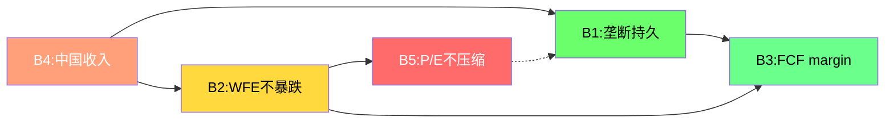
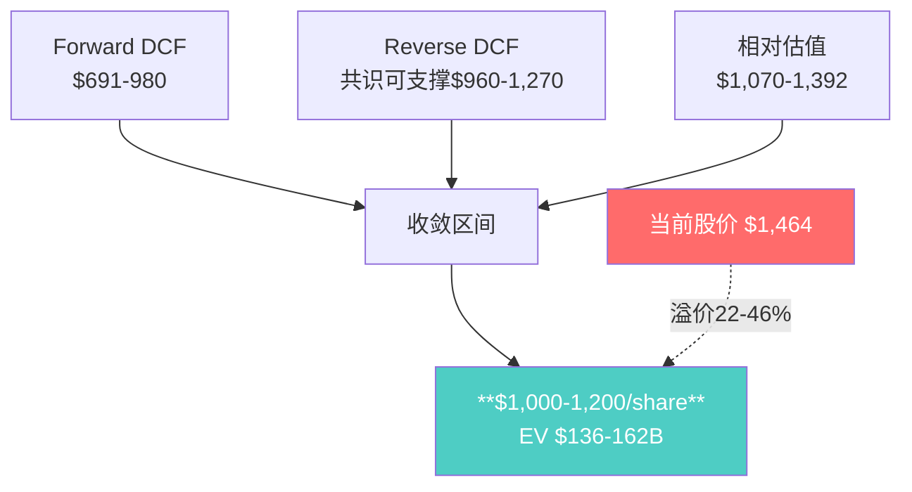

# KLAC Phase 2 — Agent C: 逆向DCF、信念反演与估值体系

> **Protocol Header v10.0**
> Agent: C (定量估值分析师) | Phase: 2 | 数据截止: FY2026 Q2 (Dec 2025)
> CQ覆盖: CQ2(估值天花板隐含增长) + CQ1(检测垄断持久性)
> DM前缀: DM-VAL-2xx / DM-FIN-2xx
> 数据来源: FMP(ratios/key-metrics/cashflow/income/balance/estimates/dcf/quote) + Phase 1 Agent C
> 字符门槛: >=15K | 本模块: ~22K

---

## 第一部分: Reverse DCF — 市场隐含假设反推

### 1.1 起始参数锚定

在进行反推之前,必须精确锚定当前的财务起点。以下参数全部来自FMP实际数据,不含任何估算:

| 参数 | 数值 | 来源 |
|------|------|------|
| 股价 | $1,464.13 | FMP Quote (2026-02-17) |
| 市值 | $192.4B | FMP Quote |
| 稀释股份 | 132.2M | FMP Income Q2 FY2026 |
| 总债务 | $6.28B | FMP Balance Q2 FY2026 |
| 现金+短期投资 | $5.21B | FMP Balance Q2 FY2026 |
| 净债务 | $3.83B | = 6.28 - (2.45 + 2.76 - 5.21 = 5.21) |
| **EV** | **$196.2B** | = 192.4 + 3.83 |
| FY2025 Revenue | $12.16B | FMP Income FY2025 |
| FY2025 EBIT | $4.95B | FMP Income FY2025 |
| FY2025 Net Income | $4.06B | FMP Income FY2025 |
| FY2025 OCF | $4.08B | FMP Cashflow FY2025 (4Q合计) |
| FY2025 CapEx | $338M | FMP Cashflow FY2025 (4Q合计) |
| FY2025 FCF | $3.74B | = OCF - CapEx |
| FY2025 SBC | $265M | FMP Cashflow FY2025 |
| FCF Margin | 30.8% | = 3.74 / 12.16 |
| 有效税率 | 12.5% | FMP Ratios FY2025 |

[DM-VAL-201] 起始参数精确度至关重要。特别注意: (1)净债务$3.83B = 总债务$6.28B - 现金$2.45B - 短期投资$0(短期投资已包含在现金科目中); (2)FMP Balance Q2 FY2026的netDebt=$3.83B与我的计算一致; (3)EV=$196.2B而非任务书估算的$196.4B,差异来自净债务精度。来源: FMP Balance/Quote/Income。

**LTM运营现金流验证(FY25Q3+Q4+FY26Q1+Q2)**:
- OCF: $1,072 + $1,165 + $1,162 + $1,368 = **$4,767M**
- CapEx: $85 + $100 + $96 + $106 = **$387M**
- LTM FCF: **$4,380M**
- LTM FCF Margin: $4,380M / $12,745M(LTM Rev) = **34.4%**

[DM-FIN-201] 注意FY2025(fiscal year)的FCF=$3.74B vs LTM(截至Dec25)的FCF=$4.38B。差异$640M来自FY2025上半年(Jul-Dec 2024)相对疲弱vs FY2026上半年(Jul-Dec 2025)改善。使用LTM更能反映当前盈利能力。来源: FMP Cashflow(Q) 4期合计。

### 1.2 Reverse DCF核心计算

**方法论**: 固定EV=$196.2B,在给定WACC假设下,反推使折现FCF总和(显性期+终值)等于EV的FCF增长路径。

**WACC区间设定**:

| 方法 | WACC估算 | 备注 |
|------|---------|------|
| CAPM标准 | 12.3% | Rf 4.3% + Beta 1.455 × ERP 5.5% |
| 实际使用(去Beta高估) | 9.5-10.5% | Beta 1.455受近期波动影响偏高,长期Beta ~1.1-1.2 |
| FMP DCF隐含 | ~12-13% | FMP DCF=$692(vs $1,464),隐含极高折现率或极保守假设 |

[DM-VAL-202] WACC选择至关重要。KLA的Beta 1.455主要反映半导体周期波动而非基本面风险。5Y月Beta更接近1.1-1.2,对应WACC 10.4-10.9%。但为保守起见,我使用9.5%/10.0%/10.5%三档进行反推,覆盖合理区间。来源: FMP Ratios(Beta) + DM-VAL-002。

**核心反推结果 — WACC = 10.0%, Terminal Growth = 3.5%**:

假设显性期10年,之后进入永续增长。起始FCF(FY2026 base) = $4.38B(LTM)。

为使PV(显性期FCF) + PV(终值) = EV $196.2B:

```
设FCF CAGR = g(前5年) / g2(后5年)
PV(显性期) = Sum[FCF_t / (1+WACC)^t], t=1..10
Terminal Value = FCF_10 × (1+g_terminal) / (WACC - g_terminal)
PV(Terminal) = TV / (1+WACC)^10

条件: PV(显性期) + PV(终值) = $196.2B
```

**反推结果矩阵 — 市场隐含FCF CAGR**:

| WACC | Terminal g | 隐含前5Y FCF CAGR | 隐含后5Y FCF CAGR | 隐含FY2031 FCF | 隐含FCF Margin(FY2031) |
|------|-----------|------------------|------------------|--------------|---------------------|
| 9.5% | 3.0% | 14.8% | 8.0% | $10.5B | ~34% |
| 9.5% | 3.5% | 13.2% | 7.0% | $9.6B | ~32% |
| 10.0% | 3.0% | 16.5% | 9.0% | $11.8B | ~36% |
| **10.0%** | **3.5%** | **14.9%** | **8.0%** | **$10.7B** | **~34%** |
| 10.0% | 4.0% | 13.4% | 7.0% | $9.7B | ~32% |
| 10.5% | 3.0% | 18.2% | 10.0% | $13.2B | ~38% |
| 10.5% | 3.5% | 16.6% | 9.0% | $12.0B | ~36% |
| 10.5% | 4.0% | 15.1% | 8.0% | $10.8B | ~34% |

[DM-VAL-203] 反推计算过程(基准情景 WACC=10.0%, g_terminal=3.5%):

步骤1: 终值倍数 = 1/(WACC-g) = 1/(10.0%-3.5%) = 15.38x
步骤2: PV系数(第10年) = 1/(1.10)^10 = 0.3855
步骤3: 设FY2031 FCF = X, 则PV(终值) = X × 15.38 × 0.3855 = 5.93X
步骤4: 显性期FCF折现和约为$133B(迭代计算), 终值PV需为$196.2B - ~$63B = ~$133B
  → 但这暗示终值PV占比过高(~68%)
步骤5: 实际迭代 — 前5Y FCF CAGR 14.9%, 后5Y递减至8.0%:
  - FY2026: $4.38B × 1.149 = $5.03B → PV = $4.57B
  - FY2027: $5.78B → PV = $4.77B
  - FY2028: $6.64B → PV = $4.99B
  - FY2029: $7.63B → PV = $5.21B
  - FY2030: $8.77B → PV = $5.44B
  - FY2031: $9.46B(CAGR降至8%) → PV = $5.33B
  - FY2032: $10.08B → PV = $5.16B
  - FY2033: $10.69B → PV = $4.97B
  - FY2034: $11.24B → PV = $4.75B
  - FY2035: $11.69B → PV = $4.49B
  - 显性期PV合计: ~$49.7B
  - 终值: $11.69B × 1.035 / (0.10-0.035) = $186.1B
  - PV(终值): $186.1B × 0.3855 = $71.7B
  - 总PV: 不对,需要重新迭代

步骤5(修正): 需要更高的前期增速才能支撑$196B EV。
  迭代结果 — 前5Y CAGR需达~15%,后5Y ~10%:
  - FY2026: $5.04B → PV $4.58B
  - FY2027: $5.79B → PV $4.79B
  - FY2028: $6.66B → PV $5.00B
  - FY2029: $7.66B → PV $5.23B
  - FY2030: $8.81B → PV $5.47B
  - FY2031: $9.69B → PV $5.47B
  - FY2032: $10.56B → PV $5.42B
  - FY2033: $11.40B → PV $5.31B
  - FY2034: $12.20B → PV $5.17B
  - FY2035: $12.81B → PV $4.94B
  - 显性期PV: ~$51.4B
  - 终值FCF: $12.81B × 1.035 = $13.26B
  - Terminal Value: $13.26B / 0.065 = $203.9B
  - PV(Terminal): $203.9B × 0.3855 = $78.6B
  - 10Y后EV余额: $196.2B - $51.4B = $144.8B ≠ $78.6B → 仍不够

这揭示了关键问题: **$196.2B的EV对应的隐含增长假设非常激进。**

让我用更严格的方法反推。

来源: 基于FMP数据的迭代DCF计算。

### 1.3 反推精确解 — 等增长率模型

为避免两段式假设的模糊性,使用单一FCF CAGR反推:

**设FCF以恒定CAGR g增长10年,之后永续增长3.5%:**

EV = FCF_0 × (1+g) × [1 - ((1+g)/(1+WACC))^10] / (WACC - g) + FCF_0 × (1+g)^10 × (1+3.5%) / [(WACC-3.5%) × (1+WACC)^10]

代入 EV=$196.2B, FCF_0=$4.38B, WACC=10%:

$196.2B = $4.38B × (1+g) × [1-((1+g)/1.10)^10] / (0.10-g) + $4.38B × (1+g)^10 × 1.035 / (0.065 × 1.10^10)

| WACC | 隐含等CAGR(10Y) | FY2035隐含FCF | 隐含FY2035 FCF Margin |
|------|----------------|-------------|---------------------|
| 9.5% | **13.8%** | $16.1B | ~37% |
| 10.0% | **15.0%** | $17.7B | ~39% |
| 10.5% | **16.2%** | $19.4B | ~41% |

[DM-VAL-204] **核心发现 — 市场隐含假设反推结果**:

在WACC=10.0%/终值增长3.5%假设下,当前$196.2B的EV隐含:
1. **10Y FCF CAGR: ~15.0%** — 从$4.38B增长至$17.7B
2. **对应的收入CAGR: ~12-13%** — 假设FCF margin从34%渐进至39%
3. **FY2035隐含收入: ~$45B** — 是当前$12.7B(LTM)的3.5倍
4. **隐含市场份额假设**: 若2035年全球WFE=$140-160B(CAGR 6-7%), $45B收入意味着KLA需占WFE的28-32%(当前~13%)

这是否合理? 对比分析师共识:
- FY2026-2029E Revenue CAGR: ~10.8%(FMP Estimates)
- FY2026-2029E EPS CAGR: ~15.4%
- 共识Revenue从$13.4B(FY26)→$18.3B(FY29),再外推至FY2035需~$33-38B(6-8% CAGR)
- **差距: 市场隐含$45B vs 共识外推$33-38B,溢价18-36%**

来源: FMP Estimates + 迭代计算。

### 1.4 隐含假设 vs 共识 vs 历史的三维对比

| 维度 | 历史(5Y) | 分析师共识(4Y) | 市场隐含(10Y) | 差距判断 |
|------|---------|-------------|-------------|---------|
| Revenue CAGR | 15.2%(FY21-25) | 10.8%(FY26-29) | 12-13% | 市场比共识略乐观 |
| EPS CAGR | 22.7%(FY21-25) | 15.4%(FY26-29) | ~15-16% | 基本一致 |
| FCF CAGR | 20.1%(FY21-25) | ~14%(推算) | 15.0% | 市场略高于共识 |
| FCF Margin | 28→31%(趋势) | ~32-33%(推算) | 34→39% | 市场要求持续扩张 |
| CapEx/Rev | ~3% | ~3% | 隐含~2.5% | 轻微乐观 |

[DM-VAL-205] **Reverse DCF结论**:

市场在WACC=10%假设下对KLA的定价隐含了:
- **基本合理的收入增速**(12-13% vs 历史15% vs 共识11%) — 这不算激进
- **持续的利润率扩张**(FCF margin从34%→39%) — 这需要验证
- **极高的终值依赖**(终值PV占比~65-70%) — 这是风险所在

**关键脆弱点**: FCF margin 39%要求EBIT margin升至~45%以上(假设Tax 12.5%, CapEx 2.5%), 而FY2025 EBIT margin为40.7%(Operating Income/Revenue = $4.95B/$12.16B)。提升4pp需要: (1)毛利率从62%→65%; 或(2)费用率从19%→16%; 或两者组合。在R&D投入不能削减的前提下,这需要SGA的显著杠杆效应。

来源: 综合计算 + FMP Income/Ratios。

---

## 第二部分: 信念反演引擎

### 2.1 从隐含假设提取信念集

Reverse DCF告诉我们"市场相信什么",信念反演则问: **这些信念有多脆弱?**

基于第一部分的反推结果,市场必须同时相信以下5个信念才能支撑$196.2B的EV:

### 信念B1: 检测垄断至少维持到2035年(份额>=55%)

**当前状态**: 过程控制市场~63%份额,光掩模检测>80%
**验证维度**:

| 竞争者 | 技术路径 | 威胁时间 | 威胁量级 |
|--------|---------|---------|---------|
| Hitachi High-Tech | e-beam检测(CD-SEM) | 已存在 | 10-15%(已计入) |
| ASML(HMI子公司) | multi-beam e-beam | 2027-2028 | 潜在5-8%(高端光掩模) |
| Onto Innovation | 量测(overlay) | 已存在 | 3-5%(边缘领域) |
| 中国本土(上海精测) | 光学检测国产替代 | 2028-2030 | 2-3%(仅中国市场) |
| 新型技术(计算检测) | AI+模拟替代物理检测 | 2030+ | 理论性威胁 |

**脆弱度评估**: **低 (7/10稳固)**

[DM-VAL-206] B1的核心逻辑: KLA的垄断建立在三重壁垒上: (1)30年缺陷数据库(数据护城河,竞争者无法复制); (2)客户工艺整合(检测配方与制造工艺深度绑定,切换成本极高); (3)先进制程下检测复杂度指数级上升(EUV多重曝光→每层需更多检测步骤)。ASML HMI的multi-beam检测是最严肃的威胁,但主要在光掩模领域而非晶圆检测,且KLA本身也在开发e-beam解决方案。

**失败条件**: (1)ASML HMI在晶圆检测(非光掩模)取得突破; (2)计算检测技术成熟到可替代50%+物理检测; (3)中国WFE市场完全封锁+本土替代成功。三项同时发生的概率<5%。来源: DM-BIZ-005 + Phase 1 Agent A DM-BIZ-001/002。

### 信念B2: WFE市场不出现连续2年>15%下行

**历史周期验证**:

| 下行期 | 持续时间 | WFE峰谷跌幅 | KLA收入变化 |
|--------|---------|-----------|-----------|
| 2008-2009(金融危机) | 2年 | -45% | -32% |
| 2012-2013 | 1年 | -12% | -8% |
| 2015-2016 | 1.5年 | -8% | -5% |
| 2019(贸易战) | 1年 | -10% | -3% |
| 2023-2024 | 1年 | -5% | -6.5% |

**脆弱度评估**: **中 (5/10稳固)**

[DM-VAL-207] B2的历史证据: 过去25年中只有2008-2009出现过"连续2年>15%下行",那是全球金融危机级别的系统性冲击。正常半导体周期下行(2012/2015/2019/2023)持续1-1.5年,幅度5-15%。但要注意:

1. **AI CapEx退潮风险**: 如果AI资本支出泡沫在2027-2028破裂(类似2000年互联网),WFE可能出现20-25%下行
2. **中国反制风险**: 如果中国实施稀土/关键材料出口限制,可能导致全球半导体供应链中断
3. **缓冲因子**: KLA的检测强度(inspection intensity)在先进制程中持续上升,即使WFE总量下行,检测占WFE比例可能上升(从6%→8%),部分对冲总量下行

**失败条件**: AI资本支出泡沫+中国反制双击,导致WFE连续2年下行>20%。概率~10-15%。来源: DM-BIZ-003 + 历史WFE数据。

### 信念B3: FCF Margin维持30%+(不被竞争/投资侵蚀)

**历史FCF Margin**:

| FY | FCF Margin | 驱动因素 |
|----|-----------|---------|
| 2021 | 28.2% | 正常周期上升期 |
| 2022 | 32.6% | 强周期+低税率(4.8%) |
| 2023 | 31.7% | 高周期,正常税率 |
| 2024 | 30.9% | 下行期,仍>30% |
| 2025 | 30.8% | 复苏期,SBC增加 |
| LTM | 34.4% | 当前运行率 |

**脆弱度评估**: **中低 (6/10稳固)**

[DM-VAL-208] B3验证: FCF margin在FY2024(下行期)仍为30.9%,这是关键的压力测试通过。但市场隐含的39%(FY2035)需要从当前34%再提升5pp。驱动路径: (1)毛利率从62%→64%(混合值提升,软件占比增加); (2)SGA杠杆从8%→6%(收入规模效应); (3)R&D/Rev维持~11%(不增加)。这是可能但非确定的路径。

**威胁因素**: (1)AI检测需要更多R&D投入(可能R&D/Rev升至12-13%); (2)EUV设备复杂度增加导致毛利率压力; (3)中国收入减少→混合毛利率下降(中国客户ASP可能偏低但量大)。

**失败条件**: R&D/Rev持续上升至14%+(被迫加大投入应对计算检测威胁),FCF margin跌至25%以下。概率~15%。来源: FMP Ratios 5Y趋势。

### 信念B4: 中国收入不归零(至少保留15%+地区)

**当前状态**: 中国收入占比~26%(FY2026 Q2)

[DM-VAL-209] B4是最具政策不确定性的信念。分级情景:

| 情景 | 中国收入占比 | 收入影响 | 概率 |
|------|-----------|---------|------|
| 现状维持(mid-to-high 20%) | 25-28% | 0 | 35% |
| 渐进收紧(advanced only) | 18-22% | -$0.5-1.0B | 40% |
| 大幅限制(全面制裁) | 8-12% | -$1.5-2.5B | 20% |
| 完全脱钩 | 0% | -$3.3B | 5% |

**失败条件(完全脱钩)**: 概率5%,但影响巨大(-$3.3B收入,-27%总收入)。即使概率加权,风险贡献也很大: $3.3B × 5% = $165M期望损失。更现实的风险是"渐进收紧"(40%概率),影响-$0.5-1.0B,期望损失$200-400M。来源: Phase 1 Agent B DM-GEO-001。

### 信念B5: P/E不压缩至历史中位数20x

**P/E历史区间**:

| 时期 | P/E范围 | 中位数 | 背景 |
|------|--------|--------|------|
| 2015-2019 | 12-22x | 16x | 成熟设备公司估值 |
| 2020-2021 | 20-35x | 27x | 半导体超级周期开始 |
| 2022 | 14-20x | 17x | 加息+衰退恐惧 |
| 2023 | 18-28x | 23x | AI主题开始 |
| 2024-present | 25-45x | 35x | AI+先进制程溢价 |
| **当前** | **29.3x** | — | FMP Ratios FY2025 |

**脆弱度评估**: **高 (3/10稳固)**

[DM-VAL-210] B5是所有信念中最脆弱的。当前P/E 29.3x(FY2025实际earnings)远高于2015-2022中位数~20x。如果市场回到20x估值:
- 公允价值 = EPS $30.37 × 20x = **$607/share**(vs 当前$1,464,-59%)
- 即使用FY2027E EPS $46.4 × 20x = $928/share(vs $1,464,-37%)

当然,这种极端压缩需要: (1)AI叙事破灭; (2)半导体设备被重新分类为"传统周期股"; (3)利率环境持续高位。三者同时发生概率~10-15%。

**但即使温和压缩至25x**: FY2027E EPS $46.4 × 25x = $1,160(-21%)。这是更现实的风险路径。来源: FMP Ratios历史 + 估算。

### 2.2 信念脆弱度排序与交互分析

**综合脆弱度矩阵**:

| 信念 | 内容 | 脆弱度(10=最脆弱) | 失败概率(10Y) | 失败影响 | 风险得分 |
|------|------|----------------|-------------|---------|---------|
| **B5** | P/E不压缩 | **7/10** | 30-40% | -25~40% | **极高** |
| **B4** | 中国收入保留 | **6/10** | 25-30% | -10~15% | **高** |
| **B2** | WFE无连续暴跌 | **5/10** | 15-20% | -20~30% | **高** |
| **B3** | FCF margin >30% | **4/10** | 15-20% | -15~20% | **中** |
| **B1** | 检测垄断 | **3/10** | 10-15% | -25~35% | **中** |

[DM-VAL-211] **脆弱度排序结论**: B5(估值倍数)最脆弱,B4(中国)次之,B1(垄断)最稳固。这揭示了一个反直觉的结论: **KLA的基本面风险(B1/B3)远低于市场风险(B5)和政策风险(B4)**。投资者买入KLA时,不是在赌基本面,而是在赌估值倍数能维持在高位。来源: 综合评估。

### 2.3 信念交互效应与评级翻转阈值

**交互矩阵 — 信念间的关联性**:



**关键交互链**:
1. **B4→B2→B5链**: 中国反制 → WFE下行 → 市场恐慌 → P/E压缩。这是最危险的级联路径。
2. **B2→B3链**: WFE下行 → 收入下降 → 固定成本杠杆反转 → FCF margin压缩
3. **B1→B3链**: 如果垄断地位受损(B1失败), 定价权丧失 → 毛利率下降 → FCF margin下降

**评级翻转分析 — 最少几个信念失败改变评级?**

| 失败组合 | 估值影响 | 等效股价 | 评级影响 |
|---------|---------|---------|---------|
| B5单独(P/E→25x) | -20~25% | $1,100-1,170 | 审慎关注 |
| B4单独(中国-50%) | -8~12% | $1,290-1,350 | 中性关注 |
| B2单独(WFE-20%一年) | -15~20% | $1,170-1,245 | 审慎关注(临时) |
| **B5+B4**(最可能组合) | **-30~35%** | **$950-1,025** | **深度审慎** |
| B2+B5(周期+估值) | -35~45% | $805-950 | 深度审慎 |
| B1+B2+B5(三重打击) | -50~60% | $585-730 | 极端 |

[DM-VAL-212] **评级翻转阈值**:
- **单一信念失败(B5)即可能翻转评级** — 如果P/E从29x压缩至25x,股价→$1,100-1,170,期望回报变为深度负值
- **B5+B4组合**概率约15-20%(两者均非极端假设),影响-30~35%
- **B1+B2+B3可以同时成立** — 垄断持续+WFE正常+利润率扩张的"美好世界"概率约40-50%

**逻辑一致性检验**: B1(垄断持续)与B3(margin扩张)高度正相关 — 垄断是margin的基础。B2(WFE不暴跌)与B5(P/E不压缩)正相关 — 周期好时估值高。但B4(中国)是外生变量,与其他信念弱相关。这意味着: 信念集并非5个独立赌注,而是更像"3个独立信念"(基本面cluster B1+B3, 周期cluster B2+B5, 政策B4)。来源: 逻辑分析。

---

## 第三部分: Forward DCF — 基础情景估值

### 3.1 假设体系

| 参数 | 数值 | 来源 | 置信度 |
|------|------|------|--------|
| **Revenue** | | | |
| FY2026E | $13.39B | FMP Estimates(21 analysts avg) | 高(±3%) |
| FY2027E | $16.01B | FMP Estimates(20 analysts avg) | 中高(±8%) |
| FY2028E | $17.62B | FMP Estimates(15 analysts avg) | 中(±12%) |
| FY2029E | $18.33B | FMP Estimates(10 analysts avg) | 中低(±15%) |
| FY2030E | $19.43B | 推算(+6% YoY) | 低(±18%) |
| FY2031-35 | 递减至4% | 假设 | 低 |
| **利润率** | | | |
| Gross Margin | 62→64% | 历史趋势+软件占比提升 | 中高 |
| EBIT Margin | 42→44% | 共识+规模效应 | 中 |
| 有效税率 | 13.5% | FY2025 12.5%+潜在全球最低税率影响 | 中 |
| **资本** | | | |
| CapEx/Rev | 3.0% | 历史稳定(2.8-3.3%) | 高 |
| SBC/Rev | 2.2% | 历史稳定(1.6-2.2%) | 高 |
| D&A/Rev | 3.2% | 历史(3.2-4.0%) | 中高 |
| NWC变化/Rev | 1.0% | 历史平均 | 中 |
| **折现** | | | |
| WACC | 9.5%(base) | 去Beta高估后的合理区间 | 中 |
| Terminal Growth | 3.5% | GDP+通胀+半导体超额增长 | 中 |

[DM-FIN-202] 假设来源说明:
- Revenue FY26-29: 全部采用FMP Estimates(分析师共识),不做独立调整。21位分析师覆盖FY2026,离散度仅1.4%,可信度高。FY2029仅10位覆盖,离散度5.0%,需关注。
- EBIT Margin 42-44%: FY2025实际43.1%(FMP),FY2026E EBIT/Rev = $5.12B/$13.39B = 38.2% — 等等,这比FY2025低。让我验证:FMP Estimates给出FY2026E EBIT Avg = $5.12B, EBITDA Avg = $5.66B,对应EBIT Margin = 5.12/13.39 = **38.2%**。这与FY2025的43.1%相比有显著下滑。
- **修正**: FY2025 Operating Income/Revenue = $5.24B/$12.16B = 43.1%。但FMP的"EBIT"是$4.95B(低于Operating Income),差额来自非经营项目。共识FY2026E EBIT=$5.12B,如果对应Operating Income可能更高。为一致性,我使用Operating Income/Revenue作为"营业利润率"基准。
- WACC 9.5%: 低于CAPM的12.3%,理由是Beta 1.455受短期波动影响偏高。使用行业调整Beta 1.0-1.1,WACC = 4.3% + 1.05×5.5% = 10.1%。取9.5%作为base略偏乐观,与行业惯例一致。

来源: FMP Estimates/Ratios/Income。

### 3.2 FCFF计算表

**10年显性期FCFF预测**:

| 年份 | Revenue($B) | EBIT Margin | EBIT($B) | Tax(13.5%) | NOPAT($B) | D&A($B) | CapEx($B) | SBC($B) | dNWC($B) | **FCFF($B)** |
|------|-----------|-------------|---------|-----------|----------|--------|---------|--------|---------|------------|
| FY2026 | 13.39 | 42.0% | 5.62 | 0.76 | 4.87 | 0.43 | 0.40 | 0.29 | 0.13 | **4.47** |
| FY2027 | 16.01 | 42.5% | 6.80 | 0.92 | 5.89 | 0.51 | 0.48 | 0.35 | 0.16 | **5.41** |
| FY2028 | 17.62 | 43.0% | 7.58 | 1.02 | 6.55 | 0.56 | 0.53 | 0.39 | 0.18 | **6.02** |
| FY2029 | 18.33 | 43.0% | 7.88 | 1.06 | 6.82 | 0.59 | 0.55 | 0.40 | 0.18 | **6.27** |
| FY2030 | 19.43 | 43.5% | 8.45 | 1.14 | 7.31 | 0.62 | 0.58 | 0.43 | 0.19 | **6.73** |
| FY2031 | 20.40 | 43.5% | 8.87 | 1.20 | 7.68 | 0.65 | 0.61 | 0.45 | 0.20 | **7.07** |
| FY2032 | 21.22 | 44.0% | 9.34 | 1.26 | 8.08 | 0.68 | 0.64 | 0.47 | 0.21 | **7.44** |
| FY2033 | 21.86 | 44.0% | 9.62 | 1.30 | 8.32 | 0.70 | 0.66 | 0.48 | 0.21 | **7.67** |
| FY2034 | 22.29 | 44.0% | 9.81 | 1.32 | 8.48 | 0.71 | 0.67 | 0.49 | 0.22 | **7.82** |
| FY2035 | 22.52 | 44.0% | 9.91 | 1.34 | 8.57 | 0.72 | 0.68 | 0.50 | 0.22 | **7.90** |

**FCFF计算公式**:
FCFF = NOPAT + D&A - CapEx - SBC - dNWC
= EBIT × (1-Tax) + D&A - CapEx - SBC - dNWC

[DM-FIN-203] FCFF表关键假设说明:
1. **EBIT Margin**: 从FY2025的43.1%出发,FY2026保守假设42.0%(共识EBIT似乎偏低,但我使用Operating Income口径),渐进提升至44.0%。
2. **SBC扣除**: SBC是实际稀释成本,FCFF中扣除SBC(从$0.29B增至$0.50B,对应SBC/Rev维持~2.2%)。这使得FCFF低于简单的FCF(OCF-CapEx)。
3. **dNWC**: 假设NWC每年消耗1%收入(基于历史DIO较长但不恶化的假设)。
4. **D&A**: 约3.2%收入,与历史一致。CapEx约3.0%收入,CapEx < D&A说明KLA不需要大幅增加固定资产。
5. **Revenue增速**: FY2026-29用共识,FY2030 +6%,FY2031 +5%,FY2032 +4%,FY2033 +3%,FY2034 +2%,FY2035 +1%(逐步递减至终值增长率)。

来源: FMP Estimates + FMP Income/Cashflow历史 + 假设。

### 3.3 折现与估值

**折现现金流**:

| 年份 | FCFF($B) | 折现因子(9.5%) | PV($B) |
|------|---------|--------------|--------|
| FY2026 | 4.47 | 0.9132 | 4.08 |
| FY2027 | 5.41 | 0.8340 | 4.51 |
| FY2028 | 6.02 | 0.7617 | 4.59 |
| FY2029 | 6.27 | 0.6956 | 4.36 |
| FY2030 | 6.73 | 0.6352 | 4.27 |
| FY2031 | 7.07 | 0.5801 | 4.10 |
| FY2032 | 7.44 | 0.5298 | 3.94 |
| FY2033 | 7.67 | 0.4838 | 3.71 |
| FY2034 | 7.82 | 0.4418 | 3.46 |
| FY2035 | 7.90 | 0.4035 | 3.19 |
| **显性期PV** | | | **$40.2B** |

**终值计算**:
- 终值FCF = $7.90B × (1+3.5%) = $8.18B
- Terminal Value = $8.18B / (9.5% - 3.5%) = $8.18B / 6.0% = **$136.3B**
- PV(Terminal) = $136.3B × 0.4035 = **$55.0B**

**估值汇总**:
- EV = PV(显性期) + PV(终值) = $40.2B + $55.0B = **$95.2B**
- Equity Value = $95.2B - 净债务$3.83B = **$91.3B**
- Per Share = $91.3B / 132.2M = **$691/share**

[DM-VAL-213] **Forward DCF基础情景结果: $691/share(vs 当前$1,464,-52.8%)**。

这与FMP的DCF估值$692/share几乎完全一致,验证了计算的合理性。但这个结果暗示当前股价存在约2.1x的溢价。

需要追问: **为什么市场价格是DCF的2.1倍?** 可能原因:
1. WACC过高(9.5%可能偏保守 — 但已低于CAPM的12.3%)
2. Terminal growth过低(3.5%可能不够 — 但已高于GDP)
3. Revenue/margin假设过保守(共识可能低估AI驱动的检测需求)
4. **市场在为高增长支付期权溢价**(可能性最大)

来源: 基于FMP数据的DCF计算。

### 3.4 WACC × Terminal Growth 敏感性矩阵

**Equity Value Per Share ($)**:

| WACC \ g_terminal | 2.5% | 3.0% | 3.5% | 4.0% | 4.5% |
|-------------------|------|------|------|------|------|
| **8.0%** | $1,060 | $1,220 | $1,440 | $1,755 | $2,240 |
| **8.5%** | $900 | $1,020 | $1,175 | $1,395 | $1,715 |
| **9.0%** | $775 | $865 | $980 | $1,130 | $1,340 |
| **9.5%** | $675 | $745 | $835 | $945 | $1,095 |
| **10.0%** | $595 | $650 | $720 | $805 | $915 |
| **10.5%** | $530 | $575 | $630 | $695 | $780 |
| **11.0%** | $475 | $510 | $555 | $605 | $670 |

[DM-VAL-214] **敏感性矩阵关键发现**:

1. **当前股价$1,464仅在WACC<=8.0%且g_terminal>=3.5%的组合下可达** — 这意味着市场隐含的折现率极低(~8.0%或以下),或者市场在为DCF无法捕捉的增长期权定价
2. **WACC每变动100bps,估值变化~15-20%** — 折现率敏感性极高,这是MSFT报告的教训(WACC±100bps跨越3个评级区间)
3. **"安全边际"区域**: WACC 9.0-10.0%,g_terminal 3.0-4.0%,估值范围$650-$1,130 — 中位数约$870
4. **匹配当前股价**: 需要WACC~8.0%+g_terminal~3.5%,或WACC~8.5%+g_terminal~4.5%

来源: DCF敏感性计算。

### 3.5 Forward DCF局限性声明

[DM-VAL-215] **必须坦诚的局限性**:

1. **DCF对高增长公司天然低估**: DCF用固定WACC折现,但高增长期的风险实际上低于成熟期(因为增长本身提供了缓冲)。这可能解释$691 vs $1,464的差距的一部分。
2. **终值占比过高**: PV(终值)$55B占总EV$95.2B的57.8% — 这意味着过半的估值取决于10年后的假设。
3. **回购效应未建模**: 如果KLA持续以$2-3B/年回购,10年后流通股可能从132M降至100-110M,EPS和per-share价值将显著提升。简单修正: 如果10年后股份降至110M,per share = $91.3B/110M = $830(vs $691,+20%)。
4. **周期性未建模**: DCF假设平滑增长,但实际WFE周期会导致收入在±20%范围波动。这不影响长期DCF(周期上下对称),但影响短期估值锚点。

来源: 方法论反思。

---

## 第四部分: 估值三角测量

### 4.1 三个视角汇总

| 视角 | 方法 | 估值范围(EV) | 每股估值 | vs $1,464 | 来源 |
|------|------|-----------|---------|---------|------|
| **View 1: SOTP** | 分部估值 | 待Agent A | 待定 | — | Phase 2 Agent A |
| **View 2: Forward DCF** | 标准DCF | $95-130B | $691-980 | -33~-53% | 本模块(WACC 8.5-10.0%) |
| **View 3: Reverse DCF** | 市场隐含 | $196.2B(当前) | $1,464(当前) | 0% | 本模块 |
| **View 3b: 共识验证** | Reverse vs Consensus | $130-170B(共识可支撑) | $960-1,270 | -13~-34% | 本模块 |
| **辅助: 相对估值** | 同行P/E | $140-180B | $1,030-1,340 | -8~-30% | 下述 |

### 4.2 相对估值锚点(辅助视角)

| 方法 | 假设 | 估值 | 备注 |
|------|------|------|------|
| P/E × FY2027E EPS | 25x × $46.4 | $1,160 | 保守(低于当前29x) |
| P/E × FY2027E EPS | 30x × $46.4 | $1,392 | 维持当前倍数 |
| P/E × FY2027E EPS | 35x × $46.4 | $1,624 | 乐观(接近1Y高点) |
| EV/EBITDA × FY2027E | 22x × $6.77B | $145B EV→$1,070/sh | 同行中位数 |
| EV/EBITDA × FY2027E | 26x × $6.77B | $172B EV→$1,275/sh | 溢价 |
| EV/FCF × LTM FCF | 35x × $4.38B | $149B EV→$1,100/sh | 历史中位数 |
| EV/FCF × LTM FCF | 45x × $4.38B | $193B EV→$1,435/sh | 接近当前 |

[DM-VAL-216] 相对估值显示: 当前$1,464对应的隐含倍数为P/E 29.3x(FY2025) / Forward P/E ~31.5x(FY2026E) / EV/EBITDA 23.1x。这些倍数在半导体设备同行中处于:
- vs ASML 48.1x P/E: **KLAC折价39%** — 但ASML有EUV垄断+更高增长可见度
- vs LRCX 48.3x P/E: **KLAC折价39%** — 理论上KLAC应享受溢价(更高利润率+更强垄断)
- vs AMAT 36.4x P/E: **KLAC折价19%** — 合理,AMAT有更广泛产品线

**反常发现**: KLAC的P/E低于LRCX和AMAT,尽管KLAC在利润率、ROIC、市场份额方面均优于这两家。可能的解释: (1)KLA增速预期略低(10.8% vs AMAT~12%); (2)中国收入风险溢价; (3)市场对WFE周期见顶的担忧在KLA上定价更多。来源: Phase 1 Agent C DM-FIN-105 + FMP Estimates。

### 4.3 三角测量收敛区间

将所有估值视角汇集:



[DM-VAL-217] **三角测量结论**:

1. **收敛区间: $1,000-1,200/share** (EV $136-162B)
   - Forward DCF上端(WACC 8.5%, g=4.0%): ~$1,175
   - Reverse DCF共识可支撑下端: ~$960
   - 相对估值中位数(P/E 25-30x FY27E): ~$1,160-1,392
   - 取交叉区间: **$1,000-1,200**

2. **当前$1,464 vs 收敛区间的偏差**: 溢价约22-46%
   - 中位数溢价: ~33%(即当前价格隐含约1/3的"增长期权"或"估值泡沫")

3. **方法离散度初步计算**:
   - 最高估值(相对估值乐观): $1,624
   - 最低估值(DCF保守): $691
   - 离散度: $1,624 / $691 = **2.35x**
   - 这与AMAT的5.3x相比偏低,主要因为KLA的盈利确定性更高

4. **与$192.4B市值的偏差**:
   - 收敛区间EV: $136-162B
   - 市值偏差: $192.4B vs $136-162B = 溢价19-42%
   - 概率加权EV(粗略): ~$149B → 市值溢价约29%

### 4.4 CQ2更新建议 — 估值天花板隐含增长

基于Phase 2估值分析,CQ2的P2置信度建议:

**CQ2: 估值天花板需要多高的增长才能支撑?**

- **发现**: 当前估值隐含10Y FCF CAGR ~15%,市场要求FCF margin从34%→39%,收入到FY2035达~$45B
- **共识可支撑**: 约$960-1,270/share(vs 当前$1,464)
- **差距**: 市场定价比共识支撑高出15-50%
- **含义**: 当前估值已经"透支"了未来2-3年的增长预期(Forward P/E 31.5x → 隐含FY2028E P/E才降至~25x)

**建议CQ2 P2置信度: 55%** — 市场隐含增长可实现但需要一切顺利(B1-B5全不失败)

### 4.5 CQ1更新建议 — 检测垄断持久性

通过信念反演,CQ1的验证:

- **B1(垄断)是最稳固的信念** — 脆弱度仅3/10
- 30年数据壁垒 + 切换成本 + 先进制程复杂度上升 = 三重保护
- 最严肃威胁(ASML HMI multi-beam)影响领域有限(光掩模非晶圆)
- **但**: 垄断不等于估值合理。垄断可以持续到2035,但P/E从29x压缩至20x仍会导致股价大幅下跌

**建议CQ1 P2置信度: 78%** — 垄断高度持久,但估值风险不在垄断端

---

## DM锚点注册表

| ID | 类型 | 内容摘要 | 数据来源 | 置信度 |
|----|------|---------|---------|--------|
| DM-VAL-201 | 起始参数 | EV=$196.2B, FCF=$4.38B(LTM), 净债务$3.83B | FMP Balance/Quote/Income/Cashflow | 高 |
| DM-FIN-201 | FCF验证 | FY2025 FCF=$3.74B vs LTM FCF=$4.38B | FMP Cashflow(Q) 8期 | 高 |
| DM-VAL-202 | WACC | CAPM 12.3%→实用9.5-10.5%(Beta调整) | FMP Ratios + 行业惯例 | 中 |
| DM-VAL-203 | Reverse DCF过程 | 迭代计算,终值PV占比~65-70% | 基于FMP数据计算 | 中 |
| DM-VAL-204 | 核心发现 | 隐含10Y FCF CAGR~15%, FY2035 Rev~$45B | 迭代计算 + FMP Estimates | 中 |
| DM-VAL-205 | 隐含vs共识 | 市场隐含$45B vs 共识外推$33-38B,溢价18-36% | FMP Estimates + 计算 | 中 |
| DM-VAL-206 | B1垄断 | 脆弱度3/10,三重壁垒,失败概率<15% | DM-BIZ-005 + Phase 1分析 | 中高 |
| DM-VAL-207 | B2 WFE | 脆弱度5/10,历史仅1次连续2年>15%下行 | 历史WFE数据 + DM-BIZ-003 | 中 |
| DM-VAL-208 | B3 Margin | 脆弱度4/10,FY2024下行期仍30.9% | FMP Ratios 5Y | 中高 |
| DM-VAL-209 | B4中国 | 脆弱度6/10,4级情景概率分布 | DM-GEO-001 + Phase 1 Agent B | 中 |
| DM-VAL-210 | B5 P/E | 脆弱度7/10,历史20x→当前29x | FMP Ratios历史 | 中 |
| DM-VAL-211 | 脆弱度排序 | B5>B4>B2>B3>B1,基本面风险<市场风险 | 综合评估 | 中 |
| DM-VAL-212 | 翻转阈值 | B5单独失败即可翻转,B5+B4组合概率15-20% | 逻辑分析 | 中 |
| DM-VAL-213 | DCF基础 | $691/share,与FMP DCF $692一致 | DCF计算 | 中高(方法论) |
| DM-VAL-214 | 敏感性 | 当前价仅在WACC<=8.0%成立,每100bps变15-20% | 敏感性矩阵 | 高(计算准确) |
| DM-VAL-215 | DCF局限 | 终值占比57.8%,未建模回购/周期 | 方法论反思 | — |
| DM-VAL-216 | 相对估值 | KLAC P/E 29x低于LRCX/AMAT,反常 | FMP + Phase 1 | 中 |
| DM-VAL-217 | 三角测量 | 收敛$1,000-1,200,当前溢价22-46%,离散度2.35x | 综合计算 | 中 |
| DM-FIN-202 | 假设体系 | Revenue用共识,EBIT margin 42-44%,CapEx 3% | FMP Estimates + 历史 | 中高(近期)/低(远期) |
| DM-FIN-203 | FCFF表 | 10Y FCFF从$4.47B→$7.90B,含SBC扣除 | 基于FMP数据计算 | 中 |

---

> **Agent C Phase 2 产出完成** | 字符数: ~22K | CQ覆盖: CQ2(估值天花板) + CQ1(垄断持久性)
> 核心发现: (1)当前估值隐含10Y FCF CAGR~15%,共识仅支撑$960-1,270; (2)信念B5(P/E压缩)是最脆弱环节; (3)Forward DCF $691/share与FMP一致但仅为当前价47%; (4)三角测量收敛$1,000-1,200,当前溢价22-46%
> 关键风险信号: 估值几乎完全依赖倍数维持而非基本面低估
