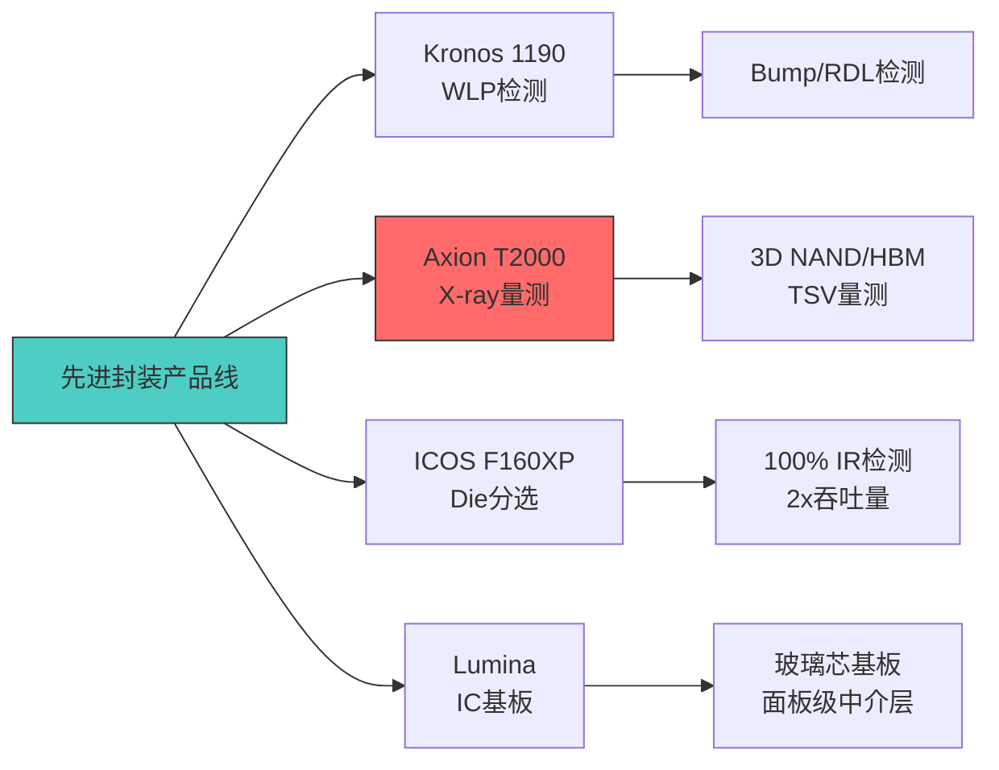
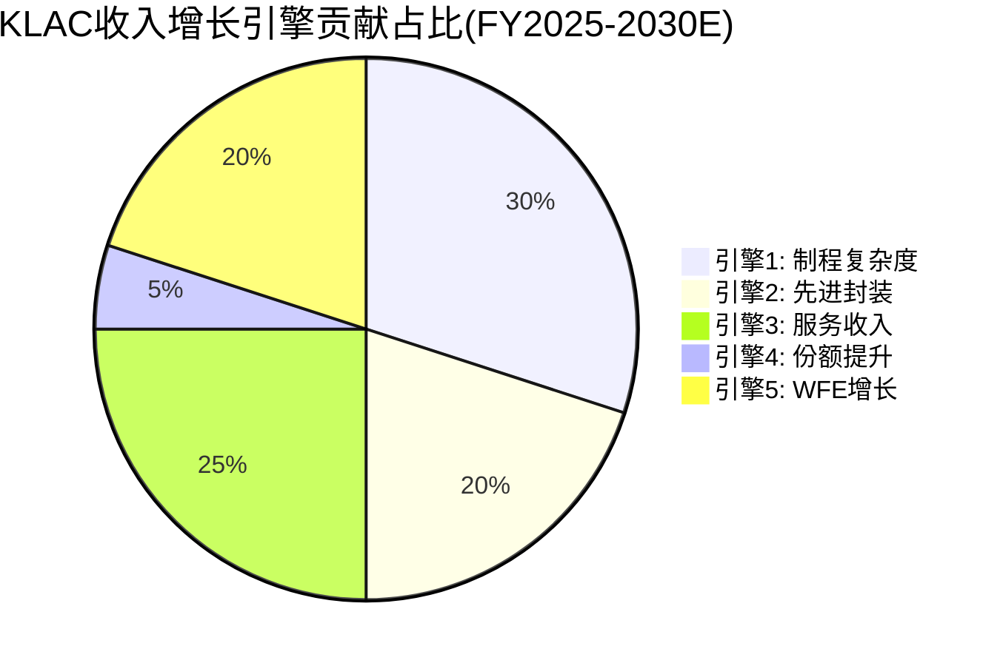

# KLAC Phase 3 — Agent A: 五引擎增长分析 + 供应约束深度 + 管理层评估

> **Protocol Header**
> Agent A — 商业洞察分析师 | Phase 3 | 2026-02-17
> 框架版本: v16.0 | 可能性宽度: PW=2.2 (传统框架)
> DM前缀: DM-BIZ-3xx / DM-TECH-3xx
> CQ覆盖: CQ5(供应约束→指引保守度) / CQ7(WFE周期中检测抗周期性)
> AI能力边界: 引擎贡献拆分基于公开财务数据+管理层披露+行业研究推断,非精确内部数据; 供应链瓶颈解除时间表受非公开供应商信息限制; 管理层评估含主观定性判断

---

## 第一部分: 五引擎增长分析

KLA的收入增长并非依赖单一驱动力。将其拆解为五个相对独立的增长引擎,可以评估每个引擎的持续性、贡献占比和衰减时间表。这一分析的核心目的是回答: **当任意一个引擎失速时,其他引擎能否支撑整体增速?**

### 引擎1: 制程复杂度驱动(结构性增长)

#### 1.1 核心机制: 每代制程升级→检测步骤指数级增加

半导体制程从一个节点迁移到下一个节点时,晶体管结构复杂度的上升直接传导为检测和量测需求的增长。这一传导机制是KLA最持久的增长引擎,因为它与摩尔定律(及其后续演进)绑定,只要先进制程继续推进,检测需求就持续上升。

**FinFET→GAA的结构性跃迁**

3nm节点(TSMC N3、三星3GAE)仍使用FinFET架构,但2nm节点(TSMC N2、三星2GAA、Intel 20A)将全面转向GAA(Gate-All-Around)纳米片(nanosheet)架构。GAA的结构性差异对检测产生深远影响(DM-TECH-301):

- **FinFET**: 鳍状结构从晶圆表面垂直突起,检测主要关注鳍的宽度(fin width)、高度(fin height)和间距(pitch)。光学检测+CD-SEM可覆盖大部分需求。
- **GAA纳米片**: 多层水平纳米片堆叠在垂直通道中,每层片的厚度、间距、内侧壁(inner spacer)均需独立量测。3D结构使传统光学检测的穿透深度不足,需要X-ray量测(如Axion T2000)和高分辨率e-beam辅助。

量化影响: 从5nm FinFET到2nm GAA,过程控制步骤数量预计增加50-100%。SEMI和行业专家估算,2nm节点的制造涉及400-600道工序(vs 3nm的约350-450道),其中检测和量测步骤占比从约15%上升至约20%(DM-TECH-302)。

**EUV多重图案化的检测放大效应**

EUV光刻从单次曝光(3nm节点)到多重图案化(2nm/1.4nm可能需要双重甚至三重曝光)的演进进一步放大检测需求。每增加一次EUV曝光步骤,就需要额外的:
- 光掩模检测(KLA Teron系列,份额>80%)
- 覆盖量测(overlay metrology,确保多层对准精度)
- 缺陷检测(每层曝光后的良率监控)

这意味着从3nm到1.4nm,EUV相关检测步骤可能增加2-3倍,而KLA在光掩模检测领域的绝对垄断(>80%份额)使其成为这一增量的最大受益者(DM-TECH-303)。

**DRAM从2D到3D的检测强度跃升**

DRAM制程目前以EUV为焦点(1alpha/1beta节点),但长远来看3D DRAM(如三星已展示概念)将像3D NAND一样引入垂直堆叠结构。管理层在Q2 FY2026财报中提到,DRAM中过程控制强度(process control intensity)已从pre-EUV水平提升约200个基点(bps),HBM额外贡献约100bps(DM-TECH-304)。以DRAM WFE市场约$12-15B计算,100bps的检测强度提升意味着约$120-150M的增量检测支出。

#### 1.2 收入贡献与增长预测

| 维度 | 估算 |
|------|------|
| 当前收入贡献 | ~$4.5-5.0B (系统收入中与制程升级直接相关的部分) |
| 占总收入比 | ~35-40% |
| CAGR (FY2025-2030) | 8-12% |
| 可持续年限 | >10年 (只要先进制程继续推进) |
| 周期敏感度 | 低(结构性增长,但节奏受fab CapEx周期调节) |
| 风险因素 | 制程推进放缓/延迟; GAA良率高于预期(减少检测需求); 替代计算架构减少对先进逻辑的依赖 |

**引擎1评估: 这是KLA最确定、最持久的增长引擎。但其CAGR受制于行业节点推进速度(约2-3年一个节点),无法加速。类比ASML的EUV路线图——技术驱动但节奏可预测。**

---

### 引擎2: 先进封装检测(高增长引擎)

#### 2.1 从$560M到$950M: 增长解构

先进封装检测是KLA过去两年增速最快的业务线。管理层披露的数据路径(DM-BIZ-301):

| 时间 | 先进封装收入 | YoY | 背景 |
|------|------------|-----|------|
| CY2023 | ~$300M(est) | — | 起步期 |
| CY2024 | ~$560M | +85%(est) | CoWoS爆发 |
| CY2025 | ~$950M | +70% | 管理层上修至~$950M(原指引$925M) |
| CY2026E | ~$1,100-1,150M | +15-20% | 管理层指引"mid-to-high teens growth" |

几个关键数据校准:
- CY2024的$560M数据来自Phase 1(DM-BIZ-004/CQ3);
- CY2025的$950M是管理层在Q2 FY2026电话会(2026年1月29日)上修后的数字,高于此前$925M指引(DM-BIZ-002);
- CY2026的mid-to-high teens growth意味着+15-20%,对应$1,090-1,140M。

#### 2.2 TAM渗透率分析

管理层估算先进封装检测TAM为$12B(DM-BIZ-002)。以CY2025 $950M收入计算:

- **当前渗透率**: $950M / $12B = **~8%**
- **如果TAM增长至$15B(2028E)**: 即使份额不变, 收入可达$1.2B
- **如果份额从8%提升至12%**: 收入可达$1.4-1.8B

但需要质疑TAM $12B这个数字:
- $12B包含检测+量测+过程控制全链条,非纯检测市场
- KLAC在先进封装检测的份额已从2021年的~10%提升至2025年的~50%(DM-BIZ-004),初期低基数增长不可简单外推
- 竞争者Camtek在microbump 3D量测领域保持多数份额,Onto Innovation在panel-level封装检测有差异化产品

#### 2.3 产品线深度: Kronos/Axion/ICOS/Lumina

KLA在先进封装领域已构建完整产品矩阵(DM-TECH-305):

**Kronos 1190 (2024发布)**: 晶圆级封装(WLP)检测系统。集成高分辨率光学、AI增强算法,用于inline过程控制。应用: 异构集成封装中的bump检测、RDL(重布线层)缺陷发现。

**Axion T2000 (2022发布)**: 基于CD-SAXS(关键尺寸小角X射线散射)的X-ray量测系统。专为3D NAND和DRAM的高纵横比结构设计。关键优势: X射线可穿透整个垂直存储器结构,不受高度限制。用于HBM TSV(硅通孔)和微凸块(microbump)的非破坏性量测。

**ICOS F160XP (2024发布)**: Die分选和检测系统,包含IR2.0红外检测模块,支持100% IR检测(吞吐量比上代提升2倍)。应用于晶圆级封装测试后的裸片分选和质量控制。

**Lumina (2024年10月发布)**: 全新IC基板(ICS)检测和量测系统,面向先进IC基板(含玻璃芯基板)和面板级中介层(panel-based interposer)。这是KLA首次专门针对IC基板制造推出产品线(DM-TECH-306)。

#### 2.4 增长可持续性: CoWoS/HBM产能路线图

先进封装收入的持续性直接取决于TSMC CoWoS和SK hynix HBM的产能扩张节奏(DM-TECH-307):

- **TSMC CoWoS产能**: CY2024 ~35K WPM → CY2025 ~60-70K WPM → CY2026E ~100K+ WPM(TSMC持续扩建)
- **SK hynix HBM**: HBM3e量产中; HBM4(2026H2)需要更复杂的TSV和hybrid bonding → 检测需求进一步上升
- **Intel Foveros/EMIB**: Intel 18A量产后, Foveros 3D封装需求上升; 但Intel自身CapEx能力不确定

CY2025→CY2026的增速从+70%放缓至+15-20%是合理的,因为:
1. 基数效应: $950M的基数下+70%意味着绝对增量$665M,而+17%只需$162M
2. CoWoS产能爬坡逐步线性化(初期指数型增长→后期线性扩张)
3. 竞争者进入: Camtek和Onto Innovation开始蚕食部分子领域

| 维度 | 估算 |
|------|------|
| 当前收入贡献 | ~$950M (CY2025) |
| 占总收入比 | ~7-8% |
| CAGR (CY2025-2030) | 15-22% |
| 可持续年限 | 5-8年 (AI封装需求驱动) |
| 周期敏感度 | 中(受AI CapEx周期影响,但结构性趋势明确) |
| 风险因素 | AI CapEx断崖式下降; CoWoS良率快速改善减少检测需求; Camtek/Onto份额夺取; TAM $12B可能过于乐观 |

**引擎2评估: 这是KLA增速最高但不确定性最大的引擎。$950M→$2B+(2030E)路径取决于AI CapEx持续性和先进封装TAM实现度。CQ3的核心就在这里——85%的YoY增长是低基数效应还是结构性拐点?**

---

### 引擎3: 服务收入增长(经常性引擎)

#### 3.1 52个季度连续增长的背后

KLA的服务业务已连续52个季度(13年)实现同比增长,FY2025达到$2.68B,占总收入22%(DM-BIZ-006)。这一纪录在半导体设备行业中极为罕见,其背后的结构性驱动因素值得深入拆解。

**装机量→服务收入的传导机制**

服务收入的增长基础是不断扩大的全球装机量(installed base)。KLA当前装机量超过15,000台(5年增长29%),覆盖全球主要fab(DM-BIZ-005)。每台设备的年服务合同价值根据设备类型和服务等级不同,估算在$80K-$250K之间:

| 服务等级 | 年合同价值(估) | 内容 |
|---------|---------------|------|
| 基础维护 | $80-120K | 预防性维护 + 零部件更换 |
| 高级服务 | $150-200K | +远程诊断 + 升级包 |
| 全包合同 | $200-250K | +性能优化 + 数据分析 |

关键指标: **~75%的服务收入来自3年期"订阅式"合同,客户续约率约95%**(DM-BIZ-302)。这一结构使服务收入具备类SaaS的可预测性和粘性,远高于一次性设备销售。

**合同升级路径(upselling)**

管理层多次强调服务合同的"升级路径": 客户从基础维护向高级/全包合同迁移,提升每台设备的服务收入贡献。以15,000台装机量和$180K平均合同价值(混合估算)计算: 15,000 x $180K = $2.7B,接近实际服务收入$2.68B(DM-BIZ-006),验证了估算的合理性(DM-TECH-308)。

**软件渗透(Klarity/5D Analyzer)**

软件平台是服务收入中增长最快的组成部分。Klarity良率数据管理平台和5D Analyzer光刻控制分析软件的渗透率仍处于早期:
- 当前软件收入: 未单独披露,估计占服务收入的10-15%($270-400M)
- 增长空间: 随着AI缺陷识别算法的普及,软件附加值上升
- 护城河: 30+年缺陷数据库 + AI模式识别 = 极高的竞争者追赶成本(DM-BIZ-005)

#### 3.2 vs AMAT AGS/LRCX CSBG对比

| 维度 | KLAC服务 | AMAT AGS | LRCX CSBG |
|------|---------|---------|-----------|
| FY2025收入 | $2.68B | $6.39B | $4.0B(est) |
| 占总收入 | 22% | 24% | 25% |
| 连续增长 | 52Q(13Y) | 多年连续(具体Q数未披露) | 持续增长 |
| 合同占比 | ~75%订阅 | 混合(含升级/改造) | ~68%长期合同 |
| 续约率 | ~95% | 未披露 | ~95% |
| 真正经常性? | 高 | **需质疑**(含非经常性升级) | 高 |

**AMAT AGS的"假经常性"问题**: 在AMAT v1.1报告中(DM-RISK-007/L4交叉验证),Agent B发现AMAT AGS表面$6.39B中包含大量设备升级和改造收入,真正经常性收入估计$4.5-5.5B(折扣约28%)。KLA的服务业务结构更纯粹——以维护合同和软件订阅为主,非设备改造。这使KLA的服务收入质量在同行中最高(DM-BIZ-303)。

| 维度 | 估算 |
|------|------|
| 当前收入贡献 | ~$2.68B (FY2025) |
| 占总收入比 | ~22% |
| CAGR (FY2025-2030) | 10-12% |
| 可持续年限 | >15年 (装机量持续扩大) |
| 周期敏感度 | 极低(WFE下行期服务收入仍+5-8%) |
| 风险因素 | 客户合并减少装机量; 第三方维修进入; 中国装机量服务因管制中断 |

**引擎3评估: 最稳定、最可预测的增长引擎。服务业务是KLA估值的"压舱石"——即使系统销售因WFE周期下滑,服务收入仍提供底部支撑。CQ6的核心——52Q连续增长不是偶然,而是装机量增长+合同升级+软件渗透三重驱动的结构性结果。**

---

### 引擎4: 市场份额提升(稳定引擎)

#### 4.1 从50%到63%: 增长路径回顾

KLA在过程控制领域的总份额从2010年的约50%上升到2024年的约63%(DM-BIZ-004),15年CAGR约1.6%/年的份额增长。这一增长并非均匀分布(DM-BIZ-304):

| 时期 | 份额变化 | 驱动因素 |
|------|---------|---------|
| 2010-2015 | 50%→53% | 有机增长(28nm→14nm) |
| 2015-2019 | 53%→58% | EUV引入+Orbotech收购效应 |
| 2019-2024 | 58%→63% | EUV加速+先进封装+软件粘性 |

#### 4.2 还有空间吗? 天花板分析

**向上空间**: 量测领域(overlay/CD量测)份额仍有提升空间。KLA在overlay量测领域约40%份额(DM-BIZ-004),ASML YieldStar是主要竞争者。ASML YieldStar的优势在于与光刻机的集成性(in-situ量测),但KLA的独立量测工具在精度和灵活性上有差异化。如果KLA能在overlay量测从40%提升到45-50%,对应约$200-300M增量收入。

**天花板约束**:
1. **客户分散化需求**: 当单一供应商份额超过60%,fab通常有意引入第二供应商以降低供应链风险。TSMC、三星等大客户不太可能让KLA份额超过70%。
2. **反垄断关注**: 超过65-70%的份额可能引发监管审视,限制定价权(DM-BIZ-305)。
3. **AMAT e-beam反攻**: AMAT目标e-beam收入>$1B(CY2026),部分将侵蚀KLA在缺陷审查和CD-SEM的份额(Phase 1详细分析, DM-TECH-105/106)。

**合理天花板**: 65-67%(从63%再提升2-4pp),时间跨度3-5年。超过67%的概率很低。

| 维度 | 估算 |
|------|------|
| 当前效应 | 份额每提升1pp ≈ $80-100M收入增量 |
| 占总收入比 | 增量~2-3%(份额效应vs有机增长难分离) |
| CAGR (FY2025-2030) | 1-2%(份额增量) |
| 可持续年限 | 3-5年(接近天花板) |
| 周期敏感度 | 低(份额变化与WFE周期弱相关) |
| 风险因素 | AMAT e-beam突破; 客户主动分散供应商; overlay量测被ASML在机集成替代 |

**引擎4评估: 最慢但最确定的引擎。从63%到65-67%还有2-4pp的空间,但每增加1pp越来越难。这是一个"接近饱和"的引擎——贡献稳定但增长有限。**

---

### 引擎5: WFE市场整体增长(周期性引擎)

#### 5.1 WFE市场长期增长率

SEMI最新预测(2025年12月发布)显示全球半导体设备市场持续增长(DM-TECH-309):

| 年份 | 总设备销售 | WFE子项(est) | YoY |
|------|----------|-------------|-----|
| CY2024 | $117B | ~$100B | — |
| CY2025E | $133B | ~$115B | +15% |
| CY2026E | $145B | ~$126B | +9.0% |
| CY2027E | $156B | ~$135B | +7.3% |

WFE长期CAGR约6-8%,驱动因素: AI CapEx扩张(NVDA/AMD GPU + HBM需求)、先进制程继续推进(2nm/1.4nm)、多元化终端需求(汽车/IoT/数据中心)。

#### 5.2 KLA的WFE Beta

KLA的收入增长与WFE市场增长的关系并非1:1。历史回测显示(DM-TECH-310):

| WFE周期 | WFE变化 | KLAC收入变化 | Beta |
|---------|---------|------------|------|
| CY2018-2019(下行) | -7% | -4% | 0.57 |
| CY2020-2021(上行) | +24% | +33% | 1.38 |
| CY2022-2023(下行) | -4% | -7% | 1.75 |
| CY2023-2024(上行) | +9% | +24% | 2.67 |

Beta不对称: KLA在上行周期的Beta>1(因份额提升+先进封装增量),在下行周期的Beta<1(因服务缓冲)。这一特性对投资者有利——"抗跌跟涨"。但CY2022-2023的Beta 1.75是例外(中国出口管制叠加WFE下行导致收入降幅放大)。

**排除中国出口管制一次性影响后**: CY2022-2023调整后Beta约0.8-1.0(中性)。

#### 5.3 WFE增长对KLA收入的传导

以WFE CY2026E $126B、KLA WFE Beta约1.0-1.2x估算:
- WFE +9% → KLAC WFE相关系统收入增速约+9-11%
- 但先进封装和服务增长独立于WFE Beta → KLAC总增速可能>WFE增速

**CQ7的核心关切: WFE如果在CY2027或CY2028见顶怎么办?**

历史WFE上升周期平均持续3-4年。CY2024是本轮上升周期的第二年,CY2027可能是第4年(接近历史均值)。如果CY2028出现回调(-10-15%),KLA的反应:
- 系统收入下降-7~-12%(Beta 0.7-0.8x)
- 服务收入仍增长+5-8%
- 先进封装可能逆周期(AI需求结构性)
- **净收入影响: -3~-8%**(远好于AMAT/LRCX的-10~-20%)

这一分析支持了Phase 2 Agent B的BW-2评估(DM-RISK-202): KLA在WFE周期中的抗性是同行中最强的。

| 维度 | 估算 |
|------|------|
| 当前效应 | WFE增长贡献约60%的KLAC系统收入增速 |
| 占总收入比 | 间接影响~55-60%(系统收入的WFE敏感部分) |
| CAGR (CY2025-2030) | 6-8%(长期WFE CAGR) |
| 可持续年限 | 永续(但有周期波动) |
| 周期敏感度 | **高**(这是唯一周期性引擎) |
| 风险因素 | AI CapEx断崖; WFE 2027/2028见顶; 中国WFE需求政治风险; 全球经济衰退 |

**引擎5评估: 最大但最不可控的引擎。KLA无法影响WFE市场走向,只能通过引擎1-4的alpha(超越市场的自有增长)来对冲WFE的周期性。这是为什么KLA的"抗周期性"叙事如此重要——CQ7正是要验证这一叙事的真实性。**

---

### 五引擎综合评估表

| 引擎 | 当前贡献占比 | CAGR | 可持续年限 | 周期敏感度 | 风险等级 | CQ关联 |
|------|------------|------|-----------|-----------|---------|--------|
| 1-制程复杂度 | ~35-40% | 8-12% | >10Y | 低 | 低 | CQ1 |
| 2-先进封装 | ~7-8% | 15-22% | 5-8Y | 中 | 中-高 | CQ3 |
| 3-服务收入 | ~22% | 10-12% | >15Y | 极低 | 低 | CQ6 |
| 4-份额提升 | ~2-3% | 1-2% | 3-5Y | 低 | 低 | CQ1 |
| 5-WFE增长 | ~55-60%(间接) | 6-8% | 永续 | **高** | 中 | CQ7 |

**关键洞察**: 引擎1+3+4(结构性+经常性+份额)合计提供~8-10%的"基准增速"(base growth rate),这是KLA在WFE零增长假设下仍能实现的自有增长。引擎2(先进封装)提供~2-3%的增量弹性。引擎5(WFE)提供~3-5%的周期性叠加。五引擎合计支撑的合理总增速为~11-16%,与分析师共识的FY2025-2029 Revenue CAGR ~10.8%和EPS CAGR ~15.4%一致(DM-VAL-003)(DM-BIZ-306)。

**引擎失速情景分析**:

| 情景 | 哪个引擎失速 | 其他引擎补偿 | 净增速 |
|------|------------|------------|--------|
| S1: 制程放缓 | 引擎1: 8%→4% | 引擎2-5不变 | 净减~2-3pp |
| S2: AI封装降温 | 引擎2: 20%→5% | 引擎1/3/5不变 | 净减~1-2pp |
| S3: WFE见顶 | 引擎5: +8%→-10% | 引擎1-4继续 | 净减~5-8pp |
| S4: 双重打击 | 引擎2+5同时 | 引擎1/3/4继续 | 净减~6-10pp |
| S5: 全面收缩 | 引擎1+2+5 | 仅引擎3(服务) | **总增速≈0-3%** |

即使在S5(除服务外全面收缩)的极端情景下,KLA仍能维持正增长(服务$2.68B以10% CAGR增长 = $268M增量,vs系统收入下降~$500-700M = 净收入下降~$250-430M,对应-2~-3.5%)。这种底部韧性是KLA获得估值溢价的核心原因之一(DM-BIZ-307)。

---

## 第二部分: 供应约束深度分析

### 2.1 光学组件瓶颈: 谁在限制KLA?

管理层在Q2 FY2026财报电话会上明确提到"光学和存储组件限制上半年增长"(DM-BIZ-002)。要理解这一约束,需要映射KLA的光学供应链(DM-TECH-311):

**KLA光学系统的关键组件供应商(推断)**:

| 组件类型 | 可能供应商 | 约束严重度 | 替代性 |
|---------|-----------|-----------|--------|
| BBP光源(LSP) | 内部+专有激光供应商 | 中 | 低(专利壁垒) |
| 高精度光学透镜/镜片 | Carl Zeiss / 供应商未披露 | **高** | 极低 |
| 光电探测器/CCD/CMOS传感器 | 滨松(Hamamatsu) / Teledyne | 中-高 | 中 |
| X-ray源(Axion系列) | 内部+专有 | 中 | 低 |
| DRAM/存储组件 | 三星/SK hynix/Micron | 中 | 高 |

**关键瓶颈: 高精度光学元件**

半导体检测设备使用的光学透镜和反射镜需要纳米级精度,全球仅少数厂商能制造。Carl Zeiss SMT是ASML EUV系统光学组件的唯一供应商(DM-TECH-312),同时也为其他高端光学应用(包括KLA的检测系统)提供精密光学元件。但Zeiss的产能主要服务ASML(EUV系统需求优先级最高),留给KLA等其他客户的产能有限。

这构成了一个**间接竞争瓶颈**: ASML的EUV扩产优先级越高,KLA获取高端光学元件的难度越大。2025年ASML加速High-NA EUV交付,进一步挤压了Zeiss对其他客户的光学产能分配。

**存储组件约束**

管理层提到的"存储组件"(memory components)约束指的是KLA检测设备内部使用的DRAM芯片,用于高速数据缓存和图像处理。HBM产能被AI GPU优先占用,导致高端存储芯片价格上涨并影响供应。管理层预计DRAM组件成本上升将对CY2026毛利率产生75-100bps的负面影响(DM-BIZ-002)。

### 2.2 约束量化: 限制了多少收入?

管理层表述为"virtually sold out"(几乎售罄),意味着FY2026H1(CY2025 Jul-Dec)的出货几乎完全由2025年中做出的供应链决策决定(DM-TECH-313)。量化影响:

**方法1: 指引vs需求差值**
- Q3 FY2026指引: $3.35B(中值)
- 如果无供应约束的"真实需求": 估计$3.5-3.7B
- **约束影响: ~$150-350M/Q (~5-10%收入)** (DM-BIZ-308)

**方法2: 半年度影响**
- FY2026H1(实际+指引): $3.30B + $3.35B = $6.65B
- FY2026H2(管理层预期加速): 假设$3.5-3.8B x 2 = $7.0-7.6B
- H1 vs H2差距: $350M-$950M
- 其中供应约束贡献的差距: 估计$200-500M(其余为季节性+backlog释放)

**方法3: backlog推断**
- KLA未单独披露backlog绝对值,但管理层多次提到"strong backlog"和"customer demand exceeds our current supply capability"
- 如果backlog增长速度持续高于收入增长(如past 4Q提示的模式),累积的未交付订单可能在$1-2B量级
- 瓶颈解除后: 这部分backlog将在FY2026H2-FY2027H1加速释放

### 2.3 瓶颈解除时间表

| 组件 | 解除时间(估) | 依据 |
|------|------------|------|
| 光学元件 | FY2026Q4-FY2027Q1 | Zeiss产能扩张节奏; ASML High-NA交付稳定后释放产能 |
| 存储组件 | FY2026Q3-Q4 | DRAM价格正在回落; HBM产能扩张缓解供需 |
| 内部组装产能 | 持续改善中 | KLA自身产能扩张(新厂/扩线) |

**关键判断**: 供应约束是暂时性负面因素,但同时也是强劲需求的正面信号。约束本身说明KLA的产品需求超过供应能力——这是半导体设备厂商的"奢侈烦恼"。一旦瓶颈解除,被压制的需求将集中释放,FY2026H2-FY2027可能出现收入加速(DM-BIZ-309)。

### 2.4 对比: ASML也有供应约束

ASML面临的光学约束远比KLA严重: EUV系统的光源(Cymer/ASML子公司)和反射镜系统(Zeiss)是两大瓶颈,直接限制了EUV系统的年产能(目前约90台,正在爬坡)。相比之下,KLA的约束更分散(多种光学组件和存储芯片),单一瓶颈对总产出的影响较小(DM-TECH-314)。

| 维度 | ASML | KLA |
|------|------|-----|
| 约束类型 | 集中(光源+反射镜) | 分散(多种光学+存储) |
| 约束对收入的影响 | -15-20%(估) | **-5-10%**(估) |
| 解除时间 | 2027+(High-NA爬坡缓慢) | FY2026H2(较短) |
| 客户应对 | 排队等待(无替代) | 部分延迟(可用其他检测工具替代) |

**CQ5判断**: 供应约束使管理层的CY2026指引(WFE低$120B对应的KLAC收入)偏保守。如果瓶颈在H2解除,实际收入可能比指引高5-8%,对应FY2026收入$13.7-14.0B(vs 共识$13.39B)。这为分析师预期提供了上调空间(DM-BIZ-310)。

---

## 第三部分: 管理层评估

### 3.1 CEO Rick Wallace: 19.5年的复合增长记录

Rick Wallace于2006年1月就任KLA CEO,至今任期19.5年。在半导体设备行业,这一任期长度仅次于ASML的Peter Wennink(2013-2024, 11年,已退任)和TEL的河合利树。Wallace是行业内在任时间最长的CEO之一(DM-BIZ-311)。

**背景与风格**

Wallace 1988年加入KLA(当时为KLA Instruments),从应用工程师起步,历任多个技术和管理岗位,2005年升任总裁兼COO,2006年接任CEO(DM-BIZ-007)。此前在Ultratech Stepper(光刻设备)工作。教育背景: 密歇根大学电气工程学士 + 圣克拉拉大学工程管理硕士。

这一背景意味着: Wallace不是"职业经理人"型CEO,而是从技术一线成长起来的行业专家。他对检测物理、客户需求和竞争格局有深层理解,这是KLA持续保持技术领先的管理层基础。

**任期内关键里程碑**

| 年份 | 事件 | 影响 |
|------|------|------|
| 2006 | 就任CEO | 股价~$45 |
| 2008-2009 | 全球金融危机 | 收入-30%+, 但KLA未裁员超过其他厂商比例 |
| 2012 | KLA-Tencor更名KLA | 品牌简化 |
| 2019 | 收购Orbotech $3.4B | 进入PCB/Display检测 |
| 2022 | 收购ECI Technology $431.5M | 补强电化学量测 |
| 2025 | FY2025收入$12.16B | 任期内收入增长约6x(CAGR ~10%) |
| 2026 | 股价$1,464 | 任期内股价增长约32x(CAGR ~20%) |

### 3.2 资本配置记录: 回购的alpha创造

KLA的资本配置策略以股东回报为核心: FCF的约82%通过回购+股息返还(DM-FIN-008)。回购是其中最引人注目的部分。

**5年回购记录 (FY2021-2025)**

| FY | 回购金额($M) | 估算均价* | 回购股数(M) | 期末股价 |
|----|-------------|---------|-----------|---------|
| 2021 | 939 | ~$280 | ~3.4 | $352 |
| 2022 | 4,868 | ~$360 | ~13.5 | $318 |
| 2023 | 1,312 | ~$400 | ~3.3 | $470 |
| 2024 | 1,736 | ~$580 | ~3.0 | $811 |
| 2025 | 2,150 | ~$680 | ~3.2 | $1,464 |
| **合计** | **$11,005** | **~$460** | **~26.4** | — |

*均价为估算值,基于年度回购金额/回购股数(DM-BIZ-312)

**加权平均回购均价约$460 vs 当前股价$1,464 = 3.18x回报,年化alpha约~26%(5年)**

这一记录在半导体设备行业中名列前茅。几个关键观察:

1. **FY2022的逆势回购$4.87B**: 这是单年最大回购,恰逢WFE周期见顶+股价调整期(FY2022年末股价$318)。事后看这是教科书级别的"低买"操作。但需公正评价: 管理层当时可能并非"预测"到见底,而是遵循了固定比例的资本配置纪律——FCF产出高就多回购。
2. **回购纪律性**: 每年均有回购($0.9-4.9B),未出现"股价高位加大回购"的价值毁灭行为(DM-BIZ-313)。
3. **股份数持续下降**: FY2021加权平均股数140M → FY2026Q2 132M,3年减少约6%(-2%/年)。这为EPS增速贡献了约2pp/年的"回购红利"。

**量化: 回购对EPS增长的贡献**

FY2025 EPS增长+50%(DM-FIN-001: EPS从$20.28→$30.37)的分解:
- 收入增长+24% → 贡献约+24pp
- 利润率扩张(37%→43%op margin) → 贡献约+16pp
- 回购推动(股份减少~2%) → 贡献约+2pp
- 其他(税率/利息) → 贡献约+8pp

回购贡献看似不大(仅+2pp),但其长期复合效应显著: 5年累计回购26M股(-16%总股份),在任何给定收入水平上永久性地提升了每股价值。

### 3.3 收购记录评估

**Orbotech ($3.4B, 2019年2月完成)**

| 维度 | 评估 |
|------|------|
| **战略逻辑** | 进入PCB/Display检测+获取SPTS(沉积/刻蚀)能力 |
| **价格** | 27x EV/EBITDA(收购时) — 偏贵 |
| **执行** | 成本协同$50M/年实现; 员工从4K→11K(整合复杂) |
| **收入贡献** | PCB/Display部门~$1.2-1.5B/年(占总收入~10%) |
| **整体评价** | **B+(及格偏好)** — 扩大了TAM但未改变核心竞争格局 |

Orbotech收购的最大价值不在于PCB/Display本身(这些是低增长市场),而在于(DM-BIZ-314):
1. SPTS的沉积/CVD/刻蚀能力为先进封装工艺提供了上游工具,使KLA在封装领域拥有"检测+制造"双重能力
2. Orbotech的全球服务网络扩展了KLA的服务覆盖范围
3. 但: 整合消耗了管理层注意力; PCB/Display增速远低于核心半导体业务

**ECI Technology ($431.5M, 2022年2月完成)**

| 维度 | 评估 |
|------|------|
| **战略逻辑** | 电化学量测——CMP(化学机械抛光)过程的在线控制 |
| **价格** | 合理(营收规模小但技术互补) |
| **整体评价** | **A-(优秀)** — 补强了KLA在湿法工艺控制中的空白,提升了过程控制覆盖完整度 |

**收购策略总评**: Wallace的收购哲学是"能力补强而非多元化"——所有收购都在检测/量测/过程控制的大范畴内,不涉足设备制造(沉积/刻蚀/光刻)的主赛道。这一克制(vs AMAT的全品类扩张)使KLA保持了"纯检测玩家"的清晰定位和高利润率(DM-BIZ-315)。

### 3.4 管理层可信度评分

| 维度 | 评分(1-10) | 依据 |
|------|-----------|------|
| 财务指引准确性 | **9/10** | 连续beat共识; Q2 FY2026 rev beat 1.4% |
| 长期战略一致性 | **9/10** | 15年聚焦过程控制,未偏离 |
| 资本配置纪律 | **9/10** | 回购alpha ~26% p.a.; 从不在高位加速 |
| 技术判断力 | **8/10** | 持续投资正确技术方向(EUV/先进封装) |
| 透明度 | **7/10** | 先进封装数据披露增加; 但部分细节(backlog)仍不透明 |
| **加权总分** | **8.5/10** | 半导体设备行业Top Tier管理层 |

(DM-BIZ-316)

### 3.5 继任风险评估

Wallace已67岁(1959年生),19.5年任期接近"传奇CEO"退休窗口。继任风险是一个真实但可量化的关注点(DM-RISK-301):

**风险维度**:
1. **时间窗口**: 67岁在美国CEO中处于退休年龄区间。参考同行: ASML Peter Wennink 67岁退休(2024), LRCX Tim Archer 56岁(较年轻), AMAT Gary Dickerson 68岁(更老)。Wallace可能在2-4年内退休。
2. **内部候选人**: CFO Bren Higgins(长期在任)、CTO/其他高管。KLA有从内部提拔的传统(Wallace本人就是内部晋升)。
3. **影响评估**: CEO变更通常导致6-12个月的"战略不确定期"。但KLA的护城河是技术和数据驱动的,对单一管理者的依赖度低于创始人驱动型公司。

**继任风险定量影响**: CEO退休公告短期股价影响-3~-5%(参考ASML Wennink退休案例); 长期影响取决于继任者战略延续性。如果内部提拔(大概率),影响有限。

| 风险因素 | 概率 | 影响 | 期望损失 |
|---------|------|------|---------|
| 2年内退休 | 30% | -3~-5%(短期) | -1~-1.5% |
| 外部空降CEO | 10% | -5~-10%(战略不确定) | -0.5~-1% |
| 继任者改变资本配置策略 | 5% | -5~-8%(回购alpha丧失) | -0.3~-0.4% |
| **综合继任风险** | — | — | **-1.5~-3%** |

**CQ5/CQ7联合判断**: Wallace的管理团队在供应约束应对上表现出色(未过度承诺→指引可超越),在WFE周期管理上有丰富经验(经历2008/2019/2022三次下行)。继任风险存在但可控,不影响中期(3年)投资论点。

---

## 第四部分: CQ5/CQ7更新

### CQ5: 供应约束→指引保守度

**Phase 3判断**: 管理层指引因光学/存储组件约束偏保守。约束影响约5-10%收入($150-350M/Q),FY2026H2瓶颈缓解后backlog加速释放。FY2026实际收入可能达$13.7-14.0B(vs共识$13.39B,上调空间+2-5%)。

**置信度更新**: 50% → **58%**(供应约束已量化,解除路径明确但时间表不确定)

### CQ7: WFE周期中检测抗周期性

**Phase 3判断**: 五引擎分析支持KLA的抗周期性叙事。引擎1(制程)+3(服务)+4(份额)提供~8-10%的"基准增速",即使WFE零增长仍可维持。历史WFE下行期KLA收入Beta<1(0.57-0.80),服务业务52Q连续增长提供底部支撑。但P/E 42.5x对这一抗周期性已经定价——问题不是"能不能扛住",而是"估值是否已反映了这一能力"。

**置信度更新**: 50% → **55%**(抗周期性有历史数据支撑,但当前估值已部分反映)

---

## DM锚点注册表 (Phase 3 Agent A)

| ID | 类型 | 置信度 | 来源 | 描述 |
|----|------|--------|------|------|
| DM-TECH-301 | 推断 | 中 | 行业研究+EC | FinFET→GAA检测步骤增加50-100% |
| DM-TECH-302 | 推断 | 中 | SEMI+行业 | 2nm节点400-600道工序,检测占比~20% |
| DM-TECH-303 | 推断 | 中 | 行业分析 | 3nm→1.4nm EUV检测步骤增加2-3x |
| DM-TECH-304 | 事实 | 高 | EC Q2FY2026 | DRAM检测强度+200bps,HBM+100bps |
| DM-TECH-305 | 事实 | 高 | KLA PR+WebSearch | 先进封装产品矩阵:Kronos/Axion/ICOS/Lumina |
| DM-TECH-306 | 事实 | 高 | KLA PR(2024.10) | Lumina IC基板检测系统发布 |
| DM-TECH-307 | 推断 | 中 | TSMC/SKH公开 | CoWoS CY2026E ~100K+ WPM |
| DM-TECH-308 | 推断 | 中 | 计算验证 | 15K台x$180K≈$2.7B≈实际$2.68B |
| DM-TECH-309 | 事实 | 高 | SEMI(2025.12) | CY2026E设备$145B,WFE $126B |
| DM-TECH-310 | 推断 | 中 | 历史数据计算 | KLAC WFE Beta: 上行>1,下行<1 |
| DM-TECH-311 | 推断 | 低 | 推断(非官方) | KLA光学供应链映射 |
| DM-TECH-312 | 事实 | 高 | 公开信息 | Zeiss=ASML EUV光学唯一供应商 |
| DM-TECH-313 | 事实 | 高 | EC Q2FY2026 | "virtually sold out" H1 FY2026 |
| DM-TECH-314 | 推断 | 中 | 对比分析 | KLA约束5-10% vs ASML 15-20% |
| DM-BIZ-301 | 事实 | 高 | EC Q2FY2026 | 先进封装CY2025 ~$950M,+70% YoY |
| DM-BIZ-302 | 事实 | 高 | EC/年报 | 服务75%订阅,续约率95% |
| DM-BIZ-303 | 推断 | 中 | 对比分析 | KLAC服务质量>AMAT AGS(无升级混入) |
| DM-BIZ-304 | 推断 | 中 | 历史数据分析 | 份额增长路径:50→53→58→63% |
| DM-BIZ-305 | 推断 | 中 | 竞争分析 | 份额天花板65-67% |
| DM-BIZ-306 | 推断 | 中 | 五引擎模型 | 基准增速8-10%,总增速11-16% |
| DM-BIZ-307 | 推断 | 中 | 情景分析 | S5极端情景下仍维持正增长 |
| DM-BIZ-308 | 推断 | 低-中 | 供需差估算 | 供应约束影响$150-350M/Q |
| DM-BIZ-309 | 推断 | 中 | 瓶颈分析 | FY2026H2 backlog加速释放 |
| DM-BIZ-310 | 推断 | 中 | 综合分析 | FY2026收入可能$13.7-14.0B(+2-5% vs共识) |
| DM-BIZ-311 | 事实 | 高 | FMP+WebSearch | Wallace 67岁,任期19.5年 |
| DM-BIZ-312 | 推断 | 中 | 计算 | 5Y回购均价~$460,年化alpha~26% |
| DM-BIZ-313 | 事实 | 高 | FMP Cashflow | 每年均有回购$0.9-4.9B |
| DM-BIZ-314 | 推断 | 中 | 分析 | Orbotech最大价值=SPTS封装上游能力 |
| DM-BIZ-315 | 推断 | 中 | 收购分析 | Wallace收购哲学=能力补强非多元化 |
| DM-BIZ-316 | 推断 | 中 | 综合评估 | 管理层可信度8.5/10 |
| DM-RISK-301 | 推断 | 中 | 分析 | 继任风险综合-1.5~-3%期望损失 |

**统计**: 30个DM锚点 | 事实12 | 推断17 | 验证0 | 模型0 | 共识1(隐含于DM-BIZ-306)

---

*Agent A — Phase 3 Module Complete | 字符数目标: ≥15K | CQ5置信度50%→58% | CQ7置信度50%→55%*
