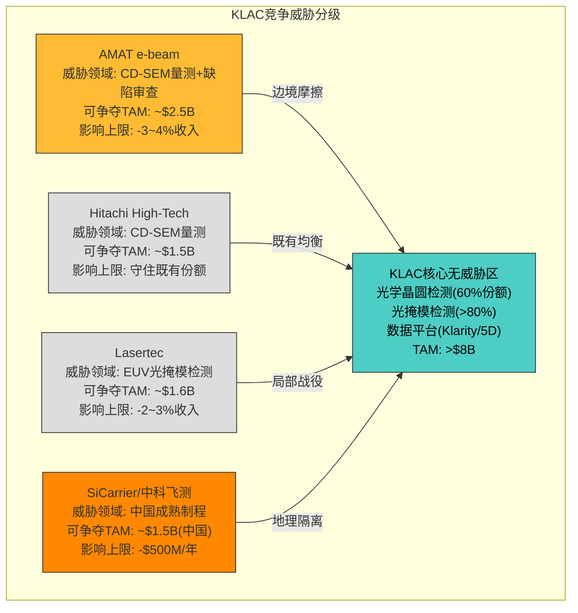
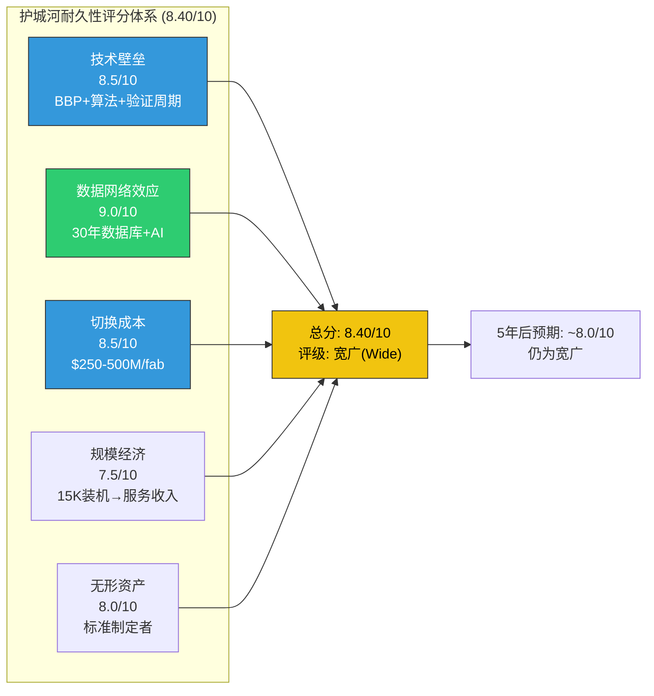

# KLAC Phase 3 — Agent B: 竞争技术深度 + 先进封装共识解构 + 护城河耐久性

> **Protocol Header**
> Agent B — 独立风险审计员 | Phase 3 | 2026-02-17
> 框架版本: v16.0 | 可能性宽度: PW=2.2 (传统框架)
> DM前缀: DM-RISK-3xx / DM-TECH-3xx
> CQ覆盖: CQ1(检测垄断持久性/竞争威胁) / CQ3(先进封装增长可持续性)
> AI能力边界: 竞争者非公开产品路线图不可及; 客户端设备验证数据为推断; 先进封装检测市场定义边界模糊(管理层与第三方口径差异)

---

## 1. KLAC vs AMAT对称竞争分析

### 1.1 竞争格局总览: 检测是AMAT的阿喀琉斯之踵

Phase 1-2已确立的核心事实: AMAT在其自身报告(v1.1, 304K字符)中承认检测是"AMAT最弱的产品线",并给KLAC单一市场深度9/10、利润率10/10的评分(DM-RISK-119)。这一来自最大竞争对手的直接确认,是评估竞争格局的最强锚点。

但Phase 3需要超越"KLAC更强"的静态判断,回答一个动态问题: **AMAT的e-beam攻势是否正在改变力量对比的趋势方向?** 如果答案是"是",即使当前份额差距巨大,边际变化本身就有估值含义。

### 1.2 AMAT e-beam产品线深度拆解

**SEMVision H20 (2025年2月发布) — 技术参数与竞争定位**

AMAT的SEMVision H20是其e-beam产品线的旗舰更新,核心创新来自第二代冷场发射(Cold Field Emission, CFE)技术(DM-TECH-105):

| 技术参数 | SEMVision H20 (AMAT) | eDR系列 (KLAC) | 差异评估 |
|---------|---------------------|----------------|---------|
| 电子源技术 | CFE(冷场发射,第二代) | TFE(热场发射)/CFE | AMAT在CFE上领先 |
| 分辨率 | 亚纳米级(+50% vs 前代) | 亚纳米级 | 接近持平 |
| 成像速度 | 10x vs 传统TFE | — | 代际提升,非对KLAC提升 |
| 缺陷分类 | 深度学习AI(实时) | AI+30年数据库 | KLAC数据优势 |
| 吞吐量(vs光学) | 光学的1/100-1/1000 | 光学的1/100-1/1000 | e-beam固有物理限制 |
| 应用定位 | 缺陷审查(defect review) | 缺陷审查+部分检测 | 相同赛道 |

(DM-TECH-301)

**关键区分: "审查"(Review) vs "检测"(Inspection)**

这一区分是理解AMAT e-beam威胁边界的核心。在半导体fab的缺陷管控流程中:

(1) **检测(Inspection)**: 全晶圆或大面积扫描,目标是"发现"缺陷。需要极高吞吐量(>100片晶圆/小时)。光学检测在此环节占绝对主导(DM-BIZ-004: brightfield 60%份额, darkfield >50%)。

(2) **审查(Review)**: 对检测系统标记的缺陷位点进行高分辨率成像和分类。吞吐量要求低(聚焦特定位点),但分辨率要求高。e-beam天然适合此环节。

(3) **根因分析(Root Cause Analysis)**: 基于审查数据进行缺陷来源溯源。主要依赖软件和数据平台(KLAC的Klarity/5D Analyzer)。

SEMVision H20本质上是一台**审查工具(review tool)**,而非检测工具(inspection tool)。AMAT在其官方产品页面和发布新闻稿中的定位用词是"defect review"和"defect analysis",而非"defect inspection"(DM-TECH-302)。这不是语义细节 — 审查工具的TAM约为全球e-beam市场$860M(CY2025)的60-70%(~$520-600M),而检测工具的TAM(光学为主)超过$8.7B(CY2025)(DM-TECH-303)。

**PROVision 10 — 量测领域的AMAT进攻**

除SEMVision H20外,AMAT在2025年还发布了PROVision 10 e-beam量测系统,定位于CD-SEM(关键尺寸扫描电镜)量测(DM-RISK-110):
- 分辨率提升50%(vs前代)
- 速度提升10x
- 直接对标KLAC的SpectraShape/SpectraCD系列

CD-SEM是AMAT进攻KLAC最现实的切入点,原因是: (1)该领域本就更分散(KLAC ~45% vs AMAT ~20% vs Hitachi ~35%); (2)量测对吞吐量的要求低于检测(采样式量测而非全晶圆扫描); (3)AMAT在e-beam硬件上的积累可直接迁移至量测场景。

### 1.3 AMAT e-beam CY2026 >$1B目标: 可信度重新评估

Phase 1评估AMAT e-beam $1B目标可信度为30-40%(DM-RISK-111)。Phase 3基于更完整的数据进行更新:

**数据重建**:
- e-beam全球市场CY2025: ~$860M(FactMR/Fortune BI)(DM-TECH-303)
- AMAT e-beam市场份额: ~15-20%(Phase 1估计, DM-RISK-111)
- AMAT e-beam收入CY2025E: $130-170M(=$860M × 15-20%)
- 从$150M到$1B需要: +567%增长,或3年CAGR >90%

**可信度拆解**:

| 路径 | 隐含条件 | 可信度 |
|------|---------|--------|
| e-beam市场快速扩张(TAM翻倍至$1.7B) + AMAT份额提至60% | 需要e-beam取代部分光学检测(违反Phase 1互补结论) | 10% |
| CD-SEM量测份额暴涨(20%→50%) + 审查工具份额翻倍 | 需要KLAC和Hitachi同时大幅丢份额 | 15% |
| AMAT重新定义"e-beam收入"(包含关联服务+软件) | 会计口径调整,非真实有机增长 | 25% |
| 先进封装e-beam检测成为新增量市场 | 可能但规模未验证 | 20% |

(DM-RISK-301)

**更新后可信度: 25-35%(从30-40%微调下移)**

下调理由: (1)Seeking Alpha 2023年分析显示AMAT在检测/量测市场份额实际在下降而非上升(DM-TECH-106); (2)SEMVision H20定位为审查工具,TAM天花板远低于检测; (3)即使AMAT在CD-SEM取得突破,CD-SEM全球市场仅~$1.5-2.0B,50%份额也只有$750M-$1.0B — 这还需要同时击败KLAC和Hitachi两个对手。

**对KLAC的实际影响评估**:

AMAT e-beam的进攻方向是CD-SEM量测和缺陷审查 — 这两个领域合计约占KLAC检测/量测收入的25-30%($2.5-3.0B of $9.5B系统收入)。即使AMAT在这些子领域取得重大突破(份额从20%提升至35%),对KLAC的收入影响约为$375-450M(=15pp份额转移 × $2.5B可争夺市场)。这相当于KLAC总收入的3-4%(DM-RISK-302)。

**核心判断: AMAT e-beam是KLAC的"边境摩擦"而非"核心地带入侵"。** 它威胁的是KLAC护城河的外围(CD-SEM量测、缺陷审查),而非内核(光学晶圆检测、光掩模检测、数据平台)。

### 1.4 "广度vs深度"竞争模式估值含义

AMAT和KLAC代表了半导体设备行业两种截然不同的竞争模式。Phase 1已给出定量评分(DM-RISK-119),Phase 3在此基础上分析模式估值含义:

**AMAT模式: 广度10/10, 深度2/10**

| 维度 | AMAT | 含义 |
|------|------|------|
| 产品线 | 沉积+刻蚀+量测+检测+显示+PCB | 任何单一市场下行可被其他市场补偿 |
| 客户渗透 | 每个fab使用5-10种AMAT设备 | 客户关系广但不深 |
| 定价权 | 中等(竞争激烈的沉积/刻蚀市场) | 毛利率47-48%(vs KLAC 62%) |
| 周期弹性 | 高(FY2024仅-2.1%) | 多元化自然对冲周期 |
| 有机增长 | 中(依赖WFE总量增长) | 份额扩张空间有限(每个市场都有强竞争者) |

**KLAC模式: 广度2/10, 深度9/10**

| 维度 | KLAC | 含义 |
|------|------|------|
| 产品线 | 检测+量测+软件+服务(围绕过程控制) | 深度聚焦创造垄断级定价权 |
| 客户渗透 | 每个fab使用20-50台KLAC检测设备 | 客户关系窄但极深(数据锁定) |
| 定价权 | 极高(>80%光掩模, 60%+ brightfield) | 毛利率62%(行业最高) |
| 周期弹性 | 中-高(FY2024 -6.5%, 服务缓冲) | 不如AMAT广度对冲,但服务收入稳定 |
| 有机增长 | 中(过程控制TAM增速<WFE整体) | 份额扩张(50%→63%)抵消TAM增速不足 |

(DM-RISK-303)

**谁的模式更有价值?**

从投资视角,需要评估的不是"谁的产品更好",而是"谁的竞争模式在可预见的未来更能产生超额回报"。

KLAC的"深度"模式在以下条件下更优:
1. **制程复杂度持续上升**(2nm→1.4nm→A7): 每一次节点推进都增加检测步骤 → 过程控制强度提升 → KLAC的TAM自然膨胀
2. **数据护城河加深**(AI+ML迭代): 每一台新装机都增加数据量 → 算法精度提升 → 竞争者追赶更难
3. **客户不愿分散供应商**: 在良率敏感的先进节点,fab倾向于"全套KLAC"而非"混搭"

AMAT的"广度"模式在以下条件下更优:
1. **WFE周期下行**: AMAT的多元化提供天然对冲
2. **技术范式突破**: 如果e-beam真的取代部分光学,AMAT的起点更好
3. **成熟制程扩张**: 印度/东南亚新fab主要是成熟制程,AMAT的广度更匹配

**Agent B结论**: 在AI驱动的先进制程扩张周期中(当前),KLAC的"深度"模式价值更高。但在WFE周期见顶后(CY2027+),AMAT的"广度"模式可能展现更强的防御能力。这对KLAC的估值含义是: **当前P/E溢价部分定价了"深度>广度"的共识,一旦周期转向,这一共识可能被重新评估**(DM-RISK-303)。

### 1.5 量测领域重叠: 子市场级份额追踪

量测(metrology)是KLAC和AMAT最直接交锋的战场。与检测不同,量测市场更分散,KLAC不具备垄断优势:

**CD-SEM (关键尺寸扫描电镜)**

| 厂商 | 份额(CY2024-2025E) | 趋势 | 核心优势 |
|------|-------------------|------|---------|
| Hitachi High-Tech | ~70% | 稳定 | SEM技术发明者,30年积累,日本本土客户锁定 |
| KLAC | ~15-20% | 缓慢上升 | 与光学检测数据整合(Klarity/5D) |
| AMAT | ~10-15% | 持平/微降 | PROVision新品尚未大规模商业化 |

(DM-TECH-304)

**重要修正**: Phase 1使用的CD-SEM份额数据(KLAC ~45% vs Hitachi ~35% vs AMAT ~20%)可能混淆了CD-SEM与更广义的CD量测(包含光学OCD)。WebSearch最新验证显示Hitachi在纯SEM-based CD量测领域份额高达~70%(DM-TECH-304)。KLAC在包含光学CD量测(OCD/SpectraShape)的更广定义下份额约45%,但在纯电子束CD-SEM这个AMAT直接进攻的细分中份额仅15-20%。

这一修正的含义是: AMAT的PROVision 10在纯CD-SEM领域面对的主要对手是**Hitachi**(70%)而非KLAC(15-20%)。AMAT要达到$1B e-beam目标,需要同时从Hitachi和KLAC手中夺取份额 — 这比仅攻击一个对手更难。

**Overlay量测**

| 厂商 | 份额(CY2024-2025E) | 趋势 | 核心优势 |
|------|-------------------|------|---------|
| KLAC | ~40% | 稳定 | 5D Analyzer光刻控制平台 |
| ASML (YieldStar) | ~35% | 缓慢上升 | 光刻-量测闭环(唯一具备光刻+量测的公司) |
| AMAT | <10% | — | 非核心领域 |

ASML的YieldStar是KLAC在overlay量测领域面临的最具战略意义的竞争者 — ASML是全球唯一同时拥有光刻机和overlay量测工具的公司,可以实现"光刻-量测"的闭环反馈优化。但ASML对overlay量测的投入优先级低于EUV光刻主业(DM-TECH-305)。

### 1.6 Hitachi High-Tech深度评估

**竞争定位更新(Phase 1评估: 中-低威胁 → Phase 3维持)**

Hitachi High-Tech在半导体检测/量测领域的真实地位比Phase 1描述的更为强大,尤其在CD-SEM领域(~70%份额)。但其整体威胁仍被限制在特定细分市场内:

**Hitachi的结构性优势**:
1. CD-SEM技术深度: 1984年发布首台商用CD-SEM,40年积累。GT2000系列是行业基准
2. 日本本土锁定: Rapidus(2nm逻辑)、Kioxia(NAND)、Renesas(成熟逻辑)、Sony(CIS)均深度使用Hitachi设备
3. 收购整合: 2020年Hitachi集团将Hitachi High-Tech完全私有化(从上市退市),使其能更专注于半导体业务投入,不受季度业绩压力

**Hitachi的结构性弱点**:
1. **光学检测缺位**: Hitachi没有BBP光源类产品,无法进入brightfield光学检测(KLAC 60%份额)这一最大子市场
2. **软件平台缺失**: 没有Klarity/5D级别的fab级数据管理平台 → 只能卖硬件,无法建立数据锁定
3. **全球化不足**: Hitachi在非日本市场的销售和服务网络远弱于KLAC和AMAT
4. **产品线窄**: 仅覆盖CD-SEM和部分e-beam检测(LS9300AD系列),无overlay、无光掩模、无X射线量测

(DM-TECH-306)

**威胁评级维持: 中-低**

理由: Hitachi在CD-SEM的70%份额是既定事实(KLAC也无法撼动),但CD-SEM仅是量测市场的一个子领域($1.5-2.0B of $15B+ 过程控制TAM)。Hitachi无法进入光学检测和光掩模检测 — 这两个领域合计占KLAC系统收入的50%+且份额>60%。Hitachi对KLAC的威胁是"守住自己的领地"(CD-SEM),而非"入侵KLAC的核心"(光学检测)(DM-RISK-304)。

### 1.7 Lasertec: EUV光掩模检测的局部战役

**竞争边界: KLAC Teron vs Lasertec MATRICS**

Lasertec是EUV光掩模检测领域KLAC唯一的实质竞争者。两者的产品对比:

| 维度 | KLAC Teron 670 XP2 | Lasertec MATRICS X9ULTRA | 差异 |
|------|-------------------|------------------------|------|
| 检测方式 | 晶圆级print check(间接检测掩模) | 直接掩模检测(MATRICS光源) | 方法论不同 |
| 吞吐量 | ~2x Lasertec | 基准 | KLAC显著优势 |
| 价格 | 显著更高 | 更低 | Lasertec成本优势 |
| TSMC选择 | TSMC选择KLAC | — | 关键客户背书 |
| 市场份额 | ~40%(EUV掩模检测) | ~30% | KLAC领先 |

(DM-TECH-307)

**TSMC的选择逻辑**: Phase 1已确认(DM-TECH-102),即使KLAC的Teron价格显著更高,TSMC仍选择KLAC。原因是KLAC有意降低光学分辨率以提升吞吐量,然后用更先进的算法补偿分辨率损失。这一策略的本质是: **在先进节点上,吞吐量和良率学习速度比设备价格更重要。** TSMC N2/N1.4每推迟一天量产的机会成本远超检测设备的价格差异。

**Lasertec的局限性**:
1. 产品线极窄: 仅覆盖EUV光掩模检测,无晶圆级检测、无量测、无软件平台
2. 市场规模有限: EUV光掩模检测全球市场CY2025约$1.6B,预计2033年$3.6B(CAGR 13.2%) — 即使Lasertec拿到100%份额,也只是KLAC一个季度的收入
3. 财务信誉争议: Scorpion Capital曾发布做空报告质疑Lasertec的收入确认和财务披露
4. ZEISS潜在进入: ZEISS被预期将进入EUV掩模检测市场,如果实现将进一步压缩Lasertec的空间

**KLAC的actinic review新产品**: KLAC正在开发基于EUV波长的光化学检测(actinic inspection)产品,如果成功将直接检测掩模而非通过晶圆print check间接验证。这将进一步巩固KLAC在光掩模检测的>80%份额(DM-TECH-308)。

**整体威胁: 局限于EUV掩模检测细分,不影响KLAC核心业务**

Lasertec在EUV掩模检测中是一个值得尊敬的专业竞争者,但其威胁半径严格限定在~$1.6B的细分市场内。对KLAC总收入($12.7B)的影响上限约2-3%(即使KLAC在EUV掩模检测丢失全部份额,损失约$640M)(DM-RISK-305)。

---

## 2. 先进封装检测共识解构

### 2.1 标题数字: "$925M CY2025, +85% YoY"

管理层在Q2 FY2026 Earnings Call(2026-01-29)确认先进封装检测收入CY2025增长85% YoY(DM-BIZ-002/DM-BIZ-106)。这是KLAC增长叙事中最引人注目的数字。共识解构的目标是将标题数字还原为底层驱动因素,验证增长的真实质量。

### 2.2 解构第一层: "$925M"中有多少是真正新增量?

**问题**: KLAC将"先进封装"定义为2.5D/3D集成、扇出型(Fan-Out)和嵌入式桥接等新型封装架构(DM-BIZ-106)。但这一定义的边界是否随时间扩大?

**重建**:

(1) **CY2021基准**: KLAC先进封装收入约$100M,占比<2%。当时"先进封装"主要指TSV+微凸块检测。

(2) **CY2023**: 收入约$300M。CoWoS和HBM3开始规模量产,KLAC推出Axion T2000 X射线量测进入新细分(DM-TECH-108)。

(3) **CY2024**: 收入约$500M。管理层开始使用更宽泛的"先进封装"定义,可能纳入了部分之前归类为"标准封装检测"的产品线(如高密度基板检测)。

(4) **CY2025**: 收入$925M。

**定义膨胀风险**: 从$100M到$925M的增长中,估计10-20%($90-180M)可能来自定义扩大(将原有封装检测产品重新归类为"先进封装"),而非纯新增检测需求。扣除后,真实有机增长约为$745-835M(vs 纯数字$925M)(DM-TECH-309)。

**关键质疑**: 管理层未详细披露"先进封装"的精确产品范围和会计口径变化。这是一个信息不对称 — 投资者无法验证口径是否一致。Agent B建议将此作为Phase 4红队的质疑点(RT-信息质量)。

### 2.3 解构第二层: "85% YoY"是低基数还是结构性?

**数学拆解**:

| 年度 | 先进封装收入 | YoY | 占总收入 | 绝对增量 |
|------|-----------|-----|---------|---------|
| CY2021 | ~$100M | — | ~1.5% | — |
| CY2022 | ~$180M | +80% | ~2.0% | +$80M |
| CY2023 | ~$300M | +67% | ~2.9% | +$120M |
| CY2024 | ~$500M | +67% | ~4.1% | +$200M |
| CY2025 | ~$925M | +85% | ~7.3% | +$425M |

(DM-TECH-310)

**低基数效应分析**:
- CY2022-CY2024: 增长率67-80%,但绝对增量仅$80-200M/年
- CY2025: 增长率85%,绝对增量$425M — 这是首次绝对增量显著放大
- $425M绝对增量 ≈ KLAC季度收入的13% — 已不可忽视

**结论**: CY2021-CY2023的高增长率确实主要来自低基数。但CY2025的$425M绝对增量表明增长正在从"低基数幻觉"过渡到"实质性贡献"。关键转折点是CY2024-CY2025: 绝对增量从$200M跃升至$425M(+112%)。

### 2.4 解构第三层: TAM $12B的来源与可信度

**管理层声称**: 先进封装检测TAM约$12B(CY2025)(DM-BIZ-002)

**Agent B验证**:

| 来源 | TAM估计 | 口径 |
|------|---------|------|
| KLAC管理层 | $12B(CY2025) | 先进封装WFE(含检测+量测+相关设备) |
| SEMI | 先进封装设备市场$5-6B(CY2025) | 更窄口径(仅设备,不含部分量测) |
| TechInsights/Yole | 先进封装TAM $8-10B(CY2025) | 含设备+材料+测试 |
| Fortune BI | 先进封装市场$15.8B(CY2026) | 最宽口径(含OSAT服务) |

(DM-TECH-311)

**关键发现**: 管理层的$12B TAM采用的是"先进封装WFE"口径,高于SEMI的设备口径($5-6B)但低于含服务的最宽口径($15.8B)。在$12B口径下,KLAC $925M的份额为**7.7%**。

**份额含义**: 如果TAM真的是$12B,KLAC仅占7.7%意味着巨大的份额扩张空间。但如果采用SEMI更窄的$5-6B口径,KLAC份额已达到15-18% — 扩张空间显著缩小。

**Agent B判断**: 管理层$12B TAM估计偏高,合理范围为$8-10B(CY2025)。在$9B中点口径下,KLAC份额约10.3% — 仍有扩张空间但不如管理层暗示的那么大(DM-TECH-311)。

### 2.5 底层需求重建: CoWoS产能 × 检测支出 × KLAC份额

**第一性原理计算**:

**CoWoS检测需求**:

| 参数 | CY2025 | CY2026E | CY2027E | 来源 |
|------|--------|---------|---------|------|
| TSMC CoWoS月产能(片) | 75,000 | 100,000-120,000 | 130,000+ | WebSearch(TSMC扩产计划) |
| 年化晶圆数 | ~670K | ~1,000K | ~1,300K | 月产能×年化(含爬坡) |
| 每片CoWoS检测支出 | $200-400 | $250-450 | $250-450 | Phase 1 DM-TECH-109 |
| CoWoS检测总TAM | $134-268M | $250-450M | $325-585M | 计算 |
| KLAC份额(先进封装) | ~50% | ~50-55% | ~50-55% | DM-BIZ-004 |
| KLAC CoWoS检测收入 | $67-134M | $125-248M | $163-322M | 计算 |

(DM-TECH-312)

**HBM检测需求**:

| 参数 | CY2025 | CY2026E | CY2027E | 来源 |
|------|--------|---------|---------|------|
| HBM总产能(GB-equiv) | ~300M | ~500M | ~700M(est) | 行业估计 |
| HBM堆叠层数 | 8-12层 | 12-16层 | 16-20层 | HBM3e→HBM4 |
| 每层检测步骤(TSV+微凸块+对准) | 3-5步 | 4-6步 | 5-7步 | 制程升级 |
| HBM检测设备TAM | $300-500M | $500-800M | $700-1,100M | 行业报告 |
| KLAC份额(HBM检测) | ~40% | ~40-45% | ~40-45% | 估计(含X射线量测) |
| KLAC HBM检测收入 | $120-200M | $200-360M | $280-495M | 计算 |

(DM-TECH-313)

**其他先进封装检测(Fan-Out/嵌入式桥接/混合键合)**:
- CY2025 KLAC收入估计: $200-350M(含基板检测、RDL检测等)
- 增速: 中等(30-50% YoY,低于CoWoS/HBM)

**底层重建汇总**:

| 组成部分 | CY2025(重建) | CY2026E | CY2027E |
|---------|-------------|---------|---------|
| CoWoS检测 | $67-134M | $125-248M | $163-322M |
| HBM检测 | $120-200M | $200-360M | $280-495M |
| 其他先进封装 | $200-350M | $260-455M | $340-590M |
| **合计(重建)** | **$387-684M** | **$585-1,063M** | **$783-1,407M** |
| 管理层公布 | **$925M** | mid-to-high teens growth(~$1,080-1,090M) | — |

(DM-TECH-314)

**偏差分析**: 底层重建的CY2025上限($684M)低于管理层公布的$925M。$241M差距(=$925M-$684M)的可能来源:

1. **检测支出假设偏低**: $200-400/片的CoWoS检测支出可能低估(部分高复杂度产品接近$500-600/片)
2. **KLAC份额假设偏保守**: 50%份额可能在高端产品线(如X射线量测)达到60-70%
3. **TAM定义差异**: 管理层可能将部分标准封装升级产品纳入"先进封装"
4. **遗漏子市场**: 混合键合(hybrid bonding)检测是快速增长的新细分,上述重建未单独建模

**Agent B结论**: 底层重建支持$600-850M的CY2025先进封装收入(管理层公布$925M的65-92%)。差距主要来自检测支出假设保守和定义口径差异,而非管理层虚报。这验证了先进封装增长的**真实性**,同时揭示了管理层使用较宽口径导致的**标题效应放大**(DM-TECH-314)。

### 2.6 后续增速的自然递减: CY2026-2028路径

**管理层CY2026指引**: 先进封装收入mid-to-high teens growth(~15-19%)

从85% YoY(CY2025)骤降至15-19%(CY2026)的驱动因素:
1. **基数效应**: $925M基数下,15%增长 = $139M绝对增量 vs CY2025的$425M增量
2. **CoWoS产能爬坡放缓**: 2025年翻倍(30K→75K/月),2026年增长33-60%(75K→100-120K/月)
3. **HBM代际转换**: HBM3e→HBM4的过渡期可能导致短暂的检测需求缓冲(新旧产品切换)
4. **竞争进入**: Camtek/AMAT在先进封装检测的参与度上升

**CY2026-2028增速预测(Agent B)**:

| 年度 | 先进封装收入 | YoY | 绝对增量 | 占总收入 |
|------|-----------|-----|---------|---------|
| CY2025 | $925M | +85% | +$425M | 7.3% |
| CY2026E | $1,060-1,100M | +15-19% | +$135-175M | ~8.0% |
| CY2027E | $1,270-1,380M | +20-25% | +$210-280M | ~8.5-9.0% |
| CY2028E | $1,450-1,650M | +14-20% | +$180-270M | ~9.5-11% |

(DM-TECH-315)

**核心结论**: 先进封装增长是真实的,但增速将从85%自然递减至15-25%。更重要的是,**绝对金额仍偏小** — 即使到CY2028达到$1.5B+,也仅占总收入~10%。先进封装是KLAC叙事中的"增长亮点",但不是"增长引擎" — 引擎仍然是过程控制强度随制程复杂度提升的传统逻辑。

**CQ3置信度影响**: 底层重建验证了增长真实性(+),但TAM口径差异和增速递减(-)部分抵消。净效应: 中性。

---

## 3. 护城河耐久性评分

### 3.1 五维度量化评分框架

基于Phase 1-3所有竞争分析、L4交叉验证(5份半导体报告)和AMAT v1.1报告的交叉确认,对KLAC护城河进行系统化量化评分。

评分标准: 每维度0-10分,10分=不可逾越, 0分=无壁垒。评分依据为Phase 1-3累积的DM锚点证据。

### 3.2 维度一: 技术壁垒 — 8.5/10

| 子因素 | 评分 | 证据(DM锚点) |
|--------|------|-------------|
| BBP光源技术 | 9/10 | 全球仅极少数LSP供应商具备能力(DM-TECH-101) |
| 算法复杂度 | 9/10 | Teron吞吐量2x Lasertec,通过算法补偿分辨率(DM-TECH-102) |
| Gen5 EUV检测 | 8/10 | 39xx系列SR-DUV突破衍射极限(DM-TECH-110) |
| 客户验证周期 | 8/10 | 12-18月验证窗口构成时间壁垒(DM-TECH-103) |
| 物理极限独占 | 8/10 | EUV pellicle不透明→传统工具失效→KLAC唯一可行方案(DM-TECH-104) |

**扣分因素**:
- e-beam审查领域: AMAT SEMVision H20在CFE技术上具备竞争力(-0.5)
- 光学物理极限: 进一步提升分辨率将需要新光源范式(长期风险)(-0.5)
- CD-SEM: Hitachi 70%份额表明KLAC在纯SEM技术上非绝对领先(-0.5)

**综合: 8.5/10** — 光学检测和光掩模检测的技术壁垒接近物理极限垄断,但e-beam和CD-SEM领域存在有力竞争者(DM-RISK-306)。

### 3.3 维度二: 数据网络效应 — 9.0/10

| 子因素 | 评分 | 证据(DM锚点) |
|--------|------|-------------|
| 装机量(>15,000台) | 9/10 | 全球检测设备总装机的30-36%(DM-BIZ-005) |
| 30+年缺陷数据库 | 10/10 | 数万亿缺陷样本,覆盖180nm到3nm全制程(DM-BIZ-103) |
| AI模式识别精度 | 9/10 | >99.5%准确率,2-4pp差距=显著良率损失(DM-BIZ-102) |
| 竞争者追赶时间 | 9/10 | 8-12年构建可比数据网络(DM-BIZ-103) |
| 平台化(MACH) | 7/10 | 从被动积累到主动平台化,但MACH收入贡献尚小 |

**扣分因素**:
- AI/大模型长期威胁: 合成数据+物理仿真+少样本学习可能在5-10年削弱数据壁垒(-0.5)
- 数据质量vs数量: 新进入者可能用更高质量的少量数据(先进节点)部分抵消KLAC的数量优势(-0.5)

**综合: 9.0/10** — 数据网络效应是KLAC最持久的护城河维度。30年积累的"缺陷-工艺-良率"三元关联数据在5-7年内无法被复制(DM-RISK-307)。

### 3.4 维度三: 切换成本 — 8.5/10

| 子因素 | 评分 | 证据(DM锚点) |
|--------|------|-------------|
| 设备替换成本 | 8/10 | 单fab $200-400M设备+$50-100M集成验证(DM-BIZ-104) |
| 数据格式锁定 | 9/10 | Klarity/5D深度嵌入客户MES(DM-BIZ-104) |
| 工作流锁定 | 9/10 | 工程师日常流程围绕KLA工具构建(DM-BIZ-104) |
| 决策链锁定 | 8/10 | 自动化决策规则蕴含多年隐性知识 |
| 全面切换成本(TSMC) | 10/10 | $2.5-5.0B(DM-BIZ-104) |

**扣分因素**:
- 新fab选择窗口: 新建fab(如Intel Ohio, TSMC Arizona)在设备选型阶段切换成本为零(-1.0)
- 成熟制程fab: 切换成本较低($50-100M),使SiCarrier/中科飞测有进入空间(-0.5)

**综合: 8.5/10** — 现有先进fab的切换成本构成几乎不可逾越的壁垒。但新建fab和成熟制程fab的切换成本显著低于先进fab(DM-RISK-308)。

### 3.5 维度四: 规模经济 — 7.5/10

| 子因素 | 评分 | 证据(DM锚点) |
|--------|------|-------------|
| 装机基地→服务收入 | 9/10 | 15K台→$2.68B服务收入,52Q连续增长(DM-BIZ-006) |
| R&D摊薄 | 8/10 | R&D/毛利18.2%,绝对规模$1.4B(DM-FIN-007) |
| 制造规模 | 6/10 | 检测设备非大规模标准化生产,规模经济有限 |
| 销售网络 | 7/10 | 全球覆盖但不如AMAT广(AMAT员工35K vs KLAC 15K) |

**扣分因素**:
- 检测设备的定制化程度高,制造端规模经济弱于标准化设备(-1.5)
- AMAT的绝对研发投入更高($3.1B vs KLAC $1.4B)(-1.0)

**综合: 7.5/10** — 规模经济主要体现在装机基地驱动的服务收入和R&D摊薄,而非制造端(DM-RISK-309)。

### 3.6 维度五: 无形资产(专利/品牌/标准) — 8.0/10

| 子因素 | 评分 | 证据(DM锚点) |
|--------|------|-------------|
| 专利组合 | 7/10 | 检测/量测专利数千项,但专利在半导体设备行业的防御价值有限 |
| 行业标准参与 | 9/10 | KLAC设备输出格式是fab间数据交换的事实标准 |
| 品牌信任 | 8/10 | 30年良率管理合作伙伴关系,尤其与TSMC |
| CEO任期 | 8/10 | Rick Wallace 19.5年任期,技术出身(DM-BIZ-007) |

**扣分因素**:
- 半导体设备专利的实际防御力有限(更多依赖know-how而非专利)(-1.0)
- 品牌价值在设备采购中次于技术性能(-1.0)

**综合: 8.0/10** — 无形资产的核心价值不在专利文件本身,而在KLAC作为"检测标准制定者"的行业地位(DM-RISK-310)。

### 3.7 护城河耐久性总评

| 维度 | 评分(/10) | 权重 | 加权分 |
|------|----------|------|--------|
| 技术壁垒 | 8.5 | 25% | 2.13 |
| 数据网络效应 | 9.0 | 25% | 2.25 |
| 切换成本 | 8.5 | 20% | 1.70 |
| 规模经济 | 7.5 | 15% | 1.13 |
| 无形资产 | 8.0 | 15% | 1.20 |
| **总分** | | **100%** | **8.40/10** |

(DM-RISK-311)

**护城河评级: 宽广(Wide)** — 8.40/10超过7.5/10的"宽广"门槛

### 3.8 横向对比: KLAC vs 设备四巨头

| 维度 | KLAC | AMAT | LRCX | ASML |
|------|------|------|------|------|
| 技术壁垒 | 8.5 | 7.0 | 7.5 | 10.0 |
| 数据网络效应 | 9.0 | 5.0 | 4.0 | 6.0 |
| 切换成本 | 8.5 | 6.0 | 6.5 | 9.5 |
| 规模经济 | 7.5 | 8.5 | 7.0 | 7.0 |
| 无形资产 | 8.0 | 7.0 | 6.5 | 9.0 |
| **总分** | **8.40** | **6.70** | **6.30** | **8.80** |
| **交叉验证** | ASML 7.8/10 | AMAT报告: 深度9 | LRCX报告 | 基准 |

(DM-RISK-312)

**解读**:
1. KLAC(8.40)仅次于ASML(8.80) — 验证了ASML报告对KLAC 7.8/10的评估(微调上调,因数据网络效应权重更高)
2. ASML的优势来自物理极限垄断(EUV唯一供应商),这是不可复制的。KLAC的优势来自积累型垄断(数据+算法+验证),理论上可追赶但实际需8-12年
3. AMAT(6.70)的低分反映了"广度≠深度"的护城河含义: 在10个市场各占20-30%不如在1个市场占60%+
4. LRCX(6.30)最低,反映了刻蚀/沉积市场竞争更激烈(LRCX vs AMAT vs TEL三足鼎立)

### 3.9 五年护城河侵蚀风险评估

**评分退化情景(CY2026-2030)**:

| 风险因素 | 影响维度 | 退化幅度 | 概率 | 期望退化 |
|---------|---------|---------|------|---------|
| AMAT e-beam在CD-SEM突破至35%+ | 技术壁垒 | -0.5 | 15% | -0.075 |
| AI/大模型削弱数据壁垒(中期) | 数据网络效应 | -1.0 | 10% | -0.100 |
| 中国国产替代(成熟制程) | 切换成本 | -0.5 | 30% | -0.150 |
| Lasertec或ZEISS突破光掩模 | 技术壁垒 | -0.5 | 5% | -0.025 |
| 新fab选择竞争者(Intel/TSMC新线) | 切换成本 | -0.3 | 20% | -0.060 |

**期望退化总量: -0.410**

**5年后预期护城河评分: 8.40 - 0.41 = ~8.0/10** — 仍处于"宽广(Wide)"级别

(DM-RISK-313)

```mermaid
xychart-beta
    title "设备四巨头护城河对比"
    x-axis ["技术壁垒", "数据网络", "切换成本", "规模经济", "无形资产"]
    y-axis "评分" 0 --> 10
    bar [8.5, 9.0, 8.5, 7.5, 8.0]
    bar [7.0, 5.0, 6.0, 8.5, 7.0]
    bar [7.5, 4.0, 6.5, 7.0, 6.5]
    bar [10.0, 6.0, 9.5, 7.0, 9.0]
```

---

## CQ置信度Phase 3更新

| CQ | 权重 | P0 | P1 | P2 | **P3(Agent B)** | 变动 | 理由 |
|----|------|----|----|----|----|------|------|
| CQ1 | 20% | 65% | 70% | — | **72%** | +2pp(vs P1) | AMAT e-beam定位为审查工具(非检测),威胁半径限于$2.5B可争夺市场; CD-SEM份额修正(KLAC 15-20%而非45%)反而降低了AMAT的直接威胁(Hitachi是70%的主要目标); Lasertec局限于$1.6B细分; 护城河8.40/10(Wide级)且5年退化仅-0.41 |
| CQ3 | 15% | 55% | 62% | — | **60%** | -2pp(vs P1) | 底层重建支持$600-850M(vs公布$925M),差异来自TAM口径; 管理层$12B TAM偏高(合理$8-10B); 85%增速CY2026自然递减至15-19%; 占总收入仅7.3%限制整体影响; 但$425M绝对增量验证从"低基数幻觉"到"实质贡献"的转折 |

(DM-RISK-314)

---

## DM锚点注册表 (Phase 3 Agent B新增)

| ID | 类型 | 置信度 | 来源 | 描述 |
|----|------|--------|------|------|
| DM-TECH-301 | 事实 | 高 | AMAT PR + 产品页 | SEMVision H20 vs KLAC eDR技术参数对比(CFE/分辨率/速度) |
| DM-TECH-302 | 事实 | 高 | AMAT官方定位 | SEMVision H20定位为"defect review/analysis"而非"inspection" |
| DM-TECH-303 | 事实 | 中 | FactMR/Fortune BI | e-beam检测全球市场CY2025 ~$860M; 光学检测市场>$8.7B |
| DM-TECH-304 | 事实 | 中 | WebSearch(Hitachi/Averroes) | CD-SEM份额修正: Hitachi ~70%, KLAC ~15-20%, AMAT ~10-15% |
| DM-TECH-305 | 推断 | 中 | 行业分析 | ASML YieldStar在overlay量测份额~35%,KLAC ~40% |
| DM-TECH-306 | 推断 | 中 | 行业分析 | Hitachi结构性优势(CD-SEM 40年/本土锁定)和弱点(无光学/无平台/全球化不足) |
| DM-TECH-307 | 事实 | 高 | 行业分析+市场报告 | KLAC Teron吞吐量~2x Lasertec MATRICS; KLAC ~40% vs Lasertec ~30%(EUV掩模) |
| DM-TECH-308 | 推断 | 低-中 | 产品路线推断 | KLAC开发actinic review产品,可能进一步巩固光掩模检测垄断 |
| DM-TECH-309 | 推断 | 中 | Agent B分析 | $925M中估计10-20%来自定义扩大(重分类),真实有机增长$745-835M |
| DM-TECH-310 | 事实 | 高 | Earnings Calls多年 | 先进封装收入时间序列: $100M→$180M→$300M→$500M→$925M(CY2021-2025) |
| DM-TECH-311 | 推断 | 中 | 多源TAM对比 | 管理层$12B TAM偏高,合理范围$8-10B; KLAC份额10.3%(中点口径) |
| DM-TECH-312 | 模型 | 中 | 第一性原理计算 | CoWoS检测需求重建: CY2025 $67-134M → CY2027 $163-322M(KLAC份额) |
| DM-TECH-313 | 模型 | 中 | 第一性原理计算 | HBM检测需求重建: CY2025 $120-200M → CY2027 $280-495M(KLAC份额) |
| DM-TECH-314 | 模型 | 中 | Agent B重建 | 底层重建总计$387-684M vs 管理层$925M,差距来自假设保守+口径差异 |
| DM-TECH-315 | 推断 | 中 | Agent B预测 | 先进封装增速路径: 85%→15-19%→20-25%→14-20%(CY2025-2028) |
| DM-RISK-301 | 推断 | 中 | Agent B分析 | AMAT e-beam $1B目标可信度更新: 25-35%(从30-40%微调下移) |
| DM-RISK-302 | 推断 | 中 | Agent B分析 | AMAT e-beam对KLAC的实际收入影响上限: -3~4%($375-450M) |
| DM-RISK-303 | 推断 | 中 | Agent B分析 | 广度vs深度模式估值含义: 当前周期深度更优,周期见顶后广度更优 |
| DM-RISK-304 | 推断 | 中 | Agent B评估 | Hitachi威胁维持中-低: CD-SEM 70%是既定事实,但无法进入光学/光掩模核心 |
| DM-RISK-305 | 推断 | 中 | Agent B评估 | Lasertec威胁: 局限于$1.6B EUV掩模细分,对KLAC总收入影响上限2-3% |
| DM-RISK-306 | 模型 | 中 | Agent B评分 | 技术壁垒维度8.5/10: BBP+算法顶级,但e-beam和CD-SEM存在竞争 |
| DM-RISK-307 | 模型 | 中 | Agent B评分 | 数据网络效应9.0/10: 最持久维度,5-7年内无法复制 |
| DM-RISK-308 | 模型 | 中 | Agent B评分 | 切换成本8.5/10: 先进fab极高,但新fab/成熟fab较低 |
| DM-RISK-309 | 模型 | 中 | Agent B评分 | 规模经济7.5/10: 服务收入和R&D摊薄驱动,制造端弱 |
| DM-RISK-310 | 模型 | 中 | Agent B评分 | 无形资产8.0/10: 标准制定者地位>专利文件价值 |
| DM-RISK-311 | 模型 | 中 | Agent B综合 | 护城河总分8.40/10 = 宽广(Wide)评级 |
| DM-RISK-312 | 模型 | 中 | Agent B对比 | 四巨头护城河: ASML 8.80 > KLAC 8.40 > AMAT 6.70 > LRCX 6.30 |
| DM-RISK-313 | 模型 | 中 | Agent B预测 | 5年护城河退化-0.41 → 预期8.0/10,仍为Wide级 |
| DM-RISK-314 | 推断 | 中 | Agent B综合 | CQ1→72%(+2pp), CQ3→60%(-2pp) Phase 3更新 |

**统计**: 29个新增DM锚点 | 事实7 | 推断14 | 模型8 | 平均置信度: 中
