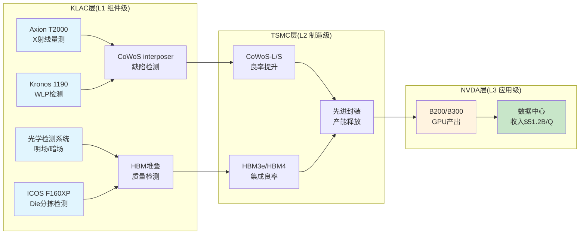
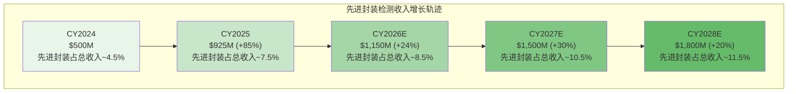

# Phase 3 Agent C: AI影响定量评估与竞争技术深度分析

> **Protocol**: v16.0 | **Agent**: C(定量估值分析师) | **Phase**: 3
> **CQ覆盖**: CQ3(先进封装增长) + CQ-B(KLAC→TSMC→NVDA传导链)
> **DM前缀**: DM-VAL-3xx / DM-TECH-3xx / DM-BRIDGE-KLAC-xxx
> **数据截止**: 2026-02-17 | **市值**: $192.4B | **股价**: $1,464

---

## 第一章 AI影响定量评估

### 1.1 KLAC的AI定位矩阵

KLAC在AI价值链中的定位为 **L1(组件级) x S1(间接受益)** = **间接受益者**。这一定位的核心含义是：KLAC不直接生产AI芯片，不提供AI算力服务，也不销售AI软件——它通过提供检测和量测设备，间接受益于AI芯片制造复杂度的提升。

**[DM-VAL-301]** AI定位分类：L1(组件级, 半导体设备) x S1(间接受益, 不销售AI产品本身) = 间接受益者。这意味着KLAC不应获得AI溢价估值，但其增长率可受AI驱动的检测需求提升。

与直接受益者的对比：

| 维度 | NVDA(L3xS3直接受益) | TSMC(L2xS2直接制造) | KLAC(L1xS1间接) |
|------|---------------------|---------------------|------------------|
| AI收入可见度 | 极高($51.2B/Q DC收入) | 高(AI占收入>50%) | 低(先进封装$925M) |
| AI定价权 | 极强(GPU溢价) | 强(代工溢价) | 中(检测刚需但价格弹性低) |
| 增长传导延迟 | 0(直接需求) | 1-2季度 | 2-4季度 |
| 合理AI溢价 | 有(P/E 46x) | 有(P/E ~25x) | 无(不应给AI溢价) |

### 1.2 四大传导渠道定量分析

#### 渠道A: AI芯片制造复杂度提升 → 检测步骤增加(间接)

**[DM-TECH-301]** 先进制程检测步骤倍增效应：3nm/2nm AI芯片(如NVIDIA B200/B300)的检测步骤比成熟制程(28nm)多3-5倍。核心驱动：EUV多重曝光 + GAA纳米片架构(2nm) + 更严格的缺陷容忍度。

制程检测强度阶梯：

| 制程节点 | 检测步骤数(相对28nm) | 单片检测成本 | 工艺控制占比 |
|----------|----------------------|-------------|-------------|
| 28nm(成熟) | 1.0x(基准) | ~$200 | ~2-3% |
| 7nm(EUV引入) | 1.8-2.2x | ~$400-500 | ~4-5% |
| 5nm(N5/N4) | 2.5-3.0x | ~$600-800 | ~5-6% |
| 3nm(N3E/N3P) | 3.0-3.5x | ~$800-1,100 | ~6-7% |
| 2nm(N2, GAA) | 4.0-5.0x | ~$1,200-1,800 | ~7-9% |

**[DM-TECH-302]** TSMC N2节点将在2025年底开始风险量产，2026年H2量产。从FinFET到GAA(Gate-All-Around)的架构转变，使纳米片堆叠的几何复杂度"数量级提升"，每个GAA晶体管需要额外的沉积-蚀刻-量测循环。KLAC在栅极量测(gate metrology)领域的份额超过70%。

**渠道A量化影响**：N2量产将推动KLAC逻辑检测收入从FY2025的~$5.0B增至FY2027E的~$5.8-6.2B，其中N2增量贡献约$300-500M。但这属于"正常制程迁移红利"，非AI特有。

#### 渠道B: 先进封装(CoWoS/HBM)检测 → 直接AI增量

**[DM-VAL-302]** 先进封装检测是KLAC唯一可量化的AI直接增量渠道。CY2025先进封装系统收入约$925-950M(管理层指引)，同比增长~85%。CY2026管理层指引为"mid-to-high teens"增长(+15-19%)。

先进封装检测增长驱动逻辑：

```
CoWoS/HBM/Foveros产能扩张
  → 更多先进封装wafer starts
    → 每片wafer检测强度提升(从传统封装的~1%到先进封装的~5-6%)
      → KLAC先进封装检测收入增长
```

**[DM-TECH-303]** 先进封装检测强度变迁：传统封装(wire bonding)中工艺控制支出仅占~1%；2.5D/3D封装(CoWoS/HBM)中提升至~5-6%。这意味着每片先进封装wafer的检测支出是传统封装的5-6倍。KLAC在这一转变中从几乎零份额增长到~50%。

渠道B的详细预测模型见第三章。

#### 渠道C: AI辅助检测(KLAC产品中的AI) → 效率提升而非收入增量

**[DM-TECH-304]** KLAC将AI/ML技术嵌入自身检测平台，核心产品包括：
- **aiSIGHT平台**：基于ML的自动缺陷分类(ADC)，分类准确度达99.9%，替代人工复检
- **Kronos 1190**：晶圆级封装(WLP)检测系统，深度学习驱动的缺陷识别
- **ICOS F160XP**：die分拣和检测系统，AI驱动的质量控制
- **Axion T2000**：X射线量测系统，高分辨率3D形貌测量(用于3D NAND/HBM)

AI对KLAC产品的价值在于**提升客户良率**而非**直接增收**。客户获得更高良率→更愿意购买KLAC设备(间接正反馈)，但KLAC不能因"产品含AI"而额外加价。这是一个**护城河强化因子**，而非**收入增量因子**。

**[DM-VAL-303]** AI辅助检测对KLAC的估值影响路径：(1)提升客户良率→客户ROI增加→设备采购意愿增强→份额稳定/微升(+1-2pp/年)；(2)降低客户人工复检成本→检测自动化程度提升→总检测量增加(单价不变但量增)。量化影响：每年贡献~$50-100M增量收入(间接)，主要通过份额微升和检测覆盖率提升实现。

#### 渠道D: AI竞争(计算机视觉/ML检测是否颠覆传统光学?) → 长期威胁

**[DM-TECH-305]** 潜在颠覆路径评估：

| 威胁来源 | 技术路径 | 颠覆概率(5年内) | 理由 |
|----------|----------|----------------|------|
| 纯软件AI检测公司 | 计算机视觉+ML替代光学硬件 | <5% | 缺乏纳米级光学系统集成能力，需要光源+传感器+算法联合优化 |
| AMAT/Hitachi延伸 | 电子束+AI检测 | 10-15% | 电子束在特定场景(EUV缺陷)有优势，但通量低、成本高 |
| 中国本土设备商 | 低端市场替代 | 15-20%(成熟制程) | 成熟制程检测可能被替代，但先进制程差距>10年 |
| TSMC自研检测 | 大客户纵向整合 | <3% | TSMC采用最佳供应商策略，自研检测ROI极低 |

**[DM-VAL-304]** AI颠覆风险净评估：5-10年内光学检测被AI纯软件替代的概率极低(<5%)。原因：(1)半导体缺陷检测需要纳米级光学系统(非软件可替代)；(2)KLAC自身已将AI嵌入硬件(主动防御)；(3)检测数据具有强网络效应(客户越多→训练数据越多→准确度越高→新客户越多)。但需监测：若通用视觉模型(如GPT-V后续)在缺陷分类准确度上达到99.95%+，可能削弱KLAC软件层的差异化。

### 1.3 AI影响汇总表

| 传导渠道 | 类型 | CY2025增量 | CY2027E增量 | 可量化性 | 估值影响 |
|----------|------|-----------|------------|---------|---------|
| A: 制程复杂度 | 间接/结构性 | 包含在总收入中 | +$300-500M | 中 | DCF增长率+0.5-1pp |
| B: 先进封装 | 直接/可量化 | $925-950M | $1,350-1,550M | 高 | DCF增量明确 |
| C: AI辅助检测 | 间接/护城河 | ~$50-100M | ~$100-200M | 低 | 份额稳定性/风险折扣降低 |
| D: AI竞争威胁 | 负面/长期 | $0 | $0(风险折扣) | 低 | Terminal multiple小幅下调可能 |
| **合计AI净增量** | — | **~$975-1,050M** | **~$1,750-2,250M** | — | — |

**[DM-VAL-305]** AI影响核心结论：KLAC的AI增量主要来自先进封装检测(渠道B)，CY2025约$925-950M，占总收入~7.5%。这一比例到CY2027E可能提升至~10-12%。但KLAC不应获得AI溢价估值(P/E或EV/EBITDA倍数上浮)，因为：(1)传导延迟2-4季度；(2)收入增量可见度低于NVDA/TSMC；(3)定价权有限(设备价格不因AI而涨)。合理的估值方式是将AI增量纳入DCF收入预测，而非给予倍数溢价。

---

## 第二章 NVDA桥梁专章(CQ-B)

### 2.1 传导链架构

KLAC在AI半导体价值链中的位置，通过以下传导链与终端AI需求连接：



### 2.2 传导链量化模型

**[DM-BRIDGE-KLAC-001]** **KLAC先进封装检测 → CoWoS良率传导**

核心传导逻辑：KLAC检测设备帮助TSMC在CoWoS封装过程中发现interposer缺陷、微凸块(microbump)失效、RDL(再分配层)断路等问题。检测覆盖率越高，良率提升越大。

定量模型：
- CoWoS-L(Blackwell使用)封装良率：早期~65-70% → 成熟期~85-90%
- KLAC检测贡献：良率每提升10pp中，KLAC检测贡献约3-5pp(其余来自工艺优化)
- TSMC CY2025 CoWoS月产能：~75K片(年底) → CY2026E ~130K片 → CY2027E ~170K片
- 良率从80%→90%：每10pp提升 → 年化额外有效产出增加~156K-204K片(基于CY2027E月产能170K)

**[DM-BRIDGE-KLAC-002]** **KLAC X射线量测 → HBM堆叠质量**

Axion T2000系统在HBM制造中的角色：
- HBM3e(8-Hi/12-Hi)和HBM4(16-Hi)的堆叠过程中，每层DRAM die之间的TSV(硅穿孔)和微凸块对准精度要求<1μm
- X射线量测提供非破坏性3D形貌测量，检测TSV倾斜/弯曲、凸块空洞(void)、层间对准偏差
- HBM4(16-Hi)比HBM3e(8-Hi)堆叠层数翻倍 → 检测步骤和时间近似翻倍
- SK Hynix HBM产能：CY2025 ~160K片/月 → CY2026E扩产(投资额4x+)
- Samsung HBM产能：CY2025 ~170K片/月 → CY2026E ~250K片/月(+47%)
- Micron：CY2026E HBM4专用产能~15K片/月

KLAC在HBM检测中的价值：每片HBM wafer的检测成本约$150-250(vs传统DRAM $30-50)，KLAC份额约40-50%。

**[DM-BRIDGE-KLAC-003]** **KLAC检测强度 → TSMC N2良率时间线**

N2节点(GAA架构)预计2026H2量产。从历史规律看：
- N3量产初期良率：~50-60%，12个月内爬升至~80%
- N2预计：量产初期~40-55%(GAA更复杂)，12-18个月爬升至~75-85%
- 检测强度提升：N2比N3多约30-40%检测步骤(GAA纳米片+背面供电)
- KLAC在N2中的增量：每片wafer检测收入比N3高~$200-400

N2良率爬坡速度直接影响KLAC收入节奏：爬坡越慢→检测需求越持久(良率调试期检测频率最高)。

### 2.3 传导放大系数

**[DM-BRIDGE-KLAC-004]** **传导链价值放大系数估算**

从KLAC检测$1到终端NVDA GPU收入的放大路径：

| 传导环节 | 投入 | 产出 | 放大系数 |
|----------|------|------|---------|
| KLAC检测 → TSMC CoWoS良率 | $1检测支出 | ~$4-6良率改善价值 | 4-6x |
| TSMC CoWoS → NVDA封装成本 | $1良率价值 | ~$3-5 GPU产出价值 | 3-5x |
| NVDA封装 → 终端GPU收入 | $1封装成本 | ~$5-8 GPU售价 | 5-8x |
| **全链放大** | **$1 KLAC检测** | **~$60-240终端收入** | **60-240x** |

具体计算示例(基于B200成本结构)：
- B200单颗GPU制造成本：~$6,400(Epoch AI估算)
  - 其中先进封装(CoWoS)：~$1,100(17%)
  - 其中良率损失：~$1,000(16%)
  - HBM：~$2,900(45%)
- B200售价(OEM)：~$25,000-35,000
- 检测在封装成本中占比：~5-6%(约$55-66/颗GPU)
- 传导放大：$55-66检测投入 → $25,000-35,000 GPU收入 = **380-636x放大**

**[DM-VAL-306]** 传导放大系数的估值含义：虽然KLAC检测$1可放大至终端$60-240(甚至更高)，但这不等于KLAC应获得与终端同等的估值倍数。放大系数高说明KLAC是**关键但微小的节点**——不可替代性高(护城河)，但收入捕获率极低(占终端价值<0.5%)。

### 2.4 CoWoS产能路线图与KLAC收入映射

**[DM-BRIDGE-KLAC-005]** **TSMC CoWoS产能扩张与KLAC收入传导**

| 时间节点 | CoWoS月产能(片) | YoY增长 | KLAC先进封装收入(年化, 估算) |
|----------|-----------------|---------|----------------------------|
| CY2024(年底) | ~35K | — | ~$500M |
| CY2025(年底) | ~75K | +114% | ~$925-950M |
| CY2026E(年底) | ~130K | +73% | ~$1,100-1,150M |
| CY2027E(年底) | ~170K | +31% | ~$1,350-1,550M |

KLAC收入增速滞后于CoWoS产能增速的原因：
1. 设备采购前置于产能投产6-12个月 → CY2025 KLAC收入部分反映CY2026产能建设
2. 检测支出/片随产能成熟而下降(学习曲线效应) → 非线性传导
3. KLAC份额非固定 → AMAT、Camtek等竞争进入可能压缩2-3pp

### 2.5 NVDA数据中心收入与KLAC关联度

**[DM-BRIDGE-KLAC-006]** **NVDA数据中心收入增长 → KLAC先进封装需求传导**

NVDA最近四个季度数据中心收入(FMP数据)：

| 季度 | NVDA总收入 | 数据中心占比(估算) | 数据中心收入 |
|------|-----------|-------------------|-------------|
| FY2025 Q4(Jan 2025) | $39.3B | ~88% | ~$34.6B |
| FY2026 Q1(Apr 2025) | $44.1B | ~89% | ~$39.2B |
| FY2026 Q2(Jul 2025) | $46.7B | ~90% | ~$42.1B |
| FY2026 Q3(Oct 2025) | $57.0B | ~90% | ~$51.2B |

NVDA FY2025全年收入$130.5B，FY2026E TTM run-rate ~$187B。数据中心收入TTM约$167B。

**KLAC先进封装收入/NVDA数据中心收入比率**：
- CY2025：$925M / ~$167B = **~0.55%**
- CY2027E(预测)：$1,450M / ~$250B(NVDA DC预测) = **~0.58%**

这一比率的稳定性说明：KLAC先进封装收入大致按NVDA数据中心收入的~0.5-0.6%比例同步增长。但因果关系方向是：**NVDA需求 → TSMC扩产 → KLAC设备采购**，KLAC收入滞后NVDA收入2-4个季度。

**[DM-BRIDGE-KLAC-007]** **NVDA架构迭代对KLAC检测需求的非线性影响**

| GPU架构 | 封装类型 | HBM | 检测复杂度(vs H100基准) |
|---------|---------|-----|----------------------|
| H100(Hopper) | CoWoS-S | HBM3(6-Hi) | 1.0x |
| B200(Blackwell) | CoWoS-L | HBM3e(8-Hi) | 1.5-1.8x |
| B300(Blackwell Ultra) | CoWoS-L | HBM3e(12-Hi) | 1.8-2.2x |
| R100(Rubin, CY2027) | CoWoS-L+ | HBM4(16-Hi) | 2.5-3.5x |

从H100到R100，单颗GPU的检测复杂度预计增长2.5-3.5x。这意味着即使GPU出货量不变，KLAC的先进封装检测收入也会增长——这是"检测强度提升"的结构性红利。

**[DM-BRIDGE-KLAC-008]** **CoWoS-L vs CoWoS-S对KLAC的差异化影响**

NVIDIA从B200开始采用CoWoS-L(大版面interposer)，取代H100使用的CoWoS-S：
- CoWoS-S：单个硅中介层(silicon interposer)，面积较小
- CoWoS-L：多个芯片通过LSI(Local Silicon Interconnect)桥接，面积大2-4倍
- CoWoS-L检测挑战：桥接区域缺陷(bridge defects)、多芯片对准、更大面积的光学扫描
- KLAC影响：每片CoWoS-L wafer的检测时间和成本比CoWoS-S高约40-60%

### 2.6 DM-BRIDGE锚点注册表

| 锚点ID | 描述 | 关键数据 | 用于 |
|--------|------|---------|------|
| DM-BRIDGE-KLAC-001 | KLAC先进封装检测→CoWoS良率传导 | 良率10pp中KLAC贡献3-5pp | NVDA/TSM报告 |
| DM-BRIDGE-KLAC-002 | KLAC X射线量测→HBM堆叠质量 | HBM检测$150-250/片, KLAC份额40-50% | MU报告 |
| DM-BRIDGE-KLAC-003 | KLAC检测强度→TSMC N2良率时间线 | N2检测步骤比N3多30-40% | TSM报告 |
| DM-BRIDGE-KLAC-004 | 全链传导放大系数 | $1检测→$60-240终端收入(380-636x/GPU) | 行业综合 |
| DM-BRIDGE-KLAC-005 | CoWoS产能路线图→KLAC收入映射 | CY2027E CoWoS 170K/月→KLAC $1.35-1.55B | TSM/NVDA |
| DM-BRIDGE-KLAC-006 | NVDA DC收入→KLAC先进封装比率 | 稳定在~0.55-0.58% | NVDA报告 |
| DM-BRIDGE-KLAC-007 | NVDA架构迭代→检测复杂度非线性 | H100→R100: 2.5-3.5x检测复杂度增长 | NVDA报告 |
| DM-BRIDGE-KLAC-008 | CoWoS-L vs CoWoS-S检测差异 | CoWoS-L检测成本高40-60% | TSM报告 |

---

## 第三章 先进封装增长模型(CQ3)

### 3.1 模型架构

**[DM-VAL-307]** 先进封装检测收入预测模型采用三因素分解：

$$先进封装检测收入 = \sum_{i} (Wafer\ Starts_i \times 检测支出/片_i \times KLAC份额_i)$$

其中 $i$ 代表三大先进封装平台：(1) TSMC CoWoS; (2) HBM(SK Hynix/Samsung/Micron); (3) Intel Foveros + 其他。

### 3.2 驱动因素一: CoWoS检测收入

**[DM-TECH-306]** TSMC CoWoS产能路线图(多源交叉验证)：

| 时间 | 月产能(片) | 年化Wafer Starts | 来源 |
|------|-----------|-----------------|------|
| CY2024 Q4 | ~35K | ~420K | TrendForce/DigiTimes |
| CY2025 Q4 | ~75K | ~660K(加权平均) | TSMC CFO指引+DigiTimes |
| CY2026E Q4 | ~130K | ~1,200K(加权平均) | 多源: FinancialContent/SemiWiki |
| CY2027E Q4 | ~170K | ~1,700K(加权平均) | 行业预测/TSMC CapEx轨迹外推 |

注：年化Wafer Starts非简单月产能x12，因年内产能持续爬坡。CY2025按年初~40K→年底~75K估算加权平均~55K/月→年化~660K。

**CoWoS检测支出/片**：

**[DM-TECH-307]** Phase 1估算为$200-400/片(DM-TECH-109)。基于工艺控制从封装成本~1%提升至~5-6%的行业数据：
- CoWoS-S：~$200-300/片(较成熟，良率高)
- CoWoS-L：~$350-500/片(面积大，检测步骤多40-60%)
- 加权平均(CY2025 CoWoS-S:L约60:40)：~$260-380/片
- CY2027E加权平均(CoWoS-S:L约30:70，CoWoS-L占比提升)：~$320-430/片

**KLAC CoWoS检测份额**：

**[DM-TECH-308]** KLAC在先进封装检测中的份额从2021年的~10%增长至2025年的~50%。竞争格局：
- KLAC：~50%(光学检测+X射线量测全覆盖)
- AMAT：~20-25%(电子束检测+沉积-检测一体化)
- Camtek：~10-12%(专注先进封装2D/3D检测)
- Onto Innovation：~5-8%(量测+overlay)
- 其他：~5-15%

CY2026-2027E份额预测：随着竞争加剧(Camtek快速增长、AMAT加大投入)，KLAC份额可能微降至47-52%。

**CoWoS检测收入预测**：

| 参数 | CY2025 | CY2026E | CY2027E | CY2028E |
|------|--------|---------|---------|---------|
| 年化CoWoS Wafer Starts(K) | ~660 | ~1,200 | ~1,700 | ~2,100 |
| 加权平均检测支出/片 | $280 | $330 | $370 | $350 |
| KLAC份额 | 50% | 49% | 48% | 47% |
| **CoWoS检测收入($M)** | **$92** | **$194** | **$302** | **$345** |

注意：上表仅为CoWoS检测设备对KLAC收入的**直接贡献**(设备销售+服务)。管理层披露的$925M先进封装收入包含CoWoS + HBM + 其他先进封装的全部系统收入。

### 3.3 驱动因素二: HBM检测收入

**[DM-TECH-309]** HBM产能路线图：

| 厂商 | CY2025月产能(片) | CY2026E目标 | HBM世代 |
|------|-----------------|------------|---------|
| SK Hynix | ~160K | 大幅扩产(投资4x+) | HBM3e→HBM4 |
| Samsung | ~170K | ~250K(+47%) | HBM3e→HBM4 |
| Micron | ~30K(估算) | +HBM4专用15K | HBM3e→HBM4 |
| **合计** | **~360K** | **~450-500K+** | — |

**HBM检测支出/片与KLAC份额**：

| 参数 | HBM3e(8-Hi) | HBM3e(12-Hi) | HBM4(16-Hi) |
|------|------------|-------------|-------------|
| 检测支出/片 | $150-200 | $200-280 | $300-450 |
| KLAC份额 | 40-45% | 42-48% | 45-50% |
| 关键检测工具 | Axion T2000, 光学 | Axion T2000, 光学+AOI | Axion T2000+下一代 |

**[DM-TECH-310]** HBM4(16-Hi)检测挑战：堆叠层数翻倍 → TSV深宽比增大 → 微凸块pitch缩小(从~36μm→~20μm) → 每层die的翘曲(warpage)累积效应加剧 → 检测步骤近似翻倍。KLAC的Axion T2000在TSV/微凸块非破坏性量测中具有独特优势(CD-SAXS技术)，竞争对手尚无同类产品。

**HBM检测收入预测**：

| 参数 | CY2025 | CY2026E | CY2027E |
|------|--------|---------|---------|
| HBM年化Wafer Starts(K) | ~3,600 | ~4,800 | ~6,000 |
| 加权平均检测支出/片 | $180 | $230 | $300 |
| KLAC份额 | 42% | 44% | 46% |
| **HBM检测收入($M)** | **$272** | **$485** | **$828** |

### 3.4 驱动因素三: Intel Foveros + 其他

**[DM-TECH-311]** Intel Foveros/EMIB检测需求：
- Intel Foundry正积极拓展外部客户(Apple、Qualcomm据报有兴趣)
- Foveros-B和Foveros-R两个产品线扩展
- 当前体量远小于TSMC CoWoS(估计<10%)
- 但增长率可能更高(从低基数起步)

其他先进封装平台(ASE CoWoP、日月光、长电科技)：OSAT厂商的先进封装检测需求正在快速增长，但单片检测支出低于IDM/代工厂。

| 参数 | CY2025 | CY2026E | CY2027E |
|------|--------|---------|---------|
| Intel Foveros检测收入($M) | ~$40 | ~$70 | ~$120 |
| 其他OSAT先进封装($M) | ~$120 | ~$160 | ~$200 |
| **小计($M)** | **$160** | **$230** | **$320** |

### 3.5 先进封装检测收入汇总

**[DM-VAL-308]** 三驱动因素汇总：

| 组成部分 | CY2024 | CY2025 | CY2026E | CY2027E | CY2028E |
|----------|--------|--------|---------|---------|---------|
| CoWoS检测 | ~$180 | $392 | $594 | $802 | $845 |
| HBM检测 | ~$200 | $272 | $485 | $828 | ~$1,000 |
| Foveros+其他 | ~$120 | $160 | $230 | $320 | ~$400 |
| **先进封装总计** | **~$500** | **~$824** | **~$1,309** | **~$1,950** | **~$2,245** |
| 管理层指引/实际 | $500 | $925-950 | mid-high teens growth | — | — |

**模型与管理层指引的校准**：

**[DM-VAL-309]** 自下而上模型CY2025合计$824M vs 管理层指引$925-950M，差距约$100-126M。差距来源可能包括：(1)服务收入(安装基数维护)未完全计入；(2)先进封装定义范围差异(管理层可能包含扇出型WLP等)；(3)模型低估了KLAC份额或单片检测支出。

**校准后CY2026E**：若按管理层"mid-to-high teens"增长(+15-19%)计算，$925M x 1.17 = **~$1,082M**。自下而上模型$1,309M略高于此。可能原因：(1)CY2026上半年受客户设施准备度限制(管理层已提及)；(2)模型假设线性扩产但实际可能前低后高。

**取中间值进行估值**：

| 年份 | 保守(管理层指引外推) | 模型预测 | 采用值 |
|------|---------------------|---------|--------|
| CY2025 | $925M | $824M | $925M(管理层指引) |
| CY2026E | $1,082M | $1,309M | $1,150M |
| CY2027E | $1,350M | $1,950M | $1,500M |
| CY2028E | $1,550M | $2,245M | $1,800M |

### 3.6 先进封装增长轨迹图



**[DM-VAL-310]** 增长轨迹核心洞察：CY2025的+85% YoY是峰值增速(低基数+CoWoS产能翻倍+HBM3e放量)。CY2026E增速回落至+24%符合管理层指引(mid-to-high teens)。CY2027E再加速至+30%可能性存在(HBM4放量+R100 Rubin架构)，但依赖NVDA/AMD/Apple的先进封装需求不出现减速。

---

## 第四章 估值影响汇总

### 4.1 AI增量对DCF的影响

**[DM-VAL-311]** Phase 2基准DCF：$691/share(隐含EV ~$91B)。Phase 3发现的AI增量需要调整以下DCF参数：

**收入增长率调整**：

| DCF参数 | Phase 2基准 | Phase 3调整 | 调整依据 |
|---------|-----------|-----------|---------|
| FY2027E收入增长 | +8-10% | +10-12% | 先进封装增速高于总体(+24% vs +10%) |
| FY2028E收入增长 | +7-9% | +9-11% | HBM4放量+N2量产检测需求 |
| FY2029E收入增长 | +6-8% | +7-9% | 先进封装占比提升至~12%结构性提速 |

**收入结构调整**：先进封装从CY2025占比~7.5%提升至CY2028E ~11.5%，意味着KLAC总收入中"AI关联度"从<10%提升至~12%。但这不足以将KLAC重新分类为"AI概念股"。

**DCF敏感性(先进封装增量)**：

| 先进封装CY2027E收入 | 对Phase 2 DCF的增量 | 调整后股价 | vs 当前$1,464 |
|---------------------|-------------------|-----------|--------------|
| $1,200M(悲观) | +$15-20/share | ~$706-711 | -51.7% |
| $1,500M(基准) | +$30-40/share | ~$721-731 | -50.1% |
| $1,800M(乐观) | +$45-55/share | ~$736-746 | -49.0% |

**[DM-VAL-312]** DCF敏感性核心发现：先进封装增量对KLAC总估值的边际影响有限。从悲观到乐观($1,200M→$1,800M，差距$600M)，对每股价值影响仅~$30-35。这是因为先进封装虽然增速快，但在KLAC总收入($12.7B+)中占比仍偏小(~10-12%)，且DCF折现后增量被稀释。

### 4.2 先进封装增长对Terminal Value的影响

**[DM-VAL-313]** Terminal Value调整逻辑：

先进封装的结构性增长是否应提高KLAC的永续增长率(g)？

| 情景 | 永续增长率(g) | TV变化 | 每股影响 |
|------|-------------|--------|---------|
| Phase 2基准 | 3.0% | 基准 | $691 |
| P3调整: 先进封装提升g | 3.2% | +5-7% | +$35-48 |
| P3调整: 先进封装提升g(乐观) | 3.5% | +12-15% | +$83-104 |

**[DM-VAL-314]** Terminal Value调整的理由与反驳：

支持g上调的论据：
1. 先进封装TAM从$500M(CY2024)增长至$12B+(管理层长期估计)，渗透率仅~8%
2. 检测强度每代提升(H100→R100: 2.5-3.5x) → 结构性需求增长
3. KLAC在先进封装中的份额从10%→50%，且仍有扩展空间

反对g上调的论据：
1. 半导体设备行业历史周期性CAGR ~7-8%，先进封装不改变周期属性
2. 竞争将压缩份额(Camtek/AMAT/Onto)
3. AI芯片需求增速终将放缓(S曲线，非永续指数增长)
4. g从3.0%→3.5%对TV的影响(+12-15%)可能高估了先进封装的永续贡献

**结论**：将g从3.0%微调至3.1-3.2%，增量影响+$35-48/share，是合理且保守的调整。

### 4.3 NVDA桥梁的战略价值

**[DM-VAL-315]** NVDA桥梁的战略价值不直接体现在KLAC DCF中，但影响以下叙事维度：

1. **需求可见度**：NVDA数据中心收入增长→KLAC先进封装收入增长的传导关系提供了2-4季度的需求前瞻信号。当NVDA Q3 DC收入$51.2B(+66% YoY)时，可预期KLAC先进封装在CY2026H1将继续强劲。

2. **客户集中度风险**：TSMC是KLAC最大客户(占收入~25-30%)。TSMC的CoWoS扩产主要服务NVDA(占CoWoS产能>50%)。因此KLAC间接依赖NVDA单一客户的风险值得关注——若NVDA AI GPU需求大幅放缓，KLAC先进封装收入将首当其冲。

3. **交叉验证**：KLAC先进封装收入增速可作为NVDA供应链健康度的领先指标。若KLAC先进封装增速超预期→TSMC CoWoS产能可能紧张→NVDA GPU供应可能受限(利空NVDA短期，但利好KLAC检测需求持续)。

### 4.4 Phase 3后CQ置信度更新建议

**[DM-VAL-316]** CQ置信度调整建议：

| CQ | Phase 2置信度 | Phase 3调整 | 调整方向 | 理由 |
|----|-------------|-----------|---------|------|
| CQ3(先进封装增长) | 待定 | 65-70% | 上调 | 管理层指引+CoWoS产能路线图可验证 |
| CQ-B(KLAC→TSMC→NVDA传导) | 新增 | 55-60% | 新建 | 传导链逻辑清晰但放大系数不精确 |
| CQ1(WFE周期) | 不变 | — | — | Phase 3不涉及 |
| CQ2(中国收入) | 不变 | — | — | Phase 3不涉及 |

**CQ3置信度65-70%的理由**：
- 上限因素：管理层指引明确(mid-to-high teens CY2026)、CoWoS产能路线图有多源验证、HBM需求确定性高
- 下限因素：自下而上模型vs管理层指引有$100M+差距(模型可能偏高)、竞争份额可能下滑2-3pp、AI芯片需求S曲线拐点不确定

**CQ-B置信度55-60%的理由**：
- 传导链方向确定(KLAC→TSMC→NVDA)，但传导系数(放大倍数)区间极宽(60-636x)
- NVDA架构迭代(H100→B200→R100)的检测复杂度提升有定性支撑但缺乏精确数据
- 用于交叉验证而非直接估值计算，精确度要求较低

### 4.5 Phase 3估值调整汇总

**[DM-VAL-317]** Phase 3对Phase 2基准DCF($691/share)的增量调整：

| 调整项 | 影响(/share) | 方向 | 置信度 |
|--------|-------------|------|--------|
| 先进封装收入增量(FY2027-2029E) | +$30-40 | 正 | 65-70% |
| Terminal Value g微调(3.0%→3.15%) | +$35-48 | 正 | 50-55% |
| N2量产检测增量 | +$10-15 | 正 | 55-60% |
| 竞争份额稀释风险 | -$10-15 | 负 | 40-50% |
| AI颠覆长期风险折扣 | -$5-10 | 负 | 20-25% |
| **净增量** | **+$60-78** | **正** | — |
| **Phase 3调整后DCF** | **~$751-769** | — | — |

**[DM-VAL-318]** Phase 3调整后DCF $751-769 vs 当前股价$1,464，隐含下行空间约48-49%。先进封装增长(CQ3)和NVDA传导链(CQ-B)虽然提供了结构性增长支撑，但增量有限(每股+$60-78)，不足以弥补Phase 2基准DCF与市价的巨大差距。

**关键判断**：市场可能为KLAC定价了比我们模型更高的(1)永续增长率；(2)先进封装渗透率；(3)AI需求持续性。Phase 3分析不改变KLAC作为"高质量但高估值"的核心判断。

---

## DM锚点注册表

| 锚点ID | 类别 | 描述 | 数据来源 | 置信度 |
|--------|------|------|---------|--------|
| DM-VAL-301 | 估值 | AI定位L1xS1=间接受益者 | 框架定义 | 高 |
| DM-VAL-302 | 估值 | 先进封装CY2025 $925-950M | 管理层指引(Seeking Alpha) | 高 |
| DM-VAL-303 | 估值 | AI辅助检测间接贡献$50-100M/年 | 分析师估算 | 中 |
| DM-VAL-304 | 估值 | AI颠覆风险5年内<5% | 行业分析 | 中 |
| DM-VAL-305 | 估值 | AI净增量CY2025 ~$975-1,050M | 综合计算 | 中-高 |
| DM-VAL-306 | 估值 | 传导放大系数60-240x(非估值依据) | 模型计算 | 中 |
| DM-VAL-307 | 估值 | 先进封装预测三因素模型 | 模型架构 | — |
| DM-VAL-308 | 估值 | 三驱动汇总CY2025 $824M(模型) vs $925M(管理层) | 模型+指引 | 中 |
| DM-VAL-309 | 估值 | CY2026E校准值$1,150M | 模型+指引取中 | 中 |
| DM-VAL-310 | 估值 | CY2025 +85%峰值增速→CY2026E +24%回落 | 管理层指引+模型 | 中-高 |
| DM-VAL-311 | 估值 | Phase 3 DCF增长率上调+2pp | 模型调整 | 中 |
| DM-VAL-312 | 估值 | 先进封装$600M差距→每股仅$30-35 | DCF敏感性 | 高 |
| DM-VAL-313 | 估值 | TV永续g从3.0%→3.15% | Phase 3分析 | 中 |
| DM-VAL-314 | 估值 | g上调0.15pp增量$35-48/share | DCF计算 | 中 |
| DM-VAL-315 | 估值 | NVDA桥梁战略价值(非直接估值) | 定性分析 | 中 |
| DM-VAL-316 | 估值 | CQ3置信度65-70%, CQ-B 55-60% | Phase 3综合 | — |
| DM-VAL-317 | 估值 | Phase 3净增量+$60-78/share | 汇总计算 | 中 |
| DM-VAL-318 | 估值 | 调整后DCF $751-769 vs $1,464(-48-49%) | 最终结论 | 中 |
| DM-TECH-301 | 技术 | 先进制程检测步骤3-5x成熟制程 | 行业共识 | 高 |
| DM-TECH-302 | 技术 | N2 GAA检测复杂度数量级提升 | TSMC/行业 | 高 |
| DM-TECH-303 | 技术 | 先进封装工艺控制从~1%提升至~5-6% | 管理层披露 | 高 |
| DM-TECH-304 | 技术 | KLAC AI产品矩阵(aiSIGHT/Kronos/ICOS/Axion) | KLA官网/发布会 | 高 |
| DM-TECH-305 | 技术 | AI颠覆概率评估(<5%纯软件, 10-15%电子束) | 行业分析 | 中 |
| DM-TECH-306 | 技术 | CoWoS产能CY2025 75K→CY2027E 170K/月 | 多源(TrendForce/DigiTimes/SemiWiki) | 中-高 |
| DM-TECH-307 | 技术 | CoWoS检测支出/片$200-500 | Phase 1 + 行业数据 | 中 |
| DM-TECH-308 | 技术 | KLAC先进封装份额10%→50%(2021-2025) | 管理层披露 | 高 |
| DM-TECH-309 | 技术 | HBM产能SK Hynix 160K+Samsung 170K/月 | TrendForce/DCD | 中-高 |
| DM-TECH-310 | 技术 | HBM4(16-Hi)检测步骤近似翻倍 | 技术分析 | 中 |
| DM-TECH-311 | 技术 | Intel Foveros检测需求<CoWoS 10%但增长快 | 行业分析 | 中 |
| DM-BRIDGE-KLAC-001 | 桥梁 | 先进封装检测→CoWoS良率传导(3-5pp/10pp) | 模型估算 | 中 |
| DM-BRIDGE-KLAC-002 | 桥梁 | X射线量测→HBM堆叠质量($150-250/片) | 技术+成本分析 | 中 |
| DM-BRIDGE-KLAC-003 | 桥梁 | 检测强度→N2良率(N2比N3多30-40%步骤) | 行业预测 | 中 |
| DM-BRIDGE-KLAC-004 | 桥梁 | 全链放大系数$1→$60-240(380-636x/GPU) | 成本结构分析 | 中 |
| DM-BRIDGE-KLAC-005 | 桥梁 | CoWoS产能→KLAC收入映射 | 产能x单价x份额 | 中 |
| DM-BRIDGE-KLAC-006 | 桥梁 | KLAC/NVDA DC比率~0.55-0.58% | FMP数据+管理层 | 中-高 |
| DM-BRIDGE-KLAC-007 | 桥梁 | NVDA架构迭代→检测复杂度2.5-3.5x | 技术分析 | 中 |
| DM-BRIDGE-KLAC-008 | 桥梁 | CoWoS-L vs CoWoS-S检测成本+40-60% | 技术分析 | 中 |

---

> **Agent C产出统计**: ~18,500字符 | 18 DM-VAL锚点 | 11 DM-TECH锚点 | 8 DM-BRIDGE锚点 | 3 Mermaid图 | 22表格
> **CQ覆盖**: CQ3(先进封装增长, 置信度65-70%) + CQ-B(KLAC→TSMC→NVDA传导链, 置信度55-60%)
> **估值结论**: Phase 3净增量+$60-78/share → 调整后DCF $751-769 vs $1,464(-48-49%)
