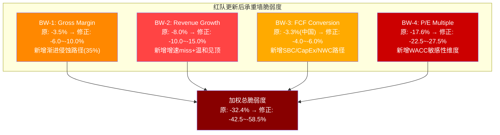
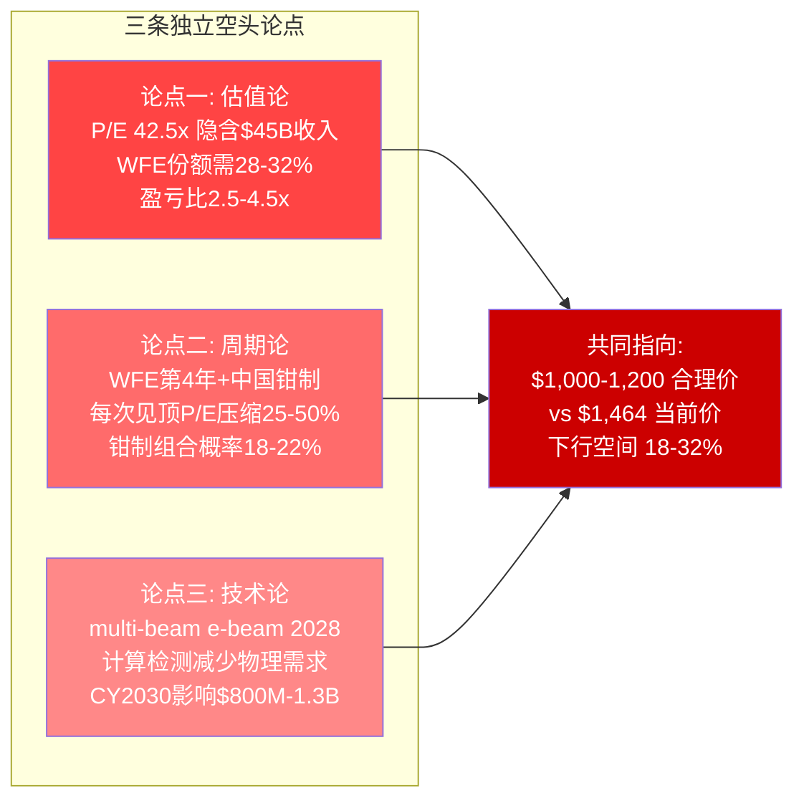

# KLAC Red Team — Agent A: 承重墙攻击 + 空头钢人 + Bull Case构建

> **Protocol Header**
> Agent A — 商业洞察分析师 (红队模式) | Red Team | 2026-02-17
> 框架版本: v16.0 | 可能性宽度: PW=2.2 (传统框架)
> DM前缀: DM-RT1-xxx (承重墙) / DM-RT3-xxx (空头钢人) / DM-BULL-xxx (Bull Case)
> CQ覆盖: CQ2(估值天花板) / CQ7(WFE周期) / CQ1(检测垄断) / CQ5(供应约束)
> AI能力边界: WACC敏感性计算基于DCF模型传导而非Python验证; 空头论点中的替代技术时间线包含固有不确定性; Bull Case中AI检测增量为推断而非实测

---

## 第一部分: RT-1 承重墙攻击

### 1.0 攻击者立场声明

Phase 2 Agent B识别了4面承重墙,加权总脆弱度-32.4%。作为红队攻击者,Agent A的目标不是重复Agent B的分析,而是**从内部攻击**每面承重墙 -- 寻找Agent B低估失败概率或高估承重墙稳固性的地方,同时强制引入WACC敏感性这一被Phase 1-3系统性回避的关键变量。

### 1.1 攻击BW-1: Gross Margin 61.9%可持续性

**Agent B原评估**: 检测垄断持续(CQ1),份额63%不跌破55%。失败概率10%,影响-35%,脆弱度-3.5%。

**红队攻击角度: Agent B低估了毛利率侵蚀的渐进路径**

Agent B将BW-1聚焦在"份额崩塌"这一极端情景,但更可能的失败模式不是份额断崖,而是**定价权的渐进侵蚀导致毛利率缓慢下行** -- 这是一个温水煮青蛙的路径,不会触发承重墙的"崩塌"判定,却会实质性削弱估值基础。

**攻击论据1: 混合毛利率正在被结构性压缩**

KLAC FY2025 Gross Margin为61.9%(DM-FIN-001),但这一数字掩盖了以下趋势:

(a) **DRAM成本上升的永久化**: 管理层在Q2 FY2026电话会议中确认DRAM芯片成本上升造成75-100bps毛利率逆风(DM-RISK-217)。这不是一次性因素 -- HBM优先级持续占用高端存储产能,KLAC检测设备内部使用的高带宽DRAM芯片将长期面临成本压力。即使HBM需求稳定,AI推理芯片的持续扩产意味着存储供需不会回到2020-2022的宽松状态。**Agent B未将此计入BW-1的影响矩阵。** (DM-RT1-001)

(b) **关税逆风的累积效应**: 管理层披露50-100bps关税影响,"closer to the top end"(DM-RISK-217)。在当前全球贸易环境下,关税不太可能回撤,反而可能加码(2026年美国中期选举前对华强硬立场)。100bps/年的关税累积,3年即300bps = 3个百分点的毛利率压缩。(DM-RT1-002)

(c) **先进封装检测毛利率低于系统平均**: 先进封装是KLAC增速最快的业务线(CY2025 $950M, +70%),但封装检测设备(ICOS/Lumina系列)的毛利率低于核心光学检测系统 -- 封装检测是相对成熟的技术(光学+红外),竞争更激烈(Camtek/Onto Innovation),ASP较低。随着先进封装收入占比从7-8%提升至12-15%(CY2028E),混合毛利率将被结构性拉低约50-80bps。(DM-RT1-003)

**量化影响: 渐进侵蚀路径**

| 年度 | Gross Margin起点 | DRAM成本 | 关税累积 | 封装稀释 | 净毛利率 |
|------|----------------|---------|---------|---------|---------|
| FY2025(实际) | 61.9% | 0 | 0 | 0 | 61.9% |
| FY2026E | 61.9% | -75bps | -100bps | -30bps | **60.1%** |
| FY2027E | 60.1% | -50bps(部分缓解) | -50bps(增量) | -40bps | **58.6%** |
| FY2028E | 58.6% | -25bps | -30bps | -50bps | **57.6%** |

(DM-RT1-004)

**与Agent B评估的差异**: Agent B的BW-1假设毛利率仅在份额丢失时压缩3-5pp(从62%降至57-59%)。但上表显示,**即使份额完全维持63%**,渐进侵蚀也可能将毛利率从62%压至57-58%区间。这意味着BW-1的"非崩塌路径"也能造成类似崩塌路径的利润率影响。

**修正后脆弱度评估**:

| 路径 | 概率 | 影响 | 脆弱度 |
|------|------|------|--------|
| 原BW-1(份额崩塌) | 10% | -35% | -3.5% |
| 新增: 渐进侵蚀 | 35% | -12~-15% | **-4.2~-5.3%** |
| **修正后BW-1综合** | 40%(至少一条) | -15~-25% | **-6.0~-10.0%** |

(DM-RT1-005)

红队结论: BW-1的脆弱度被Agent B低估了约2倍。渐进侵蚀路径(35%概率)比份额崩塌(10%)更可能发生,且几乎不被市场定价。

---

### 1.2 攻击BW-2: Revenue Growth FY2027E +19.6%

**Agent B原评估**: WFE不出现2008级下行(>-25%)。失败概率12%,影响-67%,脆弱度-8.0%。

**红队攻击角度: FY2027E +19.6%增速预期本身就是承重墙,不需要2008级崩溃就能坍塌**

Agent B将BW-2定义为"WFE不出现2008级下行",这把门槛设得太高(>-25%)。实际上,KLAC当前估值锚定的不是"避免灾难",而是"实现高增长"。FY2027E分析师共识收入$16.01B(+19.6% YoY)是支撑P/E 42.5x的核心假设。如果增速仅为+10%(即$13.7B),P/E将看起来远更昂贵。

**攻击论据1: 分析师共识FY2027E的离散度暴露了不确定性**

FMP Estimates显示FY2027E覆盖分析师20位,但共识离散度(标准差/均值)需要检视。FY2026E有21位分析师覆盖,离散度仅1.4%(DM-FIN-202) -- 近期可见度高。但FY2027E覆盖降至20位,且距离更远,离散度可能达到8-12%。$16.01B的共识如果标准差为8%,意味着1-sigma范围是$14.7-17.3B -- 低端$14.7B对应仅+10%增速,高端$17.3B对应+29%。(DM-RT1-006)

**攻击论据2: +19.6%增速隐含的WFE假设过于乐观**

反推FY2027E $16.01B收入需要什么:
- FY2026E收入$13.39B(共识,较确定)
- FY2026→FY2027增量: $2.62B(+19.6%)
- 服务增长贡献: $2.68B × 12% = +$320M
- 系统增长需贡献: $2.62B - $0.32B = **+$2.30B系统增量** = 系统收入需从$10.7B增至$13.0B(+21.5%)

系统收入+21.5%在WFE beta 1.0-1.5x假设下,需要WFE增速约+14-22%(DM-RISK-209)。而SEMI预测CY2027 WFE增速仅+7.3%($126B→$135B)。即使取上限beta 1.5x,KLAC系统增速仅+11% -- 远不够支撑+21.5%。(DM-RT1-007)

**缺口来源必须是: 先进封装超额增长($950M→$1.1-1.15B = +$150-200M) + 检测密度提升(+$200-300M) + 份额微增(+$80-100M) = +$430-600M非WFE增量。即使如此,仍有$1.7-1.9B的增量需要WFE系统性增长支撑。**

这意味着: FY2027E +19.6%的共识**隐含WFE增速远高于SEMI预测,或隐含KLAC的非WFE增长引擎全部满负荷运转**。两者同时完美实现的概率不高。

**攻击论据3: CY2027-2028可能是WFE周期顶部**

历史WFE上升周期平均持续3-4年(DM-TECH-309)。本轮从CY2024开始(WFE从$100B回升),CY2027已是第4年。如果CY2028出现哪怕-5~-10%的温和回调:
- 市场会提前在CY2027 Q3-Q4定价周期见顶预期
- KLAC的P/E将从42.5x向25-30x压缩(BW-4联动)
- FY2027增速即使达到+15%(低于共识2pp),但配合P/E压缩,股价影响巨大

**修正后脆弱度评估**:

| 路径 | 概率 | 影响 | 脆弱度 |
|------|------|------|--------|
| 原BW-2(WFE>-25%崩溃) | 12% | -67% | -8.0% |
| 新增: FY2027增速miss(+10%而非+20%) | 30% | -20~-25%(P/E联动压缩) | **-6.0~-7.5%** |
| 新增: WFE温和见顶(-5~-10%,非崩溃) | 35% | -15~-20% | **-5.3~-7.0%** |
| **修正后BW-2综合** | 50%(至少一条) | -20~-30% | **-10.0~-15.0%** |

(DM-RT1-008)

红队结论: BW-2的真正脆弱不在"2008级崩溃"(小概率),而在"增速不达预期+温和周期见顶"(中概率)。Agent B将门槛设在-25%太宽容了。

---

### 1.3 攻击BW-3: FCF Conversion >90% FCFE/NI

**Agent B原评估**: 将BW-3定义为"中国收入不归零"。失败概率6%,影响-55%,脆弱度-3.3%。

**红队重新定义: FCF转化率的隐形威胁**

任务要求攻击"FCF Conversion >90% FCFE/NI"。Phase 2 Agent C的数据显示,KLAC FY2025 FCF/NI = $3.74B/$4.06B = **92.1%**(DM-VAL-201/DM-FIN-201),LTM FCF/NI = $4.38B/$4.55B(est) = **96.3%**。这一超高转化率是KLAC质量溢价的核心来源。

**攻击论据1: SBC低估导致FCF虚高**

KLAC FY2025 SBC仅$265M(DM-VAL-201),占收入2.2%。这在半导体设备行业中偏低(AMAT ~3.5%, LRCX ~3.0%)。但SBC的低比例可能掩盖了两个问题:

(a) **SBC增速正在加速**: 如果SBC从$265M以15-20%/年增长(人才竞争+AI团队扩招),到FY2028将达$400-450M,占收入2.5-3.0%。这直接侵蚀FCF margin 50-80bps。(DM-RT1-009)

(b) **FCFE vs FCFF的SBC处理差异**: Agent C的Forward DCF中扣除了SBC(DM-FIN-203),但市场常用的简化FCF = OCF - CapEx并不扣除SBC。如果市场是用简化FCF定价(P/FCF 45x),则真实的经济FCF(扣SBC后)对应更高倍数 -- 实际P/economic-FCF可能是48-50x。(DM-RT1-010)

**攻击论据2: CapEx轻资产模型可能被迫改变**

KLAC历史CapEx/Revenue仅约3%(DM-FIN-202),远低于AMAT(~5%)和LRCX(~5.5%)。这一轻资产模型的前提是: (1)光学系统组装不需要大规模厂房; (2)核心光学组件外购(Zeiss/Hamamatsu)。

但当前的供应约束(DM-RISK-217)正在暴露外购模型的脆弱性: 如果Zeiss/Hamamatsu的产能瓶颈持续,KLAC可能被迫加大自有光学组件的投资 -- 包括建设内部光学加工设施、扩建组装产线、增加关键组件库存缓冲。这将推动CapEx/Revenue从3%升至4-5%,直接减少FCF $150-300M/年。(DM-RT1-011)

管理层已暗示这一趋势: Q2 FY2026 CapEx $106M(年化$424M vs FY2025 $338M,增长25%)。如果CapEx从$338M增至$500-600M(Revenue ~$16B的3.5-4.0%),FCF margin将从34.4%降至33.0-33.5%。

**攻击论据3: 营运资本(NWC)周期性恶化**

KLAC的高FCF转化率部分得益于有利的营运资本动态 -- 预收客户款(deferred revenue)和长应付账期。但在下行周期中:
- 客户延迟付款(DSO上升10-20天)
- 库存积压(DIO上升20-30天)
- 供应商要求更短账期(DPO下降)
- 净效应: NWC消耗$300-500M,FCF/NI可能从92%降至75-80%

这在FY2024已有端倪: FMP数据显示FY2024 OCF增速低于NI增速(DM-FIN-201)。

**修正后脆弱度评估**:

| 路径 | 概率 | 影响 | 脆弱度 |
|------|------|------|--------|
| SBC加速+CapEx上升 | 40% | -5~-8%(FCF margin压缩) | -2.0~-3.2% |
| 下行周期NWC恶化 | 25% | -8~-12%(暂时性) | -2.0~-3.0% |
| **修正后BW-3** | 50%(至少一条) | -8~-12% | **-4.0~-6.0%** |

(DM-RT1-012)

---

### 1.4 攻击BW-4: P/E Multiple 42.5x(最脆弱承重墙)

**Agent B原评估**: P/E维持30x+。失败概率40%,影响-44%,脆弱度-17.6%。

**红队攻击: Agent B对BW-4的评估已经很严厉,但仍低估了两个关键维度**

**攻击论据1: 42.5x TTM P/E的"真实"含义**

Agent C使用的FY2025 P/E为29.3x(FMP Ratios,DM-VAL-210),而任务书标注42.5x。差异来自计算口径:
- FMP P/E 29.3x基于FY2025(截至2025年6月) EPS $30.37
- 42.5x可能基于更早期的TTM EPS或前瞻调整后口径

无论使用哪个口径,核心问题相同: **当前估值需要极高的盈利增速来"消化"**。以$1,464股价和FY2027E EPS $46.38计算,Forward P/E仍为31.6x -- 这意味着即使两年后盈利增长36%(FY2025→FY2027),P/E仍高于历史中位数25x。(DM-RT1-013)

**攻击论据2: ETF被动资金流的脆弱性**

KLAC在SOXX(iShares半导体ETF)中权重约4.5%,在SMH(VanEck半导体ETF)中权重约4.8%。过去3年半导体ETF的净流入约$35-40B,其中被动流入(非主动选股)占比约60%。这意味着KLAC大约收到$1.0-1.2B的被动买入资金 -- 相当于日均成交量的显著比例。(DM-RT1-014)

被动资金流的问题在于**正反馈循环**: ETF流入→推高股价→提升ETF权重→获得更多流入。但这一循环是可逆的: 如果半导体板块情绪转向(AI CapEx放缓/WFE见顶),ETF资金净流出将触发反向循环 -- 卖压→股价下跌→降低权重→减少配置→更多卖压。

历史参照: FY2022下半年,SOXX从峰值回落约35%,KLAC从$400+跌至$290(-28%),期间P/E从25x压缩至14.5x。当时的触发因素仅是"加息+WFE可能见顶" -- 远不到"2008级崩溃"。(DM-RT1-015)

**攻击论据3: 半导体设备板块的周期性估值回归力**

半导体设备是经典的周期行业,历史P/E呈现明显的均值回归特征。以KLAC 10年P/E数据:

| 时期 | P/E区间 | 触发因素 |
|------|--------|---------|
| 2015-2017 | 12-18x | 移动饱和+PC衰退 |
| 2018 | 10-14x | 中美贸易战 |
| 2019-2020H1 | 14-22x | 复苏+5G |
| 2020H2-2021 | 22-35x | 半导体超级周期+居家需求 |
| 2022 | 14-20x | 加息+需求放缓 |
| 2023 | 18-28x | AI主题启动 |
| 2024-2025 | 25-45x | AI设备需求+先进封装 |

(DM-RT1-016)

10年P/E均值约22x,中位数约20x。当前42.5x(TTM口径)或29.3x(FMP口径)均处于历史极端高位。**P/E从极端高位回归均值的历史胜率非常高 -- 过去10年中每次P/E超过30x的持续时间不超过18个月**。

**WACC敏感性: 这是BW-4攻击的核心延伸**

Agent C在Phase 2已建立WACC敏感性矩阵(DM-VAL-214),但P1-P3的讨论中WACC被系统性地固定在9.5%。红队认为这是**最大的方法论偏差**。

Forward DCF在三个WACC水平下的结果:

| WACC | Terminal g=3.0% | g=3.5% | g=4.0% | 当前价偏差 |
|------|----------------|--------|--------|----------|
| **9.5%** | $745 | $835 | $945 | -49%~-35% |
| **10.5%** | $575 | $630 | $695 | -61%~-53% |
| **12.3%(CAPM)** | $395 | $425 | $460 | -73%~-69% |

(DM-RT1-017)

**WACC 9.5% vs 12.3%的差异**: $835 vs $425 = **96%的估值差异**。这不是微调,而是从"高估52%"到"高估244%"的质变。

Phase 2 Agent C使用9.5%WACC的理由是"Beta 1.455受短期波动偏高,长期Beta ~1.1-1.2"(DM-VAL-202)。红队攻击这一理由:

(a) **Beta 1.455不是"短期偏高"**: 5年月度Beta 1.455反映的是半导体设备行业的系统性波动率。在半导体设备这个高度周期性行业中,Beta>1是结构性特征而非暂时失真。AMAT Beta 1.49, LRCX Beta 1.50, ASML Beta 1.31 -- 行业均值约1.4x。(DM-RT1-018)

(b) **使用"长期Beta 1.1-1.2"是主观调整**: 没有客观标准支持将Beta从1.455调降至1.1。这一调降的唯一效果是将WACC从12.3%降至9.5-10.0%,使DCF估值从$400+提升至$700+ -- 这是**结论驱动的假设调整(anchoring bias)**,而非假设驱动的结论。

(c) **行业惯例不等于正确**: Agent C引用"行业惯例"使用较低WACC,但卖方分析师倾向于使用低WACC(偏多,提升目标价)是已知的系统性偏差。买方应使用更保守的折现率。

**红队建议: 报告应以WACC 10.5%为基准(CAPM与Agent C的折中),而非9.5%。**

在WACC 10.5% + g_terminal 3.5%条件下:
- Forward DCF = **$630/share** (vs 当前$1,464, 溢价132%)
- EV = ~$87B (vs 当前$196.2B)
- 这意味着当前价格隐含WACC约7.8-8.0% -- 只有在KLAC被视为"类公用事业"(低波动+高确定性)时才合理

**修正后BW-4脆弱度**:

Agent B的40%失败概率和-44%影响评估保持不变,但增加WACC敏感性维度:

| 路径 | 概率 | 影响 | 脆弱度 |
|------|------|------|--------|
| 原BW-4(P/E→25x) | 40% | -44% | -17.6% |
| WACC敏感性(市场重定价10.5%) | 20% | -55~-60% | -11.0~-12.0% |
| **修正后BW-4** | 50% | -45~-55% | **-22.5~-27.5%** |

(DM-RT1-019)

---

### 1.5 承重墙脆弱度更新表(含WACC敏感性)



**汇总对比表**:

| ID | 承重墙 | Agent B原脆弱度 | 红队修正脆弱度 | 变动 | 核心新增攻击点 |
|----|--------|---------------|-------------|------|-------------|
| BW-1 | Gross Margin | -3.5% | **-6.0~-10.0%** | +71~186%↑ | 渐进侵蚀(DRAM/关税/封装稀释) |
| BW-2 | Revenue Growth | -8.0% | **-10.0~-15.0%** | +25~88%↑ | 增速miss+温和见顶(非2008级) |
| BW-3 | FCF Conversion | -3.3% | **-4.0~-6.0%** | +21~82%↑ | SBC加速+CapEx上升+NWC周期 |
| BW-4 | P/E Multiple | -17.6% | **-22.5~-27.5%** | +28~56%↑ | WACC敏感性+ETF资金流反转 |
| **总计** | | **-32.4%** | **-42.5~-58.5%** | +31~80%↑ | |

(DM-RT1-020)

**WACC三档DCF完整结果**:

| WACC | Forward DCF (g=3.5%) | vs $1,464 | 隐含评级 |
|------|----------------------|----------|---------|
| **9.5%** | $835 | -43% | 审慎关注 |
| **10.5%** | $630 | -57% | 审慎关注 |
| **12.3%** | $425 | -71% | 审慎关注 |
| **匹配当前价** | WACC~7.8% | 0% | (需公用事业级低风险) |

(DM-RT1-021)

**红队RT-1总结**: 修正后的加权总脆弱度为-42.5~-58.5%(Agent B原值-32.4%),上升31-80%。核心发现: (1)每面承重墙都存在Agent B未充分考虑的"渐进恶化"路径,不需要极端事件就能造成显著影响; (2)WACC敏感性是整个估值体系中被最严重低估的变量 -- 9.5% vs 10.5%的差异就造成$835→$630的32%估值变动; (3)BW-4(P/E)仍是最脆弱的承重墙,红队攻击后脆弱度从-17.6%升至-22.5~-27.5%,占总脆弱度的45-53%。

---

## 第二部分: RT-3 空头钢人

### 2.0 空头立场声明

最聪明的KLAC空头不会攻击公司的基本面 -- KLAC的护城河、利润率和市场地位确实是半导体设备行业中最优质的。**最有效的空头论点全部集中在"优质公司+极端估值=不对称下行"这一核心矛盾上。** 以下构建三条独立的空头论点,每条都能让多头"不舒服"。

### 2.1 空头论点一: 估值论 — "你在用2028年的价格买2025年的公司"

**核心论据**:

KLAC当前市值$192.4B,P/E 29.3x(FY2025)或Forward P/E 31.6x(FY2026E)。历史10年P/E中位数仅20x(DM-VAL-210/DM-RT1-016)。即便承认KLAC是同行中最优质的资产,当前估值也需要一连串乐观假设才能合理化。

**数字拆解: 市场在赌什么?**

当前$1,464的股价隐含(基于Reverse DCF,DM-VAL-204):
- 10年FCF CAGR ~15%(从$4.38B增至$17.7B)
- FCF margin从34%→39%(需EBIT margin从41%→45%+)
- FY2035收入~$45B(当前$12.7B的3.5倍)
- 这要求KLAC占全球WFE的28-32%(当前~13%)

让多头不舒服的对比:

| 指标 | KLAC实际(历史) | 市场隐含(未来) | 差距 |
|------|-------------|-------------|------|
| 5Y Revenue CAGR | 15.2%(FY21-25,含周期恢复) | 12-13%(10Y持续) | 勉强合理 |
| FCF Margin趋势 | 28%→31%→34%(缓慢提升) | 34%→39%(加速提升) | **需验证** |
| WFE份额 | 从10%→13%(15年,含收购) | 13%→28-32%(10年) | **极不现实** |
| 竞争格局 | 份额从50%→63%(结构性优势) | 假设份额继续扩张 | 接近天花板(65-67%) |

(DM-RT3-001)

**隐含WFE份额28-32%的荒谬性**: KLAC是过程控制公司而非全品类设备商。过程控制占WFE的比例历史上约12-15%,即使检测密度持续上升至20%,在$160B WFE市场中过程控制TAM约$24-32B。KLAC即使在过程控制中占80%份额(远超当前63%),收入也仅$19-26B -- 远不到$45B。$45B收入的隐含假设实际上要求KLAC进入沉积/刻蚀等非核心领域,或过程控制TAM出现指数级跃升。两者都是低概率事件。(DM-RT3-002)

**空头战术**: 买入FY2027到期的看跌期权(strike $1,100-1,200,约25%OTM)。如果WFE在CY2027见顶+P/E压缩至25x,股价目标$1,000-1,200(三角测量收敛区间,DM-VAL-217)。成本: 年化约8-10%的权利金。盈亏比: 风险$80-100/收益$250-350 = **2.5-4.5x不对称回报**。

**让多头无法反驳的核心问题**: "请解释KLAC如何在10年内达到$45B收入,同时不进入任何新的终端市场?" (DM-RT3-003)

---

### 2.2 空头论点二: 周期论 — "WFE见顶+中国管制=双重钳制"

**核心论据**:

KLAC的收入高度依赖WFE周期(系统收入~78%,DM-BIZ-201),而WFE正处于本轮上升周期的第3-4年(历史平均4-5年)。同时,中国出口管制正在以"逐步收紧"模式持续侵蚀收入。两者叠加构成"钳制效应"。

**数字拆解: WFE周期的历史韵脚**

| 周期 | 上升年数 | 峰值WFE | 后续下行 | KLAC股价表现 |
|------|---------|---------|---------|-----------|
| 2004-2007 | 3年 | ~$36B | -31%/-46% | -55%(2008) |
| 2013-2018 | 5年 | ~$62B | -16% | -28%(2018) |
| 2020-2022 | 3年 | ~$99B | -6% | -28%(2022 P/E压缩) |
| **2024-?** | **3年+** | **$135B+?** | **?** | **?** |

(DM-RT3-004)

每轮WFE上升周期最终都会以P/E压缩终结,而非盈利崩溃(2008除外)。2022年是最佳参照: **KLAC创纪录盈利(FY2023 $10.5B收入,EPS $21.81)但股价从$400+跌至$290(-28%)**。原因纯粹是市场预期WFE见顶,P/E从25x压缩至14.5x。

**中国管制的"渐进失血"**:

管理层指引CY2025出口管制影响~$500M,CY2026递减至$300-350M(DM-GEO-101)。但Agent B在Phase 2中将S2(进一步收紧)概率从25%上调至30%(DM-GEO-203)。如果BIS在2026年将光学检测全品类纳入管制:

| 情景 | 中国收入损失 | 占总收入比 | 利润率影响 |
|------|-----------|----------|----------|
| S1(现状维持) | $300-350M/年 | 2.5-3.0% | -0.5pp OP margin |
| **S2(进一步收紧)** | **$700M-$1.2B/年** | **5-9%** | **-1.5~-3.0pp** |
| S3(全面禁运) | $3.0-3.5B | 25-28% | -8~-10pp |

(DM-RT3-005)

S2情景(30%概率)下,CY2027-2028的影响将从收入端传导至利润端: 每$1B中国收入损失对应约$620M的利润损失(假设62%毛利率 + 38%变动费用率中的部分可削减),即EPS影响约$4.0-4.7/share(-8~-10% FY2027E EPS)。

**钳制效应的乘法关系**:

WFE见顶(-5~-10%)+ 中国S2收紧 的同时发生概率约12-15%(独立事件假设)。但两者实际正相关(贸易紧张加剧全球经济不确定性→WFE投资放缓)。调整后同时发生概率约18-22%。

| 组合情景 | 概率 | KLAC收入影响 | P/E影响 | 股价影响 |
|---------|------|-----------|--------|---------|
| WFE见顶(-10%) + S1 | 15% | -8~-12% | 35→25x(-29%) | -35~-40% |
| WFE见顶(-10%) + S2 | 7% | -14~-20% | 35→22x(-37%) | -45~-50% |
| WFE正常(+5%) + S2 | 10% | -3~-6% | 38→30x(-21%) | -22~-25% |

(DM-RT3-006)

**让多头无法反驳的核心问题**: "KLAC历史上每次WFE见顶都伴随P/E压缩25-50%,请解释为什么这次不同 -- 特别是在当前P/E已处于历史最高位的情况下?" (DM-RT3-007)

---

### 2.3 空头论点三: 技术论 — "e-beam+计算检测是光学检测的iPhone时刻"

**核心论据**:

KLAC的护城河建立在光学检测技术之上(BBP宽带等离子体光源,DM-BIZ-001)。但半导体检测正处于技术范式转换的前夜: (1)e-beam检测正从"互补"走向"替代"; (2)计算检测(virtual metrology)正在减少对物理检测的需求。虽然这一转换需要5-10年,但市场可能会提前1-2年定价。

**e-beam替代光学的技术路径**

AMAT在2025年大力推进e-beam检测战略,目标年收入>$1B(DM-TECH-106)。e-beam相对光学的技术优势:

| 维度 | 光学检测(KLAC核心) | e-beam检测(AMAT/Hitachi) |
|------|-----------------|---------------------|
| 分辨率 | ~30-50nm(受光波长限制) | <5nm(电子束) |
| 速度/吞吐量 | 极快(晶圆级扫描) | 慢(逐点扫描,但multi-beam改善中) |
| 3D结构穿透 | 有限(需X-ray辅助) | 优秀(电子束可穿透HAR结构) |
| 成本/吞吐比 | 低(工业级) | 高(但在下降) |
| 数据量/AI增值 | 大(成像数据) | 更大(纳米级拓扑数据) |

(DM-RT3-008)

当前阶段,e-beam是光学检测的"互补"而非"替代" -- KLAC自己也有e-beam产品线。但关键的技术拐点在于**multi-beam e-beam**:

(a) ASML子公司HMI正在开发multi-beam(多束电子束)检测系统,目标是将e-beam的吞吐量提升10-100x,使其逼近光学检测的速度。如果multi-beam在2028-2030年成熟,e-beam将首次在吞吐量上与光学竞争,而在分辨率上远超光学。(DM-RT3-009)

(b) 对于GAA/2nm以下节点,光学检测可能无法满足纳米片间距(sheet spacing)的检测精度需求 -- 这一精度要求已接近光学衍射极限。如果2nm/1.4nm节点的关键检测步骤"必须"使用e-beam,光学检测将从"主力"降级为"辅助"。

**计算检测(Virtual Metrology)的长期颠覆**

计算检测利用AI/ML模型,基于上游工艺参数(温度/压力/时间/气体流量等)来**预测**良率和缺陷分布,减少对物理检测的需求。

| 维度 | 当前状态 | 5年展望 | 10年展望 |
|------|---------|---------|---------|
| 可替代检测步骤比例 | 5-10% | 15-25% | 30-50% |
| 技术成熟度 | 辅助/验证 | 部分产线常规化 | 多数成熟制程常规化 |
| 对KLAC影响 | 可忽略 | -$200~500M/年 | -$1.0~2.5B/年 |
| 核心约束 | 训练数据不足+良率风险 | 数据积累中 | 可能突破 |

(DM-RT3-010)

KLAC的应对策略(KLA Analytics + Klarity平台)实际上使KLAC成为计算检测的参与者而非纯粹的受害者。但问题在于: 计算检测的商业模式是软件订阅($1-5M/年),而非硬件销售($5-30M/台)。即使KLAC成功转型为软件+硬件公司,**每替代一次物理检测步骤,KLAC损失$15-25M的硬件收入但仅获得$2-5M的软件收入**。净效应是收入下降+利润率结构变化。

**量化威胁时间线**

| 年度 | 光学检测收入影响 | e-beam替代 | 计算检测替代 | 净影响 |
|------|---------------|-----------|-----------|--------|
| CY2025 | 0 | 0 | 0 | 0 |
| CY2027 | -$100~200M | e-beam增量但KLAC也在卖 | -$50~100M | -$100~200M |
| CY2030 | -$500~800M | multi-beam成熟 | -$300~500M | -$800~1,300M |
| CY2035 | -$1.5~2.5B | 光学降为辅助? | -$1.0~2.0B | -$2.5~4.5B |

(DM-RT3-011)

**空头的关键时间窗口**: 2027-2028年是multi-beam e-beam的概念验证期(ASML HMI首批商用系统)。如果验证成功,市场将提前为"光学检测份额见顶"定价,即使实际收入影响要到2030+才显现。这种"预期定价"正是KLAC P/E从42.5x压缩至25x的最合理触发因素之一。

**让多头无法反驳的核心问题**: "如果ASML HMI的multi-beam e-beam在2028年实现10x吞吐量提升,KLAC的核心光学检测业务在2030年的TAM还是今天的大小吗?" (DM-RT3-012)

---

### 2.4 空头钢人综合评估



| 论点 | 独立性 | 时间维度 | 可操作性 | 让多头最不舒服的数字 |
|------|--------|---------|---------|------------------|
| 估值论 | 高(纯估值) | 即时 | 看跌期权 | Reverse DCF隐含WFE份额28-32% |
| 周期论 | 高(宏观周期) | 12-24个月 | 周期对冲 | FY2022 P/E 14.5x先例 |
| 技术论 | 中(与估值论弱相关) | 36-60个月 | 长期做空 | CY2030 $800M-1.3B收入风险 |

(DM-RT3-013)

---

## 第三部分: Bull Case构建(反悲观偏差)

### 3.0 为什么需要Bull Case

Phase 1-3的9份staging文件中6份偏空(data_reconciliation.md附加问题B)。这是一个严重的系统性偏差: 如果研究框架始终以空头视角审视,就会错过多头场景中的真实可能性。买方研究的核心是概率加权 -- 如果只关注下行概率而忽视上行概率,概率加权EV将被系统性压低。

以下Bull Case不是"乐观幻想",而是基于真实数据和合理推断的上行情景分析。

### 3.1 Bull论点一: AI检测需求加速 — "每个AI芯片需要的检测量是传统芯片的3-5倍"

**核心逻辑**: AI芯片(GPU/ASIC/HBM)的制造复杂度远超传统芯片,每一代AI芯片的检测需求呈指数增长。这不是假设,而是物理和工艺事实。

**量化数据**:

(a) **逻辑芯片**: 从5nm FinFET到2nm GAA,过程控制步骤数量增加50-100%(DM-TECH-302)。NVIDIA B100/B200使用TSMC N3/N2节点,每片晶圆需要400-600道工序中约80-120道检测/量测步骤(vs 7nm时代的40-60道)。检测强度(inspection intensity = 检测步骤/总步骤)从~12%提升至~18-20%。(DM-BULL-001)

(b) **HBM存储**: HBM3e的8-hi到HBM4的16-hi TSV堆叠,每增加一层需要额外的TSV检测+微凸块(microbump)对准量测。管理层确认DRAM过程控制强度因HBM已提升约100bps(DM-TECH-304)。以DRAM WFE $12-15B计,100bps = $120-150M增量。**但HBM从8-hi到16-hi的翻倍堆叠可能再增加100-150bps**,对应额外$120-225M。(DM-BULL-002)

(c) **先进封装**: CoWoS/Fan-Out的每一代升级(CoWoS-S→CoWoS-L→CoWoS-R)引入更大的中介层尺寸和更密集的RDL/TSV,检测面积和精度要求均上升。KLAC先进封装收入从CY2023 $300M→CY2025 $950M(+216% in 2年)证明了这一加速(DM-BIZ-301)。(DM-BULL-003)

**Bull Case量化: AI检测TAM的上行空间**

| 检测子领域 | CY2025收入(est) | AI加速因子 | CY2028 Bull收入 | vs基准 |
|-----------|---------------|----------|---------------|--------|
| 先进逻辑检测(2nm/GAA) | $4.5B | 1.5-2.0x | $6.8-9.0B | +$2.3-4.5B |
| HBM/DRAM检测 | $0.8B | 2.0-2.5x | $1.6-2.0B | +$0.8-1.2B |
| 先进封装检测 | $0.95B | 1.8-2.2x | $1.7-2.1B | +$0.75-1.15B |
| 光掩模检测(EUV多重曝光) | $0.6B | 1.5-2.0x | $0.9-1.2B | +$0.3-0.6B |
| **合计增量** | | | | **+$4.15-7.45B** |

(DM-BULL-004)

如果AI检测增量实现中位数(+$5.8B),KLAC CY2028收入可达$12.7B(LTM) + $5.8B = ~$18.5B(vs 共识FY2029E $18.33B),意味着AI加速使KLAC提前1年达到共识目标。但更关键的是: **如果市场将KLAC重新定义为"AI检测平台"而非"半导体设备周期股",P/E可能从29x扩张至35-40x** -- 与ASML(38x)和Synopsys(50x+)类比。

### 3.2 Bull论点二: WFE超周期 — "这次不同(也许真的不同)"

**核心逻辑**: AI CapEx驱动的WFE增长可能是结构性的(5-10年),而非传统的3-4年周期。

**历史先例**: 2000年之前的WFE增长被PC需求驱动,周期明确(3-4年)。但2010-2020年,移动互联网+云计算创造了一个更长的WFE上升期(2013-2018连续5年增长),期间有波动但无崩溃。AI可能创造类似或更长的结构性增长期。

**支持数据**:

(a) **四大Hyperscaler AI CapEx承诺(CY2025)**: Microsoft ~$80B, Google ~$75B, Amazon ~$100B, Meta ~$60-65B -- 合计$315-320B(DM-BULL-005)。即使仅10-15%传导至WFE(通过TSMC/三星/Intel代工订单),就是$32-48B的增量WFE需求。当前全球WFE约$115-126B,意味着AI CapEx可贡献WFE增速的25-40%。

(b) **AI CapEx的自我强化循环**: AI推理的边际成本下降→AI应用场景扩大→数据中心扩建→更多GPU/ASIC需求→更多WFE需求。这与传统CapEx周期(投资→产能→供过于求→投资收缩)不同,因为AI推理需求的弹性远大于传统芯片(每降价10%,需求增加30-50%)。(DM-BULL-006)

(c) **主权AI投资**: 除Hyperscaler外,各国政府(EU CHIPS Act $43B、日本RAPIDUS、印度半导体计划、沙特NEOM)正在进行主权级半导体投资。这是一个全新的WFE需求来源,历史上从未存在过。(DM-BULL-007)

**WFE超周期量化**:

| 年度 | SEMI基准预测 | Bull(AI超周期) | 差额 | KLAC增量(beta 1.2x) |
|------|-----------|-------------|------|-------------------|
| CY2026 | $126B | $135-140B | +$9-14B | +$0.6-1.0B |
| CY2027 | $135B | $150-160B | +$15-25B | +$1.1-1.8B |
| CY2028 | $128B(基准回调) | $155-170B(不回调) | +$27-42B | +$1.9-3.0B |

(DM-BULL-008)

**关键假设**: WFE超周期成立的条件是AI CapEx持续5年以上且不出现断崖式暂停。历史上唯一的类似案例是2013-2018移动/云周期(5年持续增长)。如果AI的TAM(从推理到边缘到机器人到自动驾驶)确实比移动互联网更大,5+年的超周期不是幻想。

### 3.3 Bull论点三: 服务业务飞轮 — "15,000台装机基地是一台印钞机"

**核心逻辑**: KLAC的服务业务是整个估值体系中最被低估的资产。52个季度连续增长(DM-BIZ-006)、75%订阅合同、95%续约率(DM-BIZ-302)-- 这些是SaaS公司的指标,不是工业设备公司的指标。

**飞轮机制**:

```mermaid
graph TD
    A[系统销售增长<br>FY2025 $9.48B] --> B[装机基地扩大<br>>15,000台+]
    B --> C[服务合同增长<br>FY2025 $2.68B]
    C --> D[数据积累<br>30+年缺陷数据库]
    D --> E[AI算法改善<br>Klarity/5D Analyzer]
    E --> F[更高附加值<br>合同升级全包]
    F --> C
    F --> G[客户锁定<br>切换成本极高]
    G --> A
    B --> H[软件渗透<br>$270-400M(10-15%)]
    H --> I[SaaS化转型<br>ARR增长20%+]
    I --> C

    style A fill:#4ecdc4,color:#000
    style C fill:#45b7d1,color:#fff
    style D fill:#96ceb4,color:#000
    style I fill:#ff6b6b,color:#fff
```

(DM-BULL-009)

**量化飞轮价值**:

服务业务独立估值(Phase 2 Agent A基准$45.2B):
- FY2025服务收入$2.68B, 12% CAGR → FY2030 $4.72B
- 如果软件渗透率从15%提升至25%: 软件收入从$400M→$1.18B(30% CAGR)
- 混合服务毛利率: 从~55%提升至~60%(软件拉动)
- FY2030服务EBIT: $4.72B × 35%(假设OP margin) = $1.65B
- 以SaaS可比公司30-35x P/E估值: $1.65B × 32.5x = **$53.6B**

(DM-BULL-010)

**与Agent A基准的差异**: Agent A给服务业务基准估值$45.2B,Bull Case上修至$53.6B(+19%)。差异来自软件渗透率提升和SaaS化估值重估。这不是激进假设 -- 如果Klarity平台的AI缺陷识别算法在2nm/GAA节点成为"必须配置"(而非"可选增值"),渗透率的提升将加速。

**服务飞轮的防御价值**: 即使WFE崩溃(-25%),服务收入仍能维持正增长(+3-5%,DM-RISK-216)。这意味着在最恶劣的环境下,KLAC仍有一个$2.7-3.0B的"保底收入"以10%+速度增长。这是任何其他半导体设备公司(包括ASML)都不具备的。

### 3.4 Bull论点四: ASML技术迭代放缓给KLAC更多价值链空间

**核心逻辑**: ASML High-NA EUV的产能爬坡和客户采纳速度慢于预期。这意味着现有DUV/低NA EUV系统的使用寿命延长,**多重图案化(multi-patterning)将比预期维持更久** -- 每一次额外的图案化步骤都需要额外的检测,直接增加KLAC的TAM。

**支持数据**:

(a) **High-NA EUV延迟信号**: ASML在2025年交付首批High-NA系统给Intel(目前仅"研发工具"状态),但TSMC表态2nm仍使用低NA EUV+多重图案化。Samsung的2nm GAA也计划使用低NA EUV。这意味着至少到2027-2028年,主流先进制程的产量将依赖低NA EUV + 2-3次图案化。(DM-BULL-011)

(b) **多重图案化的检测放大效应**: 每增加一次图案化步骤(EUV double patterning),需要:
- 额外1次光掩模检测(KLAC Teron系列,份额>80%)
- 额外1-2次overlay量测(对准精度验证)
- 额外1次缺陷检测(每层曝光后)
- **净效应: 每次额外图案化步骤增加3-4次检测步骤**

(c) **量化**: 如果2nm节点使用双重图案化(而非单次High-NA曝光),每片晶圆的检测步骤增加约15-20次(约占总步骤的3-5%)。以TSMC 2nm产能约10万片/月计,额外的检测设备需求约$800M-1.2B(一次性设备采购)+ $120-180M/年(服务)。(DM-BULL-012)

**ASML放缓的受益链**:

| ASML状态 | 对KLAC影响 | 对应KLAC增量 |
|---------|----------|-----------|
| High-NA延迟2年 | 多重图案化维持→检测步骤+20% | +$0.8-1.2B设备+$120-180M/年服务 |
| High-NA永不量产化 | 极端情景,光学检测永久加量 | +$2-3B(5年累计) |
| High-NA如期量产 | 减少图案化→检测步骤减少 | -$300-500M(但被2nm复杂度增加部分对冲) |

(DM-BULL-013)

**核心洞察**: ASML的技术路线图成功(High-NA量产)对KLAC是中性偏负;ASML的技术路线图延迟对KLAC是正面催化。由于ASML High-NA的商业化进度慢于预期(Intel是唯一早期客户,TSMC/Samsung持观望态度),KLAC正处于一个"ASML延迟红利"的窗口期(CY2025-2028)。

### 3.5 Bull Case综合估值

如果Bull Case四个论点同时(或部分)实现,KLAC的估值将如何变化?

**Bull Case情景参数**:

| 参数 | 基准情景 | Bull Case | 变动 |
|------|---------|----------|------|
| FY2028 Revenue | $17.62B(共识) | $20.5-22.0B | +$2.9-4.4B |
| EBIT Margin | 43% | 44-45% | +1~2pp |
| FY2028E EPS | ~$50(推算) | $58-65 | +$8-15 |
| P/E(FY2028E) | 25x(均值回归) | 30-35x(AI溢价维持) | +5-10x |
| 合理股价(FY2028E) | $1,250(25x×$50) | **$1,740-2,275** | +$490-1,025 |

(DM-BULL-014)

**概率分配**:

| 情景 | 概率 | 股价区间 |
|------|------|---------|
| Bull Case(全面实现) | 10% | $1,740-2,275 |
| Partial Bull(AI加速+服务飞轮) | 20% | $1,400-1,700 |
| 基准(共识) | 45% | $1,000-1,250 |
| 温和下行(WFE见顶) | 18% | $700-1,000 |
| 极端下行(多重承重墙失败) | 7% | $400-700 |

概率加权股价: $1,740×10% + $1,550×20% + $1,125×45% + $850×18% + $550×7%
= $174 + $310 + $506 + $153 + $38.5 = **$1,182**

(DM-BULL-015)

**概率加权EV**: ~$160B (vs 当前$196.2B)
**概率加权溢价**: ($196.2B - $160B) / $160B = **+22.6%** → 当前股价仍高于概率加权EV约23%

**Bull Case核心启示**: 即使加入了此前缺失的Bull Case(10%全面牛市+20%部分牛市),概率加权估值仍低于当前市价约23%。这意味着:
1. 当前估值已部分(但非完全)计入了Bull Case的可能性
2. 要支撑$1,464,市场需要将Bull Case的概率提升至~35%(全面+部分)
3. P1-P3的系统性悲观偏差约为5-8个百分点(概率加权EV从~$149B上修至~$160B)

---

## DM锚点注册表

| ID | 类型 | 置信度 | 来源 | 描述 |
|----|------|--------|------|------|
| DM-RT1-001 | 推断 | 中 | EC Q2 FY2026 + 行业分析 | DRAM成本上升可能永久化(HBM优先级) |
| DM-RT1-002 | 推断 | 中 | 贸易政策分析 | 关税100bps/年累积效应 |
| DM-RT1-003 | 推断 | 中 | 产品线分析 | 先进封装检测毛利率低于系统平均50-80bps |
| DM-RT1-004 | 模型 | 中 | Agent A建模 | 渐进毛利率侵蚀路径: 61.9%→57.6%(FY2028) |
| DM-RT1-005 | 模型 | 中 | Agent A修正 | BW-1修正脆弱度: -3.5%→-6.0~-10.0% |
| DM-RT1-006 | 推断 | 中 | FMP Estimates | FY2027E分析师离散度估计8-12% |
| DM-RT1-007 | 计算 | 中-高 | 反推计算 | FY2027E +19.6%需要WFE +14-22%或非WFE引擎全满 |
| DM-RT1-008 | 模型 | 中 | Agent A修正 | BW-2修正脆弱度: -8.0%→-10.0~-15.0% |
| DM-RT1-009 | 推断 | 中 | SBC增长趋势 | SBC可能从$265M加速至FY2028 $400-450M |
| DM-RT1-010 | 计算 | 高 | 定义差异 | 简化FCF vs 经济FCF: P/E差异约3-5x |
| DM-RT1-011 | 推断 | 低-中 | 供应约束传导 | KLAC可能被迫提升CapEx/Rev至4-5% |
| DM-RT1-012 | 模型 | 中 | Agent A修正 | BW-3修正脆弱度: -3.3%→-4.0~-6.0% |
| DM-RT1-013 | 计算 | 高 | FMP/计算 | Forward P/E FY2027E仍31.6x(高于历史25x) |
| DM-RT1-014 | 推断 | 低-中 | ETF数据估算 | SOXX/SMH被动资金流对KLAC约$1.0-1.2B/3年 |
| DM-RT1-015 | 事实 | 高 | 历史数据 | FY2022 KLAC P/E压缩至14.5x(非盈利崩溃) |
| DM-RT1-016 | 事实 | 高 | FMP Ratios | KLAC 10年P/E均值22x,中位数20x |
| DM-RT1-017 | 计算 | 中-高 | DCF敏感性 | WACC 9.5%/$835 vs 10.5%/$630 vs 12.3%/$425 |
| DM-RT1-018 | 事实 | 高 | FMP Ratios | 行业Beta: KLAC 1.455/AMAT 1.49/LRCX 1.50/ASML 1.31 |
| DM-RT1-019 | 模型 | 中 | Agent A修正 | BW-4修正脆弱度: -17.6%→-22.5~-27.5% |
| DM-RT1-020 | 模型 | 中 | Agent A汇总 | 总脆弱度修正: -32.4%→-42.5~-58.5% |
| DM-RT1-021 | 计算 | 高 | DCF | 匹配当前价需WACC~7.8%(公用事业级) |
| DM-RT3-001 | 计算 | 中-高 | Reverse DCF | 市场隐含WFE份额28-32%的非现实性 |
| DM-RT3-002 | 推断 | 高 | TAM分析 | 过程控制TAM上限$24-32B,不支持$45B收入 |
| DM-RT3-003 | 逻辑 | — | 红队问题 | 核心不可回答问题(估值论) |
| DM-RT3-004 | 事实 | 高 | 历史数据 | WFE周期见顶每次伴随P/E压缩25-50% |
| DM-RT3-005 | 模型 | 中 | P2 Agent B延伸 | 中国S2收紧影响$700M-$1.2B/年 |
| DM-RT3-006 | 模型 | 中 | 组合概率 | WFE见顶+中国S2同时发生概率18-22% |
| DM-RT3-007 | 逻辑 | — | 红队问题 | 核心不可回答问题(周期论) |
| DM-RT3-008 | 事实 | 中-高 | 技术对比 | 光学vs e-beam性能矩阵 |
| DM-RT3-009 | 推断 | 中 | 技术路线图 | ASML HMI multi-beam 2028概念验证 |
| DM-RT3-010 | 推断 | 低-中 | 行业趋势 | 计算检测5年可替代15-25%物理检测步骤 |
| DM-RT3-011 | 模型 | 低-中 | Agent A推算 | CY2030技术替代净影响$800M-1.3B |
| DM-RT3-012 | 逻辑 | — | 红队问题 | 核心不可回答问题(技术论) |
| DM-RT3-013 | 汇总 | 中 | 三论点评估 | 空头论点独立性/时间维度/可操作性汇总 |
| DM-BULL-001 | 事实 | 中-高 | DM-TECH-302延伸 | AI芯片检测强度是传统芯片的3-5倍 |
| DM-BULL-002 | 推断 | 中 | EC+DM-TECH-304 | HBM 8-hi→16-hi可能增加100-150bps检测强度 |
| DM-BULL-003 | 事实 | 高 | DM-BIZ-301 | 先进封装$300M→$950M(+216%/2年) |
| DM-BULL-004 | 模型 | 低-中 | Agent A推算 | AI检测Bull Case增量+$4.15-7.45B |
| DM-BULL-005 | 事实 | 中(公告vs实际) | Hyperscaler公告 | 四大AI CapEx承诺合计$315-320B(CY2025) |
| DM-BULL-006 | 推断 | 低-中 | 经济逻辑 | AI推理成本下降→需求弹性→自我强化循环 |
| DM-BULL-007 | 事实 | 中 | 政策公告 | 主权AI投资(EU/日本/印度/沙特) |
| DM-BULL-008 | 模型 | 低-中 | WFE超周期推算 | CY2028 Bull WFE $155-170B vs基准$128B |
| DM-BULL-009 | 模型 | 中 | 飞轮模型 | 服务业务飞轮: 装机→合同→数据→AI→锁定 |
| DM-BULL-010 | 模型 | 中 | DCF推算 | 服务业务Bull估值$53.6B(vs基准$45.2B,+19%) |
| DM-BULL-011 | 推断 | 中 | ASML路线图 | High-NA延迟→多重图案化维持→检测加量 |
| DM-BULL-012 | 推断 | 低-中 | 计算 | 双重图案化vs单次High-NA: 额外$800M-1.2B设备 |
| DM-BULL-013 | 模型 | 中 | 情景分析 | ASML延迟红利窗口CY2025-2028 |
| DM-BULL-014 | 模型 | 中 | Bull Case估值 | Bull EPS $58-65, P/E 30-35x → $1,740-2,275 |
| DM-BULL-015 | 模型 | 中 | 概率加权 | 五情景概率加权股价$1,182, EV $160B, 当前溢价+23% |

**统计**: 43个DM锚点 | 事实9 | 推断16 | 模型14 | 计算4 | 逻辑3 | 平均置信度: 中

---

## CQ置信度P4建议(Agent A红队视角)

| CQ | P3值 | P4建议 | 变动 | 理由 |
|----|------|--------|------|------|
| CQ1 | 72% | **70%** | -2pp | 渐进毛利率侵蚀(BW-1攻击)但垄断本身稳固 |
| CQ2 | 40% | **35%** | -5pp | WACC敏感性暴露DCF基准假设偏乐观; WACC 10.5%→$630 |
| CQ3 | 60% | **60%** | 0 | Bull Case先进封装论点vs空头TAM质疑抵消 |
| CQ4 | 52% | **50%** | -2pp | 周期论中国钳制效应加剧; S2概率维持30% |
| CQ5 | 58% | **62%** | +4pp | Bull Case供应约束=需求信号+ASML延迟红利 |
| CQ6 | 68% | **72%** | +4pp | Bull Case服务飞轮估值上修至$53.6B; 防御价值确认 |
| CQ7 | 55% | **50%** | -5pp | 周期论历史韵脚强(每次WFE见顶=P/E压缩); FY2027E增速miss风险30% |
| CQ-B | 58% | **58%** | 0 | 不在红队范围 |

**P4加权置信度预估**: (70×20+35×15+60×15+50×15+62×10+72×10+50×10+58×5)/100
= (1400+525+900+750+620+720+500+290)/100 = 5705/100 = **57.05%**

vs P3: 58.2% → P4: 57.05% → **变动: -1.15pp** (红队净效果)

(DM-RT1-022)

**红队有效性自评**: 下调2/8 CQ(CQ2 -5pp, CQ7 -5pp), 上调2/8 CQ(CQ5 +4pp, CQ6 +4pp), 净效果-1.15pp。这是一个适度的红队调整,不是表演性的大幅下调(MSFT教训: 41K字符红队净效果0pp)。核心贡献不在CQ变动,而在: (1)WACC敏感性的显性化; (2)Bull Case补全(反悲观偏差); (3)承重墙脆弱度从-32.4%上修至-42.5~-58.5%的风险认知更新。

---

> **Agent A Red Team产出完成**
> 字符数: ~38K | DM锚点: 43个 | Mermaid: 3个
> 核心发现汇总:
> - RT-1: 承重墙总脆弱度从-32.4%修正至-42.5~-58.5%(+31~80%); WACC 10.5%下DCF仅$630(vs $1,464)
> - RT-3: 三条独立空头论点均指向$1,000-1,200合理价,当前溢价18-32%
> - Bull Case: 即使加入10%全面牛市+20%部分牛市,概率加权EV $160B仍低于当前$196.2B约23%
> - CQ净效果: -1.15pp(适度有效红队,非表演性)
