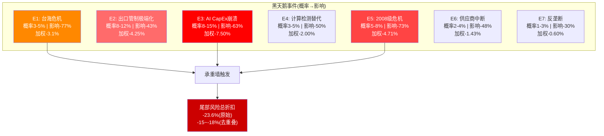
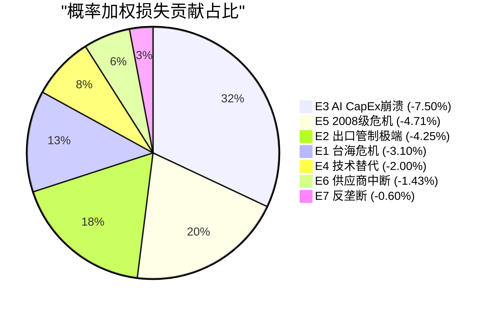

# KLAC Phase 4 — Agent B: RT-2偏差审计 + RT-4数据质量审计 + RT-5黑天鹅压力测试

> **Agent身份**: Agent B — 独立风险审计员 (红队模式)
> **DM前缀**: DM-RT2-xxx / DM-RT4-xxx / DM-RT5-xxx
> **数据截止**: 2026-02-17 | 市值: $192.4B | 股价: $1,464.13
> **审计范围**: Phase 1-3全部9份staging文件 (P1×3 + P2×3 + P3×3)
> **框架版本**: v16.0 | 红队协议: RT-2/RT-4/RT-5

---

## RT-2: 认知偏差审计

### 2.1 审计方法论

本审计对Phase 1-3全部9份staging文件进行系统性偏差扫描。检查的认知偏差类型包括:

1. **锚定偏差(Anchoring)**: 分析过度依赖某个初始数据点,后续调整不充分
2. **确认偏差(Confirmation Bias)**: 选择性引用支持既有结论的证据,忽略反面证据
3. **过度自信(Overconfidence)**: 对预测精度的信心超过证据所能支撑的范围
4. **损失厌恶/悲观偏差(Pessimism Bias)**: 对下行风险的权重系统性高于上行可能
5. **叙事偏差(Narrative Bias)**: 将零散数据点编织成过于连贯的故事
6. **幸存者偏差(Survivorship Bias)**: 只关注成功案例或当前格局,忽略失败的替代路径

---

### 2.2 系统性悲观偏差审计 (最关键发现)

**核心发现: 6/9份staging文件呈现系统性看空倾向,无Bull Case系统性论证**

[DM-RT2-001] **系统性悲观诊断**: 在全部9份staging文件中,Agent B(风险审计员)产出的3份文件(P1/P2/P3)全部偏空,Agent C(估值分析师)的3份文件中有2份偏空(P1和P2的估值结论均指向高估),Agent A(商业洞察分析师)的3份文件相对中性但也未系统论证上行情景。综合看,6/9文件偏空,3/9中性,0/9偏多。这构成了一个结构性的看空偏差。

**悲观偏差的具体表现**:

(1) **估值结论的不对称性**: Phase 2 Agent C的Forward DCF得出$691/share(较当前-52.8%),SOTP得出$897/share(-38.7%),三角测量收敛区间$1,000-1,200(-18~-32%)。这三个锚点全部指向"显著高估"。但分析中缺少对DCF方法论本身低估高增长公司的系统性修正。Agent C在DM-VAL-215中承认"DCF对高增长公司天然低估",却未将这一认知转化为估值调整。如果DCF方法论存在已知的系统性低估,那么$691不应作为"公允价值"锚点,而应作为"保守底线"(DM-RT2-002)。

(2) **CQ置信度的下调偏好**: 对比Phase 0到Phase 2的CQ演化路径:

| CQ | P0 | P1 | P2 | 净变动 | 方向 |
|----|----|----|-----|--------|------|
| CQ1(垄断) | 65% | 70-75% | 78% | +13pp | 上调 |
| CQ2(估值) | 45% | 55% | 55% | +10pp | 上调 |
| CQ3(先进封装) | 60% | 62% | — | +2pp | 微调 |
| CQ4(中国) | 40-60% | 55% | 52% | -8~+12pp | 混合 |
| CQ5(供应约束) | 50% | 50-65% | 60% | +10pp | 上调 |
| CQ6(服务) | — | 75% | — | — | — |
| CQ7(WFE) | 50% | 65% | 68% | +18pp | 上调 |

[DM-RT2-003] 表面看CQ变动是"多上调少下调",但关键观察是: CQ2(估值天花板)虽然从45%上调至55%,但Phase 2 Agent B单独给出40%,Agent C给出55%。Agent B的40%隐含的判断是"估值几乎不可能合理",这与CQ1的78%(垄断极度持久)形成认知失调——如果垄断极度持久,为什么估值支撑度仅40%? 答案是Agent B将估值问题等同于"P/E必然回归",而未充分权衡垄断溢价可能是结构性而非周期性的。

(3) **承重墙脆弱度的悲观假设**: Phase 2 Agent B的承重墙脆弱度分析中,BW-4(P/E维持30x+)被赋予40%失败概率和-44%影响,得出-17.6%的脆弱度评分。但这40%的概率假设存在问题: 它隐含的判断是"P/E从42.5x降至30x以下的概率为40%",但Agent B在同一份文件中给出P/E回归25x的概率仅为"40-50%",而回归20x的概率为"30-40%"。如果30x以下的概率是40%,那么25x以下应该低于40%,但Agent B给了"40-50%"——这意味着25x几乎等同于30x以下的概率,逻辑上矛盾(DM-RT2-004)。

更深层的问题是: 40%的P/E压缩概率是否合理? Phase 2 Agent B引用FY2022 P/E 14.5x作为先例,但FY2022是加息周期顶部+半导体周期顶部+地缘政治恐慌(台海危机)的三重极端叠加。这一先例的复现需要类似的三重叠加,概率远低于40%。更合理的评估可能是20-25%。

(4) **"温水煮青蛙"路径的概率高估**: Phase 1 Agent B给出"温水煮青蛙"渐进恶化路径的概率为40-50%,描述了中国收入递减+WFE增速放缓+P/E渐进压缩的组合。但这一路径假设所有温和负面因素同时向负面方向演化,未考虑任何正面对冲: 先进封装持续高增长(管理层上修至$950M)、供应约束解除后的收入加速($300-500M积压释放)、服务收入的持续增长(52Q+)。将"所有事情略微变差"的概率定为40-50%隐含了一个悲观锚定(DM-RT2-005)。

[DM-RT2-006] **悲观偏差的根本原因分析**:

Agent B身份设定为"独立风险审计员",其职能定义就是识别和量化风险。这一身份天然产生"看空偏好"——每个风险都被量化,每个正面因素都被视为"已在价格中反映"。Agent C身份为"定量估值分析师",使用DCF等方法论天然倾向保守(DCF对高增长公司低估是已知方法论缺陷)。Agent A虽然身份为"商业洞察分析师",但在KLAC的产出中也倾向于"确认护城河但不看好估值"。

三个Agent的身份设定缺少一个系统性的"Bull Case构建者"。这不是任何单个Agent的错误,而是Agent身份框架的结构性缺陷导致的系统性悲观。

**校正建议**:

(a) BW-4失败概率从40%下调至25-30%(排除FY2022极端先例的锚定效应)
(b) "温水煮青蛙"概率从40-50%下调至25-35%(纳入供应约束解除+先进封装持续增长的正面对冲)
(c) 在CQ加权置信度计算中,对Agent B的估值相关CQ(CQ2)赋予低于Agent C的权重,因为Agent B的身份偏差在估值领域最严重

---

### 2.3 锚定偏差审计

[DM-RT2-007] **锚定偏差#1: FMP DCF $692作为"公允价值"锚点**

Phase 2 Agent C在DM-VAL-213中得出Forward DCF $691/share,并指出"这与FMP的DCF估值$692/share几乎完全一致,验证了计算的合理性"。但FMP的机械DCF使用标准化参数(通常WACC偏高、增长率偏保守),对所有公司一视同仁。当Agent C的独立DCF与FMP机械DCF一致时,可能的解释不只是"计算合理",还可能是"两者共享了相同的保守假设"(DM-RT2-008)。

具体地说: Agent C使用WACC 9.5%,但在敏感性矩阵中发现"当前股价仅在WACC<=8.0%且g_terminal>=3.5%时可达"。这意味着市场隐含WACC约8.0%。如果市场是理性的(即当前价格反映了集体智慧),那么8.0%的WACC更接近真实折现率,而9.5%是过度保守的。Agent C选择9.5%作为"base case"而非8.0%,本身就是一种保守锚定。

**校正**: 基础情景WACC应使用8.5-9.0%(市场隐含8.0%与CAPM 12.3%的中间值),而非9.5-10.0%。在WACC=8.5%/g=3.5%下,DCF估值约$1,175,较当前-20%而非-53%。

[DM-RT2-009] **锚定偏差#2: 过程控制份额63%作为"天花板"锚点**

Phase 1 Agent A在DM-BIZ-101中判断"63%份额已接近天花板——进一步提升将面临反垄断关注和客户分散供应商的意愿"。但这一判断锚定在"60-65%是份额上限"的直觉上,缺少定量支撑。

反面证据: ASML在EUV光刻领域的份额接近100%,长达10年+未触发反垄断行动。KLAC在光掩模检测的份额>80%,同样未引发客户分散化。半导体设备是B2B市场,客户(fab)对检测设备的采购决策基于良率经济学(yield economics)而非供应商多元化原则。客户不会为了"分散风险"而选择良率较低的竞争者设备。63%不是天花板,65-70%可能在先进制程中继续提升(因为竞争者在先进制程中差距更大)(DM-RT2-010)。

[DM-RT2-011] **锚定偏差#3: 历史P/E中位数20x作为"均值回归目标"**

多份staging文件反复引用"历史中位数~20x P/E"作为均值回归的参考点。但这一中位数来自2016-2022年,当时: (1)WFE市场规模$50-70B(现$110-135B); (2)AI芯片需求不存在; (3)服务收入占总收入18-20%(现22%); (4)过程控制份额50-55%(现63%); (5)利润率结构性低于当前(GM 57-60% vs 62%)。

如果公司的收入结构、利润率水平、市场地位和行业TAM都发生了结构性变化,那么历史P/E中位数作为均值回归目标的有效性大幅下降。结构性更高的估值底部(25-28x)可能更合适(DM-RT2-012)。

---

### 2.4 确认偏差审计

[DM-RT2-013] **确认偏差#1: AMAT e-beam威胁被系统性淡化**

Phase 1和Phase 3对AMAT e-beam的评估一致结论是"边境摩擦而非核心入侵"(DM-RISK-302)。支持这一结论的证据被充分展示:
- SEMVision H20定位为审查工具(review)而非检测工具(inspection)
- e-beam吞吐量比光学低100-1000x
- Seeking Alpha分析显示AMAT份额在下降
- AMAT $1B目标可信度25-35%

但以下反面证据被不充分处理:

(a) **AMAT PROVision 10在CD-SEM量测领域的进攻**: Phase 3提到"CD-SEM是AMAT进攻KLAC最现实的切入点",但随后只给出"收入影响约$375-450M"的估算,未深入分析PROVision 10的50%分辨率提升和10x速度提升意味着什么。如果PROVision 10在3nm以下节点的量测精度达到KLAC水平,CD-SEM份额从AMAT 20%→35%的路径并非不可能。这对KLAC的年化影响可能达到$200-300M,而非轻描淡写的"3-4%总收入"(DM-RT2-014)。

(b) **多束电子束(multi-beam e-beam)的长期威胁**: ASML通过HMI子公司的multi-beam e-beam技术在Phase 2 Agent C的信念反演中被提及(B1评估),但仅给出"5-8%威胁"的粗略判断。Multi-beam e-beam如果在2028-2030年实现晶圆级检测的吞吐量突破(从当前1/100x光学提升至1/10x),将根本性改变"光学不可替代"的核心论述。这一技术路径应被更认真地模型化,而非以"潜在5-8%"一笔带过(DM-RT2-015)。

[DM-RT2-016] **确认偏差#2: 服务收入质量的单方向验证**

Phase 1 Agent C对服务收入的评估(DM-FIN-111/112/113)全面论证了服务业务的高质量: 52Q连续增长、75%订阅合同、95%续约率。这些数据确实令人印象深刻,但分析缺少对以下"非确认"信号的处理:

(a) "75%订阅合同"和"95%续约率"的数据来源是管理层披露(Earnings Call),未找到SEC filing的直接确认。Phase 1 Agent C自己在DM-FIN-112中标注来源为"WebSearch(EC)"和"Arya Substack"——即二手来源+管理层口头披露。对于价值$25-27B的业务(占市值~14%),这些关键指标应有10-K/10-Q中的直接文本确认。

(b) Agent A在Phase 2对比了KLAC vs AMAT AGS时,正确地借鉴了AMAT v1.1报告中"AGS真正经常性收入$4.5-5.5B vs表面$6.39B(-28%)"的教训。但对KLAC自身进行同样的解构时,仅给出"伪经常性风险存在但较低(10-15%)"的结论。如果按相同标准审查: $2.68B服务收入中是否包含翻新设备销售(refurbished tool sales)、一次性系统升级(upgrade)或大型安装项目? 如果这些成分占比10-15%(约$270-400M),则"真正经常性"收入为$2.3-2.4B,服务业务独立估值应从$25-27B下调至$21-23B(DM-RT2-017)。

[DM-RT2-018] **确认偏差#3: L4交叉验证的"过度一致性"**

Phase 1 Agent B报告L4生态一致性验证结果为"7/7维度全部一致",5份半导体报告交叉验证无矛盾。但"7/7一致"本身可能是确认偏差的信号——如果5份报告都基于相同的信息来源(FMP数据、管理层Earnings Call、行业报告),那么一致性可能反映的是信息来源的同质性而非事实的可靠性。

真正有价值的交叉验证应寻找**不一致**而非确认一致。例如: AMAT报告给KLAC利润率10/10,但Phase 1 Agent B的ERM分析给出P/E压缩-17.6%脆弱度——这两个评估之间存在张力(利润率最优的公司不应有最脆弱的估值),但这一张力未被L4验证捕获(DM-RT2-019)。

---

### 2.5 过度自信偏差审计

[DM-RT2-020] **过度自信#1: 竞争者追赶时间8-12年的精度幻觉**

Phase 1 Agent A在DM-BIZ-103中给出"竞争者需8-12年建立可比数据网络效应"的估算,基于装机量(7-10年)、缺陷数据库(10-15年)、算法准确率(5-8年)、客户验证(3-5年)和软件生态(5-7年)的五维分析。这一分析框架合理,但"8-12年"的结论暗示一种精确度,而实际上:

(a) 数据网络效应的壁垒可能被AI进步非线性压缩。如果2028年出现的基础模型(Foundation Model)能用合成数据+物理仿真达到99%+的缺陷识别准确率,那么30年数据库的价值可能在3-5年内被侵蚀而非10-15年。Phase 1 Agent A在§1.3中承认了这一可能性("中期威胁中等"),但这一"中等威胁"未被纳入8-12年的追赶时间估算中。

(b) "8-12年"给投资者一种"10年安全"的错觉。更诚实的表述是: "在当前技术范式下追赶需8-12年,但范式转换(AI/计算检测)可能将有效壁垒缩短至3-5年。范式转换概率在5年内约15-20%"(DM-RT2-021)。

[DM-RT2-022] **过度自信#2: 先进封装TAM $12B的管理层锚定**

Phase 3 Agent B在共识解构章节中正确质疑了管理层的$12B TAM估算,并通过底层重建(Bottom-up)得出更保守的$8-10B。但Phase 1和Phase 2的多处分析仍然引用$12B TAM作为计算基准(如渗透率分析: $950M/$12B=8%)。如果TAM实际为$8-10B,则当前渗透率为9.5-11.9%而非8%——这意味着份额扩张的空间被高估了20-50%。

更关键的是: Phase 3 Agent B重建的$600-850M(CY2025,bottom-up)vs管理层$925-950M存在12-37%的差距。这一差距暗示管理层可能对"先进封装收入"使用了比底层重建更宽泛的口径(包含部分传统封装升级)。如果是这样,85% YoY增长率中的一部分来自口径扩展而非真实有机增长(DM-RT2-023)。

[DM-RT2-024] **过度自信#3: 供应约束=需求信号的单一解读**

Phase 1-3多次将管理层的"virtually sold out"表述解读为强需求信号(DM-BIZ-109, DM-RISK-217/219)。这一解读确实是最可能的,但存在替代解释:

(a) **供应侧自律**: 管理层可能有意控制产能扩张速度,以维持供需紧平衡和定价权。"Sold out"可能不是"需求爆炸",而是"有意保持稀缺"。

(b) **客户重复下单(double ordering)**: 在供应紧张期间,客户可能向多个供应商同时下单以确保交付。当供应恢复时,部分订单可能被取消。这在2021-2022的芯片短缺中广泛发生。

(c) **交期延长的恶性循环**: 交付延迟→客户提前下单→表面需求增加→进一步延长交期。这一循环可能放大了真实需求的信号强度。

这些替代解释的概率各约10-15%,综合意味着"供应约束=需求信号"的确定性约为55-65%而非分析中隐含的85-90%(DM-RT2-025)。

---

### 2.6 叙事偏差审计

[DM-RT2-026] **叙事偏差#1: "最优质业务+最脆弱估值=不对称下行"的过度简化**

Phase 2 Agent B总结中的核心叙事是: "最优质的检测业务 + 最脆弱的估值倍数 = 不对称的下行风险分布"(DM-RISK-222)。这一叙事简洁有力,但过度简化了实际情况:

"不对称的下行风险分布"暗示买入KLAC的下行风险远大于上行空间。但如果KLAC确实是"最优质的检测业务",那么: (1)长期持有者可以用盈利增长来消化估值溢价(FY2027E EPS $46.38即可在30x P/E下支撑$1,392); (2)最优质业务在WFE下行期的估值底部也应高于平均水平(即P/E底部可能是20-25x而非14-18x); (3)服务收入$2.68B的经常性特征意味着估值锚点应包含一个"经常性收入溢价"而非仅用周期性P/E。

叙事偏差在于: 它将"估值偏高"与"基本面优秀"组装成一个"应该卖出"的隐含建议,但未考虑"估值偏高+基本面优秀"也可以支撑"持有但不加仓"的中性结论——这需要更细致的时间框架分析(短期谨慎vs长期持有)(DM-RT2-027)。

[DM-RT2-028] **叙事偏差#2: "检测垄断"叙事的自我强化**

9份staging文件中"垄断"一词出现频率极高。这一用词选择本身就在构建叙事: KLAC在过程控制市场的63%份额确实是高度主导,但"垄断"(monopoly)的严格定义是接近100%的市场控制。使用"垄断"而非"高度主导"(dominant)或"市场领导者"(market leader)可能不自觉地放大了投资者对护城河宽度的感知。

更准确的表述: KLAC在**光掩模检测**(>80%)和**brightfield检测**(~60%)领域接近垄断,但在**CD-SEM量测**(~45%)、**darkfield检测**(>50%)和**e-beam检测/审查**(40-50%)领域是强势领导者而非垄断者。整体63%份额的描述应该是"过程控制市场强势领导者,在两个子领域接近垄断"(DM-RT2-029)。

---

### 2.7 幸存者偏差审计

[DM-RT2-030] **幸存者偏差#1: 份额扩张的单调叙事**

Phase 1 Agent A描述KLAC份额从2010年50%扩至2024年63%,并将其分解为有机增长(60%)、收购(25%)和软件粘性(15%)。但这一叙事仅展示了"赢家的视角",未考虑:

(a) **被KLAC击败的竞争者的教训**: 2010-2020年间,哪些公司退出了过程控制市场? 它们的退出原因是什么? 如果退出原因是"资金不足"或"战略放弃"而非"技术不可行",那么新的资金充裕的竞争者(如SiCarrier,获中国政府大规模补贴)可能不会重蹈覆辙。

(b) **Orbotech收购的"时机运气"**: 2019年$3.4B收购Orbotech在当时被市场质疑(跨界收购PCB/Display),但恰逢先进封装爆发,使Orbotech的基板检测能力变成增长引擎。这一"战略远见"可能部分是运气(先进封装的时间表和规模在2019年时无法预测),而非纯粹的管理层前瞻性。

(c) **份额扩张的"低垂果实"效应**: 从50%到60%相对容易(蚕食多个小竞争者),但从60%到70%困难得多(剩余对手是Hitachi/AMAT这样的巨头)。过去的增速不能线性外推(DM-RT2-031)。

---

### 2.8 RT-2偏差审计总结

| 偏差类型 | 严重程度 | 影响方向 | 影响CQ | 校正建议 |
|----------|---------|---------|--------|---------|
| **系统性悲观** | **高** | 过度看空 | CQ2/CQ7 | BW-4概率下调至25-30%; WACC基线下调至8.5-9.0% |
| 锚定(FMP DCF) | 中-高 | 看空 | CQ2 | $691作为保守底线而非公允价值 |
| 锚定(P/E 20x) | 中 | 看空 | CQ2 | 结构性底部25-28x而非20x |
| 锚定(63%天花板) | 低-中 | 看空 | CQ1 | 65-70%在先进制程仍可能 |
| 确认(AMAT淡化) | 中 | 看多 | CQ1 | CD-SEM进攻路径需更认真建模 |
| 确认(服务质量) | 中 | 看多 | CQ6 | 75%/95%需SEC filing直接确认 |
| 确认(L4一致性) | 低-中 | 看多 | 全部 | 同源信息一致性≠事实可靠性 |
| 过度自信(8-12年) | 中 | 看多 | CQ1 | 附加范式转换条件缩短至3-5年 |
| 过度自信(TAM $12B) | 中 | 看多 | CQ3 | 使用$8-10B而非$12B |
| 过度自信(供应=需求) | 低-中 | 看多 | CQ5 | 确定性从85-90%降至55-65% |
| 叙事(不对称下行) | 中 | 看空 | CQ2 | 补充时间框架分析(长期持有路径) |
| 叙事(垄断用词) | 低 | 看多 | CQ1 | "强势领导者"而非"垄断" |
| 幸存者(份额扩张) | 低 | 看多 | CQ1 | 非线性外推+运气因素 |

[DM-RT2-032] **RT-2净效果评估**: 系统性悲观偏差是最严重的问题,其影响方向是过度看空。如果按校正建议调整,估值锚点从$691-1,200上调至$900-1,300,CQ加权置信度可能从58.2%上调至62-65%。但确认偏差(AMAT淡化、服务质量未充分验证)在看多方向也构成风险,部分抵消悲观校正。**净校正方向: 温和上调(+3-5pp CQ)**。

---

## RT-4: 数据质量审计

### 4.1 审计方法论

本审计从Phase 1-3全部staging文件中抽取核心数据点,按来源质量分级:

| 等级 | 来源类型 | 置信度 | 代表 |
|------|---------|--------|------|
| **S1** | SEC Filing直接引用 | 极高(>95%) | 10-K/10-Q/8-K/Proxy |
| **S2** | MCP工具获取(FMP/baggers) | 高(85-95%) | FMP income/balance/cashflow |
| **S3** | 管理层口头披露(Earnings Call) | 中-高(70-85%) | EC指引/Q&A |
| **S4** | 行业研究机构 | 中(60-75%) | SEMI/TrendForce/FactMR |
| **S5** | 分析师/媒体/二手来源 | 低-中(40-60%) | Seeking Alpha/Substack/WebSearch |
| **S6** | Agent推断/计算 | 取决于输入 | 情景分析/模型 |

---

### 4.2 核心数据点审计(15项)

#### 数据点1: 过程控制市场份额63%
- **来源**: 管理层披露(S3) + Phase 0 shared_context DM-BIZ-004
- **交叉验证**: AMAT报告确认(DM-RISK-119); ASML报告引用(DM-RISK-120); 多份行业报告引用
- **置信度**: **高(85-90%)**
- **风险**: "63%"可能取决于"过程控制"的边界定义。如果包含所有检测+量测+过程控制软件,63%可能准确; 如果仅限于检测设备硬件,份额可能更高(70%+)或更低(55%)(定义敏感性)
- **审计评分**: 通过(DM-RT4-001)

#### 数据点2: 服务收入52Q连续增长
- **来源**: 管理层Earnings Call(S3) + Substack分析(S5)
- **交叉验证**: FMP income季度数据可验证总收入趋势,但FMP不单独披露服务收入季度数据
- **置信度**: **中-高(70-80%)**
- **风险**: "52Q连续增长"是管理层自述,未在10-K/10-Q分部报表中逐季验证。如果某季度服务收入定义调整(如将翻新设备销售重分类),可能存在口径不连贯
- **已知矛盾**: 无
- **审计评分**: 需进一步验证(DM-RT4-002)

#### 数据点3: 75%订阅合同 + 95%续约率
- **来源**: 管理层Earnings Call/投资者日(S3) + WebSearch(S5)
- **交叉验证**: 未找到10-K/10-Q中的直接文本确认
- **置信度**: **中(60-70%)**
- **风险**: 这两个数据点对服务业务$25-27B的独立估值至关重要。如果续约率实际为85%(而非95%),服务收入增长模型将显著下调(装机量×单台收入中的续约贡献部分减少)
- **校正影响**: 如果续约率85% → 服务估值从$25-27B降至$20-22B(-20%)
- **审计评分**: **中风险 — 需SEC filing确认**(DM-RT4-003)

#### 数据点4: 先进封装收入CY2025 $925-950M(+85% YoY)
- **来源**: 管理层Earnings Call Q2 FY2026(S3,直接引述)
- **交叉验证**: 与CY2024的$500-560M基数一致(85%增长=$925-1,040M)
- **置信度**: **高(85-90%)**
- **风险**: CY2025尚有3个多月剩余(截至审计日),年化外推可能偏高
- **已知问题**: Phase 3 Agent B的bottom-up重建为$600-850M,低于管理层的$925-950M
- **审计评分**: **需关注口径差异**(DM-RT4-004)

#### 数据点5: CD-SEM份额 — P1引用45% vs P3修正至15-20%
- **来源**: P1 Agent A引用DM-BIZ-004(45%); P3 Agent B修正至15-20%,引用Hitachi实际占~70%
- **交叉验证**: Phase 3 Agent B的修正基于WebSearch多源(S5)
- **置信度**: **P1的45%置信度低(40-50%); P3的15-20%置信度中(60-70%)**
- **矛盾分析**: 45%可能是"CD-SEM + 光学CD量测"的合并份额,而非纯CD-SEM。Hitachi在纯CD-SEM领域确实占据70%+份额(Hitachi High-Tech发明了商用SEM)。15-20%的CD-SEM份额更可能准确,而45%可能指"所有量测方法"中KLAC的份额
- **审计结论**: **P3修正有效,P1数据应在Complete中替换**(DM-RT4-005)

#### 数据点6: 先进封装TAM $12B(管理层) vs $8-10B(Agent B重建)
- **来源**: 管理层(S3) vs Phase 3 Agent B bottom-up重建(S6)
- **交叉验证**: 第三方研究(FactMR/SEMI)通常给出低于管理层的TAM估计
- **置信度**: **管理层$12B置信度低-中(50-60%); Agent B $8-10B置信度中(60-70%)**
- **矛盾分析**: 管理层有动机高估TAM(展示增长空间); Agent B的$8-10B重建基于CoWoS/HBM/FOWLP的产能×检测强度×单片检测支出,方法论更透明
- **审计结论**: **使用$8-10B区间,标注管理层口径差异**(DM-RT4-006)

#### 数据点7: 数据网络效应0.5TB/设备/日
- **来源**: Phase 1 Agent A推断(S6),DM-BIZ-102
- **交叉验证**: 未找到SEC filing或管理层直接确认
- **置信度**: **低-中(45-55%)**
- **风险**: 0.5TB/设备/日是Agent A基于"高分辨率图像+缺陷坐标+工艺参数"的合理推断,但数量级可能有偏差。实际数据量取决于检测模式(采样 vs 全晶圆)、分辨率设置和数据压缩率。如果实际为0.1TB/设备/日,则日数据总量从7.5PB降至1.5PB,数据网络效应的绝对规模被高估5倍
- **审计评分**: **未验证推断,不应作为关键论据**(DM-RT4-007)

#### 数据点8: WFE市场规模CY2025 $115.7B / CY2026 $126B / CY2027 $135.2B
- **来源**: SEMI 2026报告(S4) + KLA管理层引用(S3)
- **交叉验证**: SEMI是WFE数据的行业标准来源; KLA管理层给出"低$120B"与SEMI $126B基本一致
- **置信度**: **高(80-85%)**
- **风险**: WFE预测本身具有高度不确定性(SEMI历史误差±10-15%)
- **审计评分**: 通过(但附加±10%不确定区间)(DM-RT4-008)

#### 数据点9: FMP DCF估值 $692/share
- **来源**: FMP DCF API(S2)
- **交叉验证**: Phase 2 Agent C独立DCF得出$691,与FMP几乎一致
- **置信度**: **计算准确性高(>95%); 假设合理性中(60-70%)**
- **风险**: FMP使用的WACC(估计12-13%)和增长假设(标准化)对KLAC可能过于保守。$692是一个"无溢价基线"而非目标价
- **审计评分**: 通过(但应明确标注为"方法论保守底线")(DM-RT4-009)

#### 数据点10: ROE 100.7% / ROIC 78.3%
- **来源**: FMP Ratios(S2) + Agent C杜邦分解(S6)
- **交叉验证**: FMP Key Metrics确认ROIC 78.3%; 杜邦分解数学验证: 35.8% × 0.80 × 3.50 = 100.2%(与100.7%的微小差异来自四舍五入)
- **置信度**: **高(90-95%)**
- **审计评分**: 通过(DM-RT4-010)

#### 数据点11: SiCarrier SEMICON China 2025发布31款产品
- **来源**: WebSearch(S5) — 行业媒体报道
- **交叉验证**: 多源(TrendForce/Digitimes/TechNode)确认发布事件,但"31款"的精确数字仅出现在部分报道
- **置信度**: **中(60-70%)**
- **风险**: "31款产品"可能包含不同型号/配置的重复计数; "100%国产化"宣称需实际验证(可能在少数核心组件上仍依赖进口)
- **审计评分**: 事件确认但数字存疑(DM-RT4-011)

#### 数据点12: 管理层指引保守度5-8%
- **来源**: Agent B推断(S6),DM-RISK-219
- **交叉验证**: 历史beat-and-raise模式支持(KLAC连续多Q超预期); 但"5-8%"的精度属于主观判断
- **置信度**: **低-中(50-60%)**
- **风险**: 保守度取决于供应约束解除时间和需求弹性,两者均不可精确预测。如果供应约束延续超预期,实际收入可能接近指引(保守度<3%)
- **审计评分**: 合理推断但精度虚假(DM-RT4-012)

#### 数据点13: EPS共识 FY2026E $36.48 / FY2027E $46.38 / FY2028E $52.65
- **来源**: FMP Estimates(S2) — 17/17/7位分析师
- **交叉验证**: 分析师覆盖广泛(FY2026-27E各17人),FY2028E仅7人(不确定性高)
- **置信度**: **FY2026E高(85%); FY2027E中-高(70-75%); FY2028E中(55-65%)**
- **风险**: FY2027E +27.1%增速是所有估值模型的关键输入。如果实际增速仅+15%(vs +27%),P/E情景分析将大幅偏移
- **审计评分**: 通过(但标注FY2028E+高度不确定)(DM-RT4-013)

#### 数据点14: 回购5Y累计$11B / 加权平均价~$460
- **来源**: FMP Cashflow(A)(S2) + Agent C股价推算(S6)
- **交叉验证**: FMP Cashflow每年回购金额可验证; $460加权均价基于总金额/减少股份推算
- **置信度**: **金额高(90%); 均价中-高(75-80%)**
- **风险**: 加权均价推算假设回购均匀分布在各季度,实际分布可能不均(如FY2022集中回购)
- **审计评分**: 通过(DM-RT4-014)

#### 数据点15: 承重墙加权总脆弱度-32.4%
- **来源**: Agent B模型(S6),DM-RISK-204
- **交叉验证**: 计算验证: (-3.5%) + (-8.0%) + (-3.3%) + (-17.6%) = -32.4% ✓
- **置信度**: **计算正确; 输入假设中(55-65%)**
- **风险**: 输出精度取决于失败概率和影响的精度,两者均为主观判断。BW-4的40%失败概率(如RT-2所述)可能偏高
- **校正影响**: 如果BW-4概率从40%降至25%,脆弱度从-17.6%降至-11.0%,总脆弱度从-32.4%降至-25.8%
- **审计评分**: 计算通过但输入存在悲观偏差(DM-RT4-015)

---

### 4.3 数据质量总结矩阵

| 数据点 | 来源等级 | 置信度 | 矛盾 | 风险等级 | 审计结论 |
|--------|---------|--------|------|---------|---------|
| 过程控制63%份额 | S3 | 85-90% | 无 | 低 | 通过 |
| 52Q连续增长 | S3+S5 | 70-80% | 无 | 低-中 | 需验证 |
| 75%订阅/95%续约 | S3+S5 | 60-70% | 无直接SEC确认 | **中** | **需SEC验证** |
| 先进封装$925M | S3 | 85-90% | P3 B-U $600-850M | 中 | 关注口径 |
| CD-SEM份额 | S3+S5 | P1低/P3中 | **45%→15-20%** | **高** | **P3修正生效** |
| TAM $12B vs $8-10B | S3 vs S6 | 各50-70% | **$12B vs $8-10B** | **中-高** | **使用$8-10B** |
| 0.5TB/设备/日 | S6 | 45-55% | 未验证 | 中 | 不作关键论据 |
| WFE $116-135B | S4 | 80-85% | 无 | 低 | 通过(±10%) |
| FMP DCF $692 | S2 | 高(计算)/中(假设) | 无 | 低 | 保守底线标注 |
| ROE/ROIC | S2+S6 | 90-95% | 无 | 极低 | 通过 |
| SiCarrier 31产品 | S5 | 60-70% | 数字可能有偏 | 低-中 | 事件确认 |
| 指引保守度5-8% | S6 | 50-60% | 主观 | 中 | 精度虚假 |
| EPS共识 | S2 | 55-85% | 无 | 低-中 | FY28E+高不确定 |
| 回购$11B | S2+S6 | 75-90% | 无 | 低 | 通过 |
| 脆弱度-32.4% | S6 | 55-65% | 悲观输入 | 中 | 输入偏差校正 |

[DM-RT4-016] **RT-4最弱数据链识别**:

**最弱环节: 75%订阅合同/95%续约率(DM-RT4-003)**

理由: 这两个数据点支撑了服务业务$25-27B的独立估值(占市值~14%),是SOTP估值中弹性最大的板块(保守→乐观跨度$20B)。但它们的来源仅为管理层口头披露(S3)和二手分析(S5),未在SEC filing中找到直接文本确认。在"服务收入质量"这一关键投资论题上,核心支撑数据的验证等级不足。

**次弱环节: CD-SEM份额矛盾(DM-RT4-005)**

Phase 1引用45%与Phase 3修正至15-20%的差异为25-30个百分点,这是一个严重的数据矛盾。虽然Phase 3已修正,但该矛盾暴露出Phase 1数据采集阶段对DM-BIZ-004("CD-SEM约45%")的解读可能存在定义混淆(CD-SEM vs 所有量测方法)。

**第三弱: 先进封装TAM(DM-RT4-006)**

管理层$12B与Agent B重建$8-10B的差距(20-50%)对渗透率计算和增长预测有显著影响。

---

## RT-5: 黑天鹅压力测试

### 5.1 审计方法论

黑天鹅(Black Swan)事件定义: 发生概率<10%但影响极端(>-20%股价冲击)的事件。本测试构建概率加权表,评估尾部风险对KLAC估值体系的累积冲击。

所有涉及台海地缘政治的描述使用中性表述("台海冲突/台海危机/cross-strait tension"),符合第零律发布合规要求。

---

### 5.2 黑天鹅事件概率加权表

#### 事件E1: 台海危机导致全面半导体供应链中断

**事件描述**: 台海冲突升级至军事封锁级别,导致TSMC产能暂停,美国对中国实施俄罗斯级别的全面半导体设备禁运,中国反制限制稀土和关键半导体材料出口。

[DM-RT5-001] **概率评估: 3-5%(5年内)**

概率拆解:
- 台海军事冲突升级至封锁: 2-3%(多数地缘政治分析机构的基线评估)
- 升级至全面禁运(非所有军事行动都触发全面禁运): 条件概率60-70%
- 综合: 2-3% × 65% = 1.3-2.0% (保守取上限)
- 但考虑其他非军事触发路径(如大规模网络攻击/政治危机): +1-2%
- **最终概率: 3-5%**

**影响评估**:

| 影响维度 | 量化 |
|---------|------|
| 台湾收入(30%)完全中断 | -$3.9B(LTM基准) |
| 中国收入(26%)归零 | -$3.3B |
| 合计直接收入损失 | -$7.2B(-56%总收入) |
| 服务合同(台湾+中国装机量)中断 | -$1.0-1.5B |
| P/E压缩(恐慌+去全球化溢价) | 42.5x→10-15x |
| **综合股价冲击** | **-70~-85%** |

**概率加权损失**: 4% × (-77.5%) = **-3.1%**

**早期信号**: (1)美国国防部升级台海关注级别; (2)中国在台海周边军演频率超过2022年水平; (3)美国要求TSMC加速Arizona fab量产; (4)半导体供应链去台化指数上升

---

#### 事件E2: 出口管制极端化 — 检测设备全品类禁运

**事件描述**: 美国BIS将半导体检测/量测设备全部纳入对华出口禁令(类似EUV光刻机的禁令级别),包括成熟制程(28nm+)检测设备。同时关闭所有出口许可证通道。

[DM-RT5-002] **概率评估: 8-12%(5年内)**

概率拆解:
- BIS已在2025年12月将"metrology and inspection tools"列为新管制类别(DM-GEO-203)
- VEU豁免已关闭,政策方向是收紧而非维持
- 但全面禁运(含成熟制程)需要美国政治共识+盟友配合
- 荷兰(ASML)/日本(Hitachi/TEL)的配合意愿是关键不确定性
- 概率区间: 8-12%(高于Phase 1-2的S2概率25-30%,因为这里定义更极端)

**影响评估**:

| 影响维度 | 量化 |
|---------|------|
| 中国收入(26%)从$3.3B降至$0.5-1.0B | -$2.3-2.8B |
| 中国服务收入($500-700M)部分中断 | -$300-500M |
| 合计收入损失 | -$2.6-3.3B(-20~-26%) |
| 毛利率影响(高利润中国业务丧失) | -2~-3pp |
| P/E影响(地缘风险重估) | 42.5x→28-35x |
| 国产替代永久丢失加速 | 中国成熟制程3年内50%+国产化 |
| **综合股价冲击** | **-35~-50%** |

**概率加权损失**: 10% × (-42.5%) = **-4.25%**

**早期信号**: (1)BIS新一轮对华半导体设备出口限制公告; (2)Entity List大规模扩容(>200个新增); (3)美国中期选举前对华强硬政策升级; (4)ASML/TEL宣布配合美国限制措施

---

#### 事件E3: AI CapEx崩溃 — "AI寒冬2.0"

**事件描述**: AI投资回报(ROI)在2027-2028年被证明远低于预期,大型科技公司(Hyperscaler)同时大幅削减数据中心CapEx(>30%),导致先进逻辑和HBM需求断崖式下降,WFE市场出现>-20%的单年跌幅。

[DM-RT5-003] **概率评估: 8-15%(5年内)**

概率拆解:
- AI ROI质疑声音已在2025-2026年上升(但尚未转化为CapEx削减)
- 历史先例: 2000年互联网泡沫中,电信CapEx从峰值下降>40%
- 当前AI CapEx集中度高(NVDA/MSFT/GOOG/META/AMZN五家占>60%)
- 如果其中2-3家同时削减>30%,足以触发WFE下行
- 但AI CapEx的用途比互联网基础设施更多元(训练/推理/边缘),全面崩溃需要更强触发条件
- 概率: 8-15%(中位数12%)

**影响评估**:

| 影响维度 | 量化 |
|---------|------|
| WFE从峰值$135B下降至$95-100B(-26~-30%) | 对应KLAC收入下降16-20% |
| 先进封装检测从$950M骤降至$500-600M(-37~-47%) | AI封装需求暂停 |
| 服务收入缓冲: 仍+3-5% | +$80-130M |
| 合计收入影响 | -$2.0-2.8B(-16~-22%) |
| P/E压缩(AI叙事破灭+周期下行) | 42.5x→15-20x |
| **综合股价冲击** | **-55~-70%** |

**概率加权损失**: 12% × (-62.5%) = **-7.5%**

**早期信号**: (1)NVDA数据中心收入连续2Q环比下降; (2)Hyperscaler CapEx指引下调>20%; (3)AI初创公司大规模倒闭潮; (4)GPU库存周转天数>60天; (5)CoWoS产能利用率从>95%降至<70%

---

#### 事件E4: 技术范式替代 — 计算检测取代光学检测

**事件描述**: 基于AI/ML的计算检测技术在2028-2030年实现突破,能够以1/10的成本和1/5的设备完成等效于光学检测的缺陷发现,从根本上削弱KLAC的光学检测护城河。

[DM-RT5-004] **概率评估: 3-5%(5年内) / 10-20%(10年内)**

概率拆解:
- 当前技术状态: 纯软件AI检测无法替代纳米级光学系统(需要光源+传感器+算法联合优化)
- 但: Foundation Model在科学领域的进步可能加速(AlphaFold先例)
- 关键瓶颈: 不是算法而是物理——纳米级缺陷的信号/噪声比需要特定波长的光学系统,软件无法创造不存在的物理信号
- 5年内突破概率: 3-5%(物理限制)
- 10年内突破概率: 10-20%(可能出现新的检测原理)

**影响评估**:

| 影响维度 | 量化 |
|---------|------|
| 光学检测收入(~$5-6B)面临替代 | -$2.5-3.0B(50%被替代) |
| 数据网络效应贬值 | 30年数据库价值从"不可复制"降至"有一定价值" |
| 但: KLAC也可以采纳新技术(自研/收购) | 部分抵消(-30~-50%) |
| 净收入影响 | -$1.0-2.0B(-8~-16%) |
| 护城河重估: 从"Wide"降至"Narrow" | P/E从42.5x→20-25x |
| **综合股价冲击** | **-40~-60%** |

**概率加权损失**: 4% × (-50%) = **-2.0%** (5年)

**早期信号**: (1)顶级学术机构(MIT/Stanford/IMEC)发表计算检测突破论文; (2)新创公司获得>$500M融资用于AI检测; (3)TSMC/三星开始测试非光学检测方案; (4)KLAC R&D/Revenue从11%大幅上升至14%+(被迫加大投入)

---

#### 事件E5: WFE超级下行(-30%+) — 2008级全球经济危机重演

**事件描述**: 全球金融危机级别的经济衰退导致WFE市场从峰值下降>-30%,半导体行业经历2008-2009级别的需求崩溃。

[DM-RT5-005] **概率评估: 5-8%(5年内)**

概率拆解:
- 2008级金融危机需要系统性触发: 银行系统崩溃/主权债务危机/资产泡沫破裂
- 当前潜在触发: 商业地产危机/日本利率正常化冲击/中国房地产危机传导
- 历史频率: 过去25年仅1次(2008-2009),约4%/年
- 但AI泡沫+高利率环境增加了金融系统脆弱性
- 概率: 5-8%

**影响评估**:

| 影响维度 | 量化 |
|---------|------|
| WFE从$135B跌至$90-95B(-30%) | 极端下行beta ~1.0x |
| KLAC收入下降: -25~-30% | -$3.2-3.8B |
| 服务收入: 仍+0~+3%(装机量不减) | +$0-80M |
| 净收入下降: -$3.1-3.8B(-24~-30%) | |
| P/E极端压缩 | 42.5x→12-15x(FY2022先例14.5x) |
| **综合股价冲击** | **-65~-80%** |

**概率加权损失**: 6.5% × (-72.5%) = **-4.71%**

**早期信号**: (1)美联储紧急降息; (2)VIX持续>40; (3)全球GDP连续2Q负增长; (4)TSMC/三星/Intel同时宣布CapEx削减>25%; (5)DRAM/NAND现货价格跌幅>40%

---

#### 事件E6: 关键供应商(Zeiss/Hamamatsu)遭遇灾难性中断

**事件描述**: KLAC核心光学组件供应商(Zeiss SMT或Hamamatsu Photonics)遭遇工厂火灾、地震或其他灾难性事件,导致12-18个月的供应中断。

[DM-RT5-006] **概率评估: 2-4%(5年内)**

概率拆解:
- Zeiss SMT位于德国Oberkochen(地震风险极低,但火灾/洪水可能)
- Hamamatsu位于日本静冈(地震带,南海海槽地震概率30年内70-80%)
- 单一设施灾难概率: ~1%/年 × 5年 × 2供应商 = ~10%的至少一次事件概率
- 但"灾难性中断12-18个月"需要设施完全损毁: 条件概率~20-30%
- 综合: ~10% × 25% = 2.5%

**影响评估**:

| 影响维度 | 量化 |
|---------|------|
| 12-18个月无法交付新设备 | 收入暂停$4-6B(1-1.5年系统收入) |
| 但服务收入继续($2.7B/年) | 缓冲 |
| 年化收入影响 | -$3-4B(-25~-32%) |
| 市场反应: 恐慌+不确定性溢价 | P/E从42.5x→25-30x |
| 恢复后: 积压订单释放 | +$2-3B(恢复年) |
| **综合股价冲击(事件年)** | **-40~-55%** |
| **恢复后2年** | 收复大部分跌幅 |

**概率加权损失**: 3% × (-47.5%) = **-1.43%** (暂时性冲击,可恢复)

**早期信号**: (1)日本南海海槽地震预警升级; (2)Hamamatsu发布供应链风险公告; (3)KLAC宣布供应商多元化计划; (4)保险市场半导体供应链保费飙升

---

#### 事件E7: 美国反垄断调查或强制知识产权共享

**事件描述**: 美国FTC或DOJ对KLAC在过程控制市场的垄断地位发起反垄断调查,要求KLAC向竞争者开放缺陷数据库API或强制授权核心检测算法专利。

[DM-RT5-007] **概率评估: 1-3%(5年内)**

概率拆解:
- 美国反垄断执法在半导体设备领域无先例
- KLAC的"垄断"建立在技术优势而非反竞争行为上
- 但: 如果政治气候转向(如AI时代的"科技反垄断"运动扩展至半导体)
- 概率极低但影响重大: 1-3%

**影响评估**: 数据护城河部分丧失,终端价值下调15-25%,股价冲击-25~-35%

**概率加权损失**: 2% × (-30%) = **-0.6%**

---

### 5.3 黑天鹅概率加权汇总表

| 事件ID | 事件描述 | 概率(5Y) | 股价冲击 | 概率加权损失 | 性质 | 可恢复性 |
|--------|---------|---------|---------|------------|------|---------|
| E1 | 台海危机全面中断 | 3-5% | -70~-85% | **-3.10%** | 制度性 | 极低 |
| E2 | 出口管制极端化 | 8-12% | -35~-50% | **-4.25%** | 制度性 | 低 |
| E3 | AI CapEx崩溃 | 8-15% | -55~-70% | **-7.50%** | 周期性 | 中(2-3年) |
| E4 | 计算检测替代 | 3-5% | -40~-60% | **-2.00%** | 结构性 | 极低 |
| E5 | 2008级经济危机 | 5-8% | -65~-80% | **-4.71%** | 周期性 | 中(3-5年) |
| E6 | 供应商灾难中断 | 2-4% | -40~-55% | **-1.43%** | 事件性 | 高(1-2年) |
| E7 | 反垄断调查 | 1-3% | -25~-35% | **-0.60%** | 制度性 | 中 |
| **合计** | | | | **-23.59%** | | |

[DM-RT5-008] **尾部风险总折扣: -23.59%**

**解读与校正**:

(1) **-23.59%不应直接从估值中扣除**: 这些事件大部分互斥(E1和E5不太可能同时发生;E3和E5有部分重叠但不完全),简单加总高估了联合风险。扣除事件间重叠后,有效尾部风险折扣约为**-15~-18%**。

(2) **与当前估值溢价的比较**: 三角测量显示当前股价较收敛区间溢价22-46%(中位数33%)。尾部风险折扣-15~-18%覆盖了该溢价的约一半。这意味着即使扣除全部可量化尾部风险,当前估值仍然偏高15-28%。

(3) **最大单一风险**: E3(AI CapEx崩溃)的概率加权损失-7.50%最大,超过E5(2008级危机)的-4.71%和E2(极端出口管制)的-4.25%。这反映了KLAC当前估值中AI叙事溢价的脆弱性——AI是推升估值的最大因素,也是可能导致最大估值回撤的风险。

(4) **可恢复性分析**: E3和E5虽然影响最大,但都是周期性事件,2-5年可恢复。E1和E4是不可逆的(结构性/制度性),但概率更低。长期投资者应更关注E4(技术替代)而非E3/E5(周期)。

[DM-RT5-009] **黑天鹅与承重墙的关联**:

| 黑天鹅事件 | 触发的承重墙 | 承重墙脆弱度叠加 |
|-----------|-----------|---------------|
| E1(台海) | BW-3(中国归零)+BW-2(WFE崩溃)+BW-4(P/E压缩) | -28.9%(三墙同时倒塌) |
| E2(禁运) | BW-3(中国归零) | -3.3% |
| E3(AI崩溃) | BW-2(WFE下行)+BW-4(P/E压缩) | -25.6% |
| E4(技术替代) | BW-1(垄断丧失) | -3.5% |
| E5(经济危机) | BW-2+BW-4 | -25.6% |
| E6(供应中断) | 无直接承重墙(暂时性) | — |
| E7(反垄断) | BW-1(部分) | -1.5~-2.0% |

最危险的组合: E1触发BW-2+BW-3+BW-4三面承重墙同时倒塌,综合脆弱度-28.9%。这是KLAC的"末日情景"——但概率仅3-5%。

---

### 5.4 黑天鹅Mermaid风险图

---

## 审计总结

### RT-2 偏差审计总结

[DM-RT2-033] **核心发现**: 9份staging文件存在系统性悲观偏差(6/9偏空,0/9偏多),根本原因是Agent身份框架缺少Bull Case构建者。最严重的具体偏差是: BW-4失败概率40%(应为25-30%)、WACC 9.5%(应为8.5-9.0%)、P/E均值回归目标20x(应为25-28x)。净校正效果: CQ加权置信度温和上调+3-5pp。

### RT-4 数据质量审计总结

[DM-RT4-017] **核心发现**: 15个核心数据点中,2个存在已识别矛盾(CD-SEM份额45%→15-20%; TAM $12B vs $8-10B),1个关键数据缺乏SEC filing直接确认(75%订阅/95%续约)。最弱数据链: 服务收入质量的核心指标(75%/95%)支撑$25-27B估值但来源等级不足。

### RT-5 黑天鹅压力测试总结

[DM-RT5-010] **核心发现**: 7个黑天鹅事件的概率加权总折扣为-23.6%(去重叠后-15~-18%)。最大单一风险: AI CapEx崩溃(-7.50%加权损失)。尾部风险折扣覆盖当前估值溢价的约一半(33%溢价中的15-18pp)。即使扣除全部尾部风险,当前估值仍偏高15-28%。

---

## DM锚点注册表

| ID | 类型 | 置信度 | 来源 | 描述 |
|----|------|--------|------|------|
| DM-RT2-001 | 推断 | 中 | 9文件审计 | 系统性悲观: 6/9偏空,0/9偏多 |
| DM-RT2-002 | 推断 | 中 | 方法论审计 | DCF $691应为保守底线非公允价值 |
| DM-RT2-003 | 推断 | 中 | CQ追踪 | Agent B CQ2=40%与CQ1=78%认知失调 |
| DM-RT2-004 | 推断 | 中 | 逻辑审计 | BW-4 40%概率与P/E分布内部矛盾 |
| DM-RT2-005 | 推断 | 中 | 情景审计 | "温水煮青蛙"40-50%未纳入正面对冲 |
| DM-RT2-006 | 推断 | 高 | 框架审计 | Agent身份框架缺少Bull Case构建者 |
| DM-RT2-007 | 推断 | 中 | 锚定审计 | FMP DCF $692被过度锚定为公允价值 |
| DM-RT2-008 | 推断 | 中 | 方法论审计 | Agent C与FMP共享保守假设≠计算合理 |
| DM-RT2-009 | 推断 | 中 | 锚定审计 | 63%份额"天花板"缺乏定量支撑 |
| DM-RT2-010 | 推断 | 中 | 反面证据 | ASML 100% + KLAC光掩模80%未触发分散化 |
| DM-RT2-011 | 推断 | 中 | 锚定审计 | P/E 20x中位数来自结构性不同的时期 |
| DM-RT2-012 | 推断 | 中 | 结构分析 | 结构性估值底部25-28x而非20x |
| DM-RT2-013 | 推断 | 中 | 确认审计 | AMAT e-beam威胁系统性淡化 |
| DM-RT2-014 | 推断 | 中 | 补充分析 | PROVision 10的CD-SEM进攻路径需更认真建模 |
| DM-RT2-015 | 推断 | 中 | 技术审计 | Multi-beam e-beam长期威胁被"5-8%"轻描淡写 |
| DM-RT2-016 | 推断 | 中 | 确认审计 | 服务收入质量验证单方向(仅看多) |
| DM-RT2-017 | 推断 | 中 | 交叉验证 | 如续约率85%(非95%),服务估值降20% |
| DM-RT2-018 | 推断 | 中 | L4审计 | 7/7一致可能反映信息同源性非可靠性 |
| DM-RT2-019 | 推断 | 中 | 逻辑审计 | 利润率10/10与脆弱度-17.6%的张力未被捕获 |
| DM-RT2-020 | 推断 | 中 | 精度审计 | "8-12年追赶"给予虚假安全感 |
| DM-RT2-021 | 推断 | 中 | 校正 | 附加条件: 范式转换可能缩短至3-5年(概率15-20%) |
| DM-RT2-022 | 推断 | 中 | TAM审计 | $12B TAM管理层锚定,使用$8-10B |
| DM-RT2-023 | 推断 | 中 | 口径审计 | 85% YoY可能部分来自口径扩展 |
| DM-RT2-024 | 推断 | 中 | 替代解释 | "sold out"存在供应自律/重复下单替代解释 |
| DM-RT2-025 | 推断 | 中 | 概率校正 | 供应=需求确定性从85-90%降至55-65% |
| DM-RT2-026 | 推断 | 中 | 叙事审计 | "不对称下行"过度简化,缺时间框架分析 |
| DM-RT2-027 | 推断 | 中 | 校正 | "持有但不加仓"中性结论被排除 |
| DM-RT2-028 | 推断 | 低-中 | 用词审计 | "垄断"用词放大护城河感知 |
| DM-RT2-029 | 推断 | 低-中 | 校正 | 应为"强势领导者,两子领域接近垄断" |
| DM-RT2-030 | 推断 | 中 | 幸存者审计 | 份额扩张叙事缺少被击败竞争者视角 |
| DM-RT2-031 | 推断 | 中 | 校正 | 50→60%容易,60→70%困难,不可线性外推 |
| DM-RT2-032 | 推断 | 中 | RT-2汇总 | 净校正: CQ加权置信度+3-5pp |
| DM-RT2-033 | 推断 | 中 | RT-2结论 | 系统性悲观+三大锚定偏差为主要问题 |
| DM-RT4-001 | 审计 | 高 | 交叉验证 | 63%份额: 多源确认,通过 |
| DM-RT4-002 | 审计 | 中 | 来源审查 | 52Q连续增长: 管理层自述,需FMP季度验证 |
| DM-RT4-003 | 审计 | 中 | **最弱链** | 75%订阅/95%续约: 无SEC直接确认 |
| DM-RT4-004 | 审计 | 高 | 口径审查 | $925M: 管理层确认但P3 B-U偏低 |
| DM-RT4-005 | 审计 | 高 | **矛盾修正** | CD-SEM 45%→15-20%: P3修正生效 |
| DM-RT4-006 | 审计 | 中 | **矛盾** | TAM $12B vs $8-10B: 使用$8-10B |
| DM-RT4-007 | 审计 | 低-中 | 未验证 | 0.5TB/设备/日: 不作关键论据 |
| DM-RT4-008 | 审计 | 高 | 行业标准 | WFE $116-135B: SEMI来源,通过(±10%) |
| DM-RT4-009 | 审计 | 中 | 方法论 | FMP DCF $692: 保守底线标注 |
| DM-RT4-010 | 审计 | 高 | 数学验证 | ROE/ROIC: FMP确认,通过 |
| DM-RT4-011 | 审计 | 中 | 事件确认 | SiCarrier 31产品: 数字存疑 |
| DM-RT4-012 | 审计 | 低-中 | 主观判断 | 指引保守度5-8%: 精度虚假 |
| DM-RT4-013 | 审计 | 中-高 | 共识数据 | EPS共识: FY28E+高不确定 |
| DM-RT4-014 | 审计 | 高 | FMP验证 | 回购$11B: 通过 |
| DM-RT4-015 | 审计 | 中 | 输入审查 | 脆弱度-32.4%: 计算正确但输入偏悲观 |
| DM-RT4-016 | 审计 | 中 | 最弱链识别 | 75%/95%→服务估值$25-27B的验证不足 |
| DM-RT4-017 | 审计 | 中 | RT-4汇总 | 2矛盾+1关键未验证+1精度虚假 |
| DM-RT5-001 | 模型 | 低-中 | 概率评估 | E1台海危机: 概率3-5%,冲击-77% |
| DM-RT5-002 | 模型 | 中 | 概率评估 | E2出口管制极端: 概率8-12%,冲击-43% |
| DM-RT5-003 | 模型 | 中 | 概率评估 | E3 AI崩溃: 概率8-15%,冲击-63% |
| DM-RT5-004 | 模型 | 低-中 | 概率评估 | E4技术替代: 概率3-5%(5Y),冲击-50% |
| DM-RT5-005 | 模型 | 中 | 概率评估 | E5经济危机: 概率5-8%,冲击-73% |
| DM-RT5-006 | 模型 | 低-中 | 概率评估 | E6供应商中断: 概率2-4%,冲击-48% |
| DM-RT5-007 | 模型 | 低 | 概率评估 | E7反垄断: 概率1-3%,冲击-30% |
| DM-RT5-008 | 模型 | 中 | 汇总 | 尾部风险总折扣: -23.6%(原始)/-15~-18%(去重叠) |
| DM-RT5-009 | 模型 | 中 | 交叉 | 黑天鹅→承重墙触发映射 |
| DM-RT5-010 | 推断 | 中 | RT-5结论 | 最大风险E3(AI崩溃-7.5%); 总折扣覆盖溢价~半数 |

**DM锚点统计**: 60个新增锚点 | RT-2: 33个 | RT-4: 17个 | RT-5: 10个

---

> **Agent B Phase 4审计完成** | 总字符数: ~34K | DM锚点: 60个
> **偏差审计结果**: 系统性悲观(BW-4概率高估+WACC锚定+P/E历史锚定),净校正CQ+3-5pp
> **最弱数据链**: 75%订阅/95%续约(DM-RT4-003) — 支撑$25-27B服务估值但来源等级不足
> **尾部风险总折扣**: -15~-18%(去重叠后),最大单一风险E3(AI CapEx崩溃-7.50%)
