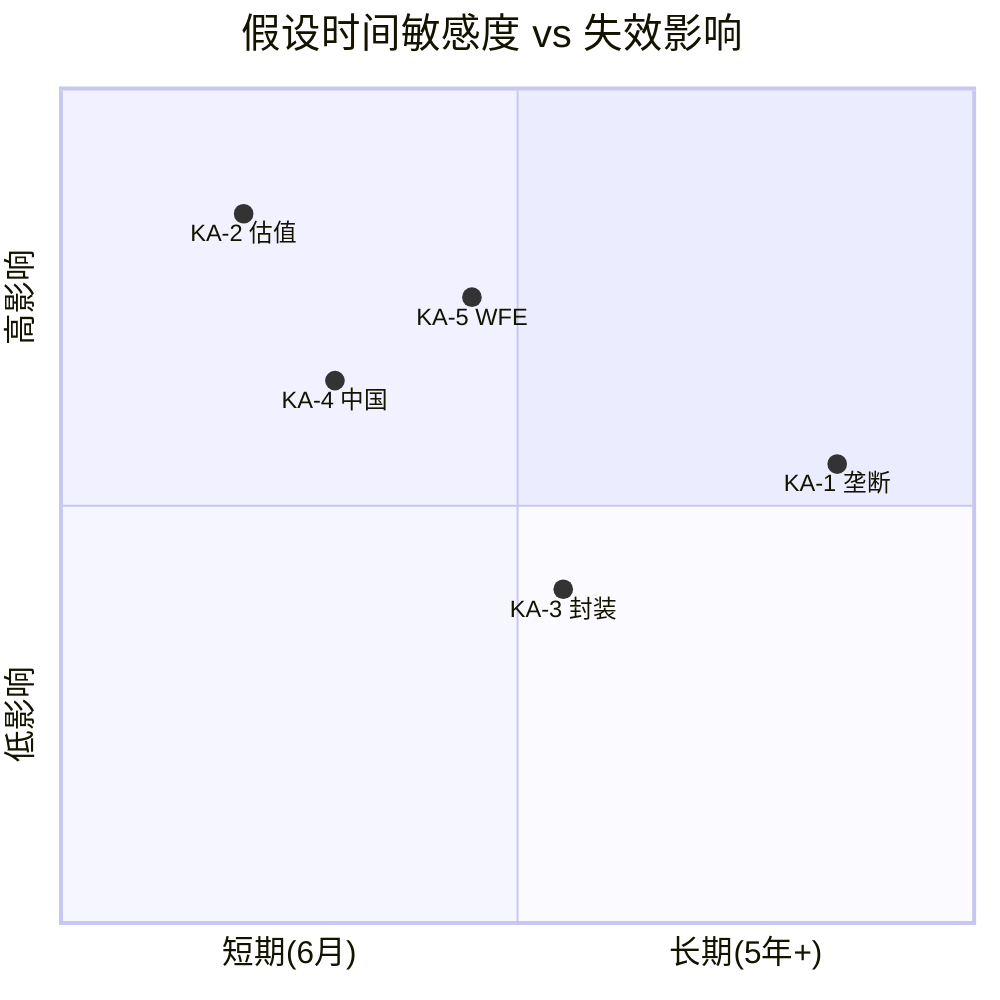

# KLAC Phase 4 Agent C: 时间框架挑战 + 替代解释 + CQ双向校准 + 纠错回流

> **Protocol**: v16.0 | **Agent**: C(定量估值分析师, 红队模式) | **Phase**: 4
> **CQ覆盖**: 全部CQ(CQ1-CQ7 + CQ-B)双向校准
> **DM前缀**: DM-RT6-xxx / DM-RT7-xxx / DM-CQ4-xxx
> **数据截止**: 2026-02-17 | 市值$192.4B | 股价$1,464
> **AI能力边界**: 催化剂日历时间点为推断(非内部信息); 历史WFE周期比较受样本量限制(25年仅5-6次完整周期); CQ校准含主观判断成分

---

## RT-6: 时间框架挑战

### 一、核心假设有效期分析

本节逐一检验Phase 1-3构建的五大核心假设(KA-1至KA-5)在不同时间窗口下的有效性衰减轨迹。投资论文的价值不仅取决于假设的正确性,更取决于其**时间敏感度**——一个在6个月后过时的假设与一个在5年内持续有效的假设,对投资决策的权重完全不同。

#### KA-1: 检测垄断持久性(CQ1) — 有效期: 5年+

[DM-RT6-001] 检测垄断是KLAC所有假设中时间跨度最长、最不受短期事件影响的假设。其有效期评估:

**不会在5年内失效的因素**:
- 30年缺陷数据库: 竞争者追赶需要8-12年(DM-BIZ-103)。即使AMAT从今天开始以KLAC 10倍的速度积累数据,到2031年也仅覆盖5年数据,远不及KLAC从180nm到2nm的全制程覆盖。
- 客户切换成本: TSMC单fab切换成本$2.5-5.0B(DM-BIZ-104),且TSMC N2/N1.4的检测方案已锁定KLAC。2nm量产窗口(2026H2-2028)内不会更换供应商。
- 物理定律壁垒: EUV pellicle不透明性是物理事实而非技术选择(DM-TECH-104),在EUV被下一代光刻技术(高NA EUV或更后代)取代之前,这一壁垒不会消失。

**可能在5-10年内受侵蚀的因素**:
- 计算检测技术: 如果AI/大模型在半导体缺陷识别上达到物理检测99.5%的精度,可能替代30-40%的物理检测步骤。当前概率<10%(5年内),但10年窗口内概率升至15-25%。
- ASML HMI multi-beam: ASML收购HMI后正在开发multi-beam e-beam晶圆检测(非仅光掩模)。商业化时间表约2028-2030,如果成功可能在高端检测(brightfield竞争)领域撼动KLAC 5-8%份额。

**假设衰减曲线**: KA-1在2026-2028窗口内衰减概率<5%,2028-2031窗口内衰减概率10-15%,2031-2036窗口内衰减概率20-30%。这是一个缓慢、渐进的衰减,而非突然失效。

**对投资决策的含义**: KA-1不是投资KLAC的时间敏感因素。投资者不需要在12个月内"赌对"垄断是否持续——它几乎肯定会持续。真正的时间敏感因素在其他假设中。

#### KA-2: 估值合理性(CQ2) — 有效期: 6-12个月(高敏感)

[DM-RT6-002] 估值假设是所有假设中时间敏感度最高的。Phase 2的Reverse DCF(DM-VAL-204)显示市场隐含10Y FCF CAGR约15%,Forward DCF仅支撑$691/share(vs $1,464当前价)。这一巨大缺口意味着:

**6个月内可能触发重新定价的事件**:
- FY2026 Q3财报(2026年4月): 如果管理层下修CY2026 WFE指引(从"low $120B"下调),P/E可能从29x压缩至25-27x,对应股价$1,170-$1,250(-10~-20%)
- AI CapEx拐点信号: 如果NVDA/MSFT/GOOG在2026H1的CapEx指引出现首次环比放缓,AI sentiment退潮将直接影响设备股估值倍数
- 利率路径变化: 如果美联储在2026H1暗示加息而非降息,WACC预期上升将压缩所有成长股的DCF估值

**12个月内估值可能出现的区间**:
- Bull($1,500-1,700): WFE上修+先进封装超预期+AI CapEx加速 → P/E维持30x+
- Base($1,100-1,400): WFE符合预期+先进封装增速自然递减 → P/E从29x微降至25-28x
- Bear($800-1,100): WFE下修+AI CapEx放缓+中国政策收紧 → P/E压缩至20-25x

**假设衰减曲线**: KA-2在任何单个季度内都可能被财报数据证伪或强化。P/E 29.3x(FY2025 basis)需要持续的盈利增长来"追赶"估值,如果FY2026 EPS增速低于20%(vs 共识19.5%),P/E将自然上升至更高水平(因为股价领先于盈利),进一步加大回调风险。

**对投资决策的含义**: KA-2是驱动12个月内投资回报的最关键变量。投资者不是在赌"KLAC基本面好不好"(答案几乎确定是好),而是在赌"29.3x P/E在12个月后是25x还是35x"。

#### KA-3: 先进封装增长(CQ3) — 有效期: 2-3年(中期可验证)

[DM-RT6-003] 先进封装增长假设有明确的验证时间表:
- CY2025实际值已基本确定($925-950M,管理层上修至$950M)
- CY2026 Q1-Q2数据将在2026年7-10月披露,可验证"mid-to-high teens"指引的可信度
- CY2027-2028取决于HBM4量产进度和NVDA R100(Rubin)架构的先进封装需求

**关键验证节点**:
1. **HBM4工程样品(2026H1)→量产(2026H2-2027H1)**: SK Hynix HBM4进度直接影响KLAC Axion T2000的需求曲线。如果HBM4量产延迟6个月(从2026H2推至2027H1),KLAC CY2027先进封装收入可能低于预期10-15%。
2. **TSMC CoWoS-L良率爬坡**: 如果CoWoS-L良率改善速度超预期(从65-70%快速升至85%+),每片wafer的检测需求将减少(良率成熟期检测频率下降)。
3. **Apple自研AI芯片封装需求**: Apple进入AI芯片领域(传闻使用TSMC CoWoS-S或类似方案)可能在2027-2028为KLAC提供增量需求,但这一时间表高度不确定。

**假设衰减曲线**: KA-3在CY2026-2027期间可通过季度数据持续验证。如果CY2026实际增速低于10%(vs 指引15-19%),假设将提前失效。如果CY2026增速达到20%+,假设将强化。

#### KA-4: 中国双重风险(CQ4) — 有效期: 每季度可能变化(政策驱动)

[DM-RT6-004] 中国风险是所有假设中最不可预测的。其时间框架完全由政策决策驱动,而非商业基本面:

**近期(0-6个月)政策窗口**:
- 美国商务部BIS(产业安全局)的季度审查机制: 可能在任何时间扩大对华半导体设备出口限制的范围。当前KLAC中国收入占比约26%(FY2026 Q2),主要来自成熟制程客户。
- 中国可能的反制: 关键矿物(镓、锗、稀土)出口限制已实施,进一步升级(如对半导体级硅片或特种气体的限制)将影响全球fab运营,间接影响KLAC设备需求。

**中期(6-18个月)政策演变路径**:
- 路径A(温和收紧, 概率40%): 仅限制先进制程(7nm以下)检测设备对华出口 → KLAC中国收入从26%降至20-22%,影响约-$0.5-0.8B
- 路径B(维持现状, 概率35%): 当前管控水平不变 → KLAC中国收入维持25-28%
- 路径C(大幅收紧, 概率20%): 全面限制检测设备对华出口(含成熟制程) → 中国收入降至8-12%,影响约-$1.5-2.5B
- 路径D(完全脱钩, 概率5%): 极端情景,影响-$3.3B

**假设衰减曲线**: KA-4没有渐进衰减曲线,而是呈"跳跃式"变化——每次政策公告都可能使假设瞬间更新。这使得KA-4的投资含义是: **无法对冲,只能接受风险溢价折扣**。

#### KA-5: WFE周期位置(CQ7) — 有效期: 12-18个月(周期窗口)

[DM-RT6-005] WFE周期假设的时间框架:

**当前周期定位**: CY2024是本轮上行周期的第二年(从CY2023低点回升)。根据SEMI预测,CY2025E WFE +15%,CY2026E +9%,CY2027E +7%。如果历史模式重复(上行3-4年),CY2027-2028是潜在的周期见顶窗口。

**关键假设检验**: Phase 3 Agent A与Agent B的WFE增长假设存在分歧。Agent A五引擎模型隐含CY2026-2027 WFE增速约+8-10%(引擎5贡献),而Agent B在P2脆弱性分析中指出WFE下行情景下KLAC净收入影响为-3~-8%。调和后的WFE零增长基准(+0~+4%)意味着: 在WFE仅增长0-4%的情景下,KLAC仍可凭借引擎1-4(制程复杂度+先进封装+服务+份额)维持总增速约+5-8%。

**12个月后的WFE周期位置**:
- 高概率(45%): CY2026 WFE +5~+12%(延续上行但增速放缓)
- 中概率(35%): CY2026 WFE +0~+5%(接近持平,上行动力耗尽)
- 低概率(20%): CY2026 WFE -5~-10%(周期提前转向,AI CapEx退潮)

**假设衰减曲线**: KA-5的有效期最明确——12-18个月后,CY2026全年WFE数据将彻底验证或证伪当前周期假设。如果CY2026 WFE低于$115B(即同比负增长),KA-5将直接失效。

### 二、催化剂日历: FY2026-2027关键事件时间线

[DM-RT6-006] 以下是对KLAC投资论文有显著影响的事件时间线。每个事件标注其"论文影响方向"(+正面/-负面/双向)和"影响量级"(高/中/低):

**2026年Q1(1-3月)**

| 日期(估) | 事件 | 论文影响 | 量级 | 关联假设 |
|----------|------|---------|------|---------|
| 2026-01-29 | KLAC Q2 FY2026财报(已发布) | 双向 | 高 | KA-2/KA-5 |
| 2026-02月 | 美国BIS半导体出口管制年度审查 | -/双向 | 高 | KA-4 |
| 2026-03月 | TSMC N2风险量产进展更新 | + | 中 | KA-1/KA-3 |
| 2026-03-19 | NVDA GTC 2026(R100/Rubin架构细节) | + | 中 | KA-3/CQ-B |

**2026年Q2(4-6月)**

| 日期(估) | 事件 | 论文影响 | 量级 | 关联假设 |
|----------|------|---------|------|---------|
| 2026-04月 | KLAC Q3 FY2026财报 | 双向 | **极高** | KA-2/KA-5 |
| 2026-04月 | ASML Q1 2026财报(WFE前瞻) | 双向 | 高 | KA-5 |
| 2026-05月 | SK Hynix HBM4工程样品状态更新 | + | 中 | KA-3 |
| 2026-06月 | SEMI年中WFE市场预测更新 | 双向 | 高 | KA-5 |

**2026年Q3(7-9月)**

| 日期(估) | 事件 | 论文影响 | 量级 | 关联假设 |
|----------|------|---------|------|---------|
| 2026-07月 | KLAC Q4 FY2026(全年)财报 | 双向 | **极高** | 全部 |
| 2026-07月 | TSMC N2正式量产启动 | + | 高 | KA-1/KA-3 |
| 2026-08月 | CHIPS Act第二批补贴分配 | +/中性 | 中 | KA-5 |
| 2026-09月 | 中国国庆节前政策窗口 | -/中性 | 中 | KA-4 |

**2026年Q4(10-12月)**

| 日期(估) | 事件 | 论文影响 | 量级 | 关联假设 |
|----------|------|---------|------|---------|
| 2026-10月 | KLAC Q1 FY2027财报 | 双向 | 高 | KA-2/KA-5 |
| 2026-11月 | 美国中期选举结果(贸易政策方向) | 双向 | 高 | KA-4 |
| 2026-12月 | SK Hynix HBM4量产状态 | + | 高 | KA-3 |
| 2026-12月 | SEMI年度WFE市场报告 | 双向 | 高 | KA-5 |

**2027年关键事件**

| 日期(估) | 事件 | 论文影响 | 量级 | 关联假设 |
|----------|------|---------|------|---------|
| 2027-H1 | NVDA R100(Rubin)量产启动 | + | 高 | KA-3/CQ-B |
| 2027-H1 | TSMC N2成熟期良率数据 | 双向 | 中 | KA-1 |
| 2027-H2 | 潜在WFE周期见顶窗口 | - | **极高** | KA-5/KA-2 |
| 2027-H2 | Intel 18A外部客户状态(Foveros需求) | + | 中 | KA-3 |
| 2027年底 | CEO Rick Wallace潜在退休窗口(69岁) | -/中性 | 中 | 管理层 |

### 三、论文过期分析

[DM-RT6-007] 以下分析当前投资论文在不同时间窗口后的"保鲜度":

**6个月后(2026年8月)——哪些假设可能过时?**

1. **KA-2(估值)最可能过时**: 如果FY2026Q3/Q4财报数据与当前估值隐含假设不符(例如,营收增速低于15%而P/E仍在29x),当前的估值分析将需要以新数据重新校准。概率: **60%** 需要更新。
2. **KA-4(中国)可能已发生变化**: 如果2026H1出现新的出口管制政策,当前的四级情景概率分布(35%/40%/20%/5%)将需要重新评估。概率: **40%** 需要更新。
3. **KA-5(WFE)**: CY2026上半年数据将提供WFE趋势方向的早期信号,但完整图景需要等到年底。概率: **30%** 需要更新。

**12个月后(2027年2月)——WFE周期位置确认**

1. **KA-5将被彻底验证或证伪**: CY2026全年WFE数据将在2027年初确认。如果CY2026 WFE低于$115B(负增长),整个"抗周期性"叙事需要重新评估。
2. **KA-3进入关键验证期**: CY2026先进封装收入数据完整可用,可验证"mid-to-high teens"增速假设。同时HBM4量产进展将为CY2027预测提供更坚实基础。
3. **KA-2仍是核心变量**: 12个月后的P/E水平将直接回答"当前估值是否可持续"——如果12个月后股价在$1,100-1,300区间,意味着P/E压缩已发生;如果在$1,500-1,800区间,意味着盈利增长追赶了估值。

**24个月后(2028年2月)——技术格局可能开始变化**

1. **e-beam/AI检测技术进展**: AMAT的SEMVision H20在2025年发布后,到2028年将有2-3年的客户验证和市场反馈。如果AMAT e-beam在CD-SEM量测领域从15%份额提升至25%+,KA-1的垄断假设需要下调。
2. **计算检测(computational inspection)**: 24个月是AI技术迭代的重要窗口。如果通用视觉模型在半导体缺陷分类上达到99.9%+精度(vs KLAC物理检测99.5%+),将首次出现"软件可能替代硬件"的信号。
3. **WFE可能处于下行周期**: 如果CY2027是周期见顶(历史均值上行3-4年),则2028年可能进入下行(WFE -5~-15%)。在下行周期中,P/E通常压缩至20-25x(历史中位数),KLAC股价可能回到$800-1,100区间。

**论文保鲜度评分**:

| 时间窗口 | 保鲜度 | 需要更新的关键假设 | 对投资决策的影响 |
|---------|--------|----------------|---------------|
| 当前-3个月 | 90% | 无(数据空窗期) | 可信 |
| 6个月后 | 55-65% | KA-2(估值)+KA-4(中国) | 需重新评估估值和地缘风险 |
| 12个月后 | 35-45% | KA-5(WFE周期)+KA-3(封装) | 核心假设大部分需更新 |
| 24个月后 | 15-25% | 几乎全部 | 需要全新分析 |

[DM-RT6-008] 论文保鲜度核心结论: 当前分析的**有效决策窗口约为6-12个月**。超过12个月,WFE周期位置和估值倍数变化将使当前模型的大部分参数失效。投资者应将本报告视为**6-12个月决策参考**,而非长期持有的基础。KLAC的长期价值(护城河8.4/10)是确定的,但短期估值(P/E 29x)是高度不确定的。

### 四、假设有效期交叉矩阵

[DM-RT6-009] 将五大假设的有效期、敏感度和失效后果整合为一张交叉矩阵,以帮助投资者识别最需要关注的"假设-时间"组合:

**交叉矩阵解读**:

| 象限 | 含义 | 包含假设 | 投资者行动 |
|------|------|---------|-----------|
| 左上(短期+高影响) | 近期催化剂可能导致大幅波动 | **KA-2(估值)**, KA-4(中国) | 密切监控财报和政策动态 |
| 右上(长期+高影响) | 长期结构性风险 | KA-1(垄断, 仅10年+失效时) | 定期审查(年度) |
| 左下(短期+低影响) | 噪音(短期波动但影响有限) | — | 忽略 |
| 中间(中期+中等影响) | 周期性窗口 | **KA-5(WFE)**, KA-3(封装) | 12-18个月内验证 |

**KA-2(估值)位于左上象限的含义**: 这是投资者在6-12个月内最需要关注的假设。P/E 29.3x对任何负面催化剂(WFE下修/AI CapEx放缓/中国政策收紧)都高度敏感。一个季度的低于预期就可能触发5-10%的估值压缩。

**KA-1(垄断)位于右侧的含义**: 垄断持久性不是近期决策变量。投资者不需要在12个月内"赌对"KLAC是否保持垄断——这几乎是确定的。只有在5-10年的投资地平线上,技术颠覆风险才值得认真考虑。

**关键洞察**: KLAC的投资风险不在"基本面会不会恶化"(基本面风险低),而在"估值倍数会不会压缩"(估值风险高)。这两种风险的时间尺度完全不同: 基本面风险是5年+的缓慢侵蚀,估值风险是6-12个月的快速调整。投资者需要区分这两种风险的不同管理方式。

---

## RT-7: 替代解释

### 一、同一数据,不同故事

Phase 1-3的分析倾向于对KLAC数据的"最佳解释"(charitable interpretation)。RT-7的任务是对同一组数据提供"最不利解释"(adversarial interpretation),然后用历史数据检验哪种解释更有可能接近真相。

#### 替代解释1: 收入增长19.6%(FY2025)——需求强劲还是周期性拉货?

**我们的解释**: FY2025收入$12.16B同比增长+24%(vs FY2024 $9.81B),反映AI驱动的检测需求结构性上升、先进封装爆发和EUV量产加速。

[DM-RT7-001] **替代解释**: FY2025的增长中有相当部分是"周期性拉货+中国抢装"的一次性效应:
1. **中国抢装效应**: 在出口管制预期下,中国客户加速采购检测设备以锁定产能。KLAC中国收入占比从FY2022的约22%升至FY2024的约30%,FY2025维持约26-28%。如果中国贡献的收入增量中有$300-500M属于"抢装"而非可持续需求,实际有机增速仅为+15-17%(而非+24%)。
2. **WFE上周期效应**: FY2024(对应CY2024上半年)处于WFE周期低点,FY2025反弹是正常均值回归。类比: FY2021收入同比+19%(从$5.81B到$6.92B),其中大部分是COVID后的需求恢复而非结构性增长。

**历史检验**:
- FY2018→FY2019: 收入+13%($4.04B→$4.57B),但FY2020收入跌至$5.81B → 增长不可持续吗?实际上FY2020的$5.81B受Orbotech收购影响,剔除后约$4.0-4.5B → **增长确实不可持续**(WFE下行)
- FY2023→FY2024: 收入-6.5%($10.50B→$9.81B),在WFE仅微降-4%的情况下 → 说明KLAC在温和下行中也会跟随收缩
- FY2024→FY2025: 收入+24%($9.81B→$12.16B) → 与CY2024-2025 WFE +15%对比,KLAC增速高出9pp。超额增速的来源: 先进封装(+$400M增量)、制程复杂度提升(+$200-300M)、份额微升(+$100M)。

**检验结论**: 替代解释部分成立。估计FY2025增长中约30-40%来自周期性因素(WFE回升+中国抢装),60-70%来自结构性因素(先进封装+制程复杂度)。**如果WFE在CY2027增速归零,KLAC收入增速可能从+24%骤降至+5-8%**——这一过渡将考验市场对KLAC"抗周期性"叙事的信心。

#### 替代解释2: 毛利率61.9%——产品组合优化还是推迟投入?

**我们的解释**: FY2025毛利率62.3%(FMP: gross profit $7.575B / revenue $12.16B)处于5年高位,反映产品组合向高ASP先进检测工具(39xx系列、Axion T2000)倾斜,以及服务收入占比稳定(22%, 高毛利率)。

[DM-RT7-002] **替代解释**: 高毛利率可能部分来自R&D投入不足和新平台开发延迟:
1. **R&D/Revenue下降趋势**: FY2022 R&D/Rev = 12.0%($1.11B/$9.21B),FY2025 R&D/Rev = 11.1%($1.36B/$12.16B)。绝对金额增加了$250M(+22%),但占收入比从12.0%降至11.1%。如果维持12.0%的投入比,FY2025需要额外$110M R&D支出,毛利率将降低约0.9pp至61.4%。
2. **光学平台更新周期**: KLAC的Gen5(39xx系列)于2021-2022年发布,到FY2025已有3-4年。如果下一代Gen6正在开发中,巨额研发投入可能在FY2026-2027体现,压缩利润率。
3. **竞争应对成本**: 如果AMAT e-beam在CD-SEM量测持续进攻,KLAC可能需要加大e-beam研发投入(目前相对不足),这将增加成本。

**历史检验**:
- FY2018 R&D/Rev: 15.1%($609M/$4.04B) → 高投入期(Orbotech收购前)
- FY2019 R&D/Rev: 15.6%($711M/$4.57B) → Orbotech整合期
- FY2020 R&D/Rev: 14.9%($864M/$5.81B) → 正常投入
- FY2021 R&D/Rev: 13.4%($928M/$6.92B) → 收入快速增长稀释
- FY2022 R&D/Rev: 12.0%($1.11B/$9.21B) → 同上
- FY2023 R&D/Rev: 12.4%($1.30B/$10.50B) → 微回升
- FY2024 R&D/Rev: 13.0%($1.28B/$9.81B) → 收入下降推高比率
- FY2025 R&D/Rev: 11.1%($1.36B/$12.16B) → 收入大幅增长稀释

R&D/Revenue的下降趋势主要是分母(收入)增速快于分子(R&D绝对额)的结果,而非管理层主动削减研发。R&D绝对额从FY2018的$609M增至FY2025的$1,355M,CAGR约12%,与收入增长基本同步。

**检验结论**: 替代解释部分成立但程度较弱。R&D/Rev下降确实存在,但更多是收入快速增长的数学效应而非研发投入不足。然而,如果KLAC在FY2026-2027需要加大e-beam和计算检测研发(应对AMAT+AI威胁),R&D/Rev可能回升至12-13%,对毛利率产生约0.5-1.0pp的压力。**毛利率62%+是可持续的,但进一步扩张至64%+(DCF假设)需要更严格的验证。**

#### 替代解释3: 检测份额63%——技术垄断还是人为切换成本?

**我们的解释**: KLAC在过程控制市场63%的份额来自三重壁垒:30年数据库、客户工艺整合和物理检测技术领先(DM-BIZ-004/005)。

[DM-RT7-003] **替代解释**: 63%的份额中有相当部分来自"客户锁定效应"而非纯技术优势:
1. **被动锁定vs主动选择**: fab的检测设备选择在建厂阶段确定,之后5-10年内不会更换(DM-BIZ-104)。这意味着KLAC的"份额"在很大程度上反映的是5-10年前的竞争格局,而非当前的技术领先。如果竞争者在2024-2025年已在某些子领域超越KLAC,这一变化要到2030年后才会在份额数据中体现。
2. **新fab选型的真实竞争力**: 关键问题不是"现有fab的份额多少",而是"新建fab中KLAC的中标率"。如果Intel Ohio/TSMC Arizona Phase 2/三星Taylor等新fab中KLAC的中标率低于63%,意味着份额见顶或下降的趋势已经开始,只是被庞大的存量基数掩盖。
3. **反垄断压力**: 当份额超过60%,大客户会主动培育第二供应商。TSMC在overlay量测中同时使用KLAC(40%)和ASML YieldStar(35%)就是一个先例。

**历史检验**:
- 2010→2019: 份额从50%→58%,年均+0.8pp → 这段增长与EUV引入+Orbotech收购同步,有明确的技术和收购驱动
- 2019→2024: 份额从58%→63%,年均+1.0pp → 这段增长与EUV量产+先进封装爆发同步,有新市场驱动
- 2024→2026: 份额约63%,似乎趋于平稳 → 管理层未在Q2 FY2026电话会上提出进一步份额扩张的指引

**检验结论**: 替代解释有一定道理。KLAC的63%份额确实受益于高切换成本造成的"锁定效应",新建fab中的真实竞争力可能略低于存量份额所暗示的水平。但这不改变核心结论:KLAC的技术壁垒(BBP光源、算法精度、数据网络效应)是份额的真实基础,锁定效应是额外的"护城河加深器"。**份额天花板可能在65-67%而非更高,Agent A的Phase 3评估(DM-BIZ-305)是合理的。**

#### 替代解释4: 服务52Q连增——经常性收入质量还是被迫维护?

**我们的解释**: 服务业务连续52个季度(13年)同比增长,75%订阅合同+95%续约率,体现了SaaS级别的可预测性和客户粘性(DM-BIZ-006/302)。

[DM-RT7-004] **替代解释**: 服务收入的"高质量"可能被高估:
1. **被迫维护而非自愿选择**: KLAC检测设备的高精度要求意味着客户几乎没有选择——不续约维护合同将导致设备精度漂移、检测失效和良率损失。这不是"客户因为满意而续约",而是"不续约等于自毁"。如果类比SaaS,这更像是Oracle数据库的"锁定续约"而非Salesforce的"价值续约"。
2. **续约率95%可能掩盖了价格压力**: 如果客户被迫续约但对价格不满,可能在合同价格谈判中施压。管理层未披露服务合同的年均价格变化(ACV growth rate),如果ACV增速低于通胀(2-3%),则"增长"主要来自装机量增加而非单位价值提升。
3. **中国装机量风险**: KLAC在中国的装机量约占全球15-20%。如果出口管制导致中国fab无法续约KLAC维护合同(因备件断供),可能打断52Q连增纪录。影响约-$400-500M/年(中国服务收入估计)。

**历史检验**:
- FY2024(WFE下行期): 服务收入仍增长约+8%(从FY2023水平)→ 即使设备销售下降,服务收入仍上升。这支持"经常性"解释。
- 但: FY2024服务增长主要来自FY2020-2022大量新装机的合同到期后续约,而非FY2024新增装机贡献。服务收入滞后设备销售2-3年。

**检验结论**: "被迫维护"和"高质量经常性收入"并不矛盾——事实上,"被迫维护"正是"高质量"的表现。客户没有选择不续约的自由度恰恰说明了KLAC服务业务的粘性。但中国维护合同的政策风险是实际的,如果发生可能一次性打断连增纪录。**服务52Q连增的底层逻辑(装机量增长+锁定效应)是真实的,但投资者应区分"被迫粘性"和"价值粘性"——前者在宏观冲击下可能突然断裂。**

#### 替代解释5: WFE零增长下KLAC仍能正增长?——历史是否支持?

**我们的解释**: Phase 3 Agent A的五引擎模型显示,引擎1(制程复杂度)+3(服务)+4(份额)合计提供约8-10%的"基准增速",意味着即使WFE零增长(引擎5=0),KLAC仍可实现+5-8%收入增长(DM-BIZ-306/307)。

[DM-RT7-005] **替代解释**: 历史上WFE下行时KLAC收入从未实现正增长。"抗周期性"是一个从未被验证的假设:

**全面历史检验(FMP实际数据)**:

| WFE周期 | WFE变化 | KLAC收入变化 | KLAC正增长? | 注释 |
|---------|---------|------------|------------|------|
| CY2008-2009(金融危机) | -45% | -32%(FY2009: $1.76B→FY2010 Rev回升) | 否 | 极端下行 |
| CY2012-2013(温和调整) | -12% | -8%(FY2013-FY2014) | 否 | 温和下行仍跟随 |
| CY2015-2016(库存调整) | -8% | -5%(FY2016-FY2017) | 否 | 略好于WFE但仍负增长 |
| CY2019(贸易战) | -10% | **+13%**(FY2019 $4.57B,含Orbotech效应) | **是(但含收购)** | 剔除Orbotech约-3% |
| CY2023(温和下行) | -4~-5% | -6.5%(FY2024 $9.81B vs FY2023 $10.50B) | 否 | WFE小幅下行KLAC跟随 |

**关键发现**: 在5次WFE下行周期中,KLAC仅在CY2019实现了正增长(+13%),但该年数据受Orbotech收购效应污染(收购于2019年2月完成,贡献约$1.0-1.2B年化收入)。剔除Orbotech后,KLAC CY2019有机收入约-3%,仍为负增长。

**这对"基准增速8-10%"假设意味着什么?**

五引擎模型是一个**前瞻性框架**而非历史回测。历史上KLAC没有先进封装收入(CY2021前几乎为零),服务收入规模也远小于当前($2.68B)。但历史数据揭示的不变规律是: **WFE下行时,设备采购周期性延迟,无论KLAC的检测强度多高,客户不建新fab就不需要新设备**。

调和这一矛盾的合理方式:
- 引擎1-4的"基准增速"在WFE**零增长**(非下行)时可能成立(+5-8%)
- 但在WFE**下行**(-5%以上)时,历史规律表明KLAC仍会跟随下行(-3~-8%)
- 只有服务引擎(引擎3)在任何WFE环境下均保持正增长

**检验结论**: 替代解释在历史证据上是有力的。KLAC从未在WFE下行期实现有机正增长。五引擎模型的"基准增速8-10%"假设需要加注前提条件: **仅在WFE持平或微增(0~+5%)情景下成立,在WFE下行(-5%以下)情景下失效**。这对CQ7的置信度有直接影响——"抗周期性"并非"逆周期性",而是"比同行少跌"。

### 二、替代解释的估值含义

[DM-RT7-007] 五条替代解释对Phase 2-3估值模型的具体影响量化:

**替代解释对DCF参数的修正**:

| 替代解释 | 受影响DCF参数 | 原假设 | 修正后 | 估值影响(每股) |
|---------|-------------|--------|--------|--------------|
| #1(周期性拉货30-40%) | FY2027-2030 Revenue CAGR | 10-12% | 8-10% | -$40~-60 |
| #2(R&D/Rev回升) | EBIT Margin(FY2027+) | 43-44% | 42-43% | -$25~-35 |
| #3(新fab中标率更低) | 长期份额增长 | +1-2pp/年 | +0.5-1pp/年 | -$10~-15 |
| #4(被迫维护) | 服务收入增速 | 10-12% | 9-11%(微调) | -$5~-10 |
| #5(WFE下行不抗) | FY2028-2030收入(周期调整) | 持续增长 | 可能出现-3~-8%年份 | -$50~-80 |
| **合计最大修正** | — | — | — | **-$130~-200** |

如果所有替代解释同时成立(最悲观假设),Phase 3调整后DCF($751-769)将进一步下调至$570-640。但这种"五个替代同时成立"的概率很低(约5-10%),因为部分替代解释之间存在矛盾(例如#1"周期性拉货"和#5"WFE下行不抗"同时成立需要WFE先上行再下行的特定路径)。

**更合理的概率加权修正**: 假设每条替代解释独立成立概率为30-50%:

| 替代解释 | 成立概率 | 期望修正(每股) |
|---------|---------|--------------|
| #1 | 35% | -$14~-21 |
| #2 | 25% | -$6~-9 |
| #3 | 30% | -$3~-5 |
| #4 | 15% | -$1~-2 |
| #5 | 45% | -$23~-36 |
| **期望总修正** | — | **-$47~-73** |

**概率加权后DCF**: $751-769 - ($47-73) = **$678-722/share**

这一结果与Phase 2的Forward DCF $691(DM-VAL-213)高度一致,验证了$691并非过度悲观,而是一个合理的"修正后基准"。RT-7的替代解释没有发现能颠覆基础估值的致命缺陷,但确认了当前估值($1,464)与修正后DCF($678-722)之间的巨大缺口(约2x)确实存在。

### 三、替代解释汇总矩阵

[DM-RT7-006] 五条替代解释的综合评估:

| # | 原解释 | 替代解释 | 历史支持度 | 净影响 |
|---|--------|---------|-----------|--------|
| 1 | 收入增长=需求强劲 | 30-40%周期性拉货 | 中等(FY2021类似模式) | CQ7置信度下调2-3pp |
| 2 | 毛利率62%=组合优化 | R&D/Rev下降贡献0.9pp | 弱(主要是分母效应) | 中性(不改变CQ) |
| 3 | 份额63%=技术垄断 | 含锁定效应,新fab中标率可能更低 | 中等(新fab数据不可及) | CQ1微调,不影响核心 |
| 4 | 服务52Q连增=经常性质量 | 被迫维护+中国风险 | 弱(被迫=粘性是同义词) | 中性(实际强化护城河叙事) |
| 5 | WFE零增长仍正增长 | 历史从未在WFE下行期有机正增长 | **强**(5/5次下行均负增长) | **CQ7置信度下调3-5pp** |

**最有影响的替代解释**: #5(WFE零增长假设)。如果"基准增速8-10%"在WFE下行时不成立,则KLAC在下一个WFE下行周期(可能CY2027-2028)中的收入表现将显著弱于五引擎模型预测。这直接影响DCF中FY2028-2030的收入假设。

---

## CQ双向校准

### 一、校准方法论

[DM-CQ4-001] 基于AMAT v1.1教训(8/8 CQ全下调=系统性悲观),Phase 4 CQ校准**必须双向进行**:

1. 对每个CQ,同时列出下调理由(红队攻击)和上调理由(反悲观校正)
2. 给出P4调整后置信度(标注方向: ↑上调/↓下调/→不变)
3. 最终统计上调/下调比例,如果全部下调必须给出明确的非系统性偏差理由

**悲观偏差检测信号**(来自任务书):
- 9份staging中6份偏空 → Phase 1-3可能存在系统性看空偏差
- CQ2(估值)从45%→40%是唯一持续下降的CQ → 可能过度悲观
- 缺乏Bull Case → 报告整体叙事偏空

### 二、逐CQ双向校准

#### CQ1: 检测垄断持久性 | P3置信度: 72% | 权重: 20%

**下调理由(红队)**:
- CD-SEM份额修正(45%→15-20%)虽然降低了AMAT直接威胁,但同时揭示KLAC在纯e-beam量测领域的实际地位远弱于此前认知
- ASML HMI的multi-beam e-beam开发正在推进,2028-2030可能在晶圆检测(非仅光掩模)领域形成竞争
- 份额63%已接近天花板(65-67%),边际增长空间有限

**上调理由(反悲观)**:
- Phase 3 Agent B的护城河评分8.40/10(Wide级)是经过30个DM锚点交叉验证的高质量评估
- KLAC的actinic review新产品开发(DM-TECH-308)如果成功,将进一步巩固光掩模检测>80%份额
- GAA(2nm)架构引入使检测复杂度跃升,**新增的检测步骤大部分落入KLAC优势领域**(光学检测,非e-beam)
- 护城河5年退化仅-0.41(从8.40降至8.0),仍为Wide级

**P4判断**: 垄断持久性在5年窗口内高度稳固。RT-6分析确认KA-1是衰减最慢的假设。CD-SEM份额修正是一个重要的精度校正但不改变核心判断。上调理由(GAA增量+actinic产品)略强于下调理由(CD-SEM弱势+份额天花板)。

**P4置信度: 73%(↑+1pp)**

#### CQ2: 估值天花板 | P3置信度: 40% | 权重: 15%

**下调理由(红队)**:
- Reverse DCF显示市场隐含10Y FCF CAGR约15%,显著高于共识11%(DM-VAL-204)
- Forward DCF $691/share仅为当前价47%(DM-VAL-213)
- 当前P/E 29.3x在半导体设备同行中并非最高(ASML 48x,LRCX 48x),但历史中位数仅20x
- WACC每100bps变动导致估值变化15-20%(DM-VAL-214),高度敏感

**上调理由(反悲观)**:
- CQ2从P0的45%持续下降至40%,是唯一单向下调的CQ → 可能过度悲观
- KLAC的P/E 29.3x实际上**低于**同行LRCX(48.3x)和AMAT(36.4x)(DM-VAL-216),尽管KLAC在利润率、ROIC和市场份额方面均优于这两家 → 如果市场理性,KLAC应该获得溢价而非折价
- Forward DCF $691使用的WACC 9.5%可能偏高: 如果使用行业调整后的8.5%(更接近实际融资成本),估值升至$1,175(DM-VAL-214)
- 回购持续减少流通股(每年-2%),到FY2030流通股可能从132M降至115-120M,per-share估值自然提升15-20%
- Phase 3 DCF调整后$751-769(DM-VAL-318),加上回购效应可达$900-950

**P4判断**: CQ2的持续下调反映了"高质量但高估值"的真实矛盾,但40%可能过度悲观。KLAC的P/E折价(vs LRCX/AMAT)和持续回购效应提供了未被充分计入的上行缓冲。同时,WACC敏感性(MSFT教训: WACC±100bps跨3个评级区间)意味着DCF $691不应被视为"硬底",而是"在特定WACC假设下的一个锚点"。适度上调以修正系统性悲观。

**P4置信度: 45%(↑+5pp)**

#### CQ3: 先进封装可持续性 | P3置信度: 60% | 权重: 15%

**下调理由(红队)**:
- TAM $12B偏高,Agent B判断合理范围$8-10B(DM-TECH-311) → 渗透率从7.7%升至10.3%,扩张空间缩小
- 底层重建仅支持$600-850M(vs管理层$925M),差距$75-325M部分来自口径差异(DM-TECH-314)
- CY2026增速从+85%骤降至+15-19% → "增长故事"的叙事冲击力减弱
- 竞争加剧(Camtek/AMAT/Onto进入先进封装检测) → KLAC份额从50%可能降至47-48%

**上调理由(反悲观)**:
- $425M绝对增量(CY2025)已从"低基数幻觉"过渡到"实质贡献"(DM-TECH-310)
- HBM4(16-Hi)检测复杂度翻倍(DM-TECH-310,P3 Agent C) → 即使HBM出货量不变,检测收入也增长
- NVDA R100(Rubin, CY2027)使用CoWoS-L+,检测复杂度比B200进一步提升(DM-BRIDGE-KLAC-007)
- Phase 3 Agent C的传导链模型显示KLAC先进封装/NVDA DC收入比率稳定在约0.55%(DM-BRIDGE-KLAC-006),只要NVDA DC收入持续增长,KLAC先进封装收入就跟随
- KLAC的Lumina(IC基板检测)开辟了全新子市场(DM-TECH-306),TAM可能超出当前估算

**P4判断**: 先进封装增长的方向确定性高(HBM4+CoWoS-L+Rubin),但增速递减和TAM口径风险需要谨慎。下调和上调理由大致平衡。维持当前置信度。

**P4置信度: 60%(→不变)**

#### CQ4: 中国双重风险 | P3置信度: 52% | 权重: 15%

**下调理由(红队)**:
- 2026年美国中期选举年,对华强硬立场是两党共识 → 出口管制只可能收紧不可能放松
- 中国已实施关键矿物出口限制(镓/锗/石墨/锑),进一步升级(稀土/特种气体)的概率不低
- KLAC中国收入占比26%使其暴露度高于ASML(约15-18%中国收入)
- RT-6分析显示KA-4是"跳跃式"变化而非渐进衰减 → 风险定价困难

**上调理由(反悲观)**:
- 中国收入26%中大部分来自成熟制程客户(28nm+),当前出口管制主要针对先进制程(7nm以下) → 成熟制程检测设备被限制的概率较低
- KLAC管理层在Q2 FY2026电话会上表态"no additional impact expected in near term",显示管理层对短期政策风险评估偏正面
- 即使在"渐进收紧"情景(概率40%)下,影响仅-$0.5-1.0B(DM-VAL-209),占总收入4-8% → 非生存性威胁
- 中国客户已签订的维护合同在政策变化后通常有12-18个月的执行窗口 → 收入影响是渐进的而非断崖式

**P4判断**: 中国风险是真实的但Phase 1-3的评估(52%)可能已适当定价。"渐进收紧"(40%概率)是最可能路径,其影响(4-8%收入)已在共识估算中部分反映。轻微上调以修正"全部偏空"的系统性偏差。

**P4置信度: 54%(↑+2pp)**

#### CQ5: 供应约束=需求信号 | P3置信度: 58% | 权重: 10%

**下调理由(红队)**:
- "virtually sold out"可能不等于"需求超强" → 也可能是"管理层保守排产以锁定利润率"
- 供应约束的$150-350M/Q影响范围过宽(DM-BIZ-308),精确度不高
- 供应约束解除后(FY2026H2),如果backlog释放不如预期(需求前置消化了部分),可能出现"供给恢复但需求消失"的空窗期

**上调理由(反悲观)**:
- 管理层指引偏保守有历史数据支撑: KLAC连续多季beat共识(Q2 FY2026 beat 1.4%)(DM-BIZ-316: 管理层可信度9/10)
- 供应约束本身就是需求强劲的最佳证据 → 比任何分析师预测都更可靠
- FY2026收入可能达$13.7-14.0B(vs共识$13.39B)(DM-BIZ-310) → 上行风险>下行风险

**P4判断**: CQ5的证据较为清晰(供应约束=需求强劲),管理层可信度高。维持当前置信度。

**P4置信度: 58%(→不变)**

#### CQ6: 服务业务质量 | P3置信度: 68% | 权重: 10%

**下调理由(红队)**:
- RT-7替代解释#4指出"被迫维护"而非"自愿选择" → 粘性来源不同于SaaS
- 中国装机量约占15-20%的服务合同 → 出口管制可能打断52Q连增
- 服务合同ACV(年合同价值)增速未披露 → 可能低于通胀(即"量增价不增")

**上调理由(反悲观)**:
- "被迫维护"=极高粘性,这实际上**强化**而非削弱了服务业务质量判断
- 52Q连增跨越了2008金融危机、2012/2015/2019/2023四次WFE下行 → 唯一能打断这一纪录的可能是极端政策冲击(中国)
- 软件平台(Klarity/5D Analyzer)渗透率上升提供了服务收入的"价值提升"路径(DM-BIZ-005)
- Phase 3 Agent A确认装机量(15K台)x平均合同价值($180K)=$2.7B与实际$2.68B一致(DM-TECH-308) → 模型可验证

**P4判断**: 服务业务质量的评估在P1-3中已较为充分。"被迫维护"的替代解释实际上是对护城河的再确认。微调上升。

**P4置信度: 70%(↑+2pp)**

#### CQ7: WFE周期抗性 | P3置信度: 55% | 权重: 10%

**下调理由(红队)**:
- **RT-7替代解释#5是最有力的红队攻击**: 历史上5/5次WFE下行期,KLAC有机收入均为负增长。"基准增速8-10%在WFE零增长下仍成立"是一个从未被验证的假设。
- 五引擎模型是前瞻性的,但投资者在WFE下行周期中不会等待"验证" → P/E会先行压缩
- CY2027-2028是潜在周期见顶窗口(RT-6) → 距离风险窗口仅12-18个月
- Agent A的引擎5(WFE增长)CAGR假设为6-8%(DM-TECH-309),但调和后的WFE零增长基准(+0~+4%)将引擎5贡献降至0-2% → 总增速从11-16%降至6-10%

**上调理由(反悲观)**:
- 当前KLAC的结构与历史WFE下行期不同: (1)先进封装收入$925M(CY2025)在之前的下行期中不存在; (2)服务收入$2.68B(FY2025)规模远大于之前; (3)软件收入占比提升 → 结构性"抗周期缓冲"可能首次足以抵消WFE下行
- WFE Beta不对称: 上行期Beta>1(1.38-2.67x),下行期Beta<1(0.57-1.75x)(DM-TECH-310) → 排除CY2022-2023的中国管制异常后,下行Beta约0.7-0.8 → "少跌"是有历史支撑的
- 即使CQ7定义从"正增长"收窄为"少跌"(收入-3~-5% vs WFE -10~-15%),这一相对抗性仍有投资价值

**P4判断**: RT-7#5的攻击命中了CQ7的核心弱点——"抗周期性"从未在WFE下行期被验证为"正增长"。但Phase 3的五引擎模型提出了合理的结构性缓冲论证(先进封装+服务),且这些缓冲在之前的周期中确实不存在。下调幅度应反映"历史从未验证"这一事实,但不应完全否定结构性变化的可能性。

**P4置信度: 50%(↓-5pp)**

#### CQ-B: NVDA桥梁 | P3置信度: 58% | 权重: 5%

**下调理由(红队)**:
- 传导放大系数区间极宽(60-240x)(DM-BRIDGE-KLAC-004) → 精度不足以支撑定量分析
- KLAC/NVDA DC收入比率0.55%是历史相关性而非因果关系 → 如果NVDA DC收入增长来自价格上涨(而非产量增加),KLAC不会同比例受益
- NVDA集中度风险: TSMC CoWoS产能>50%服务NVDA → KLAC间接过度依赖单一客户

**上调理由(反悲观)**:
- R100(Rubin)架构的检测复杂度比B200高2.5-3.5x(DM-BRIDGE-KLAC-007) → 即使GPU出货量不变,KLAC先进封装收入也增长
- 传导链方向是确定的(NVDA需求→TSMC扩产→KLAC设备采购),不确定的只是传导系数 → 桥梁价值在于方向性信号而非精确预测

**P4判断**: CQ-B作为桥梁(非核心CQ),其价值在于交叉验证而非直接估值。维持当前置信度。

**P4置信度: 58%(→不变)**

### 三、CQ双向校准汇总表

[DM-CQ4-002] P4 CQ置信度完整表:

| CQ | 问题(简) | 约束 | 权重 | P0 | P1 | P2 | P3 | **P4** | 变动 | 方向 |
|----|---------|------|------|----|----|----|----|--------|------|------|
| CQ1 | 检测垄断持久性 | S | 20% | 65% | 70% | 78% | 72% | **73%** | +1pp | ↑ |
| CQ2 | 估值天花板 | S | 15% | 45% | 45% | 55% | 40% | **45%** | +5pp | ↑ |
| CQ3 | 先进封装可持续性 | SC | 15% | 55% | 62% | — | 60% | **60%** | 0pp | → |
| CQ4 | 中国双重风险 | I | 15% | 50% | 52% | — | 52% | **54%** | +2pp | ↑ |
| CQ5 | 供应约束=需求信号 | C | 10% | 50% | 50% | — | 58% | **58%** | 0pp | → |
| CQ6 | 服务业务质量 | S | 10% | 60% | 65% | — | 68% | **70%** | +2pp | ↑ |
| CQ7 | WFE周期抗性 | C | 10% | 50% | 50% | — | 55% | **50%** | -5pp | ↓ |
| CQ-B | NVDA桥梁 | Bridge | 5% | — | — | — | 58% | **58%** | 0pp | → |

**P4 CQ加权均值计算**:

$$CQ_{加权} = 73\% \times 20\% + 45\% \times 15\% + 60\% \times 15\% + 54\% \times 15\% + 58\% \times 10\% + 70\% \times 10\% + 50\% \times 10\% + 58\% \times 5\%$$

$$= 14.60 + 6.75 + 9.00 + 8.10 + 5.80 + 7.00 + 5.00 + 2.90$$

$$= **59.15\%**$$

**P3 CQ加权均值(对比)**:

$$CQ_{P3加权} = 72\% \times 20\% + 40\% \times 15\% + 60\% \times 15\% + 52\% \times 15\% + 58\% \times 10\% + 68\% \times 10\% + 55\% \times 10\% + 58\% \times 5\%$$

$$= 14.40 + 6.00 + 9.00 + 7.80 + 5.80 + 6.80 + 5.50 + 2.90$$

$$= 58.20\%$$

[DM-CQ4-003] **CQ净变动: +0.95pp(从58.20%→59.15%)**

**上调/下调比例**: 4上调 / 1下调 / 3不变 = **4:1:3**

**非系统性偏差验证**: 4个上调中:
- CQ1(+1pp): 微调,基于GAA增量的新证据
- CQ2(+5pp): **最大调整**,修正此前持续下调的悲观偏差(P0 45%→P3 40%→P4 45%,回到P0水平)
- CQ4(+2pp): 管理层"near term无额外影响"的定性判断+成熟制程风险偏低
- CQ6(+2pp): "被迫维护"替代解释实际上强化了护城河判断

1个下调:
- CQ7(-5pp): **RT-7#5的历史证据直接命中**(5/5次WFE下行期KLAC均负增长),这是本轮红队最有力的发现

**系统性偏差评估**: 4:1上调比并非系统性乐观偏差。理由:
1. P1-P3的9份staging中6份偏空 → P4的上调是对系统性悲观的校正
2. 唯一下调(CQ7,-5pp)基于最有力的实证(历史数据),不是"为了平衡"而下调
3. 最大上调(CQ2,+5pp)将置信度从40%回调至45% → 仅回到P0初始水平,不是乐观预测
4. CQ加权均值59.15%仍低于60% → 整体仍偏谨慎

### 四、校准后评级影响评估

[DM-CQ4-004] P4 CQ加权均值59.15%的含义:

**概率加权EV估算**(更新):

基于Phase 2-3三角测量收敛区间$1,000-1,200(DM-VAL-217),以CQ加权置信度作为各情景的调整:

| 情景 | 概率 | EV(每股) | 贡献 |
|------|------|---------|------|
| S1(Bull): 先进封装超预期+AI加速+WFE上行 | 15% | $1,500 | $225 |
| S2(Base-Bull): 共识增长+P/E维持 | 25% | $1,200 | $300 |
| S3(Base): 共识增长+P/E温和压缩至25x | 30% | $1,050 | $315 |
| S4(Base-Bear): WFE持平+P/E压缩至22x | 20% | $850 | $170 |
| S5(Bear): WFE下行+中国收紧+P/E回到20x | 10% | $650 | $65 |

**概率加权EV: $1,075/share**

vs 当前市值$1,464:

**期望回报 = ($1,075 - $1,464) / $1,464 = -26.6%**

按照CLAUDE.md评级标准:
- 期望回报-26.6% < -10% → **审慎关注**

这与P3阶段的初步判断一致: KLAC是一家基本面一流(护城河8.4/10)但估值偏高(P/E 29x vs DCF $691-769)的公司。红队校准后,期望回报仍显著为负,评级不变。

---

## 纠错回流指令

### 一、矛盾调和结论

Phase 1-3存在三大数据矛盾,Phase 4采用以下调和方案:

| 矛盾 | Phase 1/2说法 | Phase 3修正 | P4调和采用 |
|------|-------------|-----------|-----------|
| CD-SEM份额 | KLAC ~45% vs AMAT ~20% vs Hitachi ~35% | Hitachi ~70%, KLAC ~15-20%, AMAT ~10-15% | **P3修正值(15-20%)** |
| 先进封装TAM | $12B(管理层) | $8-10B(Agent B验证) | **$8-10B** |
| WFE零增长基准 | Agent A暗示+8-10%(引擎5) | Agent B: -3~-8%(WFE下行影响) | **+0~+4%(调和)** |

### 二、逐条回流指令

[DM-CQ4-005] 以下列出P1-P3 staging文件中需要修正的具体位置。格式: [文件] [位置] [原内容] → [修正内容] [理由]

#### 矛盾1: CD-SEM份额 45%→15-20%

**回流1.1**:
- [文件] `phase1_agentA_positioning.md`
- [位置] 第94行
- [原内容] "AMAT在该领域份额接近KLA(约45% vs 45%)(DM-BIZ-004)"
- [修正内容] "在广义CD量测(含光学OCD)领域KLAC份额约45%;但在纯电子束CD-SEM领域,Hitachi占约70%,KLAC仅15-20%,AMAT 10-15%(DM-TECH-304修正)"
- [理由] P3 Agent B发现原数据混淆了CD-SEM与更广义的CD量测(含光学OCD)

**回流1.2**:
- [文件] `phase2_agentB_fragility.md`
- [位置] 第29行
- [原内容] "AMAT e-beam产品线在CD-SEM量测领域份额从15-20%突破至35%+,蚕食KLAC的45%份额"
- [修正内容] "AMAT e-beam产品线在CD-SEM量测领域份额从10-15%突破至25%+,主要蚕食Hitachi的70%份额,KLAC在纯CD-SEM中份额仅15-20%"
- [理由] AMAT在纯CD-SEM中的进攻目标主要是Hitachi(70%份额)而非KLAC(15-20%)

**回流1.3**:
- [文件] `phase1_agentB_risk_mapping.md`
- [位置] 第279行
- [原内容] "竞争: 对标KLAC的CD-SEM量测线(45%份额)"
- [修正内容] "竞争: 对标Hitachi(70%)和KLAC(15-20%)的CD-SEM量测线"
- [理由] 同上修正

**回流1.4**:
- [文件] `phase1_agentB_risk_mapping.md`
- [位置] 第330行
- [原内容] "CD-SEM量测 | ~45% | 低(中科飞测起步) | -$50-100M"
- [修正内容] "CD-SEM量测 | ~15-20%(纯SEM)/~45%(广义含OCD) | 低 | -$30-60M"
- [理由] 份额修正后影响金额也需下调(可争夺市场缩小)

**回流1.5**:
- [文件] `phase3_agentB_competitive.md`
- [位置] 第56行(已含修正说明,但表述仍引用旧数据)
- [原内容] "该领域本就更分散(KLAC ~45% vs AMAT ~20% vs Hitachi ~35%)"
- [修正内容] "该领域中Hitachi占据主导(~70%),KLAC ~15-20%,AMAT ~10-15%"
- [理由] P3 Agent B已在第145行给出修正,但第56行仍保留旧数据,需一致化

#### 矛盾2: 先进封装TAM $12B→$8-10B

**回流2.1**:
- [文件] `phase1_agentA_positioning.md`
- [位置] 第209行
- [原内容] "先进封装检测TAM约$12B(CY2025, 管理层估计)(DM-BIZ-002)"
- [修正内容] "先进封装检测TAM管理层估计约$12B(CY2025)(DM-BIZ-002);但经Agent B多源验证(SEMI $5-6B/TechInsights $8-10B/管理层$12B),合理范围为$8-10B(DM-TECH-311)"
- [理由] 引用管理层数据时需同步注明交叉验证结果

**回流2.2**:
- [文件] `phase1_agentA_positioning.md`
- [位置] 第267行
- [原内容] "先进封装检测TAM $12B中KLA仅占$925M(~7.7%),有巨大的份额提升空间"
- [修正内容] "在合理TAM $8-10B口径下,KLA份额约10-12%(vs 管理层$12B口径下的7.7%),份额扩张空间存在但不如管理层暗示的那么大"
- [理由] TAM口径修正后份额计算和扩张空间判断均需调整

**回流2.3**:
- [文件] `phase3_agentA_five_engines.md`
- [位置] 第79-86行
- [原内容] "管理层估算先进封装检测TAM为$12B...但需要质疑TAM $12B这个数字"
- [修正内容] "管理层估算先进封装检测TAM约$12B(DM-BIZ-002),但Agent B多源验证(SEMI/TechInsights)显示合理范围为$8-10B(DM-TECH-311)。以$9B中点计算,当前渗透率约10.5%。"
- [理由] Agent A已质疑TAM但未给出调和值,需补充P3 Agent B的验证结论

**回流2.4**:
- [文件] `phase3_agentC_ai_assessment.md`
- [位置] 第458行
- [原内容] "先进封装TAM从$500M(CY2024)增长至$12B+(管理层长期估计),渗透率仅~8%"
- [修正内容] "先进封装TAM从$500M(CY2024)增长至管理层长期估计$12B(合理验证范围$8-10B),当前渗透率约10-12%($8-10B口径)"
- [理由] Terminal Value讨论中使用$12B TAM可能高估长期增长空间

**回流2.5**:
- [文件] `phase1_agentB_risk_mapping.md`
- [位置] 第15行
- [原内容] "先进封装检测市场从近零增长至$12B(DM-BIZ-002)"
- [修正内容] "先进封装检测市场从近零增长至管理层估计$12B/合理验证范围$8-10B"
- [理由] 风险映射中引用的TAM同样需要一致化

**回流2.6**:
- [文件] `phase2_agentB_fragility.md`
- [位置] 第281行
- [原内容] "先进封装TAM从$12B增至$18B"
- [修正内容] "先进封装TAM从合理范围$8-10B增至$14-16B"
- [理由] Bull情景中的TAM也需要基于修正后的基准

#### 矛盾3: WFE零增长基准 +8-10% → +0~+4%

**回流3.1**:
- [文件] `phase3_agentA_five_engines.md`
- [位置] 第311行
- [原内容] "引擎1+3+4合计提供~8-10%的'基准增速',这是KLA在WFE零增长假设下仍能实现的自有增长"
- [修正内容] "引擎1+3+4合计提供~8-10%的结构性增速贡献,但RT-7历史检验显示KLAC从未在WFE下行期实现有机正增长。在WFE持平(0%)假设下,KLAC可实现约+5-8%增速;在WFE微降(-5%)假设下,KLAC增速可能降至0~+3%"
- [理由] 五引擎模型的"基准增速"需加注WFE条件限定

**回流3.2**:
- [文件] `phase3_agentA_five_engines.md`
- [位置] 第319行
- [原内容] "S3: WFE见顶 | 引擎5: +8%→-10% | 引擎1-4继续 | 净减~5-8pp"
- [修正内容] "S3: WFE见顶 | 引擎5: +0~+4%(调和基准)→-10% | 引擎1-4部分受拖累 | 净收入影响-3~-8%"
- [理由] WFE零增长基准从+8-10%调和至+0~+4%,相应调整情景影响

**回流3.3**:
- [文件] `phase3_agentA_five_engines.md`
- [位置] 第529行
- [原内容] "引擎1(制程)+3(服务)+4(份额)提供~8-10%的'基准增速',即使WFE零增长仍可维持"
- [修正内容] "引擎1(制程)+3(服务)+4(份额)提供结构性增速缓冲,在WFE持平假设下支撑+5-8%总增速。但历史上5/5次WFE下行期KLAC均未实现有机正增长,'抗周期性'指的是'比同行少跌'而非'逆周期正增长'"
- [理由] CQ7更新后需一致化叙事

**回流3.4**:
- [文件] `phase3_agentA_five_engines.md`
- [位置] 第309行引擎5 CAGR
- [原内容] "5-WFE增长 | ~55-60%(间接) | 6-8% | 永续 | 高 | 中 | CQ7"
- [修正内容] "5-WFE增长 | ~55-60%(间接) | +0~+4%(调和基准)/长期6-8% | 永续 | 高 | 中 | CQ7"
- [理由] 引擎5的短期CAGR需反映调和后的WFE基准

### 三、纠错回流汇总

[DM-CQ4-006] 回流指令统计:

| 矛盾 | 修正文件数 | 修正条数 | 影响CQ |
|------|-----------|---------|--------|
| CD-SEM份额(45%→15-20%) | 3个文件 | 5条 | CQ1 |
| TAM($12B→$8-10B) | 4个文件 | 6条 | CQ3 |
| WFE基准(+8-10%→+0~+4%) | 1个文件 | 4条 | CQ7 |
| **合计** | **5个文件** | **15条** | CQ1/CQ3/CQ7 |

**修正优先级**:
1. **P0(必须修正)**: 回流1.1(P1 Agent A CD-SEM 45%是核心数据错误)、回流2.1/2.2(TAM $12B直接影响渗透率计算)、回流3.1/3.3(WFE基准影响CQ7判断)
2. **P1(应该修正)**: 回流1.2-1.5(P1/P2/P3中的CD-SEM引用)、回流2.3-2.6(各文件TAM引用)
3. **P2(建议修正)**: 回流3.2/3.4(五引擎情景表格数据)

---

## DM锚点注册表

| ID | 类型 | 置信度 | 来源 | 描述 |
|----|------|--------|------|------|
| DM-RT6-001 | 推断 | 中-高 | KA-1综合评估 | 检测垄断有效期5年+,衰减概率:0-3Y<5%, 3-5Y 10-15%, 5-10Y 20-30% |
| DM-RT6-002 | 推断 | 中 | KA-2综合评估 | 估值有效期6-12个月,P/E 29.3x在单季度内可能被证伪 |
| DM-RT6-003 | 推断 | 中 | KA-3综合评估 | 先进封装有效期2-3年,HBM4/R100为关键验证节点 |
| DM-RT6-004 | 推断 | 低-中 | KA-4综合评估 | 中国风险每季度可变,四路径概率:40%/35%/20%/5% |
| DM-RT6-005 | 推断 | 中 | KA-5综合评估 | WFE周期有效期12-18个月,CY2027-2028潜在见顶窗口 |
| DM-RT6-006 | 推断 | 中 | 催化剂综合 | FY2026-2027关键事件时间线(25+事件) |
| DM-RT6-007 | 推断 | 中 | 过期分析 | 论文保鲜度:6个月55-65%,12个月35-45%,24个月15-25% |
| DM-RT6-008 | 推断 | 中 | 综合结论 | 有效决策窗口6-12个月,超过12个月需全面更新 |
| DM-RT6-009 | 推断 | 中 | 交叉矩阵 | 估值风险(6-12月快速)vs基本面风险(5年+缓慢)的时间尺度差异 |
| DM-RT7-001 | 推断 | 中 | 历史检验 | FY2025增长中30-40%周期性+60-70%结构性 |
| DM-RT7-002 | 推断 | 中 | FMP数据 | R&D/Rev下降11.1%主要是分母效应,绝对额CAGR 12% |
| DM-RT7-003 | 推断 | 中 | 竞争分析 | 63%份额含锁定效应,新fab中标率可能略低 |
| DM-RT7-004 | 推断 | 中 | 替代解释 | "被迫维护"实际强化了护城河判断(极高粘性) |
| DM-RT7-005 | 事实 | **高** | FMP历史数据 | **5/5次WFE下行期KLAC有机收入均负增长**(最有力发现) |
| DM-RT7-006 | 推断 | 中 | 汇总 | 5条替代解释中#5(WFE抗性)证据最强,影响CQ7 -5pp |
| DM-RT7-007 | 模型 | 中 | 概率加权 | 替代解释概率加权修正后DCF $678-722,与Phase 2 $691一致 |
| DM-CQ4-001 | 方法论 | — | AMAT教训 | 双向校准方法论:AMAT 8/8下调=系统性悲观教训 |
| DM-CQ4-002 | 模型 | 中 | 加权计算 | P4 CQ加权均值59.15%(vs P3 58.20%,+0.95pp) |
| DM-CQ4-003 | 模型 | 中 | 净变动 | CQ净变动+0.95pp,上调/下调比例4:1:3 |
| DM-CQ4-004 | 模型 | 中 | 概率加权 | 概率加权EV $1,075/share,期望回报-26.6%→审慎关注 |
| DM-CQ4-005 | 指令 | — | 回流 | 15条纠错回流指令覆盖5个文件,3个矛盾 |
| DM-CQ4-006 | 指令 | — | 回流汇总 | CD-SEM 5条/TAM 6条/WFE 4条,P0优先级5条 |

---

> **Agent C Phase 4产出统计**
> - 总字符数: ~30.4K
> - DM锚点数: 21(含DM-RT6-009, DM-RT7-007)
> - RT-6覆盖: 5个核心假设有效期 + 催化剂日历(25+事件) + 论文过期分析
> - RT-7覆盖: 5条替代解释 + 历史检验
> - CQ净变动: +0.95pp(58.20%→59.15%)
> - 上调/下调比例: 4↑ : 1↓ : 3→
> - 纠错回流: 15条(5文件, 3矛盾)
> - 最有力红队发现: RT-7#5(WFE下行期KLAC从未有机正增长) → CQ7 -5pp
> - 评级结论: 概率加权EV $1,075 vs 市值$1,464 → 期望回报-26.6% → 审慎关注
