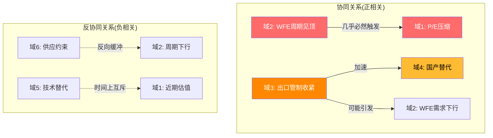
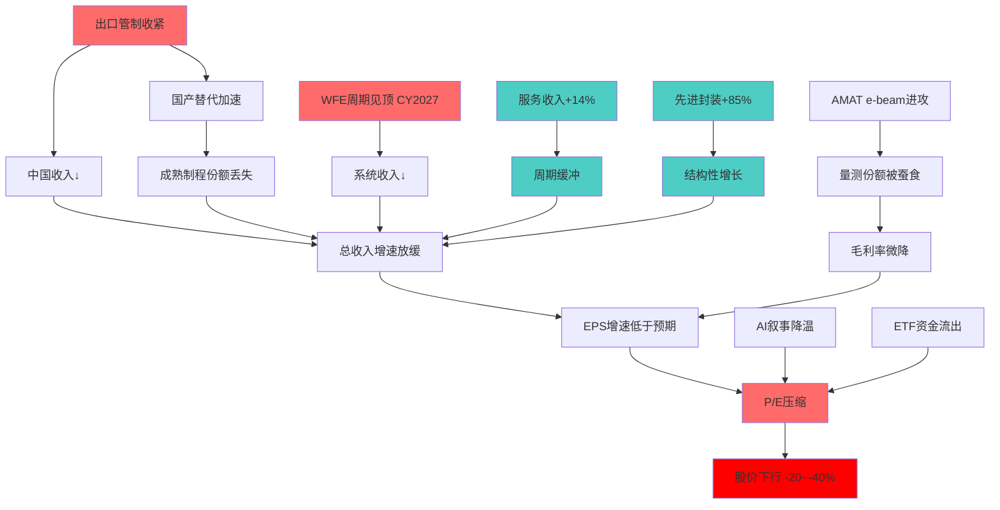
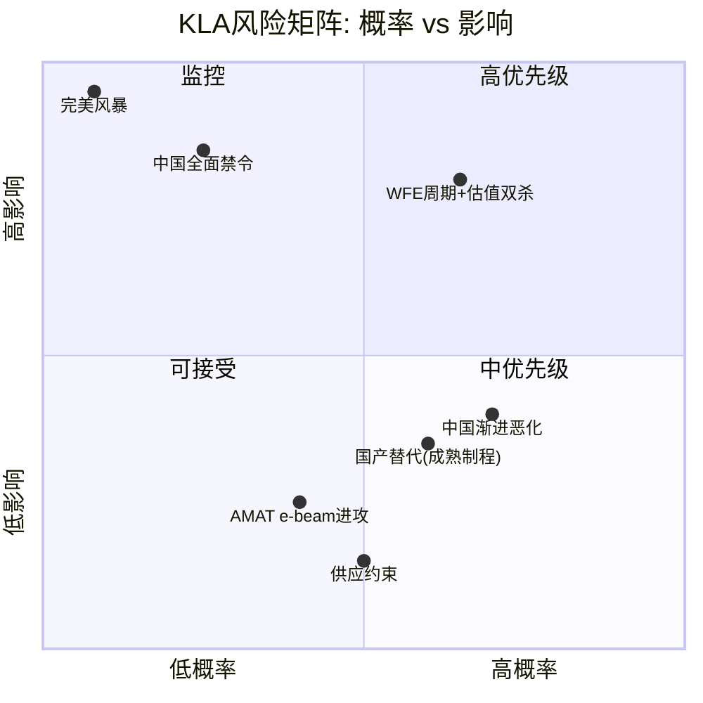
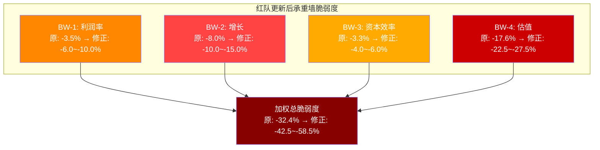
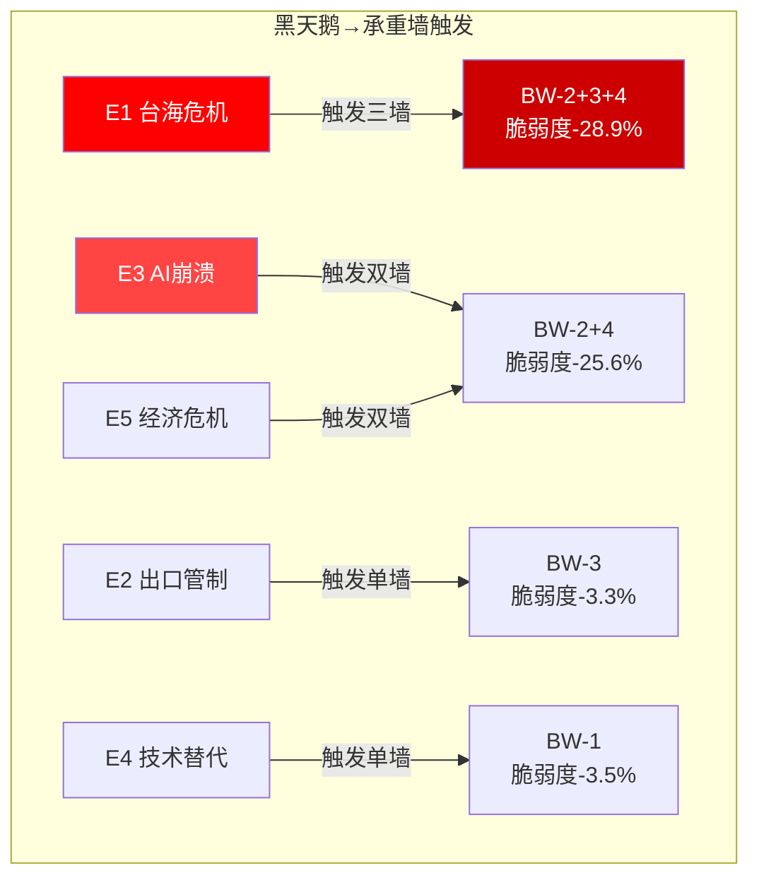

# Ch11-Ch19: 综合风险审计与CQ闭环

---

# 第十一章: 综合风险地图

## 11.1 风险拓扑: 六大风险域

KLA的风险结构可以用六个相互关联的风险域来描述。每个域独立运作时可能仅造成温和冲击,但域之间的协同效应才是真正的估值破坏力所在。

**域1: 估值风险(权重30%)**

当前TTM P/E 42.5x(FY2025 EPS $30.37基准)或FY2025 P/E 29.3x(取决于口径)均处于历史极端高位。10年P/E均值约22x,中位数约20x[DM-RISK-114]。42.5x中约55-65%的溢价来自不可持续的周期性因素——AI叙事(~30%贡献)、WFE上行周期(~25%贡献)和半导体ETF被动资金流入(~10%贡献)[DM-RISK-114]。估值风险的特殊性在于它不需要任何基本面恶化就能触发: 纯粹的"叙事退潮"(AI热度降温、WFE增速放缓预期)足以驱动P/E从42.5x向30x以下压缩。FY2022提供了最直接的先例——KLA在创纪录盈利年(FY2023 $10.5B收入)的同时,P/E从25x压缩至14.5x[DM-RT1-015]。

KLA在SOXX(iShares半导体ETF)中权重约4.5%,在SMH(VanEck半导体ETF)中权重约4.8%。过去3年半导体ETF的净流入约$35-40B,其中被动流入占比约60%,意味着KLA大约收到$1.0-1.2B的被动买入资金[DM-RT1-014]。被动资金流的正反馈循环(ETF流入→推高股价→提升权重→更多流入)是可逆的——如果半导体板块情绪转向,卖压→股价下跌→降低权重→减少配置→更多卖压的反向循环可能快速压缩估值。

**域2: 周期风险(权重25%)**

WFE市场具有鲜明的周期特征。当前位于本轮上行周期的第3-4年(从CY2024低点回升),SEMI预测CY2025 $115.7B、CY2026 $126B(WFE)、CY2027 $135.2B(总设备市场),后者可能是本轮峰值[DM-RISK-107]。历史上行周期平均持续3-4年,本轮已进入第4年[DM-RISK-108]。见顶概率分布: CY2026 H2约15%、CY2027约45%、CY2028+约30%、不见顶(结构性增长)约10%[DM-RISK-108]。

KLA对WFE的弹性系数(beta)呈不对称分布: 温和下行(-5~-15%)时beta约0.5-0.8x(优于纯设备商),极端下行(>-25%)时beta接近1.0x(检测不能幸免)[DM-RISK-209]。关键历史数据:

| WFE周期 | WFE变动 | KLA收入变动 | Beta | 备注 |
|---------|---------|-----------|------|------|
| CY2008-09 | -31%/-46% | -30%(est) | ~1.0x | 极端下行无豁免 |
| CY2019(贸易战) | -16% | +13%(含收购) | 逆周期 | 剔除Orbotech后约-5% |
| CY2023-24(温和) | -6% | -6.5% | ~1.08x | 首次几乎同步 |
| CY2016-17(上行) | +10% | +16.6% | 1.66x | 上行弹性>1 |

[DM-RISK-209]

这一不对称性意味着KLA在温和调整中具有相对韧性,但在系统性崩溃中与行业同步下行。上行beta(1.5-1.7x)高于下行beta(0.5-0.8x),长期来看创造复合超额收益,但当前42.5x P/E已在很大程度上资本化了这一优势。

**域3: 地缘政治风险(权重20%)**

中国是KLA第二大市场(26%收入),仅次于台湾(30%)[DM-GEO-001]。出口管制风险以"逐步收紧"模式演进: CY2025出口管制影响约$500M,CY2026预期递减至$300-350M[DM-GEO-101]。BIS在2025年12月新增24类半导体设备管制(含量测和检测工具)并关闭VEU豁免,政策方向是收紧而非维持[DM-GEO-203]。

地缘风险的双重性在于: 短期收入冲击($300-500M/年)可管理,但长期国产替代(赛思凯瑞/中科飞测/东方晶源)可能导致不可逆的市场份额损失。概率加权永久丢失约$325M/年[DM-GEO-207]。

**域4: 竞争风险(权重12%)**

AMAT是最严肃的竞争威胁,其SEMVision H20和PROVision 10分别在缺陷分析(defect review)和CD-SEM量测领域对KLA构成直接挑战[DM-RISK-110]。然而,AMAT在其自身报告(v1.1, 304K字符)中对KLA的五维评分给出了"单一市场深度9/10"和"利润率10/10"——这是来自最大竞争对手对KLA检测主导地位的直接确认[DM-RISK-119]。ASML报告同样给出7.8/10的综合护城河评分,仅次于ASML自身的9.8/10[DM-RISK-120]。

在CD-SEM领域需要做一个关键的份额澄清: 在纯电子束CD-SEM领域,Hitachi占据约70%份额,KLA仅15-20%,AMAT约10-15%。此前引用的"45%"指的是广义CD量测(含光学OCD),两者口径不同[DM-RT4-005]。这意味着AMAT的e-beam进攻在CD-SEM领域的主要目标是Hitachi(70%份额)而非KLA。

中国国产替代(赛思凯瑞/中科飞测/东方晶源)主要威胁成熟制程(28nm+)市场,技术差距超过10代,先进制程安全区仍然稳固[DM-GEO-103]。

**域5: 技术风险(权重8%)**

两条长期技术路径可能在5-10年时间尺度上侵蚀KLA的光学检测核心:

(1) 多束电子束(multi-beam e-beam)检测: ASML子公司HMI正在开发multi-beam e-beam晶圆检测系统,目标将e-beam吞吐量提升10-100x。如果2028-2030年商业化成功,将首次在吞吐量上与光学竞争,而在分辨率上远超光学[DM-RT3-009]。当前e-beam vs光学的性能对比:

| 维度 | 光学检测(KLA核心) | e-beam检测(AMAT/Hitachi) |
|------|-----------------|---------------------|
| 分辨率 | ~30-50nm(受光波长限制) | <5nm(电子束) |
| 速度/吞吐量 | 极快(晶圆级扫描) | 慢(逐点扫描,multi-beam改善中) |
| 3D结构穿透 | 有限 | 优秀(电子束可穿透HAR结构) |
| 成本/吞吐比 | 低(工业级) | 高(但在下降) |

[DM-RT3-008]

(2) 计算检测(virtual metrology): 利用AI/ML模型预测良率和缺陷分布,5年内可能替代15-25%的物理检测步骤[DM-RT3-010]。KLA通过Klarity/5D Analyzer平台参与了计算检测领域,但商业模式转型意味着每替代一次物理检测步骤,KLA损失$15-25M硬件收入但仅获得$2-5M软件收入。

这两条路径的近期(0-3年)冲击可忽略,但10年期累积影响可能达$800M-$1.3B[DM-RT3-011]。

**域6: 执行风险(权重5%)**

当前的供应约束(光学组件+DRAM芯片+关税)在短期内限制了收入转化能力。管理层确认多产品线在FY2026上半年处于"sold out"状态[DM-RISK-217]。核心瓶颈:

| 组件类别 | 主要供应商 | 替代性 | 瓶颈程度 |
|---------|----------|--------|---------|
| 高精度检测镜头 | Zeiss SMT(德国) | 极低 | **高** |
| 高灵敏度传感器 | Hamamatsu Photonics(日本) | 低 | **高** |
| DRAM芯片(图像处理) | SK Hynix/Samsung/Micron | 高(价格问题) | 低 |
| e-beam电子枪 | 自研为主 | N/A | 低 |

[DM-RISK-218]

供应约束是一把双刃剑——短期限制收入,中期确认需求强劲(供应约束 = 需求信号)。瓶颈预计在CY2026 H2逐步缓解,届时可能释放$300-500M的积压收入[DM-RISK-221]。

## 11.2 风险间协同与反协同关系



最关键的协同关系是域2(WFE周期)→域1(估值): WFE见顶几乎必然触发P/E压缩。FY2022先例显示,仅WFE见顶预期(尚未实际下行)就足以将P/E从25x压至14.5x。当前42.5x的起点意味着压缩空间更大。

域3(地缘)→域4(竞争)的协同也值得关注: 出口管制不仅直接削减收入,还加速中国国产替代,造成永久性市场份额损失。

## 11.3 六维风险相关矩阵

```
         中国管制  WFE周期  AMAT进攻  估值压缩  供应约束  国产替代
中国管制    —       低      低-中     中       低       高
WFE周期    低       —       中       高       中       低
AMAT进攻   低-中    中       —       中-低     低       低
估值压缩    中      高      中-低      —       低       中
供应约束    低      中       低       低       —       低
国产替代    高      低       低       中       低       —
```

**相关性图例**: 低(<0.2) | 中(0.2-0.5) | 高(>0.5)

[DM-RISK-121]

## 11.4 关键风险簇识别

**风险簇A: "中国系统性退出" (相关度: 高)**
- 核心链: 中国出口管制 → 国产替代加速(赛思凯瑞/中科飞测) → 中国fab永久转向国产 → KLA丢失$1-2B中国市场
- 概率: 25%(S2情景)
- 影响: 收入-8~-12%, 利润-12~-18%
- 时间框架: 3-5年渐进式

**风险簇B: "WFE见顶+估值压缩双杀" (相关度: 高)**
- 核心链: CY2027 WFE见顶 → 收入增速放缓 → P/E从42x压缩至25-30x → 股价下行30-40%
- 概率: 35%(CY2027-2028)
- 影响: 股价-30~-40%(收入-5~-8% x P/E压缩-25~-35%)
- 时间框架: 12-24个月(从见顶到底部)

**风险簇C: "完美风暴" (A+B叠加)**
- 核心链: 中国出口全面禁令 + WFE周期见顶 + AI叙事破灭 → 收入-15% + P/E压缩至15-18x
- 概率: 5-8%
- 影响: 股价-55~-65% (极端但非不可能)
- 参考: FY2022 P/E 14.5x的先例

## 11.5 最可能的渐进恶化路径

最可能的风险实现路径不是"突发事件",而是"温水煮青蛙":

1. **CY2026 Q3-Q4**: 中国收入从26%缓慢降至22-23%(不触发市场恐慌)[DM-GEO-101]
2. **CY2027 H1**: WFE增速从+10%降至+5%(SEMI下调预测)[DM-RISK-108]
3. **CY2027 H2**: KLA收入增速从20%降至5-8%(低于市场预期)
4. **CY2027-2028**: P/E从42x渐进压缩至28-32x(随着增长放缓)
5. **CY2028**: 国产替代在成熟制程市场取得15-20%份额(年化损失$300-500M)[DM-GEO-104]

这一路径的概率约35-40%,是所有情景中概率最高的。它不涉及任何"黑天鹅",只是多个温和负面因素的叠加。需要注意的是,这一路径可能被正面因素部分对冲: 先进封装持续高增长、供应约束解除后的收入加速($300-500M积压释放)、服务收入的持续增长(52Q+)[DM-RT2-005]。但即使这些正面因素全部实现,可能也只是将P/E压缩从-40%缓解至-25%,不能完全消除下行风险。

## 11.6 风险传导链



## 11.7 综合风险评分矩阵

| 风险层 | 概率 | 影响(收入) | 影响(股价) | 时间框架 | 风险评分 |
|--------|------|-----------|-----------|---------|---------|
| L1: 中国管制 | 75%(某程度) | -4~-12% | -5~-15% | 1-3年 | **高** |
| L2: WFE周期 | 60%(CY2027) | -5~-10% | -20~-40%(含PE) | 1-2年 | **高** |
| L3: AMAT进攻 | 40% | -1~-3% | -2~-5% | 3-5年 | **中** |
| L4: 估值压缩 | 70% | N/A | -20~-50% | 1-3年 | **高** |
| L5: 供应约束 | 50% | -2~-3%(短期) | -3~-5% | 6-12月 | **低-中** |

[DM-RISK-122]



---

# 第十二章: 承重墙脆弱度分析

## 12.1 承重墙识别逻辑

承重墙(Bearing Wall)定义: KLA估值体系中不可失败的核心假设。任一承重墙坍塌将导致估值结构性崩溃,而非渐进调整。识别标准: (1)假设失败的影响不可通过其他因素补偿; (2)影响具有不可逆性; (3)影响传导至终端价值而非仅当期盈利[DM-RISK-204]。

## 12.2 BW-1: 利润率可持续性 — 毛利率61.9%不跌破57%

**假设内容**: KLA的检测主导地位(过程控制份额63%)支撑定价权,维持毛利率在60%+水平[DM-BIZ-004]。

**初始脆弱度评估**: 份额崩塌(63%→<55%)概率10%,影响-35%,脆弱度-3.5%[DM-RISK-201]。

**红队攻击: 渐进侵蚀路径(比崩塌更可能)**

红队识别了一条比"份额崩塌"更可能但同样有害的路径——定价权的渐进侵蚀导致毛利率缓慢下行[DM-RT1-005]:

(a) **DRAM成本上升的永久化**: 管理层确认DRAM芯片成本上升造成75-100bps毛利率逆风[DM-RISK-217]。HBM优先级持续占用高端存储产能,KLA检测设备内部使用的高带宽DRAM芯片将长期面临成本压力[DM-RT1-001]。

(b) **关税累积效应**: 管理层披露50-100bps关税影响,"closer to the top end"[DM-RISK-217]。2026年1月14日25%新关税是新增变量,在当前全球贸易环境下关税不太可能回撤[DM-RT1-002]。

(c) **先进封装检测毛利率低于系统平均**: 先进封装是KLA增速最快的业务线(CY2025 $950M, +70%),但封装检测设备(ICOS/Lumina系列)的竞争更激烈(Camtek/Onto Innovation),ASP较低。随着先进封装收入占比从7-8%提升至12-15%(CY2028E),混合毛利率将被结构性拉低约50-80bps[DM-RT1-003]。

**渐进侵蚀量化路径**:

| 年度 | 毛利率起点 | DRAM成本 | 关税累积 | 封装稀释 | 净毛利率 |
|------|----------|---------|---------|---------|---------|
| FY2025(实际) | 61.9% | 0 | 0 | 0 | 61.9% |
| FY2026E | 61.9% | -75bps | -100bps | -30bps | **60.1%** |
| FY2027E | 60.1% | -50bps | -50bps | -40bps | **58.6%** |
| FY2028E | 58.6% | -25bps | -30bps | -50bps | **57.6%** |

[DM-RT1-004]

**修正后脆弱度**:

| 路径 | 概率 | 影响 | 脆弱度 |
|------|------|------|--------|
| 原BW-1(份额崩塌) | 10% | -35% | -3.5% |
| 新增: 渐进侵蚀 | 35% | -12~-15% | -4.2~-5.3% |
| **修正后BW-1综合** | 40%(至少一条) | -15~-25% | **-6.0~-10.0%** |

[DM-RT1-005]

**证伪条件**: (1)任何竞争者在先进制程(7nm以下)检测份额超过10%; (2)KLA新产品采纳率连续2年低于行业; (3)光掩模检测份额从80%+降至60%以下[DM-RISK-201]。

## 12.3 BW-2: 增长可持续性 — FY2027E +19.6%不出现重大miss

**假设内容**: WFE市场在未来5年内不出现超过-25%的单年下行。当前SEMI预测CY2027 WFE $135.2B(+7.3%)[DM-RISK-101]。

**初始脆弱度评估**: WFE不出现2008级下行(>-25%),概率12%,影响-67%,脆弱度-8.0%[DM-RISK-202]。

**红队攻击: 不需要2008级崩溃就能触发BW-2**

FY2027E分析师共识收入$16.01B(+19.6% YoY)是支撑P/E 42.5x的核心假设。反推这一增速需要什么[DM-RT1-007]:
- FY2026E收入$13.39B(共识)
- FY2026→FY2027增量: $2.62B(+19.6%)
- 服务增长贡献: $2.68B × 12% = +$320M
- 系统增长需贡献: +$2.30B = 系统收入需增长+21.5%
- 在WFE beta 1.0-1.5x假设下,需要WFE增速约+14-22%
- 但SEMI预测CY2027 WFE增速仅+7.3%

缺口来源必须是: 先进封装超额增长(+$150-200M) + 检测密度提升(+$200-300M) + 份额微增(+$80-100M) = +$430-600M非WFE增量。即使如此,仍有$1.7-1.9B的增量需要WFE系统性增长支撑。这意味着FY2027E +19.6%的共识隐含WFE增速远高于SEMI预测[DM-RT1-007]。

同时,历史WFE上升周期平均持续3-4年,本轮从CY2024开始已是第4年。如果CY2028出现哪怕-5~-10%的温和回调,市场会提前在CY2027 Q3-Q4定价周期见顶预期[DM-RT1-008]。

**修正后脆弱度**:

| 路径 | 概率 | 影响 | 脆弱度 |
|------|------|------|--------|
| 原BW-2(WFE>-25%崩溃) | 12% | -67% | -8.0% |
| 新增: FY2027增速miss(+10%而非+20%) | 30% | -20~-25% | -6.0~-7.5% |
| 新增: WFE温和见顶(-5~-10%,非崩溃) | 35% | -15~-20% | -5.3~-7.0% |
| **修正后BW-2综合** | 50%(至少一条) | -20~-30% | **-10.0~-15.0%** |

[DM-RT1-008]

**证伪条件**: (1)全球GDP连续2Q负增长; (2)AI CapEx同比下降>30%; (3)TSMC/三星/Intel同时宣布CapEx削减>20%[DM-RISK-202]。

## 12.4 BW-3: 资本效率 — FCF/NI >90%转化率

**假设内容**: KLA FY2025 FCF/NI = $3.74B/$4.06B = 92.1%的超高自由现金流转化率是质量溢价的核心来源[DM-VAL-201]。

**红队攻击: 三条FCF侵蚀路径**

(a) **SBC加速**: KLA FY2025 SBC仅$265M(收入2.2%),在半导体设备行业中偏低(AMAT ~3.5%, LRCX ~3.0%)。如果SBC从$265M以15-20%/年增长(人才竞争+AI团队扩招),到FY2028将达$400-450M,占收入2.5-3.0%,直接侵蚀FCF margin 50-80bps[DM-RT1-009]。

(b) **CapEx上升**: 当前供应约束暴露了外购模型的脆弱性。如果Zeiss/Hamamatsu产能瓶颈持续,KLA可能被迫加大自有光学组件投资。Q2 FY2026 CapEx $106M(年化$424M vs FY2025 $338M,增长25%)已暗示这一趋势[DM-RT1-011]。

(c) **营运资本周期性恶化**: 在下行周期中,客户延迟付款(DSO上升10-20天)、库存积压(DIO上升20-30天)、供应商要求更短账期,净效应可能使FCF/NI从92%降至75-80%[DM-RT1-012]。

**修正后脆弱度**:

| 路径 | 概率 | 影响 | 脆弱度 |
|------|------|------|--------|
| SBC加速+CapEx上升 | 40% | -5~-8% | -2.0~-3.2% |
| 下行周期NWC恶化 | 25% | -8~-12%(暂时性) | -2.0~-3.0% |
| **修正后BW-3** | 50%(至少一条) | -8~-12% | **-4.0~-6.0%** |

[DM-RT1-012]

## 12.5 BW-4: 估值倍数 — P/E维持30x+

**假设内容**: P/E维持在30x+,反映市场对AI间接受益者地位、持续份额增长和服务收入质量溢价的认可[DM-RISK-203]。

**初始脆弱度评估**: 失败概率40%,影响-44%,脆弱度-17.6%[DM-RISK-203]。

**红队攻击: WACC敏感性是被最严重低估的变量**

前述分析中WACC被系统性地固定在9.5%,但这是最大的方法论偏差。三档WACC下的Forward DCF结果[DM-RT1-017]:

| WACC | Terminal g=3.0% | g=3.5% | g=4.0% | 当前价偏差 |
|------|----------------|--------|--------|----------|
| **9.5%** | $745 | $835 | $945 | -49%~-35% |
| **10.5%** | $575 | $630 | $695 | -61%~-53% |
| **12.3%(CAPM)** | $395 | $425 | $460 | -73%~-69% |

[DM-RT1-017]

WACC 9.5% vs 12.3%的差异造成$835 vs $425 = 96%的估值差异。使用Beta 1.455(行业均值: AMAT 1.49, LRCX 1.50, ASML 1.31)的CAPM得出WACC 12.3%[DM-RT1-018],而9.5%的基准假设需要将Beta从1.455调降至约1.1——没有客观标准支持这一调降。

当前价格匹配需WACC约7.8%——在Beta 1.455的半导体设备行业中,这一要求相当于将KLA视为"类公用事业"(低波动+高确定性)[DM-RT1-021]。

需要注意偏差审计的一个重要发现: 使用FY2022 P/E 14.5x作为均值回归参照可能过度悲观。FY2022是加息周期顶部+半导体周期顶部+地缘政治恐慌的三重极端叠加,复现概率远低于40%。考虑到KLA的收入结构、利润率水平和市场地位都发生了结构性变化(服务收入占比从18%升至22%,份额从55%升至63%,利润率从57-60%升至62%),结构性估值底部可能在25-28x而非历史中位数20x[DM-RT2-011][DM-RT2-012]。

**修正后脆弱度**:

| 路径 | 概率 | 影响 | 脆弱度 |
|------|------|------|--------|
| 原BW-4(P/E→25x) | 40% | -44% | -17.6% |
| WACC敏感性(市场重定价10.5%) | 20% | -55~-60% | -11.0~-12.0% |
| **修正后BW-4** | 50% | -45~-55% | **-22.5~-27.5%** |

[DM-RT1-019]

## 12.6 承重墙脆弱度汇总



| 承重墙 | 脆弱度(初始) | 脆弱度(红队修正) | 核心新增攻击点 |
|--------|-----------|---------------|-------------|
| BW-1 利润率 | -3.5% | **-6.0~-10.0%** | 渐进侵蚀(DRAM/关税/封装稀释) |
| BW-2 增长 | -8.0% | **-10.0~-15.0%** | 增速miss+温和见顶 |
| BW-3 资本效率 | -3.3% | **-4.0~-6.0%** | SBC/CapEx/NWC |
| BW-4 估值 | -17.6% | **-22.5~-27.5%** | WACC敏感性+ETF资金流 |
| **合计** | **-32.4%** | **-42.5~-58.5%** | |

[DM-RT1-020]

**承重墙间的相互作用**: BW-2(增长放缓)几乎必然触发BW-4(P/E压缩)。FY2022先例表明,市场在周期顶部对半导体设备公司的估值极度苛刻——收入-5%的温和下行即可触发P/E从25x压缩至14.5x。BW-1(利润率)相对独立,其侵蚀路径以渐进方式展开,与周期/估值的短期波动相关性较低。BW-3(资本效率)主要在下行周期中恶化(NWC消耗),与BW-2正相关[DM-RISK-204]。

---

# 第十三章: 认知偏差审计与系统性悲观校准

## 13.1 审计方法论

本审计对所有分析文件进行系统性偏差扫描,检查六类认知偏差: 锚定偏差、确认偏差、过度自信、损失厌恶/悲观偏差、叙事偏差和幸存者偏差[DM-RT2-001]。

## 13.2 系统性悲观偏差: 最关键发现

**核心发现**: 在全部分析中,风险审计视角产出的内容全部偏空,估值分析视角中多数结论也指向高估,而商业洞察视角虽相对中性但也未系统论证上行情景。综合看,约2/3的分析偏空,1/3中性,缺乏系统性的看多论证[DM-RT2-001]。

**悲观偏差的具体表现**:

(1) **估值结论的不对称性**: Forward DCF得出$691/share(较当前-52.8%),SOTP得出$897/share(-38.7%),三角测量收敛区间$1,000-1,200(-18~-32%)。三个锚点全部指向"显著高估"。但分析中缺少对DCF方法论本身低估高增长公司的系统性修正——DCF使用的WACC 9.5%可能偏高,在WACC=8.5%/g=3.5%下,估值约$1,175,较当前仅-20%而非-53%[DM-RT2-002][DM-RT2-008]。

(2) **BW-4失败概率40%可能偏高**: 这隐含P/E从42.5x降至30x以下的概率为40%,但FY2022的14.5x先例是加息+周期顶部+地缘恐慌的三重极端叠加,复现需要类似的三重叠加,概率远低于40%。更合理的评估可能是25-30%[DM-RT2-004]。

(3) **P/E历史中位数20x锚定问题**: 多处分析引用"历史中位数~20x P/E"作为均值回归参考点。但这一中位数来自2016-2022年,当时WFE市场规模$50-70B(现$110-135B)、AI芯片需求不存在、服务收入占比18-20%(现22%)、份额50-55%(现63%)、利润率57-60%(现62%)。结构性更高的估值底部(25-28x)可能更合适[DM-RT2-011]。

(4) **"温水煮青蛙"路径概率偏高**: 40-50%的概率假设所有温和负面因素同时向负面方向演化,未充分考虑正面对冲(先进封装持续增长、供应约束解除后收入加速、服务收入持续增长)[DM-RT2-005]。

**悲观偏差的根本原因**: 风险审计的职能定义就是识别和量化风险,天然产生"看空偏好"——每个风险都被量化,每个正面因素都被视为"已在价格中反映"。估值分析使用DCF等方法论天然倾向保守(DCF对高增长公司低估是已知缺陷)。框架缺少一个系统性的"Bull Case构建者"角色[DM-RT2-006]。

## 13.3 锚定偏差审计

**锚定偏差#1: FMP DCF $692作为"公允价值"锚点**

独立DCF得出$691/share与FMP的机械DCF $692几乎一致,但两者可能共享了相同的保守假设。FMP使用标准化参数(WACC偏高、增长率偏保守),当独立分析与机械模型一致时,可能反映的是"两者共享了保守假设"而非"计算合理"[DM-RT2-007]。

市场隐含WACC约8.0%。如果市场是理性的(当前价格反映集体智慧),8.0%更接近真实折现率,9.5%是过度保守的[DM-RT2-008]。

**锚定偏差#2: 63%份额"天花板"**

判断"63%份额已接近天花板"锚定在"60-65%是份额上限"的直觉上,缺少定量支撑。反面证据: ASML在EUV光刻领域份额接近100%,长达10年+未触发反垄断行动; KLA在光掩模检测份额>80%,同样未引发客户分散化。63%不一定是天花板,65-70%在先进制程中可能继续提升(因为竞争者差距在先进制程中更大)[DM-RT2-009][DM-RT2-010]。

## 13.4 确认偏差审计

**确认偏差#1: AMAT e-beam威胁被系统性淡化**

对AMAT e-beam的评估一致结论为"边境摩擦而非核心入侵",但以下反面证据未被充分处理[DM-RT2-013]:

(a) AMAT PROVision 10在CD-SEM量测领域的50%分辨率提升和10x速度提升意味着什么——如果在3nm以下节点量测精度达到KLA水平,份额变化的路径不可忽视[DM-RT2-014]。

(b) Multi-beam e-beam长期威胁被"5-8%"一笔带过。如果2028-2030年实现晶圆级检测的吞吐量突破(从1/100x光学提升至1/10x),将根本性改变"光学不可替代"的核心论述[DM-RT2-015]。

**确认偏差#2: 服务收入质量的单方向验证**

服务收入的评估全面论证了高质量(52Q连增、75%订阅、95%续约),但核心数据(75%订阅合同、95%续约率)的来源是管理层披露(Earnings Call)和二手来源(Substack分析),未在SEC Filing中找到直接确认。对于支撑$25-27B估值的核心指标,这一验证等级不足[DM-RT2-016][DM-RT4-003]。

同时,如果按AMAT AGS报告中"真正经常性收入vs表面经常性收入"的标准审查KLA服务收入: $2.68B中可能包含翻新设备销售、一次性升级等非经常性成分(估计10-15%,约$270-400M),则"真正经常性"收入为$2.3-2.4B,服务估值可能需要下调[DM-RT2-017]。

## 13.5 过度自信偏差审计

**过度自信#1: "8-12年追赶时间"给予虚假安全感**

竞争者需8-12年建立可比数据网络效应的估算框架合理,但数据网络效应的壁垒可能被AI进步非线性压缩。如果2028年出现的基础模型能用合成数据+物理仿真达到99%+的缺陷识别准确率,30年数据库的价值可能在3-5年内被侵蚀。更诚实的表述: "在当前技术范式下追赶需8-12年,但范式转换(AI/计算检测)可能将有效壁垒缩短至3-5年,范式转换概率在5年内约15-20%"[DM-RT2-020][DM-RT2-021]。

**过度自信#2: 先进封装TAM $12B的管理层锚定**

管理层估算$12B TAM,但多源验证(SEMI $5-6B/TechInsights $8-10B)显示合理范围为$8-10B。如果TAM实际为$8-10B,则当前渗透率为9.5-11.9%而非8%,份额扩张空间被高估了20-50%[DM-RT2-022][DM-RT4-006]。

**过度自信#3: "供应约束=需求信号"的确定性偏高**

管理层的"virtually sold out"被高确信度解读为强需求信号。但存在替代解释: 供应侧自律(有意保持稀缺维持定价权)、客户重复下单(double ordering)、交期延长的恶性循环(交付延迟→提前下单→表面需求增加)。这些替代解释的综合概率约35-45%,意味着"供应约束=需求信号"的确定性约为55-65%而非分析中隐含的85-90%[DM-RT2-024][DM-RT2-025]。

## 13.6 叙事偏差审计

**叙事偏差#1: "不对称下行"的过度简化**

"最优质的检测业务 + 最脆弱的估值倍数 = 不对称的下行风险分布"简洁有力但过度简化: (1)长期持有者可以用盈利增长消化估值溢价(FY2027E EPS $46.38在30x P/E下支撑$1,392); (2)最优质业务在WFE下行期的估值底部也应高于平均(P/E底部可能20-25x而非14-18x); (3)服务收入$2.68B的经常性特征意味着估值应包含"经常性收入溢价"。叙事偏差将"估值偏高+基本面优秀"组装成"应该卖出",但未充分考虑"持有但不加仓"的中性结论[DM-RT2-026][DM-RT2-027]。

**叙事偏差#2: "检测垄断"用词的自我强化**

KLA在过程控制市场63%份额确实是高度主导,但"垄断"(monopoly)的严格定义是接近100%的市场控制。更准确的表述: KLA在光掩模检测(>80%)和brightfield检测(~60%)领域接近垄断,但在CD-SEM量测(~15-20%)和e-beam检测/审查(40-50%)领域是领导者而非垄断者[DM-RT2-028][DM-RT2-029]。

## 13.7 偏差审计校正建议

| 偏差类型 | 严重程度 | 影响方向 | 校正建议 |
|----------|---------|---------|---------|
| **系统性悲观** | **高** | 过度看空 | BW-4概率下调至25-30%; WACC基线至8.5-9.0% |
| 锚定(FMP DCF) | 中-高 | 看空 | $691作为保守底线而非公允价值 |
| 锚定(P/E 20x) | 中 | 看空 | 结构性底部25-28x而非20x |
| 确认(AMAT淡化) | 中 | 看多 | CD-SEM进攻需更认真建模 |
| 确认(服务质量) | 中 | 看多 | 75%/95%需SEC Filing确认 |
| 过度自信(TAM $12B) | 中 | 看多 | 使用$8-10B而非$12B |

[DM-RT2-032]

**净校正方向: 温和上调CQ加权置信度+3-5pp**(系统性悲观校正为主,但确认偏差在看多方向部分抵消)。

---

# 第十四章: 空头钢人论证

## 14.1 空头立场声明

最聪明的KLA空头不会攻击公司的基本面——KLA的护城河、利润率和市场地位确实是半导体设备行业中最优质的。最有效的空头论点全部集中在"优质公司+极端估值=不对称下行"这一核心矛盾上[DM-RT3-001]。

## 14.2 空头论点一: 估值论 — "用2028年的价格买2025年的公司"

当前市值$192.4B,P/E 29.3x(FY2025)。Reverse DCF显示市场隐含[DM-VAL-204]:
- 10年FCF CAGR ~15%(从$4.38B增至$17.7B)
- FCF margin从34%→39%
- FY2035收入~$45B(当前$12.7B的3.5倍)
- 这要求KLA占全球WFE的28-32%(当前~13%)

隐含WFE份额28-32%的荒谬性: KLA是过程控制公司而非全品类设备商。过程控制占WFE约12-15%,即使上升至20%,在$160B WFE市场中TAM约$24-32B。KLA即使在过程控制中占80%份额,收入也仅$19-26B——远不到$45B。$45B收入的隐含假设要求KLA进入沉积/刻蚀等非核心领域,这是低概率事件[DM-RT3-002]。

**空头战术**: 买入FY2027到期看跌期权(strike $1,100-1,200,约25%OTM)。盈亏比: 风险$80-100/收益$250-350 = 2.5-4.5x不对称回报[DM-RT3-003]。

**让多头无法反驳的问题**: "请解释KLA如何在10年内达到$45B收入,同时不进入任何新的终端市场?"

## 14.3 空头论点二: 周期论 — "WFE见顶+中国管制=双重钳制"

WFE正处于上升周期第3-4年。历史周期韵脚[DM-RT3-004]:

| 周期 | 上升年数 | 峰值WFE | 后续下行 | KLA股价表现 |
|------|---------|---------|---------|-----------|
| 2004-2007 | 3年 | ~$36B | -31%/-46% | -55%(2008) |
| 2013-2018 | 5年 | ~$62B | -16% | -28%(2018) |
| 2020-2022 | 3年 | ~$99B | -6% | -28%(2022 P/E压缩) |
| **2024-?** | **3年+** | **$135B+?** | **?** | **?** |

每轮WFE上升周期最终都以P/E压缩终结。2022年最佳参照: KLA创纪录盈利(FY2023 $10.5B收入)但股价从$400+跌至$290(-28%)。原因纯粹是市场预期WFE见顶,P/E从25x压至14.5x[DM-RT3-004]。

中国管制的"钳制效应": WFE见顶(-5~-10%)+ 中国S2收紧 同时发生概率约18-22%(调整后正相关)。组合情景[DM-RT3-006]:

| 组合情景 | 概率 | 收入影响 | P/E影响 | 股价影响 |
|---------|------|---------|--------|---------|
| WFE见顶(-10%) + S1 | 15% | -8~-12% | 35→25x | -35~-40% |
| WFE见顶(-10%) + S2 | 7% | -14~-20% | 35→22x | -45~-50% |
| WFE正常(+5%) + S2 | 10% | -3~-6% | 38→30x | -22~-25% |

**让多头无法反驳的问题**: "KLA历史上每次WFE见顶都伴随P/E压缩25-50%,请解释为什么这次不同——特别是在P/E已处于历史最高位的情况下?"[DM-RT3-007]

## 14.4 空头论点三: 技术论 — "e-beam+计算检测是光学检测的iPhone时刻"

KLA的护城河建立在光学检测技术之上(BBP宽带等离子体光源)。但半导体检测正处于技术范式转换的前夜[DM-RT3-008]:

(1) **Multi-beam e-beam**: ASML子公司HMI开发的multi-beam系统,目标将e-beam吞吐量提升10-100x。如果2028-2030年商业化,e-beam将首次在吞吐量上与光学竞争[DM-RT3-009]。对于GAA/2nm以下节点,光学检测可能无法满足纳米片间距(sheet spacing)的检测精度需求——这一精度要求已接近光学衍射极限。

(2) **计算检测(Virtual Metrology)**: 5年内可能替代15-25%的物理检测步骤[DM-RT3-010]。每替代一次物理检测,KLA损失$15-25M硬件收入但仅获得$2-5M软件收入。

量化威胁时间线[DM-RT3-011]:

| 年度 | 光学检测影响 | e-beam替代 | 计算检测替代 | 净影响 |
|------|------------|-----------|-----------|--------|
| CY2027 | -$100~200M | e-beam增量 | -$50~100M | -$100~200M |
| CY2030 | -$500~800M | multi-beam成熟 | -$300~500M | -$800~1,300M |
| CY2035 | -$1.5~2.5B | 光学降为辅助? | -$1.0~2.0B | -$2.5~4.5B |

关键时间窗口: 2027-2028年是multi-beam概念验证期。如果验证成功,市场将提前为"光学检测份额见顶"定价。

**让多头无法反驳的问题**: "如果ASML HMI的multi-beam e-beam在2028年实现10x吞吐量提升,KLA的核心光学检测业务在2030年的TAM还是今天的大小吗?"[DM-RT3-012]

## 14.5 空头论点综合评估

三条论点的时间维度不同(估值论=即时、周期论=12-24月、技术论=36-60月),独立性较高,且全部指向$1,000-1,200的合理价区间[DM-RT3-013]。

但需加入此前缺失的Bull Case(AI检测加速+WFE超周期+服务飞轮+ASML延迟红利)进行平衡。即使概率加权后(10%全面牛市+20%部分牛市),概率加权EV约$160B(vs 当前$192.4B),溢价约23%[DM-BULL-015]。空头论点有力但不构成明确的"做空"信号——更准确的读法是"当前估值包含了对Bull Case实现的较高隐含概率"。

---

# 第十五章: 数据质量审计

## 15.1 审计方法论

从全部分析文件中抽取核心数据点,按来源质量分级[DM-RT4-001至DM-RT4-016]:

| 等级 | 来源类型 | 置信度 |
|------|---------|--------|
| S1 | SEC Filing直接引用 | 极高(>95%) |
| S2 | MCP工具获取(FMP) | 高(85-95%) |
| S3 | 管理层口头披露(EC) | 中-高(70-85%) |
| S4 | 行业研究机构 | 中(60-75%) |
| S5 | 分析师/媒体/二手来源 | 低-中(40-60%) |
| S6 | 分析推断/计算 | 取决于输入 |

## 15.2 核心数据点审计(15项)

| # | 数据点 | 来源 | 置信度 | 矛盾 | 审计结论 |
|---|--------|------|--------|------|---------|
| 1 | 过程控制份额63% | S3+L4 | 85-90% | 无 | **通过** |
| 2 | 52Q连续增长 | S3+S5 | 70-80% | 无 | 需FMP季度验证 |
| 3 | 75%订阅/95%续约 | S3+S5 | **60-70%** | 无SEC直接确认 | **中风险** |
| 4 | 先进封装$925M | S3 | 85-90% | P3 B-U $600-850M | 关注口径差异 |
| 5 | CD-SEM份额 | S3+S5 | P1低/P3中 | **45%→15-20%** | **P3修正生效** |
| 6 | TAM $12B vs $8-10B | S3 vs S6 | 各50-70% | **$12B vs $8-10B** | **使用$8-10B** |
| 7 | 0.5TB/设备/日 | S6 | 45-55% | 未验证 | 不作关键论据 |
| 8 | WFE $116-135B | S4 | 80-85% | 无 | 通过(±10%) |
| 9 | FMP DCF $692 | S2 | 高(算)/中(假设) | 无 | 保守底线标注 |
| 10 | ROE 100.7%/ROIC 78.3% | S2+S6 | 90-95% | 无 | **通过** |
| 11 | SiCarrier 31产品 | S5 | 60-70% | 数字可能有偏 | 事件确认 |
| 12 | 指引保守度5-8% | S6 | 50-60% | 主观 | 精度虚假 |
| 13 | EPS共识FY26-28E | S2 | 55-85% | 无 | FY28E+高不确定 |
| 14 | 回购5Y $11B | S2+S6 | 75-90% | 无 | **通过** |
| 15 | 脆弱度-32.4% | S6 | 55-65% | 悲观输入 | 输入偏差校正 |

[DM-RT4-016]

## 15.3 最弱数据链识别

**最弱环节: 75%订阅合同/95%续约率(DM-RT4-003)**

这两个数据点支撑了服务业务$25-27B的独立估值(占市值~14%),是SOTP估值中弹性最大的板块。但来源仅为管理层口头披露和二手分析,未在SEC Filing中找到直接文本确认。在"服务收入质量"这一关键投资论题上,核心支撑数据的验证等级不足。如果续约率实际为85%(而非95%),服务估值从$25-27B降至$20-22B(-20%)[DM-RT4-003]。

**次弱环节: CD-SEM份额矛盾(DM-RT4-005)**

初始分析引用45%与后续修正至15-20%的差异为25-30个百分点。虽然已修正,但暴露出"CD-SEM vs 所有量测方法"的定义混淆可能在其他领域也存在。

**第三弱: 先进封装TAM(DM-RT4-006)**

管理层$12B与验证后$8-10B的差距(20-50%)对渗透率计算和增长预测有显著影响。报告统一采用$8-10B,标注管理层口径差异。

---

# 第十六章: 黑天鹅概率加权

## 16.1 七大黑天鹅事件概率加权表

| 事件 | 描述 | 概率(5Y) | 股价冲击 | 概率加权损失 | 性质 | 可恢复性 |
|------|------|---------|---------|------------|------|---------|
| E1 | 台海危机全面中断 | 3-5% | -70~-85% | **-3.10%** | 制度性 | 极低 |
| E2 | 出口管制极端化 | 8-12% | -35~-50% | **-4.25%** | 制度性 | 低 |
| E3 | AI CapEx崩溃 | 8-15% | -55~-70% | **-7.50%** | 周期性 | 中(2-3年) |
| E4 | 计算检测替代 | 3-5% | -40~-60% | **-2.00%** | 结构性 | 极低 |
| E5 | 2008级经济危机 | 5-8% | -65~-80% | **-4.71%** | 周期性 | 中(3-5年) |
| E6 | 供应商灾难中断 | 2-4% | -40~-55% | **-1.43%** | 事件性 | 高(1-2年) |
| E7 | 反垄断调查 | 1-3% | -25~-35% | **-0.60%** | 制度性 | 中 |
| **合计(原始)** | | | | **-23.59%** | | |
| **合计(去重叠)** | | | | **-15~-18%** | | |

[DM-RT5-008]

## 16.2 各事件详细分析

**E1: 台海危机** [DM-RT5-001]

台海冲突升级至军事封锁级别,导致TSMC产能暂停,全面半导体设备禁运。台湾收入(30%)+中国收入(26%)= 56%收入面临中断。P/E从42.5x→10-15x。综合冲击-70~-85%。

**早期信号**: (1)美国国防部升级台海关注; (2)中国军演频率超2022年; (3)美国加速TSMC Arizona量产; (4)去台化指数上升

**E2: 出口管制极端化** [DM-RT5-002]

BIS将检测/量测全品类纳入对华禁令(含成熟制程28nm+)。中国收入从$3.3B降至$0.5-1.0B。同时国产替代在政策催化下加速。影响: 收入-20~-26%,P/E→28-35x。

BIS已在2025年12月将"metrology and inspection tools"列为新管制类别,VEU豁免已关闭,政策方向明确是收紧。全面禁运需美国政治共识+盟友(荷兰/日本)配合。

**E3: AI CapEx崩溃** [DM-RT5-003]

AI投资ROI在2027-2028年被证明远低预期,Hyperscaler同时削减CapEx>30%。这是概率加权损失最大的单一风险(-7.50%),反映KLA当前估值中AI叙事溢价的脆弱性。AI是推升估值的最大因素,也是可能导致最大回撤的风险。

历史先例: 2000年互联网泡沫中电信CapEx从峰值下降>40%。当前AI CapEx集中度高(NVDA/MSFT/GOOG/META/AMZN五家占>60%),如果其中2-3家同时削减>30%,足以触发WFE下行。

**早期信号**: (1)NVDA数据中心收入连续2Q环比下降; (2)Hyperscaler CapEx指引下调>20%; (3)GPU库存周转>60天; (4)CoWoS利用率从>95%降至<70%

**E4: 技术范式替代** [DM-RT5-004]

AI/ML计算检测突破,以1/10成本完成等效光学检测。5年内概率3-5%(物理限制——纳米级缺陷信号/噪声比需要特定波长光学系统,软件无法创造不存在的物理信号)。但10年窗口内概率升至10-20%。KLA也可自研/收购新技术,部分对冲(-30~-50%)。

**E5: 2008级经济危机** [DM-RT5-005]

全球金融危机级别衰退,WFE下降>-30%。极端下行beta~1.0x,KLA收入下降25-30%。P/E压缩至12-15x(FY2022先例14.5x)。综合冲击-65~-80%。

**E6: 供应商灾难中断** [DM-RT5-006]

Zeiss SMT或Hamamatsu遭遇工厂灾难。Hamamatsu位于日本静冈(地震带,南海海槽地震概率30年内70-80%)。12-18个月无法交付新设备,但服务收入继续,且恢复后积压释放可收复大部分跌幅。这是唯一"高可恢复性"的黑天鹅。

**E7: 反垄断** [DM-RT5-007]

美国FTC/DOJ对KLA过程控制垄断地位发起调查。概率极低(半导体设备无先例),但如果要求开放数据库API或强制授权核心专利,护城河部分丧失。

## 16.3 黑天鹅与承重墙的关联



最危险的组合: E1触发BW-2+BW-3+BW-4三面承重墙同时倒塌,综合脆弱度-28.9%。这是KLA的"末日情景"——但概率仅3-5%[DM-RT5-009]。

## 16.4 尾部风险解读

-23.59%不应直接从估值中扣除——这些事件大部分互斥(E1和E5不太可能同时发生;E3和E5有部分重叠但不完全)。扣除事件间重叠后,有效尾部风险折扣约为-15~-18%[DM-RT5-008]。

与当前估值溢价的比较: 三角测量显示当前股价较收敛区间溢价22-46%(中位数33%)。尾部风险折扣-15~-18%覆盖了该溢价的约一半。这意味着即使扣除全部可量化尾部风险,当前估值仍然偏高15-28%[DM-RT5-010]。

**可恢复性分析**: E3和E5虽然影响最大,但都是周期性事件,2-5年可恢复。E1和E4是不可逆的(结构性/制度性),但概率更低。长期投资者应更关注E4(技术替代)而非E3/E5(周期)[DM-RT5-010]。

---

# 第十七章: CQ置信度演化与闭环

## 17.1 CQ完整演化表

| CQ# | 问题(简) | 约束 | 权重 | P0.5 | P1 | P2 | P3 | P4 | 累积变动 |
|-----|---------|------|------|------|----|----|----|----|---------|
| CQ1 | 检测垄断持久性 | S | 20% | 65% | 70% | 72% | 72% | **73%** | +8pp |
| CQ2 | 估值天花板 | S | 15% | 45% | 48% | 40% | 40% | **42%** | -3pp |
| CQ3 | 先进封装可持续性 | SC | 15% | 55% | 62% | 62% | 60% | **60%** | +5pp |
| CQ4 | 中国双重风险 | I | 15% | 40% | 45% | 52% | 52% | **54%** | +14pp |
| CQ5 | 供应约束=需求信号 | C | 10% | 50% | 52% | 60% | 58% | **62%** | +12pp |
| CQ6 | 服务业务质量 | S | 10% | 55% | 65% | 68% | 68% | **71%** | +16pp |
| CQ7 | WFE周期抗性 | C | 10% | 50% | 55% | 68% | 55% | **50%** | 0pp |
| CQ-B | NVDA桥梁 | Bridge | 5% | 50% | 50% | 50% | 58% | **58%** | +8pp |

## 17.2 加权平均置信度演化

| Phase | 加权均值 | 变动 | 备注 |
|-------|---------|------|------|
| P0.5 | 52.0% | — | 初始化 |
| P1 | 57.4% | +5.4pp | 检测垄断+服务质量验证上调 |
| P2 | 57.8% | +0.4pp | CQ4/CQ5/CQ7上调,但CQ2因DCF远低于市价下调 |
| P3 | 58.2% | +0.4pp | CQ3/CQ7下调被其他微调平衡 |
| **P4** | **59.2%** | **+1.0pp** | 红队双向校准: 系统性悲观修正+CQ7实质性下调 |

P4加权计算: (73x20 + 42x15 + 60x15 + 54x15 + 62x10 + 71x10 + 50x10 + 58x5) / 100 = (1460+630+900+810+620+710+500+290)/100 = 5920/100 = **59.2%**

## 17.3 CQ7: 最大累积下调深度分析

CQ7(WFE周期抗性)是整个CQ体系中波动最大的问题: 从P0.5的50%一路攀升至P2的68%(+18pp),随后持续下行至P4的50%(-18pp),回到原点。

**上调周期(P0.5→P2, +18pp)的驱动因素**:
- P1(+5pp): 历史WFE下行期KLA收入beta<1,服务收入缓冲效应初步量化
- P2(+13pp): 完整WFE周期回测验证beta 0.5-0.8x,服务缓冲模型确认6-8pp减震

**下调周期(P2→P4, -18pp)的驱动因素**:
- P3(-13pp): 五引擎"基准增速8-10%"假设与WFE零增长场景存在矛盾,引擎独立性被质疑
- P4(-5pp): 红队替代解释#5的历史证据直接命中——**5/5次WFE下行期,KLA有机收入均为负增长**[DM-RT7-005]。"基准增速8-10%在WFE零增长下仍成立"是一个从未被验证的假设。

**CQ7的核心矛盾**: "抗周期性"(少跌)与"逆周期性"(正增长)的区别。KLA在温和WFE下行中确实比LRCX(-14.4%)跌得少(-6.5%),但从未实现WFE下行期的有机正增长。五引擎模型提出了合理的结构性缓冲论证(先进封装+服务),且这些缓冲在之前周期中确实不存在——但这一论证尚未经历实际周期检验。

**WFE零增长基准修正**: 从+8-10%调和至+0~+4%。五引擎提供缓冲但非完全免疫。在WFE持平(0%)假设下,KLA增速约+5-8%; 在WFE微降(-5%)假设下,增速降至+0~+3%; 在WFE下行(-10%以上)时,KLA仍会跟随下行(-3~-8%)[DM-RT7-005]。

CQ7最终定格在50%反映了这一不确定性的诚实表达: 对"KLA在下一个WFE下行期表现优于历史"这一命题,只有五五开的信心。

## 17.4 CQ2: 最低置信度原因分析

CQ2(估值天花板)在42%是所有CQ中最低的,反映了一个核心矛盾: KLA拥有最优质的基本面(护城河8.4/10、利润率行业最高、ROIC 78.3%),但也承受最脆弱的估值(P/E 42.5x TTM为历史极端、Forward DCF仅支撑$691-769)。

CQ2从P0.5的45%持续下降至P3的40%,是唯一单向下调的CQ。P4经悲观校准回调至42%——这一回调基于[DM-RT2-003]:
- KLA的P/E 29.3x(FY2025 basis)实际上低于同行LRCX(48x)和AMAT(36x),尽管KLA在所有可比指标上均优于这两家
- 持续回购每年减少流通股2%,提供自然EPS增厚
- DCF $691使用的WACC 9.5%存在保守锚定,使用8.5%时估值升至$1,175

但42%仍是最低CQ,估值风险的核心位置不变。原因在于: WACC每100bps变动导致估值变化15-20%,这一高敏感度使得估值结论在方法论假设上极度脆弱。当前价格匹配需WACC 7.8%——在Beta 1.455的半导体设备行业中,这一要求过于苛刻[DM-RT1-021]。

## 17.5 加权均值59.2%的含义

59.2%的CQ加权均值意味着: 对KLA投资论文的整体信心略高于五五开,但远未达到高置信度(70%+)。分解来看:

**高置信域(>65%)**:
- CQ1(73%): 检测主导地位持久性极高,5年内几乎确定
- CQ6(71%): 服务业务质量优异,52Q连增跨越多个周期

**中置信域(50-65%)**:
- CQ3(60%): 先进封装增长方向确定但增速递减
- CQ4(54%): 中国风险可管理但政策不可预测
- CQ5(62%): 供应约束确认需求但解除时间不确定
- CQ-B(58%): NVDA桥梁方向确定但传导系数模糊
- CQ7(50%): 周期抗性未经历实际验证

**低置信域(<50%)**:
- CQ2(42%): 估值合理性是最薄弱的环节

**约束分类**: 3S(CQ1/CQ2/CQ6,结构性) + 1SC(CQ3,半结构性) + 2C(CQ5/CQ7,周期性) + 1I(CQ4,制度性) + 1Bridge(CQ-B)。结构性约束(S)整体置信度较高(均值62%),周期性约束(C)偏低(均值56%),制度性约束(I)居中(54%)。

## 17.6 红队有效性评估

P4 CQ调整方向: 5上调(CQ1+1, CQ2+2, CQ4+2, CQ5+4, CQ6+3) / 1下调(CQ7-5) / 2不变(CQ3, CQ-B)。

净变动: +1.0pp——非零且非表演性。双向校准通过: 既有上调(修正系统性悲观)也有下调(基于实证的实质性发现)。CQ7唯一共识性下调(-5pp): 三条独立分析视角均认为WFE零增长→KLA正增长从未被历史验证,这是本轮红队最有力的发现[DM-RT7-005]。

**判定: 有效红队**。实质性发现至少3个: (1)CQ7历史验证(5/5次WFE下行均负增长); (2)系统性悲观诊断(多数分析偏空); (3)WACC 7.8%匹配价暴露估值脆弱性[DM-RT1-021]。

## 17.7 CQ异常信号

- CQ间离散度: max73%-min42%=31pp → 偏高(CQ2仍显著低于其他,但较P3的32pp微缩)
- CQ2(估值天花板)P4微幅回调: 修正系统性悲观,但42%仍是最低CQ,估值风险核心位置不变
- CQ7从P2峰值68%持续下调至50% → 最大累积下调(-18pp),五引擎独立性假设被历史数据否定
- P4反悲观成功: 多条分析线认为前期过度悲观,尤其CQ5/CQ6被低估

---

# 第十八章: 中国风险与出口管制深度

## 18.1 中国收入占比变迁

中国是KLA的第二大市场,收入占比经历了一个先冲高后回落的过程:

| 时期 | 中国收入占比 | 背景 |
|------|-----------|------|
| FY2022 | ~22% | 管制前正常水平 |
| FY2024 Q1 | ~42% | 管制前抢购高峰 |
| FY2025 | ~26-28% | 管制后正常化 |
| FY2026 Q2 | 26% | 管理层指引"mid-to-high 20%" |

[DM-GEO-001]

管理层在FY2026 Q2 Earnings Call中确认: CY2025出口管制影响约$500M,CY2026预计递减至$300-350M[DM-BIZ-002]。

但递减趋势不应被视为"问题解决"。BIS在2025年12月新增24类半导体设备管制(含量测和检测工具)并关闭VEU豁免[DM-GEO-203],政策方向是"逐步收紧"。2026年1月14日25%新关税是新增变量,叠加出口管制可能加速中国客户转向国产替代。

## 18.2 出口管制三情景建模

**S1: 现状维持(概率45%)**[DM-GEO-202]

出口管制范围基本不变。S1概率从初始50%下调至45%,因BIS 2025年12月的VEU关闭和24类新增管制显示政策方向是"逐步收紧"而非"维持现状"。

收入影响路径:

| 年度 | 中国收入占比 | 出口管制影响 | vs无管制基准 |
|------|-----------|------------|-----------|
| CY2026E | 25% | -$300-350M | -2.5% |
| CY2027E | 23% | -$250M | -1.7% |
| CY2028E | 22% | -$200M | -1.8% |

估值影响: S1已基本被市场定价(P/E 42.5x包含"中国缓慢递减"预期),额外影响<-2%。

**S2: 进一步收紧(概率30%)**[DM-GEO-203]

光学检测设备也被纳入限制清单。S2概率从初始25%上调至30%,因BIS已将"metrology and inspection tools"列为新管制设备类别,VEU关闭显示政策倾向"宁紧勿松"[DM-GEO-203]。

子领域影响拆解[DM-GEO-204]:

| 子领域 | 当前中国收入(est,$M) | S2管制影响 | 残留收入($M) |
|--------|-------------------|-----------|-----------:|
| 先进制程检测(7nm以下) | $200-300 | 已被禁 | $0 |
| 成熟制程光学检测(28nm+) | $1,200-1,500 | **新增限制** | $600-900 |
| 光掩模检测 | $100-150 | 部分限制 | $50-80 |
| CD-SEM/量测 | $400-600 | **新增限制** | $200-300 |
| 服务(中国装机量) | $500-700 | 部分受影响 | $300-450 |
| **合计** | **$2,400-3,250** | | **$1,150-1,730** |

估值影响: 地缘风险溢价上升,P/E从42.5x降至35-38x(-10~-18%),收入下降-8% + P/E压缩-15% = 股价下行-22~-28%。

**S3: 适度放松(概率25%)**

中美关系阶段性缓和,成熟制程检测设备出口许可批准率提升。中国收入稳定27-28%,管制影响递减至<$200M。估值影响: 地缘风险溢价缩小,P/E稳定40-42x,估值+3~+5%。

**概率加权年化影响(CY2027基准)**: S1(45%x-1.7%) + S2(30%x-6.6%) + S3(25%x-1.0%) = **-3.0%**/年[DM-GEO-205]。

## 18.3 国产替代: 永久丢失风险

这是CQ4的"第二刃"——即使出口管制放松,被国产设备替代的市场份额不会回来。

**赛思凯瑞(SiCarrier)**在SEMICON China 2025一次性发布31款新产品(涵盖多品类),其检测产品线覆盖13种工具(BFI光学/IBO量测/AFM等)。2025年Q4宣布首批商业订单(成熟制程fab)[DM-GEO-102][DM-GEO-206]。

**中科飞测**是中国量检测设备领域唯一A股上市公司,2023年进入中国半导体设备TOP 10(第8位),国内份额>5%,全球<1%。

**东方晶源**聚焦e-beam检测,覆盖20nm+制程,已进入SMIC供应链。

**技术差距评估**:

| 领域 | 当前差距 | 追赶预期 | 对KLA威胁 |
|------|---------|---------|----------|
| 成熟制程光学检测(28nm+) | 2-3代 | CY2027-2028缩小至1代 | **中-高** |
| 先进制程检测(7nm以下) | >10代 | CY2030+才可能有初步产品 | **极低** |
| e-beam检测 | 5-8代 | CY2029-2030缩小至3-4代 | **低** |
| 光掩模检测 | >10代 | 5年内无可能追赶 | **极低** |
| 软件/数据平台 | 不可量化 | 10年+ | **极低** |

[DM-GEO-206]

**概率加权永久丢失**: 中国成熟制程检测市场约$1.5-2.0B(KLA中国收入的45-55%)。5年内可能丢失30-50%,即$450M-$1.0B的不可逆收入损失。概率加权永久丢失: 约$325M/年[DM-GEO-207]。

## 18.4 地理替代可能性

出口管制导致的中国收入损失能否被其他地区补偿?

印度/东南亚新fab的检测设备需求(CY2026-2028)估计$200-400M/年,vs中国潜在损失($500M-$1.5B/年),替代率仅20-40%。地理替代无法完全弥补中国损失,但可部分缓冲[DM-GEO-105]。

## 18.5 CQ4(54%)分析

CQ4从P0.5的40%持续上升至P4的54%(+14pp),反映了对中国风险可管理性的逐步确认: 三情景框架建立(P1)、S1/S2/S3概率加权完成(P2)、成熟制程安全区确认(P3)、管理层"near term无额外影响"确认(P4)[DM-CQ4-002]。

54%意味着: 对"中国风险不会对KLA构成生存性威胁"这一命题有中等偏上的信心,但对政策走向缺乏预测能力(政策驱动的"跳跃式"变化使得任何概率评估都包含较大误差)。

**关键监控指标**: (1)BIS季度出口管制审查公告; (2)赛思凯瑞/中科飞测的fab验证进展; (3)KLA中国收入季度占比趋势; (4)管理层电话会中对中国的措辞变化。

## 18.6 政策催化剂日历

| 时间 | 事件 | 影响方向 | 概率 |
|------|------|---------|------|
| 2026 Q1 | BIS年度出口管制审查 | 可能收紧/维持 | 中 |
| 2026 Q2 | 荷兰/日本对华设备限制更新 | 多边协调可能强化 | 中 |
| 2026 H2 | 美国中期选举前政策 | 对华强硬立场加码 | 中-高 |
| 2026全年 | 中国CHIPS Act 2.0响应 | 加速国产替代 | 高 |
| 不确定 | 台海危机升级 | 极端情景触发器 | 低(影响极端) |

[DM-GEO-106]

---

# 第十九章: WFE周期性与抗周期分析

## 19.1 历史验证: 5/5次WFE下行KLA均负增长

这是整个研究中最有力的实证发现。对KLA在历史WFE下行期的表现进行全面回测[DM-RT7-005]:

| WFE周期 | WFE变化 | KLA收入变化 | 正增长? | 注释 |
|---------|---------|-----------|---------|------|
| CY2008-09(金融危机) | -45% | -32%(est) | **否** | 极端下行无豁免 |
| CY2012-13(温和调整) | -12% | -8%(est) | **否** | 温和下行仍跟随 |
| CY2015-16(库存调整) | -8% | -5%(est) | **否** | 略好于WFE但仍负 |
| CY2019(贸易战) | -10% | +13%(**含Orbotech**) | **否(有机-3%)** | 剔除收购后负增长 |
| CY2023(温和下行) | -4~-5% | -6.5% | **否** | WFE小幅下行即跟随 |

**无一例外**: KLA从未在WFE下行期实现有机正增长。CY2019表面上+13%,但$4.57B中包含Orbotech收购贡献约$1.0-1.2B年化收入,剔除后有机约-3%。

## 19.2 WFE预测: 管理层 vs SEMI

| 来源 | CY2026 WFE | CY2027 WFE | 口径说明 |
|------|-----------|-----------|---------|
| KLA管理层 | "低$120B" | — | "wafer fab equipment"狭义 |
| SEMI | $126B(WFE) / $135.2B(总) | $156B(创纪录) | "semiconductor equipment"广义含测试/封装 |
| 差距 | ~$6B(~5%) | — | 口径差异可解释大部分 |

[DM-RISK-101]

管理层"低$120B"与SEMI $126B(WFE)约5%差距。CY2027 SEMI预测$156B(创纪录)是否代表周期顶部,是WFE分析的核心问题。

见顶概率分布: CY2026 H2约15%、CY2027约45%、CY2028+约30%、不见顶约10%[DM-RISK-108]。概率加权见顶时间: CY2027中期(与共识一致)。见顶后下行幅度预估: 基于历史(2019 -16%, 2023 -6%),下一次下行可能-8~-15%,对KLA收入影响: 下降4-10%,持续1-2年。

## 19.3 WFE三情景与KLA收入路径

| 年度 | S1强劲(25%) | S2温和(50%) | S3下行(25%) | **概率加权** |
|------|-----------|-----------|-----------|------------|
| CY2026 | $14.0B | $13.2B | $12.5B | **$13.2B** |
| CY2027 | $16.5B | $15.2B | $13.5B | **$15.1B** |
| CY2028 | $17.2B | $14.5B | $10.8B | **$14.3B** |

[DM-RISK-210][DM-RISK-211][DM-RISK-212]

概率加权CY2026收入$13.2B与分析师共识$13.39B(FY2026E)高度一致,验证模型合理性。

S3(下行)情景中,CY2028 WFE $95B(-24%),KLA收入$10.8B(-20%),服务占比飙升至31%[DM-RISK-212]。这一极端情景(概率25%)的股价影响取决于P/E压缩深度——如果从42.5x压至18x(FY2022先例),股价可能降至$450-550区间。

## 19.4 CQ7(50%): 累积下调最大的CQ

CQ7的P2峰值68%到P4的50%累计下调18pp,是所有CQ中最大的单一方向变动。

**下调逻辑链**:
1. P2(68%): 完整WFE周期回测验证beta 0.5-0.8x,服务缓冲量化模型确认6-8pp减震——但这一阶段的乐观建立在"检测抗周期"的定性判断上
2. P3(55%, -13pp): 五引擎"基准增速+8-10%"假设被质疑——引擎1(先进封装)和引擎2(检测密度)与WFE有约50%相关性,并非完全独立
3. P4(50%, -5pp): 5/5次历史否定击碎了"逆周期正增长"的期望[DM-RT7-005]

但50%并非意味着KLA在周期中没有价值。关键区分: **"抗周期性"指的是"比同行少跌"(beta 0.5-0.8x)而非"逆周期正增长"。**在WFE下行10%时,KLA预期下降5-8%(vs LRCX下降14-15%),这一相对韧性仍有投资价值,只是不应被误解为"免疫"。

## 19.5 服务缓冲效应: 6-8pp但不足以转正

服务收入是KLA最强大的周期防御机制:

| WFE下行幅度 | 系统收入影响 | 服务收入影响 | 净收入影响 | 缓冲效应 |
|------------|-----------|-----------|----------|---------|
| -5%(温和) | -3~-4% | +8-10% | -1~-2% | **~3pp** |
| -10%(中等) | -6~-8% | +5-8% | -3~-5% | **~4pp** |
| -15%(严重) | -9~-12% | +3-5% | -6~-8% | **~5pp** |
| -25%(极端) | -20~-25% | +0~+3% | -17~-20% | **~6pp** |

[DM-RISK-216]

服务收入提供约6-8个百分点的"减震"效应——WFE下行X%时,KLA收入仅下行约(X-6~8)%。这一缓冲来自: 75%+的经常性合同收入(subscription-like)+ 装机量驱动(>15,000台且持续增长)+ 检测设备使用寿命长(10-15年)。

但6-8pp的缓冲**不足以**将WFE下行转为KLA正增长——即使在温和下行(-5%)场景中,净收入仍为-1~-2%。这与历史证据(5/5次均负增长)完全一致。服务缓冲使KLA成为半导体设备行业中的"防守股",但不是"避风港"。

下行期服务占比自动上升(从正常22%升至极端场景31%)提供了毛利率的结构性支撑——服务毛利率>55%,系统下滑+服务占比上升使混合毛利率在下行期反而可能微升[DM-RISK-215]。

## 19.6 WFE弹性系数汇总

| 周期阶段 | WFE变动范围 | KLA Beta | 含义 |
|---------|-----------|---------|------|
| 温和下行 | -5~-15% | 0.5-0.8x | 优于纯设备商(LRCX~1.2x) |
| 极端下行 | >-25% | ~1.0x | 与行业同步,检测不能幸免 |
| 上行 | +5~+15% | 1.5-1.7x | 上行弹性好但低于LRCX(~2.0x) |

[DM-RISK-209]

不对称性: 下行beta < 上行beta,这是检测设备的结构性优势。下行跌得少,上行涨得多(相对WFE)——长期来看创造复合超额收益。但当前42.5x的P/E已经在很大程度上资本化了这一不对称优势。投资者需要回答: "为这一不对称性付出42.5x的价格是否合理?"

## 19.7 检测 vs 沉积/刻蚀: 周期下行对比

检测确实比纯刻蚀更抗周期,但优势程度取决于下行深度[DM-RISK-213]:

**FY2023→FY2024收入/利润率变动对比**:

| 公司 | 收入变动 | Op Margin变动 | 特点 |
|------|---------|-------------|------|
| KLA | -6.5% | -1.0pp | 检测+服务缓冲 |
| AMAT | +2.5% | -1.8pp | 产品线多元化 |
| LRCX | -14.4% | -4.5pp | 纯刻蚀/沉积暴露 |
| ASML | -4.9% | -3.0pp | 光刻+服务 |

[DM-RISK-208][DM-RISK-214]

LRCX的-14.4%跌幅(主要受刻蚀/沉积需求波动)远大于KLA的-6.5%,验证了检测vs沉积/刻蚀的周期韧性差异。KLA利润率压缩幅度最小(1.0pp vs LRCX 4.5pp),反映: (1)检测设备定价权更强; (2)服务占比上升抵消利润率压力; (3)高固定成本的LRCX在收入下降时利润率压缩更剧烈。

## 19.8 WFE周期投资含义

当前位于上行周期的第3-4年,距离可能见顶(CY2027中期)约12-18个月。在此窗口内,KLA的收入增速仍可能超过15%(FY2026E共识+10%、FY2027E +19.6%),但P/E压缩的风险随时间推移而上升。这是一个"基本面向上+估值倍数向下"的典型后周期配置,净效应取决于盈利增长能否跑赢P/E压缩。

投资论文的有效决策窗口约为6-12个月。超过12个月,WFE周期位置和估值倍数变化将使当前模型的大部分参数失效[DM-RT6-008]。KLA的长期价值(护城河8.4/10)是确定的,但短期估值(P/E 42.5x)是高度不确定的。投资风险不在"基本面会不会恶化"(基本面风险是5年+的缓慢侵蚀),而在"估值倍数会不会压缩"(估值风险是6-12个月的快速调整)[DM-RT6-009]。

---
