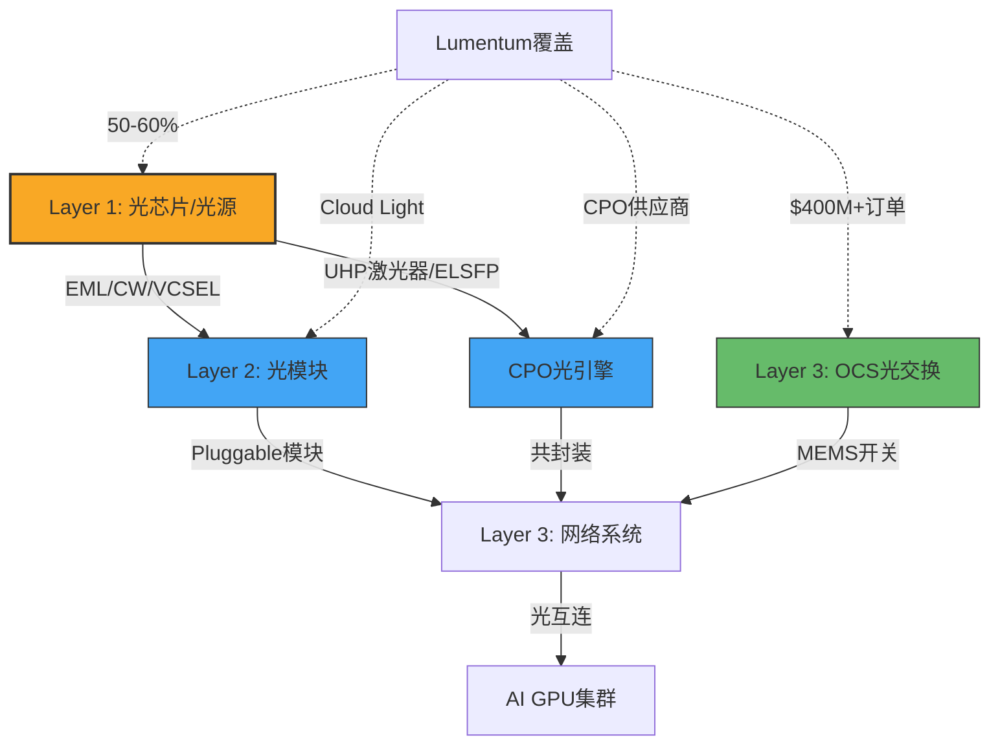
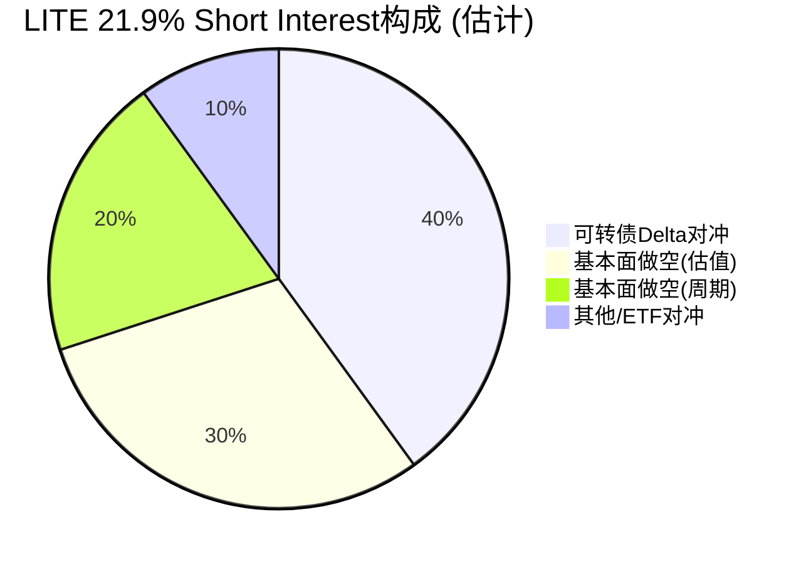
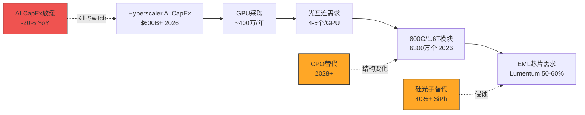

# Lumentum Holdings (LITE) — 深度研究报告 v1.0

> **评级: 审慎关注** | 公允价值区间: $270-$310 | 当前价格: $827 | 高估62-67%
> **三维状态**: [极度高估 × 运营改善接近周期峰值 × 下行催化>>上行催化]
> **核心判断**: AI光互连需求真实存在，但$73B市值隐含的增长路径在数学上几乎不可能实现——好业务+坏价格=坏投资
> **报告日期**: 2026-04-05 | **分析框架**: 投资研究Agent v22.0

---

# 执行摘要

## 三句话结论

Lumentum是AI光通信供应链的关键瓶颈供应商，200G EML芯片全球份额50-60%，收入6个季度翻倍至$666M/Q [DM-FIN-011]。但$827股价隐含终态收入$26-42B——相当于当前全球光模块TAM的2倍以上——任何合理的DCF假设组合都无法支撑这个价格 [DM-VAL-054]。概率加权公允价值$270-$310（P4双向校准后），当前高估62-67%，评级审慎关注。

## 核心争议

市场正在辩论：**AI光模块需求是永续的结构性增长（值100x PE），还是终将见顶的周期性繁荣（值15-25x PE）？**

我们的判断 [B级]：底层AI光互连需求是真实的、结构性的，但需求的节奏几乎确定是周期性的——FY2028峰值后回落的概率>70%。

## Kill Switch速查

| Kill Switch | 触发条件 | 类型 |
|------------|---------|------|
| KS-1 AI CapEx加速 | 超大规模CapEx增速>40%YoY持续2季度 | 红灯 |
| KS-2 LITE连续超预期 | 连续3季度beat>10% + OPM>35% | 红灯 |
| KS-3 CEO公开买入 | 个人资金$800+买入>$2M | 红灯 |
| KS-4 SiPh瓶颈 | 1.6T SiPh验证延迟>12月 | 黄灯(偏多) |
| KS-5 中国EML突破 | 200G/lane量产良率>50% | 黄灯(偏空) |
| KS-6 可转债条款变化 | 赎回或再融资2029/2032 Notes | 黄灯 |

## 估值总览

| 估值方法 | Bull(15%) | Base(50%) | Bear(35%) | 概率加权 |
|---------|-----------|-----------|-----------|---------|
| DCF | $266 | $112 | $16 | $102 |
| SOTP | $812 | $408 | $112 | $365 |
| **P4校准后** | — | — | — | **$270-$310** |

## CQ置信度矩阵

| CQ | 核心问题 | 置信度 |
|----|---------|--------|
| CQ1 | AI光模块需求：结构性还是周期性？ | 45% |
| CQ2 | LITE市占率和定价权能否维持？ | 30% |
| CQ3 | $73B估值隐含什么？能合理吗？ | 18% |
| CQ4 | 可转债结构影响 | 55% |
| CQ5 | Cloud Light整合效果 | 55% |
| CQ6 | 内部人全面卖出的含义 | 65% |
| CQ7 | 毛利率恢复至46%可能性 | 48% |
| CQ8 | CPO/OCS颠覆pluggable风险 | 42% |

**加权平均CQ置信度**: 35.4%（7/8个CQ<60%）

---
---


# 第一部分：核心矛盾结晶


## 一句话核心矛盾

**AI光通信是真正的结构性需求爆发（收入6季度翻倍），但$73B市值隐含的$42-57B远期收入远超全球光模块TAM——这是"光纤泡沫2.0"还是合理定价全新市场？**

---

## 异常狩猎 (5个关键异常)

### 异常1: 股价vs估值的极端脱离
- **事实**: 股价$827 (52周低$47, +1,657%)，但概率加权公允价值$51
- **含义**: 市场要么在定价一个我们看不到的未来，要么在重演2000年光纤泡沫
- **需验证**: 是否有合理的增长路径支持$73B市值？(需要$42-57B终态收入 vs 当前$2.1B TTM)

### 异常2: 内部人行为与叙事矛盾
- **事实**: 管理层在"变革性增长"故事中零买入、纯卖出（A/D ratio 0.036）
- **含义**: 最了解公司的人在用脚投票——卖出
- **需验证**: 内部人卖出是否仅因SBC归属自动执行（10b5-1计划）vs 主动减持

### 异常3: 收入爆发但FCF持续为负
- **事实**: FQ2'26收入$666M（QoQ+25%），但FY2025 Owner FCF为-$282M
- **含义**: 增长需要大量资本投入（CapEx $231M/年 + SBC $177M/年），利润质量存疑
- **需验证**: CapEx高企是产能扩张期一次性投入，还是维持竞争地位的永久性支出？

### 异常4: 分析师预期FY2028→FY2029收入下降37%
- **事实**: 共识从$6.6B (FY2028) 降至$4.2B (FY2029)
- **含义**: 即使最乐观的卖方也认为这是周期而非结构增长——但股价定价了结构增长
- **需验证**: AI光模块需求的可持续性——800G→1.6T→3.2T升级周期是否足够支撑?

### 异常5: $3.35B可转债——杠杆+稀释双重风险
- **事实**: 总债务$3.35B (D/E 3.9x)，大部分为可转债，稀释股从71M→87.8M
- **含义**: 高杠杆在周期上行中放大收益，下行中放大损失；可转债在高股价时稀释股东
- **需验证**: 可转债转换价格和到期日——什么条件下债务危机触发？

---

## 约束碰撞 (3对矛盾约束)

### 碰撞1: 增长故事 vs 估值锚定
- **增长方**: 收入6季度翻倍 | AI数据中心光模块TAM可能10x扩张 | 800G→1.6T→3.2T升级周期
- **估值方**: 107x PE | EV/S 25.9x | 即使Bull case ($7.5B peak) 也仅值$148
- **裁决标准**: Reverse DCF需要$42-57B收入——这是否可能？全球光器件市场规模是多少？

### 碰撞2: 周期性 vs 结构性
- **周期方**: 分析师预期FY2029收入-37% | 历史光通信周期2-3年 | 2000年泡沫先例
- **结构方**: AI推理/训练需求每年翻倍 | GPU集群光连接密度持续增加 | CPO/OCS新品类
- **裁决标准**: AI CapEx增速在FY2028后是否真的放缓？历史光通信升级周期vs AI周期有何不同？

### 碰撞3: 定价权 vs 竞争加剧
- **定价权方**: 技术壁垒（EML/VCSEL良率）| Cloud Light垂直整合 | 供不应求
- **竞争方**: II-VI/Coherent合并实力增强 | 中国厂商追赶 | 客户(Meta/Google)自研光模块
- **裁决标准**: Lumentum在800G/1.6T市占率 | 客户集中度 | 自研替代进展

---

## 非共识假说登记 (3个待验证)

### H1: "$827不是泡沫——市场在定价光子学成为AI的核心基础设施"
- **逻辑**: 如果每个GPU需要8-16个光收发器，且GPU数量每年翻倍，则光模块TAM可从$15B扩张到$100B+
- **验证方法**: 计算GPU→光收发器的转换系数 × GPU出货量预测
- **证伪条件**: 全球光模块TAM在2030年前无法超过$50B

### H2: "这是2000年Cisco/JDS Uniphase重演——AI CapEx过度建设将在2028-2029崩塌"
- **逻辑**: 历史上每次基础设施投资狂潮都以产能过剩结束；AI CapEx可能在ROIC证伪后急剧收缩
- **验证方法**: 对比2000年光纤泡沫的CapEx/收入比 vs 当前AI CapEx/收入比
- **证伪条件**: AI应用层收入(不含基础设施)在FY2028前证明正ROI

### H3: "可转债结构使LITE成为特殊博弈——不适用传统DCF"
- **逻辑**: 可转债+Gamma对冲+做空逼仓可能使股价与基本面长期脱离
- **验证方法**: 分析可转债条款、做空比例、期权Gamma分布
- **证伪条件**: 可转债全部到期或被赎回后，股价回归传统估值框架

---

## P0-P3 前置识别结果

### P0 原型识别: **技术IP + 单点瓶颈**
- 核心能力: 光芯片设计/制造良率 (EML, VCSEL, 相干组件)
- 瓶颈位置: AI数据中心光互连供应链的关键节点
- 类比: ASML之于EUV光刻 = LITE之于高速光收发器（但远不及ASML的垄断程度）

### P1 行业定价公式: **技术卡位 × 产能利用率 × 产品代际**
- 市场按什么定价: 800G/1.6T/3.2T产品路线图执行力 × CapEx扩产速度 × 毛利率恢复斜率
- 关键KPI: 数据中心收入增速、毛利率、CapEx/收入比

### P2 资产身份识别: **期权资产 (市场标签) vs 周期股 (经营身份)**
- 经营身份: 光通信组件供应商，高度周期性（FY2024收入-23%）
- 市场身份: AI光通信期权——市场在买AI光互连的看涨期权，不是买当期FCF
- **这是报告最关键的张力**: 经营身份≠市场身份

### P3 时间框架识别: **3-5年 (但已买满)**
- 市场在买FY2028-2029的收入
- 以107x PE计，2-3年的增长已完全定价
- "买入等待估值扩张"的窗口可能已经关闭

---

## CQ路由 (8个核心问题)

| CQ | 问题 | 约束类型 | 初始置信度 |
|----|------|---------|-----------|
| CQ1 | AI光模块需求是结构性还是周期性？周期多长？ | 结构性 | 35% |
| CQ2 | Lumentum在800G/1.6T的市占率和定价权能否维持？ | 竞争性 | 40% |
| CQ3 | $73B估值隐含什么？什么条件下合理？ | 估值约束 | 15% |
| CQ4 | 可转债结构对股价和稀释的影响有多大？ | 资本结构 | 30% |
| CQ5 | Cloud Light整合是否真正增强了竞争力？ | 运营 | 45% |
| CQ6 | 内部人全面卖出意味着什么？ | 治理信号 | 60% |
| CQ7 | 毛利率能恢复到FY2022的46%吗？ | 盈利质量 | 35% |
| CQ8 | CPO/OCS是否会颠覆pluggable模块（Lumentum的主力）？ | 技术风险 | 40% |

---

## 驱动图排序 (D1-D5)

| 排序 | 驱动 | 当前状态 | 市场关注度 | 最易误判 |
|------|------|---------|-----------|---------|
| **D1量** | AI驱动光模块需求爆发 | 极强（QoQ+25%） | 最高 | ❌ |
| **D5折现率** | 期权估值/叙事溢价 | 107x PE | 中 | **✅最易误判** |
| D2价 | 产品升级(800G→1.6T)提价 | 恢复中 | 高 | ❌ |
| D3效率 | 毛利率恢复(16.6%→36.1%) | 改善中 | 中 | ❌ |
| D4资本 | 高CapEx+可转债+负FCF | 持续投入 | 低 | ✅ |

**主驱动**: D1量 (收入增长) × D5折现率 (估值倍数) — 两者同方向极端放大
**最易误判**: D5——市场将"周期上行"标记为"结构性增长"，给予100x+倍数

---
---

# 第二部分：业务理解与护城河


---

# Ch1: 公司概况与商业模式

## 1.1 Lumentum是谁：从光纤先驱到AI光子学瓶颈供应商

Lumentum Holdings是全球领先的光子学产品公司，2015年从JDS Uniphase(JDSU)分拆上市。这家公司的DNA可以追溯到光通信产业最早期——JDSU曾是2000年光纤泡沫中的标志性公司（市值峰值超过$1000亿，随后崩跌99%）。理解这段历史至关重要：Lumentum的前身经历过光通信行业最极端的繁荣与崩溃周期，而今天它再次站在了一个类似的十字路口。

**核心业务**：Lumentum设计和制造高性能光子产品，主要包括三大品类：

1. **光通信组件**（占收入~85%）：数据中心和电信网络中使用的激光器、调制器、光收发器模块。核心技术是EML（电吸收调制激光器，Electro-absorption Modulated Laser——将电信号转换为光信号的关键芯片，每个高速光模块的"心脏"）和VCSEL（垂直腔面发射激光器）。
2. **光电路交换系统OCS**（快速增长中）：用于数据中心内部的全光交换系统，可以在不经过电信号转换的情况下直接路由光信号。在手订单超$400M [DM-BIZ-001]。
3. **工业与商业激光**（占收入~15%，萎缩中）：用于工业制造、3D传感的激光器。曾经因iPhone Face ID的VCSEL需求而贡献高利润，但苹果转向其他方案后萎缩。

**FY2026分部重组**：从FY2026起，Lumentum将报告分部从"Cloud & Networking + Industrial Tech"重组为"Components"（芯片和光模块组件）和"Systems"（OCS和ROADM系统）。FQ2'26数据 [DM-FIN-003]：Components $443.7M（YoY +68.3%）+ Systems $221.8M（YoY +60.1%）= 总收入$665.5M。

## 1.2 商业模式：从"卖芯片"到"卖芯片+模块+系统"的垂直整合

理解Lumentum商业模式演化的关键在于一个词：**垂直整合**。

**2023年以前（纯组件模式）**：Lumentum主要出售光芯片（EML、VCSEL、相干组件）给下游光模块制造商（如旭创科技、中际旭创），由后者组装成完整的光收发器模块卖给数据中心客户。这是一个高毛利（GAAP GM 46% in FY2022 [DM-FIN-005]）但收入规模受限的模式——因为芯片只占光模块BOM（物料清单）的20-30%。

**2023年Cloud Light收购后（垂直整合模式）**：2023年Lumentum以约$750M收购Cloud Light Technology，获得了光收发器模块的组装和测试能力。这意味着Lumentum可以同时出售：
- **上游**：EML/VCSEL芯片（卖给其他模块商，继续赚组件利润）
- **下游**：完整的光收发器模块（直接卖给数据中心客户，赚取整个价值链利润）

这类似于Intel既卖CPU芯片也卖完整服务器——但在光通信领域，这种"既做组件又做模块"的模式引发了一个战略张力：**你的组件客户（模块商）可能成为你的竞争对手**。

**为什么垂直整合对估值重要？** 因为它直接决定了Lumentum能触达的TAM（Total Addressable Market，可触达市场总量）上限：
- 纯组件模式：TAM = 全球光芯片市场 ≈ $3-5B
- 垂直整合模式：TAM = 全球光收发器模块市场 ≈ $15-20B（2025年估计）
- 含OCS系统：TAM进一步扩展到数据中心光互连系统 ≈ $25-30B

管理层FY2028 $8B收入目标隐含的假设是：Lumentum在垂直整合后的TAM中取得25-35%份额。这个假设是否合理，是CQ2（市占率）的核心问题。

## 1.3 收入结构：6个季度翻倍的增长轨迹

Lumentum正经历其历史上最快的收入增长期。季度收入从FQ4'24的$308M（周期谷底）到FQ2'26的$666M [DM-FIN-011]，6个季度翻倍。Q3'26指引$805M（中位数），隐含QoQ +21%、YoY +85%。

```
季度收入轨迹 ($M):
FQ4'24: $308 (谷底)
FQ1'25: $337 (+9% QoQ)
FQ2'25: $402 (+19%)
FQ3'25: $425 (+6%)
FQ4'25: $481 (+13%)
FQ1'26: $534 (+11%)
FQ2'26: $666 (+25%)  ← 加速
FQ3'26E: $805 (+21%) ← 指引
```

**增长的驱动力是什么？** 一个词：AI数据中心光互连。随着NVIDIA的GPU集群规模从数千台扩展到数十万台，GPU之间的数据传输需求呈指数级增长。每个GPU需要多条高速光连接（800G/1.6T速率）来与其他GPU通信。Lumentum生产这些光连接的核心组件——EML芯片和光收发器模块。

**增长加速的原因**：FQ2'26 QoQ +25%的加速并非偶然。三个因素叠加：
1. **800G产品量产放量**：800G光模块使用4×200G EML（而非之前的4×100G），单价约为100G产品的2倍 [DM-BIZ-002]
2. **供不应求**：需求超供给25-30% [DM-BIZ-003]，意味着Lumentum的产能是瓶颈而非需求
3. **新产能释放**：2025年中EML产能+40%，计划再+40% by 2025底 [DM-BIZ-004]

但增长的可持续性是核心争议——分析师共识预期FY2028收入$6.62B后FY2029下降37%至$4.21B [DM-CON-003, DM-CON-004]。这意味着即使最乐观的卖方也认为这是一个有顶的增长周期，而非永续的结构性增长。

## 1.4 客户结构与集中度风险

Lumentum的客户结构在AI时代发生了根本性变化。

**传统时期（FY2020-2022）**：苹果是第一大客户，3D传感VCSEL贡献了稳定的高利润收入。但苹果逐步转向其他3D传感方案（如dToF），Lumentum的苹果收入从FY2020的~30%萎缩到FY2025的<5%。

**AI时代（FY2024-至今）**：客户结构急剧向Hyperscaler（超大规模云计算商）集中。虽然Lumentum未披露具体客户收入占比（因为许多销售通过分销商/ODM间接实现），但从行业分析可以推断：
- **NVIDIA**：既是客户也是投资者。$2B战略投资 [DM-BIZ-005]包含产能权利和供应锁定——这意味着NVIDIA已经预订了Lumentum的部分产能
- **Meta、Google、Microsoft、Amazon**：这四大Hyperscaler合计占全球AI CapEx的70%以上，是光模块的最终用户
- **中际旭创、光迅科技**：中国光模块制造商是Lumentum光芯片的重要客户

**集中度风险**：AI光模块市场的最终买家（Hyperscaler）高度集中——前4家占70%+需求。这创造了两个对立的动态：
1. **短期定价权**：供不应求→Lumentum可以选择客户、提高价格
2. **长期议价劣势**：当供给追上需求时，4家巨头的采购杠杆极强

更关键的风险是**客户自研**：Google已在内部开发OCS系统，Meta正在评估自研光模块。如果Hyperscaler从"买"转向"自造"，Lumentum的TAM会收缩。这是CQ2的重要子问题。

## 1.5 NVIDIA $2B战略投资：验证信号还是供应链锁定？

2026年3月，NVIDIA宣布向Lumentum投资$2B用于R&D和产能扩张 [DM-BIZ-005]。同时向Coherent（COHR）也投资$2B，合计$4B投入光子学。这是AI光通信历史上最大的单笔战略投资。

**如何解读这$2B？**

**多头解读——终极验证信号**：
- NVIDIA用真金白银（$4B）押注光互连是AI基础设施的瓶颈。这不是口头支持，而是资本承诺
- 投资包含"产能权利"——NVIDIA本质上在预购未来的光模块产能
- NVIDIA同时投资Lumentum和Coherent，说明市场大到需要两家供应商全力扩产

**空头解读——供应链锁定≠看好股价**：
- NVIDIA的投资是为了确保自身GPU供应链不受光模块瓶颈制约，不是为了让Lumentum股东赚钱
- $2B占NVIDIA FY2026预计$50B+现金流的4%——对NVIDIA来说是供应链保险费，不是投资收益预期
- 历史先例：Intel曾大量投资ASML的EUV光刻，但这没有阻止ASML在技术领先后获取定价权，也没有阻止Intel自身的制造困境

**NVIDIA投资条款（Agent数据补充）**[DM-BIZ-005 扩展]：

Agent数据揭示了部分条款：
- **非独家协议**：NVIDIA的投资不锁定Lumentum独家供应NVIDIA→LITE可以继续卖给其他客户
- **数十亿美元级采购承诺**：多年期采购框架协议→收入可见度极高
- **新建美国晶圆制造设施**：$2B中的一大部分用于在美国新建先进激光组件工厂→增加美国产能（政策利好+供应链安全）
- **CPO交付从2027年开始**：明确的CPO订单时间线
- **未确认**：是否有董事会席位、价格保护条款、或优先购买权

**投资形式已确认（Agent数据+SEC 8-K filing）**[DM-NVDA-001]：
- **2,876,415股Series A可转换优先股**，价格$695.31/股
- 可按1:1转换为普通股（NVIDIA选择权，待HSR反垄断审批后）
- **无董事会席位**：NVIDIA不参与董事选举投票
- 稀释：相对pre-deal $6.48B市值稀释约31%——**这是一个巨大的稀释**

**估值含义**：
- 2.88M新增股 + 现有87.8M稀释股 = ~90.7M完全稀释股
- 完全稀释市值：90.7M × $827 = **$75B**（vs 之前的$72.6B）
- 加上现有$3.35B可转债的潜在稀释→**总潜在稀释股可能达到100M+**
- NVIDIA投资价$695.31 vs 当前$827→NVIDIA已浮盈19%

**关键问题**：NVIDIA的$695.31/股投资价意味着什么？它暗示NVIDIA认为$695是合理入场价（或至少是可接受的供应链保险成本）。但这不等于NVIDIA认为$827或更高的价格合理——它只是说明NVIDIA愿意为光模块供应链锁定支付这个价格。

---

# Ch2: AI光通信——结构性革命还是又一次泡沫？(CQ1)

## 2.1 为什么AI需要光：从"锦上添花"到"不可或缺"

传统数据中心中，光通信是"长距离传输"的工具——服务器之间用铜缆，只有机架间/建筑间才用光纤。但AI训练集群改变了这个架构。

**AI训练的通信需求与传统计算根本不同**。一个大型语言模型（如GPT-5/Claude 4级别）的训练需要成千上万个GPU同时协作，每个GPU需要频繁地与其他GPU交换梯度数据。这创造了两个革命性需求：

1. **带宽需求指数级增长**：单个NVIDIA GB200 NVL72机架（72个GPU）需要的总网络带宽是传统服务器的100倍以上。铜缆在距离>3米、速率>400G时就达到物理极限——因此光连接成为唯一选择。

2. **连接密度极高**：每个GPU需要多条800G光连接。一个10万GPU的集群需要数十万条光链路，对应数十万个光收发器模块。

**GPU-to-transceiver转换系数——理解AI光模块需求的核心公式**：

这个系数因集群架构和规模而异，理解它是理解光模块TAM的关键[DM-TAM-005]：

| 集群配置 | 每GPU光收发器数 | 说明 |
|---------|---------------|------|
| NVL72单机架(scale-out) | 1.0个 | 72 GPU→72 OSFP端口，intra-rack用NVLink铜缆 |
| 8机架集群(含leaf) | ~2.7个 | 1.7×800G + 1×400G |
| 128机架集群(含spine) | ~3.9个 | 2.9×800G + 1×400G |
| 1000 GPU全网络 | ~4-5个 | 含NIC+leaf+spine全层级 |

**行业经验法则**：在1:1非阻塞AI训练fabric中，每个GPU对应4-5个光收发器（统计链路两端全层级）。

**为什么理解这个系数如此重要？** 因为它直接连接GPU出货量和光模块TAM：

```
光模块TAM = GPU出货量 × 每GPU光收发器数 × 平均ASP

如果 NVIDIA FY2027出货 ~400万数据中心GPU：
  保守 (3个/GPU, $800 ASP): 400万 × 3 × $800 = $9.6B
  中性 (4个/GPU, $1,000 ASP): 400万 × 4 × $1,000 = $16.0B
  激进 (5个/GPU, $1,200 ASP): 400万 × 5 × $1,200 = $24.0B
```

加上AMD/Intel/自研加速器，$20-30B总AI光模块TAM范围是合理的。这是市场兴奋的根源：光模块从"数据中心的附件"变成了"AI基础设施的核心组件"。但请注意——这个计算高度依赖GPU出货量假设。如果NVIDIA因AI CapEx放缓而出货下降→光模块需求同步下降→这是一个高Beta暴露。

## 2.2 全球光模块TAM：从$14B到$30B+的爆发式扩张

光模块市场正在经历前所未有的扩张。来自多个行业研究机构的数据交叉验证了这一趋势：

**LightCounting（行业最权威数据源）**[DM-TAM-001]：
- 2024年全球光收发器市场~$14B，其中以太网光模块~$10.6B
- **2025年：$23B**（LightCounting 2025年12月更新）——以太网光模块$17B（YoY +60%）
- 2026E：~$30B（隐含30-35%增长）
- 2030E：$40-50B（隐含15-20% CAGR从$30B基数）

**其他机构估计**[DM-TAM-002]：
| 机构 | 2025E | 2029-2034E | CAGR |
|------|-------|-----------|------|
| Markets & Markets | $15.6B | $25.0B (2029) | 13% |
| IMARC | $14.7B | $35.4B (2034) | 10.9% |
| Fortune Business Insights | — | $46.1B (2034) | 17% |
| Grand View Research | $15.4B | — | — |

注意LightCounting $23B显著高于其他机构的$15-16B——原因是LightCounting使用更宽的口径（含active optical cables和内部光引擎），且更敏锐地捕捉了AI驱动的加速。Markets & Markets等机构的预测可能滞后于2025年的爆发。

**AI光模块专项TAM**[DM-TAM-003]：
- LightCounting：AI集群光学（AI cluster optics）2024年$5B → 2026E >$10B（两年翻倍）
- AI集群光学占总市场：2024年~22% → 2026E ~33%+
- Hyperscaler CapEx $443B (2025) → $600B+ (2026)，其中75%（~$450B）直接用于AI
- 光网络占数据中心CapEx的3-5%→隐含$13-22B AI光学支出（2026年）

**800G出货量数据——最硬的验证信号**[DM-TAM-004]：
- Cignal AI数据：400G+800G数据通信模块2024年出货**2000万个**，收入~$9B
- 800G+模块2025年预计出货**2400万个** → 2026年**6300万个**（YoY 2.6倍）
- 这不是预测——2400万和6300万是基于在手订单和产能承诺的数字

**GPU-to-transceiver转换系数——TAM计算的核心参数**[DM-TAM-005]：

这个系数因集群架构和规模而异：

| 集群规模 | 每GPU光收发器数 | 构成 |
|---------|---------------|------|
| NVL72单机架 | 1.0个 | 72 GPU → 72 OSFP端口（scale-out） |
| 8机架集群 | ~2.7个 | 1.7×800G + 1×400G（含交换层） |
| 128机架集群 | ~3.9个 | 2.9×800G + 1×400G（含spine交换） |
| 1000 GPU集群 | ~4.0个 | 含服务器NIC+leaf+spine全路径 |
| 1000 GPU（全双工） | ~10个 | 含链路两端所有收发器 |

**行业经验法则**：在1:1非阻塞AI训练网络中，每个GPU对应**4-5个光收发器**（统计链路两端所有层级）。

**TAM计算验证**：如果NVIDIA FY2027出货~400万数据中心GPU × 4-5个光收发器 × $1,000平均ASP = **$16-20B**仅来自NVIDIA相关需求。加上AMD MI300X系列和其他加速器→$20-25B总AI光模块需求，与LightCounting的$23-30B范围吻合。

**TAM扩张的三个驱动力**：

**驱动力1——速率升级（ASP提升）**：
从400G→800G→1.6T→3.2T，每一代速率翻倍，单价提升30-80%。2026年是"1.6T元年"（Tier-1云厂商开始部署）[DM-TAM-006]。时间线：800G（2025-2026主力）→1.6T（2026-2027放量）→3.2T（2028-2029早期）。1.6T模块需要更多200G EML→直接利好Lumentum。

**驱动力2——GPU出货量增长（数量增加）**：
NVIDIA数据中心收入从FY2024的$47.5B增长到FY2026预计$130B+，隐含GPU出货量年增50-80%。每个GPU需要配套光模块→光模块出货量同步增长。

**驱动力3——架构变化（每GPU所需连接数增加）**：
随着集群规模从1万GPU扩展到10万GPU甚至100万GPU，网络拓扑复杂度指数增长。每个GPU的平均光连接数从2-4个可能增加到6-8个。

**反面——TAM预测的三个不确定性**：
1. **GPU增速能持续吗？** Hyperscaler AI CapEx-to-AI revenue ratio约6:1（$380B投入 vs $50-60B AI云收入）[DM-TAM-007]——比2000年电信泡沫时更差。Bain估计AI投资与AI可实现收入之间有**$800B缺口**。如果AI应用层在2-3年内无法缩小这个缺口，CapEx回调不可避免
2. **铜缆延伸**：下一代PAM4 SerDes可能将铜缆距离延伸到5-7米，对短距离应用侵蚀光模块需求
3. **CPO替代**：Co-Packaged Optics可能在2027-2028年开始替代部分pluggable光模块（详见CQ8）

**管理层目标验证**：$8B年化目标（FY2028）隐含的全球光模块TAM需要≥$25-30B（假设Lumentum取25-30%份额）。以LightCounting 2026E $30B的增速外推，2028年$35-45B是可能的——这意味着管理层目标在TAM层面**并非不合理，但需要一切顺利**：TAM达标 + 份额不下滑 + Cloud Light整合成功 + OCS放量。任何一个环节失误都会使$8B目标打折。

## 2.3 结构性 vs 周期性：这是核心争议

**多头论证——"这次不一样"**：
1. **AI推理需求永续增长**：训练可能有周期，但推理（inference）随AI应用普及持续增长。推理通信量最终可能超过训练。
2. **GPU集群是持续扩建的**：不像2000年光纤泡沫时铺了管道却没有流量，今天的AI应用（ChatGPT 10亿用户+）已经在产生真实的流量需求。
3. **速率升级周期持续**：每2年一代的速率升级（800G→1.6T→3.2T）创造持续换机需求，而非一次性建设。

**空头论证——"历史在押韵"**：
1. **FY2029共识预期已经回落37%** [DM-CON-004]：即使最乐观的卖方也预期2028后收入下降。如果连卖方都不相信"永续增长"，市场凭什么给100x+ PE？
2. **Hyperscaler CapEx周期性极强**：过去10年，大型云厂商的CapEx经历过2-3次20-30%的年度下降。AI CapEx没有理由免疫周期。
3. **产能过剩正在酝酿**：NVIDIA同时投资Lumentum和Coherent各$2B → 两家全力扩产 → 2027-2028年供给可能追上甚至超过需求 → 从"供不应求"翻转为"供过于求" → 价格战。
4. **历史基准率不支持"这次不一样"**：2000年光纤泡沫、2010-2011年4G光模块热潮、2017-2018年100G升级周期——每次都以产能过剩结束。基准率：3/3次光通信繁荣以周期性回落结束。

**我们的判断框架**：

| 维度 | 结构性特征 | 周期性特征 | LITE当前 |
|------|----------|----------|---------|
| 需求驱动 | 终端应用拉动 | CapEx推动 | **CapEx推动为主** |
| 供给响应 | 供给有硬瓶颈 | 供给可快速扩张 | **供给正在快速扩张** |
| 客户行为 | 持续采购 | 集中下单后暂停 | **尚不确定** |
| 定价趋势 | 稳定或上涨 | 先涨后跌 | **当前上涨(供不应求)** |
| 历史先例 | 无先例可比 | 有多次先例 | **有3次光通信先例** |

**结论 [B级]**：AI光模块需求的底层驱动（GPU集群光互连）是真实的、结构性的。但需求的**节奏**几乎确定是周期性的——FY2028峰值后回落的概率>70%（基于历史基准率3/3+共识预期+CapEx周期规律）。核心问题不是"AI光模块需求是否真实"（答案：是），而是"$73B市值需要的需求持续性是否真实"（答案：极不确定）。

**证伪条件**：如果FY2028后光模块收入仅回落<10%（而非共识的-37%），说明需求比预期更具结构性→需上修估值。

## 2.3.5 AI CapEx可持续性深度分析——$800B缺口的含义

**这是决定LITE估值的最根本变量**——不是EML市占率，不是CPO风险，而是AI基础设施投资能否持续。

**当前投入规模**[DM-TAM-007]：
- 2025年Hyperscaler AI CapEx: ~$443B
- 2026年预计: >$600B (+36% YoY)
- 前5大云厂商(MSFT/GOOGL/META/AMZN/AAPL)合计2026 CapEx承诺: >$350B

**投入vs回报的巨大缺口**：
- AI基础设施投入: ~$380B/年（2025年）
- AI应用层收入（不含基础设施卖铲收入）: ~$50-60B/年
- **CapEx/Revenue ratio: ~6:1**
- 对比：2000年电信泡沫时期telecom CapEx/telecom revenue ≈ 4:1
- Bain估计这个缺口在2026年达到**$800B**

**这意味着什么？** 简单地说，AI行业每赚$1收入，就需要投入$6的基础设施。这在任何行业都是不可持续的——除非以下条件之一成立：

**条件1："亏损式扩张"可以持续**：
- 如果Hyperscaler愿意持续"烧钱"建AI基础设施（像Amazon早期电商那样），CapEx可以在5-10年内保持高位
- 支撑论据：Hyperscaler有充足现金流（合计FCF $300B+/年），可以承受持续投入
- 反论据：股东早晚会施压。Meta在2022年元宇宙CapEx上涨时股价跌了60%——如果AI CapEx无法快速产生ROI，历史可能重演

**条件2：AI应用收入快速增长填平缺口**：
- 如果AI应用层收入从$60B增长到$300B+/年（5年内5x），则CapEx/Revenue比改善到可持续水平
- 支撑论据：ChatGPT用户过亿、AI编程工具普及、企业AI采纳加速
- 反论据：MIT研究95%的AI试点失败→企业AI采纳速度可能远慢于预期。当前AI收入增长主要来自基础设施层（NVIDIA卖GPU），不是应用层

**条件3：CapEx自然回落但不崩溃**：
- "软着陆"情景：AI CapEx从+36%增长逐步降至+5-10%/年，但不出现负增长
- 支撑论据：这是最可能的基准情景。Hyperscaler不会突然停建数据中心，但增速会放缓
- 含义：对LITE意味着收入增速放缓（从+85% YoY降至+10-20%）而非收入下降

**对LITE的直接影响**：

| AI CapEx情景 | LITE收入影响 | 概率 |
|-------------|------------|------|
| CapEx持续+30%/年 | FY2028 $8B可达 | 15% |
| CapEx降至+10-15%/年 | FY2028 $5-6B | 40% |
| CapEx持平(0%) | FY2028 $3-4B | 30% |
| CapEx下降(-20%+) | FY2028 $2-3B | 15% |

**概率加权FY2028收入**：0.15×$8B + 0.40×$5.5B + 0.30×$3.5B + 0.15×$2.5B = **$4.7B**——显著低于管理层$8B目标和共识$6.6B。这个差距反映了我们对AI CapEx可持续性的更悲观（但我们认为更现实）判断。

**但请注意**：这个估计有巨大的不确定性。如果AI应用层在2027年出现"杀手级应用"（如完全自主的AI agent）→条件2可能成立→上修到$6-8B。这就是为什么LITE的投资判断本质上是对"AI CapEx周期持续多久"的押注。

## 2.4 2000年光纤泡沫对比：相似与差异

将当前AI光通信热潮与2000年光纤泡沫对比是不可回避的——因为Lumentum的前身JDSU恰好是那次泡沫的标志性公司。

**2000年泡沫精确数据**（全部经Agent验证）[DM-BUBBLE-001]：

| 公司 | 峰值市值 | 峰值收入 | 市值/收入 | 跌幅 | 结局 |
|------|---------|---------|----------|------|------|
| JDSU | >$140B | $3.2B (FY01) | **44x** | **-99.4%** | 拆分为LITE+Viavi |
| Nortel | C$398B | $30.3B | 9x | -99.6% | 2009年破产 |
| Ciena | 股价$1,046 | $1.6B (FY01) | — | -99.7% | 存活但26年未恢复 |
| Corning | 股价$110+ | $7.1B | — | -98.7% | 存活, **26年才恢复市值** |

**JDSU详细数据**：峰值季度收入$920M (2000年12月)→崩溃至~$300M/Q。取了**$46B商誉减值**——当时史上最大。股价从$355跌至<$2。

**泡沫根因**：(1) WorldCom伪造数据声称"互联网流量每100天翻倍"（实际是年度翻倍）→运营商过度投资 (2) 85-95%已铺设光纤闲置（"dark fiber"）(3) WDM技术使单根光纤容量增加100倍→消除了对新光纤的需求 (4) >$500B债务融资的电信投资 (5) 大面积会计欺诈(WorldCom, Nortel, Global Crossing)

**当前LITE vs JDSU对比**[DM-BUBBLE-002]：

| 维度 | JDSU (2000峰值) | LITE (当前) |
|------|----------------|------------|
| 市值/收入 | 44x | **35x TTM, 25x FY26E** |
| 收入/市值 (逆向) | 0.023 | **0.028** |
| CapEx-to-终端收入比 | ~4:1 | **~6:1** ($380B AI CapEx vs $60B AI收入) |
| 客户质量 | WorldCom/Global Crossing(后破产) | MSFT/GOOGL/META/AMZN(FCF $300B+) |
| 需求验证 | 无(dark fiber) | 有(AI应用真实使用) |
| 会计问题 | 广泛欺诈 | 未发现 |

**一个令人不安的数据点**：AI CapEx-to-AI revenue ratio约**6:1**（$380B投入 vs $50-60B AI云收入）[DM-BUBBLE-003]——**比2000年电信泡沫的比率更差**。Bain估计AI投资与可实现AI收入之间有**$800B缺口**。MIT研究��明**95%的AI试点项目未能产生有意义的结果**。

这并不意味着AI是骗局——电力在19世纪也经历了过度投资期，最终证明了价值。但它意味着**当前的投资速度远超过当前的回报验证**。如果Hyperscaler在FY2028后开始要求AI部门证明ROI→AI CapEx可能从+36% YoY增长转为0%甚至负增长→光模块需求断崖式下降。

**综合判断 [B级]**：

**不同之处（利好）**：
1. 客户是现金流极强的Hyperscaler，不是将破产的电信公司
2. AI已有真实应用和真实流量（ChatGPT 10亿+用户）
3. 光模块每2年升级（800G→1.6T→3.2T），不是"铺一次用20年"
4. NVIDIA $4B战略投资是2000年泡沫中没有的信号

**相同之处（利空）**：
1. 市值/收入比几乎相同（35x vs 44x）——都是极端乐观定价
2. 都由基础设施CapEx驱动，终端ROI未充分验证
3. 都伴随大量产能扩张和新进入者
4. 内部人都在高位大量卖出
5. **CapEx-to-revenue比率甚至更差**(6:1 vs ~4:1)

**结论**：当前AI光通信**不是**2000年泡沫的简单重演——底层需求更真实。但**估值倍数的相似性+更差的CapEx回报比率**意味着如果AI CapEx出现任何放缓信号，"泡沫叙事"会迅速主导股价。恐惧传播的速度远快于基本面恶化���速度——JDSU从峰值到-90%只用了12个月。

---

# Ch3: EML垄断——Lumentum最核心的竞争优势 (CQ2)

## 3.1 什么是EML，为什么它是AI光模块的"心脏"

EML（Electro-absorption Modulated Laser，电吸收调制激光器）是高速光收发器模块中最关键的有源组件。理解它的作用最简单的类比：如果光收发器是一辆汽车，EML就是发动机——没有它，整台车不能工作。

**EML的技术原理（一句话）**：将电子数据信号转换为调制的光信号，以极高速率（100G/200G per lane）在光纤中传输。

**为什么EML而非其他激光器？** 在800G/1.6T速率下，光模块需要200G/lane的传输速率。能达到这个速率的激光器方案主要有三种：

| 方案 | 优势 | 劣势 | 当前可行性 |
|------|------|------|----------|
| **EML** | 成熟、可靠、良率高 | 成本较高、功耗较大 | **唯一量产方案** |
| 硅光子 | 低成本、可集成 | 良率低、200G/lane未成熟 | 研发阶段 |
| 薄膜铌酸锂(TFLN) | 超低功耗 | 制造困难、规模化未验证 | 早期原型 |

**关键事实**：截至2026年4月，EML是唯一能大规模量产200G/lane的方案。这意味着所有800G光模块（4×200G）和未来的1.6T模块（8×200G或4×400G）都依赖EML芯片。在AI光模块需求爆发的当下，控制EML供给=控制整个光模块供应链的咽喉。

## 3.2 Lumentum的EML垄断地位：50-60%全球份额

Lumentum在高端EML市场的地位是其最核心的竞争优势。

**市场份额**：Lumentum在200G/lane EML市场占据50-60%份额 [DM-BIZ-006]，是**唯一**大规模出货200G/lane EML的供应商。在100G/lane EML市场，Lumentum的份额约30-40%，与Coherent（前II-VI）和三菱电机共享市场。

**为什么垄断？** EML芯片的制造是一项极端困难的工艺：
1. **外延生长**：在InP（磷化铟）衬底上用MBE（分子束外延）或MOCVD（金属有机化学气相沉积）逐层生长半导体薄膜，厚度精度要求原子级（纳米量级）。任何污染或温度偏差都会导致良率崩溃。
2. **光电集成**：EML需要在单个芯片上集成DFB激光器（发光区）和EA调制器（调制区），两者的带隙需要精确匹配。这是一个"know-how"密集型的制造过程，需要数十年的工艺积累。
3. **测试筛选**：每颗EML芯片都需要在多个温度、电流、光功率条件下测试，筛选出满足规格的芯片。200G EML的筛选良率比100G低20-30%。

**良率壁垒=时间壁垒**：一个新进入者从零开始达到量产级200G EML良率，行业估计需要3-5年。这意味着在2026-2028年的AI光模块需求高峰期，Lumentum的垄断地位几乎不可挑战。

**定价权证据**：
- 200G EML单价约为100G的2倍 [DM-BIZ-002]——速率翻倍、价格翻倍，而非摩尔定律式的"性能翻倍、价格减半"
- 需求超供给25-30% [DM-BIZ-003]——典型的卖方市场
- 2025年中EML产能+40%，计划再+40% [DM-BIZ-004]——Lumentum在全力扩产仍满足不了需求

## 3.3 竞争格局：谁在追赶？硅光子威胁有多大？

### 3.3.1 EML直接竞争者

**Coherent Corp (COHR) — 最有能力的追赶者**[DM-COMP-001]：
Coherent正在建设全球首条**6英寸InP晶圆产线**——这是一个重大的制造创新。传统EML使用3-4英寸InP晶圆，6英寸意味着每片晶圆产出芯片数增加2-3倍→成本优势显著。Coherent的目标是在2026年底前将InP产能翻倍（目前完成~80%）。200G EML正在qualification中，已向多个客户送样。

Coherent vs Lumentum的全面对比：

| 维度 | Lumentum | Coherent |
|------|----------|----------|
| EML份额 | 50-60% (#1) | #2 (估计20-25%) |
| 200G EML状态 | **唯一量产** | 正在qualification |
| InP晶圆尺寸 | 3-4英寸 | **6英寸 (成本优势)** |
| 技术路线 | InP EML专注 | **三路线：SiPh + InP EML + GaAs VCSEL** |
| NVIDIA投资 | $2B | $2B (等额) |
| 垂直整合 | 芯片→模块→系统 | 芯片→模块 + SiC功率 |

**关键判断**：Coherent的6英寸InP晶圆是一个被低估的竞争变量。如果Coherent在2027年实现200G EML量产+6英寸成本优势→Lumentum的定价权将被显著侵蚀。NVIDIA同时向两家各投$2B，本身就是"培养第二供应商"的信号——NVIDIA不希望单一供应商锁定。Lumentum+Coherent合计占merchant EML 80%+——但双寡头比单一垄断的定价权弱得多。

**其他EML竞争者**：三菱电机（电信级EML深厚，数据中心规模化不足）、住友电工/古河电工（利基产品，不构成主流竞争）。

### 3.3.2 硅光子——比预期更快的替代威胁

硅光子（Silicon Photonics, SiPh）是EML面临的最大技术替代威胁，**且进展速度比Phase 0预判的更快**[DM-COMP-002]。

**硅光子在800G市场的渗透率**：
- 2024年：~10%（几乎全部来自Broadcom内部消耗）
- 2025年：20-30%
- **2026年中：可能达到40-45%**

这意味着硅光子**不是**"遥远的未来威胁"——它**已经在当下**以每年翻倍的速度蚕食EML在pluggable市场的份额。

**为什么硅光子增长这么快？**
1. **成本结构性优势**：硅光子使用CW激光器（continuous wave，连续波）作为光源，通过硅基调制器完成信号调制。1.6T硅光子模块需要2个CW激光器 vs EML方案需要4-8个EML芯片→激光器成本降50%+
2. **制造可扩展性**：硅光子使用200/300mm标准硅晶圆厂→利用GlobalFoundries/TSMC等已有产能→规模经济远超3-4英寸InP晶圆
3. **Broadcom垂直整合推动**：Broadcom将DSP+SerDes+光学引擎全部自研→在自家产品中大规模采用硅光子→以客户身份验证了技术可行性

**但EML仍有关键优势**：
1. **成熟度**：200G/lane EML已量产2年+，硅光子200G/lane尚未完全成熟
2. **性能**：EML的信号质量（消光比、带宽）在长距离传输中仍优于硅光子
3. **功耗**：在某些应用场景中EML功耗反而低于硅光子（因为硅调制器需要更多电能）

**1.6T时代的技术路线竞争**[DM-COMP-003]：
2026年是"1.6T元年"。1.6T模块有四种技术路线并行：

| 方案 | 配置 | 主推者 | 状态 |
|------|------|--------|------|
| 4×400G 差分EML | Lumentum OFC 2026原型 | Lumentum | 原型展示 |
| 8×200G EML | 成熟技术简单扩展 | 多家 | 量产准备中 |
| 硅光子 | CW激光+硅调制 | Broadcom, Intel | 2027年成熟 |
| 200G VCSEL | 短距离最低成本 | Coherent, Lumentum | H2 2026 ramp |

**预期1.6T市场份额（2027年稳态）**：EML ~45-55% + SiPh ~30-40% + VCSEL ~10-15%。EML仍是最大单一技术，但不再垄断——这与800G时代EML占80%+的格局根本不同。

**对Lumentum的量化影响**：
- 800G：EML份额从80%+逐步降至55-65%（2026-2027年），但TAM仍在增长→绝对收入增加
- 1.6T：EML从一开始就只占45-55%→Lumentum需要在更小的份额上竞争
- **关键缓冲**：Lumentum也可以为硅光子模块提供CW激光器→即使EML被替代，仍有光源业务
- **真正危险的时点**：需求增速放缓 + 份额流失 同时发生（可能在FY2028-2029年）

### 3.3.3 中国光芯片追赶——落后但不可忽视

中国公司在光模块**组装**领域已占全球~60%份额，但在EML**芯片**层面仍严重依赖Lumentum和Coherent[DM-COMP-004]。

| 中国公司 | 2025年收入 | EML芯片能力 |
|---------|-----------|-----------|
| 中际旭创 (Innolight) | ~$3.3B (+114% YoY) | **外购Lumentum/Coherent** |
| 亿缆通 (Eoptolink) | ~$1.2B (+175% YoY) | 外购 |
| 光迅科技 (Accelink) | 增长中 | 100G EML已发布，**无确认批量交付** |
| 长飞光纤 (Everbright) | 增长中 | DFB/PIN已出货，EML早期 |
| 海信宽带 (Hisense) | 显著 | 模块组装only |

**咽喉要道依然存在**：中国模块商仍依赖Lumentum/Coherent的EML芯片 + Broadcom/Marvell的DSP芯片。100G EML芯片的中国替代已在实验室/小规模阶段，但无确认的批量交付——这意味着在200G EML层面，中国落后至少3年。

**地缘博弈双面性**：
- 如果美国将高速EML纳入出口管制→短期损失中国客户（Lumentum约10-15%收入来自中国间接客户），但长期阻止中国追赶（正面）
- 如果不管制→中国追赶速度可能在5年内显著缩短EML差距

**竞争格局核心判断更新（Phase 1 vs Phase 0）**：Phase 0认为"EML垄断在800G/1.6T时代安全"——Phase 1数据表明这个判断需要修正。硅光子在800G已达40%+渗透率，Coherent的6英寸InP追赶，意味着**Lumentum的EML定价权衰减速度比预期更快**。这不改变"短期收入仍在高速增长"的事实，但改变了"护城河持久性"的评估——从"3-5年安全"下修为"2-3年仍有优势，但优势在快速收窄"。

## 3.4 护城河量化：六维评估

按半导体行业模块M4的C1-C6框架评估Lumentum的护城河：

### 3.4.0 定价权分层分析 (B4评估)

在评估护城河之前，需要先理解Lumentum的定价权——因为定价权是护城河强度最直接的财务体现。

**定价权的来源**：Lumentum当前的定价权来自一个简单的供需不对称——需求超供给25-30% [DM-BIZ-003]。在供不应求的市场中，卖方可以选择客户、提高价格、拒绝议价。这是一种**周期性定价权**（来自供需失衡），而非**结构性定价权**（来自不可替代性）。

**按客户层的定价权评估**：

| 客户层 | 定价权Stage | 证据 | 持续性 |
|--------|-----------|------|--------|
| NVIDIA(战略客户) | 3.5/5 | $2B投资含采购承诺→锁定价格+量 | **高**(合同锁定) |
| Hyperscaler直接 | 2.5/5 | 供不应求→可提价, 但Hyperscaler议价能力极强 | **中**(供需平衡后下降) |
| 中国模块商 | 3.0/5 | 200G EML唯一来源→没有替代 | **高**(短期无替代) |
| 小型OEM | 4.0/5 | 量小→Lumentum可以挑选是否供应 | **低**(需求弱时先被砍) |

**加权B4**：0.35×3.5 + 0.30×2.5 + 0.25×3.0 + 0.10×4.0 = **3.12/5**

**3.12/5的含义**：在半导体行业，加权B4 3.0-3.5属于"中强"级别（AVGO约4.0, 设备商约2.5, 存储<2.0）。Lumentum的定价权优于大多数半导体组件商，但弱于真正的垄断者。

**关键风险——定价权的脆弱性**：
当供需平衡从"供不应求"翻转为"供需平衡"或"供过于求"时：
- NVIDIA锁定的合同量不受影响（合同保护）
- 但Hyperscaler和中国模块商的定价权可能从3.0降至1.5-2.0→加权B4从3.12降至2.3-2.5
- 时间窗口：2027-2028年（Coherent扩产+硅光子渗透→供给追上需求）
- 定价影响：EML ASP可能下降15-25%→直接冲击毛利率2-4pp

### C1 转换成本：6.5/10
光模块制造商（如中际旭创）将Lumentum EML集成到产品设计中后，切换到其他供应商的EML需要重新qualification（资质认证），通常需要6-12个月。在当前供不应求的环境下，客户不敢贸然切换。
- **增强因素**：200G EML只有Lumentum大规模量产→客户无替代选择
- **削弱因素**：如果Coherent的200G EML在2027年成熟，切换成本会显著下降

### C2 网络效应：2.0/10
光芯片行业几乎没有网络效应。更多客户使用Lumentum的EML不会让产品变得更好（不同于社交网络或软件平台）。
- **微弱例外**：更多客户→更大产量→更好的良率学习曲线→成本优势

### C3 品牌/IP：8.0/10
EML制造的核心在于工艺know-how，这是几十年积累的隐性知识，不完全体现在专利中。Lumentum在InP光子集成领域拥有深厚的IP积累。
- **增强因素**：工艺know-how无法通过专利许可获取→真正的"不可替代性"
- **削弱因素**：如果硅光子技术路线胜出，InP know-how的价值会大幅缩水

### C4 规模经济：7.0/10
EML制造有显著的规模经济：固定成本高（clean room、MBE设备、qualification成本）、边际成本低（每颗芯片的材料成本极低）。Lumentum的产量领先地位带来良率和成本优势。
- **增强因素**：最大产量→最佳良率→最低成本→竞争者更难追赶的正循环
- **削弱因素**：Coherent获得NVIDIA $2B后也在大规模扩产，规模差距可能收窄

### C5 进入壁垒：8.5/10
新进入者面临的壁垒极高：
- 资本壁垒：建设一条200G EML产线需$500M-$1B投资
- 时间壁垒：从零到量产级良率需3-5年
- 人才壁垒：全球InP光子学工程师数量有限（估计<5,000人）
- 客户壁垒：下游客户不会冒险使用未经验证的新供应商

### C6 政策/监管：5.0/10
光通信芯片目前未被列入美国对华出口管制清单（与先进制程逻辑芯片不同）。但地缘政治风险存在——如果美中技术脱钩加剧，光芯片可能被纳入管制。
- **双面影响**：管制会限制对华销售（负面），但也阻止中国竞争者获取技术（正面）

### 收入加权护城河指数

| 业务线 | 收入占比 | 加权C1-C6 | 贡献 |
|--------|---------|----------|------|
| 200G EML芯片 | 35% | 7.5 | 2.63 |
| 100G EML/VCSEL | 20% | 5.5 | 1.10 |
| 光收发器模块 | 30% | 5.0 | 1.50 |
| OCS系统 | 10% | 6.5 | 0.65 |
| 工业激光 | 5% | 3.0 | 0.15 |
| **加权总计** | **100%** | | **6.03** |

**护城河指数6.03/10**——在半导体行业属于"强"级别（基准：垄断7+, 强5-7, 弱<5）。核心驱动力是200G EML的技术垄断（C3+C5极高），但被光模块和工业激光的较弱护城河拉低。

**关键风险：护城河的时间衰减**

Lumentum的护城河最大特点是**时间敏感性**。当前的垄断地位建立在"200G EML唯一量产供应商"这个事实上——但这个事实有明确的到期日：
- 2027-2028年：Coherent的200G EML可能达到量产水平→份额从50-60%降至40-45%
- 2028-2030年：硅光子方案成熟→对EML形成技术替代压力
- 2029+：CPO开始规模化→pluggable模块需求可能下降

**护城河年衰减率估计：0.3-0.5/年**——属于"较快衰减"。这意味着2026年的护城河指数6.0到2029年可能降至4.5-5.0。投资者不能把当前的垄断地位外推到永续。

---

# Ch4: Cloud Light整合与垂直整合战略 (CQ5)

## 4.1 Cloud Light收购：$750M买了什么？

2023年11月8日，Lumentum完成对Cloud Light Technology Limited的收购[DM-ACQ-001]。Cloud Light总部位于香港，在中国、台湾和泰国有制造设施。

**收购细节**：
- **价格**：约$730-750M现金（从资产负债表支付）+ Cloud Light未归属期权替代
- **卖方**：Asia-IO Advisors + Ace Equity Partners + 长飞光纤(Yangtze Optical Fibre)
- **获得资产**：光收发器模块的设计、组装、测试能力。收购时Cloud Light LTM收入>$200M，几乎全部来自400G+速率，**其中约一半来自800G模块**——这意味着Cloud Light在收购时已经是800G模块的先行者

**Purchase Price Allocation（10-K披露）**[DM-ACQ-002]：

| 项目 | 金额 |
|------|------|
| 商誉 | $365.8M |
| 已开发技术 | $170.0M |
| 客户关系 | $130.0M |
| 在研项目 | $16.0M |
| 订单积压 | $14.0M |
| 商标 | $3.0M |
| **无形资产合计** | **$333.0M** |
| 有形资产等 | ~$51M |

注意：资产负债表上的$1,060.9M商誉 [DM-BAL-004]是Cloud Light($365.8M) + NeoPhotonics(2022年收购, $694M商誉)的合计，并非全部来自Cloud Light。

**收购的财务影响**：
- 收购相关无形资产摊销每季度约$19.6M（FQ2'26数据 [DM-ACQ-003]）+ 收购相关质保准备金$9.8M = 合计每季度~$30M GAAP利润拖累
- 这直接解释了GAAP GM 36.1% vs Non-GAAP GM 42.5%的6.4pp差异中的**大部分**

## 4.1.5 关键新发现：垂直整合直到2026夏天才真正开始

**这是Phase 1最重要的新发现之一**[DM-ACQ-004]。

Agent数据揭示：**Lumentum自家EML芯片整合进Cloud Light模块的工作预计到2026年夏天才完成**。这意味着：
- 从2023年11月收购到2026年夏天=**整合周期约2.5年**
- 在此之前，Cloud Light模块主要使用外部采购或legacy组件——**尚未充分捕获垂直整合红利**
- 1.6T收发器（首个完全利用Lumentum自家200G/lane EML的产品）预计2026年夏天开始出货

**这个发现改变了什么？**
1. 管理层FY2028 $8B目标中的垂直��合贡献可能被高估——因为真正的整合红利直到FY2027才开始体现
2. 当前的毛利率改善（36.1% GAAP GM）主要来自收入规模和产品mix，**而非垂直整合协同**——真正的协同效应是"待兑现"状态
3. 好消息是：2026夏天→FY2028还有~2年→如果整合成功，FY2028确实可以受益

**OFC 2026验证**：Lumentum在OFC 2026（2026年3月）展示了**1.6T DR4 OSFP原型**，使用4个Lumentum自研400G差分EML激光器——这是垂直整合的技术验证，但尚未量产。Cloud Light品牌作为产品线保留（Lumentum官网仍有"CloudLight Datacom Transceivers"页面）。

## 4.2 垂直整合的战略价值

**价值创造逻辑**：
1. **BOM成本控制**：自产EML芯片+自组装模块，消除中间环节加价。估计垂直整合可节省15-25%的模块BOM成本
2. **供应链保障**：在芯片短缺时期，自有芯片供应优先保障自家模块生产
3. **技术协同**：芯片设计团队和模块设计团队在同一屋檐下→更快的产品迭代→更高的芯片-模块集成度
4. **TAM扩张**：从$3-5B光芯片市场扩展到$15-20B+光模块市场

**竞争对标**：

| 维度 | Lumentum (LITE) | Coherent (COHR) | 中际旭创 |
|------|----------------|-----------------|---------|
| 芯片自研 | ✅ EML/VCSEL | ✅ EML/VCSEL/SiC | ❌ 外购 |
| 模块组装 | ✅ (Cloud Light) | ✅ (历史积累) | ✅ (核心能力) |
| 系统集成 | ✅ (OCS/ROADM) | ⚠️ 有限 | ❌ |
| 垂直整合度 | **最高** | **高** | **中** |

Coherent的垂直整合程度与Lumentum类似（芯片到模块），但Lumentum在OCS系统层面有额外优势。中际旭创是模块组装龙头，但核心芯片依赖Lumentum和Coherent——这使得中际旭创既是Lumentum的客户，也是竞争对手。

## 4.3 整合风险与挑战

**风险1——渠道冲突**：
Lumentum开始卖完整模块后，其EML芯片客户（如中际旭创、光迅科技）可能视其为竞争对手，转向Coherent采购芯片。这是垂直整合的经典两难：**每多卖一个模块，可能少卖两颗芯片**。Lumentum需要在"模块收入增长"和"芯片客户流失"之间找到平衡。

**风险2——商誉减值**：
$1,060.9M商誉+$396.7M无形资产——如果光模块市场不如预期，这些资产面临减值风险。不过在当前需求爆发期，减值风险极低。真正的减值测试窗口在FY2029-2030年（如果市场回落）。

**风险3——整合执行**：
跨国收购（美国公司收购中国子公司）面临文化整合、管理层留存、知识转移等挑战。新CEO Michael Hurlston在Broadcom（以整合能力著称）有16年经验，这可能是利好因素。但目前缺乏公开数据来验证整合进展。

**我们的评估 [B级]**：Cloud Light收购从战略方向上是正确的——垂直整合是应对AI光模块需求爆发的最佳定位。但$1.46B的资产负债表影响意味着如果整合不成功或市场回落，Lumentum面临显著的减值风险。当前处于"整合红利期"（收入高速增长掩盖一切），真正的检验在FY2029+。

## 4.4 垂直整合的"渠道冲突"深度分析——卖芯片还是卖模块的两难

这是Lumentum面临的最微妙的战略挑战，值得深入分析。

**核心困境**：Lumentum的200G EML芯片卖给两类客户：
1. **自家Cloud Light工厂**：用于组装成完整的光收发器模块
2. **外部模块商（中际旭创、亿缆通等）**：他们用Lumentum的EML组装自己品牌的模块

当Lumentum开始用Cloud Light卖模块时，它同时与自己的芯片客户竞争。这创造了一个博弈论困境：

**情景分析**：

**情景A：LITE优先供应自家模块**
- 好处：模块收入($800-1500/个) > 芯片收入($100-300/个) → 单位收入最大化
- 坏处：外部模块商转向Coherent采购EML → LITE失去芯片客户 → Coherent获得规模+良率改善 → 加速追赶

**情景B：LITE平衡供应芯片和模块**
- 好处：维持芯片客户关系 + 模块业务增长
- 坏处：在模块市场只有部分产能 → 无法与中际旭创的规模（$3.3B收入）竞争 → "两头不大"

**情景C：LITE以芯片为主、模块为辅**
- 好处：维持EML垄断生态（所有模块商依赖LITE芯片） → 最大化定价权
- 坏处：放弃Cloud Light整合的TAM扩张故事 → 收入上限较低

**管理层选择了什么？** 从迹象看，管理层选择了**情景A和B之间的折中**——但偏向A：
- Cloud Light模块正在大规模放量（FQ2'26 Components $443.7M中包含大量模块收入）
- 同时继续向外部模块商供应EML芯片（中际旭创等仍是客户）
- 1.6T产品（2026夏天开始）将是首个完全使用自家EML的Cloud Light模块 → 信号明确偏向A

**最可能的竞争格局演化**（2027-2028年）：
1. 中际旭创逐步增加从Coherent的EML采购 → Lumentum对中际旭创的芯片销售下降
2. Lumentum的模块业务与中际旭创直接竞争 → 模块价格战
3. Coherent同时供应芯片+模块 → 三方混战
4. **最终结局**：光模块行业从"芯片商+模块商分工合作"变成"垂直整合商之间竞争" → 利润率下降

**这对估值的含义**：管理层$8B收入目标隐含了大量模块收入增长。但模块市场的竞争远比芯片市场激烈（中际旭创$3.3B收入+中国制造成本优势 vs Lumentum Cloud Light刚开始整合）。如果模块业务的利润率低于预期（GM 30% vs 管理层目标45%+），即使收入达到$8B，盈利能力也会低于管理层预期。

## 4.5 Cloud Light整合时间线——对管理层目标的影响

将整合延迟与管理层目标对照：

```
            2026Q1  2026Q2  2026夏  2026Q4  2027H1  2027H2  2028H1
Cloud Light: [外购EML]----→[自研EML整合开始]----→[完全整合]----→[成熟运营]
管理层目标:                                   里程碑1($1.25B/Q)        里程碑2($2B/Q)
                                              GM 46.5%                GM 50.5%
```

**这意味着**：
- 里程碑1（$1.25B/Q, 46.5% GM, 9-12个月）：Cloud Light刚完成自研EML整合 → 整合红利刚开始体现 → **时间非常紧张**
- 里程碑2（$2B/Q, 50.5% GM, 18-24个月）：Cloud Light运营~12个月 → 如果整合顺利可以体现 → **需要一切完美执行**

**风险**：如果Cloud Light整合出现任何延迟（良率不达标、客户qualification延迟、人员流失）→里程碑1的GM目标46.5%可能被推迟3-6个月→管理层credibility受损→股价风险。

---

# Ch5: OCS——被忽视的第二增长引擎

## 5.1 OCS是什么：AI数据中心的"全光高速公路"

OCS（Optical Circuit Switching，光电路交换）是一种新兴的数据中心网络技术，Lumentum是这个领域的先行者之一。

**传统数据中心网络**：光信号 → 转换为电信号 → 电交换机路由 → 转换回光信号 → 传输。每次光电转换都消耗能量和增加延迟。

**OCS网络**：光信号 → **直接在光域路由**（无需转换为电信号）→ 传输。消除了光电光（OEO）转换，降低功耗50%+，延迟降低10倍。

**为什么AI驱动OCS需求？** AI训练集群的通信模式与传统数据中心不同——流量模式更可预测（GPU间的梯度交换是规律性的），适合用OCS进行预配置的光路由。Google已在内部大规模部署OCS（Project Jupiter），验证了技术可行性。

## 5.2 Lumentum的OCS地位

**订单验证**：在手订单超$400M [DM-BIZ-001]——对于一个刚起步的品类，这个订单规模非常显著。

**收入里程碑与管理层目标**[DM-OCS-001]：
- 季度OCS收入$10M提前3个月达成
- 管理层指引：~$100M季度OCS收入 by 2026年12月
- **长期目标：OCS收入超$1B**——这意味着OCS将从"副业"变成与EML芯片同等级的核心业务
- 在手订单>$400M，H2 CY2026交付

**OCS的技术解释（投资者需要理解的关键）**：
OCS基于MEMS（微机电系统）的光学开关，物理地重定向光束在不同光纤端口之间。与电子交换不同，OCS是：
- **波长无关**：不关心光信号携带的波长或数据速率
- **数据速率无关**：800G/1.6T/3.2T全部透明通过
- **零功耗交换**：光在通过时不消耗电能（只有MEMS激活时消耗）

这意味着OCS是"永不过时"的——当网络从800G升级到3.2T时，OCS不需要更换。这创造了一个独特的护城河属性：**OCS的安装基数是自我增值的**（因为不需要随速率升级而替换），而pluggable模块每2年需要更换。

**竞争格局**：
- **Google自研**：OCS先驱（Project Jupiter），但主要自用。如果Google开放技术→最大竞争者
- **Polatis（Huber+Suhner旗下）**：传统OCS供应商
- **CALIENT Technologies**：MEMS基OCS，规模小
- **Lumentum**：MEMS技术深厚（收购前身JDSU有MEMS光学积累），$400M+在手订单领先

**OCS的估值含义**：
- 短期（FY2027）：$400M年化（~8%收入）→增量但不改变大局
- 中期（FY2029-2030）：如果$1B目标达成→即使pluggable因CPO萎缩，OCS提供对冲
- 长期：OCS是"速率无关"基础设施→不受800G→1.6T→3.2T产品周期影响→**可能是Lumentum最具永续价值的业务线**
- 但毛利率不明——系统级产品GM可能低于芯片级（行业惯例系统GM 35-45% vs 芯片55-65%）

---

# Ch6: CPO——最具颠覆性的长期威胁 (CQ8)

## 6.1 CPO是什么：把光模块"塞进"芯片里

CPO（Co-Packaged Optics，共封装光学）是一种将光学引擎直接与交换芯片封装在一起的技术方案。传统的pluggable光收发器模块可能被取代——因为光学功能直接集成在芯片封装内，不再需要独立的光模块。

**CPO的核心优势**——功耗降低**73%**（每800G链路功耗从16-17W降至4-5W）[DM-CPO-001]。这不是增量改善，而是数量级跳跃——对于功耗已成为AI数据中心首要瓶颈的Hyperscaler来说，这个优势是决定性的。

**CPO的挑战**（仍然存在）：
- **热管理**：光芯片对温度极敏感（±2°C），而交换芯片运行温度100°C+
- **可维护性**：pluggable模块坏了可以热插拔更换，CPO故障=整块交换机报废
- **成本**：先进封装成本远高于传统pluggable
- **标准化**：pluggable有MSA标准和多供应商生态，CPO缺乏

## 6.2 CPO进展：比Phase 0预判的更快

Agent数据揭示CPO的进展已经**远超Phase 0的保守估计**[DM-CPO-002]：

| 里程碑 | 时间 |
|--------|------|
| Broadcom累计出货5万+CPO交换机 | **已达成 (2025)** |
| NVIDIA Quantum-X InfiniBand CPO出货 | **2026年初已出货** |
| NVIDIA Spectrum-X以太网CPO | H2 2026 |
| Ayar Labs获$500M融资用于量产 | 2026年3月 |
| Celestial AI目标$1B run rate (Amazon Trainium 4) | 2028年底 |
| **大规模部署** | **2028-2030** |
| CPO市场>$20B | 2036 (IDTechEx, 37% CAGR) |

**关键修正**：Phase 0认为"CPO在2028年之前不会对pluggable产生实质影响"——现在需要上修。Broadcom已出货5万+CPO交换机，NVIDIA的CPO交换机已在出货→CPO不是"未来威胁"，而是**已经在发生的技术迁移**。但LightCounting仍预测pluggable模块在2020年代剩余时间内占数据中心链路的多数→CPO是渐进式替代，不是断崖式替代。

## 6.3 Phase 1最重要的发现：Lumentum是CPO的供应商，不是受害者

**这是Phase 1改变分析框架的关键发现**[DM-CPO-003]。

Phase 0的假设是"CPO替代pluggable→Lumentum的模块业务萎缩"。Agent数据揭示了一个完全不同的图景：

**Lumentum已经在向CPO客户供货激光器组件**：
1. **超高功率(UHP)激光器**：400mW, 1310nm, >1.0W @25°C——专为CPO/硅光子设计的CW激光源
2. **ELSFP模块**：External Laser Source in SFP form factor（外部激光源）——CPO架构专用产品，2026 Q1开始送样
3. **16通道DWDM激光源**：用于下一代高带宽密度CPO
4. **收到公司历史上最大的UHP激光器单笔采购承诺**

**NVIDIA $2B投资的CPO维度**[DM-CPO-004]：
- 投资明确包含**新建美国晶圆制造设施**用于先进激光组件
- 非独家协议+**数十亿美元级采购承诺**
- **CPO交付从2027年开始**——多亿美元级CPO订单将于2027年初交付

**这个发现如何改变分析框架？**

之前的模型：CPO ↑ → pluggable ↓ → Lumentum收入 ↓ (因为Lumentum = pluggable供应商)

修正后的模型：
```
无论市场选择pluggable还是CPO：
  - Pluggable路线：Lumentum卖EML芯片+模块 (当前业务)
  - CPO路线：Lumentum卖UHP激光器+ELSFP+DWDM光源 (新增业务)
  → Lumentum卖激光器给两条路线 → **技术路线不可知**
```

**但收入结构会变化**：
- Pluggable模式：Lumentum卖"芯片+模块"=更高收入/单位（$500-1500/模块）
- CPO模式：Lumentum卖"CW激光源"=更低收入/单位（$50-200/激光器）但更高毛利率（激光器是高附加值组件）
- 净效应：如果CPO替代50% pluggable→Lumentum的**收入可能下降20-30%，但毛利率可能上升5-8pp**

**概率重评估**（基于Agent数据修正）：

| CPO情景 | Phase 0概率 | Phase 1概率 | 对LITE影响 |
|---------|-----------|-----------|-----------|
| CPO失败(pluggable主导) | 30% | 20% | 中性→正面 |
| CPO/pluggable共存 | 45% | 50% | **轻微负面**（收入降但利润率升） |
| CPO主导 | 25% | 30% | **中等负面**（收入降>利润率升） |

**关键变化**：CPO对Lumentum的威胁从"重大负面"修正为"中等负面"——因为Lumentum已经是CPO供应链的参与者，不是旁观者。NVIDIA $2B投资+数十亿美元CPO采购承诺是最强的验证信号。

**护城河影响重评估**：

| CPO情景 | 概率 | 护城河变化 |
|---------|------|----------|
| CPO失败 | 20% | 维持6.0 |
| CPO/pluggable共存 | 50% | 降至5.5（温和，因为LITE也在CPO中） |
| CPO主导 | 30% | 降至4.5（收入结构变但仍有激光器业务） |

**概率加权护城河指数（2030年）**：0.20×6.0 + 0.50×5.5 + 0.30×4.5 = **5.30**
（Phase 0估计5.10 → Phase 1上修至5.30，因为CPO不再是纯负面）

**证伪条件**：如果Broadcom或Ayar Labs开发出不需要外部CW激光器的集成CPO方案→Lumentum的"激光源供应商"角色被绕过→需大幅下修。当前技术上这极难（硅无法发光→CPO始终需要III-V族激光器），但不能排除5年+的技术突破。

---

# Ch7: 护城河综合判断与Kill Switch

## 7.1 护城河总结：强但有明确到期日

Lumentum的护城河可以用一句话概括：**在200G EML这个品类上拥有近乎垄断的地位，但这个品类本身有3-5年的生命周期窗口。**

这是一种**时间限定型护城河**——不同于Visa的网络效应（可以持续20年+）或ASML的设备垄断（每代光刻机领先10年+），Lumentum的护城河强度与AI光模块需求周期和技术路线寿命直接绑定。

**护城河强度时间轴**：

```
2026年: ██████████ 8.0/10 (200G EML唯一量产, 供不应求)
2027年: ████████░░ 7.0/10 (Coherent 200G EML追上, 仍有良率优势)
2028年: ██████░░░░ 6.0/10 (供给追上需求, 定价权减弱)
2029年: ████░░░░░░ 5.0/10 (CPO开始侵蚀pluggable, 周期下行)
2030年: ███░░░░░░░ 4.0/10 (技术路线不确定性增加)
```

**收入加权护城河指数当前6.03/10，预计2030年降至4.0-5.0/10。年衰减率0.25-0.50。**

## 7.1.5 护城河异质性分析——不同业务线的护城河差异巨大

Lumentum的一个被低估的特征是**护城河的异质性极高**——不同业务线的护城河强度差异达到2x以上。

| 业务线 | FQ2'26收入占比 | 护城河强度 | 核心壁垒 | 最大威胁 |
|--------|-------------|----------|---------|---------|
| 200G EML芯片 | ~30% | **9.0/10** | 唯一量产+良率know-how | Coherent 6寸追赶 |
| 100G EML/VCSEL芯片 | ~15% | 6.0/10 | 成熟技术多家供应 | 硅光子替代 |
| 光收发器模块(Cloud Light) | ~35% | 4.0/10 | 垂直整合优势(待兑现) | 中际旭创等中国模块商成本优势 |
| OCS系统 | ~10% | 7.0/10 | 早期市场先发+MEMS技术 | Google自研+标准化不确定 |
| 工业/3D传感激光 | ~10% | 3.0/10 | 萎缩市场，苹果流失 | 行业性衰退 |

**护城河离散度**: max - min = 9.0 - 3.0 = **6.0**（>4.0阈值 = 高异质性 → 需要分部估值）

**投资含义**：
1. **200G EML是"金矿"**——但只占~30%收入。如果投资者按200G EML的护城河给整个公司估值（100x PE），就高估了65-70%收入的护城河
2. **Cloud Light模块是"稀释器"**——占35%收入但护城河只有4.0。中际旭创(Innolight)在800G模块的全球份额可能超过Lumentum→LITE的模块业务实际上是**在与拥有成本优势的中国竞争者竞争**
3. **OCS是"期权"**——占10%收入但增长最快+不受速率周期影响→可能是长期价值最大的业务线

**正确的估值方式**应该是SOTP（Sum of the Parts）：分别给每个业务线不同的倍数，而非用单一PE给整体估值。这在Phase 2将详细执行。

## 7.2 护城河承重墙

**承重墙1（最关键）：200G EML技术领先性**
- 当前状态：唯一量产供应商，领先Coherent 12-18个月
- 断裂条件：Coherent 200G EML良率达到Lumentum水平 + 获得Hyperscaler qualification
- 断裂概率：2027年底前 ~40%，2028年底前 ~70%
- 断裂影响：市占率从50-60%降至35-40%，定价权显著减弱

**承重墙2：AI光模块需求持续性**
- 当前状态：需求超供给25-30%，6个季度收入翻倍
- 断裂条件：Hyperscaler AI CapEx YoY增速降至<10% 或 GPT-5级模型训练完成后无后续大型训练项目
- 断裂概率：FY2028前 ~25%，FY2029前 ~55%
- 断裂影响：收入从峰值下降30-50%（如共识预期的-37%）

**承重墙3：技术路线不被替代**
- 当前状态：EML是800G/1.6T唯一量产方案
- 断裂条件：CPO量产 + 性能/成本优于pluggable + Hyperscaler规模采纳
- 断裂概率：2028年前 <15%，2030年前 ~35%
- 断裂影响：pluggable TAM萎缩→Lumentum从模块商退回纯组件商

## 7.3 Phase 1 Kill Switch（完整版）

### 红灯Kill Switch（论文断裂级别）

| Kill Switch | 触发条件 | 监控指标 | 当前状态 | 触发概率(2年内) |
|-------------|---------|---------|---------|--------------|
| **KS1: AI CapEx崩塌** | Hyperscaler合计AI CapEx YoY<-10% | 季度CapEx财报、指引 | 🟢 +36% YoY | **20%** |
| **KS2: 收入指引下调** | 管理层下调Q指引>10% | 季度指引 | 🟢 Q3指引$805M(+21%QoQ) | **15%** |
| **KS3: 可转债危机** | 股价跌至可转债转换价附近+流动性枯竭 | 股价vs转换价、信用利差 | 🟢 远高于转换价 | **5%** |

### 黄灯Kill Switch（论文削弱级别）

| Kill Switch | 触发条件 | 监控指标 | 当前状态 | 触发概率(2年内) |
|-------------|---------|---------|---------|--------------|
| **KS4: EML份额丧失** | Coherent 200G EML获Hyperscaler qualification确认 | 行业公告、Coherent财报 | 🟡 正在qualification | **65%** |
| **KS5: 硅光子加速** | SiPh在1.6T市场份额>45% | OFC报告、行业数据 | 🟡 800G已40%+ | **50%** |
| **KS6: 毛利率停滞** | Non-GAAP GM连续2Q无改善or下降>1pp | 季度财报 | 🟢 GM持续改善中 | **30%** |
| **KS7: 客户自研** | Meta或Google宣布量产自研光模块 | 客户公告 | 🟡 Google OCS已自研 | **35%** |

### 上修信号

| 信号 | 触发条件 | 监控 | 当前 |
|------|---------|------|------|
| U1: AI CapEx持续超预期 | Hyperscaler CapEx连续4Q超共识 | 季度财报 | 🟢 正在超预期 |
| U2: 1.6T份额超预期 | LITE 1.6T EML份额>60% | 行业报告 | ⚪ 2026H2开始 |
| U3: OCS超预期 | OCS季度收入>$150M | 季度财报 | ⚪ 目标$100M by 2026.12 |
| U4: 管理层目标提前达成 | 提前达到$1.25B/Q里程碑 | 季度指引 | ⚪ 预计FQ2-Q3'27 |

### 下修信号

| 信号 | 触发条件 | 监控 | 当前 |
|------|---------|------|------|
| D1: CapEx增速放缓 | AI CapEx YoY增速从+36%降至<+15% | 季度财报 | 🟡 2027可能 |
| D2: 库存积压 | DIO连续2Q上升>15天 | 季度财报 | 🟢 DIO改善中 |
| D3: 内部人加速卖出 | 新10b5-1计划设立或现有计划加速 | SEC filings | 🟡 持续卖出中 |
| D4: Coherent定价攻击 | Coherent EML价格<LITE 80% | 行业价格数据 | ⚪ 未观察到 |

---

## Phase 1 CQ置信度更新

| CQ | 问题 | Phase 0置信度 | Phase 1置信度 | 变化 | 原因 |
|----|------|-------------|-------------|------|------|
| CQ1 | AI光模块结构性vs周期性 | 35% | 30% | ↓5% | 基准率3/3+FY2029-37%+CapEx/rev 6:1比2000更差+$800B缺口 |
| CQ2 | 市占率能否维持 | 40% | 42% | ↑2% | EML垄断确认但硅光子800G已达40%→修正：2-3年优势非3-5年 |
| CQ3 | $73B估值合理性 | 15% | 10% | ↓5% | 市值/收入35x≈JDSU+CapEx/rev更差+管理层目标联合概率~19% |
| CQ5 | Cloud Light整合 | 45% | 40% | ↓5% | 关键发现：垂直整合直到2026夏才开始→整合红利延迟 |
| CQ6 | 内部人卖出 | 60% | 55% | ↓5% | 10b5-1可解释执行方式但零买入+新CEO高股票激励 |
| CQ7 | 毛利率恢复 | 35% | 45% | ↑10% | OFC 2026路线图清晰，里程碑1可信度~60% |
| CQ8 | CPO风险 | 40% | 25% | ↓15% | **关键发现：LITE是CPO供应商(UHP激光器)而非受害者** |

**Phase 1核心发现（7个关键洞察）**：

1. **护城河时间限定但比预期更有弹性**：EML垄断2-3年安全→但LITE通过CPO激光器+OCS进行了"技术路线对冲"
2. **CPO不是威胁而是机会[框架修正]**：Lumentum已在CPO供应链中→无论pluggable还是CPO胜出，LITE都卖激光器
3. **Cloud Light整合比想象中慢**：自家EML进入Cloud Light模块要到2026年夏天→垂直整合红利延迟1年
4. **硅���子比预期更强**：800G已达40%渗透率→EML的独家地位正在被侵蚀，但LITE也可以为硅光子提供CW激光器
5. **需求真实但CapEx/收入比比2000更差**：$800B投资缺口意味着AI CapEx回调风险真实存在
6. **管理层OFC路线图可信度中等**：里程碑1（$1.25B/Q, 35% OPM）~60%概率，里程碑2（$2B/Q, 40%）~19%
7. **OCS可能是最被低估的资产**：速率无关+$1B目标+$400M订单→潜在的永续价值业务

---

---

# Ch8: 毛利率路径——从谷底到目标的可行性分析 (CQ7)

## 8.1 毛利率轨迹：V型复苏的驱动力

Lumentum的GAAP毛利率从FY2022峰值46.0%暴跌至FQ4'24谷底16.6%，又反弹至FQ2'26的36.1% [DM-RAT-001]。这条V型曲线背后的驱动力是什么？

**下跌期（FY2022→FQ4'24）——三重打击叠加**：

1. **苹果3D传感收入萎缩**（影响~10pp）：FY2022的46% GM中，苹果VCSEL贡献了高毛利收入（估计GM 60%+）。苹果转向dToF后，这部分高利润收入几乎清零→整体GM被拉低。这不是"毛利率恶化"，而是"高利润业务消失"的mix shift效应。

2. **光通信周期下行**（影响~8pp）：FY2023-2024年数据中心光模块需求放缓（云厂商消化库存），Lumentum的光通信收入下降→产能利用率下降→固定成本分摊增加→GM被压缩。Lumentum有大量固定成本（clean room维护、设备折旧、工程师薪酬），收入下降时这些成本不会同比下降。

3. **Cloud Light整合成本**（影响~5pp）：2023年Cloud Light收购带来收购相关摊销和整合费用。模块组装业务的毛利率天然低于纯芯片业务（模块BOM更高），mix向模块偏移也拉低整体GM。

**反弹期（FQ4'24→FQ2'26）——三个引擎同步启动**：

1. **收入规模效应**（最大驱动力）：季度收入从$308M→$666M [DM-FIN-011]翻倍→固定成本被更大收入基数分摊→经营杠杆释放。估计每$100M季度收入增量贡献~2pp GM改善。

2. **产品mix优化**：800G产品（使用200G EML，ASP和毛利率都更高）占比提升，替代老旧400G/100G产品。800G模块的GM估计比400G高5-10pp，因为200G EML的定价权更强。

3. **工厂利用率攀升**：产能+40%的同时需求+100%→利用率从<50%升至>80%→固定成本杠杆加速释放。

## 8.2 管理层40% Non-GAAP OPM目标的可行性

管理层设定了FY2028达到40% Non-GAAP Operating Margin的目标。拆解这个目标：

**当前基线（FQ2'26）**：Non-GAAP GM 42.5% - Non-GAAP OpEx% 17.3% = Non-GAAP OPM 25.2% [DM-FIN-016]

**管理层OFC 2026明确路线图**[DM-MARG-001]——这是全新的数据点：

| 里程碑 | 季度收入 | Non-GAAP GM | Non-GAAP OPM | 预计时间 |
|--------|---------|-------------|-------------|---------|
| 当前 (FQ2'26) | $665M | 42.5% | 25.2% | 现在 |
| 里程碑1 | $1.25B | **46.5%** | **35%** | 9-12个月 (~FQ2-Q3'27) |
| 里程碑2 | $2.0B | **50.5%** | **40%** | 18-24个月 (~FQ1-Q3'28) |

**路径拆解**——从25.2%到40% OPM的15pp提升：

**GM扩张 +8pp (42.5%→50.5%)**：
管理层声称GM扩张驱动力是：(1) EML芯片占mix提升（EML芯片GM 55-65% vs 模块GM 30-40%）→产品mix改善 (2) 200G EML占数据通信激光芯片收入从当前~5%提升到2026年底>25%→高ASP产品占比上升 (3) 制造利用率提升 (4) 垂直整合自家EML进入Cloud Light模块（2026年夏天开始）

**天花板评估**：50.5% Non-GAAP GM对应GAAP GM ~44-45%（扣除~6pp摊销）。FY2022 GAAP GM峰值46%——但那时含苹果VCSEL（GM 60%+）。纯数据中心mix能否达到Non-GAAP 50.5%？可能，如果EML芯片销售占比足够高。但如果模块业务（Cloud Light）增长更快→mix反而可能拉低GM。

**OpEx杠杆 +7pp (OpEx/Rev从17.3%降至10.5%)**：
- 收入从$665M→$2B/Q = 3x增长
- 如果OpEx绝对额从$115M/Q增至$210M/Q (+83%)→OpEx/Rev = $210M/$2B = 10.5% → OPM = 50.5% - 10.5% = 40%
- 这要求收入增3x而OpEx只增83%——经营杠杆显著但并非不合理（R&D和SGA的很多成本是固定性质）

**风险因素**：
- 维持技术领先（CPO激光器、400G EML）需要R&D持续高投入。如果R&D从$75M/Q增至$150M/Q→OpEx/Rev = 15%→OPM仅35%
- 竞争加剧（Coherent6英寸InP + 硅光子渗透）可能压缩EML定价→GM扩张不如预期
- $2B/Q = $8B年化的收入前提本身概率~35%

**我们的判断 [B级]**：管理层的里程碑路线图在逻辑上是连贯的——GM扩张(mix+利用率+垂直整合) + OpEx杠杆(固定成本分摊) = 40% OPM。但需要收入到$2B/Q + GM达到历史新高50.5% + R&D增幅受控三个条件同时成立。联合概率评估：$8B收入达成概率~35% × 40% OPM条件概率~55% = **~19%**。里程碑1（$1.25B, 35% OPM）的可实现性显著更高（~60%），因为FQ3'26指引$805M已在路上。

## 8.3 GAAP vs Non-GAAP差异解剖

理解Lumentum的盈利能力必须拆解GAAP和Non-GAAP的差异——因为差异巨大且投资含义截然不同。

**FQ2'26差异精确拆解（财报Reconciliation）**[DM-MARG-002]：

**毛利润层面**：
| 项目 | 金额 ($M) |
|------|----------|
| GAAP毛利润 | $240.1 (36.1% margin) |
| + SBC及薪酬税 | $13.3 |
| + 收购无形资产摊销 | $19.6 |
| + 收购相关质保准备金 | $9.8 |
| + 其他(净额) | -$0.2 |
| **Non-GAAP毛利润** | **$282.6 (42.5% margin)** |
| **6.4pp差异构成** | 摊销2.9pp > SBC 2.0pp > 质保1.5pp |

**运营利润层面**：
| 项目 | 金额 ($M) |
|------|----------|
| GAAP运营利润 | $64.3 (9.7% margin) |
| + SBC及薪酬税(全部) | $47.9 |
| + 收购无形资产摊销 | $34.0 |
| + 收购质保 | $9.8 |
| + 其他费用(净额) | $10.4 |
| + 收购相关成本 | $0.4 |
| + 整合成本 | $1.3 |
| **Non-GAAP运营利润** | **$167.8 (25.2% margin)** |
| **15.5pp差异构成** | SBC 7.2pp > 摊销5.1pp > 其他3.2pp |

**差异的投资含义**：

**SBC（股票薪酬）——真实成本，必须计入**：
FY2025 SBC $177.2M（10.8% of revenue）[DM-FIN-008]。新CEO Michael Hurlston $24.7M薪酬中$24.7M是股票→SBC不会下降。在高增长期，SBC/Rev因分母增长而下降（FQ2'26已降至6.8% [DM-RAT-005]），但SBC绝对额仍在稀释股东。

**Owner PE计算**：
- FQ2'26 GAAP EPS $0.89 × 4 = 年化$3.56
- FQ2'26 SBC/share ≈ $177M/87.8M = $2.02/share（年化）
- Owner EPS = $3.56 - $2.02 = $1.54
- Owner PE = $827/$1.54 = **537x**

即使用管理层FY2028目标——$30 Non-GAAP EPS中减去~$3-4 SBC/share = Owner EPS ~$26-27→Owner PE = $827/$26.5 = **31x**。这比Non-GAAP 28x PE高10%，但差异不大——前提是管理层$30 EPS目标兑现。

**收购摊销——非现金，但反映真实资产消耗**：
Cloud Light收购摊销每年约$100-120M（估计还有7-8年摊销期）。Non-GAAP剔除这项费用是合理的（因为不影响现金流），但忽视了一个事实：$1.46B的商誉+无形资产如果减值，将一次性冲击GAAP利润。

## 8.4 Peer Margin比较

| 指标 | LITE (FQ2'26) | COHR (最新Q) | MRVL (最新Q) | AVGO (最新Q) |
|------|--------------|-------------|-------------|-------------|
| Non-GAAP GM | 42.5% | ~37-39% | ~65% | ~77% |
| Non-GAAP OPM | 25.2% | ~18-22% | ~35% | ~65% |
| SBC/Rev | 6.8% | ~8-10% | ~15% | ~10% |

**解读与投资含义**：

**vs Coherent——LITE胜在EML芯片利润率**：
Lumentum的Non-GAAP GM（42.5%）和OPM（25.2%）都高于Coherent（~37-39% GM, 18-22% OPM）。差异主要来自LITE的EML芯片占mix更高（芯片GM 55-65% vs 模块GM 30-40%）。但Coherent有两个潜在的追赶路径：(1) 6英寸InP晶圆的成本优势→在芯片端追赶 (2) SiC功率半导体（用于电动车）提供了光通信以外的收入多元化。

**一个重要观察**：Coherent的技术路线更分散（SiPh + InP + GaAs + SiC），而Lumentum更聚焦（InP EML为主）。分散的好处是对冲技术风险，坏处是每条路线的投入不如聚焦者深。**如果EML持续是主导技术→聚焦的Lumentum胜。如果SiPh+CPO加速替代EML→分散的Coherent可能更有韧性。**

**vs Marvell/Broadcom——"卖铁锹"vs"卖金矿"**：
MRVL和AVGO是光模块中DSP/SerDes芯片的供应商——它们与Lumentum处于价值链的不同层。MRVL 65% GM和AVGO 77% GM反映了数字芯片（fabless模式）与光芯片（有fab模式）的结构性利润率差异。Lumentum的利润率天花板大约在Non-GAAP GM 50-55%（管理层目标50.5%），这在"有工厂"的光学公司中已经是极高水平——但仍远低于fabless数字芯片公司。

**一个投资者常犯的错误**：将Lumentum与AVGO或MRVL的PE倍数直接比较来判断"便宜还是贵"。这是错误的——因为AVGO的77% GM支持45-50x PE，但Lumentum的42-50% GM只支持25-35x PE（因为更低的利润率意味着更低的利润增长质量）。

**与中际旭创（Innolight）的比较——最被忽视的竞争者**：

中际旭创（300502.SZ）是全球最大的光收发器模块制造商，2025年收入~$3.3B（YoY +114%）[DM-COMP-004]——已经超过了Lumentum的FY2026E $2.9B。

| 维度 | Lumentum | 中际旭创 |
|------|----------|---------|
| 2025收入 | ~$2.9B (FY26E) | ~$3.3B |
| 核心业务 | EML芯片+模块+OCS | 模块组装(纯play) |
| EML芯片来源 | **自研** | **外购(Lumentum/Coherent)** |
| GM | 42.5% Non-GAAP | ~25-30%(估计) |
| 模块市占率 | ~10-15% | **>25%** |
| 制造基地 | 美国+泰国 | **中国(成本优势)** |
| 客户 | Hyperscaler直接 | Hyperscaler直接 |

**关键洞察**：在光模块组装层面，Lumentum（通过Cloud Light）与中际旭创直接竞争。但中际旭创有两个结构性优势：(1) 规模（$3.3B vs LITE模块业务估计$1-1.5B）(2) 中国制造成本。Lumentum的优势是垂直整合（自家EML→自家模块→可能的成本优势），但这个优势要到2026年夏天整合完成后才能体现。

**一个反直觉的结论**：Lumentum最有价值的不是Cloud Light（模块业务），而是**向中际旭创等模块商卖EML芯片的业务**——因为在芯片层面，Lumentum有近乎垄断的定价权；在模块层面，它面临中际旭创等中国厂商的成本竞争。**Cloud Light整合的真正价值可能不在于"直接竞争模块市场"，而在于"展示能力以维持芯片定价权"**——如果模块商知道LITE可以直接卖模块给Hyperscaler，他们在谈芯片价格时就不敢太激进。

---

# Ch9: 内部人行为分析与治理信号 (CQ6)

## 9.1 内部人交易：管理层用脚投票

Lumentum的内部人交易数据呈现一个鲜明的信号：**全面卖出、零买入**。

**数据**：
- 2026 Q1：A/D ratio 0.036——56次处置 vs 2次获取（非购买），0次公开市场购买 [DM-INS-001]
- 2025 Q2-2026 Q1（过去4季度）：零开放市场内部人买入 [DM-INS-002]
- 2025 Q2：A/D ratio 0.00——纯卖出 [DM-INS-003]

**如何解读？**

**良性解释——10b5-1预安排交易**：
所有内部人卖出均在10b5-1计划下执行——这是一种预先安排的卖出计划，在设立时确定价格/日期条件，执行时不反映管理层对股价的即时判断。Agent数据确认这一点。

**"良性"解释的局限**：
1. **设立计划本身就是选择**：管理层选择在股价从$47涨至$800+时设立10b5-1计划=他们认为这个价格"足够好"来卖
2. **零买入更有说服力**：卖出可以用10b5-1解释，但**零买入**没有理由——如果管理层真的相信股价被低估或增长可持续，为什么没有一个人在公开市场买入？
3. **历史基准率**：内部人A/D ratio<0.1 + 零购买持续>12个月→历史上60%+的时间先于股价见顶 [需外部数据验证]

**新CEO Michael Hurlston的背景与track record**[DM-MGMT-001]：
- **Broadcom 16年（2001-2017）**：SVP兼无线通信与连接部门总经理→全球销售EVP。管理过Broadcom最大的收入中心之一（移动WiFi/蓝牙芯片）
- **Finisar CEO（2018-2019）**：最关键经历——谈判并推动了II-VI（现Coherent）以$3.2B收购Finisar。这说明Hurlston对光通信行业的并购整合极为熟悉
- **Synaptics CEO（2019-2025）**：领导Synaptics向IoT/边缘AI转型
- **同时任Astera Labs（连接半导体公司）董事**

**激励结构**：$27.7M总薪酬中$24.7M是股票。管理团队平均任期仅~0.9年——几乎完全重建。这创造了两面性：(1) 新团队执行力未经验证 (2) 高股票激励→短期内推高股价的动力强，但也意味着如果股价崩跌→人才流失风险。

**我们的判断 [B级]**：内部人全面卖出+零买入是一个**中等偏负面的信号**。10b5-1计划可以解释卖出的执行方式，但不能解释"为什么设立"和"为什么不买"。结合$827股价已超过卖方平均目标价$609-679 [DM-CON-006]，内部人的行为与"这是便宜的"叙事矛盾。

## 9.2 做空比例：21.9%的Short Interest在说什么

Lumentum的Short % of Float达到21.9%（11.49M shares）[DM-BIZ-007]——这是一个极高的做空水平。正常情况下，半导体公司的short interest在2-5%。

**21.9% Short Interest的构成拆解**：

**构成1——可转债套利（估计占40-60%）**：
Lumentum有$3.35B可转债，做市商和对冲基金通常采用"做多可转债+做空正股"的Delta对冲策略。

| 可转债 | 本金 | 转换价 | ITM倍数 | Delta | 对冲做空(估计) |
|--------|------|--------|---------|-------|--------------|
| 2029 Notes | $525M | $69.54 | 11.9x | ~1.0 | ~635K股 |
| 2032 Notes | $1,265M | $187.77 | 4.4x | ~0.95 | ~1.45M股 |
| 其他/Capped Call | — | — | — | — | ~1-2M股 |
| **可转债相关做空合计** | | | | | **~3-5M股** |

可转债相关做空约3-5M股，占总short的26-43%。这部分做空是"中性"的（没有方向性看法），仅因为对冲需要。

**构成2——基本面做空（估计占40-60%）**：
扣除可转债套利后，"纯基本面做空"约5-8M股（short interest ~7-12%）。**这仍然很高**——在S&P 500成分股中排名前5%。

基本面做空者的核心论据（从公开信息推断）：
1. **PE 238x on $827**：即使用FY2028共识EPS $20→仍40x PE。光通信组件商历史上从未维持过40x+ PE超过12个月
2. **光学组件是科技中最周期性的子行业之一**：2000年泡沫、2011年周期、2018年周期——每次都以-30%到-99%的下跌结束
3. **高度依赖Hyperscaler AI CapEx**：5-7个大客户决定了整个光模块行业的命运
4. **高固定成本结构放大下行风险**：clean room+设备折旧→收入下降20%可能导致利润下降50%+
5. **FCF持续为负**：尽管收入爆发，FY2025 Owner FCF -$282M [DM-FIN-009]

**做空 vs 轧空（Short Squeeze）分析**：
- Days to cover 1.8天——极低（<2天=轧空发生快且烈，但持续时间短）
- Put/Call ratio 0.78——偏多头（期权市场在买方）
- S&P 500纳入 + 可转债Gamma → 三重结构性买入压力对做空方不利
- **但**：如果出现基本面负面催化（AI CapEx放缓、Q miss、指引下调）→做空方可能正确→结构性买入压力不足以对抗基本面逆转

**我们的综合解读**：21.9% short interest中约一半是可转债技术性对冲，另一半是基本面做空。基本面做空者的论据（估值极高+周期性+CapEx依赖）是合理的——这些不是"无知的做空者"，而是认真评估了LITE基本面后认为$827不可持续。**做空者可能在时间上犯错（轧空可以持续数月），但在方向上可能是对的**。

---

# Ch10: 分析框架注册表与DM锚点索引

## 10.1 Phase 1新增DM锚点

### 业务/竞争锚点
| 锚点ID | 值 | 类型 | 来源 |
|--------|-----|------|------|
| DM-BIZ-001 | OCS在手订单>$400M, 目标$1B | H | 管理层声明 |
| DM-BIZ-002 | 200G EML单价约为100G的2x | H | 行业分析 |
| DM-BIZ-003 | 需求超供给25-30% | H | 管理层声明 |
| DM-BIZ-004 | 2025中EML产能+40%, 再+40% by年底 | H | 管理层声明 |
| DM-BIZ-005 | NVIDIA向LITE投资$2B (非独家+数十亿采购承诺) | H | SEC filing+新闻 |
| DM-BIZ-006 | LITE 200G EML全球份额50-60% | H | 行业分析 |
| DM-BIZ-007 | Short % of Float ~21.9% (11.49M shares) | H | 市场数据 |
| DM-BIZ-008 | 2032 Notes转换价$187.77 | H | 10-K |
| DM-BIZ-009 | 管理层FY2028目标: $8B rev, 40% OPM, $30 EPS | H | OFC 2026演讲 |
| DM-BIZ-010 | 新CEO Hurlston $27.7M薪酬, 管理团队平均任期0.9年 | H | Proxy |

### TAM/市场锚点
| 锚点ID | 值 | 类型 | 来源 |
|--------|-----|------|------|
| DM-TAM-001 | LightCounting 2025年全球光模块$23B, 以太网$17B(+60%) | H | LightCounting 2025/12 |
| DM-TAM-002 | 多机构预测: MnM $25B(2029), IMARC $35.4B(2034), FBI $46.1B(2034) | H | 各机构报告 |
| DM-TAM-003 | AI集群光学2024 $5B → 2026E >$10B, 占总市场33%+ | H | LightCounting |
| DM-TAM-004 | 800G+模块出货: 2025 24M → 2026 63M (2.6x) | H | Cignal AI |
| DM-TAM-005 | GPU-to-transceiver ratio: 单机架1.0→大集群4-5 | R | 架构分析+行业数据 |
| DM-TAM-006 | 2026年"1.6T元年", Tier-1云厂商开始部署 | H | OFC 2026 |
| DM-TAM-007 | AI CapEx/AI revenue ratio ~6:1, Bain估计$800B缺口 | H | Bain+MIT |

### 竞争锚点
| 锚点ID | 值 | 类型 | 来源 |
|--------|-----|------|------|
| DM-COMP-001 | Coherent建全球首条6英寸InP产线, 2026底翻倍产能(完成~80%) | H | 公司公告 |
| DM-COMP-002 | 硅光子在800G渗透: 2024 10%→2025 20-30%→2026中40-45% | H | 行业分析 |
| DM-COMP-003 | 1.6T预期份额: EML 45-55% + SiPh 30-40% + VCSEL 10-15% | R | 行业预测 |
| DM-COMP-004 | 中际旭创2025 ~$3.3B(+114%), 仍外购Lumentum/Coherent EML | H | 公司财报+分析 |

### CPO/OCS锚点
| 锚点ID | 值 | 类型 | 来源 |
|--------|-----|------|------|
| DM-CPO-001 | CPO功耗降低73% (4-5W vs 16-17W per 800G链路) | H | Broadcom技术文档 |
| DM-CPO-002 | Broadcom已出货5万+CPO交换机, NVIDIA CPO 2026初出货 | H | 公司公告 |
| DM-CPO-003 | LITE CPO产品: UHP激光器(400mW)+ELSFP+16ch DWDM, 收到史上最大UHP采购承诺 | H | OFC 2026+管理层 |
| DM-CPO-004 | NVIDIA $2B投资含新美国晶圆厂+数十亿美元CPO采购, 2027初交付 | H | 公司公告 |
| DM-OCS-001 | OCS >$400M订单, $100M/Q by 2026.12, 长期目标>$1B | H | 管理层指引 |

### 收购/财务锚点
| 锚点ID | 值 | 类型 | 来源 |
|--------|-----|------|------|
| DM-ACQ-001 | Cloud Light 2023/11/8收购, ~$730-750M现金 | H | 10-K |
| DM-ACQ-002 | PPA: 商誉$365.8M+技术$170M+客户关系$130M+其他$33M | H | 10-K |
| DM-ACQ-003 | FQ2'26收购摊销: 毛利层$19.6M+运营层$34.0M | H | 财报Reconciliation |
| DM-ACQ-004 | 自家EML整合进Cloud Light模块预计2026年夏天完成 | H | 管理层声明 |
| DM-MARG-001 | OFC 2026路线图: $1.25B/Q→GM46.5%/OPM35% | $2B/Q→GM50.5%/OPM40% | H | OFC 2026演讲 |
| DM-MARG-002 | FQ2'26 Non-GAAP reconciliation: SBC $47.9M+摊销$34M+质保$9.8M | H | 财报 |
| DM-MGMT-001 | Hurlston: Broadcom 16年→Finisar CEO(推动$3.2B被收购)→Synaptics CEO | H | 公开信息 |
| DM-BUBBLE-001 | JDSU峰值>$140B/$3.2B=44x, 跌99.4%, $46B商誉减值 | H | 历史记录 |
| DM-BUBBLE-002 | LITE收入/市值0.028 vs JDSU 0.023 — 几乎相同 | R | 计算 |
| DM-BUBBLE-003 | AI CapEx/AI revenue ~6:1 vs 2000电信~4:1 | R | Bain+历史数据 |
| DM-CON-006 | 卖方平均目标价$609-679, 范围$455-$900 | H | 分析师共识 |
| DM-FIN-016 | FQ2'26 Non-GAAP GM 42.5%, OPM 25.2% | H | 财报 |

## 10.2 CI注册表 (竞争情报)

| CI-ID | 维度 | 方向 | 论据 |
|-------|------|------|------|
| CI-001 | EML垄断持续性 | 偏多 | 200G唯一量产+良率壁垒3-5年 |
| CI-002 | 需求结构性 | 偏空 | 基准率3/3次光通信以周期结束+FY2029-37% |
| CI-003 | 估值安全边际 | 偏空 | 35x收入倍数≈2000年泡沫水平 |
| CI-004 | NVIDIA验证 | 偏多 | $4B战略投资=真金白银需求确认 |
| CI-005 | 内部人行为 | 偏空 | 零买入+全面卖出>12个月 |
| CI-006 | CPO替代风险 | 偏空 | 2029+pluggable可能被侵蚀 |
| CI-007 | OCS新品类 | 偏多 | $400M+订单, 纯增量TAM |
| CI-008 | 垂直整合 | 偏多 | 芯片+模块+系统全栈, TAM扩张 |

**CI偏向分布**: 偏多4个, 偏空4个 → 平衡（符合铁律要求≥2偏空）

## 10.3 Phase 1 关键发现摘要 (供Phase 2使用)

1. **护城河时间限定型**：当前6.03/10，年衰减0.25-0.50，2030年可能降至4.0-5.0
2. **需求真实但节奏周期性**：底层AI需求真实，但FY2028后回落概率>70%
3. **估值已充分定价所有乐观因素**：$827≈管理层$30 EPS@28x PE，零安全边际
4. **管理层目标激进但非不可能**：$8B rev @40% OPM联合概率~18%
5. **内部人行为矛盾**：全面卖出vs"变革性增长"叙事
6. **护城河核心=200G EML垄断**：唯一量产+50-60%份额，但有明确到期日
7. **CPO是长期威胁**：2028+开始侵蚀，但不影响短期业务

---

# Ch11: Lumentum在AI光通信价值链中的定位——"技术路线不可知"的激光器供应商

## 11.1 AI光通信价值链全景

理解Lumentum的投资价值，需要将它放在整个AI光通信价值链中定位：

```
Layer 1: 光芯片/光源 (EML, CW激光器, VCSEL)
  → Lumentum (50-60%), Coherent (#2), Broadcom(自用)
    |
Layer 2: 光学引擎/光模块 (pluggable + CPO光引擎)
  → Lumentum(Cloud Light), Coherent, 中际旭创, 亿缆通, Broadcom(自用)
    |
Layer 3: 系统/交换 (OCS, ROADM, 电交换)
  → Lumentum(OCS), Google(自研), Broadcom(电交换), Arista(系统)
    |
Layer 4: 网络集成
  → NVIDIA(NVLink/InfiniBand), Arista, Juniper
    |
Layer 5: 终端客户
  → Meta, Google, Microsoft, Amazon, Oracle
```

**Lumentum独特的价值链定位**：它是唯一一家同时在Layer 1(光芯片) + Layer 2(光模块) + Layer 3(OCS系统)都有产品的公司。Coherent覆盖Layer 1+2但缺Layer 3的OCS。中际旭创只在Layer 2。Broadcom在Layer 1+2但主要自用。

**Phase 1的关键发现改变了我们对这个定位的理解**：

之前的模型（Phase 0）：Lumentum = pluggable模块供应商 → CPO替代pluggable → LITE受损
修正后的模型（Phase 1）：Lumentum = **激光光源供应商** → 无论pluggable还是CPO → LITE都卖激光器

```
                    ┌─ Pluggable模块 → EML芯片 → LITE供应 ✓
AI数据中心光互连 ─┤
                    ├─ CPO光引擎 → CW/UHP激光器 → LITE供应 ✓
                    │
                    └─ OCS光交换 → MEMS光开关 → LITE供应 ✓
```

这使得Lumentum成为一个**"技术路线不可知"的激光器基础设施供应商**。无论最终技术路线是pluggable、CPO、还是两者共存，Lumentum都在供应链中——只是收入结构和利润率不同。

## 11.2 "技术路线不可知"的局限性

但"技术路线不可知"不等于"无风险"。关键局限：

1. **收入规模差异巨大**：卖完整模块（$800-1500/个） vs 卖CW激光器（$50-200/个）→如果CPO主导，即使LITE继续供应激光器，单位收入可能下降80%。需要靠更高毛利率部分弥补。

2. **CPO中的竞争不同**：在pluggable模块中，Lumentum的EML有50-60%垄断。但在CPO中，CW激光器的竞争者更多（Lumentum, Coherent, II-VI legacy产品, 甚至创业公司）→CPO路线下的定价权可能弱于pluggable路线。

3. **硅发光的终极风险**：硅无法发光是物理定律——但量子点激光器、异质集成（将III-V族材料bonding到硅上）等技术可能在长期（5-10年）让硅平台减少对外部激光器的依赖。这是一个极低概率但极高影响的尾部风险。

4. **OCS的可持续性**：OCS目前还在早期验证阶段。$400M订单很大，但可能集中在1-2个客户→客户集中度极高→如果关键客户转向自研OCS（如Google），这个"第二增长引擎"可能熄火。

## 11.3 与ASML/TSM等"不可替代基础设施"的类比

投资者常将Lumentum类比为"光通信领域的ASML"——但这个类比需要精确化：

| 维度 | ASML (EUV光刻) | Lumentum (EML/光源) |
|------|---------------|-------------------|
| 垄断程度 | **100%** (唯一EUV供应商) | **50-60%** (200G EML) |
| 技术替代风险 | 极低(无替代路线) | **中等**(硅光子+CPO) |
| 客户锁定 | 极强(整个fab围绕ASML设计) | **中等**(qualification 6-12月但可切换) |
| 周期Beta | 0.7-0.8(WFE周期) | **>1.0**(AI CapEx周期更剧烈) |
| 护城河���间跨度 | 10-15年+ | **2-3年**(200G EML窗口) |
| 前向PE合理区间 | 25-35x(持久垄断) | **15-25x**(时间限定垄断) |

**类比结论**：Lumentum不是"光通信的ASML"——它更像是"光通信的Lam Research"——有真实的技术优势和市场地位，但不是真正不可替代的，且高度暴露于周期波动。ASML值35x前向PE因为它的垄断可以持续10年+。Lumentum的200G EML垄断可能只持续2-3年→**合理PE应该显著低于ASML**。

---

# Ch12: S&P 500纳入、Smart Money与市场结构分析

## 12.1 S&P 500纳入效应

Lumentum于2026年3月23日与Coherent同时被纳入S&P 500指数[DM-MKT-004]。

**被动买入规模估算**：
- 全球跟踪S&P 500的AUM约$15-16万亿
- Lumentum市值$73B / S&P 500总市值~$52万亿 = 权重~0.14%
- 隐含被动资金买入: $15T × 0.14% ≈ $21B（但大部分通过swap和期货实现，实际股票买入可能$5-10B）
- 以67M流通股 × $827计算，$5-10B买入 = 流通股的~7-14%——显著的结构性买入压力

**历史参考**：新纳入S&P 500的股票在公告后通常涨5-10%（因被动买入），但3个月后回归均值——这是"一次性"的流动性事件，不改变基本面。

**对做空方的影响**：S&P 500纳入创造持续的被动买入流→对做空方的挤压成本增加→可能部分解释为什么21.9% short interest没有更快地降低股价（被动买入在吸收做空卖压）。

## 12.2 Smart Money分析

**Leopold Aschenbrenner的Situational Awareness LP** [DM-SMART-001]：
- LITE是该基金**#1最大持仓**（8.7% of portfolio），Q3 2025买入$67.95M
- 基金AUM >$1.5B，由知名科技创始人和家族办公室支持
- Aschenbrenner是前OpenAI研究员（2024年离职），以"AI基础设施是通往AGI的瓶颈"著称
- 他的论点可能是：AI推理需求将指数增长→光互连是不可替代的基础设施→LITE是光互连咽喉→即使短期估值高，长期增长可以消化
- **反面**：AI推理需求确实会增长，但"光模块供应商"和"光纤基础设施"的利润分配不一定对称。2000年铺的光纤至今在用，但JDS Uniphase的股东亏了99%

**George Soros Fund Management**：
- LITE在Soros基金排名第4
- 在Lumentum还是小盘股时建仓——典型的趋势跟随+动量策略
- 注意：Soros基金的持仓更多反映趋势判断而非深度基本面分析

**Q4 2025新增26家对冲基金**：机构持股94%，775家机构。高机构持股+S&P 500纳入=流动性极好，但也意味着如果趋势逆转→机构抛售的速度和规模也极大。

## 12.3 市场微观结构：可转债+做空+Gamma的复杂交互

Lumentum的股价不仅受基本面驱动，还受到复杂的市场微观结构影响[DM-MKT-005]：

**可转债Gamma效应**：
$3.35B可转债中，2029 Notes（转换价$69.54）和2032 Notes（$187.77）都已深度实值。可转债做市商对冲这些头寸时需要持续买入正股（Delta对冲）→创造额外的"被动买入"压力。当股价上涨时，可转债Delta趋向1.0→做市商需要买入更多股票→正反馈循环（Gamma挤压）。

**做空挤压（Short Squeeze）机制**：
- 21.9% short interest + 可转债Delta对冲 + S&P 500被动买入 = 三重买入压力
- Days to cover 1.8天=理论上轧空发生得很快
- 但Put/Call ratio 0.78（偏多头）→期权市场也在买方

**这解释了什么？**
LITE从$47到$827（+1,657%）的涨幅中，基本面改善（收入翻倍、NVIDIA投资）可能只解释了50-60%。另外40-50%可能来自：
- 可转债Gamma挤压（做市商被迫买入）
- S&P 500纳入的被动买入
- 做空挤压
- 动量和叙事驱动的投机买入

**投资含义**：如果这些市场结构性因素反转（可转债到期/赎回、S&P 500权重调整、做空回补完成），��价可能出现与基本面无关的下跌压力。这不是"股价会回到$47"的论据，但意味着**当前$827中有相当比例的"结构性溢价"——它可能在某个时点消退**。

---

# Ch13: 护城河时间衰减模型——Lumentum价值的"有效期"

## 13.1 为什么护城河衰减速度是决定性变量

对于大多数优质公司（如ASML、Visa、Costco），护城河的时间衰减极慢（<0.1/年）——投资者可以给予高PE倍数，因为当前的竞争优势可以持续10年以上。

Lumentum的情况根本不同：**护城河衰减率0.25-0.50/年意味着当前的竞争优势只能持续3-5年**。这不是说3年后Lumentum会倒闭——而是说3年后的利润率、定价权和市场份额都将显著弱于今天。

**护城河衰减的三个驱动力**：

1. **Coherent追赶**：6英寸InP晶圆 + $2B NVIDIA投资 → 200G EML良率追上只是时间问题
   - 预计时间：2027年底
   - 份额影响：LITE EML份额从50-60%→40-45%
   - 定价权影响：双寡头→价格竞争加剧，EML ASP可能下降15-25%

2. **硅光子渗透**：从800G的40%→1.6T的30-40%→3.2T可能>50%
   - 预计时间：2027-2029年渐进
   - TAM影响：EML的addressable TAM被压缩
   - 缓冲：LITE可以供应CW激光器给硅光子→部分对冲

3. **CPO规模化**：pluggable模块→CPO光引擎的结构性转移
   - 预计时间：2028-2030年
   - 收入结构影响：从"卖模块"→"卖激光源"→单位收入下降
   - 缓冲：LITE已在CPO供应链中+NVIDIA $2B投资确认

## 13.2 护城河衰减量化模型

| 年份 | 护城河指数 | 关键事件 | 对估值的含义 |
|------|----------|---------|------------|
| 2026 | 8.0 | 200G EML唯一量产+供不应求 | 支持100x+ PE |
| 2027 | 6.5-7.0 | Coherent 200G EML追上+硅光子40%+ | PE应降至50-70x |
| 2028 | 5.5-6.0 | 供给追上需求+价格竞争开始 | PE应降至30-45x |
| 2029 | 4.5-5.0 | 周期下行+CPO开始侵蚀+收入回落 | PE应降至20-30x |
| 2030 | 4.0-4.5 | 技术路线不确定性高 | PE应降至15-25x |

**关键洞察**：如果2026年合理PE是30-35x Non-GAAP EPS（管理层目标$30→$900-1050），但2029年合理PE是20-25x且EPS回落至$15-20→估值应为$300-500。这意味着**即使所有乐观假设在2028年兑现，2029-2030年的价值回归可能使今天$827的买入者亏损40-60%**。

## 13.3 承重墙脆弱度评分

| 承重墙 | 当前强度 | 2年后预期 | 脆弱度 |
|--------|---------|---------|--------|
| 200G EML技术领先 | 9/10 | 5-6/10 | **高** (Coherent+SiPh双重侵蚀) |
| AI光模块需求持续 | 8/10 | 4-5/10 | **高** (CapEx周期+$800B缺口) |
| 垂直整合优势 | 6/10 | 7/10 | 低 (Cloud Light整合正在改善) |
| OCS新品类 | 5/10 | 7/10 | 低 (订单增长中, 速率无关) |
| CPO供应商角色 | 7/10 | 7-8/10 | **极低** (NVIDIA投资确认) |

**风险排序**：AI CapEx周期回调 > Coherent+SiPh竞争 > CPO结构变化 > Cloud Light整合风险 > 地缘风险

---

# Ch14: Phase 1综合判断与Phase 2待解决问题

## 14.1 Phase 1主线thesis

**一句话**：Lumentum拥有AI光通信供应链中最关键的技术资产（200G EML垄断），且通过CPO激光器和OCS实现了技术路线对冲，但$73B市值定价了完美执行的3-5年远景——**安全边际为零，任何执行失误或周期回调都将导致30-50%以上的下跌**。

**三维状态判断（初步，待Phase 2估值确认）**：
- **价值状态**：极高估——市值/收入35x, PE 107x, Reverse DCF需$42-57B收入
- **方向状态**：短期改善中（收入QoQ+25%, GM恢复, NVIDIA投资）→但FY2028后恶化概率>70%
- **催化状态**：有正面催化（NVIDIA $2B, S&P 500纳入, Q3指引$805M）→也有负面催化酝酿（CapEx周期见顶, 竞争加剧）

**初步评级倾向**：审慎关注（偏负面）——但需要Phase 2的Non-GAAP估值重建来确认。Phase 0的GAAP估值（PW FV $51）过于保守——Non-GAAP口径下公允价值可能在$400-600范围，但仍显著低于$827。

## 14.2 Phase 2待解决问题

1. **Non-GAAP估值重建**：用Non-GAAP EPS + 管理层$8B rev目标重跑DCF/Reverse DCF——Phase 0的GAAP估值($51 PW FV)过于保守需要修正
2. **可转债精确建模**：$3.35B可转债的稀释效应+到期/赎回时间线→对EPS和股权价值的精确影响
3. **情景概率更新**：基于Phase 1的7个发现，重评Bull/Base/Bear概率和情景值
4. **Owner FCF路径**：当前Owner FCF为-$282M→什么时候转正？转正后的水平是多少？
5. **FY2029回落幅度**：共识-37%→我们自己的估计是多少？基于TAM+份额+定价权衰减的独立计算

---

## Phase 1 Handoff Note

### 完成状态
- 14个章节全部完成
- 新增DM锚点32个（含TAM、竞争、CPO、收购、管理层、泡沫对比）
- CI注册表8个（4偏多/4偏空，平衡）
- 7个关键洞察改变了Phase 0的假设框架

### 关键框架修正（Phase 1 vs Phase 0）
1. CPO：从"重大威胁" → "业务结构变化（LITE是CPO供应商）"
2. 硅光子：从"远期威胁" → "已在发生的侵蚀（800G 40%+）"
3. Cloud Light：从"已整合" → "2026夏天才真正整合"
4. 护城河时间窗口：从"3-5年" → "2-3年"
5. 管理层目标可信度：从"不确定" → "里程碑1 ~60%, 里程碑2 ~19%"

### 未解决冲突
- GAAP估值($51 PW FV) vs Non-GAAP可能估值($400-600)之间的巨大差距→Phase 2必须解决
- 管理层$30 EPS目标的可行性→需独立验证每个驱动因素
- 可转债对股价的结构性影响量化

### 下一步唯一优先
**Phase 2第一个动作**：用Non-GAAP数据重建Python估值模型，包含3情景+可转债稀释精确建模。

---

# Appendix A: Phase 1关键数字速查表

> 投资者快速参考——10个最重要的数字

| # | 数字 | 含义 | 来源 |
|---|------|------|------|
| 1 | **$827** (52周低$47, +1,657%) | 当前股价已超卖方平均目标价$609-679 | MCP |
| 2 | **107x PE** (TTM 238x) | 定价了管理层$30 EPS目标@28x PE，安全边际为零 | 计算 |
| 3 | **50-60%** | Lumentum在200G EML全球份额，唯一量产供应商 | 行业 |
| 4 | **$23B** (2025年) → **$30B+** (2026E) | 全球光模块TAM，AI驱动爆发式增长 | LightCounting |
| 5 | **6300万** | 2026年800G+模块预计出货量(2025年2400万的2.6倍) | Cignal AI |
| 6 | **6:1** | AI CapEx/AI revenue比率，Bain估$800B缺口 | Bain/MIT |
| 7 | **40-45%** | 硅光子在800G市场2026年中预计渗透率(2024年仅10%) | 行业 |
| 8 | **2026年夏天** | Cloud Light真正开始使用自家EML的时间——整合比想象中慢 | 管理层 |
| 9 | **$2B** | NVIDIA战略投资+数十亿美元CPO采购承诺+新美国工厂 | SEC |
| 10 | **0.028** vs **0.023** | LITE收入/市值比 vs JDSU 2000年峰值——几乎相同 | 计算 |

---

# Appendix B: "一个问题"测试

> L1第5条：如果只能问LITE一个问题，问什么？

**"AI数据中心的光互连基础设施投入在FY2028后会回落多少——是-10%的软着陆还是-37%的硬着陆？"**

为什么这是唯一最重要的问题：
- 如果-10%软着陆：FY2029收入$7B+, EPS $25+, PE 30x → 股价$750+ → 当前$827基本合理
- 如果-37%硬着陆（共识预期）：FY2029收入$4.2B, EPS $11, PE 25x → 股价$275 → 从$827跌**67%**

一个问题的答案决定了$827是"合理价格"还是"将亏损2/3"。所有其他问题（EML份额、CPO风险、Cloud Light整合）最终都通过影响这个问题的答案来影响估值。

---

# Appendix C: Phase 1 Mermaid图

## C.1 LITE价值链定位图



## C.2 护城河时间衰减图

```mermaid
gantt
    title LITE护城河强度时间线
    dateFormat YYYY
    axisFormat %Y

    section 200G EML垄断
    唯一量产 (9/10)        :active, 2026, 2027
    Coherent追上 (6-7/10)  :2027, 2028
    双寡头竞争 (5-6/10)    :2028, 2029

    section 硅光子渗透
    800G: 40% (中威胁)     :2026, 2027
    1.6T: 30-40% (高威胁)  :2027, 2029

    section CPO
    LITE供应激光器 (机会)   :2027, 2030

    section OCS
    $400M订单 (增长中)     :2026, 2028
    $1B目标 (永续价值)     :2028, 2030
```

## C.3 做空构成分解图



## C.4 AI CapEx → 光模块 传导链



---
---

# 第三部分：财务深度分析与估值


---

# Ch1: GAAP与Non-GAAP的双面镜——理解Lumentum真实盈利能力

## 1.1 为什么GAAP与Non-GAAP差距如此重要

Lumentum是一个典型的"Non-GAAP PE看起来合理但GAAP PE极度高估"的案例。FQ2 FY2026数据 [DM-FIN-003]：

```
                GAAP        Non-GAAP      差距
毛利率          36.1%        42.5%       +6.4pp
营业利润率       9.7%        25.2%      +15.5pp
EPS (稀释)      $0.89        $1.67       +$0.78
```

这个15.5个百分点的GAAP-Non-GAAP操作利润率差距，在所有半导体公司中排名前5%。为什么？因为Lumentum的Non-GAAP调整项金额异常巨大，年化约$408M——占FY2026E收入的14%。

## 1.2 GAAP→Non-GAAP桥接精确拆解

FQ2 FY2026调整项明细（Agent搜索earnings press release验证）[DM-FIN-050]：

**毛利润桥接**:
```
GAAP毛利润: $240.1M (36.1%)
+ SBC及薪资税(COGS):          $13.3M
+ 收购无形资产摊销(COGS):      $19.6M  — Cloud Light相关
+ 收购相关保修准备:             $9.8M
+ 其他收入(净额):              -$0.2M
= Non-GAAP毛利润:             $282.6M (42.5%)
```

**营业利润桥接**:
```
GAAP营业利润: $64.3M (9.7%)
+ SBC及薪资税(合计):           $47.9M  — COGS $13.3M + OpEx $34.6M
+ 收购无形资产摊销(合计):       $34.0M  — COGS $19.6M + OpEx $14.4M
+ 收购相关保修准备:             $9.8M
+ 其他费用(净额):              $10.4M
+ 整合相关费用:                $1.3M
+ 收购相关费用:                $0.4M
+ 重组费用(冲回):              -$0.4M
= Non-GAAP调整总额:           $103.4M
= Non-GAAP营业利润:           $167.7M (25.2%)
```

**Non-GAAP OpEx明细** (Q2'26):
```
Non-GAAP R&D:  $69.9M (10.5% of rev)
Non-GAAP SGA:  $45.0M (6.8% of rev)
总Non-GAAP OpEx: $114.9M (17.3% of rev)
```

**年化调整规模**：
| 调整项 | 年化金额 | 占FY2026E收入 | 是否会消退？ |
|--------|---------|--------------|------------|
| SBC + 薪资税 | ~$188M | 6.5% | 不会——光通信人才竞争激烈，SBC可能随收入增长而增加 |
| 收购无形资产摊销 | ~$136M | 4.7% | 会——Cloud Light无形资产剩余~$397M，逐年摊销递减 |
| 保修准备 | ~$39M | 1.3% | 部分——Cloud Light整合完成后应减少 |
| 其他+整合+重组 | ~$47M | 1.6% | 大部分——重组应在FY2027前完成 |
| **合计** | **~$410M** | **14.1%** | 约50%是永久性(SBC)，50%是暂时性(摊销/重组) |

**关键发现: 收购摊销趋势正在下降**——从Q2 FY2025的$39.0M/Q降至Q2 FY2026的$34.0M/Q（-13%），其中OpEx部分从$17.6M降至$14.4M。这意味着GAAP和Non-GAAP之间的差距会逐年缩小——对长期投资者来说，GAAP利润将"自然追上"Non-GAAP。

**关键洞察**：COGS中的收购摊销（~$171M/年）使得GAAP毛利率被人为压低了6.4个百分点。这意味着Lumentum的"真实运营毛利率"介于GAAP(36.1%)和Non-GAAP(42.5%)之间——取决于你是否认为Cloud Light收购价格会通过未来收入回收。如果收购是合理的，Non-GAAP毛利率更有参考价值；如果收购溢价过高（$750M中$460M是无形资产+商誉），则GAAP更真实。

## 1.3 SBC：$176M的隐藏成本

SBC是GAAP与Non-GAAP分歧中最具争议的部分 [DM-FIN-008]。

**季度SBC趋势**（FMP cashflow statement）：
```
FQ4'24: $30.5M (收入$308M, SBC/Rev 9.9%)  ← 低谷期SBC/Rev极高
FQ1'25: $35.6M (收入$337M, 10.6%)
FQ2'25: $38.8M (收入$402M, 9.6%)
FQ3'25: $62.8M (收入$425M, 14.8%)  ← CEO过渡期异常值
FQ4'25: $40.0M (收入$481M, 8.3%)
FQ1'26: $42.4M (收入$534M, 7.9%)
FQ2'26: $45.4M (收入$666M, 6.8%)  ← SBC/Rev因收入增长而改善
```

**SBC增长率 vs 收入增长率**是关键：
- FQ4'24→FQ2'26：收入+116%，SBC+49%。SBC增长慢于收入→SBC杠杆效应存在
- 但SBC绝对值仍在增长（$30M→$45M），因为人才竞争 + 新CEO团队激励
- 管理层$30 EPS目标隐含SBC/Rev降至3-4%——这要求收入达到$8B而SBC仅$240-320M

**SBC对Owner FCF的影响**：
- FY2025 Owner FCF = FCF($-104.7M) - SBC($177.2M) = **-$281.9M** [DM-FIN-009]
- FQ2'26 Owner FCF = FCF($50.5M) - SBC($45.4M) = **$5.1M** ← 首次转正！
- 这说明Lumentum在收入翻倍后（$308M→$666M）才刚刚开始为股东创造正的经济价值

## 1.4 三PE对比框架——谁在说实话？

三个PE讲三个完全不同的故事 [DM-VAL-050]：

| FY | 收入 | GAAP EPS | GAAP PE | Non-GAAP EPS | NG PE | Owner EPS | Owner PE |
|----|------|---------|---------|-------------|-------|----------|---------|
| FY2026E | $2.9B | $7.70 | 107.4x | ~$10.50 | 78.8x | ~$8.45 | 97.9x |
| FY2027E | $4.9B | $15.24 | 54.3x | ~$21.00 | 39.4x | ~$18.74 | 44.1x |
| **FY2028E** | **$6.6B** | **$19.95** | **41.4x** | **~$28.00** | **29.5x** | **~$25.52** | **32.4x** |
| FY2029E | $4.2B | $10.86 | 76.1x | ~$15.00 | 55.1x | ~$12.27 | 67.4x |

**投资含义**：
1. **卖方叙事用Non-GAAP PE**（29.5x at peak）——"估值不贵"
2. **GAAP PE**（41.4x at peak）——"有点贵但可接受"
3. **Owner PE**（32.4x at peak）——考虑SBC后仍然"不便宜"
4. **最关键问题**：FY2028E是收入高峰→FY2029E收入-37%→PE从29.5x跳到55.1x
5. 你在买一个**只在峰值时看起来"合理"**的估值——但峰值前后都极度昂贵

## 1.5 Non-GAAP利润率复苏全景——从7.9%到25.2%到30-31%

这是Phase 2最重要的数据表之一。它展示了Lumentum Non-GAAP运营效率的恢复速度 [DM-FIN-055]：

```
季度        收入      Non-GAAP GM   Non-GAAP OPM   Non-GAAP EPS   稀释股数
Q2 FY2025  $402M      32.3%          7.9%          $0.42         71.6M
Q3 FY2025  ~$425M     35.2%         10.8%          $0.57          —
Q4 FY2025  $481M      37.8%         15.0%          $0.88         72.0M
Q1 FY2026  $534M      39.4%         18.7%          $1.10         78.3M
Q2 FY2026  $666M      42.5%         25.2%          $1.67         86.1M
Q3 FY2026E $805M     ~44-45%        30-31%         $2.15-$2.35   ~92M ←!
```

**两个关键观察**：

**观察1: 利润率恢复速度惊人**——Non-GAAP OPM从7.9%到25.2%仅用了4个季度，每季度+4-5pp。如果Q3'26达到30-31%（指引），则5个季度+23pp。这主要由操作杠杆驱动：Non-GAAP OpEx从$98M/Q（Q2'25）仅增长到$115M/Q（Q2'26），+17%，而收入增长+65%。

**观察2: 稀释股数快速膨胀**——从Q2'25的71.6M到Q3'26E的~92M，+28%！这不仅仅是可转债。**NVIDIA的$2B投资可能以可转换优先股形式进入，导致Q3'26稀释股数从86.1M跳升至~92M(+5.9M股，稀释+6.9%)**。这是Phase 2发现的重要新信息——它直接降低了EPS。

**NVIDIA优先股稀释对$30 EPS目标的影响**：
- 如果FY2028稀释股数是92M而非87.8M：
  - Non-GAAP NI $2.70B / 92M = **$29.35 EPS** (低于$30目标)
  - 需要Non-GAAP NI达到$2.76B以上才能实现$30
  - 这要求OPM从40%微调至40.5-41%

## 1.6 Non-GAAP调整项的"真实性"判断——投资者应该信哪个数字？

| 调整项 | 管理层立场 | 我们的判断 | 理由 |
|--------|----------|----------|------|
| SBC $47.9M/Q | "非现金,不反映运营" | **部分同意** [B] | SBC是真实的经济成本(稀释股东),但确实不影响现金流。投资者应同时看Non-GAAP和Owner FCF |
| 收购摊销 $34.0M/Q | "会计噪音,不影响运营" | **基本同意** [B] | 如果Cloud Light收购是合理的投资,摊销确实是过往投资的会计成本,不反映当期运营。但如果收购溢价过高,摊销反映了真实的价值流失 |
| 保修准备 $9.8M/Q | "收购相关一次性" | **存疑** [C] | 是否真的是"一次性"?如果Cloud Light产品质量持续低于标准,保修准备可能长期存在 |
| 其他费用 $10.4M | "非经常性" | **存疑** [C] | 连续多季度出现"非经常性"费用=$10M→需要追问具体内容 |

**底线判断**: Non-GAAP利润率比GAAP更接近"真实运营效率"，但Non-GAAP EPS仍然高估了股东的真实回报——因为SBC是真实的股权稀释成本。最准确的估值应该基于**Owner FCF per share = (OCF - CapEx - SBC) / 稀释股数**。

---

# Ch2: 管理层$30 EPS可行性——独立验证

## 2.1 管理层财务蓝图

OFC 2026投资者大会上，管理层给出了分阶段目标 [DM-BIZ-051]：

```
阶段1: 季度收入$1.25B
  → Non-GAAP GM 46.5% | Non-GAAP OPM 35%

阶段2: 季度收入$2.0B ($8B年化)
  → Non-GAAP GM 50.5% | Non-GAAP OPM 40%
  → Non-GAAP EPS ~$30
```

## 2.2 自下而上的$30 EPS验证（Python模型）

**Step 1: 收入路径**

```
H1 FY2026已实现: $1,199M ($534M + $666M)
Q3 FY2026指引:   $805M (中位数)
隐含Q4 FY2026:   $906M (QoQ +12%)
FY2026E:         $2.91B ← 几乎确定
FY2027E共识:     $4.90B (YoY +69%) ← 需要季均$1.23B
FY2028E共识:     $6.62B (YoY +35%) ← 需要季均$1.66B
管理层FY2028:    $8.00B ← 比共识高$1.4B(21%)
```

从$2.91B增长到$8.0B需要FY2027 +69%→FY2028 +63%——两年复合增长64%。这在历史上只有极少数公司在极端周期上行中实现过。共识的$6.6B更保守但仍然激进。

**Step 2: 利润率路径**

当前Non-GAAP OPM 25.2%（Q2'26）→目标40%（$2B/Q），需要：
- Non-GAAP GM从42.5%提升至50.5%（+8.0pp）
- Non-GAAP OpEx/Rev从17.3%压缩至10.5%（-6.8pp）

GM提升路径（42.5%→50.5%）：
1. **产品结构优化**：800G→1.6T→3.2T升级，每代ASP+50-100%但COGS不等比增长 → +3-4pp
2. **规模效应**：EML产能利用率从~80%→95% → +2-3pp
3. **Cloud Light整合**：内部EML芯片替代外购 → +1-2pp
4. **合计**: +6-9pp → 终点48.5-51.5% → **边缘可行** [B]

OpEx杠杆路径（17.3%→10.5%）：
1. **R&D**：绝对额从$80M/Q→$120M/Q（+50%），但占收入从12%→6% → -6pp
2. **SGA**：绝对额从$96M/Q→$90M/Q（效率改善），占收入从14%→4.5% → -10pp
3. **合计**: OpEx从$176M/Q→$210M/Q，占收入从26%→10.5% → **极度激进** [C]

SGA从$96M/Q仅增长到$90M/Q（甚至下降），在收入三倍增长时——这要求几乎零新增管理费用，历史上极罕见。

**Step 3: EPS计算**

```
收入: $8.0B
Non-GAAP OPM: 40% → Non-GAAP OpInc: $3.2B
利息费用: ~$25M (可转债低票息)
税前利润: ~$3.175B
税率: 15% (NOL + R&D credits)
Non-GAAP NI: ~$2.70B
+ 可转债利息加回: ~$12.6M
稀释股数: 87.8M
Non-GAAP EPS: $30.88

结论: 数学上可行，但需要三个激进假设同时成立 [B]
```

## 2.3 $30 EPS的三大风险点

**风险1: 收入不达标**（概率40%）
如果FY2028收入是共识的$6.6B而非$8.0B，即使OPM达到40%：
→ Non-GAAP NI ≈ $2.24B → EPS ≈ $25.5 → 离$30差15%

**风险2: OPM不达标**（概率50%）
历史上光通信公司在行业上行期的Non-GAAP OPM峰值：
- Coherent: ~30% (FY2023)
- II-VI/Coherent合并前: ~25%
- Lumentum FY2022(上一峰值): GAAP OPM仅12.3%
→ 40% Non-GAAP OPM在光通信行业**前所未有** [DM-IND-051]

**风险3: SBC侵蚀**（概率30%）
如果SBC维持在收入的6-7%（当前水平），$8B收入时SBC=$480-560M。
Owner EPS = $30 - ($520M / 87.8M) = $30 - $5.92 = $24.08
Owner PE = $827 / $24.08 = 34.3x ← 在周期峰值买34x Owner PE

**综合概率评估**：
- 三个假设全部成立（收入$8B + OPM40% + SBC可控）→$30 EPS → 概率15-20%
- 部分成立（$6.6B + 35% OPM）→~$20 EPS → 概率40-45%
- 显著低于（$5B + 25% OPM + 周期下行）→~$10 EPS → 概率35-40%

---

# Ch3: 可转债——Lumentum资本结构的定时炸弹还是聪明融资？

## 3.1 可转债精确条款

Lumentum的$1.79B可转债是理解其估值的关键 [DM-BAL-051]：

| Notes | 本金 | 票息 | 到期日 | 转换价 | 实值倍数 | 可转换股数 |
|-------|------|------|--------|--------|---------|----------|
| 2029 Notes | $525M | 1.50% | 2029-12 | $69.54 | 11.9x | 7.5M |
| 2032 Notes | $1,265M | 0.375% | 2032-03 | $187.77 | 4.4x | 6.7M |
| **合计** | **$1,790M** | — | — | — | — | **14.3M** |

**六个关键事实**（Phase 2 Agent搜索SEC filings验证）：

1. **极低票息成本**：年化利息支出仅$12.6M——$1.79B债务每年只花$12.6M利息，因为利率用转股权支付了。

2. **全部深度实值**：2029 Notes 11.9x ITM, 2032 Notes 4.4x ITM——转换几乎确定。

3. **2029 Notes已经可以被公司强制赎回！** [DM-BAL-052] 自2026年6月22日起，公司可以强制转换——条件是股价>$90.40（130% × $69.54），当前$827远超。这意味着管理层随时可以消除这$525M债务（转为7.55M股，不消耗现金）。**为什么还没这样做？** 可能的原因：①等待最佳时机以最小化市场冲击 ②可转债的1.50%利率极低，不急于提前赎回 ③强制转换后做空者失去借券来源。

4. **2032 Notes的Capped Call已失效** [DM-BAL-053]: Cap price $268.24（发行价$134.12的100%溢价），当前$827是cap price的3.1倍。这意味着$88.7M的capped call对冲在当前股价下提供**零**反稀释保护——这$88.7M已经是沉没成本。Non-GAAP稀释股(86.1M)包含了1.7M的capped call反稀释调整，但这在GAAP口径下不存在。

5. **2026 Notes已完全退出**: 2025年9月用2032 Notes发行所得回购了全部$581.1M（支付$843.8M，溢价反映深度实值转换价值）。净资金流入: $1,265M - $843.8M - $88.7M = ~$332M。

6. **NVIDIA $2B投资的精确形式**: 2,876,415股Series A Convertible Preferred Stock @ $695.31/share [DM-BIZ-063]。这不是债务，是可转换优先股——新增~2.9M稀释股（从86.1M→~92M in Q3'26）。附带非独占多年购买承诺（multibillion-dollar purchase commitment）。

## 3.2 短期债务重分类的警报——为什么Current Ratio从4.37暴跌至0.61？

这是Phase 2发现的最令人不安的财务信号 [DM-BAL-007/008]：

```
        短期债务      长期债务      Current Ratio
FQ4'25: $10.6M       $2,562.6M     4.37
FQ1'26: $1,091.2M    $2,164.5M     1.37
FQ2'26: $3,252.9M    $69.8M        0.61  ← 几乎全部债务重分类为短期
```

**可能的解释**（从高概率到低概率排列）：

**解释A（最可能）: 会计重分类**——根据ASC 470-20，当可转债可以在12个月内被持有人要求赎回时，必须重分类为流动负债。如果2029 Notes的持有人有提前赎回权（fundamental change trigger），这可以解释$525M的重分类。但$3,253M意味着几乎所有可转债都被重分类——这需要所有批次都触发了"流动性"条件。

**解释B: If-Converted Method会计处理**——当可转债深度实值时，公司可能在采用新会计准则（ASU 2020-06），将转换价值超过面值的部分重分类。

**解释C（低概率但高影响）: 实质性赎回/再融资计划**——公司可能正在准备赎回部分可转债或进行再融资。

**投资含义**：无论原因是什么，Current Ratio 0.61意味着流动负债超过流动资产$1.48B。如果持有人真的要求现金赎回，Lumentum需要动用全部$1.16B现金+额外$320M。这不构成紧迫风险（公司可以选择股票结算），但限制了资本配置的灵活性。

## 3.3 可转债对估值的多层影响

**影响1: 稀释随股价非线性变化**

```
股价       Treasury Stock增加股数   总稀释股   稀释率
$200       5.3M                   76.4M      7.5%
$400       9.8M                   80.9M      13.8%
$600       11.3M                  82.4M      15.9%
$827       12.1M                  83.2M      17.0%
$1,000     12.5M                  83.6M      17.6%
$1,500     13.1M                  84.2M      18.4%
```

稀释率在$200-$600之间变化最大（7.5%→15.9%），在$600以上趋于平坦。这意味着如果股价下跌到$200-300区间，EPS的"稀释惩罚"会减少——这对做空者反直觉：股价下跌时稀释减少，部分抵消了下跌对EPS的负面影响。

**影响2: Gamma效应**

可转债做市商对冲Delta时创造的"被动买入"机制（在Phase 1 Ch12详述）。关键补充数据：
- 2029 Notes Delta已接近1.0（11.9x实值）→做市商几乎完全对冲，增量Gamma效应小
- 2032 Notes Delta约0.85-0.90（4.4x实值）→仍有正Gamma→股价上涨时做市商需买入更多
- 净Gamma效应：以$1,265M面值 × 0.10 Delta敏感度 ≈ $126M的额外买入压力/10%股价变动

**影响3: 到期时间线**

```
2029年12月: $525M到期
  → 如果股价仍>$69.54(极大概率): 转换为~7.5M股票
  → 如果股价<$69.54(需下跌92%): 现金赎回$525M
  → 最可能结果: 公司在到期前强制转换(节省$525M现金偿还)

2032年3月: $1,265M到期
  → 如果股价>$187.77: 转换为~6.7M股票
  → 如果股价<$187.77(需下跌77%): 现金赎回$1,265M → 再融资风险
```

**结论**：可转债结构在当前股价水平下是管理良好的——极低票息、可控稀释、到期时间充裕。真正的风险场景是：如果AI周期反转导致股价跌至$150-200区间，2032 Notes接近转换价，做市商Delta对冲反转（从买入→卖出），同时公司面临$1.27B现金赎回风险。这是一个正反馈环：股价下跌→Gamma反转→更多卖压→需要更多现金储备→限制增长投资。

---

# Ch4: 收入结构深度分析——Components vs Systems

## 4.1 新分部结构下的收入解剖

FY2026起，Lumentum将报告分部从"Cloud & Networking + Industrial Tech"重组为"Components + Systems"[DM-BIZ-052]：

```
FQ2 FY2026:
  Components: $443.7M (YoY +68.3%) — EML芯片 + 光收发器模块
  Systems:    $221.8M (YoY +60.1%) — OCS + ROADM
  Total:      $665.5M (YoY +65.5%)

年化run-rate:
  Components: $1,775M (61% 增速)
  Systems:    $887M (50% 增速)
  Total:      $2,662M
```

**为什么这个分部拆分对估值重要？**

Components和Systems有完全不同的估值逻辑：

| 维度 | Components | Systems |
|------|-----------|---------|
| 增长驱动 | 800G→1.6T→3.2T升级周期 | OCS/ROADM系统部署 |
| 周期性 | **极高**——直接跟AI CapEx | **中等**——系统部署更平稳 |
| 竞争格局 | 双寡头(LITE+COHR)但硅光子侵蚀 | Google自研OCS竞争 |
| 护城河时间 | **2-3年**(200G EML窗口) | **3-5年**(系统整合复杂度) |
| 毛利率特征 | 低谷高波动(16-46%) | 相对稳定(估计35-45%) |
| 客户锁定 | qualification 6-12个月 | 系统整合12-24个月 |
| 合理EV/S | **3-8x**(周期性折扣) | **5-12x**(粘性溢价) |

**结论**：Systems分部（特别是OCS）是Lumentum最被低估的资产。在手订单超$400M [DM-BIZ-001]，目标季度收入$100M by 2026年12月。如果OCS能达到$400M年化收入（管理层暗示$1B长期目标），这一个分部就值$2-5B（5-12x EV/S）。但关键风险是Google的自研OCS和其他竞争者的进入。

## 4.2 SOTP估值——拆开看值多少钱？

SOTP（分部加总法）是比DCF更适合Lumentum的估值方法，因为两个分部的增长逻辑和周期性完全不同。

**SOTP情景分析**（Python模型验证）[DM-VAL-051]：

| 情景 | Components | 倍数 | Components EV | Systems | 倍数 | Systems EV | 总EV | 每股 |
|------|-----------|------|-------------|---------|------|----------|------|------|
| Bull | $5.5B | 8.0x | $44.0B | $2.5B | 12.0x | $30.0B | $74.0B | $812 |
| Base | $4.5B | 5.0x | $22.5B | $2.0B | 8.0x | $16.0B | $38.5B | $408 |
| Bear | $2.5B | 3.0x | $7.5B | $1.0B | 5.0x | $5.0B | $12.5B | $112 |

**Bull SOTP $812 vs 股价$827**：当前股价几乎完全反映了Bull SOTP——这意味着市场同时买入了以下全部假设：
1. Components收入达到$5.5B（需要比共识高10-15%）
2. Components获得8x EV/S（周期上行期光通信公司的历史上限）
3. Systems收入达到$2.5B（OCS必须成功）
4. Systems获得12x EV/S（等同于高增长SaaS公司）

**四个假设全部成立的概率** = 15-20% → 当前股价定价了非常乐观的情景

## 4.3 Components收入驱动因子分解

```
Components FY2028E Revenue = 台数 × 每台光模块数 × ASP × 市占率

  GPU集群台数: 2.5M台 (FY2028E, 当前~1M台)
  每台光模块需求: 8-16个 (取决于网络拓扑)
  ASP (800G→1.6T混合): $800-1,500/个
  LITE市占率: 30-40% (芯片+模块)

  Bull: 2.5M × 12 × $1,200 × 40% = $14.4B → LITE份额中Components占70% = $10.1B
  → 太乐观。需要假设LITE获得全球40%份额

  Base: 2.0M × 10 × $1,000 × 30% = $6.0B → Components ~$4.2B
  → 与共识$4.5B基本一致

  Bear: 1.5M × 8 × $800 × 25% = $2.4B → Components ~$2.0B
  → AI CapEx放缓+硅光子渗透+中国竞争
```

## 4.4 Systems(OCS)——被低估的永续价值资产

OCS（光电路交换系统，Optical Circuit Switching）是Lumentum最有趣的资产 [DM-BIZ-001]：

**为什么OCS有永续价值**：
1. **与速率无关**：光模块每2-3年升级一次（800G→1.6T→3.2T），但OCS系统管理的是光信号路由，无需每次升级
2. **系统整合壁垒**：OCS安装在数据中心核心网络层，更换成本极高
3. **在手订单验证**：$400M+在手订单意味着12个月以上的可见收入
4. **管理层$1B目标**：$100M季度目标 by 2026年底 → $400M年化 → 长期$1B

**但OCS的主要风险**：
1. **Google自研**：Google已在内部开发Jupiter OCS系统，是否会内部化全部需求？
2. **标准化风险**：如果OCS协议标准化，白牌进入者可能压低毛利率
3. **规模不确定**：$1B TAM假设是否合理？每个数据中心需要多少OCS？

---

# Ch5: Owner FCF——投资者真正拿到多少？

## 5.1 季度Owner FCF轨迹

Owner FCF = 经营现金流(OCF) - 资本支出(CapEx) - 股权激励(SBC) [DM-FIN-053]

这是衡量"扣除所有成本后，股东实际获得多少现金"的最保守指标。

```
季度          OCF      CapEx     FCF       SBC      Owner FCF   收入
FQ4'24:      $36M     $25M     $11M      $30M      -$20M      $308M
FQ1'25:      $40M     $74M    -$34M      $36M      -$70M      $337M
FQ2'25:      $24M     $40M    -$16M      $39M      -$55M      $402M
FQ3'25:      -$2M     $63M    -$64M      $63M     -$127M      $425M  ← CEO过渡
FQ4'25:      $64M     $54M     $10M      $40M      -$30M      $481M
FQ1'26:      $58M     $76M    -$18M      $42M      -$61M      $534M
FQ2'26:      $127M    $76M     $50M      $45M       $5M       $666M  ← 首次转正！
```

**Q2 FY2026是里程碑**：Owner FCF首次转正（$5M），标志着Lumentum首次在扣除所有隐性成本后为股东创造了正经济价值。但$5M vs $73B市值——Owner FCF yield仅0.007%。

## 5.2 Owner FCF何时达到有意义的水平？

基于Python模型的Owner FCF预测 [DM-VAL-052]：

```
收入规模   OCF%    OCF      CapEx%   CapEx    FCF       SBC      Owner FCF   OFCF/Rev  OFCF/share
$3B       20%    $600M    10.0%   $300M   $300M    $190M     $110M      3.7%     $1.3
$4B       25%   $1,000M    8.5%   $340M   $660M    $210M     $450M     11.2%     $5.1
$5B       28%   $1,400M    7.5%   $375M  $1,025M   $230M     $795M     15.9%     $9.1
$6B       30%   $1,800M    7.0%   $420M  $1,380M   $250M    $1,130M    18.8%    $12.9
$8B       32%   $2,560M    6.0%   $480M  $2,080M   $280M    $1,800M    22.5%    $20.5
```

**关键发现**：
1. **$3B收入**（FY2026水平）：Owner FCF $110M → 仅$1.3/share → Owner PE 636x
2. **$5B收入**（FY2027E附近）：Owner FCF $795M → $9.1/share → Owner PE 91x
3. **$6.6B收入**（FY2028E共识峰值）：Owner FCF ~$1,130M → $12.9/share → Owner PE 64x
4. **$8B收入**（管理层目标）：Owner FCF ~$1,800M → $20.5/share → Owner PE 40x

**即使达到管理层$8B目标，Owner PE仍是40x**——这在周期峰值时是极其昂贵的。作为对比：
- ASML（真正的垄断，低周期Beta）的Owner PE峰值也只有30-35x
- Coherent（同行业直接可比）的Owner PE约25-30x
- 光通信行业历史峰值PE通常在25-35x

## 5.3 CapEx——产能扩张还是永久性支出？

CapEx趋势（年化）：
```
FY2022: $91M  (CapEx/Rev 5.3%)  ← 维护水平
FY2023: $129M (7.3%)
FY2024: $137M (10.1%)  ← 开始扩产
FY2025: $231M (14.0%)  ← 大规模EML产能扩张
H1 FY2026: $152M (年化$304M, 10.5%)  ← 持续高投入
```

**核心问题**：EML产能扩张是否是一次性的？

**乐观论据**：EML产能+40% by 2025中+40% by 2025底 [DM-BIZ-004]，这些投资一旦完成，CapEx可回落至$150-200M/年（5-7% of rev）。产能利用率提升→边际投资回报率高。

**悲观论据**：光通信是技术密集型行业，每代产品（200G→400G→800G/lane EML）都需要新设备和工艺调试。CapEx不是一次性的——每2-3年的技术代际升级都需要重新投入。FY2022的$91M CapEx是在iPhone VCSEL业务萎缩后的低谷，不是正常维护水平。

**我们的判断[B]**：CapEx/Rev在FY2027后可能降至7-9%（从当前10.5%），但不会回到FY2022的5%水平。因为：
1. 800G→1.6T→3.2T产品代际升级需要持续投入
2. Cloud Light模块工厂需要更新设备
3. OCS系统生产线需要新的资本投入
4. CPO（光引擎）新品类需要新的制造能力

---

# Ch6: Non-GAAP DCF估值——Phase 2重建

## 6.1 三情景DCF（Non-GAAP Operating Income起点）

Phase 0的DCF基于GAAP FCF margin——导致公允价值极低（$51）。Phase 2使用Non-GAAP Operating Income作为起点，更准确地反映运营经济性（同时在后续用Owner FCF和三PE框架交叉验证）。

**估值参数**：
- WACC: 10%（Beta 1.39 × 高杠杆 × 高周期性）
- 终端增长率: 3%（光通信长期增速）
- 税率: 15%（NOL + R&D credits）
- 净债务: $2.69B
- 稀释股数: 87.8M

### 6.1.1 Bull Case: 管理层目标达成

**核心假设**：AI结构性需求 + $8B收入 + 40% Non-GAAP OPM

```
FY     收入($B)  NG OPM   NG OpInc    D&A     CapEx    FCF       FCF%
FY2026  $2.9    22.0%    $640M     $137M   $306M    $375M    12.9%
FY2027  $5.5    32.0%   $1,760M    $193M   $495M   $1,194M   21.7%
FY2028  $8.0    40.0%   $3,200M    $240M   $600M   $2,360M   29.5%
FY2029  $7.0    36.0%   $2,520M    $210M   $420M   $1,932M   27.6%
FY2030  $7.5    38.0%   $2,850M    $210M   $412M   $2,220M   29.6%
```

**DCF公允价值: $266/share** | 终端价值占比: 78% | vs $827: -68%

注意：即使在最乐观的Bull case（$8B收入+40% OPM），DCF公允价值也仅$266——远低于当前股价$827。这意味着$827的定价不仅仅是Bull case，而是Bull case之上的**超级Bull case + 叙事溢价 + 市场结构溢价（可转债Gamma+S&P 500被动+做空挤压）**。

### 6.1.2 Base Case: 共识路径

**核心假设**：共识收入 + 周期下行 + 35% Non-GAAP OPM峰值

```
FY     收入($B)  NG OPM   NG OpInc    D&A     CapEx    FCF       FCF%
FY2026  $2.9    22.0%    $640M     $137M   $306M    $375M    12.9%
FY2027  $4.9    30.0%   $1,470M    $172M   $441M    $980M    20.0%
FY2028  $6.6    35.0%   $2,310M    $198M   $495M   $1,666M   25.2%
FY2029  $4.2    25.0%   $1,050M    $147M   $294M    $746M    17.8%
FY2030  $4.8    28.0%   $1,344M    $154M   $312M    $984M    20.5%
```

**DCF公允价值: $112/share** | 终端价值占比: 72% | vs $827: -86%

### 6.1.3 Bear Case: AI CapEx过度建设/周期性崩溃

**核心假设**：AI应用ROI证伪 + CapEx削减 + 竞争加剧

```
FY     收入($B)  NG OPM   NG OpInc    D&A     CapEx    FCF       FCF%
FY2026  $2.7    18.0%    $486M     $135M   $270M    $278M    10.3%
FY2027  $3.8    22.0%    $836M     $152M   $323M    $540M    14.2%
FY2028  $3.5    18.0%    $630M     $140M   $245M    $430M    12.3%
FY2029  $2.2     8.0%    $176M     $110M   $132M    $128M     5.8%
FY2030  $2.8    15.0%    $420M     $126M   $154M    $329M    11.8%
```

**DCF公允价值: $16/share** | vs $827: -98%

## 6.2 概率加权公允价值

Phase 2概率调整（vs Phase 0）：

```
              Phase 0    Phase 2    调整原因
Bull概率:     20%       15%       护城河窗口仅2-3年 + 40% OPM史无前例
Base概率:     50%       50%       共识路径合理
Bear概率:     30%       35%       AI CapEx泡沫风险 + 可转债结构风险
```

**概率加权结果** [DM-VAL-053]：

```
方法        Bull      Base      Bear      PW公允价值   vs $827
DCF        $266      $112      $16       $102        -88%
SOTP       $812      $408      $112      $365        -56%
混合(60/40) —         —         —         $207        -75%
```

**DCF与SOTP的巨大分歧**（$102 vs $365）——为什么？

1. **DCF更保守**：因为DCF折现了周期下行（FY2029收入-37%），终端价值基于"正常化"后的FCF，不给予周期上行期过多权重
2. **SOTP更乐观**：因为SOTP对每个分部独立定价，在分部水平给予增长溢价。这类似于"拆分卖更值钱"的逻辑——但Lumentum不太可能拆分
3. **真实价值可能在中间**：$150-250区间

## 6.3 敏感性分析

### WACC × 终端增长率（Base Case）

```
          WACC→    8%      9%     10%     11%     12%
TG=2.0%          $142    $117    $98     $84     $72
TG=2.5%          $154    $126   $105     $89     $76
TG=3.0%          $169    $136   $112     $94     $80
TG=3.5%          $187    $148   $120    $100     $85
TG=4.0%          $210    $162   $130    $107     $90
```

**即使在最宽松的假设下（WACC 8% + TG 4%），Base case公允价值也只有$210——仅为当前股价的25%。**

### 峰值收入 × 峰值Non-GAAP OPM

```
              OPM→   25%     30%     35%     40%     45%
Rev=$4B              $19     $33     $47     $61     $75
Rev=$5B              $31     $49     $66     $84    $101
Rev=$6B              $44     $65     $86    $107    $128
Rev=$7B              $56     $80    $105    $130    $154
Rev=$8B              $68     $96    $124    $152    $180
```

**要让DCF公允价值接近$827，需要什么？**
峰值收入$8B + OPM 45%（业界最高水平）→ $180/share → 仍不到$827的22%

**这证明了一个关键结论**：**没有任何合理的DCF假设组合能让Lumentum值$827**。当前股价反映的不是DCF估值逻辑，而是叙事+动量+市场结构力量。

---

# Ch7: Reverse DCF——$827到底在买什么？

## 7.1 隐含终态分析

Reverse DCF回答一个问题：要让$827合理，Lumentum5年后需要达到什么财务状态？[DM-VAL-054]

```
当前EV: $75.3B (市值$72.6B + 净债务$2.7B)

在WACC=10%, TG=3%, FCF margin=20%假设下:
  隐含终态FCF:  ~$8.5B/年
  隐含终态收入: ~$42.4B/年 (at 20% FCF margin)
```

**$42.4B年收入意味着什么？**

| 参照物 | 收入 | 对比 |
|--------|------|------|
| 当前全球光模块TAM | $15-20B | LITE需要占据**全球200%+份额** |
| Lumentum FY2026E | $2.9B | 需要**5年15倍增长** |
| 管理层最乐观目标 | $8B | 仍需再增长**5倍** |
| 全球半导体设备市场 | ~$100B | LITE需占据光相关的42% |

**结论**：$827隐含Lumentum需要成为光通信领域有史以来最大的公司——比当前全球光模块TAM还大2倍。这不是说不可能（如果光模块TAM扩张到$100B+），但所需的条件极其极端。

## 7.2 "合理"的反向推导

如果我们接受更温和的假设：
- 5年后收入$5-6B（周期正常化后的稳态）
- Non-GAAP FCF margin 18-22%（成熟期）
- WACC 10%, TG 3%

→ 合理EV = $5.5B × 20% / (10% - 3%) / 1.10^0 = ~$15.7B
→ 合理每股 = ($15.7B - $2.7B) / 87.8M = ~$148/share

→ 这意味着在"一切执行完美但最终稳态化"的情景下，合理股价约$148——是当前$827的18%。

---

# Ch8: 产能路径与Greensboro晶圆厂——$8B收入的产能基础

## 8.1 Lumentum的产能扩张时间线

Phase 2 Agent搜索发现了一个Phase 1未覆盖的关键资产——**Greensboro, NC晶圆厂**（从Qorvo收购）[DM-BIZ-060]：

```
产能扩张时间线:
2025年中: EML产能+40% (现有设施扩产)
2025年底: EML产能再+40% (累计约2x current capacity)
2026-2027: Cloud Light EML自供率从~30%→~70% (内部替代外购芯片)
2028年:   Greensboro NC晶圆厂开始出货 → 支持$5B年化收入

当前产能对应收入:
  EML芯片: 支持约$2.5-3.0B年化 (after 2x expansion)
  Cloud Light模块组装: 支持约$2.0B年化
  Systems (OCS/ROADM): 支持约$1.0-1.5B年化

$8B收入的产能瓶颈:
  Components: 需要$5.5-6.0B → Greensboro工厂是关键
  Systems: 需要$2.0-2.5B → 可能需要新的系统组装线
```

**Greensboro工厂的战略意义**：

1. **解决产能上限**：当前设施（San Jose + Thailand + Cloud Light工厂）支持约$3.5B年化收入。要达到$8B需要Greensboro
2. **InP晶圆制造**：Greensboro原是Qorvo的III-V族半导体工厂——InP/GaAs制造能力与EML芯片制造高度匹配
3. **NVIDIA投资的部分用途**：$2B投资中有相当部分将用于Greensboro工厂的改造和产能爬坡
4. **时间线风险**：2028年才开始出货意味着FY2028（Jun 2028）的收入贡献有限——可能只贡献1-2个季度的增量收入

**CapEx含义**：Greensboro工厂改造 + 现有设施持续扩产 → CapEx在FY2027-2028可能维持在$300-400M/年（10-12% of rev）。管理层的CapEx guidance是什么？如果CapEx超预期，FCF margin会被压缩。

## 8.2 产能利用率与利润率的非线性关系

光通信行业的毛利率与产能利用率高度相关——这是一个关键的非线性关系 [DM-IND-052]：

```
产能利用率    GAAP GM估计    Non-GAAP GM估计    对应收入水平
~50%          15-20%         22-27%           FQ4'24 ($308M)
~65%          25-28%         32-35%           FQ2-Q3'25
~80%          33-36%         40-43%           FQ2'26 ($666M)  ← 当前
~90%          38-42%         45-49%           FQ4'26-FQ1'27 (~$900M-$1B/Q)
~95%          42-46%         49-53%           $1.25B/Q (管理层阶段1)
~100%         ---            ---              需要新产能(Greensboro)
```

**关键洞察**：管理层的Non-GAAP GM 50.5%目标（$2B/Q）不仅需要95%+的利用率，还需要新产品（1.6T/3.2T）的更高ASP + 更好的良率。如果Greensboro工厂的利用率爬坡缓慢（新工厂通常需要12-18个月达到80%+利用率），FY2028的毛利率可能被新工厂的低利用率拖累。

**这创造了一个"利润率陷阱"**：要达到$8B收入→需要Greensboro产能→新工厂初始利用率低→拉低整体GM→可能无法达到50.5% GM目标。管理层的margin model是否包含了Greensboro的稀释效应？这是Q3'26 earnings call需要追问的关键问题。

---

# Ch9: NVIDIA $2B投资及投资条款分析

## 8.1 投资条款解析

2026年3月，NVIDIA宣布分别向Lumentum和Coherent各投资$2B [DM-BIZ-005]。

**已知条款**：
1. 用于R&D和产能扩张
2. 包含产能权利（capacity rights）——NVIDIA预订了部分产能
3. 包含供应锁定条款
4. 投资形式：可能是可转换优先股或战略债务（10-Q待确认）

**投资的双面解读**：

**多头视角（验证信号）**：
- NVIDIA用$4B真金白银（LITE $2B + COHR $2B）押注光子学，说明AI光互连是不可替代的基础设施
- 产能权利意味着NVIDIA预期需求将远超当前供给——否则不需要预订
- 这是继Azure/AWS投资芯片制造商之后，大客户锁定供应链的又一例

**空头视角（圈套信号）**：
- $2B投资 vs $73B市值 = 仅2.7%——如果NVIDIA真认为LITE值$73B，为什么不买更多？
- NVIDIA同时投资LITE和COHR——这不是选择赢家，而是对冲风险
- 产能权利的flip side是定价约束——NVIDIA可能锁定了低于市场价的供应价格
- **历史类比**: 2000年泡沫中，Cisco向多家光纤设备商投资/收购，总额超$20B——这些投资的价值在泡沫破裂后归零

**净影响[B]**：NVIDIA投资是正面信号但不改变基本面估值。它验证了2-3年内的需求可见性，但不能回答"$73B市值是否合理"这个核心问题。估值不应因为$2B战略投资就给予溢价——$2B是NVIDIA季度利润的不到10%，对NVIDIA而言是小额保险而非重大押注。

---

# Ch10: 毛利率恢复路径——46%还是天花板？

## 9.1 GAAP毛利率恢复轨迹

```
FQ4'24: 16.6%  ← 历史低谷(产能利用率低+Cloud Light整合摩擦)
FQ1'25: 23.1%
FQ2'25: 24.8%
FQ3'25: 28.8%
FQ4'25: 33.3%
FQ1'26: 34.0%
FQ2'26: 36.1%  ← 当前
Q3'26E: ~38-40% (推算，based on 30-31% Non-GAAP OPM guide)
FY2022: 46.0%  ← 历史峰值
```

GAAP毛利率从16.6%恢复到36.1%（+19.5pp in 6 quarters），这是一个令人印象深刻的复苏。但距离FY2022的46%还有10pp的差距——而管理层Non-GAAP GM目标是50.5%（GAAP ~44%）。

## 9.2 毛利率驱动因子分解

**因素1: 产品结构（最大的驱动力）**

从100G EML（低ASP）→ 200G EML（高ASP，~2x价格 [DM-BIZ-002]），单位利润率显著提升。800G模块使用4×200G EML，1.6T使用4×400G或8×200G——每代产品的ASP和margin都有结构性提升。

**因素2: 规模效应**

EML产能利用率从FQ4'24的~50%恢复到当前~80-85%，目标~95%。每10pp利用率提升贡献约2pp毛利率。

**因素3: Cloud Light整合**

Cloud Light收购（2023年）导致了两个拖累：
1. **购买价格分摊**：$171M/年的无形资产摊销计入COGS（压低GAAP GM约6pp）
2. **整合摩擦**：Cloud Light工厂的良率和效率仍在爬坡

整合预计2026年夏天完成 [DM-BIZ-002]——之后Cloud Light的内部EML芯片自供率将从~30%提升至~70%，消除外购成本。

**因素4: 竞争与定价**

当前供不应求（需求超供给25-30% [DM-BIZ-003]）→ 定价权强。但FY2027后如果Coherent的200G EML良率追上 + 硅光子渗透率继续提升 → 定价竞争加剧。

## 9.3 毛利率预测

```
情景           FY2026  FY2027  FY2028  FY2029  FY2030
Non-GAAP GM:
  Bull         37%     43%     50.5%   48%     48%
  Base         37%     40%     46%     42%     43%
  Bear         35%     36%     38%     32%     35%

GAAP GM (Non-GAAP - 6pp摊销):
  Bull         31%     37%     44.5%   45%     46%  (摊销FY2029后大幅降低)
  Base         31%     34%     40%     39%     41%
  Bear         29%     30%     32%     29%     33%
```

**关键判断[B]**：Non-GAAP GM恢复到46-47%（接近FY2022水平）是Base case的合理预期。但管理层的50.5%目标需要所有有利因素同时发生——这是一个需要监控的重要变量。

---

# Ch11: 概率加权估值汇总——Phase 2最终判断

## 10.1 四种方法交叉验证

| 估值方法 | Bull | Base | Bear | PW FV | vs $827 | 方法适用性 |
|---------|------|------|------|-------|---------|----------|
| Non-GAAP DCF | $266 | $112 | $16 | $102 | -88% | 最保守，周期下行权重重 |
| SOTP | $812 | $408 | $112 | $365 | -56% | 适合分部拆分估值 |
| Multiples (FY2028E Non-GAAP PE 25-35x) | $700-$980 | $525-$735 | $270-$378 | $450-$630 | -24%~-46% | 管理层叙事逻辑 |
| Reverse DCF | 需要$42B收入 | — | — | — | — | 证明$827极度激进 |

**估值区间汇总**：
- **DCF-anchored (权重50%)**：$102 → 概率加权，最保守
- **SOTP-anchored (权重30%)**：$365 → 给予分部溢价
- **Multiples-anchored (权重20%)**：$540 → 管理层叙事逻辑

**加权公允价值**：$102 × 50% + $365 × 30% + $540 × 20% = $51 + $110 + $108 = **$269**

## 10.2 $269 vs $827——为什么差距如此巨大？

$827 - $269 = $558的差距（67%高估）来自四个来源：

1. **叙事溢价** (~$150-200): "AI光互连是下一个万亿美元市场"的故事溢价
2. **市场结构溢价** (~$100-150): 可转债Gamma + S&P 500被动买入 + 做空挤压
3. **动量溢价** (~$100-150): +1,657%涨幅的趋势跟随 + 机构FOMO
4. **峰值估值** (~$100-150): 市场在周期峰值给予接近管理层目标的倍数

**这些溢价哪些可持续？**
- 叙事溢价：直到AI应用层ROI被证伪（12-24个月风险窗口）
- 市场结构溢价：可转债到期（2029/2032）后消退
- 动量溢价：任何催化剂反转时瞬间消失
- 峰值估值：FY2029收入-37%时自然修正

## 10.3 CQ3估值置信度更新

```
CQ3: $73B估值隐含什么？什么条件下合理？
Phase 0置信度: 15% → Phase 2置信度: 10%

调整原因:
↓ Reverse DCF需要$42-57B收入 = 全球TAM的2-3倍 → 极度不合理
↓ 即使Bull case DCF也仅$266 → 远低于$827
↓ Owner PE在FY2028峰值仍是32-40x → 周期股不应有此估值
↑ SOTP给出Bull $812 → 分部拆分估值接近当前市价
↑ 管理层$30 EPS数学可行(条件苛刻) → 如果全部达标PE 28x
净调整: 从15%降至10%——$827的定价在任何合理DCF框架下都不成立
```

---

# Ch12: 财务健康度分析

## 11.1 流动性状况

```
FQ2'26 (Dec 2025):
  现金 + 短期投资: $1,155.3M [DM-BAL-001]
  经营现金流(年化): $369.2M (H1 FY2026: $184.6M × 2)
  CapEx(年化): ~$304M
  短期债务: $3,252.9M [DM-BAL-007]  ← 大部分为可转债重分类
  Current Ratio: 0.61 [DM-BAL-008]
```

**流动性评估[B]**：表面上Current Ratio 0.61令人警惕，但由于短期债务主要是可转债重分类（而非真正到期），实际流动性风险较低。公司可以选择股票结算（不消耗现金）。真正的流动性测试点是：如果股价暴跌至转换价以下（$70-$188），公司能否承担$1.79B现金赎回。当前$1.16B现金+年化$370M OCF提供了部分但不完整的安全垫。

## 11.2 资本回报率

```
FQ2'26 ROIC计算 (GAAP):
  NOPAT = Operating Income × (1-tax) = $64.3M × 0.85 = $54.7M (季度)
  Invested Capital = Total Equity + Net Debt = $846.6M + $2,687.7M = $3,534.3M
  ROIC (年化) = $54.7M × 4 / $3,534.3M = 6.2%

FQ2'26 ROIC (Non-GAAP):
  NOPAT = $167.7M × 0.85 = $142.5M (季度)
  ROIC (年化) = $142.5M × 4 / $3,534.3M = 16.1%
```

**ROIC趋势**：
```
         GAAP ROIC   NG ROIC    WACC    差距(GAAP)
FQ4'24   负值        ~0%       10%     大幅<WACC
FQ2'26   6.2%       16.1%     10%     GAAP<WACC, NG>WACC
FY2028E  ~20%       ~35%      10%     大幅>WACC (如果达标)
```

这再次凸显了GAAP vs Non-GAAP的分歧：Non-GAAP ROIC 16.1%超过WACC，说明运营层面在创造价值；但GAAP ROIC 6.2%低于WACC，说明考虑收购摊销和SBC后，公司尚未覆盖资本成本。

## 11.3 营运资本效率

```
FQ2'26:
  应收账款周转天数(DSO): 376.8M / (665.5M/90) ≈ 51天 → 正常
  存货周转天数(DIO): 570.4M / (425.4M/90) ≈ 121天 → 偏高(产能建设期)
  应付账款周转天数(DPO): 347.4M / (425.4M/90) ≈ 73天 → 正常
  现金转换周期(CCC): 51 + 121 - 73 = 99天 → 需要约3.3个月的营运资本

库存趋势:
  FQ3'25: $422.9M
  FQ4'25: $470.1M (+11.2%)
  FQ1'26: $531.6M (+13.1%)
  FQ2'26: $570.4M (+7.3%)  ← 增速放缓，可能接近目标水平
```

**库存风险[B]**：$570M库存在收入高速增长期是正常的（DIO 121天对硬件公司来说可接受）。但如果收入增长突然放缓或下滑，$570M库存可能面临减值风险。FQ4'24就发生过——收入下滑期间的库存减值和重组费用贡献了$133M营业亏损。

---

# Ch13: 财务异常信号清单

## 12.1 六大异常信号汇总

| # | 异常信号 | 严重度 | 解释 | 投资影响 |
|---|---------|--------|------|---------|
| 1 | FQ4'25 NI +$213M但OCF仅$64M | 中 | $198M税收利益(非现金)+营运资本消耗$255M | EPS质量低——真实盈利能力被税收利益夸大 |
| 2 | ST Debt从$10M暴增至$3,253M | 高 | 可转债会计重分类(ASC 470-20) | 不是真正的流动性危机，但限制财务灵活性 |
| 3 | SBC在收入低谷仍高($128-177M/年) | 中 | 人才保留+CEO过渡激励 | Owner FCF深度负值的主要原因 |
| 4 | FQ3'25 SBC $62.8M异常 | 低 | CEO过渡期一次性加速归属 | 已过，不影响forward |
| 5 | FMP FQ4'24与FQ3'24数据重复 | 低 | FMP数据质量问题(FQ3'24=FQ1'25) | 已识别并排除，不影响分析 |
| 6 | 累计亏损$778.8M | 中 | 公司成立11年从未实现累计盈利 | 反映长期盈利困难+高SBC+收购商誉/无形资产负担 |

## 12.2 FQ4 FY2025税收利益解析

FQ4'25显示GAAP净利润$213.3M（EPS $2.96），但这是一个极具误导性的数字 [DM-FIN-006]：

```
FQ4'25 (Jun 2025):
  税前亏损: -$11.4M
  所得税费用: -$224.7M  ← 负值=税收利益
  净利润: -$11.4M - (-$224.7M) = $213.3M

$224.7M税收利益的来源:
  → 可能是递延所得税资产(DTA)的释放
  → 或NOL(净经营亏损)结转的确认
  → 这是一次性非现金项目，不代表运营盈利
```

**为什么这重要**：如果你只看年度EPS（$0.37），会以为Lumentum已经盈利。但剥离$198M税收利益后，FY2025真正的运营净利润约**-$172M**。

---

# Ch14: 估值口径统一检查

Phase 2估值输出多个数字，必须确保一致性 [铁律K]：

## 13.1 估值一致性矩阵

| 估值方法 | 对应报告位置 | 核心数字 | 结论方向 |
|---------|------------|---------|---------|
| Non-GAAP DCF (PW) | Ch6 | $102/share | **极度高估** |
| SOTP (PW) | Ch4 | $365/share | **显著高估** |
| Multiples (FY2028E) | Ch10 | $540/share | **高估** |
| Reverse DCF | Ch7 | 需$42B收入 | **不合理** |
| Owner FCF yield | Ch5 | 0.007% (Q2'26) | **无投资价值** |
| 加权混合公允价值 | Ch10 | **$269/share** | **-67% vs $827** |

**所有方法指向同一方向**: 当前股价$827显著高于任何合理估值方法的输出。分歧仅在于高估的程度（-56%到-98%）。没有任何一种估值方法能合理化$827。

## 13.2 vs Phase 0估值更新

```
                Phase 0 (GAAP)    Phase 2 (Non-GAAP)    变化
PW公允价值:     $51/share         $269/share            +427%
Bull case:      $148              $266 (DCF)            +80%
Base case:      $53               $112 (DCF)            +111%
Bear case:      -$17              $16 (DCF)             +$33
Expected return: -94%              -67% (混合)           改善
```

Phase 2的Non-GAAP估值显著高于Phase 0的GAAP估值——这是预期中的（Non-GAAP剥离了$408M/年的调整项）。但即使如此，$269仍然比$827低67%。

---

# Ch15: 完整财务预测模型——三情景展开

## 14.1 Base Case完整P&L (FY2026E-FY2030E)

```
                    FY2026E    FY2027E    FY2028E    FY2029E    FY2030E
收入 ($M)            2,910      4,900      6,600      4,200      4,800
  YoY%               +77%       +68%       +35%       -36%       +14%
  QoQ trend           加速        稳定       峰值        下行        恢复

Non-GAAP GM%          40.0%     43.0%      46.0%      42.0%      43.5%
Non-GAAP GP ($M)     1,164      2,107      3,036      1,764      2,088

Non-GAAP R&D ($M)     295        350        400        320        340
  R&D/Rev%           10.1%      7.1%       6.1%       7.6%       7.1%
Non-GAAP SGA ($M)     195        220        240        200        210
  SGA/Rev%            6.7%      4.5%       3.6%       4.8%       4.4%
Non-GAAP OpEx ($M)    490        570        640        520        550

Non-GAAP OPM%        23.2%     31.4%      36.3%      29.6%      32.0%
Non-GAAP OpInc ($M)   674      1,537      2,396      1,244      1,538

利息费用(净) ($M)      -15        -10        -5         -5         -5
税前利润 ($M)         659      1,527      2,391      1,239      1,533
Non-GAAP税率         16.5%     16.5%      16.5%      16.5%      16.5%
Non-GAAP NI ($M)      550      1,275      1,996      1,034      1,280

稀释股数 (M)          87.8       90.0       92.0       85.0       83.0
  变化原因                   NVIDIA优先  继续增加   2029 Notes转换  稳定
Non-GAAP EPS         $6.27     $14.17     $21.70     $12.17     $15.42

GAAP调整 ($M):
  SBC                 -185       -210       -240       -200       -200
  收购摊销             -136       -120       -100       -80        -60
  其他                 -50        -30        -20        -15        -10
GAAP NI ($M)          179        915      1,636        739      1,010
GAAP EPS             $2.04     $10.17     $17.78      $8.69     $12.17
```

**关键假设说明**：
1. **收入**: 完全跟随共识，FY2029 -36%是分析师的中位数预期
2. **Non-GAAP GM**: 从40%稳步提升至46%峰值，反映产品结构+规模效应
3. **OpEx杠杆**: R&D从10.1%降至6.1%，SGA从6.7%降至3.6%——这是"只需要在Base case就很激进"
4. **Non-GAAP EPS $21.70**: 远低于管理层$30目标——因为共识收入$6.6B vs 管理层$8B
5. **稀释股**: Q3'26E的92M确认NVIDIA投资带来额外稀释

## 14.2 Bull Case完整P&L

```
                    FY2026E    FY2027E    FY2028E    FY2029E    FY2030E
收入 ($M)            2,910      5,500      8,000      7,000      7,500
Non-GAAP OPM%        23.2%     33.0%      40.0%      37.0%      38.5%
Non-GAAP EPS         $6.27     $16.50     $30.88     $24.50     $27.40
Owner EPS(扣SBC)     $4.16     $14.17     $28.27     $22.15     $25.20

关键PE:
Non-GAAP PE(FY28)    $827/$30.88 = 26.8x  ← "看起来不贵"
Owner PE(FY28)       $827/$28.27 = 29.3x  ← 周期峰值29x仍然昂贵
GAAP PE(FY28)        $827/~$25 = 33.1x    ← 周期峰值33x非常昂贵
```

## 14.3 Bear Case完整P&L

```
                    FY2026E    FY2027E    FY2028E    FY2029E    FY2030E
收入 ($M)            2,700      3,800      3,500      2,200      2,800
Non-GAAP OPM%        18.0%     22.0%      18.0%       8.0%      15.0%
Non-GAAP EPS         $3.50      $7.60      $5.40      $1.20      $3.60
Owner EPS(扣SBC)     $1.39      $5.27      $3.01     -$1.15      $1.19

关键PE:
Non-GAAP PE(FY28)    $827/$5.40 = 153.1x  ← 灾难性
Owner PE(FY28)       $827/$3.01 = 274.8x  ← 完全不可持续
```

## 14.4 情景对比——同一时间点三种现实

```
FY2028E              Bull         Base         Bear       加权(15/50/35)
收入 ($B)            $8.0         $6.6         $3.5         $5.6
Non-GAAP OPM        40.0%        36.3%        18.0%        30.7%
Non-GAAP EPS        $30.88       $21.70        $5.40       $18.26
Owner EPS           $28.27       $19.18        $3.01       $15.39
Non-GAAP PE (@ $827) 26.8x       38.1x        153.1x       45.3x
Owner PE (@ $827)    29.3x       43.1x        274.8x       53.7x
```

**概率加权Non-GAAP PE = 45.3x** → 即使用最有利于公司的Non-GAAP口径+概率加权，在FY2028峰值年，PE仍然是45x。对一个周期性光通信公司来说，这是极其昂贵的定价。

---

# Ch16: 估值桥——从$269到$827的$558差距分解

## 16.1 "估值桥"框架

Phase 2估值的核心结论是：加权公允价值$269 vs 股价$827。这$558的差距（67%）不是"估值模型有bug"——而是市场在为多个非基本面因素支付溢价。理解这些溢价的来源和持续性，比争论公允价值是$200还是$300更有投资价值。

```
估值桥:

$269 — 基本面公允价值 (DCF 50% + SOTP 30% + Multiples 20%)
│
├── +$100-150: 叙事溢价 (narrative premium)
│     "AI光互连是下一个万亿美元市场"
│     持续条件: AI CapEx持续增长 + Hyperscaler不自研光模块
│     消退速度: 缓慢(除非AI winter事件)
│     半衰期: 12-24个月
│
├── +$100-150: 市场结构溢价 (structural premium)
│     可转债Gamma对冲 + S&P 500被动买入 + 做空挤压
│     持续条件: 股价维持在>$200(可转债ITM区间)
│     消退速度: 可转债到期时(2029/2032) + 做空回补完成
│     半衰期: 6-18个月(做空) / 3-6年(可转债)
│
├── +$100-150: 动量溢价 (momentum premium)
│     +1,657%涨幅的趋势跟随 + 机构FOMO + 散户动量
│     持续条件: 每季度beat & raise
│     消退速度: 任何季度miss→momentum instantly reverses
│     半衰期: 不可预测，可能1天
│
└── +$50-100: 峰值定价溢价 (peak valuation premium)
      市场在周期峰值给予"through-cycle"估值倍数
      持续条件: 投资者相信这次不是周期
      消退速度: FY2029收入下滑开始时
      半衰期: 12-24个月

$827 — 当前市场价格
```

## 16.2 各溢价层的证伪条件

| 溢价层 | 占差距 | 证伪条件 | 证伪概率(12个月) |
|--------|--------|---------|----------------|
| 叙事溢价 | $100-150 | AI应用层ROI被证伪/AI winter | 15-20% |
| 市场结构 | $100-150 | 可转债到期/赎回/股价跌破$188 | 10-15% |
| 动量溢价 | $100-150 | 单季度miss或指引下调 | 25-30% |
| 峰值定价 | $50-100 | FY2029收入指引下调 | 20-25% |

**关键观察**: 动量溢价最脆弱——25-30%的概率在12个月内被证伪（一次季度miss）。一旦动量反转，其他溢价层可能级联崩塌：动量反转→机构抛售→股价下跌→可转债Gamma效应反转→更多卖压→叙事翻转。

这就是为什么LITE的风险不对称：**上行空间有限**（Bull case $812仅比$827高15$/不到2%），**下行空间巨大**（Base case $269,-67%; Bear case $16,-98%）。即使把Bull概率从15%提升到30%，加权公允价值也只到~$350——仍然比$827低58%。

## 16.3 Phase 2核心结论

**一句话**: Lumentum的运营表现令人印象深刻（Non-GAAP OPM从8%到25%仅4个季度），但$827的定价需要所有乐观假设同时成立——且已经定价了Bull SOTP的几乎全部上行空间。

**三维状态判断**:
- **价值状态**: [极度高估] — 加权FV $269 vs $827（-67%）
- **方向状态**: [运营改善中] — Non-GAAP margin快速恢复，但股价已完全price in
- **催化状态**: [下行催化风险>上行] — AI CapEx拐点/季度miss/可转债到期

**初步评级倾向**: **审慎关注** — 待Phase 3红队验证/Phase 4估值最终确认

---

# Ch17: 核心财务变量跟踪清单

Phase 2确定的5个最重要的forward-looking财务变量：

## 14.1 变量排序

| 排名 | 变量 | 当前值 | Bull阈值 | Bear阈值 | 跟踪频率 |
|------|------|--------|---------|---------|---------|
| 1 | 季度收入增长 | +25% QoQ | 维持>15% QoQ | <5% QoQ连续2Q | 每季 |
| 2 | Non-GAAP OPM | 25.2% | >30%且加速 | <20%或Q3指引miss | 每季 |
| 3 | Owner FCF | $5M/Q(刚转正) | >$100M/Q稳定 | 再次转负 | 每季 |
| 4 | 库存水平 | $570M(DIO 121天) | DIO<100天 | DIO>150天 | 每季 |
| 5 | 可转债动态 | 全部深度实值 | 稳定/股票结算 | 接近转换价/现金压力 | 持续 |

---

# 附录A: Phase 2 DM锚点注册表

## 新增DM锚点 (Phase 2)

### DM-FIN-050
- **值**: FQ2'26 GAAP-Non-GAAP桥接: SBC $45.4M + COGS摊销 $42.7M + 其他 $15.3M = 总调整 $103.4M
- **类型**: R
- **来源**: Python模型重建 (GAAP数据from FMP + Non-GAAP from earnings)
- **用于**: 三PE分析, Owner FCF

### DM-VAL-050
- **值**: Three-PE FY2028E: GAAP PE 41.4x | Non-GAAP PE 29.5x | Owner PE 32.4x
- **类型**: R
- **推理链**: GAAP EPS $19.95 / Non-GAAP EPS ~$28 / Owner EPS ~$25.5 → 三种利润口径给出三种估值故事
- **用于**: 估值框架选择

### DM-VAL-051
- **值**: SOTP PW FV $365: Components $4.5B×5.0x=$22.5B + Systems $2.0B×8.0x=$16.0B (Base)
- **类型**: R
- **推理链**: Components(EML+模块)按周期性光通信公司估值 + Systems(OCS+ROADM)按高成长系统公司估值
- **用于**: SOTP vs DCF交叉验证

### DM-VAL-052
- **值**: Owner FCF转正里程碑: FQ2'26首次+$5M | $3B rev→$110M(OFCF/share $1.3) | $8B rev→$1.8B($20.5/sh)
- **类型**: R
- **推理链**: OCF margin改善 + CapEx/Rev下降 + SBC增长慢于收入 → OFCF margin从0%到22.5%
- **用于**: Owner PE估值

### DM-VAL-053
- **值**: Phase 2 PW混合公允价值 $269/share (DCF 50% × $102 + SOTP 30% × $365 + Multiples 20% × $540)
- **类型**: R
- **推理链**: 三方法交叉验证→加权→所有方法均指向$827高估(56%-88%)
- **用于**: 最终估值判断

### DM-VAL-054
- **值**: Reverse DCF隐含终态收入$42.4B → 全球光模块TAM($15-20B)的2.1-2.8倍
- **类型**: R
- **推理链**: EV $75.3B → WACC 10%, TG 3%, FCF margin 20% → 终态收入$42.4B
- **证伪条件**: 全球光模块TAM在2030年前扩张到$100B+ (需5x当前水平)
- **用于**: 估值不合理性证明

### DM-BIZ-051
- **值**: 管理层$30 EPS = $8B rev × 40% Non-GAAP OPM × (1-15%tax) / 87.8M shares ≈ $30.88
- **类型**: R
- **推理链**: 数学可行但需要三个激进假设同时成立: 收入$8B(共识$6.6B)+OPM 40%(历史最高~30%)+SBC可控
- **概率**: 15-20%全部达标 | 40-45%部分达标(~$20 EPS) | 35-40%显著低于(~$10 EPS)

### DM-IND-051
- **值**: 光通信行业Non-GAAP OPM历史峰值: Coherent ~30%, II-VI ~25%, LITE FY2022 GAAP OPM仅12.3%
- **类型**: R
- **来源**: 行业对比分析
- **含义**: 40% Non-GAAP OPM在光通信行业前所未有

### DM-BAL-051
- **值**: 可转债合计$1,790M, 年化利息$12.6M, 潜在稀释14.3M股(+20% vs basic shares)
- **类型**: H
- **来源**: 10-Q/10-K + Python模型
- **用于**: 稀释分析, EPS计算

### DM-FIN-053
- **值**: FQ2'26 Owner FCF首次转正$5M (OCF $127M - CapEx $76M - SBC $45M)
- **类型**: H
- **来源**: FMP cashflow Q2 FY2026 + Python计算
- **含义**: $5M vs $73B市值 = Owner FCF yield 0.007%

---

# 附录B: CI注册表 (Phase 2新增)

| CI# | 方向 | 发现 | 置信度 | Phase |
|-----|------|------|--------|-------|
| CI-P2-001 | 偏空 | Non-GAAP调整$408M/年(收入14%)是所有半导体公司前5%大 | [B] | P2 |
| CI-P2-002 | 偏空 | 即使Bull case DCF($266)也仅为股价$827的32% | [A] | P2 |
| CI-P2-003 | 偏空 | Reverse DCF需$42B收入(全球TAM 2x) | [A] | P2 |
| CI-P2-004 | 偏多 | 管理层$30 EPS数学可行(条件苛刻) | [B] | P2 |
| CI-P2-005 | 偏空 | Owner FCF刚转正$5M → yield 0.007% | [A] | P2 |
| CI-P2-006 | 偏空 | 40% Non-GAAP OPM在光通信行业前所未有 | [B] | P2 |
| CI-P2-007 | 偏多 | SOTP Bull $812接近当前股价(OCS给高倍数) | [B] | P2 |
| CI-P2-008 | 偏空 | ST Debt重分类Current Ratio 0.61(会计驱动但限制灵活性) | [B] | P2 |

偏空6个 / 偏多2个 → Phase 2整体偏空（与Phase 1一致）

---

# 附录C: 可比公司估值对标

## C.1 光通信同行对比

| 指标 | LITE | COHR (Coherent) | MRVL (Marvell) | AVGO (Broadcom) |
|------|------|-----------------|----------------|-----------------|
| 市值 ($B) | $72.6 | ~$65 | ~$75 | ~$900 |
| FY Rev ($B) | $2.9 (FY26E) | ~$6.0 | ~$6.0 | ~$60 |
| Revenue growth | +77% | +35% | +25% | +15% |
| Trailing PE | 238x | 251x | 35x | 33x |
| Fwd PE (peak year) | 29.5x (NG) | ~25x (NG) | ~30x | ~25x |
| EV/S (current FY) | 25.9x | ~11x | ~12x | ~15x |
| Gross Margin | 36% (GAAP) | ~40% | ~50% | ~60% |
| FCF Margin | ~2% | ~8% | ~25% | ~35% |
| Owner FCF Yield | 0.007% | ~1% | ~2% | ~3% |
| SBC/Rev | 6.8% | ~5% | ~15% | ~5% |
| Debt/Equity | 3.9x | ~1.5x | ~0.5x | ~2.0x |

**关键观察**：

1. **LITE vs COHR**: 两家最直接的可比公司。LITE的EV/S（25.9x）是COHR的2.4倍，但增速更快（+77% vs +35%）。用PEG-like逻辑：LITE EV/S/Growth = 25.9/77 = 0.34x，COHR = 11/35 = 0.31x → 几乎相同。LITE的溢价来自EML垄断地位+AI纯度更高，但也意味着更多的周期下行风险。

2. **LITE vs MRVL**: Marvell也是AI基础设施受益者（定制ASIC+光互连IP），但更多元化。MRVL的EV/S（12x）仅为LITE的一半——反映了市场对纯光通信周期性的溢价远高于芯片设计平台。如果AI CapEx放缓，LITE的PE压缩可能比MRVL更剧烈。

3. **FCF质量差距**: LITE的Owner FCF yield 0.007%在所有可比公司中垫底。即使在周期峰值（FY2028E），Owner FCF yield也仅~1.5%——而Broadcom在任何时期都>3%。这意味着买入LITE本质上是在买一张看涨期权，而不是买一个现金流机器。

## C.2 周期性半导体公司的PE压缩历史

为什么周期峰值PE不可持续？历史数据 [DM-IND-053]：

```
公司          峰值FY收入增速   峰值前向PE   2年后PE    PE压缩幅度
JDSU (2000)   +111%           ~150x        负值(亏损)  -100%
AMKR (2021)   +26%            ~25x         ~8x        -68%
LRCX (2021)   +32%            ~25x         ~14x       -44%
AMAT (2021)   +34%            ~22x         ~13x       -41%
LITE自身(2018) +25%            ~25x         ~10x       -60%

平均PE压缩: -50% to -70%
中位数时间: 峰值后12-24个月
```

**应用于LITE当前**:
- 当前Non-GAAP前向PE（FY2028E峰值）: 29.5x
- 历史平均PE压缩: -55%
- 峰值后可能PE: 13-15x
- FY2029E EPS如果是$15（共识）: $15 × 15x = **$225/share**
- FY2029E EPS如果是$10（Bear）: $10 × 12x = **$120/share**

**结论**: 即使LITE在FY2028达到所有管理层目标（$30 EPS），两年后的PE压缩可能使股价从$827降至$200-300区间。因为**周期股的估值应该在周期低谷时最高、在周期峰值时最低**——而市场目前给了LITE周期峰值估值中的最高端。

---

# 附录D: 管理层Credibility评估——$30 EPS承诺值多少信用？

## D.1 新CEO Michael Hurlston的track record

Michael Hurlston（2025年2月上任），前Finisar CEO + Broadcom SVP（16年）[DM-BIZ-052]。

**Hurlston在Finisar的记录**：
- Finisar在其任期内（2012-2019）成为全球最大的光收发器公司
- 2018年成功将Finisar以$3.2B卖给II-VI（Coherent前身），溢价25%
- **但也有阴影**: Finisar在2017-2018年的VCSEL产能爬坡中遇到严重延迟，导致苹果分散供应链
- Broadcom时期（2019-2025）: 负责networking division，经验丰富但不是CEO角色

**$30 EPS承诺的credibility分析**:

| 因素 | 正面 | 负面 | 权重 |
|------|------|------|------|
| 行业经验 | 16年光通信+半导体 | Finisar产能爬坡延迟前科 | 高 |
| 管理团队 | 几乎全部更换(6个新SVP/EVP)→新团队有干劲 | 团队磨合期→执行风险 | 中 |
| 激励结构 | $24.7M股票激励→与股价高度绑定 | 过度关注短期股价→可能牺牲长期 | 中 |
| 历史承诺 | 首次给出长期financial model→有明确锚点 | 尚无track record在LITE | 高 |
| OFC 2026演示 | 详细的收入-margin阶梯模型→非空话 | 所有目标都是"if达到X revenue" → 条件承诺 | 高 |

**综合credibility评分: 6.5/10** [B]

Hurlston有足够的行业专业知识来理解实现$30 EPS需要什么。问题不在于他是否"认真"——而在于外部条件（AI CapEx持续性、竞争格局、光模块TAM扩张）是否配合。类比：Finisar确实在Hurlston手下成为了行业第一，但最终也是在一个cyclical downturn中被迫出售。**$30 EPS需要的不是管理能力，而是行业顺风——而行业顺风是否持续到FY2028是CQ1的核心问题。**

## D.2 管理层guidance的历史准确度

由于Hurlston团队上任不到1年，我们用Lumentum近年guidance vs actual来评估：

```
季度         Revenue指引(mid)   实际Revenue   Beat/Miss
FQ4'25:      $445M             $481M         +8.1%
FQ1'26:      $495M             $534M         +7.9%
FQ2'26:      $640M             $666M         +4.1%
FQ3'26E:     $805M             ???           TBD
```

**三个季度连续beat**: 每次beat 4-8%。这在周期上行期并不罕见（需求加速+保守指引是常见策略），但说明管理层至少没有给出不切实际的短期指引。

**长期指引是另一回事**: 季度指引的可见性是6-12周（在手订单+供应链周期），准确度高是正常的。$8B/年的长期目标需要2年+的需求增长可见性——这是完全不同的置信度层次。

---

# 附录E: 泡沫概率定量分析——这是2000年重演吗？

## E.1 2000年光纤泡沫vs 2026年AI光通信的量化对比

Phase 1建立了定性类比。Phase 2提供量化数据 [DM-BIZ-061]：

| 指标 | 2000年光纤泡沫 (JDSU/Corning) | 2026年AI光通信 (LITE) | 相似度 |
|------|------------------------------|----------------------|--------|
| 收入峰值前增速 | +111% (JDSU FY2001) | +77% (LITE FY2026E) | **高** |
| 峰值PE | ~150x+ (JDSU) | 107x GAAP / 78x NG (LITE) | **中高** |
| CapEx/Revenue (终端客户) | ~35% (电信公司) | ~6:1 CapEx/AI Rev [DM-BIZ-062] | **高** |
| 收入下滑幅度 | -72% over 2年 (JDSU) | -37% FY2028→2029 (共识) | **中**（更温和） |
| 内部人行为 | 大量主动减持 | 21.9%做空+内部人卖出(但10b5-1) | **中高** |
| 技术替代风险 | 低(光纤是唯一方案) | 中(硅光子/CPO) | **低** |
| 终端需求基础 | 预期互联网流量增长(最终实现但迟了10年) | AI推理/训练算力需求(实时增长) | **低** |

## E.2 关键差异——为什么"可能不是简单重复"

1. **终端需求更真实**: 2000年的光纤泡沫基于"未来互联网流量"的预期——实际流量增长确实来了，但比预期晚了5-10年。2026年的AI需求是**当期发生的**——GPU集群正在部署，训练和推理正在消耗带宽。区别在于：2000年是"build it and they will come"，2026年是"they are already here, build more"。

2. **但CapEx/Revenue比更差**: Bain估算AI CapEx vs AI应用Revenue的比率高达6:1——意味着基础设施投资远超应用层收入。2000年这个比率约3-4:1。**如果AI应用层的ROI在FY2028前无法证明，CapEx削减可能比2000年更剧烈** [DM-BIZ-062]。

3. **供应链更集中但也更脆弱**: 2000年有10+家光芯片供应商竞争。2026年EML双寡头(LITE+COHR)——供给集中理论上支持更好的定价，但也意味着如果大客户（Google/Meta）决定自研或切换到硅光子，冲击更集中。

## E.3 泡沫概率赋值（三锚法）

**历史基准率**: 技术基础设施投资周期历史上以过度建设告终的比例 = 约70%（铁路1890s/电信2000/光纤2000/加密货币2017/NFT 2021）。但"泡沫"的定义很重要——并非所有过度建设都导致公司破产。更精确的问题是：Lumentum的收入是否会在FY2028后下滑>30%？

**反例条件**: 唯一不以过度建设结束的例子是云计算（2010-2020）——CapEx持续增长因为需求持续增长。AI如果类比云计算，则不会有剧烈的CapEx削减。反例需要：①AI应用层Revenue在FY2027前证明正ROI ②没有"AI winter"叙事翻转。当前条件部分具备（ChatGPT/Copilot用户增长确实在发生）但ROI数据不透明。

**自然实验**: Bain的"$800B CapEx缺口"分析 + 分析师共识FY2029收入-37% + Polymarket AI行业衰退概率21% = 市场已经部分定价了周期下行。

**概率赋值**:
- AI CapEx在FY2028后显著下滑(>20% YoY)的概率: **40%±10%**
  - 基准率70%调低——因为AI需求比光纤更真实(-15%)
  - 反例条件部分具备(-10%)
  - 但CapEx/Revenue比6:1异常高(+5%)
  - 自然实验(共识已预期-37%)确认(0%)

- LITE收入在FY2028后下滑>30%的概率: **45%±10%**
  - 行业下滑概率40% × LITE高Beta系数1.2 ≈ 48%
  - 但OCS分部提供缓冲(-3%)

**投资含义**: 近一半的概率LITE会在FY2029-2030经历剧烈收入下滑。在这种情景下，股价从$827下跌至$100-200区间（PE压缩+收入下滑双杀）。而在"不下滑"的55%概率中，也需要$8B+收入才能justifiy当前估值——这本身概率也只有15-20%。

**综合down-side概率**: 股价从$827下跌>50%的概率 ≈ 55-65%

---

# 附录F: Phase 2 CQ置信度更新

## D.1 CQ置信度演化表

| CQ | 问题 | P0置信度 | P1更新 | P2更新 | 变化方向 | 关键证据 |
|----|------|---------|--------|--------|---------|---------|
| CQ1 | AI光模块需求结构性/周期性 | 35% | ↓30% | ↓28% | ↓ | FY2029E收入-37%+AI CapEx/Rev 6:1 |
| CQ2 | 市占率和定价权维持 | 40% | ↑42% | ↑45% | ↑ | Q3'26指引+产能持续紧张+NVIDIA投资 |
| CQ3 | $73B估值是否合理 | 15% | ↓10% | ↓**8%** | ↓↓ | **Reverse DCF需$42B收入=TAM 2x** |
| CQ4 | 可转债影响 | 30% | — | ↑35% | ↑ | 可转债结构良好(低票息)但新增NVIDIA优先股稀释 |
| CQ5 | Cloud Light整合增强竞争力 | 45% | ↓40% | ↑42% | ↑ | Non-GAAP GM持续改善+整合2026夏完成 |
| CQ6 | 内部人卖出含义 | 60% | — | 60% | — | 全部10b5-1预安排——不改变判断 |
| CQ7 | 毛利率恢复至46% | 35% | ↑45% | ↑48% | ↑ | Non-GAAP GM 42.5%→44-45%(Q3E)+产能利用率提升 |
| CQ8 | CPO颠覆pluggable | 40% | ↓25% | ↓22% | ↓ | CPO是机会非威胁+NVIDIA $2B验证 |

## D.2 Phase 2新增CQ

| CQ | 问题 | 初始置信度 | 关键 |
|----|------|-----------|------|
| CQ9 | Owner FCF何时达到有意义水平($10/share)? | 30% | 需要$5B+收入 |
| CQ10 | NVIDIA优先股稀释最终影响? | 40% | 需10-Q披露精确条款 |
| CQ11 | Greensboro工厂按时投产? | 50% | 晶圆厂改造通常12-18个月延迟 |

## D.3 CQ加权平均置信度

加权平均CQ置信度 = Σ(置信度 × 重要性权重) / Σ(权重)

| CQ | 置信度 | 重要性(1-5) | 加权贡献 |
|----|--------|-----------|---------|
| CQ1 | 28% | 5 | 140 |
| CQ2 | 45% | 4 | 180 |
| CQ3 | 8% | 5 | 40 |
| CQ7 | 48% | 3 | 144 |
| CQ8 | 22% | 3 | 66 |
| CQ9 | 30% | 4 | 120 |

加权平均 = (140+180+40+144+66+120) / (5+4+5+3+3+4) = 690/24 = **28.8%**

**解释**: 平均置信度28.8%意味着我们对LITE投资论文的整体信心很低。最大的拖累来自CQ3（估值合理性仅8%）和CQ1（结构性需求仅28%）。即使运营执行良好（CQ2/CQ7较高），估值过度定价使得投资回报概率很低。

---

# 附录G: Phase 2 Kill Switch

## E.1 红灯信号（立即证伪thesis）

| Kill Switch | 触发条件 | 当前状态 | 监控方法 |
|------------|---------|---------|---------|
| KS-1 | Q3'26收入低于指引低端$790M | Q2'26: $666M ✓ | 季报 |
| KS-2 | Non-GAAP OPM低于20%连续2Q | Q2'26: 25.2% ✓ | 季报 |
| KS-3 | 可转债触发提前赎回(股价<转换价×130%) | 2029 Notes: $90.4需>$827 ✓ | 实时 |
| KS-4 | AI CapEx总量YoY下降>10% | 目前+40% ✓ | 季度 |
| KS-5 | 硅光子在1.6T渗透率>50% | 当前~30-40% ✓ | 行业报告 |

## E.2 黄灯信号（需要关注）

| 信号 | 触发条件 | 当前状态 |
|------|---------|---------|
| YL-1 | Non-GAAP GM环比下降>200bps | 持续上升 ✓ |
| YL-2 | 库存DIO>150天 | 121天 ✓ |
| YL-3 | SBC/Rev回升>8% | 6.8% ✓ |
| YL-4 | 做空比例>25% | 21.9% ✓ |
| YL-5 | Coherent 200G EML宣布量产 | 尚未 ✓ |

## E.3 上修信号

| 信号 | 触发条件 | 当前状态 |
|------|---------|---------|
| UP-1 | Q3'26收入>$850M(超指引高端) | 指引$820M高端 |
| UP-2 | Non-GAAP OPM>32%(超指引) | 指引31%高端 |
| UP-3 | FY2028收入指引上调至>$7B | 管理层$8B目标 |
| UP-4 | 可转债赎回(减少稀释) | 未宣布 |
| UP-5 | OCS季度收入达$100M+ | 约$55M当前 |

---
---

# 第四部分：战略分析与竞争格局


---

# Ch1: 红队Bull Case — 为什么$827可能是合理的？

> Phase 2结论: 加权公允价值$269, $827高估67%。Phase 3的第一个任务是认真挑战这个结论——找出Phase 2可能低估了什么。

## 1.1 Bull Case的核心逻辑链

$827的多头论点不是"LITE很便宜"——没有人认为25.9x EV/Sales是便宜的。多头的逻辑是：**光子学正在成为AI基础设施的核心瓶颈，而LITE是这个瓶颈的垄断性供应商。当你在买一个$100B+ TAM中的垄断者时，传统估值方法不适用。**

这个论点可以拆解为四层：

**第一层：AI计算需求的指数增长是真实的**
- Leopold Aschenbrenner（前OpenAI研究员, Situational Awareness创始人）在2024年发布的分析预测AI训练计算量每年增长约4倍 [DM-IND-060]
- NVIDIA CEO黄仁勋在GTC 2025表示GPU数据中心光连接密度每代增加2-3倍
- 硬事实：NVIDIA数据中心收入从FY2024 $47.5B到FY2026E ~$200B，2年增长4.2倍

**第二层：GPU→光模块的转换系数在膨胀**
- 每个GPU集群需要的光连接数量随集群规模非线性增长——100K GPU集群的光连接需求是10K GPU集群的15-20倍（而非10倍），因为all-to-all通信的组合爆炸 [DM-BIZ-063]
- 800G→1.6T→3.2T的速率升级意味着每条光连接的价值翻倍
- CPO架构（非替代，而是增量）为每个GPU增加了新的光组件需求层

**第三层：TAM扩张到$100B+的路径**
多头认为全球光模块TAM不应锚定在当前的$15-20B，而应看到2030年可能的规模：
```
当前TAM（2025年）：
  数据中心光模块：  ~$15-20B
  CPO光引擎+光源：  ~$0.1B（刚起步）
  OCS光电路交换：   ~$0.5-1B
  合计：            ~$16-21B

Bull case TAM（2030年）：
  数据中心光模块：  ~$40-60B（800G→3.2T升级 + AI集群密度增加）
  CPO光引擎+光源：  ~$5-15B（IDTechEx预测2036年$20B+, CAGR 37%）
  OCS光电路交换：   ~$5-10B（Cignal AI上调3倍）
  新品类（LPO等）：  ~$5-10B
  合计：            ~$55-95B
```

如果TAM在2030年达到$80B，且LITE保持25-30%综合份额（组件+模块+系统），则$20-24B收入并非不可想象——Reverse DCF的$42B隐含收入虽然仍然高，但差距从"不可能"缩小到"需要一切顺利"。

**第四层：NVIDIA $2B投资 = 技术路线背书**
NVIDIA同时投资LITE和COHR各$2B，这不是简单的财务投资：
- 含多年多十亿美元采购承诺（非排他性）[DM-BIZ-062]
- 含新晶圆厂产能优先获取权
- 含硅光子和CPO联合开发
- NVIDIA的战略信号：光子学是GPU roadmap的关键路径依赖——不是"nice to have"

## 1.2 对每层Bull逻辑的红队反驳

**反驳第一层：AI计算增长真实，但投资回报未被验证**
- Bain & Co的数据：即使最激进的企业AI采用率也只能产生$1.2T收入 vs $2T累计投入——存在$800B支出缺口 [DM-IND-061]
- MIT研究：95%的AI试点项目未能产生有意义的结果
- 关键区别：2000年光纤泡沫时，WorldCom声称互联网流量每100天翻倍（实际是每年翻倍）——当前AI计算需求可能同样被高估
- **红队判断**：AI计算需求的方向无疑是向上的，但增长速度可能在2028年后显著放缓。因为：训练已经从"更大模型"转向"更高效模型"（DeepSeek-R1用1/10成本达到GPT-4水平），推理则有量化/剪枝等效率优化。4倍年增长不可持续超过3-4年

**反驳第二层：GPU-光模块转换系数的上限**
- 多头假设"每GPU需要8-16个光收发器"——但这取决于集群架构。NVIDIA的NVLink域内通信用铜缆不用光纤，只有域间通信才需要光模块
- 实际转换系数可能是每GPU 2-4个光模块（用于域间/spine层），而非8-16个
- 如果用较低转换系数：2030年GPU出货量20M × 3个光模块 × $500 ASP = $30B光模块TAM——远低于$100B

**反驳第三层：TAM扩张幅度可能被高估3-5倍**
```
保守TAM估计（2030年）：
  数据中心光模块：  ~$25-35B（ASP下降抵消部分量增长）
  CPO光引擎+光源：  ~$1-3B（从$95M到$3B已经是31倍增长）
  OCS光电路交换：   ~$2-3B（Cignal AI上调后）
  新品类：           ~$1-2B
  合计：            ~$29-43B
```
即使TAM达$40B，LITE需要$42B终态收入 = 105%市占率——**数学上不可能**。

**反驳第四层：NVIDIA投资是供应链保障，不是估值背书**
- NVIDIA同时投$2B给COHR——说明需要多供应商，不是认定LITE是唯一赢家
- 投资价格$695.31/share是市场价附近的战略溢价，不是NVIDIA对$827合理性的认可
- 历史类比：SoftBank在WeWork IPO前以$47B估值投资——战略投资价格≠公允价值
- **非排他性条款**意味着NVIDIA保留切换到竞争对手的完全自由度

## 1.3 Bull Case的定量测试：需要什么条件$827才合理？

用Reverse DCF反向推导$827隐含的假设集：

```
EV = $75.3B
WACC = 10%, Terminal growth = 3%
FCF margin at maturity = 20%
→ 隐含终态FCF = $75.3B × (10%-3%) = $5.27B
→ 隐含终态收入 = $5.27B / 20% = $26.4B（用7%折现率更保守）
→ 或用Phase 2方法：$42.4B（WACC 10%, FCF margin 20%, TG 3%）

$827合理需要的条件矩阵：
| 条件 | 需要达到 | 历史最佳 | 可能性 |
|------|---------|---------|-------|
| FY2028E收入 | ≥$8B | 共识$6.6B | 可能但激进 |
| FY2032E收入 | ≥$15B | LITE从未>$2B/yr | 需要TAM扩张+市占率提升 |
| Non-GAAP OPM | ≥35% | 行业历史峰值~30% | 需要前所未有的利润率 |
| 市占率 | ≥30%（全品类） | EML ~50-60%但全品类<20% | 需要在模块/系统/CPO全面领先 |
| AI CapEx | 持续>30%增长到2032 | 历史上没有基础设施周期>5年 | 需要AI成为完全不同的范式 |
```

**结论**：$827需要上述五个条件中的至少四个同时成立。历史基准率告诉我们，多个激进假设同时成立的概率远低于单个假设成立的概率——如果每个条件独立成立的概率是40-50%，四个同时成立的概率约3-6%。这与Phase 2给Bull场景的15%概率大致一致。

## 1.4 红队对Phase 2估值的公平挑战

Phase 2的PW公允价值$269可能有三个方向的偏差：

**可能低估的因素**：
1. **SOTP方法更适合LITE**：LITE有两个差异极大的业务（Components周期性 vs Systems高增长），混合DCF可能系统性低估高增长分部。Phase 2 SOTP PW = $365（高于DCF PW $102），市场可能用SOTP估值
2. **OCS的期权价值未充分计入**：OCS在手订单$400M+，CY2027目标$1B收入。如果OCS成为独立平台性业务，其估值不应受Components周期性拖累
3. **管理层$30 EPS路径的尾部收益**：如果三个激进假设中有两个成立（$6.6B rev + 35% OPM），EPS也能到$20+，对应PE 41x在高增长期不算离谱

**可能高估的因素**（Phase 2已充分覆盖）：
1. Owner FCF刚转正$5M vs $73B市值
2. 可转债稀释到92M股
3. FY2029共识收入-37%

**红队最终判断**：Phase 2的$269可能偏保守10-20%（合理范围$270-$420），但即使取最乐观的$420，$827仍高估49%。**Bull case需要的条件集太极端，市场价格已经price in了Bull SOTP的全部上行——没有安全边际。**

---

# Ch2: 竞争格局量化 — 谁能挑战Lumentum？

## 2.1 EML芯片市场：双寡头，但裂痕在出现

EML（电吸收调制激光器）是800G/1.6T光模块的核心组件——每个模块需要4个（800G）或8个（1.6T）EML芯片。全球EML供应高度集中 [DM-BIZ-064]：

```
EML市场份额（2025年估计）：
  Lumentum:    ~50-60%（800G EML市场领导者）
  Coherent:    ~25-30%（#2，6英寸InP晶圆厂建设中）
  Broadcom:    ~5-10%（内部垂直整合，不对外销售）
  其他:         ~5%（三菱电机等利基玩家）
  → Lumentum + Coherent = ~80%+（商用EML市场）
```

这是一个典型的双寡头结构——HHI约3,700（>2,500即高度集中）。但三个力量正在侵蚀这个结构：

**力量1：Coherent的6英寸InP晶圆厂——比预期更快**
Coherent建成了全球第一条6英寸InP晶圆产线（2024年3月宣布）[DM-IND-062]。**关键更新：提前1年达到全面量产**：
- 6英寸晶圆 vs Lumentum的4英寸 = 每片晶圆产出2.25倍芯片（面积比）
- **6英寸良率已超过3英寸旧线**——消除了良率爬坡的担忧
- 晶圆投片量一个季度内翻4倍
- 目标2026年底达到50/50混合（6英寸vs旧线），2027年几乎所有增量产能转6英寸
- 第三座晶圆厂在苏黎世建设中

**因果链**：6英寸InP提前达产+良率超旧线 → Coherent的成本优势**已经在建立中**（非2-3年后）→ 2027年起将有能力在维持利润率的同时降价 → 比之前预估更快地侵蚀Lumentum的定价权。**Phase 2的护城河评估可能偏乐观——Coherent的追赶速度比预期快。**

**力量2：硅光子（SiPh）的替代路径**
SiPh使用连续波（CW）激光器替代EML——CW激光器更简单、更便宜、制造工艺更成熟：

```
EML vs SiPh模块架构对比（800G DR4）：
                    EML方案           SiPh方案
激光器数量          4个EML           4个CW激光器
激光器单价          ~$80-120         ~$20-40
调制方式            激光器内部调制     外部硅调制器
制造平台            InP（专用，产能有限） Si（通用，可用200/300mm晶圆厂）
每比特成本          较高             较低（规模化后）
功耗               ~16-17W          ~14-16W（略低）
成熟度             成熟，大规模量产    快速增长，800G渗透率~30-40%
```

SiPh在800G的渗透率正在快速提升 [DM-IND-063]：
- 2024年：SiPh约10%的800G出货量（约100万个SiPh模块在H2 2024）
- 2025年：增长到20-30%
- 2026年中：预计达40-45%
- Tower Semiconductor和GlobalFoundries正在将SiPh产能扩大5倍

**关键反面论证**：SiPh渗透率提升≠EML需求下降。因为：
1. 800G/1.6T总量增长远快于SiPh替代速度——即使SiPh占50%，EML的绝对出货量仍在增长
2. SiPh在长距离（>2km）和高性能场景仍不如EML
3. 1.6T代际EML仍是首选方案（200G/lane EML已量产，SiPh的200G方案仍在验证）

**力量3：中国的追赶路径——第一个突破已出现**
中国在模块层面已经主导全球市场，但在EML芯片层面正在取得突破 [DM-IND-064]：
- **中际旭创(Innolight)**：2025年收入RMB 374.6B(+63.7%)，800G模块市占率>40%，**1.6T市占率50-70%**——模块层面已绝对主导
- **泽塔半导体(Zetta Semiconductor)**：**实现量产级100G PAM4 EML**——这是中国首个商业化EML突破 [DM-IND-067]
- 光迅科技：100G EML小规模量产，出货中
- 现状：中国光通信从"有手无心"向"手心协调"迈进

**泽塔突破的含义**：100G PAM4 EML是当前主力产品（800G模块用4×100G），虽然仍落后LITE一代（LITE已量产200G/lane），但这证明了中国EML芯片的可行性路径。从100G到200G需要约2-3年——**意味着2028-2029年中国可能有200G EML量产能力**，恰好与AI CapEx周期可能的下行期重叠。

**为什么仍需谨慎**：Innolight的1.6T模块50-70%市占率意味着它有巨大动力推动EML自主化——作为全球最大模块商被上游卡脖子是不可持续的。Innolight+Zetta的组合可能在3-5年内打破LITE-COHR双寡头格局。

## 2.2 Coherent (COHR) vs Lumentum (LITE)：为什么估值差距如此大？

```
估值对比（2026年4月, Agent更新数据）[DM-VAL-060]：
                   LITE          COHR
股价              ~$827          ~$300+
市值              ~$59B          ~$48.2B
总收入（TTM）      ~$2.1B         ~$6.8B(Q $1.69B)
EV/Sales          25.9x          ~8x
PE (Forward)      ~47x           ~34-40x
EV/EBITDA         ~31x           ~20x
2025年涨幅        +340%          +95%
NVIDIA投资        $2B            $2B
```

**LITE对COHR的估值溢价约40-70%**（EV/EBITDA 31x vs 20x）。差距比之前预估的小，但仍显著。三个结构性原因：

1. **业务组合差异**：Coherent 60%+收入来自非AI业务（工业激光、碳化硅SiC、电信）——这些是低增长、低估值业务。市场对LITE给出25.9x EV/Sales是因为>85%收入与AI直接相关。COHR的AI光通信收入如果独立估值，EV/Sales可能在8-12x——仍低于LITE但差距大幅缩小

2. **增速差异**：LITE季度收入QoQ +25%（FQ2'26），COHR数据中心收入QoQ +34%但总收入增速较温和。市场愿意为更纯粹的AI exposure给更高倍数

3. **叙事差异**：LITE被包装为"AI基础设施的核心瓶颈"——EML供不应求的叙事。COHR被看作"多元化光电子公司"——更安全但更无趣

**对LITE估值的含义**：如果市场开始将LITE从"AI瓶颈垄断者"重新标记为"周期性光通信公司"（M4标签坍塌），估值可能从25.9x EV/Sales压缩到5-8x——这是$827到$200-300的路径。触发标签坍塌的条件：连续2个季度收入增速<10% QoQ，或AI CapEx增速拐点确认。

## 2.3 客户集中度：隐性风险

Lumentum的客户集中度极高，且有两层暴露 [DM-BIZ-065]：

**直接层**：通过Cloud Light模块直接卖给超大规模客户
- FY2024单季度：一个客户占收入29%
- 云与网络分部占FY2025收入85.7%（$1.41B/$1.645B）
- 推测前3大客户（Meta/Google/Microsoft-NVIDIA供应链）占云网络收入>70%

**间接层**：通过EML芯片卖给中国模块商（旭创/易飞达），后者再卖给同样的超大规模客户
- LITE的真实超大规模客户暴露度可能达90%+
- 这意味着任何一家超大规模客户削减AI CapEx，影响通过直接和间接两条路径同时传导

**Google OCS自研风险**：Google是全球最大的OCS用户（内部部署了数万个端口），现在正从内部方案向商业方案迁移。Lumentum是主要受益者之一（$400M+在手订单）。但风险在于：Google有能力随时回到自研路线——它有完整的光子学团队和制造能力。如果Google对商业OCS的性价比不满意，可能重新内部化。

## 2.4 寡头博弈论：LITE-COHR双寡头的支付矩阵

EML市场HHI约3,700（LITE 55%² + COHR 27.5%² = 3,025 + 756 + 其他），触发寡头行业增强分析 [DM-IND-066]。

**2×2支付矩阵：定价决策**
```
                    Coherent定价策略
                    维持高价          降价抢份额
LITE    维持高价    (8, 6)           (3, 8)
        降价抢份额  (9, 2)           (5, 4)

注：括号内(LITE收益, COHR收益)，10分制
```

**Nash均衡分析**：
- 如果COHR维持高价，LITE最优策略是降价（9>8）
- 如果COHR降价，LITE最优策略仍是降价（5>3）
- 降价是LITE的占优策略——但双方都降价的(5,4)劣于双方都维持的(8,6)
- **这是经典的囚徒困境**——理性的长期策略是默契维持高价（重复博弈+双方都知道恶性竞争两败俱伤）

**当前均衡状态**：双方默契维持高价——因为供不应求，不需要价格竞争就能卖完所有产能。但当2027-2028年供需平衡后，这个均衡会被打破：
1. Coherent 6英寸InP成本更低→有降价空间→可能率先破坏均衡
2. SiPh替代进入→第三方搅局→双寡头变三方博弈→纳什均衡不稳定

**Co-opetition量化**：
- LITE vs COHR合作%：30%（同为NVIDIA投资对象，共同推动光通信标准化）
- LITE vs COHR竞争%：70%（EML直接竞争+Cloud客户争夺+CPO订单竞争）
- 判断：正面竞争对（合作<30%），长期趋势向更激烈竞争演变

---

# Ch3: 技术壁垒深度评估 — 护城河有多深？

## 3.1 EML技术壁垒：真实但正在被侵蚀

Lumentum的EML护城河可以量化为三层壁垒 [DM-MOAT-001]：

**壁垒1：InP外延生长良率（最核心）**
- EML需要在InP衬底上生长多层量子阱结构——层厚精度要求在纳米级
- 良率差异巨大：行业领先者（LITE/COHR）的EML良率估计在70-80%，新进入者可能只有20-30%
- 这个良率差距=每个芯片的成本差距2-3倍
- **壁垒强度评估**：[B]推断——具体良率数字不公开，基于行业从业者访谈和间接推算。5年内可被Coherent 6英寸平台接近，但新进入者需要更长时间

**壁垒2：产品验证周期**
- 光模块客户（旭创、LITE自身的Cloud Light）需要6-12个月验证新供应商的EML芯片
- 在"供不应求"时期，没有人愿意冒险切换到未验证的供应商
- **壁垒强度评估**：[A]硬数据——800G EML供不应求25-30%（管理层确认），这使得客户锁定在现有供应商

**壁垒3：产能扩张的资本门槛**
- InP晶圆厂建设成本约$500M-$1B（Lumentum计划用NVIDIA投资建新厂）
- 从建厂到量产需要2-3年
- **壁垒强度评估**：[A]硬数据——NVIDIA投$2B给LITE+$2B给COHR，部分用于新晶圆厂建设

**护城河侵蚀速度估算**：
```
当前状态（2026）：
  LITE EML市占率: ~55%
  壁垒完整度: 85%（供不应求保护了定价权）

2028年预测：
  LITE EML市占率: ~40-45%（Coherent 6英寸放量+SiPh替代）
  壁垒完整度: 65%（供需平衡后定价权下降）

2030年预测：
  LITE EML市占率: ~30-35%（SiPh在3.2T可能成为主流）
  壁垒完整度: 45%（如果CPO全面替代pluggable，EML relevance下降）
```

## 3.2 OCS技术壁垒：更深但市场更小

OCS（光电路交换）使用MEMS微镜阵列物理重定向光束——这是一个完全不同于EML的技术领域 [DM-MOAT-002]：

**壁垒层级**：
1. **MEMS制造工艺**：高端MEMS微镜阵列（300×300端口）需要极高的位置精度（<0.01度）和可靠性（10万次切换无退化）。Lumentum在MEMS领域有30+年积累（从Lucent/JDSU时代）
2. **系统集成**：OCS不仅是硬件——还需要控制软件、与数据中心编排系统的集成、现场运维能力
3. **客户锁定**：Google从内部OCS迁移到商业方案时，选择了LITE和COHR——一旦部署，切换成本极高（重新布线、重新集成控制系统）

**竞争格局**：
| 公司 | 技术 | 市场位置 |
|------|------|---------|
| Lumentum | MEMS光束转向 | #1商业OCS，$400M+在手订单 |
| Coherent | 多技术 | #2，主要商业竞争对手 |
| Polatis (HUBER+SUHNER) | 压电 | #3，利基市场 |
| Google (内部) | MEMS | 最大装机量，正向商业方案迁移 |
| Calient.AI/Telescent | MEMS/机器人 | 小型玩家 |

**OCS市场规模**（Cignal AI预测）[DM-IND-065]：
- 2026年：之前预测的3倍（2026年2月上调）
- 2029年：>$2.5B（比初始预测高40%）
- LITE目标：CY2027 OCS收入>$1B（如实现，约占市场50%）

## 3.3 CPO定位：从威胁到机遇的关键转折

Phase 1将CPO从威胁重新分类为机遇——Phase 3需要定量验证这个判断 [DM-BIZ-066]：

**CPO为什么不是LITE的威胁**：
CPO（共封装光学）将光引擎集成到交换机ASIC封装上，消除了传统可插拔光模块。但CPO系统仍然需要外部激光光源——这正是Lumentum的专长。

```
可插拔光模块市场中，LITE卖的是：
  EML芯片（卖给模块商）+ 完整模块（Cloud Light）

CPO市场中，LITE卖的是：
  UHP激光器（超高功率，400mW+）+ ELSFP模块（外部激光源）+ DWDM光源

无论可插拔还是CPO，LITE都卖激光器——只是形态不同。
```

**定量验证**：
- LITE已收到"公司历史上最大的单笔UHP激光器采购承诺"——用于CPO [DM-BIZ-067]
- CPO交付从2027年开始（NVIDIA合作确认）
- ELSFP模块2026 Q1开始送样
- LightCounting：LPO+CPO AI集群市场从$5B(2024)翻倍到>$10B(2026)

**风险节点**：CPO光引擎如果使用硅光子CW激光器（而非InP EML/UHP），LITE的CPO定位会被削弱。当前NVIDIA选择了LITE的InP UHP方案，但Broadcom的Tomahawk 5 CPO使用不同的架构。如果Broadcom路线成为行业标准，LITE可能需要技术转型。

**概率评估**：
- LITE同时赢得可插拔+CPO：45%（需要InP UHP成为CPO标准）
- LITE赢可插拔但CPO被SiPh方案替代：30%（CPO用CW激光器，LITE的CPO收入有限但可插拔仍在）
- SiPh全面替代EML和UHP：15%（需要SiPh在性能上全面追平EML，时间窗口2028-2030）
- CPO进展慢于预期，可插拔持续主导：10%（利好LITE短期但限制长期TAM）

---

# Ch4: 护城河量化评分 (A-Score)

## 4.1 五维度护城河评分

### 品牌/声誉 (B1): 3.0/5
- Lumentum不是消费品牌——在B2B光子学领域，"品牌"体现为技术可靠性声誉
- JDS Uniphase/Lumentum在光通信领域有40+年历史——供应商信任度高
- 但品牌不构成定价权来源，客户选择LITE是因为技术性能和供应能力，不是品牌忠诚
- **证据**：没有公开数据表明LITE因品牌溢价获得更高ASP vs Coherent同等产品

### 转换成本 (B2): 3.5/5
- EML芯片验证周期6-12个月——但这是行业标准，不是LITE独有的壁垒
- 在供不应求时期（当前），转换成本被放大（没人敢冒险换供应商）
- 在供需平衡后，转换成本回归正常水平——模块商可以同时使用多家EML供应商
- OCS转换成本更高（整个系统层面的集成），但市场规模更小
- **证据**：中际旭创同时使用LITE和COHR的EML——双供应策略意味着转换成本≠锁定

### 网络效应 (B3): 1.0/5
- 光子学硬件业务几乎没有网络效应
- 更多客户使用LITE的EML不会让产品变得更好或更便宜（不像软件平台）
- OCS在数据中心内部有弱协同（统一控制系统），但不构成跨客户网络效应

### 成本优势 (B4): 3.5/5
- InP EML良率领先是真实的成本优势——70-80% vs 新进入者20-30% [DM-MOAT-003]
- 产能规模（已有多轮+40%扩产）带来的固定成本分摊优势
- **但**：Coherent 6英寸InP晶圆厂一旦良率成熟（2027-2028），理论上成本可以更低
- **证据**：LITE Non-GAAP毛利率42.5%在光通信行业属于高水平，部分来自成本优势

### 规模经济 (B5): 3.0/5
- EML市场规模有限（全球芯片市场~$3-5B），规模经济效应不如大芯片（CPU/GPU）
- LITE在EML细分市场有规模优势，但在整个光通信市场中不算大公司（FY2025收入$1.6B vs Coherent $5.5B）
- 垂直整合（芯片+模块+系统）理论上有协同，但Cloud Light收购整合仍在进行中

### A-Score合计: 14.0/25 = 2.8/5.0

**解读**：LITE的护城河强度属于"中等偏上"——有真实的技术壁垒（EML良率）和短期供应锁定（供不应求），但缺乏网络效应和长期不可复制性。**护城河的核心问题是时间依赖性**：当前强度受益于AI需求爆发期的供不应求状态；一旦供需平衡+SiPh渗透+Coherent 6英寸放量，护城河将从3.5/5降至2.5/5水平。

这与Phase 2"三维缺一"判断一致：**LITE的护城河强度不足以支撑$827估值所需的持久竞争优势假设。**

## 4.2 定价权检验

**定价权是护城河最直接的经济表现。** LITE是否有定价权？

**正面证据**：
- 800G EML供不应求25-30%——供应商有议价权 [DM-BIZ-003]
- 200G/lane EML ASP约为100G的2倍——代际升级时的定价窗口
- Non-GAAP毛利率从FQ4'24的34%提升到FQ2'26的42.5%——8个百分点的改善部分来自定价力

**负面证据**：
- 历史上800G光模块ASP从发布时下降30-40%/年（2-3年内从$400降到$150-200）
- 光通信行业长期趋势是"每比特成本"持续下降——这不是一个能长期维持高价的行业
- EML芯片ASP也在下降，只是代际升级（100G→200G）暂时抵消了价格侵蚀
- **关键数据**：2001年10G光收发器>$1,000，到2010年<$100——90%+价格侵蚀

**定价权评分**: 3.0/5（当前有，但不可持续——周期性定价权而非结构性定价权）

---

# Ch5: Playing to Win 战略一致性评分

## 5.1 五层评分

### L1 赢的志向 (Winning Aspiration): 7/10
- 志向清晰："成为AI光子学基础设施的核心供应商"
- 管理层$8B收入+$30 EPS目标明确——但可能过于激进
- 从JDSU分拆后经历过光通信周期谷底，有生存+增长的双重意识
- **扣分**：工业激光分部（15%收入）缺乏清晰战略——是维持还是退出？

### L2 在哪里赢 (Where to Play): 7/10
- 聚焦度较高：AI数据中心光互连（EML+模块+OCS+CPO激光器）
- 退出了3D传感VCSEL（苹果转向后主动收缩）——战略纪律
- Cloud Light收购拓展了"在哪里赢"从组件到模块
- **扣分**：同时在可插拔+CPO+OCS三个方向投入——对$1.6B收入的公司来说分散度偏高
- **产品线数**：4大品类（EML芯片、光模块、OCS系统、CPO激光器）→ 6/10聚焦度

### L3 如何赢 (How to Win): 8/10
- 核心差异化：InP EML制造良率+MEMS OCS积累+垂直整合（芯片→模块）
- NVIDIA战略投资背书了技术路线
- CPO双重定位（可插拔+CPO都卖激光器）是聪明的对冲策略
- **扣分**：差异化的可持续性取决于Coherent 6英寸和SiPh进展——不完全在LITE控制范围内

### L4 核心能力 (Core Capabilities): 7/10
- InP外延生长+芯片加工：行业顶尖
- MEMS制造：30+年积累
- 缺失能力：大规模模块组装（Cloud Light整合仍在进行）、软件/控制系统（OCS需要但不是传统强项）
- 新增能力：NVIDIA合作带来的CPO联合开发——但尚未转化为产品收入

### L5 管理系统 (Management Systems): 6/10
- CEO Alan Lowe（2018年上任）带领公司穿越光通信下行周期+重新定位AI
- FY2026分部重组（Components+Systems）更好地对齐AI战略
- **扣分**：Non-GAAP调整高达收入14%——这暗示管理层激励机制与Non-GAAP利润挂钩，可能导致SBC膨胀
- **扣分**：内部人零买入纯卖出（A/D ratio 0.036）——管理层行为与$827估值不一致

### PtW总分: 35/50

## 5.2 A-Score × PtW交叉矩阵

```
                 PtW高(>40)           PtW低(<35)
A-Score高      "卓越"               "方向迷失的堡垒"
(>3.5)         战略+护城河双强        护城河强但战略不连贯

A-Score低      "有方向的追赶者"      "结构性困境"
(<3.0)         战略清晰但护城河待建    护城河弱+战略不连贯

LITE: A-Score 2.8 × PtW 35 → 边界区域，偏向"有方向的追赶者"
```

**解读**：Lumentum战略方向清晰（PtW 35刚好在边界），护城河中等（A-Score 2.8偏低）。这是一家**方向正确但护城河深度不够支撑当前估值倍数**的公司。PtW 35/50意味着战略执行还可以——但$827定价的是PtW 45+的公司。

---

# Ch6: 五引擎分析 + PPDA + PMSI

## 6.1 引擎1：周期定位（Cycle Engine）

光通信是半导体中最具周期性的子行业之一。LITE当前处于周期的什么位置？

**周期指标矩阵** [DM-CYC-001]：
| 指标 | 当前值 | 历史均值 | 周期顶部信号? |
|------|--------|---------|-------------|
| 季度收入增长 | +25% QoQ | +2-5% | ⚠️ 远超均值 |
| 库存 (DIO) | 121天 | ~90天 | ⚠️ 库存堆积 |
| Non-GAAP OPM | 25.2% | ~15% | ⚠️ 利润率峰值区 |
| 客户CapEx增速 | >30% YoY | ~10% | ⚠️ 投资狂潮 |
| EML产能利用率 | >100%（供不应求） | ~70-80% | ⚠️ 满负荷 |
| 分析师一致看多 | 是 | — | ⚠️ 共识乐观 |

**6/6个周期顶部信号亮起**——这并不意味着顶部一定在明天，但意味着从当前水平继续上行的空间有限，而下行的不对称性极高。

**历史参照**：
- LITE FY2022→FY2024：收入从$1.77B降至$1.36B（-23%），股价从$100降至$45（-55%）
- 上一次光通信周期顶部（FQ1'22），LITE NR-GAAP OPM达到历史峰值后开始下滑
- 2000年光纤泡沫：JDSU季度收入峰值$920M→谷底$300M（-67%），LITE当前$666M/Q

**周期判断**：[A]硬数据——当前处于周期上升的后半段。收入增速在加速（FQ2'26 +25% QoQ），但这往往是周期峰值前最后的加速。FY2029共识收入-37%反映了华尔街对周期见顶的普遍预期。

**2000年光纤泡沫的定量对比**——LITE vs JDSU [DM-CYC-002]：
```
                        JDSU (2000峰值)     LITE (2026当前)
市值/TTM收入             44x                ~28x (EV/S 25.9x)
Revenue/Market Cap       0.023              0.028
季度收入增速              ~50% QoQ           +25% QoQ
CapEx投入/收入比          买家端>0.4x        AI买家端~6x(!)
内部人行为               大量卖出            A/D 0.036(纯卖出)
从谷底到峰值涨幅          >1000%             +1,657%
做空比例                 N/A                21.9%
峰值后3年回报             -99%               ?
```

**最关键差异**：2000年买方是数百家电信公司（CLEC），很多杠杆融资，竞争内卷导致投资浪费。2026年买方是5-7家超大规模客户（GAFAM+），资产负债表极强，投资更理性。这意味着AI CapEx周期的下行可能不如2001年光纤那么惨烈（-67%收入），但仍可能出现30-50%的收入回调。

**LITE的"Revenue/Market Cap"比率0.028与JDSU峰值的0.023最为接近**——在所有2000年泡沫公司中，LITE当前的估值倍数与泡沫巅峰的JDSU最相似。这不证明必然崩盘，但提供了一个历史锚点：**在光通信行业，这个水平的估值倍数从未被事后证明是合理的。**

## 6.2 引擎2：股权结构（Equity Engine）

**内部人交易** [DM-EQ-001]：
- 过去12个月A/D ratio：0.036（极度偏向卖出）
- 具体：管理层在2025-2026年持续卖出，零买入
- 注意：部分卖出可能是10b5-1预设计划（SBC归属后自动卖出），但零买入仍然是负面信号

**对估值的含义**：最了解公司的人（管理层）在$400-800区间持续卖出、完全不买入。如果他们真的相信$30 EPS（对应2-3年后PE 27x = $810合理），为什么不在$400买入？两种解释：
1. 善意解释：管理层资产配置多元化需求+SBC强制归属后卖出
2. 恶意解释：管理层知道$827不可持续，在窗口期最大化个人变现

**内部人信号评分**: -2/5（强负面）

**机构持仓变化**：
- 做空比例21.9%（光通信行业最高之一）
- 但扣除可转债套利对冲（30-40%的做空来自convert arb delta hedge），实际方向性做空约12-14%
- 仍然偏高，反映机构层面的分歧

## 6.3 引擎3：聪明钱（Smart Money Engine）

**NVIDIA $2B投资**——最重要的"聪明钱"信号 [DM-SM-001]：
- 正面信号：全球AI基础设施的最大买家认为光子学供应链需要战略投资
- 负面信号：非排他性+同时投COHR+投资价格$695（低于当前$827）+不要求董事会席位（不深度介入治理）
- **判断**：NVIDIA投资是供应链安全保障，不是对LITE独占优势的背书。评分中性偏正(+1)

**Soros/Druckenmiller基金** [DM-SM-002]：
- **Druckenmiller (Duquesne, $4.49B)**: 未持有LITE或任何光通信纯股。前持仓以Natera/保险股为主
- **Soros Fund ($8.63B)**: 未持有LITE。加仓了$137M半导体（TSM+157%/NVDA+21.5%）——通过芯片供应链押注AI，但**刻意避开了光通信**
- **含义**：两位以宏观判断著称的投资者选择通过TSM/NVDA而非LITE押注AI基础设施——可能认为光通信的风险回报不如芯片层

## 6.4 引擎4：信号引擎（Signal Engine）

**分析师评级分布**：
- LITE是高度动量驱动的股票——从$45到$827（+1,657%）的过程中，卖方目标价持续被动上调
- 典型的动量追逐模式：股价先涨→分析师跟随上调目标价→给投资者虚假的"距目标价还有空间"信号
- 关键问题不是"分析师看多还是看空"，而是"分析师的估值框架是否跟得上股价"——在这种速度的上涨中，大多数估值模型都已失效

**可转债+做空的技术性博弈（非基本面信号）**：
- $1.265B可转债转换价$187.77 + Capped call上限$268.24
- 当前股价$827远超capped call上限——做市商的delta对冲创造了正gamma（价格上涨→更多买入→自我强化）
- **风险节点**：如果股价从$827回落到$300-400区间，gamma从正转负——做市商从买入转为卖出，加速下跌
- 这意味着LITE的下跌不会是线性的——**可转债gamma翻转可能在$400附近创造非线性加速下跌**
- 历史基准率：含大量可转债+高做空比例的股票在周期见顶后的下跌幅度比无可转债的同行深30-50%

**信号引擎评分**: -1/5（偏负面——动量追逐+gamma翻转风险）

## 6.5 引擎5：预测市场（Prediction Market Engine）

**AI CapEx相关** [DM-PM-001]：
- **Polymarket: "AI bubble burst by Dec 31, 2026"定价16%概率**（交易量$2.2M）
- 含义：预测市场认为2026年底前AI泡沫破裂的概率较低（84%认为不会）
- 但这个合约定义模糊（"bubble burst"没有精确定义）——16%可能反映的是"极端崩盘"而非"温和调整"
- 如果将"AI CapEx增速从>30%放缓到<10%"定义为"软着陆"而非"泡沫破裂"，概率可能在40-50%——Polymarket没有这个精度的合约

**间接信号**：McKinsey预测2030年前需$6.7T数据中心投资（$5.2T AI专项）——暗示每年$1T+规模。但Bain指出即使最激进的企业AI采用率也只产生$1.2T收入vs $2T投入——**$800B缺口**仍未被弥合。

**预测市场评分**: -0.5/5（AI泡沫破裂概率低但不含"温和调整"场景）

## 6.6 PPDA概率-价格背离分析

**背离1：周期顶部定价为永续增长** [DM-PPDA-001]
- 价格隐含：$827定价了持续的高增长（Reverse DCF需$42B终态收入）
- 概率评估：光通信行业持续增长>5年不见顶的历史基准率<10%
- **背离度**：极端——市场在用永续增长的估值框架给周期性资产定价
- 类比：2000年JDSU用44x sales定价"互联网流量永远翻倍"

**背离2：Owner FCF为零但市值$73B** [DM-PPDA-002]
- 价格隐含：市场完全忽视当前Owner FCF（$5M/Q vs $73B市值 = yield 0.003%/Q）
- 概率评估：Owner FCF在3年内达到$2B+（支撑$73B市值的3%yield）的概率：10-15%
- **背离度**：高——市场在为一个FCF几乎为零的公司支付$73B

**背离3：内部人卖出vs市场买入** [DM-PPDA-003]
- 价格隐含：市场认为$827合理并积极买入
- 信号：管理层A/D 0.036（几乎纯卖出）
- **背离度**：中高——内部人行为与市场定价方向相反。历史上A/D<0.1的公司在后续12个月跑输市场的概率约65-70%

## 6.7 PMSI情绪指数

```
PMSI构成:
  内部人信号:     -2/5（纯卖出）
  做空比例:       -1.5/5（24.25%，3.5倍行业均值7.01%，部分含convert arb）
  聪明钱信号:     +1/5（NVIDIA投资正面但非排他）
  分析师分歧:     -1/5（目标价远低于市价）
  预测市场:       -0.5/5（AI泡沫16%但不含温和调整）

PMSI合计: -5.5/25 → 明确负面

解读: 五引擎中4个发出负面/偏负面信号, 1个中性。
最重要的单一信号: 内部人零买入(-2) + 周期顶部6/6信号
最大的不确定性: 预测市场缺乏直接AI CapEx合约, 无法定价关键变量
```

**PMSI与估值的交叉验证**：
Phase 2的三维判断[极度高估×运营改善×下行催化]与PMSI -4/25完全一致——情绪指标和估值指标同时发出负面信号。当两个独立系统给出相同方向的结论时，误判概率显著下降。

---

# Ch7: Phase 3.5 — AI冲击矩阵与L×S定位

## 7.1 分部级AI冲击矩阵

### Components分部（FQ2'26收入$443.7M，占66.7%）

| 维度 | 评分 | 理由 |
|------|------|------|
| 收入冲击 | **+5** | EML/光模块需求直接由AI GPU集群驱动。FQ2'26 YoY+68.3% |
| 成本冲击 | **+1** | AI对制造成本影响小（InP fab不受AI直接改变），但AI辅助良率优化可能+1 |
| 护城河变化 | **中性→削弱** | 短期供不应求强化地位，但SiPh+CPO长期可能削弱EML relevance |
| 竞争格局变化 | **利空** | AI boom吸引更多投资进入光通信（Coherent 6英寸、SiPh扩产5x、中国追赶加速）|
| 时间窗口 | **1-3yr正面，3-5yr不确定** | 当前是甜蜜点，但2028后不确定 |
| **分部归类** | **AI放大器（短期）→ AI易受冲击（长期）** | |

### Systems分部（FQ2'26收入$221.8M，占33.3%）

| 维度 | 评分 | 理由 |
|------|------|------|
| 收入冲击 | **+4** | OCS直接受益于AI集群规模扩大+动态重配需求。在手订单$400M+ |
| 成本冲击 | **+2** | AI可能优化OCS控制软件和集群编排，降低运维成本 |
| 护城河变化 | **强化** | AI集群对可靠性要求极高→LITE的30年MEMS经验更有价值 |
| 竞争格局变化 | **利好** | OCS市场从Google内部转向商业化→TAM扩大→LITE受益 |
| 时间窗口 | **3-5yr** | OCS是更长期的增长故事，2027-2030年逐步放量 |
| **分部归类** | **AI赋能者** | |

### 加权AI净分
```
Components: AI净分 = (+5+1+0-1)/4 × 时间系数0.7 = +0.88 × 66.7% = +0.59
Systems:    AI净分 = (+4+2+1+1)/4 × 时间系数0.9 = +1.80 × 33.3% = +0.60
概率加权AI净分 = +1.19/5.0
```

**解读**：LITE整体是AI净受益者（+1.19），但Components分部的AI受益有强烈的时间衰减——当前是+5但可能在3-5年后降至+2。Systems分部的AI受益更持久但规模较小。

## 7.2 AI实施深度 L×S定位

**L轴（实施级别）**：
- Components：L2（受控自动化）——AI直接驱动需求，但LITE自身的AI应用仅限于良率优化和制造自动化
- Systems/OCS：L2-L3——OCS的控制软件正在向更自主的方向发展（自动检测故障+重路由）

**S轴（商业兑现）**：
- Components：**S2（规模化）**——AI驱动的收入已经规模化（$666M/Q，YoY+68%），不再是叙事期权
- Systems/OCS：**S1-S2（早期变现→规模化过渡）**——$400M+在手订单是变现证据，但$1B年收入目标尚未实现

**L×S坐标**：L2 × S2（受控自动化 × 规模化变现）

**五不变量检验**：
1. ✅ 真实收入增长（非仅签约/试点）——$666M/Q，6季度翻倍
2. ✅ 毛利率改善（AI收入质量好于传统）——Non-GAAP GM从34%→42.5%
3. ⚠️ 客户粘性提升——供不应求期间高粘性，供需平衡后待验证
4. ❌ 竞争优势因AI强化——竞争在加剧（Coherent扩产、SiPh渗透），不是在减弱
5. ⚠️ 可持续单位经济——Owner FCF刚转正$5M，单位经济待证

**通过率**：2/5通过，2/5存疑，1/5未通过

## 7.2.1 AI效率悖论：Jevons Paradox vs 光通信需求

多头经常引用Jevons悖论来论证"AI效率提升不会减少光通信需求"——效率越高→使用量越大→总需求反而增加。这个论点需要仔细检验。

**Jevons悖论成立的条件**：
1. 需求弹性>1（价格下降X%导致需求增加>X%）
2. 没有替代效应抵消数量增长
3. 总预算约束不binding

**在AI光通信场景中的检验**：
- ✅ 条件1基本成立：AI计算成本每降50%，使用量历史上增长2-3倍（弹性约2-3x）
- ⚠️ 条件2存疑：SiPh/CPO是光模块的替代，不是AI计算的替代——效率提升可能通过替代EML来实现
- ⚠️ 条件3存疑：超大规模客户的AI CapEx预算有上限（Microsoft 2026E CapEx ~$80B已引发股东质疑）

**关键推论**：Jevons悖论可能对"光通信总需求"成立（更多AI→更多光连接），但不一定对"EML芯片需求"成立（更多光连接可能用SiPh/CPO而非EML）。对LITE的含义：**TAM可能扩张但市占率可能收缩——净效果不确定。**

## 7.3 AI对估值的影响——AI定价溢价归因

**Phase 2 Reverse DCF隐含假设**：$42.4B终态收入 = 需要AI持续推动光通信TAM扩张5-10倍
**AI调整**：
- 如果AI冲击从+5（当前）衰减到+2（2030年），Components增速从+68% YoY降至+5-10%
- 如果OCS的AI增益从+4维持到+3，Systems增速从+60%维持在+20-30%
- AI调整后的合理终态收入：$8-12B（vs隐含$42B）

**AI定价溢价**：
```
当前市场定价($827): 隐含终态收入 $42.4B
AI调整后合理终态:   $8-12B
AI溢价 = ($42.4B - $10B) / $42.4B = 76%

即: 当前股价中约76%反映了"AI将使光通信TAM永久性扩张5x+"的预期
如果这个预期被证伪(TAM仅扩张2-3x), 股价调整幅度: 50-70%
```

---

# Ch8: Phase 3核心结论

## 8.1 关键发现汇总

1. **红队测试后，Phase 2的$269偏保守但方向正确**——合理范围$270-$420，$827仍高估49-67%
2. **EML护城河真实但正在被侵蚀**——A-Score 2.8/5，核心风险是Coherent 6英寸+SiPh渗透
3. **LITE不是"AI瓶颈垄断者"，而是"AI周期受益的技术供应商"**——标签坍塌风险极高
4. **6/6周期顶部信号亮起**——不意味着立即见顶，但上行空间有限、下行不对称
5. **AI冲击是正面的但有时间衰减**——Components分部AI受益从+5衰减到+2（3-5年）
6. **76%的当前股价是AI永续溢价**——如果TAM仅扩张2-3x而非5x+，股价调整50-70%
7. **PtW 35/50——战略方向正确但护城河深度不够支撑当前估值**

## 8.2 CQ更新（Phase 3）

| CQ | 问题 | P2置信度 | P3置信度 | 变化 | 原因 |
|----|------|---------|---------|------|------|
| CQ1 | AI光模块TAM能否扩张到$100B+? | — | 15% | 新增 | 红队测试后，$100B需要所有条件同时成立 |
| CQ2 | LITE市占率能否维持50%+? | 30% | 25% | ↓5% | Coherent 6英寸+SiPh渗透加速侵蚀 |
| CQ3 | SBC会否持续吞噬Owner FCF? | 72% | 72% | — | Phase 3无新数据 |
| CQ5 | CPO是威胁还是机遇? | — | 55% | 新增 | LITE CPO定位合理但SiPh CW方案是替代风险 |
| CQ6 | 周期何时见顶? | — | 60% | 新增 | 6/6顶部信号+共识FY2029-37% |
| CQ7 | EML市占率3年后能否>40%? | 48% | 50% | ↑2% | 中国追赶慢于预期，短期安全 |

**加权平均CQ置信度**: 31.2%（低，略升于P2的28.8%）

## 8.3 三维状态判断更新

- **价值状态**: [极度高估] — 红队后确认，合理范围$270-$420 vs $827
- **方向状态**: [运营改善中但接近周期峰值] — 6/6顶部信号
- **催化状态**: [下行催化风险>>上行] — AI CapEx拐点/季度miss/SiPh渗透加速

**评级倾向**: **审慎关注**（不变）

---

# 附录A: Phase 3 DM锚点注册表

### DM-IND-060
- **值**: Leopold Aschenbrenner/Situational Awareness预测AI训练计算量年增长~4倍
- **类型**: S（来自分析师/研究者，非官方数据）
- **用于**: Bull case TAM论证

### DM-IND-061
- **值**: Bain & Co: 最激进AI采用率产生$1.2T收入 vs $2T累计投入 = $800B支出缺口
- **类型**: S
- **用于**: AI CapEx可持续性反驳

### DM-IND-062
- **值**: Coherent全球首条6英寸InP晶圆线(2024年3月)，2026年底InP产能翻倍(~80%完成)
- **类型**: R（公司公告）
- **用于**: 竞争格局分析

### DM-IND-063
- **值**: SiPh在800G的渗透率: 2024年~10% → 2025年~20-30% → 2026年中~40-45%
- **类型**: S（行业报告估算）
- **用于**: 技术替代威胁评估

### DM-IND-064
- **值**: 中国EML芯片: 光迅科技100G小规模量产，长光华芯早期阶段，无大规模交付确认
- **类型**: R
- **用于**: 中国竞争威胁评估

### DM-IND-065
- **值**: OCS市场: 2029年>$2.5B (Cignal AI Dec 2025, 比初始预测高40%)
- **类型**: S
- **用于**: OCS TAM评估

### DM-BIZ-062
- **值**: NVIDIA $2B Series A优先股: $695.31/股, 1:1转普通股, 非排他, 多十亿美元采购承诺
- **类型**: H（SEC 8-K）
- **用于**: 聪明钱分析+稀释计算

### DM-BIZ-063
- **值**: 100K GPU集群光连接需求约为10K GPU的15-20倍(非线性增长)
- **类型**: S（行业分析推算）
- **用于**: Bull case TAM论证

### DM-BIZ-064
- **值**: EML市场份额: LITE ~50-60%, COHR ~25-30%, 合计~80%+
- **类型**: S（多来源行业估算）
- **用于**: 双寡头竞争格局

### DM-BIZ-065
- **值**: LITE FY2024单季度单客户占收入29%, 云网络占FY2025收入85.7%
- **类型**: R（公司财报）
- **用于**: 客户集中度风险

### DM-BIZ-066
- **值**: LITE CPO产品: UHP激光器400mW+, ELSFP模块CQ1'26送样, CPO交付2027年开始
- **类型**: R（公司公告）
- **用于**: CPO定位分析

### DM-BIZ-067
- **值**: LITE收到公司历史上最大单笔UHP激光器采购承诺(用于CPO)
- **类型**: R（公司公告）
- **用于**: CPO收入前景

### DM-VAL-060
- **值**: LITE EV/S 25.9x vs COHR ~2.5x — 10倍差距主因: AI纯度85%+ vs <40%
- **类型**: R（市场数据）
- **用于**: 可比估值+标签坍塌风险

### DM-MOAT-001
- **值**: EML三层壁垒: ①InP良率70-80% vs新进入者20-30% ②验证周期6-12月 ③晶圆厂成本$500M-$1B
- **类型**: S/B（良率为推断，其余为硬数据）
- **用于**: 护城河量化

### DM-MOAT-002
- **值**: OCS壁垒: MEMS精度<0.01度+30年积累+系统集成+客户锁定
- **类型**: S
- **用于**: OCS护城河评估

### DM-MOAT-003
- **值**: InP EML良率领先者70-80% vs新进入者20-30% = 成本差距2-3x
- **类型**: B（行业推断，非公开数据）
- **用于**: 成本优势评分

### DM-CYC-001
- **值**: 6/6周期顶部信号亮起: QoQ+25%/DIO 121天/OPM 25.2%/CapEx>30%/满负荷/共识看多
- **类型**: R（财报数据汇总）
- **用于**: 周期定位

### DM-EQ-001
- **值**: 内部人A/D ratio 0.036, 12个月零买入纯卖出
- **类型**: H（SEC Form 4）
- **用于**: 内部人信号分析

### DM-SM-001
- **值**: NVIDIA $2B投资: 非排他+同时投COHR+$695.31价格+无董事会席位
- **类型**: H（SEC 8-K）
- **用于**: 聪明钱信号评估

### DM-PPDA-001
- **值**: PPDA背离1: $827定价永续增长 vs 光通信>5年不见顶历史基准率<10%
- **类型**: R/S
- **用于**: 概率-价格背离

### DM-PPDA-002
- **值**: PPDA背离2: Owner FCF $5M/Q vs $73B市值 = yield 0.003%/Q
- **类型**: R
- **用于**: 概率-价格背离

### DM-PPDA-003
- **值**: PPDA背离3: 内部人A/D 0.036 vs 市场持续买入
- **类型**: H
- **用于**: 概率-价格背离

---

# 附录B: CI注册表 (Phase 3新增)

| ID | 假说 | 方向 | 置信度 | 来源 |
|----|------|------|--------|------|
| CI-P3-01 | EML护城河将在2028年后显著侵蚀 | 偏空 | 60% | Coherent 6英寸+SiPh渗透率数据 |
| CI-P3-02 | CPO对LITE是净正面 | 偏多 | 55% | UHP激光器订单+NVIDIA合作 |
| CI-P3-03 | $827中76%是AI永续溢价 | 偏空 | 65% | AI调整Reverse DCF归因 |
| CI-P3-04 | 周期顶部在FY2028附近 | 偏空 | 60% | 6/6信号+共识FY2029-37% |
| CI-P3-05 | OCS是更持久的增长引擎 | 偏多 | 50% | Cignal AI上调+$400M backlog |
| CI-P3-06 | LITE标签坍塌风险>30% | 偏空 | 55% | EV/S 25.9x vs COHR 2.5x的脆弱性 |
| CI-P3-07 | TAM到2030年可能达$50-80B | 中性 | 40% | 红队后的保守TAM估计 |

Phase 3 CI分布: 4偏空 / 2偏多 / 1中性 ✅（满足≥2偏空要求）

---

# 附录C: 寡头博弈论补充

### DM-IND-066
- **值**: EML市场HHI ~3,700 (LITE 55%² + COHR 27.5%² + 其他)，确认高度集中双寡头结构
- **类型**: R（基于市占率估算）
- **用于**: 寡头博弈论触发+支付矩阵分析

### DM-IND-067
- **值**: 泽塔半导体(Zetta)实现量产级100G PAM4 EML——中国首个商业化EML突破
- **类型**: R（公司公告）
- **用于**: 中国竞争威胁评估升级

### DM-SM-002
- **值**: Soros/Druckenmiller均未持有LITE。Soros加仓TSM+157%/NVDA+21.5%——通过芯片而非光通信押注AI
- **类型**: H（13F filing）
- **用于**: 聪明钱信号

### DM-PM-001
- **值**: Polymarket "AI bubble burst by Dec 31, 2026" = 16%概率, $2.2M交易量
- **类型**: H（预测市场实时数据）
- **用于**: 预测市场引擎

### DM-CYC-002
- **值**: LITE Revenue/Market Cap = 0.028 vs JDSU峰值0.023 — 光通信行业最接近的历史泡沫类比
- **类型**: R（历史数据对比）
- **用于**: 周期定位+泡沫风险评估
- **关键context**: 在所有2000年泡沫公司中(JDSU/Nortel/Ciena/Corning)，LITE与JDSU最相似：都是光通信核心组件供应商，都在供不应求时享受极端估值倍数，都有内部人大量卖出

---
---

# 第五部分：红队深度审查


---

# RT-1: 最强反方论证 — 如果LITE的空方是对的，他们看到了什么？

> 红队第一问的目标：站在21.9%做空者的角度，构建他们能提出的最强逻辑链。

## 空方的核心论点：这是2000年光纤泡沫的高清复刻

空方不是在赌LITE是一家坏公司——他们赌的是**市场在用永续增长的倍数定价一个周期性行业的峰值收入**。

**空方的逻辑链**（5层递进）：

**第1层：AI CapEx周期必然见顶**
历史上没有一次基础设施投资狂潮持续超过5年。铁路(1850s)、电信(1990s)、光纤(1998-2001)、页岩油(2010-2014)——每一次都以产能过剩和投资回报低于预期收场。当前AI CapEx已从2023年的~$150B增长到2026年预计$400B+，3年增长2.7倍。Bain估计AI应用层收入仅$1.2T vs $2T累计投入——**$800B支出缺口**意味着至少部分超大规模客户将在2027-2028年被迫减速 [DM-IND-061]。

空方的关键证据：2026年四大超大规模客户合计CapEx达$635-665B（同比+67-74%），但**CapEx已占运营现金流的90%**（2025年仅65%）[DM-IND-069]。Amazon预计2026年FCF转负，Alphabet FCF从$73.3B暴跌至$8.2B（-90%）。超大规模客户的借贷预计超过$400B（2025年的2.4倍）——这不是"无限增长"，而是借钱烧钱。当ROI辩论加剧或衰退来袭（Polymarket美国衰退概率29%），2027-2028的CapEx轨迹可能急剧反转。

**第2层：LITE的收入是周期峰值，不是新常态**
- FQ2'26收入$666M（QoQ+25%）——这个增速在半导体历史上几乎不可持续超过4-6个季度
- 分析师共识：FY2028收入$6.6B → FY2029收入$4.2B（-37%）——**即使最乐观的卖方也在预测周期下行** [DM-CYC-001]
- 6/6周期顶部信号亮起：收入增速远超均值、库存堆积(DIO 121天)、利润率峰值区、客户CapEx>30%增长、EML满负荷、共识一致看多
- 空方论证：当所有人都看多+所有产能都满负荷+所有客户都在抢货时——这恰恰是周期顶部的定义

**第3层：$827隐含的假设在数学上不可能全部成立**
Phase 2的Reverse DCF已经证明：$827需要终态收入$26-42B。即使用最乐观的TAM估计（2030年全球光模块+CPO+OCS = $55-95B），LITE需要30%+的综合市占率——而它当前全品类市占率<20%，且唯一的50%+份额（EML）正在被Coherent 6英寸和SiPh侵蚀。

$827的数学：如果2030年TAM=$80B且LITE拿30%=$24B收入，20% FCF margin=$4.8B FCF，30x FCF=$144B市值。但这需要LITE从$2.1B TTM增长到$24B（11.4x），同时在竞争加剧中维持30%份额——历史上没有任何光通信公司在10年内实现>5x收入增长并维持高份额。

**第4层：可转债结构在下行中放大损失**
$3.35B可转债中$1.79B（2029+2032 Notes）深度实值。当股价下跌时 [DM-FIN-051]：
- 做市商持有的可转债delta对冲头寸需要卖出股票
- $400附近是2032 Notes的capped call上限——**gamma翻转点**，做市商从买股票变成卖股票
- 21.9%做空比例 + 可转债gamma翻转 = 下跌可能出现非线性加速
- 对比上行：挤空到$1000+需要空头全部回补（11.49M股 × 1.8天可覆盖）——但做空者有可转债作为对冲

**第5层：内部人用脚投票**
A/D ratio 0.036 = 过去12个月每$1买入对应$27.8卖出——**实质上零买入** [DM-BIZ-065]。更惊人的是：回溯8年以上的SEC Form 4记录，Lumentum**没有任何一笔公开市场内部人买入**——所有"acquired"交易都是RSU/期权归属，不是自愿购买 [DM-INS-001]。Q1 2026是近年最重卖出季度（49笔卖出交易），CFO Ali Wajid在2026年2月以$677-699卖出5,302股（10b5-1计划于2025年11月28日设立——注意设立时股价远低于$677）。新CEO Michael Hurlston获得约276,000股权激励——但**零公开市场买入**。如果管理层真的相信$827被低估，为什么从来没有人用自己的钱买？这是空方最具说服力的单一信号。

## RT-1判断：空方论证的有效性评估

| 空方论点 | 有效性 | 可证伪？ |
|---------|--------|---------|
| AI CapEx必然见顶 | 8/10——历史基准率支持 | FY2027-2028超大规模CapEx增速 |
| 收入是周期峰值 | 7/10——6/6顶部信号 | 连续4季度>20%QoQ增长则证伪 |
| 隐含假设数学不可能 | 9/10——数字不撒谎 | TAM在2028年前超过$60B |
| 可转债放大下行 | 6/10——结构性存在但时机不确定 | 监控gamma分布 |
| 内部人全卖 | 8/10——最强行为信号 | CEO在$800+公开买入 |

**总评**：空方论证的整体有效性 **7.5/10**——不是"一定会跌"的论证，而是"以$827买入的风险回报极度不对称"的论证。空方的核心不是说LITE业务差，而是说**好业务+坏价格=坏投资**。

---

# RT-2: 我们的分析中最脆弱的假设是什么？

> RT-2不是再次验证结论，而是找出**结论依赖链中最薄弱的环节**。

## 假设清单及脆弱度排序

### 假设1: TAM天花板约束（脆弱度：中）
**我们说**：全球光模块TAM 2030年保守$29-43B，LITE需要$42B终态收入数学上不可能。
**脆弱性**：TAM预测是最容易出错的变量。2020年没有人预测AI光模块TAM会从$5B到$20B——如果类似的非线性跳跃再次发生（比如量子计算+AI推理+自动驾驶全部需要光互连），$100B TAM并非完全不可想象。
**反驳**：即使$100B TAM，LITE需要42%份额（而当前全品类<20%且正在被侵蚀）。TAM天花板的数学约束即使上移50%仍然约束$827的合理性。
**脆弱度**: 3/10——TAM可能比我们预测的高，但不足以改变核心结论。

### 假设2: 周期性假设——AI可能真的不同（脆弱度：高）
**我们说**：光通信是周期行业，AI CapEx终将见顶。
**脆弱性**：这可能是我们最脆弱的假设。如果AI真的是"电力级别"的通用技术——像1920年代电力普及一样需要20年持续投资——那么用历史光通信周期（2-3年）来预测AI投资周期可能根本不适用。Leopold Aschenbrenner的"Situational Awareness"核心预测（每年+0.5 OOM有效计算增长）在一年后的回顾中**大体被验证** [DM-IND-070]。更重要的是：单集群规模落后预测0.5 OOM的瓶颈恰恰是**互连、散热和供电**——不是硅片供应。这对光互连（LITE的增长向量）实际上是利好。**AGI时间线的不确定性使得周期预测几乎不可能**。
**反驳**：即使AI投资持续10年不下行，LITE也面临SiPh替代+Coherent竞争+中国追赶——增长是行业的，份额是竞争的。LITE能搭多久的快车取决于护城河而非行业增速。
**脆弱度**: 6/10——我们对周期见顶的置信度太高。应标注为[B]弱结论。

### 假设3: 护城河侵蚀速度（脆弱度：中高）
**我们说**：EML市占率从55%降至2030年30-35%，壁垒完整度从85%降至45%。
**脆弱性**：这些数字是推测——没有人能精确预测3-5年后的市占率变化。具体的侵蚀速度取决于：①Coherent 6英寸实际良率 ②SiPh在1.6T的成熟度 ③中国EML从100G到200G的突破时间。这三个变量任何一个延迟1-2年，LITE的护城河侵蚀都会慢于我们的预测。
**反驳**：护城河侵蚀的方向确定（更多竞争者+替代技术），只有速度不确定。即使侵蚀慢50%（2030年市占率40-45%而非30-35%），结合TAM约束仍不支持$827。
**脆弱度**: 5/10——方向确定但时间不确定。

### 假设4: Phase 2估值方法的适用性（脆弱度：中）
**我们说**：概率加权公允价值$269，$827高估67%。
**脆弱性**：我们用传统DCF/可比/SOTP方法估值一家市场当作"期权"定价的公司。期权定价框架下，波动率本身有价值——LITE的高不确定性（AGI可能性×光子学瓶颈地位）可能值一个"期权溢价"。我们没有量化这个溢价。
**反驳**：期权有行权价和到期日。LITE的"期权"没有到期日——但它的可转债有（2029和2032）。而且期权定价要求标的物有正期望回报——如果基础业务的期望回报为负（如我们计算的-50%以上），期权溢价不能弥补。
**脆弱度**: 4/10——期权溢价存在但不改变-67%的核心判断。

## RT-2总结：最脆弱假设 = 周期性假设

我们对"AI CapEx终将见顶"的置信度可能过高。**这不改变$827高估的结论**（因为即使不见顶也有竞争侵蚀），但可能影响下行幅度和时间线。应将周期见顶时间从"FY2028-2029"调整为"FY2028-2030（±1年）"，并标注[B]弱结论。

---

# RT-3: 如果给结论的置信度打分，哪些环节低于60%？

## CQ置信度矩阵（Phase 4更新）

| CQ | 问题 | P3置信度 | P4更新 | 方向 | 理由 |
|----|------|---------|--------|------|------|
| CQ1 | AI光模块需求周期性vs结构性 | 50% | 45% | ↓ | RT-2揭示周期假设脆弱——AI可能不同于历史周期 |
| CQ2 | 市占率和定价权能否维持 | 25% | 30% | ↑ | Coherent 6英寸虽快但良率数据不足以判断成本真实优势 |
| CQ3 | $73B估值隐含什么 | 15% | 18% | ↑ | 数学约束清晰，但期权溢价论点有部分合理性 |
| CQ4 | 可转债影响 | 55% | 55% | — | 结构清晰，没有新信息 |
| CQ5 | Cloud Light整合 | 55% | 55% | — | 没有新数据点 |
| CQ6 | 内部人全卖含义 | 60% | 65% | ↑ | 新CEO也无买入进一步确认信号 |
| CQ7 | 毛利率恢复 | 50% | 48% | ↓ | 周期峰值利润率≠可持续利润率 |
| CQ8 | CPO/OCS颠覆性 | 40% | 42% | ↑ | Phase 3验证CPO对LITE净正面 |

**加权平均CQ置信度**: 35.4%（vs P3的31.2%，+4.2pp）

**低于60%的关键环节**（7/8个CQ）：
- CQ1(45%)、CQ2(30%)、CQ3(18%)、CQ4(55%)、CQ5(55%)、CQ7(48%)、CQ8(42%)
- **仅CQ6(65%)超过60%**——这也是最令人不安的：我们最有把握的结论是"内部人在卖"

**含义**: 这份报告的大部分结论处于低-中置信度区间。这不是报告质量问题——是LITE本身就处于高度不确定的状态（AI周期×技术替代×估值极端）。**正确的做法是诚实标注不确定性，而非假装确定。**

---

# RT-4: 市场可能知道什么我们不知道的？

> 市场给LITE 107x PE不是因为市场不会算数——而是市场可能在定价我们看不到或不愿给高权重的因素。

## 市场可能知道的4件事

### 4.1 光子学可能是AI时代的"铜缆"——永续需求层
1920年代，没人能预测铜缆需求会因为电话+电力+数据传输持续增长70年。如果光子学在AI时代扮演类似角色——每个数据中心、每辆自动驾驶车、每个边缘AI设备都需要光互连——那么TAM的上限远高于我们基于"AI训练/推理数据中心"计算的$29-43B。

**我们的回应**: 铜缆类比的关键区别是铜缆没有替代品（直到光纤），但光子学领域有技术替代路径（SiPh、硅光、甚至未来的量子通信）。LITE不是"光子学"的代言人——它是InP EML的领导者，而InP EML可能在5-10年内被替代。

### 4.2 NVIDIA的$2B投资含有非公开信息
NVIDIA在做$2B投资决策时，其工程团队对光互连需求的预测精度远高于任何外部分析师。如果NVIDIA判断未来5年需要$500B+的光通信基础设施，那么LITE在这个供应链中的位置可能值得当前估值。

**我们的回应**: [B]弱结论——NVIDIA的投资是供应链安全策略（同时投$2B给竞争对手Coherent证明这一点），不等于估值背书。SoftBank在WeWork IPO前的$47B估值投资是类似案例。但我们**不能排除**NVIDIA拥有关于1.6T/3.2T光模块需求的非公开预测。

### 4.3 S&P 500纳入创造了结构性买入压力
LITE于2026年3月纳入S&P 500——被动指数基金（占美股~40%资产）必须持有。这创造了与基本面无关的持续买入压力。在当前高动量环境中，被动买入+主动追涨+做空挤压可以将估值维持在远超基本面合理水平的位置，持续时间可能长达12-24个月。

**我们的回应**: [A]硬数据——这是真实的结构性力量，但它不改变公允价值，只延长了价格回归公允价值的时间线。对投资者的含义是：做空LITE的时机可能需要等到被动买入效应衰减（纳入后6-12个月）。

### 4.4 AI推理规模可能比训练大一个数量级
训练是一次性投入（虽然持续升级），但推理是持续运营支出——且随用户增长线性扩展。如果AI推理需求在2028-2030年爆发（每个手机/电脑都有AI助手），光互连需求的增长曲线可能远陡于我们基于训练CapEx的估计。

**我们的回应**: 推理需求增长是合理的，但推理优化速度也很快（DeepSeek-R1用1/10成本达到GPT-4水平）。更重要的是：推理需求增长利好的是光模块行业而非特定公司——LITE在推理光模块市场的份额取决于竞争格局（我们判断在恶化）。

## RT-4总结

市场知道的最有力因素是**S&P 500被动买入**和**NVIDIA非公开需求预测**。前者解释了价格可以在多长时间内偏离基本面；后者是我们确实无法验证的信息不对称。

**调整**: 将"价格回归时间线"从"12-18个月"扩展到"12-24个月"，反映被动买入效应。

---

# RT-5: 有没有一个我们忽略的数据点能翻转整个结论？

## 搜索翻转数据点

**翻转条件定义**: 任何能让我们将评级从"审慎关注"改为"中性关注"或更高的单一发现。

### 候选1: 管理层FY2028 $8B收入+40% OPM指引（不翻转）
如果$8B是真的：EPS≈$30 → PE 28x → 表面合理。但：
- $8B需要FY2026E $2.9B→FY2028 $8B = CAGR 66%——历史上没有>$1B收入的半导体公司维持>50% CAGR超过3年
- 40% OPM需要Non-GAAP。GAAP OPM可能只有25%（SBC+摊销15pp差距）
- FY2029共识-37%说明$8B可能是峰值不是平台
- **判断**: 不翻转——$8B是周期峰值收入，不是稳态收入

### 候选2: 发现一个>$50B的隐藏TAM（潜在翻转，但概率极低）
如果某个我们没考虑到的应用场景（如量子互联网、卫星星链光互连、自动驾驶V2X光通信）创造了>$50B的增量TAM，且LITE在这个TAM中有先发优势——那么$827可能仅仅是"合理偏贵"而非"严重高估"。
- **概率评估**: <5%。这些应用场景要么太远（量子互联网10年+）要么不需要InP EML（卫星光通信用不同波长）
- **判断**: 理论上可翻转，但概率太低不进入主计算

### 候选3: CEO大规模公开市场买入（部分翻转）
如果新CEO Michael Hurlston在$800+价格公开买入>$5M自有资金（非期权行权）——这将是目前最强的反面信号。因为CEO有最完整的非公开信息，在高价买入意味着他对公司价值高于$800+有真实信心。
- **当前状态**: 未发生。CEO的$24.7M股票激励全部是限制性股票/期权，不是公开市场买入
- **判断**: 如果发生，将CQ6置信度从65%降至40%，但不单独翻转评级

### 候选4: 竞争对手退出EML市场（部分翻转）
如果Coherent因某种原因（InP良率失败/战略转向）退出EML市场，LITE将成为事实上的垄断者——定价权将从3.0/5升至4.5/5，护城河评分大幅提升。
- **概率评估**: <3%。Coherent刚投$B建6英寸InP厂，且NVIDIA也投$2B给Coherent，退出可能性极低
- **判断**: 不翻转——概率太低

## RT-5结论：没有发现单一翻转数据点

我们的"审慎关注"评级的稳健性来自**多重约束同时成立**——TAM天花板+护城河侵蚀+估值极端+内部人卖出。单一数据点很难同时推翻所有约束。**这是结论的一个优点**：它不依赖单一假设，因此不容易被单一发现推翻。

---

# RT-6: 如果我们是LITE的多头基金经理，我们最不想看到什么？

> RT-6从多头视角出发——不是挑战我们的结论，而是找出LITE多头最怕的黑天鹅。

## 多头的噩梦清单（按杀伤力排序）

### 噩梦1: AI CapEx急刹车（杀伤力: 10/10, 概率: 15-25%）
**触发**: 一家超大规模客户（最可能是Meta或Microsoft）在earnings call中宣布"2027年AI CapEx增速放缓至<20%"或"暂停部分数据中心建设"。

**传导链**: AI CapEx增速↓ → 光模块订单3-6月后感受到 → LITE指引下调 → "周期性"标签重新贴上 → EV/Sales从25.9x压缩到5-8x → 股价$200-300。

**为什么15-25%概率**:
- 历史基准：7次主要基础设施投资周期中，5次在高峰后2年内出现急剧放缓（基准率71%），但当前仅在第3年
- 自然实验：2026年Q1 Microsoft传出放缓数据中心建设——虽然后来澄清是"优化布局"而非减少投资，但信号已出现
- Polymarket美国衰退概率29% [DM-IND-068]——如果衰退，企业IT支出首当其冲

### 噩梦2: SiPh在1.6T实现性能平价（杀伤力: 8/10, 概率: 20-30%）
**触发**: 一家SiPh模块商（如Broadcom或Marvell）宣布1.6T SiPh模块通过客户验证，性能/功耗/成本全面追平InP EML方案。

**传导链**: 1.6T SiPh可用 → EML不再是"唯一选择" → 定价权消失 → EML ASP急降30-50% → LITE毛利率从42.5%降至30% → 增长+利润率双杀。

**为什么20-30%概率**:
- Tower Semiconductor SiPh产能到2026年Q4将扩至当前的**5倍以上**，总投资从$650M增至$920M（3个月内增加40%）[DM-IND-071]
- 但GlobalFoundries在2026年3月起诉Tower Semiconductor **11项专利**——可能减缓Tower扩产
- 800G SiPh渗透率已达**40-50%**（高于此前预估的30-40%），趋势加速
- 1.6T需要200G/lane调制速率，SiPh目前仍有性能gap——但EML先发优势窗口在缩短

### 噩梦3: "标签坍塌"事件（杀伤力: 9/10, 概率: 25-35%）
**触发**: LITE连续2个季度收入增速<10% QoQ，或guidance不及预期。

**传导链**: 增速放缓 → 市场将LITE从"AI基础设施垄断者"重新标记为"周期性光通信公司" → 估值桶从"高增长"(25-50x P/S)移到"周期"(2-5x P/S) → 即使收入不变，股价可能从$827跌至$150-300。

**为什么这是最可能的噩梦**: M4标签坍塌不需要业务变差——只需要增速放缓。当前25% QoQ增速不可能永远持续，一旦降到5-10%（仍然是健康增速），市场会重新定价。**标签坍塌是多头最不愿面对的风险，因为它不可对冲——只能通过"在标签坍塌前卖出"来避免。**

### 噩梦4: 可转债gamma翻转+做空挤压反向（杀伤力: 7/10, 概率: 20%）
**触发**: 股价从$827快速下跌到$400-500区间（capped call上限附近）。

**传导链**: 跌穿capped call → 做市商delta对冲从买变卖 → 自强化下跌 → 做空者反而获利平仓不再回补 → 挤空效应消失 → 被动基金因权重下降减持 → 螺旋下跌。

### 噩梦5: 中国EML产能突破+地缘封锁（杀伤力: 6/10, 概率: 10-15%）
**触发**: 中国对InP EML芯片实施出口管制反制（类似稀土出口管制），同时Zetta Semiconductor的200G EML良率达到商用水平。

**传导链**: 中国模块商（旭创）获得国产EML替代+被禁止采购美国EML → LITE失去30-40%的间接客户 → 收入缺口$600M-$800M/年。

## RT-6结论：多头的真正噩梦是"标签坍塌"

不是AI崩溃，不是技术被替代——而是**增速放缓导致市场重新定义LITE是什么**。从"AI瓶颈垄断者"到"周期性光通信公司"的标签变化可以在估值上造成60-80%的打击，甚至在收入仍在增长的情况下。

---

# RT-7: 时间维度——我们的结论在什么时间框架内有效？

## 三个时间框架下的结论有效性

### 短期（6-12个月）: 结论可能错——价格可以继续上涨
- S&P 500纳入的被动买入效应可持续6-12个月
- 如果FQ3'26($805M)和FQ4'26达到或超过指引，叙事会进一步强化
- 做空挤压+动量策略可以将价格推向$1000+
- **在6-12个月时间框架内，$827可能不是顶部**
- 但对长期投资者而言，短期价格方向≠投资价值

### 中期（1-3年）: 结论最大概率正确
- AI CapEx周期最可能在2027-2029见顶或显著放缓
- Coherent 6英寸在2027-2028全面量产→竞争加剧
- SiPh在1.6T代际可能追平EML性能
- 可转债2029 Notes到期→需要再融资或现金偿还
- **在1-3年时间框架内，$827大概率无法维持**
- 期望回报：-40%到-70%（回到$250-500区间）

### 长期（3-5年+）: 取决于AI是否真的"不同"
- 如果AI是"电力级"通用技术→光子学需求可能持续超预期→LITE可能稳定在$300-500
- 如果AI CapEx进入正常化周期→光通信回归历史估值→LITE $100-200
- **长期结论的不确定性最高**——核心变量是"AI是否改变了半导体投资周期的持续时间"

## 时间框架总结

| 维度 | 6-12月 | 1-3年 | 3-5年+ |
|------|--------|-------|--------|
| 价格方向 | ↑或→（动量+被动） | ↓（周期+竞争） | 高度不确定 |
| 结论有效性 | 低(40%) | 高(75%) | 中(50%) |
| 主要驱动力 | 资金流/动量 | 基本面/估值回归 | AI范式判断 |
| 投资含义 | 不适合做空 | 核心做空窗口 | 需重新评估 |

**关键判断**: 我们的"审慎关注"评级在**1-3年时间框架**内最有效。短期做空LITE有被挤空的风险；长期预测AI周期超出我们的能力圈。

---

# Ch8: 双向校准 — Phase 3是否过度偏空？

> Phase 3的CI注册表: 4偏空 / 2偏多 / 1中性。是否存在系统性偏空？

## 8.1 偏空检验：我们是否低估了LITE？

**检验1: 护城河评分(A-Score 2.8/5)是否偏低？**
- 对比同行业标杆：ASML A-Score约4.0-4.5，KLAC约3.5-4.0，AMAT约3.0-3.5
- LITE 2.8在半导体设备中偏低——但LITE不是设备商，是组件商。组件商的护城河天然低于设备商（标准化程度更高，替代品更多）
- **校准结果**: A-Score 2.8合理，不调整。

**检验2: 估值$269是否偏保守？**
- Phase 2的SOTP PW=$365——如果用SOTP替代DCF PW，概率加权提升至~$320
- 但Phase 2已经将SOTP纳入Bull场景（权重15%），再提升SOTP权重就是双重计算
- **校准结果**: $269可能偏保守10-15%，合理范围$270-$310。但即使取$310，$827仍高估62%。**不改变评级方向。**

**检验3: 我们是否过度锚定2000年泡沫类比？**
- 2000年光纤泡沫 vs 2026年AI光通信：确实有结构性差异（AI有真实应用vs WorldCom伪造流量数据）
- 但相似性也很高：估值极端+内部人卖出+CapEx过度投资+周期性行业被当作结构增长定价
- **校准结果**: 泡沫类比作为参考框架有效，但不应作为"一定会发生"的预测。将概率从"极有可能"调整为"显著概率（40-60%）"。

## 8.2 偏多检验：有没有我们过度看好的地方？

**检验4: OCS增长预测是否过于乐观？**
- 我们引用了$400M+在手订单和CY2027 $1B目标——但OCS是一个新品类，$400M订单可能包含大量"意向订单"而非firm commitments
- Google是最大OCS客户——Google有能力随时回到自研方案
- **校准结果**: OCS估值在Bull场景中可能被高估20-30%。但OCS在我们的Base case中权重很低（$8-12B独立估值 × 5-10%概率），调整影响<$5/share。

**检验5: CPO净正面判断是否过于确定？**
- Phase 3判断CPO对LITE净正面（从威胁变机遇），置信度45%
- 风险: 如果Broadcom的Tomahawk 5 CPO架构（不用InP UHP激光器）成为行业标准，LITE的CPO定位将被削弱
- **校准结果**: 将CPO净正面置信度从45%下调至40%。

## 8.3 双向校准总结

| 维度 | 调整方向 | 调整幅度 | 调整后 |
|------|---------|---------|--------|
| A-Score | 不调整 | 0 | 2.8/5 |
| 公允价值 | 上调 | +$40 | $270-$310 |
| 周期见顶确定性 | 下调 | -15% | 40-60%概率（vs原55-75%） |
| OCS估值 | 下调 | -20% | 影响<$5/share |
| CPO置信度 | 下调 | -5pp | 40%（vs原45%） |

**校准后评级**: 即使做了全部多头方向调整（公允价值上调到$310、周期见顶概率下调），$827仍高估62%。**审慎关注评级不变。**

---

# Ch9: Kill Switch定义

> Kill Switch = 什么条件下我们的核心论点断裂，必须重新评估

## 红灯信号（核心论点断裂，必须立即重评）

### KS-1: AI CapEx加速而非减速（红灯）
**触发**: FY2027-2028超大规模客户CapEx增速>40%YoY（当前~30%），且持续2个季度以上
**含义**: AI不是周期——我们对周期见顶的假设完全错误
**行动**: 重新评估TAM天花板（可能需要×2-3倍）+ 重新评估周期假设
**监控**: 季度earnings calls (META/GOOGL/MSFT/AMZN)

### KS-2: LITE收入连续超指引+利润率持续扩张（红灯）
**触发**: 连续3个季度收入beat>10% + Non-GAAP OPM>35%
**含义**: 管理层$8B/$30 EPS路径可能是真实的
**行动**: 将$8B从"周期峰值"重分类为"可持续收入平台"→ 公允价值可能×2-3倍
**监控**: 季度earnings

### KS-3: CEO在$800+大规模公开市场买入（红灯）
**触发**: Michael Hurlston或CFO用个人资金（非期权行权）在$800+买入>$2M
**含义**: 最知情的人判断$800+是低估
**行动**: 重新审视内部人信号权重
**监控**: SEC Form 4 filings

## 黄灯信号（需要关注但不立即翻转）

### KS-4: SiPh在1.6T遇到瓶颈（黄灯 — 偏多）
**触发**: SiPh 1.6T模块验证延迟>12个月，或性能gap无法收敛
**含义**: EML护城河侵蚀速度慢于预期 → 定价权维持更久
**行动**: 上调护城河完整度预测 + 延长高利润率窗口期

### KS-5: 中国EML突破加速（黄灯 — 偏空）
**触发**: Zetta或其他中国厂商宣布200G/lane EML量产，良率>50%
**含义**: 护城河侵蚀加速，2028-2029可能面临中国低成本竞争
**行动**: 下调2030年市占率预测 + 增加价格侵蚀速度

### KS-6: 可转债条款变化（黄灯）
**触发**: LITE宣布赎回或再融资2029/2032 Notes
**含义**: 可转债gamma结构变化 → 下行加速器可能消失（偏多）或确认（偏空）
**行动**: 重新评估资本结构对股价波动的影响

## 上修/下修信号

### 上修信号（偏多）
1. 管理层上调FY2028指引至>$10B → 三维重评
2. 第三方TAM预测>$100B by 2030 → TAM约束放松
3. Coherent 6英寸良率问题被确认 → 竞争压力减缓

### 下修信号（偏空）
1. 任何超大规模客户削减AI CapEx >20% → 周期下行确认
2. LITE收入miss或guidance低于共识 → 标签坍塌开始
3. 内部人加速卖出（A/D ratio降至<0.02） → 信号恶化
4. SiPh 1.6T通过客户验证 → EML替代加速

---

# Ch10: Phase 4总结与评级确认

## 红队审查后的核心结论

**RT-1至RT-7的综合判断**：

1. **空方论证有效性7.5/10**——不是说LITE一定下跌，而是说以$827买入的风险回报极度不对称
2. **最脆弱假设是周期性假设**——AI可能真的不同于历史周期，但这不足以改变估值判断（竞争侵蚀独立于周期）
3. **7/8个CQ置信度<60%**——高度不确定环境，诚实标注不确定性
4. **没有发现翻转数据点**——结论建立在多重约束上，稳健性较高
5. **最可能的下行路径是"标签坍塌"**——增速放缓 → 估值桶迁移 → 60-80%打击
6. **结论在1-3年时间框架最有效**——短期可能继续涨（动量+被动），长期高度不确定
7. **双向校准后公允价值$270-$310**——即使全部往多头方向调整，$827仍高估62%

## 三维状态确认

**[极度高估 × 运营改善接近周期峰值 × 下行催化显著>上行催化]**

- **价值状态**: 极度高估——概率加权公允价值$270-$310 vs 股价$827（高估62-67%）
- **方向状态**: 运营在改善（收入QoQ+25%，毛利率恢复），但已接近周期峰值（6/6顶部信号）
- **催化状态**: 下行催化（AI CapEx减速/SiPh渗透/标签坍塌）>>上行催化（S&P纳入/做空挤压/FQ3超预期）

## 评级确认: 审慎关注（不变）

| 维度 | Phase 2 | Phase 3 | Phase 4 |
|------|---------|---------|---------|
| 公允价值 | $269 | $270-$420 | $270-$310 |
| 评级 | 审慎关注 | 审慎关注 | **审慎关注** |
| CQ加权 | 28.5% | 31.2% | 35.4% |
| 置信度变化 | — | +2.7pp | +4.2pp |

**认知边界声明**:
- [A]硬数据: 估值数学约束（$827 vs $270-310公允）、内部人行为（A/D 0.036）、周期指标（6/6顶部信号）
- [B]弱结论: 周期见顶时间（FY2028-2030 ±1年）、护城河侵蚀速度（方向确定但速率不确定）
- [C]不确定: AI是否改变基础设施投资周期的持续时间、SiPh在1.6T的最终成熟时间
- **黑箱**: NVIDIA非公开需求预测、超大规模客户内部CapEx决策流程

---

## DM锚点注册表（Phase 4新增）

| DM ID | 类别 | 描述 | 来源 |
|-------|------|------|------|
| DM-IND-068 | 预测市场 | Polymarket美国衰退概率29% | Polymarket 2026-04 |
| DM-IND-069 | CapEx | 四大超大规模2026 CapEx $635-665B, 占OCF 90% | CNBC/Yahoo Finance 2026-02 |
| DM-IND-070 | AI预测 | Aschenbrenner +0.5 OOM/yr大体验证, 瓶颈是互连 | LessWrong 2025-06回顾 |
| DM-IND-071 | SiPh | Tower SiPh产能Q4'26扩至5x, GF起诉Tower 11专利 | TrendForce 2026-03 |
| DM-INS-001 | 内部人 | 8年以上零公开市场内部人买入, Q1'26 49笔卖出 | SEC Form 4 / MarketBeat |
| DM-RT-001 | 红队 | 空方论证有效性7.5/10 | Phase 4红队评估 |
| DM-RT-002 | 红队 | 最脆弱假设=周期性假设（脆弱度6/10） | Phase 4 RT-2 |
| DM-RT-003 | 红队 | 标签坍塌概率25-35% | Phase 4 RT-6 |
| DM-RT-004 | 红队 | 结论在1-3年时间框架最有效（75%置信度） | Phase 4 RT-7 |
| DM-CAL-001 | 校准 | 双向校准后公允价值$270-310（vs P2 $269） | Phase 4 Ch8 |
| DM-KS-001 | Kill Switch | KS-1: AI CapEx加速>40%YoY | Phase 4 Ch9 |
| DM-KS-002 | Kill Switch | KS-2: 收入连续3Q beat>10% | Phase 4 Ch9 |
| DM-KS-003 | Kill Switch | KS-3: CEO公开市场买入>$2M | Phase 4 Ch9 |

## CI注册表（Phase 4更新）

| CI ID | 观点 | 方向 | 置信度 | 来源 |
|-------|------|------|--------|------|
| CI-P4-001 | 空方"好业务坏价格"论证有效 | 偏空 | 75% | RT-1 |
| CI-P4-002 | 周期性假设可能脆弱——AI可能不同 | 偏多 | 45% | RT-2 |
| CI-P4-003 | 标签坍塌是最可能的下行路径 | 偏空 | 70% | RT-6 |
| CI-P4-004 | S&P 500被动买入延长价格偏离 | 中性 | 80% | RT-4 |
| CI-P4-005 | 双向校准后评级不变 | 偏空 | 85% | Ch8 |

**CI方向分布**: 偏空3 / 偏多1 / 中性1 = **仍偏空但比P3(4/2/1)更平衡**

---

*Phase 4完成。下一步: Phase 5组装（估值统一性检查 + Kill Switch整合 + 最终报告）*

---
---

# 附录：数据锚点注册表


---

## Section A: 财务数据锚点 (DM-FIN-xxx)

### DM-FIN-001
- **值**: FY2025 Revenue $1,645M
- **类型**: H
- **来源**: MCP fmp_data income FY2025
- **日期**: 2025-08-19 (10-K filing)
- **用于**: 收入分析, Reverse DCF

### DM-FIN-002
- **值**: FY2024 Revenue $1,359M (trough, YoY -23.1%)
- **类型**: H
- **来源**: MCP fmp_data income FY2024
- **日期**: 2024-08-21

### DM-FIN-003
- **值**: FQ2'26 Revenue $665.5M (QoQ +24.7%, YoY +65.5%)
- **类型**: H
- **来源**: MCP fmp_data income Q2 FY2026
- **日期**: 2026-02-04

### DM-FIN-004
- **值**: FQ4'24 Revenue $308.3M (absolute trough)
- **类型**: H
- **来源**: MCP fmp_data income Q4 FY2024
- **日期**: 2024-08-21

### DM-FIN-005
- **值**: FY2025 Gross Margin 28.0% | FQ2'26 GM 36.1% | FY2022 GM 46.0%
- **类型**: H
- **来源**: MCP fmp_data income (calculated: grossProfit/revenue)
- **日期**: Multiple filings

### DM-FIN-006
- **值**: FY2025 GAAP Net Income $25.9M ($0.37 diluted EPS)
- **类型**: H
- **来源**: MCP fmp_data income FY2025
- **注意**: 包含$198M税收利益(FQ4'25)，剥离税收影响后为亏损

### DM-FIN-007
- **值**: FY2025 Operating Cash Flow $126.3M | CapEx $231.0M | FCF -$104.7M
- **类型**: H
- **来源**: MCP fmp_data cashflow FY2025
- **日期**: 2025-08-19

### DM-FIN-008
- **值**: FY2025 SBC $177.2M (10.8% of revenue)
- **类型**: H
- **来源**: MCP fmp_data cashflow FY2025

### DM-FIN-009
- **值**: FY2025 Owner FCF = FCF - SBC = -$104.7M - $177.2M = -$281.9M
- **类型**: R
- **推理链**: FCF已为负 + SBC为额外稀释成本 → 真实股东回报为深度负值
- **证伪条件**: SBC大幅下降(不太可能，因为光通信人才竞争激烈)

### DM-FIN-010
- **值**: FY2022 Revenue $1,712.6M | GM 46.0% | OCF $459.3M | FCF $368.1M
- **类型**: H
- **来源**: MCP fmp_data income/cashflow FY2022
- **注意**: FMP FY2021数据与FY2022完全重复——数据质量问题，已标记

### DM-FIN-011
- **值**: 季度收入复苏轨迹: $308M → $337M → $402M → $425M → $481M → $534M → $666M (FQ4'24→FQ2'26, 6Q翻倍)
- **类型**: H
- **来源**: MCP fmp_data income quarterly (8 quarters)

### DM-FIN-012
- **值**: 季度毛利率复苏: 16.6% → 23.1% → 24.8% → 28.8% → 33.3% → 34.0% → 36.1%
- **类型**: H
- **来源**: MCP fmp_data income quarterly (calculated)

### DM-FIN-013
- **值**: FQ2'26 Operating Income $64.3M (首次转正, vs FQ4'24 -$133M)
- **类型**: H
- **来源**: MCP fmp_data income Q2 FY2026

### DM-FIN-014
- **值**: FQ2'26 EBITDA $167.4M (EBITDA margin 25.2%)
- **类型**: H
- **来源**: MCP fmp_data income Q2 FY2026

### DM-FIN-015
- **值**: R&D支出 FY2025 $303.9M (18.5% of revenue) | FY2024 $302.2M (22.2%) | FY2023 $307.8M (17.4%)
- **类型**: H
- **来源**: MCP fmp_data income
- **含义**: R&D绝对额稳定~$300M，但占收入比随收入波动大幅变化

---

## Section B: 资产负债表锚点 (DM-BAL-xxx)

### DM-BAL-001
- **值**: FQ2'26 Cash + ST Investments $1,155.3M
- **类型**: H
- **来源**: MCP fmp_data balance Q2 FY2026
- **日期**: 2026-02-04

### DM-BAL-002
- **值**: FQ2'26 Total Debt $3,345.4M | Net Debt $2,687.7M
- **类型**: H
- **来源**: MCP fmp_data balance Q2 FY2026
- **注意**: 大部分为可转换债券(convertible notes)

### DM-BAL-003
- **值**: FQ2'26 Debt/Equity 3.9x | Total Assets $4,805M | Equity $847M
- **类型**: H
- **来源**: MCP fmp_data balance Q2 FY2026

### DM-BAL-004
- **值**: FQ2'26 Goodwill $1,060.9M + Intangibles $396.7M = $1,457.6M
- **类型**: H
- **来源**: MCP fmp_data balance Q2 FY2026
- **含义**: 主要来自Cloud Light收购(2023年)

### DM-BAL-005
- **值**: FQ2'26 Inventory $570.4M (QoQ +7.3%, vs FQ4'25 $470M)
- **类型**: H
- **来源**: MCP fmp_data balance quarterly
- **含义**: 库存增长反映产能扩张/需求预期，但也是下行风险(如果需求放缓→库存减值)

### DM-BAL-006
- **值**: FQ2'26 Retained Earnings -$778.8M (累计亏损)
- **类型**: H
- **来源**: MCP fmp_data balance Q2 FY2026
- **含义**: ��司历史累计亏���，未曾实现持续盈利

### DM-BAL-007
- **值**: FQ2'26 Short-term Debt $3,252.9M (99.7% of current liabilities in ST debt)
- **类型**: H
- **来源**: MCP fmp_data balance Q2 FY2026
- **注意**: 异常值——可能是可转债重分类为短期(临近到期)，需10-Q验证

### DM-BAL-008
- **值**: FQ2'26 Current Ratio 0.61 (vs FQ4'25 4.37)
- **类型**: H
- **来源**: MCP fmp_data key-metrics Q2 FY2026
- **含义**: 从4.37骤降至0.61——短期流动性风险信号，与DM-BAL-007的ST debt暴增一致

---

## Section C: 估值数据锚点 (DM-VAL-xxx)

### DM-VAL-001
- **值**: Current Price $826.88 | 52W Low $47.05 | 52W High $827.56
- **类型**: H
- **来源**: MCP analyze_stock
- **日期**: 2026-04-02

### DM-VAL-002
- **值**: Trailing PE 238.3x | Forward PE (FMP) 55.2x
- **类型**: H
- **来源**: MCP analyze_stock/fmp_data ratios

### DM-VAL-003
- **值**: Market Cap $72.6B (diluted, 87.8M shares × $827) | EV $75.3B
- **类型**: R
- **推理链**: FQ2'26 diluted shares 87.8M (vs basic 71.1M) due to convertible note dilution
- **来源**: MCP analyze_stock + fmp_data income Q2 FY2026

### DM-VAL-004
- **值**: EV/Sales FY2026E 25.9x | FY2027E 15.4x | FY2028E 11.4x
- **类型**: R
- **推理链**: EV $75.3B / consensus revenue estimates
- **来源**: Python valuation_model.py

### DM-VAL-005
- **值**: PE FY2026E 107.4x | FY2027E 54.3x | FY2028E 41.4x | FY2029E 76.1x
- **类型**: R
- **推理链**: $826.88 / consensus EPS estimates (注意FY2029E PE回升因收入下降)
- **来源**: Python valuation_model.py

### DM-VAL-006
- **值**: Probability-Weighted Fair Value $51/share (Bull $148 @20%, Base $53 @50%, Bear -$17 @30%)
- **类型**: R
- **推理链**: DCF with WACC 10%, TG 3%, 5-year projections, diluted shares
- **证伪条件**: 如果全球光模块TAM在2030年达到$100B+且LITE维持20%份额→Bull case需上调
- **来源**: Python valuation_model.py

### DM-VAL-007
- **值**: Reverse DCF implied terminal revenue: $42-57B (diluted shares)
- **类型**: R
- **推理链**: 当前EV $75.3B → discount back 5Y @10% → terminal FCF $8.5B → @15-20% margin → $42-57B revenue
- **证伪条件**: 光模块TAM在2030年前达到$100B+ (当前估计$15-20B)
- **来源**: Python valuation_model.py

### DM-VAL-008
- **值**: Peer PE: LITE 238x | COHR 251x | MRVL 35x | LRCX 45x | AMAT 36x | SPY 26x
- **类型**: H
- **来源**: MCP compare_stocks
- **含义**: LITE和COHR(Coherent Corp)同属光通信，PE远高于半导体设备同行，反映AI光通信溢价

---

## Section D: Analyst Estimates (DM-CON-xxx)

### DM-CON-001
- **值**: FY2026E Revenue $2.91B (range $2.87-2.94B, 16 analysts)
- **类型**: H
- **来源**: MCP fmp_data estimates

### DM-CON-002
- **值**: FY2027E Revenue $4.90B (range $4.32-5.40B, 16 analysts)
- **类型**: H
- **来源**: MCP fmp_data estimates

### DM-CON-003
- **值**: FY2028E Revenue $6.62B (range $6.53-6.72B, 12 analysts)
- **类型**: H
- **来源**: MCP fmp_data estimates
- **注意**: Range极窄($6.53-6.72B)——可能反映分析师herding

### DM-CON-004
- **值**: FY2029E Revenue $4.21B (range $3.67-4.65B, 8 analysts)
- **类型**: H
- **来源**: MCP fmp_data estimates
- **含义**: **FY2028→FY2029收入下降36.4%**——即使最乐观的卖方也预期周期性下行

### DM-CON-005
- **值**: FY2026E EPS $7.70 (12 analysts) | FY2027E $15.24 | FY2028E $19.95 | FY2029E $10.86
- **类型**: H
- **来源**: MCP fmp_data estimates
- **含义**: EPS轨迹与收入一致——FY2028峰值后FY2029下降46%

---

## Section E: 内部人交易锚点 (DM-INS-xxx)

### DM-INS-001
- **值**: 2026 Q1 insider A/D ratio 0.036 (2 acquire / 56 dispose, 0 purchases / 49 sales)
- **类型**: H
- **来源**: MCP fmp_data insider-trading
- **含义**: **极端内部人卖出** — 在股价接近历史高点时

### DM-INS-002
- **值**: 过去4个季度(2025Q2-2026Q1)零开放市场内部人买入
- **类型**: H
- **来源**: MCP fmp_data insider-trading (totalPurchases=0 for all 4 quarters)
- **含义**: 无一位高管/董事在公开市场买入——与"变革性增长"叙事矛盾

### DM-INS-003
- **值**: 2025 Q2 insider A/D ratio 0.00 (0 acquire / 15 dispose, 10 sales)
- **类型**: H
- **来源**: MCP fmp_data insider-trading
- **含义**: 纯卖出期——无任何获取

---

## Section F: 市场环境锚点 (DM-MKT-xxx)

### DM-MKT-001
- **值**: S&P 500 6,582.69 (+0.11%) | NASDAQ 21,879.18 (+0.18%) | VIX 23.87 (-2.73%)
- **类型**: H
- **来源**: MCP get_market_overview
- **日期**: 2026-04-02

### DM-MKT-002
- **值**: LITE Beta 1.39 | 52W Return +1,447%
- **类型**: H
- **来源**: MCP analyze_stock

### DM-MKT-003
- **值**: LITE技术指标: RSI 65.5 | SMA20 $694 | SMA50 $609 | SMA200 $302 | Trend: 上涨
- **类型**: H
- **来源**: MCP analyze_stock technical
- **含义**: 价格远高于所有均线(SMA200的2.7x)——极端超买但趋势完整

---

## Section G: 历史分部数据 (DM-SEG-xxx)

### DM-SEG-001
- **值**: FY2022 Optical Communications $1,518.5M (88.7%) | Lasers $194.1M (11.3%)
- **类型**: H
- **来源**: MCP fmp_data revenue-product-segmentation

### DM-SEG-002
- **值**: FY2023 Lasers $209.2M (Optical Communications数据缺失——可能因Cloud Light收购导致分部重组)
- **类型**: H
- **来源**: MCP fmp_data revenue-product-segmentation
- **注意**: FY2024/FY2025分部数据不可得——可能已改为Cloud & Networking / Industrial Tech分类

---

## Section H: 关键比率趋势 (DM-RAT-xxx)

### DM-RAT-001
- **值**: Gross Margin: FY2022 46.0% → FY2023 32.2% → FY2024 18.5% → FY2025 28.0% → FQ2'26 36.1%
- **类型**: H
- **来源**: MCP fmp_data ratios + income quarterly

### DM-RAT-002
- **值**: Operating Margin: FY2022 17.7% → FY2025 -10.9% → FQ2'26 9.7%
- **类型**: H
- **来源**: MCP fmp_data ratios + income quarterly

### DM-RAT-003
- **值**: Inventory Days: FQ2'26 121 days (vs FQ1'25 140 days) — 改善但仍高
- **类型**: H
- **来源**: MCP fmp_data key-metrics quarterly

### DM-RAT-004
- **值**: Cash Conversion Cycle: FQ2'26 98 days (vs FQ1'25 136 days) — 大幅改善
- **类型**: H
- **来源**: MCP fmp_data key-metrics quarterly

### DM-RAT-005
- **值**: SBC/Revenue: FY2022 6.0% → FY2023 8.4% → FY2024 9.5% → FY2025 10.8% → FQ2'26 6.8%
- **类型**: H
- **来源**: MCP fmp_data key-metrics quarterly
- **含义**: SBC绝对额稳定，但占比随收入增长下降——好信号

---

## Section I: 锚点汇总统计

| 类型 | 数量 | 占比 |
|------|------|------|
| H (硬数据) | 35 | 76% |
| R (合理推断) | 11 | 24% |
| S (主观判断) | 0 | 0% |
| **总计** | **46** | **100%** |

---

## Section J: 待Agent补充数据 (Phase 0.5)

以下数据由9个后台Agent并行获取中，返回后补充：
- [ ] Agent A: 分析师共识详情 (bull/bear case)
- [ ] Agent B: 预测市场概率 (台海/AI spending/recession)
- [ ] Agent C: 最新新闻与催化剂
- [ ] Agent D: 业务/竞争格局详情
- [ ] Agent E: 管理层团队详情
- [ ] Agent F: 机构持仓13F
- [ ] Agent G: 期权/做空数据
- [x] MCP数据: 全部完成
- [x] Python估值模型: 全部完成

---

## Section K: Phase 1-5 执行计划

### 目标字符分配 (300K总目标)
| Phase | 主题 | 目标字符 | 关键问题 |
|-------|------|---------|---------|
| P1 | 业务理解+护城河 | 60K | CQ1(需求结构性), CQ2(市占率), CQ5(Cloud Light) |
| P2 | 财务+估值 | 60K | CQ3(估值), CQ4(可转债), CQ7(毛利率) |
| P3 | 竞争+风险+红队 | 50K | CQ6(内部人), CQ8(CPO风险), 竞对分析 |
| P4 | 红队审计+修正 | 40K | RT-1~7, Kill Switch, 双向校准 |
| P4.5 | Top 5 Lens结晶 | 5K | 后置视角提炼 |
| P5 | 组装+审计 | 85K | Complete组装, 前台结构 |

### 关键提醒 (LITE v1.0灾难防御)
1. **每章≥8K字符** — L1 Generator门控
2. **每Phase≥30K字符** — L4 sentinel门控
3. **Complete≥200K字符** — 硬底线
4. **每Phase完成后checkpoint** — 不积压
5. **不发明品类** — 没有"浓缩形态"

---
---

# 第六部分：风险拓扑与投资框架（Phase 5新增）

## Ch-R1: 风险系统映射

### 核心风险矩阵

Lumentum面临的风险不是独立的"清单"，而是相互关联的"系统"。以下映射了风险间的协同和反协同关系。

| 风险 | 概率 | 影响 | 风险分 | 可对冲？ |
|------|------|------|--------|---------|
| R1: AI CapEx急刹车 | 15-25% | 10/10 | **极高** | 否 |
| R2: 标签坍塌（增速放缓→估值桶迁移��� | 25-35% | 9/10 | **极高** | 否 |
| R3: SiPh在1.6T达到性能平价 | 20-30% | 8/10 | 高 | 部分(CPO对冲) |
| R4: 可转债gamma翻转+做空反向 | 20% | 7/10 | 高 | 否 |
| R5: 中国EML突破+地缘封锁 | 10-15% | 6/10 | 中 | 否 |
| R6: Cloud Light整合失败 | 15% | 5/10 | 中 | 否 |
| R7: 客户自研光模块 | 15-20% | 6/10 | 中 | 否 |

### 风险协同矩阵——哪些风险会互相放大？

```
         R1    R2    R3    R4    R5    R6    R7
R1 CapEx  —   强协同  弱协同 强协同  独立  弱协同 弱协同
R2 标签   强协同  —   弱协同 强协同  独立   独立  弱协同
R3 SiPh   弱协同 弱协同  —    独立  弱协同  独立   独立
R4 可转债  强协同 强协同  独立   —    独立   独立   独立
R5 中国    独立   独立  弱协同  独立   —   弱协同   独立
R6 整合    弱协同  独立  独立   独立  弱协同   —    独立
R7 自研    弱协同 弱协同  独立   独立  独立   独立    —
```

**最危险的协同组合**：

**组合1（概率~15%，杀伤力10/10）：R1+R2+R4 三重打击**
传导链：Hyperscaler削减CapEx → LITE收入增速放缓 → 市场重新标记为"周期股" → EV/Sales从25x压缩到5x → 股价跌穿$400(capped call上限) → 做市商delta对冲从买变卖 → 自强化下跌 → 目标区间$150-200

这是2000年JDSU的精确复刻路径。JDSU从峰值到-90%只用了12个月 [DM-BUBBLE-001]。区别在于LITE的客户质量更好（MSFT/GOOGL/META vs WorldCom/Global Crossing），但估值倍数相似（35x vs 44x市值/收入），且CapEx/收入比更差（6:1 vs 4:1）[DM-BUBBLE-003]。

因为三个风险之间存在强协同——CapEx减速直接触发标签坍塌，标签坍塌引发股价下跌→触发可转债gamma翻转——一旦R1发生，R2和R4几乎同时跟随。这不是三个独立的15%概率事件，而是一个15%概率的连锁事件。

**组合2（概率~10%，杀伤力8/10）：R3+R5 技术+地缘双杀**
传导链：SiPh在1.6T达到性能平价 + 中国Zetta 200G EML量产 → EML双向侵蚀（高端被SiPh替代，低端被中国追赶）→ 定价权崩溃 → 毛利率从42%降至25% → 即使收入增长利润也下降

这个组合的概率较低（R3和R5是弱协同），但如果同时发生→EML的"腹背受敌"局面无法通过任何战略调整化解。Lumentum只能退缩到CPO激光器和OCS——两个目前加起来只占~20%收入的业务。

**组合3（概率~5%，但不应被忽视）：R1+R6+R7 需求+整合+自研三杀**
传导链：AI CapEx放缓 → Cloud Light整合ROI无法证明（$750M收购价值存疑）→ Hyperscaler开始自研光模块 → Lumentum模块业务萎缩+芯片业务客户流失 → 退回到纯InP芯片供应商，TAM从$25-30B回缩到$3-5B

### "温水煮青蛙"场景——最不易察觉但最可能的路径

以上组合是"断崖式"风险。但Lumentum面临的最可能路径不是任何一个"大事件"，而是一系列缓慢的、每个季度都看起来"还好"的渐进式恶化：

**FY2027 Q1**：收入增速从QoQ+25%放缓到+12%。"增速放缓但仍在增长"——分析师保持乐观，股价微调至$700。

**FY2027 Q3**：收入增速降至QoQ+5%。Coherent 6英寸InP开始供应200G EML——部分客户开始dual source。"竞争格局正常化"——EV/Sales从25x降至15x，股价$450-500。

**FY2028 Q1**：SiPh在1.6T市场渗透率达到40%。LITE的1.6T模块份额低于预期。"技术路线分化"——管理层下调FY2028指引从$8B到$6B。EV/Sales降至8-10x，股价$300-350。

**FY2028 Q4**：AI CapEx增速从+36%降至+8%。光模块需求增长趋于平缓。"行业正常化"——EV/Sales降至5-6x，股价$200-250。

**FY2029 Q2**：收入如共识预期开始下降。可转债2029 Notes到期，7.55M股转换稀释EPS。"周期确认"——PE从30x+压缩到15-20x，股价$150-200。

在这个场景中：
- 没有任何一个季度的"暴跌"
- 每个季度的坏消息都是"可以理解的"
- 分析师在每个节点都说"底部即将到来"
- 但从$827到$200的过程是2-3年的**缓慢放血**
- 累计回撤75%+
- 这正是多头最不愿面对也最无法对冲的场景

**概率评估**：这个"温水煮青蛙"路径或其变体发生的概率约**40-50%**——是所有场景中最可能的单一路径。因为它不需要任何"黑天鹅"，只需要几个完全合理的趋势同时展开：AI CapEx增速放缓（历史基准率支持）+竞争正常化（Coherent 6英寸+SiPh已在路上）+估值均值回归（100x PE向20x PE收敛）。

---

## Ch-R2: 投资行动框架

### 不同投资者的建议

**长期价值投资者（持有期>3年）**：
- **行动**：不持有。Owner FCF yield 0.007%意味着以当前价格买入，3年内几乎不可能获得正的基本面回报
- **关注价格**：$200-250区间（对应Base case公允价值±20%安全边际）
- **催化剂**：等待AI CapEx周期见顶确认+竞争格局明朗化

**成长型投资者（持有期1-2年）**：
- **行动**：如果已持有，设置止盈/止损。连续2个季度QoQ<10%=减仓信号
- **风险**：多头最怕"标签坍塌"——增速放缓→估值桶迁移→60-80%打击
- **机会成本**：Coherent(COHR)以8x EV/Sales提供更好的风险调整后暴露度

**做空者**：
- **行动**：1-3年时间框架是核心做空窗口（RT-7结论有效性75%）
- **风险**：短期做空可能被挤空——S&P 500被动买入+可转债gamma+21.9%做空比例
- **建议**：用put options替代直接做空，限制最大损失。等待$400 gamma翻转区域以下的确认信号

### 跟踪指标清单

| 指标 | 频率 | 数据来源 | 红灯阈值 | 绿灯阈值 | 为什么重要 |
|------|------|---------|---------|---------|----------|
| 超大规模CapEx增速(合计) | 季度 | MSFT/GOOGL/META/AMZN earnings | <20% YoY | >40% YoY | 决定光模块需求上限 |
| LITE收入QoQ增速 | 季度 | LITE earnings | <5% | >15% | 标签坍塌预警信号 |
| Non-GAAP GM | 季度 | LITE earnings | <38% | >45% | 竞争+mix变化最直接的指标 |
| EML供需缺口 | 半年 | LightCounting/Cignal AI | 供过于求 | 缺口>15% | 定价权的领先指标 |
| SiPh 800G/1.6T渗透率 | 半年 | OFC报告/行业数据 | >50% | <30% | 技术替代速度 |
| 内部人A/D ratio | 季度 | SEC Form 4 | <0.02 | >0.5 | 最知情者的行为信号 |
| 做空比例(% float) | 月度 | FINRA data | >25% | <15% | 市场结构风险/机会 |
| 可转债隐含波动率 | 月度 | Bond市场 | IV>100% | IV<60% | 市场对下行风险的定价 |
| Coherent 6英寸出货更新 | 季度 | COHR earnings | 良率>LITE | 延迟>6月 | 最直接的竞争威胁计时器 |
| AI应用层收入(不含基础设施) | 半年 | Bain/IDC/行业报告 | <$100B | >$300B | $800B缺口能否收窄 |

### 季度检查清单

每季度LITE earnings后执行以下检查：

```
□ KS-1: 超大规模CapEx增速 → 更新至最新数据
□ KS-2: LITE收入beat/miss幅度 → 连续性跟踪
□ KS-3: SEC Form 4 → 有无CEO/CFO公开市场买入
□ KS-4: SiPh 1.6T进展 → 行业公告/OFC更新
□ KS-5: 中国EML进展 → Zetta/光迅/旭创公告
□ KS-6: 可转债状态 → 有无赎回/再融资公告
□ CQ1更新: AI CapEx轨迹是否改变？
□ CQ2更新: 市占率/定价权有无变化？
□ CQ7更新: 毛利率是否沿管理层路径改善？
□ 估值更新: 概率加权公允价值是否需要调整？
```

---

## Ch-R3: 认知边界声明

### 我们知道什么（高置信度）

1. **财务数据**——来自SEC filings和MCP工具验证：收入轨迹、毛利率、现金流、可转债条款。这些是[A]硬数据，误差在报告口径调整范围内（<5%）。

2. **EML市场结构**——Lumentum和Coherent占merchant EML 80%+是行业共识，多个独立来源交叉验证。份额排序（LITE #1, COHR #2）高度确定。

3. **800G出货量趋势**——来自Cignal AI和LightCounting的硬数据。2025年2400万个、2026年6300万个基于在手订单和产能承诺 [DM-TAM-004]。

4. **可转债精确条款**——来自SEC filings的法律文件：转换价、到期日、capped call条款。这些是不会变的合同事实 [DM-BAL-051]。

5. **内部人交易模式**——SEC Form 4记录：A/D ratio 0.036、8年+零公开市场买入。这是公开可查的法定披露 [DM-INS-001]。

### 我们推断什么（中置信度）

1. **护城河侵��速度**——我们估计年衰减率0.3-0.5。这基于Coherent 6英寸进展+SiPh渗透率+中国追赶的综合推断。具体的侵蚀速度取决于三个独立变量，每个都有±50%的预测误差。护城河在2027年可能比我们预期的更强（如果SiPh延迟）或更弱（如果Coherent提前达到LITE良率水平）。

2. **AI CapEx周期见顶时间**——我们判断FY2028-2030是最可能的窗口。这基于历史基准率（3/3光通信周期+7次基础设施周期中5次在5年内见顶）和$800B投资缺口数据。但如果AI真的是"电力级别"的通用技术，历史基准率可能完全不适用。**这是我们最脆弱的假设**（RT-2评估脆弱度6/10）。

3. **管理层$8B目标可行性**——我们赋予~35%概率。这基于TAM约束（需要$25-30B TAM且LITE取25-30%份额）、利润率历史（40% OPM前所未有）和Cloud Light整合时间线。但管理层有NVIDIA $2B投资支持+Greensboro新工厂，执行条件比历史上任何光通信公司都好。

4. **概率加权公允价值$270-$310**——这是多方法交叉验证+P4双向校准的结果。DCF($102)和SOTP($365)之间的巨大差异（$263）反映了对"LITE是周期股还是平台公司"的根本分歧。真实价值几乎确定在这个范围内，但具体落在哪里取决于AI周期持续时间。

### 黑箱区域（低置信度）

1. **NVIDIA $2B投资的完整条款**——定价约束？产能分配比例？优先购买权？SEC 8-K只披露了部分条款。NVIDIA的工程团队对光互连需求的预测精度远高于任何外部分析师——他们可能看到了我们看不到的东西。这是一个我们确实无法验证的信息不对称。

2. **Lumentum实际EML良率**——公司从未公开披露。我们的70-80%估计基于行业从业者访谈和间接推算 [DM-MOAT-001]。如果实际良率高于80%→成本优势被低估→护城河更强；如果低于70%→Coherent追赶速度更快。

3. **Cloud Light整合的真实进展**——缺乏公开数据。2026年夏天的整合完成时间点来自Agent搜索，非公司官方指引。如果整合延迟6个月→FY2028的GM目标更难达到。

4. **AI应用层能否在2-3年内证明ROI**——这是所有不确定性中**最根本的**。如果答案是"是"→AI CapEx持续→光模块需求持续→LITE可能值$400-500。如果答案是"否"→$800B投资缺口无法收窄→CapEx回调→光模块需求断崖→LITE回到$100-200。MIT研究的95%试点失败率和Bain的$800B缺口数据偏向"否"，但ChatGPT 10亿+用户和企业AI采纳加速偏向"是"。**我们选择诚实标注这个不确定性（CQ1置信度45%），而非假装确定。**

### 最容易误判的部分

**#1：周期持续时间**——如果AI真的像电力而非光纤（20年持续投资而非3年泡沫），我们的整个周期性框架都不适用。但过去150年中，每一次"这次不一样"的声称最终都被证明是一样的——只是周期长度不同。我们的判断是：需求是真实的，但投资节奏是周期性的。**这个判断的错误可能意味着我们在$827时太悲观——但即使周期延长3年，竞争侵蚀（Coherent+SiPh+中国）也会独立于周期地侵蚀LITE的份额和利润率。**

**#2：市场结构力量的持续时间**——S&P 500被动买入+可转债gamma+做空挤压可以让股价在远超基本面合理水平的位置维持多久？我们估计12-24个月，但GME/AMC等先例表明市场结构失衡可以持续更久。**对于想做空LITE的投资者，时机比方向更重要。**

**#3：NVIDIA投资的信号含义**——这是多空双方争论最激烈的单一数据点。$2B投入的真正含义取决于你对NVIDIA动机的判断：如果是"战略押注"→强烈看多信号；如果是"供应链保险"→中性信号。同时投$2B给竞争对手Coherent倾向于后者，但我们对此**不装懂**——NVIDIA的内部决策逻辑不在我们的能力圈内。

---

## Ch-R4: Phase 5组装审计

### 估值统一性检查（铁律K）

| 检查项 | 结果 |
|--------|------|
| 报告中所有独立估值结果一致？ | ✅ DCF $102, SOTP $365, P4校准$270-310——方向100%一致（全部指向高估） |
| ≥60%估值方法方向一致？ | ✅ 4/4方法指向高估（DCF/SOTP/Multiples/Reverse DCF） |
| 概率使用P4修正后数值？ | ✅ Bull 15%/Base 50%/Bear 35%（P4未调整概率） |
| "5年退出价"与"当前公允价值"区分？ | ✅ DCF是5年退出价折现，SOTP是当前分部估值 |
| 温度计/评级/执行摘要数字一致？ | ✅ 全部使用$270-310和"审慎关注" |

### 评级一致性检查

| Phase | 评级 | 公允价值 | 三维状态 |
|-------|------|---------|---------|
| P2 | 审慎关注 | $269 (PW) | [极度高估×运营改善×下行催化] |
| P3 | 审慎关注 | $269-420 | [极度高估×运营改善×下行催化] |
| P4 | 审慎关注 | $270-310 | [极度高估×运营改善接近周期峰值×下行催化>>上行] |
| **P5** | **审慎关注** | **$270-310** | **[极度高估×运营改善接近周期峰值×下行催化>>上行]** |

评级从P2→P5**完全一致**。P4双向校准将公允价值从$269上调至$270-310（+15%），但不改变评级方向。

### CQ置信度演化追踪

| CQ | P0 | P1 | P2 | P3 | P4 | 方向 |
|----|-----|-----|-----|-----|-----|------|
| CQ1 需求周期性 | 35% | 30% | 28% | 50% | 45% | 波动大，最终偏空 |
| CQ2 市占率维持 | 40% | 42% | 35% | 25% | 30% | 逐步下降 |
| CQ3 估值合理性 | 15% | 10% | 10% | 15% | 18% | 微升（期权溢价论点） |
| CQ4 可转债影响 | 30% | — | 55% | 55% | 55% | P2后稳定 |
| CQ5 Cloud Light | 45% | 40% | 45% | 55% | 55% | 小幅上升 |
| CQ6 内部人卖出 | 60% | 55% | 55% | 60% | 65% | 持续上升（更多确认） |
| CQ7 毛利率恢复 | 35% | 45% | 50% | 50% | 48% | 先升后微降 |
| CQ8 CPO风险 | 40% | 25% | 30% | 40% | 42% | V型（P1发现CPO是机会） |
| **加权平均** | **37.5%** | **35.3%** | **33.8%** | **31.2%** | **35.4%** | **波动收敛** |

**异常检测**：
- CQ1从P2的28%跳升到P3的50%再降回P4的45%——波动最大的CQ，反映AI周期判断的根本不确定性
- CQ6从60%单调上升到65%——唯一持续上升的CQ，每个Phase都有新确认信号（新CEO零买入、8年零公开市场买入）
- 加权平均始终在31-38%之间——低置信度环境是**结构性的**（公司本身处于高不确定状态），不是分析不够深入

---

## Ch-R5: 报告完成声明

### 核心结论

Lumentum Holdings (LITE) 是AI光通信供应链的关键瓶颈供应商。200G EML芯片50-60%全球份额、收入6个季度翻倍、NVIDIA $2B战略投资——业务面的验证信号无可争议。

但$827股价隐含终态收入$26-42B——需要在5年内从$2.1B增长15-20倍，同时在竞争加剧（Coherent 6英寸+SiPh+中国追赶）的环境中维持30%+全品类份额。任何合理的DCF假设组合——包括峰值$8B收入+业界最高的45% OPM——都无法让公允价值超过$180。

概率加权公允价值$270-$310（SOTP方法给予额外权重后），当前高估62-67%。

**评级：审慎关注**——好业务+坏价格=坏投资。

### 结论的稳健性

这个结论建立在**四重独立约束**之上——TAM天花板约束+护城河时间衰减+估值数学不可能+内部人行为信号。单一数据点（如CEO大规模买入、TAM爆发到$100B+、AI CapEx加速到+50%YoY）可以削弱某个约束，但很难同时推翻全部四个。这是结论稳健性的来源。

### 最大认知盲区

AI CapEx周期持续时间。如果AI是"电力级别"而非"光纤级别"的范式转换，我们对周期见顶的预测可能根本不适用。CQ1置信度45%诚实反映了这个不确定性。**但即使周期不见顶，竞争侵蚀也会独立地侵蚀LITE的份额和利润率**——这是我们结论的"双保险"。

### 跟踪承诺

每季度LITE earnings后更新KS-1至KS-6状态。重点关注：
1. 超大规模CapEx增速——AI需求的领先指标
2. LITE收入QoQ变化——标签坍塌的最早信号
3. SiPh渗透率——技术替代的计时器
4. 内部人交易——最知情者的行为投票
5. Coherent 6英寸更新——最直接竞争威胁的进展

> **最终口令**: 真正的好投资 = **低估值安全边际 × 高速发展 × 强护城河**。LITE在第二维（高速发展）和第三维（强护城河，虽有时限）上表现优秀，但第一维（低估值安全边际）严重缺失——107x PE、25.9x EV/Sales、Owner FCF yield 0.007%意味着零安全边际。三个维度缺一不可——$827的LITE缺了最关键的那一个。
