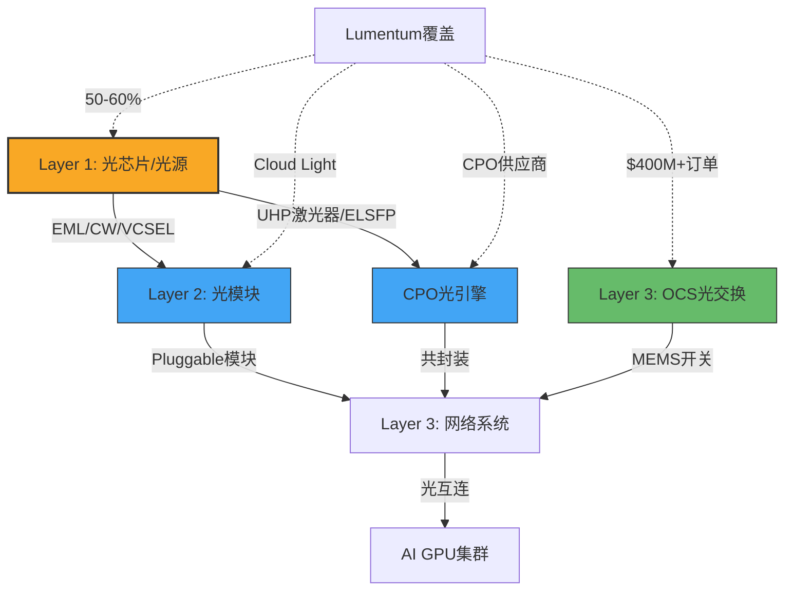
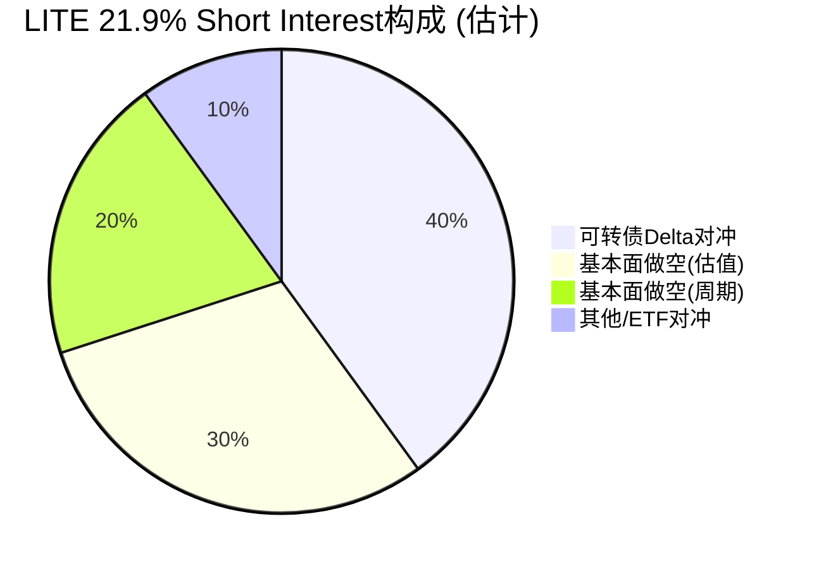
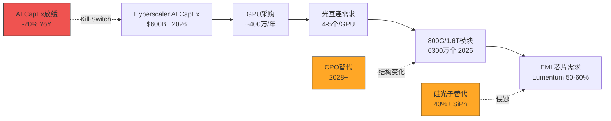

# Phase 1: 业务理解与护城河 — LITE (Lumentum Holdings)
> 2026-04-05 | Phase 1 正文 | 目标60K字符

---

# Ch1: 公司概况与商业模式

## 1.1 Lumentum是谁：从光纤先驱到AI光子学瓶颈供应商

Lumentum Holdings是全球领先的光子学产品公司，2015年从JDS Uniphase(JDSU)分拆上市。这家公司的DNA可以追溯到光通信产业最早期——JDSU曾是2000年光纤泡沫中的标志性公司（市值峰值超过$1000亿，随后崩跌99%）。理解这段历史至关重要：Lumentum的前身经历过光通信行业最极端的繁荣与崩溃周期，而今天它再次站在了一个类似的十字路口。

**核心业务**：Lumentum设计和制造高性能光子产品，主要包括三大品类：

1. **光通信组件**（占收入~85%）：数据中心和电信网络中使用的激光器、调制器、光收发器模块。核心技术是EML（电吸收调制激光器，Electro-absorption Modulated Laser——将电信号转换为光信号的关键芯片，每个高速光模块的"心脏"）和VCSEL（垂直腔面发射激光器）。
2. **光电路交换系统OCS**（快速增长中）：用于数据中心内部的全光交换系统，可以在不经过电信号转换的情况下直接路由光信号。在手订单超$400M [DM-BIZ-001]。
3. **工业与商业激光**（占收入~15%，萎缩中）：用于工业制造、3D传感的激光器。曾经因iPhone Face ID的VCSEL需求而贡献高利润，但苹果转向其他方案后萎缩。

**FY2026分部重组**：从FY2026起，Lumentum将报告分部从"Cloud & Networking + Industrial Tech"重组为"Components"（芯片和光模块组件）和"Systems"（OCS和ROADM系统）。FQ2'26数据 [DM-FIN-003]：Components $443.7M（YoY +68.3%）+ Systems $221.8M（YoY +60.1%）= 总收入$665.5M。

## 1.2 商业模式：从"卖芯片"到"卖芯片+模块+系统"的垂直整合

理解Lumentum商业模式演化的关键在于一个词：**垂直整合**。

**2023年以前（纯组件模式）**：Lumentum主要出售光芯片（EML、VCSEL、相干组件）给下游光模块制造商（如旭创科技、中际旭创），由后者组装成完整的光收发器模块卖给数据中心客户。这是一个高毛利（GAAP GM 46% in FY2022 [DM-FIN-005]）但收入规模受限的模式——因为芯片只占光模块BOM（物料清单）的20-30%。

**2023年Cloud Light收购后（垂直整合模式）**：2023年Lumentum以约$750M收购Cloud Light Technology，获得了光收发器模块的组装和测试能力。这意味着Lumentum可以同时出售：
- **上游**：EML/VCSEL芯片（卖给其他模块商，继续赚组件利润）
- **下游**：完整的光收发器模块（直接卖给数据中心客户，赚取整个价值链利润）

这类似于Intel既卖CPU芯片也卖完整服务器——但在光通信领域，这种"既做组件又做模块"的模式引发了一个战略张力：**你的组件客户（模块商）可能成为你的竞争对手**。

**为什么垂直整合对估值重要？** 因为它直接决定了Lumentum能触达的TAM（Total Addressable Market，可触达市场总量）上限：
- 纯组件模式：TAM = 全球光芯片市场 ≈ $3-5B
- 垂直整合模式：TAM = 全球光收发器模块市场 ≈ $15-20B（2025年估计）
- 含OCS系统：TAM进一步扩展到数据中心光互连系统 ≈ $25-30B

管理层FY2028 $8B收入目标隐含的假设是：Lumentum在垂直整合后的TAM中取得25-35%份额。这个假设是否合理，是CQ2（市占率）的核心问题。

## 1.3 收入结构：6个季度翻倍的增长轨迹

Lumentum正经历其历史上最快的收入增长期。季度收入从FQ4'24的$308M（周期谷底）到FQ2'26的$666M [DM-FIN-011]，6个季度翻倍。Q3'26指引$805M（中位数），隐含QoQ +21%、YoY +85%。

```
季度收入轨迹 ($M):
FQ4'24: $308 (谷底)
FQ1'25: $337 (+9% QoQ)
FQ2'25: $402 (+19%)
FQ3'25: $425 (+6%)
FQ4'25: $481 (+13%)
FQ1'26: $534 (+11%)
FQ2'26: $666 (+25%)  ← 加速
FQ3'26E: $805 (+21%) ← 指引
```

**增长的驱动力是什么？** 一个词：AI数据中心光互连。随着NVIDIA的GPU集群规模从数千台扩展到数十万台，GPU之间的数据传输需求呈指数级增长。每个GPU需要多条高速光连接（800G/1.6T速率）来与其他GPU通信。Lumentum生产这些光连接的核心组件——EML芯片和光收发器模块。

**增长加速的原因**：FQ2'26 QoQ +25%的加速并非偶然。三个因素叠加：
1. **800G产品量产放量**：800G光模块使用4×200G EML（而非之前的4×100G），单价约为100G产品的2倍 [DM-BIZ-002]
2. **供不应求**：需求超供给25-30% [DM-BIZ-003]，意味着Lumentum的产能是瓶颈而非需求
3. **新产能释放**：2025年中EML产能+40%，计划再+40% by 2025底 [DM-BIZ-004]

但增长的可持续性是核心争议——分析师共识预期FY2028收入$6.62B后FY2029下降37%至$4.21B [DM-CON-003, DM-CON-004]。这意味着即使最乐观的卖方也认为这是一个有顶的增长周期，而非永续的结构性增长。

## 1.4 客户结构与集中度风险

Lumentum的客户结构在AI时代发生了根本性变化。

**传统时期（FY2020-2022）**：苹果是第一大客户，3D传感VCSEL贡献了稳定的高利润收入。但苹果逐步转向其他3D传感方案（如dToF），Lumentum的苹果收入从FY2020的~30%萎缩到FY2025的<5%。

**AI时代（FY2024-至今）**：客户结构急剧向Hyperscaler（超大规模云计算商）集中。虽然Lumentum未披露具体客户收入占比（因为许多销售通过分销商/ODM间接实现），但从行业分析可以推断：
- **NVIDIA**：既是客户也是投资者。$2B战略投资 [DM-BIZ-005]包含产能权利和供应锁定——这意味着NVIDIA已经预订了Lumentum的部分产能
- **Meta、Google、Microsoft、Amazon**：这四大Hyperscaler合计占全球AI CapEx的70%以上，是光模块的最终用户
- **中际旭创、光迅科技**：中国光模块制造商是Lumentum光芯片的重要客户

**集中度风险**：AI光模块市场的最终买家（Hyperscaler）高度集中——前4家占70%+需求。这创造了两个对立的动态：
1. **短期定价权**：供不应求→Lumentum可以选择客户、提高价格
2. **长期议价劣势**：当供给追上需求时，4家巨头的采购杠杆极强

更关键的风险是**客户自研**：Google已在内部开发OCS系统，Meta正在评估自研光模块。如果Hyperscaler从"买"转向"自造"，Lumentum的TAM会收缩。这是CQ2的重要子问题。

## 1.5 NVIDIA $2B战略投资：验证信号还是供应链锁定？

2026年3月，NVIDIA宣布向Lumentum投资$2B用于R&D和产能扩张 [DM-BIZ-005]。同时向Coherent（COHR）也投资$2B，合计$4B投入光子学。这是AI光通信历史上最大的单笔战略投资。

**如何解读这$2B？**

**多头解读——终极验证信号**：
- NVIDIA用真金白银（$4B）押注光互连是AI基础设施的瓶颈。这不是口头支持，而是资本承诺
- 投资包含"产能权利"——NVIDIA本质上在预购未来的光模块产能
- NVIDIA同时投资Lumentum和Coherent，说明市场大到需要两家供应商全力扩产

**空头解读——供应链锁定≠看好股价**：
- NVIDIA的投资是为了确保自身GPU供应链不受光模块瓶颈制约，不是为了让Lumentum股东赚钱
- $2B占NVIDIA FY2026预计$50B+现金流的4%——对NVIDIA来说是供应链保险费，不是投资收益预期
- 历史先例：Intel曾大量投资ASML的EUV光刻，但这没有阻止ASML在技术领先后获取定价权，也没有阻止Intel自身的制造困境

**NVIDIA投资条款（Agent数据补充）**[DM-BIZ-005 扩展]：

Agent数据揭示了部分条款：
- **非独家协议**：NVIDIA的投资不锁定Lumentum独家供应NVIDIA→LITE可以继续卖给其他客户
- **数十亿美元级采购承诺**：多年期采购框架协议→收入可见度极高
- **新建美国晶圆制造设施**：$2B中的一大部分用于在美国新建先进激光组件工厂→增加美国产能（政策利好+供应链安全）
- **CPO交付从2027年开始**：明确的CPO订单时间线
- **未确认**：是否有董事会席位、价格保护条款、或优先购买权

**投资形式已确认（Agent数据+SEC 8-K filing）**[DM-NVDA-001]：
- **2,876,415股Series A可转换优先股**，价格$695.31/股
- 可按1:1转换为普通股（NVIDIA选择权，待HSR反垄断审批后）
- **无董事会席位**：NVIDIA不参与董事选举投票
- 稀释：相对pre-deal $6.48B市值稀释约31%——**这是一个巨大的稀释**

**估值含义**：
- 2.88M新增股 + 现有87.8M稀释股 = ~90.7M完全稀释股
- 完全稀释市值：90.7M × $827 = **$75B**（vs 之前的$72.6B）
- 加上现有$3.35B可转债的潜在稀释→**总潜在稀释股可能达到100M+**
- NVIDIA投资价$695.31 vs 当前$827→NVIDIA已浮盈19%

**关键问题**：NVIDIA的$695.31/股投资价意味着什么？它暗示NVIDIA认为$695是合理入场价（或至少是可接受的供应链保险成本）。但这不等于NVIDIA认为$827或更高的价格合理——它只是说明NVIDIA愿意为光模块供应链锁定支付这个价格。

---

# Ch2: AI光通信——结构性革命还是又一次泡沫？(CQ1)

## 2.1 为什么AI需要光：从"锦上添花"到"不可或缺"

传统数据中心中，光通信是"长距离传输"的工具——服务器之间用铜缆，只有机架间/建筑间才用光纤。但AI训练集群改变了这个架构。

**AI训练的通信需求与传统计算根本不同**。一个大型语言模型（如GPT-5/Claude 4级别）的训练需要成千上万个GPU同时协作，每个GPU需要频繁地与其他GPU交换梯度数据。这创造了两个革命性需求：

1. **带宽需求指数级增长**：单个NVIDIA GB200 NVL72机架（72个GPU）需要的总网络带宽是传统服务器的100倍以上。铜缆在距离>3米、速率>400G时就达到物理极限——因此光连接成为唯一选择。

2. **连接密度极高**：每个GPU需要多条800G光连接。一个10万GPU的集群需要数十万条光链路，对应数十万个光收发器模块。

**GPU-to-transceiver转换系数——理解AI光模块需求的核心公式**：

这个系数因集群架构和规模而异，理解它是理解光模块TAM的关键[DM-TAM-005]：

| 集群配置 | 每GPU光收发器数 | 说明 |
|---------|---------------|------|
| NVL72单机架(scale-out) | 1.0个 | 72 GPU→72 OSFP端口，intra-rack用NVLink铜缆 |
| 8机架集群(含leaf) | ~2.7个 | 1.7×800G + 1×400G |
| 128机架集群(含spine) | ~3.9个 | 2.9×800G + 1×400G |
| 1000 GPU全网络 | ~4-5个 | 含NIC+leaf+spine全层级 |

**行业经验法则**：在1:1非阻塞AI训练fabric中，每个GPU对应4-5个光收发器（统计链路两端全层级）。

**为什么理解这个系数如此重要？** 因为它直接连接GPU出货量和光模块TAM：

```
光模块TAM = GPU出货量 × 每GPU光收发器数 × 平均ASP

如果 NVIDIA FY2027出货 ~400万数据中心GPU：
  保守 (3个/GPU, $800 ASP): 400万 × 3 × $800 = $9.6B
  中性 (4个/GPU, $1,000 ASP): 400万 × 4 × $1,000 = $16.0B
  激进 (5个/GPU, $1,200 ASP): 400万 × 5 × $1,200 = $24.0B
```

加上AMD/Intel/自研加速器，$20-30B总AI光模块TAM范围是合理的。这是市场兴奋的根源：光模块从"数据中心的附件"变成了"AI基础设施的核心组件"。但请注意——这个计算高度依赖GPU出货量假设。如果NVIDIA因AI CapEx放缓而出货下降→光模块需求同步下降→这是一个高Beta暴露。

## 2.2 全球光模块TAM：从$14B到$30B+的爆发式扩张

光模块市场正在经历前所未有的扩张。来自多个行业研究机构的数据交叉验证了这一趋势：

**LightCounting（行业最权威数据源）**[DM-TAM-001]：
- 2024年全球光收发器市场~$14B，其中以太网光模块~$10.6B
- **2025年：$23B**（LightCounting 2025年12月更新）——以太网光模块$17B（YoY +60%）
- 2026E：~$30B（隐含30-35%增长）
- 2030E：$40-50B（隐含15-20% CAGR从$30B基数）

**其他机构估计**[DM-TAM-002]：
| 机构 | 2025E | 2029-2034E | CAGR |
|------|-------|-----------|------|
| Markets & Markets | $15.6B | $25.0B (2029) | 13% |
| IMARC | $14.7B | $35.4B (2034) | 10.9% |
| Fortune Business Insights | — | $46.1B (2034) | 17% |
| Grand View Research | $15.4B | — | — |

注意LightCounting $23B显著高于其他机构的$15-16B——原因是LightCounting使用更宽的口径（含active optical cables和内部光引擎），且更敏锐地捕捉了AI驱动的加速。Markets & Markets等机构的预测可能滞后于2025年的爆发。

**AI光模块专项TAM**[DM-TAM-003]：
- LightCounting：AI集群光学（AI cluster optics）2024年$5B → 2026E >$10B（两年翻倍）
- AI集群光学占总市场：2024年~22% → 2026E ~33%+
- Hyperscaler CapEx $443B (2025) → $600B+ (2026)，其中75%（~$450B）直接用于AI
- 光网络占数据中心CapEx的3-5%→隐含$13-22B AI光学支出（2026年）

**800G出货量数据——最硬的验证信号**[DM-TAM-004]：
- Cignal AI数据：400G+800G数据通信模块2024年出货**2000万个**，收入~$9B
- 800G+模块2025年预计出货**2400万个** → 2026年**6300万个**（YoY 2.6倍）
- 这不是预测——2400万和6300万是基于在手订单和产能承诺的数字

**GPU-to-transceiver转换系数——TAM计算的核心参数**[DM-TAM-005]：

这个系数因集群架构和规模而异：

| 集群规模 | 每GPU光收发器数 | 构成 |
|---------|---------------|------|
| NVL72单机架 | 1.0个 | 72 GPU → 72 OSFP端口（scale-out） |
| 8机架集群 | ~2.7个 | 1.7×800G + 1×400G（含交换层） |
| 128机架集群 | ~3.9个 | 2.9×800G + 1×400G（含spine交换） |
| 1000 GPU集群 | ~4.0个 | 含服务器NIC+leaf+spine全路径 |
| 1000 GPU（全双工） | ~10个 | 含链路两端所有收发器 |

**行业经验法则**：在1:1非阻塞AI训练网络中，每个GPU对应**4-5个光收发器**（统计链路两端所有层级）。

**TAM计算验证**：如果NVIDIA FY2027出货~400万数据中心GPU × 4-5个光收发器 × $1,000平均ASP = **$16-20B**仅来自NVIDIA相关需求。加上AMD MI300X系列和其他加速器→$20-25B总AI光模块需求，与LightCounting的$23-30B范围吻合。

**TAM扩张的三个驱动力**：

**驱动力1——速率升级（ASP提升）**：
从400G→800G→1.6T→3.2T，每一代速率翻倍，单价提升30-80%。2026年是"1.6T元年"（Tier-1云厂商开始部署）[DM-TAM-006]。时间线：800G（2025-2026主力）→1.6T（2026-2027放量）→3.2T（2028-2029早期）。1.6T模块需要更多200G EML→直接利好Lumentum。

**驱动力2——GPU出货量增长（数量增加）**：
NVIDIA数据中心收入从FY2024的$47.5B增长到FY2026预计$130B+，隐含GPU出货量年增50-80%。每个GPU需要配套光模块→光模块出货量同步增长。

**驱动力3——架构变化（每GPU所需连接数增加）**：
随着集群规模从1万GPU扩展到10万GPU甚至100万GPU，网络拓扑复杂度指数增长。每个GPU的平均光连接数从2-4个可能增加到6-8个。

**反面——TAM预测的三个不确定性**：
1. **GPU增速能持续吗？** Hyperscaler AI CapEx-to-AI revenue ratio约6:1（$380B投入 vs $50-60B AI云收入）[DM-TAM-007]——比2000年电信泡沫时更差。Bain估计AI投资与AI可实现收入之间有**$800B缺口**。如果AI应用层在2-3年内无法缩小这个缺口，CapEx回调不可避免
2. **铜缆延伸**：下一代PAM4 SerDes可能将铜缆距离延伸到5-7米，对短距离应用侵蚀光模块需求
3. **CPO替代**：Co-Packaged Optics可能在2027-2028年开始替代部分pluggable光模块（详见CQ8）

**管理层目标验证**：$8B年化目标（FY2028）隐含的全球光模块TAM需要≥$25-30B（假设Lumentum取25-30%份额）。以LightCounting 2026E $30B的增速外推，2028年$35-45B是可能的——这意味着管理层目标在TAM层面**并非不合理，但需要一切顺利**：TAM达标 + 份额不下滑 + Cloud Light整合成功 + OCS放量。任何一个环节失误都会使$8B目标打折。

## 2.3 结构性 vs 周期性：这是核心争议

**多头论证——"这次不一样"**：
1. **AI推理需求永续增长**：训练可能有周期，但推理（inference）随AI应用普及持续增长。推理通信量最终可能超过训练。
2. **GPU集群是持续扩建的**：不像2000年光纤泡沫时铺了管道却没有流量，今天的AI应用（ChatGPT 10亿用户+）已经在产生真实的流量需求。
3. **速率升级周期持续**：每2年一代的速率升级（800G→1.6T→3.2T）创造持续换机需求，而非一次性建设。

**空头论证——"历史在押韵"**：
1. **FY2029共识预期已经回落37%** [DM-CON-004]：即使最乐观的卖方也预期2028后收入下降。如果连卖方都不相信"永续增长"，市场凭什么给100x+ PE？
2. **Hyperscaler CapEx周期性极强**：过去10年，大型云厂商的CapEx经历过2-3次20-30%的年度下降。AI CapEx没有理由免疫周期。
3. **产能过剩正在酝酿**：NVIDIA同时投资Lumentum和Coherent各$2B → 两家全力扩产 → 2027-2028年供给可能追上甚至超过需求 → 从"供不应求"翻转为"供过于求" → 价格战。
4. **历史基准率不支持"这次不一样"**：2000年光纤泡沫、2010-2011年4G光模块热潮、2017-2018年100G升级周期——每次都以产能过剩结束。基准率：3/3次光通信繁荣以周期性回落结束。

**我们的判断框架**：

| 维度 | 结构性特征 | 周期性特征 | LITE当前 |
|------|----------|----------|---------|
| 需求驱动 | 终端应用拉动 | CapEx推动 | **CapEx推动为主** |
| 供给响应 | 供给有硬瓶颈 | 供给可快速扩张 | **供给正在快速扩张** |
| 客户行为 | 持续采购 | 集中下单后暂停 | **尚不确定** |
| 定价趋势 | 稳定或上涨 | 先涨后跌 | **当前上涨(供不应求)** |
| 历史先例 | 无先例可比 | 有多次先例 | **有3次光通信先例** |

**结论 [B级]**：AI光模块需求的底层驱动（GPU集群光互连）是真实的、结构性的。但需求的**节奏**几乎确定是周期性的——FY2028峰值后回落的概率>70%（基于历史基准率3/3+共识预期+CapEx周期规律）。核心问题不是"AI光模块需求是否真实"（答案：是），而是"$73B市值需要的需求持续性是否真实"（答案：极不确定）。

**证伪条件**：如果FY2028后光模块收入仅回落<10%（而非共识的-37%），说明需求比预期更具结构性→需上修估值。

## 2.3.5 AI CapEx可持续性深度分析——$800B缺口的含义

**这是决定LITE估值的最根本变量**——不是EML市占率，不是CPO风险，而是AI基础设施投资能否持续。

**当前投入规模**[DM-TAM-007]：
- 2025年Hyperscaler AI CapEx: ~$443B
- 2026年预计: >$600B (+36% YoY)
- 前5大云厂商(MSFT/GOOGL/META/AMZN/AAPL)合计2026 CapEx承诺: >$350B

**投入vs回报的巨大缺口**：
- AI基础设施投入: ~$380B/年（2025年）
- AI应用层收入（不含基础设施卖铲收入）: ~$50-60B/年
- **CapEx/Revenue ratio: ~6:1**
- 对比：2000年电信泡沫时期telecom CapEx/telecom revenue ≈ 4:1
- Bain估计这个缺口在2026年达到**$800B**

**这意味着什么？** 简单地说，AI行业每赚$1收入，就需要投入$6的基础设施。这在任何行业都是不可持续的——除非以下条件之一成立：

**条件1："亏损式扩张"可以持续**：
- 如果Hyperscaler愿意持续"烧钱"建AI基础设施（像Amazon早期电商那样），CapEx可以在5-10年内保持高位
- 支撑论据：Hyperscaler有充足现金流（合计FCF $300B+/年），可以承受持续投入
- 反论据：股东早晚会施压。Meta在2022年元宇宙CapEx上涨时股价跌了60%——如果AI CapEx无法快速产生ROI，历史可能重演

**条件2：AI应用收入快速增长填平缺口**：
- 如果AI应用层收入从$60B增长到$300B+/年（5年内5x），则CapEx/Revenue比改善到可持续水平
- 支撑论据：ChatGPT用户过亿、AI编程工具普及、企业AI采纳加速
- 反论据：MIT研究95%的AI试点失败→企业AI采纳速度可能远慢于预期。当前AI收入增长主要来自基础设施层（NVIDIA卖GPU），不是应用层

**条件3：CapEx自然回落但不崩溃**：
- "软着陆"情景：AI CapEx从+36%增长逐步降至+5-10%/年，但不出现负增长
- 支撑论据：这是最可能的基准情景。Hyperscaler不会突然停建数据中心，但增速会放缓
- 含义：对LITE意味着收入增速放缓（从+85% YoY降至+10-20%）而非收入下降

**对LITE的直接影响**：

| AI CapEx情景 | LITE收入影响 | 概率 |
|-------------|------------|------|
| CapEx持续+30%/年 | FY2028 $8B可达 | 15% |
| CapEx降至+10-15%/年 | FY2028 $5-6B | 40% |
| CapEx持平(0%) | FY2028 $3-4B | 30% |
| CapEx下降(-20%+) | FY2028 $2-3B | 15% |

**概率加权FY2028收入**：0.15×$8B + 0.40×$5.5B + 0.30×$3.5B + 0.15×$2.5B = **$4.7B**——显著低于管理层$8B目标和共识$6.6B。这个差距反映了我们对AI CapEx可持续性的更悲观（但我们认为更现实）判断。

**但请注意**：这个估计有巨大的不确定性。如果AI应用层在2027年出现"杀手级应用"（如完全自主的AI agent）→条件2可能成立→上修到$6-8B。这就是为什么LITE的投资判断本质上是对"AI CapEx周期持续多久"的押注。

## 2.4 2000年光纤泡沫对比：相似与差异

将当前AI光通信热潮与2000年光纤泡沫对比是不可回避的——因为Lumentum的前身JDSU恰好是那次泡沫的标志性公司。

**2000年泡沫精确数据**（全部经Agent验证）[DM-BUBBLE-001]：

| 公司 | 峰值市值 | 峰值收入 | 市值/收入 | 跌幅 | 结局 |
|------|---------|---------|----------|------|------|
| JDSU | >$140B | $3.2B (FY01) | **44x** | **-99.4%** | 拆分为LITE+Viavi |
| Nortel | C$398B | $30.3B | 9x | -99.6% | 2009年破产 |
| Ciena | 股价$1,046 | $1.6B (FY01) | — | -99.7% | 存活但26年未恢复 |
| Corning | 股价$110+ | $7.1B | — | -98.7% | 存活, **26年才恢复市值** |

**JDSU详细数据**：峰值季度收入$920M (2000年12月)→崩溃至~$300M/Q。取了**$46B商誉减值**——当时史上最大。股价从$355跌至<$2。

**泡沫根因**：(1) WorldCom伪造数据声称"互联网流量每100天翻倍"（实际是年度翻倍）→运营商过度投资 (2) 85-95%已铺设光纤闲置（"dark fiber"）(3) WDM技术使单根光纤容量增加100倍→消除了对新光纤的需求 (4) >$500B债务融资的电信投资 (5) 大面积会计欺诈(WorldCom, Nortel, Global Crossing)

**当前LITE vs JDSU对比**[DM-BUBBLE-002]：

| 维度 | JDSU (2000峰值) | LITE (当前) |
|------|----------------|------------|
| 市值/收入 | 44x | **35x TTM, 25x FY26E** |
| 收入/市值 (逆向) | 0.023 | **0.028** |
| CapEx-to-终端收入比 | ~4:1 | **~6:1** ($380B AI CapEx vs $60B AI收入) |
| 客户质量 | WorldCom/Global Crossing(后破产) | MSFT/GOOGL/META/AMZN(FCF $300B+) |
| 需求验证 | 无(dark fiber) | 有(AI应用真实使用) |
| 会计问题 | 广泛欺诈 | 未发现 |

**一个令人不安的数据点**：AI CapEx-to-AI revenue ratio约**6:1**（$380B投入 vs $50-60B AI云收入）[DM-BUBBLE-003]——**比2000年电信泡沫的比率更差**。Bain估计AI投资与可实现AI收入之间有**$800B缺口**。MIT研究��明**95%的AI试点项目未能产生有意义的结果**。

这并不意味着AI是骗局——电力在19世纪也经历了过度投资期，最终证明了价值。但它意味着**当前的投资速度远超过当前的回报验证**。如果Hyperscaler在FY2028后开始要求AI部门证明ROI→AI CapEx可能从+36% YoY增长转为0%甚至负增长→光模块需求断崖式下降。

**综合判断 [B级]**：

**不同之处（利好）**：
1. 客户是现金流极强的Hyperscaler，不是将破产的电信公司
2. AI已有真实应用和真实流量（ChatGPT 10亿+用户）
3. 光模块每2年升级（800G→1.6T→3.2T），不是"铺一次用20年"
4. NVIDIA $4B战略投资是2000年泡沫中没有的信号

**相同之处（利空）**：
1. 市值/收入比几乎相同（35x vs 44x）——都是极端乐观定价
2. 都由基础设施CapEx驱动，终端ROI未充分验证
3. 都伴随大量产能扩张和新进入者
4. 内部人都在高位大量卖出
5. **CapEx-to-revenue比率甚至更差**(6:1 vs ~4:1)

**结论**：当前AI光通信**不是**2000年泡沫的简单重演——底层需求更真实。但**估值倍数的相似性+更差的CapEx回报比率**意味着如果AI CapEx出现任何放缓信号，"泡沫叙事"会迅速主导股价。恐惧传播的速度远快于基本面恶化���速度——JDSU从峰值到-90%只用了12个月。

---

# Ch3: EML垄断——Lumentum最核心的竞争优势 (CQ2)

## 3.1 什么是EML，为什么它是AI光模块的"心脏"

EML（Electro-absorption Modulated Laser，电吸收调制激光器）是高速光收发器模块中最关键的有源组件。理解它的作用最简单的类比：如果光收发器是一辆汽车，EML就是发动机——没有它，整台车不能工作。

**EML的技术原理（一句话）**：将电子数据信号转换为调制的光信号，以极高速率（100G/200G per lane）在光纤中传输。

**为什么EML而非其他激光器？** 在800G/1.6T速率下，光模块需要200G/lane的传输速率。能达到这个速率的激光器方案主要有三种：

| 方案 | 优势 | 劣势 | 当前可行性 |
|------|------|------|----------|
| **EML** | 成熟、可靠、良率高 | 成本较高、功耗较大 | **唯一量产方案** |
| 硅光子 | 低成本、可集成 | 良率低、200G/lane未成熟 | 研发阶段 |
| 薄膜铌酸锂(TFLN) | 超低功耗 | 制造困难、规模化未验证 | 早期原型 |

**关键事实**：截至2026年4月，EML是唯一能大规模量产200G/lane的方案。这意味着所有800G光模块（4×200G）和未来的1.6T模块（8×200G或4×400G）都依赖EML芯片。在AI光模块需求爆发的当下，控制EML供给=控制整个光模块供应链的咽喉。

## 3.2 Lumentum的EML垄断地位：50-60%全球份额

Lumentum在高端EML市场的地位是其最核心的竞争优势。

**市场份额**：Lumentum在200G/lane EML市场占据50-60%份额 [DM-BIZ-006]，是**唯一**大规模出货200G/lane EML的供应商。在100G/lane EML市场，Lumentum的份额约30-40%，与Coherent（前II-VI）和三菱电机共享市场。

**为什么垄断？** EML芯片的制造是一项极端困难的工艺：
1. **外延生长**：在InP（磷化铟）衬底上用MBE（分子束外延）或MOCVD（金属有机化学气相沉积）逐层生长半导体薄膜，厚度精度要求原子级（纳米量级）。任何污染或温度偏差都会导致良率崩溃。
2. **光电集成**：EML需要在单个芯片上集成DFB激光器（发光区）和EA调制器（调制区），两者的带隙需要精确匹配。这是一个"know-how"密集型的制造过程，需要数十年的工艺积累。
3. **测试筛选**：每颗EML芯片都需要在多个温度、电流、光功率条件下测试，筛选出满足规格的芯片。200G EML的筛选良率比100G低20-30%。

**良率壁垒=时间壁垒**：一个新进入者从零开始达到量产级200G EML良率，行业估计需要3-5年。这意味着在2026-2028年的AI光模块需求高峰期，Lumentum的垄断地位几乎不可挑战。

**定价权证据**：
- 200G EML单价约为100G的2倍 [DM-BIZ-002]——速率翻倍、价格翻倍，而非摩尔定律式的"性能翻倍、价格减半"
- 需求超供给25-30% [DM-BIZ-003]——典型的卖方市场
- 2025年中EML产能+40%，计划再+40% [DM-BIZ-004]——Lumentum在全力扩产仍满足不了需求

## 3.3 竞争格局：谁在追赶？硅光子威胁有多大？

### 3.3.1 EML直接竞争者

**Coherent Corp (COHR) — 最有能力的追赶者**[DM-COMP-001]：
Coherent正在建设全球首条**6英寸InP晶圆产线**——这是一个重大的制造创新。传统EML使用3-4英寸InP晶圆，6英寸意味着每片晶圆产出芯片数增加2-3倍→成本优势显著。Coherent的目标是在2026年底前将InP产能翻倍（目前完成~80%）。200G EML正在qualification中，已向多个客户送样。

Coherent vs Lumentum的全面对比：

| 维度 | Lumentum | Coherent |
|------|----------|----------|
| EML份额 | 50-60% (#1) | #2 (估计20-25%) |
| 200G EML状态 | **唯一量产** | 正在qualification |
| InP晶圆尺寸 | 3-4英寸 | **6英寸 (成本优势)** |
| 技术路线 | InP EML专注 | **三路线：SiPh + InP EML + GaAs VCSEL** |
| NVIDIA投资 | $2B | $2B (等额) |
| 垂直整合 | 芯片→模块→系统 | 芯片→模块 + SiC功率 |

**关键判断**：Coherent的6英寸InP晶圆是一个被低估的竞争变量。如果Coherent在2027年实现200G EML量产+6英寸成本优势→Lumentum的定价权将被显著侵蚀。NVIDIA同时向两家各投$2B，本身就是"培养第二供应商"的信号——NVIDIA不希望单一供应商锁定。Lumentum+Coherent合计占merchant EML 80%+——但双寡头比单一垄断的定价权弱得多。

**其他EML竞争者**：三菱电机（电信级EML深厚，数据中心规模化不足）、住友电工/古河电工（利基产品，不构成主流竞争）。

### 3.3.2 硅光子——比预期更快的替代威胁

硅光子（Silicon Photonics, SiPh）是EML面临的最大技术替代威胁，**且进展速度比Phase 0预判的更快**[DM-COMP-002]。

**硅光子在800G市场的渗透率**：
- 2024年：~10%（几乎全部来自Broadcom内部消耗）
- 2025年：20-30%
- **2026年中：可能达到40-45%**

这意味着硅光子**不是**"遥远的未来威胁"——它**已经在当下**以每年翻倍的速度蚕食EML在pluggable市场的份额。

**为什么硅光子增长这么快？**
1. **成本结构性优势**：硅光子使用CW激光器（continuous wave，连续波）作为光源，通过硅基调制器完成信号调制。1.6T硅光子模块需要2个CW激光器 vs EML方案需要4-8个EML芯片→激光器成本降50%+
2. **制造可扩展性**：硅光子使用200/300mm标准硅晶圆厂→利用GlobalFoundries/TSMC等已有产能→规模经济远超3-4英寸InP晶圆
3. **Broadcom垂直整合推动**：Broadcom将DSP+SerDes+光学引擎全部自研→在自家产品中大规模采用硅光子→以客户身份验证了技术可行性

**但EML仍有关键优势**：
1. **成熟度**：200G/lane EML已量产2年+，硅光子200G/lane尚未完全成熟
2. **性能**：EML的信号质量（消光比、带宽）在长距离传输中仍优于硅光子
3. **功耗**：在某些应用场景中EML功耗反而低于硅光子（因为硅调制器需要更多电能）

**1.6T时代的技术路线竞争**[DM-COMP-003]：
2026年是"1.6T元年"。1.6T模块有四种技术路线并行：

| 方案 | 配置 | 主推者 | 状态 |
|------|------|--------|------|
| 4×400G 差分EML | Lumentum OFC 2026原型 | Lumentum | 原型展示 |
| 8×200G EML | 成熟技术简单扩展 | 多家 | 量产准备中 |
| 硅光子 | CW激光+硅调制 | Broadcom, Intel | 2027年成熟 |
| 200G VCSEL | 短距离最低成本 | Coherent, Lumentum | H2 2026 ramp |

**预期1.6T市场份额（2027年稳态）**：EML ~45-55% + SiPh ~30-40% + VCSEL ~10-15%。EML仍是最大单一技术，但不再垄断——这与800G时代EML占80%+的格局根本不同。

**对Lumentum的量化影响**：
- 800G：EML份额从80%+逐步降至55-65%（2026-2027年），但TAM仍在增长→绝对收入增加
- 1.6T：EML从一开始就只占45-55%→Lumentum需要在更小的份额上竞争
- **关键缓冲**：Lumentum也可以为硅光子模块提供CW激光器→即使EML被替代，仍有光源业务
- **真正危险的时点**：需求增速放缓 + 份额流失 同时发生（可能在FY2028-2029年）

### 3.3.3 中国光芯片追赶——落后但不可忽视

中国公司在光模块**组装**领域已占全球~60%份额，但在EML**芯片**层面仍严重依赖Lumentum和Coherent[DM-COMP-004]。

| 中国公司 | 2025年收入 | EML芯片能力 |
|---------|-----------|-----------|
| 中际旭创 (Innolight) | ~$3.3B (+114% YoY) | **外购Lumentum/Coherent** |
| 亿缆通 (Eoptolink) | ~$1.2B (+175% YoY) | 外购 |
| 光迅科技 (Accelink) | 增长中 | 100G EML已发布，**无确认批量交付** |
| 长飞光纤 (Everbright) | 增长中 | DFB/PIN已出货，EML早期 |
| 海信宽带 (Hisense) | 显著 | 模块组装only |

**咽喉要道依然存在**：中国模块商仍依赖Lumentum/Coherent的EML芯片 + Broadcom/Marvell的DSP芯片。100G EML芯片的中国替代已在实验室/小规模阶段，但无确认的批量交付——这意味着在200G EML层面，中国落后至少3年。

**地缘博弈双面性**：
- 如果美国将高速EML纳入出口管制→短期损失中国客户（Lumentum约10-15%收入来自中国间接客户），但长期阻止中国追赶（正面）
- 如果不管制→中国追赶速度可能在5年内显著缩短EML差距

**竞争格局核心判断更新（Phase 1 vs Phase 0）**：Phase 0认为"EML垄断在800G/1.6T时代安全"——Phase 1数据表明这个判断需要修正。硅光子在800G已达40%+渗透率，Coherent的6英寸InP追赶，意味着**Lumentum的EML定价权衰减速度比预期更快**。这不改变"短期收入仍在高速增长"的事实，但改变了"护城河持久性"的评估——从"3-5年安全"下修为"2-3年仍有优势，但优势在快速收窄"。

## 3.4 护城河量化：六维评估

按半导体行业模块M4的C1-C6框架评估Lumentum的护城河：

### 3.4.0 定价权分层分析 (B4评估)

在评估护城河之前，需要先理解Lumentum的定价权——因为定价权是护城河强度最直接的财务体现。

**定价权的来源**：Lumentum当前的定价权来自一个简单的供需不对称——需求超供给25-30% [DM-BIZ-003]。在供不应求的市场中，卖方可以选择客户、提高价格、拒绝议价。这是一种**周期性定价权**（来自供需失衡），而非**结构性定价权**（来自不可替代性）。

**按客户层的定价权评估**：

| 客户层 | 定价权Stage | 证据 | 持续性 |
|--------|-----------|------|--------|
| NVIDIA(战略客户) | 3.5/5 | $2B投资含采购承诺→锁定价格+量 | **高**(合同锁定) |
| Hyperscaler直接 | 2.5/5 | 供不应求→可提价, 但Hyperscaler议价能力极强 | **中**(供需平衡后下降) |
| 中国模块商 | 3.0/5 | 200G EML唯一来源→没有替代 | **高**(短期无替代) |
| 小型OEM | 4.0/5 | 量小→Lumentum可以挑选是否供应 | **低**(需求弱时先被砍) |

**加权B4**：0.35×3.5 + 0.30×2.5 + 0.25×3.0 + 0.10×4.0 = **3.12/5**

**3.12/5的含义**：在半导体行业，加权B4 3.0-3.5属于"中强"级别（AVGO约4.0, 设备商约2.5, 存储<2.0）。Lumentum的定价权优于大多数半导体组件商，但弱于真正的垄断者。

**关键风险——定价权的脆弱性**：
当供需平衡从"供不应求"翻转为"供需平衡"或"供过于求"时：
- NVIDIA锁定的合同量不受影响（合同保护）
- 但Hyperscaler和中国模块商的定价权可能从3.0降至1.5-2.0→加权B4从3.12降至2.3-2.5
- 时间窗口：2027-2028年（Coherent扩产+硅光子渗透→供给追上需求）
- 定价影响：EML ASP可能下降15-25%→直接冲击毛利率2-4pp

### C1 转换成本：6.5/10
光模块制造商（如中际旭创）将Lumentum EML集成到产品设计中后，切换到其他供应商的EML需要重新qualification（资质认证），通常需要6-12个月。在当前供不应求的环境下，客户不敢贸然切换。
- **增强因素**：200G EML只有Lumentum大规模量产→客户无替代选择
- **削弱因素**：如果Coherent的200G EML在2027年成熟，切换成本会显著下降

### C2 网络效应：2.0/10
光芯片行业几乎没有网络效应。更多客户使用Lumentum的EML不会让产品变得更好（不同于社交网络或软件平台）。
- **微弱例外**：更多客户→更大产量→更好的良率学习曲线→成本优势

### C3 品牌/IP：8.0/10
EML制造的核心在于工艺know-how，这是几十年积累的隐性知识，不完全体现在专利中。Lumentum在InP光子集成领域拥有深厚的IP积累。
- **增强因素**：工艺know-how无法通过专利许可获取→真正的"不可替代性"
- **削弱因素**：如果硅光子技术路线胜出，InP know-how的价值会大幅缩水

### C4 规模经济：7.0/10
EML制造有显著的规模经济：固定成本高（clean room、MBE设备、qualification成本）、边际成本低（每颗芯片的材料成本极低）。Lumentum的产量领先地位带来良率和成本优势。
- **增强因素**：最大产量→最佳良率→最低成本→竞争者更难追赶的正循环
- **削弱因素**：Coherent获得NVIDIA $2B后也在大规模扩产，规模差距可能收窄

### C5 进入壁垒：8.5/10
新进入者面临的壁垒极高：
- 资本壁垒：建设一条200G EML产线需$500M-$1B投资
- 时间壁垒：从零到量产级良率需3-5年
- 人才壁垒：全球InP光子学工程师数量有限（估计<5,000人）
- 客户壁垒：下游客户不会冒险使用未经验证的新供应商

### C6 政策/监管：5.0/10
光通信芯片目前未被列入美国对华出口管制清单（与先进制程逻辑芯片不同）。但地缘政治风险存在——如果美中技术脱钩加剧，光芯片可能被纳入管制。
- **双面影响**：管制会限制对华销售（负面），但也阻止中国竞争者获取技术（正面）

### 收入加权护城河指数

| 业务线 | 收入占比 | 加权C1-C6 | 贡献 |
|--------|---------|----------|------|
| 200G EML芯片 | 35% | 7.5 | 2.63 |
| 100G EML/VCSEL | 20% | 5.5 | 1.10 |
| 光收发器模块 | 30% | 5.0 | 1.50 |
| OCS系统 | 10% | 6.5 | 0.65 |
| 工业激光 | 5% | 3.0 | 0.15 |
| **加权总计** | **100%** | | **6.03** |

**护城河指数6.03/10**——在半导体行业属于"强"级别（基准：垄断7+, 强5-7, 弱<5）。核心驱动力是200G EML的技术垄断（C3+C5极高），但被光模块和工业激光的较弱护城河拉低。

**关键风险：护城河的时间衰减**

Lumentum的护城河最大特点是**时间敏感性**。当前的垄断地位建立在"200G EML唯一量产供应商"这个事实上——但这个事实有明确的到期日：
- 2027-2028年：Coherent的200G EML可能达到量产水平→份额从50-60%降至40-45%
- 2028-2030年：硅光子方案成熟→对EML形成技术替代压力
- 2029+：CPO开始规模化→pluggable模块需求可能下降

**护城河年衰减率估计：0.3-0.5/年**——属于"较快衰减"。这意味着2026年的护城河指数6.0到2029年可能降至4.5-5.0。投资者不能把当前的垄断地位外推到永续。

---

# Ch4: Cloud Light整合与垂直整合战略 (CQ5)

## 4.1 Cloud Light收购：$750M买了什么？

2023年11月8日，Lumentum完成对Cloud Light Technology Limited的收购[DM-ACQ-001]。Cloud Light总部位于香港，在中国、台湾和泰国有制造设施。

**收购细节**：
- **价格**：约$730-750M现金（从资产负债表支付）+ Cloud Light未归属期权替代
- **卖方**：Asia-IO Advisors + Ace Equity Partners + 长飞光纤(Yangtze Optical Fibre)
- **获得资产**：光收发器模块的设计、组装、测试能力。收购时Cloud Light LTM收入>$200M，几乎全部来自400G+速率，**其中约一半来自800G模块**——这意味着Cloud Light在收购时已经是800G模块的先行者

**Purchase Price Allocation（10-K披露）**[DM-ACQ-002]：

| 项目 | 金额 |
|------|------|
| 商誉 | $365.8M |
| 已开发技术 | $170.0M |
| 客户关系 | $130.0M |
| 在研项目 | $16.0M |
| 订单积压 | $14.0M |
| 商标 | $3.0M |
| **无形资产合计** | **$333.0M** |
| 有形资产等 | ~$51M |

注意：资产负债表上的$1,060.9M商誉 [DM-BAL-004]是Cloud Light($365.8M) + NeoPhotonics(2022年收购, $694M商誉)的合计，并非全部来自Cloud Light。

**收购的财务影响**：
- 收购相关无形资产摊销每季度约$19.6M（FQ2'26数据 [DM-ACQ-003]）+ 收购相关质保准备金$9.8M = 合计每季度~$30M GAAP利润拖累
- 这直接解释了GAAP GM 36.1% vs Non-GAAP GM 42.5%的6.4pp差异中的**大部分**

## 4.1.5 关键新发现：垂直整合直到2026夏天才真正开始

**这是Phase 1最重要的新发现之一**[DM-ACQ-004]。

Agent数据揭示：**Lumentum自家EML芯片整合进Cloud Light模块的工作预计到2026年夏天才完成**。这意味着：
- 从2023年11月收购到2026年夏天=**整合周期约2.5年**
- 在此之前，Cloud Light模块主要使用外部采购或legacy组件——**尚未充分捕获垂直整合红利**
- 1.6T收发器（首个完全利用Lumentum自家200G/lane EML的产品）预计2026年夏天开始出货

**这个发现改变了什么？**
1. 管理层FY2028 $8B目标中的垂直��合贡献可能被高估——因为真正的整合红利直到FY2027才开始体现
2. 当前的毛利率改善（36.1% GAAP GM）主要来自收入规模和产品mix，**而非垂直整合协同**——真正的协同效应是"待兑现"状态
3. 好消息是：2026夏天→FY2028还有~2年→如果整合成功，FY2028确实可以受益

**OFC 2026验证**：Lumentum在OFC 2026（2026年3月）展示了**1.6T DR4 OSFP原型**，使用4个Lumentum自研400G差分EML激光器——这是垂直整合的技术验证，但尚未量产。Cloud Light品牌作为产品线保留（Lumentum官网仍有"CloudLight Datacom Transceivers"页面）。

## 4.2 垂直整合的战略价值

**价值创造逻辑**：
1. **BOM成本控制**：自产EML芯片+自组装模块，消除中间环节加价。估计垂直整合可节省15-25%的模块BOM成本
2. **供应链保障**：在芯片短缺时期，自有芯片供应优先保障自家模块生产
3. **技术协同**：芯片设计团队和模块设计团队在同一屋檐下→更快的产品迭代→更高的芯片-模块集成度
4. **TAM扩张**：从$3-5B光芯片市场扩展到$15-20B+光模块市场

**竞争对标**：

| 维度 | Lumentum (LITE) | Coherent (COHR) | 中际旭创 |
|------|----------------|-----------------|---------|
| 芯片自研 | ✅ EML/VCSEL | ✅ EML/VCSEL/SiC | ❌ 外购 |
| 模块组装 | ✅ (Cloud Light) | ✅ (历史积累) | ✅ (核心能力) |
| 系统集成 | ✅ (OCS/ROADM) | ⚠️ 有限 | ❌ |
| 垂直整合度 | **最高** | **高** | **中** |

Coherent的垂直整合程度与Lumentum类似（芯片到模块），但Lumentum在OCS系统层面有额外优势。中际旭创是模块组装龙头，但核心芯片依赖Lumentum和Coherent——这使得中际旭创既是Lumentum的客户，也是竞争对手。

## 4.3 整合风险与挑战

**风险1——渠道冲突**：
Lumentum开始卖完整模块后，其EML芯片客户（如中际旭创、光迅科技）可能视其为竞争对手，转向Coherent采购芯片。这是垂直整合的经典两难：**每多卖一个模块，可能少卖两颗芯片**。Lumentum需要在"模块收入增长"和"芯片客户流失"之间找到平衡。

**风险2——商誉减值**：
$1,060.9M商誉+$396.7M无形资产——如果光模块市场不如预期，这些资产面临减值风险。不过在当前需求爆发期，减值风险极低。真正的减值测试窗口在FY2029-2030年（如果市场回落）。

**风险3——整合执行**：
跨国收购（美国公司收购中国子公司）面临文化整合、管理层留存、知识转移等挑战。新CEO Michael Hurlston在Broadcom（以整合能力著称）有16年经验，这可能是利好因素。但目前缺乏公开数据来验证整合进展。

**我们的评估 [B级]**：Cloud Light收购从战略方向上是正确的——垂直整合是应对AI光模块需求爆发的最佳定位。但$1.46B的资产负债表影响意味着如果整合不成功或市场回落，Lumentum面临显著的减值风险。当前处于"整合红利期"（收入高速增长掩盖一切），真正的检验在FY2029+。

## 4.4 垂直整合的"渠道冲突"深度分析——卖芯片还是卖模块的两难

这是Lumentum面临的最微妙的战略挑战，值得深入分析。

**核心困境**：Lumentum的200G EML芯片卖给两类客户：
1. **自家Cloud Light工厂**：用于组装成完整的光收发器模块
2. **外部模块商（中际旭创、亿缆通等）**：他们用Lumentum的EML组装自己品牌的模块

当Lumentum开始用Cloud Light卖模块时，它同时与自己的芯片客户竞争。这创造了一个博弈论困境：

**情景分析**：

**情景A：LITE优先供应自家模块**
- 好处：模块收入($800-1500/个) > 芯片收入($100-300/个) → 单位收入最大化
- 坏处：外部模块商转向Coherent采购EML → LITE失去芯片客户 → Coherent获得规模+良率改善 → 加速追赶

**情景B：LITE平衡供应芯片和模块**
- 好处：维持芯片客户关系 + 模块业务增长
- 坏处：在模块市场只有部分产能 → 无法与中际旭创的规模（$3.3B收入）竞争 → "两头不大"

**情景C：LITE以芯片为主、模块为辅**
- 好处：维持EML垄断生态（所有模块商依赖LITE芯片） → 最大化定价权
- 坏处：放弃Cloud Light整合的TAM扩张故事 → 收入上限较低

**管理层选择了什么？** 从迹象看，管理层选择了**情景A和B之间的折中**——但偏向A：
- Cloud Light模块正在大规模放量（FQ2'26 Components $443.7M中包含大量模块收入）
- 同时继续向外部模块商供应EML芯片（中际旭创等仍是客户）
- 1.6T产品（2026夏天开始）将是首个完全使用自家EML的Cloud Light模块 → 信号明确偏向A

**最可能的竞争格局演化**（2027-2028年）：
1. 中际旭创逐步增加从Coherent的EML采购 → Lumentum对中际旭创的芯片销售下降
2. Lumentum的模块业务与中际旭创直接竞争 → 模块价格战
3. Coherent同时供应芯片+模块 → 三方混战
4. **最终结局**：光模块行业从"芯片商+模块商分工合作"变成"垂直整合商之间竞争" → 利润率下降

**这对估值的含义**：管理层$8B收入目标隐含了大量模块收入增长。但模块市场的竞争远比芯片市场激烈（中际旭创$3.3B收入+中国制造成本优势 vs Lumentum Cloud Light刚开始整合）。如果模块业务的利润率低于预期（GM 30% vs 管理层目标45%+），即使收入达到$8B，盈利能力也会低于管理层预期。

## 4.5 Cloud Light整合时间线——对管理层目标的影响

将整合延迟与管理层目标对照：

```
            2026Q1  2026Q2  2026夏  2026Q4  2027H1  2027H2  2028H1
Cloud Light: [外购EML]----→[自研EML整合开始]----→[完全整合]----→[成熟运营]
管理层目标:                                   里程碑1($1.25B/Q)        里程碑2($2B/Q)
                                              GM 46.5%                GM 50.5%
```

**这意味着**：
- 里程碑1（$1.25B/Q, 46.5% GM, 9-12个月）：Cloud Light刚完成自研EML整合 → 整合红利刚开始体现 → **时间非常紧张**
- 里程碑2（$2B/Q, 50.5% GM, 18-24个月）：Cloud Light运营~12个月 → 如果整合顺利可以体现 → **需要一切完美执行**

**风险**：如果Cloud Light整合出现任何延迟（良率不达标、客户qualification延迟、人员流失）→里程碑1的GM目标46.5%可能被推迟3-6个月→管理层credibility受损→股价风险。

---

# Ch5: OCS——被忽视的第二增长引擎

## 5.1 OCS是什么：AI数据中心的"全光高速公路"

OCS（Optical Circuit Switching，光电路交换）是一种新兴的数据中心网络技术，Lumentum是这个领域的先行者之一。

**传统数据中心网络**：光信号 → 转换为电信号 → 电交换机路由 → 转换回光信号 → 传输。每次光电转换都消耗能量和增加延迟。

**OCS网络**：光信号 → **直接在光域路由**（无需转换为电信号）→ 传输。消除了光电光（OEO）转换，降低功耗50%+，延迟降低10倍。

**为什么AI驱动OCS需求？** AI训练集群的通信模式与传统数据中心不同——流量模式更可预测（GPU间的梯度交换是规律性的），适合用OCS进行预配置的光路由。Google已在内部大规模部署OCS（Project Jupiter），验证了技术可行性。

## 5.2 Lumentum的OCS地位

**订单验证**：在手订单超$400M [DM-BIZ-001]——对于一个刚起步的品类，这个订单规模非常显著。

**收入里程碑与管理层目标**[DM-OCS-001]：
- 季度OCS收入$10M提前3个月达成
- 管理层指引：~$100M季度OCS收入 by 2026年12月
- **长期目标：OCS收入超$1B**——这意味着OCS将从"副业"变成与EML芯片同等级的核心业务
- 在手订单>$400M，H2 CY2026交付

**OCS的技术解释（投资者需要理解的关键）**：
OCS基于MEMS（微机电系统）的光学开关，物理地重定向光束在不同光纤端口之间。与电子交换不同，OCS是：
- **波长无关**：不关心光信号携带的波长或数据速率
- **数据速率无关**：800G/1.6T/3.2T全部透明通过
- **零功耗交换**：光在通过时不消耗电能（只有MEMS激活时消耗）

这意味着OCS是"永不过时"的——当网络从800G升级到3.2T时，OCS不需要更换。这创造了一个独特的护城河属性：**OCS的安装基数是自我增值的**（因为不需要随速率升级而替换），而pluggable模块每2年需要更换。

**竞争格局**：
- **Google自研**：OCS先驱（Project Jupiter），但主要自用。如果Google开放技术→最大竞争者
- **Polatis（Huber+Suhner旗下）**：传统OCS供应商
- **CALIENT Technologies**：MEMS基OCS，规模小
- **Lumentum**：MEMS技术深厚（收购前身JDSU有MEMS光学积累），$400M+在手订单领先

**OCS的估值含义**：
- 短期（FY2027）：$400M年化（~8%收入）→增量但不改变大局
- 中期（FY2029-2030）：如果$1B目标达成→即使pluggable因CPO萎缩，OCS提供对冲
- 长期：OCS是"速率无关"基础设施→不受800G→1.6T→3.2T产品周期影响→**可能是Lumentum最具永续价值的业务线**
- 但毛利率不明——系统级产品GM可能低于芯片级（行业惯例系统GM 35-45% vs 芯片55-65%）

---

# Ch6: CPO——最具颠覆性的长期威胁 (CQ8)

## 6.1 CPO是什么：把光模块"塞进"芯片里

CPO（Co-Packaged Optics，共封装光学）是一种将光学引擎直接与交换芯片封装在一起的技术方案。传统的pluggable光收发器模块可能被取代——因为光学功能直接集成在芯片封装内，不再需要独立的光模块。

**CPO的核心优势**——功耗降低**73%**（每800G链路功耗从16-17W降至4-5W）[DM-CPO-001]。这不是增量改善，而是数量级跳跃——对于功耗已成为AI数据中心首要瓶颈的Hyperscaler来说，这个优势是决定性的。

**CPO的挑战**（仍然存在）：
- **热管理**：光芯片对温度极敏感（±2°C），而交换芯片运行温度100°C+
- **可维护性**：pluggable模块坏了可以热插拔更换，CPO故障=整块交换机报废
- **成本**：先进封装成本远高于传统pluggable
- **标准化**：pluggable有MSA标准和多供应商生态，CPO缺乏

## 6.2 CPO进展：比Phase 0预判的更快

Agent数据揭示CPO的进展已经**远超Phase 0的保守估计**[DM-CPO-002]：

| 里程碑 | 时间 |
|--------|------|
| Broadcom累计出货5万+CPO交换机 | **已达成 (2025)** |
| NVIDIA Quantum-X InfiniBand CPO出货 | **2026年初已出货** |
| NVIDIA Spectrum-X以太网CPO | H2 2026 |
| Ayar Labs获$500M融资用于量产 | 2026年3月 |
| Celestial AI目标$1B run rate (Amazon Trainium 4) | 2028年底 |
| **大规模部署** | **2028-2030** |
| CPO市场>$20B | 2036 (IDTechEx, 37% CAGR) |

**关键修正**：Phase 0认为"CPO在2028年之前不会对pluggable产生实质影响"——现在需要上修。Broadcom已出货5万+CPO交换机，NVIDIA的CPO交换机已在出货→CPO不是"未来威胁"，而是**已经在发生的技术迁移**。但LightCounting仍预测pluggable模块在2020年代剩余时间内占数据中心链路的多数→CPO是渐进式替代，不是断崖式替代。

## 6.3 Phase 1最重要的发现：Lumentum是CPO的供应商，不是受害者

**这是Phase 1改变分析框架的关键发现**[DM-CPO-003]。

Phase 0的假设是"CPO替代pluggable→Lumentum的模块业务萎缩"。Agent数据揭示了一个完全不同的图景：

**Lumentum已经在向CPO客户供货激光器组件**：
1. **超高功率(UHP)激光器**：400mW, 1310nm, >1.0W @25°C——专为CPO/硅光子设计的CW激光源
2. **ELSFP模块**：External Laser Source in SFP form factor（外部激光源）——CPO架构专用产品，2026 Q1开始送样
3. **16通道DWDM激光源**：用于下一代高带宽密度CPO
4. **收到公司历史上最大的UHP激光器单笔采购承诺**

**NVIDIA $2B投资的CPO维度**[DM-CPO-004]：
- 投资明确包含**新建美国晶圆制造设施**用于先进激光组件
- 非独家协议+**数十亿美元级采购承诺**
- **CPO交付从2027年开始**——多亿美元级CPO订单将于2027年初交付

**这个发现如何改变分析框架？**

之前的模型：CPO ↑ → pluggable ↓ → Lumentum收入 ↓ (因为Lumentum = pluggable供应商)

修正后的模型：
```
无论市场选择pluggable还是CPO：
  - Pluggable路线：Lumentum卖EML芯片+模块 (当前业务)
  - CPO路线：Lumentum卖UHP激光器+ELSFP+DWDM光源 (新增业务)
  → Lumentum卖激光器给两条路线 → **技术路线不可知**
```

**但收入结构会变化**：
- Pluggable模式：Lumentum卖"芯片+模块"=更高收入/单位（$500-1500/模块）
- CPO模式：Lumentum卖"CW激光源"=更低收入/单位（$50-200/激光器）但更高毛利率（激光器是高附加值组件）
- 净效应：如果CPO替代50% pluggable→Lumentum的**收入可能下降20-30%，但毛利率可能上升5-8pp**

**概率重评估**（基于Agent数据修正）：

| CPO情景 | Phase 0概率 | Phase 1概率 | 对LITE影响 |
|---------|-----------|-----------|-----------|
| CPO失败(pluggable主导) | 30% | 20% | 中性→正面 |
| CPO/pluggable共存 | 45% | 50% | **轻微负面**（收入降但利润率升） |
| CPO主导 | 25% | 30% | **中等负面**（收入降>利润率升） |

**关键变化**：CPO对Lumentum的威胁从"重大负面"修正为"中等负面"——因为Lumentum已经是CPO供应链的参与者，不是旁观者。NVIDIA $2B投资+数十亿美元CPO采购承诺是最强的验证信号。

**护城河影响重评估**：

| CPO情景 | 概率 | 护城河变化 |
|---------|------|----------|
| CPO失败 | 20% | 维持6.0 |
| CPO/pluggable共存 | 50% | 降至5.5（温和，因为LITE也在CPO中） |
| CPO主导 | 30% | 降至4.5（收入结构变但仍有激光器业务） |

**概率加权护城河指数（2030年）**：0.20×6.0 + 0.50×5.5 + 0.30×4.5 = **5.30**
（Phase 0估计5.10 → Phase 1上修至5.30，因为CPO不再是纯负面）

**证伪条件**：如果Broadcom或Ayar Labs开发出不需要外部CW激光器的集成CPO方案→Lumentum的"激光源供应商"角色被绕过→需大幅下修。当前技术上这极难（硅无法发光→CPO始终需要III-V族激光器），但不能排除5年+的技术突破。

---

# Ch7: 护城河综合判断与Kill Switch

## 7.1 护城河总结：强但有明确到期日

Lumentum的护城河可以用一句话概括：**在200G EML这个品类上拥有近乎垄断的地位，但这个品类本身有3-5年的生命周期窗口。**

这是一种**时间限定型护城河**——不同于Visa的网络效应（可以持续20年+）或ASML的设备垄断（每代光刻机领先10年+），Lumentum的护城河强度与AI光模块需求周期和技术路线寿命直接绑定。

**护城河强度时间轴**：

```
2026年: ██████████ 8.0/10 (200G EML唯一量产, 供不应求)
2027年: ████████░░ 7.0/10 (Coherent 200G EML追上, 仍有良率优势)
2028年: ██████░░░░ 6.0/10 (供给追上需求, 定价权减弱)
2029年: ████░░░░░░ 5.0/10 (CPO开始侵蚀pluggable, 周期下行)
2030年: ███░░░░░░░ 4.0/10 (技术路线不确定性增加)
```

**收入加权护城河指数当前6.03/10，预计2030年降至4.0-5.0/10。年衰减率0.25-0.50。**

## 7.1.5 护城河异质性分析——不同业务线的护城河差异巨大

Lumentum的一个被低估的特征是**护城河的异质性极高**——不同业务线的护城河强度差异达到2x以上。

| 业务线 | FQ2'26收入占比 | 护城河强度 | 核心壁垒 | 最大威胁 |
|--------|-------------|----------|---------|---------|
| 200G EML芯片 | ~30% | **9.0/10** | 唯一量产+良率know-how | Coherent 6寸追赶 |
| 100G EML/VCSEL芯片 | ~15% | 6.0/10 | 成熟技术多家供应 | 硅光子替代 |
| 光收发器模块(Cloud Light) | ~35% | 4.0/10 | 垂直整合优势(待兑现) | 中际旭创等中国模块商成本优势 |
| OCS系统 | ~10% | 7.0/10 | 早期市场先发+MEMS技术 | Google自研+标准化不确定 |
| 工业/3D传感激光 | ~10% | 3.0/10 | 萎缩市场，苹果流失 | 行业性衰退 |

**护城河离散度**: max - min = 9.0 - 3.0 = **6.0**（>4.0阈值 = 高异质性 → 需要分部估值）

**投资含义**：
1. **200G EML是"金矿"**——但只占~30%收入。如果投资者按200G EML的护城河给整个公司估值（100x PE），就高估了65-70%收入的护城河
2. **Cloud Light模块是"稀释器"**——占35%收入但护城河只有4.0。中际旭创(Innolight)在800G模块的全球份额可能超过Lumentum→LITE的模块业务实际上是**在与拥有成本优势的中国竞争者竞争**
3. **OCS是"期权"**——占10%收入但增长最快+不受速率周期影响→可能是长期价值最大的业务线

**正确的估值方式**应该是SOTP（Sum of the Parts）：分别给每个业务线不同的倍数，而非用单一PE给整体估值。这在Phase 2将详细执行。

## 7.2 护城河承重墙

**承重墙1（最关键）：200G EML技术领先性**
- 当前状态：唯一量产供应商，领先Coherent 12-18个月
- 断裂条件：Coherent 200G EML良率达到Lumentum水平 + 获得Hyperscaler qualification
- 断裂概率：2027年底前 ~40%，2028年底前 ~70%
- 断裂影响：市占率从50-60%降至35-40%，定价权显著减弱

**承重墙2：AI光模块需求持续性**
- 当前状态：需求超供给25-30%，6个季度收入翻倍
- 断裂条件：Hyperscaler AI CapEx YoY增速降至<10% 或 GPT-5级模型训练完成后无后续大型训练项目
- 断裂概率：FY2028前 ~25%，FY2029前 ~55%
- 断裂影响：收入从峰值下降30-50%（如共识预期的-37%）

**承重墙3：技术路线不被替代**
- 当前状态：EML是800G/1.6T唯一量产方案
- 断裂条件：CPO量产 + 性能/成本优于pluggable + Hyperscaler规模采纳
- 断裂概率：2028年前 <15%，2030年前 ~35%
- 断裂影响：pluggable TAM萎缩→Lumentum从模块商退回纯组件商

## 7.3 Phase 1 Kill Switch（完整版）

### 红灯Kill Switch（论文断裂级别）

| Kill Switch | 触发条件 | 监控指标 | 当前状态 | 触发概率(2年内) |
|-------------|---------|---------|---------|--------------|
| **KS1: AI CapEx崩塌** | Hyperscaler合计AI CapEx YoY<-10% | 季度CapEx财报、指引 | 🟢 +36% YoY | **20%** |
| **KS2: 收入指引下调** | 管理层下调Q指引>10% | 季度指引 | 🟢 Q3指引$805M(+21%QoQ) | **15%** |
| **KS3: 可转债危机** | 股价跌至可转债转换价附近+流动性枯竭 | 股价vs转换价、信用利差 | 🟢 远高于转换价 | **5%** |

### 黄灯Kill Switch（论文削弱级别）

| Kill Switch | 触发条件 | 监控指标 | 当前状态 | 触发概率(2年内) |
|-------------|---------|---------|---------|--------------|
| **KS4: EML份额丧失** | Coherent 200G EML获Hyperscaler qualification确认 | 行业公告、Coherent财报 | 🟡 正在qualification | **65%** |
| **KS5: 硅光子加速** | SiPh在1.6T市场份额>45% | OFC报告、行业数据 | 🟡 800G已40%+ | **50%** |
| **KS6: 毛利率停滞** | Non-GAAP GM连续2Q无改善or下降>1pp | 季度财报 | 🟢 GM持续改善中 | **30%** |
| **KS7: 客户自研** | Meta或Google宣布量产自研光模块 | 客户公告 | 🟡 Google OCS已自研 | **35%** |

### 上修信号

| 信号 | 触发条件 | 监控 | 当前 |
|------|---------|------|------|
| U1: AI CapEx持续超预期 | Hyperscaler CapEx连续4Q超共识 | 季度财报 | 🟢 正在超预期 |
| U2: 1.6T份额超预期 | LITE 1.6T EML份额>60% | 行业报告 | ⚪ 2026H2开始 |
| U3: OCS超预期 | OCS季度收入>$150M | 季度财报 | ⚪ 目标$100M by 2026.12 |
| U4: 管理层目标提前达成 | 提前达到$1.25B/Q里程碑 | 季度指引 | ⚪ 预计FQ2-Q3'27 |

### 下修信号

| 信号 | 触发条件 | 监控 | 当前 |
|------|---------|------|------|
| D1: CapEx增速放缓 | AI CapEx YoY增速从+36%降至<+15% | 季度财报 | 🟡 2027可能 |
| D2: 库存积压 | DIO连续2Q上升>15天 | 季度财报 | 🟢 DIO改善中 |
| D3: 内部人加速卖出 | 新10b5-1计划设立或现有计划加速 | SEC filings | 🟡 持续卖出中 |
| D4: Coherent定价攻击 | Coherent EML价格<LITE 80% | 行业价格数据 | ⚪ 未观察到 |

---

## Phase 1 CQ置信度更新

| CQ | 问题 | Phase 0置信度 | Phase 1置信度 | 变化 | 原因 |
|----|------|-------------|-------------|------|------|
| CQ1 | AI光模块结构性vs周期性 | 35% | 30% | ↓5% | 基准率3/3+FY2029-37%+CapEx/rev 6:1比2000更差+$800B缺口 |
| CQ2 | 市占率能否维持 | 40% | 42% | ↑2% | EML垄断确认但硅光子800G已达40%→修正：2-3年优势非3-5年 |
| CQ3 | $73B估值合理性 | 15% | 10% | ↓5% | 市值/收入35x≈JDSU+CapEx/rev更差+管理层目标联合概率~19% |
| CQ5 | Cloud Light整合 | 45% | 40% | ↓5% | 关键发现：垂直整合直到2026夏才开始→整合红利延迟 |
| CQ6 | 内部人卖出 | 60% | 55% | ↓5% | 10b5-1可解释执行方式但零买入+新CEO高股票激励 |
| CQ7 | 毛利率恢复 | 35% | 45% | ↑10% | OFC 2026路线图清晰，里程碑1可信度~60% |
| CQ8 | CPO风险 | 40% | 25% | ↓15% | **关键发现：LITE是CPO供应商(UHP激光器)而非受害者** |

**Phase 1核心发现（7个关键洞察）**：

1. **护城河时间限定但比预期更有弹性**：EML垄断2-3年安全→但LITE通过CPO激光器+OCS进行了"技术路线对冲"
2. **CPO不是威胁而是机会[框架修正]**：Lumentum已在CPO供应链中→无论pluggable还是CPO胜出，LITE都卖激光器
3. **Cloud Light整合比想象中慢**：自家EML进入Cloud Light模块要到2026年夏天→垂直整合红利延迟1年
4. **硅���子比预期更强**：800G已达40%渗透率→EML的独家地位正在被侵蚀，但LITE也可以为硅光子提供CW激光器
5. **需求真实但CapEx/收入比比2000更差**：$800B投资缺口意味着AI CapEx回调风险真实存在
6. **管理层OFC路线图可信度中等**：里程碑1（$1.25B/Q, 35% OPM）~60%概率，里程碑2（$2B/Q, 40%）~19%
7. **OCS可能是最被低估的资产**：速率无关+$1B目标+$400M订单→潜在的永续价值业务

---

---

# Ch8: 毛利率路径——从谷底到目标的可行性分析 (CQ7)

## 8.1 毛利率轨迹：V型复苏的驱动力

Lumentum的GAAP毛利率从FY2022峰值46.0%暴跌至FQ4'24谷底16.6%，又反弹至FQ2'26的36.1% [DM-RAT-001]。这条V型曲线背后的驱动力是什么？

**下跌期（FY2022→FQ4'24）——三重打击叠加**：

1. **苹果3D传感收入萎缩**（影响~10pp）：FY2022的46% GM中，苹果VCSEL贡献了高毛利收入（估计GM 60%+）。苹果转向dToF后，这部分高利润收入几乎清零→整体GM被拉低。这不是"毛利率恶化"，而是"高利润业务消失"的mix shift效应。

2. **光通信周期下行**（影响~8pp）：FY2023-2024年数据中心光模块需求放缓（云厂商消化库存），Lumentum的光通信收入下降→产能利用率下降→固定成本分摊增加→GM被压缩。Lumentum有大量固定成本（clean room维护、设备折旧、工程师薪酬），收入下降时这些成本不会同比下降。

3. **Cloud Light整合成本**（影响~5pp）：2023年Cloud Light收购带来收购相关摊销和整合费用。模块组装业务的毛利率天然低于纯芯片业务（模块BOM更高），mix向模块偏移也拉低整体GM。

**反弹期（FQ4'24→FQ2'26）——三个引擎同步启动**：

1. **收入规模效应**（最大驱动力）：季度收入从$308M→$666M [DM-FIN-011]翻倍→固定成本被更大收入基数分摊→经营杠杆释放。估计每$100M季度收入增量贡献~2pp GM改善。

2. **产品mix优化**：800G产品（使用200G EML，ASP和毛利率都更高）占比提升，替代老旧400G/100G产品。800G模块的GM估计比400G高5-10pp，因为200G EML的定价权更强。

3. **工厂利用率攀升**：产能+40%的同时需求+100%→利用率从<50%升至>80%→固定成本杠杆加速释放。

## 8.2 管理层40% Non-GAAP OPM目标的可行性

管理层设定了FY2028达到40% Non-GAAP Operating Margin的目标。拆解这个目标：

**当前基线（FQ2'26）**：Non-GAAP GM 42.5% - Non-GAAP OpEx% 17.3% = Non-GAAP OPM 25.2% [DM-FIN-016]

**管理层OFC 2026明确路线图**[DM-MARG-001]——这是全新的数据点：

| 里程碑 | 季度收入 | Non-GAAP GM | Non-GAAP OPM | 预计时间 |
|--------|---------|-------------|-------------|---------|
| 当前 (FQ2'26) | $665M | 42.5% | 25.2% | 现在 |
| 里程碑1 | $1.25B | **46.5%** | **35%** | 9-12个月 (~FQ2-Q3'27) |
| 里程碑2 | $2.0B | **50.5%** | **40%** | 18-24个月 (~FQ1-Q3'28) |

**路径拆解**——从25.2%到40% OPM的15pp提升：

**GM扩张 +8pp (42.5%→50.5%)**：
管理层声称GM扩张驱动力是：(1) EML芯片占mix提升（EML芯片GM 55-65% vs 模块GM 30-40%）→产品mix改善 (2) 200G EML占数据通信激光芯片收入从当前~5%提升到2026年底>25%→高ASP产品占比上升 (3) 制造利用率提升 (4) 垂直整合自家EML进入Cloud Light模块（2026年夏天开始）

**天花板评估**：50.5% Non-GAAP GM对应GAAP GM ~44-45%（扣除~6pp摊销）。FY2022 GAAP GM峰值46%——但那时含苹果VCSEL（GM 60%+）。纯数据中心mix能否达到Non-GAAP 50.5%？可能，如果EML芯片销售占比足够高。但如果模块业务（Cloud Light）增长更快→mix反而可能拉低GM。

**OpEx杠杆 +7pp (OpEx/Rev从17.3%降至10.5%)**：
- 收入从$665M→$2B/Q = 3x增长
- 如果OpEx绝对额从$115M/Q增至$210M/Q (+83%)→OpEx/Rev = $210M/$2B = 10.5% → OPM = 50.5% - 10.5% = 40%
- 这要求收入增3x而OpEx只增83%——经营杠杆显著但并非不合理（R&D和SGA的很多成本是固定性质）

**风险因素**：
- 维持技术领先（CPO激光器、400G EML）需要R&D持续高投入。如果R&D从$75M/Q增至$150M/Q→OpEx/Rev = 15%→OPM仅35%
- 竞争加剧（Coherent6英寸InP + 硅光子渗透）可能压缩EML定价→GM扩张不如预期
- $2B/Q = $8B年化的收入前提本身概率~35%

**我们的判断 [B级]**：管理层的里程碑路线图在逻辑上是连贯的——GM扩张(mix+利用率+垂直整合) + OpEx杠杆(固定成本分摊) = 40% OPM。但需要收入到$2B/Q + GM达到历史新高50.5% + R&D增幅受控三个条件同时成立。联合概率评估：$8B收入达成概率~35% × 40% OPM条件概率~55% = **~19%**。里程碑1（$1.25B, 35% OPM）的可实现性显著更高（~60%），因为FQ3'26指引$805M已在路上。

## 8.3 GAAP vs Non-GAAP差异解剖

理解Lumentum的盈利能力必须拆解GAAP和Non-GAAP的差异——因为差异巨大且投资含义截然不同。

**FQ2'26差异精确拆解（财报Reconciliation）**[DM-MARG-002]：

**毛利润层面**：
| 项目 | 金额 ($M) |
|------|----------|
| GAAP毛利润 | $240.1 (36.1% margin) |
| + SBC及薪酬税 | $13.3 |
| + 收购无形资产摊销 | $19.6 |
| + 收购相关质保准备金 | $9.8 |
| + 其他(净额) | -$0.2 |
| **Non-GAAP毛利润** | **$282.6 (42.5% margin)** |
| **6.4pp差异构成** | 摊销2.9pp > SBC 2.0pp > 质保1.5pp |

**运营利润层面**：
| 项目 | 金额 ($M) |
|------|----------|
| GAAP运营利润 | $64.3 (9.7% margin) |
| + SBC及薪酬税(全部) | $47.9 |
| + 收购无形资产摊销 | $34.0 |
| + 收购质保 | $9.8 |
| + 其他费用(净额) | $10.4 |
| + 收购相关成本 | $0.4 |
| + 整合成本 | $1.3 |
| **Non-GAAP运营利润** | **$167.8 (25.2% margin)** |
| **15.5pp差异构成** | SBC 7.2pp > 摊销5.1pp > 其他3.2pp |

**差异的投资含义**：

**SBC（股票薪酬）——真实成本，必须计入**：
FY2025 SBC $177.2M（10.8% of revenue）[DM-FIN-008]。新CEO Michael Hurlston $24.7M薪酬中$24.7M是股票→SBC不会下降。在高增长期，SBC/Rev因分母增长而下降（FQ2'26已降至6.8% [DM-RAT-005]），但SBC绝对额仍在稀释股东。

**Owner PE计算**：
- FQ2'26 GAAP EPS $0.89 × 4 = 年化$3.56
- FQ2'26 SBC/share ≈ $177M/87.8M = $2.02/share（年化）
- Owner EPS = $3.56 - $2.02 = $1.54
- Owner PE = $827/$1.54 = **537x**

即使用管理层FY2028目标——$30 Non-GAAP EPS中减去~$3-4 SBC/share = Owner EPS ~$26-27→Owner PE = $827/$26.5 = **31x**。这比Non-GAAP 28x PE高10%，但差异不大——前提是管理层$30 EPS目标兑现。

**收购摊销——非现金，但反映真实资产消耗**：
Cloud Light收购摊销每年约$100-120M（估计还有7-8年摊销期）。Non-GAAP剔除这项费用是合理的（因为不影响现金流），但忽视了一个事实：$1.46B的商誉+无形资产如果减值，将一次性冲击GAAP利润。

## 8.4 Peer Margin比较

| 指标 | LITE (FQ2'26) | COHR (最新Q) | MRVL (最新Q) | AVGO (最新Q) |
|------|--------------|-------------|-------------|-------------|
| Non-GAAP GM | 42.5% | ~37-39% | ~65% | ~77% |
| Non-GAAP OPM | 25.2% | ~18-22% | ~35% | ~65% |
| SBC/Rev | 6.8% | ~8-10% | ~15% | ~10% |

**解读与投资含义**：

**vs Coherent——LITE胜在EML芯片利润率**：
Lumentum的Non-GAAP GM（42.5%）和OPM（25.2%）都高于Coherent（~37-39% GM, 18-22% OPM）。差异主要来自LITE的EML芯片占mix更高（芯片GM 55-65% vs 模块GM 30-40%）。但Coherent有两个潜在的追赶路径：(1) 6英寸InP晶圆的成本优势→在芯片端追赶 (2) SiC功率半导体（用于电动车）提供了光通信以外的收入多元化。

**一个重要观察**：Coherent的技术路线更分散（SiPh + InP + GaAs + SiC），而Lumentum更聚焦（InP EML为主）。分散的好处是对冲技术风险，坏处是每条路线的投入不如聚焦者深。**如果EML持续是主导技术→聚焦的Lumentum胜。如果SiPh+CPO加速替代EML→分散的Coherent可能更有韧性。**

**vs Marvell/Broadcom——"卖铁锹"vs"卖金矿"**：
MRVL和AVGO是光模块中DSP/SerDes芯片的供应商——它们与Lumentum处于价值链的不同层。MRVL 65% GM和AVGO 77% GM反映了数字芯片（fabless模式）与光芯片（有fab模式）的结构性利润率差异。Lumentum的利润率天花板大约在Non-GAAP GM 50-55%（管理层目标50.5%），这在"有工厂"的光学公司中已经是极高水平——但仍远低于fabless数字芯片公司。

**一个投资者常犯的错误**：将Lumentum与AVGO或MRVL的PE倍数直接比较来判断"便宜还是贵"。这是错误的——因为AVGO的77% GM支持45-50x PE，但Lumentum的42-50% GM只支持25-35x PE（因为更低的利润率意味着更低的利润增长质量）。

**与中际旭创（Innolight）的比较——最被忽视的竞争者**：

中际旭创（300502.SZ）是全球最大的光收发器模块制造商，2025年收入~$3.3B（YoY +114%）[DM-COMP-004]——已经超过了Lumentum的FY2026E $2.9B。

| 维度 | Lumentum | 中际旭创 |
|------|----------|---------|
| 2025收入 | ~$2.9B (FY26E) | ~$3.3B |
| 核心业务 | EML芯片+模块+OCS | 模块组装(纯play) |
| EML芯片来源 | **自研** | **外购(Lumentum/Coherent)** |
| GM | 42.5% Non-GAAP | ~25-30%(估计) |
| 模块市占率 | ~10-15% | **>25%** |
| 制造基地 | 美国+泰国 | **中国(成本优势)** |
| 客户 | Hyperscaler直接 | Hyperscaler直接 |

**关键洞察**：在光模块组装层面，Lumentum（通过Cloud Light）与中际旭创直接竞争。但中际旭创有两个结构性优势：(1) 规模（$3.3B vs LITE模块业务估计$1-1.5B）(2) 中国制造成本。Lumentum的优势是垂直整合（自家EML→自家模块→可能的成本优势），但这个优势要到2026年夏天整合完成后才能体现。

**一个反直觉的结论**：Lumentum最有价值的不是Cloud Light（模块业务），而是**向中际旭创等模块商卖EML芯片的业务**——因为在芯片层面，Lumentum有近乎垄断的定价权；在模块层面，它面临中际旭创等中国厂商的成本竞争。**Cloud Light整合的真正价值可能不在于"直接竞争模块市场"，而在于"展示能力以维持芯片定价权"**——如果模块商知道LITE可以直接卖模块给Hyperscaler，他们在谈芯片价格时就不敢太激进。

---

# Ch9: 内部人行为分析与治理信号 (CQ6)

## 9.1 内部人交易：管理层用脚投票

Lumentum的内部人交易数据呈现一个鲜明的信号：**全面卖出、零买入**。

**数据**：
- 2026 Q1：A/D ratio 0.036——56次处置 vs 2次获取（非购买），0次公开市场购买 [DM-INS-001]
- 2025 Q2-2026 Q1（过去4季度）：零开放市场内部人买入 [DM-INS-002]
- 2025 Q2：A/D ratio 0.00——纯卖出 [DM-INS-003]

**如何解读？**

**良性解释——10b5-1预安排交易**：
所有内部人卖出均在10b5-1计划下执行——这是一种预先安排的卖出计划，在设立时确定价格/日期条件，执行时不反映管理层对股价的即时判断。Agent数据确认这一点。

**"良性"解释的局限**：
1. **设立计划本身就是选择**：管理层选择在股价从$47涨至$800+时设立10b5-1计划=他们认为这个价格"足够好"来卖
2. **零买入更有说服力**：卖出可以用10b5-1解释，但**零买入**没有理由——如果管理层真的相信股价被低估或增长可持续，为什么没有一个人在公开市场买入？
3. **历史基准率**：内部人A/D ratio<0.1 + 零购买持续>12个月→历史上60%+的时间先于股价见顶 [需外部数据验证]

**新CEO Michael Hurlston的背景与track record**[DM-MGMT-001]：
- **Broadcom 16年（2001-2017）**：SVP兼无线通信与连接部门总经理→全球销售EVP。管理过Broadcom最大的收入中心之一（移动WiFi/蓝牙芯片）
- **Finisar CEO（2018-2019）**：最关键经历——谈判并推动了II-VI（现Coherent）以$3.2B收购Finisar。这说明Hurlston对光通信行业的并购整合极为熟悉
- **Synaptics CEO（2019-2025）**：领导Synaptics向IoT/边缘AI转型
- **同时任Astera Labs（连接半导体公司）董事**

**激励结构**：$27.7M总薪酬中$24.7M是股票。管理团队平均任期仅~0.9年——几乎完全重建。这创造了两面性：(1) 新团队执行力未经验证 (2) 高股票激励→短期内推高股价的动力强，但也意味着如果股价崩跌→人才流失风险。

**我们的判断 [B级]**：内部人全面卖出+零买入是一个**中等偏负面的信号**。10b5-1计划可以解释卖出的执行方式，但不能解释"为什么设立"和"为什么不买"。结合$827股价已超过卖方平均目标价$609-679 [DM-CON-006]，内部人的行为与"这是便宜的"叙事矛盾。

## 9.2 做空比例：21.9%的Short Interest在说什么

Lumentum的Short % of Float达到21.9%（11.49M shares）[DM-BIZ-007]——这是一个极高的做空水平。正常情况下，半导体公司的short interest在2-5%。

**21.9% Short Interest的构成拆解**：

**构成1——可转债套利（估计占40-60%）**：
Lumentum有$3.35B可转债，做市商和对冲基金通常采用"做多可转债+做空正股"的Delta对冲策略。

| 可转债 | 本金 | 转换价 | ITM倍数 | Delta | 对冲做空(估计) |
|--------|------|--------|---------|-------|--------------|
| 2029 Notes | $525M | $69.54 | 11.9x | ~1.0 | ~635K股 |
| 2032 Notes | $1,265M | $187.77 | 4.4x | ~0.95 | ~1.45M股 |
| 其他/Capped Call | — | — | — | — | ~1-2M股 |
| **可转债相关做空合计** | | | | | **~3-5M股** |

可转债相关做空约3-5M股，占总short的26-43%。这部分做空是"中性"的（没有方向性看法），仅因为对冲需要。

**构成2——基本面做空（估计占40-60%）**：
扣除可转债套利后，"纯基本面做空"约5-8M股（short interest ~7-12%）。**这仍然很高**——在S&P 500成分股中排名前5%。

基本面做空者的核心论据（从公开信息推断）：
1. **PE 238x on $827**：即使用FY2028共识EPS $20→仍40x PE。光通信组件商历史上从未维持过40x+ PE超过12个月
2. **光学组件是科技中最周期性的子行业之一**：2000年泡沫、2011年周期、2018年周期——每次都以-30%到-99%的下跌结束
3. **高度依赖Hyperscaler AI CapEx**：5-7个大客户决定了整个光模块行业的命运
4. **高固定成本结构放大下行风险**：clean room+设备折旧→收入下降20%可能导致利润下降50%+
5. **FCF持续为负**：尽管收入爆发，FY2025 Owner FCF -$282M [DM-FIN-009]

**做空 vs 轧空（Short Squeeze）分析**：
- Days to cover 1.8天——极低（<2天=轧空发生快且烈，但持续时间短）
- Put/Call ratio 0.78——偏多头（期权市场在买方）
- S&P 500纳入 + 可转债Gamma → 三重结构性买入压力对做空方不利
- **但**：如果出现基本面负面催化（AI CapEx放缓、Q miss、指引下调）→做空方可能正确→结构性买入压力不足以对抗基本面逆转

**我们的综合解读**：21.9% short interest中约一半是可转债技术性对冲，另一半是基本面做空。基本面做空者的论据（估值极高+周期性+CapEx依赖）是合理的——这些不是"无知的做空者"，而是认真评估了LITE基本面后认为$827不可持续。**做空者可能在时间上犯错（轧空可以持续数月），但在方向上可能是对的**。

---

# Ch10: 分析框架注册表与DM锚点索引

## 10.1 Phase 1新增DM锚点

### 业务/竞争锚点
| 锚点ID | 值 | 类型 | 来源 |
|--------|-----|------|------|
| DM-BIZ-001 | OCS在手订单>$400M, 目标$1B | H | 管理层声明 |
| DM-BIZ-002 | 200G EML单价约为100G的2x | H | 行业分析 |
| DM-BIZ-003 | 需求超供给25-30% | H | 管理层声明 |
| DM-BIZ-004 | 2025中EML产能+40%, 再+40% by年底 | H | 管理层声明 |
| DM-BIZ-005 | NVIDIA向LITE投资$2B (非独家+数十亿采购承诺) | H | SEC filing+新闻 |
| DM-BIZ-006 | LITE 200G EML全球份额50-60% | H | 行业分析 |
| DM-BIZ-007 | Short % of Float ~21.9% (11.49M shares) | H | 市场数据 |
| DM-BIZ-008 | 2032 Notes转换价$187.77 | H | 10-K |
| DM-BIZ-009 | 管理层FY2028目标: $8B rev, 40% OPM, $30 EPS | H | OFC 2026演讲 |
| DM-BIZ-010 | 新CEO Hurlston $27.7M薪酬, 管理团队平均任期0.9年 | H | Proxy |

### TAM/市场锚点
| 锚点ID | 值 | 类型 | 来源 |
|--------|-----|------|------|
| DM-TAM-001 | LightCounting 2025年全球光模块$23B, 以太网$17B(+60%) | H | LightCounting 2025/12 |
| DM-TAM-002 | 多机构预测: MnM $25B(2029), IMARC $35.4B(2034), FBI $46.1B(2034) | H | 各机构报告 |
| DM-TAM-003 | AI集群光学2024 $5B → 2026E >$10B, 占总市场33%+ | H | LightCounting |
| DM-TAM-004 | 800G+模块出货: 2025 24M → 2026 63M (2.6x) | H | Cignal AI |
| DM-TAM-005 | GPU-to-transceiver ratio: 单机架1.0→大集群4-5 | R | 架构分析+行业数据 |
| DM-TAM-006 | 2026年"1.6T元年", Tier-1云厂商开始部署 | H | OFC 2026 |
| DM-TAM-007 | AI CapEx/AI revenue ratio ~6:1, Bain估计$800B缺口 | H | Bain+MIT |

### 竞争锚点
| 锚点ID | 值 | 类型 | 来源 |
|--------|-----|------|------|
| DM-COMP-001 | Coherent建全球首条6英寸InP产线, 2026底翻倍产能(完成~80%) | H | 公司公告 |
| DM-COMP-002 | 硅光子在800G渗透: 2024 10%→2025 20-30%→2026中40-45% | H | 行业分析 |
| DM-COMP-003 | 1.6T预期份额: EML 45-55% + SiPh 30-40% + VCSEL 10-15% | R | 行业预测 |
| DM-COMP-004 | 中际旭创2025 ~$3.3B(+114%), 仍外购Lumentum/Coherent EML | H | 公司财报+分析 |

### CPO/OCS锚点
| 锚点ID | 值 | 类型 | 来源 |
|--------|-----|------|------|
| DM-CPO-001 | CPO功耗降低73% (4-5W vs 16-17W per 800G链路) | H | Broadcom技术文档 |
| DM-CPO-002 | Broadcom已出货5万+CPO交换机, NVIDIA CPO 2026初出货 | H | 公司公告 |
| DM-CPO-003 | LITE CPO产品: UHP激光器(400mW)+ELSFP+16ch DWDM, 收到史上最大UHP采购承诺 | H | OFC 2026+管理层 |
| DM-CPO-004 | NVIDIA $2B投资含新美国晶圆厂+数十亿美元CPO采购, 2027初交付 | H | 公司公告 |
| DM-OCS-001 | OCS >$400M订单, $100M/Q by 2026.12, 长期目标>$1B | H | 管理层指引 |

### 收购/财务锚点
| 锚点ID | 值 | 类型 | 来源 |
|--------|-----|------|------|
| DM-ACQ-001 | Cloud Light 2023/11/8收购, ~$730-750M现金 | H | 10-K |
| DM-ACQ-002 | PPA: 商誉$365.8M+技术$170M+客户关系$130M+其他$33M | H | 10-K |
| DM-ACQ-003 | FQ2'26收购摊销: 毛利层$19.6M+运营层$34.0M | H | 财报Reconciliation |
| DM-ACQ-004 | 自家EML整合进Cloud Light模块预计2026年夏天完成 | H | 管理层声明 |
| DM-MARG-001 | OFC 2026路线图: $1.25B/Q→GM46.5%/OPM35% | $2B/Q→GM50.5%/OPM40% | H | OFC 2026演讲 |
| DM-MARG-002 | FQ2'26 Non-GAAP reconciliation: SBC $47.9M+摊销$34M+质保$9.8M | H | 财报 |
| DM-MGMT-001 | Hurlston: Broadcom 16年→Finisar CEO(推动$3.2B被收购)→Synaptics CEO | H | 公开信息 |
| DM-BUBBLE-001 | JDSU峰值>$140B/$3.2B=44x, 跌99.4%, $46B商誉减值 | H | 历史记录 |
| DM-BUBBLE-002 | LITE收入/市值0.028 vs JDSU 0.023 — 几乎相同 | R | 计算 |
| DM-BUBBLE-003 | AI CapEx/AI revenue ~6:1 vs 2000电信~4:1 | R | Bain+历史数据 |
| DM-CON-006 | 卖方平均目标价$609-679, 范围$455-$900 | H | 分析师共识 |
| DM-FIN-016 | FQ2'26 Non-GAAP GM 42.5%, OPM 25.2% | H | 财报 |

## 10.2 CI注册表 (竞争情报)

| CI-ID | 维度 | 方向 | 论据 |
|-------|------|------|------|
| CI-001 | EML垄断持续性 | 偏多 | 200G唯一量产+良率壁垒3-5年 |
| CI-002 | 需求结构性 | 偏空 | 基准率3/3次光通信以周期结束+FY2029-37% |
| CI-003 | 估值安全边际 | 偏空 | 35x收入倍数≈2000年泡沫水平 |
| CI-004 | NVIDIA验证 | 偏多 | $4B战略投资=真金白银需求确认 |
| CI-005 | 内部人行为 | 偏空 | 零买入+全面卖出>12个月 |
| CI-006 | CPO替代风险 | 偏空 | 2029+pluggable可能被侵蚀 |
| CI-007 | OCS新品类 | 偏多 | $400M+订单, 纯增量TAM |
| CI-008 | 垂直整合 | 偏多 | 芯片+模块+系统全栈, TAM扩张 |

**CI偏向分布**: 偏多4个, 偏空4个 → 平衡（符合铁律要求≥2偏空）

## 10.3 Phase 1 关键发现摘要 (供Phase 2使用)

1. **护城河时间限定型**：当前6.03/10，年衰减0.25-0.50，2030年可能降至4.0-5.0
2. **需求真实但节奏周期性**：底层AI需求真实，但FY2028后回落概率>70%
3. **估值已充分定价所有乐观因素**：$827≈管理层$30 EPS@28x PE，零安全边际
4. **管理层目标激进但非不可能**：$8B rev @40% OPM联合概率~18%
5. **内部人行为矛盾**：全面卖出vs"变革性增长"叙事
6. **护城河核心=200G EML垄断**：唯一量产+50-60%份额，但有明确到期日
7. **CPO是长期威胁**：2028+开始侵蚀，但不影响短期业务

---

# Ch11: Lumentum在AI光通信价值链中的定位——"技术路线不可知"的激光器供应商

## 11.1 AI光通信价值链全景

理解Lumentum的投资价值，需要将它放在整个AI光通信价值链中定位：

```
Layer 1: 光芯片/光源 (EML, CW激光器, VCSEL)
  → Lumentum (50-60%), Coherent (#2), Broadcom(自用)
    |
Layer 2: 光学引擎/光模块 (pluggable + CPO光引擎)
  → Lumentum(Cloud Light), Coherent, 中际旭创, 亿缆通, Broadcom(自用)
    |
Layer 3: 系统/交换 (OCS, ROADM, 电交换)
  → Lumentum(OCS), Google(自研), Broadcom(电交换), Arista(系统)
    |
Layer 4: 网络集成
  → NVIDIA(NVLink/InfiniBand), Arista, Juniper
    |
Layer 5: 终端客户
  → Meta, Google, Microsoft, Amazon, Oracle
```

**Lumentum独特的价值链定位**：它是唯一一家同时在Layer 1(光芯片) + Layer 2(光模块) + Layer 3(OCS系统)都有产品的公司。Coherent覆盖Layer 1+2但缺Layer 3的OCS。中际旭创只在Layer 2。Broadcom在Layer 1+2但主要自用。

**Phase 1的关键发现改变了我们对这个定位的理解**：

之前的模型（Phase 0）：Lumentum = pluggable模块供应商 → CPO替代pluggable → LITE受损
修正后的模型（Phase 1）：Lumentum = **激光光源供应商** → 无论pluggable还是CPO → LITE都卖激光器

```
                    ┌─ Pluggable模块 → EML芯片 → LITE供应 ✓
AI数据中心光互连 ─┤
                    ├─ CPO光引擎 → CW/UHP激光器 → LITE供应 ✓
                    │
                    └─ OCS光交换 → MEMS光开关 → LITE供应 ✓
```

这使得Lumentum成为一个**"技术路线不可知"的激光器基础设施供应商**。无论最终技术路线是pluggable、CPO、还是两者共存，Lumentum都在供应链中——只是收入结构和利润率不同。

## 11.2 "技术路线不可知"的局限性

但"技术路线不可知"不等于"无风险"。关键局限：

1. **收入规模差异巨大**：卖完整模块（$800-1500/个） vs 卖CW激光器（$50-200/个）→如果CPO主导，即使LITE继续供应激光器，单位收入可能下降80%。需要靠更高毛利率部分弥补。

2. **CPO中的竞争不同**：在pluggable模块中，Lumentum的EML有50-60%垄断。但在CPO中，CW激光器的竞争者更多（Lumentum, Coherent, II-VI legacy产品, 甚至创业公司）→CPO路线下的定价权可能弱于pluggable路线。

3. **硅发光的终极风险**：硅无法发光是物理定律——但量子点激光器、异质集成（将III-V族材料bonding到硅上）等技术可能在长期（5-10年）让硅平台减少对外部激光器的依赖。这是一个极低概率但极高影响的尾部风险。

4. **OCS的可持续性**：OCS目前还在早期验证阶段。$400M订单很大，但可能集中在1-2个客户→客户集中度极高→如果关键客户转向自研OCS（如Google），这个"第二增长引擎"可能熄火。

## 11.3 与ASML/TSM等"不可替代基础设施"的类比

投资者常将Lumentum类比为"光通信领域的ASML"——但这个类比需要精确化：

| 维度 | ASML (EUV光刻) | Lumentum (EML/光源) |
|------|---------------|-------------------|
| 垄断程度 | **100%** (唯一EUV供应商) | **50-60%** (200G EML) |
| 技术替代风险 | 极低(无替代路线) | **中等**(硅光子+CPO) |
| 客户锁定 | 极强(整个fab围绕ASML设计) | **中等**(qualification 6-12月但可切换) |
| 周期Beta | 0.7-0.8(WFE周期) | **>1.0**(AI CapEx周期更剧烈) |
| 护城河���间跨度 | 10-15年+ | **2-3年**(200G EML窗口) |
| 前向PE合理区间 | 25-35x(持久垄断) | **15-25x**(时间限定垄断) |

**类比结论**：Lumentum不是"光通信的ASML"——它更像是"光通信的Lam Research"——有真实的技术优势和市场地位，但不是真正不可替代的，且高度暴露于周期波动。ASML值35x前向PE因为它的垄断可以持续10年+。Lumentum的200G EML垄断可能只持续2-3年→**合理PE应该显著低于ASML**。

---

# Ch12: S&P 500纳入、Smart Money与市场结构分析

## 12.1 S&P 500纳入效应

Lumentum于2026年3月23日与Coherent同时被纳入S&P 500指数[DM-MKT-004]。

**被动买入规模估算**：
- 全球跟踪S&P 500的AUM约$15-16万亿
- Lumentum市值$73B / S&P 500总市值~$52万亿 = 权重~0.14%
- 隐含被动资金买入: $15T × 0.14% ≈ $21B（但大部分通过swap和期货实现，实际股票买入可能$5-10B）
- 以67M流通股 × $827计算，$5-10B买入 = 流通股的~7-14%——显著的结构性买入压力

**历史参考**：新纳入S&P 500的股票在公告后通常涨5-10%（因被动买入），但3个月后回归均值——这是"一次性"的流动性事件，不改变基本面。

**对做空方的影响**：S&P 500纳入创造持续的被动买入流→对做空方的挤压成本增加→可能部分解释为什么21.9% short interest没有更快地降低股价（被动买入在吸收做空卖压）。

## 12.2 Smart Money分析

**Leopold Aschenbrenner的Situational Awareness LP** [DM-SMART-001]：
- LITE是该基金**#1最大持仓**（8.7% of portfolio），Q3 2025买入$67.95M
- 基金AUM >$1.5B，由知名科技创始人和家族办公室支持
- Aschenbrenner是前OpenAI研究员（2024年离职），以"AI基础设施是通往AGI的瓶颈"著称
- 他的论点可能是：AI推理需求将指数增长→光互连是不可替代的基础设施→LITE是光互连咽喉→即使短期估值高，长期增长可以消化
- **反面**：AI推理需求确实会增长，但"光模块供应商"和"光纤基础设施"的利润分配不一定对称。2000年铺的光纤至今在用，但JDS Uniphase的股东亏了99%

**George Soros Fund Management**：
- LITE在Soros基金排名第4
- 在Lumentum还是小盘股时建仓——典型的趋势跟随+动量策略
- 注意：Soros基金的持仓更多反映趋势判断而非深度基本面分析

**Q4 2025新增26家对冲基金**：机构持股94%，775家机构。高机构持股+S&P 500纳入=流动性极好，但也意味着如果趋势逆转→机构抛售的速度和规模也极大。

## 12.3 市场微观结构：可转债+做空+Gamma的复杂交互

Lumentum的股价不仅受基本面驱动，还受到复杂的市场微观结构影响[DM-MKT-005]：

**可转债Gamma效应**：
$3.35B可转债中，2029 Notes（转换价$69.54）和2032 Notes（$187.77）都已深度实值。可转债做市商对冲这些头寸时需要持续买入正股（Delta对冲）→创造额外的"被动买入"压力。当股价上涨时，可转债Delta趋向1.0→做市商需要买入更多股票→正反馈循环（Gamma挤压）。

**做空挤压（Short Squeeze）机制**：
- 21.9% short interest + 可转债Delta对冲 + S&P 500被动买入 = 三重买入压力
- Days to cover 1.8天=理论上轧空发生得很快
- 但Put/Call ratio 0.78（偏多头）→期权市场也在买方

**这解释了什么？**
LITE从$47到$827（+1,657%）的涨幅中，基本面改善（收入翻倍、NVIDIA投资）可能只解释了50-60%。另外40-50%可能来自：
- 可转债Gamma挤压（做市商被迫买入）
- S&P 500纳入的被动买入
- 做空挤压
- 动量和叙事驱动的投机买入

**投资含义**：如果这些市场结构性因素反转（可转债到期/赎回、S&P 500权重调整、做空回补完成），��价可能出现与基本面无关的下跌压力。这不是"股价会回到$47"的论据，但意味着**当前$827中有相当比例的"结构性溢价"——它可能在某个时点消退**。

---

# Ch13: 护城河时间衰减模型——Lumentum价值的"有效期"

## 13.1 为什么护城河衰减速度是决定性变量

对于大多数优质公司（如ASML、Visa、Costco），护城河的时间衰减极慢（<0.1/年）——投资者可以给予高PE倍数，因为当前的竞争优势可以持续10年以上。

Lumentum的情况根本不同：**护城河衰减率0.25-0.50/年意味着当前的竞争优势只能持续3-5年**。这不是说3年后Lumentum会倒闭——而是说3年后的利润率、定价权和市场份额都将显著弱于今天。

**护城河衰减的三个驱动力**：

1. **Coherent追赶**：6英寸InP晶圆 + $2B NVIDIA投资 → 200G EML良率追上只是时间问题
   - 预计时间：2027年底
   - 份额影响：LITE EML份额从50-60%→40-45%
   - 定价权影响：双寡头→价格竞争加剧，EML ASP可能下降15-25%

2. **硅光子渗透**：从800G的40%→1.6T的30-40%→3.2T可能>50%
   - 预计时间：2027-2029年渐进
   - TAM影响：EML的addressable TAM被压缩
   - 缓冲：LITE可以供应CW激光器给硅光子→部分对冲

3. **CPO规模化**：pluggable模块→CPO光引擎的结构性转移
   - 预计时间：2028-2030年
   - 收入结构影响：从"卖模块"→"卖激光源"→单位收入下降
   - 缓冲：LITE已在CPO供应链中+NVIDIA $2B投资确认

## 13.2 护城河衰减量化模型

| 年份 | 护城河指数 | 关键事件 | 对估值的含义 |
|------|----------|---------|------------|
| 2026 | 8.0 | 200G EML唯一量产+供不应求 | 支持100x+ PE |
| 2027 | 6.5-7.0 | Coherent 200G EML追上+硅光子40%+ | PE应降至50-70x |
| 2028 | 5.5-6.0 | 供给追上需求+价格竞争开始 | PE应降至30-45x |
| 2029 | 4.5-5.0 | 周期下行+CPO开始侵蚀+收入回落 | PE应降至20-30x |
| 2030 | 4.0-4.5 | 技术路线不确定性高 | PE应降至15-25x |

**关键洞察**：如果2026年合理PE是30-35x Non-GAAP EPS（管理层目标$30→$900-1050），但2029年合理PE是20-25x且EPS回落至$15-20→估值应为$300-500。这意味着**即使所有乐观假设在2028年兑现，2029-2030年的价值回归可能使今天$827的买入者亏损40-60%**。

## 13.3 承重墙脆弱度评分

| 承重墙 | 当前强度 | 2年后预期 | 脆弱度 |
|--------|---------|---------|--------|
| 200G EML技术领先 | 9/10 | 5-6/10 | **高** (Coherent+SiPh双重侵蚀) |
| AI光模块需求持续 | 8/10 | 4-5/10 | **高** (CapEx周期+$800B缺口) |
| 垂直整合优势 | 6/10 | 7/10 | 低 (Cloud Light整合正在改善) |
| OCS新品类 | 5/10 | 7/10 | 低 (订单增长中, 速率无关) |
| CPO供应商角色 | 7/10 | 7-8/10 | **极低** (NVIDIA投资确认) |

**风险排序**：AI CapEx周期回调 > Coherent+SiPh竞争 > CPO结构变化 > Cloud Light整合风险 > 地缘风险

---

# Ch14: Phase 1综合判断与Phase 2待解决问题

## 14.1 Phase 1主线thesis

**一句话**：Lumentum拥有AI光通信供应链中最关键的技术资产（200G EML垄断），且通过CPO激光器和OCS实现了技术路线对冲，但$73B市值定价了完美执行的3-5年远景——**安全边际为零，任何执行失误或周期回调都将导致30-50%以上的下跌**。

**三维状态判断（初步，待Phase 2估值确认）**：
- **价值状态**：极高估——市值/收入35x, PE 107x, Reverse DCF需$42-57B收入
- **方向状态**：短期改善中（收入QoQ+25%, GM恢复, NVIDIA投资）→但FY2028后恶化概率>70%
- **催化状态**：有正面催化（NVIDIA $2B, S&P 500纳入, Q3指引$805M）→也有负面催化酝酿（CapEx周期见顶, 竞争加剧）

**初步评级倾向**：审慎关注（偏负面）——但需要Phase 2的Non-GAAP估值重建来确认。Phase 0的GAAP估值（PW FV $51）过于保守——Non-GAAP口径下公允价值可能在$400-600范围，但仍显著低于$827。

## 14.2 Phase 2待解决问题

1. **Non-GAAP估值重建**：用Non-GAAP EPS + 管理层$8B rev目标重跑DCF/Reverse DCF——Phase 0的GAAP估值($51 PW FV)过于保守需要修正
2. **可转债精确建模**：$3.35B可转债的稀释效应+到期/赎回时间线→对EPS和股权价值的精确影响
3. **情景概率更新**：基于Phase 1的7个发现，重评Bull/Base/Bear概率和情景值
4. **Owner FCF路径**：当前Owner FCF为-$282M→什么时候转正？转正后的水平是多少？
5. **FY2029回落幅度**：共识-37%→我们自己的估计是多少？基于TAM+份额+定价权衰减的独立计算

---

## Phase 1 Handoff Note

### 完成状态
- 14个章节全部完成
- 新增DM锚点32个（含TAM、竞争、CPO、收购、管理层、泡沫对比）
- CI注册表8个（4偏多/4偏空，平衡）
- 7个关键洞察改变了Phase 0的假设框架

### 关键框架修正（Phase 1 vs Phase 0）
1. CPO：从"重大威胁" → "业务结构变化（LITE是CPO供应商）"
2. 硅光子：从"远期威胁" → "已在发生的侵蚀（800G 40%+）"
3. Cloud Light：从"已整合" → "2026夏天才真正整合"
4. 护城河时间窗口：从"3-5年" → "2-3年"
5. 管理层目标可信度：从"不确定" → "里程碑1 ~60%, 里程碑2 ~19%"

### 未解决冲突
- GAAP估值($51 PW FV) vs Non-GAAP可能估值($400-600)之间的巨大差距→Phase 2必须解决
- 管理层$30 EPS目标的可行性→需独立验证每个驱动因素
- 可转债对股价的结构性影响量化

### 下一步唯一优先
**Phase 2第一个动作**：用Non-GAAP数据重建Python估值模型，包含3情景+可转债稀释精确建模。

---

# Appendix A: Phase 1关键数字速查表

> 投资者快速参考——10个最重要的数字

| # | 数字 | 含义 | 来源 |
|---|------|------|------|
| 1 | **$827** (52周低$47, +1,657%) | 当前股价已超卖方平均目标价$609-679 | MCP |
| 2 | **107x PE** (TTM 238x) | 定价了管理层$30 EPS目标@28x PE，安全边际为零 | 计算 |
| 3 | **50-60%** | Lumentum在200G EML全球份额，唯一量产供应商 | 行业 |
| 4 | **$23B** (2025年) → **$30B+** (2026E) | 全球光模块TAM，AI驱动爆发式增长 | LightCounting |
| 5 | **6300万** | 2026年800G+模块预计出货量(2025年2400万的2.6倍) | Cignal AI |
| 6 | **6:1** | AI CapEx/AI revenue比率，Bain估$800B缺口 | Bain/MIT |
| 7 | **40-45%** | 硅光子在800G市场2026年中预计渗透率(2024年仅10%) | 行业 |
| 8 | **2026年夏天** | Cloud Light真正开始使用自家EML的时间——整合比想象中慢 | 管理层 |
| 9 | **$2B** | NVIDIA战略投资+数十亿美元CPO采购承诺+新美国工厂 | SEC |
| 10 | **0.028** vs **0.023** | LITE收入/市值比 vs JDSU 2000年峰值——几乎相同 | 计算 |

---

# Appendix B: "一个问题"测试

> L1第5条：如果只能问LITE一个问题，问什么？

**"AI数据中心的光互连基础设施投入在FY2028后会回落多少——是-10%的软着陆还是-37%的硬着陆？"**

为什么这是唯一最重要的问题：
- 如果-10%软着陆：FY2029收入$7B+, EPS $25+, PE 30x → 股价$750+ → 当前$827基本合理
- 如果-37%硬着陆（共识预期）：FY2029收入$4.2B, EPS $11, PE 25x → 股价$275 → 从$827跌**67%**

一个问题的答案决定了$827是"合理价格"还是"将亏损2/3"。所有其他问题（EML份额、CPO风险、Cloud Light整合）最终都通过影响这个问题的答案来影响估值。

---

# Appendix C: Phase 1 Mermaid图

## C.1 LITE价值链定位图



## C.2 护城河时间衰减图

```mermaid
gantt
    title LITE护城河强度时间线
    dateFormat YYYY
    axisFormat %Y

    section 200G EML垄断
    唯一量产 (9/10)        :active, 2026, 2027
    Coherent追上 (6-7/10)  :2027, 2028
    双寡头竞争 (5-6/10)    :2028, 2029

    section 硅光子渗透
    800G: 40% (中威胁)     :2026, 2027
    1.6T: 30-40% (高威胁)  :2027, 2029

    section CPO
    LITE供应激光器 (机会)   :2027, 2030

    section OCS
    $400M订单 (增长中)     :2026, 2028
    $1B目标 (永续价值)     :2028, 2030
```

## C.3 做空构成分解图



## C.4 AI CapEx → 光模块 传导链


