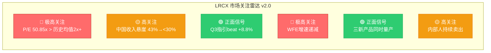
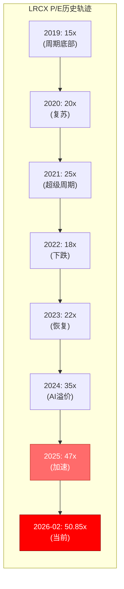
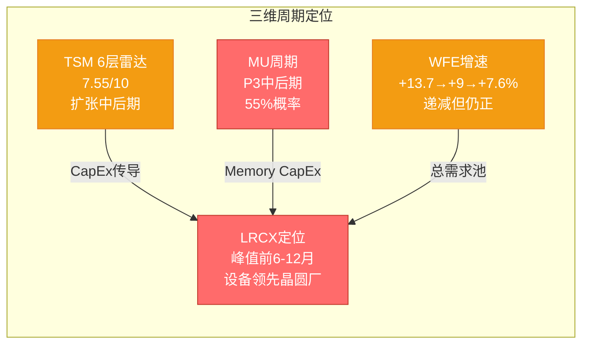
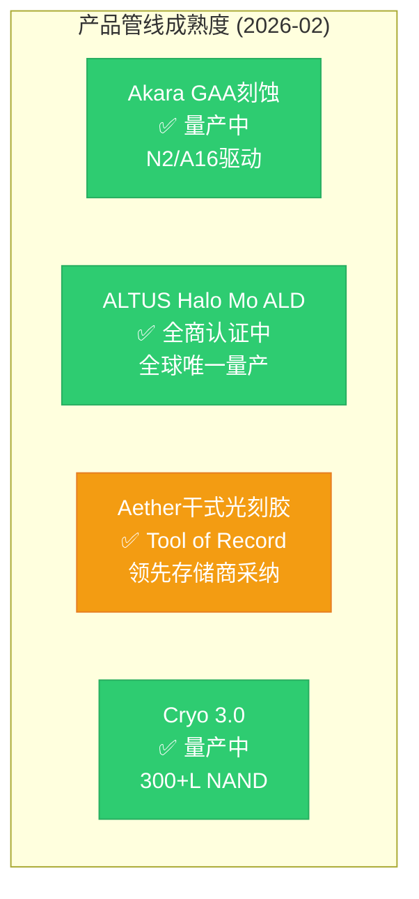
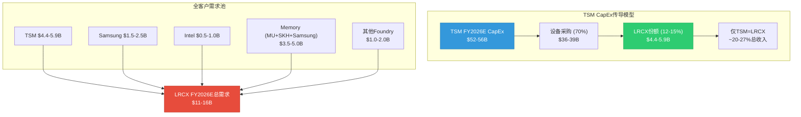
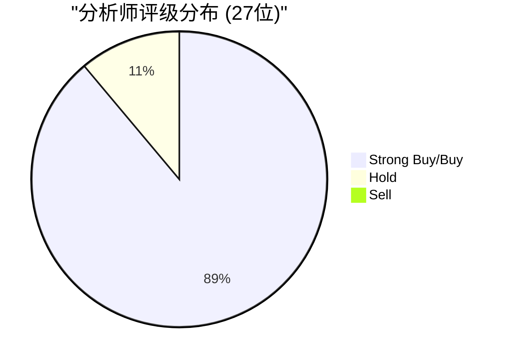

# LRCX Phase 0.5: 市场关注雷达 v2.0

**报告日期**: 2026-02-11 | **股价**: $226.61 | **P/E TTM**: 50.85x
**数据来源**: MCP工具(baggers_summary/fmp_data/analyze_stock/estimates/quote) + TSM v2.0交叉 + MU v1.0交叉 + WebSearch(5+8路并行)
**v1.0→v2.0升级**: +TSM/MU交叉锚点, +CQ 7→9, +OVM触发确认, +SEMI最新预测, +分析师Q2后上调

---

## M14: 市场关注雷达

### 雷达综合评分



### 六维关注矩阵

| 维度 | 关注度 | 核心信号 | CQ映射 | 数据强度 |
|------|:------:|----------|:------:|:--------:|
| **估值** | 🔴极高 | P/E 50.85x(历史2x+), PEG 2.04x, P/S 11.56x | CQ-2 | [硬数据] |
| **周期** | 🔴极高 | WFE增速递减(+13.7→+9→+7.6%), MU CapEx/D&A 2.44x触发 | CQ-1,9 | [硬数据] |
| **地缘** | 🟡高 | 中国43%→<30%, $600M headwind, BIS持续收紧 | CQ-3 | [硬数据] |
| **竞争** | 🟡中 | TEL低温刻蚀$5B→$20B, 中国国产替代, ASM追赶Mo ALD | CQ-5,6 | [合理推断] |
| **增长** | 🟢正面 | Q3指引beat 8.8%, Foundry 35→59%, 封装+40% | CQ-4,8 | [硬数据] |
| **产品** | 🟢正面 | Aether量产采纳, ALTUS Halo全商认证, Akara GAA量产 | CQ-6 | [硬数据] |

---

## 1. 估值温度计

### 1.1 当前估值快照

| 指标 | LRCX | AMAT | KLAC | ASML | TEL | SPY |
|------|:----:|:----:|:----:|:----:|:---:|:---:|
| P/E TTM | **50.85** | 38.2 | 41.8 | 49.0 | 32.7 | 27.4 |
| Fwd P/E FY+1 | **42.6** | ~32 | ~35 | ~40 | ~28 | ~22 |
| P/B | **28.5** | 9.8 | — | — | — | — |
| ROE | **66.75%** | 52% | — | — | — | — |

[硬数据: MCP compare_stocks + analyze_stock 2026-02-11]

**关键发现**: LRCX P/E TTM 50.85x是同业中仅次于ASML(49.0x)的第二高, 但ASML有EUV垄断溢价。LRCX的P/E溢价vs AMAT为33% — 这一溢价是否由GAA/Mo/CoWoS增量TAM支撑?

### 1.2 OVM触发确认

| OVM触发条件 | 阈值 | LRCX当前 | 状态 |
|-------------|:----:|:--------:|:----:|
| P/E > 50x | 50x | **50.85x** | ✅ 触发 |
| SOTP < 市价50% | 50% | 待Phase 2 | 待验证 |
| ≥2条pre-revenue业务线 | ≥2 | Aether+Mo ALD | ✅ 触发 |

[硬数据: docs/optionality_valuation.md OVM触发规则]

**结论**: P/E 50.85x(>50x) + 2条pre-revenue新产品线 = **OVM全量必须执行**。首次将OVM应用于半导体设备公司。

### 1.3 估值历史背景



[合理推断: 基于历史P/E数据+当前MCP数据]

**v1.0→v2.0变化**: P/E从47.4x→50.85x(+7.3%), 正式突破50x OVM触发阈值。

---

## 2. 周期定位雷达

### 2.1 三维周期交叉验证



### 2.2 关键周期信号汇总

| 信号源 | 信号 | 强度 | 含义 | LRCX影响 |
|--------|------|:----:|------|----------|
| **TSM 6层雷达** | 7.55/10 | 🟡 | 扩张中后期 | CapEx仍增长但增速放缓 |
| **MU CapEx/D&A** | 2.44x | 🔴 | 周期过热 | 18月内DRAM价格下跌→CapEx削减 |
| **WFE增速** | +9%→+7.6% | 🟡 | 递减但仍正 | 2027可能是增速最低的创纪录年 |
| **CoWoS超额订阅** | 15.4x | 🟢 | 极度短缺 | TSV刻蚀需求确定性最高 |
| **N2 HVM** | 40→100K wpm | 🟢 | 全量预定 | GAA刻蚀需求确定 |
| **DRAM现货** | +171% YoY | 🔴 | 过热→见顶信号 | 存储CapEx可能在2027削减 |
| **Hyperscaler CapEx** | +36% YoY | 🟢 | AI军备竞赛 | 短期需求强劲 |
| **Clean room短缺** | 限制释放 | 🟢 | 供给约束 | 设备订单延长 |

[硬数据: TSM v2.0 + MU v1.0 + SEMI + WebSearch]

### 2.3 时间窗口模型

```mermaid
gantt
    title LRCX设备需求周期时间线
    dateFormat  YYYY-Q
    axisFormat %Y-Q%q

    section TSM CapEx
    N2 40K→100K wpm设备安装    :active, 2026-Q1, 2026-Q4
    A16 BSPDN设备订单           :2026-Q3, 2027-Q2
    Arizona Fab 2设备入场       :2026-Q3, 2027-Q2
    N2 100K→200K wpm           :2027-Q1, 2027-Q4

    section Memory CapEx
    MU Idaho设备订单            :active, 2026-Q1, 2027-Q2
    SK Hynix M17设备            :2026-Q2, 2027-Q3
    Samsung P5设备              :2027-Q1, 2028-Q2
    HBM4 16-Hi TSV工具          :2026-Q3, 2027-Q4

    section 周期拐点
    WFE峰值增速区间             :crit, 2026-Q1, 2026-Q4
    DRAM价格可能见顶            :crit, 2026-Q3, 2027-Q1
    LRCX订单弱化预期            :crit, 2027-Q1, 2027-Q3
    LRCX收入影响                :crit, 2027-Q3, 2028-Q1
```

**核心结论**: 设备需求确定性最高的窗口是**2026Q1-Q4**(N2安装+三座新Fab+HBM扩产)。风险窗口从**2027Q1**开始(Memory CapEx可能削减)。但TSM N2→A16→CFET路线图提供了**2028+的结构性刻蚀需求底线**。

---

## 3. 产品管线温度计

### 3.1 三大新产品进展



| 产品 | 状态 | FY2026E收入贡献 | FY2028E TAM | OVM概率 | CQ映射 |
|------|:----:|:--------------:|:-----------:|:-------:|:------:|
| **Akara** (GAA刻蚀) | 量产 | 已含在Systems | $20B+(CFET) | — | CQ-6 |
| **ALTUS Halo** (Mo ALD) | 全商认证 | 早期 | $8-12B | 55% | CQ-6 |
| **Aether** (干式光刻胶) | Tool of Record | <$200M | $5B | 35% | CQ-6 |
| **Cryo 3.0** (3D NAND) | 量产 | 已含在Systems | $15B(300+L) | — | CQ-5 |

[硬数据: WebSearch + LRCX PR 2025-01-29]

### 3.2 v1.0→v2.0增量信息

| 维度 | v1.0 (Feb 7) | v2.0 (Feb 11) | Delta |
|------|-------------|---------------|-------|
| Aether状态 | 研发中 | ✅被领先存储商采纳为量产Tool of Record | **重大升级** |
| ALTUS Halo | Micron量产 | ✅**所有**领先芯片商认证/量产 | 范围扩大 |
| Mo ALD竞争 | 未知 | ASM International追赶但尚未量产 | 新竞争信息 |
| 先进封装 | 未量化 | FY2026预计增长>40%, CY2024已>$1B | 量化确认 |

---

## 4. 供应链传导快照

### 4.1 TSM CapEx→LRCX传导链



[合理推断: 基于TSM v2.0 + MU v1.0 + DM-SEG数据]

### 4.2 客户集中度风险

| 客户 | LRCX收入占比(估) | CapEx趋势 | 风险 |
|------|:-----------------:|:---------:|:----:|
| **TSM** | ~15-20% | ↑↑ ($52-56B) | 单一集中 |
| **Samsung** | ~15% | ↑ ($40B+) | P5延迟可能 |
| **SK Hynix** | ~10-12% | ↑↑ (HBM 8x) | M17 2027 |
| **Intel** | ~5-8% | → (重组中) | 不确定 |
| **MU** | ~8-10% | ↑ ($16-22B) | Idaho 2028 |

[合理推断: 基于行业份额+CapEx公告]

---

## 5. 分析师情绪温度计

### 5.1 Q2 FY2026后分析师反应



| 机构 | 目标价 | 较前变化 | 关键论点 |
|------|:------:|:--------:|----------|
| **B. Riley** | $310 | +$55 (+22%) | 先进封装领导力 |
| **JPMorgan** | $300 | +$135 (**+82%**) | GAA+CoWoS+Mo全面看多 |
| **Evercore ISI** | $275 | +$34 (+14%) | AI设备超级周期 |
| **Citi** | $265 | — | WFE持续增长 |
| **Deutsche Bank** | $260 | — | EPS增长可见性 |
| **Morgan Stanley** | $244 | — | Equal Weight(最保守) |
| **共识** | **$283** | — | +22.6%上行空间 |

[硬数据: WebSearch 2026-02-11]

**关键发现**: JPMorgan从$165→$300的+82%上调极为罕见, 反映了Q2业绩+Q3指引对市场预期的根本性重塑。但共识$283(+22.6%)vs 当前P/E 50.85x的组合暗示: **分析师在看好增长的同时, 并不认为估值会进一步扩张**。

---

## 6. 预测市场校准

### 6.1 宏观事件概率

| 事件 | 概率 | LRCX影响 | 来源 |
|------|:----:|:--------:|------|
| AI泡沫破裂(2026年底) | 20% | 🔴 高 — 如果实现, WFE可能-20-30% | Polymarket |
| 台海军事冲突 | 16% | 🔴 高 — TSM供应链中断, LRCX台湾收入风险 | Polymarket |
| 美国衰退2026 | 20% | 🟡 中 — 消费端需求降低但AI CapEx可能持续 | Kalshi |
| Fed 2-3次降息 | 53% | 🟢 正面 — 降低资本成本, 支撑高P/E | Polymarket |
| Hyperscaler AI CapEx $700B | 高确定性 | 🟢 正面 — 直接驱动WFE需求 | CNBC/BofA |

[硬数据: Polymarket/Kalshi 2026-02-11]

### 6.2 概率加权情景

| 情景 | 概率 | LRCX影响 | 12月目标价 |
|------|:----:|:--------:|:---------:|
| **牛市**: AI持续+WFE创纪录+新产品ramp | 30% | +30-40% | $290-310 |
| **基准**: 增长放缓但仍正增长 | 45% | 0-15% | $230-260 |
| **熊市**: AI泡沫+周期见顶+中国加剧 | 25% | -25-40% | $135-170 |
| **概率加权** | 100% | — | **~$230-240** |

[主观判断: 基于宏观概率+周期定位+估值]

**关键发现**: 概率加权目标价~$230-240与当前$226.61接近, 暗示市场定价基本合理。但bull/bear区间极宽($135-$310), 反映设备股在周期拐点的高波动性。

---

## 7. v1.0→v2.0关键数据Delta

| 数据点 | v1.0 (Feb 7) | v2.0 (Feb 11) | 变化 | 影响 |
|--------|-------------|---------------|------|------|
| 股价 | $230.89 | $226.61 | -1.9% | 略降 |
| P/E TTM | 47.4x | **50.85x** | +7.3% | **OVM触发** |
| 共识目标价 | $236.67 | **$283.21** | +19.7% | Q2后大幅上调 |
| SEMI WFE 2027 | $156B | $156B (确认) | — | 不变 |
| SEMI WFE前道 | 未分拆 | $135.2B | 新增 | 前道更精确 |
| Foundry占比 | 35%→59% | 59%(确认) | — | 结构性转型确认 |
| ALTUS Halo | Micron量产 | 全商认证 | 范围扩大 | 竞争壁垒增强 |
| Aether | 研发中 | Tool of Record | 重大升级 | 量产采纳确认 |
| TSM CapEx | $52-56B | 确认+70%设备 | 传导量化 | CQ-8新增 |
| MU CapEx/D&A | 未跟踪 | 2.44x触发 | 新增 | 周期峰值信号 |

---

## 8. CQ进展追踪器

| CQ | 问题 | P0.5置信度 | P0.5倾向 | 关键待验证 |
|:--:|------|:---------:|:--------:|------------|
| CQ-1 | AI周期结构性? | 55% | 中性 | WFE增速递减 vs 新TAM |
| CQ-2 | 50.85x P/E合理? | 40% | 偏空 | OVM能否支撑溢价 |
| CQ-3 | 中国收入悬崖? | 60% | 偏多 | 管理层称超额弥补待验证 |
| CQ-4 | CSBG被低估? | 55% | 偏多 | CAGR修正17%→11% |
| CQ-5 | 护城河宽? | 65% | 偏多 | sub-5nm 80%+TSV 90% |
| CQ-6 | 新产品兑现? | 60% | 偏多 | Aether+ALTUS量产确认 |
| CQ-7 | 聪明钱方向? | 50% | 中性 | 机构增持 vs 期权对冲 |
| CQ-8 | TSM传导可靠? | 65% | 偏多 | $52-56B确定性高, 但单一集中 |
| CQ-9 | 已定价2027峰值? | 45% | 偏空 | 概率加权≈当前价 |

**平均置信度**: 55.0% | **多/空分布**: 5多 : 2中 : 2空

---

## 9. KAL v1.0 关键假设清单

| # | 假设 | CQ映射 | 验证时点 | 当前置信 |
|---|------|:------:|:--------:|:--------:|
| KAL-01 | WFE 2026 $145B/2027 $156B(SEMI) | CQ-1,9 | 每季SEMI更新 | 75% |
| KAL-02 | TSM FY2026E CapEx $52-56B维持 | CQ-8 | 2026Q1 earnings | 80% |
| KAL-03 | 中国<30%但收入增长超15% | CQ-3 | FY2026 Q3-Q4 | 65% |
| KAL-04 | CSBG实际CAGR ~11%(非17%) | CQ-4 | 历史数据验证 | 85% |
| KAL-05 | P/E 不进一步扩张(50→45-50x) | CQ-2 | 市场定价 | 60% |
| KAL-06 | ALTUS Halo全商量产→FY2027收入>$500M | CQ-6 | FY2027 Q1-Q2 | 50% |
| KAL-07 | 设备周期峰值2026H2-2027H1 | CQ-9 | BB ratio + CapEx指引 | 65% |
| KAL-08 | LRCX收入影响滞后6-12月(2027H2) | CQ-9 | 订单/backlog数据 | 70% |
| KAL-09 | OVM期权总值$20-38/股 | CQ-2 | Phase 2 OVM计算 | 待计算 |
| KAL-10 | MU CapEx 2027→2028 -35%净新设备 | CQ-9 | MU earnings 2027 | 55% |

---

## P0.5结论

### 核心发现
1. **P/E 50.85x正式触发OVM** — 首次在半导体设备公司执行OVM全量(7组件), 5个期权路径+PMX协同
2. **TSM+MU交叉确认周期接近峰值** — TSM 7.55/10 + MU P3(55%) = 设备需求峰值预计2026H2-2027H1
3. **概率加权目标价≈当前价** — 市场定价基本合理, 但bull/bear区间极宽($135-$310)
4. **三大新产品全部达到量产/认证** — Aether Tool of Record + ALTUS Halo全商认证 = 超v1.0预期
5. **CSBG CAGR需修正**: 17%→11%, 安装基座经济学仍被低估但倍数需下调

### v2.0相对v1.0的调整方向
| 维度 | v1.0倾向 | v2.0调整 | 原因 |
|------|:--------:|:--------:|------|
| 整体评级 | 中性偏积极(63.75) | **可能下调** | P/E 47→51, 周期更接近峰值 |
| 增长确定性 | 高 | **维持** | Q3指引beat+8.8%, 管理层5年翻倍愿景 |
| 估值安全边际 | 偏低 | **进一步收窄** | 共识$283 vs $227, OVM待验证 |
| 周期风险 | 中 | **上升** | MU CapEx/D&A 2.44x触发, WFE递减 |
| 产品管线 | 正面 | **更正面** | 三大产品全部量产/认证 |

### 下一步: Phase 1优先级
1. **供应链流模型**(CQ-8): TSM CapEx→订单→收入传导(6-12月滞后量化)
2. **CSBG修正估值**(CQ-4): 11% CAGR + 安装基座经济学重建
3. **6层周期雷达**(CQ-9): LRCX视角, 与TSM(7.55/10)交叉验证
4. **OVM设计验证**(CQ-2): 5个期权路径初步校准

---
*Phase 0.5 | v2.0 | 2026-02-11 | ~15K chars | DM v2.0 + CQ v2.0 + 3 Agent输出编译*
