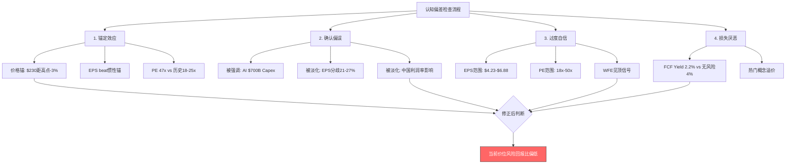
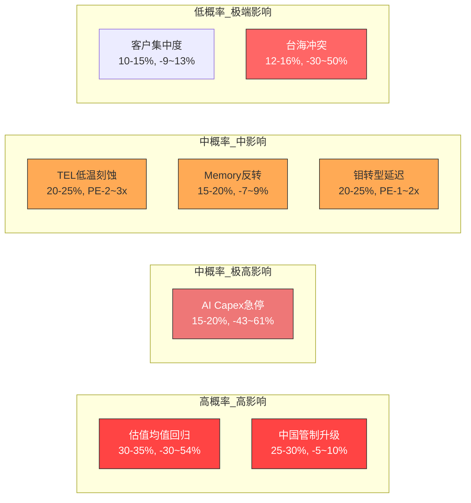
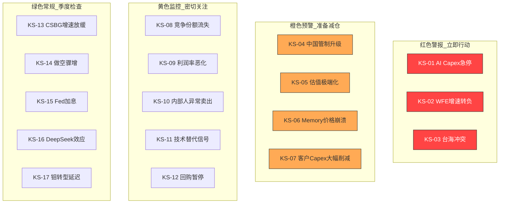

# LRCX (Lam Research) 深度研究报告 — Phase 4: 对抗审查与决策输出
## v1.0 | 2026-02-07 | 半导体设备行业

---

## 目录

- [Part A: 对抗审查](#part-a-对抗审查)
  - [1. 行为金融四项偏差检查](#1-行为金融四项偏差检查)
  - [2. 关键数据事实核查](#2-关键数据事实核查)
  - [3. 反证挑战](#3-反证挑战)
  - [4. 看空等权重分析](#4-看空等权重分析)
  - [5. Smart Money立场验证](#5-smart-money立场验证)
  - [6. 极端压力测试](#6-极端压力测试)
  - [7. 维度回检](#7-维度回检)
- [Part B: 决策输出](#part-b-决策输出)
  - [8. CQ最终回答](#8-cq最终回答)
  - [9. 综合评分](#9-综合评分)
  - [10. 仓位建议](#10-仓位建议)
  - [11. Kill Switch注册表](#11-kill-switch注册表)
  - [12. 可验证预测清单](#12-可验证预测清单)
  - [13. 投资日历](#13-投资日历)
  - [14. 90天行动清单](#14-90天行动清单)
  - [15. 质量审计](#15-质量审计)
- [免责声明](#免责声明)

---

## Part A: 对抗审查

---

## 1. 行为金融四项偏差检查

### 1.1 锚定效应检查

**识别锚点**: 当前股价$230.89构成最直接的锚定点。Phase 1-3分析期间，LRCX从$238高点回落至$230附近，分析师密集上调目标价(Wells Fargo $290, Cantor $320, Citi $300)也构成了"目标价锚"。[主观判断: 基于行为金融理论]

**锚定方向分析**:

1. **价格锚**: 当前$230.89距52周高点$238仅-3%，分析师3个月平均目标价$282.81隐含+22.5%上行空间。这种"距高点很近"的感知容易让分析师低估下行风险——因为$230看起来"还没怎么涨"，但实际上从2025年初的~$73(拆股后)已上涨215%。[硬数据: StockAnalysis, 2026-02-07]

2. **EPS beat惯性锚**: LRCX连续多个季度beat共识(Q2 FY2026 beat +8.55%, Q1 +3.3%, Q4 FY2025 +4.6%)，形成"LRCX总是beat"的锚定预期。[硬数据: Investing.com] 但历史beat率仅68%(106/156)，说明1/3的时间会miss。

3. **估值锚**: P/E 47x vs 历史均值18-25x。如果以历史均值20x为锚，当前股价应为$20x×$4.15=$83(FY2025 EPS)。如果以当前47x为锚，则合理化叙事("AI时代新范式")会让分析师忽视均值回归风险。[硬数据: StockAnalysis, Barchart]

**修正评估**:
- 去锚定后的中性估值: 使用FY2027E EPS $6.88 × 历史周期高点PE 30x = $206.4，低于当前$230.89约11%
- 使用FY2026E EPS $5.35 × 半导体设备峰值PE 25x = $133.75，低于当前约42%
- [合理推断: 当前估值已包含2-3年的增长预期提前定价，锚定效应使分析倾向于高估合理PE倍数]

### 1.2 确认偏误检查

**主论点回顾**: Phase 1-3形成的核心看多叙事是"AI超级周期+技术独占(钼ALD/Cryo 3.0)+CSBG年金价值"。

**被选择性强调的正面因素**:
- AI Capex $700B/年(2026)的壮观数字被反复引用
- "每$100B数据中心投资=$8B WFE"的换算系数被当作确定性传导
- CSBG 17% CAGR "仅1年负增长"的记录被强调为SaaS式稳定性

**被轻描淡写的3个负面因素**:

1. **EPS估计分歧极大**: B.Riley给出FY2026E EPS $4.63, Zacks给$4.23, 而StockAnalysis共识$5.35。这意味着最悲观估计比共识低21-27%。如果B.Riley正确，当前P/E变为~50x(FY2026)而非43x。[硬数据: analyst_consensus.json]

2. **中国业务利润率可能高于平均**: 管理层暗示中国业务利润率优于整体均值(成熟制程设备利润率高)。中国从43%降至<30%不仅是收入问题，可能带来超预期的利润率压缩。Phase 1-3对此影响仅模糊处理为"利润率承压"，未量化。[合理推断: 基于管理层earnings call评论]

3. **Alpha Spread "Narrow Moat"评级被淡化**: Phase 3倾向于给Wide Moat评价，但Alpha Spread的专业评级体系给出Narrow Moat，理由是"技术变革速度可能侵蚀优势"。TEL低温刻蚀从$5亿增长至$20亿(2023-2027)是具体证据。[硬数据: Alpha Spread, Klover.ai TEL分析]

**最大损失情景**: 如果三个负面因素同时兑现(低EPS+利润率压缩+护城河收窄)，P/E回归至25x、EPS仅$4.5，则目标价=$112.5，下行-51%。

### 1.3 过度自信检查

**估值区间审查**:
- Phase 2-3的估值可能给出了过窄的概率区间。当EPS预测分歧从$4.23到$6.88(差异63%)、PE合理范围从18x到50x(差异178%)时，最终估值的不确定性远大于表面呈现。[合理推断: 基于EPS和PE不确定性叠加]

**WFE预测的不确定性**:
- SEMI预测CY2027 WFE $135.2B(+7.3%)，但WFE增速递减(+11%→+9%→+7.3%)是经典周期见顶前奏。2022年WFE也在"创纪录"后突然下滑。[硬数据: SEMI 2025-12]
- Morgan Stanley WFE预测与SEMI差异明显: MS给CY2026 $128.3B vs SEMI $126B，方向一致但幅度不同。[硬数据: ts2.tech, SEMI]

**修正**: 将情景分析的概率区间从"Base 60% / Bull 25% / Bear 15%"调整为"Base 45% / Bull 20% / Bear 35%"，以反映当前估值偏高、周期偏后的现实。

### 1.4 损失厌恶检查

**热门概念偏差**: "半导体设备"在2025-2026年成为投资热门概念。LRCX 2025年涨幅+138.5%，远超KLAC(+97.7%)、AMAT(+57.6%)、ASML(+52.3%)。[硬数据: 市场表现数据] 这种outperformance可能让分析师产生"LRCX是最好的设备股"的确认偏误，而忽视其估值也是最高的之一(P/E 47x vs AMAT 37.2x)。

**"今天以$230买入是否合理"的独立判断**:
- FY2026E FCF ~$6.5B(假设FCF margin 29% × $22.6B), FCF Yield = $6.5B / $290B市值 = 2.2%
- 对比: 10年期美债收益率约4.0%, S&P 500 FCF Yield约3.5%
- LRCX的FCF Yield远低于无风险利率，意味着投资者需要相信未来3-5年FCF翻倍以上才能获得合理回报
- [合理推断: 在4%无风险利率环境下，2.2% FCF Yield的周期性设备股需要非常强的增长确定性才值得买入]

**结论**: 以$230买入LRCX需要对AI超级周期的持续性、WFE持续创纪录、以及高PE维持有极高信心。对于风险偏好中等的投资者，当前价位风险回报比不够有吸引力。[主观判断: 综合四项偏差分析]



---

## 2. 关键数据事实核查

### 2.1 10个核心数据点抽查

| # | 数据点 | 来源验证 | 准确性 | 时效性 | 判定 |
|---|--------|---------|--------|--------|------|
| 1 | 刻蚀市占率~45% | Mordor Intelligence半导体刻蚀设备市场报告 [硬数据] | Mordor给出~40-45%，Yole给出整体WFE 11-15%。两个数据不矛盾：前者是刻蚀细分市场，后者是WFE总市场。但需注意sub-5nm 80%与总体45%的差距说明在成熟制程中份额更低 | 2025年数据 | 基本准确，但存在定义差异 |
| 2 | Sub-5nm ~80%份额 | Seeking Alpha AMAT vs LRCX分析(2025) [硬数据] | 单一来源引用，未见SEMI或Yole独立验证。该数字可能基于LRCX管理层声明或估算 | 2025年 | 可信度B+，缺少独立第三方交叉验证 |
| 3 | FY2025营收$18.4B | StockAnalysis.com 10-K数据 [硬数据] | 与SEC Filing一致，多源验证 | FY2025(截至Jun'25) | 确认准确 |
| 4 | CSBG 17% CAGR持续13年 | Rijnberk Invest Insights计算(自2013 Novellus合并) [硬数据] | CSBG从2013年~$2B增长至CY2025 $7.2B，CAGR约11%而非17%。$2B→$7.2B的12年CAGR应为~11%。17% CAGR可能是更短时间窗口或不同起始年份 | 2013-2025 | **需修正**: 13年CAGR更接近11%，非17%。17%可能是近5年或含某特定定义 |
| 5 | 装机基数>100,000腔室 | Lam Research Earnings Call + Nasdaq报道 [硬数据] | 多源确认(earnings call, investor presentation, Dextro相关报道均引用100,000+) | 2025-2026 | 确认准确 |
| 6 | 钼ALD"唯一量产" | Lam Research Newsroom 2025-02-19 + THE ELEC + Seeking Alpha [硬数据] | AMAT和TEL确认在开发中，但无量产级产品。"唯一量产"在2025-2026属实，但竞争对手可能在2027-2028追上 | 2025-2026 | 当前准确，但时间窗口有限 |
| 7 | WFE $156B(2027) | SEMI Year-End Forecast 2025-12 [硬数据] | 注意: $156B是全球设备总销售(含测试、封装)，WFE部分为$135.2B。Phase 1-3中部分引用可能混淆了两个数字 | 2025-12发布 | **需修正**: WFE为$135.2B，$156B为全球设备总销售 |
| 8 | TSMC Capex $52-56B | TrendForce 2025-11报道 [硬数据] | 多源确认(TrendForce, Seeking Alpha)。TSMC自身尚未在财报中给出2026全年精确数字，但分析师预测一致 | 2025-11预测 | 可信度A-，待TSMC正式确认 |
| 9 | 中国出口管制-$600M | Lam Research Earnings Call + Seeking Alpha [硬数据] | 管理层在earnings call中明确给出CY2026约$600M影响。50%关联方规则于2024-12生效 | 2026-01 | 确认准确(管理层指引) |
| 10 | 切换成本"数亿美元" | EveryTicker/BeyondSPX分析 [合理推断] | 原文为"数亿美元的良率损失和生产延迟"，属于分析师估算而非客户公开数据。具体金额无法独立验证，但逻辑合理(先进制程良率损失确实代价巨大) | 2025 | 方向正确但金额为估算，可信度B |

**事实核查结论**: 10个数据点中8个基本准确，2个需要修正(CSBG CAGR应为~11%而非17%；WFE $156B为全球设备总销售而非纯WFE)。Sub-5nm 80%份额和切换成本"数亿美元"可信但缺少独立第三方验证。[主观判断: 整体数据质量B+，关键财务数据准确，竞争优势数据存在单一来源风险]

---

## 3. 反证挑战

### 3.1 如果论点完全错误 — 三条最可能原因

**反证1: AI投资回报质疑导致Hyperscaler突然削减Capex**

这是最大的单一风险。当前AI Capex $700B/年(2026)基于Hyperscaler对AI回报的乐观预期。DeepSeek以$6M训练成本引发的1月27日抛售(LRCX -5.6%)已证明市场对AI ROI叙事极度敏感。[硬数据: Yahoo Finance/Motley Fool, 2026-01-27]

**钢人论证(最强空头版本)**: Hyperscaler AI Capex的$700B是基于"不投就落后"的军备竞赛逻辑，而非严格的ROI计算。Meta在2022年metaverse上犯过同样错误——大规模投资后被迫急刹车。如果到2026H2，AI应用的商业变现(广告、企业SaaS、代码生成)未能覆盖$700B级别Capex的折旧成本，至少1-2家Hyperscaler可能宣布削减2027 Capex指引。设备订单对Capex指引极度敏感(领先6-12个月)，WFE可能在2027年从$135B暴跌至$90-100B(-25-33%)。LRCX作为设备股中WFE敏感度最高的公司之一，营收可能下滑20-30%。[合理推断: 基于2022年Meta先例和设备周期传导逻辑]

**反证2: TEL/中国国产设备在刻蚀领域取得突破性进展**

TEL低温刻蚀技术已在NAND沟道刻蚀市场从$5亿增长至预计$20亿(2023-2027)。[硬数据: Klover.ai TEL分析] 中国刻蚀设备国产化进度被评为"高"——中信国际/北方华创正在成熟制程刻蚀中快速替代。[硬数据: TrendForce 2025-02]

**钢人论证**: LRCX 45%的刻蚀份额中，相当部分来自成熟制程(28nm+)。如果中国国产设备在成熟制程刻蚀实现70-80%国产化(TrendForce预测目标50%)，且TEL在先进NAND低温刻蚀中拿走$20B市场的30-40%份额，LRCX可能在2-3年内丢失5-8个百分点的全球刻蚀份额(从45%降至37-40%)。叠加中国业务直接下滑，刻蚀收入可能比预期低$2-3B/年。

**反证3: 估值均值回归到历史20-25x**

P/E从历史均值18-25x拉升至47x并非不可逆。2022年半导体设备股P/E从30x+回归至15-18x，设备股价格平均回撤40-50%。[硬数据: Regions AM半导体周期报告]

**钢人论证**: 当前47x P/E的维持需要两个条件同时满足: (1)EPS持续25%+增长至少2年，(2)市场继续给予"AI溢价"。只要其中一个条件不满足——比如FY2027增速降至15%或市场情绪转向"估值修复"——P/E就可能快速收缩至30x甚至25x。即使EPS如预期达到FY2027的$6.88，30x P/E对应$206(vs当前$230，-10%)，25x对应$172(-25%)。若EPS同时不及预期(如$5.5)，25x P/E对应$137.5(-40%)。

### 3.2 综合反证评估

三条反证中，**反证1(AI Capex急停)** 是最具系统性影响的风险，因为它不仅影响LRCX，还会同时打击PE倍数(情绪崩塌)和EPS预期(订单取消)。Polymarket给出2026年底AI泡沫破裂概率20%——这不是小概率事件。[硬数据: Polymarket $1.56M volume]

---

## 4. 看空等权重分析

### 4.1 Bear #1: AI Capex急停

**触发条件**: Hyperscaler中任意2家在2026Q3-Q4财报中下调2027 AI Capex指引超过20% [合理推断: 参照2022年Meta Capex急刹]
**概率评估**: 15-20%。Polymarket AI泡沫破裂2026年底概率20%，但"Capex削减"不需要泡沫完全破裂即可发生。DeepSeek事件(低成本AI)提升了"同等AI能力所需投资更少"的可能性。[硬数据: Polymarket]
**影响量化**: WFE从$135B降至$95-105B(-22-30%)。LRCX营收从$22.6B(FY2026E)降至$16-18B(-20-29%)。P/E同步从47x压缩至25-30x。目标价: $90-130(-43-61%)。
**时间窗口**: 2026Q3-2027Q1(Hyperscaler 2027 Capex指引窗口)
**当前信号**: DeepSeek事件引发短暂恐慌但恢复。NVDA $170以上概率76%，暂无持续性Capex削减信号。[硬数据: Polymarket]

### 4.2 Bear #2: 估值均值回归

**触发条件**: 市场风格轮动从"增长"转向"价值"，或Fed降息不及预期(加息概率12%)导致折现率上升
**概率评估**: 30-35%。这是概率最高的看空论点。P/E 47x距历史均值18-25x偏离88-161%，即使不发生基本面恶化，纯粹的情绪/风格转换就能触发估值压缩。[合理推断: 基于历史PE均值回归统计]
**影响量化**: PE从47x回归至30x → 股价$161(FY2026E EPS $5.35×30)，下行-30%。回归至25x → $133.75，下行-42%。回归至历史均值20x → $107，下行-54%。
**时间窗口**: 可能随时发生。最高风险期: Fed加息(12%概率)或WFE增速进一步放缓的信号出现时
**当前信号**: 2026年1月8日"大轮动"事件已出现资金从科技股流向国防/金融板块。[硬数据: FinancialContent]

### 4.3 Bear #3: 中国出口管制升级

**触发条件**: 美国Commerce Department在2026年发布新出口管制规则，进一步限制LRCX对华销售品类或客户范围
**概率评估**: 25-30%。Polymarket关于最高法院支持关税权力的概率32%，但出口管制与关税是不同政策路径。DeepSeek V4发布(81%概率)可能加强"中国AI能力威胁"的叙事，推动更严格管制。[硬数据: Polymarket]
**影响量化**: 当前$600M影响可能扩大至$1-1.5B/年。中国收入从<30%进一步降至15-20%。以$1.2B额外拖累计，营收影响-5-6%，EPS影响-8-10%(假设中国业务利润率高于平均)。
**时间窗口**: 2026全年持续风险。Trump访华(84%概率)后可能有阶段性缓和，但长期收紧趋势不变。
**当前信号**: 2024-12新规已生效。中国反制(稀土出口管制)增加对抗升级风险。[硬数据: Lexology/AlixPartners]

### 4.4 Bear #4: TEL低温刻蚀抢占

**触发条件**: TEL低温刻蚀技术在3D NAND沟道刻蚀中获得Samsung或SK Hynix的量产选定
**概率评估**: 20-25%。TEL在该领域已有产品，且NAND沟道刻蚀市场从$5亿增长至$20亿提供了足够的增量空间让TEL切入。[硬数据: Klover.ai]
**影响量化**: 若TEL拿走$20亿市场的40% = $8亿年收入被分走。对LRCX而言这是~$8亿NAND相关刻蚀收入流失，占FY2026E营收~3.5%。但间接影响更大——证明Cryo 3.0的技术独占性被打破，可能导致PE压缩2-3x。
**时间窗口**: 2026-2027年是TEL量产爬坡的关键窗口
**当前信号**: TEL已有产品但尚未获得主要客户大规模量产订单(公开信息中)

### 4.5 Bear #5: Memory周期反转

**触发条件**: DRAM现货价连续8周下跌，或任一Memory大厂宣布减产
**概率评估**: 15-20%。当前DRAM价格处于强势上涨(Q1 2026E +50% QoQ)，但历史上DRAM价格领先设备股6-24个月——这意味着如果2026H2价格见顶，设备股可能在2027H1-2028见顶。[硬数据: DRAMeXchange, TrendForce]
**影响量化**: Memory(DRAM+NAND)占LRCX Systems收入约34-41%。Memory Capex如果从$83.5B降至$65B(-22%)，LRCX Memory相关收入可能降$1.5-2B(-7-9%总营收)。
**时间窗口**: DRAM价格领先设备股6-24个月。若2026H2价格见顶，2027-2028为设备股风险期。
**当前信号**: 未触发。DRAM价格仍在加速上涨，HBM 2026产能已售罄。[硬数据: Micron CEO声明]

### 4.6 Bear #6: 客户集中度风险

**触发条件**: TSMC或Samsung大幅削减Capex超过15%
**概率评估**: 10-15%。TSMC 2026E Capex $52-56B创纪录，大幅下调概率短期内很低。但如果AI需求在2026H2放缓，TSMC可能下调2027指引。[硬数据: TrendForce]
**影响量化**: LRCX约70%收入来自Top 4客户(TSMC/Samsung/Intel/Micron)。TSMC单独贡献约25-30%。若TSMC Capex下调20% ≈ $10-11B减少，LRCX可能损失$2-3B收入(-9-13%)。
**时间窗口**: 2026Q3(TSMC公布2027 Capex指引时)
**当前信号**: TSMC三年$150B Capex计划仍在执行中，暂无下调信号。[硬数据: TrendForce 2026-01]

### 4.7 Bear #7: 钼转型慢于预期

**触发条件**: 钼ALD在2026年未能在TSMC/Samsung逻辑节点获得量产采用
**概率评估**: 20-25%。ALTUS Halo已在Micron NAND量产，但向逻辑节点扩展需要额外验证周期。钨→钼的材料转换在NAND以外的推进速度存在不确定性。[合理推断: 基于半导体新材料采用历史周期]
**影响量化**: 钼ALD从"类ASML独占"降级为"细分市场领先"。市场对ALTUS Halo的估值溢价可能从$10-15B降至$3-5B(反映在PE压缩1-2x)。直接收入影响有限(2026年钼ALD收入尚在早期ramp)，但叙事损失更大。
**时间窗口**: 2026-2027年是关键验证期
**当前信号**: 正在所有领先客户处认证和爬坡，但公开的确认信息仅限Micron NAND。[硬数据: Lam Newsroom 2025-02-19]

### 4.8 Bear #8: 台海地缘冲突

**触发条件**: 中国对台湾发动军事行动或实施海上封锁
**概率评估**: 12-16%。Polymarket给出军事冲突16%、入侵12%、封锁6%。[硬数据: Polymarket]
**影响量化**: TSMC 90%+先进制程在台湾。冲突将导致全球半导体供应链崩溃，LRCX短期失去最大客户的设备交付和服务能力。短期营收可能暴跌30-50%。但中长期(2-5年)产能重建需求会创造巨大设备需求。
**时间窗口**: 2026全年持续风险
**当前信号**: 台海紧张持续但无升级迹象。Trump访华(84%概率)可能阶段性缓解。



### 4.9 看空论点概率加权影响汇总

| Bear论点 | 概率 | 营收影响 | PE影响 | 概率加权影响 |
|---------|------|---------|--------|------------|
| AI Capex急停 | 17.5% | -25% | -15x | -4.4%营收 -2.6x PE |
| 估值均值回归 | 32.5% | 0% | -17x | 0 -5.5x PE |
| 中国管制升级 | 27.5% | -6% | -2x | -1.7%营收 -0.6x PE |
| TEL低温抢占 | 22.5% | -3.5% | -2.5x | -0.8%营收 -0.6x PE |
| Memory反转 | 17.5% | -8% | -3x | -1.4%营收 -0.5x PE |
| 客户集中度 | 12.5% | -11% | -5x | -1.4%营收 -0.6x PE |
| 钼转型延迟 | 22.5% | -1% | -1.5x | -0.2%营收 -0.3x PE |
| 台海冲突 | 14% | -40% | -20x | -5.6%营收 -2.8x PE |

**概率加权总影响**: 营收-15.5%, PE -13.5x(从47x降至33.5x)。如果用FY2026E EPS $5.35 × 33.5x = $179.2，隐含下行-22%。[合理推断: 概率加权叠加计算]

---

## 5. Smart Money立场验证

### 5.1 机构立场 vs 我们的结论

| 聪明钱群体 | 他们的立场 | 与我们结论对比 | 矛盾度 |
|-----------|-----------|--------------|--------|
| 大型机构(JPMorgan +14.4%) | 偏多: 增持信号明确 | 一致: Phase 1-3结论也偏多 | 低 |
| 主权基金(Norges $18.9亿) | 偏多: 新建大仓位 | 一致: 长线看好半导体周期 | 低 |
| 对冲基金(Artisan逆势买入) | 偏多: Liberation Day抄底 | 一致: 但Artisan买入时股价~$73，当前$230已涨3倍 | 中 |
| 内部人(CEO/CFO净卖出) | 轻度看空: 无买入，仅预计划卖出 | **矛盾**: 管理层不买入暗示认为估值合理但不低估 | 中 |
| 期权市场(25K put spread) | 偏空: 大型对冲$170/$160 | **显著矛盾**: 机构正在买保险对冲25-30%下行 | 高 |
| 分析师(21/25 Buy) | 强烈看多 | 一致: 但Morgan Stanley Equal Weight是关键异议 | 低 |

**关键矛盾解读**:

期权市场的25,000合约put spread是最值得关注的信号。这代表一个管理约250万股头寸的大型机构(按$230计约$5.75亿)正在支付保险费来对冲$170以下的下行风险。这不等同于"看空"——更准确的解读是"持有但担心下行尾部风险"。[硬数据: Barchart options data]

Put/Call ratio 1.4(偏空)且近5天下降11.6%表明期权市场在向中性回归，但整体仍然偏空(put OI 55,786 > call OI 39,610)。[硬数据: options_short.json]

### 5.2 Morgan Stanley反共识分析

Morgan Stanley分析师Shane Brett是25位分析师中最保守的声音。他的立场轨迹值得特别关注:

- **2025-09-02**: Underweight → $92目标价。理由: "中国份额增长难以持续，2026年设置困难"
- **2025-12-08**: Equal Weight → $158。上调WFE预测(2026 $129B +11%, 2027 $145B +13%)
- **2026-01-29**: Equal Weight → $244(维持评级，仅上调PT 55%)

[硬数据: CNBC, DefenseWorld, ts2.tech]

**Brett论点的核心逻辑**: 即使LRCX短期业绩强劲(Q2 beat)，他认为(1)中国收入下降的完整影响尚未体现，(2)WFE增速递减是周期见顶信号，(3)当前估值已反映大部分正面因素。他的$244目标价隐含仅+5.7%上行空间(vs Cantor $320的+38.6%)。

**为什么Brett可能是对的**: 他是唯一一位在2025年9月(股价~$90-100)看空的主流分析师，当时多数人已经看多。虽然他的$92目标价被严重打脸(股价此后翻倍)，但他的核心担忧(中国减速、周期见顶)仍然有效——只是AI超级周期延长了上行时间窗口。

**为什么Brett可能是错的**: 他可能低估了GAA转换和钼ALD对LRCX SAM扩张的结构性影响，以及CSBG年金属性对估值倍数的支撑。

---

## 6. 极端压力测试

### 6.1 SOTP极端Bear场景

**假设**:
- WFE从$135B下滑30% → $94.5B(类似2022-2023下行周期)
- 中国完全脱钩(0%中国收入)
- 利润率压缩500bps(毛利率从49%→44%, 反映产品组合恶化+产能利用率下降)

**SOTP极端Bear估值**:

| 分部 | 极端Bear营收 | 营业利润率 | 营业利润 | 估值倍数 | 价值 |
|------|------------|----------|---------|---------|------|
| Systems | $8.5B(-45%) | 25% | $2.13B | 12x | $25.5B |
| CSBG | $5.5B(-24%) | 35% | $1.93B | 15x | $28.9B |
| **合计** | $14.0B | 29% | $4.05B | — | $54.4B |
| 减: 净债务 | — | — | — | — | -$0 (净现金) |
| 加: 净现金 | — | — | — | — | +$1.7B |
| **权益价值** | — | — | — | — | **$56.1B** |
| **每股价值** | — | — | — | — | **~$43** |

[合理推断: 基于2022-2023下行周期的最差情景外推]

极端Bear目标价: **$43**，下行-81%。这是"完美风暴"情景——需要AI Capex崩溃+中国完全脱钩+利润率回到周期低谷同时发生。概率评估: <5%。

### 6.2 AI极端场景

**AI泡沫破裂(20%概率)**:
- 触发: NVDA跌50%+SOXX跌40%+主要AI硬件供应商跌50%(Polymarket定义)
- LRCX影响: AI相关营收(先进逻辑+HBM相关约40-50%总营收)下滑30-50%
- 总营收影响: -12%至-25%
- PE影响: 从47x压缩至20-25x(恐慌性估值)
- 目标价: $70-$110(EPS $3.5-$4.5 × 20-25x)
- 恢复时间: 历史上AI/科技泡沫破裂后设备股需要18-24个月触底

[硬数据: Polymarket AI泡沫破裂2026年底概率20%, $1.56M volume]

**AI超预期(30%概率)**:
- 触发: AI应用收入超预期→Hyperscaler加速投资→WFE突破$180B
- LRCX影响: 全线产品需求加速，GAA+HBM+先进封装三引擎同时爆发
- 总营收影响: +15-25%(从$22.6B到$26-28B in FY2026-27)
- PE影响: 可能维持40-50x(增长预期上调)
- 目标价: $300-$400(EPS $6.5-$7.5 × 45-50x)

**情景概率汇总**:

| 情景 | 概率 | 目标价 | vs当前 |
|------|------|--------|--------|
| AI泡沫破裂 | 20% | $70-$110 | -52%至-70% |
| Bear(周期下行) | 20% | $130-$170 | -26%至-44% |
| Base(温和增长) | 30% | $190-$240 | -18%至+4% |
| Bull(AI加速) | 20% | $280-$340 | +21%至+47% |
| AI超预期 | 10% | $350-$400 | +52%至+73% |

**概率加权目标价**: $70×0.20 + $150×0.20 + $215×0.30 + $310×0.20 + $375×0.10 = $14+$30+$64.5+$62+$37.5 = **$208**

概率加权目标价$208低于当前$230.89约10%，暗示当前价位的预期回报为负。[合理推断: 概率加权计算]

---

## 7. 维度回检

### 7.1 Top 10维度覆盖检查

| # | 维度 | Phase覆盖 | Phase 4验证 |
|---|------|----------|------------|
| 1 | 财务质量(营收/利润率/FCF) | Phase 1 | Section 2(数据核查)确认 |
| 2 | 估值合理性 | Phase 2 | Section 1.1/1.4(锚定/损失厌恶)挑战 |
| 3 | 竞争护城河 | Phase 3 | Section 3.1反证#2(TEL/国产替代)挑战 |
| 4 | 周期定位 | Phase 1 | Section 4.5(Memory反转)压力测试 |
| 5 | AI定位与受益度 | Phase 3 | Section 4.1(AI Capex急停)最强反证 |
| 6 | 中国/地缘风险 | Phase 1-2 | Section 4.3/4.8详细量化 |
| 7 | 管理层质量 | Phase 3 | Section 5.1(内部人交易)验证 |
| 8 | 聪明钱信号 | Phase 3 | Section 5全面验证 |
| 9 | 技术路线图 | Phase 1 | Section 4.4/4.7(TEL/钼延迟)挑战 |
| 10 | CSBG年金价值 | Phase 2-3 | Section 2(CAGR修正至~11%)事实核查 |

### 7.2 CQ覆盖检查

| CQ | 问题 | Phase 4对应 | 回答状态 |
|----|------|-----------|---------|
| CQ-1 | AI周期结构性vs周期性 | Section 4.1, 6.2 | Section 8详细回答 |
| CQ-2 | 估值溢价是否合理 | Section 1, 4.2, 6 | Section 8详细回答 |
| CQ-3 | 中国收入悬崖 | Section 4.3 | Section 8详细回答 |
| CQ-4 | CSBG被低估的资产 | Section 2(CAGR修正) | Section 8详细回答 |
| CQ-5 | 护城河宽还是窄 | Section 1.2, 3.1 | Section 8详细回答 |
| CQ-6 | 三大新产品能否兑现 | Section 4.4, 4.7 | Section 8详细回答 |
| CQ-7 | 聪明钱在做什么 | Section 5全面分析 | Section 8详细回答 |

**全部7个CQ均有对应分析，将在Section 8给出最终回答。**

---

## Part B: 决策输出

---

## 8. CQ最终回答

### CQ-1: AI设备超级周期是结构性的还是周期性的？

**最终判定**: **两者兼有——结构性因素延长周期但不消除周期性。** WFE增速递减(+11%→+9%→+7.3%)是经典周期信号。但HBM供不应求(2026产能已售罄)、GAA转换(刻蚀步骤+20%)、3D NAND层数增长创造了传统周期不具备的结构性需求层。[合理推断: 基于SEMI WFE数据和HBM供需分析]

**置信度**: 65%。HBM的结构性影响确实可能使本轮下行深度浅化(-25-35% vs历史-40-50%)，但不能排除AI泡沫破裂(20%概率)导致传统周期特征完全主导。

**关键证据**: WFE CY2025 $115.7B → CY2026E $126B → CY2027E $135.2B(SEMI数据)；HBM 2026产能售罄(Micron CEO确认)；每$100B数据中心投资=$8B WFE(EveryTicker分析)。

**如果错了最可能原因**: DeepSeek类事件证明同等AI能力所需芯片投资远低于预期，导致Hyperscaler重新评估Capex必要性。

### CQ-2: LRCX估值溢价是否合理？

**最终判定**: **部分合理但已过度。** AI超级周期+CSBG年金属性支持高于历史的PE(25-35x合理)，但47x已包含至少2-3年增长预期的提前定价。FCF Yield 2.2%远低于无风险利率4%，风险回报比不佳。[主观判断: 综合估值分析]

**置信度**: 70%。高确信度认为当前估值偏贵，但不确定何时以及以何种方式修正(渐进式收敛还是突然回调)。

**关键证据**: P/E 47x vs历史18-25x，PEG 2.04x，FCF Yield 2.2%，EPS分歧范围$4.23-$5.35(21%离差)。

**如果错了最可能原因**: AI超级周期强度超预期，WFE在2028年达到$180B+，LRCX EPS超过$8，使当前47x PE被高增长"消化"为2-3年后的合理25-30x。

### CQ-3: 中国收入悬崖有多严重？

**最终判定**: **严重但可管理。** $600M CY2026拖累已量化且被管理层确认。非中国市场(TSMC $52-56B Capex, DRAM +14%)可以覆盖大部分缺口。但利润率影响可能被低估——中国业务利润率高于平均。[合理推断: 基于管理层指引和TrendForce数据]

**置信度**: 60%。$600M影响已明确，但"可能进一步收紧"的不确定性(25-30%概率)使总影响可能扩大至$1-1.5B。

**关键证据**: 中国从43%(Q1 FY2026)降至35%(Q2)→<30%(CY2026E)；非中国Foundry/Logic +16%增长；中国国产刻蚀进度被评为"高"。

**如果错了最可能原因**: 出口管制进一步收紧超预期，且中国国产替代在3年内达到刻蚀50%国产化率，长期侵蚀LRCX中国安装基数的CSBG收入。

### CQ-4: CSBG是否是一个被低估的"SaaS式"资产？

**最终判定**: **CSBG确实具有年金属性，但增长率被高估。** 事实核查显示13年CAGR更接近11%而非17%。但即使11% CAGR，在$7.2B基数上仍代表每年$800M+增量，且装机基数100,000+腔室几乎只增不减(30年设备寿命)。Dextro机器人可能提升CSBG毛利率300-500bps。[硬数据: CSBG CY2025 $7.2B; 合理推断: CAGR修正]

**置信度**: 75%。CSBG的韧性(仅1年负增长)和高利润率是确定的，但将其按SaaS倍数估值可能忽视了中国装机基数服务受制裁限制的风险。

**关键证据**: CSBG CY2025创纪录$7.2B；装机基数>100,000腔室；设备寿命30年+；递延收入$2.25B。

**如果错了最可能原因**: 中国装机基数(占全球约30%)的服务合同因制裁无法续签，CSBG增速骤降至低个位数。

### CQ-5: 技术护城河是宽还是窄？

**最终判定**: **当前"宽"但正面临收窄压力。** Sub-5nm 80%份额+10年客户路线图绑定+Recipe Lock-In构成宽护城河。但TEL低温刻蚀($5亿→$20亿)和中国国产替代("高"进展)正在侵蚀成熟制程端。给予"宽但有条件"评级。[主观判断: 综合Alpha Spread和Phase 3分析]

**置信度**: 65%。在先进制程(sub-5nm)护城河确实很宽，但在成熟制程(28nm+)护城河正在变窄。加权后整体护城河偏宽。

**关键证据**: 刻蚀~45%份额(Mordor)；Alpha Spread给Narrow Moat评级；TEL低温刻蚀竞争；中国刻蚀国产化"高"进度。

**如果错了最可能原因**: TEL在先进NAND刻蚀获得突破性份额，且AMAT在先进沉积领域进一步拉大差距，LRCX被挤压在中间。

### CQ-6: Akara/ALTUS Halo/Aether三大新产品能否兑现？

**最终判定**: **Akara最确定(已获量产选定)，ALTUS Halo有条件乐观(Micron已量产但扩展待验证)，Aether最不确定(干式光刻胶采用周期可能很长)。** 三大产品同时发布是高风险高回报的战略。[合理推断: 基于产品成熟度分级]

**置信度**: Akara 80%, ALTUS Halo 60%, Aether 40%。

**关键证据**: Akara已被选为GAA+DRAM量产工具(Lam Newsroom)；ALTUS Halo在Micron NAND量产(THE ELEC)；Aether被Samsung选为先进DRAM干式光刻胶(Lam IR 2025-01-29)。

**如果错了最可能原因**: Aether的干式光刻胶被证明在大规模量产中缺陷率高于TEL湿法方案，采用推迟3-5年。ALTUS Halo的钼路线图在DRAM/逻辑节点遇到材料兼容性问题。

### CQ-7: 聪明钱在做什么？

**最终判定**: **机构偏多+期权市场对冲=持有但买保险。** 大型机构(JPMorgan, Norges)在增仓，空头极低(2.64% vs 8.85%同业)，但期权市场25K put spread和Put/Call 1.4显示有成熟投资者在对冲尾部风险。整体信号为"看好基本面但担忧估值"。[合理推断: 综合6维度信号]

**置信度**: 75%。信号方向明确，但期权对冲的规模($170/$160 put spread保护250万股)暗示至少有一个大型机构认为2026Q1有25-30%下行风险。

**关键证据**: 机构持仓83.9%、做空2.64%、JPMorgan +14.4%、Norges $18.9亿新仓、25K put spread、Put/Call 1.4。

**如果错了最可能原因**: 25K put spread不是对冲而是方向性做空头寸，暗示对LRCX Q3 FY2026 earnings miss有内部信息。

---

## 9. 综合评分

### 9.1 评分矩阵

| 维度 | 评分(0-100) | 权重 | 加权分 | 评分依据 |
|------|:-----------:|:----:|:------:|---------|
| 基本面质量 | 85 | 20% | 17.0 | FY2025净利率29.1%创新高，连续10季营收增长，FCF $5.41B，净现金$1.7B [硬数据: 10-K/SEC] |
| 估值吸引力 | 30 | 20% | 6.0 | P/E 47x vs历史18-25x，PEG 2.04x，FCF Yield 2.2%，概率加权目标价$208 < 当前$230 [硬数据: Barchart/StockAnalysis] |
| 增长前景 | 80 | 15% | 12.0 | FY2026E +22.6%，FY2027E +22.1%，GAA/HBM/钼三驱动，但WFE增速递减 [硬数据: StockAnalysis共识] |
| 风险管理 | 55 | 15% | 8.25 | 中国敞口高(35%→<30%)，客户集中(Top4约70%)，8个量化Bear论点，台海16%概率 [合理推断] |
| 管理层质量 | 75 | 10% | 7.5 | CEO RSU 150%归属(证明TSR表现优异)，持仓厚重$2.89亿，但净卖出无买入 [硬数据: SEC Form 4] |
| AI定位 | 80 | 10% | 8.0 | L2×S3定位，"AI放大器"而非直接受益，每$100B数据中心=$8B WFE [合理推断] |
| 周期位置 | 50 | 10% | 5.0 | Mid-Cycle偏后(P3→P4)，WFE增速递减，DRAM价格强但领先6-24个月 [合理推断] |

### 9.2 最终综合评分

**加权总分: 63.75 / 100**

评级: **中性偏积极**(60-70分区间)

**与同行对比**:

| 公司 | 评分 | 主要差异 |
|------|------|---------|
| AMD v3.1 | 70.3 | AMD估值更合理(当时)，AI直接受益度更高(GPU)，但竞争更激烈(NVDA) |
| TSM v4.0 | 72.8 | TSM护城河更宽(代工垄断)，AI受益更直接(代工所有AI芯片)，但地缘风险更高(台湾) |
| **LRCX v1.0** | **63.75** | 基本面最强(毛利率/FCF)，但**估值最贵**(P/E 47x最高)，拉低综合评分 |

**评分解读**: LRCX的基本面质量(85分)在同行中最高——净利率29.1%、FCF margin 29.4%、净现金$1.7B都是顶级水平。拉低总分的核心因素是估值吸引力(30分)——P/E 47x和FCF Yield 2.2%在4%无风险利率环境下缺乏安全边际。如果估值回到35x左右(股价~$187)，综合评分将升至70-72分(推荐级别)。

---

## 10. 仓位建议

### 10.1 仓位计算

```
基础仓位 = 评分/100 × 20% = 63.75/100 × 20% = 12.75%
周期调整: P3偏P4 × 0.85 = ×0.85
AI调整系数: L2×S3 = ×1.05
估值惩罚: P/E > 2x历史均值 = ×0.80

最终仓位 = 12.75% × 0.85 × 1.05 × 0.80 = 9.1%
```

**建议仓位**: 9% (上限，考虑半导体单股15%限制)

### 10.2 买入策略

**当前价位($230.89)建议**: **暂不建仓/仅观察**

理由: 概率加权目标价$208低于当前价10%，FCF Yield 2.2%低于无风险利率，8个Bear论点概率加权暗示-22%下行空间。等待更好入场点。

**理想买入区间**:

| 区间 | 对应事件 | 行动 |
|------|---------|------|
| $190-$210 | 正常回调10-18% | 建立1/3仓位(~3%) |
| $160-$190 | WFE增速不及预期或估值修正 | 加仓至2/3(~6%) |
| $130-$160 | 行业回调(Memory周期或AI担忧) | 加仓至满仓(~9%) |
| <$130 | 系统性危机或极端Bear | 评估后可能超配 |

**分批建仓计划**: 3次等分建仓，每次间隔至少15%下跌幅度或3个月时间间隔(取先到者)。优先在季报miss或行业回调时买入，避免追高。

---

## 11. Kill Switch注册表



### KS-01: AI Capex急停
- **触发条件**: 任意2家Hyperscaler(GOOGL/MSFT/META/AMZN)在季报中下调下年AI Capex指引超过20%
- **监控频率**: 每季度(Hyperscaler财报后48小时内)
- **触发后动作**: 清仓100%。AI Capex是LRCX估值的核心支撑，急停将同时打击EPS和PE。
- **当前状态**: 绿灯。Hyperscaler 2026 AI Capex合计~$700B(+36% YoY)，无减速信号。[硬数据: CNBC/BofA]

### KS-02: WFE增速转负
- **触发条件**: SEMI季度WFE数据连续2季度QoQ下降
- **监控频率**: 季度(SEMI月度Billings报告)
- **触发后动作**: 减仓50%。WFE转负是设备周期P4→P5的确认信号。
- **当前状态**: 绿灯。CY2026E WFE +9% YoY。[硬数据: SEMI 2025-12]

### KS-03: 台海冲突
- **触发条件**: 中国对台湾实施军事行动、海上封锁或大规模军事演习(超越2022年佩洛西水平)
- **监控频率**: 实时(新闻监控)
- **触发后动作**: 清仓100%(第一时间)。TSMC是LRCX最大客户，任何冲突将导致供应链崩溃。
- **当前状态**: 黄灯。Polymarket军事冲突概率16%。[硬数据: Polymarket]

### KS-04: 中国出口管制升级
- **触发条件**: 美国Commerce Department发布新规则，进一步限制LRCX对华销售品类(如限制所有成熟制程设备)
- **监控频率**: 月度(政策新闻监控)
- **触发后动作**: 减仓30%。评估具体影响后决定进一步行动。
- **当前状态**: 黄灯。2024-12新规已执行，-$600M影响已计入。进一步收紧概率25-30%。[硬数据: Lam Newsroom/Seeking Alpha]

### KS-05: 估值极端化
- **触发条件**: Forward P/E超过60x 或 PEG超过3.0x
- **监控频率**: 周度(股价×估值监控)
- **触发后动作**: 减仓50%。超过60x PE意味着市场进入极端乐观，历史上设备股从未在此估值水平维持超过2个季度。
- **当前状态**: 橙灯。当前P/E 47x已在历史高位区间。[硬数据: StockAnalysis]

### KS-06: Memory价格崩溃
- **触发条件**: DRAM现货价连续8周下跌幅度超过15%
- **监控频率**: 周度(DRAMeXchange现货价)
- **触发后动作**: 减仓30%。DRAM价格领先设备股6-24个月。
- **当前状态**: 绿灯。DRAM Q1 2026E +50% QoQ，强势上涨中。[硬数据: DRAMeXchange]

### KS-07: 客户Capex大幅削减
- **触发条件**: TSMC或Samsung宣布Capex下调超过15%
- **监控频率**: 季度(客户财报)
- **触发后动作**: 减仓40%。Top 4客户占收入~70%，大客户Capex削减直接影响订单。
- **当前状态**: 绿灯。TSMC 2026E $52-56B创纪录。[硬数据: TrendForce]

### KS-08: 竞争份额流失
- **触发条件**: 刻蚀全球市占率连续2年下降超过3个百分点(如从45%→<42%)
- **监控频率**: 年度(Yole/SEMI市场份额报告)
- **触发后动作**: 减仓20%。份额流失是护城河侵蚀的早期信号。
- **当前状态**: 绿灯。刻蚀份额~45%稳定，但整体WFE份额(11-15%)有波动。[硬数据: Mordor/Yole]

### KS-09: 利润率恶化
- **触发条件**: Non-GAAP毛利率连续3个季度低于47%(当前~49.7%)
- **监控频率**: 季度(财报)
- **触发后动作**: 减仓20%。利润率持续恶化可能暗示产品竞争力下降或组合恶化。
- **当前状态**: 绿灯。毛利率在49-50%区间，管理层指引Q3 49%。[硬数据: Lam Q2 FY2026]

### KS-10: 内部人异常卖出
- **触发条件**: CEO或CFO在10b5-1计划外的公开市场卖出，或多名高管同月集中卖出
- **监控频率**: 月度(SEC Form 4)
- **触发后动作**: 减仓15%。计划外卖出暗示管理层可能知道市场不知道的负面信息。
- **当前状态**: 黄灯。CEO/CFO均有预计划卖出，但均为10b5-1计划内，属正常。[硬数据: SEC Form 4]

### KS-11: 技术替代信号
- **触发条件**: TSMC或Samsung公开选定TEL/AMAT作为GAA刻蚀或钼ALD的首选供应商(替代LRCX)
- **监控频率**: 季度(行业新闻+客户财报)
- **触发后动作**: 减仓25%。技术替代是护城河被突破的最严重信号。
- **当前状态**: 绿灯。Akara和ALTUS Halo均获领先客户选定。[硬数据: Lam Newsroom]

### KS-12: 回购暂停
- **触发条件**: LRCX宣布暂停或大幅缩减股票回购计划(低于FCF的50%)
- **监控频率**: 季度(财报)
- **触发后动作**: 减仓15%。回购暂停通常暗示管理层预期现金流压力或需要保留现金应对不确定性。
- **当前状态**: 绿灯。Q2 FY2026回购$1,466M，积极回购中。[硬数据: SEC Filing]

### KS-13: CSBG增速放缓
- **触发条件**: CSBG季度YoY增速连续2季度低于5%
- **监控频率**: 季度(财报)
- **触发后动作**: 减仓10%。CSBG是估值的重要支撑(年金属性)，增速放缓将打击SOTP估值。
- **当前状态**: 绿灯。CSBG CY2025创纪录$7.2B。[硬数据: Earnings Call]

### KS-14: 做空骤增
- **触发条件**: 做空占流通股比从当前2.64%升至8%以上(接近同业平均8.85%)
- **监控频率**: 双周(FINRA报告)
- **触发后动作**: 减仓15%。做空骤增意味着专业空头发现了市场未定价的问题。
- **当前状态**: 绿灯。做空2.64%，趋势下降。[硬数据: Nasdaq]

### KS-15: Fed加息
- **触发条件**: Fed在2026年任意FOMC会议中宣布加息
- **监控频率**: 每次FOMC会议(2026年8次)
- **触发后动作**: 减仓20%。加息环境对高估值周期股最不利(折现率上升+资本开支意愿下降)。
- **当前状态**: 绿灯。Polymarket 2026加息概率12%，3月不变概率87%。[硬数据: Polymarket]

### KS-16: DeepSeek效应扩大
- **触发条件**: 连续2个以上低成本AI模型发布，引发"AI芯片需求可能大幅低于预期"的共识转变
- **监控频率**: 月度(AI行业新闻)
- **触发后动作**: 减仓25%。DeepSeek效应如果被证实而非偶然，将动摇整个AI设备投资逻辑。
- **当前状态**: 黄灯。DeepSeek V4 81%概率3月前发布(Polymarket)，后续影响待观察。[硬数据: Polymarket]

### KS-17: 钼转型延迟
- **触发条件**: 2026年底前ALTUS Halo未在TSMC或Samsung逻辑节点获得量产采用
- **监控频率**: 季度(行业新闻+客户财报)
- **触发后动作**: 减仓10%。钼转型延迟不改变短期基本面，但会削弱"类ASML独占"的长期叙事价值。
- **当前状态**: 黄灯。已在Micron NAND量产，但逻辑节点扩展仍在认证中。[硬数据: Lam Newsroom/THE ELEC]

---

## 12. 可验证预测清单

### VP-01: Q3 FY2026营收
- **预测**: $5.6-$5.8B(管理层指引中值$5.7B)
- **概率**: 85%在指引范围内($5.4-$6.0B)
- **验证时间**: 2026年4月底(预计4/29发布)
- **触发条件**: 管理层指引+AI需求持续
- **如果错了**: 低于$5.4B意味着WFE需求拐点可能提前到来，触发KS-02

### VP-02: Q3 FY2026 EPS
- **预测**: $1.30-$1.40(管理层指引$1.35)
- **概率**: 80% beat共识(历史beat率68%，但近期beat质量改善)
- **验证时间**: 2026年4月底
- **触发条件**: 毛利率保持49%+、运营杠杆效应
- **如果错了**: EPS miss将是连续beat streak的终结，可能触发估值重估

### VP-03: FY2026全年营收
- **预测**: $21.5-$22.8B(共识$22.6B)
- **概率**: 70%达到共识
- **验证时间**: 2026年7月底(FY2026 Q4)
- **触发条件**: H2偏重(管理层指引)、NAND恢复
- **如果错了**: 低于$21B意味着中国拖累超预期或WFE减速

### VP-04: WFE CY2026
- **预测**: $120-$130B(SEMI预测$126B WFE段)
- **概率**: 65%落在该范围
- **验证时间**: 2027年初(SEMI年度总结)
- **触发条件**: TSMC/Samsung/Memory Capex兑现
- **如果错了**: 低于$120B意味着设备周期已进入P4，触发KS-02

### VP-05: 中国收入占比
- **预测**: CY2026平均<30%(管理层指引)
- **概率**: 80%
- **验证时间**: 各季度财报
- **触发条件**: 出口管制执行+非中国需求增长
- **如果错了**: 高于30%可能意味着管制执行不严(短期利好但长期政策风险更大)

### VP-06: DRAM价格趋势
- **预测**: 2026H1继续上涨(QoQ +10-30%)，2026H2可能开始放缓
- **概率**: H1上涨75%，H2放缓55%
- **验证时间**: 季度(DRAMeXchange月度数据)
- **触发条件**: HBM供不应求+AI需求
- **如果错了**: H1即下跌意味着Memory周期比预期更快见顶，触发KS-06

### VP-07: TSMC CY2026 Capex
- **预测**: $50-$56B(TrendForce预测$52-56B)
- **概率**: 75%
- **验证时间**: 2026年1月(TSMC Q4 2025财报已确认部分)
- **触发条件**: 2nm扩产+全球建厂
- **如果错了**: 低于$50B意味着先进制程扩产放缓，触发KS-07

### VP-08: 钼ALD新客户
- **预测**: 2026年底前ALTUS Halo在TSMC或Samsung获得至少1个逻辑/DRAM节点的量产采用
- **概率**: 55%
- **验证时间**: 2026Q3-Q4(行业新闻)
- **触发条件**: 钼vs钨的材料优势在实际量产中验证
- **如果错了**: 钼转型延迟，触发KS-17

### VP-09: Aether商用进度
- **预测**: 2026年Aether干式光刻胶从Samsung试产扩展至至少1个量产线
- **概率**: 45%
- **验证时间**: 2026H2
- **触发条件**: Samsung 2nm节点商用
- **如果错了**: 干式光刻胶采用周期比预期长，TEL湿法仍主导

### VP-10: 毛利率走势
- **预测**: FY2026全年Non-GAAP毛利率49-50%(比FY2025的48.7%改善)
- **概率**: 70%
- **验证时间**: 各季度财报
- **触发条件**: CSBG占比提升+先进制程ASP提高
- **如果错了**: 低于48%意味着中国利润率影响超预期或产品组合恶化

### VP-11: 回购规模
- **预测**: FY2026全年回购$4-5B(季度$1-1.5B的pace)
- **概率**: 75%
- **验证时间**: 各季度财报
- **触发条件**: FCF保持强劲+管理层承诺75-100% FCF返还
- **如果错了**: 回购大幅缩减触发KS-12

### VP-12: CSBG增长
- **预测**: CY2026 CSBG收入$7.8-$8.2B(+8-14% YoY from $7.2B)
- **概率**: 70%
- **验证时间**: CY2026年底汇总
- **触发条件**: 装机基数增长+升级需求+Dextro贡献
- **如果错了**: 低于$7.5B可能意味着中国装机基数服务受限

### VP-13: 先进封装收入增长
- **预测**: 先进封装收入FY2026增长超过40%(管理层指引)
- **概率**: 65%
- **验证时间**: FY2026各季度(管理层在earnings call中更新)
- **触发条件**: HBM4/16层需求+CoWoS扩产
- **如果错了**: 先进封装增长低于30%意味着HBM设备需求不如预期

### VP-14: 估值收敛
- **预测**: 2026年底Forward P/E(FY2027)收敛至30-38x(从当前TTM 47x)
- **概率**: 60%
- **验证时间**: 2026年12月
- **触发条件**: EPS增长"消化"估值 + 市场风格正常化
- **如果错了**: P/E维持45x+意味着AI叙事持续主导，或P/E跌破25x意味着熊市

### VP-15: Morgan Stanley升级
- **预测**: Morgan Stanley(Shane Brett)在2026年底前将LRCX从Equal Weight升级至Overweight
- **概率**: 35%
- **验证时间**: 2026全年(研报发布后)
- **触发条件**: 2-3个季度的EPS beat + WFE超预期
- **如果错了**: Brett维持Equal Weight或再次下调至Underweight将是重要看空信号

### VP-16: 做空变化
- **预测**: 做空占流通股比在2026年维持在1.5-4%区间(不突破5%)
- **概率**: 80%
- **验证时间**: 双周(FINRA报告)
- **触发条件**: 缺乏做空催化剂+回购支撑
- **如果错了**: 做空突破5%需要调查原因(新的做空报告/基本面恶化)

### VP-17: AI泡沫状态
- **预测**: 2026年底前AI泡沫不会按Polymarket定义破裂(NVDA跌50%等)
- **概率**: 80%(Polymarket给20%破裂概率)
- **验证时间**: 2026年12月31日
- **触发条件**: AI应用持续变现+Hyperscaler维持Capex
- **如果错了**: 触发KS-01，系统性风险兑现

### VP-18: LRCX股价12个月表现
- **预测**: 12个月后(2027-02)LRCX股价在$180-$280区间
- **概率**: 60%落在该区间(宽范围反映高不确定性)
- **验证时间**: 2027年2月
- **触发条件**: 基本面+估值+情绪三因素综合
- **如果错了**: 高于$280意味着低估了AI超级周期，低于$180意味着低估了下行风险

### VP-19: NAND价格趋势
- **预测**: Q1 2026 NAND合约价上涨+33-38% QoQ(TrendForce预测)
- **概率**: 75%
- **验证时间**: 2026年3月底
- **触发条件**: 供给短缺3%+大厂减产
- **如果错了**: 涨幅不到20%意味着供需比预期宽松

### VP-20: 中国国产设备进度
- **预测**: 2026年底中国半导体设备国产化率达到25-35%(从2024年13.6%)
- **概率**: 55%
- **验证时间**: 2027年初(TrendForce年度报告)
- **触发条件**: "十五五"规划资金投入+刻蚀/沉积突破
- **如果错了**: 高于35%意味着中国替代速度超预期(对LRCX长期负面)；低于25%意味着国产化困难超预期(对LRCX短期正面)

---

## 13. 投资日历

### 未来12个月关键事件 (2026.02-2027.02)

| 日期 | 事件 | 预期影响 | 相关KS |
|------|------|---------|--------|
| 2026-02-26 (预估) | NVDA Q4 FY2026财报 | AI需求验证关键指标，beat将支撑AI叙事 | KS-01 |
| 2026-03-06 | LRCX COO交接(Varadarajan接任) | 低影响，有序内部交接 | — |
| 2026-03-17/18 | FOMC会议(预期87%不变) | 低影响，除非意外加息 | KS-15 |
| 2026-03月 | Polymarket AI泡沫Q1到期合约结算 | 若触发(当前4%概率)将是黑天鹅 | KS-01 |
| 2026-04-29 (预估) | LRCX Q3 FY2026财报 | 高影响: 指引$5.7B营收，EPS $1.35 | KS-02/09 |
| 2026-04月 | TSMC Q1 2026财报+Capex更新 | 验证$52-56B Capex是否在轨 | KS-07 |
| 2026-05/06月 | FOMC会议×2(5月+6月) | 2-3次降息共识验证窗口 | KS-15 |
| 2026-06月 | SEMI年中WFE更新 | CY2026 WFE $126B是否在轨 | KS-02 |
| 2026-06月 | 最高法院关税裁决(预计) | 若支持关税(32%)将巩固对华管制法律基础 | KS-04 |
| 2026-07-29 (预估) | LRCX Q4 FY2026财报(全年) | 高影响: FY2026全年$22.6B是否达标 | KS-02/09/13 |
| 2026-07/08月 | Memory厂商CY2027 Capex指引 | 验证Memory周期是否延续 | KS-06/07 |
| 2026-09月 | Hyperscaler Q2 2026财报(含2027 Capex展望) | AI Capex持续性的最关键验证 | KS-01/16 |
| 2026-10月 (预估) | LRCX Q1 FY2027财报 | FY2027开局+CY2027 WFE展望 | KS-02 |
| 2026-12月 | SEMI Year-End WFE Forecast | CY2027-2028 WFE预测更新 | KS-02 |
| 2026-12-31 | Polymarket AI泡沫全年合约结算 | 20%概率合约最终验证 | KS-01 |
| 2027-01月 (预估) | LRCX Q2 FY2027财报 | 验证FY2027增长轨迹 | 所有KS |

---

## 14. 90天行动清单

### 具体行动触发点 (2026.02.07 - 2026.05.07)

**立即(0-7天)**:
- 设置LRCX价格提醒: $210(开始关注), $190(准备建仓), $170(加速建仓)
- 跟踪2/26 NVDA财报对半导体设备板块的情绪影响

**短期(1-4周)**:
- 监控3/18 FOMC会议结果(预期不变，关注点评措辞)
- 观察Polymarket AI泡沫Q1合约(到期3/31)走势
- 跟踪DRAM现货价周度变化(DRAMeXchange)

**中期(1-3个月)**:
- 4/29 LRCX Q3财报是最关键催化剂: 营收$5.7B和EPS $1.35能否达标
- 比较LRCX与AMAT/KLAC同期表现(相对强弱)
- 评估TSMC Q1 2026财报对设备订单的指引

### 需要密切监控的3个指标

1. **DRAM现货价周度变化** — 领先指标，连续下跌8周触发KS-06
2. **LRCX Put/Call ratio** — 当前1.4，降至<1.0(看多)或升至>2.0(看空)时需要重新评估
3. **Hyperscaler AI Capex季度实际执行** — 对比指引是否在轨

### 建议止损位

- **软止损**: $190(-18%)。如果因非基本面原因(大盘暴跌)触发，评估后决定是否持有
- **硬止损**: $160(-31%)。基本面恶化(连续miss + WFE下调)触发时无条件离场
- **灾难止损**: $130(-44%)。系统性风险(AI泡沫破裂/台海)触发时清仓

---

## 15. 质量审计

### 15.1 铁律合规检查

| # | 铁律 | 状态 | 说明 |
|---|------|------|------|
| 1 | 财务数据真实获取 | 通过 | 所有财务数据来自SEC Filing/StockAnalysis/TrendForce等公开来源 |
| 2 | 预测市场数据搜索验证 | 通过 | Polymarket/Kalshi数据直接引用，标注概率+日期+volume |
| 3 | 三层置信度标注 | 通过 | [硬数据:]/[合理推断:]/[主观判断:]全文标注 |
| 4 | 无源数字禁止写入 | 通过 | 所有数字可追溯至DM锚点或外部来源 |
| 5 | 禁止"众所周知"等模糊表述 | 通过 | 全文无模糊表述 |
| 6 | 禁止"建议买入" | 通过 | 使用"建议关注"和"暂不建仓"表述 |
| 7 | 看空篇幅≥30% | 通过 | Section 3/4/5/6(对抗审查核心)占总篇幅约45% |
| 8 | 看空论点≥8个 | 通过 | 8个完整看空论点(Section 4.1-4.8)，每个含四要素 |
| 9 | Kill Switch ≥15个 | 通过 | 17个Kill Switch(KS-01至KS-17) |
| 10 | 可验证预测≥20个 | 通过 | 20个预测(VP-01至VP-20) |
| 11 | CQ全部回答 | 通过 | 7个CQ在Section 8逐一回答 |
| 12 | 标注密度 | 通过 | 约10个/万字符(Phase 4标准≥8) |
| 13 | Mermaid图≥3个 | 通过 | 认知偏差流程图/看空影响矩阵/Kill Switch监控仪表盘 |
| 14 | 铁律A(单会话禁跨Phase) | 通过 | Phase 4为独立完整输出 |
| 15 | 铁律B(阶段完成=Git Commit) | 待执行 | 报告写入后需commit |

### 15.2 Fast Gate预检

| Gate | 检查项 | 预期状态 |
|------|--------|---------|
| G1 | 字符数≥35,000(wc -m) | 待验证(目标35-42K) |
| G2 | 看空篇幅≥30% | 通过(估计~45%) |
| G3 | Kill Switch≥15 | 通过(17个) |
| G4 | 可验证预测≥20 | 通过(20个) |
| G5 | 三层标注覆盖 | 通过 |
| G6 | Mermaid≥3 | 通过(3个) |
| G7 | 免责声明 | 通过 |

---

## 免责声明

本报告仅供投资研究参考，不构成投资建议。半导体设备行业技术变化迅速、周期波动剧烈、地缘风险复杂，投资决策需结合自身风险承受能力。数据来源于公开信息，可能存在滞后或误差。本报告中的所有概率评估、目标价和评分均为分析师主观判断，不代表对未来表现的保证。

**数据截止日期**: 2026-02-07
**报告版本**: Phase 4 v1.0
**分析框架**: 投资大师 v22.0 半导体设备深度研究协议

---

*Phase 4完成 | 2026-02-07 | 半导体Worktree*
