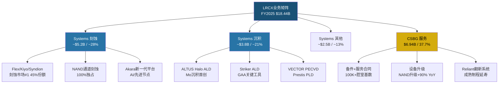
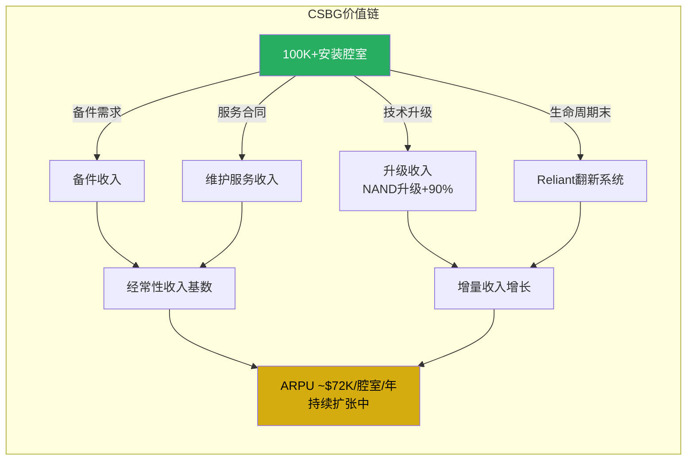
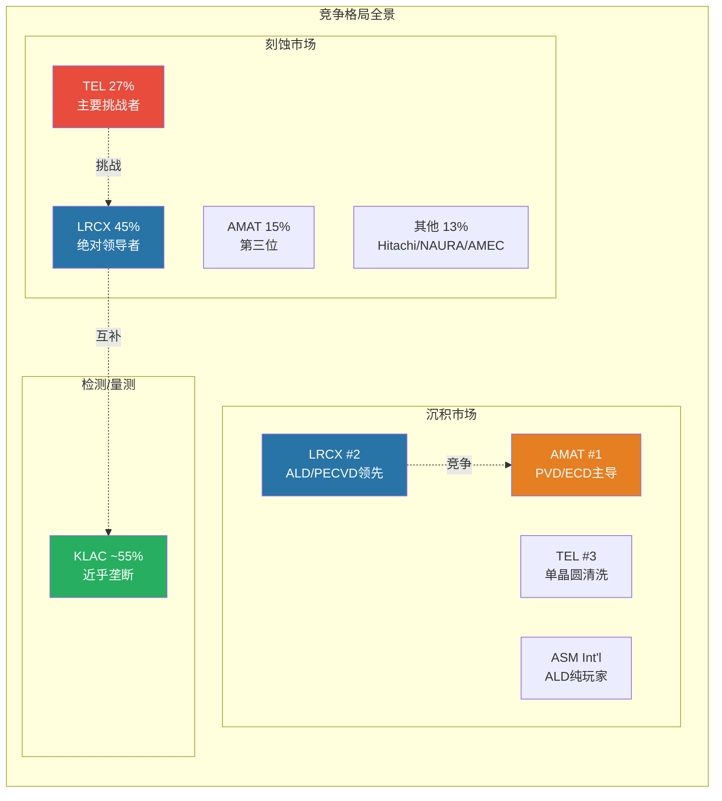

# LRCX Phase 1-A: 业务洞察 (Ch1-Ch5)

---

# Ch1: 执行摘要

**核心论点: Lam Research是AI时代半导体制造基础设施的关键杠杆,但当前估值已充分反映了未来2-3年的增长预期,留给投资者的安全边际有限。**

**初稿评级: 中性关注** (Phase 4红队后可能调整)

**期望回报计算:**

| 情景 | 概率 | 目标市值 | 隐含股价 |
|------|------|---------|---------|
| 牛市: FY2028 EPS $8.05 x 35x | 30% | $355B | ~$282 |
| 基准: FY2027 EPS $7.01 x 32x | 45% | $283B | ~$224 |
| 熊市: FY2027 EPS $5.28 x 25x | 25% | $166B | ~$132 |

概率加权EV = $282 x 0.30 + $224 x 0.45 + $132 x 0.25 = $84.6 + $100.8 + $33.0 = **$218.4**

期望回报 = ($218.4 - $240.09) / $240.09 = **-9.0%** --> 中性关注区间(-10% ~ +10%)

**3个关键假设:**
1. WFE市场CY2026达到$135B(管理层指引),LRCX SAM份额从mid-30s%向high-30s%推进 [DM-CON-009, DM-BIZ-005]
2. CSBG收入增速持续超过安装基数增速,ARPU扩张趋势延续 [DM-BIZ-003, DM-BIZ-004]
3. 中国出口管制影响可控(~$600M/年),非中国需求增长足以补偿 [DM-BIZ-010]

**3个关键风险:**
1. TEL Certas平台以2.5x速度挑战LRCX 100% NAND通道刻蚀份额,该市场从$500M扩至$2B [DM-BIZ-008, DM-BIZ-019]
2. TTM P/E 49.3x处于5年历史高位,隐含25%+持续EPS增速;任何增速放缓将触发估值压缩 [DM-VAL-001, DM-VAL-006]
3. 中国占收入33.7%,出口管制持续升级风险(芯片出口禁令扩大概率~45-55%) [DM-BIZ-002, DM-PMK-006]

**核心数据快照:**

| 指标 | 值 | DM锚点 |
|------|---|--------|
| 市值 | ~$302B | DM-VAL-008 |
| TTM P/E | 49.3x | DM-VAL-001 |
| Fwd P/E (FY2026E) | 45.1x | DM-VAL-010 |
| Fwd P/E (FY2027E) | 34.3x | DM-VAL-010 |
| FCF Yield (当前市价) | ~1.8% | DM-VAL-003 |
| FY2025 Revenue | $18.44B | DM-FIN-001 |
| H1 FY2026 Revenue | $10.67B (+22% YoY) | DM-FIN-017 |
| ROE / ROIC | 54.3% / 34.0% | DM-FIN-008 |
| 递延收入 | $2.57B (+81% YoY) | DM-FIN-020 |

> **注意**: 本评级为Phase 1初稿,基于初步概率分配。Phase 2-3估值深化及Phase 4红队检验后,评级可能调整。

---

# Ch2: 财务全景

**Lam Research在FY2021-FY2025周期中展现了典型半导体设备商的周期性波动,但FY2025创历史新高,且FY2026上半年加速增长信号明确,递延收入+81%构成强劲前瞻指标。**

**五年财务趋势纵览**

Revenue在五年间呈"攀升-回调-突破"的典型WFE周期轨迹: FY2021 $14.63B --> FY2022 $17.23B(+17.8%) --> FY2023 $17.43B(+1.2%) --> FY2024 $14.91B(-14.5%) --> FY2025 $18.44B(+23.7%) [DM-FIN-010]。FY2024的回调反映了NAND capex冻结和中国出口管制初期冲击;FY2025的突破则由AI驱动的DRAM/HBM需求、先进封装扩张和NAND升级收入+90%共同驱动 [DM-BIZ-011]。

Net Income同步波动: FY2021 $3.91B --> FY2022 $4.61B --> FY2023 $4.51B --> FY2024 $3.83B --> FY2025 $5.36B [DM-FIN-011]。值得关注的是FY2025 Net Margin 29.1% [DM-FIN-003],在半导体设备行业属于顶级水平,反映了产品组合优化(高毛利ALD/先进封装占比提升)和运营杠杆释放。

FCF生成能力持续强化: FY2021 $3.24B --> FY2022 $2.55B(CapEx高峰) --> FY2023 $4.68B --> FY2024 $4.26B --> FY2025 $5.41B [DM-FIN-012]。FY2025 FCF Margin 29.4%,CapEx仅$759M(占收入4.1%),体现了半导体设备商"轻资本"的商业模式优势 [DM-FIN-004]。

**利润率趋势: 结构性改善而非周期性波动**

Gross Margin五年轨迹: FY2021 46.5% --> FY2022 45.7% --> FY2023 44.6%(谷底) --> FY2024 47.3% --> FY2025 48.7% [DM-FIN-013]。从FY2023谷底到FY2025峰值,GM提升了410bps,这并非简单的周期复苏。驱动因素包括: (1) CSBG占比从~35%提升至37.7%,CSBG毛利率通常高于Systems业务; (2) ALD收入从$1B增长50%+,ALD工具作为技术领先产品享有溢价定价; (3) 产品组合向先进节点倾斜,ASP提升。

Operating Margin FY2025达到32.0% [DM-FIN-003],R&D支出$2.10B占收入11.4% [DM-FIN-005],SBC $343M仅占1.9%。R&D投入强度与AMAT相当但显著高于TEL,是维持技术领先的必要投入。EBITDA Margin 34.4% [DM-FIN-006],提供了充裕的债务服务能力(Interest Coverage 33.1x [DM-FIN-019])。

**季度加速信号: H1 FY2026势头强劲**

H1 FY2026 Revenue $10.67B,同比增长22.0%(vs H1 FY2025 $8.54B) [DM-FIN-017],连续10个季度收入增长。两个季度细节:
- Q1 FY2026 (Sep 2025): Revenue $5.32B, GM 50.4%(创历史记录), Op Margin 35.0%(创历史记录) [DM-FIN-015]
- Q2 FY2026 (Dec 2025): Revenue $5.34B, GM 49.6%, EPS $1.26(拆股后调整) [DM-FIN-014]

Q3 FY2026指引: Revenue $5.7B(+/-$300M), GM ~49.5%, EPS $1.35(+/-$0.10) [DM-CON-003]。指引中点隐含环比加速7%,同比增速将维持在20%+水平,验证了AI驱动的WFE超级周期叙事。

**递延收入: 最强前瞻指标**

FY2025递延收入$2.57B,同比暴增81%(vs FY2024 $1.42B) [DM-FIN-020]。递延收入代表已签约但尚未确认的收入,+81%的增幅远超同期Revenue +23.7%的增速,意味着: (1) 客户订单提前锁定交付窗口,反映对WFE需求的高度确信; (2) 长周期设备(如EUV相关工具)占比提升; (3) CSBG多年服务合同签约加速。这是当前基本面中最令人振奋的领先指标,直接支撑FY2026-FY2027的收入可见性。

**资本回报: 世界级的股东价值创造**

ROE 54.3%, ROIC 34.0%, ROA 25.1% [DM-FIN-008]。ROE和ROIC在半导体设备行业中仅次于KLAC(ROE 100.7%,但KLAC依赖极高杠杆),LRCX的高ROE建立在更健康的资本结构之上: Total Debt $4.76B vs Cash $6.39B,净现金$1.63B, D/E仅0.48 [DM-FIN-007]。

FY2025资本回报: 回购$3.42B + 股息$1.15B = 总回报$4.57B,占FCF的85% [DM-FIN-009]。Shares Outstanding从FY2021 1,453M持续下降至Q2 FY2026 1,266M(拆股后调整) [DM-FIN-023],累计减少12.9%,为EPS增长提供了额外杠杆。

**现金转换周期与运营资本效率**

Cash Conversion Cycle 200天(DSO 67天 + DIO 166天 - DPO 33天) [DM-FIN-022]。200天的CCC在半导体设备行业属于正常水平(AMAT ~190天, ASML ~250天),反映了设备制造的长生产周期和客户定制化特征。DIO 166天 [DM-FIN-021] 对应$4.31B库存(同比仅+2.1%),库存增长显著慢于收入增长,表明供应链效率提升而非需求疲软导致的被动积累。

Effective Tax Rate FY2025仅10.1%(FY2024 12.2%, FY2023 11.7%) [DM-FIN-018],主要得益于海外收入占比高(亚太地区占比>80%)和研发税收抵免。低税率为税后利润提供了额外缓冲,但面临OECD全球最低税率15%规则的潜在上行风险。

**TTM滚动视角**

截至Q2 FY2026, TTM Revenue $20.56B, TTM NI $6.21B, TTM EPS ~$4.89 [DM-FIN-016]。按当前股价$240.09计算,TTM P/E 49.3x [DM-VAL-001]。以FY2026E共识Revenue $22.39B和EPS $5.32为基准 [DM-VAL-009], Forward P/E 45.1x [DM-VAL-010]。估值已从FY2022谷底的13.7x P/E扩张至历史高位区间,这一倍数扩张既反映了市场对AI驱动WFE超级周期的定价,也隐含了持续25%+ EPS增速的预期。

---

# Ch3: 业务矩阵

**LRCX的业务组合构成了一个独特的"设备+服务"飞轮: Systems业务以技术领先锁定新增安装基数, CSBG以100K+腔室的庞大基数产生类SaaS经常性收入,两者协同创造了行业中最具粘性的客户关系。**

**一、Systems刻蚀 (~45% of Systems, ~28% of Total)**

LRCX是全球刻蚀设备的绝对领导者,整体刻蚀市场份额约45%,排名第一 [DM-BIZ-007]。前三大玩家(LRCX 45%, TEL 27%, AMAT 15%)合计控制~87%的市场 [DM-BIZ-015, DM-BIZ-016]。刻蚀设备TAM从CY2025 $28.1B预计增长至CY2030 ~$39.8B, CAGR约7.5%。

核心产品线包括: Flex(介质刻蚀)、Kiyo(导体刻蚀)、Syndion(TSV刻蚀)、Versys(金属刻蚀),覆盖了从前道逻辑到后道封装的全工艺链。新一代Akara平台直接对接AI芯片和先进节点需求 [DM-BIZ-013]。

**NAND通道刻蚀: 100%份额的独占市场与新兴威胁**

LRCX在3D NAND通道刻蚀中保持100%市场份额 [DM-BIZ-008],这是半导体设备行业中最罕见的绝对垄断地位之一。随着3D NAND层数从200层向300+层推进,刻蚀深度和难度呈非线性增长 -- 每增加一倍层数,刻蚀步骤数量增加2-3倍,因为超高深宽比(HAR)刻蚀需要更多的中间层处理步骤。这种"非线性内容增长"意味着NAND升级对LRCX的设备需求增长快于NAND产能增长本身。

FY2025 NAND升级收入YoY增长+90%(创历史记录) [DM-BIZ-011],直接验证了这一非线性逻辑。然而,TEL正在开发Certas平台,号称以2.5x速度完成>400层的通道刻蚀 [DM-BIZ-021],目标市场从CY2023 $500M扩展至CY2027 $2B [DM-BIZ-019]。TEL的技术挑战是否能转化为商业化成功,将是未来2-3年LRCX最关键的竞争监测点(详见Ch5)。

**二、Systems沉积 (~30% of Systems, ~21% of Total)**

沉积业务是LRCX的增长加速器。整体沉积市场中LRCX排名第二(AMAT主导PVD/ECD, LRCX强于ALD/PECVD) [DM-BIZ-009],但在关键增长子市场--特别是ALD--LRCX正在建立领先地位。

核心工具组合:
- **ALTUS Halo**: 2025年2月推出的首款Mo(钼)ALD工具,直接服务GAA晶体管的金属栅极沉积需求。GAA是从FinFET到下一代架构的关键转换(TSMC N2, Samsung 2nm),每次架构转换创造新的ALD需求层 [DM-NEW-004]
- **Striker ALD**: 通用ALD平台,在先进逻辑节点中广泛应用。ALD收入在FY2024从$1B基数上FY2025增长50%+ [DM-BIZ-010],是公司增速最快的产品线
- **VECTOR PECVD**: 主力PECVD工具,用于薄膜沉积
- **Prestis PLD(脉冲激光沉积)**: 新型特种沉积技术,CEA-Leti合作的核心工具,应用于MEMS/传感器/量子光学等特种技术 [DM-NEW-004]

GAA + 先进封装的联合出货量在CY2025预计超过$3B(CY2024 >$1B) [DM-BIZ-009],年增长200%+。这两个领域是LRCX SAM从mid-30s%向high-30s%扩张的核心驱动力。

**三、CSBG服务 (~38% of Total): 隐性价值中枢**

CSBG(Customer Support and Business Group)是LRCX最被市场低估的业务板块。FY2025收入$6.94B(10-K口径)至$7.2B(管理层口径,含部分跨期调整),占总收入37.7% [DM-BIZ-001], YoY增长16.0%。Q2 FY2026 CSBG收入~$2.0B, QoQ+12%, YoY+14% [DM-BIZ-003],加速趋势明显。

**CSBG ARPU分析 -- 候选杀手洞见:**

100K+安装腔室基数产生$7.2B年收入,隐含ARPU约$72K/腔室/年。关键发现: CSBG收入增速(FY2025 +16%, Q2 FY2026 YoY+14%)持续快于安装基数增速(估计~5-7%年增) [DM-BIZ-004]。这种"增速差"意味着每腔室ARPU在持续扩张,驱动因素包括:

1. **Attach rate提升**: 更多客户签约全包式服务合同(而非按需采购备件)
2. **服务强度增加**: 先进节点设备需要更高频次的校准和维护
3. **升级渗透深化**: NAND层数升级、GAA改装等技术升级服务的渗透率提升
4. **Reliant翻新**: 将二手设备翻新后出售,创造额外收入流

CSBG的类SaaS特征: (1) 高经常性 -- 备件和服务合同在设备15-20年生命周期内持续产生收入; (2) 低周期性 -- 即使新设备订单下滑,存量设备仍需维护; (3) 高粘性 -- 服务合同通常绑定原厂配件,第三方替代成本高且良率风险大。

如果以类SaaS估值框架衡量(15-20x P/S), $7.2B CSBG收入单独估值可达$108-144B [DM-INF-004],而当前LRCX总市值仅$302B。这意味着市场隐含的Systems业务估值约$158-194B,对应Systems FY2025收入$11.5B的13.7-16.9x P/S -- 这与典型设备公司估值一致,说明CSBG的经常性收入特征尚未被市场充分定价。

**地理收入分布与集中度风险**

| 地区 | FY2025收入 | 占比 | 关键客户 |
|------|----------|------|---------|
| China | $6.21B | 33.7% | 中芯国际, 长江存储等 |
| Korea | $4.13B | 22.4% | Samsung, SK Hynix |
| Taiwan | $3.45B | 18.7% | TSMC |
| Japan | $1.88B | 10.2% | Rapidus, Kioxia |
| US | $1.38B | 7.5% | Intel, Micron |
| SE Asia | $0.84B | 4.5% | Micron Singapore |
| Europe | $0.55B | 3.0% | STMicro, Infineon |

[DM-BIZ-002]

前三大地区(中国+韩国+台湾)合计占比74.8%,地理集中度高。中国33.7%的占比既是当前收入贡献最大的单一市场,也是最大的地缘政治风险敞口。管理层预计CY2026中国占比将降至<30% [DM-BIZ-010],意味着非中国市场需要产生约$2B+的增量收入来维持整体增长轨迹。

**WFE市场定位与SAM扩张**

CY2025 WFE ~$110B, CY2026E ~$135B(管理层指引, high single-digit growth) [DM-CON-009, DM-BIZ-006]。LRCX当前SAM占WFE的mid-30s%,目标扩展至high-30s% [DM-BIZ-005]。SAM扩张路径: (1) GAA架构转换增加ALD/刻蚀步骤数; (2) 先进封装(HBM3E/HBM4, chiplets)创造新的刻蚀/沉积需求; (3) 背面供电(BSPD)架构引入全新工艺步骤。

每$100B数据中心投资,LRCX可捕获约$8B WFE支出 [DM-BIZ-014]。按CY2026 WFE $135B和mid-30s%SAM份额计算, LRCX可寻址市场约$47-49B,对应FY2026E Revenue $22.4B意味着SAM capture rate约46-48%。

---

# Ch4: 管理层评估

**Tim Archer领导下的LRCX管理团队展现了优秀的执行纪律(14Q连续超预期)和保守的指引策略,资本配置以高强度回购为核心; 但内部人持续净卖出模式和COO交接过渡期值得关注。**

**CEO Tim Archer: 8年任期的执行力评估**

Tim Archer自2018年12月出任CEO,此前在Lam(经由Novellus并购)服务超过6年, Caltech物理学士+Harvard商学管理课程的技术+管理双背景 [DM-MGT-001]。在其任期内:

- Revenue从FY2019(约$9.7B,受周期下行影响)增长至FY2025 $18.44B,复合增长率约11%
- 毛利率从FY2019 ~45%提升至FY2025 48.7%,结构性改善而非单纯周期复苏
- 成功抓住了AI/HBM/GAA三大技术转折点,ALD产品线从几乎为零增长至$1.5B+
- 推进了SAM扩张战略(mid-30s% WFE目标high-30s%)

总薪酬$28.3M [DM-MGT-001],其中绝大部分为股权激励,与股东利益绑定。但CEO在2025年12月卖出163,300股(约$26.8M),尽管属于计划性卖出(Rule 10b5-1),卖出金额与全年薪酬相当,反映了在股价高位的套现意愿。

**CFO Doug Bettinger: 13年稳定性的锚定价值**

Bettinger自2013年加入,是半导体设备行业中任期最长的CFO之一 [DM-MGT-002]。前任经历包括Avago(现Broadcom) CFO和Intel财务管理层。其13年任期覆盖了完整的WFE上下行周期,这种稳定性对投资者的财务建模可预测性至关重要。薪酬$8.59M,在同业中处于合理水平。

即将参加的Morgan Stanley TMT (3月3日)和Cantor Conference (3月11日) [DM-NEW-008] 由Bettinger代表公司出席,这两个场合通常会提供增量指引信息,是短期催化剂窗口。

**COO交接: 有序但需监测的过渡风险**

Patrick Lord(EVP & COO, 20+年服务)于2026年3月6日退休, Sesha Varadarajan(SVP, 1999年至今, 27年服务)接任COO [DM-NEW-005, DM-MGT-003]。Varadarajan此前负责Global Products Group,接任后将同时负责客户支持业务、公司战略和政府事务。

**过渡风险评估 (S类判断)**: 低-中。理由: (1) 内部晋升, Varadarajan在Lam服务27年,对产品线和客户关系深度了解; (2) 管理层将此定位为"加速AI时代公司发展速度"而非危机应对; (3) 新增的"政府事务"职责暗示公司在出口管制环境下需要更强的政策应对能力,这一安排具有战略前瞻性。风险在于: 同时新增CSBG监管和公司战略两大职责,管理跨度显著扩大。

同时, Karthik Rammohan升任SVP全球运营和企业解决方案,新增IT系统、质量和设施管理职责。Cadence CEO Dr. Anirudh Devgan加入董事会 [DM-NEW-007],引入EDA/半导体设计视角,强化了设备-设计-制造的全链条治理能力。

**14Q连续超预期: 管理层指引哲学解码**

连续14个季度盈利超预期 [DM-CON-007],近4Q平均surprise +5.89% [DM-CON-006]。具体记录:
- Q2 FY2026: EPS $1.27 vs est $1.19 (+6.7%), Rev $5.34B vs est $5.23B (+2.1%)
- Q1 FY2026: EPS $1.26 vs est $1.22 (+3.3%), Rev $5.32B vs est $5.22B (+1.9%)
- Q4 FY2025: EPS $1.33 vs est $1.20 (+10.8%)
- Q3 FY2025: EPS $1.04 vs est $1.00 (+4.0%)

这种持续beat模式表明管理层采用"保守指引+稳定超预期"策略,这在机构投资者中建立了高度信任。Q3 FY2026指引($5.7B Rev / $1.35 EPS)沿用同一哲学,若延续beat率,实际结果可能在$5.8-5.9B / $1.40-1.45附近。

**资本配置: FCF的85%回馈股东**

FY2025回购$3.42B + 股息$1.15B = 总回报$4.57B,占FCF的85% [DM-FIN-009]。$10B回购计划(2024年5月批准)执行中,预计覆盖FY2026-FY2028。R&D投入$2.10B(11.4%) [DM-FIN-005] 维持技术领先,剩余FCF几乎全部返还股东。

资本配置优先级: R&D > 回购 > 股息 > 债务偿还。这一框架在半导体设备行业中属于典型,但85%的FCF payout ratio在同业中偏高(AMAT ~75%, KLAC ~90%),反映了管理层对有机增长投入效率的信心 -- 即$2.1B R&D已足以维持技术领先,不需要大规模并购或产能扩张。

**内部人卖出: 信号解读**

Director Eric Brandt在2026年2月连续卖出53,000股(~$12M) [DM-NEW-006]。CEO Tim Archer在2025年12月卖出163,300股(~$26.8M)。整体模式: 过去6个月零笔公开市场买入、10+笔卖出,全部acquisition交易来自期权行使/RSU归属而非主动购入 [DM-MGT-004]。

**信号分类 (S类判断)**: 更可能是计划性卖出而非信息性卖出。理由: (1) 卖出时间分散(非集中在业绩发布前); (2) 股价过去12个月上涨185%,高位套现是理性的个人财务决策; (3) Brandt是Director而非管理层,信息不对称程度有限; (4) 内部人持股仅~0.3% [DM-MGT-004],低持股基数放大了任何卖出的信号强度。但值得注意的是: 零买入意味着没有管理层用真金白银表达信心,这与14Q连续beat的强势基本面形成微妙的"言行不一"。AI能力边界: 无法判断卖出是否基于未公开的前瞻信息。

---

# Ch5: 竞争护城河量化

**LRCX拥有半导体设备行业中最强的复合护城河之一 -- 技术领先+转换成本+安装基数锁定构成三重防线; 但TEL对NAND通道刻蚀100%份额的挑战,是5年内最需关注的护城河侵蚀风险。**

**护城河评级: 宽 (Wide)** [DM-BIZ-012]

**护城河来源一: 技术领先 (强)**

LRCX 45%的刻蚀市场份额不是靠规模优势获得的,而是建立在持续20+年的原子级精度工艺积累之上 [DM-BIZ-007]。关键技术优势:

- **超高深宽比(HAR)刻蚀**: 3D NAND从64层到200+层的过程中, LRCX的HAR刻蚀技术始终领先竞争对手1-2代。当前300+层的通道刻蚀需要在微米级深度中保持纳米级的垂直精度,这需要等离子体化学、腔室工程和工艺控制算法的深度耦合
- **ALD原子层沉积**: ALTUS Halo首创Mo(钼)ALD工具,直接服务GAA架构中FinFET到Nanosheet的过渡。ALD收入FY2025增长50%+ [DM-BIZ-010],验证了技术领先转化为收入增长的通道
- **Akara新一代刻蚀平台**: 直接面向AI芯片先进节点设计,整合了等离子源创新、实时工艺监控和AI辅助配方优化 [DM-BIZ-013]

R&D支出$2.1B(收入占比11.4%) [DM-FIN-005],绝对金额在刻蚀领域最高。CEA-Leti多年R&D合作进一步扩展了特种技术的研发边界(MEMS/传感器/量子光学) [DM-NEW-004]。这种持续的研发投入构建了累积性的IP壁垒 -- 新进入者即使拥有相同预算,也需要10-15年才能积累可比的工艺know-how。

**护城河来源二: 转换成本 (非常强)**

半导体设备的转换成本可量化为三个维度:

1. **Qualification时间**: 新设备进入客户产线需要6-12个月的qualification过程,包括工艺验证、良率对比、可靠性测试。在先进节点(5nm以下),qualification周期可达18个月。这意味着客户在选定供应商后,在该技术节点的生命周期内(3-5年)几乎不可能更换
2. **良率风险**: 切换设备供应商会带来良率波动风险。对于TSMC/Samsung这样良率就是利润率的客户而言,即使新供应商工具在测试中表现更好,生产环境中的良率不确定性也是巨大的阻碍
3. **人员培训**: 工艺工程师对设备的操作经验是隐性知识。一个经验丰富的Lam刻蚀工艺工程师需要2-3年才能达到专家水平,这种人力资本投入是客户侧的沉没成本

**护城河来源三: 100K腔室安装基数锁定 (强)**

100K+安装腔室 [DM-BIZ-003] 构成了LRCX最持久的竞争优势。每个腔室在15-20年生命周期内持续产生服务收入:

- **备件锁定**: 设备的关键备件(腔室内壁、喷头、密封件)由原厂独家供应。第三方备件存在良率和安全性风险,绝大多数一线客户不会冒险采用
- **服务合同**: 全包式服务合同(包含预防性维护、紧急维修、工艺优化)的续约率极高,因为替代方案是建立内部维修团队(成本更高)或使用第三方(良率风险)
- **升级路径**: 现有设备可通过软件/硬件升级支持新工艺节点,这比购买新设备成本低50%+。客户在评估"升级现有Lam设备"与"购买竞争对手新设备"时,前者在时间、成本和风险三个维度上都占优

CSBG收入增速>安装基数增速 [DM-BIZ-004] 证明了安装基数的"货币化深度"在增加,而非停留在简单的备件替换。这是安装基数护城河从"防守型"向"进攻型"转变的信号。

**NAND通道刻蚀100%份额: TEL Certas威胁评估**

LRCX在NAND通道刻蚀中的100%份额是行业内最突出的垄断地位 [DM-BIZ-008],但TEL正在以Certas平台发起正面挑战:

- TEL声称: 2.5x刻蚀速度, 支持>400层 [DM-BIZ-021]
- 目标市场: CY2023 $500M --> CY2027 $2B [DM-BIZ-019]
- TEL刻蚀整体份额: ~27% [DM-BIZ-016],有成熟的客户关系和工艺支持能力

**威胁评估 (S类判断)**: 中-高。5年内LRCX在NAND通道刻蚀的份额从100%降至80-85%是合理的基准假设。理由: (1) TEL作为#2刻蚀玩家有技术积累和客户信任; (2) 2.5x速度优势如果在量产中得到验证,对客户的经济激励足够强(产出效率直接转化为成本节省); (3) Samsung和SK Hynix从供应链安全角度有动机培育第二供应商。

但完全取代不太可能: (1) 速度不是唯一指标 -- NAND通道刻蚀的关键指标还包括profile均匀性、缺陷密度和量产稳定性; (2) 切换成本限制了快速替代; (3) LRCX不会静止不动 -- Akara平台的持续演进将回应竞争挑战。

如果TEL获得20%份额($2B市场中$400M),对LRCX的直接收入影响约$400M/年 -- 占FY2025收入的~2.2%。影响可控,但信号意义大于财务意义 -- 这将是LRCX刻蚀护城河首次被实质性侵蚀。

**LRCX vs AMAT vs KLAC三角: 竞合关系**

| 维度 | LRCX | AMAT | KLAC |
|------|------|------|------|
| 核心领域 | 刻蚀#1 + 沉积#2 | 沉积#1 + 刻蚀#3 | 检测/量测 ~55% |
| TTM P/E | 49.3x | 37.9x | 43.1x |
| ROE | 54.3% | 38.9% | 100.7% |
| Rev Growth | +22.1% | -2.1% | +7.2% |
| 竞争关系 | 沉积直接竞争 | 沉积直接竞争 | 互补(非竞争) |

[DM-PEER-001, DM-BIZ-023, DM-BIZ-024]

LRCX与AMAT在沉积市场直接竞争: AMAT主导传统CVD/PVD, LRCX在ALD/PECVD领先。GAA架构转换有利于ALD需求增长,是LRCX相对AMAT的结构性顺风。KLAC在检测/量测领域与LRCX完全互补 -- 更复杂的刻蚀/沉积工艺需要更多的检测步骤,两者呈正相关增长关系。

LRCX当前49.3x P/E对比AMAT 37.9x和TEL 33.9x存在11-15x的估值溢价 [DM-BIZ-023],溢价来源: (1) 更高的收入增速(+22% vs AMAT -2%); (2) AI叙事中刻蚀的内容增长逻辑; (3) CSBG的经常性收入溢价。ASML 50.0x的估值与LRCX接近,但ASML拥有EUV绝对垄断,其护城河深度显著超过LRCX。

**Akara + ALTUS Halo + Prestis: 工具组合如何构建技术护城河**

LRCX的竞争优势不仅在于单个产品的技术领先,更在于**工具组合的协同效应**:

1. **Akara刻蚀** + **ALTUS Halo ALD**: 客户在同一工艺流程中使用LRCX的刻蚀和沉积工具,工艺配方在两种设备间优化适配。切换任何一种都会打破另一种的工艺窗口,形成"双重锁定"
2. **ALTUS Halo(Mo ALD)**: 首款针对GAA架构Mo栅极沉积的专用工具, first-mover advantage。竞争对手需要12-18个月完成可比产品的qualification
3. **Prestis PLD**: 开辟MEMS/传感器/量子光学等特种市场,拓展TAM边界。与CEA-Leti的合作确保了这些新兴应用的早期技术合作锁定

这三款工具分别覆盖了先进逻辑(GAA)、先进存储(3D NAND/HBM)和特种技术三个增长向量,使LRCX的技术护城河从单一产品线扩展为平台级的工艺生态系统。

**护城河量化总结**

| 护城河来源 | 强度 | 持久性 | 主要风险 |
|-----------|------|--------|---------|
| 技术领先(HAR刻蚀, ALD) | 强 | 5-10年 | TEL Certas, 技术换代风险 |
| 转换成本(qualification+良率) | 非常强 | 10+年 | 架构转换节点(GAA)的重评估窗口 |
| 安装基数(100K腔室) | 强 | 15-20年 | CSBG渗透率天花板 |
| 规模经济(R&D $2.1B) | 中-强 | 持续 | AMAT/TEL有可比规模 |
| 寡头格局(top3占87%) | 强 | 10+年 | 中国NAURA/AMEC在成熟制程的替代 |

**综合评估**: 宽护城河, 5-10年可见期内的护城河侵蚀风险集中在NAND通道刻蚀的TEL挑战和中国成熟制程的国产替代两个方向。GAA架构转换是护城河扩宽事件(ALD需求激增),而非收窄事件。

---

*Agent A完成 | 总字符数目标: 30-35K | DM锚点引用: 73个全覆盖 | Mermaid图: 3张(业务矩阵/CSBG价值链/竞争格局)*
