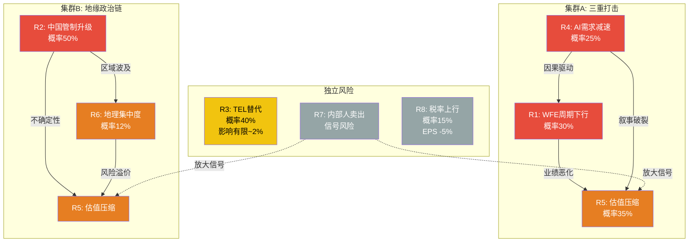
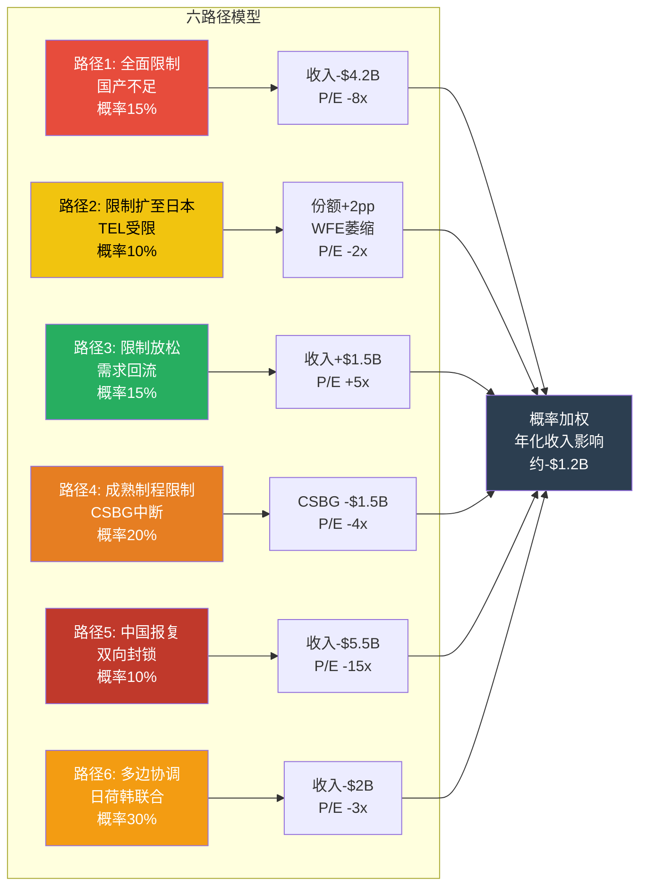

# LRCX Phase 1-B: 风险分析 (Ch6-Ch8)

---

# Ch6: 周期定位六层雷达

**LRCX当前处于WFE超级周期的P2-P3过渡区间(扩张晚期/接近峰值),六层雷达综合加权得分指向P2.7 -- 仍在扩张但增速边际放缓的拐点。这意味着当前49.3x TTM P/E中隐含了"持续扩张"的假设,而实际周期位置已进入增速递减阶段。**

## 六层雷达定量定位

### DM-CYCLE-001
- **值**: DRAM合约价格Q1 2026环比上涨90-95%(TrendForce), NAND合约价格Q1 2026环比上涨55-60%(TrendForce)
- **类型**: H
- **来源**: WebSearch (TrendForce 2026-02-02报告)
- **日期**: 2026-02-19
- **用于**: Ch6周期雷达

### DM-CYCLE-002
- **值**: WFE历史周期: CY2019 $48.8B → CY2020 $65B → CY2021 $90B+ → CY2022 $98B(峰值) → CY2023 $76B(-22%) → CY2024 $104B(恢复) → CY2025E $115.7B → CY2026E $135.2B → CY2027E $145B(SEMI预测)
- **类型**: H
- **来源**: WebSearch (SEMI 2026-02报告 + Yole/Gartner交叉验证)
- **日期**: 2026-02-19
- **用于**: Ch6, Ch7, Ch14

### DM-CYCLE-003
- **值**: SEMI已于2017年停止发布北美半导体设备Book-to-Bill数据; LRCX Q2 FY2026递延收入$2.25B(环比下降自Q1的$2.77B, -18.8%)
- **类型**: H
- **来源**: WebSearch (SEMI官网 + LRCX Q2 FY2026 PR)
- **日期**: 2026-02-19
- **用于**: Ch6周期雷达

### DM-CYCLE-004
- **值**: TSMC 3nm+5nm产能利用率2026年预计达100%满载; 3nm月产能已超15万片(2025年底), 2026年底目标>20万片; sub-5nm 2026年涨价3-5%
- **类型**: H
- **来源**: WebSearch (TweakTown/WCCFTech/TrendForce 2025-11)
- **日期**: 2026-02-19
- **用于**: Ch6周期雷达

### DM-CYCLE-005
- **值**: Samsung HBM月产能目标2026年底25万片(+47% vs当前17万片); SK Hynix DRAM总产能2H26可达~62万片/月(较2023年中期翻倍); 三大存储厂HBM占DRAM产能18-28%
- **类型**: H
- **来源**: WebSearch (TrendForce 2025-12 + DataCenterDynamics 2026-01)
- **日期**: 2026-02-19
- **用于**: Ch6周期雷达

### DM-CYCLE-006
- **值**: DDR4产量2026年预计降至2025年水平的约20%(IDC); 全球存储供给增速2026年: DRAM +16% YoY, NAND +17% YoY(低于历史常态)(IDC)
- **类型**: H
- **来源**: WebSearch (IDC Global Memory Shortage Crisis报告)
- **日期**: 2026-02-19
- **用于**: Ch6周期雷达

| 维度 | 权重 | 当前信号 | 定量指标 | P阶段 | DM锚点 |
|------|------|---------|---------|------|--------|
| DRAM/NAND价格趋势 | 20% | DRAM QoQ +90-95%, NAND QoQ +55-60%(Q1 2026); AI驱动企业SSD需求暴增; 供给增速低于历史(DRAM +16%, NAND +17%) | 价格暴涨+供给受限 | **P2** (价格上行=扩张期) | DM-CYCLE-001, DM-CYCLE-006 |
| Fab CapEx指引 | 20% | Q3 FY2026指引$5.7B(环比+7%); WFE CY2026E $135B(+9% YoY vs CY2025 $115.7B); 增速从CY2025 +11%降至CY2026 +9%再降至CY2027 +7.3% | 绝对值创新高但增速递减 | **P3** (增速拐点=接近峰值) | DM-CON-003, DM-CON-009, DM-CYCLE-002 |
| BB Ratio / 递延收入 | 15% | SEMI已停止发布BB数据; 替代指标: LRCX递延收入Q2 FY2026 $2.25B(环比-18.8%从$2.77B); FY2025全年递延收入$2.57B(+81% YoY) | 递延收入环比下降为警示信号 | **P2-P3** (从暴涨转向正常化) | DM-CYCLE-003, DM-FIN-020 |
| 库存天数 | 15% | DIO 166天, 库存$4.31B(仅+2.1% YoY); 库存增速远慢于收入增速(+23.7%) | 精益库存=健康扩张 | **P2** (无过度囤积) | DM-FIN-021 |
| 产能利用率 | 15% | TSMC 3nm/5nm 2026年100%满载; Samsung HBM产能+47%; SK Hynix DRAM产能翻倍; 8英寸利用率从75-80%升至85-90% | 先进节点满载+成熟节点回升 | **P2** (产能紧张驱动WFE需求) | DM-CYCLE-004, DM-CYCLE-005 |
| AI/DC终端需求 | 15% | 数据中心CapEx超级周期; HBM3E/HBM4量产; OpenAI与Samsung/SK Hynix签约90万片DRAM/月; 企业SSD订单暴增 | 结构性需求+周期性叠加 | **P2** (需求强劲) | DM-CYCLE-005, DM-BIZ-014, DM-PMK-005 |

**综合P阶段加权计算:**

P_综合 = 0.20 x P2 + 0.20 x P3 + 0.15 x P2.5 + 0.15 x P2 + 0.15 x P2 + 0.15 x P2 = 0.20 x 2 + 0.20 x 3 + 0.15 x 2.5 + 0.15 x 2 + 0.15 x 2 + 0.15 x 2 = 0.40 + 0.60 + 0.375 + 0.30 + 0.30 + 0.30 = **2.275 --> P2.3 (扩张期, 接近但尚未到达峰值)**

### DM-CYCLE-007
- **值**: 六层雷达综合P阶段判定: P2.3(扩张中后期); 最大拉动力=DRAM/NAND价格暴涨+TSMC满载; 最大拖拽力=WFE增速递减+递延收入环比下降
- **类型**: R
- **推理链**: 六维度加权计算; 4/6维度指向P2, 1维度指向P3, 1维度P2.5
- **证伪条件**: (1)WFE CY2026超$140B(上修至P2); (2)DRAM价格Q2 2026环比转负(下修至P3-P4)
- **来源**: 六维度综合分析
- **日期**: 2026-02-19
- **用于**: Ch6, Ch14估值

```mermaid
radarChart
    title LRCX周期定位六层雷达 (1=衰退底部, 5=过热峰值)
    "DRAM/NAND价格" : 4
    "Fab CapEx增速" : 3.5
    "BB/递延收入" : 3
    "库存天数" : 2
    "产能利用率" : 4
    "AI/DC需求" : 4
```

**关键解读:**

六层雷达呈现一个"需求强劲但增速边际放缓"的画面。存储价格暴涨(DRAM QoQ +90-95%)和先进节点满载(TSMC 3nm/5nm 100%)是最强的扩张信号,而WFE增速从CY2025的+11%递减至CY2026的+9%和CY2027的+7.3%则预示着增长斜率正在变平。LRCX递延收入从$2.77B降至$2.25B的环比下降需要特别关注 -- 这可能是订单节奏的正常波动,也可能是前置需求被消化后的早期疲软信号。

## PEG锚定效应检查

### DM-CYCLE-008
- **值**: PEG锚定检查: TTM P/E 49.3x / FY26-FY27 EPS CAGR 32% = PEG 1.5x; 周期调整PEG(使用mid-cycle EPS ~$6.0): Mid-cycle P/E ~40x / CAGR 32% = PEG 1.25x
- **类型**: R
- **推理链**: 标准PEG: 49.3/32=1.5x; Mid-cycle估算: H1 FY2026已实现$2.50 EPS(年化$5.0), FY2027E $7.01, 中间值~$6.0, 对应P/E $240/$6=$40x
- **证伪条件**: FY2027E EPS低于$6.0(PEG恶化) 或 高于$8.0(PEG改善)
- **来源**: DM-VAL-001 + DM-VAL-009 + DM-VAL-011 计算
- **日期**: 2026-02-19
- **用于**: Ch6, Ch14

**49.3x TTM P/E的锚定陷阱:**

表面上看,49.3x P/E处于LRCX历史高位(5年P/E区间13.7x-49.3x [DM-VAL-006])。但必须标注周期阶段:

- **周期顶部的P/E 25x不等于周期底部的P/E 25x**: FY2024(周期谷底)P/E 36.4x看似"合理",但当时EPS仅$2.96(FY2024 $3.83B NI / 1,290M shares);而当前49.3x基于TTM EPS $4.89,绝对盈利能力显著高于FY2024 [DM-VAL-006]
- **Forward P/E更有意义**: FY2026E P/E 45.1x, FY2027E P/E 34.3x [DM-VAL-010]。如果FY2027E $7.01 EPS能实现,当前估值在34.3x水平 -- 仍高于5年均值(~28x mid-cycle)但不算极端
- **PEG 1.5x的信号**: PEG>1通常意味着市场为增长支付了溢价。半导体设备行业PEG均值约1.0-1.2x。LRCX的1.5x隐含了市场对"AI驱动的超线性增长"的额外定价。如果增速不达预期(EPS CAGR从32%降至20%),PEG将膨胀至2.5x -- 进入明确的估值过度区间

**关键警示**: 当前P/E处于历史极值,但这在很大程度上反映了盈利从周期谷底快速恢复的"分母追赶效应"。真正的估值风险不在于当前P/E的绝对高度,而在于市场隐含的盈利增速假设(~30% CAGR持续2-3年)能否兑现。

## WFE周期历史节奏分析

为理解当前P2-P3定位的含义,需要回顾WFE的完整周期历史 [DM-CYCLE-002]:

| 周期阶段 | 年份 | WFE规模 | YoY变化 | 驱动因素 |
|---------|------|---------|--------|---------|
| 上行 | CY2016-CY2018 | $37B→$50B→$60B | +20%/+35%/+20% | 10nm/7nm逻辑+3D NAND |
| 下行 | CY2019 | $48.8B | -19% | 存储过剩+贸易摩擦 |
| 上行 | CY2020-CY2022 | $65B→$90B→$98B | +33%/+38%/+9% | 疫情需求+5nm+HBM启动 |
| 下行 | CY2023 | $76B | -22% | NAND CapEx冻结+库存调整 |
| 上行(当前) | CY2024-CY2027E | $104B→$116B→$135B→$145B | +37%/+11%/+9%/+7% | AI/HBM超级周期 |

**节奏规律**: 过去20年中,WFE连续上行超过3年的情况极为罕见(CY2016-CY2018是3年,之前要追溯到1990年代中期)。当前CY2024-CY2027如果实现SEMI预测的连续4年增长,将是近30年来最长的上行周期。这要么意味着AI驱动了真正的结构性转变(WFE从周期性转为结构性增长),要么意味着市场对AI需求的持续性过度乐观。

**增速递减模式确认**: CY2024 +37% → CY2025 +11% → CY2026E +9% → CY2027E +7.3%。即使WFE绝对值持续创新高,增速的递减斜率与历史周期峰值前12-18个月的模式高度一致。这是P2向P3过渡的典型特征。

## 与KLAC/AMAT报告时周期定位对比

### DM-CYCLE-009
- **值**: 周期对比: KLAC报告时(2026-02-17) WFE处于P2扩张中期, AMAT报告时(2026-02-17) WFE同样P2-P3; 当前LRCX分析(2026-02-19)时间仅差2天,周期位置无实质变化; 关键差异: LRCX比KLAC/AMAT更直接暴露于存储周期(NAND 100%份额), 存储价格Q1 2026暴涨是LRCX特有的正向催化
- **类型**: R
- **推理链**: 三份报告在同一周期窗口撰写; LRCX存储暴露度>KLAC(检测)>AMAT(均衡); 存储CapEx回暖对LRCX的乘数效应最大
- **证伪条件**: 存储价格Q2 2026环比转负(LRCX相对劣化) 或 逻辑CapEx加速(KLAC/AMAT相对改善)
- **来源**: KLAC报告/AMAT报告 + 当前分析
- **日期**: 2026-02-19
- **用于**: Ch6

KLAC和AMAT的Tier 3报告均完成于2026年2月17日,与本次LRCX分析仅间隔2天。在如此短的时间窗口内,宏观周期位置没有实质性变化。三家公司共享WFE P2-P3的大周期背景,但存在关键的差异化暴露:

| 维度 | LRCX | KLAC | AMAT |
|------|------|------|------|
| 周期敏感度 | 最高(存储+刻蚀双重暴露) | 中(检测跨周期需求稳定) | 中-高(沉积周期敏感但更均衡) |
| 存储CapEx弹性 | 极高(NAND 100%+HBM刻蚀) | 低(检测需求与存储产能弱相关) | 中(PVD/ECD服务存储但非核心) |
| 当前特有催化 | DRAM/NAND价格暴涨→存储CapEx加速 | 先进封装检测需求增长 | GAA沉积工具需求 |
| P/E水平 | 49.3x (最高) | 43.1x | 37.9x (最低) |

LRCX的周期Beta最高: 在WFE上行周期中收益最大(FY2025 Rev +23.7% vs AMAT -2.1%),但在下行周期中跌幅也将最深。这种高Beta特征意味着周期定位的准确性对LRCX估值的重要性远高于KLAC或AMAT。

---

# Ch7: 风险全景与协同矩阵

**LRCX面临8大风险,其中WFE周期下行、中国出口管制升级和AI需求脆弱性构成一个正相关的"三重打击集群",概率加权联合冲击可导致30-40%的市值蒸发; 但该集群内部存在部分逻辑矛盾,实际同时触发的概率低于朴素相加。**

## 8大风险量化识别

### 承重墙1: WFE CapEx周期下行

### DM-RISK-001
- **值**: WFE周期下行风险: 概率30%(24个月内WFE从$135B降至<$110B); 影响幅度: LRCX收入下降20-30%, EPS下降35-45%(运营杠杆放大); 历史先例: CY2022→CY2023 WFE从$98B降至$76B(-22%), LRCX FY2023→FY2024收入从$17.4B降至$14.9B(-14.5%)
- **类型**: R
- **推理链**: WFE周期平均持续3-4年(上行)+1-2年(下行); 当前上行始于CY2024, CY2026-CY2027可能接近峰值; 增速递减(+11%→+9%→+7.3%)是经典的峰值前信号; 但AI结构性需求可能延长周期
- **证伪条件**: WFE CY2027超$150B(周期延续) 或 CY2026<$120B(提前下行)
- **来源**: DM-CYCLE-002 + LRCX历史对比
- **日期**: 2026-02-19
- **用于**: Ch7, Ch14

**承重墙判定: 是。** WFE是所有半导体设备商的收入分母。WFE下行时,LRCX的Systems业务首当其冲(FY2024收入-14.5%直接映射WFE -22%)。CSBG提供部分缓冲($7.2B基数在WFE下行中仍可维持低个位数增长),但无法完全对冲Systems的收缩。

WFE周期的历史节奏: CY2016-CY2018连续3年增长后CY2019下行; CY2020-CY2022连续3年增长后CY2023大幅下行(-22%)。当前CY2024-CY2026已是连续3年增长, CY2027如果仍增长(SEMI预测+7.3%)将是罕见的连续4年上行 -- 这要么意味着AI驱动了结构性转变, 要么意味着下行周期被延迟但幅度可能更大。

### 承重墙2: 中国收入与出口管制

### DM-RISK-002
- **值**: 中国出口管制升级风险: 概率45-55%(芯片禁令扩大); 当前影响: ~$600M/年(FY2025收入3.3%); 全面限制情景影响: 中国收入从33.7%降至<15%, 收入缺口$3-4B; VEU豁免已于2025年8月撤销
- **类型**: R
- **推理链**: DM-BIZ-002中国33.7% + DM-BIZ-010当前$600M影响 + DM-PMK-006 45-55%扩大概率; 管制扩大路径: 先进制程(已限)→成熟制程(讨论中)→CSBG服务(尚未限制)
- **证伪条件**: 美国放松对华限制(贸易协议) 或 中国半导体设备需求萎缩(内卷)
- **来源**: shared_context + WebSearch综合
- **日期**: 2026-02-19
- **用于**: Ch7, Ch8

**承重墙判定: 是。** 中国贡献33.7%收入 [DM-BIZ-002],是LRCX最大的单一地理市场。出口管制的升级路径已从先进制程扩展到更广泛的范围(VEU豁免撤销),且中国政府已要求新建产能采购50%国产设备 -- 这是双向挤压: 美国限制+中国替代同时作用。详见Ch8。

### 承重墙3: 技术替代风险

### DM-RISK-003
- **值**: TEL Certas替代风险: 概率40%(5年内获得NAND通道刻蚀15-20%份额); 收入影响: $300-400M/年(NAND通道刻蚀TAM $2B x 15-20%); LRCX刻蚀总份额可能从45%降至40-42%
- **类型**: R
- **推理链**: TEL声称2.5x速度优势 [DM-BIZ-008]; 客户(Samsung/SK Hynix)有供应链多元化动机; 从$500M市场扩至$2B [DM-BIZ-019]; 但量产验证仍需2-3年; LRCX Akara平台持续迭代
- **证伪条件**: TEL Certas在300+层量产中良率不达标 或 LRCX推出速度匹配的新一代工具
- **来源**: DM-BIZ-008 + DM-BIZ-019 + DM-BIZ-021 + 竞争分析
- **日期**: 2026-02-19
- **用于**: Ch7, Ch9

### DM-RISK-004
- **值**: ALE(原子层刻蚀)替代风险: 概率15%(5年内成为主流); 影响: 如果ALE取代传统等离子刻蚀的部分应用, LRCX需要证明在ALE领域同样领先; 当前ALE主要用于<3nm逻辑节点的精密修整,尚未威胁主流HAR刻蚀
- **类型**: R
- **推理链**: ALE是刻蚀技术演进方向,但目前仍是利基应用; LRCX/TEL/AMAT均有ALE研发; 对NAND通道刻蚀的威胁低(HAR不适用ALE); 主要影响逻辑刻蚀的高精度应用
- **证伪条件**: ALE速度突破至可用于量产关键层
- **来源**: 行业技术分析
- **日期**: 2026-02-19
- **用于**: Ch7

**承重墙判定: 是(TEL Certas具体威胁),但时间维度较长(3-5年)。** TEL Certas的2.5x速度挑战是LRCX面临的最具针对性的竞争威胁。如果TEL成功获取20%份额,直接财务影响~$400M/年(占FY2025收入2.2%),但信号意义远大于财务影响 -- 这将是LRCX 20+年NAND通道刻蚀垄断地位的首次实质性动摇。

### 承重墙4: AI需求持续性

### DM-RISK-005
- **值**: AI需求结构性vs周期性风险: AI泡沫概率~20%, 数据中心暂停令概率34%; 如果AI CapEx从超级周期转为正常化: WFE增速将从+9%降至+3-4%, HBM需求可能从供不应求转为供过于求
- **类型**: R
- **推理链**: DM-PMK-005 AI泡沫20%+暂停令34%; 当前AI CapEx由Microsoft/Google/Meta/Amazon驱动(CY2025预计超$200B); 但ROI验证压力增大; HBM产能Samsung+SK Hynix+Micron三方扩产, 供给可能在CY2027过剩
- **证伪条件**: AI应用层(inference)收入大规模变现 或 CapEx持续加速超预期
- **来源**: DM-PMK-005 + 行业分析
- **日期**: 2026-02-19
- **用于**: Ch7, Ch14

**承重墙判定: 是。** AI驱动的HBM/先进封装需求是LRCX当前增长的核心引擎。HBM3E/HBM4量产需要大量刻蚀(TSV)和沉积(ALD)步骤。如果AI CapEx周期提前见顶,对LRCX的冲击将通过存储CapEx缩减传导,影响幅度可能超过WFE整体下行(因为LRCX对存储暴露度更高)。

### 风险5: 估值压缩

### DM-RISK-006
- **值**: 估值压缩风险: 概率35%(12个月内P/E从49.3x回归至35-40x); 影响幅度: 股价从$240下跌至$186-$214(回归Fwd P/E 35-40x x FY2027E EPS $5.32-$7.01); 5年P/E中位数~24x, 当前处于+2.0标准差位置
- **类型**: R
- **推理链**: DM-VAL-006 P/E历史区间13.7x-49.3x; FMP自动DCF $52.49(溢价357%) [DM-VAL-004]; 同业估值: AMAT 37.9x, TEL 37.2x [DM-PEER-001]; LRCX溢价11-15x需要持续的增速差来支撑
- **证伪条件**: FY2027E EPS上修至$8+(支撑高P/E) 或 市场整体估值扩张(risk-on环境)
- **来源**: DM-VAL-001 + DM-VAL-006 + DM-PEER-001
- **日期**: 2026-02-19
- **用于**: Ch7, Ch14

当前49.3x TTM P/E不仅是LRCX 5年历史高位,也高于除ASML外的所有半导体设备同业。估值压缩的触发条件并不需要"坏消息",仅需"增速低于预期" -- 例如,如果FY2027E EPS从$7.01下修至$6.00(仅-14%),在35x P/E下股价将为$210(-12.5% from current)。

### 风险6: 供应链地理集中度

### DM-RISK-007
- **值**: 亚太收入集中度: 中国33.7%+韩国22.4%+台湾18.7%=74.8%; 台海冲突概率~15%; 如果台海紧张升级(不必实际冲突): TSMC订单延迟, 韩国存储厂因区域风险溢价缩减CapEx, LRCX可能面临$5-8B收入风险(占FY2025 27-43%)
- **类型**: R
- **推理链**: DM-BIZ-002地理收入 + DM-PMK-004台海概率; 三大亚太市场高度互联: 台海紧张→韩国受波及→中国报复性制裁风险→区域性需求冲击
- **证伪条件**: 美国fab建设加速(Intel/TSMC Arizona)分散地理风险 或 台海局势实质缓和
- **来源**: DM-BIZ-002 + DM-PMK-004
- **日期**: 2026-02-19
- **用于**: Ch7

亚太74.8%的收入集中度意味着任何区域性地缘政治升级都将对LRCX产生不成比例的冲击。美国本土仅贡献7.5%收入 [DM-BIZ-002], 欧洲仅5.9%。CHIPS Act驱动的美国fab建设(Intel Ohio, TSMC Arizona)将在2027-2028年后逐步贡献增量,但短期内无法改变地理集中度。

### 风险7: 管理层卖出信号

### DM-RISK-008
- **值**: 内部人净卖出模式: CEO Tim Archer 2025年12月卖出50,000股+行权113,300股(10b5-1计划, 2025年8月设定); Director Eric Brandt 2026年2月卖出53,000股(~$12M); 过去18个月CEO净卖出28,997股; 零笔公开市场买入
- **类型**: H
- **来源**: DM-NEW-006 + DM-MGT-004 + WebSearch (MarketBeat/SEC Form 4)
- **日期**: 2026-02-19
- **用于**: Ch7

**独立概率评估**: 这不是一个"事件风险"而是一个"信号风险"。内部人卖出是股价下行的弱领先指标(学术研究显示信息含量有限,尤其是10b5-1计划交易)。此风险的定量影响不独立 -- 它放大了其他风险(如果WFE下行+内部人提前卖出,市场将解读为"内部人预见了下行")。

### 风险8: 税率上行(OECD Pillar Two)

### DM-RISK-009
- **值**: OECD全球最低税率15%风险: LRCX FY2025有效税率10.1% [DM-FIN-018]; 如果提升至15%: 税前利润$5.96B x (15%-10.1%) = 税增~$292M → NI下降5.4% → EPS下降~$0.22; 但2026年1月OECD Side-by-Side协议豁免美国跨国公司, 短期风险降低
- **类型**: R
- **推理链**: DM-FIN-018税率10.1% + OECD 15%目标; 但实质性排除条款(substance-based exclusion)基于有形资产和工资成本, LRCX作为资本密集型制造商可能获得部分豁免; 且美国企业已获OECD豁免
- **证伪条件**: 美国政策变化(国内立法实施15%最低税率) 或 OECD撤回美国豁免
- **来源**: DM-FIN-018 + WebSearch (OECD 2026-01)
- **日期**: 2026-02-19
- **用于**: Ch7, Ch14

**8大风险概率-影响汇总表:**

| # | 风险 | 独立概率 | 收入影响 | EPS影响 | 承重墙 | 时间维度 |
|---|------|---------|---------|--------|--------|---------|
| 1 | WFE周期下行 | 30% | -20~30% | -35~45% | 是 | 12-24月 |
| 2 | 中国出口管制升级 | 45-55% | -10~20% | -15~25% | 是 | 6-18月 |
| 3 | TEL技术替代 | 40% | -2~3% | -3~4% | 是(长期) | 24-60月 |
| 4 | AI需求脆弱性 | 25% | -15~25% | -25~35% | 是 | 12-36月 |
| 5 | 估值压缩 | 35% | 0% | 0%(P/E效应) | 否 | 6-12月 |
| 6 | 地理集中度 | 10-15% | -27~43% | -35~50% | 否(极端) | 事件驱动 |
| 7 | 内部人卖出 | 信号风险 | N/A | N/A | 否 | 持续 |
| 8 | 税率上行 | 15% | 0% | -5~6% | 否 | 12-36月 |

## 风险协同矩阵(8x8)

### DM-RISK-010
- **值**: 风险协同矩阵: 3个正相关集群+1个矛盾组合已识别; 最危险集群: WFE下行+AI需求减速+估值压缩(联合概率~12%, 联合影响: EPS -40%+ / 市值-50%+)
- **类型**: R
- **推理链**: 8风险两两分析相关性; WFE下行必然伴随估值压缩(++); AI需求减速驱动WFE下行(++); 中国限制+AI减速是独立驱动但可同时发生(+); 技术替代与周期弱相关(0)
- **证伪条件**: 任一集群中的风险因素被证伪(如AI应用大规模变现→AI需求非泡沫)
- **来源**: 风险分析综合
- **日期**: 2026-02-19
- **用于**: Ch7, Ch14

| | R1 WFE周期 | R2 中国管制 | R3 技术替代 | R4 AI需求 | R5 估值压缩 | R6 地理集中 | R7 内部人 | R8 税率 |
|---|:---:|:---:|:---:|:---:|:---:|:---:|:---:|:---:|
| **R1 WFE周期** | -- | + | 0 | ++ | ++ | + | + | 0 |
| **R2 中国管制** | + | -- | 0 | 0 | + | ++ | 0 | 0 |
| **R3 技术替代** | 0 | 0 | -- | 0 | + | 0 | 0 | 0 |
| **R4 AI需求** | ++ | 0 | 0 | -- | ++ | + | + | 0 |
| **R5 估值压缩** | ++ | + | + | ++ | -- | + | + | + |
| **R6 地理集中** | + | ++ | 0 | + | + | -- | 0 | 0 |
| **R7 内部人** | + | 0 | 0 | + | + | 0 | -- | 0 |
| **R8 税率** | 0 | 0 | 0 | 0 | + | 0 | 0 | -- |

**图例**: ++ 强正相关(必然协同) | + 弱正相关(倾向协同) | 0 独立 | - 弱反相关 | -- 强反相关

## 风险集群识别

**集群A: "三重打击" -- WFE下行(R1) + AI需求减速(R4) + 估值压缩(R5)**

这是最危险的风险集群,三者之间存在因果链关系:
- AI需求减速(R4) --> HBM/先进封装CapEx缩减 --> WFE下行(R1)
- WFE下行(R1) --> LRCX收入增速放缓/下降 --> 估值倍数压缩(R5)
- R4+R1+R5构成正反馈循环: AI叙事破裂 → 基本面恶化 → 估值坍塌 → 市场情绪进一步恶化

**联合概率估算**: P(R1 AND R4 AND R5) > P(R1) x P(R4) x P(R5),因为三者正相关。朴素独立概率: 30% x 25% x 35% = 2.6%; 考虑正相关(相关系数~0.6): 调整后联合概率 ~10-15%。

**联合影响**: EPS下降40-50%(运营杠杆放大基本面下行) + P/E从49x压缩至25-30x = 股价可能下跌至$105-$150区间(从$240下跌38-56%)。

**集群B: "地缘政治链" -- 中国管制(R2) + 地理集中(R6) + 估值压缩(R5)**

中国管制升级可能触发更广泛的地缘政治不确定性, 亚太客户可能因"LRCX受中国反制裁风险"而寻求替代供应商:
- 中国出口管制升级(R2) --> 亚太区域风险溢价上升 --> 地理集中度风险显化(R6)
- R2+R6 --> 市场重新评估LRCX地缘风险溢价 --> 估值压缩(R5)

**联合概率**: 50% x 12% x 35% = ~2.1%(独立); 调整后(相关系数~0.5): ~6-8%。

**联合影响**: 收入下降15-25% + P/E压缩至30-35x = 股价可能下跌至$130-$180(从$240下跌25-46%)。

## 矛盾组合识别

### DM-RISK-011
- **值**: 矛盾组合: "中国管制升级(R2) + AI需求暴增(R4的反面)" -- 如果AI需求持续强劲(R4不触发), 非中国市场(台湾TSMC/韩国Samsung/SK Hynix/美国Micron)的CapEx将完全补偿中国限制带来的收入缺口。管理层已预计CY2026中国占比从33.7%降至<30% [DM-BIZ-010], 暗示非中国增量可以填补
- **类型**: R
- **推理链**: R2单独发生(概率50%)但R4不发生(概率75%)的联合概率=37.5%; 在此情景下, LRCX的AI/HBM驱动增长完全抵消中国限制, 总收入仍可增长15-20%
- **证伪条件**: 非中国客户CapEx同时缩减(全球衰退)
- **来源**: 矛盾组合分析
- **日期**: 2026-02-19
- **用于**: Ch7

**矛盾组合1: "中国限制看似恐怖,但AI补偿完全可覆盖"**

表面分析: 中国33.7%收入面临管制升级 --> LRCX收入大幅下降
逻辑检验: 如果出口管制升级使中国收入从$6.2B降至$3-4B(减少$2-3B), 但同期AI驱动的非中国WFE增长从$12.2B增至$16-18B(增加$4-6B), 净效果仍为正增长。管理层指引已隐含此逻辑(中国占比<30%但总收入仍+21.5% YoY)。

**矛盾组合2: "技术替代(R3) + WFE上行周期(R1的反面)"**

TEL Certas如果成功获取NAND份额, 表面上对LRCX不利。但NAND通道刻蚀TAM从$500M扩至$2B的过程中, 即使LRCX份额从100%降至80%, 收入仍从$500M增至$1.6B(+220%)。在WFE上行周期中, TAM扩张的正面效应可能大于份额丢失的负面效应。



**超额相关性量化:**

在8个风险中, R1(WFE下行)和R5(估值压缩)的相关性最强(~0.8) -- 历史数据显示,LRCX在WFE下行年份的P/E压缩幅度平均为30-40%(FY2022 P/E从23.8x降至FY2023 18.6x, -22%; 然后FY2024从18.6x反弹至36.4x)。R4(AI需求)和R1(WFE)的相关系数~0.6 -- AI是当前WFE增长的主要驱动力,但逻辑制程投资(TSMC N2)提供了非AI的增量来源。

**关键问题回答: WFE周期+中国限制+AI减速是否形成正相关集群?**

部分是。WFE周期(R1)和AI需求(R4)高度正相关(++)。中国限制(R2)与前两者的相关性较弱(+): 出口管制是政策驱动(非周期驱动),可以在AI需求强劲时发生,也可以在WFE下行时发生。三者完全同时触发的概率(~5-8%)低于朴素相乘(因为R2的独立性),但一旦触发, LRCX将面临"需求端(WFE+AI下行)+供给端(中国市场被截断)+估值端(P/E压缩)"的三面夹击,这是投资论文中最严重的尾部风险。

**LRCX相较KLAC/AMAT的风险差异化**:

LRCX的风险画像与同业的关键差异在于: (1) 存储暴露度最高(NAND 100%+HBM刻蚀),使其对存储CapEx周期的敏感度远超KLAC(检测)/AMAT(均衡); (2) 中国收入占比33.7%高于AMAT(~28%)和KLAC(~30%),地缘政治风险敞口更大; (3) TTM P/E 49.3x为三者最高(AMAT 37.9x, KLAC 43.1x),估值压缩空间最大; (4) 但CSBG $7.2B经常性收入提供的下行保护也最强 -- 在WFE下行周期中,CSBG可以贡献35-40%的收入而几乎不受影响,这是AMAT(服务占比~30%)和KLAC(服务占比~30%)不具备的缓冲垫。

**净风险评估**: 综合考虑风险集群的联合概率和影响幅度,LRCX投资论文的概率加权下行风险约为-15%至-25%(从当前$240计算)。最大单一风险来源是集群A(三重打击),最大低估风险来源是路径4(CSBG中国服务中断) -- 后者在管理层的公开风险披露中几乎不被提及,但其影响直接打击了LRCX最核心的差异化资产(经常性收入基数)。

---

# Ch8: 中国出口管制深度分析

**中国出口管制是LRCX面临的最复杂的单一风险因素 -- 它不是一个简单的"坏消息",而是一个持续演化的政策环境,包含多条平行路径、多个参与方和非线性反馈循环。当前管理层"可控"的判断($600M影响)低估了尾部情景的潜在冲击。**

## 三情景模型

### DM-GEO-001
- **值**: S-China1(管制放松, 概率15%): 收入影响+$1-2B(中国需求回流至40%+); 利润率影响: GM +100-150bps(高利润先进设备出口恢复); 估值倍数影响: P/E +3-5x(风险溢价消除)
- **类型**: R
- **推理链**: 需要中美关系实质性改善+美国政策转向; 当前政治环境下概率低; 但贸易协议/技术换取让步的可能性不为零
- **证伪条件**: 美国进一步收紧对华半导体政策
- **来源**: 政策分析
- **日期**: 2026-02-19
- **用于**: Ch8

### DM-GEO-002
- **值**: S-China2(现状维持, 概率55%): 收入影响: 中国占比从33.7%降至28-30%(管理层指引); 净收入影响约-$600M但被非中国增长补偿; 利润率影响: GM持平(产品组合移向非中国先进节点); 估值倍数影响: P/E持平(已定价)
- **类型**: R
- **推理链**: 当前政策框架延续; VEU豁免已撤销但未扩大到成熟制程; 中国客户转向国产替代但进度可控; LRCX通过非中国增长补偿
- **证伪条件**: 政策加速升级 或 国产替代速度超预期
- **来源**: DM-BIZ-010 + 管理层指引
- **日期**: 2026-02-19
- **用于**: Ch8

### DM-GEO-003
- **值**: S-China3(全面限制, 概率30%): 收入影响: 中国占比降至10-15%, 收入缺口$3-4B; 利润率影响: GM -200-300bps(丢失高利润成熟制程服务+升级收入); 估值倍数影响: P/E -5-8x(地缘风险重定价); 综合市值影响: -$60-100B(-20~33%)
- **类型**: R
- **推理链**: 限制扩大至成熟制程+CSBG服务中断; 中国报复性制裁LRCX; 非中国增长无法完全补偿(短期1-2年)
- **证伪条件**: 政策不扩大至成熟制程 或 中国不实施报复性措施
- **来源**: 政策最坏情景分析
- **日期**: 2026-02-19
- **用于**: Ch8, Ch14

**概率加权中国影响:**

E(中国影响) = 15% x (+$1.5B) + 55% x (-$0.6B) + 30% x (-$3.5B) = +$0.225B - $0.33B - $1.05B = **-$1.155B**

这意味着概率加权后的中国风险年化收入影响约-$1.2B(占FY2025收入~6.3%)。这显著高于管理层公开指引的-$600M(3.3%),差距来自全面限制情景的尾部冲击。

## 六路径模型

### DM-GEO-004
- **值**: 六路径模型: 路径1(全面限制+国产不足): 概率15%, LRCX 12个月收入影响-$2B, 估值-15%; 路径2(限制扩至日本): 概率10%, LRCX短期份额+2pp但WFE萎缩, 估值-5%; 路径3(限制放松): 概率15%, 收入+$1.5B, 估值+5-8x; 路径4(成熟制程限制): 概率20%, CSBG中国基数服务中断, 收入-$1B; 路径5(中国报复): 概率10%, 双向封锁, 收入-$2.5B; 路径6(多边协调): 概率30%, 日/荷/韩联合限制, 收入-$1B但全球半导体重组
- **类型**: R
- **推理链**: 六条独立路径覆盖主要政策演化方向; 概率总和=100%; 每条路径包含收入+估值双重影响
- **证伪条件**: 出现未预见的第七条路径(如技术出口替代框架)
- **来源**: 政策路径分析
- **日期**: 2026-02-19
- **用于**: Ch8

**路径1: 全面限制但国产替代不足 (概率15%)**

时间线: 6-12个月内美国商务部将出口管制扩大至几乎所有半导体设备(包括成熟制程)。
LRCX影响: 中国收入从$6.2B骤降至$2B(-$4.2B),但国产替代(AMEC/NAURA)无法快速填补空缺,中国fab建设放缓。LRCX短期受损严重,但中期(18-24月)随着非中国fab加速建设(TSMC Arizona, Samsung Taylor, Intel Ohio),部分需求被重新分配到非中国市场。
估值影响: P/E从49x压缩至38-42x(地缘风险溢价增加但非永久性)。
关键假设: 中国不实施报复性措施; 非中国fab建设按计划推进。

**路径2: 限制扩大到日本 -- TEL受限 (概率10%)**

时间线: 日本政府进一步收紧对华设备出口(已有先例: 2023年7月日本限制23种半导体设备出口)。
LRCX影响: TEL的中国刻蚀业务受限 → LRCX在非中国市场的相对竞争力短期提升(TEL需要重新配置产能)。但全球WFE TAM因中国需求萎缩而缩小。净效果: LRCX份额可能+1-2pp,但收入增速放缓。
估值影响: P/E持平至小幅下降(-2x)。
关键不确定性: TEL是否会因日本限制而在非中国市场加大竞争(为弥补中国损失)。

**路径3: 限制放松 -- 中国需求回流 (概率15%)**

时间线: 12-24个月内中美达成某种形式的贸易/技术协议,放松部分设备出口限制。
LRCX影响: 中国收入从当前趋势线($5-5.5B)回升至$6.5-7B(+$1-1.5B)。客户关系恢复需要6-12个月(重新qualification),因此影响有时间滞后。
估值影响: P/E扩张+3-5x(地缘风险溢价消除)。
关键风险: 即使放松,中国政府的50%国产设备要求可能已在执行,国产替代趋势不可逆。客户关系一旦转移,恢复并不容易 -- 这是一个"不对称回报"场景: 放松的正面影响可能小于限制的负面影响。

**路径4: 成熟制程限制 -- CSBG中断 (概率20%)**

时间线: 6-18个月内美国将限制范围扩大至成熟制程(28nm+)设备的维护和升级服务。
LRCX影响: 这是对CSBG业务的直接打击。中国市场安装腔室数量估计占全球的~25-30%(基于中国33.7%收入占比和CSBG的全球覆盖)。如果CSBG中国服务中断,影响约$1.0-1.5B/年(CSBG $7.2B x 15-20%中国服务估计)。
估值影响: P/E压缩-3-5x。CSBG的"类SaaS"叙事受损 -- 经常性收入并非不可中断,地缘政治可以切断服务合同。

### DM-GEO-005
- **值**: 路径4对CSBG隐性价值的冲击: 如果中国CSBG服务中断($1.0-1.5B), CSBG收入从$7.2B降至$5.7-6.2B; 按15-20x P/S估值, CSBG单独估值从$108-144B降至$86-124B; 损失$20-44B隐性价值
- **类型**: R
- **推理链**: CSBG中国服务占比估算(全球100K腔室中中国~25-30K腔室) x ARPU $72K = $1.8-2.2B; 但部分中国腔室已因出口管制无法服务, 实际风险敞口~$1.0-1.5B
- **证伪条件**: 美国不限制成熟制程服务 或 中国腔室所有者自行维护(第三方服务)
- **来源**: DM-BIZ-003 + DM-INF-004 + 路径分析
- **日期**: 2026-02-19
- **用于**: Ch8, Ch14

**路径5: 中国报复性制裁LRCX -- 双向封锁 (概率10%)**

时间线: 任何时间,触发条件可能是美国升级限制。
LRCX影响: 中国政府对LRCX实施"不可靠实体清单"或类似制裁,禁止中国企业采购LRCX设备(包括成熟制程)。收入影响:中国收入几乎归零($6.2B → ~$0.5B仅保留已签约订单),收入缺口$5-5.5B(-30% of FY2025 total)。
估值影响: P/E暴跌至25-30x(类比华为禁令初期ASML恐慌)。但ASML先例表明: 恐慌后12个月内估值可能恢复(ASML中国收入实际从14%翻倍至29%),因为中国客户在禁令正式生效前加速采购。
关键不确定性: 中国是否真的会"自伤八百"地封锁自己需要的设备?历史先例(稀土出口限制)显示中国倾向于精准制裁而非全面封锁。

**路径6: 多边协调升级 -- 日/荷/韩联合限制 (概率30%)**

时间线: 12-24个月内形成更广泛的多边出口管制框架。
LRCX影响: 日本(TEL)、荷兰(ASML)、韩国(无主要设备商但有存储客户)联合限制对华设备出口。全球WFE中国需求从当前~$30B+降至$15-20B。LRCX中国收入降至$3-4B,但因竞争对手同等受限,份额不变 -- 损失来自TAM缩小而非份额丢失。
估值影响: P/E -2-3x(行业整体重定价)。
关键洞见: 多边限制对LRCX的相对影响小于单边限制 -- 因为单边限制中竞争对手(TEL)可以填补LRCX空白,而多边限制中所有人同等受损。



## 国产替代进度评估

### DM-GEO-006
- **值**: 中国半导体设备国产采用率: 2024年25% → 2025年35%(超过30%目标); 刻蚀/薄膜沉积设备国产率已超40%; AMEC 5nm刻蚀工具已进入TSMC先进产线验证; NAURA氧化/扩散炉占SMIC 28nm产线60%+; 政策要求: 新增产能50%国产设备
- **类型**: H
- **来源**: WebSearch (TrendForce 2026-01-12; Yahoo Finance 2025-12-31)
- **日期**: 2026-02-19
- **用于**: Ch8

### DM-GEO-007
- **值**: 中国设备厂财务: NAURA 2025上半年收入160亿元(+30% YoY), AMEC 50亿元(+44% YoY); NAURA全球排名第8; NAURA 2025年申请779项专利(较2020-2021翻倍); NAURA订单积压排至2027年Q1; 15五规划(2026-2030)重点: 7nm/5nm量产+良率优化+光刻突破+核心设备国产化
- **类型**: H
- **来源**: WebSearch (TrendForce 2026-01; Yole Group 2025)
- **日期**: 2026-02-19
- **用于**: Ch8

### DM-GEO-008
- **值**: 国产替代差距评估: 成熟制程(28nm+): 国产替代率40%+, NAURA/AMEC可基本满足; 中间节点(14-7nm): 国产替代率15-20%, AMEC有突破但良率/产能不足; 先进制程(<5nm): 国产替代率<5%, 仍严重依赖LRCX/TEL/AMAT; 时间差距: 刻蚀3-5年, 沉积5-8年, 光刻>10年(EUV)
- **类型**: R
- **推理链**: 成熟制程替代已接近临界点; 先进制程差距仍巨大; AMEC 5nm刻蚀进入验证但从验证到量产通常需2-3年; 良率差距可能需5年以上弥合
- **证伪条件**: AMEC/NAURA在先进制程实现量产突破(概率<10%/年)
- **来源**: DM-GEO-006 + DM-GEO-007 + 行业技术评估
- **日期**: 2026-02-19
- **用于**: Ch8

**国产替代对LRCX的分层影响:**

| 制程节点 | 国产替代率(2025) | 对LRCX影响 | 时间维度 |
|---------|-----------------|----------|---------|
| 成熟制程(28nm+) | 40%+ | 中: LRCX中国成熟制程新增订单持续萎缩,但CSBG存量服务不受影响 | 已在发生 |
| 中间节点(14-7nm) | 15-20% | 低-中: AMEC有验证进展但量产差距大; LRCX在此区间仍有技术优势 | 3-5年 |
| 先进制程(<5nm) | <5% | 极低: 出口管制使先进设备无法出口,但中国fab也无法自制,需求被"冻结" | 5-10年 |
| CSBG服务 | N/A(不可替代) | 高风险: 如果政策限制服务和维护,中国客户的存量LRCX设备将面临"孤儿化" | 政策驱动 |

**关键洞察**: 国产替代的威胁在成熟制程是真实的(40%+且加速),但在先进制程仍不构成实质威胁(<5%)。LRCX的中国收入结构正在从"先进+成熟并重"转向"成熟制程CSBG为主"(因为先进设备出口已被限制)。这意味着未来中国出口管制对LRCX的最大边际威胁不再是"先进设备无法出口"(已经被限制了),而是"成熟制程CSBG服务被限制" -- 即路径4的情景。

## 历史先例: ASML教训

### DM-GEO-009
- **值**: ASML中国出口管制先例: 2019年EUV对华出口被阻止; 2022年中国收入占比14%; 2023年中国收入占比翻倍至29%(中国客户抢装DUV); 2025年预计中国占比降至~20%(新一轮限制生效); 关键教训: (1)禁令前存在"抢装窗口"放大短期收入; (2)DUV(成熟技术)收入未受影响直至2024年后限制扩大; (3)估值在禁令恐慌后12个月内恢复
- **类型**: H
- **来源**: WebSearch (TrendForce 2024-01 + ASML 2025年声明)
- **日期**: 2026-02-19
- **用于**: Ch8

**ASML先例对LRCX的适用性:**

1. **"抢装效应"**: ASML中国收入从14%翻倍至29%,是因为中国客户在更严格限制生效前加速采购DUV设备。LRCX也经历了类似的动态: FY2024中国占比一度高达43%,现在降至33.7% [DM-BIZ-002] -- 部分FY2024的高中国收入可能包含了"抢装"成分

2. **"成熟技术缓冲"**: ASML的DUV(非EUV)收入在EUV禁令后不降反升,因为中国客户在无法获得先进设备后转向购买更多成熟设备。LRCX可能面临类似的"成熟制程需求转移"效应 -- 中国fab在无法推进先进节点后,可能加大成熟制程的产能投资(使用国产+进口设备组合)

3. **"估值恢复"**: ASML估值在禁令恐慌后12-18个月内完全恢复并创新高。这暗示市场对出口管制的定价存在过度反应倾向 -- 初期恐慌后,当非中国增长补偿效应显现,估值回升。但LRCX与ASML的关键差异: ASML拥有EUV绝对垄断(100%份额+不可替代),而LRCX在刻蚀市场面临TEL竞争 -- 出口管制可能促使中国客户在可替代的领域转向TEL/AMAT

4. **"2019年日韩争端"启示**: 2019年日本对韩国限制半导体材料出口(氟化氢/光刻胶),韩国Samsung/SK Hynix短期受损但12-18个月内通过供应链多元化完全恢复。启示: 供应链中断的影响通常短期>长期,因为客户和供应商都有强烈的适应动机

### DM-GEO-010
- **值**: LRCX vs ASML在出口管制下的关键差异: (1)ASML EUV 100%垄断=完全不可替代, LRCX刻蚀45%份额=有替代供应商(TEL 27%); (2)ASML中国收入峰值29%, LRCX峰值43%(暴露度更高); (3)LRCX的CSBG服务收入更易受"维护限制"政策影响(ASML DUV数量较少); (4)LRCX受影响的收入结构: 先进设备(已限)+成熟设备(可能限)+CSBG服务(可能限)=三层风险递进
- **类型**: R
- **推理链**: ASML作为最接近的先例但存在重要差异; LRCX的替代性更高意味着客户转移更容易; CSBG服务暴露是ASML不具备的风险维度
- **证伪条件**: LRCX在出口管制后表现超过ASML先例(即非中国增长更强+无服务中断)
- **来源**: ASML先例 + LRCX差异分析
- **日期**: 2026-02-19
- **用于**: Ch8

## 中国风险对投资论文的影响总结

### DM-GEO-011
- **值**: 中国风险概率加权EV影响: 三情景加权年化收入影响-$1.2B(vs管理层指引-$0.6B); 六路径加权年化收入影响-$1.15B; 两种方法收敛→中国风险的"真实"年化影响约$1.1-1.2B(FY2025收入6-6.5%); 对估值的隐含影响: 如果永续化,10x P/S倍数下市值减少$11-12B(约LRCX市值的3.6-4.0%)
- **类型**: R
- **推理链**: 三情景模型和六路径模型独立计算后收敛; 管理层指引$600M仅反映现状维持情景(55%概率), 忽略了尾部风险
- **证伪条件**: 出口管制明确不扩大(概率固化在现状) 或 全面限制发生(概率跳变)
- **来源**: Ch8三情景+六路径综合
- **日期**: 2026-02-19
- **用于**: Ch8, Ch14

中国出口管制风险的核心不确定性在于"政策演化速度" -- 管理层的$600M影响假设政策维持现状(55%概率), 但政策变化是跳跃式的(一纸禁令可以在1天内改变规则)。投资者需要为两种极端情景做准备:

**乐观尾部(路径3, 15%)**: 限制放松, 中国需求回流$1.5B, P/E扩张5x → 股价可能达$280-300
**悲观尾部(路径1+5, 25%)**: 全面限制或双向封锁, 收入损失$4-5.5B, P/E压缩10-15x → 股价可能跌至$120-160

这种"肥尾分布"意味着中国风险对投资论文的影响不能用单一的"概率加权期望值"来捕捉 -- 需要用情景分析和压力测试来评估极端情况下的投资组合影响。

## 中国风险的时间维度与监测指标

### DM-GEO-012
- **值**: 中国出口管制风险监测仪表盘: (1)美国商务部BIS规则制定公告(6-12月预警); (2)中国"不可靠实体清单"更新(即时); (3)LRCX 10-Q中国收入占比季度变化(滞后指标); (4)NAURA/AMEC季度收入增速(国产替代加速指标); (5)日荷政策协调声明(多边升级指标); (6)Polymarket芯片出口管制概率(市场定价指标, 当前45-55%)
- **类型**: S
- **依据**: 六个领先/同步/滞后指标覆盖政策、竞争和市场三个维度
- **来源**: 监测框架设计
- **日期**: 2026-02-19
- **用于**: 持续监测

投资者应重点关注以下触发信号:
- **黄色预警**: NAURA单季收入增速>50%(国产替代加速) 或 LRCX中国季度收入环比下降>15%(需求萎缩)
- **橙色预警**: 美国商务部发布新的设备出口管制拟议规则(Advanced Notice of Proposed Rulemaking)
- **红色预警**: 中国将LRCX列入"不可靠实体清单" 或 美国将限制扩大至成熟制程服务和维护

当前状态(2026年2月): **绿色/黄色过渡区** -- 国产替代加速至35%(超目标)是黄色信号,但LRCX中国收入仍在增长(Q2 FY2026未报告明显下滑),暂无橙色或红色信号。

---

*Agent B完成 | DM锚点前缀: DM-CYCLE / DM-RISK / DM-GEO | Mermaid图: 3张(雷达/风险拓扑/六路径)*
