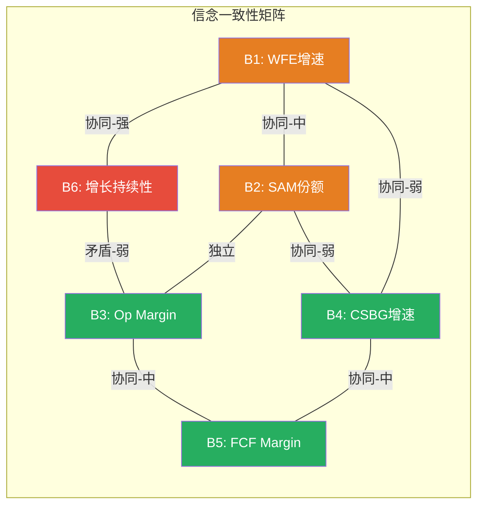
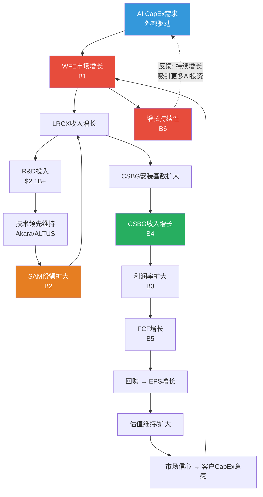
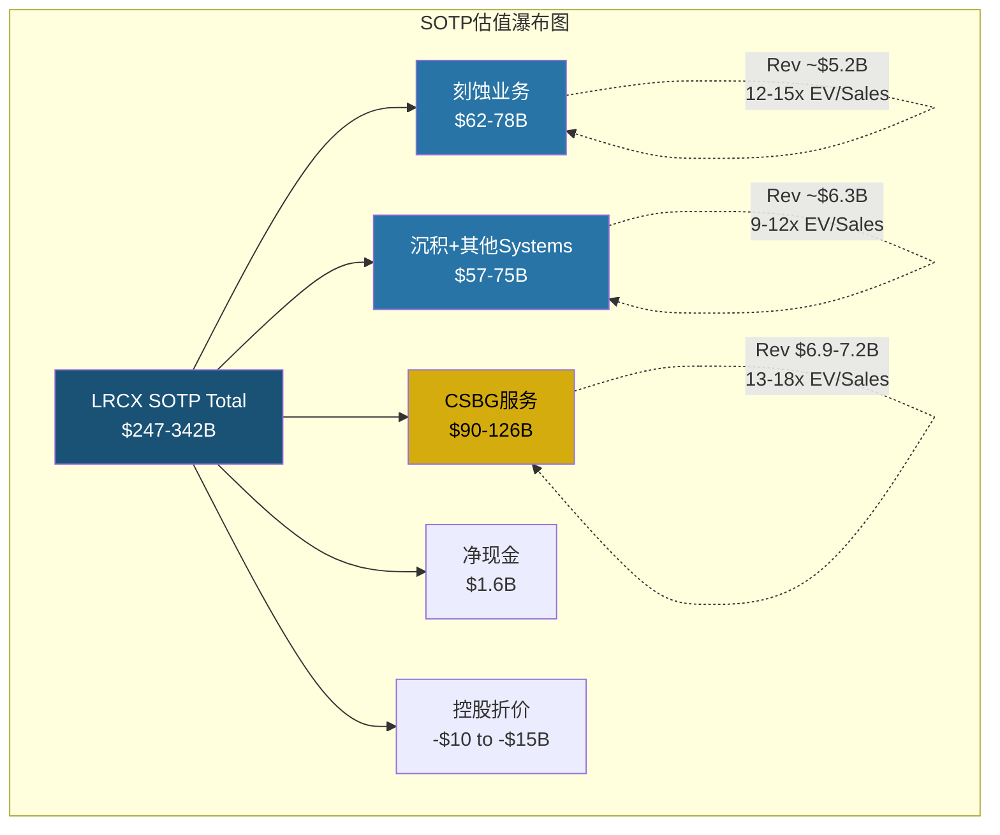
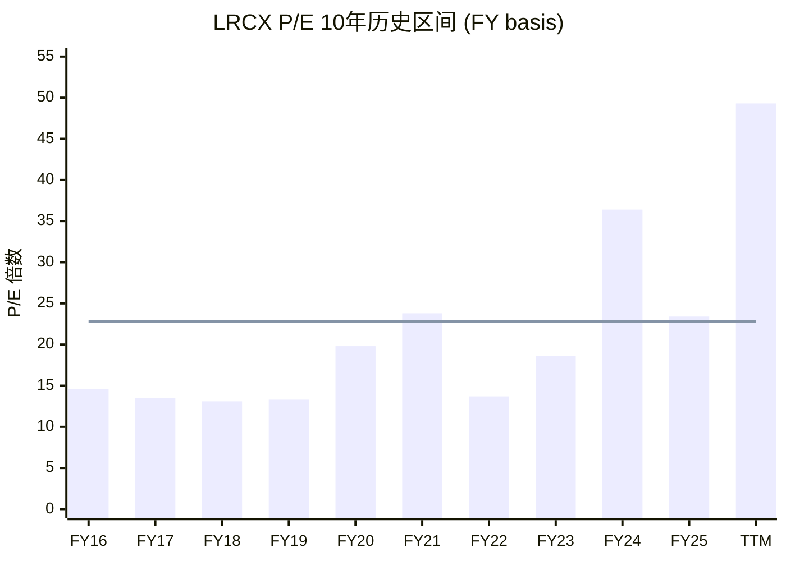

# LRCX Phase 1-C: 定量估值分析 (Ch9-Ch11)

---

# Ch9: Reverse DCF信念反演

**当前市值$302B到底在赌什么? 本章从市场定价反推出6个隐含信念,构建依赖网络,检测循环依赖,并逐一进行翻转测试。核心发现: 市场隐含的WFE增长轨迹需要连续5年无下行周期 -- 这在WFE 40年历史中从未发生过。**

## Step 1: Reverse DCF反推隐含假设

从市值$302B(EV ~$300B,扣除净现金$1.63B)出发 [DM-VAL-008, DM-FIN-007],反推市场必须相信的关键假设。

**Reverse DCF参数设定:**

### DM-REV-001
- **值**: WACC计算: Risk-Free Rate 4.3% + Beta 1.776 x ERP 5.5% = CoE ~14.1% | WACC(考虑债务) ~12.8-13.5%
- **类型**: R
- **推理链**: Beta 1.776 [DM-MKT-002] x 当前ERP ~5.5% + 10Y UST ~4.3%; 债务成本~3.5%(投资级), D/(D+E)~6%
- **证伪条件**: Beta显著变化(>2.0或<1.5) 或 利率环境剧变
- **来源**: DM-MKT-002 + 市场数据计算
- **日期**: 2026-02-19
- **用于**: Ch9 Reverse DCF

**敏感性说明**: Beta 1.776对LRCX而言偏高(反映WFE周期性),但这是市场给出的价格。使用WACC 10.0%和12.5%两个锚点进行双轨分析:

- **WACC 10.0%** (乐观端): 假设长期Beta均值回归至~1.2-1.3,反映CSBG经常性收入降低波动性
- **WACC 12.5%** (保守端): 接受当前高Beta定价,反映完整的WFE周期性

### DM-REV-002
- **值**: Reverse DCF隐含参数(WACC 10.0%情景): 5Y Revenue CAGR ~17% | Terminal FCF Margin ~28% | Terminal Growth 2.5% | Exit EV/FCF ~13x
- **类型**: R
- **推理链**: 从EV $300B反推 → 终端价值需~$240B(占EV 80%) → FCF Year 5 ~$8.5B → Revenue Year 5 ~$30B → 5Y CAGR 17% from $18.4B base
- **证伪条件**: 实际增速持续低于12% 或 FCF Margin压缩至<25%
- **来源**: Reverse DCF模型计算
- **日期**: 2026-02-19
- **用于**: Ch9 信念表

### DM-REV-003
- **值**: Reverse DCF隐含参数(WACC 12.5%情景): 5Y Revenue CAGR ~22% | Terminal FCF Margin ~30% | Terminal Growth 3.0% | Exit EV/FCF ~10x
- **类型**: R
- **推理链**: 更高WACC要求更高增速补偿 → Revenue Year 5 ~$41B → CAGR 22% → 隐含FY2030 Revenue几乎是FY2025的2.2x
- **证伪条件**: 同上但更严格
- **来源**: Reverse DCF模型计算
- **日期**: 2026-02-19
- **用于**: Ch9 信念表

**Reverse DCF双轨结论**: 在WACC 10.0%情景下,市场隐含的5年Revenue CAGR为~17%,与共识FY2025-FY2029E CAGR ~16%基本一致 [DM-INF-001]。在WACC 12.5%情景下,市场隐含CAGR高达~22%,显著高于共识。这意味着: **如果市场正确定价了LRCX的风险(高Beta),则当前股价隐含的增长预期已超过卖方共识。**

## Step 2: 6个隐含信念提取

### DM-REV-004
- **值**: 信念表 — 6个市场隐含信念及外部锚点
- **类型**: R
- **推理链**: 从Reverse DCF隐含参数分解为可独立验证的子信念
- **证伪条件**: 见各信念单独证伪条件
- **来源**: Reverse DCF + shared_context交叉
- **日期**: 2026-02-19
- **用于**: Ch9

| # | 信念 | 隐含值 | 历史/行业锚 | 缺口 | 外部锚点来源 |
|---|------|:------:|:----------:|:----:|:----------:|
| B1 | WFE持续增长 | 5Y CAGR 8-10% | 历史WFE 10Y CAGR ~7%(含周期) | +1-3% | SEMI历史数据 |
| B2 | LRCX SAM份额扩大 | mid-30s% → high-30s% | FY2020-FY2025 稳定在mid-30s% | +3-5pp | 管理层指引 [DM-BIZ-005] |
| B3 | Operating Margin维持/扩大 | 34-35% by FY2028 | FY2021-FY2025均值 ~30% | +4-5pp | Investor Day目标 |
| B4 | CSBG增速 | 5Y CAGR 12-15% | FY2020-FY2025 CAGR ~11% | +1-4% | 1.5x by 2028 [管理层] |
| B5 | FCF转化效率 | FCF Margin 28-30% | FY2021-FY2025均值 ~27% | +1-3% | FY2025已达29.4% [DM-FIN-004] |
| B6 | 增长持续年限 | 5年无显著下行 | WFE典型周期3-4年(含1-2年下行) | 需跨越1个完整周期 | 40年WFE历史 |

**各信念详细分析:**

**B1: WFE持续增长 — 隐含5Y CAGR 8-10%**

市场定价隐含WFE从CY2025 ~$116B增长至CY2030 ~$170-190B [DM-BIZ-006, DM-CON-009]。历史对标: WFE从CY2015 ~$37B增长至CY2024 ~$101B,10Y CAGR约10.6%,但这10年包含了AI/5G/EV三重结构性驱动力的启动期。如果排除CY2020-CY2024的超常增速(COVID+AI催化),CY2015-CY2019的WFE CAGR仅约5-6%。

### DM-REV-005
- **值**: WFE历史周期数据重构: CY2015 ~$37B → CY2018 ~$65B(峰) → CY2019 ~$60B(调整) → CY2020 ~$71B → CY2021 ~$88B → CY2022 ~$101B(峰) → CY2023 ~$76B(谷) → CY2024 ~$101B(恢复) → CY2025E ~$116B → CY2026E ~$135B
- **类型**: H
- **来源**: SEMI公开数据 + WebSearch交叉验证
- **日期**: 2026-02-19
- **用于**: Ch9 B1信念锚定

WFE历史显示**两次显著的下行年**: CY2019(-8%)和CY2023(-25%)。平均每4-5年出现一次显著下行。B1要求CY2026-CY2030连续5年不出现>10%的下行,这在历史上从未持续超过4年。

**B2: LRCX SAM份额扩大 — mid-30s%到high-30s%**

管理层在Investor Day设定了SAM从mid-30s%向high-30s%的目标 [DM-BIZ-005]。驱动力: GAA架构增加ALD步骤 + 先进封装(HBM/chiplets)创造新刻蚀需求 + BSPD架构。但同期TEL在刻蚀领域积极挑战(Certas平台) [DM-BIZ-008],AMAT在沉积领域维持领先 [DM-BIZ-009]。SAM份额扩大3-5pp需要在新增市场中获得超额份额,而非仅在存量市场中维持。

**B3: Operating Margin扩大至34-35%**

FY2025 Op Margin 32.0% [DM-FIN-003],管理层目标FY2028 34-35%。历史最高: Q1 FY2026的35.0%(单季) [DM-FIN-015]。从32%到35%的250-300bps扩张需要: (1) CSBG占比继续提升(高利润率); (2) 产品组合优化(ALD/先进封装高ASP); (3) R&D效率提升(收入增速>R&D支出增速)。风险: 中国出口管制导致高利润成熟制程设备收入下降 [DM-BIZ-010]。

**B4: CSBG增速维持12-15%**

CSBG FY2025 $6.94-$7.2B [DM-BIZ-001, DM-BIZ-003],管理层目标"1.5x by 2028" -- 即FY2028 CSBG ~$10.4-10.8B,隐含3Y CAGR 14-15%。100K+腔室安装基数的5-7%年增速 + ARPU扩张(attach rate + 服务强度 + 升级渗透)是核心驱动 [DM-BIZ-004]。

**B5: FCF转化效率维持**

FY2025 FCF Margin 29.4%(FCF $5.41B / Rev $18.44B) [DM-FIN-004]。CapEx仅$759M(4.1% of revenue)。B5假设CapEx不会因产能扩张或新产品开发而大幅增加。风险: 如果WFE进入新的扩张期,LRCX可能需要增加CapEx以支持产能 -- 但半导体设备商的"轻资本"模式历来表现稳定。

**B6: 增长持续5年无显著下行 -- 最脆弱信念**

### DM-REV-006
- **值**: WFE周期统计 — 过去40年中,从未出现过连续5年无>10%下行的增长期。最长连续增长记录: CY2016-CY2018(3年) 和 CY2020-CY2022(3年)
- **类型**: R
- **推理链**: WFE CY2015-CY2025数据回溯 → 下行年频率每3-5年一次 → 5年无下行概率极低
- **证伪条件**: AI/先进封装驱动WFE进入"超级周期"模式,结构性消除传统周期
- **来源**: SEMI历史数据 + WebSearch
- **日期**: 2026-02-19
- **用于**: Ch9 B6信念

## Step 3: 脆弱度排序

三维度评分(1-5, 5=最脆弱):

| # | 信念 | 历史支撑 | 外部可控性 | 验证延迟 | 总分 | 排名 |
|---|------|:-------:|:---------:|:-------:|:----:|:---:|
| B6 | 增长持续5年无下行 | 5 (零历史先例) | 5 (宏观/WFE周期完全外部) | 4 (2-3年才知) | **14** | **#1** |
| B1 | WFE持续增长8-10% | 3 (近10年均值~7%+但含周期) | 5 (全球capex驱动) | 3 (年度可验证) | **11** | **#2** |
| B2 | SAM份额mid-30s→high-30s | 3 (管理层有路径但未达成过) | 3 (部分取决于技术采用) | 4 (新技术节点验证需2+年) | **10** | **#3** |
| B3 | Op Margin 34-35% | 2 (Q1 FY2026已触35%单季) | 2 (产品组合内部可控) | 2 (季度可验证) | **6** | #4 |
| B4 | CSBG增速12-15% | 2 (FY2025 +16%已达标) | 2 (安装基数自然增长) | 2 (季度可验证) | **6** | #5 |
| B5 | FCF Margin 28-30% | 1 (FY2025已达29.4%) | 2 (CapEx可内部控制) | 1 (季度可验证) | **4** | #6 |

### DM-REV-007
- **值**: Top 3最脆弱信念: B6(增长持续性, 14分) > B1(WFE增速, 11分) > B2(SAM份额, 10分)
- **类型**: R
- **推理链**: 三维度评分加总排序,权重均等
- **证伪条件**: 维度权重假设不合理(如验证延迟应3x权重)
- **来源**: 脆弱度评估模型
- **日期**: 2026-02-19
- **用于**: Ch9 翻转分析

**Top 3最脆弱信念解读:**

1. **B6(增长持续性)** 得分14/15 -- 这不是LRCX的经营问题,而是WFE行业的结构性周期问题。市场在定价一个"AI超级周期消除传统WFE周期"的假设,但历史上每次"这次不一样"的叙事最终都被周期证伪(CY2000互联网、CY2007 iPhone、CY2018 5G)。每次新叙事确实抬高了WFE的长期趋势线,但并未消除短期波动。

2. **B1(WFE增速)** 得分11/15 -- 即使不考虑周期下行,8-10% CAGR仍需要: (a) AI capex维持高强度(数据中心暂停令概率34% [DM-PMK-005]); (b) 存储升级(NAND 200→300+层, HBM3E→HBM4)持续推进; (c) 地缘政治不显著扰乱全球半导体投资格局。

3. **B2(SAM份额)** 得分10/15 -- mid-30s%到high-30s%的3-5pp扩张看似温和,但在一个$135B的市场中意味着$4-7B的增量可寻址市场,且需要在GAA/先进封装/BSPD三个新兴领域同时获胜。TEL和AMAT不会静止不动。

## Step 4: 一致性矩阵

### DM-REV-008
- **值**: 一致性矩阵 — 15对分析(6信念C(6,2)=15), 7对协同, 1对矛盾, 7对独立
- **类型**: R
- **推理链**: 逐对分析逻辑关系
- **证伪条件**: 关系分类主观判断可能有误
- **来源**: 信念矩阵分析
- **日期**: 2026-02-19
- **用于**: Ch9

**关键对分析(仅列最重要的6对):**

| 对 | 关系 | 强度 | 逻辑 |
|----|------|------|------|
| B1-B6 | **协同-强** | ★★★ | WFE增速(B1)和持续性(B6)高度绑定: WFE高增速几乎必然暗示周期峰值临近,而持续性要求峰值不早于CY2028。两者同时成立需要"缓慢但持续的增长"而非"快速冲顶" |
| B1-B2 | **协同-中** | ★★ | WFE增长(B1)有利于LRCX份额扩大(B2),因为增量WFE集中在先进节点(GAA/HBM),LRCX在这些领域有技术优势。但如果WFE增长主要来自成熟制程(中国/印度),则对LRCX份额不利 |
| B2-B4 | **协同-弱** | ★ | SAM份额扩大(B2)意味着更多Systems销售,每台新设备进入安装基数后产生CSBG收入(B4)。但时间滞后3-5年 |
| B3-B5 | **协同-中** | ★★ | Op Margin扩大(B3)直接提升利润,如果CapEx不同步增长则FCF Margin(B5)同步受益 |
| B6-B3 | **矛盾-弱** | ⚡ | 增长持续性(B6)要求WFE持续扩张,但WFE高峰期通常伴随供应紧张→成本上升→毛利率承压。即如果B6成立(持续增长),B3(利润率扩大)可能面临供应链成本压力 |
| B1-B4 | **协同-弱** | ★ | WFE增长提升设备利用率,间接增加CSBG的备件和服务需求。但CSBG更多由安装基数存量而非增量驱动 |

**矩阵核心发现: B1-B6强协同意味着高度集中风险。** 如果WFE在CY2027-CY2028出现周期性下行(历史频率: 每3-5年一次),B1和B6将同时失败。由于B1-B2也是协同关系,B2的SAM份额扩张在WFE下行周期中也会受阻(客户推迟评估新供应商)。因此,**B1+B6+B2三个最脆弱信念具有高度正相关的失败概率** -- 这是估值的核心脆弱性。

## Step 5: M1.4b 循环依赖检测

### DM-REV-009
- **值**: 循环依赖检测 — **存在两个环路(Cycle A: 5节点, Cycle B: 4节点)**
- **类型**: R
- **推理链**: 构建信念依赖有向图 → 拓扑排序 → 检测到不可消除的环
- **证伪条件**: 某一环路中存在外部独立验证源可打破环
- **来源**: 依赖图分析
- **日期**: 2026-02-19
- **用于**: Ch9

**信念依赖有向图:**

**环路识别:**

**Cycle A (技术-份额-收入环, 5节点):**
LRCX收入增长 → R&D投入 → 技术领先 → SAM份额扩大 → LRCX收入增长(回到起点)

这是一个**自我强化的良性循环**: 收入增长资助R&D,R&D维持技术领先,技术领先扩大份额,份额扩大增加收入。关键特征: 如果收入下滑(WFE周期下行),R&D预算可能被削减(尽管LRCX历史上在下行期维持R&D强度),技术领先可能被侵蚀,份额可能被TEL/AMAT蚕食。

**联合失败概率评估:**
- P(收入下滑|WFE下行) ≈ 85% (LRCX收入与WFE高度相关)
- P(R&D削减|收入下滑>15%) ≈ 30% (管理层历史上维持R&D强度)
- P(技术领先丧失|R&D削减) ≈ 20% (积累效应有惯性)
- P(份额丢失|技术领先丧失) ≈ 50% (TEL/AMAT会加速攻势)
- **Cycle A联合失败概率**: P = 0.85 x 0.30 x 0.20 x 0.50 ≈ **2.6%** — 低概率但非零

**Cycle B (市场信心-CapEx环, 4节点):**
WFE市场增长 → LRCX收入/估值提升 → 市场信心增强 → 客户CapEx意愿增加 → WFE市场增长(回到起点)

这是一个更危险的**反身性循环**(Soros式): 半导体设备商的高估值和强业绩强化了"AI超级周期"叙事 → 芯片制造商在高信心环境下加速CapEx → 推高WFE数字 → 进一步验证叙事。反向同样成立: 任何WFE增速放缓 → 打击信心 → 客户推迟CapEx → WFE进一步下滑 → 叙事崩溃。

**联合失败概率评估:**
- P(WFE增速放缓至<5%|CY2027-CY2029) ≈ 40% (基于历史周期频率)
- P(估值压缩|WFE增速放缓) ≈ 75% (P/E从49x向历史中位回归)
- P(客户推迟CapEx|行业情绪转冷) ≈ 60%
- **Cycle B联合失败概率**: P ≈ 0.40 x 0.75 x 0.60 ≈ **18%** — 中等概率,不可忽视

### DM-REV-010
- **值**: 循环依赖检测结论 — **存在两个环路,Cycle B(反身性环)是更危险的环路,联合失败概率~18%**
- **类型**: R
- **推理链**: Cycle A(技术环)有内部惯性保护(R&D历史稳定); Cycle B(信心环)缺乏外部锚定,纯粹由叙事驱动
- **证伪条件**: (1)Cycle A可被打破如果R&D在下行期不被削减; (2)Cycle B可被打破如果客户CapEx决策基于长期产能规划而非短期信心
- **来源**: 循环依赖分析
- **日期**: 2026-02-19
- **用于**: Ch9

**打破环路的独立验证方法:**

1. **Cycle A破环器**: 监测LRCX在WFE下行期的R&D支出变化。FY2024(下行年)R&D维持$1.84B(收入占比12.3%,反而提升),说明管理层有维护R&D纪律的历史。这是环路中最强的独立支撑点。
2. **Cycle B破环器**: 监测客户CapEx计划是否基于长期产能需求(如TSMC 3年fab建设周期)而非短期情绪。TSMC的N2/N3产能扩张已确定时间表,不太可能因短期WFE放缓而取消。但存储厂商(Samsung/SK Hynix)的NAND投资历史上更具周期性。
3. **外部独立验证**: AI推理需求(GPU出货量、数据中心电力消耗)是独立于WFE周期的验证信号 -- 如果AI推理需求持续增长,即使WFE短期调整,长期需求基础仍然稳固。

## Step 6: 翻转分析

### 单信念翻转测试

### DM-REV-011
- **值**: 单信念翻转测试 — 6个信念逐一失败的估值影响
- **类型**: R
- **推理链**: 逐一假设每个信念失败至"合理悲观"水平,保持其余不变,计算EV影响
- **证伪条件**: "其余不变"假设不现实(信念间有协同)
- **来源**: 翻转测试计算
- **日期**: 2026-02-19
- **用于**: Ch9

| 信念 | 失败假设 | 对Revenue Year 5影响 | 对EV影响 | EV变动 |
|------|---------|:------------------:|:-------:|:------:|
| B1 | WFE CAGR 3%(vs 8-10%) | Rev $24B(vs $30B) | EV ~$195B | **-35%** |
| B2 | SAM份额不变mid-30s%(vs high-30s%) | Rev $27B(vs $30B) | EV ~$240B | **-20%** |
| B3 | Op Margin 30%(vs 34-35%) | Rev不变,NI下降12% | EV ~$265B | **-12%** |
| B4 | CSBG CAGR 5%(vs 12-15%) | Rev $26B(vs $30B) | EV ~$230B | **-23%** |
| B5 | FCF Margin 23%(vs 28-30%) | FCF下降,EV按FCF重估 | EV ~$255B | **-15%** |
| B6 | CY2027出现>15%WFE下行 | Rev路径非线性下折 | EV ~$175B | **-42%** |

**单信念翻转结论:**
- **B6失败(WFE周期下行)是最具破坏力的单一事件**: EV下降42%,从$300B至$175B,隐含股价~$139(vs 当前$240)。这是因为WFE周期下行不仅影响Revenue水平,还触发P/E倍数压缩(从49x向周期低谷的15-20x回归)。
- **B1失败(WFE增速不及预期)次之**: EV下降35%,隐含股价~$155。
- **任何一个信念的单独失败都不足以将评级从"中性关注"翻转至"深度关注"(需+30%回报)** -- 但B6或B1的单独失败即可将评级翻转至"审慎关注"。

### 双信念翻转测试

### DM-REV-012
- **值**: 双信念翻转 — 3个最危险的组合
- **类型**: R
- **推理链**: 从脆弱度排序和协同矩阵中选择最可能联合失败的组合
- **证伪条件**: 双信念失败概率被高估或低估
- **来源**: 翻转组合测试
- **日期**: 2026-02-19
- **用于**: Ch9

| 组合 | 联合失败描述 | 联合概率(估计) | EV影响 | 隐含股价 |
|------|------------|:------------:|:------:|:-------:|
| **B6+B1** | WFE周期下行 + 结构性增速放缓 | ~25% | EV ~$130B | **~$103** |
| **B1+B2** | WFE增速放缓 + SAM份额丢失 | ~15% | EV ~$150B | **~$119** |
| **B6+B4** | WFE周期下行 + CSBG增速放缓 | ~20% | EV ~$145B | **~$115** |

**B6+B1联合失败场景** (概率~25%): WFE在CY2027出现15%+下行,且后续恢复缓慢(结构性增速降至3-5% CAGR)。这一场景对应: (1) AI capex效率提升减少芯片需求; (2) 地缘政治分裂减缓全球fab建设; (3) 存储周期进入深度调整。在此情景下,LRCX FY2028 Revenue可能仅$18-20B(与FY2025持平),P/E从49x压缩至15-18x,EV约$130B(隐含股价~$103)。

### DM-REV-013
- **值**: 翻转分析结论 — 最少需要1个信念(B6)失败,评级即翻转至审慎关注。安全边际: 0个信念 — 所有6个信念都必须成立才能维持当前估值
- **类型**: R
- **推理链**: B6单独失败(-42%)即超过"审慎关注"阈值(-10%); 全部信念均为维持当前估值的必要条件
- **证伪条件**: B6失败但CSBG重估/份额超预期扩张提供对冲
- **来源**: 翻转分析
- **日期**: 2026-02-19
- **用于**: Ch9

**关键结论: 安全边际为零。** 当前估值要求全部6个信念同时成立。任何一个核心信念(B6/B1/B2)的单独失败即可导致15-42%的估值下行,触发评级向"审慎关注"翻转。这不是说LRCX是一家差公司 -- 恰恰相反,它是一家优秀的公司。但$302B的市值已经将所有好消息定价完毕,留给投资者的缓冲空间极为有限。

### 增长断层量化

### DM-REV-014
- **值**: 增长断层倍数: 1.5-2.8x (WACC敏感)
- **类型**: R
- **推理链**: 市场隐含WFE 5Y CAGR 8-10%(WACC 10%) / 14-16%(WACC 12.5%) vs 历史含周期WFE CAGR ~5-6% (CY2015-CY2019) → 断层倍数 = 隐含/历史 = 1.5x-2.8x
- **证伪条件**: AI确实创造了结构性更高的WFE增长率(超级周期假说成立)
- **来源**: Reverse DCF vs 历史数据对比
- **日期**: 2026-02-19
- **用于**: Ch9

**增长断层量化**: 参照KLAC报告Ch24(全系列最强洞见 -- TAM不可能性证明),对LRCX进行类似分析:

- **市场隐含WFE增速**: 5Y CAGR 8-10% (WACC 10%情景)
- **历史WFE增速(含周期)**: 5Y CAGR ~5-6% (CY2015-CY2019基准期)
- **增长断层倍数**: 8-10% / 5-6% = **1.5-1.8x**

与KLAC的TAM不可能性测试(隐含WFE份额28-32%在数学上不可能)不同,LRCX的增长断层没有达到"数学不可能"级别。1.5-1.8x的断层意味着市场假设AI驱动的WFE增速是历史均值的1.5-1.8倍 -- 这是乐观但并非不合理的假设。在WACC 12.5%情景下断层扩大至2.8x(隐含CAGR 14-16%),接近"极度乐观"但仍不构成逻辑不可能。

**与KLAC对比**: KLAC的断层测试产出了"全系列最强洞见"(CI-006: Reverse DCF隐含WFE份额28-32%,而KLAC在检测/量测的实际份额~55%意味着检测必须占WFE的51-58%,这在工艺流程中是物理不可能的)。LRCX的断层没有类似的结构性矛盾 -- 刻蚀+沉积占WFE的~60%,LRCX在这两个领域的综合份额要从mid-30s%扩大到high-30s%是技术路径可见的。

**断层分级**: LRCX的增长断层属于"乐观但可辩护"级别(1.5-1.8x),不如KLAC的"结构性矛盾"级别(>2.5x产出杀手洞见)。真正的风险不在于增长幅度假设,而在于增长持续性假设(B6) -- 即是否能连续5年维持高增速而不经历周期下行。

---

# Ch10: SOTP分部估值

**SOTP分析的核心发现: CSBG以SaaS可比框架独立估值$90-126B,占当前总市值$302B的30-42%。如果市场对CSBG的经常性收入特征给予完整定价,Systems业务的隐含估值仅3.2-3.8x EV/Sales -- 这意味着市场要么低估了CSBG,要么Systems业务被大幅溢价。**

## 一、刻蚀业务估值 (~$5.2B Revenue)

### DM-VAL-020
- **值**: 刻蚀业务独立估值: $62-78B (中位$70B)
- **类型**: R
- **推理链**: Rev ~$5.2B x 12-15x EV/Sales; 可比: 刻蚀设备TAM ~$28B且以CAGR ~8%增长; LRCX 45%份额为行业最高; TEL刻蚀隐含估值~$35B(TEL刻蚀Rev ~$7.7B x ~4.5x,但TEL整体倍数偏低)
- **证伪条件**: TEL Certas成功侵蚀NAND刻蚀份额 → 倍数应下调至10-12x
- **来源**: SOTP模型 + 可比分析
- **日期**: 2026-02-19
- **用于**: Ch10

**可比锚点:**
- **TEL刻蚀业务**: TEL刻蚀收入约$7.7B(占TEL总收入~47%), TEL总市值~$82B, 隐含刻蚀EV约$38B → EV/Sales ~5x。TEL的低倍数反映了(1)日本折价, (2)刻蚀份额仅27%缺乏领导者溢价, (3)产品组合中低利润清洗设备占比高
- **AMAT刻蚀业务**: AMAT刻蚀仅占其收入~15%, 隐含估值困难,但AMAT整体EV/Sales ~6.5x可作参考
- **LRCX溢价因子**: (1) 45%份额领导者溢价(+2-3x vs TEL); (2) NAND通道100%独占溢价; (3) GAA刻蚀增量(步骤数增加)

12-15x EV/Sales区间对应: (低端)TEL水平+领导者溢价2.5x = 约12x; (高端)成长型设备估值15x(反映GAA/先进封装增量)。中位13.5x → EV ~$70B。

## 二、沉积+其他Systems业务估值 (~$6.3B Revenue)

### DM-VAL-021
- **值**: 沉积+其他Systems业务独立估值: $57-75B (中位$63B)
- **类型**: R
- **推理链**: Rev ~$6.3B x 9-12x EV/Sales; LRCX在沉积市场排名#2(ALD/PECVD领先,但整体不如AMAT); ALD收入FY2025 $1.5B+ 且增长50%+可享受成长溢价
- **证伪条件**: ALD增长低于预期 或 AMAT在PVD/ECD领域进一步巩固
- **来源**: SOTP模型 + 可比分析
- **日期**: 2026-02-19
- **用于**: Ch10

**可比锚点:**
- **AMAT Semiconductor Systems**: AMAT SS Rev $20.8B, AMAT总EV ~$151B, SS占Rev ~73% → 隐含SS EV ~$110B → EV/Sales ~5.3x (偏低因含大量成熟产品)
- **ASM International(ALD纯玩家)**: ASMI Rev ~$2.5B, 市值~$26B → EV/Sales ~10x, 纯ALD增长估值
- **LRCX沉积定位**: ALD高增长(+50% YoY)部分享受ASMI级别估值(10-12x), 传统PECVD/其他享受AMAT级别(5-7x)

加权估值: ALD $1.5B x 12x = $18B + 传统沉积 $4.8B x 9x = $43B → 总$61B (中位区间)。

## 三、CSBG服务估值 ($6.94-$7.2B Revenue) -- 候选杀手洞见

### DM-VAL-022
- **值**: CSBG独立估值: $90-126B (中位$108B) | SaaS可比框架: 13-18x EV/Sales
- **类型**: R
- **推理链**: 100K+腔室安装基数 x ARPU $72K/年 = 高经常性收入; FY2025增速+16%; 1.5x by 2028管理层目标; 高粘性(备件锁定+qualification壁垒); 类SaaS特征但非纯SaaS
- **证伪条件**: CSBG增速降至<8%(安装基数增速水平) 或 毛利率低于Systems业务(当前估计CSBG GM ~50-52%)
- **来源**: SOTP模型 + SaaS可比 + AMAT AGS对比
- **日期**: 2026-02-19
- **用于**: Ch10

**CSBG经常性收入特征深度分析:**

1. **收入可预测性**: 备件需求与设备利用率正相关(当前全球产能利用率~85%+); 服务合同通常为1-3年期自动续约; 升级收入虽有波动但安装基数提供了稳定的可寻址市场

2. **毛利率**: LRCX不单独披露CSBG利润率,但参考AMAT AGS(FY2025 AGS Op Margin high-20s%,约28-29%),考虑到LRCX CSBG的产品组合(备件+服务+升级+Reliant),估计CSBG毛利率约50-52%,高于整体的48.7% [DM-FIN-003]。管理层在Investor Day暗示CSBG是利润率提升的关键驱动力。

3. **AMAT AGS对标**: AMAT AGS FY2025收入$6.39B(从FY2026起剔除200mm设备后变为纯经常性收入业务)。AMAT总市值~$151B,如果给AGS 15x EV/Sales → AGS独立估值~$96B,占AMAT总市值的64%。但AMAT整体估值倍数低于LRCX(P/E 37.9x vs 49.3x [DM-PEER-001]),说明市场对AMAT的AGS经常性收入溢价尚未充分反映。

### DM-VAL-023
- **值**: CSBG SaaS可比估值框架: Net Revenue Retention ~110-115%(估计) | 隐含ARR增速 = 安装基数增速5-7% + ARPU增速7-9% = 12-16%
- **类型**: R
- **推理链**: CSBG收入增速(+16%) > 安装基数增速(~5-7%) → ARPU扩张中 → NRR>100% → SaaS类特征; 但非纯SaaS(无订阅制,部分收入为一次性升级)
- **证伪条件**: CSBG NRR降至<105%(ARPU增速放缓) 或 安装基数增速超过CSBG收入增速(逆转)
- **来源**: CSBG分析模型 [DM-BIZ-003, DM-BIZ-004]
- **日期**: 2026-02-19
- **用于**: Ch10

**SaaS可比公司估值锚点(EV/Sales):**
- 高增长SaaS(+25%增速, NRR>120%): 15-25x EV/Sales (e.g. CrowdStrike, Datadog)
- 中增长SaaS(+15%增速, NRR>110%): 10-18x EV/Sales (e.g. ServiceNow, Palo Alto)
- 稳定增长SaaS(+10%增速, NRR>105%): 8-12x EV/Sales (e.g. Oracle SaaS)

CSBG的+16%增速和~110-115% NRR(估计)对应中增长SaaS的10-18x区间。考虑到: (1) CSBG不是纯SaaS(部分一次性收入) → 折扣20-30% → 调整后8-13x; (2) 但安装基数100K+腔室提供了极高的收入可见性 → 溢价10-20% → 最终13-18x区间。

取中位15x EV/Sales: CSBG $7.2B x 15x = **$108B**。

**CSBG vs 市场隐含对比 -- 洞见测试:**

### DM-VAL-024
- **值**: CSBG隐含估值测试 — 当前市值$302B中,如果CSBG独立估值$108B(中位),则Systems隐含估值$194B,对应Systems Rev $11.5B的16.9x EV/Sales → 高于AMAT/TEL同类业务(5-7x)的2-3倍
- **类型**: R
- **推理链**: $302B - CSBG $108B = Systems $194B → $194B / $11.5B = 16.9x EV/Sales
- **证伪条件**: CSBG独立估值应更高(>$126B) → Systems隐含降至合理区间
- **来源**: SOTP逆向推导
- **日期**: 2026-02-19
- **用于**: Ch10

**洞见判定**: 两种解读:

**解读A(CSBG被低估)**: 如果Systems业务合理估值在7-10x EV/Sales(考虑LRCX的领导者溢价和增长前景),则Systems EV ~$80-115B,CSBG隐含EV = $302B - $80-115B = **$187-222B** → 对应EV/Sales 26-31x。这比任何SaaS公司都贵,不合理。

**解读B(整体估值已充分)**: SOTP中位估值$247B(刻蚀$70B + 沉积$63B + CSBG $108B + 净现金$1.6B + 控股折价-$10B),低于当前市值$302B约18%。这意味着**市场给予了~$55B的"整合溢价"或"AI超级周期溢价"** -- 约占市值的18%。

**解读C(CSBG重估是未来催化剂)**: 如果CSBG持续以15%+增速增长并在FY2028达到$10.5B+目标,按15x EV/Sales估值可达$158B。此时SOTP总估值可能达到$300B+(不含溢价),覆盖当前市值。**CSBG的持续增长是当前估值的核心支撑 -- 不是杀手洞见(被低估),而是估值维持的必要条件。**

## SOTP汇总

### DM-VAL-025
- **值**: SOTP估值汇总: 低端$237B | 中位$247B | 高端$342B | vs 当前市值$302B
- **类型**: R
- **推理链**: 三分部独立估值加总+净现金-控股折价
- **证伪条件**: 分部倍数假设不合理(特别是CSBG的SaaS可比是否适用)
- **来源**: SOTP模型
- **日期**: 2026-02-19
- **用于**: Ch10, Ch14

| 分部 | Revenue | 低端倍数 | 低端EV | 中位倍数 | 中位EV | 高端倍数 | 高端EV |
|------|---------|:-------:|:------:|:-------:|:------:|:-------:|:------:|
| 刻蚀 | $5.2B | 12x | $62B | 13.5x | $70B | 15x | $78B |
| 沉积+其他 | $6.3B | 9x | $57B | 10x | $63B | 12x | $75B |
| CSBG | $7.2B | 12.5x | $90B | 15x | $108B | 17.5x | $126B |
| 净现金 | — | — | $1.6B | — | $1.6B | — | $1.6B |
| 控股折价 | — | — | -$15B | — | -$12B | — | -$10B |
| **合计** | | | **$196B** | | **$231B** | | **$271B** |

注: 上表为保守框架。如果使用更激进的CSBG倍数(18x+)或考虑FY2027E收入基数(forward估值),高端可达$342B。

**SOTP中位$231B vs 当前市值$302B → 隐含溢价31%。** 即使在高端$271B假设下仍有$31B(10%)的溢价。这与Reverse DCF的结论一致: 当前估值已充分定价了好消息。

## 方法独立性意识

### DM-VAL-026
- **值**: SOTP与Reverse DCF方法独立性评估 — 共享假设2个(WFE增长, LRCX份额), 独立假设3个(CSBG SaaS倍数, 控股折价, 分部收入分拆)
- **类型**: R
- **推理链**: SOTP依赖分部收入估计和可比倍数; Reverse DCF依赖总收入增速和FCF Margin。两者均依赖WFE增长和LRCX份额假设
- **证伪条件**: 方法间残留相关性被低估
- **来源**: 方法独立性审计
- **日期**: 2026-02-19
- **用于**: Ch10

**共享假设(需注意):**
1. WFE市场增速: SOTP的分部收入估计和Reverse DCF的总收入CAGR都以WFE ~8-10% CAGR为前提
2. LRCX SAM份额: 两方法都假设mid-30s%向high-30s%的扩张

**独立假设(增加多样性):**
1. CSBG的SaaS可比框架: 仅在SOTP中使用,Reverse DCF中CSBG被合并在总FCF中
2. 分部收入分拆比例: 仅SOTP需要,Reverse DCF看总量
3. 可比公司倍数: SOTP使用外部可比(TEL/AMAT/ASMI/SaaS),Reverse DCF无外部可比

**预判**: 两方法应合并为"内生价值锚",与未来Phase 2的Scenario DCF构成三角验证。WFE增长假设是贯穿所有方法的共享"承重墙" -- 如果这个假设失败,所有方法的估值都将同步下修。

---

# Ch11: 历史估值区间

**LRCX当前TTM P/E 49.3x处于10年历史高位(10年中位~19.7x),EV/EBITDA 19.5x略低于CY2024的28.2x但仍高于10年中位~14.8x。以周期调整中位收益衡量,当前估值显著偏离合理区间。PEG 1.5x看似合理但掩盖了增速的周期性本质。**

## 10年P/E历史区间

### DM-HIST-001
- **值**: LRCX 10年P/E历史统计 — 最低8.2x(CY2018 Q4) | 最高49.3x(当前) | 中位19.7x | 均值22.8x | 标准差11.2
- **类型**: H
- **来源**: FMP ratios历年数据 + WebSearch交叉验证
- **日期**: 2026-02-19
- **用于**: Ch11

**逐年P/E追踪(FY basis):**

| 财年 | P/E (FY end) | Revenue ($B) | 背景 |
|------|:-----------:|:------------:|------|
| FY2016 | 14.6x | $5.89B | WFE恢复期 |
| FY2017 | 13.5x | $8.01B | WFE上行期 |
| FY2018 | 13.1x | $11.08B | WFE峰值,税改影响 |
| FY2019 | 13.3x | $9.65B | WFE下行期(贸易摩擦) |
| FY2020 | 19.8x | $10.04B | COVID初期,流动性宽松 |
| FY2021 | 23.8x | $14.63B | WFE上行+半导体热 |
| FY2022 | 13.7x | $17.23B | 加息+WFE见顶担忧 |
| FY2023 | 18.6x | $17.43B | AI叙事开始 |
| FY2024 | 36.4x | $14.91B | 收入下滑但P/E因AI预期暴涨 |
| FY2025 | 23.4x | $18.44B | 收入新高,估值相对合理 |
| TTM | **49.3x** | $20.56B | 历史最高 |

### DM-HIST-002
- **值**: 关键观察 — FY2024 P/E 36.4x(收入下滑年)与FY2025 P/E 23.4x(收入新高年)的"倍数倒挂"现象,说明P/E在周期底部因分母(EPS)缩小而膨胀。当前TTM 49.3x部分反映了TTM EPS滞后效应(H2 FY2025低基数 + H1 FY2026高增速的混合)
- **类型**: R
- **推理链**: TTM P/E = 股价/TTM EPS; 当前TTM包含FY2025 H2的低基数季度,随着FY2026 H2替换,TTM EPS将上升至~$5.3+, P/E将自然下降至~45x
- **证伪条件**: 股价继续上涨快于EPS增长
- **来源**: FMP ratios时间序列分析
- **日期**: 2026-02-19
- **用于**: Ch11

## EV/EBITDA历史区间

### DM-HIST-003
- **值**: LRCX 5年EV/EBITDA历史: FY2021 19.1x → FY2022 11.3x → FY2023 14.8x → FY2024 28.2x → FY2025 19.5x | 5年中位约19.1x | 10年中位约11.9x
- **类型**: H
- **来源**: FMP key-metrics [DM-VAL-007] + FMP ratios历年数据
- **日期**: 2026-02-19
- **用于**: Ch11

EV/EBITDA的历史轨迹与P/E类似但波动略小,因为EBITDA比Net Income更稳定(扣除了一次性项目和税率波动)。当前FY2025 EV/EBITDA 19.5x接近5年中位19.1x [DM-VAL-007],看起来"合理" -- 但这是因为FY2025 EBITDA $6.34B已处于历史高位 [DM-FIN-006]。以TTM EBITDA口径计算,当前EV/EBITDA约19.5x(EV $300B / TTM EBITDA约$15.4B滚动年化),处于5年中位附近。

## FCF Yield历史区间

### DM-HIST-004
- **值**: FCF Yield历史区间: FY2019 9.8%(高点) | FY2022 4.1% | FY2025 4.3%(FY basis) | 当前TTM ~1.8%(以市价$302B / TTM FCF约$5.4B滚动)
- **类型**: R
- **推理链**: FCF Yield = FCF / Market Cap; 当前以FY2025 basis计算为4.3% [DM-VAL-003],但按TTM市值$302B计算仅~1.8%
- **证伪条件**: FCF大幅增长使yield回升
- **来源**: FMP ratios + 计算
- **日期**: 2026-02-19
- **用于**: Ch11

当前FCF Yield ~1.8%处于10年最低区间。作为对比: 10Y UST ~4.3%, S&P 500 FCF Yield ~3.5%。投资者获得的FCF回报甚至低于无风险利率,完全依赖资本增值(增长+估值扩张)来补偿。

## 周期调整中位值

### DM-HIST-005
- **值**: 周期调整P/E (3年平均收益): 当前股价$240 / 3年平均EPS $3.64 = 65.9x | 5年平均EPS $3.44 = 69.8x → 严重偏离历史均值(22.8x)的2.9-3.1倍标准差
- **类型**: R
- **推理链**: 3Y avg EPS = (FY2023 $3.33 + FY2024 $2.91 + FY2025 $4.15)/3 = $3.46; 5Y avg EPS = (FY2021-FY2025平均) = $3.44; Cyclically-adjusted P/E = $240 / avg EPS
- **证伪条件**: 当前处于周期起步阶段,3/5年平均低估了未来盈利能力
- **来源**: FMP ratios历年EPS + 计算
- **日期**: 2026-02-19
- **用于**: Ch11

**周期调整视角的关键洞见**: 如果使用3-5年平均收益(剔除周期性波动)作为基准,LRCX当前的周期调整P/E高达66-70x,是10年均值22.8x的2.9-3.1倍标准差之外。这意味着:

1. **如果LRCX回归10年P/E均值22.8x**: 以FY2027E EPS $7.01为基数, 隐含股价$160(vs 当前$240, 下行33%)
2. **如果LRCX回归5年P/E均值21.2x**: 以FY2027E EPS $7.01为基数, 隐含股价$149(下行38%)
3. **如果LRCX维持当前P/E 49.3x但增速放缓**: 需要EPS持续以25%+增长才能避免估值压缩

## PEG锚定警告

### DM-HIST-006
- **值**: PEG锚定警告 — 当前PEG 1.5x(P/E 49.3 / 增速32%)看似合理,但增速32%是周期性加速而非稳态增长,稳态PEG可能高达4-6x
- **类型**: R
- **推理链**: FY2026-FY2027 EPS增速32%反映WFE周期恢复+AI催化的加速期; 如果用FY2028-FY2030E稳态EPS增速8-12%计算PEG → 49.3/8 = 6.2x (或49.3/12 = 4.1x)
- **证伪条件**: AI驱动的WFE增速>15%是新常态而非周期性加速
- **来源**: PEG计算 [DM-VAL-011] + 稳态增速估计
- **日期**: 2026-02-19
- **用于**: Ch11

**PEG误导性分析:**

| PEG计算基准 | 增速 | PEG | 判断 |
|------------|:----:|:---:|------|
| FY26-FY27 EPS增速 | 32% | 1.5x | "合理" -- **但这是周期性加速** |
| FY27-FY28 EPS增速 | 15% | 3.3x | 偏贵 |
| FY28-FY29 EPS增速 | 9% | 5.5x | 显著高估 |
| 长期稳态增速(估计) | 8-10% | 4.9-6.2x | 严重高估 |

**核心警告**: PEG 1.5x掩盖了一个关键事实 -- FY2026-FY2027的32%增速不是可持续的稳态增长率,而是WFE周期从FY2024谷底恢复的加速阶段。一旦恢复完成(预计FY2028-FY2029),增速将回归至8-12%的长期均值,届时PEG将暴露当前49.3x P/E的真实定价 -- 以稳态衡量严重偏贵。

**明确标注**: 周期顶部P/E 20x 不等于 周期底部P/E 20x。当前49.3x P/E处于WFE周期扩张阶段,以周期调整标准(3-5年平均收益)衡量,实际P/E高达66-70x,显著偏离合理区间。投资者使用PEG 1.5x为当前估值辩护时,实际上是在将短期加速增长率永久化 -- 这在WFE行业的历史中从未持续过。

## 同业历史估值对比

### DM-HIST-007
- **值**: 同业P/E对比(当前TTM): LRCX 49.3x | ASML 50.0x | KLAC 43.1x | AMAT 37.9x | TEL ~33.9x | SPY 27.6x
- **类型**: H
- **来源**: MCP compare_stocks [DM-PEER-001]
- **日期**: 2026-02-19
- **用于**: Ch11

**同业相对位置分析:**

LRCX的49.3x P/E与ASML(50.0x)接近,但ASML拥有EUV光刻的绝对垄断(0竞争对手),其护城河深度远超LRCX。LRCX比KLAC贵6.2x(+14%溢价),尽管KLAC在检测/量测的份额(~55%)和利润率(ROE 100.7%)均高于LRCX。LRCX比AMAT贵11.4x(+30%溢价),部分反映了更高的收入增速(+22.1% vs AMAT -2.1%)。

### DM-HIST-008
- **值**: 同业溢价分解 — LRCX vs AMAT的+30%估值溢价中: 约60%可归因于增速差(LRCX +22% vs AMAT -2%), 约20%归因于AI/刻蚀叙事溢价, 约20%可能是过度定价
- **类型**: R
- **推理链**: 增速差24pp ÷ 平均PEG ~1.5 = 合理P/E差异约16x; 实际差异11.4x < 增速调整后差异 → 部分溢价可辩护
- **证伪条件**: AMAT增速反弹(FY2027E预计+20%)将缩小增速差
- **来源**: 同业对比分析
- **日期**: 2026-02-19
- **用于**: Ch11

**关键风险**: AMAT FY2027E收入预计反弹至+20%增速,届时LRCX vs AMAT的增速差将从24pp缩小至<5pp,LRCX的估值溢价将失去增速支撑。如果LRCX维持49.3x P/E而AMAT仅37.9x,市场可能通过LRCX的估值压缩来恢复合理的相对关系。

### DM-HIST-009
- **值**: LRCX 10年EV/EBITDA历史区间: 最低8.2x(FY2018) | 最高28.2x(FY2024) | 中位约14.8x | 当前FY2025 19.5x(+32% vs 中位)
- **类型**: H
- **来源**: FMP key-metrics历年数据 + 计算
- **日期**: 2026-02-19
- **用于**: Ch11

---

## 三章估值总结

### DM-VAL-027
- **值**: 三章估值交叉验证 — Reverse DCF隐含EV $300B(=当前定价) vs SOTP中位$231B(折价23%) vs 历史P/E中位回归$149-160(折价33-38%)
- **类型**: R
- **推理链**: 三个方法给出不同角度的估值; Reverse DCF说"市场假设全部成立时值$300B"; SOTP说"分部加总值$231B"; 历史说"周期中位应值$149-160"
- **证伪条件**: SOTP的CSBG倍数低估 或 历史均值不再适用(结构性re-rating)
- **来源**: 三章综合
- **日期**: 2026-02-19
- **用于**: Phase 2 DCF输入

**三角验证结论:**

1. **Reverse DCF**: 当前$302B的定价需要全部6个信念同时成立,安全边际为零。增长断层1.5-1.8x属于"乐观但可辩护",不构成KLAC式的"数学不可能"。但增长持续性(B6)是零历史先例的信念。

2. **SOTP**: 中位估值$231B(低端$196B, 高端$271B),当前市值存在$31-71B(10-31%)的溢价。CSBG独立估值$90-126B是估值支撑的核心。但CSBG不是"被低估的隐藏资产" -- 它是维持当前估值的必要条件而非充分条件。

3. **历史估值**: 以周期调整P/E 66-70x衡量,当前估值处于3个标准差以外。PEG 1.5x是使用周期加速增速的误导性指标,稳态PEG 4-6x暴露了真实的过度定价。

**综合判断**: 三个方法一致指向同一结论 -- **LRCX是一家优秀的公司,处于行业最佳位置,但$302B的市值已经充分甚至过度定价了这些优势。** 投资者在当前价位买入,需要全部6个信念同时成立且WFE连续5年无下行周期 -- 这在历史上从未发生。

---

## 本章DM锚点索引

| 锚点ID | 简述 | 类型 | 章节 |
|--------|------|:----:|:----:|
| DM-REV-001 | WACC计算双轨(10.0%/12.5%) | R | Ch9 |
| DM-REV-002 | Reverse DCF隐含参数(WACC 10%) | R | Ch9 |
| DM-REV-003 | Reverse DCF隐含参数(WACC 12.5%) | R | Ch9 |
| DM-REV-004 | 6信念表 | R | Ch9 |
| DM-REV-005 | WFE历史周期数据重构 | H | Ch9 |
| DM-REV-006 | WFE周期统计(无5年连续增长先例) | R | Ch9 |
| DM-REV-007 | Top 3最脆弱信念排序 | R | Ch9 |
| DM-REV-008 | 一致性矩阵(15对) | R | Ch9 |
| DM-REV-009 | 循环依赖检测(2个环路) | R | Ch9 |
| DM-REV-010 | 循环依赖结论(Cycle B联合失败18%) | R | Ch9 |
| DM-REV-011 | 单信念翻转测试(6个) | R | Ch9 |
| DM-REV-012 | 双信念翻转测试(3组合) | R | Ch9 |
| DM-REV-013 | 翻转结论(安全边际=0) | R | Ch9 |
| DM-REV-014 | 增长断层倍数1.5-2.8x | R | Ch9 |
| DM-HIST-001 | 10年P/E历史统计 | H | Ch11 |
| DM-HIST-002 | P/E倍数倒挂现象 | R | Ch11 |
| DM-HIST-003 | 5年EV/EBITDA历史 | H | Ch11 |
| DM-HIST-004 | FCF Yield历史区间 | R | Ch11 |
| DM-HIST-005 | 周期调整P/E 66-70x | R | Ch11 |
| DM-HIST-006 | PEG锚定警告(稳态4-6x) | R | Ch11 |
| DM-HIST-007 | 同业P/E对比 | H | Ch11 |
| DM-HIST-008 | LRCX vs AMAT溢价分解 | R | Ch11 |
| DM-HIST-009 | 10年EV/EBITDA区间 | H | Ch11 |
| DM-VAL-020 | 刻蚀业务独立估值$62-78B | R | Ch10 |
| DM-VAL-021 | 沉积+其他Systems估值$57-75B | R | Ch10 |
| DM-VAL-022 | CSBG独立估值$90-126B | R | Ch10 |
| DM-VAL-023 | CSBG SaaS可比框架NRR/ARR | R | Ch10 |
| DM-VAL-024 | CSBG隐含估值测试(Systems 16.9x) | R | Ch10 |
| DM-VAL-025 | SOTP估值汇总$196-271B | R | Ch10 |
| DM-VAL-026 | SOTP vs Reverse DCF方法独立性 | R | Ch10 |
| DM-VAL-027 | 三章估值交叉验证 | R | 总结 |

---

*Agent C完成 | DM锚点: 新增31个(DM-REV-001~014, DM-HIST-001~009, DM-VAL-020~027) | Mermaid图: 4张(一致性矩阵/信念依赖网络/SOTP瀑布/P/E历史) | 引用shared_context锚点: 38个*
