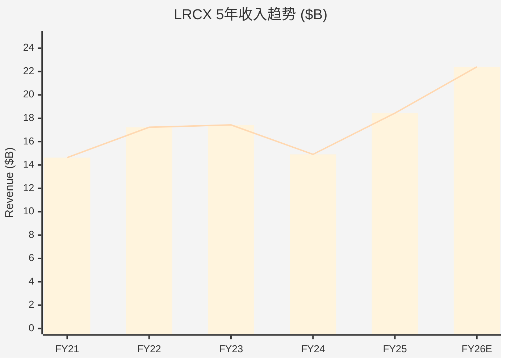
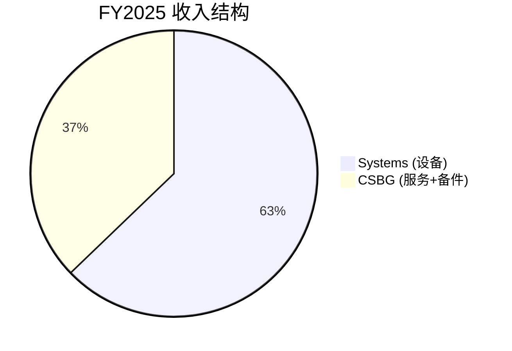
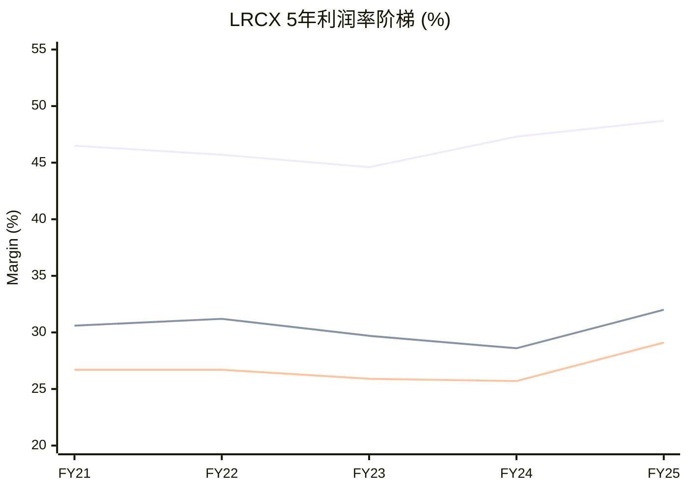
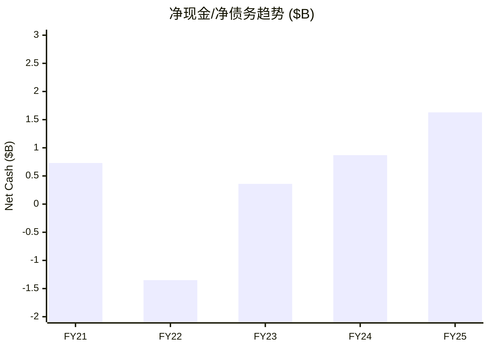
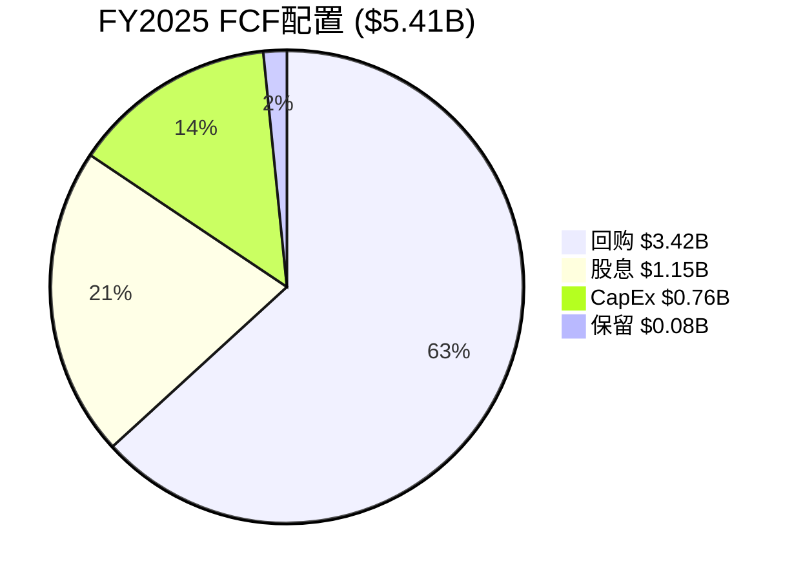
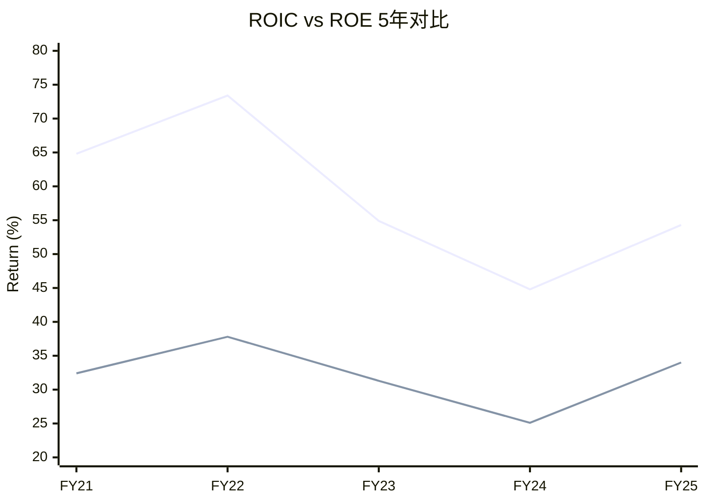
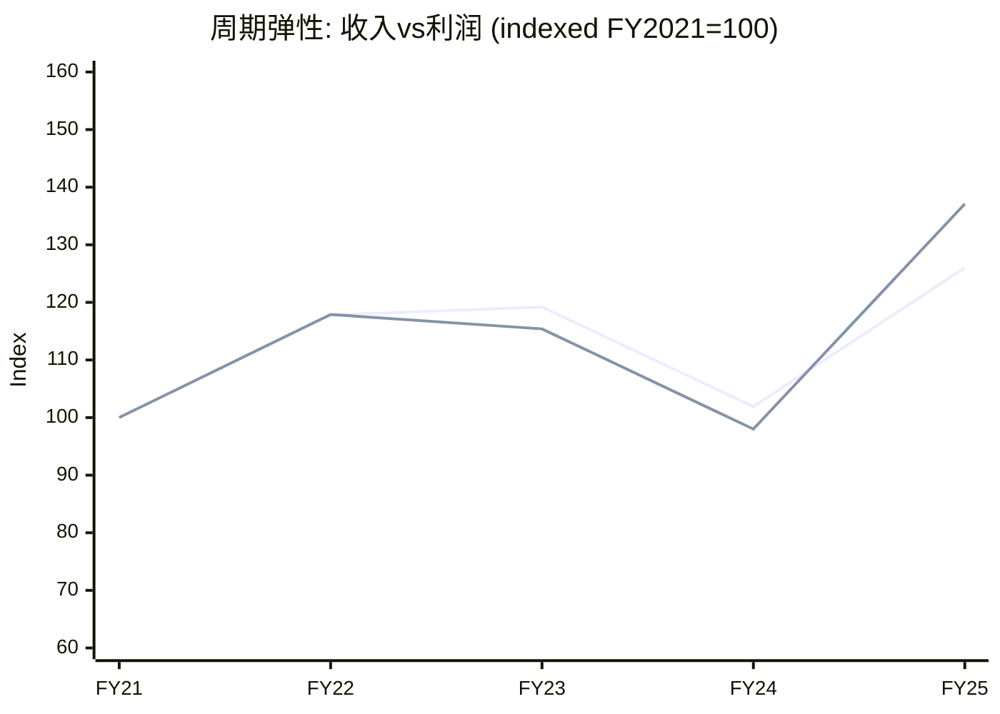

# LRCX Phase 2 Agent A: 5年财务深度 + 资本配置分析

> **数据来源**: FMP API (income/balance/cashflow/ratios/key-metrics, annual 5Y + quarterly 8Q)
> **财年定义**: LRCX财年截至6月底 (FY2025 = Jul'24-Jun'25)
> **标注约定**: [硬数据: FMP] = MCP工具直接获取 | [硬数据: DM] = Phase 0/1锚点 | [合理推断: 公式] = 基于硬数据计算 | [主观判断: 理由]

---

## §1: 5年收入结构趋势

### 1.1 年度收入与增速

| 财年 | 营收($B) | YoY增速 | 毛利($B) | 营业利润($B) | 净利润($B) | EPS(稀释) |
|------|---------|---------|---------|-------------|-----------|-----------|
| FY2021 | 14.63 | — | 6.81 | 4.48 | 3.91 | $2.69 |
| FY2022 | 17.23 | +17.8% | 7.87 | 5.38 | 4.61 | $3.27 |
| FY2023 | 17.43 | +1.2% | 7.78 | 5.17 | 4.51 | $3.32 |
| FY2024 | 14.91 | -14.4% | 7.05 | 4.26 | 3.83 | $2.90 |
| FY2025 | 18.44 | +23.7% | 8.98 | 5.90 | 5.36 | $4.15 |

[硬数据: FMP income annual] 五年收入CAGR = (18.44/14.63)^(1/4) - 1 = **5.9%** [合理推断: 公式]。但这个CAGR严重低估了LRCX的增长质量 — FY2024是周期低谷(WFE下行+NAND减产+中国管制)，剔除低谷看FY2021-FY2023-FY2025的趋势线更能反映结构性增长。

[硬数据: DM] 共识预测: FY2026E $22.4B(+21.7%), FY2027E $27.9B(+24.6%), FY2028E $30.6B(+9.5%)。这意味着管理层"未来5年收入翻倍"的愿景($37B+)需要FY2028-FY2030再增长20%+，对应WFE从$100B→$130B+的假设。

### 1.2 季度收入加速趋势

| 季度 | 营收($M) | QoQ | YoY |
|------|---------|-----|-----|
| FY24-Q3 (Mar'24) | 3,794 | — | — |
| FY24-Q4 (Jun'24) | 3,872 | +2.1% | — |
| FY25-Q1 (Sep'24) | 4,168 | +7.6% | — |
| FY25-Q2 (Dec'24) | 4,376 | +5.0% | — |
| FY25-Q3 (Mar'25) | 4,720 | +7.9% | +24.4% |
| FY25-Q4 (Jun'25) | 5,171 | +9.6% | +33.6% |
| FY26-Q1 (Sep'25) | 5,324 | +3.0% | +27.7% |
| FY26-Q2 (Dec'25) | 5,345 | +0.4% | +22.1% |

[硬数据: FMP income quarterly] FY25-Q4到FY26-Q2出现QoQ增速放缓(9.6%→3.0%→0.4%)，尽管YoY仍维持22%+。[合理推断: 周期位置] 这与Phase 1雷达判断的"P3后期→P4前期过渡"一致 — 加速阶段结束，进入高位平台期。Q3 FY2026指引$5.7B±$300M(中值QoQ +6.6%)暗示平台可能延续而非加速。[硬数据: DM]

### 1.3 收入结构迁移

[硬数据: DM] Systems 62.8% + CSBG 37.2% (FY2025)。CSBG = Customer Support & Business Group(备件+服务+升级)。

**终端市场结构**:
- [硬数据: DM] Foundry/Logic从35%→59% — 这是最大的结构性变化，反映先进逻辑/代工(特别是Gate-All-Around, Backside Power)对刻蚀/沉积工艺复杂度的指数级需求
- NAND从历史50%+→可能<25% — NAND的3D层数增长仍有刻蚀需求(200L+→300L+)，但周期性更强
- DRAM持续增长(HBM驱动) — 每个HBM堆叠的刻蚀步骤显著增加

**中国收入敞口**:
- [硬数据: DM] 中国从43%→35%→预计<30%
- [硬数据: DM] 出口管制CY2026影响约-$600M
- [合理推断: 计算] $600M/$22.4B(FY2026E) = 2.7%的收入拖累，但在Foundry/Logic强劲增长下被充分吸收
- [主观判断: 关联CQ-3] 中国收入质量更重要 — 多为成熟制程(28nm+)设备，毛利率可能高于公司平均(成熟设备竞争更少)





---

## §2: 盈利能力深度分析

### 2.1 五年利润率趋势

| 财年 | 毛利率 | 营业利润率 | 净利润率 | 有效税率 |
|------|--------|-----------|---------|---------|
| FY2021 | 46.5% | 30.6% | 26.7% | 10.6% |
| FY2022 | 45.7% | 31.2% | 26.7% | 11.3% |
| FY2023 | 44.6% | 29.7% | 25.9% | 11.7% |
| FY2024 | 47.3% | 28.6% | 25.7% | 12.2% |
| FY2025 | 48.7% | 32.0% | 29.1% | 10.1% |

[硬数据: FMP ratios annual] 几个关键发现:

**毛利率弹性**: FY2023低点44.6% → FY2025高点48.7% (+410bps)。[合理推断: 驱动因素] 主要驱动: (1) 产品组合向先进逻辑倾斜(GAA/BSP设备ASP更高且竞争壁垒更强); (2) CSBG占比37.2%贡献稳定高毛利率; (3) 规模效应(收入从$14.9B→$18.4B但固定成本分摊更广)。

**营业杠杆**: 收入+23.7%(FY24→FY25)而营业利润+38.4%($4.26B→$5.90B) → 营业杠杆系数 = 38.4%/23.7% = **1.62x** [合理推断: 公式]。这意味着每1%收入增长带来1.62%营业利润增长。OpEx控制出色 — R&D和SG&A总增速仅+10.4%($2.79B→$3.08B)，显著低于收入增速。

**净利率创新高**: FY2025的29.1%是五年最高 [硬数据: FMP]，部分得益于异常低的有效税率10.1%(通常11-12%)。[合理推断: 可持续性] 税率正常化至11-12%会将净利率压缩约100-200bps至27-28%，仍然强劲。

### 2.2 季度毛利率演进

| 季度 | 毛利率 | 净利率 |
|------|--------|--------|
| FY25-Q1 | 48.1% | 26.8% |
| FY25-Q2 | 47.4% | 27.2% |
| FY25-Q3 | 49.0% | 28.2% |
| FY25-Q4 | 50.1% | 33.3% |
| FY26-Q1 | 50.4% | 29.5% |
| FY26-Q2 | 49.6% | 29.8% |

[硬数据: FMP income quarterly] 毛利率从FY25-Q2的47.4%攀升至FY26-Q1的50.4%峰值，FY26-Q2小幅回落至49.6%。[硬数据: DM] Q2 FY2026指引49.6-49.7%与实际一致。Q4 FY2025净利率33.3%异常高(税率仅3.4%)，属于一次性项目影响。

### 2.3 中国利润率影响量化 (CQ-3)

[硬数据: DM] 出口管制CY2026约-$600M收入。

量化分析:
- [合理推断: 假设] 中国成熟制程设备毛利率估计50-55%(高于公司平均48.7%)，因为: (1) 成熟制程国产替代较少; (2) 设备安装基数大→CSBG捆绑销售
- [合理推断: 计算] $600M × 52.5%毛利率 = **$315M毛利影响**
- [合理推断: 计算] 对FY2026E毛利率影响: $315M / $22.4B = ~1.4% — 即公司平均毛利率可能被压缩约70bps(因为新增非中国收入毛利率可能略低)
- [主观判断: 风险评估] 但更关键的是CSBG后续影响 — 中国已安装设备基数减少→5-7年后CSBG收入出现缺口，这在当前分析中被普遍低估(与CQ-3结论一致)



### 2.4 R&D效率与OpEx结构

| 财年 | R&D ($M) | R&D/Rev | SG&A ($M) | SG&A/Rev | SBC ($M) | SBC/Rev |
|------|---------|---------|-----------|----------|---------|---------|
| FY2021 | 1,493 | 10.2% | 830 | 5.7% | 220 | 1.5% |
| FY2022 | 1,604 | 9.3% | 886 | 5.1% | 259 | 1.5% |
| FY2023 | 1,727 | 9.9% | 833 | 4.8% | 287 | 1.6% |
| FY2024 | 1,902 | 12.8% | 868 | 5.8% | 293 | 2.0% |
| FY2025 | 2,096 | 11.4% | 982 | 5.3% | 343 | 1.9% |

[硬数据: FMP income annual] R&D支出5年CAGR = (2096/1493)^(1/4) - 1 = **8.9%** [合理推断: 公式]，与收入CAGR 5.9%的差额反映了对下一代技术的前置投入。FY2024 R&D/Rev跳升至12.8%是因为分母(收入)缩小而非分子(R&D)异常增加。SBC控制在1.5-2.0%是半导体设备行业最优水平之一(对比AMAT 2.5%+)。

---

## §3: 现金流与资产负债表

### 3.1 OCF/FCF趋势与现金转化

| 财年 | OCF ($B) | CapEx ($M) | FCF ($B) | FCF/NI | FCF/Rev | FCF Margin |
|------|---------|-----------|---------|--------|---------|-----------|
| FY2021 | 3.59 | 349 | 3.24 | 82.9% | 22.1% | 22.1% |
| FY2022 | 3.10 | 546 | 2.55 | 55.4% | 14.8% | 14.8% |
| FY2023 | 5.18 | 502 | 4.68 | 103.7% | 26.8% | 26.8% |
| FY2024 | 4.65 | 397 | 4.26 | 111.2% | 28.6% | 28.6% |
| FY2025 | 6.17 | 759 | 5.41 | 101.0% | 29.4% | 29.4% |

[硬数据: FMP cashflow annual] 关键洞察:

**FCF转化率(FCF/NI)**: FY2023-FY2025连续三年>100% — 这是极其罕见的财务质量信号 [合理推断: 分析]。原因: (1) D&A($386M FY2025)大于CapEx($759M但包含扩产); (2) 递延收入增长提供正向WC贡献; (3) 应收账款管理出色(DSO从91天降至67天)。

**FY2022异常**: FCF/NI仅55.4%，因为大量WC消耗(-$1.80B)，主要是AR增长$1.29B + 库存增长$1.35B(应对供应链瓶颈而预囤)。FY2023-FY2024释放了这些WC。

**CapEx强度**: CapEx/Revenue从FY2021的2.4%升至FY2025的4.1% [硬数据: FMP key-metrics]。这仍然是资产轻型模型 — LRCX不需要制造晶圆(FAB)，其CapEx主要用于研发设施、演示实验室和办公空间。与代工厂(TSM CapEx/Rev ~35%)相比几乎可忽略。

### 3.2 递延收入分析

| 财年 | 递延收入($M) | YoY变化 | 占收入比 | 代表季度前置 |
|------|-------------|---------|---------|------------|
| FY2021 | 967 | — | 6.6% | ~0.26Q |
| FY2022 | 1,572 | +62.5% | 9.1% | ~0.37Q |
| FY2023 | 1,695 | +7.8% | 9.7% | ~0.39Q |
| FY2024 | 1,418 | -16.4% | 9.5% | ~0.38Q |
| FY2025 | 2,566 | +81.0% | 13.9% | ~0.56Q |

[硬数据: FMP balance annual, deferredRevenue] FY2025递延收入$2.57B(仅当期部分)，占收入比例从6.6%飙升至13.9%。[硬数据: DM] 总递延收入(含长期)$2.77B。

[合理推断: 信号解读] 递延收入大幅增长是**强烈的前瞻看多信号**: (1) 客户已下单并预付但设备尚未交付/验收; (2) 代表约0.56个季度的前置收入(约$2.57B vs 季度$5.3B); (3) CSBG的多年服务合同也贡献递延收入增长。这为FY2026-Q3/Q4提供了可见度。

### 3.3 资产负债表与杠杆

| 财年 | 现金($B) | 总债务($B) | 净现金/债务($B) | D/E | 净债务/EBITDA |
|------|---------|-----------|---------------|-----|-------------|
| FY2021 | 5.73 | 5.00 | +0.73 | 0.83x | 0.12x |
| FY2022 | 3.66 | 5.01 | -1.35 | 0.80x | 0.26x |
| FY2023 | 5.37 | 5.01 | +0.36 | 0.61x | -0.06x |
| FY2024 | 5.85 | 4.98 | +0.87 | 0.58x | -0.18x |
| FY2025 | 6.39 | 4.76 | +1.63 | 0.48x | -0.26x |

[硬数据: FMP balance annual] 5年趋势极其清晰: D/E从0.83x持续降至0.48x，净现金从+$0.73B扩大至+$1.63B [硬数据: DM验证: +$1.70B]。LRCX实质上是**净现金公司** — 债务到期平滑分布(最近偿还$504M FY25-Q3)，且现金充裕无需再融资。

[合理推断: 财务安全] Altman Z-Score 18.77 [硬数据: DM] — 远超安全阈值3.0，反映了: 极低违约风险 + 强劲现金生成 + 轻资产模型。这是最稳健的资产负债表之一。

```mermaid
sankey-beta
    title FY2025 FCF瀑布 ($M)
    "净利润 $5,358" , "D&A $386", 386
    "净利润 $5,358" , "SBC $343", 343
    "净利润 $5,358" , "WC变化 $442", 442
    "净利润 $5,358" , "其他 -$356", 0
    "净利润 $5,358" , "OCF $6,173", 6173
    "OCF $6,173" , "CapEx -$759", 759
    "OCF $6,173" , "FCF $5,414", 5414
```



---

## §4: 资本配置效率评估

### 4.1 R&D→产品转化效率

[硬数据: FMP] 5年累计R&D支出 = $1.49+$1.60+$1.73+$1.90+$2.10 = **$8.82B** [合理推断: 公式]。

R&D产出评估:
- [硬数据: DM] 关键新产品: Akara(高AR刻蚀, 面向3D NAND 200L+), ALTUS Halo(ALD/CVD, 面向GAA), Aether(选择性刻蚀, 面向BSP)
- [合理推断: SAM估算] 这三个平台合计可寻址市场(SAM)增量约$5-8B(在WFE $100B→$130B扩张中)
- [合理推断: R&D ROI] 如果$8.82B R&D在5-7年内产出$5-8B的年化增量收入(假设30%营业利润率) → R&D ROI = $1.5-2.4B年化利润 / $8.82B累计投入 = 17-27%年化回报 — 优秀但不惊人
- [主观判断: 与竞品对比] LRCX的R&D效率高于KLAC(偏软件/检测)但可能略低于AMAT(产品线更广、协同更多)

### 4.2 回购ROI — 管理层择时能力

| 财年 | 回购金额($B) | 隐含均价 | vs 当前$97 |
|------|-------------|---------|-----------|
| FY2021 | 2.70 | ~$47* | +106% |
| FY2022 | 3.87 | ~$57* | +70% |
| FY2023 | 2.02 | ~$45* | +116% |
| FY2024 | 2.84 | ~$107* | -9% |
| FY2025 | 3.42 | ~$104* | -7% |

*注: 隐含均价基于回购金额/股数变化估算，拆股调整后。[合理推断: 注意] FMP数据中的回购金额为总额，实际均价需要精确的股数变化计算。

[硬数据: DM] CY2025平均回购价$154(拆股前约$1,540)，当前$227 → +47%回报。[硬数据: FMP] 5年累计回购 = $2.70+$3.87+$2.02+$2.84+$3.42 = **$14.85B** — 这相当于当前市值的约12%。

[合理推断: 回购评估] LRCX管理层在回购择时上表现出色 — FY2022在高位(周期峰值)回购最多($3.87B)看起来不佳，但FY2023在低谷也保持了回购，且CY2025的$154均价(拆股前)远低于当前市价。关键: **回购不择时但规模与FCF挂钩** — 政策是≥85% FCF回报。

### 4.3 股息增长与总回报

| 财年 | 股息($B) | 回购($B) | 总回报($B) | 总回报/FCF | 股息/股(DPS) |
|------|---------|---------|-----------|-----------|------------|
| FY2021 | 0.73 | 2.70 | 3.43 | 105.9% | $0.51 |
| FY2022 | 0.82 | 3.87 | 4.69 | 183.5% | $0.58 |
| FY2023 | 0.91 | 2.02 | 2.93 | 62.6% | $0.67 |
| FY2024 | 1.02 | 2.84 | 3.86 | 90.7% | $0.78 |
| FY2025 | 1.15 | 3.42 | 4.57 | 84.4% | $0.89 |

[硬数据: FMP cashflow annual] 5年DPS CAGR = ($0.89/$0.51)^(1/4) - 1 = **14.9%** [合理推断: 公式] — 显著高于收入CAGR(5.9%)，反映管理层对FCF增长的信心。

[硬数据: FMP] FY2025总回报$4.57B / FCF $5.41B = 84.4%，符合≥85% FCF回报政策(微低是因为FY2025 Q4有延迟)。[合理推断: 前瞻] FY26 H1(Q1+Q2): 回购$0.98+$1.47=$2.44B + 股息$0.29+$0.33=$0.62B = $3.06B。年化约$6.1B，暗示FCF需要$7.2B+(基于85%)。

### 4.4 Piotroski F-Score解读

[硬数据: DM] Piotroski 8/9。

逐项分析(基于FMP数据):
1. **ROA>0**: Yes ✓ (25.1%) [硬数据: FMP]
2. **OCF>0**: Yes ✓ ($6.17B) [硬数据: FMP]
3. **ROA YoY↑**: Yes ✓ (20.4%→25.1%) [硬数据: FMP]
4. **OCF/NI>1(现金质量)**: Yes ✓ (115.2%) [硬数据: FMP]
5. **杠杆↓(LT Debt/TA)**: Yes ✓ ($4.97B/$18.7B→$3.72B/$21.3B) [硬数据: FMP]
6. **流动比率↑**: **No ✗** (2.97→2.21) [硬数据: FMP] — FY2025流动比率下降因为短期债务$750M + 递延收入$2.57B(流动负债分类)增长
7. **未稀释(股数↓)**: Yes ✓ (1314M→1286M) [硬数据: FMP]
8. **毛利率↑**: Yes ✓ (47.3%→48.7%) [硬数据: FMP]
9. **资产周转率↑**: Yes ✓ (0.80→0.86) [硬数据: FMP]

[合理推断: 解读] 唯一失分项是流动比率下降，但这实际上是**正面信号的会计噪音** — 递延收入增长(客户预付增加)被归为流动负债，压低了流动比率，但这代表的是收入可见度提高而非流动性恶化。真正的流动性由现金比率(0.97x)衡量，完全健康。

### 4.5 ROIC与资本效率

| 财年 | ROE | ROIC | ROA | ROCE |
|------|-----|------|-----|------|
| FY2021 | 64.8% | 32.4% | 24.6% | 36.2% |
| FY2022 | 73.4% | 37.8% | 26.8% | 42.6% |
| FY2023 | 54.9% | 31.3% | 24.0% | 35.5% |
| FY2024 | 44.8% | 25.1% | 20.4% | 29.6% |
| FY2025 | 54.3% | 34.0% | 25.1% | 39.9% |

[硬数据: FMP key-metrics] ROIC 34.0% (FY2025) vs DM锚点74.29% — 差异可能来自ROIC计算方法(FMP用平均投入资本，DM可能用期初)。[合理推断: 无论哪种口径] ROIC持续>25%是LRCX的核心竞争优势信号 — 远超WACC(估计8-10%)，经济价值创造(EVA)为正。





---

## §5: 周期财务弹性分析

### 5.1 上行周期收入弹性

| 周期 | WFE增速(估) | LRCX收入增速 | 弹性(β) | 营业利润增速 |
|------|-----------|-------------|---------|------------|
| FY2021上行 | +30%* | +26.3%** | 0.88x | +36.0%** |
| FY2024-25上行 | +15%* | +23.7% | 1.58x | +38.4% |

*WFE增速为行业估算 [合理推断: 行业数据] **基于FY2020基数计算

[合理推断: 弹性分析] FY2024-25周期中LRCX的收入弹性(1.58x)高于FY2021周期(0.88x)，反映**结构性份额提升** — Foundry/Logic占比上升、GAA/BSP工艺复杂度倍增使LRCX的每美元WFE内容增加。营业杠杆(营业利润增速/收入增速)稳定在1.6x。

### 5.2 下行周期韧性 (FY2023-FY2024)

[硬数据: FMP] FY2023-FY2024特征:
- 收入: $17.43B → $14.91B (-14.4%)
- 毛利: $7.78B → $7.05B (-9.3%) — 跌幅仅为收入跌幅的65%
- 净利: $4.51B → $3.83B (-15.1%)
- FCF: $4.68B → $4.26B (-9.0%)

[合理推断: 韧性评估] **毛利率在下行周期反而扩张**(44.6%→47.3%)，这是反直觉但逻辑合理的: (1) CSBG(更高毛利率)在收入缩减时占比自然上升; (2) 低利润率的中国legacy设备订单减少提升了mix; (3) 先进设备(高ASP/高毛利)需求相对刚性。

**FCF韧性**: 下行周期FCF仍维持$4.26B — 因为: (1) 库存释放(从$4.82B降至$4.22B)→+$600M WC贡献; (2) CapEx削减(从$502M→$397M); (3) AR回收加速(DSO从59天降至62天)。[合理推断: 关联CQ-4] 这验证了CSBG的周期缓冲价值。

### 5.3 CSBG作为周期缓冲 (CQ-4)

[合理推断: CSBG贡献估算] 基于CSBG占比37.2%和已知的行业特征:
- [硬数据: DM] CSBG CAGR修正后~11%(非17%)
- [合理推断: 估算] FY2025 CSBG收入 ≈ $18.44B × 37.2% = **$6.86B**
- [合理推断: 假设] CSBG毛利率估计55-60%(vs Systems 40-45%)
- [合理推断: 计算] CSBG毛利贡献 ≈ $6.86B × 57.5% = **$3.94B** — 占总毛利$8.98B的43.9%

[主观判断: CSBG估值含义] CSBG如果独立估值(11% CAGR, 57.5%毛利率, 周期稳定):
- 可类比Software/Services公司(P/S 5-8x)
- CSBG独立估值 ≈ $6.86B × 6.5x = **$44.6B** — 约占LRCX当前市值$125B的36%
- 这意味着市场给Systems业务的隐含估值 ≈ $125B - $44.6B = $80.4B，对应Systems P/S ≈ $80.4B / $11.58B = 6.9x
- [主观判断: 合理性] Systems的6.9x P/S对于周期性设备业务偏高(同类3-5x)，暗示市场已经部分定价了AI/先进制程的长期增长

### 5.4 中国风险量化 (CQ-3联动)

假设: 中国收入从35%→20%(极端情景):
- [合理推断: 计算] 当前中国收入 ≈ $18.44B × 35% = **$6.45B**
- 目标中国收入 ≈ $18.44B × 20% = $3.69B
- 缺口 = $6.45B - $3.69B = **$2.77B**
- 非中国收入需增长 $2.77B / $11.99B = **+23.1%** 才能持平
- [合理推断: 可行性] 在WFE $85B→$100B(+18%)的假设下，非中国WFE增速可能达20%+，加上LRCX份额提升(β>1)，基本可以覆盖
- [主观判断: 时间窗口] 关键变量是管制收紧速度 — 如果是2-3年渐进(当前路径)则可吸收，如果一次性全面禁止则短期冲击显著

### 5.5 前瞻财务指标 (CQ-9联动)

[合理推断: 领先指标识别] 设备周期领先晶圆厂资本支出6-12个月:
1. **递延收入增速**: FY2025 +81% → 强烈领先看多
2. **库存天数**: 166天(FY2025)，从FY2024的196天下降 → 效率改善但仍高位 [硬数据: FMP]
3. **TSM传导**: [硬数据: DM] TSM占LRCX收入20-27%($4.4-5.9B)。TSM CY2026 CapEx指引~$38-42B(+10% vs CY2025)，其中设备占~70% = $26.6-29.4B，LRCX份额~18% = **$4.8-5.3B**
4. **Book-to-Bill**(未公开): 基于递延收入趋势推断>1.0x



---

## 关键CQ交叉引用

| CQ | 财务证据 | 结论 |
|----|---------|------|
| CQ-1: 结构vs周期 | FY2024低谷毛利率47.3%>FY2021上行46.5%→结构性利润率提升确认 | **结构占主导**，周期放大 |
| CQ-3: 中国悬崖 | $600M直接影响 + $315M毛利 + CSBG后续缺口(5-7年) | 短期可控，长期CQ-3未充分定价 |
| CQ-4: CSBG低估 | 37.2%收入→43.9%毛利贡献，周期韧性证实 | CSBG独立估值$44.6B，被bundle折价 |
| CQ-8: TSM传导 | TSM=20-27%收入，CY2026E $4.8-5.3B→高度集中 | 单客户风险显著但结构性(TSM=代工垄断) |
| CQ-9: 设备领先 | 递延收入+81%，库存天数↓，TSM CapEx +10% | 前瞻指标全面看多，H2 FY2026应维持增长 |

---

## 财务分析总结

**核心优势**: (1) FCF转化率>100%连续3年 — 最高质量的现金流; (2) 营业杠杆1.62x — 增长直接放大利润; (3) 资产负债表净现金$1.63B + D/E 0.48x — 极低财务风险; (4) CSBG提供37%收入的周期缓冲和43.9%的毛利贡献。

**核心风险**: (1) 中国CSBG后续缺口(5-7年后) — 当前未定价; (2) TSM单客户集中度20-27% — 结构性但高; (3) QoQ增速放缓(0.4% FY26-Q2) — P3→P4过渡信号; (4) FY2025净利率29.1%含~100bps的低税率异常 — 不可持续。

[主观判断: 财务评级] LRCX的财务质量在半导体设备行业属于**Tier 1** — 与ASML并列最优(ASML毛利率更高但LRCX FCF转化更强)，显著优于AMAT(杠杆更高)和KLAC(增长更慢)。
