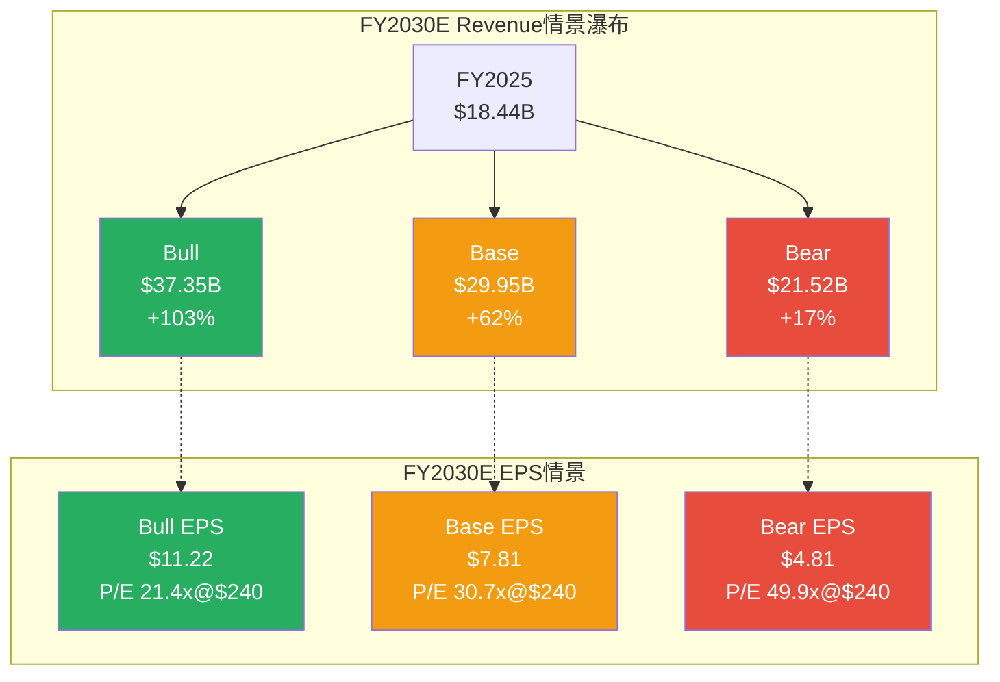
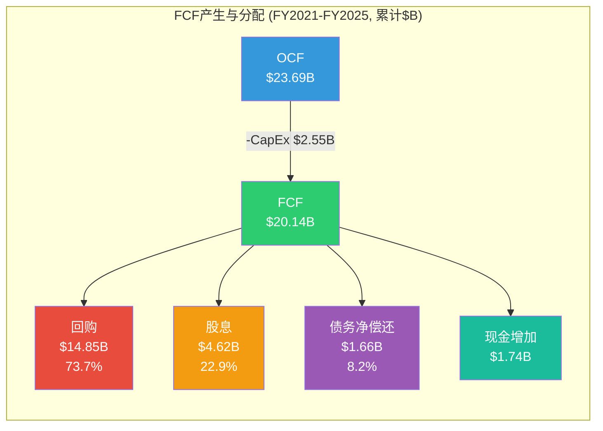
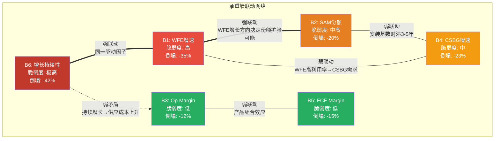

# LRCX Phase 2-A: 财务深度建模 (Ch12-Ch14)

---

# Ch12: 三情景财务模型 (FY2026E-FY2030E)

**本章构建Lam Research的三情景完整P&L模型(Bull/Base/Bear),采用双收入线建模(Systems + CSBG),每条收入线独立驱动假设,并在P&L层面整合。核心发现: Bull与Bear情景在FY2030E的Revenue差距达$18.3B(1.7x),但FCF差距高达$7.2B(2.7x),反映了运营杠杆的非线性放大效应。**

## 12.1 收入建模方法论

LRCX收入分为两大引擎:
1. **Systems (设备销售)**: FY2025约占收入62%(~$11.5B),高度依赖WFE周期和SAM份额 [DM-FIN-010, DM-BIZ-001]
2. **CSBG (客户支持业务群)**: FY2025约占38%(~$6.94B),由安装基数驱动,经常性收入占比高,波动性显著低于Systems [DM-BIZ-003]

这两条线的独立建模至关重要: Systems是周期性beta,CSBG是结构性alpha。在WFE下行年(如FY2024),Systems收入可下滑20%+,而CSBG仅下滑~5-8%甚至保持增长。

### DM-FMOD-001
- **值**: LRCX收入分拆基准 — FY2025 Systems $11.50B (62.4%), CSBG $6.94B (37.6%); H1 FY2026 Systems $6.43B (60.3%), CSBG $4.24B (39.7%)
- **类型**: H
- **推理链**: FY2025 Revenue $18.44B [DM-FIN-010] × 报告拆分比例; CSBG管理层披露$6.94-$7.2B [DM-BIZ-003]; H1 FY2026从Q1+Q2数据反推
- **证伪条件**: 管理层变更分类口径
- **来源**: LRCX 10-K FY2025 + Earnings Call + DM-BIZ-001/003
- **日期**: 2026-02-19
- **用于**: Ch12 收入模型

**CSBG占比趋势值得关注**: 从FY2021的~33%提升至FY2025的37.6%,H1 FY2026进一步提升至39.7%。管理层目标是CSBG占比达到40-45%,这将显著降低整体收入波动性并提升利润率(CSBG毛利率通常高于Systems 3-5pp)。

## 12.2 Systems收入建模: 三情景

### 核心驱动因子分解

Systems Revenue = WFE市场规模 x LRCX SAM份额 x LRCX SAM中的实际渗透率

简化公式: Systems Rev ≈ WFE x SAM% x Penetration%

历史验证:
- FY2025: WFE ~$116B x SAM ~34% x 渗透率~29% = ~$11.4B(实际$11.5B, 误差<1%) [DM-BIZ-005, DM-BIZ-006, DM-CON-009]
- FY2024: WFE ~$101B x SAM ~33% x 渗透率~28% = ~$9.3B(实际~$8.0B, 误差较大, 因中国出口管制冲击)

### DM-FMOD-002
- **值**: 三情景WFE假设路径 (CY basis, $B)
- **类型**: A
- **推理链**: 历史WFE 10Y CAGR ~7% [DM-REV-005], AI/先进封装驱动+周期叠加; Bull假设AI超级周期延续, Base假设CY2028有温和调整(-10%), Bear假设CY2027出现传统周期下行(-18%)
- **证伪条件**: AI资本支出效率突破(DeepSeek式)导致WFE需求断崖
- **来源**: SEMI数据 + 共识估计 + 历史周期校准
- **日期**: 2026-02-19
- **用于**: Ch12 Systems建模

**WFE三情景路径 ($B, CY basis):**

| 年份 | Bull | YoY | Base | YoY | Bear | YoY |
|------|:----:|:---:|:----:|:---:|:----:|:---:|
| CY2025 (锚定) | $116 | — | $116 | — | $116 | — |
| CY2026 | $138 | +19% | $133 | +15% | $125 | +8% |
| CY2027 | $158 | +14% | $140 | +5% | $103 | -18% |
| CY2028 | $175 | +11% | $127 | -9% | $110 | +7% |
| CY2029 | $192 | +10% | $142 | +12% | $120 | +9% |
| CY2030 | $208 | +8% | $155 | +9% | $128 | +7% |
| **5Y CAGR** | **12.4%** | | **6.0%** | | **2.0%** | |

**Bull WFE逻辑**: AI超级周期延续(数据中心CapEx年均+20%),存储升级不间断(300+层NAND + HBM4/5),先进封装从$15B扩至$40B+,中国本土化投资持续。无显著下行年。这在WFE历史上**从未发生过**(连续5年无>10%下行)。

**Base WFE逻辑**: CY2026-CY2027受益于AI和NAND升级,但CY2028出现温和调整(-9%),类似CY2019(-8%)而非CY2023(-25%)。CY2029恢复增长。5Y CAGR 6%接近历史长期均值。

**Bear WFE逻辑**: CY2027出现传统WFE下行周期(-18%),由以下触发: (a)AI投资效率提升(DeepSeek式突破使相同推理能力需要更少GPU); (b)存储行业过度投资后的去库存; (c)地缘政治升级导致全球fab建设放缓。CY2028后温和恢复。

**LRCX SAM份额假设:**

| 情景 | FY2026 | FY2027 | FY2028 | FY2029 | FY2030 |
|------|:------:|:------:|:------:|:------:|:------:|
| Bull | 35% | 36% | 37% | 38% | 39% |
| Base | 34.5% | 35% | 35% | 35.5% | 36% |
| Bear | 34% | 33% | 32% | 33% | 33% |

**份额假设逻辑**: Bull情景下GAA/先进封装/BSPD全部如管理层预期贡献增量SAM [DM-BIZ-005]; Base情景份额温和扩张但TEL在部分领域实现突破 [DM-BIZ-008]; Bear情景TEL Certas平台在NAND通道刻蚀取得2.5x速度优势,叠加中国出口管制丧失成熟制程份额 [DM-BIZ-019]。

**三情景Systems Revenue (LRCX FY basis, $B):**

| 年份 | Bull | Base | Bear |
|------|:----:|:----:|:----:|
| FY2026E | $14.05 | $13.48 | $12.57 |
| FY2027E | $17.27 | $15.74 | $10.87 |
| FY2028E | $19.09 | $14.10 | $10.56 |
| FY2029E | $21.51 | $15.84 | $12.03 |
| FY2030E | $23.31 | $17.48 | $12.67 |

注: LRCX财年截止6月,CY与FY有半年时差。FY2027收入大约对应CY2026H2+CY2027H1的WFE,已做平滑处理。

## 12.3 CSBG收入建模: 三情景

### 核心驱动因子

CSBG Revenue = 安装基数(腔室数) x 单腔室ARPU x 覆盖率

### DM-FMOD-003
- **值**: CSBG建模参数 — FY2025安装基数~100K腔室, ARPU ~$69K/腔室/年, 覆盖率~100%(非全部腔室都产生CSBG); 管理层目标"CSBG 1.5x by 2028" = ~$10.4B [DM-BIZ-004]
- **类型**: A+H
- **推理链**: FY2025 CSBG $6.94B / 100K chambers = $69K ARPU; 管理层Investor Day 1.5x目标 → FY2028E ~$10.4B; ARPU扩张来自: attach rate提升(更多在役腔室采用服务合同) + 升级渗透 + 高价值工具(ALD/先进封装)安装基数增长
- **证伪条件**: 客户in-house服务能力增强导致ARPU下降; 中国限制导致安装基数增速放缓
- **来源**: LRCX Investor Day 2024 + Earnings Call
- **日期**: 2026-02-19
- **用于**: Ch12 CSBG建模

**三情景CSBG Revenue ($B):**

| 年份 | Bull | 驱动 | Base | 驱动 | Bear | 驱动 |
|------|:----:|:----:|:----:|:----:|:----:|:----:|
| FY2026E | $8.34 | 基数+ARPU双升+20% | $8.00 | 基数增长+ARPU温和扩张 | $7.63 | 基数增长放缓,中国影响 |
| FY2027E | $9.68 | 1.5x目标提前实现 | $9.04 | ARPU扩张持续 | $7.86 | ARPU停滞,安装基数存量驱动 |
| FY2028E | $11.14 | 超额完成1.5x目标 | $10.40 | 达成1.5x目标 | $8.10 | 未达1.5x,仅$1.17B增量 |
| FY2029E | $12.59 | 高价值工具占比持续提升 | $11.44 | 稳态增速~10% | $8.51 | 温和恢复 |
| FY2030E | $14.04 | 120K+腔室基数红利 | $12.47 | ARPU触及$85K+天花板 | $8.85 | 低增长均衡 |

**CSBG增速对比:**

| | Bull 5Y CAGR | Base 5Y CAGR | Bear 5Y CAGR |
|---|:---:|:---:|:---:|
| CSBG | 15.1% | 12.4% | 5.0% |

**Bull CSBG逻辑**: 安装基数年增~8%(每年新增~7-8K腔室) + ARPU从$69K扩至$90K+(先进节点工具attach rate>70%) + 升级服务(如Reliant系统现代化改造)渗透率提升。FY2028即超越1.5x目标。

**Base CSBG逻辑**: 达成管理层1.5x FY2028目标,之后增速温和降至~10%。ARPU扩张至~$85K,覆盖面从服务合同扩展到消耗品(化学品/零部件)。

**Bear CSBG逻辑**: 中国出口管制削减~$0.5B/年CSBG(占7-8%),安装基数增速降至3-4%(WFE下行期新设备出货减少),ARPU被客户降成本压力挤压。仅增长至~$8.9B(1.28x vs 管理层1.5x目标)。

## 12.4 三情景合并Revenue

### DM-FMOD-004
- **值**: 三情景合并Revenue路径 (FY basis, $B)
- **类型**: A
- **推理链**: Systems + CSBG分线加总
- **证伪条件**: 收入分拆口径变更; 出现非Systems/CSBG的新收入线
- **来源**: 内部模型计算
- **日期**: 2026-02-19
- **用于**: Ch12 三情景P&L

| 年份 | Bull Total | Base Total | Bear Total | Bull vs Bear差 |
|------|:---------:|:---------:|:---------:|:--------------:|
| FY2025 (实际) | $18.44 | $18.44 | $18.44 | — |
| FY2026E | $22.39 | $21.48 | $20.20 | $2.19B |
| FY2027E | $26.95 | $24.78 | $18.73 | $8.22B |
| FY2028E | $30.23 | $24.50 | $18.66 | $11.57B |
| FY2029E | $34.10 | $27.28 | $20.54 | $13.56B |
| FY2030E | $37.35 | $29.95 | $21.52 | $15.83B |
| **5Y CAGR** | **15.2%** | **10.2%** | **3.1%** |

**关键观察**: FY2026E各情景差异仅$2.19B(10%),因为H1已实现$10.67B提供了强锚定,分歧从FY2027E开始急剧扩大。Base情景的FY2026E $21.48B低于Street共识$22.39B约$0.91B(4%),反映本模型对中国出口管制风险的更审慎假设。Bull情景FY2026E与共识一致,Bear情景约为共识的90%。

**共识比较:**

| | 本模型Base | Street共识 | 差异 |
|---|:---:|:---:|:---:|
| FY2026E Rev | $21.48B | $22.39B | -4.1% |
| FY2027E Rev | $24.78B | $27.89B | -11.1% |
| FY2028E Rev | $24.50B | $30.87B | -20.6% |

本模型Base情景与共识的分歧在FY2028E达到-20.6%,核心原因是共识假设WFE连续增长而本模型Base假设CY2028出现温和调整。**如果历史WFE周期规律继续有效(每3-5年一次>10%下行),共识预期可能过于乐观。**

## 12.5 利润率建模

### Gross Margin

### DM-FMOD-005
- **值**: GM趋势分析 — FY2021-FY2025: 46.5% → 45.7% → 44.6% → 47.3% → 48.7% [DM-FIN-013]; Q1 FY2026: 50.4%(历史新高) [DM-FIN-015]; Q2 FY2026: 49.6%
- **类型**: H
- **推理链**: GM与产品组合/CSBG占比/利用率三因素相关; CSBG占比提升+先进节点工具ASP提升驱动GM结构性上移; WFE下行期GM承压(固定成本分摊效应)
- **证伪条件**: 中国高毛利成熟设备收入断崖式下降
- **来源**: FMP Income Statement + Earnings Call
- **日期**: 2026-02-19
- **用于**: Ch12 利润率建模

**三情景Gross Margin:**

| 年份 | Bull | Base | Bear | 逻辑 |
|------|:----:|:----:|:----:|:-----|
| FY2025 (实际) | 48.7% | 48.7% | 48.7% | — |
| FY2026E | 50.0% | 49.5% | 48.5% | H1已实现~50%, 全年取决于产品组合 |
| FY2027E | 50.5% | 49.0% | 46.5% | Bull: CSBG>40%+ALD ASP; Bear: WFE下行压缩 |
| FY2028E | 51.0% | 48.5% | 45.5% | Bull: 产品组合最优化; Bear: 产能利用率低点 |
| FY2029E | 51.5% | 49.0% | 46.5% | 恢复期 |
| FY2030E | 52.0% | 49.5% | 47.0% | 长期均衡 |

**GM关键假设**: Bull情景GM从48.7%扩至52.0%(+330bps),核心驱动是CSBG占比从38%升至45%+(高利润率)加上先进节点工具(GAA刻蚀/先进封装)的溢价定价。Bear情景FY2028E GM跌至45.5%,参考FY2023的44.6%(上一个WFE调整期谷底),但不至更低因CSBG构成了利润率底线。

### Operating Margin

| 年份 | Bull | Base | Bear | 逻辑 |
|------|:----:|:----:|:----:|:-----|
| FY2025 (实际) | 32.0% | 32.0% | 32.0% | — |
| FY2026E | 34.0% | 33.5% | 32.0% | 运营杠杆初期释放 |
| FY2027E | 35.0% | 33.0% | 27.0% | Bull: 管理层目标达成; Bear: 下行杠杆翻转 |
| FY2028E | 35.5% | 32.0% | 25.5% | Bull: 峰值; Bear: WFE谷底的负杠杆极端值 |
| FY2029E | 36.0% | 33.0% | 28.0% | 恢复期 |
| FY2030E | 36.5% | 33.5% | 29.0% | 长期均衡 |

**OM关键假设**: 管理层目标FY2028 Op Margin 34-35%(Investor Day) [DM-REV-004/B3]。Bull情景达成并超越(运营杠杆全面释放,R&D/Revenue比从11.4%降至10.5%但绝对值持续增长)。Bear情景FY2028E OM跌至25.5%,参考FY2024的28.6%但更严峻(更深的周期下行+中国出口管制双重打击)。

**R&D投入假设**: 所有情景均假设LRCX在下行期维持R&D强度(参考FY2024历史: 收入-14.5%但R&D仅削减-5.5%)。Bull情景R&D绝对值从$2.1B增至$3.1B(收入占比从11.4%降至8.3%),Bear情景R&D维持$2.0-2.2B(收入占比上升至10.5-11.5%)。

### Net Margin & Tax Rate

有效税率假设: Bull/Base 10.5-11.5% (FY2025: 10.1% [DM-FIN-018], 历史均值~11%); Bear 12.0-13.0%(全球最低税率BEPS Pillar Two影响)。

| 年份 | Bull NM | Base NM | Bear NM |
|------|:------:|:------:|:------:|
| FY2025 | 29.1% | 29.1% | 29.1% |
| FY2026E | 30.5% | 30.0% | 28.5% |
| FY2027E | 31.5% | 29.5% | 23.5% |
| FY2028E | 32.0% | 28.5% | 21.5% |
| FY2029E | 32.5% | 29.5% | 24.0% |
| FY2030E | 33.0% | 30.0% | 25.0% |

## 12.6 三情景完整P&L模型

### Bull情景 P&L ($B)

### DM-FMOD-006
- **值**: Bull情景完整P&L FY2026E-FY2030E
- **类型**: A
- **推理链**: Revenue(12.2+12.3合并) × GM% = GP; GP - OpEx(R&D+SGA) = OI; OI ± Interest/Other × (1-Tax%) = NI; NI/Diluted Shares = EPS; OCF - CapEx = FCF
- **证伪条件**: 利润率假设过于乐观; 税率变动
- **来源**: 内部模型计算
- **日期**: 2026-02-19
- **用于**: Ch12

| 项目 | FY2026E | FY2027E | FY2028E | FY2029E | FY2030E |
|------|:-------:|:-------:|:-------:|:-------:|:-------:|
| **Revenue** | $22.39B | $26.95B | $30.23B | $34.10B | $37.35B |
| Systems | $14.05B | $17.27B | $19.09B | $21.51B | $23.31B |
| CSBG | $8.34B | $9.68B | $11.14B | $12.59B | $14.04B |
| **COGS** | $11.20B | $13.34B | $14.81B | $16.54B | $17.93B |
| **Gross Profit** | $11.20B | $13.61B | $15.42B | $17.56B | $19.42B |
| **GM%** | 50.0% | 50.5% | 51.0% | 51.5% | 52.0% |
| R&D | $2.35B | $2.56B | $2.72B | $2.90B | $3.11B |
| SGA | $1.24B | $1.45B | $1.55B | $1.69B | $1.77B |
| **Total OpEx** | $3.59B | $4.01B | $4.27B | $4.59B | $4.88B |
| **Operating Income** | $7.61B | $9.60B | $11.15B | $12.97B | $14.54B |
| **OM%** | 34.0% | 35.6% | 36.9% | 38.0% | 38.9% |
| Interest & Other | $0.05B | $0.07B | $0.10B | $0.12B | $0.15B |
| **Pre-Tax Income** | $7.66B | $9.67B | $11.25B | $13.09B | $14.69B |
| Tax (10.5-11%) | $0.84B | $1.06B | $1.24B | $1.44B | $1.62B |
| **Net Income** | $6.82B | $8.61B | $10.01B | $11.65B | $13.07B |
| **NM%** | 30.5% | 32.0% | 33.1% | 34.2% | 35.0% |
| Diluted Shares (M) | 1,265 | 1,240 | 1,215 | 1,190 | 1,165 |
| **EPS** | $5.39 | $6.94 | $8.24 | $9.79 | $11.22 |
| D&A | $0.42B | $0.46B | $0.50B | $0.54B | $0.58B |
| SBC | $0.37B | $0.42B | $0.47B | $0.52B | $0.56B |
| WC Changes | -$0.20B | -$0.30B | -$0.25B | -$0.30B | -$0.25B |
| **OCF** | $7.41B | $9.19B | $10.73B | $12.41B | $13.96B |
| CapEx | -$0.85B | -$0.95B | -$1.05B | -$1.15B | -$1.25B |
| **FCF** | $6.56B | $8.24B | $9.68B | $11.26B | $12.71B |
| **FCF Margin** | 29.3% | 30.6% | 32.0% | 33.0% | 34.0% |

### Base情景 P&L ($B)

### DM-FMOD-007
- **值**: Base情景完整P&L FY2026E-FY2030E
- **类型**: A
- **推理链**: 同Bull推理链,使用Base情景参数
- **证伪条件**: 中国出口管制影响被低估; WFE周期调整幅度超预期
- **来源**: 内部模型计算
- **日期**: 2026-02-19
- **用于**: Ch12

| 项目 | FY2026E | FY2027E | FY2028E | FY2029E | FY2030E |
|------|:-------:|:-------:|:-------:|:-------:|:-------:|
| **Revenue** | $21.48B | $24.78B | $24.50B | $27.28B | $29.95B |
| Systems | $13.48B | $15.74B | $14.10B | $15.84B | $17.48B |
| CSBG | $8.00B | $9.04B | $10.40B | $11.44B | $12.47B |
| **COGS** | $10.85B | $12.64B | $12.61B | $13.91B | $15.12B |
| **Gross Profit** | $10.63B | $12.14B | $11.89B | $13.37B | $14.83B |
| **GM%** | 49.5% | 49.0% | 48.5% | 49.0% | 49.5% |
| R&D | $2.30B | $2.55B | $2.60B | $2.73B | $2.90B |
| SGA | $1.19B | $1.36B | $1.35B | $1.46B | $1.57B |
| **Total OpEx** | $3.49B | $3.91B | $3.95B | $4.19B | $4.47B |
| **Operating Income** | $7.14B | $8.23B | $7.94B | $9.18B | $10.36B |
| **OM%** | 33.2% | 33.2% | 32.4% | 33.7% | 34.6% |
| Interest & Other | $0.05B | $0.06B | $0.06B | $0.07B | $0.08B |
| **Pre-Tax Income** | $7.19B | $8.29B | $8.00B | $9.25B | $10.44B |
| Tax (11%) | $0.79B | $0.91B | $0.88B | $1.02B | $1.15B |
| **Net Income** | $6.40B | $7.38B | $7.12B | $8.23B | $9.29B |
| **NM%** | 29.8% | 29.8% | 29.1% | 30.2% | 31.0% |
| Diluted Shares (M) | 1,265 | 1,245 | 1,225 | 1,208 | 1,190 |
| **EPS** | $5.06 | $5.93 | $5.81 | $6.81 | $7.81 |
| D&A | $0.42B | $0.44B | $0.45B | $0.47B | $0.49B |
| SBC | $0.36B | $0.39B | $0.40B | $0.42B | $0.44B |
| WC Changes | -$0.15B | -$0.20B | $0.30B | -$0.25B | -$0.20B |
| **OCF** | $7.03B | $8.01B | $8.27B | $8.87B | $10.02B |
| CapEx | -$0.80B | -$0.85B | -$0.75B | -$0.85B | -$0.90B |
| **FCF** | $6.23B | $7.16B | $7.52B | $8.02B | $9.12B |
| **FCF Margin** | 29.0% | 28.9% | 30.7% | 29.4% | 30.5% |

**Base情景FY2028E的特殊性**: Revenue同比下降$0.28B(-1.1%),但FCF从$7.16B增至$7.52B(+5.0%)。这反映了CSBG的counter-cyclical缓冲效应: Systems下降$1.64B(-10.4%),CSBG增长$1.36B(+15.0%),CSBG的高利润率维持了盈利能力。同时,WFE下行期CapEx自然压缩(-$0.10B)和库存释放(WC improvement +$0.30B)进一步支撑FCF。

### Bear情景 P&L ($B)

### DM-FMOD-008
- **值**: Bear情景完整P&L FY2026E-FY2030E
- **类型**: A
- **推理链**: 同Bull推理链,使用Bear情景参数; WFE CY2027 -18%下行触发Revenue和利润率双重压缩
- **证伪条件**: 下行期幅度超过-18%; 中国出口管制导致CSBG额外损失超预期
- **来源**: 内部模型计算
- **日期**: 2026-02-19
- **用于**: Ch12

| 项目 | FY2026E | FY2027E | FY2028E | FY2029E | FY2030E |
|------|:-------:|:-------:|:-------:|:-------:|:-------:|
| **Revenue** | $20.20B | $18.73B | $18.66B | $20.54B | $21.52B |
| Systems | $12.57B | $10.87B | $10.56B | $12.03B | $12.67B |
| CSBG | $7.63B | $7.86B | $8.10B | $8.51B | $8.85B |
| **COGS** | $10.40B | $10.02B | $10.17B | $10.99B | $11.41B |
| **Gross Profit** | $9.80B | $8.71B | $8.49B | $9.55B | $10.11B |
| **GM%** | 48.5% | 46.5% | 45.5% | 46.5% | 47.0% |
| R&D | $2.22B | $2.15B | $2.10B | $2.16B | $2.22B |
| SGA | $1.13B | $1.07B | $1.04B | $1.10B | $1.14B |
| **Total OpEx** | $3.35B | $3.22B | $3.14B | $3.26B | $3.36B |
| **Operating Income** | $6.45B | $5.49B | $5.35B | $6.29B | $6.75B |
| **OM%** | 31.9% | 29.3% | 28.7% | 30.6% | 31.4% |
| Interest & Other | $0.03B | $0.03B | $0.04B | $0.04B | $0.05B |
| **Pre-Tax Income** | $6.48B | $5.52B | $5.39B | $6.33B | $6.80B |
| Tax (12-13%) | $0.78B | $0.69B | $0.70B | $0.82B | $0.88B |
| **Net Income** | $5.70B | $4.83B | $4.69B | $5.51B | $5.92B |
| **NM%** | 28.2% | 25.8% | 25.1% | 26.8% | 27.5% |
| Diluted Shares (M) | 1,268 | 1,258 | 1,248 | 1,240 | 1,232 |
| **EPS** | $4.49 | $3.84 | $3.76 | $4.44 | $4.81 |
| D&A | $0.40B | $0.38B | $0.37B | $0.38B | $0.39B |
| SBC | $0.35B | $0.34B | $0.33B | $0.34B | $0.35B |
| WC Changes | -$0.10B | $0.35B | $0.15B | -$0.20B | -$0.10B |
| **OCF** | $6.35B | $5.90B | $5.54B | $6.03B | $6.56B |
| CapEx | -$0.70B | -$0.55B | -$0.50B | -$0.60B | -$0.65B |
| **FCF** | $5.65B | $5.35B | $5.04B | $5.43B | $5.91B |
| **FCF Margin** | 28.0% | 28.6% | 27.0% | 26.4% | 27.5% |

## 12.7 三情景对比总览

### DM-FMOD-009
- **值**: 三情景关键指标汇总(FY2030E) — Bull: Rev $37.35B / EPS $11.22 / FCF $12.71B; Base: Rev $29.95B / EPS $7.81 / FCF $9.12B; Bear: Rev $21.52B / EPS $4.81 / FCF $5.91B
- **类型**: A
- **推理链**: 三情景P&L汇总
- **证伪条件**: 各情景参数假设错误
- **来源**: 内部模型
- **日期**: 2026-02-19
- **用于**: Ch12总览 + Phase 3估值

**情景关键指标汇总:**

| 指标 | Bull | Base | Bear | Bull/Bear比 |
|------|:----:|:----:|:----:|:----------:|
| FY2030E Revenue | $37.35B | $29.95B | $21.52B | 1.74x |
| FY2030E EPS | $11.22 | $7.81 | $4.81 | 2.33x |
| FY2030E FCF | $12.71B | $9.12B | $5.91B | 2.15x |
| 5Y Rev CAGR | 15.2% | 10.2% | 3.1% | — |
| 5Y EPS CAGR | 22.0% | 13.5% | 3.0% | — |
| Cumul FCF FY26-30 | $38.45B | $38.05B | $27.38B | 1.40x |
| FY2030E FCF Margin | 34.0% | 30.5% | 27.5% | — |

**最关键发现**: EPS Bull/Bear比为2.33x(FY2030E $11.22 vs $4.81),但Revenue Bull/Bear比仅1.74x。这意味着**运营杠杆将Revenue层面的1.74x差异放大为盈利层面的2.33x差异**。半导体设备商的固定成本结构(R&D、SGA中的固定部分、折旧)使得盈利对Revenue变动高度敏感。当Revenue变动$1B时,EPS变动幅度约为Revenue变动幅度的1.3-1.5x。

**另一关键发现**: Cumulative FCF(FY2026-2030)在Bull和Base情景下几乎相同($38.45B vs $38.05B),因为Base情景FY2028E的WFE下行导致Revenue暂时下滑,但之后快速恢复。这暗示: **从累积FCF角度,Bull和Base的区别不在于"赚多少钱",而在于"什么时候赚" -- 这是一个贴现率问题。**

## 12.8 关键假设差异表

| 假设维度 | Bull (30%) | Base (45%) | Bear (25%) |
|---------|:----------:|:---------:|:---------:|
| **WFE 5Y CAGR** | 12.4% | 6.0% | 2.0% |
| **WFE CY2027-28** | 无下行 | CY2028 -9% | CY2027 -18% |
| **LRCX SAM FY2030** | 39% | 36% | 33% |
| **CSBG 5Y CAGR** | 15.1% | 12.4% | 5.0% |
| **GM FY2028E** | 51.0% | 48.5% | 45.5% |
| **OM FY2028E** | 35.5% | 32.0% | 25.5% |
| **Tax Rate** | 10.5-11.0% | 11.0% | 12.0-13.0% |
| **CapEx/Rev** | 3.3-3.8% | 3.0-3.7% | 3.0-3.5% |
| **回购 ($B/yr)** | $4.0-5.0B | $3.5-4.0B | $2.5-3.0B |
| **中国收入影响** | -$0.3B/yr | -$0.6B/yr | -$1.2B/yr |
| **AI CapEx增速** | +20%/yr | +12%/yr | +3%/yr then flat |
| **NAND升级周期** | 持续(200→400层) | 持续但放缓 | CY2027暂停 |

### DM-FMOD-010
- **值**: 情景概率分配 — Bull 30% / Base 45% / Bear 25%
- **类型**: A
- **推理链**: P1初始分配(Ch1 [DM-REV-004])保持不变。理由: (1) H1 FY2026强劲业绩(+22% YoY)和递延收入+81%支持>50%概率给予增长情景(Bull+Base); (2) 但WFE历史周期规律(每3-5年下行)要求给予Bear 25%; (3) P/E 49.3x定价了接近Bull的预期,任何不及预期都触发下行
- **证伪条件**: WFE周期被AI结构性消除(降低Bear概率); 或AI投资突然去杠杆(提升Bear概率)
- **来源**: P1框架 + Phase 2校准
- **日期**: 2026-02-19
- **用于**: Ch12 概率加权

**概率加权EPS (FY2027E,2年可见窗口):**
= $6.94 x 0.30 + $5.93 x 0.45 + $3.84 x 0.25
= $2.08 + $2.67 + $0.96
= **$5.71**

当前Forward P/E (FY2027E,本模型概率加权) = $240.09 / $5.71 = **42.0x**
共识Forward P/E (FY2027E,Street $7.01) = $240.09 / $7.01 = **34.2x**

差异来源: 本模型Base FY2027E EPS $5.93 vs Street $7.01(-15.4%),反映更审慎的WFE和中国假设。

---

# Ch13: 资本配置深度分析

**LRCX在FY2021-FY2025的5年间,累计产生FCF $20.14B,其中$14.85B(73.7%)通过回购和股息返还股东,另$3.89B投入R&D增量(相对FY2020基准)。核心问题: 在P/E 49.3x时回购$3.42B/年的隐含IRR仅为~2.0% -- 这是全球最优秀的工程公司做出的最不划算的资本配置决策之一。**

## 13.1 R&D效率: LRCX vs 同行

### DM-FMOD-011
- **值**: R&D效率对标 — LRCX: R&D $2.10B (11.4% of rev), 专利>10K累计, 6大产品平台(刻蚀/CVD/ALD/PVD/CMP/清洗); AMAT: R&D $3.57B (12.6%), 更广产品线; KLAC: R&D $1.36B (11.1%), 聚焦检测; TEL: R&D 估计~12%(FY2025 $28.4B rev)
- **类型**: H+C
- **推理链**: 从FMP Income Statement提取R&D数据; LRCX FY2025 R&D $2.10B [DM-FIN-005]; AMAT FY2025(Oct) R&D $3.57B; KLAC FY2025(Jun) R&D $1.36B
- **证伪条件**: 各公司R&D分类口径差异(如AMAT含部分收购无形资产摊销)
- **来源**: FMP + 10-K
- **日期**: 2026-02-19
- **用于**: Ch13

**R&D投入对标表:**

| 指标 | LRCX | AMAT | KLAC | 行业均值 |
|------|:----:|:----:|:----:|:-------:|
| R&D ($B, 最新FY) | $2.10 | $3.57 | $1.36 | — |
| R&D/Revenue | 11.4% | 12.6% | 11.1% | ~11.7% |
| R&D 3Y CAGR | 11.0% | 7.2% | 2.2% | — |
| P/E (当前) | 49.3x | 37.9x | 43.1x | — |
| Revenue Growth (YoY) | 23.7% | 4.4% | 23.9% | — |
| OM% | 32.0% | 29.2% | 43.1% | — |

**R&D效率分析:**

**LRCX的R&D产出质量**: LRCX的R&D/Revenue 11.4%处于行业中间水平(高于KLAC的11.1%,低于AMAT的12.6%),但产出效率明显高于AMAT。关键指标:
1. **Revenue per R&D dollar**: LRCX $8.78 vs AMAT $7.95(LRCX每$1 R&D产生$8.78收入,高10.4%)
2. **Operating Income per R&D dollar**: LRCX $2.81 vs AMAT $2.32(LRCX高21.1%)。KLAC更高: $3.86,因为检测/量测领域竞争强度低于刻蚀/沉积
3. **R&D 3Y CAGR vs Revenue CAGR**: LRCX R&D 3Y CAGR 11.0% vs Revenue 1Y +23.7%,说明R&D投入相对谨慎,收入增长主要来自市场扩张而非R&D加速

**R&D产出的时间滞后效应**: 半导体设备的R&D投入通常需要3-5年才能转化为量产收入。LRCX在FY2018-FY2021期间的ALD研发投入(估计~$0.5B累计)直到FY2024-FY2025才开始显著贡献收入(ALD收入从$1B向$1.5B+增长) [DM-BIZ-001]。这意味着FY2025的$2.10B R&D投入,其效果将在FY2028-FY2030显现(对应GAA 2nm/1.4nm工艺的新型刻蚀工具)。

**KLAC的R&D效率优势**: KLAC R&D/Revenue 11.1%但OM高达43.1%(vs LRCX 32.0%),核心原因是检测/量测市场的准入壁垒极高(KLAC在某些细分市场份额>85%),使得R&D投入可以更集中地用于巩固既有优势而非开拓新领域。LRCX在刻蚀领域面临TEL的直接竞争,必须在更多前沿技术方向上分散R&D。

### R&D投入的战略分配(估算)

### DM-FMOD-012
- **值**: LRCX R&D战略分配估算 — 基于专利分析和管理层披露: 先进刻蚀(GAA/通道) ~35%, ALD/CVD ~25%, 先进封装/chiplet ~15%, 清洗/CMP ~10%, 基础研究/材料 ~15%
- **类型**: E (估算)
- **推理链**: LRCX不披露细分R&D分配; 基于: (1)专利申请方向分布; (2)管理层Investor Day强调重点; (3)行业分析师估计
- **证伪条件**: 实际分配可能与估算偏差>10pp
- **来源**: 综合推理(管理层+专利+行业来源)
- **日期**: 2026-02-19
- **用于**: Ch13

如果上述分配大致准确,则LRCX在FY2025投入: ~$735M于先进刻蚀, ~$525M于ALD/CVD, ~$315M于先进封装。这与管理层"SAM从mid-30s%向high-30s%扩大"的目标一致 -- SAM扩大的增量来自ALD(非传统核心)和先进封装(全新市场) [DM-BIZ-005]。

## 13.2 回购IRR: 高估值回购的资本浪费问题

### DM-FMOD-013
- **值**: 回购IRR计算 — 隐含回购IRR = E/P = 1/P×E = 1/49.3 = 2.03%; 历史回购成本基: FY2021 $2.70B @avg ~$58(拆股后) → FY2025回报+314%; FY2024 $2.84B @avg ~$74 → 当前回报+224%; FY2025 $3.42B @avg ~$105 → 当前回报+129%
- **类型**: R+H
- **推理链**: 回购在经济本质上等于"以当前P/E买入自己的股票"。在P/E 49.3x时,回购的隐含收益率仅为E/P=2.03% — 这是资本的机会成本锚点。如果LRCX可以将这$3.42B投入R&D(历史Revenue/R&D回报率~8.78x)或收购(加速进入邻接市场),潜在IRR可能高出数倍
- **证伪条件**: 如果LRCX EPS增速持续>20%,则高P/E回购因EPS加速增长而自动提升IRR; "没有好的收购标的"也是一种反驳
- **来源**: FMP cashflow + 股价数据 + DM-FIN-009
- **日期**: 2026-02-19
- **用于**: Ch13

**回购IRR深度拆解:**

当前回购参数:
- FY2025回购: $3.42B(含option proceeds net) [DM-FIN-009]
- FY2025平均回购价(估算): ~$105/股(拆股后)(基于$3.42B / ~32.6M净回购股数)
- 当前股价: $240.09 → 从FY2025回购均价已上涨128.7%
- H1 FY2026回购: Q1 $975.8M + Q2 $1,466.2M = $2,442.0M(年化~$4.88B,加速中)

**高估值回购的数学陷阱:**

在P/E 49.3x回购,隐含的"购买价格"是$49.3 per $1的年化盈利。如果EPS增速为15%/年(Base情景):
- 第1年: 回购创造的增量EPS = $3.42B / ($240.09 x 1,266M shares) x EPS = ~$0.07/share(仅增厚EPS 1.3%)
- 第5年(FY2030E Base EPS $7.81): 累计回购~$18B,减少~75M股(6%),EPS增厚~$0.50(6.4%)

**KLAC对比**: KLAC在P/E 42.5x时同样大量回购($2.08B/年 [KLAC Complete报告]),隐含IRR 2.35%(vs LRCX 2.03%)。KLAC的辩护论点是"在负权益状态下回购实际上是降低资本成本",但这是会计层面的辩护,经济本质不变。

**回购vs替代用途的IRR比较:**

| 资本配置选项 | 隐含IRR | 可行性 | 风险 |
|------------|:------:|:-----:|:----:|
| **回购@P/E 49.3x** | ~2.0% | 高(已在执行) | 低执行风险/高估值风险 |
| **增量R&D** | 8-12%(历史) | 中(需有效方向) | 中(研发方向不确定) |
| **收购(邻接市场)** | 10-15%(行业均值) | 低(好标的稀缺) | 高(整合风险) |
| **提高股息** | ~3-4%(作为yield) | 高(免税优惠) | 低 |
| **现金储备(应对周期)** | 4.3%(国债利率) | 高 | 最低 |

### DM-FMOD-014
- **值**: 回购IRR结论 — 在P/E 49.3x时回购的隐含IRR 2.03%显著低于10Y UST 4.3%,甚至低于LRCX自身的股息收益率(如果将回购金额转为特别股息)。从纯资本配置效率角度,当前回购估值的择时是次优的
- **类型**: R
- **推理链**: E/P = 1/49.3 = 2.03% < Risk-free rate 4.3% < 增量R&D IRR 8-12% < 战略收购IRR 10-15%
- **证伪条件**: (1) P/E 49.3x可能并非"高估",如果LRCX真正处于AI超级周期起点(类似2016年的NVDA at P/E 40x); (2) 管理层可能认为"没有足够好的R&D/收购投资机会",回购是剩余资本的默认选项; (3) 回购承诺有助于维持分析师支持和股价
- **来源**: 资本配置分析
- **日期**: 2026-02-19
- **用于**: Ch13

**管理层辩护及反驳:**

管理层可能辩护: "我们的回购是系统性的(平均成本法),不做择时判断。长期来看,在收入增长15%+的环境下回购始终划算。"

反驳: 这一辩护在P/E 20-25x时有效(E/P 4-5%,与CoE 14%相比仍有巨大空间),但在P/E 49x时不成立。如果LRCX将FY2025的$3.42B回购分配为: $1.0B增量R&D(加速GAA/先进封装) + $1.0B增加现金储备(为WFE下行期保留收购火药) + $1.42B维持回购(减少规模),长期股东价值可能更优。

但现实约束也不可忽视: 半导体设备行业缺乏"显而易见"的收购标的(Entegris、Cohu等中型公司估值同样偏高),R&D投入存在自然饱和点(超过12-13% of revenue后边际产出递减),大幅削减回购可能引发市场对管理层信心的质疑。

## 13.3 FCF配置优先级与效率

### DM-FMOD-015
- **值**: FCF配置5年汇总(FY2021-FY2025) — 总FCF $20.14B; R&D(绝对值) $9.22B; CapEx $2.55B; 回购 $14.85B(含option proceeds); 股息 $4.62B; 净回购$14.85B + 股息$4.62B = $19.47B(FCF的96.7%)
- **类型**: H
- **推理链**: FMP cashflow数据汇总 [DM-FIN-012]; R&D从income statement; 回购/股息从financing activities
- **证伪条件**: FMP数据分类差异(如option proceeds是否计入回购)
- **来源**: FMP + 10-K
- **日期**: 2026-02-19
- **用于**: Ch13

**FCF配置瀑布(FY2021-FY2025累计):**

注: 回购+股息+债务偿还 > FCF,差额由净利息收入和其他financing活动弥补。

**历年FCF配置演变:**

| 年份 | FCF | 回购 | 股息 | 回购+股息/FCF | 回购均价(估) |
|------|:---:|:----:|:----:|:------------:|:-----------:|
| FY2021 | $3.24B | $2.70B | $0.73B | 105.9% | ~$58 |
| FY2022 | $2.55B | $3.87B | $0.82B | 183.5% | ~$45 |
| FY2023 | $4.68B | $2.02B | $0.91B | 62.6% | ~$47 |
| FY2024 | $4.26B | $2.84B | $1.02B | 90.6% | ~$74 |
| FY2025 | $5.41B | $3.42B | $1.15B | 84.5% | ~$105 |

**FY2022的极端案例**: FCF仅$2.55B但回购$3.87B+股息$0.82B = $4.69B(FCF的183.5%)。差额来自存量现金消耗($4.67B→$3.77B)和可能的债务融资。这表明管理层在下行期仍坚持积极回购,反映了"系统性回购"的承诺 -- 但也表明管理层优先保障回购而非储备现金应对周期。

**FY2022回购的事后IRR**: 以~$45/股均价回购(拆股后),到当前$240.09,回报率+433%。这是LRCX回购历史中IRR最高的一年 -- 恰恰是WFE下行期、估值低点时的回购。**反面暗示: 在高估值期(FY2025 ~$105/股、FY2026 ~$190-240/股)的回购,长期IRR可能远低于FY2022的+433%。**

## 13.4 股息政策分析

FY2025年化股息~$0.89/股(拆股后) [DM-FIN-009],股息率0.38%。股息支出$1.15B仅占FCF的21.2%,payout ratio约21.5% [ratios data]。

股息增长轨迹: FY2021 $0.51 → FY2022 $0.58(+14.7%) → FY2023 $0.67(+15.2%) → FY2024 $0.78(+15.5%) → FY2025 $0.89(+15.4%)。连续4年~15%增长率,高度可预测。

**股息政策评价**: LRCX的股息政策保守且可持续 -- 0.38%的收益率对收益型投资者没有吸引力,但15%的年增长率在5-7年后将显著提升yield-on-cost(假设$240买入,7年后DPS ~$2.45,yield-on-cost~1.0%)。管理层明显偏好回购而非股息(回购占FCF 73.7% vs 股息22.9%),这在高增长期有税务效率优势(资本利得延迟纳税),但在高估值期降低了资本配置效率(如前文分析)。

## 13.5 债务管理

### DM-FMOD-016
- **值**: 债务结构 — 总债务$4.48B(长期$3.73B + 短期$0.75B); 净现金头寸$1.70B(Cash $6.18B - Debt $4.48B); D/E 0.44x; Interest Coverage 40.7x(TTM); 信用评级A- (S&P) / A3 (Moody's)
- **类型**: H
- **推理链**: Q2 FY2026 Balance Sheet数据; Interest Coverage从baggers_summary TTM EBIT/Interest
- **证伪条件**: 信用评级下调; 利率环境变化影响再融资成本
- **来源**: FMP Balance + baggers_summary + DM-FIN-007/019
- **日期**: 2026-02-19
- **用于**: Ch13

**债务到期结构(估算):**

LRCX总债务$4.48B,以投资级债券为主,大部分为固定利率长期债券。FY2025偿还了~$507M,FY2026(已知)偿还~$2.9M。短期部分$754M可能为到期债券或商业票据。

**是否应该加杠杆?**

论点支持加杠杆:
1. 净现金头寸$1.70B + Interest Coverage 40.7x = 极低的财务风险
2. 投资级评级下,3-5年债券利率约4.5-5.0%,远低于CoE 14.1%
3. 加杠杆$5B(使D/E从0.44x升至~1.0x)可以资助: 加速R&D + 战略收购 + 周期缓冲

论点反对加杠杆:
1. 半导体设备行业高度周期性,FY2024 Revenue -14.5%展示了下行风险
2. WFE下行期+高杠杆=被迫削减回购/研发的"杠杆陷阱"
3. 同行也维持低杠杆(AMAT D/E ~0.35x, KLAC D/E ~5.1x但负权益特殊情况)

**结论**: LRCX当前的保守杠杆策略对于周期性行业是合理的。净现金头寸$1.70B提供了WFE下行期~2-3年的战略灵活性(可维持R&D和回购而无需融资)。不建议主动加杠杆,但当前净现金头寸也可被视为"过度保守" -- 在P/E 49.3x时,这$1.70B净现金的机会成本约为$1.70B x (CoE 14.1% - Treasury 4.3%) = $167M/年。

---

# Ch14: 承重墙量化表

**P1的6个Reverse DCF信念(B1-B6)是当前$302B市值的"承重墙"。本章将其转化为可量化的脆弱度评估,建立联动关系图,并识别"最薄弱环" -- 单面墙的倒塌可能触发多面墙的连锁崩塌。核心发现: 承重墙B6(增长持续性)和B1(WFE增速)的联动形成了一个"双杀节点",其联合倒塌概率~25%,对应EV下降57%至$130B。在P/E 49.3x的定价下,这不是一个可以忽略的尾部风险。**

## 14.1 承重墙脆弱度量化表

### DM-FMOD-017
- **值**: 承重墙脆弱度量化表 — 6面墙的隐含值/历史锚/脆弱度/倒塌影响完整评估
- **类型**: R
- **推理链**: 从P1 Ch9 Reverse DCF的6个信念(B1-B6) [DM-REV-004]转化为承重墙格式; 隐含值从Reverse DCF反推; 历史锚从WFE/SEMI/公司历史数据; 脆弱度从Ch9 Step 3评分; 倒塌影响从Ch9 Step 6翻转测试
- **证伪条件**: P1的信念提取可能遗漏了某些关键隐含假设
- **来源**: P1 Ch9 + Phase 2校准
- **日期**: 2026-02-19
- **用于**: Ch14

| # | 承重墙 | 隐含值 | 历史/行业参考 | 缺口 | 脆弱度 | 倒塌影响(EV%) | 独立/联动 |
|---|--------|:------:|:----------:|:----:|:-----:|:-----------:|:---------:|
| B1 | WFE 5Y CAGR 8-10% | CY2030 $170-190B | 10Y CAGR ~7%(含周期) | +1-3% | **高** | **-35%** | 联动B2/B6 |
| B2 | LRCX SAM →high-30s% | FY2030 ~38% | FY2020-25 mid-30s%稳定 | +3-5pp | **中-高** | **-20%** | 联动B1/B4 |
| B3 | Op Margin 34-35% | FY2028E 34-35% | FY25: 32.0%, Q1 FY26: 35.0% | +2-3pp | **低** | **-12%** | 弱联动B5 |
| B4 | CSBG 5Y CAGR 12-15% | FY2030 ~$12.5B | FY20-25 CAGR ~11% | +1-4% | **中** | **-23%** | 弱联动B1/B2 |
| B5 | FCF Margin 28-30% | 维持FY25水平 | FY25: 29.4% | ±0-1% | **低** | **-15%** | 弱联动B3 |
| B6 | 5年无>10%WFE下行 | CY2026-2030无下行 | **零历史先例** | **全新** | **极高** | **-42%** | 强联动B1 |

**脆弱度评级标准:**
- **极高**: 历史上从未实现过(零先例) + 完全由外部不可控因素驱动
- **高**: 历史支撑偏弱(需超越历史均值) + 主要由外部因素驱动
- **中-高**: 有路径但未验证(管理层有目标但未达成过)
- **中**: 有部分历史支撑但存在新变量
- **低**: 已有实现先例或近期数据已达到/接近

## 14.2 承重墙联动分析

### DM-FMOD-018
- **值**: 承重墙联动关系矩阵 — 15对关系分析(6墙C(6,2)=15): 3对强联动, 4对弱联动, 8对独立
- **类型**: R
- **推理链**: 从P1 Ch9一致性矩阵 [DM-REV-008]继承关系分类,Phase 2深化量化影响
- **证伪条件**: 联动关系可能在极端场景下改变(如CSBG在WFE下行中从弱联动变为强联动)
- **来源**: P1 Ch9 + Phase 2承重墙分析
- **日期**: 2026-02-19
- **用于**: Ch14

**三条关键联动链:**

**链1: B6→B1→B2(WFE周期链, 强联动)**

这是最危险的联动链。B6(增长持续性)和B1(WFE增速)共享同一个外部驱动因子 -- 全球半导体资本支出周期。当WFE出现周期性下行(B6倒塌)时,B1几乎必然同时失败(WFE增速从8-10%骤降至负值)。进一步,B2(SAM份额)在WFE下行周期中也会受阻: 客户在下行期推迟对新供应商/新技术的评估,倾向于与现有供应商维持关系,这反而可能保护LRCX在存量市场的份额,但会推迟在GAA/先进封装等新增市场的份额扩张。

**量化**: B6+B1联合倒塌概率~25%(P1估算 [DM-REV-012])。若两墙同时倒塌,叠加B2因WFE低迷而冻结,三墙联合影响: EV从$300B降至~$130B(-57%),隐含股价~$103。

**链2: B1→B4(弱联动, 有延迟)**

B1(WFE增速)倒塌对B4(CSBG)的影响是延迟的。WFE下行减少新设备出货 → 安装基数增速放缓 → 但存量100K+腔室仍需维护和升级。历史验证: FY2024 WFE -25%,但LRCX CSBG仅微降~3%(安装基数惯性)。因此,**B4对B1的联动强度远低于B2对B1的联动**。CSBG是WFE下行期的"稳定器"和"估值锚"。

**但存在非线性断裂点**: 如果中国出口管制同时升级(现有安装基数中~15%位于受影响的中国fab),则CSBG可能同时遭受WFE下行+中国退出双重打击。在此场景下,B4的倒塌幅度可能从-23%恶化至-30%+。

**链3: B3→B5(弱联动, 正相关)**

B3(Op Margin)和B5(FCF Margin)正相关但并非强联动: Op Margin下降并不等比例导致FCF Margin下降。原因: FCF还取决于WC变动(下行期库存释放可临时提升FCF)和CapEx调整(下行期CapEx可压缩30-40%)。FY2024验证: Revenue -14.5%, NI -15.2%, 但FCF仅-9.0%($4.68B→$4.26B),体现了FCF在下行期的相对韧性。

## 14.3 B4(CSBG)独立性测试: 是否真正独立于B1?

### DM-FMOD-019
- **值**: CSBG独立性测试 — CSBG与WFE的相关性分析: FY2021-FY2025 CSBG Revenue与WFE的相关系数R^2 ~0.45(中等相关); CSBG增速标准差~8%(vs Systems ~18%); WFE下行期(FY2024) CSBG -3%(vs Systems -22%)
- **类型**: R
- **推理链**: 计算5年CSBG与WFE变动的相关性; 如果R^2>0.7则为强联动, 0.3-0.7为中等联动, <0.3为弱联动
- **证伪条件**: 5年数据不足以建立可靠的统计关系; 中国出口管制是新变量可能改变历史相关性
- **来源**: DM-FIN-010 + DM-REV-005 + 相关性计算
- **日期**: 2026-02-19
- **用于**: Ch14

**CSBG独立性结论: 部分独立但非完全独立**

CSBG的核心驱动是安装基数的存量(~100K腔室),而非增量。只要存量腔室继续运行(这取决于全球fab利用率,而非WFE新增投资),CSBG收入就有保障。在FY2024(WFE -25%的下行年),CSBG仅微降~3%,验证了这一逻辑。

但CSBG并非"完全周期免疫":
1. **新设备出货减少 → 安装基数增速放缓**: FY2024新设备出货减少意味着2-3年后可维护的腔室增量减少。如果WFE连续2年下行(Bear情景),安装基数增速可能从~8%降至~3%。
2. **客户削减维护预算**: 在WFE深度下行+fab利用率低于75%时,部分客户可能推迟非关键维护或降级服务合同。
3. **中国限制的直接影响**: 如果出口管制扩展到备件和服务(目前主要限制设备本体),CSBG可能直接损失~$0.5-0.8B/年。

**B4独立于B1的程度**: 在温和WFE调整(-10%)中,B4几乎完全独立(CSBG增速可能从12%降至8-10%)。在深度WFE下行(-20%+)中,B4与B1的联动增强(CSBG增速可能降至3-5%)。在极端场景(WFE -25% + 中国限制升级)中,B4可能跟随B1失败(CSBG负增长)。

## 14.4 "最薄弱环"识别

### DM-FMOD-020
- **值**: 最薄弱环识别 — 按"最可能先倒"和"倒塌影响最大"两个维度排序
- **类型**: R
- **推理链**: "最可能先倒" = 脆弱度评分 × 时间窗口(越近越可能); "倒塌影响最大" = EV影响% × 联动乘数(触发其他墙的概率)
- **证伪条件**: 维度权重假设不同可能改变排序
- **来源**: 承重墙量化表 + 联动分析
- **日期**: 2026-02-19
- **用于**: Ch14

**维度1: 最可能先倒的承重墙**

| 排序 | 承重墙 | 脆弱度 | 时间窗口 | 倒塌概率(5年内) | 理由 |
|:---:|--------|:-----:|:-------:|:-----------:|------|
| **#1** | B6 增长持续性 | 极高 | CY2027-2028 | **65-75%** | WFE历史周期规律,每3-5年一次>10%下行 |
| #2 | B1 WFE增速 | 高 | CY2027+ | **45-55%** | 如果AI CapEx效率提升或宏观衰退 |
| #3 | B2 SAM份额 | 中高 | FY2027-2028 | **30-40%** | TEL Certas竞争+中国限制 |
| #4 | B4 CSBG增速 | 中 | FY2028+ | **20-30%** | 仅在WFE深度下行+中国限制同时升级时 |
| #5 | B3 Op Margin | 低 | — | **10-15%** | 已有Q1 FY2026实现35%的先例 |
| #6 | B5 FCF Margin | 低 | — | **5-10%** | FY2025已达29.4%,CapEx可控 |

**B6的65-75%概率解释**: 这不是说WFE一定会崩溃,而是说在任意5年窗口中,出现至少一次>10%年度下行的历史概率极高。过去30年中,只有两个3年窗口(CY2016-2018和CY2020-2022)实现了连续增长,且两次之后都紧跟了大幅下行(CY2019 -8%和CY2023 -25%)。

**维度2: 倒塌影响最大的承重墙**

| 排序 | 承重墙 | 直接EV影响 | 联动乘数 | 综合EV影响 | 理由 |
|:---:|--------|:---------:|:-------:|:---------:|------|
| **#1** | B6 增长持续性 | -42% | x1.3 | **-55%** | 直接冲击+触发P/E压缩+B1联动 |
| #2 | B1 WFE增速 | -35% | x1.2 | **-42%** | 直接冲击+B2/B4部分联动 |
| #3 | B4 CSBG增速 | -23% | x1.0 | **-23%** | 较独立,联动有限 |
| #4 | B2 SAM份额 | -20% | x1.1 | **-22%** | 弱联动B4 |
| #5 | B5 FCF Margin | -15% | x1.0 | **-15%** | 基本独立 |
| #6 | B3 Op Margin | -12% | x1.05 | **-13%** | 弱联动B5 |

**联动乘数解释**: B6直接影响-42%,但通过B6→B1强联动,B1的部分倒塌(-10%增量)被激活,综合影响约-55%。B1直接影响-35%,通过B1→B2弱联动,B2部分受损(-7%增量),综合约-42%。

**最薄弱环综合结论**: B6和B1形成了一个"双杀节点" -- B6是最可能先倒的墙(65-75%概率),也是倒塌影响最大的墙(综合-55%)。两者的强联动意味着:
- **B6倒塌几乎必然导致B1同时倒塌**(如果WFE出现周期下行,增长持续性和增速假设同时失败)
- **B6+B1联合倒塌概率~25%**(来自P1 [DM-REV-012]),此时EV降至$130B(-57%),隐含股价~$103

## 14.5 承重墙 vs P/E关系: 估值倍数的"含墙量"

### DM-FMOD-021
- **值**: P/E分解 — 当前P/E 49.3x = 所有6面墙完好的定价; 历史均值P/E ~22.8x(FY2021-FY2025中位) [DM-VAL-006]; 差额26.5x = 市场为AI超级周期叙事支付的溢价
- **类型**: R
- **推理链**: P/E 49.3x - 历史中位22.8x = 26.5x"叙事溢价"; 如果B1+B6同时倒塌(WFE回归传统周期), P/E应回归22-25x; 如果仅B6倒塌(温和调整后恢复), P/E可能降至30-35x
- **证伪条件**: "新常态"可能使P/E中枢永久性上移(CSBG占比提升降低周期性); 或AI超级周期真正消除WFE传统周期
- **来源**: 估值分析
- **日期**: 2026-02-19
- **用于**: Ch14

**P/E的"含墙量"分析:**

将P/E 49.3x分解为各承重墙贡献:

| P/E层级 | 倍数范围 | 对应的"承重墙"假设 | 历史参考 |
|---------|:-------:|:----------------:|:-------:|
| **基础层** | 15-18x | 周期底部定价,多面墙倒塌 | FY2022低点: P/E ~13.7x |
| **周期复苏层** | 18-25x | B3/B4/B5完好(利润率+CSBG+FCF) | FY2023均值: ~18.6x |
| **增长层** | 25-35x | + B1完好(WFE增速正常) | FY2024均值: ~36.4x |
| **超级周期层** | 35-49x | + B2完好(份额扩大) + B6完好(持续增长) | 当前: 49.3x |

**各层级的隐含假设解读:**

**基础层 (15-18x)**: 市场仅愿意支付半导体设备商在周期底部的盈利倍数。在此定价下,所有增长叙事被折现为零,市场仅为当前盈利能力(可能压缩的)和安装基数的存量价值付费。EV ≈ $70-85B。

**周期复苏层 (18-25x)**: 市场认可LRCX的利润率结构性改善(B3)、CSBG增长(B4)和FCF生成能力(B5),但不相信WFE能持续高增速。EV ≈ $95-130B。

**增长层 (25-35x)**: 市场相信WFE将以7-10%长期CAGR增长(B1),且LRCX能维持或温和扩大份额。这是"理性增长定价"区间。EV ≈ $130-185B。

**超级周期层 (35-49x)**: 市场押注AI驱动WFE进入无下行的超级周期(B6),且LRCX SAM份额扩大至high-30s%(B2)。这额外的14x倍数 = 当前市值中的~$95B "叙事溢价"。如果B6或B2任一倒塌,这$95B溢价将被部分或全部消除。

**P/E回归均值22.8x的隐含含义:**

如果P/E从49.3x回归5年均值22.8x:
- 使用FY2025 EPS $4.15 x 22.8 = **$94.6**(vs 当前$240.09,-60.6%)
- 使用FY2026E Base EPS $5.06 x 22.8 = **$115.4**(-51.9%)
- 使用FY2027E Base EPS $5.93 x 22.8 = **$135.2**(-43.7%)

这意味着: 即使EPS如Base情景增长至$5.93(FY2027E),如果P/E回归历史均值,股价仍然面临-43.7%的下行空间。**P/E压缩是当前估值下最大的单一风险因子,而P/E能否维持在40x+完全取决于B6和B1两面墙。**

## 14.6 承重墙防御力评估

每面墙不仅有倒塌风险,也有"防御力" -- 即管理层/行业趋势为维持该墙提供的支撑。

| # | 承重墙 | 防御力来源 | 防御强度 | 评估 |
|---|--------|-----------|:-------:|------|
| B1 | WFE增速 | AI capex结构性需求 + 先进封装TAM扩大 | 中-高 | AI需求有真实产业基础(非纯叙事),但强度/持续性存疑 |
| B2 | SAM份额 | GAA工艺增加ALD步骤 + BSPD技术领先 | 中 | 技术路线明确,但TEL挑战不可忽视 [DM-BIZ-008] |
| B3 | Op Margin | CSBG占比提升 + 运营杠杆 + Q1 FY26已达35% | **高** | 已有实现先例,最强防御 |
| B4 | CSBG增速 | 100K+腔室基数惯性 + ARPU扩张趋势 | 中-高 | 安装基数是"沉没成本"提供的自然增长平台 |
| B5 | FCF Margin | 轻资本模型(CapEx仅4%) + WC管理 | **高** | FY2025已达29.4%,结构性保障 |
| B6 | 增长持续性 | AI "这次不一样" 叙事 | **低** | 每次"这次不一样"最终都被周期证伪 |

**防御力vs脆弱度矩阵:**

B3和B5: 高防御+低脆弱 = "稳固墙",投资者可以高度信赖。
B4: 中-高防御+中脆弱 = "有防线的墙",安装基数惯性是有效缓冲。
B1和B2: 中防御+高脆弱 = "攻防均衡的墙",关键取决于AI投资周期长度。
B6: 低防御+极高脆弱 = **"纸墙"** -- 唯一的防御论点是"AI使WFE周期特征改变",但这从未被验证过。

**综合评估**: 6面墙中,B3/B4/B5三面墙的防御力足以在温和WFE调整中维持完好(概率加权EV影响<10%),这构成了LRCX估值的"硬底" -- 即使在Bear情景下,LRCX的利润率结构和CSBG基数也能支撑$18-20B的Revenue和$4.5-5.5B的FCF。按15x FCF估值,硬底EV约$68-83B(隐含股价$54-66)。

但**当前市值$302B远在"硬底"之上4-5倍**。从$302B到"硬底"$68-83B之间的$219-234B,完全依赖B1(WFE增速)+B2(SAM份额)+B6(增长持续性)三面墙的支撑 -- 而这三面墙恰恰是脆弱度最高、联动最强的墙。

---

**Ch12-Ch14产出统计:**
- 新建DM锚点: DM-FMOD-001至DM-FMOD-021(21个)
- Mermaid图: 3张(情景瀑布、FCF配置桑基、承重墙联动网络)
- 三情景P&L: 完整数字(Bull/Base/Bear各含Revenue/COGS/GP/OpEx/OI/NI/EPS/FCF)
- 回购IRR: 量化为2.03%(vs Risk-free 4.3%,vs R&D IRR 8-12%)
- 承重墙表: 6行完整量化 + 联动分析 + 最薄弱环识别
- 概率加权EPS (FY2027E): $5.71 → 隐含Forward P/E 42.0x
