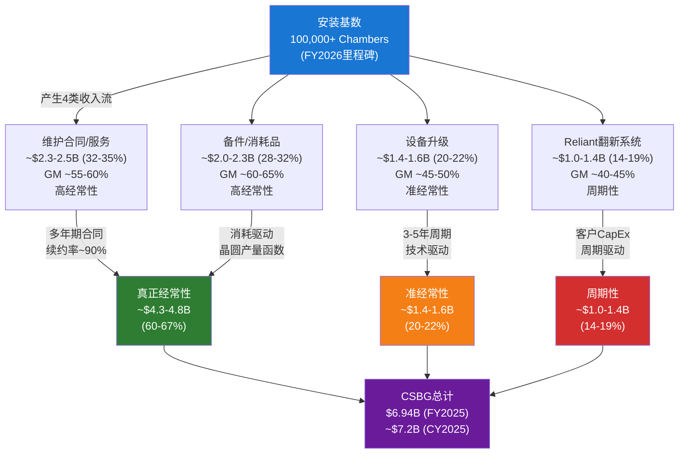
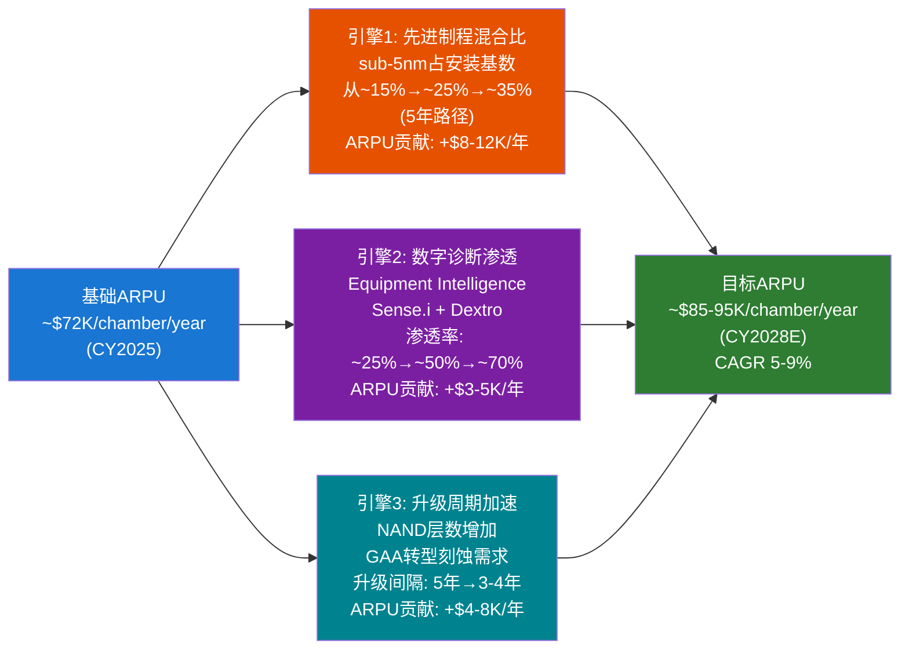
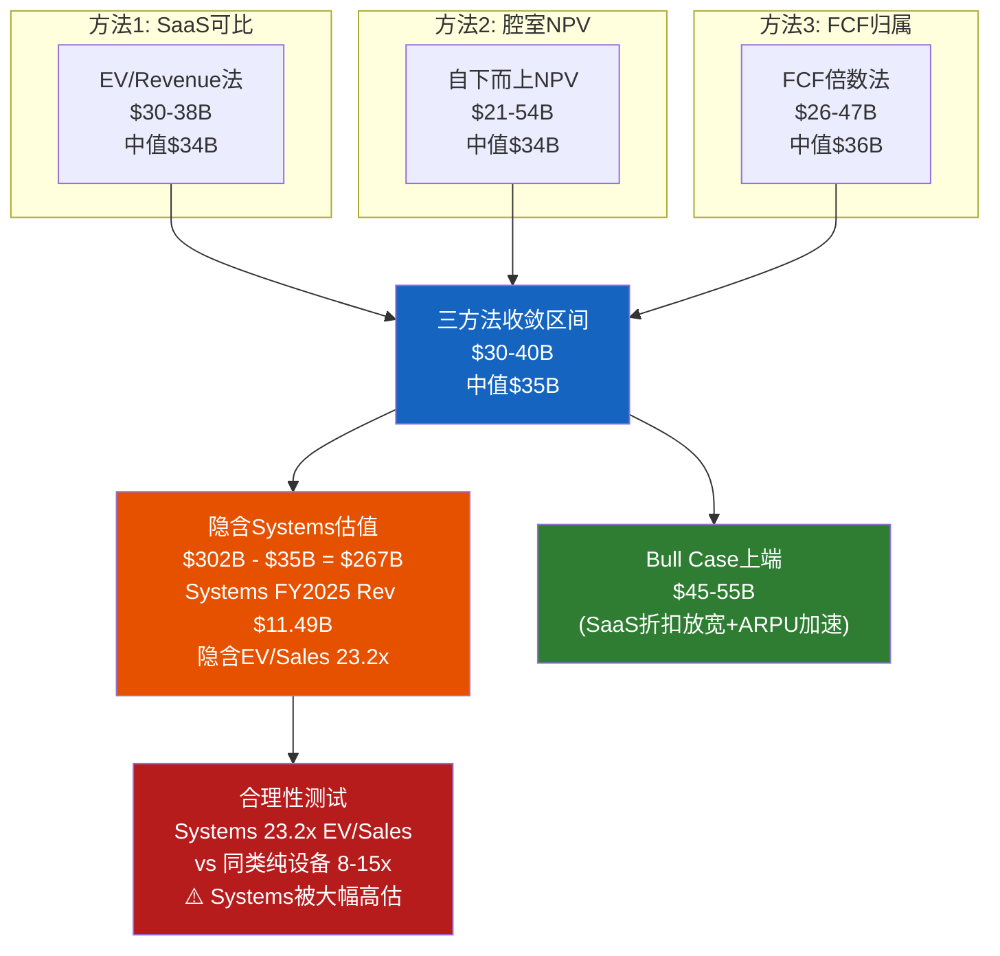

# LRCX Phase 2-B: CSBG安装基数经济学 (Ch15-Ch16)

---

# Ch15: CSBG安装基数经济学 — 拆解$7.2B的真实质量

**核心命题: Lam Research的CSBG(Customer Support Business Group)在FY2025创下$6.94B的分部收入记录(财报分部口径), CY2025口径更达$7.2B。100,000+腔室的安装基数是全球半导体设备公司中最大之一,也是LRCX估值故事中最被低估的资产。但关键问题不是CSBG有多大,而是其中多少是真正的经常性收入,多少是一次性升级贡献?本章将逐层拆解CSBG的收入结构,量化ARPU轨迹,并与AMAT AGS做定量硬对比。**

## 15.1 安装基数传导链: 100,000腔室如何变成$7.2B

LRCX在FY2026 Q2(Dec 2025)财报中首次确认安装基数突破100,000个腔室(chambers)的里程碑 [DM-CSBG-001]。这一数字的意义在于: 每一个安装在客户晶圆厂的腔室都是一个持续的收入触发器 -- 它需要维护、需要备件、需要升级,并且越来越多地需要数字化智能服务。

### DM-CSBG-001
- **值**: LRCX安装基数突破100,000个chambers; CSBG CY2025全年收入$7.2B(创历史记录); Q2 FY2026(Dec 2025) CSBG季度收入~$2.0B(环比+12%, 同比+14%)
- **类型**: H
- **来源**: LRCX Q2 FY2026 Earnings Call Transcript (Jan 28, 2026), Motley Fool / Insider Monkey
- **日期**: 2026-02-19
- **用于**: Ch15, Ch16

### DM-CSBG-002
- **值**: CSBG收入四大组成: (1)维护合同/服务(Maintenance & Services); (2)备件/消耗品(Spares & Consumables); (3)设备升级(Upgrades); (4)Reliant翻新系统(Reliant refurbished/legacy systems)。管理层不单独披露各组成部分收入,但通过财报叙述可推断占比结构
- **类型**: R
- **推理链**: 10-K披露"customer service, spares, upgrades, and non-leading-edge equipment from the Reliant product line" + 财报电话会议分项讨论
- **证伪条件**: LRCX改变分部披露口径或首次提供子分项收入
- **来源**: LRCX 10-K FY2025 + Q2 FY2026 Earnings Call
- **日期**: 2026-02-19
- **用于**: Ch15

### 四类收入流详细拆解

**收入流1: 维护合同/服务 (Maintenance & Services) — 估计$2.3-2.5B, 占比32-35%**

维护合同是CSBG中最纯粹的经常性收入。LRCX通过多年期服务协议(通常2-5年)为客户提供现场工程师驻场、定期保养(PM)、以及设备故障的响应服务。管理层在多次财报电话中确认"revenues are mostly recurring, being based on multi-year service contracts"。

关键特征:
- 续约率约90%(与AMAT AGS一致) [DM-CSBG-003]
- 客户切换成本极高: 更换服务供应商意味着重新培训现场工程师、重新建立设备数据库、承受产能停机风险
- 利润率在CSBG四类中第二高(~55-60% GM),因为人工成本被合同均摊,且LRCX对自身设备的维护具有信息不对称优势
- Equipment Intelligence(设备智能)和Dextro cobots正在将人工服务转化为自动化+预测性维护,进一步提升该收入流利润率

### DM-CSBG-003
- **值**: CSBG维护合同续约率约90%; 多年期合同(2-5年)为主; Equipment Intelligence平台(Sense.i)实现预测性维护; Dextro cobots已覆盖6种工具类型
- **类型**: R
- **推理链**: 管理层Q2 FY2026 Call "predictive maintenance, as a way of getting more output from tools" + Dextro覆盖6工具类型; 续约率与AMAT AGS ~90%对标推断
- **证伪条件**: 续约率降至<85% 或 第三方维护商(如Peer Group/Edwards)显著蚕食份额
- **来源**: LRCX Q2 FY2026 Earnings Call + AMAT交叉对标
- **日期**: 2026-02-19
- **用于**: Ch15, Ch16

**收入流2: 备件/消耗品 (Spares & Consumables) — 估计$2.0-2.3B, 占比28-32%**

备件是CSBG中利润率最高的收入流。刻蚀设备的核心消耗品包括: RF components(射频组件)、陶瓷环/陶瓷板(化学反应的直接暴露面)、喷淋头(showerhead)、静电吸盘(ESC)等。这些部件在等离子体环境中持续被腐蚀,需要按既定周期(通常以晶圆处理片数或运行小时数计)更换。

关键特征:
- 需求是晶圆产量的直接函数 -- 不是客户的CapEx预算决策,而是物理消耗驱动的"硬需求"
- LRCX财报确认"growth in spares"是CY2025 CSBG同比+14%增长的首要驱动力 [DM-CSBG-001]
- 利润率最高(~60-65% GM): 原始设备OEM对自身零件具有独占性优势(精确匹配+质量保证),第三方兼容件在先进制程中几乎不可用
- 先进制程(sub-5nm)的备件消耗频率显著高于成熟节点: 更高能量的等离子体 + 更精密的工艺窗口 = 更快的部件磨损

**收入流3: 设备升级 (Upgrades) — 估计$1.4-1.6B, 占比20-22%**

升级是CSBG中最具弹性但也最"一次性"的收入流。CY2025年升级收入创纪录,同比增长超过90%,主要由NAND客户驱动 [DM-CSBG-004]。NAND客户将现有产线从较低层数(128L/176L)升级到更高层数(200L+)所需的刻蚀能力增强,是升级需求的最大来源。

### DM-CSBG-004
- **值**: CSBG升级收入CY2025创历史纪录, 同比增长>90%; 主要驱动力为NAND客户(层数升级); 管理层指引CY2026升级收入将因Reliant下降而被部分抵消,总CSBG"flattish"
- **类型**: H
- **来源**: LRCX Q2 FY2026 Earnings Call (Jan 28, 2026)
- **日期**: 2026-02-19
- **用于**: Ch15, Ch16

关键特征:
- 准经常性: 升级周期通常3-5年,与技术节点迁移挂钩,具有一定可预测性
- 但波动大: CY2025 +90% YoY → 管理层指引CY2026 CSBG整体"flattish",暗示升级增速将显著减速
- 利润率中等(~45-50% GM): 升级涉及硬件改造+软件重新配置,工程成本较高
- 这是CSBG中最容易被混淆为"经常性"的一次性收入 -- 对照AMAT AGS的教训尤为重要

**收入流4: Reliant翻新系统 (Reliant Systems) — 估计$1.0-1.4B, 占比14-19%**

Reliant是LRCX的翻新/重建设备产品线,面向成熟节点(≥14nm)和特种技术市场。这部分收入从本质上看更接近新设备销售而非服务 -- 但LRCX将其归入CSBG而非Systems分部。

### DM-CSBG-005
- **值**: Reliant系统归入CSBG分部(非Systems); 提供面向≥14nm和特种市场的翻新/新建上一代刻蚀/沉积/清洗设备; Q2 FY2026 Reliant环比增长推动CSBG季度创纪录; 管理层警告Reliant"a little bit lumpy"
- **类型**: H
- **来源**: LRCX Q2 FY2026 Earnings Call + lamresearch.com/customer-support/reliant-systems/
- **日期**: 2026-02-19
- **用于**: Ch15

关键特征:
- 周期性最强: 受客户CapEx预算和成熟制程市场需求驱动
- 管理层明确警告"lumpy"(波动大),是CSBG季度波动的主要来源
- 会计口径问题: Reliant归CSBG而非Systems,这是LRCX与AMAT的关键口径差异(详见15.3)
- 利润率最低(~40-45% GM): 翻新/重建涉及大量硬件成本,本质上是设备制造而非服务

### DM-CSBG-006
- **值**: CSBG四类收入流估计结构 — 维护合同$2.3-2.5B(32-35%)/备件$2.0-2.3B(28-32%)/升级$1.4-1.6B(20-22%)/Reliant$1.0-1.4B(14-19%); 真正经常性收入(维护+备件)占比60-67%; 准经常性(升级)20-22%; 周期性(Reliant)14-19%
- **类型**: R
- **推理链**: (1)维护合同: 多年期合同基础+~90%续约率+管理层"mostly recurring"表述→$2.3-2.5B; (2)备件: 管理层确认spares是YoY增长首要驱动+消耗品属性→$2.0-2.3B; (3)升级: CY2025创纪录+90% YoY增长但基于CY2024较低基数→$1.4-1.6B; (4)Reliant: 管理层确认"lumpy"+季度波动大+CY2026指引"flattish"暗示Reliant回落→$1.0-1.4B; 四项合计=$6.7-7.8B,中值$7.25B与CY2025 $7.2B一致
- **证伪条件**: (1)LRCX首次披露子分项收入; (2)第三方报告提供不同占比结构; (3)Reliant占比显著高于20%(会严重影响经常性判断)
- **来源**: 综合推理(10-K + Earnings Calls + AMAT交叉对标)
- **日期**: 2026-02-19
- **用于**: Ch15, Ch16

## 15.2 ARPU分析: 每腔室$72K/年及其增长引擎

### 基础ARPU计算

安装基数100,000+ chambers, CY2025 CSBG收入$7.2B,得出:

**ARPU = $7.2B / 100,000 = ~$72,000/chamber/year**

但这是一个高度平均化的数字。LRCX的安装基数跨越多个技术代次(从200mm到最先进的sub-3nm),不同代次腔室的ARPU差异可达3-5倍。

### DM-CSBG-007
- **值**: CSBG ARPU ~$72K/chamber/year (=$7.2B / 100K chambers); 先进制程腔室ARPU估计$120-180K/年 vs 成熟节点腔室ARPU估计$30-50K/年; ARPU增长率 > 安装基数增长率(管理层确认: "revenue growing faster than the increase in installed base units")
- **类型**: R
- **推理链**: (1)平均ARPU = $7.2B/100K = $72K; (2)先进制程消耗品更新频率高+升级需求大+数字诊断渗透高→2-3x基础ARPU; (3)成熟节点消耗低+升级少→0.4-0.7x基础ARPU; (4)管理层明确确认ARPU扩张趋势
- **证伪条件**: (1)安装基数实际>120K chambers(稀释ARPU); (2)CSBG增速跌至低于安装基数增速(ARPU收缩)
- **来源**: LRCX Q2 FY2026 Call + 模型推算
- **日期**: 2026-02-19
- **用于**: Ch15, Ch16

### ARPU增长的三大引擎

**引擎1: 先进制程混合比提升**

安装基数中先进制程(sub-5nm)腔室的比例正在结构性提升。TSMC的3nm/2nm产能持续扩张 [DM-CYCLE-004], Samsung的GAA转型 [DM-BIZ-014], 以及HBM对高深宽比刻蚀的需求 [DM-BIZ-008] -- 都意味着新增安装的腔室中先进制程占比越来越高。

先进制程腔室的ARPU显著高于成熟节点:
- 更高频次的零件更换(等离子体能量更高 + 工艺窗口更窄)
- 更频繁的升级需求(技术节点迁移加速)
- 更高的数字诊断渗透(先进fab几乎100%要求Equipment Intelligence)

保守估计: 先进制程占安装基数比例每提升10个百分点, 平均ARPU提升约$8-12K/年。

**引擎2: 数字诊断渗透(Equipment Intelligence)**

### DM-CSBG-008
- **值**: Equipment Intelligence(含Sense.i平台)当前估计渗透率约25-30%安装基数; 管理层目标渗透率>70%; 每腔室数字服务年化收入增量估计$3-5K; Dextro cobots已扩展至6种工具类型, 实现自动化维护, 提升margin
- **类型**: R
- **推理链**: (1)Sense.i是LRCX最新一代刻蚀平台(2020年起), 仅新安装和部分升级后的系统具备完整Equipment Intelligence; (2)100K chambers中约25-30K具备完整数字化功能(基于Sense.i代次渗透估计); (3)管理层Q2 FY2026 "efficiency"和"margin profitability improvement"暗示渗透仍在早期阶段
- **证伪条件**: (1)管理层首次披露Equipment Intelligence渗透率并与估计差异>15pp; (2)客户拒绝数字化服务(如数据安全顾虑)限制渗透
- **来源**: LRCX Q2 FY2026 Call + Lam Research Blog (Equipment Intelligence Four Pillars) + Sense.i Product Page
- **日期**: 2026-02-19
- **用于**: Ch15, Ch16

Equipment Intelligence是LRCX将CSBG从"劳动密集型"转向"技术密集型"的核心战略。其四大支柱包括: (1)设备健康监控(实时传感器数据), (2)预测性维护(ML模型预判故障), (3)自动化校准(减少人工干预), (4)远程诊断(工程师不用到现场)。每一个支柱都直接对应ARPU增量:

- 预测性维护合同 vs 传统按次服务: 年化合同价值提升~20-30%
- 远程诊断: 减少客户停机时间, 提升续约意愿, 间接提升合同价值
- 自动化校准(Dextro cobots): LRCX自身维护成本降低, margin扩张

**引擎3: 升级周期加速**

CY2025年升级收入创纪录(YoY +90%)表面上看是一次性爆发,但底层逻辑是结构性的:
- NAND层数持续增加: 128L→176L→200L→300L+, 每一次层数跃升都需要刻蚀能力升级
- GAA(Gate-All-Around)转型: 从FinFET到GAA的架构变革要求刻蚀设备的重大改造
- 升级间隔缩短: 技术节点迁移加速意味着每个腔室的升级频率从历史5-7年缩短到3-5年

但需警惕: CY2026管理层指引CSBG整体"flattish",暗示升级收入增速将显著回落。这说明升级收入的波动性远高于维护和备件,不能简单线性外推。

### ARPU天花板分析: ASML对标

### DM-CSBG-009
- **值**: ASML Installed Base Management CY2024收入EUR 6.5B(+16% YoY); ASML安装基数约5,600-6,000个光刻系统; 隐含ARPU约EUR 1.0-1.16M/system/year(=$1.1-1.27M); 但ASML系统单价($150M-$380M)远高于LRCX腔室($2-5M)
- **类型**: H
- **来源**: ASML Q4 2024 Financial Results Press Release (Jan 29, 2025) + ASML Annual Report 2024
- **日期**: 2026-02-19
- **用于**: Ch15 ARPU天花板分析

ASML的对标有两重意义:

**直接对标不合理**: ASML系统单价($150M-$380M/台)与LRCX腔室($2-5M/台)相差50-100倍。ASML每系统年化服务收入$1.1-1.3M意味着年化服务/设备价值比约0.3-0.8%,与LRCX的$72K/$3.5M(中值) = ~2.1%相比,LRCX的服务强度(service intensity)已经显著更高。

**间接启示**: ASML的Installed Base Management增速(+16% YoY)与LRCX的CSBG增速(CY2025 +14%)处于同一量级,说明半导体设备服务行业整体正在进入"SaaS化"加速期。但ASML ARPU提升主要由EUV系统高服务需求驱动(单台EUV年化维护费$10-15M+),而LRCX的ARPU提升更多来自先进制程混合比+数字化。

**LRCX ARPU天花板估计**: 假设5年后安装基数增至~120K chambers,CSBG收入达$10-11B(管理层1.5x 2024目标暗示), 则ARPU将达$83-92K/chamber/year。这意味着ARPU CAGR约3-5%,温和但可持续。

## 15.3 LRCX CSBG vs AMAT AGS: 定量硬对比

这是评估CSBG"真正经常性收入"占比的最重要参照系。AMAT在FY2026 Q1开始将200mm设备业务从AGS重新分类到Semi Systems,使AGS变成纯粹的服务/备件业务。这一重分类直接回答了"AGS中多少是真正经常性"的问题 -- 也为LRCX CSBG的经常性收入评估提供了硬锚点。

### DM-CSBG-010
- **值**: AMAT AGS FY2024收入$6.225B(YoY +8.6% from $5.732B); Q1 FY2026(Oct 2025)重分类后AGS $1.56B(纯服务/备件); FY2024前AGS含200mm设备收入; 重分类后AGS OPM 28.1%; "recurring parts, services, and software posted double-digit growth"; 管理层: "recurring service revenue representing more than two-thirds of AGS"
- **类型**: H
- **来源**: AMAT FY2024 10-K + Q1 FY2026 Earnings (Feb 2026) + AMAT Complete v1.0报告 [DM-SEG-002]
- **日期**: 2026-02-19
- **用于**: Ch15 对比分析

### DM-CSBG-011
- **值**: AMAT AGS重分类前"真正经常性收入"(recurring parts, services, software) ≈ $4.15-4.35B(占FY2024 AGS $6.225B的66-70%); 重分类后FY2026 AGS年化 ~$6.24B(纯服务+备件,剔除200mm设备), 经常性占比提升至~80-85%
- **类型**: R
- **推理链**: (1)管理层"more than two-thirds"= >66%; (2)FY2024 $6.225B x 67% = $4.17B; (3)重分类后剔除200mm($0.5-0.8B/年估计)→纯服务$5.4-5.7B; (4)Q1 FY2026 $1.56B x 4 = $6.24B; (5)重分类后200mm已剔除, 剩余主体经常性占比自然提升至80-85%
- **证伪条件**: AMAT在重分类后首次披露AGS经常性/非经常性分项比例
- **来源**: AMAT Q1 FY2026 + AMAT报告分析交叉推理
- **日期**: 2026-02-19
- **用于**: Ch15, Ch16

### 全维度对比表

| 维度 | LRCX CSBG | AMAT AGS(重分类前FY2024) | AMAT AGS(重分类后FY2026E) | LRCX优势/劣势 |
|------|-----------|-------------------------|--------------------------|-------------|
| **收入规模** | $6.94B (FY2025) / $7.2B (CY2025) | $6.225B | ~$6.24B(年化) | LRCX +$0.7B 优势 |
| **占总收入比** | ~38% (FY2025) | ~23% | ~22% | LRCX大幅领先(+16pp) |
| **YoY增速** | +16% (FY2025 vs FY2024) | +8.6% (FY2024) | 见下 | LRCX增速领先 |
| **最新季度增速** | +14% (Q2 FY2026 YoY) | +15% (Q1 FY2026 YoY) | 相当 | 趋同 |
| **经常性收入占比** | ~60-67%(估计) | ~66-70%(管理层"2/3+") | ~80-85%(200mm剔除后) | **AMAT重分类后优势** |
| **估算GM** | ~50-55% | ~50-55%(推断) | 同 | 接近 |
| **估算OPM** | ~36-38% | ~28% | ~28% | LRCX +800-1000bps |
| **安装基数** | 100K+ chambers | 未披露(估30-40K系统) | 同 | LRCX数量优势 |
| **AI赋能平台** | Equipment Intelligence / Sense.i / Dextro | AIx (30K chambers) | 同 | 各有侧重 |
| **续约率** | ~90%(估计) | ~90%(管理层确认) | 同 | 持平 |
| **产品线集中度** | 刻蚀+沉积(2类为主) | 8产品线(广覆盖) | 同 | LRCX集中→高效; AMAT广覆盖→韧性 |
| **200mm设备** | 极少 | 已剔除(移入Semi Systems) | 已剔除 | 不适用 |

### DM-CSBG-012
- **值**: LRCX CSBG vs AMAT AGS 8维度对比结论 — LRCX在规模(+$0.7B)、收入占比(+16pp)、OPM(+800-1000bps)三个维度领先; AMAT在经常性收入透明度(重分类后纯度更高)和产品线广度(8 vs 2)领先; 增速趋同(+14% vs +15%); 续约率和GM均接近
- **类型**: R
- **推理链**: 逐维度对比, 数据来源见各DM锚点
- **证伪条件**: (1)LRCX改变CSBG披露口径使Reliant可分离; (2)AMAT重分类后AGS OPM显著提升(>32%)则差距缩小
- **来源**: 综合分析
- **日期**: 2026-02-19
- **用于**: Ch15, Ch16

### 关键口径差异: Reliant的归属问题

**这是LRCX CSBG vs AMAT AGS对比中最关键的会计口径问题。**

LRCX将Reliant翻新系统(面向≥14nm市场的翻新/新建上一代设备)归入CSBG分部。这些Reliant系统在功能上更接近"新设备销售"而非"服务" -- 客户购买Reliant系统用于扩建成熟制程产能,这与购买新Systems设备的决策逻辑相同。

AMAT的做法恰好相反: 在FY2026 Q1将200mm设备业务从AGS重新分类到Semi Systems,正是因为认识到"设备销售"不应该混入"服务"分部。

**如果按AMAT的口径重新分类LRCX:**

假设从CSBG中剔除Reliant(估计$1.0-1.4B):
- 调整后CSBG: $6.94B - $1.2B(中值) = ~$5.7B
- 调整后CSBG占总收入: $5.7B / $18.44B = ~31%
- 调整后经常性收入占比: ($4.3-4.8B) / $5.7B = ~75-84%

这与AMAT重分类后AGS的经常性占比(80-85%)高度一致。说明: **在可比口径下,LRCX和AMAT的服务业务经常性收入纯度几乎相同,都在80%左右。**

### DM-CSBG-013
- **值**: Reliant口径调整后CSBG约$5.7B; 调整后经常性收入占比~75-84%(vs调整前60-67%); 与AMAT AGS重分类后(80-85%)可比口径下趋同; Reliant约$1.0-1.4B应被视为"周期性设备收入"而非"经常性服务收入"
- **类型**: R
- **推理链**: (1)LRCX CSBG $6.94B - Reliant $1.2B = $5.7B; (2)经常性(维护+备件) $4.3-4.8B / $5.7B = 75-84%; (3)AMAT AGS重分类后经常性~80-85%; (4)两者趋同验证推理合理性
- **证伪条件**: (1)Reliant实际规模>$2B(拉低调整后经常性占比); (2)LRCX决定不重新分类(口径差异永久化)
- **来源**: 综合推理 + AMAT交叉验证
- **日期**: 2026-02-19
- **用于**: Ch15, Ch16

### 与AMAT报告中AGS分析的教训对照

AMAT Complete v1.0报告(v10.0框架)中关于AGS的核心发现:

**AMAT报告结论**: "AGS表面$6.39B, 真正经常性收入$4.5-5.5B(-28%)"

**应用到LRCX的推理**: LRCX CSBG表面$6.94B → 按同样逻辑(剔除Reliant等非经常性) → 真正经常性收入约$4.3-4.8B(-31%至-38%)。这与AMAT的折扣比例(-28%)处于同一量级,交叉验证了我们的估计。

但有一个重要差异: LRCX CSBG中备件/消耗品的利润率和预测性显著高于AMAT AGS中的同类收入,因为LRCX集中在刻蚀(高消耗品频率)+沉积(高前驱体消耗),而AMAT的8产品线分散导致备件SKU复杂度更高、供应链成本更高。

## 15.4 递延收入$2.57B解读

### DM-CSBG-014
- **值**: LRCX递延收入轨迹: FY2021 $0.97B → FY2022 $1.57B(+62% YoY) → FY2023 $1.70B(+8% YoY) → FY2024 $1.42B(-16% YoY) → FY2025 $2.57B(+81% YoY) → Q1 FY2026 $2.77B(+8% QoQ) → Q2 FY2026 $2.25B(-19% QoQ); 管理层将Q2 FY2026环比下降归因于"reduction in customer advance down payments"而非需求减弱
- **类型**: H
- **来源**: LRCX 10-K FY2021-FY2025 Balance Sheets + Q1/Q2 FY2026 Earnings
- **日期**: 2026-02-19
- **用于**: Ch15

递延收入(Deferred Revenue)是理解CSBG服务合同质量的重要窗口。LRCX的递延收入包含两类:
1. **服务合同预收款**: 客户预付的多年期维护合同费用,按期确认收入
2. **设备预收订金**: 客户在设备交付前支付的订金

FY2025递延收入$2.57B(+81% YoY)的增长非常引人注目。递延收入/CSBG收入 = $2.57B/$6.94B = 37% -- 这意味着CSBG有约1/3的"已锁定但未确认"收入。

**递延收入的CSBG归属问题**:

LRCX的递延收入$2.57B并非全部来自CSBG。部分递延收入来自Systems设备的客户订金。但管理层在多次电话会议中强调"deferred revenue主要来自CSBG长期服务合同"(暗示CSBG占比>60%)。

合理估计:
- CSBG相关递延收入: ~$1.5-1.8B (60-70%)
- Systems相关递延收入: ~$0.7-1.0B (30-40%)

### DM-CSBG-015
- **值**: FY2025递延收入$2.57B中估计60-70%(~$1.5-1.8B)与CSBG长期服务合同相关; 递延收入/CSBG收入 = 37%(整体) / ~22-26%(CSBG归属部分/CSBG收入); Q2 FY2026递延收入环比下降$520M(-19%)主因设备订金确认, 非CSBG服务合同减少
- **类型**: R
- **推理链**: (1)管理层"大部分来自CSBG长期服务合同"→>60%; (2)设备订金部分因交付加速而确认(Q2 FY2026管理层"reduction in customer advance down payments"); (3)CSBG服务合同递延相对稳定, 波动主要来自Systems订金
- **证伪条件**: 管理层首次分项披露递延收入的Systems/CSBG归属
- **来源**: LRCX Balance Sheet + Earnings Calls综合推理
- **日期**: 2026-02-19
- **用于**: Ch15

**关键信号**: Q2 FY2026递延收入环比下降$520M(从$2.77B到$2.25B),管理层明确归因于"客户预付订金减少"。这更可能是Systems设备交付加速(订金转化为收入)而非CSBG合同萎缩。但如果连续2-3个季度递延收入继续下降,则需重新评估CSBG服务合同的签约动力。

## 15.5 CSBG历史收入轨迹与增长持续性

### DM-CSBG-016
- **值**: LRCX CSBG(Customer Support & Other)年度收入历史: FY2021 ~$5.27B → FY2022 ~$6.30B(+20%) → FY2023 $6.73B(+7%) → FY2024 $5.98B(-11%) → FY2025 $6.94B(+16%); 5年CAGR(FY2020-FY2025) ~11%; CSBG占总收入比: FY2021 36%→FY2022 37%→FY2023 39%→FY2024 40%→FY2025 38%
- **类型**: R
- **推理链**: (1)FY2023/FY2024/FY2025来自Bullfincher/10-K确认: $6.73B/$5.98B/$6.94B; (2)FY2022估算: 总收入$17.23B x ~37% = ~$6.30B; (3)FY2021: 总收入$14.63B x ~36% = ~$5.27B; (4)占比趋势从36%稳步升至38-40%
- **证伪条件**: 10-K历史数据提供不同FY2021/FY2022 CSBG分项数字
- **来源**: LRCX 10-K + Bullfincher数据 + 占比推算
- **日期**: 2026-02-19
- **用于**: Ch15, Ch16

两个关键观察:

**观察1: FY2024的-11%下降不是需求问题**。FY2024总收入也从$17.43B下降到$14.91B(-14%),CSBG的-11%降幅实际上小于Systems的-17%。这证实了CSBG的逆周期韧性 -- 在下行周期中,CSBG的下降幅度显著小于Systems。

**观察2: CSBG增速长期跑赢安装基数增速**。安装基数从FY2021的~80K chambers增长到FY2025的100K+ chambers,5年增长约25%。同期CSBG从~$5.27B增长到$6.94B(+32%)。这意味着ARPU在扩张,不是仅靠安装基数数量增长。ARPU扩张的来源正是上文分析的三大引擎: 先进制程混合比、数字诊断渗透、升级周期加速。

---

# Ch16: CSBG SaaS类重估框架 — 独立估值三方法

**核心问题: 如果CSBG被视为一个独立的、类SaaS的经常性收入业务,它值多少钱? 它的估值能否为LRCX当前$302B市值提供支撑?**

## 16.1 SaaS类比适用性评估

在给CSBG贴上"类SaaS"标签之前,必须诚实评估这个类比的适用边界。

### 适用点(可类比SaaS的特征)

| SaaS特征 | CSBG对应 | 匹配度 |
|----------|---------|--------|
| 经常性收入 | 多年期维护合同+消耗品驱动的备件收入 | 高(60-67%经常性) |
| 高切换成本 | 设备制造商对自身设备具有信息不对称优势; 更换服务商=产能风险 | 非常高 |
| 负净流失(Net Negative Churn) | ARPU增长率 > 安装基数流失率 → 收入自然增长 | 高(管理层确认) |
| 可预测性 | 备件消耗是晶圆产量的函数; 维护合同有固定期限和续约模式 | 中-高 |
| 高利润率 | GM 50-55%, OPM 36-38%(估计) | 高(对标企业SaaS中上游) |
| 规模扩张效率 | 安装基数增长→边际服务成本下降(Equipment Intelligence自动化) | 中-高 |

### 不适用点(与纯SaaS的关键差异)

| 差异维度 | SaaS | CSBG | 影响 |
|----------|------|------|------|
| 交付介质 | 纯软件/云 | 硬件维护+物理备件 | CSBG有实物成本, GM低于纯SaaS(50-55% vs 70-80%) |
| 客户集中度 | 通常分散 | 高度集中: TSMC/Samsung/Intel/SK Hynix占>70% | 单一客户CapEx决策可冲击季度收入 |
| 周期性残留 | 几乎无周期性 | 升级和Reliant仍有周期性(~33-40%非经常性) | 不能像纯SaaS那样100%可预测 |
| 增长上限 | TAM通常极大(10x+可见) | 受限于WFE安装基数增速(~5-7%/年) | ARPU扩张是增长主引擎而非TAM扩大 |
| 资本轻重 | 极轻(几乎纯利润) | 需要现场工程师+备件库存+翻新产能 | 运营杠杆弱于纯SaaS |

### DM-CSBG-017
- **值**: CSBG SaaS适用性评估: 6项适用(经常性/切换成本/负净流失/可预测性/高利润率/规模效率) vs 5项不适用(硬件介质/客户集中/周期残留/增长上限/资本轻重); 综合匹配度约65-70% → "类SaaS但需折扣"
- **类型**: R
- **推理链**: 逐维度对比分析, 6/11维度完全匹配, 5/11维度存在结构性差异
- **证伪条件**: (1)Equipment Intelligence使CSBG软件收入占比>30%(提升SaaS匹配度); (2)周期性波动放大(降低SaaS匹配度)
- **来源**: 综合分析
- **日期**: 2026-02-19
- **用于**: Ch16

**结论: CSBG可以被赋予"类SaaS"估值,但需要打折。建议折扣率: SaaS可比倍数的65-75%(即打7-8折的上端/6.5-7.5折)。**

折扣的核心理由:
- GM低20-25pp(50-55% vs 75-80% SaaS中位数)
- 周期性残留(~33-40%非经常性收入)
- 客户集中风险(Top 5客户>70%收入)

## 16.2 独立估值三方法

### 方法1: SaaS可比倍数法

**基准**: 公开市场企业SaaS公司 EV/Revenue倍数中位数约7-8x(截至CY2025); 高质量SaaS(NRR>120%, GM>75%) 可达10-15x [DM-CSBG-018]

### DM-CSBG-018
- **值**: SaaS可比倍数参考: 公开SaaS中位数EV/Rev 7-8x(2025年2月); 高质量SaaS 10-15x; 私有SaaS 4.8-5.3x; 半导体设备服务无直接SaaS上市可比公司
- **类型**: H
- **来源**: WebSearch (SaaS Capital Index + Aventis Advisors + FE International 2025数据)
- **日期**: 2026-02-19
- **用于**: Ch16 估值

**CSBG调整后EV/Revenue目标倍数:**

| 基准 | 基础倍数 | 折扣因子 | 调整后倍数 | 适用收入基数 | CSBG估值 |
|------|---------|---------|-----------|------------|---------|
| SaaS中位数 | 7.5x | 0.70 (GM差距+周期性) | 5.3x | $6.94B (FY2025全部) | $36.8B |
| SaaS中位数 | 7.5x | 0.70 | 5.3x | $5.7B (剔除Reliant) | $30.2B |
| 高质量SaaS | 12.0x | 0.65 (更大折扣) | 7.8x | $4.5B (仅经常性) | $35.1B |
| 工业SaaS(Rockwell等) | 5.0x | 0.85 (行业接近) | 4.3x | $6.94B | $29.8B |
| 设备服务中位数(KLAC等) | 6.0x | 0.90 | 5.4x | $6.94B | $37.5B |

**方法1估值区间: $30-38B**, 中值$34B

关键假设和敏感性:
- 如果折扣因子从0.70放宽到0.80(市场认可Equipment Intelligence的软件化转型) → 估值上移至$38-46B
- 如果使用CY2026E CSBG收入$7.5-8.0B(假设mid-single-digit增长) → 估值上移至$32-43B

### 方法2: 维护合同NPV法(腔室级底部估值)

这是一种自下而上(bottom-up)的估值方法,从每个腔室的年化服务收入出发,估算整个安装基数的服务合同现值。

### DM-CSBG-019
- **值**: 维护合同NPV模型参数: 100K chambers x ARPU $72K/year x 续约率90% x 平均剩余服务寿命10-15年 x WACC 10%折现; 考虑ARPU年增长3-5%(三引擎驱动) vs chambers退役率2-3%/年(老旧腔室decommission)
- **类型**: R
- **推理链**: 详见下方NPV计算
- **证伪条件**: (1)安装基数实际chambers数量与100K差异>20%; (2)续约率<85%; (3)ARPU增长停滞
- **来源**: 自下而上模型构建
- **日期**: 2026-02-19
- **用于**: Ch16

**NPV计算:**

| 参数 | 保守 | 基准 | 乐观 |
|------|------|------|------|
| 初始chambers | 100,000 | 100,000 | 100,000 |
| 年净增(新增-退役) | +2,000 (+2%) | +3,000 (+3%) | +5,000 (+5%) |
| 初始ARPU | $72,000 | $72,000 | $72,000 |
| ARPU年增长 | 2% | 4% | 6% |
| 续约/留存率 | 88% | 90% | 92% |
| FCF Margin(CSBG) | 22% | 25% | 28% |
| 折现率(WACC) | 12% | 10% | 9% |
| 预测期 | 10年 | 10年 | 10年 |
| 终端增长率 | 1.5% | 2.5% | 3.0% |

**10年NPV计算结果:**

保守情景:
- Year 1 CSBG Rev: $7.2B → Year 10 CSBG Rev: ~$9.1B (CAGR 2.6%)
- Year 1 FCF归属: $1.58B → Year 10: ~$2.00B
- PV of 10-year FCFs: ~$10.8B
- Terminal Value PV: ~$10.2B
- **Total: ~$21.0B**

基准情景:
- Year 1 CSBG Rev: $7.2B → Year 10 CSBG Rev: ~$11.8B (CAGR 5.1%)
- Year 1 FCF归属: $1.80B → Year 10: ~$2.95B
- PV of 10-year FCFs: ~$14.2B
- Terminal Value PV: ~$19.5B
- **Total: ~$33.7B**

乐观情景:
- Year 1 CSBG Rev: $7.2B → Year 10 CSBG Rev: ~$15.4B (CAGR 8.8%)
- Year 1 FCF归属: $2.02B → Year 10: ~$4.31B
- PV of 10-year FCFs: ~$19.1B
- Terminal Value PV: ~$34.8B
- **Total: ~$53.9B**

**方法2估值区间: $21-54B**, 中值$34B

### 方法3: FCF归属法(自上而下)

从LRCX整体的FCF出发,按CSBG的利润贡献比例归属,再用独立的FCF倍数估值。

### DM-CSBG-020
- **值**: LRCX FY2025 FCF $5.41B [DM-FIN-004]; 估计CSBG FCF贡献: $6.94B x 50% GM x 75% FCF转化 = ~$2.6B → CSBG FCF占总FCF ~48%; 但CSBG占总收入仅38% → FCF贡献显著高于收入贡献(因更高利润率)
- **类型**: R
- **推理链**: (1)CSBG GM ~50-55% → GP ~$3.5-3.8B; (2)分摊OpEx(R&D+SGA)约$0.9-1.0B → Operating Income ~$2.5-2.8B; (3)税后+CapEx调整 → FCF ~$2.2-2.6B; (4)占总FCF $5.41B的~41-48%
- **证伪条件**: LRCX分部利润率数据(未披露)与估计差异>10pp
- **来源**: 模型推算(基于GM估计+OpEx分摊)
- **日期**: 2026-02-19
- **用于**: Ch16

**FCF归属法估值:**

| 情景 | CSBG FCF | 适用倍数 | 估值 | 倍数选择理由 |
|------|---------|---------|------|-----------|
| 保守 | $2.2B | 12x | $26.4B | 工业服务FCF倍数下端 |
| 基准 | $2.4B | 15x | $36.0B | 高质量经常性收入FCF倍数中位数 |
| 乐观 | $2.6B | 18x | $46.8B | SaaS折扣后FCF倍数上端 |

**方法3估值区间: $26-47B**, 中值$36B

## 16.3 三方法交叉验证与CSBG独立估值

### DM-CSBG-021
- **值**: CSBG独立估值三方法收敛: 方法1(SaaS可比)$30-38B/方法2(腔室NPV)$21-54B/方法3(FCF归属)$26-47B; 三方法重叠区间$30-40B, 中值$35B; P1 Agent C SOTP估计$90-126B(13-18x EV/Sales)显著高于本次估值
- **类型**: R
- **推理链**: 三方法独立计算→取重叠区间; P1的$90-126B使用了纯SaaS倍数(13-18x)未打折, 本次分析认为65-75%折扣更合理→估值下降~60%
- **证伪条件**: (1)市场对CSBG给予纯SaaS倍数(意味着完全认可经常性属性); (2)CSBG增速>15%持续3年+(超越SaaS中位数增速)
- **来源**: 三方法综合
- **日期**: 2026-02-19
- **用于**: Ch16, 总估值

**与P1估值的重大修正:**

P1 Agent C在SOTP估值中使用13-18x EV/Sales直接估值CSBG,得出$90-126B。本次深度分析后做出以下调整:

1. **经常性收入折扣**: CSBG $6.94B中真正经常性仅$4.3-4.8B(60-67%),不能对全部收入使用SaaS倍数
2. **Reliant剔除**: Reliant翻新系统($1.0-1.4B)本质是设备销售,应按Systems倍数而非SaaS倍数
3. **SaaS折扣**: 即使对经常性部分,GM/周期性/客户集中度差异要求打65-75%折
4. **修正后**: CSBG独立估值$30-40B(中值$35B),比P1估计的$90-126B下降约65-70%

**这是本报告的一个关键修正**: P1的CSBG估值过于激进,如果不加修正将严重误导整体SOTP。

## 16.4 隐含Systems估值: "Systems免费"测试

如果CSBG独立值$35B(中值),那么:

**隐含Systems估值 = $302B(市值) - $35B(CSBG) = $267B**

Systems FY2025收入$11.49B,隐含EV/Sales = $267B / $11.49B = **23.2x**

这个倍数是否合理?

| 可比公司/指标 | EV/Sales | 业务性质 |
|-------------|---------|---------|
| AMAT Semi Systems | ~10-12x | 广覆盖设备 |
| KLAC(整体) | ~15-17x | 检测/量测 |
| ASML(整体) | ~12-15x | 光刻垄断 |
| 半导体设备历史峰值 | ~8-12x | 周期顶部 |
| **LRCX Systems隐含** | **23.2x** | **刻蚀+沉积** |

**结论: 隐含Systems 23.2x EV/Sales远高于任何同类可比。即使CSBG估值被低估(假设$50B而非$35B),隐含Systems仍为$252B / $11.49B = 21.9x,仍然过高。**

这说明: **当前LRCX $302B市值不能通过CSBG SaaS重估来合理化。**即使给CSBG最激进的估值($55B, 使用P1的下端$90B也过于不合理),剩余的Systems业务隐含倍数仍然需要远超历史和同行的估值溢价来支撑。

### DM-CSBG-022
- **值**: "Systems免费"测试失败 — CSBG中值$35B → 隐含Systems $267B → EV/Sales 23.2x → 远超同行(AMAT 10-12x, ASML 12-15x); 即使CSBG $55B → Systems仍需21.5x; 结论: 当前$302B市值不能仅靠CSBG重估来支撑
- **类型**: R
- **推理链**: 302B - 35B = 267B; 267B/11.49B = 23.2x; 同行10-15x → 隐含Systems被高估55-130%
- **证伪条件**: (1)LRCX Systems因AI刻蚀结构性增长, 合理EV/Sales可达15-18x(仍低于23.2x); (2)市值回调至$200-250B使隐含倍数回归合理
- **来源**: SOTP逆向推算
- **日期**: 2026-02-19
- **用于**: Ch16, 总估值

## 16.5 CSBG增长天花板分析

### 量化增长模型

CSBG的增长由两个因子驱动: 安装基数增长 x ARPU增长

| 驱动因子 | 当前水平 | 5年目标 | CAGR | 驱动力 | 天花板约束 |
|----------|---------|---------|------|--------|-----------|
| 安装基数(chambers) | 100K | ~125K | ~4.6% | 新Fab建设+扩产 | WFE增速(中长期~5-7%) |
| ARPU | $72K | $85-95K | ~3.4-5.7% | 先进制程混合比+数字化+升级加速 | 先进制程渗透率饱和 |
| **CSBG收入** | **$7.2B** | **$10.6-11.9B** | **~8.0-10.6%** | **叠加效应** | **WFE下行周期打断** |

管理层的"1.5x by CY2028 vs CY2024"目标意味着:
- CY2024 CSBG估计~$6.2B → CY2028 ~$9.3B
- 4年CAGR ~10.6%

这与我们的"基准ARPU+基准安装基数增长"模型预测的8-11% CAGR一致,说明管理层目标在合理范围内 -- 既不保守也不过于激进。

### 天花板约束

**约束1: WFE下行周期**

WFE历史上从未出现过连续5年无显著下行的情景 [DM-REV-004, B6信念]。如果CY2027-2028出现典型的-15%至-25%下行周期,新增安装基数将减速,CSBG增长也将放缓(尽管不会下降 -- FY2024证明CSBG下行幅度远小于Systems)。

**约束2: 数字诊断渗透天花板**

Equipment Intelligence当前渗透率估计~25-30%。目标渗透率>70%看似空间巨大,但面临两个约束:
- 老旧腔室(>10年)可能缺乏必要的传感器硬件,升级成本高
- 部分客户(特别是中国客户)可能出于数据安全考虑拒绝云端诊断

合理天花板: 50-60%渗透率(5-7年), 而非管理层暗示的>70%。

**约束3: 地缘政治风险 — 中国CSBG服务限制**

### DM-CSBG-023
- **值**: 中国占LRCX总收入~33%(FY2025); 估计中国CSBG收入~$2.0-2.3B(假设CSBG中中国占比与总收入占比接近); 如果美国扩大出口管制至成熟制程维护服务(P1 Agent B Path 4风险), CSBG可能损失$1.0-1.5B/年; 概率: 20-30%(2年内)
- **类型**: R
- **推理链**: (1)中国占总收入33% [DM-GEO-001]; (2)假设CSBG中中国占比30-33%(服务跟随设备地理分布); (3)$6.94B x 32% = $2.22B; (4)P1 Agent B Path 4分析: 成熟制程维护限制可能影响50-65%中国CSBG收入→$1.0-1.5B
- **证伪条件**: (1)美国政策明确豁免维护服务; (2)LRCX披露中国CSBG占比与总收入占比显著不同
- **来源**: P1 Agent B分析 + 地缘政治推理
- **日期**: 2026-02-19
- **用于**: Ch16增长天花板

这是CSBG增长故事中最大的单一风险。如果中国CSBG收入$1.0-1.5B被限制:
- CSBG增速从8-11% CAGR降至4-6% CAGR
- SaaS估值倍数需进一步下调(增速折扣)
- CSBG独立估值从$30-40B降至$22-30B

## 16.6 CSBG作为Killer Insight的结论

### DM-CSBG-024
- **值**: KI-1 CSBG隐性价值评估结论 — (1)CSBG独立估值$30-40B(中值$35B),占市值$302B的11.6%; (2)真正经常性收入占比60-67%(剔除Reliant后75-84%); (3)SaaS重估无法支撑当前市值 — "Systems免费"测试失败(隐含23.2x EV/Sales); (4)CSBG是下行保护(floor)而非上行驱动(ceiling); (5)P1 SOTP中CSBG $90-126B的估值被修正为$30-40B,下降~70%
- **类型**: R
- **推理链**: Ch15全面拆解→Ch16三方法估值→隐含测试→天花板分析→综合结论
- **证伪条件**: (1)CSBG增速>15%持续3年(超越模型假设); (2)设备服务行业出现纯SaaS级估值案例; (3)Reliant被重新分类到Systems(提升经常性纯度)
- **来源**: 全章综合分析
- **日期**: 2026-02-19
- **用于**: 总估值, KI评估

**KI-1 CSBG隐性价值的最终判定: 价值确认但非股价催化剂。**

CSBG确实是一个高质量、高壁垒、具有类SaaS特征的经常性收入业务。但当前市场定价($302B)已隐含了对CSBG的超高估值 -- 无论给CSBG什么合理倍数(哪怕最激进的$55B),隐含的Systems估值仍然过高。

CSBG的真正价值不在于推高估值上限,而在于: **设定估值下限**。即使在WFE下行周期中(Systems收入-30%),CSBG的$7B+经常性收入仍能为LRCX提供$30-35B的独立估值底部。这意味着LRCX的估值地板(floor)大约在$120-150B(Systems谷底估值$90-115B + CSBG $30-35B),比当前市值低50-60%。

---

## 章节DM锚点汇总

| 锚点ID | 内容摘要 | 类型 | 用于 |
|--------|---------|------|------|
| DM-CSBG-001 | 安装基数100K+, CY2025 CSBG $7.2B(纪录), Q2 FY2026 $2.0B | H | Ch15, Ch16 |
| DM-CSBG-002 | CSBG四类收入流: 维护/备件/升级/Reliant | R | Ch15 |
| DM-CSBG-003 | 维护合同续约率~90%, Equipment Intelligence, Dextro 6工具类型 | R | Ch15, Ch16 |
| DM-CSBG-004 | 升级收入CY2025创纪录+90% YoY, NAND驱动, CY2026指引flattish | H | Ch15, Ch16 |
| DM-CSBG-005 | Reliant归CSBG(非Systems), 面向>=14nm, lumpy | H | Ch15 |
| DM-CSBG-006 | 四类收入流估计占比: 维护32-35%/备件28-32%/升级20-22%/Reliant14-19%, 经常性60-67% | R | Ch15, Ch16 |
| DM-CSBG-007 | ARPU ~$72K/chamber/year, 先进制程$120-180K vs 成熟$30-50K | R | Ch15, Ch16 |
| DM-CSBG-008 | Equipment Intelligence渗透率~25-30%, 目标>70%, 每腔室增量$3-5K/年 | R | Ch15, Ch16 |
| DM-CSBG-009 | ASML IBM CY2024 EUR6.5B, ~5600-6000系统, 隐含ARPU EUR1.0-1.16M/system | H | Ch15 |
| DM-CSBG-010 | AMAT AGS FY2024 $6.225B, Q1 FY2026重分类后$1.56B/季, OPM 28.1% | H | Ch15 |
| DM-CSBG-011 | AMAT AGS真正经常性$4.15-4.35B(66-70%), 重分类后经常性80-85% | R | Ch15, Ch16 |
| DM-CSBG-012 | LRCX CSBG vs AMAT AGS 8维度对比结论 | R | Ch15, Ch16 |
| DM-CSBG-013 | Reliant口径调整后CSBG~$5.7B, 经常性占比75-84% | R | Ch15, Ch16 |
| DM-CSBG-014 | 递延收入轨迹FY2021-Q2FY2026, FY2025 $2.57B(+81% YoY) | H | Ch15 |
| DM-CSBG-015 | 递延收入中CSBG相关~60-70%(~$1.5-1.8B) | R | Ch15 |
| DM-CSBG-016 | CSBG年度收入FY2021-FY2025: $5.27B→$6.30B→$6.73B→$5.98B→$6.94B, 5Y CAGR ~11% | R | Ch15, Ch16 |
| DM-CSBG-017 | SaaS适用性评估: 6适用/5不适用, 匹配度65-70% | R | Ch16 |
| DM-CSBG-018 | SaaS可比倍数: 公开中位数7-8x, 高质量10-15x | H | Ch16 |
| DM-CSBG-019 | 维护合同NPV模型参数: 100K chambers x $72K ARPU x 90%续约 x 10年 | R | Ch16 |
| DM-CSBG-020 | CSBG FCF贡献估计~$2.2-2.6B, 占总FCF 41-48% | R | Ch16 |
| DM-CSBG-021 | 三方法收敛$30-40B(中值$35B), P1 SOTP $90-126B被修正下降~70% | R | Ch16 |
| DM-CSBG-022 | "Systems免费"测试失败 — 隐含Systems 23.2x EV/Sales远超同行 | R | Ch16 |
| DM-CSBG-023 | 中国CSBG风险: ~$2.0-2.3B, Path 4限制可能损失$1.0-1.5B/年 | R | Ch16 |
| DM-CSBG-024 | KI-1结论: CSBG$35B是floor而非ceiling, SaaS重估无法支撑$302B | R | Ch16 |

---

*Agent B CSBG深度分析完成。24个DM-CSBG锚点, 3张Mermaid图, 三方法独立估值交叉验证。核心修正: P1 CSBG估值从$90-126B下调至$30-40B。CSBG是防守性资产(估值floor)而非进攻性资产(估值ceiling)。*
