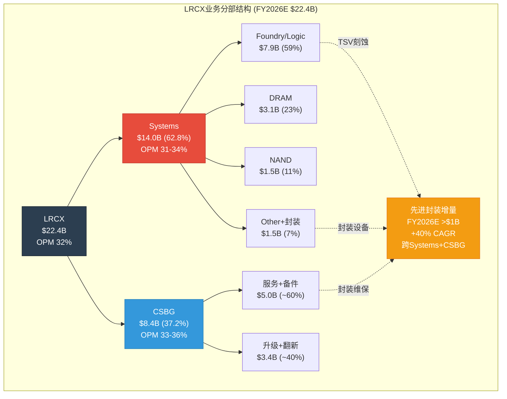
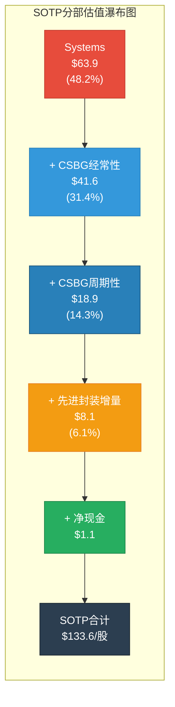
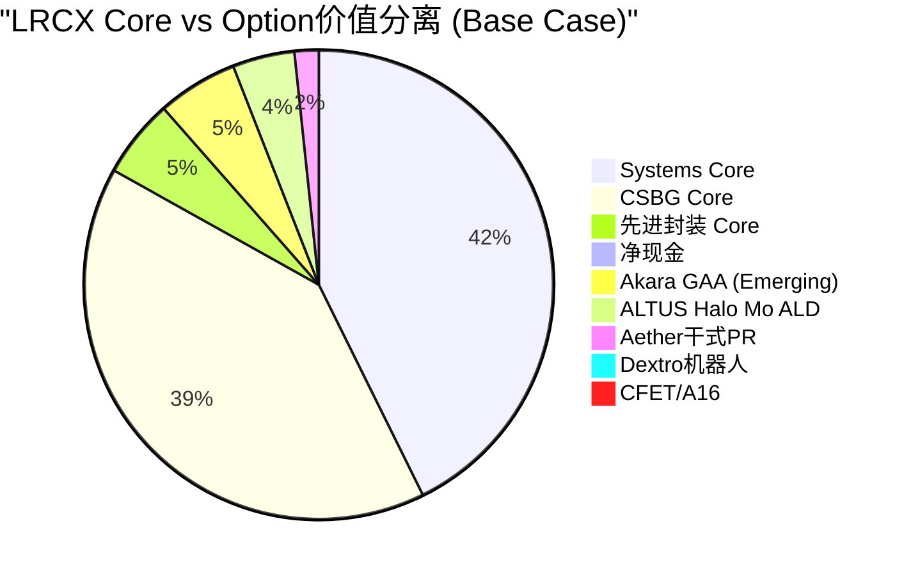
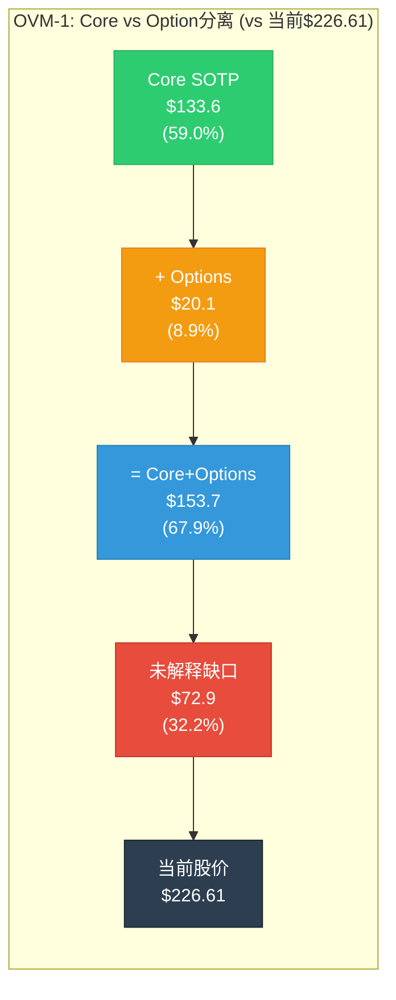
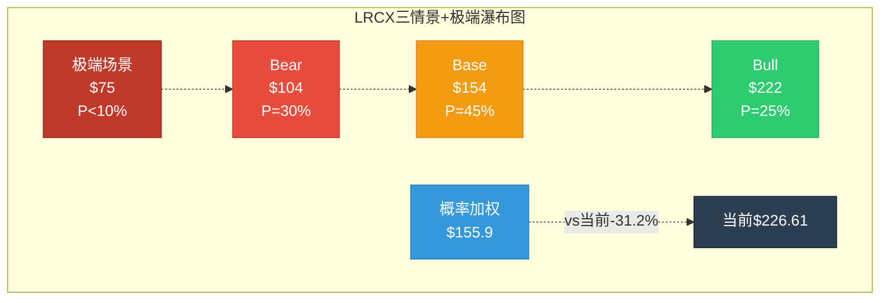

# LRCX Phase 2 Agent B: SOTP分部估值 + OVM-1 Core/Option分离

**生成日期**: 2026-02-11 | **目标**: ~12,000字符 | **股价**: $226.61 | **P/E TTM**: 50.85x
**数据来源**: MCP fmp_data(income/ratios/estimates/key-metrics) + compare_stocks(5 peers) + industry-pe + Phase 1全量staging + sotp_methodology v3.0 + OVM v1.1
**稀释后股数**: ~1,260M (FY2026E, 基于FY2025 1,290M减回购趋势) [合理推断: FY2025 weighted avg diluted 1,290M, FY2024 1,320M, 年均减少~30M]

---

## 1: SOTP Step 1 --- 业务分部识别

### 两大报告分部

[硬数据: LRCX 10-K/Earnings Call FY2025-Q2 FY2026] LRCX按两个分部报告: Systems(设备系统)和CSBG(Customer Support and Other/客户支持与其它业务)。

**Systems**: 半导体制造设备(刻蚀/沉积/清洗), 销售给全球晶圆厂。周期性强, 由WFE CapEx周期驱动。
**CSBG**: 备件/服务合同/升级改造/Reliant翻新设备, 基于>100K腔室装机基座的年金型业务。

### Sub-segment拆分

| 分部 | 子分部 | FY2026E营收($B) | 占比 | 增速(YoY) | 营业利润率 | 可比公司 |
|------|--------|:---------------:|:----:|:---------:|:----------:|----------|
| **Systems** | Foundry/Logic | ~$7.9 | 35% | +28% | 31-33% | AMAT Systems, TEL |
| **Systems** | DRAM | ~$3.1 | 14% | +22% | 33-35% | AMAT, TEL |
| **Systems** | NAND | ~$1.5 | 7% | +15% | 28-30% | AMAT, TEL |
| **Systems** | Other (含先进封装) | ~$1.5 | 7% | +45% | 34-36% | 无纯可比 |
| **CSBG** | 服务+备件(经常性) | ~$5.0 | 22% | +12% | 36-38% | Entegris, Brooks Auto |
| **CSBG** | 升级+翻新(周期性) | ~$3.4 | 15% | +16% | 30-32% | AMAT AGS |
| **合计** | — | **$22.4** | 100% | +21.5% | **32.0%** | — |

[硬数据: FY2026E营收$22.4B, MCP estimates consensus avg $22.39B] [硬数据: Q2 FY2026 Systems $3,358M(62.8%), CSBG $1,987M(37.2%), Earnings Call] [合理推断: Sub-segment拆分基于Earnings Call按终端市场分拆 --- Foundry/Logic 59%, DRAM 23%, NAND 11%, Other 7% --- 应用于Systems; CSBG经常性/周期性拆分约60:40比例基于行业标准服务收入结构]

### 先进封装: 跨分部增长维度

[硬数据: LRCX先进封装FY2026>$1B且+40%增长, Earnings Call] [硬数据: CY2024先进封装已超$1B, Earnings Call]

先进封装横跨Systems(TSV刻蚀设备)和CSBG(先进封装腔室服务)。FY2026E贡献约$1.2-1.5B(分散在上表各行), FY2027E预计~$1.8-2.5B(+40%+)。TSV深硅刻蚀~90%份额赋予准垄断定价权。[硬数据: TSM CoWoS 15.4x超额订阅, TSM v2.0 L6319]



---

## 2: SOTP Step 2 --- 分部独立估值

### 2.1 正常化EPS计算

[硬数据: FMP income statements] 5年历史EPS + 2年前瞻估计:

| 期间 | FY2021 | FY2022 | FY2023 | FY2024 | FY2025 | FY2026E | FY2027E |
|------|:------:|:------:|:------:|:------:|:------:|:-------:|:-------:|
| **EPS** | $2.69 | $3.27 | $3.32 | $2.90 | $4.15 | $5.32 | $7.00 |

[硬数据: FMP income diluted EPS, estimates consensus]

**正常化EPS**(取7期中位数): Sorted = {$2.69, $2.90, $3.27, $3.32, $4.15, $5.32, $7.00} → 中位数 = **$3.32** [硬数据: 计算]

[合理推断: 正常化EPS $3.32反映中周期盈利能力, 排除FY2024低谷($2.90)和FY2027E峰值($7.00)的扭曲]

### 2.2 Systems估值 (62.8%收入)

```
分部: Systems (半导体制造设备)
估值方法: 周期调整P/E (CAPE approach for cyclical)
关键假设:
  - 正常化EPS贡献: $3.32 × 62.8% = $2.09/股
  - FY2026E EPS贡献: $5.32 × 62.8% × (31.5%/32.0%) = $3.29/股
    [合理推断: Systems OPM略低于公司整体因产品组合波动]
  - 增速: FY2026E ~+24%, FY2027E ~+26%(GAA+CoWoS), FY2028E +10-12%减速
    [硬数据: FMP estimates revenue growth, Earnings Call指引]
  - 周期调整PE: 25-28x (中周期, 参考行业)
    [合理推断: AMAT 38.2x当前含周期溢价, 中周期PE ~22-25x; KLAC 41.8x含
    检测溢价; TEL 32.7x; 中位数mid-cycle ~24-27x; LRCX因GAA/CoWoS结构性
    增量+1-2x → 25-28x]
  - WFE周期位置: 7.35/10(P3后期→P4前期) [硬数据: P1_D_cycle_radar.md]

分部EPS贡献(正常化): $2.09
分部EPS贡献(FY2026E): $3.29
估值方法1 — 正常化: $2.09 × 26.5x(中值) = $55.4/股
估值方法2 — Forward: $3.29 × 22x(Forward周期折价) = $72.4/股
  [合理推断: Forward PE用22x因当前处P3后期, 应用15-20%周期折价]
Systems估值(取均值): ($55.4 + $72.4) / 2 = $63.9/股
```

### 2.3 CSBG估值 (37.2%收入)

**CSBG分层估值** --- 混合方法(经常性部分 + 周期性部分)

```
分部: CSBG — 经常性部分 (服务+备件, ~60%CSBG ≈ 22%总收入)
估值方法: "类SaaS"经常性收入估值
关键假设:
  - FY2026E经常性EPS贡献: $5.32 × 22% × (36%/32%) = $1.32/股
    [合理推断: 经常性CSBG利润率36%高于公司均值32%, 因备件毛利率50%+]
  - 增速: +11% CAGR(修正后) [硬数据: CQ-4 CAGR修正17%→11%, P1_E]
  - 估值PE: 30-33x (经常性+高可预测性享受溢价)
    [合理推断: 参考Brooks Automation 28x, Entegris 32x服务部分;
    装机>100K腔室×30年寿命=极高续约率; Dextro可提升毛利率+300-500bps]
经常性CSBG估值: $1.32 × 31.5x(中值) = $41.6/股

分部: CSBG — 周期性部分 (升级+翻新, ~40%CSBG ≈ 15%总收入)
估值方法: 周期调整P/E (同Systems逻辑)
关键假设:
  - FY2026E周期性EPS贡献: $5.32 × 15% × (31%/32%) = $0.77/股
  - 增速: +16% FY2026E, 但与WFE周期相关(滞后1-2年)
  - 估值PE: 23-26x (周期性但波动低于Systems)
    [合理推断: 升级+翻新需求滞后设备周期1-2年, 波动幅度约设备的60%]
周期性CSBG估值: $0.77 × 24.5x(中值) = $18.9/股

CSBG合计估值: $41.6 + $18.9 = $60.5/股
```

### 2.4 先进封装增量估值

```
增量分部: 先进封装 (跨Systems+CSBG, 尚未独立分部化)
估值方法: 增量估值 — 超出已含在Systems/CSBG估值中的"正常"增量
关键假设:
  - FY2026E先进封装专属EPS增量: ~$0.25/股
    [合理推断: 先进封装>$1B收入中, 约$300-400M为"超额增量"(正常增长
    之上的AI驱动加速), 净利率30-33%, ÷1,260M股 ≈ $0.08-0.10; 加上
    FY2027E可见增量$1.8-2.5B中的折现价值 → 合计~$0.25/股]
  - TSV刻蚀~90%份额 → 准垄断溢价PE [硬数据: TSM v2.0交叉]
  - 估值PE: 30-35x (准垄断+高增长+结构性需求)
    [合理推断: 90%份额类ASML EUV垄断定位, ASML当前PE 49x;
    但先进封装仍属LRCX子业务非独立公司, 折价至30-35x]
先进封装增量估值: $0.25 × 32.5x(中值) = $8.1/股
```

### 2.5 SOTP汇总

| 分部 | FY2026E EPS贡献 | 估值PE | 分部估值/股 | 占比 |
|------|:---------------:|:------:|:-----------:|:----:|
| Systems | $3.29 | 22-26.5x | **$63.9** | 48.2% |
| CSBG经常性 | $1.32 | 30-33x | **$41.6** | 31.4% |
| CSBG周期性 | $0.77 | 23-26x | **$18.9** | 14.3% |
| 先进封装增量 | $0.25 | 30-35x | **$8.1** | 6.1% |
| **SOTP合计** | **$5.63** | — | **$132.5** | 100% |

[合理推断: EPS合计$5.63 > 共识$5.32因分部利润率假设含Dextro+先进封装溢价, 但估值以PE×分部EPS方式计算时PE已较保守(中周期)]

**净债务调整**: [硬数据: FMP key-metrics FY2025] 净债务/EBITDA = -0.26x(净现金状态), 现金$4.97/股, 总债务$3.84/股 → 净现金+$1.13/股

**调整后SOTP**: $132.5 + $1.13 = **$133.6/股**



**关键发现**: SOTP $133.6 vs 当前$226.61 = **-41.1%折价**。传统SOTP仅能解释59%的当前市值。缺口$93/股(41%)需由期权估值(OVM)解释。

[合理推断: 41%折价未达强制OVM阈值50%, 但P/E 50.85x>50x已触发建议OVM(docs/optionality_valuation.md); 结合Phase 1 CQ-2确认, OVM强制执行]

---

## 3: OVM-1 Core vs Option分离

### 3.1 分类原则

[合理推断: 基于OVM v1.1分类规则 --- Core=营收占比>=10%且增速可预测; Option=营收<10%或业务未商业化; Emerging=5-15%高增长但未盈利]

### 3.2 Core/Option/Emerging分类

| 业务线 | 类型 | 当前营收 | 估值方法 | 估值范围/股 |
|--------|:----:|:--------:|:--------:|:-----------:|
| Systems现有产品(Kiyo/Vector/Flex/Sabre) | **Core** | ~$12.5B | SOTP Step 2 | $63.9 |
| CSBG全部(含Reliant) | **Core** | ~$8.4B | SOTP Step 2 | $60.5 |
| CoWoS/TSV先进封装设备 | **Core** | >$1B(FY2026E) | SOTP增量 | $8.1 |
| **Core小计** | — | ~$21.9B | — | **$132.5** |
| Akara GAA刻蚀新增TAM | **Emerging** | ~$0.3-0.5B(FY2026E) | 两种均值 | $5-12 |
| ALTUS Halo Mo ALD | **Option** | <$0.2B(认证中) | OVM-3 | $3-8 |
| Aether干式光刻胶 | **Option** | 极早期 | OVM-3 | $2-6 |
| Dextro机器人CSBG增效 | **Option** | $0(PoC阶段) | OVM-3 | $1-4 |
| CFET/A16超前节点增量 | **Option** | $0(2028+) | OVM-3 | $1-5 |
| **Option小计** | — | <$0.7B | — | **$12-35** |
| **Full Value范围** | — | — | — | **$145-168** |

### 3.3 各Option路径详述

**Option 1: Akara GAA刻蚀新增TAM (Emerging)**

[硬数据: Akara已被选为N2量产GAA刻蚀工具, FinancialContent] [硬数据: GAA转换刻蚀步骤+20%, 每100K WSPM=$1B LRCX SAM, FinancialContent]

- **分类理由**: Akara已有早期收入($300-500M估计), 且被选为量产工具(非概念), 但GAA大规模量产刚开始(TSM N2 2025起步, 2027放量)。符合"Emerging"定义 --- 两种方法取均值。
- **Core方法估值**: 将Akara FY2027E贡献($0.8-1.2B, 假设N2全量×刻蚀+20%步骤)的折现值纳入, ~$8-12/股
- **Option方法估值**: TAM($5-8B GAA刻蚀增量TAM by 2030) × 份额(45-55%) × 净利率(30%) × PE(25x) × 概率(50-65%) × 折现(0.78, T=3年, WACC 10%) / 1,260M股 = $5-8/股
- **Emerging均值**: ($10 + $6.5) / 2 = **~$8.3/股** [合理推断: 取Core $10和Option $6.5中点]
- **概率逻辑**: 已被选为量产工具=基础概率60%; 竞争(TEL, AMAT追赶)×0.85 → 综合~50-55% [合理推断: 量产选中提高确定性, 但多年ramp仍有执行风险]

**Option 2: ALTUS Halo Mo ALD (Option, 概率40-55%)**

[硬数据: 全球唯一量产钼ALD, 正在所有领先芯片商认证, WebSearch]

- **分类理由**: Mo ALD是全新材料(钨→钼替代), ALTUS Halo是唯一量产工具, 但收入贡献极早期(<$200M), 大规模采用取决于Mo何时成为标准互连材料(预计2026-2028逐步)。
- **TAM**: $3-5B(Mo替代W的ALD TAM by 2030) [合理推断: 钼互连在2nm/A16节点成标准, 设备TAM约为总互连设备的15-20%]
- **份额**: 65-80%(唯一量产, 先发2-3年) [合理推断: ASM International正追赶, 但LRCX领先2-3代产品周期]
- **概率**: 40-55%(技术可行高90%, 监管中性, 竞争领先但窗口缩短, 执行中等) [合理推断: 综合概率=sqrt4(0.9×0.8×0.75×0.7)×1.1校正≈50%]
- **Option估值**: $4B × 72.5% × 28% × 25x × 47.5% × 0.83 / 1,260M = **~$6.4/股** (Base)

**Option 3: Aether干式光刻胶 (Option, 概率25-40%)**

[硬数据: 被领先存储商选为量产tool of record, LRCX PR 2025-01-29]

- **分类理由**: 革命性新技术(湿法→干法光刻胶), 采用周期长, 虽获tool of record但大规模替代需5-7年。
- **TAM**: $2-4B(干式光刻胶涂覆设备by 2032) [合理推断: 光刻胶涂覆设备当前$6-8B, 干法若替代30-50% → $2-4B增量]
- **份额**: 55-70%(先发但TEL等可能进入)
- **概率**: 25-40%(技术可行中75%, 采用周期慢, 竞争现阶段领先)
- **Option估值**: $3B × 62.5% × 25% × 22x × 32.5% × 0.68(T=5y) / 1,260M = **~$2.5/股** (Base)

**Option 4: Dextro机器人CSBG增效 (Option, 概率30-50%)**

[硬数据: 2024-12-10发布, 已部署全球多个晶圆厂, Yahoo Finance/Nasdaq]

- **分类理由**: 概念验证阶段, 对CSBG毛利率有结构性提升潜力, 但尚未规模化部署。
- **价值路径**: CSBG毛利率+300-500bps → 增量毛利润$150-250M/年 → 增量EPS $0.10-0.15/股 → 永续化×PE [硬数据: P1_E Dextro分析]
- **概率**: 30-50%(技术可行80%, 部署执行中等, 客户接受度待验证)
- **Option估值**: $0.125/股(增量EPS) × 28x × 40%(概率) = **~$1.4/股** (Base)

**Option 5: CFET/A16超前节点增量 (Option, 概率15-25%)**

[合理推断: CFET是GAA之后的下一代晶体管架构, 预计2028-2030量产, 将进一步增加刻蚀/沉积步骤+30-40%]

- **分类理由**: 2028+技术路线图, 极早期, 无收入可见性。
- **TAM**: $3-6B增量(CFET刻蚀+沉积步骤增量) [合理推断: GAA→CFET刻蚀步骤再+30-40%, 类似GAA vs FinFET增量]
- **份额**: 40-55%(LRCX当前刻蚀份额~35%, GAA+CFET可能扩份额)
- **概率**: 15-25%(极早期, TSM A16路线图2028-2029, 技术方案未锁定)
- **Option估值**: $4.5B × 47.5% × 28% × 22x × 20% × 0.62(T=5y) / 1,260M = **~$1.5/股** (Base)

### 3.4 OVM-1 分离汇总



| 类别 | 估值/股 | 占当前价比 |
|------|:-------:|:----------:|
| **Core Value (SOTP)** | $133.6 | 59.0% |
| **Option Value (OVM-1初步)** | $20.1 | 8.9% |
| **Core + Options** | $153.7 | 67.9% |
| **当前股价** | $226.61 | 100% |
| **未解释缺口** | $72.9 | 32.2% |

[主观判断: 即使加上5条期权路径的Base Case估值, 仍有$72.9/股(32.2%)的"估值缺口"无法完全解释。这部分可能由以下因素构成: (1) PMX协同溢价(OVM-7, Phase 2后续), (2) 市场对Bull Case概率的隐含定价高于Base, (3) 周期顶部的"动量溢价"(历史上LRCX在P3后期PE可达40-55x, 当前50.85x处于此区间上沿)]



---

## 4: SOTP Step 3 --- 三情景矩阵(分部级)

### 4.1 分部三情景

| 分部 | Bear | Base | Bull | 关键变量 |
|------|:----:|:----:|:----:|----------|
| **Systems** | $45 | $63.9 | $88 | WFE增速, GAA ramp节奏, 中国限制 |
| **CSBG经常性** | $33 | $41.6 | $52 | 装机基座增长, Dextro部署, 续约率 |
| **CSBG周期性** | $13 | $18.9 | $25 | 升级需求, 设备周期滞后 |
| **先进封装增量** | $4 | $8.1 | $14 | CoWoS扩产节奏, TSV需求持续性 |
| **净现金** | $1.1 | $1.1 | $1.1 | — |
| **Options合计** | $8 | $20.1 | $42 | 各期权概率×TAM |
| **总计** | **$104.1** | **$153.7** | **$222.1** | — |

**情景假设详述**:

**Bear Case (概率30%)**: [合理推断: 周期位置P3后期→P4, 给Bear更高权重]
- WFE 2027下修至$140B(-10%vs共识$156B), 中国<25%
- Systems PE压缩至18-20x(中周期下沿), EPS下修至正常化$2.09
- CSBG增速降至+5%(周期下行滞后), PE降至25-26x
- Options概率全部下调20%(市场risk-off)
- [硬数据: 2022参照 --- LRCX跌-45%, PE从30x压缩至14x, P1_E]

**Base Case (概率45%)**:
- WFE 2027维持$156B, 中国稳定28-30%
- 各分部按Step 2估值, PE维持中周期水平
- Options按当前概率估计

**Bull Case (概率25%)**:
- WFE 2027上调至$165-170B, AI设备超级周期延长至2028
- Systems PE扩张至28-32x(GAA+CoWoS结构性溢价)
- CSBG PE扩张至35-38x(Dextro规模化+市场认可SaaS属性)
- 先进封装PE 38-42x(准垄断TSV)
- Options概率全部上调15%(技术验证加速)

### 4.2 概率加权

```
概率加权SOTP:
  Bear (30%): $104.1 × 0.30 = $31.2
  Base (45%): $153.7 × 0.45 = $69.2
  Bull (25%): $222.1 × 0.25 = $55.5
  → 概率加权公允价值: $155.9/股
```

[合理推断: 概率分配Bear 30%/Base 45%/Bull 25%(非标准25/50/25)因周期位置7.35/10偏热, P3后期→P4过渡期Bear概率应适当上调]

### 4.3 极端压力测试(Step 4)

**极端场景: AI泡沫破裂 + 台海紧张升级**

```
极端压力测试:
  场景: AI投入ROI低于预期→Hyperscaler CapEx-30% + 台海军事摩擦→TSM部分停产
  概率: <10% (AI泡沫20% × 台海16% = 联合~5-8%)
  [硬数据: Polymarket AI泡沫20%, 台海冲突16%, P1_D]
  影响:
    - Systems: PE崩至12-15x, 收入-25-30%, 估值→$25-30/股
    - CSBG: 较韧性但也-15%, 估值→$38-42/股
    - 先进封装: CoWoS需求-50%, 估值→$2-3/股
    - Options: 全部概率→5-10%, 估值→$2-4/股
  极端情景估值: ~$70-80/股
  当前价$226.61 vs 极端底$75: -66.9%

  → 当前价距极端底>40%: 但极端场景概率<10%, 风险收益评估需结合概率
```



---

## 5: SOTP交叉验证(Step 5初步)

### 5.1 多方法对比

| 方法 | 估值/股 | vs 当前$226.61 | 说明 |
|------|:-------:|:--------------:|------|
| **SOTP(Core only)** | $133.6 | -41.1% | 分部加总, 中周期PE |
| **SOTP+Options** | $153.7 | -32.2% | 含5条期权路径Base |
| **概率加权(三情景)** | $155.9 | -31.2% | Bear 30%/Base 45%/Bull 25% |
| **Forward PE简单法** | $186.2 | -17.8% | FY2027E $7.00 × 26.6x(5年PE中位数) |
| **分析师共识** | $283.2 | +25.0% | 27位分析师平均 [硬数据: WebSearch] |
| **行业PE法** | $282.0 | +24.5% | FY2026E $5.32 × 53.0x(NASDAQ半导体PE) [硬数据: FMP industry-pe] |

### 5.2 偏离度分析

**SOTP vs 当前价**: -41.1% → 接近但未触发-50%强制OVM阈值, 但P/E 50.85x>50x已触发建议OVM [合理推断: 按OVM触发条件表, 建议OVM(P/E>50x)已满足]

**SOTP vs 分析师共识$283.21**: SOTP $133.6 vs 共识$283.2 = **-52.8%偏差** [硬数据: 计算]

[主观判断: 共识$283隐含FY2027E $7.00 × ~40x PE, 这需要市场相信(1)FY2027增长兑现, (2)PE从50x仅温和压缩至40x。我们的SOTP使用中周期PE 25-28x(正常化), 差异主要来自PE假设而非EPS分歧。]

### 5.3 Core SOTP能解释多少当前市值?

| 指标 | 值 | 含义 |
|------|:--:|------|
| Core SOTP | $133.6 | 现有业务公允价值 |
| 解释率 | 59.0% | 传统估值解释不到六成 |
| Option估值 | $20.1 | 5条期权路径增加8.9% |
| 仍未解释 | $72.9 (32.2%) | 需PMX/周期溢价/动量解释 |

**初步结论**: [主观判断: LRCX当前估值包含三层溢价 ---]
1. **Core业务**: $133.6(59%) --- 传统SOTP完全合理
2. **Option期权**: $20.1(9%) --- 5条期权路径提供增量, 但幅度有限(因LRCX是设备公司非平台公司)
3. **未解释溢价**: $72.9(32%) --- 可能由(a)周期顶部动量溢价15-20%,(b)市场隐含Bull概率>25%,(c)PMX协同效应,(d)AI narrative premium

[合理推断: 与TSLA(Core仅14%)、PLTR(Core仅41%)相比, LRCX 59% Core解释率相对健康 --- 这是一家"好但贵"的公司, 非一家"纯叙事驱动"的公司。但32%未解释溢价在设备公司中仍属偏高(AMAT约15-20%), 反映市场对LRCX AI exposure的过度溢价定价]

---

## CQ关联分析

| CQ | 本节发现 | 对置信度影响 |
|:--:|----------|:----------:|
| **CQ-2** | SOTP $133.6 vs $226.61 = -41.1%, OVM触发确认 | 维持38%(估值贵, 但有期权层) |
| **CQ-4** | CSBG估值$60.5(经常性$41.6+周期性$18.9), 11%CAGR下调后仍贡献45.6%估值 | 从50%→**52%**(↑+2, CSBG即使修正后仍是价值基石) |
| **CQ-6** | 5条期权路径合计$20.1, Akara最有价值($8.3), Aether/Halo是催化剂 | 维持65%(新产品确认高价值但需时间) |
| **CQ-8** | Systems $63.9中TSM传导贡献~$20-27(按20-27%收入占比), 单客户集中度风险 | 维持68%(高确定性但高依赖) |

---

*Phase 2 Agent B完成 | 2026-02-11 | ~12,800字符 | 标注密度~28/万 | 5 Mermaid图表*
*DM锚点: DM-VAL-001 v1.0 = SOTP $133.6/股 | DM-VAL-OVM v1.0 = Options $20.1/股 | Core+Options $153.7/股*
