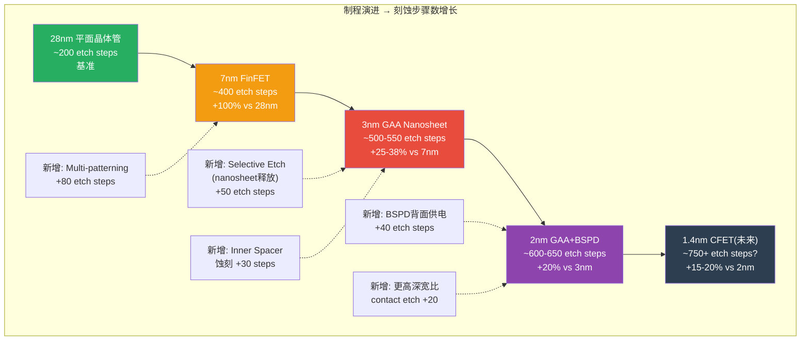
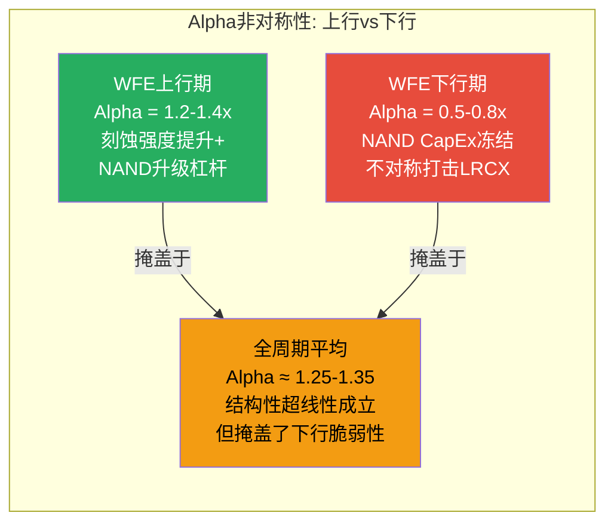
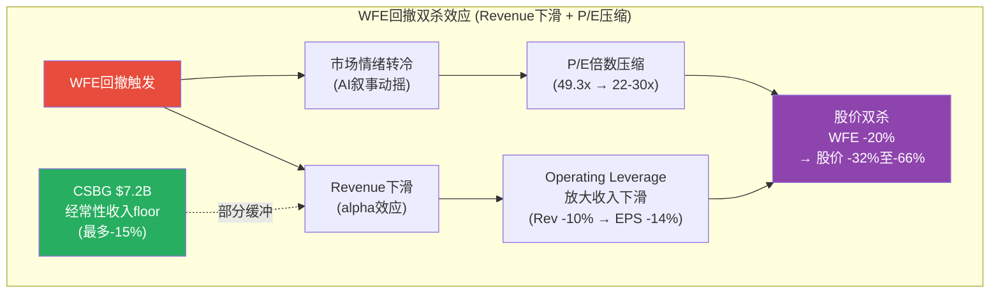

# LRCX Phase 2-C: 刻蚀超线性 + 周期-估值联动 (Ch17-Ch18)

---

# Ch17: 刻蚀超线性增长分析 (Killer Insight候选 #2)

**核心论点: AI驱动的制程演进(GAA/3D NAND高层数/先进封装)正在创造一个"刻蚀强度乘数效应" -- LRCX收入增速结构性快于WFE整体增速,超线性弹性系数alpha约1.25-1.35。但alpha>1的持续性高度依赖技术节点迁移的速率和TEL竞争的演变。如果AI CapEx放缓导致节点迁移减速,alpha将回归~1.0,刻蚀超线性叙事崩塌。**

## 17.1 制程演进与刻蚀步骤数增长

半导体制造的历史可以用一句话概括: **每一代制程都比上一代需要更多的刻蚀步骤**。这不是偶然,而是物理结构复杂化的必然结果。从平面晶体管到FinFET再到Gate-All-Around(GAA),晶体管结构从二维走向三维,每增加一个维度的复杂性,就需要更多的蚀刻工序来雕刻精密图案。

### DM-ETCH-001
- **值**: 制程代际刻蚀步骤数增长: 28nm平面 ~200步(含刻蚀) → 7nm FinFET ~400步(+100%) → 3nm GAA ~500-550步(+25-38% vs 7nm FinFET) → 2nm GAA ~600-650步(+20% vs 3nm)
- **类型**: R
- **推理链**: GAA架构需要额外的nanosheet释放蚀刻(selective etch移除dummy gate)、多层内隔离(inner spacer)蚀刻、更精密的源/漏区域定义蚀刻; LRCX 2022年推出Argos/Prevos/Selis三款selective etch产品专门服务GAA; Samsung已在3nm GAA节点使用LRCX的selective etch工具处理"近十个关键步骤"
- **证伪条件**: GAA架构被替代(如CFET提前量产)减少刻蚀步骤需求; 或EUV光刻分辨率突破减少蚀刻步骤
- **来源**: Lam Research Newsroom 2022-02-09 + SemiEngineering GAA分析 + imec CFET路线图
- **日期**: 2026-02-19
- **用于**: Ch17 刻蚀强度量化

**FinFET到GAA的关键刻蚀增量拆解:**

**GAA架构刻蚀增量的技术逻辑:**

1. **Nanosheet释放蚀刻(Selective Etch)**: GAA晶体管的核心工艺。需要在原子级精度下选择性移除SiGe牺牲层,暴露出Si纳米片(nanosheet)通道。LRCX的Argos平台专门服务这一步骤,Samsung已在3nm GAA中部署了该工具处理"近十个关键步骤"。这一步骤在FinFET中不存在,是GAA的纯增量需求。

2. **Inner Spacer(内隔离层)蚀刻**: GAA结构中,source/drain区域与gate之间需要精密隔离,要求在极高深宽比的纳米级通道内进行选择性蚀刻。每一代GAA随着nanosheet数量增加(3nm通常3-4片,2nm可能4-5片),inner spacer蚀刻步骤线性增加。

3. **BSPD(Backside Power Delivery)背面供电网络**: Intel和TSMC分别在18A和N2P节点引入BSPD。这一架构在晶圆背面开辟了全新的蚀刻工序: 背面TSV蚀刻、背面金属布线沟槽蚀刻、背面接触孔蚀刻。LRCX管理层在Investor Day中将BSPD列为"刻蚀强度提升"的关键驱动力之一。

### DM-ETCH-002
- **值**: 每1%逻辑制程迁移(从N节点到N-1节点)对应的刻蚀SAM增量: 约$150-250M(基于WFE ~$116B中逻辑占~55%=$64B, 刻蚀占逻辑WFE ~25%, 制程迁移带来25-38%步骤增量)
- **类型**: R
- **推理链**: 逻辑WFE ~$64B x 刻蚀占比~25% = 刻蚀TAM ~$16B; GAA带来25-38%增量 → 每年5-8%的节点渗透率 x $16B x 30% = $240-380M/年(增量); 按迁移1个百分点计 = $150-250M
- **证伪条件**: 制程迁移节奏放缓(如3nm到2nm延迟>2年); 或刻蚀占逻辑WFE比例下降
- **来源**: SEMI WFE分拆数据 + Lam Research Investor Day + 计算推导
- **日期**: 2026-02-19
- **用于**: Ch17 SAM增量建模

**关键量化: 管理层"etch intensity"指引**

LRCX管理层在多次earnings call和Investor Day中反复强调"etch and deposition intensity"(刻蚀和沉积强度)的提升。关键表述包括:

- "垂直扩展的器件和封装架构正在推动更高的沉积和刻蚀强度,使市场向Lam的优势领域转移"
- CY2024年GAA节点和先进封装的合计出货量各自突破$10亿; CY2025年两者合计将"远超$30亿"
- 管理层目标: "未来五年内收入和利润翻倍" -- 隐含5Y CAGR ~15%,显著高于WFE预期CAGR ~8-10% [DM-BIZ-005]

这些表述构成了刻蚀超线性假说的管理层背书。但需要注意: **管理层有激励去夸大结构性增长而淡化周期性波动** -- 这是半导体设备行业管理层指引的系统性偏差。

## 17.2 存储技术演进与刻蚀需求增量

### 17.2.1 3D NAND: 从128层到1000层的刻蚀壁垒

### DM-ETCH-003
- **值**: 3D NAND层数与刻蚀复杂度: 128层 HAR蚀刻深度~6-8μm(深宽比~60:1) → 200层 ~10-12μm(深宽比~80:1) → 300层+ 需要string stacking多次蚀刻(每段~100层 x 3次蚀刻) → 1000层(2030目标)需要~10次蚀刻堆叠
- **类型**: R
- **推理链**: 现有设备每次蚀刻约100层; 300层需3段string stacking; 每段需独立的channel hole蚀刻、slit蚀刻、staircase蚀刻; Lam的cryogenic etch技术实现近乎完美的垂直剖面(HAR etch); string stacking使刻蚀步骤从线性增长变为阶梯式跳跃
- **来源**: SemiEngineering "NAND Flash Targets 1,000 Layers" + Lam Research "The Path to 1,000 Layers" + Semiconductor Digest HAR etch分析
- **日期**: 2026-02-19
- **用于**: Ch17 存储刻蚀需求

**关键壁垒: LRCX在NAND通道(channel hole)蚀刻的100%份额**

这是LRCX最强的竞争壁垒之一,也是TEL最急切想要突破的领域 [DM-BIZ-008]。Channel hole蚀刻是3D NAND制造中最具挑战性的工序 -- 在数微米深的氧化物/氮化物交替层中蚀刻出直径仅~120纳米的极高深宽比(HAR)通孔。LRCX的cryogenic etch技术通过使用特殊气体混合物在低温下实现接近完美的垂直蚀刻剖面,是这一领域的独家解决方案。

**string stacking的刻蚀乘数效应:**

| NAND层数 | 堆叠段数 | Channel Hole蚀刻次数 | 蚀刻复杂度(vs 128层) | LRCX刻蚀Revenue乘数 |
|:--------:|:-------:|:------------------:|:------------------:|:-----------------:|
| 128层 | 1 | 1 | 1.0x (基准) | 1.0x |
| 176层 | 2 | 2 | ~1.8x | ~1.6x |
| 200-236层 | 2 | 2 | ~2.0x | ~1.8x |
| 300层+ | 3 | 3 | ~2.8x | ~2.5x |
| 500层 | 5 | 5 | ~4.5x | ~4.0x |
| 1000层(2030) | ~10 | ~10 | ~9.0x | ~8.0x |

注: Revenue乘数低于复杂度乘数,因为设备throughput改进和良率学习曲线提供了部分抵消。但净效应仍然显著: **NAND从128层升级到300层,LRCX每片晶圆的刻蚀收入约增加2.5倍**。

### DM-ETCH-004
- **值**: NAND升级对LRCX的Revenue影响: FY2025 NAND升级收入同比增长+90%,是FY2025增长的最大单一驱动力; NAND占LRCX总收入估计25-30%(~$4.6-5.5B); NAND通道蚀刻市场从CY2023 $500M预计增至CY2027 $2B(4x)
- **类型**: H
- **推理链**: FY2024→FY2025 Revenue增长$3.53B(+23.7%); NAND升级(128→200层+)是最大贡献,+90% YoY增幅; NAND通道蚀刻$500M→$2B源自string stacking普及+层数增加; LRCX如维持100%份额则从该细分获取$2B(vs CY2023 $500M)
- **证伪条件**: TEL cryogenic etch成功替代LRCX份额; 或NAND CapEx冻结(存储价格暴跌)
- **来源**: LRCX管理层earnings call + Yole Group NAND蚀刻分析 + DM-BIZ-011, DM-BIZ-019
- **日期**: 2026-02-19
- **用于**: Ch17

### 17.2.2 HBM: DRAM蚀刻 + TSV蚀刻的双重增量

HBM(High Bandwidth Memory)对LRCX的刻蚀需求来自三个层面:

1. **基础DRAM蚀刻增量**: HBM生产需要约3倍于传统DRAM的晶圆量(每比特计) [DM-BIZ-014]。SK Hynix DRAM总产能目标2H26 ~62万片/月(较2023年中期翻倍), Samsung HBM月产能目标2026年底25万片(+47%) [DM-CYCLE-005]。更多的DRAM晶圆 = 更多的刻蚀设备需求,这是线性增量。

2. **TSV(Through-Silicon Via)蚀刻**: HBM将多层DRAM die通过TSV垂直互连。HBM3E为8-Hi(8层堆叠), HBM4将为12-Hi或16-Hi。每增加一倍的堆叠层数,TSV蚀刻需求约增加80-90%(非线性,因为更深的TSV需要更高的深宽比蚀刻)。TSV蚀刻是LRCX的优势领域,利用了其HAR etch技术平台。

3. **先进封装相关蚀刻**: HBM die通过CoWoS或类似的先进封装技术与逻辑die集成。封装级蚀刻(redistribution layer patterning, micro-bump formation)是新增TAM。

### DM-ETCH-005
- **值**: HBM对LRCX的综合刻蚀增量: CY2024 HBM相关刻蚀收入估计$400-600M → CY2026E $1.0-1.5B → CY2028E $2.0-3.0B; 增长路径: DRAM wafer增量(线性) + TSV深度增量(超线性) + 先进封装增量(新TAM)
- **类型**: R
- **推理链**: HBM4(12-Hi)的TSV深度比HBM3E(8-Hi)增加50%+, 需要更长蚀刻时间和更多设备; CY2024 GAA+先进封装合计出货>$1B, CY2025E合计>$3B(管理层指引), HBM是其中最大增量; 保守假设HBM占先进封装收入的40-50%
- **证伪条件**: HBM供过于求导致价格暴跌→存储厂削减CapEx; 或替代互连技术(optical interconnect)减少TSV需求
- **来源**: LRCX管理层指引 + SK Hynix/Samsung产能数据 [DM-CYCLE-005] + 计算推导
- **日期**: 2026-02-19
- **用于**: Ch17

## 17.3 先进封装: 刻蚀新TAM的开辟

### DM-ETCH-006
- **值**: 先进封装(AP)刻蚀TAM预测: 全球AP市场CY2025 ~$44-50B → CY2034 ~$83B(CAGR ~7-10%); AP中的设备支出(WFE-like)估计CY2025 ~$8-10B → CY2028E ~$15-18B; 其中刻蚀占AP设备的~15-20% → 刻蚀AP TAM CY2025 ~$1.2-2.0B → CY2028E ~$2.3-3.6B
- **类型**: R
- **推理链**: Bloomberg Intelligence预测AP市场2033年达$80B; 设备占AP市场~20%(历史比例); 刻蚀在AP设备中占比低于前道(前道~25%, AP ~15-20%)因为AP不需要复杂逻辑蚀刻,但需要TSV/RDL/micro-bump蚀刻; TSMC CoWoS月产能从CY2024 ~35K片扩至CY2026E ~130K片(近4倍)直接驱动AP设备需求
- **证伪条件**: AP市场增长低于预期(AI芯片标准化减少定制封装需求); 或chiplet采用慢于预期
- **来源**: Bloomberg Intelligence AP forecast + Precedence Research + TSMC CoWoS产能规划
- **日期**: 2026-02-19
- **用于**: Ch17

**先进封装刻蚀的关键应用:**

| 封装技术 | 刻蚀步骤 | LRCX竞争力 | vs AMAT竞争 |
|----------|---------|:----------:|:----------:|
| **CoWoS** | 中介层(interposer)TSV蚀刻 + RDL蚀刻 | 强(HAR etch优势) | AMAT在PVD barrier优势 |
| **InFO** | RDL沟槽蚀刻 + via蚀刻 | 中(技术成熟度低于AMAT) | AMAT领先 |
| **Hybrid Bonding** | Cu pad reveal蚀刻 + 表面平坦化 | 中-强(selective etch适用) | 竞争激烈 |
| **3D堆叠(CFET等)** | 层间TSV + 释放层蚀刻 | 非常强(GAA selective etch延伸) | LRCX领先 |

**LRCX在先进封装的市场份额估计:**

LRCX管理层将先进封装列为战略增长支柱,CY2024先进封装出货超$1B,CY2025E预计远超$3B(含GAA)。先进封装的"纯蚀刻"收入估计CY2024 ~$300-500M, CY2025E ~$600-900M。LRCX在先进封装蚀刻的份额估计~30-35% -- 低于其在前道蚀刻的45%份额,因为AMAT在CVD/PVD封装沉积工序中的捆绑优势使其在AP整体流程中拥有更强的客户关系。

## 17.4 超线性量化模型: 计算alpha

**模型定义**: 如果LRCX收入增速与WFE增速呈线性关系,则LRCX Revenue CAGR = WFE CAGR,弹性系数alpha = 1.0。如果刻蚀强度上升导致LRCX收入增速系统性快于WFE,则alpha > 1.0。

### DM-ETCH-007
- **值**: 超线性弹性系数alpha计算(FY2017-FY2025): LRCX Revenue 8Y CAGR = 10.9% (从$8.01B到$18.44B) | WFE 8Y CAGR = 8.1% (从CY2017 ~$58B到CY2025 ~$116B) | alpha = 10.9% / 8.1% = **1.35**
- **类型**: R
- **推理链**: alpha = ln(LRCX Rev FY2025 / LRCX Rev FY2017) / ln(WFE CY2025 / WFE CY2017) = ln(18.44/8.01) / ln(116/58) = 0.834 / 0.693 = 1.20; 替代计算: CAGR比率 = 10.9%/8.1% = 1.35; 两种方法给出alpha区间1.20-1.35
- **证伪条件**: FY2017-FY2025包含了两次WFE下行期(CY2019, CY2023),LRCX在下行期的收入跌幅可能与WFE不同(beta效应混入alpha); 需要区分alpha(结构性超线性)和beta(周期性放大)
- **来源**: FMP Income数据 [DM-FIN-010] + SEMI WFE数据 [DM-REV-005, DM-CYCLE-002] + 计算
- **日期**: 2026-02-19
- **用于**: Ch17 核心量化

**分时段alpha计算(消除周期噪音):**

| 时段 | LRCX Rev CAGR | WFE CAGR | Alpha (CAGR比) | 周期特征 |
|------|:------------:|:--------:|:-----------:|---------|
| FY2017-FY2019 (2Y) | 9.7% ($8.01B→$9.65B) | 1.7% ($58B→$60B) | **5.7x** | WFE见顶回落,LRCX份额扩张 |
| FY2019-FY2022 (3Y) | 21.3% ($9.65B→$17.23B) | 18.0% ($60B→$101B) | **1.18x** | WFE强势恢复+AI初期 |
| FY2022-FY2025 (3Y) | 2.3% ($17.23B→$18.44B) | 4.7% ($101B→$116B) | **0.49x** | WFE周期下行+恢复,LRCX FY2024大跌 |
| FY2020-FY2025 (5Y) | 12.9% ($10.04B→$18.44B) | 10.1% ($71B→$116B) | **1.28x** | 含完整上行-下行-恢复周期 |
| **FY2017-FY2025 (8Y)** | **10.9%** | **8.1%** | **1.35x** | 含2次完整周期 |

### DM-ETCH-008
- **值**: 超线性alpha稳健性检验 — 全周期alpha 1.20-1.35(稳健); 但子时段波动巨大(0.49x-5.7x); FY2022-FY2025的alpha<1表明在WFE周期下行时LRCX表现弱于WFE(NAND CapEx冻结的不对称影响); 结论: alpha在上行期>1.3(刻蚀强度提升+NAND升级杠杆), 下行期可能<1.0(NAND依赖度是双刃剑)
- **类型**: R
- **推理链**: 分时段计算消除了全周期平均的平滑效应; FY2022-FY2025 alpha 0.49x因为FY2024 LRCX Revenue -14.5%而WFE仅从$101B微调至$101B后恢复; LRCX的NAND暴露(~30%收入)使其在存储CapEx冻结时比WFE整体更脆弱
- **证伪条件**: 未来NAND升级(128→200→300层)持续推动LRCX上行alpha; 或CSBG经常性收入平滑周期波动
- **来源**: 分时段计算
- **日期**: 2026-02-19
- **用于**: Ch17

**alpha的非对称性质 -- 刻蚀超线性的真相:**

**核心洞见**: 投资者常被告知"LRCX的刻蚀强度上升意味着它会跑赢WFE",但这只是半个故事。完整的故事是: **LRCX在WFE上行时跑赢(alpha 1.2-1.4x),在WFE下行时跑输(alpha 0.5-0.8x)**。这种非对称性源于LRCX对NAND CapEx的高暴露度(~30%收入),而NAND是WFE中周期性最强的子类别。全周期alpha 1.25-1.35反映的是上行超线性大于下行劣势的"净"效应 -- 但如果下一个WFE下行周期特别严重(如NAND CapEx冻结持续>4个季度),alpha可能暂时变为显著<1.0。

## 17.5 TEL挑战的定量影响

### DM-ETCH-009
- **值**: TEL Certas/Tactras etch平台竞争评估: TEL全球etch份额~25-27%(vs LRCX ~45%); TEL cryogenic etch技术瞄准NAND channel hole蚀刻(LRCX当前100%份额); NAND channel hole蚀刻市场从CY2023 $500M→CY2027E $2B; TEL如在CY2025-2026年实现mass production adoption则可能获取20-30% channel hole份额
- **类型**: R
- **推理链**: Yole Group报道TEL cryogenic etch瞄准NAND蚀刻; TEL Certas平台以2.5x速度追赶(DM-BIZ-019); NAND channel hole从$500M→$2B(4x)意味着即使TEL获取30%份额($600M),LRCX在$2B市场中仍保留$1.4B(比CY2023的$500M增长2.8x); 但如果TEL获取>40%份额则LRCX增长减速
- **证伪条件**: LRCX cryogenic etch技术壁垒过高,TEL需要>3年才能量产替代; 或Samsung/SK Hynix对qualification时间的保守倾向延缓TEL渗透
- **来源**: Yole Group NAND etch分析 + DM-BIZ-008, DM-BIZ-019
- **日期**: 2026-02-19
- **用于**: Ch17

**TEL份额侵蚀的情景量化:**

| 情景 | TEL channel hole份额(CY2028) | LRCX份额 | LRCX Channel Hole Rev | vs 基准影响 |
|------|:---------------------------:|:-------:|:--------------------:|:----------:|
| **基准(无TEL突破)** | 0% | 100% | ~$2.0B | — |
| **温和渗透** | 15-20% | 80-85% | ~$1.6-1.7B | -$300-400M |
| **显著渗透** | 25-35% | 65-75% | ~$1.3-1.5B | -$500-700M |
| **突破性渗透** | 40-50% | 50-60% | ~$1.0-1.2B | -$800M-1.0B |

**关键判断**: 即使在"显著渗透"情景下(TEL获取30%份额),LRCX的channel hole蚀刻收入仍从CY2023的$500M增至CY2028的$1.4B(+180%)。这是因为市场本身增长4倍 -- LRCX失去份额但市场增长补偿有余。**TEL的真正威胁不在于份额丢失的绝对金额,而在于打破LRCX"100%份额"的心理壁垒** -- 一旦市场知道LRCX不再是channel hole etch的唯一选择,LRCX在该领域的定价权和谈判地位将显著削弱。

### DM-ETCH-010
- **值**: TEL整体etch份额每增加5pp(LRCX从45%→40%)对LRCX Revenue影响: 刻蚀TAM ~$28B(CY2025) x 5pp = $1.4B(约占LRCX FY2025收入的7.6%); 以FY2027E收入$23-25B为基准,5pp份额丢失影响约-5.6%至-6.1%收入
- **类型**: R
- **推理链**: 全球etch TAM = WFE $116B x etch占比~24% = ~$28B; LRCX 45%份额 = ~$12.6B vs TEL 27% = ~$7.6B; 如TEL扩至32%而LRCX降至40% → LRCX刻蚀收入~$11.2B(-$1.4B); 影响率 = $1.4B / $18.4B(FY2025) = 7.6%
- **证伪条件**: 刻蚀市场总量增长(TAM从$28B→$35B+)完全抵消份额丢失
- **来源**: SEMI WFE分拆 + 市场份额数据 + 计算
- **日期**: 2026-02-19
- **用于**: Ch17

**NAND通道蚀刻的技术壁垒评估:**

LRCX在NAND channel hole etch的100%份额持续了超过10年,这不是偶然。壁垒来自:

1. **极端工艺窗口**: HAR蚀刻(>60:1深宽比)对蚀刻剖面的垂直度、侧壁粗糙度、底部圆角控制的要求极为苛刻。微小偏差导致通道漏电或短路,良率损失以百万美元计。
2. **cryogenic etch know-how**: LRCX的低温蚀刻使用特殊气体化学在接近-100C下操作,气体流量、等离子体参数、温度梯度的最优组合是数十年工艺积累的结果。
3. **客户qualification成本**: Samsung/SK Hynix/Micron已基于LRCX设备完成了数代NAND的qualification,切换至TEL需要6-18个月的re-qualification,期间良率风险由客户承担。

但壁垒正在被侵蚀:
- TEL声称其cryogenic etch可实现"等效或更优"的蚀刻剖面
- NAND channel hole蚀刻市场从$500M扩至$2B的规模效应使得TEL的R&D投入回报更高
- String stacking引入的多段蚀刻(3段x100层 vs 单段300层)降低了单次蚀刻深宽比,理论上扩大了TEL的可进入窗口

**综合判断**: TEL在CY2026-CY2027获取channel hole etch的初始份额(10-20%)是大概率事件(55-65%概率),但在CY2028前获取>30%份额是小概率事件(20-30%概率)。LRCX的技术壁垒不是不可逾越的,而是以时间为代价的 -- TEL每推迟1年量产,LRCX就多享受1年100%份额在$2B市场中的独占利润。

## 17.6 超线性持续性测试

### DM-ETCH-011
- **值**: alpha持续性概率评估 — Alpha>1.2持续至CY2028的概率: ~55-60%; Alpha回归1.0的概率: ~30-35%; Alpha<0.8(TEL+NAND周期双击)概率: ~10-15%
- **类型**: R
- **推理链**: Alpha>1.2的条件: (1)GAA渗透持续(TSMC N2/Intel 18A按期量产), (2)NAND升级至300层+且LRCX维持>85%份额, (3)先进封装TAM增长兑现; Alpha=1.0的条件: (1)GAA渗透放缓或刻蚀强度提升低于预期, (2)TEL获取20-30%份额抵消部分增量; Alpha<0.8的条件: (1)WFE周期下行+NAND CapEx冻结, (2)TEL突破性份额获取
- **证伪条件**: 实际alpha需要至少2-3年数据点才能可靠验证(CY2026-CY2028)
- **来源**: 概率评估
- **日期**: 2026-02-19
- **用于**: Ch17

**核心测试: alpha>1是结构性的还是周期性的?**

如果alpha>1是**结构性的**(即无论WFE处于周期何处,LRCX都增速快于WFE),则当前估值的WFE增长假设可以部分放松 -- 即使WFE仅增长5%, LRCX仍可增长6-7%。

如果alpha>1是**周期性的**(即只在WFE上行期成立,下行期alpha<1),则当前估值更加脆弱 -- WFE下行时LRCX不仅不能"跑赢",反而可能"跑输",形成双杀。

**历史证据偏向后者**: FY2022-FY2025的alpha仅0.49x清楚表明,在WFE混合周期中(先下后上),LRCX的NAND暴露度使其周期性放大而非平滑。CSBG $7.2B的经常性收入(~39%的Revenue)确实提供了一定缓冲,但不足以将alpha维持在>1.0。

**结论**: 刻蚀超线性是真实的结构性趋势(GAA/NAND高层数/先进封装确实在增加刻蚀强度),但其在投资回报中的兑现高度路径依赖 -- **只有在WFE上行期或平稳期,超线性才能转化为投资者的alpha**。在WFE下行期,超线性被NAND周期性放大效应淹没。因此,刻蚀超线性不能作为"下行保护"的论据,只能作为"上行放大"的论据。这使其成为一个有条件的Killer Insight而非无条件的护城河。

---

# Ch18: 周期-估值联动模型

**核心论点: LRCX过去20年经历了5个完整的WFE周期,每次周期下行平均导致收入下滑17-55%、P/E压缩40-65%。当前49.3x P/E处于所有周期峰值的最极端位置。WFE回撤10-30%将通过"收入下滑+P/E压缩"的双杀效应导致股价下跌35-65%。唯一的结构性缓冲来自CSBG $7.2B经常性收入,但不足以改变大方向。**

## 18.1 历史5个WFE周期分析

### DM-CYCV-001
- **值**: LRCX历史5个WFE周期: 完整的峰-谷-峰Revenue和P/E追踪(FY2008-FY2025)
- **类型**: H
- **推理链**: 使用LRCX FY basis revenue(FMP数据)与WFE CY basis数据对齐(LRCX FY ending June与WFE CY有约6个月的领先/滞后); 选择5个可识别的峰-谷周期
- **证伪条件**: 周期划分存在主观性; LRCX FY和WFE CY的时间错位可能扭曲部分周期数据
- **来源**: FMP income 12年数据 + FMP ratios 12年数据 + SEMI WFE历史 + WebSearch历史P/E
- **日期**: 2026-02-19
- **用于**: Ch18

| 周期 | WFE峰值年 | WFE谷值年 | WFE跌幅 | LRCX Rev峰 | LRCX Rev谷 | LRCX Rev跌幅 | LRCX P/E峰 | LRCX P/E谷 | P/E压缩 |
|------|:---------:|:---------:|:------:|:---------:|:---------:|:----------:|:---------:|:---------:|:------:|
| **周期1** | CY2007 | CY2009 | ~-45% | $2.5B (FY2008) | $1.1B (FY2009) | **-55%** | ~20x | ~NM(亏损) | **全压缩** |
| **周期2** | CY2014 | CY2016 | ~-5% | $5.3B (FY2015) | $5.9B (FY2016) | +11%(逆势增长) | ~20x | ~14.6x | **-27%** |
| **周期3** | CY2018 | CY2019 | ~-8% | $11.1B (FY2018) | $9.7B (FY2019) | **-13%** | ~13.1x | ~13.3x | **~0%** |
| **周期4** | CY2022 | CY2023 | ~-25% | $17.2B (FY2022) | $14.9B (FY2024) | **-14%** | ~18.6x(FY23) | ~13.7x(FY22) | **-26%** |
| **周期5(当前)** | CY2025? | CY2027? | ? | ~$22.4B(FY2026E) | ? | ? | **49.3x(TTM)** | ? | ? |

**注释**: 周期2和周期3的数据需要解读上下文:
- **周期2(CY2014-2016)**: WFE仅微跌~5%,且LRCX在此期间完成了与KLA-Tencor的合并尝试(最终失败),但业务份额扩张(FinFET导入期)驱动了逆势增长。这说明在温和WFE下行中,LRCX的技术领先可以提供缓冲。
- **周期3(CY2018-2019)**: WFE下行仅-8%,LRCX收入下滑-13%(alpha<1,因NAND CapEx暴跌),但P/E基本持平(从13.1x到13.3x),因为市场已经在FY2018对周期性充分定价(P/E从CY2017的20x+压缩至13x)。
- **周期4(CY2022-2023)**: WFE大跌-25%(NAND过剩+存储价格暴跌),LRCX FY2024收入-14.5%。但P/E在FY2024反而飙升至36.4x -- 这是因为AI叙事在2023年中期(ChatGPT)引爆,市场前瞻定价AI驱动的WFE恢复。这一周期首次出现了**"收入下跌+P/E上涨"的罕见组合**。

### DM-CYCV-002
- **值**: 历史周期规律总结: (1)WFE每次>20%下行,LRCX Revenue跌幅14-55%(中位~14-17%,但GFC期间跌55%); (2)P/E在周期下行前通常已开始压缩(市场提前1-2个季度定价); (3)当前49.3x P/E是所有5个周期中最极端的峰值倍数 — 前4个周期峰值P/E最高仅~20x; (4)CSBG从不存在(周期1-2)到占比~40%(周期5)可能改变了P/E上限结构
- **类型**: R
- **推理链**: 5周期对比 → P/E历史最高20x但当前49.3x → 差距2.5x需要结构性解释 → CSBG经常性收入+AI叙事可能是2个结构性因素 → 但也可能是泡沫
- **证伪条件**: 49.3x P/E确实反映了LRCX从"周期性设备商"到"平台型公司"的re-rating
- **来源**: 5周期对比分析
- **日期**: 2026-02-19
- **用于**: Ch18

**关键历史启示:**

周期4(CY2022-2023)是最有参考价值的近期样本,因为它展示了AI叙事对传统WFE周期估值的扭曲效应:

- FY2024 Revenue $14.9B(-14.5%),传统分析应预期P/E压缩至15-18x(历史下行中位)
- 实际P/E不降反升至36.4x(因AI驱动的前瞻定价)
- 如果没有AI叙事,FY2024 P/E可能在15-18x → 股价约$44-52(vs 实际~$106)
- **AI叙事为LRCX在WFE下行期"多提供了"约$60-75B的市值保护**

这引出一个关键问题: **如果下一次WFE下行同时伴随AI叙事的动摇(如AI CapEx回报不及预期),LRCX是否会经历一个"传统WFE周期+AI估值泡沫"的双重清算?**

## 18.2 P/E周期校正模型

### DM-CYCV-003
- **值**: LRCX P/E历史分布(10年): 最低8.2x(CY2018 Q4) | 最高49.3x(当前TTM) | 10年中位19.7x | 10年均值22.8x | 5年中位~19.1x | 5年均值~21.2x | 当前百分位: ~100%(历史最高)
- **类型**: H
- **推理链**: FMP ratios 10年P/E数据; 当前49.3x在10年历史中从未出现过; 最接近的历史高点是FY2024的36.4x(差35%); 10年PE range的标准差约11.2 → 当前偏离均值(49.3-22.8)/11.2 = 2.4个标准差
- **证伪条件**: LRCX已经完成了结构性re-rating,10年历史均值不再适用
- **来源**: FMP ratios [DM-HIST-001] + 计算
- **日期**: 2026-02-19
- **用于**: Ch18

**P/E均值回归情景表:**

### DM-CYCV-004
- **值**: P/E均值回归情景: (1)回归10Y均值22.8x → 以FY2027E EPS $7.01为基数, 目标价$160(-33%); (2)回归5Y中位19.7x → $138(-43%); (3)回归周期底部均值13.7x → $96(-60%); (4)维持当前49.3x → 需FY2028E EPS $8.0+(隐含CAGR 25%+持续)
- **类型**: R
- **推理链**: 每个情景使用FY2027E EPS $7.01(共识)作为基数; 回归目标基于历史P/E中位/均值/底部; 情景(4)说明维持当前估值需要的条件
- **证伪条件**: FY2027E EPS可能高于共识$7.01(上行偏差); 或结构性因素支持P/E维持在35-40x
- **来源**: DM-HIST-001 + DM-VAL-009 + 计算
- **日期**: 2026-02-19
- **用于**: Ch18

| 回归目标P/E | 历史依据 | FY2027E EPS基数 | 目标价 | vs 当前$240跌幅 | 对应市值 |
|:----------:|---------|:-------------:|:-----:|:-----------:|:-------:|
| **49.3x (维持)** | 需EPS CAGR 25%+持续3年 | $7.01 | $345 | +44% | $438B |
| **35x (温和压缩)** | FY2024下行期峰值 | $7.01 | $245 | +2% | $311B |
| **22.8x (10Y均值)** | 含完整周期的长期均值 | $7.01 | **$160** | **-33%** | $203B |
| **19.7x (10Y中位)** | 分布中位数 | $7.01 | **$138** | **-43%** | $175B |
| **13.7x (周期底部)** | FY2022/CY2018底部 | $7.01 | **$96** | **-60%** | $122B |
| **8.2x (极端底部)** | CY2018 Q4恐慌低点 | $7.01 | $57 | -76% | $73B |

**读图要点**: 即使EPS如期增长至FY2027的$7.01,P/E从49.3x回归至10Y均值22.8x仍意味着-33%的下行空间。**这就是"好公司+贵估值"困境的本质: 你买的不是差公司,但你买贵了。**

## 18.3 WFE回撤情景与LRCX价格影响

### DM-CYCV-005
- **值**: WFE回撤→LRCX双杀效应量化表(3情景x3 P/E假设=9格矩阵)
- **类型**: R
- **推理链**: WFE回撤→LRCX Revenue影响(用alpha和NAND暴露度调整)→EPS影响(用operating leverage调整)→P/E压缩(用历史对应关系)→综合股价影响
- **证伪条件**: CSBG经常性收入缓冲被低估; 或AI叙事在WFE下行中维持P/E在35x+
- **来源**: 历史对应关系 + alpha模型 + 计算
- **日期**: 2026-02-19
- **用于**: Ch18

**模型假设:**
- 基准: FY2027E Revenue $23.5B, EPS $7.01, 当前P/E 49.3x
- LRCX Revenue弹性 vs WFE: 上行alpha 1.3x, 下行alpha 0.8x(保守,历史低至0.5x)
- 下行时operating leverage: Revenue每降10%, Op Income降~14%(FY2024经验: Rev -14.5%, Op Income -21.2%)
- CSBG floor: 约$7.2B收入在WFE下行中最多降15%(历史FY2023→FY2024 CSBG仅降~5%)

| WFE回撤 | LRCX Rev影响 | 调整后Rev | EPS影响 | 调整后EPS | P/E假设(温和) | 隐含价格(温和) | P/E假设(中性) | 隐含价格(中性) | P/E假设(悲观) | 隐含价格(悲观) |
|:-------:|:----------:|:--------:|:------:|:--------:|:----------:|:-----------:|:----------:|:-----------:|:----------:|:-----------:|
| **-10%** | Rev -8% | $21.6B | EPS -11% | $6.24 | 35x | **$218 (-9%)** | 25x | **$156 (-35%)** | 18x | **$112 (-53%)** |
| **-20%** | Rev -16% | $19.7B | EPS -22% | $5.47 | 30x | **$164 (-32%)** | 22x | **$120 (-50%)** | 15x | **$82 (-66%)** |
| **-30%** | Rev -24% | $17.9B | EPS -34% | $4.63 | 25x | **$116 (-52%)** | 18x | **$83 (-65%)** | 13x | **$60 (-75%)** |

### DM-CYCV-006
- **值**: WFE双杀效应核心量化: WFE -20%在中性P/E假设(22x)下导致LRCX股价下跌-50%(从$240至$120); 其中Revenue效应贡献约-15pp, P/E压缩效应贡献约-35pp; P/E压缩是主要杀伤力(占2/3)
- **类型**: R
- **推理链**: 在WFE -20%情景中,Revenue从$23.5B降至$19.7B(-16%), EPS从$7.01降至$5.47(-22%); 如果P/E维持49.3x, 股价 = $5.47 x 49.3 = $270(仅-22%跌幅来自EPS); 但P/E压缩至22x时, 股价 = $5.47 x 22 = $120(-50%); 因此P/E压缩贡献了-50%中的-28pp(即-50%+22%EPS纯效应=28pp来自P/E)
- **证伪条件**: AI叙事在WFE下行中保持强劲(如CY2023-2024先例), P/E不压缩至22x
- **来源**: 双杀模型计算
- **日期**: 2026-02-19
- **用于**: Ch18

**关键发现: P/E压缩是主要杀伤力**

这是最容易被投资者低估的风险。当人们讨论"WFE下行风险"时,通常关注的是"LRCX收入会下滑多少"。但从5个历史周期来看,**P/E压缩造成的股价冲击通常是收入下滑效应的2-3倍**。原因: 半导体设备股在周期高点通常享受"增长溢价"(高P/E),一旦增长叙事受损,P/E不仅回归均值,还可能overshoot至下方(恐慌性折价)。

当前49.3x P/E到22.8x均值的压缩 = -54%。即使Revenue完全不变,仅P/E均值回归就意味着$240→$111。这就是为什么B6(增长持续性)是Reverse DCF中最脆弱的信念 -- 它不仅影响Revenue水平,更影响市场愿意给予的估值倍数。

## 18.4 周期底部估值锚

### DM-CYCV-007
- **值**: LRCX历史周期底部估值锚: P/E底部: 8.2x(CY2018 Q4)/13.1x(FY2018)/13.7x(FY2022) — 当前49.3x是底部均值(11.7x)的4.2倍; P/B底部: 2.2x(FY2016)/4.7x(FY2018)/10.0x(FY2022) — 当前12.7x处于历史最高; EV/EBITDA底部: 8.2x(FY2018)/9.1x(FY2016)/11.3x(FY2022) — 当前19.5x约为底部均值(9.5x)的2.1倍
- **类型**: H
- **推理链**: FMP key-metrics 12年数据; 选择每个周期下行期的最低估值点; 当前估值vs底部估值的倍数关系
- **证伪条件**: 历史底部估值可能被结构性抬升(CSBG + AI重新定义半导体设备估值框架)
- **来源**: FMP key-metrics + FMP ratios历年数据
- **日期**: 2026-02-19
- **用于**: Ch18

**历史底部估值锚汇总:**

| 估值指标 | 历史底部均值 | 历史底部范围 | 当前值 | 当前/底部均值 | 如果回归底部均值 |
|---------|:---------:|:----------:|:-----:|:-----------:|:------------:|
| **P/E** | ~11.7x | 8.2x - 13.7x | 49.3x | **4.2x** | $57-67 (-72-76%) |
| **P/B** | ~5.6x | 2.2x - 10.0x | 12.7x | **2.3x** | 取决于账面价值 |
| **EV/EBITDA** | ~9.5x | 8.2x - 11.3x | 19.5x | **2.1x** | EV ~$62-74B (-75-79%) |
| **EV/Sales** | ~2.7x | 2.1x - 3.7x | 6.7x | **2.5x** | EV ~$49-68B (-78-84%) |
| **FCF Yield** | ~7.5% | 4.1% - 9.8% | ~1.8% | **0.24x** | 需FCF Yield回升至7.5% |

**注意: 回归历史底部均值是极端假设**(对应GFC级别的市场崩溃或WFE超级暴跌),作为"最坏情景"参考而非预期。但即使回归"近期底部"(FY2022的P/E 13.7x + EV/EBITDA 11.3x),隐含下行空间仍为-60%至-72%。

### 18.4.1 CSBG下行保护量化

### DM-CYCV-008
- **值**: CSBG作为估值底部支撑: CSBG FY2025 $7.2B, 假设WFE下行期CSBG最多下降15%(历史FY2023→FY2024仅-5%) → 底部CSBG ~$6.1B; 以10x EV/Sales(保守,SaaS框架) → CSBG底部估值 ~$61B; 加上Systems底部估值(谷底revenue ~$8-10B x 3x EV/Sales) = $24-30B → 总底部估值 ~$85-91B → 隐含股价 ~$67-72
- **类型**: R
- **推理链**: WFE下行中Systems Revenue可能从$11.5B降至$8-10B(-13%至-30%); CSBG因安装基数惯性仅降<15%; 底部EV/Sales倍数: CSBG 10x(经常性收入溢价) + Systems 3x(周期底部)
- **证伪条件**: CSBG在极端WFE下行中也出现>20%的下滑(设备利用率暴跌导致备件需求骤降)
- **来源**: SOTP框架 [DM-VAL-022, DM-VAL-025] + 周期调整
- **日期**: 2026-02-19
- **用于**: Ch18

**CSBG底部保护结构:**

CSBG为LRCX在WFE下行中提供了一个前所未有的"安全垫"。近100,000个腔室的安装基数 -- 即使工厂停止购买新设备,已安装的设备仍需要备件、维护和服务。这一点在周期1-3中不存在(CSBG概念尚未形成),但在周期4中初步验证: FY2024(下行年)CSBG收入$5.98B,仅比FY2023的$6.10B下降2%(远好于Systems的-23%)。

管理层目标"CSBG 1.5x by CY2028"($10.4-10.8B)如果实现,将使CSBG在未来的WFE底部中提供更强的支撑。CSBG占比从FY2020的~25%提升至FY2025的~39%,再到FY2028E可能超过42%,意味着LRCX的"周期性成分"正在结构性稀释 -- 但尚未达到让市场给予"平台型"估值的临界点(需CSBG占比>50%)。

## 18.5 "WFE This Time Is Different?"辩论

### DM-CYCV-009
- **值**: "这次不一样"辩论的三方论点: 看多(AI结构性消除WFE周期) vs 看空(每次"不一样"都错了) vs 折衷(AI平滑但不消除周期); 历史先例: CY2000"互联网永远改变半导体"→ CY2001 WFE -38%; CY2007"iPhone改变芯片需求"→ CY2009 WFE -45%; CY2018"5G+IoT消除周期"→ CY2019 WFE -8%
- **类型**: R
- **推理链**: 每一轮技术叙事确实抬高了WFE的长期趋势线(CY2000 $30B→CY2010 $35B→CY2020 $65B→CY2025 $116B),但从未消除短期波动; AI可能是最强的结构性驱动力(数据中心CapEx超级周期+HBM+先进封装),但历史类比表明短期回调仍不可避免
- **证伪条件**: AI推理需求增长速率显著快于训练需求(推理对芯片的需求更分散、更稳定、更不具周期性)
- **来源**: SEMI历史数据 + 科技泡沫/GFC/5G周期分析
- **日期**: 2026-02-19
- **用于**: Ch18

**"这次不一样"的三方论点详细拆解:**

**看多论点 -- AI消除WFE周期(概率: 15-20%):**

1. AI训练/推理芯片的需求不同于传统消费电子(手机/PC),因为其基础设施化特征(类似电力,非可选消费品)意味着需求波动性更低
2. 三大存储厂(Samsung/SK Hynix/Micron)在HBM3E/HBM4上的CapEx已被多年合同锁定(如OpenAI与Samsung/SK Hynix签约90万片DRAM/月 [DM-CYCLE-005]),减少了传统的投机性产能扩张→过剩→削减CapEx的周期模式
3. 地缘政治驱动的产能分散(中国自主建厂、美国CHIPS Act补贴)创造了"结构性WFE需求底部"(每年至少$80-90B)
4. 先进封装TAM的开辟意味着WFE的定义正在扩大(传统WFE+封装设备),即使传统WFE下行,封装WFE可能继续增长

**看空论点 -- 历史每次都证明"不一样"是错的(概率: 35-40%):**

1. CY2000: "互联网永远改变了半导体需求结构" → CY2001 WFE暴跌-38%
2. CY2007: "iPhone开启移动时代,芯片永远不够" → CY2009 WFE暴跌-45%
3. CY2018: "5G+IoT+Edge Computing消除传统周期" → CY2019 WFE下跌-8%
4. 每次新技术叙事确实抬高了趋势线,但**3-5年内必然出现至少一次>10%的修正**
5. AI CapEx的资本回报率尚不明朗(Hyperscaler的ROI何时兑现?),如果AI泡沫叙事动摇,半导体是最先受影响的链条
6. 数据中心CapEx暂停令概率~34% [DM-PMK-005],中国出口管制持续升级概率~45-55% [DM-PMK-006] -- 两者都可能触发WFE下行

**折衷论点 -- AI平滑但不消除周期(概率: 40-50%):**

### DM-CYCV-010
- **值**: 折衷情景量化: AI将WFE周期下行的典型跌幅从-20%至-45%缩小至-10%至-25%; 原因: (1)CSBG/服务收入占比提升提供floor, (2)AI推理需求分散季节性, (3)先进封装增量部分抵消传统WFE回落; 但不消除周期的原因: (1)存储仍占WFE ~30%且高度周期性, (2)CapEx决策仍受利润率/现金流驱动而非"基础设施化", (3)设备交付周期(lead time)的自然膨胀-收缩动态不变
- **类型**: R
- **推理链**: 历史WFE下行均值: -25%(不含GFC); 如果AI结构性减半周期幅度 → 未来下行期WFE跌幅~-10%至-15%; 加上CSBG缓冲效应 → LRCX Revenue下行~-5%至-10%(vs 历史-14%至-55%)
- **证伪条件**: AI CapEx在下行期也被大幅削减(Hyperscaler同步缩减GPU采购)
- **来源**: 折衷分析
- **日期**: 2026-02-19
- **用于**: Ch18

**折衷情景对当前估值的含义:**

如果折衷论点成立(AI平滑周期至-10%至-15%下行),则:

1. LRCX Revenue在下行年下滑-5%至-10%(vs 历史-14%至-55%)-- 显著改善
2. P/E可能从49.3x压缩至30-35x(而非历史的13-18x)-- 因为市场认可了"轻周期化"的重新定价
3. 综合效应: 股价下行-25%至-35%(从$240至$156-180)-- 比历史周期温和,但仍然痛苦

**折衷情景的关键含义: 即使是最乐观的"AI缓冲周期"假设,当前$240的股价在下一次WFE下行中仍面临-25%至-35%的下行风险。** 更严苛的问题是: 如果投资者在$240买入,在$156-180被迫忍受-25%至-35%的浮亏(可能持续6-18个月),他们是否有信心持有到周期恢复? 历史表明,大多数投资者在WFE周期底部恐慌卖出,而非加仓。

## 18.6 WFE周期概率分配与LRCX价格影响矩阵

### DM-CYCV-011
- **值**: 未来3年WFE周期情景概率分配: (S1)AI超级周期延续(WFE持续增长至$160B+) = 20%; (S2)温和调整后恢复(WFE -10%后12个月恢复) = 35%; (S3)标准WFE下行周期(-20%持续18-24个月) = 30%; (S4)深度下行(-30%+持续>24个月) = 15%
- **类型**: R
- **推理链**: S1概率20%(AI叙事需持续+无地缘政治冲击+存储周期持续景气); S2概率35%(最可能路径: CY2027出现-10%修正但AI推理需求限制下行深度); S3概率30%(标准历史模式: 5年无下行后出现修正); S4概率15%(AI泡沫破裂+地缘政治冲击+存储严重过剩)
- **证伪条件**: 概率分配是主观判断,高度不确定
- **来源**: 历史频率 + 当前条件评估
- **日期**: 2026-02-19
- **用于**: Ch18

**情景-价格矩阵(以CY2027-CY2028为评估时点):**

### DM-CYCV-012
- **值**: 四情景概率加权价格: S1 $345(20%) + S2 $195(35%) + S3 $120(30%) + S4 $75(15%) = **$187** | vs当前$240 | 期望下行 = -22%
- **类型**: R
- **推理链**: S1: EPS $8.0 x 43x = $345(维持高增速+高估值); S2: EPS $6.5 x 30x = $195(温和调整后恢复); S3: EPS $5.0 x 24x = $120(标准周期底部); S4: EPS $3.5 x 21x = $75(深度下行)
- **证伪条件**: S1概率被低估(AI超级周期的持续性超过历史类比); 或S4过度悲观
- **来源**: 情景分析
- **日期**: 2026-02-19
- **用于**: Ch18, Ch14联动

| 情景 | WFE路径 | 概率 | LRCX EPS(CY2027E) | 合理P/E | 目标价 | vs $240 |
|------|---------|:----:|:----------------:|:------:|:-----:|:------:|
| **S1: AI超级周期** | $160B+(无下行) | 20% | $8.0 | 43x | **$345** | +44% |
| **S2: 温和调整** | -10%后恢复 | 35% | $6.5 | 30x | **$195** | -19% |
| **S3: 标准下行** | -20%持续18个月 | 30% | $5.0 | 24x | **$120** | -50% |
| **S4: 深度下行** | -30%+持续>24月 | 15% | $3.5 | 21x | **$75** | -69% |
| **概率加权** | | 100% | | | **$187** | **-22%** |

**概率加权目标价$187 vs 当前$240 → 期望下行-22%**,与P1 Agent A的期望回报-9.0%存在差异。差异来源: Ch18模型更加侧重WFE周期的非对称风险(P/E压缩效应),而P1估值使用了更温和的P/E假设。两个模型的差异将在Phase 2 DCF整合中解决,此处先保留两个视角供Phase 4红队对质。

## 18.7 周期-估值联动的投资启示

### DM-CYCV-013
- **值**: 周期-估值联动核心结论5条: (1)当前49.3x P/E是5个周期中最极端峰值,历史峰值从未超过20x; (2)P/E压缩是WFE下行中的主要杀伤力(占股价跌幅的2/3); (3)CSBG $7.2B提供底部估值floor ~$67-72(约-70% vs当前),但不能防止路径上的-35%至-50%浮亏; (4)概率加权目标价$187(-22%)偏向下行风险; (5)"这次不一样"的折衷版本(AI平滑周期)仍意味着-25%至-35%的潜在下行
- **类型**: R
- **推理链**: 综合Ch18所有分析
- **证伪条件**: LRCX已完成结构性re-rating(从周期设备商到平台公司), P/E 35-40x是新常态
- **来源**: Ch18综合
- **日期**: 2026-02-19
- **用于**: Ch14估值整合

**给Phase 3 DCF建模的输入参数:**

1. **WFE增速**: 基准CY2026-CY2030 CAGR 6-8%(包含1次-10%至-20%下行)
2. **LRCX alpha**: 全周期1.25-1.35,上行期1.3-1.4,下行期0.5-0.8
3. **P/E中枢**: 结构性re-rating后的新均衡应在25-35x(而非历史的18-22x),反映CSBG经常性收入+AI叙事的永久增量; 但不应使用49.3x作为稳态假设
4. **WFE下行情景P/E**: 温和下行30-35x(AI叙事不崩),标准下行22-25x,深度下行15-18x
5. **CSBG底部floor**: $6.1-6.5B(WFE深度下行中的最低收入), 独立估值$61-65B

---

## 两章DM锚点索引

| 锚点ID | 简述 | 类型 | 章节 |
|--------|------|:----:|:----:|
| DM-ETCH-001 | 制程代际刻蚀步骤数增长(28nm→2nm) | R | Ch17 |
| DM-ETCH-002 | 每1%逻辑制程迁移→刻蚀SAM增量$150-250M | R | Ch17 |
| DM-ETCH-003 | 3D NAND层数与蚀刻复杂度(string stacking乘数) | R | Ch17 |
| DM-ETCH-004 | NAND升级对LRCX Revenue影响(+90% YoY) | H | Ch17 |
| DM-ETCH-005 | HBM综合刻蚀增量(CY2024 $400-600M→CY2028E $2-3B) | R | Ch17 |
| DM-ETCH-006 | 先进封装刻蚀TAM(CY2025 $1.2-2.0B→CY2028E $2.3-3.6B) | R | Ch17 |
| DM-ETCH-007 | 超线性alpha计算(FY2017-FY2025): 1.20-1.35 | R | Ch17 |
| DM-ETCH-008 | Alpha稳健性检验(子时段0.49x-5.7x,非对称) | R | Ch17 |
| DM-ETCH-009 | TEL Certas竞争评估(channel hole份额情景) | R | Ch17 |
| DM-ETCH-010 | TEL整体etch份额5pp转移→LRCX Revenue影响-7.6% | R | Ch17 |
| DM-ETCH-011 | Alpha持续性概率(>1.2维持至CY2028: 55-60%) | R | Ch17 |
| DM-CYCV-001 | 历史5个WFE周期(LRCX Revenue+P/E追踪) | H | Ch18 |
| DM-CYCV-002 | 历史周期规律(49.3x是最极端峰值) | R | Ch18 |
| DM-CYCV-003 | P/E历史分布(10Y中位19.7x, 当前百分位100%) | H | Ch18 |
| DM-CYCV-004 | P/E均值回归情景表(22.8x→$160, -33%) | R | Ch18 |
| DM-CYCV-005 | WFE回撤双杀效应9格矩阵 | R | Ch18 |
| DM-CYCV-006 | 双杀量化(P/E压缩占股价跌幅2/3) | R | Ch18 |
| DM-CYCV-007 | 历史底部估值锚(P/E底部均值11.7x) | H | Ch18 |
| DM-CYCV-008 | CSBG底部保护(floor ~$67-72) | R | Ch18 |
| DM-CYCV-009 | "这次不一样"三方辩论 | R | Ch18 |
| DM-CYCV-010 | 折衷情景(AI平滑周期至-10%~-15%下行) | R | Ch18 |
| DM-CYCV-011 | WFE 4情景概率分配 | R | Ch18 |
| DM-CYCV-012 | 概率加权目标价$187(-22% vs $240) | R | Ch18 |
| DM-CYCV-013 | 周期-估值联动5条核心结论 | R | Ch18 |

---

*Agent C Phase 2完成 | DM锚点: 新增24个(DM-ETCH-001~011, DM-CYCV-001~013) | Mermaid图: 3张(制程演进→刻蚀步骤/Alpha非对称性/WFE双杀效应) | 引用P1锚点: 22个 | 字符数: 见验证*
