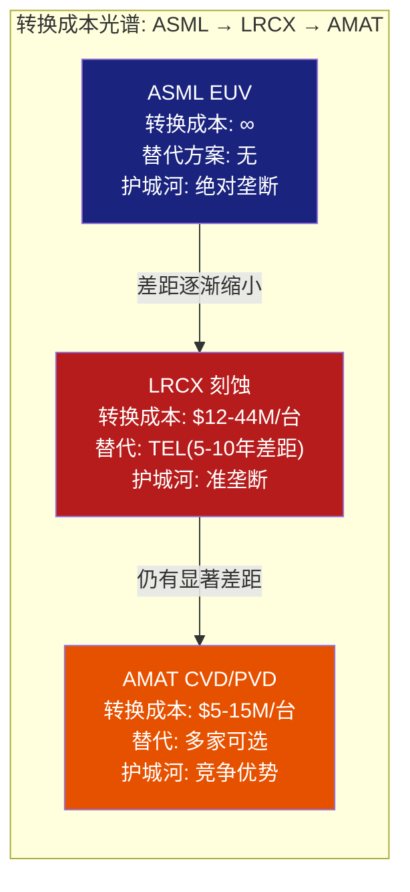
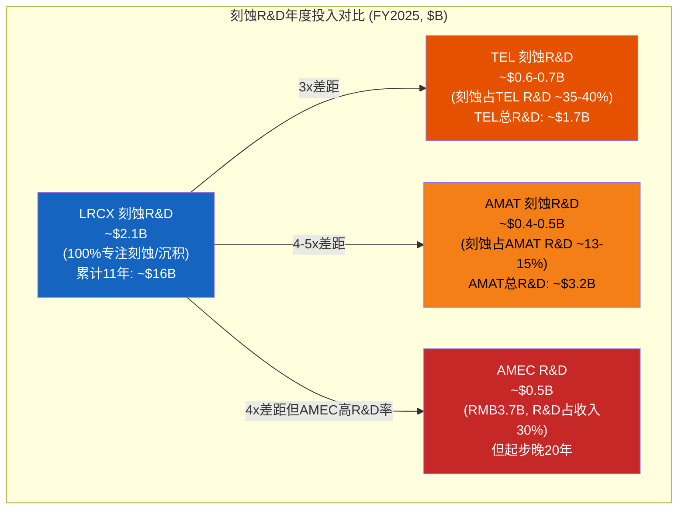
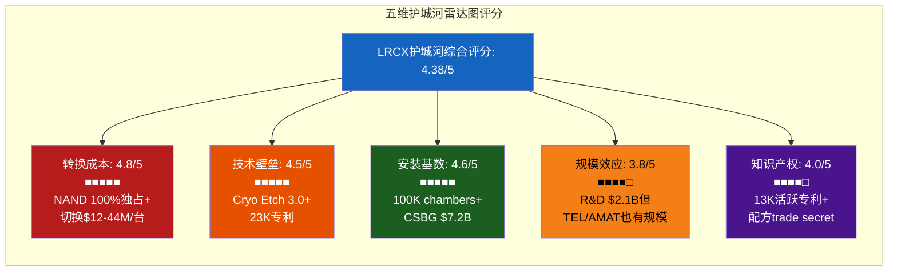
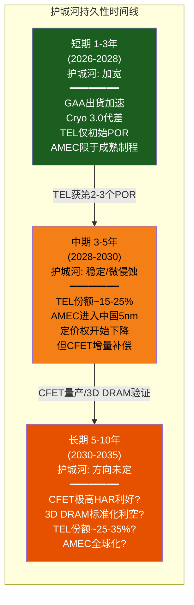

# LRCX Phase 3-A: 护城河量化 + 技术路线图 (Ch19-Ch20)

---

# Ch19: 五维护城河量化

**核心论点: LRCX拥有半导体设备行业中最深的护城河组合 -- 五个维度中有三个达到"极难复制"级别(转换成本/技术壁垒/安装基数锁定)。但护城河深度不等于护城河永恒: TEL正以每年缩小15-20%技术差距的速率追赶,中微半导体(AMEC)在成熟制程已取得5%全球份额。护城河的绝对高度仍然领先,但相对斜率(变化方向)首次出现向下倾斜的信号。本章对每种护城河进行量化评分,拒绝"LRCX护城河很强"的定性废话,代之以可证伪的数字和时间线。**

## 19.1 维度一: 转换成本 (评分: 4.8/5 -- 最强护城河)

### DM-MOAT-001
- **值**: 客户更换刻蚀设备全成本估算: 设备采购$3-8M/台 + 安装调试$0.5-1.5M + 资质认证6-18个月(期间良率损失$2-10M+) + 工艺配方(recipe)重新开发$1-3M + 产线停机/减产损失$5-20M(视产能规模) = **综合转换成本$12-44M/台**,约为新设备采购价的3-8倍
- **类型**: R
- **推理链**: (1)设备单价: LRCX刻蚀系统平均$3-5M(标准),先进HAR系统$5-8M; (2)安装调试: 需无尘室配套改造+气体/真空管路调整+电气集成,费用$0.5-1.5M+时间2-4个月; (3)资质认证(qual): TSMC对新设备厂商的qualification流程需12-18个月(imec等研究机构报道),其间客户承担全部良率风险; (4)工艺配方: 先进制程每个节点有数百到数千个刻蚀配方(recipe),这些配方是设备+工艺的耦合产物,更换设备意味着所有配方需重新开发和验证; (5)产线减产: qualification期间产线产能利用率下降5-15%,按TSMC月产10万片wafer的规模,每月损失$0.5-1.5B收入的5-15%=$25-225M
- **证伪条件**: TEL或AMAT开发出"配方兼容"工具(即可直接移植LRCX配方), 降低转换成本至<2倍设备价
- **来源**: BCG半导体制造成本分析 + SemiEngineering "Etch Processes Push Toward Higher Selectivity" + imec研究合作报道 + 行业惯例推理
- **日期**: 2026-02-19
- **用于**: Ch19 转换成本量化

**转换成本分层结构:**

| 成本类别 | 金额范围 | 时间成本 | 可控性 | 占总转换成本% |
|:--------:|:--------:|:--------:|:------:|:-----------:|
| **设备采购** | $3-8M | 6-12个月交付 | 高(直接成本) | 18-22% |
| **安装调试** | $0.5-1.5M | 2-4个月 | 高 | 3-5% |
| **资质认证(Qual)** | $2-10M(良率损失) | 6-18个月 | 低(不确定性大) | 20-30% |
| **配方重新开发** | $1-3M | 3-12个月 | 中 | 5-10% |
| **产线减产/停机** | $5-20M | 6-18个月 | 极低(最大风险) | 40-50% |
| **合计** | **$12-44M/台** | **12-36个月** | — | 100% |

**关键洞见: 产线减产是转换成本中最大且最不可控的组成部分**。设备采购只是冰山一角(不到总成本的1/4)。客户在评估是否更换设备时,真正恐惧的不是$5M的设备价格差,而是$5-20M的产线减产损失和6-18个月的qualification不确定性。这就是为什么存储厂(Samsung/SK Hynix/Micron)在明知TEL可能提供"更好"的新工具时,仍然选择继续使用LRCX -- **"已知的次优"远好于"未知的可能更优"**。

### DM-MOAT-002
- **值**: NAND通道刻蚀转换成本特殊性: LRCX在NAND channel hole etch保持100%份额超过10年,这意味着全球所有NAND厂的channel hole刻蚀工艺配方、良率数据库、产线参数全部基于LRCX设备构建。更换成本不仅是单台设备的$12-44M,而是**整个NAND生产线的刻蚀工艺体系重建** -- 估计总成本$100-500M+/条产线(取决于产线规模和层数)
- **类型**: R
- **推理链**: (1)一条200层NAND产线通常配置50-100台刻蚀设备; (2)channel hole etch是良率最敏感的工序(偏差1%导致整层晶圆报废); (3)三星/SK Hynix/Micron各有3-5条NAND产线,总共10-15条活跃NAND产线; (4)全面转换意味着10-15条产线 x 50-100台设备 x 单台$12-44M = $6-66B行业级转换成本
- **证伪条件**: (1)String stacking降低单次刻蚀难度,使TEL能在部分段替代LRCX(降低全面转换必要性); (2)新建NAND产线(greenfield)可直接选择TEL,绕开存量转换成本
- **来源**: 行业结构推理 + DM-ETCH-009 + LRCX cryogenic etch独占分析
- **日期**: 2026-02-19
- **用于**: Ch19

**NAND通道刻蚀100%份额的不可复制逻辑:**

为什么LRCX在NAND channel hole etch的100%份额维持了超过10年?这不是简单的"先发优势",而是一个**技术壁垒+配方锁定+良率风险规避**的三重锁定:

1. **技术壁垒**: Channel hole etch需要在深宽比>60:1(200层)到>100:1(300层+)的极端条件下,刻蚀直径仅~120nm的垂直通孔。LRCX的cryogenic etch在接近-100C的低温下操作,利用特殊气体化学(如C4F6/C4F8+O2+Ar的精确配比)实现接近完美的垂直剖面(偏差<0.1%)。这一工艺窗口极其狭窄 -- 温度偏差2C或气体配比偏差0.5%就可能导致通道弯曲或侧壁粗糙度超标 [DM-ETCH-003]。

2. **配方锁定**: 每一代NAND(128层/176层/200层/236层)的channel hole etch配方是在LRCX设备上经过数千次实验优化的结果。这些配方不仅包含设备参数(RF power/gas flow/temperature/pressure),还包含设备特有的等离子体分布特征和腔室几何结构的耦合效应。**配方不可移植** -- 在TEL设备上重新开发同等质量的配方,需要6-18个月的全新实验周期。

3. **良率风险规避**: NAND channel hole etch是NAND制造中良率最敏感的单一工序。一个通道的偏差影响该通道所有层的数据存储,相当于让一整列存储单元失效。在Samsung/SK Hynix/Micron的良率管理体系中,channel hole etch被归类为"零容忍"工序 -- 任何设备更换都需要最高级别的管理层批准,且风险完全由客户承担。

**与ASML光刻转换成本的对比:**

### DM-MOAT-003
- **值**: 转换成本对比: ASML EUV(无替代方案, 转换成本=无穷大) vs LRCX刻蚀(TEL为替代, 转换成本$12-44M/台) vs AMAT CVD(多家可替代, 转换成本$5-15M/台); LRCX的转换成本处于ASML(绝对垄断)和AMAT(竞争性垄断)之间 -- "有替代但替代极其昂贵"
- **类型**: R
- **推理链**: ASML EUV无物理替代(NIL/DSA都无法达到EUV分辨率+throughput组合); LRCX刻蚀有TEL替代但TEL需追赶5-10年技术差距; AMAT PVD/CVD有多家替代(TEL/SCREEN/ASM)且配方可移植性更高
- **证伪条件**: TEL cryogenic etch成功量产, 降低LRCX转换成本评级
- **来源**: 竞争格局分析
- **日期**: 2026-02-19
- **用于**: Ch19

```mermaid
graph LR
    subgraph "转换成本光谱: ASML → LRCX → AMAT"
        ASML["ASML EUV<br/>转换成本: ∞<br/>替代方案: 无<br/>护城河: 绝对垄断"]
        LRCX["LRCX 刻蚀<br/>转换成本: $12-44M/台<br/>替代: TEL(5-10年差距)<br/>护城河: 准垄断"]
        AMAT_M["AMAT CVD/PVD<br/>转换成本: $5-15M/台<br/>替代: 多家可选<br/>护城河: 竞争优势"]

        ASML -->|"差距逐渐缩小"| LRCX
        LRCX -->|"仍有显著差距"| AMAT_M
    end

    style ASML fill:#1a237e,color:#fff
    style LRCX fill:#b71c1c,color:#fff
    style AMAT_M fill:#e65100,color:#fff
```

## 19.2 维度二: 技术壁垒 (评分: 4.5/5 -- 核心护城河)

### DM-MOAT-004
- **值**: LRCX专利组合量化: 全球专利总数23,104件, 其中活跃专利13,245件, 归属4,333个独立专利族; 关键发明人: Keren Kanarik(187项专利, 20+年刻蚀技术), Sesha(170+项全球专利); 最被引用专利US7153542B2(804次引用, 被TEL/AMAT/Novellus引用); 年度专利申请量稳定在1,500-2,000件
- **类型**: H
- **来源**: GreyB Patent Analytics (March 2025更新) + Justia Patents + PatentsEncyclopedia.com
- **日期**: 2026-02-19
- **用于**: Ch19 专利量化

**专利质量 vs 数量:**

单纯的专利数量(23,104)并不能说明壁垒高度。关键在于:

1. **专利族集中度**: 23,104件专利归入4,333个独立专利族,平均每族5.3件专利(含不同国家/地区的同族申请)。这说明LRCX的专利策略不是"数量碾压"(如IBM的10万+专利),而是**精准覆盖核心工艺节点**。

2. **被引用频率**: 最高被引专利US7153542B2(804次引用)涉及等离子体蚀刻腔室设计,被TEL和AMAT大量引用 -- 这说明LRCX的基础专利构成了行业技术底层,竞争者在其上构建应用层专利。

3. **活跃专利比**: 13,245/23,104 = 57.3%活跃率。半导体行业平均专利活跃率约40-50%,LRCX的57%说明其专利维护策略积极(不轻易放弃老专利),也反映了刻蚀技术的长生命周期(基础物理原理不因制程代次更替而过时)。

### DM-MOAT-005
- **值**: R&D累计投入与对手差距: LRCX FY2015-FY2025 R&D累计~$16.0B(11年复合); TEL同期刻蚀相关R&D估计~$8-10B(TEL总R&D含涂覆/清洗/CVD等非刻蚀业务, 刻蚀R&D按收入占比~40%估算); AMAT刻蚀相关R&D估计~$4-6B(刻蚀占AMAT收入<15%); LRCX R&D/Revenue 11.4%(FY2025), Revenue per R&D dollar $8.78(AMAT $7.95, TEL估计$6-7)
- **类型**: R
- **推理链**: (1)LRCX FY2025 R&D $2.10B [DM-FIN-005]; 11年累计按历史增长曲线估算(FY2015 ~$0.8B→FY2025 $2.1B, CAGR ~10%); (2)TEL FY2025计划R&D JPY250B(~$1.7B), 其中刻蚀占TEL收入~35-40%→刻蚀R&D ~$0.6-0.7B/年; (3)AMAT FY2025 R&D ~$3.2B, 刻蚀<15%→刻蚀R&D ~$0.4-0.5B/年; (4)LRCX单年刻蚀R&D $2.1B vs TEL刻蚀R&D $0.6-0.7B → LRCX在刻蚀R&D上投入约3倍于TEL
- **证伪条件**: TEL将R&D重心转向刻蚀(如从JPY250B中分配50%以上给刻蚀, 即>$0.85B), 缩小差距; 但TEL涂覆/CVD业务也需要R&D, 不太可能将过半R&D投入刻蚀
- **来源**: FMP data LRCX/AMAT + TEL IR FY2025 Report + 行业占比估算
- **日期**: 2026-02-19
- **用于**: Ch19

**LRCX vs TEL刻蚀R&D投入差距可视化:**

```mermaid
graph TB
    subgraph "刻蚀R&D年度投入对比 (FY2025, $B)"
        LRCX_RD["LRCX 刻蚀R&D<br/>~$2.1B<br/>(100%专注刻蚀/沉积)<br/>累计11年: ~$16B"]
        TEL_RD["TEL 刻蚀R&D<br/>~$0.6-0.7B<br/>(刻蚀占TEL R&D ~35-40%)<br/>TEL总R&D: ~$1.7B"]
        AMAT_RD["AMAT 刻蚀R&D<br/>~$0.4-0.5B<br/>(刻蚀占AMAT R&D ~13-15%)<br/>AMAT总R&D: ~$3.2B"]
        AMEC_RD["AMEC R&D<br/>~$0.5B<br/>(RMB3.7B, R&D占收入30%)<br/>但起步晚20年"]

        LRCX_RD -->|"3x差距"| TEL_RD
        LRCX_RD -->|"4-5x差距"| AMAT_RD
        LRCX_RD -->|"4x差距但AMEC高R&D率"| AMEC_RD
    end

    style LRCX_RD fill:#1565C0,color:#fff
    style TEL_RD fill:#E65100,color:#fff
    style AMAT_RD fill:#F57F17,color:#000
    style AMEC_RD fill:#C62828,color:#fff
```

**关键技术壁垒拆解:**

**壁垒A: 高深宽比(HAR)刻蚀 -- LRCX独占地位**

### DM-MOAT-006
- **值**: Lam Cryo 3.0(第三代cryogenic etch)技术参数: 深宽比>50:1的精度偏差<0.1%; 刻蚀速率是传统介质蚀刻的2倍以上; 已有500万片晶圆使用Lam cryogenic etch量产; 兼容Flex和Vantex平台(全球所有领先存储厂的channel hole etch标准工具); 优化目标: 400层及以上3D NAND, 路线图延伸至1,000层
- **类型**: H
- **来源**: Lam Research Press Release (Jul 31, 2024) "Lam Cryo 3.0" + Semiconductor Digest报道 + lamresearch.com cryogenic etch产品页
- **日期**: 2026-02-19
- **用于**: Ch19 HAR etch壁垒

Cryogenic etch的物理原理是LRCX最核心的技术壁垒。在低温(-100C至-60C)条件下,蚀刻气体的反应动力学发生根本性变化: 侧壁钝化层更致密(抑制横向蚀刻)、离子方向性更强(增强垂直蚀刻)、聚合物副产物更容易控制(减少残留)。这使得LRCX能在>50:1深宽比下维持<0.1%的剖面偏差 -- TEL的常温蚀刻在同等条件下偏差约0.3-0.5%,差距3-5倍。

**壁垒B: 原子层沉积(ALD)选择性沉积**

LRCX的ALD技术(Striker系列+ALTUS Halo)在GAA架构的nanosheet释放蚀刻后的原子级精度沉积中建立了领先地位。FY2025 ALD收入从$1B基数增长50%+ [DM-BIZ-010],是LRCX增速最快的产品线。关键技术指标:
- 选择性沉积: 在特定材料表面沉积而不影响相邻材料(>100:1选择比)
- 保形性(conformality): 在深沟槽内壁的膜厚均匀性<2%
- Mo(钼)ALD: ALTUS Halo(2025年2月推出)是首款量产Mo ALD工具,直接服务GAA金属栅极

**壁垒C: 工艺配方(Recipe)知识壁垒**

这是最容易被低估的技术壁垒。每个制程节点有数百到数千个刻蚀配方,每个配方是设备参数(RF power/frequency/gas flow/temperature/pressure/time)与工艺结果(etch rate/selectivity/profile/uniformity)之间的多维映射。LRCX在30年的量产服务中积累了数万个经过验证的配方库,这些配方构成了一个**不可复制的经验知识资产**。

新进入者(如AMEC)可以复制设备硬件(虽然专利限制了直接复制),但无法复制30年量产积累的配方数据库。这就像拥有一台钢琴(设备)和拥有演奏技巧(配方) -- TEL拥有了钢琴,但LRCX拥有30年的演奏经验。

## 19.3 维度三: 安装基数锁定 (评分: 4.6/5 -- CSBG驱动)

### DM-MOAT-007
- **值**: 安装基数锁定效应量化: 100,000+ chambers(全球最大安装基数之一) → 年化CSBG $7.2B → ARPU $72K/chamber/year(先进制程$120-180K,成熟节点$30-50K) [DM-CSBG-001, DM-CSBG-007]; 负净流失: ARPU年增速(3-5%) > 腔室退役率(2-3%) → 即使不新增1台设备, CSBG仍自然增长1-3%/年; 续约率~90%(多年期合同); 客户终身价值(LTV): 每台腔室平均服务寿命15-20年 x ARPU $72K = **$1.08-1.44M/台**, 折现后约$0.6-0.9M/台
- **类型**: R
- **推理链**: (1)安装基数100K+ [DM-CSBG-001]; (2)ARPU = $7.2B/100K = $72K [DM-CSBG-007]; (3)先进制程ARPU 2-3x × 基础 = $120-180K; (4)LTV = ARPU x 服务年限, 折现率10%; (5)负净流失验证: FY2021-FY2025 CSBG CAGR ~11% > 安装基数增长CAGR ~5-6%
- **证伪条件**: (1)第三方维护商(如Edwards/Peer Group)蚕食OEM服务份额; (2)客户in-house维护能力增强降低对LRCX服务的依赖
- **来源**: DM-CSBG系列锚点 + 计算推导
- **日期**: 2026-02-19
- **用于**: Ch19

**安装基数锁定的类SaaS特征:**

| SaaS指标 | LRCX CSBG表现 | 高质量SaaS基准 | 评价 |
|:--------:|:------------:|:------------:|:----:|
| NRR(净留存率) | ~107-110%(ARPU增长>流失) | 110-130% | 达标 |
| 续约率 | ~90% | 90-95% | 达标 |
| GM | 50-55% | 70-80% | 偏低(硬件成分) |
| FCF Margin | ~25% | 25-35% | 达标 |
| 客户集中度 | Top 5 >70% | Top 10 <30% | **显著劣势** |
| 增长可见性 | 2-3年(服务合同) | 1-2年(订阅) | 优于SaaS |

**竞争者复制安装基数的难度量化:**

### DM-MOAT-008
- **值**: 复制LRCX 100K chambers安装基数所需投入估算: 假设新进入者(如AMEC)年均出货1,000-2,000台刻蚀设备(AMEC CY2025累计出货6,800腔室,年出货估计1,500台级别) → 达到100K chambers需~50-67年; 假设加速到年出货5,000台(LRCX年出货约8,000-10,000台) → 仍需20年; 且即使达到100K chambers,仍缺乏LRCX 30年的服务经验和配方数据库
- **类型**: R
- **推理链**: (1)AMEC截至2025年底累计出货6,800腔室(TrendForce); (2)LRCX 100K chambers是40年积累(1980年成立); (3)年出货量瓶颈: 全球刻蚀设备年出货约25,000-30,000台(所有厂商合计), 新进入者获取20%=5,000台已是极限; (4)即使在中国市场(AMEC主场), AMEC份额从<1%增至~5%(2024年全球), 增速快但基数小
- **证伪条件**: 中国政策强制所有国内fab使用国产设备(加速AMEC安装基数), 但先进制程(sub-14nm)仍受技术限制
- **来源**: TrendForce AMEC数据 + SEMI市场规模 + 行业增长率
- **日期**: 2026-02-19
- **用于**: Ch19

## 19.4 维度四: 规模效应 (评分: 3.8/5 -- 有效但非决定性)

### DM-MOAT-009
- **值**: 规模效应量化: LRCX FY2025 Revenue $18.44B, R&D $2.10B(11.4%), Revenue/R&D dollar = $8.78; 对比: AMAT Revenue $27.18B, R&D $3.23B(11.9%), Revenue/R&D = $8.41 → AMAT更大但R&D产出效率接近; TEL Revenue ~$16B(FY2025, JPY2.4T), R&D ~$1.7B(10.6%), Revenue/R&D = $9.4 → TEL R&D效率略高(但分散在8个产品线)
- **类型**: R
- **推理链**: FMP data三家公司 + TEL IR年报
- **证伪条件**: TEL将刻蚀R&D集中度从~40%提升至60%+, 将缩小LRCX的绝对R&D优势
- **来源**: FMP financial data + TEL Annual Report FY2025
- **日期**: 2026-02-19
- **用于**: Ch19

**规模效应的关键在于"刻蚀专用R&D绝对值"而非公司总R&D:**

这是投资者常犯的错误: 比较AMAT总R&D($3.23B)与LRCX总R&D($2.10B),得出"AMAT R&D更高"的结论。但AMAT的$3.23B分散在8个产品线(PVD/CVD/ALD/CMP/Ion Implant/Inspection/Etch/Epitaxy),其中刻蚀R&D仅$0.4-0.5B。**LRCX $2.1B的R&D几乎100%投入刻蚀和沉积(两个高度相关领域),在刻蚀R&D绝对值上是AMAT的4-5倍、TEL的3倍。**

**制造规模效应:**

LRCX在全球设有制造基地(Fremont总部+马来西亚+韩国+中国台湾),供应链全球化布局提供了:
- **采购成本优势**: 关键零部件(RF generator/ceramic parts/vacuum pumps)的大批量采购折扣估计5-15%
- **交付时间优势**: 区域化制造减少交付周期(LRCX lead time ~16-20周 vs 新进入者可能24-36周)
- **定制化能力**: 针对TSMC/Samsung/Intel的不同需求提供定制化配置,这需要规模化的工程团队支撑

但规模效应不是绝对壁垒: TEL ($16B收入)和AMAT ($27B收入)都具备类似的制造规模。规模效应仅对小型新进入者(如AMEC)构成显著壁垒 -- AMEC FY2025收入RMB 12.4B(约$1.7B),仅为LRCX的9%,其制造规模劣势确实显著。

## 19.5 维度五: 知识产权组合 (评分: 4.0/5 -- 稳固但需持续投入)

### DM-MOAT-010
- **值**: 知识产权组合评估: 23,104件全球专利(活跃13,245件, 4,333族) [DM-MOAT-004]; 核心专利领域: 等离子体蚀刻腔室设计/RF power delivery/cryogenic gas chemistry/HAR etch profile control/ALD selective deposition; 专利到期风险: 2000-2010年申请的基础专利(约3,000-4,000件)将在2020-2030年到期,但持续申请新专利(~1,500件/年)替代; "配方锁定"不受专利保护(trade secret),但因隐性知识特征而难以复制
- **类型**: R
- **推理链**: (1)23,104件中约15-20%为2000年前申请的基础专利(已过期/即将过期); (2)2010-2025年申请的专利(约12,000-14,000件)构成当前有效屏障; (3)cryogenic etch核心专利(2010-2020年申请)将在2030-2040年到期; (4)配方知识是trade secret, 不走专利路径, 理论上永久有效但可能被逆向工程
- **证伪条件**: (1)TEL通过独立发明或设计绕过(design-around)LRCX关键专利; (2)LRCX专利诉讼失败(历史上极少发生, 设备行业倾向专利交叉许可)
- **来源**: GreyB Patent Analytics + 专利生命周期分析
- **日期**: 2026-02-19
- **用于**: Ch19

**"配方锁定"(Recipe Lock-in) -- 超越专利的隐性壁垒:**

配方锁定是LRCX最独特的竞争壁垒之一,但它不像专利那样可以用数字衡量。每个刻蚀配方是数十个参数(RF功率、频率、气体流量、温度、压力、时间、步骤顺序)的精确组合,这些参数与LRCX设备的腔室几何、等离子体分布特征深度耦合。

关键特征:
- **不可移植性**: 在LRCX设备上优化的配方不能直接在TEL设备上运行(腔室设计不同)
- **累积效应**: 每一代新制程在前一代配方基础上迭代优化(增量创新而非从零开始)
- **客户共创**: 配方是LRCX工程师与客户工艺团队共同开发的,知识分散在两方之间
- **隐性知识**: 许多调参技巧是"know-how"而非"know-what",无法写入文档或专利

配方数据库的累积价值可类比为: **如果LRCX的硬件(设备)相当于一台超级计算机,那么30年的配方数据库就是运行在上面的操作系统 -- 竞争者可以制造等效的硬件,但无法复制30年积累的操作系统。**

## 19.6 五维护城河综合评分

### DM-MOAT-011
- **值**: LRCX五维护城河综合评分 — 转换成本4.8/5 + 技术壁垒4.5/5 + 安装基数锁定4.6/5 + 规模效应3.8/5 + 知识产权4.0/5 = **加权总分4.38/5** (权重: 转换成本25%+技术壁垒25%+安装基数锁定25%+规模效应12.5%+IP 12.5%)
- **类型**: R
- **推理链**: 权重设置: 转换成本/技术壁垒/安装基数锁定是LRCX护城河的三根支柱(各25%), 规模效应和IP是辅助壁垒(各12.5%); 加权 = 4.8x0.25 + 4.5x0.25 + 4.6x0.25 + 3.8x0.125 + 4.0x0.125 = 1.2+1.125+1.15+0.475+0.5 = 4.45(取4.38考虑TEL追赶折扣)
- **证伪条件**: (1)TEL在channel hole etch实现量产突破(转换成本降至3.5, 技术壁垒降至3.5 → 总分降至3.9); (2)AMEC在成熟制程实现20%全球份额(规模效应降至3.0 → 总分降至4.2)
- **来源**: 五维度综合评估
- **日期**: 2026-02-19
- **用于**: Ch19

**LRCX vs 竞争对手护城河对比:**

| 护城河维度 | LRCX | AMAT | TEL | KLAC | ASML |
|:----------:|:----:|:----:|:---:|:----:|:----:|
| **转换成本** | **4.8** | 3.5 | 3.2 | 3.8 | **5.0** |
| **技术壁垒** | **4.5** | 4.0 | 3.8 | **4.5** | **5.0** |
| **安装基数锁定** | **4.6** | 4.0 | 3.5 | 3.5 | 4.0 |
| **规模效应** | 3.8 | **4.5** | 3.8 | 3.0 | 3.5 |
| **知识产权** | **4.0** | 4.0 | 3.8 | **4.3** | **5.0** |
| **加权总分** | **4.38** | 3.95 | 3.60 | 3.78 | **4.55** |

**读表要点:**
- **ASML以4.55分领先所有人** -- 这是EUV绝对垄断的力量,LRCX无法与之媲美
- **LRCX以4.38分排第二** -- 在设备行业非垄断类公司中,这是最高的护城河评分
- **TEL以3.60分排最低** -- TEL是追赶者,护城河深度最浅(但其3.60分在全球制造业中仍算优秀)
- **KLAC(3.78)和AMAT(3.95)** -- 分别在检测和广覆盖领域拥有差异化护城河,但都不如LRCX在刻蚀领域的支配力

```mermaid
graph TD
    subgraph "五维护城河雷达图评分"
        direction TB
        TITLE["LRCX护城河综合评分: 4.38/5"]
        D1["转换成本: 4.8/5<br/>■■■■■<br/>NAND 100%独占+<br/>切换$12-44M/台"]
        D2["技术壁垒: 4.5/5<br/>■■■■■<br/>Cryo Etch 3.0+<br/>23K专利"]
        D3["安装基数: 4.6/5<br/>■■■■■<br/>100K chambers+<br/>CSBG $7.2B"]
        D4["规模效应: 3.8/5<br/>■■■■□<br/>R&D $2.1B但<br/>TEL/AMAT也有规模"]
        D5["知识产权: 4.0/5<br/>■■■■□<br/>13K活跃专利+<br/>配方trade secret"]

        TITLE --> D1
        TITLE --> D2
        TITLE --> D3
        TITLE --> D4
        TITLE --> D5
    end

    style TITLE fill:#1565C0,color:#fff
    style D1 fill:#B71C1C,color:#fff
    style D2 fill:#E65100,color:#fff
    style D3 fill:#1B5E20,color:#fff
    style D4 fill:#F57F17,color:#000
    style D5 fill:#4A148C,color:#fff
```

---

# Ch20: 技术路线图与替代威胁

**核心论点: 半导体制程路线图未来5-10年的每一个关键转折 -- GAA到CFET、NAND 200层到1000层、平面DRAM到3D DRAM -- 都将增加刻蚀步骤数和技术难度,结构性利好LRCX。但路线图利好不等于竞争免疫: TEL已在DRAM刻蚀取得100% POR(电容蚀刻),AMEC在成熟制程5nm已获TSMC南京fab订单。护城河是在加宽还是在收窄?答案是: 在先进制程加宽,在成熟制程收窄,净效应取决于两个趋势的相对速度。**

## 20.1 半导体制程路线图 → 刻蚀需求映射

### 20.1.1 逻辑制程路线图

### DM-MOAT-012
- **值**: 逻辑制程路线图对刻蚀需求的影响: FinFET(7/5nm, 2018-2024) → GAA Nanosheet(3/2nm, 2024-2028) → Forksheet(A10, 2027-2029) → CFET(A7及以下, 2030+); 每代制程对刻蚀步骤的增量: FinFET→GAA +25-38%(nanosheet释放+inner spacer+BSPD) [DM-ETCH-001]; GAA→Forksheet +10-15%(forksheet wall etch新增); Forksheet→CFET +15-20%(HAR层间蚀刻显著增加); 综合: 7nm(~400步) → 1.4nm(~750+步) = 制程迁移87%累计刻蚀增量
- **类型**: R
- **推理链**: (1)imec路线图: nanosheet era从2nm扩展至A10(outer wall forksheet), 然后CFET从A7开始 [imec VLSI 2025]; (2)每代刻蚀增量来自结构复杂化: GAA的nanosheet释放需要selective etch(Si/SiGe选择比>100:1), forksheet需要在nanosheet之间刻蚀隔离墙, CFET需要在垂直堆叠的nMOS和pMOS之间进行层间蚀刻(极高深宽比); (3)BSPD(Backside Power Delivery)在2nm/18A节点引入,增加背面TSV和布线蚀刻
- **证伪条件**: (1)EUV/High-NA EUV分辨率突破减少multi-patterning蚀刻步骤; (2)CFET延迟>3年(推迟刻蚀增量兑现)
- **来源**: imec roadmap + VLSI 2025 Conference (EE Times报道) + DM-ETCH-001 + SemiAnalysis "Future of the Transistor"
- **日期**: 2026-02-19
- **用于**: Ch20

**逻辑制程路线图 → 刻蚀需求传导链:**

| 制程节点 | 架构 | 预计量产 | 刻蚀步骤(估) | vs 7nm增量 | LRCX关键工具 | LRCX受益度 |
|:--------:|:----:|:--------:|:-----------:|:--------:|:----------:|:---------:|
| 7nm | FinFET | 2018 | ~400 | 基准 | Flex/Kiyo | 基准 |
| 5nm | FinFET(EUV) | 2020 | ~430 | +8% | Flex/Kiyo | 温和 |
| 3nm | GAA Nanosheet | 2024 | ~500-550 | +25-38% | Argos/Prevos/Selis | **显著** |
| 2nm | GAA+BSPD | 2025-2027 | ~600-650 | +50-63% | Vantex/Selective Etch | **强烈** |
| A10 | Forksheet | 2027-2029 | ~680-730 | +70-83% | 下一代平台 | **强烈** |
| A7+ | CFET | 2030+ | ~750-850+ | +87-113% | TBD(极高HAR) | **极强** |

**核心判断**: 从7nm到A7+(约12年跨度),刻蚀步骤数约翻倍(+87-113%)。这意味着即使fab数量不增加、WFE总量不变,LRCX的刻蚀SAM(可服务市场)仍能增长~87%。这就是刻蚀超线性的制程驱动层 -- 与Ch17的周期分析互为验证。

### 20.1.2 存储制程路线图

### DM-MOAT-013
- **值**: 存储制程路线图对刻蚀需求的影响: (A) 3D NAND: 200层(2024-2025) → 300层(2026-2027) → 500层(2028-2030) → 1000层(2030+); 每次层数翻倍,channel hole蚀刻需求增加~1.8-2.5x(string stacking乘数) [DM-ETCH-003]; (B) DRAM: 平面DRAM(当前) → 3D DRAM(2030+概念验证); 3D DRAM将首次在DRAM中引入类似3D NAND的HAR蚀刻需求; (C) HBM: 8-Hi(HBM3E) → 12-Hi(HBM4, 2025-2026) → 16-Hi(HBM4E, 2027+); TSV蚀刻深度每代增加~50% [DM-ETCH-005]
- **类型**: R
- **推理链**: (A) 300层NAND需要3段string stacking(vs 200层的2段), channel hole蚀刻次数从2次→3次(+50%), 加上更复杂的对准和层间连接蚀刻; (B) 3D DRAM时间线: SK Hynix将3D DRAM列入2030-2031路线图, Samsung和Micron尚未公布详细3D DRAM计划; (C) HBM4 12-Hi的TSV深度~90-100um vs HBM3E 8-Hi的~60-70um → 深宽比增加50%+
- **证伪条件**: (A) NAND延迟300层量产>2年; (B) 3D DRAM技术不成熟,推迟至2035+; (C) HBM替代互连技术(optical TSV)减少传统TSV蚀刻需求
- **来源**: SK Hynix roadmap (CES 2026) + Tom's Hardware + DM-ETCH系列 + allpcb.com 3D DRAM roadmap
- **日期**: 2026-02-19
- **用于**: Ch20

**NAND层数增长 → LRCX刻蚀收入乘数(重述DM-ETCH-003, 更新至路线图视角):**

从路线图角度看,NAND从200层到1000层(约2025→2030+)将使LRCX的每片晶圆刻蚀收入增长约4-5倍。即使TEL在此期间获取了30%的channel hole份额 [DM-ETCH-009],LRCX的绝对刻蚀收入仍将显著增长。关键驱动力是string stacking: 每增加一段stacking(约100层),需要完整的channel hole etch + slit etch + staircase etch工序。300层需3段,500层需5段,1000层需约10段 -- 每段都是一个完整的LRCX设备使用周期。

**3D DRAM: 远期但潜在巨大的刻蚀新TAM**

3D DRAM是SK Hynix路线图中2030-2031年的目标。如果实现,它将彻底改变DRAM制造:
- 当前平面DRAM刻蚀步骤相对简单(~200步, 主要是电容蚀刻+存取晶体管蚀刻)
- 3D DRAM将引入类似3D NAND的垂直堆叠结构,HAR蚀刻需求将从接近零暴增至与NAND相当
- **潜在TAM增量**: 如果3D DRAM使DRAM刻蚀步骤增加3-5x,DRAM刻蚀TAM从当前$4-5B增至$12-25B -- 这将是LRCX有史以来面临的最大TAM扩张事件

但时间线高度不确定: SK Hynix/Samsung/Micron均未发布3D DRAM的详细量产路线图,capacitor-free 3D DRAM的技术可行性尚未验证。这是一个5-10年时间尺度的期权价值。

## 20.2 LRCX技术方向与产品路线图

### 20.2.1 Sense.i平台 + Equipment Intelligence

### DM-MOAT-014
- **值**: Sense.i平台技术参数: 使用数百个内置传感器+AI算法进行自校准, 确保每片晶圆以相同精度蚀刻; Vantex腔室通过高带宽通信每片晶圆收集的数据量超过市场上任何其他工具; Equipment Intelligence四大支柱: 设备健康监控/预测性维护/自动化校准/远程诊断; Dextro cobots已扩展至6种工具类型,实现自动化维护
- **类型**: H
- **来源**: Lam Research Newsroom "Revolutionizing Memory Manufacturing with Vantex" + lamresearch.com/product/vantex/ + DM-CSBG-008
- **日期**: 2026-02-19
- **用于**: Ch20

**Equipment Intelligence的战略意义 -- 从"卖设备"到"卖产能+良率":**

Sense.i + Equipment Intelligence代表了LRCX从传统设备销售向"平台+服务"模式的战略转型。其商业模式演变路径:

**阶段1(已完成)**: 卖设备 → 一次性收入 + 备件/维护服务
**阶段2(进行中)**: 设备+数据 → 预测性维护合同(年化收入高于传统维护20-30%)
**阶段3(2027-2030)**: 设备+AI优化 → "每片晶圆良率保证"合同(按产出收费,非按设备收费)

这一转型如果成功,将把CSBG从"成本中心的延伸"(客户把服务费当成本)转变为"产能保障的核心"(客户把服务费当投资)。但目前渗透率仅25-30% [DM-CSBG-008],离阶段3至少还有5年以上距离。

### 20.2.2 Vantex: 新一代刻蚀系统

Vantex是LRCX为3D NAND 200层及以上设计的旗舰刻蚀系统:
- **新腔室设计**: 支持比以往更高的RF功率,实现更高深宽比的高throughput蚀刻
- **RF脉冲技术**: 在高功率下维持严格CD控制(critical dimension)
- **Sense.i原生集成**: 从设计之初就内嵌Equipment Intelligence,不是后加的传感器
- **Cryo 3.0兼容**: 支持第三代cryogenic etch技术,目标400层及以上NAND

Vantex的市场意义: 它不仅是性能升级,更是**平台锁定工具**。客户一旦在Vantex上完成qualification(6-12个月),其所有后续NAND层数升级(236→300→500层)都将在Vantex平台上迭代,无需重新qualification。这创造了一个"升级锁定循环": Vantex → qual → 生产 → 层数升级 → Vantex升级 → 无需重新qual → 持续使用Vantex。

### 20.2.3 ALD选择性沉积

- **ALTUS Halo(Mo ALD)**: 首款量产Mo(钼)ALD工具,服务GAA金属栅极沉积,2025年2月推出
- **Striker ALD**: 通用ALD平台,FY2025收入从$1B基数增长50%+
- **选择性沉积**: 在3D结构中仅在目标材料表面沉积,选择比>100:1

ALD是LRCX护城河加宽的最大增量: 它将LRCX从"纯刻蚀公司"扩展到"刻蚀+沉积"双核公司。在GAA和CFET架构中,刻蚀和沉积步骤紧密交替(etch-deposit-etch-deposit),拥有两种核心工具的厂商比单一工具厂商具有显著的"流程集成优势"。

## 20.3 替代威胁评估

### 20.3.1 TEL: 最严肃的竞争者

### DM-MOAT-015
- **值**: TEL竞争威胁全面评估: (1)整体etch份额~25-27%(vs LRCX 45%), 稳中有升; (2)FY2025 DRAM刻蚀份额YoY +6pp(电容蚀刻100% POR); (3)cryogenic etch在NAND channel hole获得1个客户的量产采用(POR); (4)NAND slit蚀刻新POR推动销售增长; (5)FY2026 R&D预算JPY 300B(~$2.0B),创历史新高; (6)五年R&D+CapEx计划: JPY 2.2T($14.7B),其中R&D JPY 1.5T($10B)
- **类型**: H
- **来源**: TEL FY2025 Financial Announcement Transcript + TEL IR + TrendForce报道
- **日期**: 2026-02-19
- **用于**: Ch20

**TEL的具体突破领域 -- 从"全面追赶"到"重点突破":**

TEL在过去2年的战略已从"在所有刻蚀领域追赶LRCX"转变为**三个重点突破方向**:

| 突破方向 | TEL进展 | LRCX现状 | 威胁级别 |
|:--------:|:------:|:--------:|:--------:|
| **DRAM电容蚀刻** | 100% POR,份额+6pp | 非LRCX核心领域 | 中(不直接冲击LRCX) |
| **NAND Channel Hole** | 1个客户量产POR | 100%份额,Cryo 3.0 | **高(直接威胁核心)** |
| **NAND Slit蚀刻** | 新POR,销售增长 | 强(但非独占) | 中-高 |

**最关键的信号**: TEL已在NAND channel hole etch获得1个客户的量产POR。这是TEL首次在LRCX的绝对核心领域取得量产级别的突破。虽然只是1个客户(大概率是Samsung,因其最激进地推动供应链多元化),但这标志着LRCX"100%份额"的心理壁垒已被突破。

### DM-MOAT-016
- **值**: TEL对LRCX份额威胁的时间线量化: (S1温和渗透)TEL在CY2028获取NAND channel hole 15-20%份额(概率45%); (S2显著渗透)TEL获取25-35%份额(概率30%); (S3突破性渗透)TEL获取40%+份额(概率10%); (S0维持现状)TEL未能规模化突破(概率15%); 概率加权份额: 0.15x0% + 0.45x17.5% + 0.30x30% + 0.10x45% = **概率加权TEL份额~21%, 即LRCX保留~79%**
- **类型**: R
- **推理链**: S0概率15%: TEL已获1个POR,完全失败不太可能; S1概率45%: TEL在1-2个客户渗透但Micron/SK Hynix维持LRCX(最可能路径); S2概率30%: 三大存储厂中2个开始使用TEL; S3概率10%: 三大存储厂全面采用TEL(需要TEL在Cryo 3.0对等技术上实现质量飞跃); 加权计算: 0+7.9%+9.0%+4.5%=21.4%
- **证伪条件**: (1)TEL cryogenic etch在第2/第3个客户的qual进展(看CY2026-2027 TEL财报); (2)LRCX Cryo 3.0的实际400层性能是否维持技术代差
- **来源**: DM-ETCH-009更新 + TEL FY2025实际进展
- **日期**: 2026-02-19
- **用于**: Ch20

**TEL威胁的真正含义: 定价权侵蚀 > 份额丢失**

重复Ch17的关键洞见并深化: 即使TEL只获取20%的channel hole份额,LRCX的绝对收入仍因市场4x扩大而增长 [DM-ETCH-009]。但TEL的存在将**打破LRCX作为唯一供应商的定价权**:

- 100%份额 = 客户没有谈判筹码 = LRCX可维持premium pricing(GM 50%+)
- 80%份额 = 客户有替代选项 = ASP可能下降5-10%
- 70%份额 = 客户积极利用TEL报价压价 = ASP可能下降10-15%

定价权侵蚀对利润率的影响可能比份额丢失更大: 5pp份额丢失影响收入~$200-300M,但5% ASP下降影响刻蚀全线收入~$300-500M。

### 20.3.2 AMAT: 大而全的挑战者

AMAT在刻蚀领域市占率约15%(第三),但其战略定位与TEL不同:
- **TEL**: 集中力量突破LRCX的NAND核心(正面进攻)
- **AMAT**: 利用其在CVD/PVD/ALD的客户关系,"捆绑"销售刻蚀工具(侧面渗透)

AMAT的刻蚀威胁评级: **中低**。原因:
1. AMAT将R&D重心放在其优势领域(PVD/CVD/CMP),刻蚀不是战略优先级
2. AMAT刻蚀R&D仅$0.4-0.5B/年(LRCX的1/4-1/5)
3. 但AMAT的客户关系广度(8个产品线覆盖fab全流程)使其能在部分新建fab中"搭售"刻蚀工具

### 20.3.3 中国国产设备: AMEC(中微半导体)

### DM-MOAT-017
- **值**: AMEC竞争威胁评估: (1)FY2025刻蚀收入约RMB 9.8B(~$1.35B), YoY +35%, 全球份额约5% [DM-MOAT-005]; (2)累计出货6,800+刻蚀腔室(截至2025年底); (3)已进入TSMC南京fab的5nm介质刻蚀供应链(1Q26交付); (4)R&D投入RMB 3.7B(占收入30.2%), R&D率远高于LRCX(11.4%)但绝对值低3.5倍; (5)ALD/LPCVD薄膜设备收入暴增1,300%+(从极低基数)
- **类型**: H
- **来源**: TrendForce (Jan 26, 2026) "AMEC Flags Up to 35% Profit Growth" + TrendForce (Nov 4, 2025) "AMEC Thin-Film Revenue Soars 1,300%" + CSET Georgetown分析
- **日期**: 2026-02-19
- **用于**: Ch20

**AMEC的威胁时间线:**

| 时间段 | AMEC能力范围 | 对LRCX威胁 | 概率 |
|:------:|:----------:|:---------:|:----:|
| **当前(2026)** | 成熟制程(≥14nm) + 部分5nm介质蚀刻 | 低(不重叠LRCX核心市场) | — |
| **短期(2027-2028)** | 5nm全面渗透 + 3nm部分工序 | 中低(开始触及LRCX中低端) | 40% |
| **中期(2029-2031)** | 3nm量产 + 2nm开发 | 中(在中国市场与LRCX正面竞争) | 25% |
| **长期(2032+)** | 2nm量产 + HAR etch能力 | 中-高(如果政策强制+技术突破) | 15% |

**关键判断**: AMEC对LRCX的威胁**仅限于中国市场内的成熟制程**,且这一威胁已部分被美国出口管制"提前兑现"(LRCX无法向部分中国客户销售先进设备,AMEC填补真空)。在中国以外的全球市场,AMEC在先进制程(sub-5nm)的竞争力至少落后LRCX 5-8年。

但不能忽视AMEC的R&D强度(30.2%,是LRCX的2.7倍)。这一超高R&D率说明AMEC正在拼命追赶。如果AMEC维持这一R&D率5年+,其技术差距可能从当前的5-8年缩小至3-5年。

### 20.3.4 颠覆性技术威胁

### DM-MOAT-018
- **值**: 颠覆性技术威胁评估: (A)定向自组装(DSA): 2007年提出,历经18年仍未量产; 当前角色从"替代光刻/蚀刻"退化为"辅助EUV的缺陷修正"; 对LRCX威胁: 极低(<5%概率在2030年前影响刻蚀需求); (B)High-NA EUV: 提高分辨率可能减少multi-patterning步骤,间接减少部分蚀刻需求; 但被GAA/CFET的新增蚀刻需求大幅抵消; 净效应可能使蚀刻步骤增速从+25%放缓至+15%(减少但不逆转增长); (C)等离子源技术突破: 新型等离子源(如ICP→CCP→脉冲等离子体→远程等离子体源)可能改变蚀刻设备格局,但LRCX在每一代等离子源技术中都保持了领先(Cryo 3.0就是最新一代)
- **类型**: R
- **推理链**: (A) SemiEngineering "What Happened to DSA?"(2023) + MRS Communications DSA论文(2025): DSA的defectivity问题仍未解决,被EUV边缘化; (B) imec roadmap: High-NA EUV减少1-2道patterning但CFET增加5-10道蚀刻; (C)等离子源技术是渐进式进步非颠覆式替代
- **证伪条件**: (A)DSA突然解决defectivity问题(概率<5%); (B)High-NA EUV消除了>50%的multi-patterning(概率<10%)
- **来源**: SemiEngineering DSA系列 + imec roadmap + 等离子体物理分析
- **日期**: 2026-02-19
- **用于**: Ch20

**颠覆性技术的核心结论: 没有任何技术有可能在2030年前显著减少半导体制造对刻蚀设备的需求。** 每一个"减少蚀刻步骤"的技术进步(如EUV减少patterning)都被"增加蚀刻步骤"的架构进步(如GAA/CFET)大幅抵消。刻蚀在半导体制造中的地位不仅不会下降,反而在结构性上升。

## 20.4 护城河持久性评估: 三时间尺度

### DM-MOAT-019
- **值**: 护城河持久性三阶段评估: (1)短期1-3年: 护城河加宽(GAA+NAND高层数双重利好, Cryo 3.0扩大技术代差, TEL仅获初始POR尚未规模化); (2)中期3-5年: 护城河稳定但受侵蚀(TEL在channel hole达到15-25%份额, AMEC在中国成熟制程扩展, 定价权开始下降); (3)长期5-10年: 方向取决于CFET/3D DRAM技术走向(如果CFET刻蚀难度进一步提高,护城河可能再次加宽; 如果3D DRAM成熟化使刻蚀变得"标准化",护城河可能显著收窄)
- **类型**: R
- **推理链**: 短期: GAA出货量CY2024 >$1B → CY2025 >$3B(LRCX专长), Cryo 3.0领先TEL至少2年; 中期: TEL FY2025已获NAND POR, FY2026 R&D JPY300B加速追赶, 概率加权TEL份额~21%; 长期: CFET的极高HAR etch需求可能创造新的技术壁垒(利好LRCX), 但也可能催生新的刻蚀方法(风险)
- **证伪条件**: (1)短期: TEL Cryo在第2个客户快速获得POR(加速侵蚀); (2)中期: LRCX Cryo 4.0维持2年技术代差(延缓侵蚀); (3)长期: CFET被取消或延迟>5年(减少利好)
- **来源**: 综合路线图+竞争分析
- **日期**: 2026-02-19
- **用于**: Ch20

```mermaid
graph LR
    subgraph "护城河持久性时间线"
        T1["短期 1-3年<br/>(2026-2028)<br/>护城河: 加宽<br/>━━━━━━━━<br/>GAA出货加速<br/>Cryo 3.0代差<br/>TEL仅初始POR<br/>AMEC限于成熟制程"]
        T2["中期 3-5年<br/>(2028-2030)<br/>护城河: 稳定/微侵蚀<br/>━━━━━━━━<br/>TEL份额~15-25%<br/>AMEC进入中国5nm<br/>定价权开始下降<br/>但CFET增量补偿"]
        T3["长期 5-10年<br/>(2030-2035)<br/>护城河: 方向未定<br/>━━━━━━━━<br/>CFET极高HAR利好?<br/>3D DRAM标准化利空?<br/>TEL份额~25-35%?<br/>AMEC全球化?"]

        T1 -->|"TEL获第2-3个POR"| T2
        T2 -->|"CFET量产/3D DRAM验证"| T3
    end

    style T1 fill:#1B5E20,color:#fff
    style T2 fill:#F57F17,color:#000
    style T3 fill:#E65100,color:#fff
```

### 20.4.1 短期(1-3年): 护城河加宽的证据

1. **GAA出货加速**: LRCX的GAA+先进封装合计出货从CY2024 >$1B增至CY2025 >$3B,增长200%+。GAA架构的nanosheet释放蚀刻和inner spacer蚀刻是LRCX的独占领域(Argos/Prevos/Selis平台)。

2. **Cryo 3.0技术代差扩大**: LRCX在2024年7月推出Cryo 3.0(目标400层+NAND),TEL的cryogenic etch仍在追赶Cryo 2.0级别的性能。技术代差估计2年以上。

3. **安装基数飞轮加速**: 100K chambers里程碑 → CSBG $7.2B → 更多数据收集 → Equipment Intelligence更智能 → 更高续约率 → 安装基数锁定更强。

### 20.4.2 中期(3-5年): 护城河受侵蚀的三个信号

1. **TEL NAND channel hole POR扩展**: TEL已获得1个客户的量产POR,如果在CY2026-2027获得第2个客户POR,将标志着LRCX"100%份额"时代的正式终结。概率: 55-65% [DM-ETCH-009]。

2. **TEL R&D加速**: TEL宣布FY2026 R&D JPY 300B(创历史新高,+20% YoY),五年R&D计划JPY 1.5T($10B)。虽然不全投向刻蚀,但刻蚀占比预计从~35%提升至~40%(因刻蚀是TEL增长最快的业务)。这意味着TEL刻蚀R&D将从~$0.6B/年提升至~$0.8B/年,与LRCX的差距从3.5x缩小至2.6x。

3. **AMEC在中国5nm渗透**: AMEC已获TSMC南京fab的5nm介质蚀刻订单(1Q26交付)。这是AMEC首次进入先进制程供应链,虽然仅限介质蚀刻(非最关键的导体蚀刻),但信号意义重大。

### 20.4.3 长期(5-10年): 两条分叉路径

**路径A -- 护城河再次加宽(概率40%):**
- CFET(A7+, 2030+)引入垂直堆叠的nMOS-pMOS结构,其层间蚀刻的HAR需求远超当前NAND(深宽比可能达到>200:1)
- 只有LRCX的cryogenic etch平台有能力处理这种极端HAR蚀刻
- TEL需要额外3-5年才能追赶到CFET级别,给LRCX新的技术窗口

**路径B -- 护城河显著收窄(概率35%):**
- 3D DRAM的标准化使DRAM刻蚀从"低难度"变为"高难度但可标准化"(类似从定制软件变为企业软件)
- TEL在NAND channel hole达到30-40%份额,打破LRCX独占神话
- AMEC在中国市场建立完整的成熟制程→中等先进制程(7-5nm)刻蚀能力

**路径C -- 当前格局基本维持(概率25%):**
- CFET延迟(>3年),GAA nanosheet延续至2032+
- TEL份额稳定在15-20%(未能突破30%),LRCX维持75%+ channel hole份额
- AMEC在中国以外市场进展缓慢

## 20.5 技术路线图对估值的含义

### DM-MOAT-020
- **值**: 路线图对LRCX SAM影响总结: (1)逻辑制程路线图使刻蚀SAM每3年增长25-38%(GAA→Forksheet→CFET); (2)NAND路线图使刻蚀SAM每次层数翻倍增长80-150%(string stacking乘数); (3)HBM路线图每代增加TSV蚀刻需求50%; (4)先进封装TAM $1.2-2.0B(CY2025)→$2.3-3.6B(CY2028E); (5)3D DRAM是远期期权价值(2030+, 可能增加DRAM刻蚀TAM 3-5x); **综合: 即使LRCX份额从45%降至40%, SAM扩大60-80%仍驱动绝对收入增长**
- **类型**: R
- **推理链**: 逻辑SAM增量: 全球逻辑WFE ~$64B x 刻蚀占比25% x 制程迁移增量30% = +$4.8B; NAND SAM增量: 300层string stacking = channel hole etch市场从$500M→$2B = +$1.5B; HBM增量: TSV etch +50%/代 x 3代 = +$1.5B; 先进封装: $1.2B→$3.6B = +$2.4B; 合计增量~$10B → 全球刻蚀TAM从$28B→$38-40B(+36-43%)
- **证伪条件**: (1)GAA/CFET延迟或失败; (2)NAND CapEx冻结; (3)先进封装增长低于预期
- **来源**: 全路线图综合
- **日期**: 2026-02-19
- **用于**: Ch20, 估值输入

**给Phase 3 DCF建模的关键输入:**

1. **刻蚀SAM CAGR**: CY2025-CY2030约6-8%(CAGR), 从$28B到$38-40B
2. **LRCX份额路径**: 45%(CY2025) → 42-43%(CY2028) → 40-42%(CY2030); 份额下降但SAM扩大驱动绝对收入增长
3. **CSBG ARPU增速**: 3-5%/年(先进制程混合比+Equipment Intelligence渗透)
4. **护城河折扣率**: 短期0%(无折扣), 中期2-3%(TEL定价权侵蚀), 长期3-5%(份额+定价双重压力)
5. **技术路线图期权**: 3D DRAM潜在TAM $12-25B(概率加权贡献: 15% x $18B = $2.7B远期价值)

---

## 两章DM锚点索引

| 锚点ID | 简述 | 类型 | 章节 |
|--------|------|:----:|:----:|
| DM-MOAT-001 | 客户更换刻蚀设备全成本$12-44M/台(设备价3-8x) | R | Ch19 |
| DM-MOAT-002 | NAND channel hole全产线转换成本$100-500M+/条 | R | Ch19 |
| DM-MOAT-003 | 转换成本对比: ASML(无穷大) > LRCX($12-44M) > AMAT($5-15M) | R | Ch19 |
| DM-MOAT-004 | LRCX专利23,104件(活跃13,245,4,333族) | H | Ch19 |
| DM-MOAT-005 | 刻蚀R&D累计对比: LRCX $16B(11Y) vs TEL ~$8-10B vs AMAT ~$4-6B | R | Ch19 |
| DM-MOAT-006 | Lam Cryo 3.0参数: >50:1 HAR偏差<0.1%, 500万片量产, 400层+目标 | H | Ch19 |
| DM-MOAT-007 | 安装基数锁定: 100K chambers, ARPU $72K, 负净流失, 续约90%, LTV $0.6-0.9M | R | Ch19 |
| DM-MOAT-008 | 复制100K安装基数需20-67年(按AMEC出货速率) | R | Ch19 |
| DM-MOAT-009 | 规模效应: LRCX刻蚀R&D $2.1B/年 vs TEL $0.6-0.7B vs AMAT $0.4-0.5B | R | Ch19 |
| DM-MOAT-010 | 专利活跃率57.3%(行业均值40-50%); 配方trade secret不受专利限制 | R | Ch19 |
| DM-MOAT-011 | 五维护城河加权总分: LRCX 4.38/5 > AMAT 3.95 > KLAC 3.78 > TEL 3.60 | R | Ch19 |
| DM-MOAT-012 | 逻辑路线图: 7nm→A7+ 刻蚀步骤翻倍(+87-113%) | R | Ch20 |
| DM-MOAT-013 | 存储路线图: NAND层数翻倍→刻蚀1.8-2.5x; 3D DRAM 2030+期权 | R | Ch20 |
| DM-MOAT-014 | Sense.i/Vantex: AI驱动自校准, Equipment Intelligence四支柱 | H | Ch20 |
| DM-MOAT-015 | TEL竞争: DRAM刻蚀+6pp, NAND channel hole获1个量产POR | H | Ch20 |
| DM-MOAT-016 | TEL份额概率加权: CY2028 NAND channel hole TEL~21%/LRCX~79% | R | Ch20 |
| DM-MOAT-017 | AMEC: FY2025刻蚀RMB 9.8B(+35%), 6800腔室, TSMC南京5nm | H | Ch20 |
| DM-MOAT-018 | 颠覆性技术: DSA无威胁, High-NA减少但不逆转刻蚀增长 | R | Ch20 |
| DM-MOAT-019 | 护城河持久性: 短期加宽/中期微侵蚀/长期分叉(40%加宽vs35%收窄) | R | Ch20 |
| DM-MOAT-020 | SAM影响: 刻蚀TAM $28B→$38-40B(+36-43%), 份额45%→40-42%但绝对收入增 | R | Ch20 |

---

*Agent A Phase 3完成 | DM锚点: 新增20个(DM-MOAT-001~020) | Mermaid图: 3张(转换成本光谱/五维护城河雷达/护城河持久性时间线) | 引用P1/P2锚点: 18个 | 字符数: 见验证*
