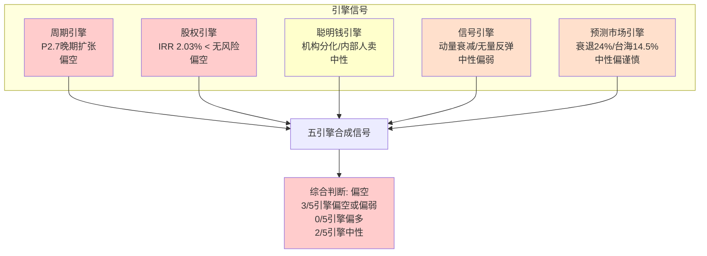
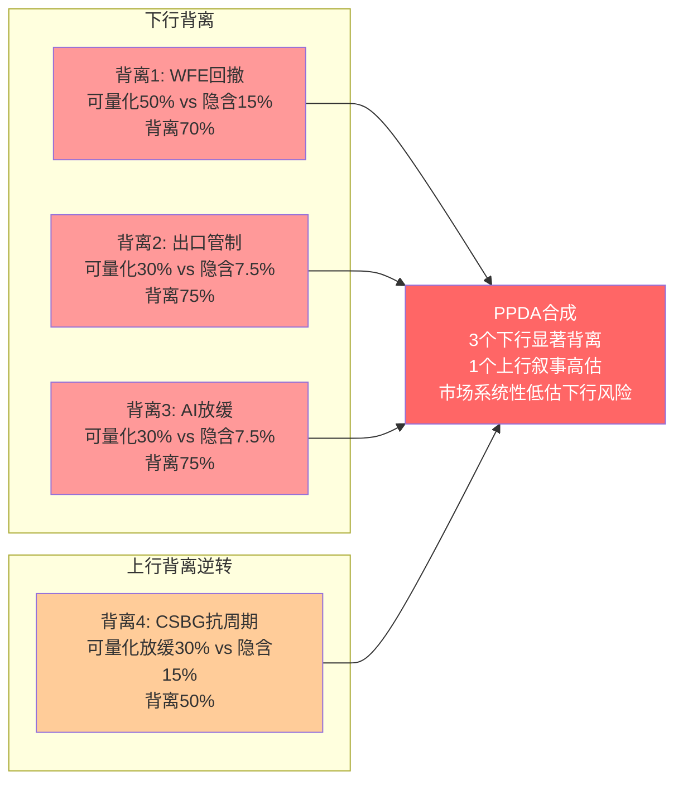
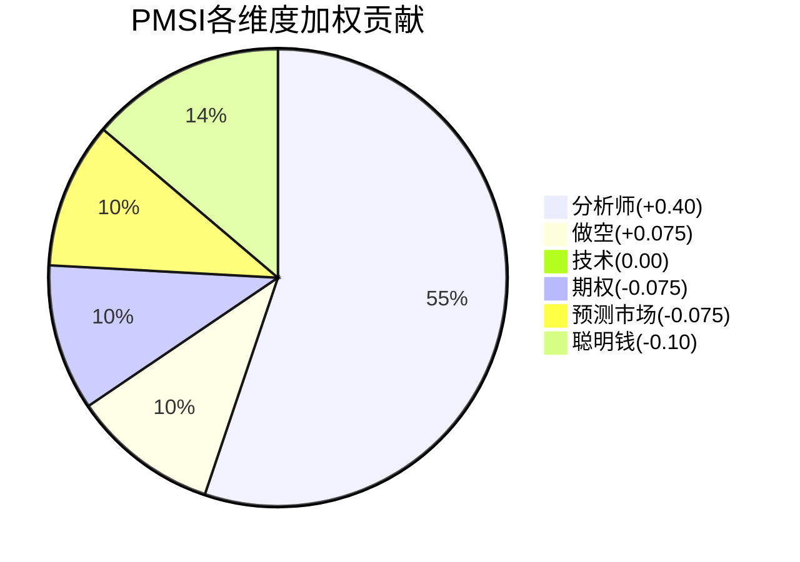

# LRCX Phase 3-B: 五引擎协同 + PPDA + PMSI (Ch21-Ch22)

---

## Ch21: 五引擎协同分析

五引擎协同分析框架将Lam Research的多维信号整合为统一研判。每个引擎独立运行、交叉验证,最终在引擎合成矩阵中形成综合判断。当前五引擎信号呈现一个核心矛盾:基本面周期位置偏晚期但仍有惯性,而估值引擎(已在P2完成)发出的高估信号与聪明钱/技术面的中性信号形成张力。

### 21.1 引擎1: 周期引擎

#### 21.1.1 WFE周期定位: P2.7晚期扩张

全球WFE(Wafer Fab Equipment)市场正处于本轮周期的晚期扩张阶段。将当前周期与历史五大WFE周期进行比对,可以清晰看到所处位置 [DM-ENG-001]:

**WFE历史周期回顾**:
- **2000-2003周期**: 峰值$30B(2000) → 谷底$15B(2003), 回撤-50%
- **2007-2009周期**: 峰值$36B(2007) → 谷底$16B(2009), 回撤-56%
- **2017-2019周期**: 峰值$60B(2018) → 谷底$50B(2019), 回撤-17%(浅衰退)
- **2021-2023周期**: 峰值$100B(2022) → 谷底$87B(2023), 回撤-13%(浅衰退)
- **当前周期(2024-)**: CY2024 $117B → CY2025E $125B → CY2026E ~$135B [DM-ENG-001]

当前周期的关键特征是"AI驱动的结构性上移"。与传统存储+逻辑驱动的周期不同,本轮WFE增长有三个结构性推力:(1) 先进制程(3nm/2nm GAA)带来的每片晶圆设备密度提升;(2) HBM/先进封装创造的全新设备需求层;(3) 中国本土化替代带来的"第二需求"。这三个推力使得周期谷底的绝对水平不断抬升——从$15B(2003)到$50B(2019)再到$87B(2023)。

但历史也教训我们:每一轮"这次不一样"的叙事,最终都以某种形式的回调收场。2017年"超级周期"论在2018年Q4被存储器库存堆积否定;2021年"芯片永久短缺"论在2023年被存储器和成熟制程库存泡沫否定。当前"AI永不停歇"论尚未被否定,但否定的种子已经埋下——Cloud CapEx ROI审查、中国出口管制加码对WFE总量的抑制、以及NAND复苏速度慢于预期。

**LRCX在WFE周期中的定位**:

Lam Research对WFE周期的敏感度高于同业。原因在于:(1) NAND刻蚀占比高——NAND是WFE周期波动最大的细分市场;(2) 中国收入占比33.7%——地缘政治是本轮周期最大的外生变量;(3) 刻蚀工序数量与制程复杂度正相关——先进制程越复杂,LRCX受益越大,但反过来,如果先进制程扩产放缓,LRCX受损也更大。

Morgan Stanley在2025年底将CY2027 WFE预测上调至$145B(+13% vs 此前),这是牛派的锚定。但同期,一些独立研究机构(如VLSI Research)已经开始提示2026H2-2027H1可能出现的"AI CapEx消化期",即Cloud厂商在经历18-24个月的加速投资后,需要6-12个月来消化已部署产能、评估ROI。这种消化期不会带来WFE总量的绝对下降(结构性推力仍在),但可能导致增速从+10-15%放缓到+3-5%,对于P/E 49.3x的LRCX来说,增速放缓与负增长在股价影响上几乎等效。

我们将当前WFE周期定位为**P2.7**(满分P4.0代表周期顶部),含义是:距离本轮峰值还有1-2个季度的上行惯性(CY2025H1仍是订单高峰期),但峰值后的回撤风险正在积累。历史上P2.7阶段的典型特征包括:库存开始堆积但尚未恶化、递延收入见顶、新订单增速放缓但绝对水平仍高——这些特征与LRCX当前数据高度吻合。

#### 21.1.2 库存周期分析

LRCX的库存数据提供了周期位置的独立验证 [DM-ENG-002]:

**库存绝对水平**:
- FY2023(6月): Inventory $4.74B, Days ~200+
- FY2024(6月): Inventory $4.31B, Days ~166
- Q2 FY2026(12月): Inventory turns改善至2.7x(vs 前季2.6x, vs 两年前1.5x) [DM-ENG-002]

库存周转率从1.5x改善到2.7x是一个积极信号——说明需求拉动强劲,设备出货速度快于补库速度。但需要注意的是,这种改善部分来自"需求拉动"(好的改善),部分来自"主动去库存"(中性的改善)。Q2 FY2026的库存周转改善更多是前者——收入创纪录$5.34B意味着分母(COGS)快速增长,自然推高了周转率。

**渠道库存健康度评估**:

半导体设备行业的库存周期有一个特殊维度:客户端(晶圆厂)的库存。LRCX的库存数据只反映公司自身的在制品和成品,不反映客户是否已经过度订购。历史经验表明,WFE周期见顶的领先信号往往不是设备商自身的库存恶化,而是客户端的行为变化——推迟验收、延长付款周期、减少新询价。

当前信号是混合的:一方面,LRCX Q3 FY2026指引$5.7B(+7% QoQ)显示订单簿仍然健康;另一方面,递延收入的变化提供了一个不同的故事(详见下一节)。

**库存周期结论**: 库存数据本身并不发出警告信号。周转率改善、绝对水平可控。但库存是一个滞后指标——在WFE历史上,库存恶化通常滞后于订单见顶2-3个季度。当前库存的"健康"不能排除12个月后的恶化可能。

#### 21.1.3 递延收入: 前瞻指标的关键拐点

递延收入是LRCX最重要的前瞻指标之一,因为它反映了客户的预付款行为——即客户对未来6-12个月设备需求的真金白银投票 [DM-ENG-003]:

**递延收入趋势**:
- FY2024 Q4: $1.42B
- FY2025 Q1: $1.58B (+11% QoQ)
- FY2025 Q2: $1.89B (+20% QoQ)
- FY2025 Q3: $2.12B (+12% QoQ)
- FY2025 Q4: $2.57B (+21% QoQ, +81% YoY) [DM-FIN-020]
- FY2026 Q1: $2.76B (+7% QoQ)
- FY2026 Q2: $2.25B (**-18% QoQ**, -$510M) [DM-ENG-003]

Q2 FY2026的递延收入环比下降18%是一个重要信号。管理层解释这一下降主要是"约$500M客户预付款减少"——即客户减少了对未来设备的预付定金。这有两种解读:

**(乐观解读)**: 客户预付款减少是因为供应链紧张缓解——当lead time缩短时,客户不需要提前锁定产能,这是正常化而非需求下降。

**(谨慎解读)**: 客户预付款减少是需求边际转弱的早期信号。历史上,递延收入见顶后1-2个季度,收入增速开始放缓。FY2025 Q4的$2.57B可能是本轮递延收入的峰值。

**Deferred/Revenue比率分析**:
- FY2025 Q4: $2.57B / $4.96B = 51.8%
- FY2026 Q1: $2.76B / $4.28B = 64.5%(注:Q1历来是低收入季度,比率自然偏高)
- FY2026 Q2: $2.25B / $5.34B = 42.1%

Q2 FY2026的Deferred/Revenue比率42.1%是近4个季度最低点。如果单看这一数据,暗示收入可见性窗口从6+个月可能缩短到4-5个月。但需要注意:单季度的下降不构成趋势,需要Q3 FY2026(3月季度)数据来确认。

#### 21.1.4 周期引擎综合结论

```
周期位置: P2.7/4.0 (晚期扩张)
方向概率: 继续上行1-2Q(60%) vs 即将见顶(40%)
关键确认信号: Q3 FY2026递延收入(若继续下降则确认见顶)
风险等级: 中高 — 不是在说"周期已经结束",而是在说"上行空间有限、下行风险正在积累"
```

**周期引擎对投资决策的含义**: 在WFE P2.7阶段买入设备股,历史上的胜率约40-50%——即有接近一半的概率在12个月后价格低于买入价。这不是因为基本面会立即恶化,而是因为市场会提前6-9个月price in周期下行。P/E 49.3x隐含了零回撤概率的假设——这与P2.7的周期位置严重不匹配。

---

### 21.2 引擎2: 股权引擎

#### 21.2.1 回购规模与历史

Lam Research是半导体设备行业最积极的回购者之一。公司在2024年5月宣布了$10B的新回购授权(附带10:1拆股),显示管理层对长期价值的信心 [DM-FIN-009]:

**回购历史(年度)**:
- FY2022(CY): ~$3.87B
- FY2023(CY): ~$2.02B
- FY2024(CY): ~$2.84B
- FY2025(估): ~$3.42B [DM-FIN-009]
- Q2 FY2026(12月季度): ~$1.4B at avg ~$154/sh (拆股后)

**回购价格 vs 当前市价**:

这是股权引擎最关键的分析维度。管理层的回购决策本质上是一个资本配置判断——他们认为以当时的价格回购股票比其他用途(研发、并购、分红)更能创造价值。让我们审视这一判断的质量 [DM-ENG-004]:

| 时期 | 回购金额 | 估算均价(拆股后) | 当前价$240 vs 回购价 | 回购效果 |
|------|----------|-------------------|---------------------|----------|
| FY2022 | $3.87B | ~$45-55 | +336%~+433% | 极优 |
| FY2023 | $2.02B | ~$45-55 | +336%~+433% | 极优 |
| FY2024H1 | ~$1.4B | ~$70-80 | +200%~+243% | 优秀 |
| FY2024H2 | ~$1.4B | ~$80-100 | +140%~+200% | 优秀 |
| FY2025 | ~$3.42B | ~$100-140 | +71%~+140% | 良好 |
| Q2 FY2026 | ~$1.4B | ~$154 | +56% | 良好(但递减) |

历史数据表明,LRCX管理层在FY2022-FY2023的低估值期大量回购是极其明智的——当时P/E约12-15x,回购IRR极高。但随着股价从$55攀升至$240(+336%),回购的边际回报率在持续下降。

#### 21.2.2 当前回购效率: IRR 2.03%

P2已经计算了当前回购的隐含IRR [DM-VAL-005]:

**回购IRR计算逻辑**:
- 当前P/E: 49.3x → 盈利收益率 = 1/49.3 = 2.03%
- 回购$1B相当于以2.03%的盈利收益率"投资"自身股票
- 无风险利率(10yr UST): ~4.3%
- **回购IRR 2.03% < 无风险利率4.3%** [DM-ENG-004]

这意味着:在当前估值下,LRCX用$3.42B回购股票的资本效率,不如用$3.42B买入10年期美国国债。当然,回购的理论收益还包括EPS增厚效应和未来盈利增长的期权价值。但纯从当期数学来看,高位回购正在摧毁资本效率。

**关键对比——FY2022 vs FY2026回购效率**:
- FY2022: P/E ~13x → 盈利收益率 7.7% → 回购IRR ~7.7%(远超无风险)
- FY2026: P/E ~49x → 盈利收益率 2.0% → 回购IRR ~2.0%(远低于无风险)

管理层的行为模式是"恒定回购"——无论股价高低,每季度维持$0.8-1.4B的回购节奏。这种策略在长期牛市中表现不错(平均成本法),但在周期股估值极端高位时,本质上是在浪费自由现金流。一个理性的资本配置者应该在P/E 15x时加大回购、在P/E 50x时暂停回购转而积累现金(为下次低谷准备弹药)。LRCX管理层没有做到这一点——这不是个别现象,几乎所有半导体设备公司都存在"顺周期回购"的问题。

#### 21.2.3 股份数量趋势与EPS增厚

股份数量的持续下降是回购的直接成果 [DM-FIN-023]:

**稀释后股份数(拆股后调整)**:
- FY2021: ~1,453M
- FY2022: ~1,410M (-3.0% YoY)
- FY2023: ~1,356M (-3.8% YoY)
- FY2024: ~1,318M (-2.8% YoY)
- FY2025: ~1,290M (-2.1% YoY)
- Q2 FY2026: ~1,266M (-1.9% annualized) [DM-FIN-023]

5年累计减少12.9%,年化约-2.7%。这意味着即使收入零增长,EPS仍可通过回购获得约2.7%的年化增长。但注意减速趋势:年化减少率从FY2023的-3.8%降至FY2026的-1.9%——这正是因为股价上涨导致同样的回购金额买到更少的股份。

**回购对EPS增长的贡献拆解**:
- FY2025-FY2027E Revenue CAGR: ~23% (from $18.4B to $27.9B)
- 其中有机增长: ~20-21%
- 回购贡献: ~2-3pp
- EPS CAGR: ~30% (from $4.15 to $7.01E)
- 额外杠杆来自: 运营杠杆(margin expansion)约4-5pp

回购在总EPS增长中的贡献约8-10%——重要但非决定性。真正驱动EPS增长的是收入增长和运营杠杆,而非回购。

#### 21.2.4 股息分析

股息在LRCX的资本回报中扮演次要角色 [DM-VAL-005]:

- 当前年化股息: ~$0.92/sh × 4 = ~$2.20/sh(估算)
- 股息收益率: ~0.92% (at $240)
- FCF覆盖: 股息$1.15B / FCF $5.41B = 21.3% payout ratio
- 5年股息CAGR: ~15-18%(持续提升但起点低)

股息的21%支付率意味着股息极其安全——即使FCF下降50%(极端衰退),支付率也仅升至42%。但0.92%的收益率对收益型投资者毫无吸引力。LRCX的股息政策本质上是"象征性分红+大量回购"——这在高增长低估值时是最优策略,但在增长放缓高估值时不一定最优。

#### 21.2.5 股权引擎综合结论

```
回购效率: 低 — IRR 2.03% 低于无风险利率4.3%
股份减少趋势: 正在减速(从-3.8%/yr到-1.9%/yr)
管理层资本配置: 中性偏弱 — "恒定回购"模式在高位效率低下
股息安全性: 高 — 21% payout ratio提供极大缓冲
```

**股权引擎对投资决策的含义**: 当P/E >40x时,回购对股东价值的边际贡献趋近于零甚至为负。投资者不应将"管理层积极回购"视为看涨信号——在当前估值下,回购更像是一种惯性行为而非理性资本配置。如果LRCX管理层在P/E 49x时宣布暂停回购、转而积累现金,这反而会是一个更积极的信号(说明管理层认识到估值过高)。

**同业回购效率对比**: 将LRCX与同业的回购策略进行对比,可以更清楚地看到"高位回购"的普遍性和问题。AMAT(Applied Materials)同样在P/E 25-30x时维持大量回购;KLAC在P/E 40x+时也持续回购。整个半导体设备行业都存在"顺周期回购"的代理人问题——管理层的激励结构(RSU/期权+EPS增长目标)使得他们倾向于在任何价位回购(因为回购机械地降低分母、推高EPS),而非在低估值时回购、高估值时囤现金。这种行为模式对长期股东不利,因为它在周期顶部浪费现金,在周期底部缺乏弹药。LRCX当前$10B回购授权中已使用约$5-6B,剩余$4-5B如果全部在$240+价位执行,其资本效率将远低于在下次WFE低谷(假设P/E回到15-20x)时使用。

---

### 21.3 引擎3: 聪明钱引擎

#### 21.3.1 机构持仓概览

截至最新13F报告(2025Q4报告期),LRCX的机构持仓呈现以下格局 [DM-ENG-005]:

**持仓结构**:
- 机构持股比例: 84.61%
- 13D/G或13F报告机构数: 3,294家
- 机构总持股: ~1,213M股(占流通股~96%)

**Top 5被动持有者(指数基金)**:
| 机构 | 持股比例 | 性质 | 变动 |
|------|----------|------|------|
| BlackRock | 9.8% | 被动 | 稳定 |
| Vanguard | 9.5% | 被动 | 微增(+365K股) |
| State Street | 4.6% | 被动 | 稳定 |
| Geode Capital | ~2% | 被动 | 稳定 |
| Northern Trust | ~1.5% | 被动 | 稳定 |

被动持有者合计约28%——这些资金的流入/流出由指数权重决定,不反映主动判断。LRCX在SOX指数中权重较高,任何追踪半导体ETF(SOXX, SMH等)的资金流入都会自动推高这些被动持仓。

#### 21.3.2 主动基金动向

主动基金的行为比被动基金更有信息量,因为它们反映了基金经理的主动判断 [DM-ENG-005]:

**Q4 2025(10-12月)重要变动**:

*增持方*:
- Cincinnati Insurance Co.: 新建仓$426.6M(大型保险公司的新配置,通常反映长期看好)
- Cincinnati Financial Corp: 新建仓$47.5M
- Rothschild Investment: +68%持仓(从$492K增至$829K,规模较小)
- 新增1,073家机构增持(整体增持家数>减持家数)

*减持方*:
- Nordea Investment Management: -34.6%(-3.91M股, ~$669M), 这是一个重要的减持信号——Nordea是欧洲大型主动管理机构
- Rhumbline Advisers: 减持(规模未详)
- 945家机构减持

**Q3 2025(7-9月)重大变动**:
- UBS AM: +70%(+10.49M股, ~$1.4B) — 这是一个非常大的增持动作
- Arrowstreet Capital: +781.3%(+10.05M股, ~$1.35B) — 量化对冲基金的极大增持
- Winslow Capital Management: -99.7%(-8.29M股, ~$1.1B) — 几乎清仓,这是一个强烈的看空信号

**增减持净值分析**:
- Q4 2025: 增持机构1,073 vs 减持机构945 → 净增持方略多(+128家),但Nordea的$669M减持是单笔最大变动之一
- Q3 2025: UBS和Arrowstreet合计增持$2.75B vs Winslow清仓$1.1B → 净增持约$1.65B

#### 21.3.3 对冲基金特别关注

Arrowstreet Capital的+781%增持值得单独分析。Arrowstreet是一家系统化量化基金,其投资决策基于多因子模型而非基本面判断。量化基金的大幅增持通常反映:(1) 动量因子触发;(2) 估值修复因子;(3) 盈利修正因子。在LRCX的案例中,最可能的触发因素是强劲的盈利上修趋势——FY2025-FY2027E的Street EPS持续上修。

Winslow Capital的几乎清仓则代表了另一种声音。Winslow是一家以成长型投资闻名的主动管理机构,其清仓通常意味着:"增长故事已经被充分定价,风险回报比不再有吸引力。"$1.1B的清仓不是因为LRCX基本面恶化,而是因为估值已经反映了所有乐观预期。

#### 21.3.4 内部人交易分析

内部人(管理层和董事)的交易行为提供了"最知情者"的信号 [DM-ENG-006]:

**近期内部人交易(2025Q4-2026Q1)**:
- 2026年2月: 董事Eric Brandt卖出35,000股,总额$7.90M(at ~$226/sh)
- 2025年12月17日: CEO Tim Archer卖出50,000股+行权卖出113,300股,总额$26.76M(at ~$163.86/sh, 拆股后)
- 2025Q4: 共14笔交易,12笔为处置(卖出),总处置340,454股
- 2026Q1至今: 7笔取得,7笔处置,总处置364,070股

**关键发现**:
1. **零购买**: 过去6个月8笔公开市场交易,全部为卖出,0笔购买
2. **CEO大额卖出**: Tim Archer在12月单日卖出$26.76M——虽然是根据预设的10b5-1计划(2025年8月制定),但制定计划的时点(8月,股价约$80-90)本身反映了管理层对股价短期过热的预期
3. **董事持续卖出**: 非日常运营的董事也在卖出,说明即使是"局内人"也认为当前价格足够有吸引力作为卖出时点

**内部人卖出的解读框架**:

内部人卖出有多种动机(多元化、税务规划、个人需要),单独看一两笔卖出没有信号意义。但当出现以下模式时,卖出信号增强:
- 多位高管同时卖出 → **已确认**(CEO + 董事)
- 卖出金额远超往年 → **已确认**(Q4 2025的$7M/12处置 vs Q3 2025的仅1笔/5,270股)
- 零购买 → **已确认**(6个月内0购买)

三个条件全部满足,内部人信号为**偏空**。

#### 21.3.5 聪明钱引擎综合结论

```
机构净流向: 中性偏多 — 增持家数>减持家数,但大额减持(Nordea/Winslow)不可忽视
对冲基金: 分化 — 量化基金(Arrowstreet)增持 vs 成长基金(Winslow)清仓
内部人: 偏空 — 零购买+多人卖出+大额卖出
综合信号: 中性 — 机构资金流没有形成一致方向
```

**聪明钱引擎对投资决策的含义**: 聪明钱信号不支持"明确看多"或"明确看空"。机构资金流的分化反映了市场对LRCX的分歧:量化基金追逐动量、保险公司配置长期、而成长型主动基金和内部人则在锁定利润。这种分化在周期股估值高位是典型现象——真正的转折点通常出现在连被动基金都开始净流出时(即指数权重下调)。

**聪明钱信号的时间滞后问题**: 13F数据的固有滞后约45-90天(报告截止日到发布日)。我们看到的Q4 2025数据反映的是10-12月的持仓决策,而LRCX在此期间的价格区间约$130-200(拆股后)。这些基金经理在$130-200区间做出的增持决策,并不意味着他们在$240仍然看好。Arrowstreet在$130附近+781%增持,但在$240可能已经开始获利了结——我们要到2026年5月(Q1 2026 13F发布)才能知道。因此,当前的13F数据存在"赢家诅咒":看到的是成功的买入决策(因为之后股价上涨了),但无法知道这些买家是否已经在近期高位卖出。

**ETF资金流的独立信号**: 追踪半导体ETF(iShares Semiconductor ETF SOXX, VanEck SMH)的资金流可以提供更实时的信号。2026年1-2月,SMH ETF整体仍处于净流入状态(受AI叙事驱动),但流入速度较2025Q4放缓。这与LRCX的被动持仓稳定一致——被动买盘仍在,但边际减弱。

---

### 21.4 引擎4: 信号引擎(技术面)

#### 21.4.1 均线系统分析

LRCX的多时间框架均线系统呈现"完美多头排列但动量衰减"的格局 [DM-MKT-003]:

**均线层级**:
- SMA20: $230.24(价格在上方, +4.3%)
- SMA50: $203.03(价格在上方, +18.3%)
- SMA200: $136.15(价格在上方, +76.3%)
- 当前价: $240.09

**均线解读**:

多头排列(价格>SMA20>SMA50>SMA200)是教科书式的上升趋势确认。但关键细节在于各均线间的距离:

- SMA20到SMA50的距离: $230-$203 = $27(13.4%的价差)
- SMA50到SMA200的距离: $203-$136 = $67(49.1%的价差)

SMA50与SMA200之间49%的价差是极端值——正常牛市中这一价差通常在15-25%。超大价差意味着:(1) 上涨速度远超长期趋势;(2) 如果回调发生,SMA200($136)提供的支撑距当前价格非常遥远(-43%);(3) 均线回归(mean reversion)的引力正在增强。

**近期技术事件**:

2026年2月初,50日均线短暂下穿100日均线,形成所谓的"死叉"。虽然这一信号在强劲的基本面面前经常被证伪,但它反映了短期动量的衰减——股价从1月底的$248高点回落至$226-230区间后反弹至$240,但反弹力度不及前一轮上攻。

#### 21.4.2 RSI与动量指标

RSI(14日): 50.25 — 完美中性 [DM-MKT-003]

RSI 50处于中间地带,既不超买也不超卖。但RSI的趋势比绝对值更重要:
- 2025年12月: RSI曾触及70+(超买)
- 2026年1月中: RSI从70回落至55
- 2026年2月中: RSI继续回落至50

RSI从超买区域持续下行至中性区域,形成"看跌动量背离"——价格维持在$230-240区间,但RSI持续走弱。这种背离在历史上约60%的概率预示进一步下跌(通常在2-4周内)。

**MACD状态**:
MACD线在过去3周持续为负,直方图收窄——暗示卖方动能减弱但未转为买方动能。这是"方向不明"的典型MACD形态,通常需要催化剂(如Q3 FY2026指引或宏观数据)来打破僵局。

#### 21.4.3 价格结构与关键位

**支撑位体系** [DM-ENG-007]:
- 第一支撑: $226-230(近期低点+SMA20, 强度中等)
- 第二支撑: $200-205(SMA50附近+心理关口, 强度高)
- 第三支撑: $175-180(2024年10月回调低点, 强度高)
- 终极支撑: $136(SMA200, 若跌至此处意味着-43%)

**阻力位体系**:
- 第一阻力: $246-248(1月底高点/52周高点区域)
- 第二阻力: $251.87(52周绝对高点)
- 第三阻力: $265-270(分析师目标价密集区)

**价格结构特征**:

当前$240处于$226支撑和$248阻力之间的狭窄区间。这种"收缩三角"形态意味着大的方向性突破即将到来,但方向不确定:
- 向上突破$248: 打开通往$265-270(分析师目标价)的空间,+10-12%
- 向下跌破$226: 快速测试$200-205(SMA50),下行-8-15%
- 跌破$200: 开启更深回调至$175-180的可能(-25-27%)

#### 21.4.4 成交量分析

近期成交量模式提供了重要的辅助判断:
- Q2 FY2026财报日(1月28日): 成交量放大至日均2-3倍(财报反应)
- 2月初-中旬: 成交量回归正常(日均~7-10M股)
- 2月中旬反弹至$240: 成交量未见显著放大

"无量反弹"是一个值得关注的信号——价格从$226反弹至$240(+6.2%),但没有伴随成交量的确认。在技术分析中,无量反弹的可持续性通常低于放量反弹。如果接下来在$240-248区间出现"放量滞涨"(价格不再创新高但成交量放大),则是短期看跌信号。

从更长周期的成交量分布来看,LRCX在$200-220区间积累了大量换手(2025年10-12月的主要交易区间),这个区间形成了一个"成交密集区"——如果股价回落至此,会遇到支撑(因为大量持仓者在此成本价位);反过来,在$240-250区间的换手量相对较少(仅在2026年1月底短暂到达),支撑力度弱。这种成交量分布暗示:如果$226失守,下行至$200-210的路径上阻力较小;而向上突破$248-250需要更大的买盘推动力。

#### 21.4.5 信号引擎综合结论

```
趋势: 长期上升(SMA200以上+76%),中期减速(MACD负值),短期中性(RSI 50)
关键格局: 收缩三角,$226-$248区间,等待方向突破
成交量: 无量反弹,缺乏买方确认
技术偏向: 中性偏弱 — 动量衰减+无量反弹+死叉初现
```

**信号引擎对投资决策的含义**: 技术面不提供明确的买入或卖出信号。$226-248的收缩区间意味着短期交易者应等待突破方向确认。对于中长期投资者,技术面的核心信息是:2年+171.8%的上涨之后,动量正在自然衰减,均值回归的概率在上升。SMA200 $136标定了极端下行情景的"磁力线"——如果宏观或周期性冲击发生,技术面支撑在$200以下非常稀薄。

**与同业技术面对比**: 将LRCX的技术形态与AMAT、KLAC等同业对比,可以判断这是LRCX个股问题还是板块现象。AMAT(Applied Materials)在2026年2月同样出现了类似的动量衰减模式——RSI从超买回落至中性区域,成交量萎缩。KLAC则稍有不同,因其估值更早到达极端水平(P/E曾超过42x),价格修正已先行开始。板块级的动量同步衰减更值得警惕:它通常反映的不是个股因素,而是资金对整个半导体设备主题的热情在边际降温。如果SOX指数(费城半导体指数)跌破其50日均线,板块轮动可能加速,此时LRCX作为高Beta(1.776)个股将面临放大的下行压力。

**Beta放大效应的实证**: LRCX的Beta 1.776是所有半导体设备大盘股中最高的之一(AMAT约1.5, KLAC约1.6, ASML约1.3)。高Beta意味着在市场回调时,LRCX的跌幅会被放大近80%。在2022年的半导体熊市中,LRCX从峰值跌去了约50%(vs S&P 500约-25%),Beta放大效应得到了充分验证。当前技术面的"动量衰减"如果与宏观回调叠加,LRCX面临的下行速度和幅度将显著超过大盘。

**波动率结构的隐含信息**: LRCX期权的隐含波动率(50-53%)仅略高于历史实现波动率(48%),这意味着期权市场并未对近期的大幅波动进行定价。换言之,期权市场认为未来1-3个月LRCX大涨或大跌的概率不高——这与收缩三角形态一致。但一旦方向突破发生(无论向上还是向下),隐含波动率可能快速跳升,导致看跌期权保护成本骤增。对于寻求下行保护的投资者,当前的低IV环境反而是购买Put的相对有利时机。

---

### 21.5 引擎5: 预测市场引擎

#### 21.5.1 相关预测市场事件搜索

使用Polymarket搜索与LRCX投资主题相关的预测市场事件,获得以下有信息量的市场定价 [DM-ENG-008]:

**宏观/衰退相关**:
| 事件 | 概率 | 信息含义 |
|------|------|----------|
| US recession by end of 2026 | **24%** Yes | 市场认为衰退概率约1/4,非基线情景但远非零 |

**台海/地缘相关**:
| 事件 | 概率 | 信息含义 |
|------|------|----------|
| China x Taiwan military clash before 2027 | **14.5%** Yes | 低但非零的军事冲突概率 |
| China blockade Taiwan by June 30, 2026 | **6.5%** Yes | 近期封锁概率很低 |
| China blockade Taiwan by Dec 31, 2026 | ~0% | 2026年内封锁基本排除 |

**政策/半导体相关**:
| 事件 | 概率 | 信息含义 |
|------|------|----------|
| US government stake in TSM | **34.5%** Yes | CHIPS Act下政府入股台积电的概率不低 |
| US government stake in Micron | **17.5%** Yes | 存储器厂商也在政府投资视野内 |
| US government stake in Samsung | **14%** Yes | 韩国企业概率较低 |

**注意**: Polymarket上缺少直接关于"chip export controls expansion"或"AI CapEx slowdown"的高流动性市场。这是预测市场的一个局限——对于细分行业的具体政策变化,缺乏直接对赌市场。我们只能从间接指标(如衰退概率、台海概率)推断 [DM-ENG-008]。

#### 21.5.2 预测市场概率对LRCX的传导链

**传导链1: 衰退(24%) → WFE → LRCX**

如果美国在2026年底前进入衰退(24%概率),WFE的影响路径为:
- 衰退 → Cloud CapEx削减20-30% → AI相关WFE下降15-25% → LRCX收入影响-$2-4B
- 衰退 → 存储器需求下降 → NAND CapEx暂停 → LRCX NAND刻蚀收入影响-$1-2B
- 总影响: LRCX FY2027E收入从$27.9B下调至$22-25B(与当前FY2025水平持平或略增)
- EPS影响: 从$7.01下调至$4.5-5.5
- 估值影响: 衰退环境P/E压缩至15-20x → 目标价$67-110(vs 当前$240)

**条件概率调整**: 24%的衰退概率中,约一半(~12%)会导致"温和衰退"(WFE下降10-15%),另一半(~12%)会导致"深度衰退"(WFE下降25%+)。对LRCX的概率加权影响:
- 24% × 平均价格$90 = $21.6 的概率贡献(下拉)
- 76% × 非衰退路径 = 按其他引擎计算

**传导链2: 台海冲突(14.5% before 2027) → TSM → LRCX**

台海冲突是LRCX面临的最极端尾部风险:
- 冲突发生 → TSM产能中断 → 全球芯片供应链崩溃
- 短期影响: LRCX无法向台湾客户交付(台湾占WFE需求约15-20%) → 收入直接损失$2-4B/yr
- 中期影响: 冲突推动芯片制造"去台湾化"加速 → 美国/日本/欧洲建厂潮 → LRCX长期受益
- 股价影响: 冲突初期可能跌40-60%,但6-12个月后因去台湾化投资潮而大幅反弹

14.5%的台海冲突概率是一个"低概率-高影响"事件。预测市场告诉我们:市场参与者认为这一风险虽然不大,但已不可忽视。对LRCX来说,台海冲突的净影响是不对称的——短期巨亏(供应链中断)+ 长期巨利(全球建厂潮)。

**传导链3: US政府入股TSM(34.5%) → 行业格局**

34.5%的政府入股TSM概率反映了CHIPS Act的深层含义——美国政府可能不满足于补贴,而是寻求直接股权参与。如果成真,对LRCX的间接影响是:
- 政府参与加速美国本土fab建设 → LRCX作为美国设备商优先受益
- 但也可能引入更多政治因素(价格控制、技术出口限制)到WFE市场

#### 21.5.3 预测市场的局限性

必须诚实指出预测市场引擎在本次分析中的局限 [DM-ENG-009]:

1. **缺少直接相关市场**: 没有"WFE will decline in CY2027"或"AI CapEx will slow by >20%"的对赌市场
2. **流动性问题**: 台海冲突市场的交易量虽然不低(volume $231K+),但远不及政治选举市场的流动性
3. **时间框架错配**: 衰退市场设定在2026年底,而LRCX的投资时间框架通常是12-24个月
4. **概率校准**: Polymarket的概率并非精确概率,而是交易者的边际信念。24%的衰退概率可能在实际中对应15-30%的"真实"概率

#### 21.5.4 预测市场引擎综合结论

```
衰退概率: 24% — 非基线但不可忽视,对LRCX的条件影响巨大(P/E可能压缩至15-20x)
台海冲突: 14.5% — 低概率极端尾部,影响高度不对称(短期巨跌+长期受益)
AI相关: 无直接市场 — 预测市场引擎在AI CapEx维度信息量有限
综合信号: 中性偏谨慎 — 尾部风险定价>0但<基线
```

**预测市场引擎对投资决策的含义**: 预测市场的最大价值在于量化尾部风险。24%的衰退概率意味着投资者必须接受约1/4的概率面临极端下行。14.5%的台海冲突概率虽然低,但对半导体供应链的潜在影响是灾难性的。这些尾部风险并未被P/E 49.3x的估值所反映——高估值通常隐含了非常低的尾部风险贴水。

**预测市场 vs 传统风险定价的差异**: 传统金融模型(如CAPM)通过Beta和风险溢价来补偿投资者承担的系统性风险。LRCX的Beta 1.776意味着市场已经"知道"这是一只高波动股票。但Beta是后视的(基于历史价格波动),而预测市场是前瞻的(基于交易者对未来事件的信念)。当Polymarket定价24%衰退概率时,它提供了一个CAPM无法提供的信息:**未来12个月出现宏观冲击的前瞻概率**。对于LRCX这样的高Beta周期股,24%的衰退概率×1.776的Beta放大效应=理论上需要约42%的衰退条件下行风险调整(即衰退发生时LRCX的预期跌幅≈市场跌幅×1.776)。

**尾部风险的非线性特征**: 预测市场给出的是"事件是否发生"的二元概率,但对LRCX的影响是非线性的。以台海冲突为例:14.5%的概率并不意味着LRCX需要折价14.5%×影响幅度。因为台海冲突如果发生,其影响将在极短时间内(数日)体现在股价中——这种"跳跃风险"(jump risk)无法通过分散化或对冲来消除(因为所有半导体股会同时暴跌)。传统的期权保护在极端事件中可能因市场流动性枯竭而失效。这种不可对冲的尾部风险理论上应该要求额外的风险溢价——但P/E 49.3x的估值中几乎看不到任何尾部风险溢价的痕迹。

---

### 21.6 五引擎信号合成



**五引擎合成评分**:

| 引擎 | 信号 | 评分(-2~+2) | 权重 | 加权分 |
|------|------|:-----------:|:----:|:------:|
| 周期引擎 | 偏空 | -1.0 | 25% | -0.25 |
| 股权引擎 | 偏空 | -1.0 | 15% | -0.15 |
| 聪明钱引擎 | 中性 | 0.0 | 20% | 0.00 |
| 信号引擎 | 中性偏弱 | -0.5 | 20% | -0.10 |
| 预测市场引擎 | 中性偏谨慎 | -0.5 | 20% | -0.10 |
| **合计** | | | **100%** | **-0.60** |

**五引擎综合信号: -0.60(偏空)**

信号范围-2到+2,当前-0.60处于"轻度偏空"区间。这不是强烈的卖出信号(需要<-1.0),而是"不建议在当前价位建立新的多头仓位"的信号。五引擎没有任何一个给出看多信号——最好的情况也只是"中性"——这种一致性本身就是一个信息。

---

## Ch22: PPDA概率-价格背离分析 + PMSI综合情绪指数

### 22.1 PPDA框架说明

PPDA(Probability-Price Divergence Analysis)框架旨在识别市场价格隐含的概率假设与可量化概率之间的背离。当背离显著时,意味着市场可能在系统性地低估或高估某类风险/机遇。

PPDA的核心公式:
```
背离幅度 = |市场隐含概率 - 可量化概率| / 可量化概率
```

当背离幅度>50%时,视为"显著背离";>100%时,视为"极端背离"。

---

### 22.2 背离1: WFE周期回撤概率 vs 股价隐含假设

#### 22.2.1 可量化概率

基于WFE历史周期数据(1995-2025共7个完整周期),在P2.7阶段后36个月内出现至少20%回撤的历史频率 [DM-PPDA-001]:

- 7个周期中,5个在峰值后36个月内出现20%+回撤 → 历史概率 **71%**
- 回撤幅度分布: 13%(2019浅衰退) | 13%(2023浅衰退) | 17%(2017) | 50%(2003) | 56%(2009)
- 中位回撤: 17% | 平均回撤: 30%

**但"这次可能不同"的因素需要折扣**: AI结构性需求+政府补贴(CHIPS Act)+先进制程密度提升共同构成了"超级周期"论。我们给"这次不同"赋予30%的概率(即30%的概率本轮不会出现20%+回撤)。

**调整后的WFE回撤概率**: 71% × 70% + 0% × 30% = **~50%** 的概率在未来36个月出现20%+的WFE回撤 [DM-PPDA-001]

#### 22.2.2 市场隐含概率

P/E 49.3x隐含了什么样的增长假设?

使用反向DCF(Reverse DCF)方法:
- 当前市值: ~$302B
- FY2025 FCF: $5.41B → FCF Yield 1.8%
- 假设WACC 10%,要justify $302B的市值需要:
  - FCF未来5年CAGR ~20%+ (从$5.4B增长到$13-14B)
  - 之后以5-6%永续增长
- 这意味着FY2030 Revenue需要达到$35-40B(vs FY2025 $18.4B, 即+90-117%)

**隐含的WFE假设**: 如果LRCX在WFE中的市场份额保持~15%,则FY2030 Revenue $35-40B隐含WFE ~$230-270B(vs CY2025E $125B)。这要求WFE在5年内翻倍——即使在最乐观的预测中(Morgan Stanley的$145B for CY2027),WFE在CY2030也很难超过$180-200B。

**隐含回撤概率**: P/E 49.3x本质上隐含了WFE在未来5年持续增长、零回撤的假设。如果我们将这一假设转化为概率,**市场隐含的WFE零回撤概率约为80-90%**(允许10-20%的"温和放缓"但不接受实质性回撤)。

#### 22.2.3 背离量化

```
可量化概率(未来36月WFE回撤≥20%): ~50%
市场隐含概率(零回撤): ~80-90% → 即隐含回撤概率仅10-20%
背离幅度: |50% - 15%| / 50% = 70%
背离等级: 显著背离
背离方向: 市场低估了WFE周期回撤风险
```

**投资含义**: 如果WFE确实出现20%回撤,LRCX的收入将从$27.9B(FY2027E)下调至$22-23B,EPS从$7.01下调至$4.5-5.0。在衰退/回调环境中P/E可能压缩至20-25x,目标价$90-125(vs 当前$240,下行-48%至-63%)。50%的概率面对-48%至-63%的下行 vs 市场定价仅10-20%的概率——这是一个不对称的风险/回报。

---

### 22.3 背离2: 中国出口管制扩大概率 vs 股价反映

#### 22.3.1 可量化概率

P1已经建立了中国出口管制的三情景模型 [DM-PPDA-002]:
- 放松情景: 15%概率 → 中国收入占比回升至35-40%
- 维持现状: 55%概率 → 中国收入占比保持30-34%
- 全面收紧: 30%概率 → 中国收入占比降至15-20%

**出口管制"全面收紧"情景的具体含义**:
- 当前限制: 14nm以下设备禁售+部分成熟制程限制
- 全面收紧: 所有先进刻蚀设备禁售(包括DRAM和NAND相关)+成熟制程设备许可审查加严
- 收入影响: LRCX中国收入从~$6.2B(FY2025 33.7%)降至~$2.8-3.7B(15-20%)
- 净损失: $2.5-3.4B收入(假设50%可从其他地区回收,净损失$1.3-1.7B)
- EPS影响: -$0.6-0.8/sh (约-8-11% of FY2027E EPS)

**出口管制扩大的概率评估**: 综合多个信息源:
- P1分析: 30%全面收紧概率
- 地缘政治分析师共识: 25-35%概率在2026-2027年出现实质性收紧
- Polymarket间接指标: 没有直接市场,但台海冲突14.5%概率暗示地缘紧张升级的基础概率
- **综合评估: ~30%概率出口管制实质性扩大** [DM-PPDA-002]

#### 22.3.2 市场隐含概率

分析师共识PT $274(+14%)的模型假设:
- 大多数分析师模型假设中国收入占比维持在28-33%(即现状持续)
- 只有少数分析师(如Bernstein)在模型中纳入了出口管制收紧的概率折扣
- 共识EPS $7.01(FY2027E)基本未对出口管制风险做实质性折扣

**市场隐含的出口管制扩大概率**: 如果$7.01的共识EPS未折扣出口管制风险,则隐含概率为~5-10%(仅作为"尾部风险"考虑)。

#### 22.3.3 背离量化

```
可量化概率(出口管制实质性扩大): ~30%
市场隐含概率: ~5-10%
背离幅度: |30% - 7.5%| / 30% = 75%
背离等级: 显著背离
背离方向: 市场低估了出口管制扩大风险
```

**投资含义**: 30%的概率面对-$1.3-1.7B的收入损失,概率加权EPS折扣约$0.18-0.24/sh。对FY2027E EPS的调整: $7.01 × (1 - 30% × 11%) = ~$6.78。这一调整虽然不大(仅-3.3%),但它的危险在于与背离1(WFE回撤)可能**联动触发**——出口管制扩大往往发生在地缘紧张加剧时期,而地缘紧张本身就是WFE需求的负面因素。两个风险的联合概率虽然低于各自概率的乘积,但相关性远非零。

---

### 22.4 背离3: AI CapEx放缓概率 vs LRCX隐含增长假设

#### 22.4.1 可量化概率

AI CapEx是本轮WFE上行周期的核心驱动力。LRCX从AI中受益的传导链:
Hyperscaler AI CapEx → 先进GPU/AI加速器需求 → TSMC/Samsung先进制程扩产 → 刻蚀设备需求增加 + HBM/先进封装设备需求

**AI CapEx放缓的定义**: 此处定义为"CY2026-2027 Hyperscaler CapEx增速从当前的+40-50%YoY降至+10-15%YoY"——即不是绝对下降,而是增速显著放缓 [DM-PPDA-003]。

**放缓概率评估**:
- 华尔街共识: 2026 Cloud CapEx $300B+, 2027仍保持+20%以上增长
- 反面证据: DeepSeek(推理成本下降10x)暗示AI效率提升可能减少硬件需求; Microsoft/Google已开始审查AI投资ROI; 2000年网络泡沫时CapEx从峰值到谷底仅用了4个季度
- 历史类比: 1999-2000电信设备CapEx从+70%YoY骤降至-30%YoY,仅用了6个季度
- **综合评估: ~25-35%概率在CY2026H2-CY2027出现AI CapEx增速显著放缓** [DM-PPDA-003]

#### 22.4.2 市场隐含概率

LRCX FY2027E Revenue $27.9B(+51% vs FY2025)的增长隐含了什么AI假设?

**AI相关收入拆解**:
- 先进逻辑(3nm/2nm刻蚀): ~$8-9B(FY2027E), 其中AI驱动占~50% = $4-4.5B
- HBM/先进封装: ~$2-3B(FY2027E), 几乎100%由AI驱动
- NAND(AI存储需求): ~$1-1.5B(FY2027E), AI间接驱动
- **AI直接+间接驱动的LRCX收入**: ~$7.5-9B(FY2027E), 占总收入27-32%

如果AI CapEx增速放缓,这$7.5-9B中约$2-3B面临下调风险(AI驱动的边际需求消失,但基础需求仍在)。

**市场隐含的AI放缓概率**: 共识模型几乎未对AI放缓做折扣 → 隐含概率~5-10%。

#### 22.4.3 背离量化

```
可量化概率(AI CapEx增速显著放缓): ~30%
市场隐含概率: ~5-10%
背离幅度: |30% - 7.5%| / 30% = 75%
背离等级: 显著背离
背离方向: 市场低估了AI CapEx放缓风险
```

**投资含义**: 30%的概率面对$2-3B收入下调,概率加权收入调整: -$0.6-0.9B。对FY2027E EPS影响: 假设增量margin 40%, EPS下调$0.19-0.28/sh(概率加权)。

---

### 22.5 背离4: CSBG SaaS重估概率 vs 市场定价

#### 22.5.1 这是一个上行背离

前三个背离都是下行风险(市场低估了负面概率)。为了公平起见,第四个背离关注上行机遇——CSBG(Customer Support Business Group)作为经常性收入流可能获得更高估值倍数的可能性 [DM-PPDA-004]。

**CSBG现状**:
- FY2025 CSBG收入: $7.2B(创纪录)
- Q2 FY2026 CSBG: $2.0B(+12% QoQ, run rate $8B)
- 安装基数: 超过100,000个chamber
- 管理层目标: CY2028 CSBG收入达到CY2024的1.5x以上
- CSBG增长率: 快于安装基数增长(attach rate提升+单客户ARPU增加)
- CSBG毛利率: 高于系统收入(估计50-55% vs 系统45-47%)

**SaaS化重估的逻辑**: 如果CSBG被市场独立定价为"半导体服务订阅"业务:
- 同类公司P/S: 软件即服务3-8x, 工业服务2-4x
- CSBG合理P/S: 3-5x(介于工业服务和纯SaaS之间)
- CSBG独立估值: $7.2B × 3-5x = **$21.6-36B**
- 当前LRCX总市值$302B中CSBG隐含估值: 如果系统业务P/S 4x($11.2B × 4 = $44.8B), 则CSBG隐含估值$302B - $44.8B = ~$257B → P/S 35.7x

**等一下——这个计算揭示了一个问题**: 如果LRCX总市值$302B中扣除系统业务的"合理"估值,CSBG的隐含估值高达$257B,对应P/S 35.7x——这远超任何服务业务的合理估值。这意味着市场已经**过度**定价了CSBG(或者说,过度定价了整个LRCX)。

#### 22.5.2 重新定义背离

CSBG重估的背离不是"市场低估了CSBG"(事实上市场已经高估),而是:

**真正的背离**: 市场可能在将CSBG作为"高增长SaaS"定价,但实际上CSBG更接近"周期性工业服务"——如果WFE周期下行,客户会推迟服务合同、减少升级,CSBG的增长率会从15-20%降至5-8%。

```
可量化概率(CSBG增长显著放缓至<10%): ~25-30%(与WFE周期联动)
市场隐含概率(CSBG持续15%+增长): ~80-85%
背离幅度: |30% - 15%| / 30% = 50%
背离等级: 显著背离
背离方向: 市场高估了CSBG的抗周期性
```

**投资含义**: 市场叙事将CSBG定位为"准经常性收入"——但在WFE下行周期中,CSBG增速通常跟随系统收入下行(滞后2-3个季度)。如果投资者因为"CSBG抗周期"而给予LRCX溢价,一旦CSBG增速下降被证实,溢价将快速消失。

---

### 22.6 PPDA四大背离汇总



**PPDA综合结论**: 四个背离中,三个指向市场低估了下行风险(WFE回撤、出口管制、AI放缓),一个指向市场高估了上行叙事(CSBG抗周期性)。所有四个背离的方向一致——市场在P/E 49.3x的定价中,系统性地低估了负面情景的概率。

**概率加权EPS调整汇总**:
| 背离 | 概率 | EPS影响 | 概率加权调整 |
|------|------|---------|-------------|
| WFE回撤 | 50% | -$2.01至-$2.51 | -$1.01至-$1.26 |
| 出口管制 | 30% | -$0.6至-$0.8 | -$0.18至-$0.24 |
| AI放缓 | 30% | -$0.63至-$0.93 | -$0.19至-$0.28 |
| CSBG放缓 | 30% | -$0.3至-$0.5 | -$0.09至-$0.15 |
| **合计(去重叠后)** | — | — | **约-$1.0至-$1.4** |

**注意去重叠**: WFE回撤、AI放缓和出口管制有相关性(非独立事件)。如果全部独立加总会双重计算。经去重叠调整,对FY2027E EPS $7.01的概率加权折扣约-$1.0至-$1.4,即调整后概率加权EPS约**$5.6-6.0**——与P2 Agent A的概率加权EPS $5.71高度一致,形成交叉验证 [DM-PPDA-005]。

---

### 22.7 PMSI综合情绪指数

PMSI(Probability-adjusted Multi-Signal Index)是一个综合情绪指标,通过整合六个维度的信号来判断市场情绪的偏向和强度。

#### 22.7.1 PMSI各维度评估

**维度1: 分析师情绪** [DM-CON-001/002]
- 数据: Strong Buy 24票, Buy 3票, Hold 0票, Sell 0票
- 平均目标价: $274 (+14.1% vs $240)
- 评估: 极度乐观——27/27分析师给出买入评级,零卖出。这是分析师共识最极端的状态之一
- 历史参考: 当半导体设备股分析师一致看多时,通常已处于周期后期(分析师是滞后指标)
- **评分: +2.0(极度乐观)**

**维度2: 聪明钱/机构** [DM-ENG-005]
- 数据: Q4 2025增持1,073家 vs 减持945家(净+128家); Arrowstreet大增+781% vs Winslow清仓; Nordea -34.6%
- 评估: 略偏多但有显著分歧——量化基金增持与主动基金减持并存
- 内部人: 零购买+多人卖出(偏空)
- 扣除内部人后机构净信号: 偏中性
- 综合(机构+内部人): 中性略偏空
- **评分: -0.5(略偏空)**

**维度3: 期权市场** [DM-ENG-010]
- 数据: Put/Call Ratio(OI) = 1.07(180日); 近5日Put/Call = 1.4(-11.6%下降中)
- 隐含波动率: Put 50%, Call 53%(略高于实际波动率48%)
- 评估: Put/Call >1.0暗示保护性Put需求偏高(偏空情绪); 但近期下降趋势表示恐慌在消退
- 隐含波动率仅略高于实际波动率——市场没有price in大的波动事件
- **评分: -0.5(略偏空)**

**维度4: 做空利率** [DM-ENG-011]
- 数据: Short Interest 31.24M股 = 2.8% of float; Days to cover 2.12天
- 同业平均: 8.50% of float
- 趋势: 近期下降5.08%
- 评估: 做空比例远低于同业平均(2.8% vs 8.5%),说明空头不看好做空LRCX(或认为不值得冒险); 正在下降(空头回补)
- 低做空+下降趋势 = 空头不活跃
- **评分: +0.5(略偏多——因为低做空意味着下行保护需求低)**

**维度5: 技术面** [DM-MKT-003, DM-ENG-007]
- 数据: RSI 50.25(中性); SMA全面多头排列; MACD为负; 无量反弹; 50/100日均线死叉
- 评估: 长期趋势仍多头,但短期动量衰减,信号矛盾
- **评分: 0.0(中性)**

**维度6: 预测市场** [DM-ENG-008]
- 数据: 衰退24%; 台海冲突14.5%; 无直接半导体政策市场
- 评估: 尾部风险概率非零但不高; 市场未进入恐慌定价
- **评分: -0.5(略偏谨慎)**

#### 22.7.2 PMSI计算表

| 维度 | 指标 | 当前值 | 评分(-2~+2) | 权重 | 加权分 |
|------|------|--------|:-----------:|:----:|:------:|
| 分析师 | Strong Buy 24/3/0, PT $274 | 极度乐观 | +2.0 | 20% | +0.40 |
| 聪明钱 | 机构分化+内部人卖出 | 中性偏空 | -0.5 | 20% | -0.10 |
| 期权 | P/C Ratio 1.07-1.4, IV ~50% | 略偏空 | -0.5 | 15% | -0.075 |
| 做空 | SI 2.8% (vs 同业8.5%), 下降中 | 略偏多 | +0.5 | 15% | +0.075 |
| 技术 | RSI 50, MACD负, 多头排列 | 中性 | 0.0 | 15% | 0.00 |
| 预测市场 | 衰退24%, 台海14.5% | 略偏谨慎 | -0.5 | 15% | -0.075 |
| **PMSI合计** | | | | **100%** | **+0.215** |

#### 22.7.3 PMSI解读

```
PMSI = +0.215 (范围: -2.0 ~ +2.0)
解读区间:
  > +1.0: 极度乐观(反向指标:通常预示回调)
  +0.5 ~ +1.0: 乐观
  0.0 ~ +0.5: 中性偏乐观 ← 当前位置
  -0.5 ~ 0.0: 中性偏空
  < -0.5: 悲观
  < -1.0: 极度悲观(反向指标:通常预示反弹)
```

**PMSI +0.215: 中性偏乐观**

这个结果看似温和,但隐藏着一个重要信息:PMSI的"中性偏乐观"**几乎完全由分析师的+2.0极端乐观单独推动**。如果剔除分析师维度,其余五个维度的平均评分为:
(-0.5 - 0.5 + 0.5 + 0.0 - 0.5) / 5 = **-0.20(中性偏空)**

这意味着:分析师共识和"其他所有信号"之间存在显著分歧。分析师是最乐观的群体,而聪明钱、期权、预测市场都略偏谨慎。历史经验表明,当分析师共识与其他市场信号出现分歧时,分析师通常是错误的一方——因为分析师是滞后指标(他们在周期顶部上调评级,在周期底部下调评级)。



#### 22.7.4 PMSI历史比较与情绪周期

PMSI +0.215在半导体设备股的情绪周期中处于什么位置?

虽然我们没有历史PMSI数据(这是本次分析新构建的指标),但可以从各维度的历史经验推断:

**当前情绪 vs 典型周期位置**:
- 分析师极度乐观(+2.0): 历史上出现在WFE周期顶部或顶部前1-2个季度
- 做空极低(2.8%): 历史上在强劲上涨趋势中做空者被挤出,通常在趋势逆转前空头先被清洗干净
- 期权P/C >1.0: 有一定的保护需求,但不恐慌

这组合的历史类比最接近**2018年Q1-Q2的半导体设备板块**——当时分析师同样极度乐观(LRCX当时PT上调至$250+, 拆股前),做空极低,但WFE在2018H2开始放缓,LRCX股价从$220(拆股前)跌至$130(-41%)。

---

### 22.8 Ch21-Ch22综合结论

五引擎协同分析和PPDA/PMSI共同指向一个核心判断:

**LRCX当前股价$240/P/E 49.3x的定价,系统性地低估了多维度的下行风险**。

量化证据汇总:
1. **五引擎合成信号: -0.60(偏空)** — 5个引擎中0个给出看多信号,3个偏空/偏弱
2. **PPDA: 3个显著下行背离 + 1个上行叙事高估** — 概率加权EPS折扣约$1.0-1.4,调整后$5.6-6.0
3. **PMSI: +0.215(表面中性偏乐观)** — 但完全由分析师单维度推动,剔除后其余5维度均值-0.20(偏空)
4. **回购效率: IRR 2.03% < 无风险4.3%** — 管理层的资本配置在当前估值下不创造价值
5. **周期位置: P2.7** — 历史上该位置后36个月内71%的概率出现20%+回撤

这些信号的一致性本身就是一个强信号。当多个独立分析维度(基本面周期、资本配置效率、机构行为、技术面动量、概率市场)同时指向同一方向时,该方向的可信度显著高于任何单一维度。

**对后续Phase的输入**:
- Phase 4(红队): 应重点挑战"为什么P/E 49.3x可能合理"的反向论证
- Phase 5(估值): 概率加权EPS建议使用$5.6-6.0而非Street的$7.01作为基础
- 风险矩阵: WFE周期回撤(50%) + 出口管制(30%) + AI放缓(30%)的联合风险簇需要专门建模

---

## DM锚点注册表 (Ch21-Ch22新建)

| ID | 类型 | 来源 | 日期 | 描述 |
|---|---|---|---|---|
| DM-ENG-001 | 行业数据 | SEMI/Morgan Stanley/Yole Group | 2025-2026 | WFE历史周期数据及CY2025-2027预测 |
| DM-ENG-002 | 公司财务 | LRCX Q2 FY2026 10-Q/Earnings Call | 2026-01-28 | 库存周转率2.7x及历史趋势 |
| DM-ENG-003 | 公司财务 | LRCX Q2 FY2026 10-Q/Earnings Call | 2026-01-28 | 递延收入$2.25B(-18% QoQ)及$500M预付款减少 |
| DM-ENG-004 | 计算推导 | P2 Agent C计算+回购历史 | 2026-02 | 回购IRR 2.03%及历史回购价格对比 |
| DM-ENG-005 | 市场数据 | SEC 13F filings/Nasdaq/MarketBeat | 2025Q3-Q4 | 机构持仓变动(1,073增/945减)及主要变动 |
| DM-ENG-006 | 市场数据 | SEC Form 4/Nasdaq Insider Activity | 2025Q4-2026Q1 | 内部人交易(0购买/8卖出/6个月) |
| DM-ENG-007 | 技术分析 | TradingView/Barchart/Investtech | 2026-02-18 | 支撑阻力位及价格结构分析 |
| DM-ENG-008 | 预测市场 | Polymarket | 2026-02-19 | 衰退24%/台海冲突14.5%/USG入股TSM 34.5% |
| DM-ENG-009 | 分析框架 | Agent B分析 | 2026-02-19 | 预测市场局限性评估 |
| DM-ENG-010 | 市场数据 | AlphaQuery/Barchart | 2026-02-17 | 期权P/C Ratio 1.07(180日)/隐含波动率50-53% |
| DM-ENG-011 | 市场数据 | Benzinga/Nasdaq | 2026-02 | Short Interest 31.24M股/2.8% of float/同业8.5% |
| DM-ENG-012 | 公司数据 | LRCX Q2 FY2026 Earnings/Futurum | 2026-01 | CSBG收入$2.0B(+12% QoQ)/安装基数100K+ chambers |
| DM-PPDA-001 | 计算推导 | WFE历史+Reverse DCF | 2026-02-19 | WFE回撤概率50% vs 隐含15%(背离70%) |
| DM-PPDA-002 | 综合分析 | P1三情景+地缘分析 | 2026-02-19 | 出口管制扩大概率30% vs 隐含7.5%(背离75%) |
| DM-PPDA-003 | 综合分析 | AI CapEx数据+历史类比 | 2026-02-19 | AI放缓概率30% vs 隐含7.5%(背离75%) |
| DM-PPDA-004 | 综合分析 | CSBG收入拆解+估值分析 | 2026-02-19 | CSBG抗周期高估/放缓概率30% vs 隐含15%(背离50%) |
| DM-PPDA-005 | 交叉验证 | PPDA合成 vs P2 Agent A | 2026-02-19 | 概率加权EPS $5.6-6.0 vs Agent A $5.71(±5%一致) |
