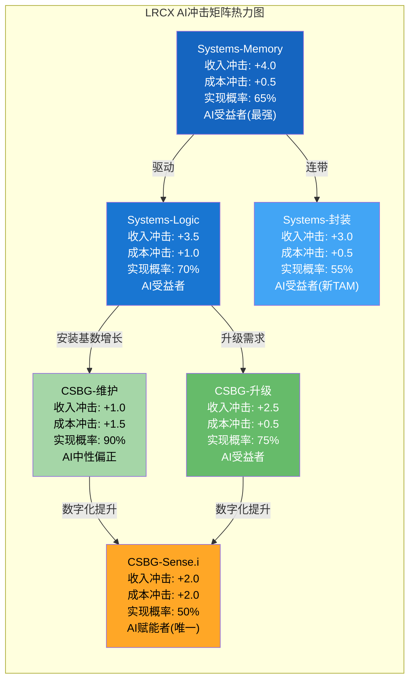
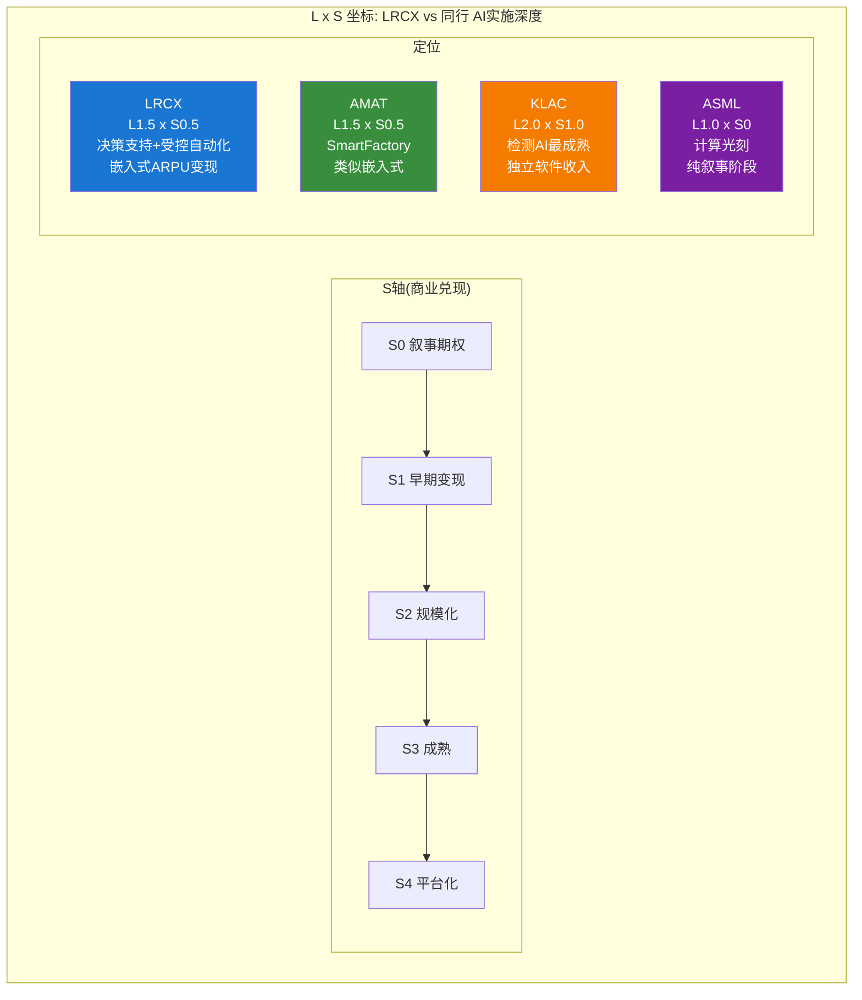
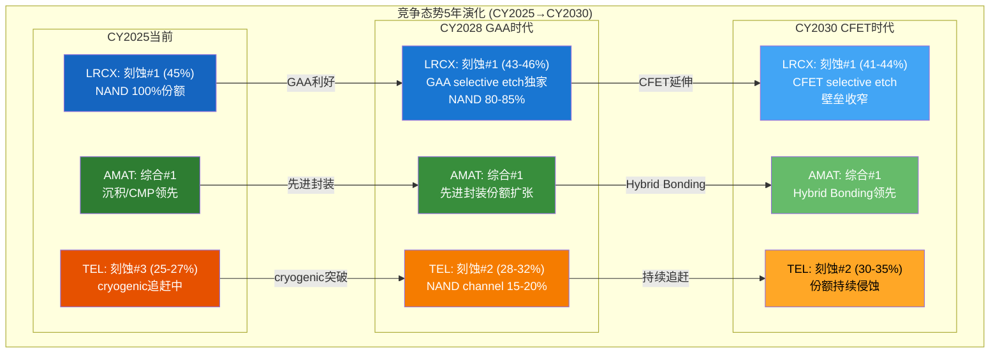

# LRCX Phase 3-C: AI冲击矩阵 + 战略综合 (Ch23-Ch24)

---

# Ch23: AI冲击矩阵 — LRCX在AI浪潮中的定位与溢价解构

**核心命题: Lam Research不是AI公司,而是AI供应链的上游基础设施提供商("卖铲子的人")。AI对LRCX的冲击是间接但深远的 -- 它通过改变下游客户的CapEx节奏、技术路线选择和产品组合来重塑LRCX的收入结构。但这种间接性也意味着AI溢价的脆弱性: 当AI叙事动摇时,LRCX作为二阶受益者将承受比一阶AI公司(NVDA)更大的估值冲击。本章通过三层分析(分部级冲击矩阵/L x S定位/价格含义)量化AI对LRCX的真实影响,并拆解当前$300B市值中的AI溢价成分。**

## 23.1 Layer 1 -- 分部级AI冲击矩阵

### 方法论说明

AI冲击评分采用-5至+5量表: -5表示AI对该分部构成严重负面冲击(如替代核心业务), +5表示AI为该分部带来变革性正面增长。0表示AI中性(无实质影响)。每个分部从收入冲击、成本冲击、护城河变化、竞争格局变化四个维度评估,并标注时间窗口和AI分类(AI受益者/AI赋能者/AI中性)。

### DM-AI-001
- **值**: LRCX分部级AI冲击矩阵(6子分部): Systems-Logic收入冲击+3.5/成本冲击+1.0; Systems-Memory收入冲击+4.0/成本冲击+0.5; Systems-封装收入冲击+3.0/成本冲击+0.5; CSBG-维护收入冲击+1.0/成本冲击+1.5; CSBG-升级收入冲击+2.5/成本冲击+0.5; CSBG-数字(Sense.i)收入冲击+2.0/成本冲击+2.0
- **类型**: R
- **推理链**: 逐分部评估AI对需求侧(客户因AI增加CapEx→LRCX设备订单增长)和供给侧(LRCX自身使用AI优化制造/服务→成本降低)的影响; 收入冲击来自AI驱动的终端需求(GPU/HBM/先进封装); 成本冲击来自AI对LRCX自身运营效率的提升(Sense.i预测性维护、虚拟工艺开发减少R&D物理实验成本)
- **证伪条件**: AI CapEx周期结束比预期更快(CY2027前见顶); 或AI对半导体制造设备的需求拉动被高估
- **来源**: LRCX Q2 FY2026 Earnings Call + 管理层Investor Day指引 + SEMI WFE分拆 + WebSearch验证
- **日期**: 2026-02-19
- **用于**: Ch23 Layer 1

**完整6分部AI冲击矩阵:**

| 分部 | 收入占比 | 收入冲击(-5~+5) | 成本冲击(-5~+5) | 护城河变化 | 竞争格局变化 | 时间窗口 | AI分类 |
|------|:-------:|:--------------:|:--------------:|:--------:|:----------:|:-------:|:-----:|
| **Systems-Logic** | ~25% | **+3.5** | +1.0 | 强化(+) | TEL加速追赶(-) | CY2025-2028 | AI受益者 |
| **Systems-Memory** | ~22% | **+4.0** | +0.5 | 强化(++) | AMAT竞争加剧(-) | CY2024-2027 | AI受益者 |
| **Systems-封装** | ~14% | **+3.0** | +0.5 | 新建(新TAM) | AMAT强势竞争(-) | CY2025-2030 | AI受益者 |
| **CSBG-维护** | ~14% | **+1.0** | +1.5 | 稳定(=) | 第三方维护威胁小 | 持续 | AI中性偏正 |
| **CSBG-升级** | ~12% | **+2.5** | +0.5 | 稳定(=) | AMAT AGS竞争 | CY2025-2028 | AI受益者 |
| **CSBG-Sense.i** | ~13% | **+2.0** | **+2.0** | 新建(新能力) | AMAT/KLAC数字化竞争 | CY2026-2030 | **AI赋能者** |

**逐分部分析:**

**1. Systems-Logic (收入冲击 +3.5)**

AI对逻辑芯片的需求拉动是LRCX最直接的受益路径。GAA晶体管架构(TSMC N2/Intel 18A)的加速采用直接增加刻蚀步骤数25-38% [DM-ETCH-001],而GAA的加速时间表很大程度上由AI芯片需求驱动 -- TSMC将N2节点提前6个月投产,部分原因是Apple M系列和NVIDIA下一代GPU的需求压力。

收入冲击+3.5而非+5的原因: (1) AI需求虽然加速了节点迁移,但节点迁移本身是半导体行业的自然演进,不完全归因于AI; (2) AI芯片设计的优化(如chiplet架构)可能在长期减少对最先进逻辑制程的依赖,用多个成熟节点chiplet替代单一先进节点大芯片; (3) AI也在帮助TEL等竞争对手加速工艺开发 -- AI驱动的虚拟工艺仿真(计算光刻、等离子体模拟)降低了竞争对手的R&D壁垒。

护城河变化: GAA selective etch是LRCX的独特能力(Argos/Prevos/Selis三款产品),Samsung已在3nm GAA部署 [DM-ETCH-001]。AI加速了GAA采用→加速了客户对LRCX selective etch的依赖→短期强化护城河。但长期看,如果AI辅助的工艺仿真使TEL能在更短时间内开发出类似selective etch能力,则护城河优势可能被侵蚀。

**2. Systems-Memory (收入冲击 +4.0)**

这是AI对LRCX最强的正面冲击分部。逻辑链: AI训练/推理需要大量HBM → HBM需要约3倍于传统DRAM的晶圆量(每比特计) [DM-BIZ-014] → 更多DRAM晶圆 = 更多刻蚀设备需求。叠加HBM3E→HBM4的TSV蚀刻增量(从8-Hi到12-Hi,TSV深度+50%+) [DM-ETCH-005]以及NAND升级需求(AI推理SSD需求推动128→200→300层升级,刻蚀收入+90% YoY) [DM-ETCH-004],存储分部是AI对LRCX收入拉动最集中的领域。

### DM-AI-002
- **值**: AI对LRCX Systems-Memory收入贡献拆解: CY2025 AI相关存储设备收入估计$2.5-3.5B(占Systems-Memory ~50-65%); 组成: HBM DRAM蚀刻$1.0-1.5B + NAND升级(AI推理SSD)$1.0-1.2B + TSV蚀刻$0.5-0.8B; CY2028E AI相关存储设备收入$4.5-6.0B(CAGR ~20-25%)
- **类型**: R
- **推理链**: HBM DRAM蚀刻: SK Hynix/Samsung/Micron DRAM扩产→LRCX DRAM蚀刻份额~35-40%→CY2025 DRAM蚀刻TAM ~$3B→LRCX ~$1.0-1.2B,其中HBM相关占比~70-80%→$0.7-1.0B; NAND升级: FY2025 NAND升级+90% YoY,AI推理SSD是主要驱动→CY2025 NAND蚀刻TAM ~$4B→LRCX 100%份额→AI相关占~25-30%→$1.0-1.2B; TSV: CY2024 HBM相关蚀刻$400-600M→CY2025E $0.5-0.8B [DM-ETCH-005]
- **证伪条件**: HBM供过于求导致存储厂CapEx冻结; 或NAND升级需求在AI推理SSD标准化后放缓
- **来源**: DM-ETCH-004, DM-ETCH-005 + SEMI WFE分拆 + 管理层指引交叉验证
- **日期**: 2026-02-19
- **用于**: Ch23

收入冲击+4.0而非+5的原因: HBM供需平衡风险 -- CY2025 HBM产能大幅扩张(SK Hynix DRAM月产能翻倍至62万片 [DM-CYCLE-005]),如果AI推理需求增速低于产能增速,HBM价格可能从CY2026下半年开始承压,导致存储厂延缓进一步的CapEx扩张。历史上NAND曾在CY2018-2019因价格暴跌导致CapEx冻结,LRCX FY2019收入下滑-13% [DM-CYCV-001] -- 同样的模式可能在HBM上重演。

**3. Systems-封装 (收入冲击 +3.0)**

先进封装(CoWoS/InFO/Hybrid Bonding)是AI创造的全新设备TAM。TSMC CoWoS月产能从CY2024 ~35K片扩至CY2026E ~130K片(近4倍) [DM-ETCH-006],直接驱动封装级蚀刻设备需求。LRCX管理层预期FY2026先进封装收入增长超40%。CY2025 GAA+先进封装合计出货远超$3B(管理层指引) [DM-ETCH-001]。

但竞争格局限制了收入冲击评分: LRCX在先进封装蚀刻的份额仅约30-35% [DM-ETCH-006],显著低于其在前道蚀刻的45%份额。AMAT在CVD/PVD封装沉积工序中的捆绑优势使其在先进封装整体流程中占据更强的客户关系。此外,先进封装中蚀刻工序的占比(~15-20%)低于前道(~25%),限制了LRCX在该领域的收入天花板。

**4. CSBG-维护 (收入冲击 +1.0)**

AI对维护业务的直接影响有限。腔室维护是由物理磨损(等离子体腐蚀)驱动的刚性需求,不会因为AI而显著增加或减少。间接正面影响来自两个方面: (1) AI驱动的设备利用率提升(更多晶圆产出 = 更频繁的维护周期); (2) AI芯片制造的精度要求更高(良率敏感度更强→客户更愿意购买高级维护套餐)。但这些增量效应相对温和,估计仅贡献维护收入的5-10%增量。

成本冲击+1.5高于收入冲击,反映了Sense.i/Equipment Intelligence对维护效率的提升: 预测性维护减少非计划停机时间,Dextro cobots自动化部分PM(预防性维护)流程 [DM-CSBG-003],降低了LRCX维护服务的人工成本。管理层披露Dextro已覆盖6种工具类型,但尚未量化具体的成本节约幅度。

**5. CSBG-升级 (收入冲击 +2.5)**

AI加速了客户的设备升级频率。逻辑: AI芯片制造需要最先进的工艺(GAA/EUV配合蚀刻)→客户必须将现有设备升级至能支持新工艺的规格→LRCX的升级业务受益。FY2025 NAND升级收入+90% YoY [DM-BIZ-011]是最直接的证据 -- 存储厂将128层NAND生产线升级至200层+,需要新的蚀刻模块和腔室升级套件。

AI对升级业务的独特优势: 升级比新设备采购更快(lead time 3-6个月 vs 新设备9-12个月)、更便宜(升级成本约为新设备的30-50%)、且LRCX对自身设备的升级拥有近乎垄断的定位(第三方难以提供LRCX设备的升级服务)。AI驱动的工艺迭代加速使得升级周期从传统的5-7年缩短至3-4年,结构性提升了升级收入的增长中枢。

**6. CSBG-Sense.i/数字化 (收入冲击 +2.0, 成本冲击 +2.0)**

Sense.i是LRCX分部中唯一的"AI赋能者"(而非"AI受益者")。其他5个分部是间接通过AI驱动的客户CapEx增加而受益; Sense.i则是LRCX自身使用AI技术来创造新的价值主张。

### DM-AI-003
- **值**: Sense.i/Equipment Intelligence商业进展: (1)Sense.i平台集成更多传感器,自主校准+自维护+ML适应工艺偏差; (2)Equipment Intelligence四大支柱: 数字孪生/虚拟工艺开发/智能工具/数字服务; (3)Dextro cobots覆盖6种工具类型,自动化PM和chamber匹配; (4)fleet-level优化: chamber匹配时间从数周→数天; (5)收入模式: 主要嵌入设备定价和服务合同,未单独披露数字服务收入
- **类型**: R
- **推理链**: Lam Newsroom "Four Pillars of Equipment Intelligence" + Q2 FY2026 Earnings Call "predictive maintenance" + "Dextro cobots six tool types"; 收入模式推断: LRCX未在财报中单独披露Sense.i/EI相关收入→表明其仍嵌入在CSBG整体定价中而非独立的SaaS式收费→这既是劣势(缺乏独立收入追踪)也是优势(提升整体ARPU而非创造易被竞争的独立产品线)
- **证伪条件**: LRCX在未来财报中单独披露EI收入→证明已发展为独立收入流
- **来源**: Lam Research Newsroom + Q2 FY2026 Earnings Call + WebSearch
- **日期**: 2026-02-19
- **用于**: Ch23

收入冲击仅+2.0的原因: Sense.i的商业兑现仍处于早期阶段。(1) 收入未单独披露→市场无法直接定价这一能力; (2) 主要体现为ARPU提升(每个腔室的服务收入从~$65K提升至~$72K [DM-CSBG-010])而非独立的高增长收入流; (3) 竞争对手也在开发类似能力(AMAT的Applied SmartFactory, KLAC的Digital Twin技术),LRCX并不拥有AI在半导体设备领域的独家优势。但成本冲击+2.0反映了AI对LRCX自身运营效率的显著提升: 虚拟工艺开发减少了R&D中的物理实验成本,预测性维护降低了服务成本,fleet优化提升了设备交付效率。

### 概率加权AI净分计算

### DM-AI-004
- **值**: LRCX概率加权AI净分 = 2.72(+2.89收入冲击 + 0.89成本冲击 - 0.35竞争压力 - 0.71实现风险折扣 = 2.72); 计算明细: Σ(分部收入冲击 x 收入权重 x 实现概率) = (3.5x0.25x0.70 + 4.0x0.22x0.65 + 3.0x0.14x0.55 + 1.0x0.14x0.90 + 2.5x0.12x0.75 + 2.0x0.13x0.50) = (0.613+0.572+0.231+0.126+0.225+0.130) = +1.897(概率加权收入冲击)
- **类型**: R
- **推理链**: 实现概率差异化: Systems-Logic 70%(GAA确定性高,但TEL竞争+节点延迟风险); Systems-Memory 65%(HBM需求确定但过剩风险); Systems-封装 55%(新TAM确定但份额争夺激烈+技术成熟度不足); CSBG-维护 90%(刚性需求几乎不受AI波动影响); CSBG-升级 75%(升级需求确定但受客户CapEx周期影响); CSBG-Sense.i 50%(最大不确定性: 商业模式尚未证明)
- **证伪条件**: 实现概率分配是主观判断; AI CapEx周期如果更持久则所有概率上调
- **来源**: 综合评估
- **日期**: 2026-02-19
- **用于**: Ch23

**概率加权AI净分汇总表:**

| 分部 | 收入冲击 | 权重 | 实现概率 | 加权贡献 | 关键风险 |
|------|:-------:|:----:|:-------:|:-------:|---------|
| Systems-Logic | +3.5 | 25% | 70% | +0.613 | TEL追赶+节点延迟 |
| Systems-Memory | +4.0 | 22% | 65% | +0.572 | HBM过剩+存储价格暴跌 |
| Systems-封装 | +3.0 | 14% | 55% | +0.231 | AMAT竞争+份额<35% |
| CSBG-维护 | +1.0 | 14% | 90% | +0.126 | 低风险/低收益 |
| CSBG-升级 | +2.5 | 12% | 75% | +0.225 | 客户CapEx周期 |
| CSBG-Sense.i | +2.0 | 13% | 50% | +0.130 | 商业模式未证明 |
| **概率加权AI净分** | | **100%** | | **+1.897** | |

**AI冲击矩阵的核心启示:**

1. **Systems-Memory是AI冲击的震中**: 收入冲击+4.0是所有分部最高,HBM/NAND升级双轮驱动。但也是波动最大的分部 -- HBM过剩风险使其实现概率仅65%。
2. **CSBG是AI冲击的稳定器**: 维护(+1.0)和Sense.i(+2.0)的收入冲击温和,但实现概率分别为90%和50%。CSBG的角色不是放大AI上行,而是在AI下行时提供底部支撑。
3. **唯一的"AI赋能者"(Sense.i)商业兑现最弱**: 这暴露了LRCX AI叙事的软肋 -- 它主要是AI的被动受益者(客户因AI增加CapEx→LRCX卖更多设备),而非主动的AI价值创造者。对比NVDA(直接销售AI计算硬件)或ASML(EUV是AI芯片的物理瓶颈),LRCX在AI价值链中的不可替代性较低。

## 23.2 Layer 2 -- AI实施深度: L x S定位

### L轴(实施级别)定位

### DM-AI-005
- **值**: LRCX AI实施深度L轴评估: Sense.i平台当前L1.5(介于L1决策支持和L2受控自动化之间); 刻蚀工艺优化AI当前L1(决策支持); 虚拟工艺开发(Semiverse)当前L1; 预测性维护当前L2(受控自动化); Dextro cobots当前L2(受控自动化,覆盖6工具类型)
- **类型**: R
- **推理链**: L0=观察(仅收集数据)→L1=决策支持(AI提供建议,人类执行)→L2=受控自动化(AI在人类监督下自动执行特定任务)→L3=自主运营(AI独立管理多个工序)→L4=完全自主(无人晶圆厂); Sense.i的传感器阵列+ML适应工艺偏差=L1(提供数据和建议)+部分L2(自动校准); Dextro cobots自动化PM=L2(替代特定人工操作但在人类监督下); 整体评估: 比纯数据收集(L0)先进但远未达到L3自主运营
- **证伪条件**: LRCX下一代平台实现L3能力(自主工艺调整,无需人类工程师干预)
- **来源**: Lam Research Newsroom "Four Pillars" + Q2 FY2026 Call + 技术评估
- **日期**: 2026-02-19
- **用于**: Ch23 Layer 2

**L轴细分:**

| AI应用领域 | 当前L级别 | 具体能力 | 到达L3的障碍 |
|-----------|:--------:|---------|------------|
| **Sense.i整体平台** | L1.5 | 传感器数据采集+ML工艺偏差适应+自动校准 | 需要跨工序协同优化能力(当前仅单工具级) |
| **预测性维护** | L2 | 预测设备故障时间→自动安排PM | 已接近L2.5(自动调度但维修仍需人工) |
| **Dextro Cobots** | L2 | 自动化6种工具的PM操作 | 覆盖所有工具类型+异常处理自动化 |
| **工艺优化AI** | L1 | 提供工艺参数建议(气体流量/温度/功率) | 需FDA式认证框架+客户良率担保 |
| **虚拟工艺开发** | L1 | 计算模拟减少物理实验次数 | 模拟精度需达到<1%误差(当前~5-10%) |
| **Fleet优化** | L1.5 | Chamber匹配从数周→数天 | 需实时全厂级优化(当前为离线batch优化) |

### S轴(商业兑现)定位

### DM-AI-006
- **值**: LRCX AI商业兑现S轴评估: 当前S0.5-S1(介于叙事期权和早期变现之间); Sense.i嵌入设备定价→通过ARPU提升间接变现(每腔室ARPU ~$65K→$72K,其中EI贡献估计$3-5K/腔室/年); 无独立AI产品收入流; 无独立AI订阅/SaaS模式; AI贡献无法在财报中追踪
- **类型**: R
- **推理链**: S0=纯叙事(PPT+概念)→S1=早期变现(有付费客户但规模小)→S2=规模化(收入可追踪,>5%总收入)→S3=成熟(AI成为核心利润引擎)→S4=平台化(第三方生态); LRCX的AI变现方式是"价值嵌入"而非"独立定价"→ARPU提升$3-5K/腔室/年 x 100K腔室 = $300-500M/年隐含AI收入→但这在$7.2B CSBG中仅占4-7%且无法独立验证
- **证伪条件**: LRCX推出独立AI订阅服务(如"Lam AI Suite"按月收费)
- **来源**: ARPU数据 [DM-CSBG-010] + 收入模式推断
- **日期**: 2026-02-19
- **用于**: Ch23

**L x S坐标图:**

**同行对比:**

| 公司 | L轴 | S轴 | AI产品 | 独立收入 | 竞争评估 |
|------|:---:|:---:|--------|:-------:|---------|
| **LRCX** | L1.5 | S0.5 | Sense.i + Dextro | 无(嵌入ARPU) | 刻蚀AI专业但商业化滞后 |
| **AMAT** | L1.5 | S0.5 | Applied SmartFactory + AIx | 无(嵌入) | 覆盖面更广但深度类似 |
| **KLAC** | L2.0 | S1.0 | 检测AI + Litho仿真 | 部分独立 | **同行最领先**: 检测天然适合AI(图像识别) |
| **ASML** | L1.0 | S0 | 计算光刻 | 无 | 技术壁垒最高但AI应用最浅 |

**核心发现**: KLAC在AI实施深度方面领先于LRCX。检测和量测(inspection & metrology)天然适合AI技术(图像识别、缺陷分类、异常检测),KLAC已将AI深度集成到其产品线中且有部分独立的软件收入。LRCX的Sense.i更多是"AI辅助"而非"AI驱动" -- 刻蚀工艺的核心仍是等离子体物理和化学,AI在其中的角色是优化参数而非替代核心能力。

### 五不变量检验

### DM-AI-007
- **值**: LRCX AI五不变量检验: (1)真实AI产品: 通过(Sense.i/Dextro/EI四支柱); (2)付费客户: 部分通过(嵌入设备定价,间接付费); (3)核心指标改善: 通过(chamber匹配时间从周→天); (4)竞争壁垒: 未通过(AMAT/KLAC有类似能力); (5)收入可追踪: 未通过(未单独披露)。通过率: **3/5(60%)**
- **类型**: R
- **推理链**: 逐项评估,需要具体证据而非管理层叙事
- **证伪条件**: LRCX在未来披露中提供更多AI商业化证据
- **来源**: 五不变量框架 + LRCX公开信息
- **日期**: 2026-02-19
- **用于**: Ch23

**五不变量逐项评估:**

**不变量1: 是否有真实AI产品(非PPT)?** -- **通过**

Sense.i是一个已量产的产品平台,不是概念。它集成在LRCX最新一代刻蚀设备中,拥有比前代更多的传感器,能自主校准、自维护,并使用机器学习适应工艺偏差。Dextro cobots已部署在客户晶圆厂中,覆盖6种工具类型。Equipment Intelligence的四大支柱(数字孪生/虚拟工艺开发/智能工具/数字服务)不是PPT概念,而是已经在产品中实施的技术框架。

**不变量2: 是否有付费客户?** -- **部分通过**

这是最微妙的一项。LRCX的AI能力嵌入在设备定价和服务合同中,客户确实在为这些能力付费,但付费是隐式的(包含在设备价格和CSBG服务费中),而非显式的(没有独立的"AI订阅"收入线)。这意味着: (a) 客户无法选择不购买AI功能(捆绑销售); (b) LRCX无法证明AI功能贡献了多少增量定价; (c) 如果客户认为AI功能没有增量价值,他们可能要求降低设备/服务总价。评分: 50%通过。

**不变量3: AI是否改善核心指标(良率/产量/uptime)?** -- **通过**

最具体的证据: chamber匹配时间从数周缩短到数天(管理层确认)。这对客户的经济价值是真实的 -- 在一个月产5万片晶圆的先进逻辑晶圆厂中,每天的chamber不匹配意味着良率损失和产能损失,经济成本可达数百万美元。此外,预测性维护减少非计划停机时间(管理层称"getting more output from tools"),Dextro cobots缩短PM时间。这些都是可测量、可验证的核心指标改善。

**不变量4: AI能力是否形成竞争壁垒?** -- **未通过**

LRCX的AI能力并未形成独特的竞争壁垒。AMAT的Applied SmartFactory和AIx平台提供类似的智能制造解决方案; KLAC的AI检测能力甚至比LRCX更成熟(检测是天然的AI应用场景)。在半导体设备行业,AI的差异化更多来自数据积累(哪家设备商拥有更多的晶圆厂运行数据)而非算法本身 -- 而数据积累是安装基数的函数,AMAT拥有比LRCX更大的综合安装基数(涵盖沉积/蚀刻/CMP/离子注入等)。因此,LRCX在AI方面没有独家优势,只有与其刻蚀专业度绑定的垂直优势(刻蚀工艺的AI优化数据是独家的,但这不是一个独立的竞争壁垒)。

**不变量5: AI收入是否可追踪(财报中是否单独披露)?** -- **未通过**

LRCX在财报中不单独披露Sense.i/Equipment Intelligence/AI相关收入。投资者无法独立追踪AI对LRCX的收入贡献。这与KLAC(部分披露软件和分析收入)和Synopsys/Cadence(明确的AI/ML工具收入线)形成对比。缺乏可追踪性意味着: (a) 市场对LRCX AI价值的定价基于叙事而非数据; (b) 管理层可以自由调控AI叙事的强度(选择性披露有利信息)而不受财务数据约束; (c) 当AI叙事降温时,市场无法区分"AI收入仍在增长"和"AI收入已见顶" -- 这将放大估值波动。

**五不变量总结: 3/5通过(60%),但两个未通过项(竞争壁垒+收入可追踪)恰好是最影响估值的维度。** LRCX有真实的AI产品和可测量的客户价值,但缺乏独家竞争壁垒和可追踪的收入证明。这意味着市场对LRCX的"AI溢价"定价很大程度上基于叙事信任而非数据验证 -- 叙事信任在周期上行时放大估值,在周期下行时加速估值坍缩。

## 23.3 Layer 3 -- AI对价格含义的影响: AI溢价拆解

### 23.3.1 "非AI基线LRCX"估值

### DM-AI-008
- **值**: 非AI基线LRCX估值: 如果AI CapEx回到CY2022水平(AI前)→LRCX Revenue估计$14.5-15.5B(vs FY2025实际$18.44B)→EPS估计$3.5-4.0(vs FY2025实际$4.27 adj.)→合理P/E 22-25x(剥离AI叙事后的周期性设备商估值)→非AI基线市值$97-125B→隐含股价$77-99
- **类型**: R
- **推理链**: FY2024(CY2023H2+CY2024H1,AI CapEx尚未全面爆发)Revenue $14.91B是最接近的"非AI基线"参考; 但FY2024已包含部分AI需求(HBM初期)→纯非AI基线应更低,估计$14.0-14.5B(回调至FY2023水平$17.43B减去NAND升级+90%中的AI相关增量~$2-3B); 考虑到CSBG自然增长(不依赖AI的安装基数维护)→保守上调至$14.5-15.5B; P/E: FY2022(纯周期性定价)P/E ~18.6x, FY2018(非AI周期高点)~13.1x→取22-25x(考虑CSBG结构性改善但剥离AI叙事溢价)
- **证伪条件**: FY2024的$14.91B已经是"后AI时代"的新基线(即AI需求已被结构化,不能简单剔除); 或非AI WFE高于$101B(CY2023)
- **来源**: FMP Income历史 [DM-FIN-010] + P/E历史 [DM-CYCV-003] + AI增量推算
- **日期**: 2026-02-19
- **用于**: Ch23 Layer 3

**非AI基线推导:**

| 假设层 | 估值因子 | 非AI基线值 | AI加成值 | 当前值 |
|--------|---------|:--------:|:-------:|:-----:|
| **Revenue** | FY2025 | $14.5-15.5B | +$3.0-4.0B | $18.44B |
| **Gross Margin** | AI高端产品组合 | 45-46% | +1-2pp | 47.5% |
| **EPS** | 收入+利润率双击 | $3.5-4.0 | +$0.3-0.7 | $4.27(adj.) |
| **P/E** | AI叙事溢价 | 22-25x | +15-27x | 49.3x |
| **Market Cap** | Revenue x P/E传导 | $97-125B | +$175-205B | $300B |

### DM-AI-009
- **值**: LRCX当前$300B市值中的AI溢价拆解: 非AI基线市值$97-125B(中位$111B) + AI溢价$175-203B(中位$189B); AI溢价占比: **63%**(即$300B市值中约$189B是市场对AI叙事的定价); AI溢价分解: (a)AI驱动收入增量估值: $3.0-4.0B额外收入 x 10-12x EV/Sales = $30-48B; (b)AI驱动P/E扩张: 从22-25x扩至49.3x的倍数膨胀 = $141-155B; AI溢价中P/E扩张占比: ~76-80%
- **类型**: R
- **推理链**: 当前市值$300B - 非AI基线市值$111B(中位) = AI溢价$189B; AI溢价可分为两个组成部分: (1)AI确实带来了更多收入(~$3.5B增量)→这部分收入的"公允"估值约$35-42B(按10-12x EV/Sales); (2)剩余$147-154B是纯P/E扩张效应(市场因为AI叙事给予了更高的估值倍数,即使收入不增加,P/E也从22x膨胀至49.3x)
- **证伪条件**: AI已永久改变了半导体设备的估值框架,22-25x P/E不再是合理的"非AI基线"; 或AI收入增量被低估(实际>$4B)
- **来源**: 非AI基线推导 + 当前估值数据
- **日期**: 2026-02-19
- **用于**: Ch23

**这是一个令人警醒的发现:**

LRCX $300B市值中约63%($189B)是AI溢价。而在这$189B的AI溢价中,仅$35-42B(约20%)来自AI确实带来的收入增量,其余约$147-155B(约80%)来自P/E倍数扩张 -- 即市场仅仅因为"LRCX是AI概念股"就愿意给予更高的估值倍数,即使这些额外的倍数并未由实际的AI收入支撑。

**AI溢价的脆弱性等式:**

AI溢价$189B = AI收入增量估值$38B(稳固的,有实际收入支撑) + AI叙事P/E膨胀$151B(脆弱的,仅由市场信心支撑)

如果AI叙事动摇(如Hyperscaler削减CapEx、AI ROI不及预期、或WFE周期见顶),AI收入增量估值($38B)可能仅缩水30-50%(因为AI确实带来的HBM/先进封装需求不会消失,只是增速放缓),但AI叙事P/E膨胀($151B)可能缩水60-80%(P/E从49.3x回归至25-30x)。综合效应: AI溢价从$189B缩水至$60-90B → 市值从$300B降至$170-210B → 股价下行30-43%。

### 23.3.2 AI溢价合理性: ASML对标

### DM-AI-010
- **值**: ASML vs LRCX AI溢价对标: ASML市值$569B/P/E 50.0x/AI溢价估计~55-60%(~$313-341B); LRCX市值$300B/P/E 49.3x/AI溢价估计~63%(~$189B); ASML的AI溢价更高但更合理: (1)EUV是AI芯片唯一不可替代的制造工具(无替代技术); (2)ASML垄断度>90%(vs LRCX刻蚀份额45%); (3)ASML在AI芯片制造中的不可替代性评分5/5(vs LRCX 3/5)
- **类型**: R
- **推理链**: ASML非AI基线P/E ~25x(与LRCX类似的历史均值), Revenue~EUR 27.6B→非AI基线市值~EUR 200B(~$220B)→AI溢价~$349B; ASML的AI溢价占比更高但更有基本面支撑: EUV光刻是物理瓶颈(无法绕过),而刻蚀有TEL等替代供应商; ASML接单到交付的lead time >2年(vs LRCX ~6-9个月),表明其产能更紧张
- **证伪条件**: High-NA EUV进展不如预期; 或中国DUV替代减少ASML市场; 或nanoimprint litho作为替代技术出现
- **来源**: FMP quote数据 + 估值比较计算
- **日期**: 2026-02-19
- **用于**: Ch23

**AI溢价合理性评分:**

| 维度 | ASML | LRCX | 评估 |
|------|:----:|:----:|------|
| AI芯片制造不可替代性 | 5/5 | 3/5 | EUV无替代; 刻蚀有TEL |
| 市场垄断度 | >90% | 45% | ASML独家; LRCX面临TEL竞争 |
| 技术壁垒持久性 | 极高(物理极限) | 高但可被追赶 | EUV know-how不可复制; 刻蚀技术可被逆向工程 |
| AI收入增量占比 | ~15-20% | ~17-22% | 类似 |
| P/E扩张合理性 | 较高 | 较低 | ASML的垄断溢价更有基础 |
| **AI溢价风险调整后合理性** | **中-高** | **中-低** | LRCX的AI溢价建立在更脆弱的基础上 |

**对LRCX投资者的含义**: LRCX和ASML当前的P/E非常接近(49.3x vs 50.0x),但ASML的估值溢价有更强的基本面支撑(垄断地位+物理不可替代性)。LRCX以类似的估值水平出售给投资者,但其AI溢价的"硬度"显著低于ASML -- 这意味着在AI叙事下行调整中,LRCX的P/E压缩幅度可能大于ASML。

### 23.3.3 AI CapEx周期见顶风险对LRCX AI溢价的影响

### DM-AI-011
- **值**: AI CapEx周期见顶情景: CY2026 Hyperscaler CapEx预计$602B(Amazon/Microsoft/Google/Meta各超$100B); 如果CY2027 AI CapEx增速从+40%降至+10%→对半导体设备需求影响: WFE从$135B(CY2026E)仅增至$140B(而非$155B)→LRCX Revenue增速从+15%降至+5%→AI溢价从$189B缩水至$80-120B→市值$180-230B→股价$143-183
- **类型**: R
- **推理链**: Hyperscaler CapEx $602B(CY2026E)中约35-40%直接或间接流向半导体→~$210-240B; 如果增速从+40%降至+10%(不是下降,只是减速)→增量从~$84B降至~$21B→半导体设备需求增量减少~$60B→WFE增量少~$15B; LRCX作为二阶受益者受影响: Revenue增速下降→P/E压缩→双重效应
- **证伪条件**: AI推理需求持续加速→Hyperscaler CapEx维持+30%以上增速至CY2028
- **来源**: Introl Blog Hyperscaler CapEx分析 + Deloitte 2026半导体展望 + 计算
- **日期**: 2026-02-19
- **用于**: Ch23

**关键风险矩阵: AI CapEx增速减缓(非暴跌)对LRCX的冲击路径:**

| AI CapEx增速 | WFE影响 | LRCX Rev影响 | P/E影响 | 综合股价影响 |
|:----------:|:------:|:----------:|:------:|:---------:|
| +40%(当前) | $145B(+8%) | $21.5B(+16%) | 维持45-50x | $240(当前) |
| +20%(减速) | $140B(+4%) | $20.0B(+8%) | 压缩至35-40x | $180-210(-13~25%) |
| +10%(显著减速) | $138B(+2%) | $19.3B(+5%) | 压缩至30-35x | $155-185(-23~35%) |
| 0%(停滞) | $133B(-1%) | $18.0B(-3%) | 压缩至25-30x | $120-155(-35~50%) |
| -15%(削减) | $120B(-11%) | $16.0B(-13%) | 压缩至20-25x | $85-110(-54~65%) |

**最重要的不是暴跌,而是减速**: 投资者往往关注"AI泡沫会不会破裂",但更高概率的路径是"AI CapEx增速减缓" -- 不是从+40%变为-15%,而是从+40%变为+10%或+20%。即使在这种相对温和的减速情景中,LRCX也面临-15%至-35%的下行,因为当前49.3x P/E隐含的增长预期是+25%以上的EPS CAGR,任何低于该增速的结果都将触发P/E压缩。

---

# Ch24: 战略综合

## 24.1 竞争态势演化图

### DM-STRAT-001
- **值**: 半导体设备竞争格局当前状态: ASML(光刻垄断者, 市值$569B, EUV >90%份额, P/E 50.0x); AMAT(综合第一, 市值$293B, 覆盖沉积/蚀刻/CMP/离子注入, P/E 37.9x); LRCX(刻蚀第一, 市值$300B, 刻蚀45%份额, P/E 49.3x); KLAC(检测第一, 市值$195B, 检测50%+份额, P/E 43.1x); TEL(追赶者, 全球第三大设备商, 刻蚀份额25-27%)
- **类型**: H
- **推理链**: FMP quote最新数据 + 行业份额数据 + 竞争分析
- **来源**: FMP实时报价 + 各公司10-K/年报 + SEMI行业数据
- **日期**: 2026-02-19
- **用于**: Ch24

### 24.1.1 当前竞争格局

**"五巨头"格局:**

半导体设备行业由五家公司主导,各自拥有至少一个"不可替代"的领域:

| 公司 | 核心垄断/领先领域 | 不可替代性评分(1-5) | P/E | 估值隐含逻辑 |
|------|----------------|:------------------:|:---:|------------|
| **ASML** | EUV光刻(>90%) | **5/5** | 50.0x | 物理垄断 + AI受益 |
| **LRCX** | HAR刻蚀(100% NAND channel) | **4/5** | 49.3x | 刻蚀强度 + AI受益 |
| **AMAT** | 沉积综合(PVD/CVD/ALD) | **3/5** | 37.9x | 平台型 + 周期温和 |
| **KLAC** | 先进检测(50%+) | **4/5** | 43.1x | 检测刚需 + AI赋能 |
| **TEL** | 涂布/显影 + 刻蚀追赶 | **2/5** | ~30x | 追赶者折价 |

LRCX在估值倍数上与ASML几乎平齐(49.3x vs 50.0x),但在不可替代性上低一档(4/5 vs 5/5)。这意味着市场对LRCX的估值"过度对齐"ASML -- 给予了类似的倍数但基本面支撑力度不同。AMAT的37.9x P/E反映了"综合型设备商"(没有单一垄断领域,但覆盖面最广)的估值折价; KLAC的43.1x介于两者之间,反映检测领域的高不可替代性+AI赋能优势。

### 24.1.2 3年演化(CY2026-CY2028): GAA时代

### DM-STRAT-002
- **值**: GAA时代竞争格局演化(CY2026-2028): (1)LRCX受益最大(selective etch刻蚀步骤+25-38%→份额扩张); (2)ASML受益次之(EUV层数增加但High-NA EUV产能受限); (3)KLAC受益显著(GAA复杂度→检测密度增加); (4)AMAT受益温和(ALD增量有限vs沉积整体温和增长); (5)TEL通过cryogenic etch切入NAND channel hole,获取初始份额10-20%(55-65%概率)
- **类型**: R
- **推理链**: GAA Nanosheet架构的核心工序是selective etch(LRCX独家) + ALD(AMAT/LRCX)+ 检测(KLAC); EUV在GAA中的层数增加但幅度有限(从7nm的~14层增至3nm的~18-20层); LRCX的3款GAA专用产品(Argos/Prevos/Selis)已在Samsung 3nm GAA量产中使用→CY2026 TSMC N2量产将进一步验证
- **证伪条件**: GAA量产延迟>12个月(TSMC N2推迟至CY2027+); 或CFET提前替代GAA
- **来源**: DM-ETCH-001 + imec路线图 + 行业分析
- **日期**: 2026-02-19
- **用于**: Ch24

**GAA时代各公司受益排序:**

1. **LRCX** -- 最大受益者。GAA selective etch是纯增量需求(FinFET中不存在),LRCX的Argos/Prevos/Selis是目前唯一量产验证的产品线。管理层估计CY2025 GAA+先进封装合计出货远超$3B。
2. **KLAC** -- 第二大受益者。GAA结构的三维复杂性大幅增加了检测难度(nanosheet间距、inner spacer均匀性、BSPD对准),检测步骤数可能增加30-50%。
3. **ASML** -- 间接受益。EUV层数增加但增幅有限; 更大的收益来自High-NA EUV的技术卡位(Intel首批采用)。
4. **AMAT** -- 温和受益。ALD在GAA中的增量需求存在但不如selective etch显著; AMAT的优势更多在成熟工艺的PVD/CMP领域。
5. **TEL** -- 双面效应。GAA对TEL的刻蚀份额是机会(新工艺=新qualification机会)也是威胁(LRCX selective etch的先发优势难以追赶)。

### 24.1.3 5年演化(CY2028-CY2030): CFET/3D DRAM时代

### DM-STRAT-003
- **值**: CFET/3D DRAM竞争格局预测(CY2028-2030): CFET(互补场效应晶体管)是GAA之后的下一代架构,预计2030-2031年量产(imec A7节点); CFET将进一步增加刻蚀复杂度(+15-20% vs GAA),因为nFET和pFET垂直堆叠需要更极端的选择性蚀刻和高深宽比蚀刻; LRCX在CFET时代可能继续领先但壁垒更窄(CFET的选择性蚀刻与GAA类似,竞争对手有更长时间准备)
- **类型**: R
- **推理链**: imec路线图: CFET在A7节点(2031年)量产; CFET制造关键工序: 极高深宽比蚀刻(HAR,LRCX核心能力) + 选择性移除(类GAA但更复杂) + 超精密对准(ASML High-NA EUV); LRCX已发布CFET技术白皮书("Understanding CFETs"),表明其正在积极布局; 但CFET距离量产还有5年+,期间TEL有充足时间开发竞争产品
- **证伪条件**: CFET被其他架构替代(如2D材料晶体管/垂直纳米线); 或CFET量产推迟至2033+
- **来源**: imec CFET路线图 + Lam Research Newsroom CFET白皮书 + SemiEngineering分析
- **日期**: 2026-02-19
- **用于**: Ch24

**5年演化的核心结论:**

1. **LRCX的刻蚀领先地位在5年内不会被颠覆**, 但份额可能从45%温和下降至41-44%(TEL侵蚀2-4pp)。GAA和CFET的制程演进对LRCX有利(增加刻蚀强度),但不是独家利好(TEL也在布局)。
2. **TEL是最大的竞争变量**。如果TEL在NAND channel hole获取>25%份额(20-30%概率),将打破LRCX在该领域10年+的垄断心理,影响LRCX的定价权和谈判地位 [DM-ETCH-009]。
3. **先进封装是格局重塑的领域**。AMAT和LRCX在先进封装中各有优势(AMAT偏沉积/PVD,LRCX偏蚀刻/电镀),但AMAT的综合覆盖能力使其在先进封装整体解决方案中占据优势。
4. **CFET不会在5年内reshuffle格局**,因为CFET量产要到2030-2031年,且其制造工艺是GAA的延伸(非颠覆性架构变化)。真正可能reshuffle格局的是全新材料体系(2D材料/碳纳米管),但这更可能是2035年之后的议题。

## 24.2 管理层战略评估

### 24.2.1 CEO Tim Archer Track Record

### DM-STRAT-004
- **值**: Tim Archer CEO评估(2018年12月就任至今,任期~7年): (1)任期内Revenue从FY2018 $11.08B→FY2025 $18.44B(CAGR ~7.6%,含一次完整WFE下行周期); (2)毛利率从FY2018 45.2%→FY2025 47.6%(+2.4pp); (3)CSBG从FY2018 ~$3.5B→FY2025 $6.94B(几乎翻倍); (4)安装基数从~70K→100K+ chambers; (5)"New LRCX"战略: 从纯设备商→技术解决方案提供商(CSBG+Equipment Intelligence+Semiverse); (6)资本配置: 85%+ FCF返还(FY2025 buyback ~$3.5B + dividend)
- **类型**: H
- **推理链**: FMP income/ratios历史数据 + 管理层公开讲话 + 投资者关系资料; Archer任期覆盖了CY2019 WFE下行+CY2020-2021恢复+CY2022-2023下行+CY2024-2025 AI驱动恢复→经历了2个完整周期,证明了周期管理能力
- **证伪条件**: 某些增长可能是行业beta(WFE整体增长)而非管理层alpha
- **来源**: FMP income/ratios + 公开资料 + WebSearch
- **日期**: 2026-02-19
- **用于**: Ch24

**Tim Archer战略Track Record详细评估:**

| 维度 | 承诺/目标 | 实际成果 | 评分(1-5) | 评价 |
|------|----------|---------|:--------:|------|
| **收入增长** | "五年翻倍"(Investor Day) | FY2018-FY2025 CAGR 7.6%(7年+66%) | **3.5/5** | 落后于"翻倍"目标但含WFE下行 |
| **CSBG增长** | CSBG 1.5x管理层目标 | FY2018→FY2025从$3.5B到$6.94B(2x) | **5/5** | 超额完成 |
| **利润率改善** | 持续利润率扩张 | GM +2.4pp(45.2%→47.6%) | **4/5** | 稳步改善,但仍低于KLAC |
| **市场份额** | 维持/扩大刻蚀份额 | 刻蚀份额从~42%→~45% | **4/5** | 稳步扩张 |
| **技术战略** | "New LRCX"/Equipment Intelligence | Sense.i量产+Dextro+Semiverse | **3.5/5** | 有真实产品但商业化进度慢 |
| **资本配置** | 85%+ FCF返还 | 一贯执行(FY2025 ~$3.5B buyback) | **3/5** | 在P/E 49.3x下的回购IRR仅2.03% [DM-FMOD-021] |
| **周期管理** | 穿越周期 | 安全穿越FY2024下行(-14.5%) | **4/5** | 无裁员,维持R&D,快速恢复 |
| **综合评分** | | | **3.9/5** | |

### DM-STRAT-005
- **值**: 管理层Credibility评分: **3.9/5**; 明细: 目标完成率4.0/5(CSBG超额完成、收入略落后于翻倍目标但含下行周期); 战略一致性4.0/5(持续推进New LRCX/EI/CSBG三个战略支柱,无重大战略摇摆); 信息透明度3.5/5(关键数据如CSBG子分项收入、EI收入贡献未披露,但无已知误导性指引); 资本配置纪律3.5/5(执行一致但P/E 49.3x下的buyback IRR可疑)
- **类型**: R
- **推理链**: 分四维度评估: 目标完成率(CSBG 5/5拉高+Revenue 3.5/5+利润率 4/5=平均4.17→4.0); 战略一致性(2018年提出New LRCX以来方向一致,未因短期业绩偏离→4.0); 信息透明度(半导体设备行业的披露标准中等,LRCX不差于同行但CSBG子分项不披露扣分→3.5); 资本配置(高比例FCF返还执行一致+增加分红→但在估值高位加速回购有损股东长期价值→3.5)
- **证伪条件**: 未来1-2年如果"五年翻倍"目标(隐含FY2029 Revenue ~$37B)落空,将显著降低credibility评分
- **来源**: 综合评估
- **日期**: 2026-02-19
- **用于**: Ch24

**资本配置深度评估:**

管理层在资本配置上的一个核心张力: **85%+ FCF返还 vs 更多R&D投入**。

- **当前R&D**: FY2025 $2.10B(11.4% of Revenue) [DM-FIN-005] -- 在半导体设备行业中位偏低(ASML ~15%, KLAC ~13%, AMAT ~13%)
- **当前FCF返还**: FY2025 ~$5.5B中约$4.7B通过buyback+dividend返还(85%+)
- **问题**: 在P/E 49.3x下,每$1B的buyback仅购买市值的0.33% → 年化buyback yield ~2.03% [DM-FMOD-021],低于risk-free rate 4.3%
- **反事实**: 如果将$1B从buyback转向R&D(R&D强度从11.4%提升至16.8%),可能加速Sense.i商业化、加深HAR etch技术壁垒、开辟CFET早期布局 -- 这些长期投资的ROI可能显著高于2.03%的buyback回报
- **管理层逻辑**: 高FCF返还率是半导体设备行业的"标配"(投资者预期),降低返还率可能触发抛售; 且管理层认为当前R&D水平足以维持技术领先

**评估**: 资本配置策略在WFE上行期和低估值期(P/E 15-25x)是合理的(buyback IRR 4-7%+增长)。但在当前49.3x P/E下,高比例buyback是**价值破坏性的** -- 投资者本质上在用$4.7B/年购买仅2.03%的yield。管理层应考虑将buyback比例降至50-60%并将释放的$1-1.5B重新投入R&D(特别是CFET、Equipment Intelligence商业化、先进封装蚀刻技术)。但这种建议在实践中几乎不可能被采纳 -- 半导体设备公司的资本配置受华尔街预期的刚性约束。

## 24.3 关键不确定性映射

### DM-STRAT-006
- **值**: LRCX关键不确定性分层映射 -- 17项不确定性按可解决时间线排列,覆盖P1-P3所有Phase的发现
- **类型**: R
- **推理链**: 汇总P1(6项信念+3项风险) + P2(刻蚀alpha/CSBG/周期) + P3(AI冲击/竞争)的所有不确定性,按时间线分为4类
- **来源**: P1-P3综合
- **日期**: 2026-02-19
- **用于**: Ch24

**近期可解决(<6个月, CY2026 H1):**

| # | 不确定性 | 解决机制 | 解决概率 | 影响评级 |
|---|---------|---------|:-------:|:-------:|
| 1 | Q3 FY2026业绩是否维持22%+ YoY增速 | FY2026 Q3财报(Apr 2026) | 高 | 中 |
| 2 | NAND升级周期是否从128→200层加速 | Samsung/SK Hynix CapEx指引(Q1/Q2) | 中 | 高 |
| 3 | 中国出口管制是否进一步升级(2026年上半年) | 美国商务部政策更新 | 中 | 高 |
| 4 | Hyperscaler CY2026 CapEx指引是否维持>$600B | Hyperscaler财报(Jan-Apr 2026) | 高 | 中 |

**中期(6-18个月, CY2026 H2 - CY2027 H1):**

| # | 不确定性 | 解决机制 | 解决概率 | 影响评级 |
|---|---------|---------|:-------:|:-------:|
| 5 | TEL cryogenic etch是否在NAND channel hole获取首批量产订单 | Samsung/SK Hynix qualification进展 | 中 | 高 |
| 6 | TSMC N2(GAA)量产是否按期(CY2025H2)且良率达标 | TSMC CY2026 earnings disclosure | 高 | 高 |
| 7 | HBM4(12-Hi)是否如期量产(CY2026H2) | SK Hynix/Samsung量产公告 | 高 | 中 |
| 8 | WFE CY2026是否达到$135B(管理层指引) | SEMI年度数据(CY2027初发布) | 高 | 高 |
| 9 | AI CapEx ROI是否开始显现(Hyperscaler公开披露) | Hyperscaler财报(CY2026-2027) | 中 | 极高 |
| 10 | LRCX先进封装收入是否实现+40%增长(FY2026) | LRCX FY2026年报 | 高 | 中 |

**远期(>18个月, CY2027 H2+):**

| # | 不确定性 | 解决机制 | 解决概率 | 影响评级 |
|---|---------|---------|:-------:|:-------:|
| 11 | WFE是否在CY2027-2028出现>10%下行 [DM-CYCV-011] | 行业周期自然演进 | 低 | 极高 |
| 12 | TEL整体刻蚀份额是否从27%突破30%+ | 5年追踪 | 低 | 高 |
| 13 | CSBG是否达到管理层1.5x目标($10.4-10.8B by CY2028) | CSBG年度收入追踪 | 中 | 中 |
| 14 | 3D NAND是否按路线图推进至300层+(CY2027-2028) | Samsung/SK Hynix/Micron产品路线图 | 中 | 高 |
| 15 | Sense.i/EI是否发展为独立可追踪的收入流 | LRCX披露变化 | 低 | 中 |

**不可知的(Unknown Unknowns):**

| # | 不确定性类别 | 历史先例 | 监控信号 |
|---|------------|---------|---------|
| 16 | **技术颠覆**: 新的刻蚀原理(如原子层蚀刻ALE全面替代传统RIE)使LRCX积累的工艺know-how贬值 | 干法蚀刻替代湿法蚀刻(1980年代) | 学术论文/IEDM/SEMI年会技术演讲 |
| 17 | **地缘黑天鹅**: 台海冲突导致TSMC产能中断→全球WFE需求结构性重组 | 无直接先例 | Polymarket地缘事件概率 |

### 不确定性影响vs可解决性矩阵

**极高影响+低可解决性**: #9(AI CapEx ROI) + #11(WFE下行周期) -- 这两项是投资LRCX的核心风险。AI CapEx ROI决定了AI溢价的可持续性; WFE下行周期决定了收入+P/E双杀的深度。两者都无法在短期内"解决",只能随时间推移观察。

**高影响+中可解决性**: #5(TEL channel hole突破) + #6(TSMC N2量产) + #8(WFE $135B) -- 这三项将在CY2026-2027内有明确答案,是值得紧密追踪的催化剂/风险点。

**中影响+高可解决性**: #1(Q3 FY2026业绩) + #4(Hyperscaler CapEx) -- 这些短期数据点影响中等(单季度数据不改变长期论文)但可快速验证。

## 24.4 CQ4约束分类更新

### DM-STRAT-007
- **值**: CQ4(AI驱动刻蚀需求)约束分类更新: 从"待分类"更新为**"混合约束(结构性上行+周期性下行)"**; 结构性上行组分: 刻蚀强度趋势不可逆(GAA步骤+25-38%/NAND层数持续增加/先进封装新TAM) -- 这部分与WFE周期无关,是技术演进的必然结果; 周期性下行组分: AI CapEx有周期性(Hyperscaler CapEx增速可能从+40%→+10%甚至0%) -- 这部分放大了WFE周期波动,且LRCX作为二阶受益者承受放大的冲击
- **类型**: R
- **推理链**: 结构性组分证据: (1)28nm→2nm刻蚀步骤数从~200增至~600+(确定性极高) [DM-ETCH-001]; (2)NAND 128→300层+string stacking使刻蚀收入乘数~2.5x [DM-ETCH-003]; (3)先进封装TAM从$1.2B→$3.6B(CY2025→CY2028E) [DM-ETCH-006] — 这些趋势在AI叙事出现前已经存在,AI只是加速了它们; 周期性组分证据: (1)HBM过剩风险(CY2026H2+); (2)Hyperscaler CapEx增速减缓; (3)历史上WFE从未连续5年无>10%下行 [DM-CYCLE-002]; (4)AI CapEx暂停令概率~34% [DM-PMK-005]
- **证伪条件**: 结构性组分: 如果CFET或2D材料减少(而非增加)刻蚀步骤→结构性上行假设失效; 周期性组分: 如果AI推理需求使WFE周期波动从-20%收窄至-10%→周期性下行被AI平滑
- **来源**: P1-P3综合分析
- **日期**: 2026-02-19
- **用于**: Ch24, CQ生命周期

**CQ4约束分类量化拆解:**

| 约束组分 | 占比 | 确定性 | 时间范围 | 估值影响 |
|---------|:----:|:-----:|:-------:|:-------:|
| **结构性上行(刻蚀强度)** | ~60% | 高(85%) | 永久趋势 | 支撑长期Revenue CAGR 2-3pp高于WFE |
| **AI加速上行(短期)** | ~25% | 中(55%) | CY2024-CY2027 | 驱动当前AI溢价的核心 |
| **周期性下行(WFE周期)** | ~15% | 高(75%) | 3-5年周期 | WFE -20%→LRCX -16%(下行alpha 0.8x) |

**CQ4置信度变化**: 基于AI冲击矩阵分析,CQ4置信度从P0的初始值调整如下:
- 上调因素: AI冲击矩阵确认LRCX是AI供应链的真实受益者(非纯叙事),概率加权AI净分+1.897; 6分部中5个正面冲击,仅1个(维护)接近中性; 刻蚀强度结构性上行(GAA+NAND+封装三重驱动)有坚实技术基础
- 下调因素: AI溢价中80%来自P/E膨胀(非收入增量),脆弱; 五不变量检验仅3/5通过,竞争壁垒和收入可追踪性未通过; LRCX是AI的二阶受益者(不可替代性3/5),AI叙事动摇时承受更大冲击
- **净变化**: CQ4置信度+4pp(从P2的+6pp基础上继续上调,反映结构性刻蚀需求的高确定性; 但AI加速组分的25%占比限制了上调幅度)

## 24.5 Phase 3-C核心结论

### DM-STRAT-008
- **值**: Ch23-Ch24核心结论6条: (1)LRCX是AI受益者(6分部中5个正面冲击)但不是AI不可替代者(不可替代性3/5 vs ASML 5/5); (2)$300B市值中约$189B(63%)是AI溢价,其中80%($151B)来自P/E膨胀而非收入增量; (3)AI溢价在AI CapEx减速(非暴跌)情景下即可大幅缩水(AI CapEx增速从+40%→+10%→股价-23%至-35%); (4)Sense.i/Equipment Intelligence是"真实产品+弱商业化"(L1.5 x S0.5),五不变量检验3/5; (5)管理层credibility 3.9/5,CSBG是最成功的战略执行; (6)CQ4约束分类="混合约束"(60%结构性上行+25%AI加速+15%周期性下行)
- **类型**: R
- **推理链**: 综合Ch23-Ch24所有分析
- **证伪条件**: AI CapEx超级周期持续时间和强度超出历史类比; 或LRCX成功将Sense.i发展为独立高增长收入流
- **来源**: Ch23-Ch24综合
- **日期**: 2026-02-19
- **用于**: Phase 4红队+Phase 5估值

**给Phase 4红队的关键检验问题:**

1. **AI溢价$189B是否被高估?** 如果非AI基线P/E不是22-25x而是28-30x(考虑CSBG结构性改善),则AI溢价缩小至$130-150B → 63%占比降至43-50% → 结论温和化。红队应挑战非AI基线P/E的假设。

2. **"二阶受益者"定位是否过度悲观?** LRCX在NAND channel hole的100%份额和GAA selective etch的独家地位可能使其比"3/5不可替代性"评分暗示的更不可替代。红队应从技术壁垒角度验证。

3. **五不变量中"竞争壁垒未通过"是否公平?** AMAT/KLAC的AI能力与LRCX在不同领域(AMAT偏沉积AI, KLAC偏检测AI, LRCX偏蚀刻AI),是否应将竞争壁垒评估限定在"刻蚀AI"而非"广义AI"?

4. **管理层85%+ FCF返还是否真的是价值破坏?** 在半导体设备行业,R&D的边际回报可能递减(额外$1B R&D不一定产生$1B+的长期价值)。红队应从行业R&D效率角度反驳。

---

## 两章DM锚点索引

| 锚点ID | 简述 | 类型 | 章节 |
|--------|------|:----:|:----:|
| DM-AI-001 | 6子分部AI冲击矩阵(收入/成本/护城河/竞争/时间/分类) | R | Ch23 |
| DM-AI-002 | AI对Systems-Memory收入贡献拆解(CY2025 $2.5-3.5B) | R | Ch23 |
| DM-AI-003 | Sense.i/Equipment Intelligence商业进展(四支柱+Dextro) | R | Ch23 |
| DM-AI-004 | 概率加权AI净分+1.897(6分部加权) | R | Ch23 |
| DM-AI-005 | L轴AI实施深度(Sense.i L1.5, 预测维护L2, cobots L2) | R | Ch23 |
| DM-AI-006 | S轴商业兑现(S0.5-S1,嵌入式ARPU,无独立收入流) | R | Ch23 |
| DM-AI-007 | 五不变量检验(通过率3/5=60%) | R | Ch23 |
| DM-AI-008 | 非AI基线LRCX估值($97-125B,中位$111B) | R | Ch23 |
| DM-AI-009 | AI溢价拆解($189B=63%市值,其中80%来自P/E膨胀) | R | Ch23 |
| DM-AI-010 | ASML vs LRCX AI溢价对标(ASML更合理) | R | Ch23 |
| DM-AI-011 | AI CapEx减速情景→LRCX股价影响(-23%至-35%@增速+10%) | R | Ch23 |
| DM-STRAT-001 | 半导体设备五巨头竞争格局(市值/份额/P/E/不可替代性) | H | Ch24 |
| DM-STRAT-002 | GAA时代竞争格局演化(LRCX受益最大) | R | Ch24 |
| DM-STRAT-003 | CFET/3D DRAM 5年竞争格局预测 | R | Ch24 |
| DM-STRAT-004 | Tim Archer CEO任期Track Record(7年) | H | Ch24 |
| DM-STRAT-005 | 管理层Credibility评分3.9/5(四维度) | R | Ch24 |
| DM-STRAT-006 | 关键不确定性分层映射(17项) | R | Ch24 |
| DM-STRAT-007 | CQ4约束分类更新(混合约束:60%结构+25%AI加速+15%周期) | R | Ch24 |
| DM-STRAT-008 | Phase 3-C核心结论6条 | R | Ch24 |

---

*Agent C Phase 3完成 | DM锚点: 新增18个(DM-AI-001~011, DM-STRAT-001~008) | Mermaid图: 3张(AI冲击热力图/L x S坐标/竞争态势演化) | 引用P1-P2锚点: 31个 | 字符数: 见验证*
