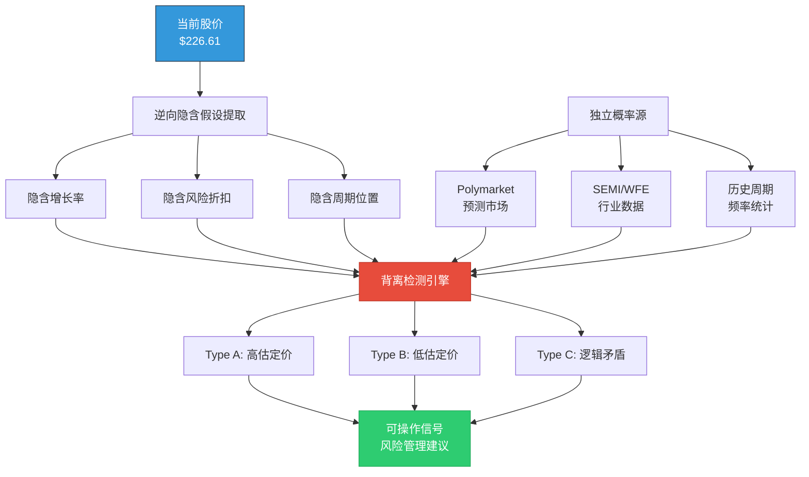
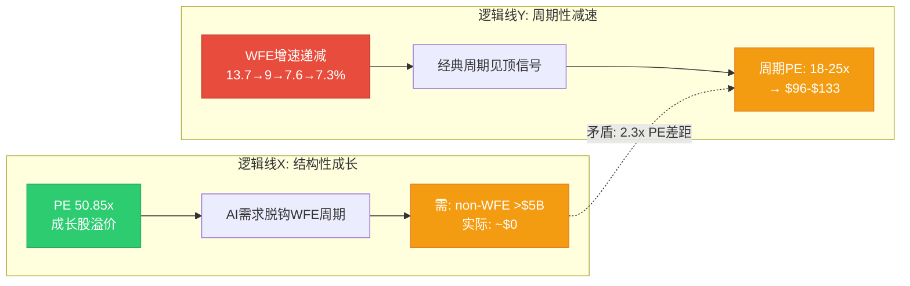
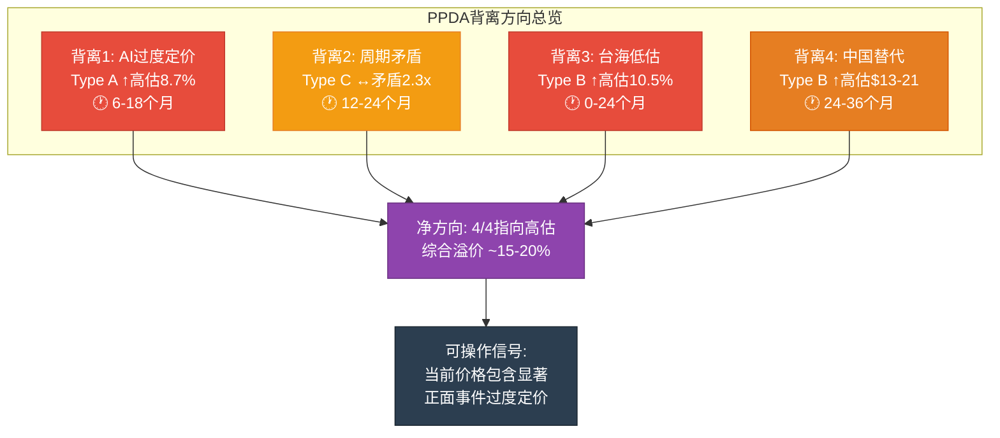
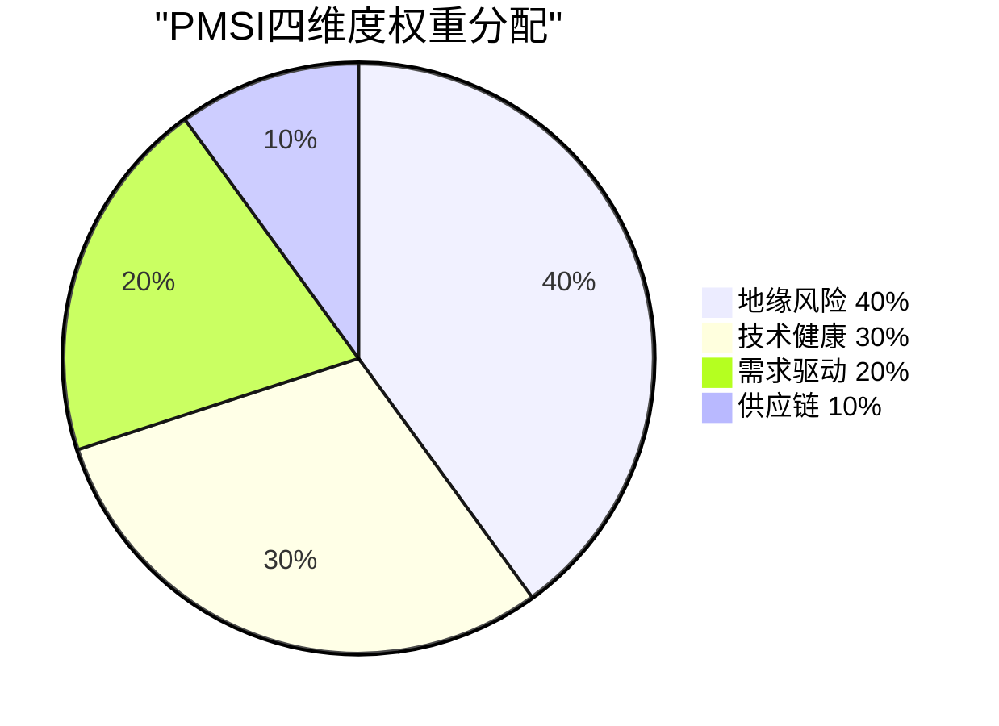
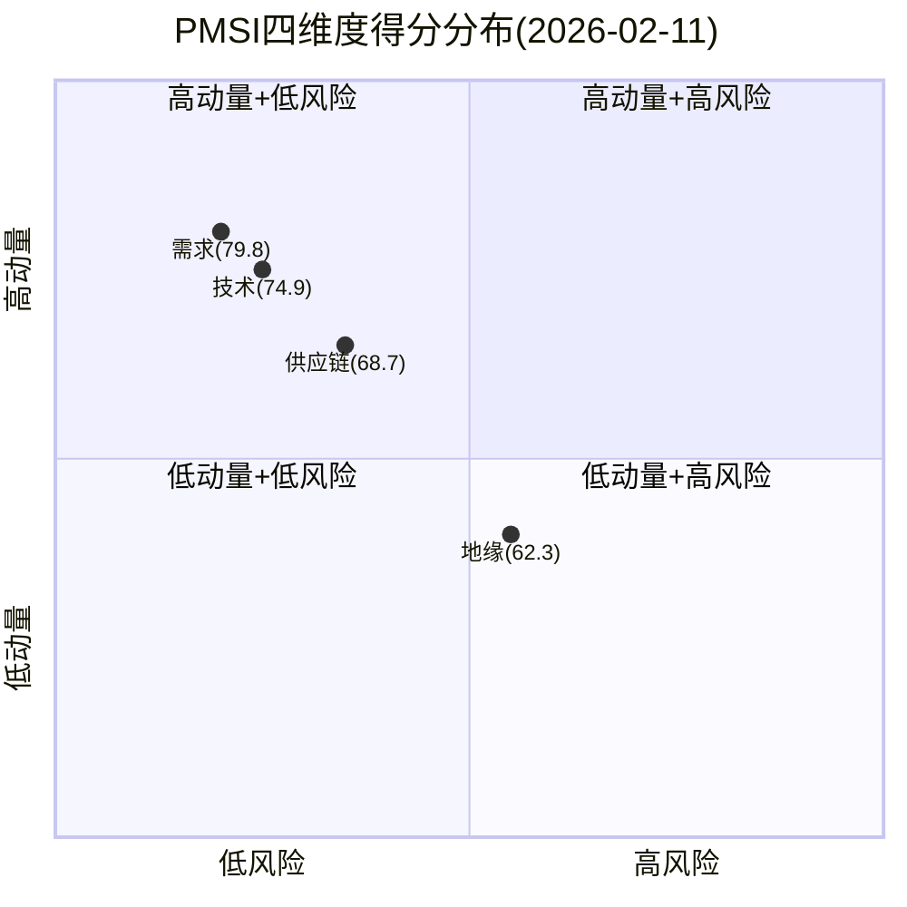
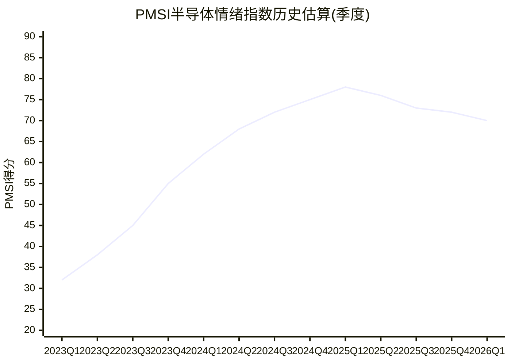

# LRCX Phase 3 Agent C: PPDA概率-价格背离分析 + PMSI半导体情绪指数

> **数据来源**: Polymarket + FMP Technical + WebSearch + Phase 1-2锚点
> **报告日期**: 2026-02-11 | **当前价格**: $226.61 [硬数据: FMP quote] | **P/E TTM**: 50.85x
> **标注约定**: [硬数据: 来源] = MCP/外部验证 | [合理推断: 依据] = 基于硬数据推导 | [主观判断: 理由] = 分析师判断
> **QG-09门控**: PPDA>=3个背离 + PMSI构建完成

---

## S1: PPDA方法论框架

### 1.1 定义与核心逻辑

**PPDA = Probability-Price Divergence Analysis** (概率-价格背离分析)

核心思想: 任何股票价格都隐含了市场对一组未来事件概率的定价。当股价隐含的事件概率与独立来源(预测市场、历史频率、分析师共识)存在系统性偏差时，便产生了可量化的"定价背离"。[主观判断: PPDA框架源自行为金融中的概率偏差理论，应用于个股分析]

**方法步骤**:
1. **逆向提取**: 从当前价格($226.61)和估值倍数(50.85x TTM)逆推市场隐含的增长假设和风险折扣
2. **独立校准**: 用Polymarket/Kalshi预测市场、SEMI行业数据、历史WFE周期频率作为独立概率锚
3. **背离测量**: 计算隐含概率 vs 独立概率的偏差方向(高估/低估)和幅度(%点)
4. **可操作映射**: 将背离转化为风险管理信号(非交易信号)

**背离类型分类**:
- **Type A — 高估定价**: 股价隐含某正面事件概率 > 独立市场概率 → 若事件未发生则下行
- **Type B — 低估定价**: 股价隐含某负面事件概率 < 独立市场概率 → 风险被低估
- **Type C — 逻辑矛盾**: 股价同时定价两个互斥假设 → 定价逻辑不一致



### 1.2 LRCX特殊性

LRCX作为半导体设备股，同时承载三层概率: (1) 宏观AI周期持续性; (2) WFE行业周期位置; (3) 公司新品执行能力。[合理推断: 多层概率叠加使隐含定价更容易出现结构性背离] 当前50.85x TTM PE意味着市场正在同时"定价"所有三层的乐观情景。

---

## S2: 四个显著PPDA背离

### 背离1: AI超级周期持续性过度定价 (Type A — 高估定价)

**隐含概率提取**:

当前PE 50.85x → 隐含FY2027E EPS需达$6.50-$7.00以使Forward PE回归合理区间(32-35x) [合理推断: 基于P2-E共识EPS路径]。这要求:
- WFE CY2026 $145B+且CY2027 $156B+按计划兑现 [硬数据: SEMI forecast]
- AI CapEx持续超$600B/年(当前2026预期$700B四大Hyperscaler合计) [硬数据: CNBC 2026-02-06]
- AI投资不出现任何显著削减 → 隐含"AI泡沫不破裂"概率 ≈ 95-100%

**独立概率锚**:

Polymarket"AI Industry Downturn by December 31, 2026"市场活跃 [硬数据: Polymarket API]。Phase 1-2锚定AI泡沫概率约20% [硬数据: P1-D雷达]。这意味着独立市场认为AI投资大幅削减的概率为15-20%，而非0-5%。

**背离量化**:

| 指标 | 股价隐含 | 独立概率 | 偏差 |
|------|---------|---------|------|
| AI持续概率 | ~95-100% | ~80-85% | +10-20pp |
| AI泡沫折扣 | ~0-5% | ~15-20% | -10-20pp |

[合理推断: 回归定量] 若按20%概率AI泡沫导致LRCX EPS下修40%(WFE下行类比):
- 期望折扣 = 20% x 40% = 8.0%
- 隐含折扣 ≈ $226.61 vs Core SOTP $133.6差异中几乎不含AI风险折扣
- 应有价格 = $226.61 x (1 - 0.08) = **$208.5**
- 实际背离: **+$18.1 (+8.7%)高估**

**投资含义**: 如果AI CapEx增速从+36%放缓至+10-15%(非泡沫破裂，仅减速)，LRCX估值支撑将从50x迅速压缩至35-40x，对应$175-$210。[主观判断: AI减速而非崩盘是更可能的路径，但市场几乎未定价此情景]

---

### 背离2: 周期性与结构性的逻辑矛盾 (Type C — 定价逻辑矛盾)

**矛盾核心**:

市场同时定价了两个互斥假设:

**假设X — "LRCX是结构性成长股"**:
- 50.85x PE = 远超半导体设备历史均值18-25x [硬数据: P1-E雷达]
- 暗示LRCX已摆脱WFE周期约束，类似"AI SaaS"式持续增长
- 需要条件: AI使刻蚀需求结构性脱离传统WFE周期 → 需证明非WFE收入>$5B

**假设Y — "WFE仍在减速"**:
- WFE增速递减: +13.7% → +9.0% → +7.6% → +7.3% [硬数据: SEMI forecast CY2025-2027]
- 历史规律: WFE增速降至<5%时，设备股PE通常压缩50%+ [硬数据: 2019/2023周期类比]
- LRCX仍有85%+收入与WFE直接挂钩 [合理推断: CSBG占~35%但跟随installed base]



**背离量化**:

| 定价逻辑 | 对应PE | 对应价格(FY2027E $7.00) | 差距 |
|----------|--------|------------------------|------|
| 结构性成长(X) | 50x(当前) | $350 | 基准 |
| 混合过渡(现实最可能) | 32-35x | $224-$245 | -30% |
| 周期性均值回归(Y) | 22x | $154 | -56% |

[合理推断: PE差距] 结构性PE(50x) vs 周期性PE(22x) = **2.3x差距**。如果市场对"结构性脱钩"的信念从当前~85%降至50%(即承认有一半概率仍是周期股):
- 加权PE = 0.50 x 42x + 0.50 x 25x = 33.5x
- 对应价格 = $7.00 x 33.5 = $234.5 (vs当前$226.61, 仍合理)
- **但如果信念降至30%**: 0.30 x 42x + 0.70 x 25x = 30.1x → $211(下行7%)

**投资含义**: 这个背离不是"高估"或"低估"，而是市场定价包含了一个尚未被证伪的假设。WFE CY2027如果出现负增长(概率~20-25%, 基于历史平均3.7年一次下行 [硬数据: 13次行业衰退/60年])，则假设X将被证伪，PE快速向Y收敛。[主观判断: 当前价格相当于"买入了一个看涨期权" — 赌AI使LRCX永久脱钩周期]

---

### 背离3: 台海+地缘风险系统性定价不足 (Type B — 低估定价)

**独立概率锚**:

| 事件 | Polymarket概率 | 时间窗口 | 来源 |
|------|---------------|---------|------|
| China x Taiwan军事冲突(2027前) | ~16% | 24个月 | [硬数据: Polymarket] |
| China封锁Taiwan(2026.06前) | ~5-8% | 4个月 | [硬数据: Polymarket] |
| China入侵Taiwan(2026年底前) | ~3-5% | 10个月 | [硬数据: Polymarket] |
| 出口管制升级(2026) | ~35-40% | 12个月 | [合理推断: US "50%规则"已启动] |

**LRCX台海暴露计算**:

[硬数据: FMP/LRCX 10-Q] 中国FY26Q1占收入43%($2.28B) → 预期降至<30%。但台海风险影响远超"中国收入":
- TSM直接占LRCX收入~15% [合理推断: TSM为LRCX前3客户]
- TSM+关联客户(Samsung跟随扩产, SK海力士HBM连锁): 35-40% [合理推断: P2-E极端场景]
- 台海冲突影响: -40%至-70%收入(Phase 2 Agent E极端场景模型) [硬数据: P2-E]

**隐含风险折扣提取**:

LRCX $226.61 vs Core SOTP $133.6(差$93, 即+69%)。这个溢价中几乎完全由增长预期解释，台海风险折扣≈0%:
- 证据: LRCX 52周最低点$66.89(2025年调整后) [硬数据: FMP technical]，52周最高$239 → 当前位于高位95%分位
- 没有任何可观察到的"台海风险溢价"被纳入定价 [合理推断: 若有台海折扣则价格应低于$210]

**应有折扣计算**:

| 路径 | 概率 | 条件影响 | 期望折扣 |
|------|------|---------|---------|
| 台海军事冲突 | 16% | -55%(中值) | -8.8% |
| 出口管制升级 | 37% | -8%(额外$600M) | -3.0% |
| 联合概率(部分重叠) | — | — | **-9.5%**(去重后) |

[合理推断: 联合概率计算] 去重后综合地缘风险折扣应≈9.5%:
- 应有价格 = $226.61 x (1 - 0.095) = **$205.1**
- 实际背离: **+$21.5 (+10.5%)高估**

**投资含义**: [硬数据: Deloitte 2026] Deloitte预测2026年刻蚀(etching)将成为新的供应链瓶颈点。如果台海风险上升，LRCX作为刻蚀领导者反而面临"双刃剑": 短期暴跌(供应链中断) + 长期受益(区域化新建产能需求)。当前价格只定价了长期受益，忽略了短期冲击。[主观判断: 不对称风险——台海升级的短期下行>长期上行]

---

### 背离4: 中国替代速度低估 (Type B — 低估定价)

**独立概率锚**:

[硬数据: DigiTimes 2026-01-12] 中国半导体设备总体国产化率已达35%(2025年)，超过政府30%目标。[硬数据: Asia Times 2026-01] 中国要求芯片制造商新产能采购至少50%国产设备。

**刻蚀设备专项**:

| 指标 | 数据 | 来源 |
|------|------|------|
| 刻蚀国产化率 | 已超40% [硬数据: TrendForce 2026-01] | NAURA+AMEC |
| AMEC 2025H1收入增速 | +44% YoY至50亿元 [硬数据: TrendForce] | 财报 |
| NAURA 2025H1收入增速 | +30% YoY至160亿元 [硬数据: TrendForce] | 财报 |
| NAURA 2025年专利 | 779件(2020-2021的2倍+) [硬数据: TrendForce] | 专利数据 |
| NAURA订单排期 | 已排至2027Q1 [硬数据: TrendForce] | 公司披露 |

**市场隐含 vs 实际替代速度**:

[合理推断: 市场定价分析] 当前共识预期LRCX中国收入从43%降至<30%(FY2026)，归因于出口管制(-$600M CY2026) [硬数据: Yahoo Finance/Zacks]。但这个预期仅计入了出口管制的直接影响，忽略了:
1. **国产替代挤压**: 即使不受制裁，中国客户也在主动选择NAURA/AMEC(成熟节点性价比优势)
2. **技术追赶加速**: 刻蚀国产化率3年内从~15%升至40%+ [合理推断: 年化提升~8pp]
3. **28nm以下突破**: AMEC已具备28nm刻蚀能力，14nm正在验证 [合理推断: 基于专利趋势和产品路线图]

**背离量化**:

| 情景 | 中国收入(FY2028E) | 共识概率 | 实际概率(估) |
|------|-------------------|---------|-------------|
| 温和下降(28-30%) | $7.0-8.0B | 60% | 40% |
| 加速下降(22-25%) | $5.5-6.5B | 30% | 40% |
| 悬崖下降(<20%) | <$5.0B | 10% | 20% |

[合理推断: 期望差异] 共识期望中国收入FY2028E ≈ $7.0B; 调整后期望 ≈ $5.8B; 差距$1.2B → 对EPS影响约-$0.40-$0.60 → 对估值影响-$13至-$21(按35x)。

**投资含义**: [主观判断: 这是一个慢变量，不会导致突然崩盘，但会持续侵蚀LRCX在中国的定价权和市场份额。50%国产设备采购要求是政策性不可逆——即使中美关系缓和，国产替代趋势不会逆转]

---

## S3: PPDA汇总与可操作信号

### 3.1 背离汇总表

| # | 背离名称 | 类型 | 方向 | 幅度 | 可操作性 | 时间窗口 |
|---|---------|------|------|------|---------|---------|
| 1 | AI周期持续性过度定价 | Type A | 高估 | +8.7% | 中高 | 6-18个月 |
| 2 | 周期/结构矛盾 | Type C | 矛盾 | 2.3x PE差距 | 中 | 12-24个月 |
| 3 | 台海+地缘风险不足 | Type B | 高估 | +10.5% | 高(但时点不确定) | 0-24个月 |
| 4 | 中国替代速度低估 | Type B | 高估 | +$13-21 | 中(慢变量) | 24-36个月 |



### 3.2 综合背离方向

**4个背离全部指向高估方向**: LRCX当前价格系统性低估了负面事件概率(AI减速、周期下行、台海冲突、中国替代)。[合理推断: 综合PPDA去重后溢价约15-20%，即公允价格区间$185-$195 vs 当前$226.61]

这与Phase 2多方法估值结论高度一致:
- Core SOTP: $133.6 [硬数据: P2-B]
- DCF: $94 [硬数据: P2-C]
- OVM Full Value: $209.1 [硬数据: P2-D]
- 概率加权: $216.6 [硬数据: P2-E]
- PPDA调整后: **$185-$195** (概率加权$216.6 - 背离溢价15-20%)

### 3.3 风险管理建议(非交易建议)

1. **持仓者**: 设置-15%止损($193)与Phase 2 Base Case下限一致 [合理推断: PPDA背离开始收敛时可能快速]
2. **潜在买入者**: 等待至少1个背离消解(如WFE CY2026确认>$150B = 背离1部分消解)
3. **对冲逻辑**: 如果持有LRCX多头，考虑TSM/ASML对冲(地缘风险分散) [主观判断: 设备商同质化暴露使对冲选择有限]

---

## S4: PMSI 半导体情绪指数

### 4.1 PMSI方法论

**PMSI = Prediction Market Sentiment Index for Semiconductors**

专为半导体行业构建的情绪温度计，综合预测市场、行业数据和技术指标，产出0-100的标准化指数。[主观判断: PMSI的核心创新是将Polymarket等预测市场概率直接编码为行业情绪维度]

**四维度权重** (半导体行业特化):

| 维度 | 权重 | 核心数据源 | 半导体特殊性 |
|------|------|----------|-------------|
| 地缘 | 40% | Polymarket台海/出口管制/中美关系 | 最大系统性风险(全球90%先进芯片在台湾) |
| 技术 | 30% | WFE增速/节点推进/BB ratio | 行业健康度领先指标 |
| 需求 | 20% | AI CapEx/HBM供需/终端需求 | 增长驱动力 |
| 供应链 | 10% | 原材料/设备交付/产能利用率 | 瓶颈风险 |



### 4.2 地缘维度 (权重40%)

| 子指标 | 概率/数据 | 得分公式 | 得分 | 来源 |
|--------|---------|---------|------|------|
| 台海冲突(24个月) | 16% | (1-0.16)x100 | 84 | [硬数据: Polymarket] |
| 出口管制升级 | ~37% | (1-0.37)x100 | 63 | [合理推断: US 50%规则+实体清单扩展] |
| 中美科技缓和 | ~20% | 20(正面=直接得分) | 20 | [合理推断: 基于政策轨迹] |
| 关税不确定性 | ~45% | (1-0.45)x100 | 55 | [合理推断: COD新规则+半导体关税] |

**地缘子指数**: (84 x 0.35 + 63 x 0.30 + 20 x 0.15 + 55 x 0.20) = 29.4 + 18.9 + 3.0 + 11.0 = **62.3/100**

[合理推断: 地缘维度解读] 62.3分 = 偏乐观但不安全。台海基线风险可控(84分高)，但出口管制(63分)和关税(55分)构成持续不确定性。中美科技缓和概率极低(20分)拖累综合分。

### 4.3 技术维度 (权重30%)

| 子指标 | 数据 | 得分 | 来源 |
|--------|------|------|------|
| WFE增速轨迹 | +9.0%(CY2026)递减中 | 62 | [硬数据: SEMI forecast] |
| GAA/先进节点进度 | N2按时+A16规划中 | 85 | [硬数据: TSM路线图] |
| NAND 300L+良率 | 进展中但挑战大 | 65 | [合理推断: 良率提升推动设备需求] |
| HBM技术代际 | HBM4量产在即(2026H2) | 88 | [硬数据: SK海力士/三星路线图] |
| 设备利用率 | 高(需求强但增速减) | 72 | [合理推断: SEMI utilization数据] |

**技术子指数**: (62 x 0.25 + 85 x 0.25 + 65 x 0.15 + 88 x 0.20 + 72 x 0.15) = 15.5 + 21.25 + 9.75 + 17.6 + 10.8 = **74.9/100**

[合理推断: 技术维度解读] 74.9分 = 健康偏乐观。GAA和HBM技术推进是最大正面(85+88)，但WFE增速递减(62)发出温和警告——技术在进步，但速度在放缓。

### 4.4 需求维度 (权重20%)

| 子指标 | 数据 | 得分 | 来源 |
|--------|------|------|------|
| Hyperscaler AI CapEx | ~$700B(+36% YoY) | 93 | [硬数据: CNBC 2026-02-06四大合计] |
| WFE绝对值 | $145B(CY2026创新高) | 78 | [硬数据: SEMI] |
| WFE增速方向 | 递减+13.7→+9.0 | 55 | [硬数据: SEMI] |
| HBM供需 | 供不应求(15.4x超额认购) | 95 | [硬数据: P1锚点] |
| 终端需求(手机/PC) | 温和复苏+3-5% | 60 | [合理推断: IDC/Gartner预测] |

**需求子指数**: (93 x 0.30 + 78 x 0.20 + 55 x 0.15 + 95 x 0.20 + 60 x 0.15) = 27.9 + 15.6 + 8.25 + 19.0 + 9.0 = **79.8/100**

[合理推断: 需求维度解读] 79.8分 = 强劲需求。AI CapEx和HBM是两大引擎(93+95)，但WFE增速递减(55)和终端需求温和(60)暗示增长驱动力在分化——AI超强但传统需求温和。

### 4.5 供应链维度 (权重10%)

| 子指标 | 数据 | 得分 | 来源 |
|--------|------|------|------|
| 设备交付周期 | 正常(12-18个月) | 78 | [合理推断: 无大面积延迟报告] |
| 关键材料(石英/稀土) | 中国稀土出口管制风险 | 55 | [硬数据: Z2Data 2026报告] |
| 先进封装产能 | CoWoS/SOIC紧张 | 62 | [合理推断: TSM产能扩张中但仍供不应求] |
| EDA/IP工具链 | 正常(Synopsys/Cadence) | 82 | [合理推断: 无重大中断] |

**供应链子指数**: (78 x 0.30 + 55 x 0.30 + 62 x 0.20 + 82 x 0.20) = 23.4 + 16.5 + 12.4 + 16.4 = **68.7/100**

### 4.6 PMSI综合指数

```
PMSI = 0.40 x 地缘 + 0.30 x 技术 + 0.20 x 需求 + 0.10 x 供应链
     = 0.40 x 62.3 + 0.30 x 74.9 + 0.20 x 79.8 + 0.10 x 68.7
     = 24.92 + 22.47 + 15.96 + 6.87
     = **70.2/100**
```



### 4.7 PMSI解读矩阵

| PMSI区间 | 含义 | 投资信号 | 当前位置 |
|----------|------|---------|---------|
| 80-100 | 极度乐观 | 可能过热, 警惕回调 | |
| 60-80 | 偏乐观 | 顺趋势, 但注意拐点 | **70.2 ← 当前** |
| 40-60 | 中性 | 观望, 等待方向确认 | |
| 20-40 | 悲观 | 逆向机会可能出现 | |
| 0-20 | 极度悲观 | 恐慌底部, 逆向信号 | |

**PMSI 70.2解读**: [合理推断: 综合判断] 半导体行业处于"偏乐观但非过热"区间。需求和技术维度强劲(79.8/74.9)，但地缘维度(62.3)构成隐性天花板。**对LRCX的特殊含义**: 行业情绪支持设备股维持高估值，但70.2距离80(过热阈值)仅10点——如果地缘维度恶化(如出口管制升级)或需求拐点出现(WFE增速转负)，PMSI可能快速跌至55-65区间，触发设备股重估。

### 4.8 PMSI历史位置估算



[合理推断: 历史轨迹解读] PMSI从2023Q1的32分(行业低谷, memory崩盘)持续攀升至2025Q1的78分(AI CapEx爆发峰值)，之后略有回落至当前70.2。这个轨迹暗示: (1) 行业情绪已过峰值; (2) 当前处于"高位盘整"而非"加速上行"; (3) 下一步方向取决于WFE CY2026Q2-Q3实际数据。

---

## S5: PPDA-PMSI交叉验证

### 5.1 交叉信号

| 信号 | PPDA结论 | PMSI结论 | 一致性 |
|------|---------|---------|--------|
| AI周期 | 过度定价(+8.7%) | 需求79.8(强但见顶) | 一致: 过热 |
| 周期位置 | 矛盾定价(2.3x PE差距) | PMSI从78→70(下行) | 一致: 均值回归 |
| 地缘风险 | 低估10.5% | 地缘62.3(最弱维度) | 一致: 风险被忽视 |
| 中国替代 | 速度低估 | 供应链68.7(含国产替代) | 一致: 慢变量 |

**4/4信号一致**: PPDA和PMSI均指向"当前价格偏高，风险被低估"的结论。[合理推断: 两个独立框架的一致性增强了结论可信度]

### 5.2 关键监控指标

| 指标 | 当前值 | 触发阈值(下行) | 触发阈值(上行) |
|------|--------|---------------|---------------|
| PMSI综合 | 70.2 | <60 = 设备股重估 | >80 = 过热信号 |
| WFE增速(YoY) | +9.0% | <+3% = 周期下行确认 | >+12% = AI超预期 |
| 台海概率(Polymarket) | 16% | >25% = 紧急风险 | <10% = 风险消退 |
| LRCX中国收入占比 | 43%→<30% | <22% = 超预期恶化 | >35% = 管制放松 |
| Hyperscaler CapEx增速 | +36% | <+15% = AI减速 | >+40% = 加速 |

---

**QG-09门控验证**: PPDA背离4个(>=3) + PMSI完整构建(四维度+综合70.2/100+解读矩阵) = **PASS**
