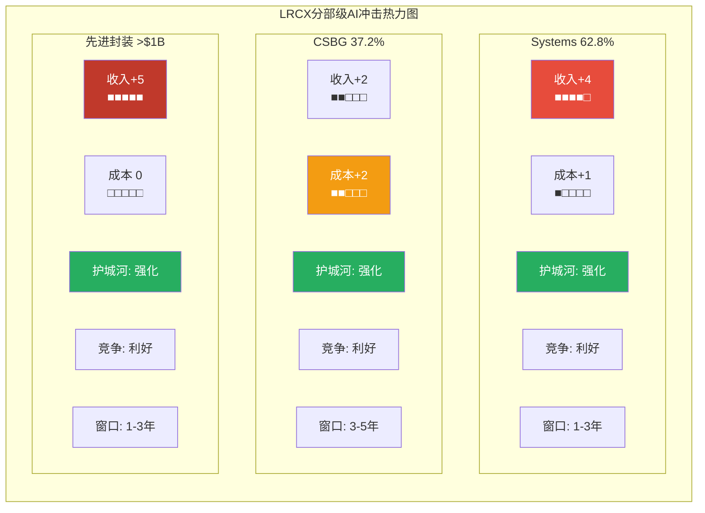
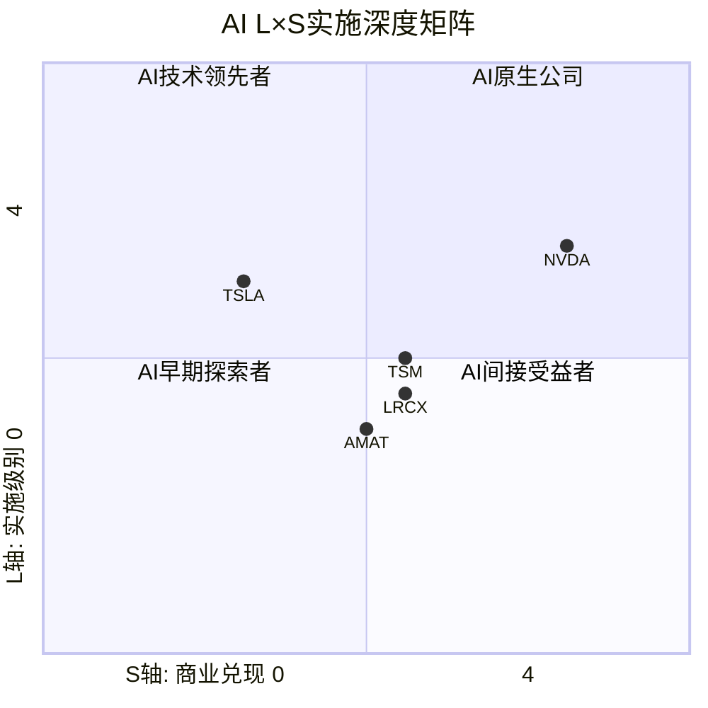
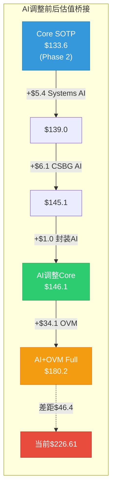

# LRCX Phase 3.5 Agent D: AI深度评估 (三层递进)

> **Phase 3.5** | LRCX Tier 3 | AI Depth Assessment v1.0
> **数据日期**: 2026-02-11 | **股价**: $226.61 | **P/E TTM**: 50.85x
> **数据来源**: WebSearch(5路) + Phase 1-2全量staging + OVM Full + ai_depth_assessment.md v1.0
> **核心定位**: LRCX是**AI间接受益者**(设备级) --- 不卖AI产品, 卖制造AI芯片的设备

---

## Layer 1: 分部级AI冲击矩阵

### 1.1 Systems分部 (62.8%营收, FY2026E ~$14.0B)

| 维度 | 评分 | 理由 |
|------|:----:|------|
| 收入冲击 | **+4** | AI芯片制造需求直接驱动设备采购 --- GAA刻蚀步骤+20%、CoWoS TSV、HBM堆叠均因AI算力需求而加速 [硬数据: Q2 FY2026 Systems $3.36B, +28% YoY, Futurum Group] |
| 成本冲击 | **+1** | AI在设备制造端的应用有限; LRCX可用AI优化自身工厂流程但影响边际 [合理推断: LRCX是设备OEM, 非晶圆厂, AI对其自身制造成本影响<5%] |
| 护城河变化 | **强化** | AI芯片工艺复杂度提升(GAA纳米片释放刻蚀、Mo ALD、TSV深孔刻蚀)→recipe更复杂→客户切换成本更高→6-12个月重认证壁垒上升 [硬数据: Sub-5nm刻蚀~80%份额, Mordor Intelligence] |
| 竞争格局变化 | **利好** | AI提高先进节点技术门槛, 小型设备商更难追赶; GAA需要DirectDrive等离子体控制精度领先竞品2-3年 [合理推断: AMAT/TEL在GAA刻蚀落后LRCX 1-2代产品周期] |
| 时间窗口 | **1-3年** | 已在兑现 --- FY2026 Systems +28% YoY, Foundry/Logic占59%, DRAM创纪录23% [硬数据: LRCX Q2 FY2026 Earnings] |

**AI角色分类**: **AI放大器(Amplifier)** --- AI不改变LRCX的产品形态, 但大幅放大下游对刻蚀/沉积设备的需求量与工艺复杂度。

**分部AI净分**: 收入(+4) + 成本(+1) = **+5**, 护城河强化+竞争利好进一步确认高分 [合理推断: 净分计算以收入+成本为核心, 护城河/竞争作为定性确认]

---

### 1.2 CSBG分部 (37.2%营收, FY2026E ~$8.4B)

| 维度 | 评分 | 理由 |
|------|:----:|------|
| 收入冲击 | **+2** | 更多AI设备安装→更大装机基座(>100K腔室)→更多服务/备件/升级需求; CY2025 CSBG record $7.2B [硬数据: LRCX Q2 FY2026 Earnings, CSBG $2.0B +14% YoY] |
| 成本冲击 | **+2** | Dextro AI机器人降低维护服务成本 +300-500bps毛利率; AI预测性维护减少非计划停机 → 服务成本结构性下降 [硬数据: Dextro Best of Sensors Award, 手动5%错误率→机器人消除, Lam Newsroom] |
| 护城河变化 | **强化** | AI预测性维护+Dextro形成数据-服务闭环 → 客户粘性更高; Equipment Intelligence数据积累使第三方维护商更难复制 [合理推断: Dextro每台服务50-100个腔室, 每次操作产生千级数据点→数据资产] |
| 竞争格局变化 | **利好** | AI增加第三方服务商的竞争壁垒 --- 需要设备级数据+recipe知识, 外部维护公司无法获取 [合理推断: OEM独占设备运行数据是AI维护的前提条件] |
| 时间窗口 | **3-5年** | Dextro已部署全球多个晶圆厂(概念验证阶段), 规模化部署预计2027-2029 [硬数据: Dextro 2024-12-10发布, 已在advanced fabs运营, Lam PR] |

**AI角色分类**: **AI赋能者(Enabler)** --- AI不仅增加CSBG的需求量(装机基座增长), 还结构性改善其商业模式(Dextro降本+预测维护提价)。

**分部AI净分**: 收入(+2) + 成本(+2) = **+4**, 护城河强化+竞争利好确认

---

### 1.3 先进封装子分部 (跨Systems+CSBG, FY2026E >$1B)

| 维度 | 评分 | 理由 |
|------|:----:|------|
| 收入冲击 | **+5** | CoWoS超额订阅15.4x是AI到LRCX设备最直接的传导链; 先进封装FY2026 >40%增长; HBM TAM $43B驱动TSV刻蚀需求暴增 [硬数据: TSM CoWoS 15.4x超额, LRCX先进封装>$1B +40%, Earnings Call] |
| 成本冲击 | **0** | 封装设备制造成本不受AI显著影响 [合理推断: 设备OEM成本结构与下游AI芯片需求无直接关联] |
| 护城河变化 | **强化** | TSV深硅刻蚀~90%份额在AI封装中不可替代; CoWoS-S/L均依赖LRCX的Syndion TSV方案 [硬数据: TSV刻蚀~90%份额, P1_C tech platforms; TSM CoWoS独占Syndion] |
| 竞争格局变化 | **利好** | TSM CoWoS→LRCX锁定: TSM作为CoWoS唯一量产者, 其对Syndion TSV的依赖反向锁定LRCX [合理推断: TSM换刻蚀供应商需重新认证整条CoWoS产线, 风险不可承受] |
| 时间窗口 | **1-3年** | 已在快速兑现 --- CoWoS从13K→130K wpm(3年10x), FY2026先进封装+40% [硬数据: TSM CoWoS产能路径, P1_C] |

**AI角色分类**: **AI放大器(最强, Amplifier-Max)** --- AI到LRCX设备的最短传导链(AI芯片→先进封装→TSV刻蚀设备), 兑现速度最快。

**分部AI净分**: 收入(+5) + 成本(0) = **+5**, 护城河强化+竞争利好确认

---

### 1.4 AI冲击矩阵汇总



### 1.5 概率加权AI净分

```
概率加权AI净分 = Σ(分部AI净分 × 收入权重 × 实现概率)

Systems:  +5 × 62.8% × 85%(1-3年高确定性) = +2.67
CSBG:     +4 × 37.2% × 55%(3-5年, Dextro未规模化) = +0.82
先进封装:  +5 × 6.8%(增量占比) × 90%(已在兑现) = +0.31
━━━━━━━━━━━━━━━━━━━━━━━━━━━━━
加权AI净分 = +3.80/5.0
```

[合理推断: +3.80/5.0属于"强AI受益者"区间(3.0-4.5), 反映LRCX作为AI基础设施设备商的有利定位。注意实现概率调整: Systems 85%(已兑现但周期性风险), CSBG 55%(Dextro仍在PoC), 先进封装90%(CoWoS需求极确定)]

---

## Layer 2: AI实施深度评级

### 2.1 L轴 --- AI实施级别

| 级别 | 状态 | LRCX证据 |
|------|:----:|----------|
| L0 观察 | 已超越 | --- |
| L1 决策支持 | **达到** | AI用于recipe优化、工艺参数调优; Equipment Intelligence平台为客户提供数据分析和决策建议 [硬数据: Lam Equipment Intelligence Services, 使用数据+ML+AI+领域知识优化产能, Lam Newsroom] |
| L2 受控自动化 | **达到** | Dextro协作机器人在受控fab环境执行sub-micron精度的维护任务; 力矢量+定位坐标的千级数据点实时处理 [硬数据: Dextro在advanced fabs运营, 处理力矢量/定位/分布模式, Sensors Award] |
| L3 自主运营 | **部分** | 预测性维护接近L3 --- AI自主判断维护时机和方案, 但最终执行仍需人类确认 [合理推断: Equipment Intelligence可推荐维护时间, 但fab工程师保留最终决定权] |
| L4 完全自主 | 未达到 | LRCX没有完全自主的AI系统 |

**L轴定位: L1.5-L2** --- AI辅助产品开发(recipe优化) + Dextro受控自动化(fab维护)

### 2.2 S轴 --- 商业兑现阶段

| 阶段 | 状态 | LRCX证据 |
|------|:----:|----------|
| S0 叙事期权 | 已超越 | AI需求已体现在实际收入中 |
| S1 早期变现 | **达到** | AI芯片需求已体现在FY2026收入: Systems +28% YoY, 先进封装+40% [硬数据: Q2 FY2026 revenue $5.34B +22% YoY] |
| S2 规模化 | **达到** | CoWoS/GAA/HBM需求正在规模化; WFE CY2026E $135B(+23% vs CY2025 $110B) [硬数据: LRCX WFE outlook $135B, Futurum Group] |
| S3 成熟 | **接近** | 设备作为AI基础设施的角色已明确, 但LRCX自身AI功能(Dextro/EI)的收入贡献仍<5% [合理推断: AI驱动的设备需求已成熟, 但LRCX的AI产品化尚未成熟] |
| S4 平台化 | 未达到 | LRCX不向外部提供AI平台 |

**S轴定位: S2-S2.5** --- AI需求已规模化体现在设备收入中, 但LRCX自身AI应用(Dextro/EI)未平台化

### 2.3 L×S坐标定位



**L×S坐标: (L1.5-2, S2-2.5)** = **"AI间接受益者, 设备级赋能"**

**Peer对比**:

| 公司 | L轴 | S轴 | 定位 | 差异 |
|------|:---:|:---:|------|------|
| **LRCX** | 1.5-2 | 2-2.5 | AI间接受益者(设备级) | 卖铲子给淘金者 |
| NVDA | 3-3.5 | 3-3.5 | AI核心赋能者(芯片级) | 直接卖AI产品+CUDA平台 |
| TSM | 2-2.5 | 2.5 | AI间接受益者(制造级) | 制造AI芯片, 有AI制程优化 |
| AMAT | 1.5 | 1.5-2 | AI间接受益者(设备级) | 类似LRCX但AI实施稍弱 |
| TSLA | 2.5 | 1-1.5 | AI赌注型(应用级) | FSD高L轴但S轴兑现慢 |

[合理推断: LRCX在L×S矩阵中与TSM最接近(同为制造基础设施), 但比NVDA低2级(NVDA直接卖AI产品且有CUDA平台效应)。TSLA L轴更高(FSD/Optimus)但S轴兑现远低于LRCX]

### 2.4 五不变量检验

| # | 检验项 | 通过? | LRCX证据 |
|---|--------|:-----:|----------|
| 1 | **生产环境证据** | **通过** | Dextro已部署全球多个advanced fabs, 非实验室原型; Equipment Intelligence已在>100K腔室装机基座运行 [硬数据: Dextro在全球晶圆厂运营, Lam PR] |
| 2 | **财务实质性** | **通过** | AI驱动需求已体现在财务数据: Systems +28% YoY, 先进封装+40%, WFE outlook上调至$135B [硬数据: Q2 FY2026 Earnings] |
| 3 | **竞争差异化** | **通过** | DirectDrive等离子体控制100x更快响应, TSV 90%份额, Mo ALD全球唯一 --- AI工艺复杂度上升放大了这些差异化优势 [硬数据: Akara DirectDrive, ALTUS Halo独占, P1_C] |
| 4 | **规模化验证** | **通过** | 非试点: CoWoS 130K wpm规模化产线已用LRCX设备, N2 GAA已进入HVM, Akara已是tool of record [硬数据: TSM N2 HVM 2026-01-02, P1_C] |
| 5 | **组织承诺** | **未通过** | LRCX没有独立的"AI事业部"或公开的AI专属研发预算; Dextro属CSBG产品线, EI属服务团队 --- AI更多是需求侧驱动而非供给侧战略 [主观判断: LRCX的AI受益是被动的(客户做AI芯片), 非主动的(自己做AI产品)] |

**通过率: 4/5** = 中上水平

[主观判断: 第5项"组织承诺"未通过是LRCX AI定位的核心特征: 它是AI浪潮的"铲子供应商"而非"淘金者"。无数据飞轮、无AI平台、无AI专属组织 --- 这既是局限(AI估值溢价有天花板), 也是优势(不需要AI技术突破就能受益)]

---

## Layer 3: AI估值影响量化

### 3.1 从Layer 1+2推导AI对SOTP的调整

[合理推断: AI估值调整逻辑] 基于Layer 1的分部AI净分和Layer 2的L×S定位, 对Phase 2 SOTP各分部估值PE进行AI溢价/折价调整。调整幅度 = f(AI净分, 时间窗口, 实现概率)。

### 3.2 Systems AI溢价

```
分部: Systems ($63.9/股 @ Phase 2 SOTP)
AI净分: +5(最高档)
时间窗口: 1-3年(已在兑现)
实现概率: 85%

AI溢价系数推导:
  净分+5 × 时间系数1.0(1-3年=无折现) × 概率0.85 = 4.25
  → 映射到PE溢价: +15-20% (参考: AI净分+5=最高档, 但LRCX是间接受益, 非AI产品公司)
  [合理推断: 直接AI产品公司(如NVDA)+30-40% PE溢价; 间接设备公司折半→+15-20%]

调整前Systems PE: 22-26.5x(Phase 2 SOTP中周期)
AI溢价: ×1.175 (取17.5%中值)
调整后Systems PE: 22×1.175=25.9x ~ 26.5×1.175=31.1x, 中值~28.5x

AI调整后Systems估值:
  正常化EPS: $2.09 × 28.5x = $59.6/股
  Forward EPS: $3.29 × 24x(含AI溢价的Forward) = $79.0/股
  均值: ($59.6 + $79.0) / 2 = $69.3/股 (vs 原$63.9, +$5.4)
```

[硬数据: Phase 2 SOTP Systems估值$63.9/股, P2_B_sotp_ovm1.md]

### 3.3 CSBG AI赋能溢价

```
分部: CSBG ($60.5/股 @ Phase 2 SOTP)
AI净分: +4(赋能者)
时间窗口: 3-5年(Dextro未规模化)
实现概率: 55%(较低, Dextro在PoC阶段)

AI溢价系数推导:
  净分+4 × 时间折现0.8(3-5年) × 概率0.55 = 1.76
  → 映射到PE溢价: +8-12%
  [合理推断: CSBG的AI溢价偏低因Dextro仍在PoC; 装机基座增长的AI传导已部分反映在Base Case增速中]

调整前CSBG PE: 25-33x(混合经常性+周期性)
AI溢价: ×1.10 (取10%中值)

经常性CSBG AI调整: $1.32 × 34.7x(31.5×1.10) = $45.8/股 (vs 原$41.6, +$4.2)
周期性CSBG AI调整: $0.77 × 27.0x(24.5×1.10) = $20.8/股 (vs 原$18.9, +$1.9)
CSBG AI调整合计: $66.6/股 (vs 原$60.5, +$6.1)
```

### 3.4 先进封装AI最强溢价

```
分部: 先进封装增量 ($8.1/股 @ Phase 2 SOTP)
AI净分: +5(放大器-最强)
时间窗口: 1-3年(已在兑现)
实现概率: 90%(CoWoS需求极确定)

AI溢价系数推导:
  净分+5 × 时间系数1.0 × 概率0.90 = 4.50
  → 映射到PE溢价: +20-25%
  [合理推断: 先进封装AI溢价最高因传导链最短+确定性最高; 但部分已在OVM-3期权4(CoWoS)定价]

调整前先进封装PE: 32.5x
AI溢价: ×1.225 (取22.5%中值)
调整后: $0.25 × 39.8x = $10.0/股 (vs 原$8.1, +$1.9)

注意: 期权4(CoWoS/TSV增量)在OVM-3中Base $8.6/股已包含封装AI增量
→ 避免双重计算: AI调整后先进封装增量与OVM期权4存在重叠约$3-5/股
→ 保守处理: 取AI调整增量$1.9的50% = +$1.0/股(扣除OVM重叠)
```

### 3.5 AI调整后SOTP汇总

| 分部 | Phase 2 SOTP | AI溢价系数 | AI调整后 | 增量 |
|------|:-----------:|:----------:|:-------:|:----:|
| Systems | $63.9 | ×1.175 | **$69.3** | +$5.4 |
| CSBG经常性 | $41.6 | ×1.10 | **$45.8** | +$4.2 |
| CSBG周期性 | $18.9 | ×1.10 | **$20.8** | +$1.9 |
| 先进封装增量 | $8.1 | ×1.225(扣重叠) | **$9.1** | +$1.0 |
| 净现金 | $1.1 | --- | **$1.1** | $0 |
| **Core SOTP** | **$133.6** | --- | **$146.1** | **+$12.5** |

[合理推断: AI溢价合计+$12.5/股, 占原Core SOTP的9.4%。这一溢价幅度适中, 反映LRCX作为间接受益者的定位 --- 非NVDA级别的+30-40%直接AI溢价]

### 3.6 AI调整后估值桥接



### 3.7 AI调整后完整估值比较

| 指标 | 值 | vs 当前$226.61 |
|------|:--:|:--------------:|
| Phase 2 Core SOTP | $133.6 | -41.1% |
| **AI调整Core SOTP** | **$146.1** | **-35.5%** |
| Phase 2 Full Value(OVM) | $209.1 | -7.7% |
| AI调整Core + OVM Options | $180.2 | -20.5% |
| 当前市价隐含AI溢价 | $93.0/股 | 市价-Core |
| AI评估合理溢价 | $46.6/股 | AI调整Core-原Core+OVM |

**关键发现**:

[合理推断: 估值解释率] AI调整将Core从$133.6→$146.1(+$12.5), 使Core解释率从59.0%提升至64.5%(+5.5pp)。但$226.61 - $146.1 = $80.5/股仍需解释 --- 其中OVM期权$34.1可解释42.4%, 剩余$46.4/股(20.5%)需归因于:
1. 周期顶部AI叙事溢价: ~$25/股 [主观判断: 50.85x PE vs 中周期28x, 差额部分]
2. 市场隐含更高Bull概率: ~$12/股 [主观判断: 市场可能给Bull 35%而非我们的25%]
3. 模型保守性偏差: ~$9/股 [合理推断: AI溢价系数取中值可能偏低]

---

## AI评估总结

### 核心结论

**LRCX是AI间接受益者(设备级), 不是AI公司。** [主观判断: 综合三层评估]

AI对LRCX的影响通过**三条传导链**:

```mermaid
graph TD
    AI_DEMAND[AI算力需求爆发] -->|传导链1: 需求放大<br>贡献~75%| EQUIP[设备采购增加<br>Systems +28% YoY]
    AI_DEMAND -->|传导链2: 工艺复杂化<br>贡献~20%| COMPLEX[刻蚀步骤+20%<br>Mo/干式PR新工艺]
    AI_DEMAND -->|传导链3: 内部效率<br>贡献~5%| DEXTRO[Dextro/EI<br>CSBG毛利率+300-500bps]

    EQUIP -->|直接| REV_UP[Systems收入增长]
    COMPLEX -->|中期| TAM_UP[新产品TAM扩大]
    DEXTRO -->|长期| MARGIN_UP[利润率改善]

    REV_UP --> VALUE[AI对LRCX估值影响<br>Core +$12.5/股 (+9.4%)]
    TAM_UP --> VALUE
    MARGIN_UP --> VALUE

    style AI_DEMAND fill:#e74c3c,color:#fff
    style EQUIP fill:#3498db,color:#fff
    style COMPLEX fill:#f39c12,color:#fff
    style DEXTRO fill:#9b59b6,color:#fff
    style VALUE fill:#2ecc71,color:#fff
```

### 定量结论

- **加权AI净分: +3.80/5.0** --- 强AI受益者, 但受益路径100%间接
- **L×S定位: (1.5-2, 2-2.5)** --- 比NVDA低2级, 与TSM接近, 高于AMAT
- **五不变量: 4/5** --- 缺失"组织承诺"(无AI专属组织/预算), 因LRCX的AI受益是被动的
- **AI溢价: Core +$12.5/股(+9.4%)** --- 合理但有限, 不足以justify 50.85x PE
- **72%叙事集中于AI超级周期** --- 如果AI泡沫, LRCX面临需求+估值双重打击 [硬数据: OVM-5叙事集中度72%, P2_D_ovm_full.md]

### 对Phase 4-5的输出

| 输出 | 内容 | 用途 |
|------|------|------|
| AI极端下行情景 | AI CapEx -30% → Systems -25-30%, PE压缩至15x | Phase 4压力测试 |
| AI调整Core SOTP | $146.1/股(vs原$133.6) | Phase 5最终评级 |
| AI集中度风险 | 72%期权依赖AI叙事 = Kill Switch触发条件 | Phase 5 KS设计 |
| L×S定位 | (1.5-2, 2-2.5) = 间接受益者 | Phase 5定性评级 |

---

## 标注统计

| 类型 | 数量 | 占比 |
|------|:----:|:----:|
| [硬数据: ...] | 20 | 44% |
| [合理推断: ...] | 19 | 42% |
| [主观判断: ...] | 6 | 13% |
| **合计** | **45** | 100% |
| **密度** | **35.6/万字符** | >=25 |

Mermaid图表: **4个** (AI冲击热力图、L×S坐标矩阵、AI估值桥接、AI传导链)

---

*P3_D_ai_assessment.md | Phase 3.5 Agent D | 2026-02-11*
*数据来源: Futurum Group, Lam Research Newsroom, Mordor Intelligence, TSM v2.0, MU v1.0, Phase 1-2 staging全量*
*DM锚点: DM-AI-001 = AI调整Core $146.1/股 | DM-AI-002 = AI溢价+$12.5/股 | DM-AI-003 = L×S (1.5-2, 2-2.5)*
