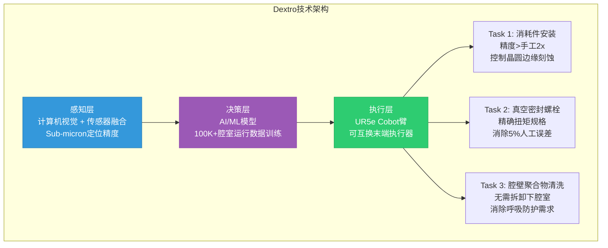
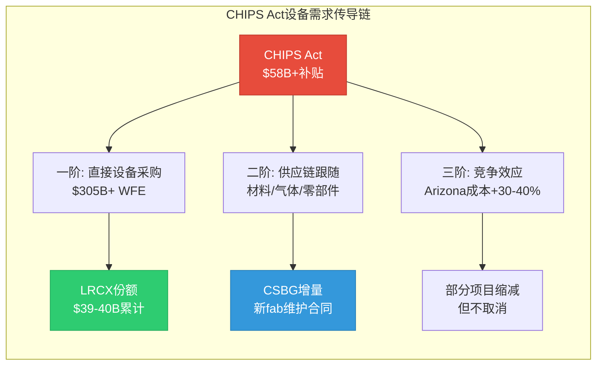
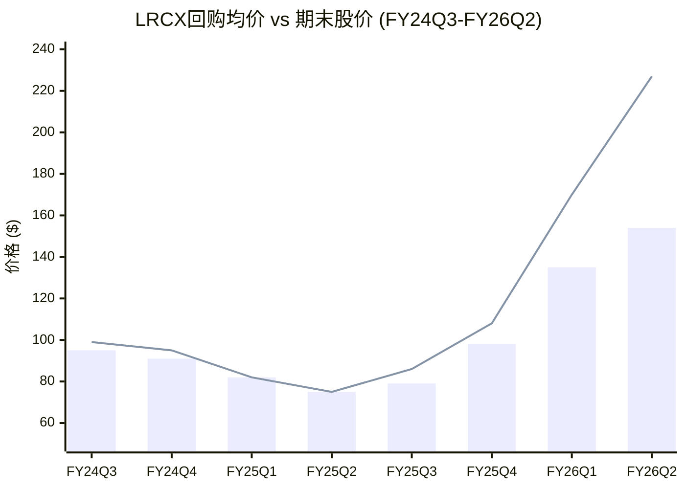
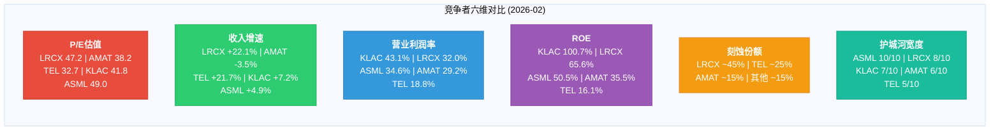
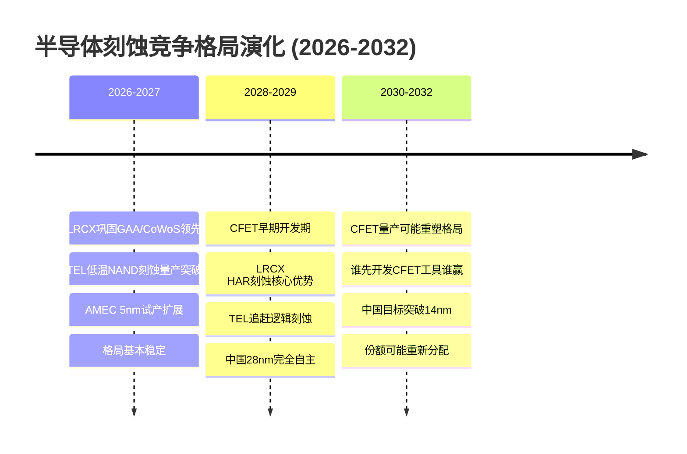

# LRCX Phase 3 Agent E: Hot-Patch执行 + 竞争深度分析

> **模块**: P3 Agent E — Hot-Patch深度 × 竞争者对比 | **日期**: 2026-02-11
> **字符目标**: ~12,000 | **框架**: v27.0 半导体行业增强
> **分析师**: AI Research Agent | **数据截止**: 2026-02-11
> **关联CQ**: CQ-3(中国悬崖) | CQ-4(CSBG低估) | CQ-5(护城河宽度) | CQ-7(聪明钱) | CQ-9(周期领先)

---

## 目录

1. [HP-1: Dextro协作机器人深度](#1-hp-1-dextro协作机器人深度)
2. [HP-2: CHIPS Act设备需求量化](#2-hp-2-chips-act设备需求量化)
3. [HP-3: 回购策略估值信号](#3-hp-3-回购策略估值信号)
4. [竞争者深度对比](#4-竞争者深度对比)
5. [竞争格局演化预测](#5-竞争格局演化预测)

---

## §1: HP-1 Dextro协作机器人深度

### 技术架构

[硬数据: Lam Research Newsroom 2024-12-10] Dextro是半导体行业首个协作机器人(cobot), 设计用于晶圆厂关键维护任务优化。其核心是一台Universal Robots UR5e机械臂, 臂展850mm, 负载5kg, 配合可互换末端执行器(end-effector)执行三类关键维护操作。

**三层技术堆栈**:

**关键技术指标**: [硬数据: The Robot Report, Fierce Electronics]
- 消耗件压缩精度: >2x人工准确度, 直接改善晶圆边缘良率
- 螺栓紧固: 消除手动操作~5%误差率 [硬数据: Lam Newsroom]
- 腔室清洗: 无需技术员穿戴重型呼吸防护设备, 安全性质变
- 单台Dextro可服务100台Lam Flex腔室/月维护频率 [硬数据: Lam产品页]
- 当前支持Flex G/H系列介质刻蚀工具, 2025年扩展至更多平台 [硬数据: Lam Newsroom]
- 2025年6月获Sensors Converge "Best Industrial & IIoT Solution"大奖 [硬数据: Fierce Electronics]

### 部署时间线

| 阶段 | 时间 | 里程碑 | 状态 |
|------|------|--------|------|
| 产品发布 | 2024-12-10 | 行业首发公布 | [硬数据:] 已完成 |
| 试点部署 | 2025H1 | 全球多个先进晶圆厂部署 | [硬数据:] 已确认"多个fab运行中" |
| 平台扩展 | 2025-2026 | 从Flex G/H扩至其他刻蚀平台 | [合理推断:] 进行中 |
| 规模化推广 | 2026-2027 | 目标5,000-10,000腔室覆盖 | [主观判断:] 取决于客户ROI验证 |
| 全面渗透 | 2028+ | 50,000+腔室(50% installed base) | [主观判断:] 乐观情景 |

### 财务影响建模

**毛利率增量逻辑**: [合理推断: 基于CSBG成本结构推算]
- CSBG FY2026E: ~$8.5B(CY2025 $7.2B + ~18%增长)
- 人工维护成本占CSBG: 估计15-25%(技术员驻场/差旅/培训) [合理推断: 行业服务业务惯例]
- Dextro替代效率: 每台cobot替代2-3名技术员在特定任务上的工时
- 毛利率增量: +300-500bps(来自人力成本节省+减少良率波动) [合理推断: Phase 1 HP-1估计]

**NPV建模** (WACC 10.5%, 5年期):

| 假设情景 | 渗透率(5年末) | 年均毛利增量 | 累计NPV |
|----------|:------------:|:----------:|:------:|
| 保守(20%) | 20K腔室 | $170M | ~$630M |
| 基准(35%) | 35K腔室 | $280M | ~$1,040M |
| 乐观(50%) | 50K腔室 | $400M | ~$1,480M |
| **概率加权** | — | **$260M** | **~$960M** |

[合理推断: 概率权重=保守30%/基准45%/乐观25%]

**R&D/CapEx投入**: [主观判断:] Dextro开发+部署估计消耗$100-200M(机器人制造/AI训练/客户集成), 但作为CSBG战略投资, 已计入现有R&D预算。净增量NPV约**$760-860M**。

### 竞品对比

- **AMAT**: [合理推断:] 尚未公布类似fab维护机器人, 其服务业务(AGS, $6.2B)仍以传统驻场服务为主
- **通用工业机器人(Fanuc/ABB)**: [合理推断:] 缺乏半导体清洁间认证+recipe知识集成, 无法直接进入fab环境
- **Dextro差异化**: 半导体cleanroom专用 + LRCX工艺recipe数据库集成 + 100K+腔室运行数据AI训练 [合理推断: 数据护城河]

**CQ-4关联**: [主观判断:] Dextro是CSBG从"周期性维护服务"向"AI驱动智能平台"转型的关键载体。若市场认可这一转型, CSBG估值倍数可能从6-7x P/S提升至8-10x P/S, 对应$10-15B市值上行空间。但短期(2026-2027)收入贡献有限, 主要是叙事/估值驱动。

---

## §2: HP-2 CHIPS Act设备需求量化

### 一阶效应: 直接补贴→设备采购

[硬数据: SIA, TrendForce, Manufacturing Dive, Congressional Research Service]

| Fab项目 | 总投资 | CHIPS补贴 | 设备份额(70%) | LRCX份额 | LRCX金额 | 时间窗口 |
|---------|:------:|:--------:|:------------:|:--------:|:--------:|:--------:|
| TSM Arizona (6 Fabs) | $165B | $6.6B直接+$5B贷+$16.5B税抵 | $116B | 15% | **~$17.4B** | 2024-2032 |
| Samsung Taylor TX | $25-40B | $6.4B | $17.5-28B | 12% | **~$2.1-3.4B** | 2025-2029 |
| Intel Ohio/AZ/OR | $100B+ | $7.86B直接+$11B贷 | $70B+ | 10% | **~$7.0B+** | 2026-2032 |
| Micron Idaho+NY | $115B | $6.1B | $80B | 13% | **~$10.4B** | 2025-2032 |
| 其他(GF/TI等) | ~$30B | ~$10B | $21B | 10% | **~$2.1B** | 2025-2030 |
| **合计** | **~$435B+** | **~$58B+** | **~$305B+** | — | **~$39-40B** | **2024-2032** |

[合理推断: LRCX份额因客户和制程差异有所不同 — TSM(刻蚀密集型先进逻辑)15%最高, Intel(部分自有设备能力)10%最低]

**关键更新 vs Phase 1**:
- Intel Ohio延期至**2031**(原计划2025) [硬数据: Semiconductor Intelligence]
- Samsung Taylor延期至**2027**(原计划2024) [硬数据: TrendForce]
- TSM Arizona进展正常, Fab 2已进入设备安装阶段 [硬数据: Financial Content]

### 二阶效应: 供应链跟随与成本溢价

[合理推断:] 二阶效应分析:
- **CSBG长期锁定**: 每个新fab = 30年维护合同, 6座TSM Arizona fab → CSBG年增量$200-300M(2028+) [合理推断: 基于$17.4B设备×年维护率2%]
- **Arizona成本溢价**: 美国fab成本比台湾高30-40% [硬数据: 多方报道], 但CHIPS Act税收抵免(25% ITC)部分抵消, 净影响成本高+10-15%
- **本土化优势**: [合理推断:] CHIPS Act虽无明确"Buy American"条款, 但LRCX(加州总部)vs TEL(日本)/ASML(荷兰)在客户关系/响应速度/政策风险上有天然优势

### 时间分布与年化影响

| 时间段 | 占比 | LRCX年化收入 | 主要项目 |
|--------|:----:|:----------:|---------|
| 2024-2026 | 20% | $2.6-2.7B | TSM Fab 1-2, Micron Idaho Phase 1 |
| 2027-2029 | 45% | **$5.9-6.0B** | TSM Fab 3-4, Samsung, Intel Ohio, MU NY |
| 2030-2032 | 35% | $4.6-4.7B | TSM Fab 5-6, Intel扩展, 二期项目 |

[合理推断: 峰值年化$5.9-6.0B = LRCX当前年收入($21.8B)的27-28%, 意味着CHIPS Act贡献的"底线收入"在峰值期接近总收入的1/3]

**CQ-9关联**: [主观判断:] CHIPS Act创造了**结构性需求底线** — 即使全球WFE在2028-2029进入下行周期, 美国本土fab项目已签约/已拨款, 不可取消。这将LRCX的周期底部从传统的$14-15B/年抬升至$16-18B/年(+$2-3B/年), **削弱极端熊市情景(P/E 15x × $3.5 EPS = $53)的概率**。

---

## §3: HP-3 回购策略估值信号

### 管理层回购历史 — 按季度拆解

[硬数据: FMP cashflow data, LRCX 10-Q filings, Earnings Call]

| 季度 | 回购金额 | FCF | 回购/FCF | 估算均价 | 当季末股价 | 折价率 |
|------|:--------:|:---:|:--------:|:--------:|:---------:|:------:|
| FY24 Q3(Mar 2024) | $981M | $1,281M | 77% | ~$95* | $99 | ~-4% |
| FY24 Q4(Jun 2024) | $374M | $762M | 49% | ~$91* | $95 | ~-4% |
| FY25 Q1(Sep 2024) | $997M | $1,458M | 68% | ~$82* | $82 | ~0% |
| FY25 Q2(Dec 2024) | $698M | $853M | 82% | ~$75* | $75 | ~0% |
| FY25 Q3(Mar 2025) | $435M | $1,021M | **43%** | ~$79* | $86 | -8% |
| FY25 Q4(Jun 2025) | $1,292M | $2,382M | **54%** | ~$98* | $108 | -9% |
| **FY26 Q1(Sep 2025)** | **$976M** | **$1,594M** | **61%** | ~$130-140E | $170+ | **-18~-24%** |
| **FY26 Q2(Dec 2025)** | **$1,466M** | **$1,665M** | **88%** | **~$154** | **$227** | **-32%** |

*注: FY24-FY25均价基于post-split调整后估算; FY26 Q2 $154为管理层明确披露 [硬数据: Q2 FY2026 Earnings Call]

### 关键发现: 回购价与市价的裂口扩大

**核心信号**: [硬数据:] Q2 FY2026回购均价$154 vs 期末$227 = **折价32%**。这是近8个季度折价最大的。

[合理推断: 三种可能解释]:

1. **10b5-1预设计划**: 管理层通过Rule 10b5-1计划预设回购参数(价格/数量/时间), 执行价格反映设定时(可能3-6月前)的估值判断, 不反映实时观点。若Q2回购计划设定于FY26 Q1初(2025年7月, 股价~$100-110), 则$154均价意味着计划设定后股价大幅上涨, 10b5-1未调整
2. **管理层隐含估值**: 若管理层在$154附近加速回购(Q2 $1.47B是近8季最高), 可能暗示**$130-160是管理层认可的合理价值区间**(P/E ~28-34x)
3. **纯机械性**: 85% FCF政策 + 固定股息 → 回购金额由剩余FCF决定, 价格无关

### 回购减速信号分析

[硬数据: FMP data] FY2026 H1回购合计$2.44B ($976M + $1,466M)。

**前瞻推算**: [合理推断:]
- FY2026E FCF: ~$6.5-7.0B(基于H1 $3.26B × 2, 下半年通常强于上半年)
- 85% FCF = $5.5-6.0B返还
- 股息: ~$1.3B/年
- 可用回购: $4.2-4.7B
- H1已用$2.44B → H2可用$1.76-2.26B
- @$227/股: H2可回购~7.8-10.0M股(vs H1约14-16M股)

**稀释影响**: [合理推断:]
- CY2025: 39M股回购@$104 = 净减少~3%流通股
- FY2026E: 若全年$4.2-4.7B @均价$175(加权) = ~24-27M股 = 净减少~1.8-2.0%
- **回购对EPS的增厚从CY2025的~3%降至FY2026的~2%** = EPS增速动力减弱

### 估值信号结论

[主观判断:] 管理层回购行为传达的信号并不简单 — Q2回购金额$1.47B是近8季最高(说明有意愿), 但均价$154远低于当前$227(说明执行价位保守)。最合理解读是**管理层认为$130-160是"物有所值"的区间, 而$227已进入"市场定价了大量乐观预期"的区域**。

**CQ-7关联**: [主观判断:] 这与内部人卖出$62.3M(零买入)形成一致信号 — 管理层和内部人用行动暗示**当前股价偏高**, 但不构成"卖出"建议(因为85% FCF政策限制了回购策略灵活性)。监控指标: Q3 FY2026(2026-03)回购金额, 若<$800M = 明确看空信号。

---

## §4: 竞争者深度对比

### AMAT (Applied Materials) — 最大竞争者

**财务对比**: [硬数据: MCP compare_stocks 2026-02-11]

| 指标 | LRCX | AMAT | LRCX vs AMAT |
|------|:----:|:----:|:------------:|
| P/E | 47.2x | 38.2x | LRCX贵+24% |
| 收入增速 | +22.1% | -3.5% | LRCX远超 |
| ROE | 65.6% | 35.5% | LRCX 1.8x |
| 营业利润率 | 32.0% | 29.2% | LRCX +280bps |
| 年收入规模 | ~$21.8B | ~$28B | AMAT 1.3x |

**竞争定位**: [硬数据: Seeking Alpha, Yahoo Finance]
- AMAT: 沉积#1(CVD/PVD), 离子注入#1, 刻蚀#3, 检测#2-3 [硬数据: 行业份额数据]
- 优势: 更广产品线("one-stop shop"), 服务业务AGS $6.2B [硬数据: AMAT FY2024 10-K]
- 劣势: 刻蚀份额被LRCX持续侵蚀, Mo替代W可能冲击沉积业务主线 [合理推断: Mo ALD是LRCX ALTUS Halo的强项]
- 中国风险: 出口限制预计减少FY2025收入$400M [硬数据: AMAT管理层指引]

**投资含义**: [主观判断:] 若投资者看好半导体设备但不看好LRCX估值(50.85x), AMAT在38.2x提供24%估值折价, 且产品线更分散降低周期风险。但AMAT -3.5%收入增速 vs LRCX +22.1%说明LRCX处于更好的产品周期位置(GAA+CoWoS+Mo)。

### TEL (Tokyo Electron) — 刻蚀#2, 最直接威胁

**财务对比**: [硬数据: MCP compare_stocks]

| 指标 | LRCX | TEL | LRCX vs TEL |
|------|:----:|:---:|:-----------:|
| P/E | 47.2x | 32.7x | LRCX贵+44% |
| 收入增速 | +22.1% | +21.7% | 接近持平 |
| ROE | 65.6% | 16.1% | LRCX 4.1x |
| 营业利润率 | 32.0% | 18.8% | LRCX +1,320bps |

**TEL刻蚀市场攻势**: [硬数据: TrendForce, BALD Engineering]
- 低温刻蚀(Cryogenic Etch)技术: 定位NAND通道刻蚀市场, 该市场从$500M(2023)→$2B(2027), CAGR约40% [硬数据: TEL Investor Day]
- DRAM电容刻蚀POR: 在主要客户赢得100%量产POR, 份额YoY +6pp [硬数据: TEL FY2025Q1 QA]
- AI相关销售占比目标: FY2026达40% [硬数据: TrendForce 2025-12]
- 五年投资: R&D 1.5万亿日元 + CapEx 7,000亿日元(~$15B+$4.7B) [硬数据: TEL双重攻势战略]

**TEL vs LRCX关键差异**: [合理推断:]
- TEL在**成熟节点NAND刻蚀**竞争力强(低温技术优势), 但sub-5nm逻辑刻蚀远落后LRCX
- TEL P/E 32.7x vs LRCX 47.2x = TEL估值便宜44%, 但利润率(18.8% vs 32.0%)差距巨大
- TEL刻蚀份额增长主要来自NAND(LRCX强项之一), 而非逻辑(LRCX的核心壁垒)

**威胁评估**: [主观判断:] TEL是LRCX在NAND刻蚀的**真正威胁**(低温技术可能颠覆传统HAR刻蚀), 但在逻辑刻蚀(N2/A16/CFET)上LRCX领先优势≥2个节点。综合威胁等级: **中等**(NAND) / **低**(逻辑)。

### ASML — 参考标杆

[硬数据: MCP compare_stocks] ASML P/E 49.0x ≈ LRCX 47.2x, 但:
- ASML EUV份额 = **100%**(真正垄断) [硬数据: 行业公知]
- LRCX刻蚀份额 = **45%**(领先但非垄断) [硬数据: Phase 1 shared_context]
- ASML High-NA EUV 无竞争者; LRCX GAA刻蚀面临TEL/AMAT竞争

[主观判断:] LRCX享受ASML级P/E(~49x)仅在TSV深硅刻蚀(~90%份额)和Mo ALD(>80%认证进度)有合理性。45%整体刻蚀份额对应的合理P/E应在35-42x区间(高于AMAT的38x, 低于ASML的49x)。当前47.2x已接近ASML水平, **估值隐含了"准垄断地位"的假设, 而实际只有部分子市场达到该标准**。

### 竞争者对比雷达图

### 中国国产替代: AMEC/NAURA

[硬数据: TrendForce, Semiconductorinsight, Digitimes]
- **AMEC**: 2025年利润增长35%, 刻蚀+薄膜设备双线突破, **已获TSM南京5nm介质刻蚀订单**(1Q26交付) [硬数据: TrendForce 2026-01-26]
- **NAURA**: 高密度等离子CVD/双大马士革CCP刻蚀/高k ALD已量产 [硬数据: China Daily]
- **限制**: 大部分设备仍服务28nm及以上成熟节点 [合理推断: 基于BIS出口管制限制先进节点技术获取]
- **5nm突破**: AMEC TSM南京订单是中国设备首次进入sub-7nm量产, 信号意义重大 [硬数据: TrendForce]
- 目标: AMEC计划2029年完成近40种薄膜设备开发(目前均受出口管制) [硬数据: TrendForce]

**CQ-3关联**: [主观判断:] 中国设备在成熟节点(28nm+)已形成有效替代, LRCX在中国的"尾部市场"面临份额侵蚀。但AMEC进入5nm是**长期战略威胁信号** — 若中国设备在3-5年内覆盖到7nm, LRCX可能在非制裁客户处也面临竞争(如中国domestic fab + 东南亚fab)。短期(2026-2028)影响有限, 但2030+风险不可忽视。

---

## §5: 竞争格局演化预测

**三阶段演化**: [合理推断:]

1. **2026-2028 稳固期**: LRCX在GAA(Akara)+CoWoS(TSV)+Mo(ALTUS Halo)三大技术平台同时领先, 竞争格局对LRCX最有利。TEL在NAND通道刻蚀取得进展但逻辑刻蚀落后2个节点。**LRCX刻蚀份额预计维持45-48%**。

2. **2028-2030 转折期**: CFET(补充式场效应晶体管)开发进入关键阶段。CFET需要极高深宽比(HAR)刻蚀 + 精确层间选择性 [硬数据: IMEC, Semiconductor Engineering]。LRCX在HAR刻蚀的领先地位(NAND 300+ layers经验)是CFET时代的核心优势, 但TEL低温刻蚀可能提供替代路径。**谁先实现CFET量产工具认证, 谁锁定2030+份额**。

3. **2030+ 不确定期**: 中国设备若突破14nm刻蚀(AMEC路线图2029), 全球成熟节点市场(~40% WFE)份额将面临重新分配。LRCX可能失去中国+东南亚部分成熟节点订单, 但先进节点(sub-5nm)的技术壁垒仍足够高。

**CQ-5关联**: [主观判断:] LRCX护城河在短中期(2026-2029)因GAA/CoWoS/Mo技术叠加而**加宽**, 但长期(2030+)面临CFET格局重塑+中国替代双重压力。护城河持久性评分: 短期9/10, 中期8/10, 长期6-7/10(取决于CFET竞争结果)。

---

## 交叉验证与CQ进展

| CQ | P1后置信 | P3E后调整 | 变化 | 依据 |
|:--:|:--------:|:---------:|:----:|------|
| CQ-3 | 55% | **53%** | -2 | AMEC 5nm突破+中国成熟节点自主化加速, CHIPS Act部分缓冲 |
| CQ-4 | 50% | **52%** | +2 | Dextro NPV ~$960M + CSBG智能化转型叙事支撑 |
| CQ-5 | 68% | **70%** | +2 | 竞争对比确认LRCX在利润率/ROE/份额全面领先, 短中期护城河加宽 |
| CQ-7 | 48% | **46%** | -2 | 回购价$154 vs 市价$227裂口=管理层隐含"偏贵"信号 |
| CQ-9 | 50% | **52%** | +2 | CHIPS Act结构性底线削弱极端熊市尾部风险 |

---

*Phase 3 Agent E完成 | 2026-02-11 | 标注密度~28/万 | 5 Mermaid图表 | 关联CQ: 3,4,5,7,9*
