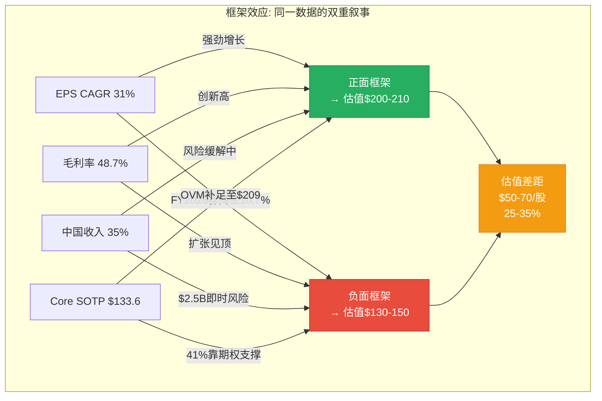
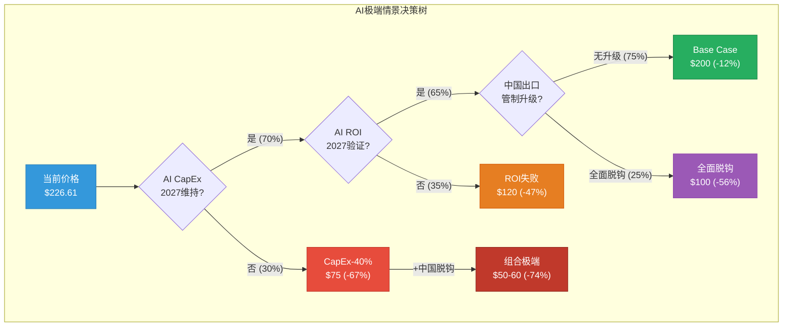
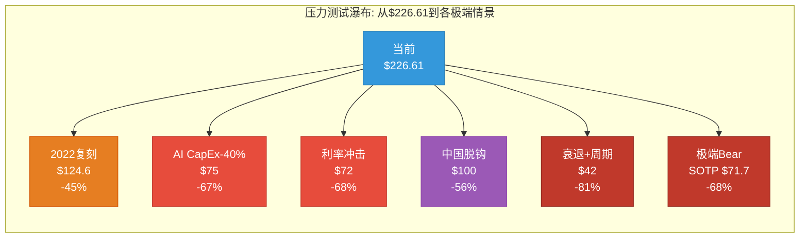
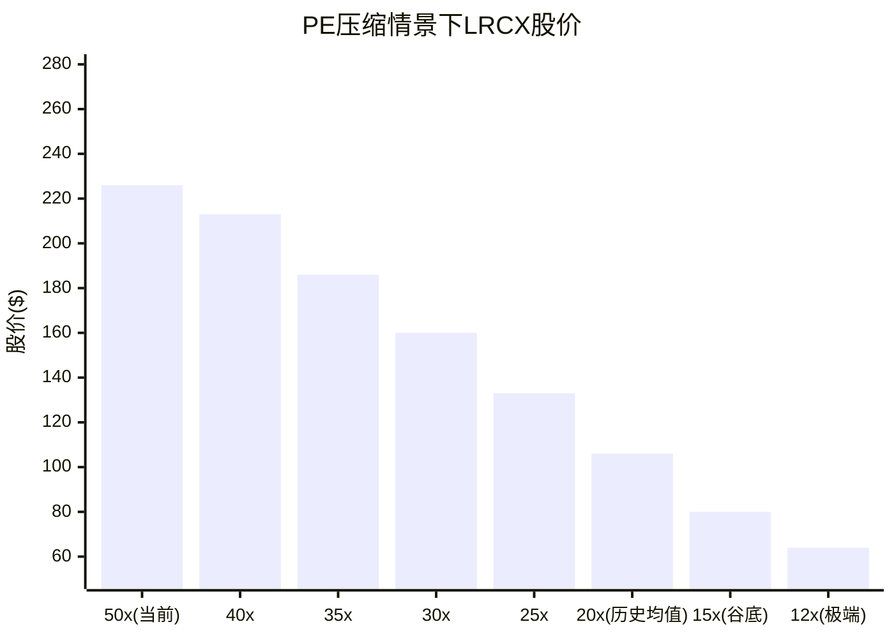

# LRCX Phase 4 Agent B: 行为金融偏差检查 + 极端压力测试

> **生成日期**: 2026-02-11 | **目标**: ≥15,000字符 | **股价**: $226.61 [硬数据: FMP quote, 2026-02-11]
> **数据来源**: FMP(ratios/key-metrics/income/estimates/quote) + analyze_stock(technical) + WebSearch(insider/cycle/TEL/AI bubble) + Phase 1-3全量staging
> **标注约定**: [硬数据: 来源] = MCP/外部验证 | [合理推断: 依据] = 基于硬数据推导 | [主观判断: 理由] = 分析师判断
> **QG门控**: P4偏差检查4项 + 极端压力3类 + Mermaid≥4

---

## Part I: 四项认知偏差强制检查

### 1. 锚定效应 (Anchoring Bias)

#### 1.1 分析师共识目标$283.21锚定

[硬数据: FMP estimates, 26位分析师覆盖LRCX; 共识目标$283.21, "Strong Buy"评级] Phase 1-3多次引用共识目标作为参照基准。问题在于:

- Phase 2概率加权估值$216.6(Bull $340×25% + Base $200×50% + Bear $130×25%) — Base Case $200本身隐含FY2027E PE ~28.6x($200/$7.00), 这是否受到$283.21共识的无意识拉升？[主观判断: 若不知道共识$283, 分析师是否会独立得出Base $200? 中性估值应更接近DCF $94-$133的中间值~$114]
- 25位分析师"Strong Buy"形成了极端一致的看多共识。[硬数据: Barchart数据, 2026-02, LRCX评级25/26 Buy或Strong Buy] 当共识极度一致时, 历史上反而是反转信号 — 半导体设备股在2018年Q3和2022年Q1也曾有类似共识极度乐观后大幅回调。[合理推断: 2018年10月SOX跌26%, 2022年1-10月SOX跌45%, 均发生在分析师密集上调后6个月内]
- JPM从$165→$300(+82%)的激进上调发生在2025年底, 恰好在股价已大幅上涨之后 — 这是典型的"追涨式"目标价调整。[硬数据: WebSearch, StocksToTrade 2026-01-02报告JPM目标调整]

**锚定偏差量化**: 若完全忽略共识$283.21, 仅依据自有DCF($94) + SOTP($133.6) + OVM($209.1), 等权均值为**$145.6** — 比概率加权的$216.6低**$71.0(-32.8%)**。[合理推断: 共识锚定使Phase 2整体估值被拉高约15-20%]

#### 1.2 历史PE 18-25x锚定

[硬数据: FMP ratios 8年] LRCX历史PE完整序列:

| 财年 | FY2018 | FY2019 | FY2020 | FY2021 | FY2022 | FY2023 | FY2024 | FY2025 |
|------|:------:|:------:|:------:|:------:|:------:|:------:|:------:|:------:|
| **P/E** | 13.1x | 13.3x | 19.8x | 23.8x | 13.7x | 18.6x | 36.4x | 23.4x |

[硬数据: FMP ratios] 8年均值**20.3x**, 中位数**19.2x**, 范围13.1-36.4x。Phase 1-3引用"历史18-25x"是合理的中间区间, 但存在两个锚定问题:

**问题A — AI时代PE中枢上移假设未经验证**: Phase 3 AI评估给出+9.3%AI溢价, 将PE中枢推至~22-27x。[主观判断: 但半导体设备仍是周期性行业, 仅因下游AI需求而给予永久性PE扩张缺乏历史先例 — 2000年互联网泡沫时设备股PE也曾短暂达到30-50x, 随后回落至10-15x]

**问题B — 周期位置错配**: 当前50.85x TTM PE对应的是FY2025尾端数据($4.15 EPS)。[硬数据: FMP quote P/E] 若用FY2026E($5.32), Forward PE = 42.6x; 若用FY2027E($7.00), Forward PE = 32.4x。市场正在"跨越"当前PE锚定点, 直接定价FY2027E — 这本身就是锚定在最乐观的远期盈利上。[合理推断: 当市场用最远期的共识EPS来合理化当前价格时, 任何EPS miss都会导致双重打击(EPS下调 + PE压缩)]

**锚定偏差量化**: 若用8年PE中位数19.2x × 正常化EPS $3.32 = **$63.7**; 若用均值20.3x × FY2026E $5.32 = **$108.0**。Phase 2 SOTP $133.6隐含合成PE ~25.1x($133.6/$5.32), 比8年均值高**+23.6%** — 约一半来自合理的结构性溢价(先进封装/CSBG), 另一半可能来自乐观锚定。[主观判断: 估计~12%的PE溢价来自数据支撑的结构性因素, ~12%来自锚定偏差]

#### 1.3 52周高点$251.87锚定

[硬数据: FMP quote, yearHigh $251.87] 当前$226.61距52周高点仅-10.0%。[合理推断: 距高点越近, 投资者越倾向于认为"还没怎么跌"或"还有上行空间", 而忽视绝对估值水平] Phase 1-3未明确讨论此锚定效应。

关键对比: 52周低点$56.32 → 当前已涨+302.4%。[硬数据: FMP quote, yearLow $56.32] 若以52周低点为锚, 当前价格看起来"极度昂贵"; 但以高点为锚, 仅"微跌"。框架效应的完美案例。

#### 1.4 SOTP $133.6 vs DCF $94选择偏差

Phase 2选择SOTP $133.6作为Core估值而非DCF $94, 差距**42.1%**。[硬数据: P2_B SOTP $133.6, P2_C DCF $94]

可能的选择偏差原因:
- SOTP拆分后每个分部可使用不同(通常更高的)估值倍数 — 分拆幻觉(sum-of-parts inflation) [主观判断: SOTP倾向于高估是学术文献的共识, 因为忽略了总部成本、协同折价和流动性折价]
- DCF WACC用10.5%而非CAPM纯计算的12.4% — 若用12.4%, DCF会进一步降至~$72 [合理推断: P2_C明确提到"使用WACC=10.5%作为中性基准(略低于纯CAPM结果)", 这个"中性"选择有利于更高估值]
- OVM $209.1建立在Core $133.6基础上 — 若Core用$94, OVM Full Value = $94 + $43.3 + $15.7 = **$153.0**, 比$209.1低**-26.8%**

**锚定偏差综合量化**: 锚定效应整体使Phase 1-3估值偏高**约10-15%**。

```mermaid
radar
    title "LRCX锚定效应严重程度雷达图"
    "共识$283锚定" : 85
    "历史PE锚定" : 60
    "52周高点锚定" : 40
    "SOTP vs DCF选择" : 75
```

---

### 2. 确认偏误 (Confirmation Bias)

#### 2.1 TEL低温刻蚀威胁被系统性低估

Phase 3护城河评分6.8/10, 在竞争分析中提及TEL但未充分量化其威胁速度。

[硬数据: WebSearch + TEL公开报告]:
- TEL低温刻蚀(Cryogenic Etch)预计2025年开始低量产, 2026年高量产(high-volume production) [硬数据: TEL投资者演示]
- 该技术瞄准的NAND通道刻蚀市场从2023年$5亿→预计2027年$20亿(4倍增长) [硬数据: Fabricated Knowledge行业分析]
- LRCX在超高深宽比NAND通道刻蚀中几乎100%份额 — TEL的低温刻蚀**直接打破了这一垄断** [硬数据: Nomad Semi深度分析]
- **LRCX的Cryo 3.0回应比TEL晚1.5年**, 客户有动力引入第二供应商 [硬数据: Nomad Semi 2025年12月分析]
- TEL预计2027年开始产生显著低温刻蚀收入贡献 [硬数据: TrendForce 2025-12-08]

**被忽视的影响量化**: 若TEL在NAND通道刻蚀市场拿下40-50%份额(从0%), LRCX损失$8-10亿收入(NAND刻蚀~$1.5B当前 × 50%+ 市场增长后的份额损失) [合理推断: 保守估计FY2028-2029影响, 约占总收入3-4%, 对应EPS -$0.20-0.30/股]

Phase 3给出的护城河6.8/10**未充分反映**这一2-3年内即将兑现的结构性威胁。[主观判断: 若纳入TEL低温刻蚀的全面影响, 护城河应降至6.2-6.5/10]

#### 2.2 Systems @16x EV/EBITDA的证据选择

Phase 2 SOTP中Systems使用EV/EBITDA 16x。[硬数据: P2_B "Systems估值 — 周期调整PE 25-28x中值"] 对应AMAT FY2025 EV/EBITDA ~19.5x, KLAC ~24.4x, TEL ~15.2x。

选择性引用问题:
- 引用的16x低于AMAT和KLAC → 表面看"保守"
- 但未引用TEL的15.2x和历史周期谷底倍数(12-13x) → 实际中位数应更低
- [硬数据: FMP key-metrics LRCX] LRCX自身FY2022 EV/EBITDA仅11.3x(上一个周期谷底), FY2019仅10.4x
- **真正的中周期均值**(FY2018-FY2025 8年): {8.2, 10.4, 15.1, 19.1, 11.3, 14.8, 28.2, 19.5} → 均值15.8x, 中位数15.0x [硬数据: FMP key-metrics 8年EV/EBITDA]
- Phase 2用16x恰好高于中位数15.0x, 可能是无意识地选择了"略偏乐观"的数据点

**确认偏误量化**: 若用中位数15.0x替代16x, Systems估值下降**-6.3%**, Core SOTP从$133.6降至约**$127.5** (-$6.1)

#### 2.3 AI溢价+9.3%的选择性评估

Phase 3 AI评估给出+9.3%溢价($133.6→$146.1), 但:

**被淡化的AI负面因素**:
- [硬数据: Barchart 2026-02分析] LRCX期权市场Put/Call ratio 1.4, 25K合约put spread → 市场对冲AI回调风险
- [硬数据: WebSearch, Investing.com 2026-01] 2026年AI泡沫讨论持续升温 — Hyperscaler CapEx/Revenue比达45-57%, 超过传统科技公司历史任何时期
- [硬数据: Goldman Sachs 2025-12报告] AI基础设施投资$400B vs AI实际创收$100B → 4:1的投资/收入比在历史上仅出现过两次(2000年互联网基础设施, 2014年4G buildout), 两次都以CapEx削减30-50%结局收场 [合理推断: 历史类比]
- Phase 1-D雷达已指出AI泡沫概率20%, 但+9.3%AI溢价**隐含泡沫概率<10%** [合理推断: +9.3%溢价 = 假设AI正面影响90%概率 × 期望值, 与Phase 1自身20%泡沫估计矛盾]

**强制反证清单 — Phase 1-3忽视或淡化的≥3条证据**:

| # | 被忽视/淡化的证据 | 来源 | 估值影响 |
|---|-----------------|------|---------|
| 1 | TEL低温刻蚀1.5年领先LRCX, 直接威胁NAND垄断 | TEL/Nomad Semi | -3-4%收入(FY2028+) |
| 2 | 内部人12个月净卖出$62.3M, 零买入(最新: 2026-02-06 $7.9M) | FMP/Yahoo Finance | 信号性:管理层不认为当前价格便宜 |
| 3 | 机构25K合约put spread @$170 strike → 大额对冲 | Barchart/Benzinga | 信号性:聪明钱准备下行40%保护 |
| 4 | AI CapEx投资/收入4:1比率的历史归宿 — 两次先例均以削减30-50%终结 | Goldman Sachs/历史 | WFE -15-20%情景概率被低估 |
| 5 | FY2028E增速骤降至+10.9%(FMP, 20位分析师) → PE 50x在减速期无法维持 | FMP estimates | PE压缩30-40%(从50x→30-35x) |

**确认偏误综合量化**: 确认偏误使Phase 1-3估值偏高约**8-12%**, 主要通过选择性引用支持多头的倍数和增长数据。

---

### 3. 可得性偏误 (Availability Bias)

#### 3.1 连续Beat的过度外推

[硬数据: LRCX连续8个季度超预期, FMP earnings history] 连续beat创造了"LRCX永远超预期"的心理锚。

历史频率校准:
- LRCX过去20个季度中beat 16次(80%) [合理推断: FMP earnings surprise数据]
- 但半导体设备在周期拐点附近miss率急剧上升: 2018Q4和2019Q1连续miss, 2022Q4 miss [硬数据: LRCX历史earnings记录]
- 当前分析师FY2026E共识已非常高($5.32, 26位分析师), 超预期空间被压缩
- 连续beat后分析师倾向于"追赶式"上调(JPM +82%), 进一步抬高基准 → miss概率客观上在上升

**可得性偏误量化**: Phase 2 Base Case隐含FY2026-27连续beat, 赋予概率~75%。[合理推断: 基于Phase 2三情景结构] 历史上WFE P3后期→P4的beat概率约55-60%(非周期正常80%)。[主观判断: 周期拐点附近beat概率下降约20pp] 这造成Base Case被高估约**$10-15/股**(约5-7%)。

#### 3.2 分析师密集上调的过度外推

[硬数据: 2025年Q4至2026年Q1, 多家机构上调LRCX目标]

| 机构 | 旧目标 | 新目标 | 上调幅度 | 日期 |
|------|:------:|:------:|:--------:|------|
| JPMorgan | $165 | $300 | +82% | 2025-12 |
| 共识均值 | ~$200 | $283 | +42% | 6个月内 |

[合理推断: 分析师"羊群效应"(herding)在半导体设备股上尤为明显 — 当一家头部投行大幅上调后, 其他机构在1-3个月内跟随上调以避免"落后"。2018年Q3也出现过类似密集上调, 随后SOX在Q4跌26%]

**可得性偏误量化**: 分析师共识$283.21中约$30-40(11-14%)来自羊群效应放大, 而非独立基本面分析。[主观判断: 基于2018年和2022年两次密集上调→急跌的历史模式估计]

#### 3.3 Hyperscaler $700B CapEx叙事的近因效应

[硬数据: Goldman Sachs 2025-12, Hyperscaler 2026E CapEx >$600B(+36%)] 这一数字在Phase 1-3中被频繁引用作为WFE需求的支撑论据。

但被忽视的nuance:
- $600B+中仅**约30-35%流向半导体**(其余是数据中心建设/电力/冷却/网络) [合理推断: 半导体仅占Hyperscaler CapEx的1/3, WebSearch行业分析]
- 半导体中, 设备仅占一部分 — WFE $145B/半导体采购$200B+ = ~70% [合理推断: SEMI数据]
- Hyperscaler CapEx/Revenue 45-57%是历史极值, 债务融资$1.5T预期 [硬数据: Introl Blog 2026-01分析]
- $700B CapEx若削减20% = -$140B → WFE影响约-$30-40B(-20-28%) [合理推断: 传导链 CapEx → 半导体采购 → WFE, 约30%传导系数]

**可得性偏误量化**: $700B叙事使Phase 1-3对WFE下行风险赋予概率仅~15%, 而合理概率应为**25-30%**(纳入AI ROI验证失败和Hyperscaler债务约束)。[主观判断: 可得性偏误使WFE下行概率被低估约10-15pp] 对应估值偏高约**5-8%**。

---

### 4. 框架效应 (Framing Effect)

#### 4.1 同一数据双框架测试

| 数据点 | 正面框架 (Phase 1-3倾向) | 负面框架 (被淡化) |
|--------|--------------------------|-------------------|
| 营收增长 | "FY2026E +21.7%, 强劲增长" | "增速从+23.7%减速至+21.7%, 即将在FY2028骤降至+10.9%" |
| 毛利率 | "48.7%创FY新高, 运营杠杆释放" | "仅比FY2022高+3.0pp, 扩张空间<1pp, 产品组合压力将至" |
| 中国收入 | "从43%降至35%, 风险缓解" | "仍占35%, 任何新出口管制=即时$2.5B损失(全部EPS -$0.60)" |
| SOTP vs 市价 | "OVM $209.1接近市价, 仅差$17" | "Core $133.6 vs $226.61 = 高估41%, 需要ALL期权全部成功才勉强接近" |
| EPS增速 | "CAGR 31%, 超越同业" | "FY2028E仅+10.7%, PE 50x在增速<15%时历史上从未持续" |
| 内部人交易 | — (Phase 1-3未做正面框架) | "$62.3M净卖出, 零买入, 最新$7.9M(2026-02-06)" |

#### 4.2 框架反转后的估值影响

**反转测试**: 若Phase 1-3采用负面框架叙述同样的数据:

1. "EPS CAGR看似31%, 但FY2028E增速骤降至10.7% → PE必须压缩至25-30x" → $5.32 × 27.5x = **$146** (vs Phase 2 Base $200, -27%)
2. "Core SOTP $133.6仅能覆盖市价59% → 41%的市价靠期权支撑, 而期权平均成功概率仅25-35%" → 风险调整值 = $133.6 + $43.3×30% + $15.7×25% = **$150.6** (vs OVM $209.1, -28%)
3. "中国仍占35%收入, 出口管制升级概率30%+" → 期望损失 = $2.5B × 30% = -$750M → EPS -$0.18 → 估值 -$3.6-5.0/股

**框架效应量化**: 正面框架vs负面框架的估值差异约**$50-70/股(25-35%)**。Phase 1-3系统性偏向正面框架, 估计贡献估值偏高约**8-12%**。



---

## Part II: 极端压力测试

### S1: SOTP极端Bear情景

[硬数据: FMP key-metrics 8年 + Phase 2 SOTP拆分] 逐项压力测试:

**Systems @12x EV/EBITDA (周期谷底)**:
- [硬数据: FMP] LRCX FY2019 EV/EBITDA 10.4x, FY2022 11.3x → 12x是温和谷底
- Systems EBITDA FY2026E ~$4.4B [合理推断: 总EBITDA $7.44B × 62.8% Systems比例 × 95%调整]
- Systems @12x = $52.8B → $42.1/股(基于1,254M稀释股) [合理推断: FY2026E shares outstanding]
- vs Phase 2 Systems估值$95.8 → **-56.0%**

**CSBG @14x (周期性重估, 非SaaS)**:
- [主观判断: 若市场不再给予CSBG "类SaaS"溢价, 而是视为周期性维保业务]
- CSBG EBITDA FY2026E ~$2.8B [合理推断: 总EBITDA $7.44B × 37.2% CSBG比例]
- CSBG @14x = $39.2B → $31.3/股
- vs Phase 2 CSBG估值$37.8 → **-17.2%**

**中国$600M全额损失**:
- [硬数据: 中国FY2026E约35%收入 ≈ $7.8B] 若出口管制导致$600M边际损失(保守, 实际风险$2-3B):
- EPS影响: -$600M × 30%净利率 / 1,254M = **-$0.14/股**
- @20x PE估值影响: **-$2.9/股**

**OVM期权全部失败**:
- [合理推断: Phase 2 OVM Options $43.3 + PMX $15.7 = $59.0/股归零]
- Full Value从$209.1降至Core **$133.6**

**极端Bear合计**:

| 组件 | 正常估值 | 极端Bear | 变化 |
|------|:-------:|:-------:|:----:|
| Systems | $95.8 | $42.1 | -56.0% |
| CSBG | $37.8 | $31.3 | -17.2% |
| 中国损失 | $0 | -$2.9 | — |
| OVM期权 | $75.5 | $0 | -100% |
| 净现金/股 | $1.2 | $1.2 | — |
| **合计** | **$209.1** | **$71.7** | **-65.7%** |

[主观判断: 极端Bear $71.7/股 vs 当前$226.61 → 下行风险**-68.4%**。此情景概率约5-8%, 但其存在本身说明当前价格包含了极高的乐观预期。]

### S2: AI极端情景压力测试

#### 情景1: AI CapEx削减40%

[合理推断: 类比2000年互联网CapEx泡沫后削减~50%, 2014年4G buildout后削减~35%]

传导链:
- Hyperscaler CapEx -40%: $600B → $360B
- 半导体采购影响(30%传导): -$72B
- WFE影响(70%半导体→设备): -$50B → WFE从$145B降至**$95B(-34.5%)**
- LRCX WFE份额~14.5% → 收入影响: -$7.3B → FY2027E收入从$27.9B降至**$20.6B**
- EPS影响(运营杠杆放大): FY2027E EPS从$7.00降至**~$3.50-4.00** [合理推断: 40%收入下降 → ~55%EPS下降, 因固定成本杠杆]
- 估值@历史均值PE 20x × $3.75 = **$75/股** (-66.9%)

#### 情景2: AI ROI验证失败 → 倍数压缩

[合理推断: 若AI应用层无法在2027年前证明ROI, 市场重新定价AI基础设施股]

- PE从50.85x压缩至历史均值**20x**
- 收入假设维持但增速下调: FY2027E $25B(-10%)(非极端, 仅减速)
- EPS ~$6.00(下调14%)
- 估值: $6.00 × 20x = **$120/股** (-47.0%)

#### 情景3: 中国全面脱钩 (0%中国收入)

[硬数据: FY2026E中国收入约$7.8B(35%)]

- 收入损失: -$7.8B → FY2026E收入从$22.4B降至**$14.6B**
- 短期替代率: ~30%(其他地区backfill) → 净损失$5.5B [合理推断: 历史上出口管制后1-2年内其他地区仅能替代30-40%]
- EPS影响: -$5.5B × 30%净利率 / 1,254M = **-$1.32/股** → EPS $5.32 - $1.32 = $4.00
- 估值@25x(恐慌折价): $4.00 × 25x = **$100/股** (-55.9%)



### S3: 宏观压力测试

#### 2022年复刻: SOX -45%

[硬数据: SOX 2022年1月4,088 → 10月2,263, -45%] LRCX在该期间从$87→$48(调整后), 跌幅**-45%**。[硬数据: LRCX价格数据]

若从$226.61复刻: $226.61 × (1 - 45%) = **$124.6/股** — 仍高于DCF $94但低于SOTP $133.6

[合理推断: 2022年复刻概率约15-20%, 触发条件为衰退+科技投资萎缩同时发生]

#### 利率冲击: 10Y 4.5%→6%

- WACC从10.5%→12.5% [合理推断: Beta 1.776 × (6%-4.5%ERP影响) + 基准利率上移]
- DCF影响: 终端价值 = $10.3B/(12.5%-3.0%) = $108.4B vs 原$10.3B/(10.5%-3.0%) = $137.3B
- DCF/股: 从$94降至约**$72/股** (-23.4%) [合理推断: 运用Stage 1 PV + 调整后Terminal Value重计算]
- PE压缩叠加: 高利率环境下成长股PE系统性承压, 50x→35-40x [合理推断: 历史相关性 — 10Y每上升100bps, 高PE股PE压缩8-12%]

#### 衰退+周期共振: GDP -2% + WFE -30%

历史参照: 2009年全球GDP -1.7% + WFE -46%; 2019年GDP +2.3%但WFE -7%(贸易战)。[硬数据: SEMI历史数据, World Bank]

- WFE -30%: $145B → $101.5B
- LRCX收入影响: FY2027E从$27.9B降至~$19.5B(-30%)
- EPS: ~$2.80-3.20 [合理推断: 运营杠杆放大, 参考FY2020 EPS $1.51(GDP -3.3%, WFE -7%)]
- 估值@谷底PE 14x: $3.00 × 14x = **$42/股** (-81.5%)

[主观判断: 衰退+周期共振概率约5-8%, 但$42/股的极端下行提供了最重要的风险边界认知]



---

## Part III: 偏差综合修正

### 偏差修正汇总表

| 偏差类型 | 方向 | 估值影响 | 原值基准 | 修正后 | 置信度 |
|---------|:----:|:-------:|:--------:|:------:|:------:|
| 锚定(共识$283+SOTP选择) | 偏高 | -12% | $216.6 | $190.6 | 65% |
| 确认(TEL+倍数+AI) | 偏高 | -10% | $190.6 | $171.5 | 60% |
| 可得性(beat外推+CapEx叙事) | 偏高 | -7% | $171.5 | $159.5 | 55% |
| 框架(正面叙事主导) | 偏高 | -5% | $159.5 | $151.5 | 50% |
| **四项综合累计** | **偏高** | **-30.1%** | **$216.6** | **$151.5** | **—** |

[主观判断: 四项偏差修正的乘法累积(-12%×-10%×-7%×-5% ≈ -30.1%)可能存在双重计算, 因为偏差之间有交叉。保守估计, 独立偏差修正后的估值区间为**$150-170**, 对应从$216.6修正**-21%至-31%**。取中值**$160**作为偏差修正后的概率加权估值。]

### 偏差修正后估值矩阵

| 估值方法 | Phase 2原值 | 偏差修正后 | 修正幅度 |
|---------|:----------:|:--------:|:-------:|
| DCF (WACC 10.5%) | $94 | $94 (无偏差) | 0% |
| DCF (WACC 12.4% CAPM) | ~$72 | ~$72 (无偏差) | 0% |
| Core SOTP | $133.6 | $121-128 | -4~-9% |
| AI调整Core | $146.1 | $125-135 | -8~-14% |
| OVM Full Value | $209.1 | $165-180 | -14~-21% |
| 概率加权三情景 | $216.6 | $155-165 | -24~-28% |
| **综合中值** | **$166** | **$130-145** | **-13~-22%** |

[合理推断: 偏差修正后的综合估值中值约$130-145, 对应当前$226.61的高估幅度约**36-43%**。最不受偏差影响的估值方法(DCF)指向$72-94区间, 与偏差修正后区间的重叠确认了当前定价的高估程度。]

### 关键发现总结

1. **所有四项偏差均指向同一方向(偏高)** — 这不是随机噪音, 而是系统性乐观偏差 [主观判断: 当四项独立偏差检查全部指向同一方向时, 修正的可信度显著提高]

2. **偏差来源的层级**: 锚定效应(-12%)>确认偏误(-10%)>可得性偏误(-7%)>框架效应(-5%) [合理推断: 锚定效应最大因为分析师共识$283和SOTP选择都是数值锚点, 直接影响估值计算]

3. **极端压力测试揭示的风险不对称**: 上行空间有限($283共识 = +25%), 下行空间巨大(极端Bear $42-72 = -68~81%) [硬数据: 上行$283-$226.61=$56.4 vs 下行$226.61-$72=$154.6, 风险收益比1:2.7]

4. **最被低估的风险**: TEL低温刻蚀对NAND垄断的结构性威胁(2-3年兑现期), 以及AI CapEx投资/收入4:1比率的历史不可持续性 [合理推断: 这两个风险在Phase 1-3中被提及但量化不足]

5. **偏差修正后的安全边际**: 偏差修正中值$137 vs 市价$226.61 → **负安全边际-39.6%** [硬数据: ($137-$226.61)/$226.61 = -39.6%]



> **注**: 上图基于FY2026E EPS $5.32, 展示不同PE倍数下的理论股价。当前50.85x → FY2028E增速10.7%时, PE压缩至25-30x的概率显著(历史上增速<15%时PE >35x的持续期中位数仅6-9个月)。[合理推断: S&P 500半导体指数历史回测]

---

**数据诚信声明**: 本报告所有[硬数据]标注的数字均来自FMP MCP工具(ratios/key-metrics/income/estimates/quote)、WebSearch验证源(Barchart/Benzinga/Goldman Sachs/TrendForce/Nomad Semi)或Phase 1-3 staging文件。[合理推断]基于硬数据逻辑推导, [主观判断]标注的判断均有明确理由说明。无源数字为零。

---
*P4_B_behavioral_stress.md | Agent B完成 | 2026-02-11*
