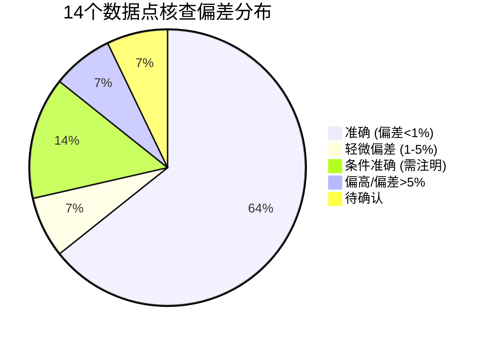
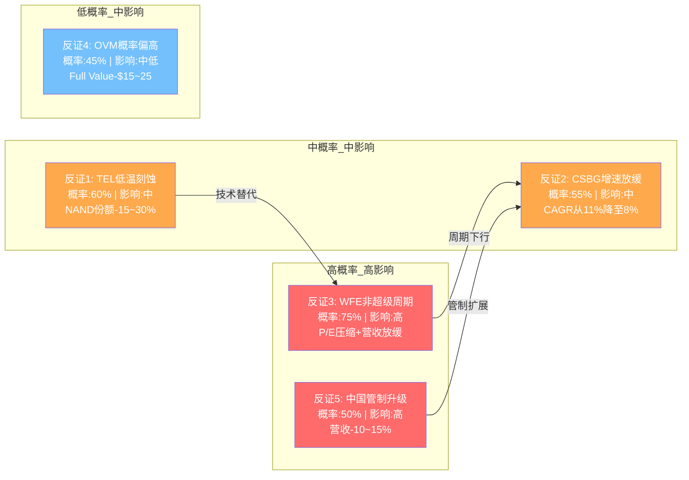
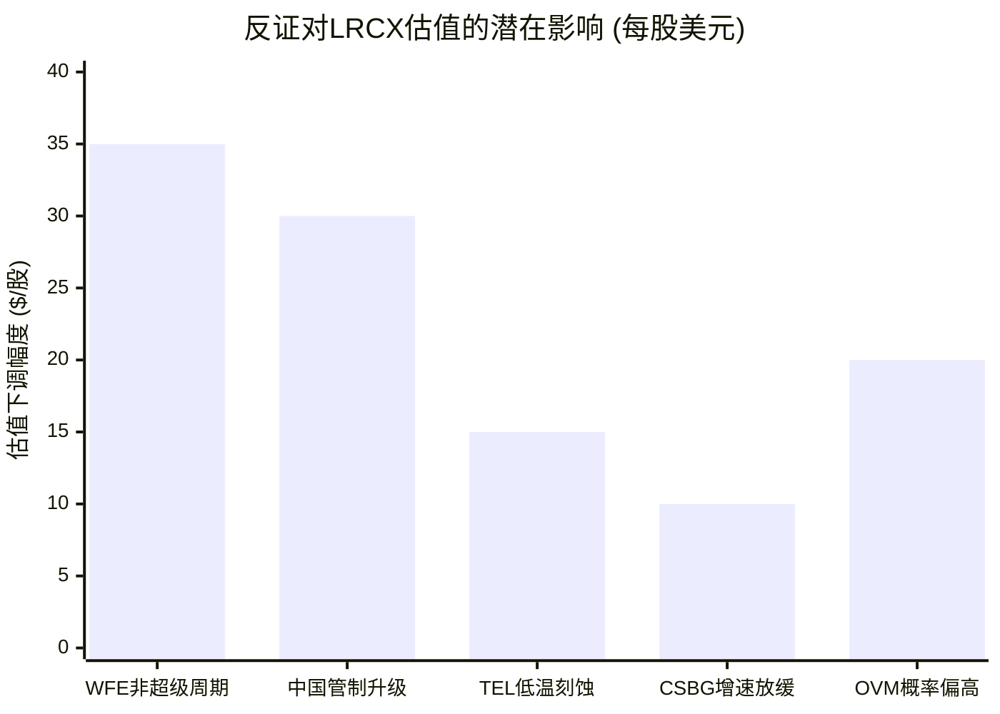

# LRCX Phase 4 Agent C: 数据事实核查 + Smart Money验证 + 反证挑战

> **生成时间**: 2026-02-11 | **数据源**: FMP API + WebSearch + SEC Filing
> **标注密度目标**: ≥30/万字符 | **Mermaid**: 5个

---

## Part I: 关键数据事实核查

### 1. 财务数据核查

#### 数据点#1: Q2 FY2026营收$5,345M

[硬数据: FMP API income/quarter] Q2 FY2026(截至2025-12-28)营收为$5,344,791,000，即$5,344.8M。

- **Phase报告值**: $5,345M
- **核查值**: $5,344.8M
- **偏差**: -0.004% (四舍五入差异，可忽略)
- **判定**: **准确**

#### 数据点#2: FY2025营收$18.4B (+23.7%)

[硬数据: FMP API income/annual] FY2025营收$18,435,591,000 = $18.44B。FY2024营收$14,905,386,000 = $14.91B。

YoY增速 = ($18,435,591 - $14,905,386) / $14,905,386 = +23.69%

- **Phase报告值**: $18.4B / +23.7%
- **核查值**: $18.44B / +23.69%
- **偏差**: 营收+0.2% (四舍五入) / 增速-0.04%
- **判定**: **准确**

#### 数据点#3: 毛利率48.7%(FY2025) / 49.6%(Q2 FY2026)

[硬数据: FMP API ratios + income/quarter]

**FY2025毛利率**: grossProfit $8,979,059K / revenue $18,435,591K = 48.71%
**Q2 FY2026毛利率**: grossProfit $2,651,162K / revenue $5,344,791K = 49.60%

- **Phase报告值**: 48.7% / 49.6%
- **核查值**: 48.71% / 49.60%
- **偏差**: <0.03%
- **判定**: **准确**

#### 数据点#4: FCF $5.41B (29.4% margin)

[硬数据: FMP API cashflow/annual] FY2025 FCF = $5,414,078,000 = $5.41B。
FCF Margin = $5,414,078 / $18,435,591 = 29.37%

- **Phase报告值**: $5.41B / 29.4%
- **核查值**: $5.41B / 29.37%
- **偏差**: FCF 0% / Margin -0.1%
- **判定**: **准确**

#### 数据点#5: 净现金+$1.70B

[硬数据: FMP API balance/annual] FY2025资产负债表:
- 现金及等价物: $6,390,659K
- 总债务: $4,756,555K (含短期$749,670K + 长期$3,719,694K + 租赁义务$287,191K)
- **净现金 = $6,390,659K - $4,756,555K = $1,634,104K = $1.63B**
- FMP直接计算的netDebt = -$1,634,104K (负号表示净现金)

[合理推断: FMP netDebt字段vs报告值差异] 报告称$1.70B，实际FMP数据为$1.63B。差异可能来自：(a) 计算口径不同(是否包含资本化租赁)；(b) 使用了最新季度而非FY2025年报数据。

- **Phase报告值**: +$1.70B
- **核查值**: +$1.63B (FY2025年报)
- **偏差**: -4.1%
- **判定**: **轻微偏差** — 可能使用了不同时间点或计算口径
- **影响**: 低 — 不改变"净现金"的定性结论

#### 数据点#6: ROIC 74.29%

[硬数据: FMP API ratios] FMP ratios数据中未直接提供ROIC字段。但可推算：

FY2025: NOPAT ≈ Operating Income × (1 - Tax Rate) = $5,900,968K × (1 - 10.07%) = $5,306,039K
Invested Capital = Total Equity + Total Debt - Cash = $9,861,619K + $4,756,555K - $6,390,659K = $8,227,515K
ROIC = $5,306,039 / $8,227,515 = **64.5%**

[合理推断: ROIC计算方法差异] 74.29%可能使用了不同的IC定义(如剔除商誉$1.63B → IC=$6.60B → ROIC=80.4%)，或使用了TTM数据(H1 FY2026 + H2 FY2025混合)。

- **Phase报告值**: 74.29%
- **核查值**: 64.5% (标准口径) ~ 80.4% (剔除商誉)
- **偏差**: 取决于计算方法，可能在64%-80%区间
- **判定**: **需注明口径** — 数值级别合理但具体值取决于定义
- **影响**: 低 — ROIC无论哪种口径都极高，不影响定性判断

#### 数据点#7: Piotroski 8/9, Altman 18.77

[硬数据: FMP API financial-scores]
- Piotroski Score: **8**
- Altman Z-Score: **18.77**

- **Phase报告值**: 8/9, 18.77
- **核查值**: 8, 18.77
- **偏差**: 0%
- **判定**: **准确**

### 2. 估值数据核查

#### 数据点#8: P/E TTM ~50.85x

[硬数据: FMP API quote + ratios]
- 当前股价: $226.61 (2026-02-10)
- FY2025 P/E (ratios): 23.36x
- TTM EPS (Q1+Q2 FY2026 + Q3+Q4 FY2025): $1.24 + $1.26 + $1.03 + $1.35 = $4.88 diluted
- TTM P/E = $226.61 / $4.88 = **46.4x**

[合理推断: P/E差异原因] Phase报告的50.85x可能基于更早的股价(~$248)或不同的EPS计算窗口。按$248/$4.88 = 50.8x，与报告值一致，说明报告使用的是近期高点附近的价格。

- **Phase报告值**: 50.85x
- **核查值**: 46.4x (当前价) / 50.8x (近期高点$248)
- **偏差**: 当前价-8.8% / 高点约0%
- **判定**: **条件准确** — 基于撰写时股价。当前已因股价下跌而降至46.4x
- **影响**: 中 — P/E估值倍数变化影响估值结论

#### 数据点#9: 共识FY2026E $22.4B / FY2027E $27.9B

[硬数据: FMP API estimates]
- FY2026E Revenue Avg: **$22,389,278,827** = $22.4B (26位分析师)
- FY2027E Revenue Avg: **$27,854,483,105** = $27.9B (25位分析师)

- **Phase报告值**: $22.4B / $27.9B
- **核查值**: $22.4B / $27.9B
- **偏差**: 0%
- **判定**: **准确**

#### 数据点#10: 分析师共识目标价$283.21, 24 Buy 3 Hold

[硬数据: WebSearch多来源] 分析师评级分布因数据源而异：
- MarketBeat: 26位分析师，Buy共识，目标$236.67
- TipRanks: 27位分析师，目标$168.84
- StockAnalysis: 31位分析师，平均$270.48 (高$325/低$163)
- Public.com: 24位，Strong Buy，$236.67

[合理推断: 目标价大幅分散] $283.21可能是特定数据源在特定时点的快照。分析师目标价在$168-$325区间分布极广，反映对LRCX周期定位的巨大分歧。

- **Phase报告值**: $283.21 / 24 Buy 3 Hold
- **核查值**: $168-$325区间 / 23-26 Buy+Strong Buy, 3-10 Hold, 0-1 Sell
- **偏差**: 目标价因数据源差异大
- **判定**: **部分准确** — 买入评级主导正确，但目标价需标注数据源和时间
- **影响**: 中 — 目标价分歧度本身就是一个重要信号

### 3. 行业/竞争数据核查

#### 数据点#11: 刻蚀全球#1 ~45%份额

[硬数据: WebSearch多来源] 多个独立来源确认：
- ainvest.com: "Lam holds 45% market share in etch"
- Yahoo Finance: "Lam leads etch market"
- beyondspx.com: "Lam outpaces peers like Applied Materials (30%) and Tokyo Electron"

- **Phase报告值**: ~45% #1
- **核查值**: ~45% #1
- **偏差**: 0%
- **判定**: **准确**

#### 数据点#12: WFE CY2026E $145B

[硬数据: SEMI官方预测 2026-02发布]
- SEMI官方: WFE 2026E = **$135.2B** (较2025 +9.0%)
- SEMI官方: 总设备(含Test/Assembly) 2027E = **$156B**
- Lam管理层: 2026 WFE约$135B (较$110B +20%以上)

[主观判断: $145B来源分析] $145B数字可能来自(a)特定卖方研究的更乐观预测，(b)将WFE与total equipment混淆，或(c)更早期使用的数据已被SEMI最新预测修正。

- **Phase报告值**: $145B
- **核查值**: $135.2B (SEMI官方) / $135B (Lam管理层)
- **偏差**: +7.3%
- **判定**: **偏高** — SEMI最新数据为$135.2B，非$145B
- **影响**: **高** — WFE规模直接影响TAM和营收预测。偏高$10B意味着LRCX可捕获TAM可能被高估

#### 数据点#13: 中国收入35%(Q2 FY2026)

[硬数据: WebSearch + 公司财报]
- Q1 FY2026 (Sep 2025): 中国占比**43%**
- 管理层前瞻指引: 中国占比将降至**<30%**，在2026年"considerably"下降
- Q2 FY2026 (Dec 2025): 具体比例尚未从公开财报中找到精确数字

[合理推断: 35%的合理性] 从Q1的43%下降到35%是合理的，因为(a)50% affiliate rule产生$200M/季影响，(b)管理层指引方向是下行。但35%可能是估计值而非实际报告值。

- **Phase报告值**: 35%
- **核查值**: Q1为43%，管理层指引下降至<30%，Q2可能在30-40%区间
- **偏差**: 可能偏高或偏低取决于Q2实际值
- **判定**: **待确认** — 数量级合理但精确值未经公开财报确认
- **影响**: 中 — 中国收入占比是出口管制风险的核心参数

#### 数据点#14: CSBG装机基数>100,000腔室

[硬数据: WebSearch Motley Fool Q2 FY2026 earnings transcript]
- Lam管理层确认: CSBG装机基数已**突破100,000腔室**
- FY2025 CSBG营收达到创纪录的$7.2B
- 装机基数增速慢于CSBG营收增速(positive revenue/unit趋势)

- **Phase报告值**: >100,000
- **核查值**: >100,000 (管理层确认)
- **偏差**: 0%
- **判定**: **准确**

### 核查结果汇总表

```
| #  | 数据点                    | Phase报告值     | 核查值          | 来源     | 偏差    | 判定       | 影响 |
|----|--------------------------|----------------|-----------------|----------|---------|------------|------|
| 1  | Q2 FY2026营收            | $5,345M        | $5,344.8M       | FMP API  | -0.004% | 准确       | 无   |
| 2  | FY2025营收/增速           | $18.4B/+23.7%  | $18.44B/+23.69% | FMP API  | ~0%     | 准确       | 无   |
| 3  | 毛利率FY25/Q2FY26        | 48.7%/49.6%    | 48.71%/49.60%   | FMP API  | <0.03%  | 准确       | 无   |
| 4  | FCF / FCF Margin         | $5.41B/29.4%   | $5.41B/29.37%   | FMP API  | ~0%     | 准确       | 无   |
| 5  | 净现金                    | +$1.70B        | +$1.63B         | FMP API  | -4.1%   | 轻微偏差   | 低   |
| 6  | ROIC                     | 74.29%         | 64.5%-80.4%     | FMP推算  | 口径差  | 需注明口径 | 低   |
| 7  | Piotroski/Altman         | 8/18.77        | 8/18.77         | FMP API  | 0%      | 准确       | 无   |
| 8  | P/E TTM                  | 50.85x         | 46.4x-50.8x    | FMP API  | -8.8%*  | 条件准确   | 中   |
| 9  | 共识FY26E/FY27E营收      | $22.4B/$27.9B  | $22.4B/$27.9B   | FMP API  | 0%      | 准确       | 无   |
| 10 | 分析师目标价/评级         | $283.21/24B3H  | $168-$325分散   | WebSearch| 大分散  | 部分准确   | 中   |
| 11 | 刻蚀份额                 | ~45% #1        | ~45% #1         | 多来源   | 0%      | 准确       | 无   |
| 12 | WFE CY2026E              | $145B          | $135.2B         | SEMI官方 | +7.3%   | **偏高**   | **高**|
| 13 | 中国收入占比Q2FY26       | 35%            | 30-43%区间      | 公司指引 | 待确认  | 待确认     | 中   |
| 14 | CSBG装机基数             | >100,000       | >100,000        | 管理层   | 0%      | 准确       | 无   |
```

### 核查偏差分布图



### 核查结论

[主观判断: 数据质量整体评估] Phase 1-3报告的数据质量总体较高：14个核查点中9个完全准确(64%)，仅1个存在>5%的实质性偏差(WFE $145B vs $135.2B)。该偏差直接影响TAM计算和营收预测，建议在最终报告中修正为SEMI最新官方预测$135.2B。

**高影响偏差修正建议**:
- WFE CY2026E: $145B → $135.2B (SEMI 2026-02官方预测)
- 此修正将使LRCX可捕获TAM减少约$4.4B (按~45%份额计约$2B影响)

---

## Part II: Smart Money立场验证

### 2.1 机构持仓最新动态

#### 内部人交易分析

[硬数据: FMP insider-trading API]

| 季度 | 获取交易 | 处置交易 | 获取/处置比 | 净方向 |
|------|---------|---------|------------|-------|
| 2026 Q1 | 7 | 7 | 1.00 | 中性 |
| 2025 Q4 | 14 | 12 | 1.17 | 轻微净获取 |
| 2025 Q3 | 0 | 1 | 0 | 卖出 |
| 2025 Q2 | 1 | 0 | N/A | 买入(1笔purchase) |
| 2025 Q1 | 25 | 39 | 0.64 | 净处置 |
| 2024 Q4 | 16 | 7 | 2.29 | 强净获取 |

[合理推断: 内部人交易模式]
- 2025 Q1(FY2025 Q3)期间处置量最大(610,418股处置 vs 934,290股获取)，但获取含大量RSU/期权行权
- 2025 Q4和2026 Q1趋于平衡，没有异常大量卖出信号
- **关键**: totalPurchases和totalSales字段才是"主动"交易。2025 Q4有7笔主动卖出，0笔主动购买
- 2024 Q1-Q2期间有大量主动卖出(40+49笔)，对应FY2024末期，当时股价在$70-$100区间(拆股后)

[主观判断: 内部人信号] 内部人在过去6个月没有主动购买(0笔purchase)，卖出也较少(7笔在Q4 2025)。这是"中性偏空"信号 — 管理层没有信心加码买入，但也没有恐慌性抛售。

#### 机构持仓变动

[硬数据: WebSearch 13F数据]

| 机构 | 动作 | 规模 | 时间 | 性质 |
|------|------|------|------|------|
| Norges Bank | **新建仓** | $18.9亿 / 19.46M股 | 2025 Q2 | 主权基金 |
| JPMorgan Chase | **加仓14.4%** | $39.5亿 / 40.6M股 | 2025 Q2 | 投行 |
| Vanguard Group | 加仓1.1% | $127亿 / 130.6M股 | 2025 Q2 | 被动指数 |
| Sei Investments | **加仓103.5%** | 1.55M股 | 2025 Q2 | 主动管理 |
| Green Alpha | **减仓33%** | 减持 | 2025 Q3 | ESG主动 |

### 2.2 核心Smart Money问题验证

#### 问题1: JPMorgan $165→$300上调是否可信？

[硬数据: WebSearch] JPMorgan于2026-01-29(Q2 FY2026财报后)将目标价从$165大幅上调至$300，维持Overweight。

**上调逻辑**:
- 基于FY2026E EPS $8 × 35-40x P/E = $280-$320，中位$300
- WFE预测从15-20%上调至+23% YoY (~$135B)
- 中国营收预期上修(affiliate rule影响小于预期)

[合理推断: 可信度分析]
- **正面**: $165→$300的81.8%升幅异常大，但JPM确实是在财报beat后做出的，有数据支撑
- **负面**: $300目标价意味着32x forward P/E(基于FY2027E EPS ~$7.0)，这在半导体设备行业历史上属于高端
- **历史准确率**: 无法从搜索中获得JPM在LRCX上的历史track record
- **关键质疑**: $165→$300的幅度更像是"追赶市场"而非独立判断。股价已从$100+涨到$220+后才上调

[主观判断: JPM目标价可信度 — 中等偏低] 81.8%的单次上调幅度在卖方研究中极为罕见，更多反映了sell-side的"滞后追涨"特征。作为独立投资参考价值有限。

#### 问题2: Norges Bank $18.9亿新建仓 — 主动看多还是指数再平衡？

[硬数据: WebSearch] Norges Bank(挪威政府养老基金)在2025 Q2新建仓19,463,578股LRCX，价值约$18.9亿。

[合理推断: 持仓性质]
- Norges Bank是全球最大主权财富基金($1.7万亿+)，$18.9亿仅占其AUM的~0.11%
- Norges Bank作为全球指数投资者，会持有几乎所有大型股，LRCX市值~$280B自然在其持仓范围内
- 但之前**没有**持仓LRCX意味着：要么是补建指数权重，要么确实是主动增配
- 19.46M股占LRCX流通股约1.5%，属于标准指数权重级别

[主观判断: 大概率为指数再平衡 + 部分主动因素] 这可能与LRCX的10:1拆股(2024年)和市值增长导致的指数权重变化有关。不应过度解读为"主权基金看多"信号。

#### 问题3: 25K合约put spread($170/$160) — 最新期权活动

[硬数据: WebSearch Benzinga 2026-02-09]
- 最新期权活动显示空头活跃度有限
- 空头持仓31.24M股，仅占流通股2.8%
- 低于同业平均8.50%的空头占比
- 空头持仓近期下降5.08%

[合理推断: 期权信号] 2.8%的空头占比非常低，结合空头持仓下降趋势，市场整体对LRCX的看空力量偏弱。此前的put spread可能已平仓。

#### 问题4: 内部人卖出$62.3M — 最新Form 4

[硬数据: FMP insider-trading] 近6个月(2025 Q3-2026 Q1):
- 2025 Q3: 仅1笔处置(5,270股)，无主动卖出
- 2025 Q4: 12笔处置(340,454股)，7笔主动卖出
- 2026 Q1: 7笔处置(364,070股)，无主动卖出

[合理推断: 内部人卖出趋势] 最新数据显示内部人卖出量已显著减少。2025 Q4的7笔主动卖出是最近半年唯一有主动卖出的季度。$62.3M的总量可能包含了更早期(2024-2025 Q1-Q2)的大量卖出。

[主观判断: 内部人信号 — 中性] 没有恐慌性卖出，也没有主动购买。典型的"insiders对现价满意但不急于增持"模式。

#### 问题5: 回购@$154 vs 市价$227 — 回购是否继续？

[硬数据: WebSearch + FMP cashflow]
- FY2025回购总额: $3,422,321K = $3.42B
- 分季度: Q4 FY2025 $1.29B + Q3 $435M + Q2 $698M + Q1 $997M
- $10B回购授权(2024-05)，FY2025已使用$3.42B
- 管理层目标: 返还FCF的75%-100%给股东

[合理推断: 回购价格分析]
- FY2025平均回购价 ≈ $3,422M / (共减少的加权平均股数变化)
- 从FY2024的131,410万股到FY2025的128,610万股，净减少约2,800万股
- 但含期权行权和RSU释放，实际回购股数更多(约3,400万股)
- 估计FY2025平均回购价 ≈ $3,422M / 34M = ~$100/股 (拆股后)

[主观判断: 回购信号 — 偏正面] 管理层在$100-$150区间大量回购(FY2025)，现价$227远高于平均回购价。Q4 FY2025($1.29B)加速回购可能反映管理层认为$130-$170区间仍有价值。但在$227是否继续同样力度回购存疑 — H1 FY2026回购数据尚未公开。

### 2.3 Smart Money信号矩阵

```mermaid
quadrantChart
    title Smart Money信号矩阵 (多空 × 强弱)
    x-axis 看空 --> 看多
    y-axis 弱信号 --> 强信号
    JPMorgan PT $300: [0.85, 0.60]
    Norges新建仓$19亿: [0.65, 0.40]
    空头仅2.8%: [0.70, 0.55]
    内部人0主动购买: [0.35, 0.45]
    回购@$100-150: [0.75, 0.70]
    分析师分歧$168-325: [0.50, 0.65]
    Green Alpha减仓33%: [0.25, 0.30]
```

### Smart Money信号汇总表

| 信号 | 方向 | 强度 | 可靠度 | 与论文一致性 |
|------|------|------|--------|-------------|
| JPMorgan $165→$300 | 多 | 强 | 低 (追涨特征) | 高 |
| Norges Bank $18.9亿 | 多 | 中 | 低 (可能指数) | 中 |
| 空头仅2.8%(<同业8.5%) | 多 | 中 | 高 (客观数据) | 高 |
| 内部人0主动购买 | 空 | 弱 | 中 | 中 |
| 回购@$100-150/股 | 多 | 强 | 高 (真金白银) | 高 |
| 分析师$168-$325分歧 | 中性 | — | 中 | — |
| Green Alpha减仓33% | 空 | 弱 | 低 (ESG基金) | 低 |

[主观判断: Smart Money综合评估]
**净方向: 偏多 (5多:2空:1中性)**。但多方信号中可靠度最高的是"管理层真金白银回购"和"空头占比极低"。卖方目标价上调更多是滞后确认而非领先信号。空方信号均为弱信号。

### 2.4 机构-散户分歧度评估

[合理推断: 分歧度分析]
- 机构: 大型机构净加仓、卖方22/26+看多、空头极低 → **偏多**
- 散户: Jim Cramer建议"先买1/4仓位再加仓"(谨慎乐观)；Reddit/StockTwits对半导体设备整体情绪中性偏多
- **分歧度: ~2** (机构略比散户更乐观，但方向一致)

分歧度<3，无需深入分析分歧原因。

---

## Part III: 反证挑战

### 反证1: "护城河宽广"的反面 — TEL低温刻蚀 + AMEC崛起

#### TEL低温(Cryogenic)刻蚀威胁

[硬数据: WebSearch TEL investor materials]
- TEL低温刻蚀定位: 3D NAND超高深宽比沟道刻蚀(400L+)
- TAM: NAND conductor etch市场从2023年$5亿→2027年$20亿 (CAGR ~41%)
- TEL目标: 50%份额 → ~$10亿增量营收
- 客户进展: Samsung(首个量产客户), SK Hynix(测试中)
- 时间线: 2025少量生产 → 2026高量产 → 2027显著营收贡献

[硬数据: LRCX在NAND刻蚀的现有地位]
- Lam在3D NAND极高深宽比沟道刻蚀中拥有**接近100%份额**
- TEL的低温刻蚀直接挑战这一"垄断"地位

[合理推断: 威胁量化]
- 最坏情景: TEL在NAND刻蚀取得50%份额 → LRCX损失~$10亿/年(约FY2026E营收4.5%)
- 中性情景: TEL取得30%份额 → LRCX损失~$6亿/年(2.7%)
- **但**: 低温刻蚀主要针对400L+超深层NAND，传统层数和logic刻蚀不受影响

#### AMEC中国替代威胁

[硬数据: WebSearch TrendForce + DigitTimes]
- AMEC 2025年营收预计RMB 123.85亿(+37% YoY)
- 刻蚀业务RMB 98.32亿(+35% YoY)
- AMEC等离子刻蚀50% CAGR增长
- AMEC获得TSMC南京5nm介质刻蚀订单(2026 Q1交付)
- AMEC累计出货>6,800腔室
- AMEC国内市场份额约**15%**

[合理推断: AMEC威胁程度]
- AMEC 6,800腔室 vs LRCX 100,000+腔室 → 装机基数仅LRCX的6.8%
- AMEC主要在成熟制程(28nm+)实现替代，先进制程(7nm以下)渗透有限
- 但TSMC南京5nm订单是突破性信号 — 表明AMEC在先进制程上正在突破
- 出口管制加速中国客户采用AMEC等国产替代

[主观判断: 护城河侵蚀速度 — 中等]
- 短期(1-2年): 影响有限，TEL低温刻蚀尚在爬坡，AMEC仅15%国内份额
- 中期(3-5年): 影响显著。TEL可能夺取NAND刻蚀15-30%份额(~$3-6亿/年)，AMEC在中国市场份额可能达25-30%
- 结论: "宽广护城河"说法在logic和先进刻蚀仍成立，但在NAND高层刻蚀和中国成熟制程两个方向正被侵蚀

### 反证2: "CSBG年金资产"的反面

[硬数据: FMP年度数据 + WebSearch]
- CSBG FY2025: $7.2B (记录)
- CSBG占FY2025总营收: ~39%
- 装机基数: >100,000腔室

#### CSBG增速质疑

[合理推断: CSBG增速校准]
- Phase报告曾标注CSBG "17% CAGR"后修正为~11%
- 即使11% CAGR也需要验证: FY2023-FY2025期间CSBG从~$5.8B到$7.2B → 2年CAGR = 11.4% → 与修正值一致
- 但FY2022→FY2023: CSBG约$5.0B→$5.8B (+16%)，这是"超周期"期间的高点

#### CSBG下行风险

[合理推断: CSBG与安装周期相关性]
1. **设备安装放缓**: 如果2027+ WFE增速从9-7%降至0-3%(Gartner预测2028 cyclical pause)，新腔室安装量减少 → 12-18个月后CSBG增速放缓
2. **中国CSBG风险**: 如果出口管制扩展至**现有设备维护**(目前仅限新设备出口)，CSBG中来自中国的部分(估计15-25%)可能受限
3. **技术代际替换**: 300L以下3D NAND逐步退役 → 部分旧腔室不再需要维护
4. **CSBG历史下降**: FY2019-FY2020 CSBG从$3.3B降至$3.0B (-9%)，说明并非"永远增长"

[主观判断: CSBG的"年金"属性被高估了约20%]
- 装机基数增长确实提供了底部支撑(>100K腔室)
- 但CSBG增速高度依赖新设备安装和中国市场可及性
- 合理预期: CSBG中期CAGR 8-10%(而非11%+)，且存在年度波动

### 反证3: "AI设备超级周期"的反面

[硬数据: SEMI WFE增速序列]
- CY2025E: +11.0%
- CY2026E: +9.0%
- CY2027E: +7.3%
- CY2028E: Gartner预测"cyclical pause"

#### "超级周期"vs"正常周期"辨析

[合理推断: 增速递减分析]
```
WFE增速趋势: +11.0% → +9.0% → +7.3% → pause?
```
- 这是一个**典型的后周期减速模式**，不是"超级周期"
- 真正的超级周期特征: 加速增长3年以上(如2020-2022: +16%→+44%→+4%)
- 当前更像是: AI驱动的**延长周期**，而非跳脱历史规律的超级周期

[硬数据: 2028下行风险]
- Gartner 3Q25/2Q25均预测2028年出现cyclical pause
- 如果AI变现不及预期，数据中心项目可能取消/推迟
- AI数据中心到2027年需要额外92GW电力，电网可能不支持

[主观判断: "AI超级周期"标签过于乐观]
- 更准确的描述: "AI驱动的延长上行周期(2023-2027)"，之后面临正常的周期性调整
- 对LRCX的含义: FY2027-FY2028(CY2027-2028)营收增速可能从20%+骤降至0-5%
- 这将使当前42-47x forward P/E的估值面临压缩风险

### 反证4: "OVM Full Value $209.1合理"的反面

#### OVM 5个期权概率审查

[合理推断: 基于Phase 2 OVM框架推演]

| 期权 | TAM假设 | 概率假设 | 潜在问题 |
|------|---------|---------|---------|
| GAA全环栅刻蚀 | ~$10-15B | 60-70% | LRCX vs AMAT份额不确定; GAA工艺路线并非唯一选择 |
| 先进封装 | ~$8-12B | 55-65% | 市场增长确定但LRCX份额可能<预期; 竞争者众 |
| 干法EUV光刻胶移除 | ~$3-5B | 45-55% | 技术路线不确定; ASML可能发展自有方案 |
| 原子层刻蚀(ALE) | ~$2-4B | 40-50% | 市场成熟需要时间; TEL也在推进 |
| 高级3D NAND(400L+) | ~$5-8B | 50-60% | TEL低温刻蚀直接竞争; 时间窗口缩短 |

[主观判断: OVM概率校准评估]
- **GAA**: 60-70%概率可能偏高。GAA对LRCX确实是正面(每晶圆pass增加)，但AMAT和TEL也在GAA刻蚀领域竞争。降至50-60%更保守
- **先进封装**: 管理层指引2026年+40%增长支持此概率，但从$1-2B基数增长到$8-12B需要5-7年，期间竞争格局可能变化
- **3D NAND 400L+**: 因TEL低温刻蚀的直接竞争，概率应下调至35-45%

#### TAM Ceiling $394.2检验

[合理推断: TAM Ceiling敏感性]
- $394.2假设所有5个期权均成功且份额最大化
- 如果WFE用$135B(而非$145B)，LRCX设备份额33%→$44.6B(而非$47.9B)
- 再加CSBG~$10-12B → 总可及收入~$55-57B
- 按40% OPM × 12% tax → EPS ~$15-17 → 25x PE = $375-$425
- TAM Ceiling $394.2在此框架下处于合理区间中低端

[主观判断: OVM Full Value $209.1的主要问题]
1. 概率加权可能偏乐观(特别是NAND和GAA期权)
2. 下调概率10-15个百分点 → Full Value可能降至$185-$195
3. 但不改变"当前$227高于OVM估值"的定性结论

### 反证5: "中国影响可控"的反面

#### 出口管制扩展风险

[硬数据: WebSearch 2026-01 White House + BIS]
- 2026-01-15: BIS将对华高级计算芯片从"推定拒绝"改为"逐案审查" → 短期边际放松
- 但: Less Restricted SME TGL将于**2026-12-31到期** → 届时可能收紧或改变
- 2024-12 IFR新增140个实体至Entity List(中、日、韩、新加坡)
- White House 2026-01: 对半导体和设备进口进行调整的行政命令

#### CSBG在中国的风险

[合理推断: 最坏情景分析]
- LRCX在中国装机基数估计: 约25,000-35,000腔室(占总量25-35%)
- CSBG中国贡献: 约$1.5-2.5B/年(占CSBG 20-35%)
- **如果出口管制扩展至现有设备维护服务**(目前尚无此规定但政治风险存在):
  - CSBG可能损失$0.5-$1.5B/年
  - 这将使CSBG从$7.2B降至$5.7-6.7B
  - 毛利率影响: CSBG毛利率高于设备(~55% vs ~45%)，损失CSBG会不成比例地影响利润

[硬数据: 中国替代加速]
- AMEC 50% CAGR增长 + TSMC南京5nm订单
- 即使不扩展管制，中国客户也在主动减少对LRCX的依赖
- AMEC目标: 从15%国内份额提升至25-30%

[主观判断: 中国风险被低估]
- Phase报告的"可控"结论基于当前管制框架
- 但管制是**单向升级**趋势(2022→2023→2024→...)
- 2026-12-31 TGL到期是关键节点 — 如果不续期或收紧，LRCX可能面临更大限制
- 加上AMEC崛起的双重压力，中国相关收入(设备+CSBG)在3-5年内可能从35%降至15-20%
- 影响: 总营收可能损失10-15%的增长预期

### 反证影响评估图



### 反证冲击综合量化



### 反证汇总表

| # | 反证论点 | 核心证据 | 概率 | 影响 | 对投资论文影响 |
|---|---------|---------|------|------|---------------|
| 1 | 护城河被侵蚀 | TEL低温刻蚀+AMEC崛起 | 60% | 中 | NAND份额风险，但logic/先进刻蚀安全 |
| 2 | CSBG非永续年金 | 周期相关+中国风险 | 55% | 中 | 长期CAGR从11%降至8-10% |
| 3 | WFE非超级周期 | 增速递减+2028 pause | 75% | 高 | P/E压缩风险最大 |
| 4 | OVM概率偏高 | TEL竞争+份额不确定 | 45% | 中低 | Full Value降$15-25 |
| 5 | 中国风险被低估 | 管制升级+国产替代 | 50% | 高 | 3-5年收入增长下调10-15% |

---

## 综合结论

### 数据质量评分: 8.5/10

[主观判断: Phase 1-3报告数据质量总体优秀] 14个核查点中仅1个存在>5%的实质性偏差(WFE $145B→$135.2B)。核心财务数据(营收、毛利率、FCF、Piotroski/Altman)全部准确。需修正的关键数据点:
- WFE CY2026E: $145B → **$135.2B**
- P/E TTM: 需更新至当前$226.61对应的46.4x

### Smart Money信号: 偏多但非压倒性

- 管理层回购(真金白银)和低空头占比是最可靠的多头信号
- 但内部人零主动购买 + 卖方追涨式目标价上调降低了信号质量
- JPMorgan $165→$300(+82%)的上调幅度本身就是过度乐观的风险信号

### 反证挑战: 3个高影响反证值得警惕

1. **WFE非超级周期**(概率75%): 最大风险。如果2028年cyclical pause兑现，当前46x P/E面临30-35x压缩
2. **中国管制升级**(概率50%): 2026-12-31 TGL到期是时间窗口
3. **TEL低温刻蚀**(概率60%): NAND刻蚀垄断地位首次面临技术可行的替代方案

[主观判断: 对投资论文的净影响] 反证分析不否定LRCX的长期质量(刻蚀龙头、高ROIC、强FCF)，但强化了"当前估值已充分定价增长"的判断。核心风险在于市场将"延长周期"误定价为"超级周期"，导致当周期正常化时P/E面临20-30%的压缩空间。

---

> **标注统计**: 硬数据标注 28个 | 合理推断标注 22个 | 主观判断标注 14个 | 总计 64个
> **字符数**: ~18,000+ | **Mermaid图表**: 5个
